```python
from fastai.imports import *
from fastai.structured import *

from pandas_summary import DataFrameSummary
from sklearn.ensemble import RandomForestRegressor, RandomForestClassifier
from IPython.display import display

from sklearn import metrics
```


```python
df_raw = pd.read_json("../../combined.json")
```


```python
len(df_raw)
```


    1573


```python
df_raw = df_raw[df_raw.type == 'Ride']
```


```python
len(df_raw)
```


    1388


```python
df_raw.describe()
```


<div>
<style scoped>
    .dataframe tbody tr th:only-of-type {
        vertical-align: middle;
    }

    .dataframe tbody tr th {
        vertical-align: top;
    }

    .dataframe thead th {
        text-align: right;
    }
</style>
<table border="1" class="dataframe">
  <thead>
    <tr style="text-align: right;">
      <th></th>
      <th>achievement_count</th>
      <th>athlete_count</th>
      <th>average_cadence</th>
      <th>average_heartrate</th>
      <th>average_speed</th>
      <th>average_temp</th>
      <th>average_watts</th>
      <th>comment_count</th>
      <th>device_watts</th>
      <th>distance</th>
      <th>...</th>
      <th>pr_count</th>
      <th>resource_state</th>
      <th>start_latitude</th>
      <th>start_longitude</th>
      <th>suffer_score</th>
      <th>total_elevation_gain</th>
      <th>total_photo_count</th>
      <th>upload_id</th>
      <th>utc_offset</th>
      <th>workout_type</th>
    </tr>
  </thead>
  <tbody>
    <tr>
      <th>count</th>
      <td>1388.000000</td>
      <td>1388.000000</td>
      <td>47.000000</td>
      <td>58.000000</td>
      <td>1388.000000</td>
      <td>31.000000</td>
      <td>1350.000000</td>
      <td>1388.000000</td>
      <td>1388.0</td>
      <td>1388.000000</td>
      <td>...</td>
      <td>1388.000000</td>
      <td>1388.0</td>
      <td>1352.000000</td>
      <td>1352.000000</td>
      <td>58.000000</td>
      <td>1388.000000</td>
      <td>1388.000000</td>
      <td>1.351000e+03</td>
      <td>1388.000000</td>
      <td>1274.000000</td>
    </tr>
    <tr>
      <th>mean</th>
      <td>1.206052</td>
      <td>1.074207</td>
      <td>63.038298</td>
      <td>138.756897</td>
      <td>5.415999</td>
      <td>17.032258</td>
      <td>96.532519</td>
      <td>0.373199</td>
      <td>0.0</td>
      <td>9714.698415</td>
      <td>...</td>
      <td>0.504323</td>
      <td>2.0</td>
      <td>55.740214</td>
      <td>-4.065348</td>
      <td>113.103448</td>
      <td>47.067939</td>
      <td>0.152017</td>
      <td>9.621128e+08</td>
      <td>2663.688761</td>
      <td>7.167975</td>
    </tr>
    <tr>
      <th>std</th>
      <td>4.419028</td>
      <td>0.283348</td>
      <td>5.814171</td>
      <td>13.729123</td>
      <td>0.733959</td>
      <td>5.570660</td>
      <td>17.005167</td>
      <td>1.498060</td>
      <td>0.0</td>
      <td>15149.881908</td>
      <td>...</td>
      <td>2.042267</td>
      <td>0.0</td>
      <td>2.147835</td>
      <td>4.195215</td>
      <td>102.446510</td>
      <td>106.502510</td>
      <td>0.676586</td>
      <td>6.165093e+08</td>
      <td>1896.950445</td>
      <td>4.509400</td>
    </tr>
    <tr>
      <th>min</th>
      <td>0.000000</td>
      <td>1.000000</td>
      <td>47.500000</td>
      <td>74.000000</td>
      <td>0.000000</td>
      <td>3.000000</td>
      <td>22.500000</td>
      <td>0.000000</td>
      <td>0.0</td>
      <td>21.300000</td>
      <td>...</td>
      <td>0.000000</td>
      <td>2.0</td>
      <td>-16.920000</td>
      <td>-13.510000</td>
      <td>9.000000</td>
      <td>0.000000</td>
      <td>0.000000</td>
      <td>5.392029e+07</td>
      <td>0.000000</td>
      <td>0.000000</td>
    </tr>
    <tr>
      <th>25%</th>
      <td>0.000000</td>
      <td>1.000000</td>
      <td>61.550000</td>
      <td>131.900000</td>
      <td>5.143250</td>
      <td>14.500000</td>
      <td>85.700000</td>
      <td>0.000000</td>
      <td>0.0</td>
      <td>6001.625000</td>
      <td>...</td>
      <td>0.000000</td>
      <td>2.0</td>
      <td>55.840000</td>
      <td>-4.280000</td>
      <td>48.000000</td>
      <td>12.500000</td>
      <td>0.000000</td>
      <td>4.344789e+08</td>
      <td>0.000000</td>
      <td>0.000000</td>
    </tr>
    <tr>
      <th>50%</th>
      <td>0.000000</td>
      <td>1.000000</td>
      <td>64.100000</td>
      <td>141.400000</td>
      <td>5.522000</td>
      <td>17.000000</td>
      <td>96.400000</td>
      <td>0.000000</td>
      <td>0.0</td>
      <td>6167.500000</td>
      <td>...</td>
      <td>0.000000</td>
      <td>2.0</td>
      <td>55.860000</td>
      <td>-4.280000</td>
      <td>65.500000</td>
      <td>24.600000</td>
      <td>0.000000</td>
      <td>7.941077e+08</td>
      <td>3600.000000</td>
      <td>10.000000</td>
    </tr>
    <tr>
      <th>75%</th>
      <td>1.000000</td>
      <td>1.000000</td>
      <td>66.900000</td>
      <td>147.925000</td>
      <td>5.816250</td>
      <td>19.000000</td>
      <td>108.300000</td>
      <td>0.000000</td>
      <td>0.0</td>
      <td>6581.950000</td>
      <td>...</td>
      <td>0.000000</td>
      <td>2.0</td>
      <td>55.860000</td>
      <td>-4.230000</td>
      <td>151.000000</td>
      <td>49.300000</td>
      <td>0.000000</td>
      <td>1.467242e+09</td>
      <td>3600.000000</td>
      <td>10.000000</td>
    </tr>
    <tr>
      <th>max</th>
      <td>108.000000</td>
      <td>3.000000</td>
      <td>70.300000</td>
      <td>166.800000</td>
      <td>14.270000</td>
      <td>31.000000</td>
      <td>142.400000</td>
      <td>37.000000</td>
      <td>0.0</td>
      <td>170918.000000</td>
      <td>...</td>
      <td>36.000000</td>
      <td>2.0</td>
      <td>57.480000</td>
      <td>145.780000</td>
      <td>459.000000</td>
      <td>1581.000000</td>
      <td>8.000000</td>
      <td>2.143090e+09</td>
      <td>36000.000000</td>
      <td>12.000000</td>
    </tr>
  </tbody>
</table>
<p>8 rows × 31 columns</p>
</div>


```python
df_raw.head()
```


<div>
<style scoped>
    .dataframe tbody tr th:only-of-type {
        vertical-align: middle;
    }

    .dataframe tbody tr th {
        vertical-align: top;
    }

    .dataframe thead th {
        text-align: right;
    }
</style>
<table border="1" class="dataframe">
  <thead>
    <tr style="text-align: right;">
      <th></th>
      <th>achievement_count</th>
      <th>athlete</th>
      <th>athlete_count</th>
      <th>average_cadence</th>
      <th>average_heartrate</th>
      <th>average_speed</th>
      <th>average_temp</th>
      <th>average_watts</th>
      <th>comment_count</th>
      <th>commute</th>
      <th>...</th>
      <th>suffer_score</th>
      <th>timezone</th>
      <th>total_elevation_gain</th>
      <th>total_photo_count</th>
      <th>trainer</th>
      <th>type</th>
      <th>upload_id</th>
      <th>utc_offset</th>
      <th>visibility</th>
      <th>workout_type</th>
    </tr>
  </thead>
  <tbody>
    <tr>
      <th>0</th>
      <td>4</td>
      <td>{'id': 1955887, 'resource_state': 1}</td>
      <td>1</td>
      <td>NaN</td>
      <td>NaN</td>
      <td>5.983</td>
      <td>NaN</td>
      <td>107.7</td>
      <td>0</td>
      <td>False</td>
      <td>...</td>
      <td>NaN</td>
      <td>(GMT+00:00) Europe/London</td>
      <td>210.5</td>
      <td>0</td>
      <td>False</td>
      <td>Ride</td>
      <td>64627003.0</td>
      <td>3600</td>
      <td>everyone</td>
      <td>NaN</td>
    </tr>
    <tr>
      <th>1</th>
      <td>10</td>
      <td>{'id': 1955887, 'resource_state': 1}</td>
      <td>1</td>
      <td>NaN</td>
      <td>NaN</td>
      <td>6.013</td>
      <td>NaN</td>
      <td>108.1</td>
      <td>0</td>
      <td>False</td>
      <td>...</td>
      <td>NaN</td>
      <td>(GMT+00:00) Europe/London</td>
      <td>245.8</td>
      <td>0</td>
      <td>False</td>
      <td>Ride</td>
      <td>63419300.0</td>
      <td>3600</td>
      <td>everyone</td>
      <td>NaN</td>
    </tr>
    <tr>
      <th>2</th>
      <td>16</td>
      <td>{'id': 1955887, 'resource_state': 1}</td>
      <td>1</td>
      <td>NaN</td>
      <td>NaN</td>
      <td>6.540</td>
      <td>NaN</td>
      <td>120.9</td>
      <td>2</td>
      <td>False</td>
      <td>...</td>
      <td>NaN</td>
      <td>(GMT+00:00) Europe/London</td>
      <td>227.9</td>
      <td>0</td>
      <td>False</td>
      <td>Ride</td>
      <td>62880434.0</td>
      <td>3600</td>
      <td>everyone</td>
      <td>NaN</td>
    </tr>
    <tr>
      <th>3</th>
      <td>2</td>
      <td>{'id': 1955887, 'resource_state': 1}</td>
      <td>1</td>
      <td>NaN</td>
      <td>NaN</td>
      <td>6.320</td>
      <td>NaN</td>
      <td>111.8</td>
      <td>7</td>
      <td>False</td>
      <td>...</td>
      <td>NaN</td>
      <td>(GMT+00:00) Europe/London</td>
      <td>271.4</td>
      <td>0</td>
      <td>False</td>
      <td>Ride</td>
      <td>62010103.0</td>
      <td>3600</td>
      <td>everyone</td>
      <td>NaN</td>
    </tr>
    <tr>
      <th>4</th>
      <td>2</td>
      <td>{'id': 1955887, 'resource_state': 1}</td>
      <td>1</td>
      <td>NaN</td>
      <td>NaN</td>
      <td>6.091</td>
      <td>NaN</td>
      <td>94.7</td>
      <td>8</td>
      <td>False</td>
      <td>...</td>
      <td>NaN</td>
      <td>(GMT+00:00) Europe/London</td>
      <td>119.0</td>
      <td>0</td>
      <td>False</td>
      <td>Ride</td>
      <td>61331055.0</td>
      <td>3600</td>
      <td>everyone</td>
      <td>NaN</td>
    </tr>
  </tbody>
</table>
<p>5 rows × 55 columns</p>
</div>


```python
df_raw.drop(['map', 'athlete', 'start_latlng', 'end_latlng', 'upload_id'], axis=1, inplace=True)
```


```python
df_raw.describe()
```


<div>
<style scoped>
    .dataframe tbody tr th:only-of-type {
        vertical-align: middle;
    }

    .dataframe tbody tr th {
        vertical-align: top;
    }

    .dataframe thead th {
        text-align: right;
    }
</style>
<table border="1" class="dataframe">
  <thead>
    <tr style="text-align: right;">
      <th></th>
      <th>achievement_count</th>
      <th>athlete_count</th>
      <th>average_cadence</th>
      <th>average_heartrate</th>
      <th>average_speed</th>
      <th>average_temp</th>
      <th>average_watts</th>
      <th>comment_count</th>
      <th>device_watts</th>
      <th>distance</th>
      <th>...</th>
      <th>photo_count</th>
      <th>pr_count</th>
      <th>resource_state</th>
      <th>start_latitude</th>
      <th>start_longitude</th>
      <th>suffer_score</th>
      <th>total_elevation_gain</th>
      <th>total_photo_count</th>
      <th>utc_offset</th>
      <th>workout_type</th>
    </tr>
  </thead>
  <tbody>
    <tr>
      <th>count</th>
      <td>1388.000000</td>
      <td>1388.000000</td>
      <td>47.000000</td>
      <td>58.000000</td>
      <td>1388.000000</td>
      <td>31.000000</td>
      <td>1350.000000</td>
      <td>1388.000000</td>
      <td>1388.0</td>
      <td>1388.000000</td>
      <td>...</td>
      <td>1388.0</td>
      <td>1388.000000</td>
      <td>1388.0</td>
      <td>1352.000000</td>
      <td>1352.000000</td>
      <td>58.000000</td>
      <td>1388.000000</td>
      <td>1388.000000</td>
      <td>1388.000000</td>
      <td>1274.000000</td>
    </tr>
    <tr>
      <th>mean</th>
      <td>1.206052</td>
      <td>1.074207</td>
      <td>63.038298</td>
      <td>138.756897</td>
      <td>5.415999</td>
      <td>17.032258</td>
      <td>96.532519</td>
      <td>0.373199</td>
      <td>0.0</td>
      <td>9714.698415</td>
      <td>...</td>
      <td>0.0</td>
      <td>0.504323</td>
      <td>2.0</td>
      <td>55.740214</td>
      <td>-4.065348</td>
      <td>113.103448</td>
      <td>47.067939</td>
      <td>0.152017</td>
      <td>2663.688761</td>
      <td>7.167975</td>
    </tr>
    <tr>
      <th>std</th>
      <td>4.419028</td>
      <td>0.283348</td>
      <td>5.814171</td>
      <td>13.729123</td>
      <td>0.733959</td>
      <td>5.570660</td>
      <td>17.005167</td>
      <td>1.498060</td>
      <td>0.0</td>
      <td>15149.881908</td>
      <td>...</td>
      <td>0.0</td>
      <td>2.042267</td>
      <td>0.0</td>
      <td>2.147835</td>
      <td>4.195215</td>
      <td>102.446510</td>
      <td>106.502510</td>
      <td>0.676586</td>
      <td>1896.950445</td>
      <td>4.509400</td>
    </tr>
    <tr>
      <th>min</th>
      <td>0.000000</td>
      <td>1.000000</td>
      <td>47.500000</td>
      <td>74.000000</td>
      <td>0.000000</td>
      <td>3.000000</td>
      <td>22.500000</td>
      <td>0.000000</td>
      <td>0.0</td>
      <td>21.300000</td>
      <td>...</td>
      <td>0.0</td>
      <td>0.000000</td>
      <td>2.0</td>
      <td>-16.920000</td>
      <td>-13.510000</td>
      <td>9.000000</td>
      <td>0.000000</td>
      <td>0.000000</td>
      <td>0.000000</td>
      <td>0.000000</td>
    </tr>
    <tr>
      <th>25%</th>
      <td>0.000000</td>
      <td>1.000000</td>
      <td>61.550000</td>
      <td>131.900000</td>
      <td>5.143250</td>
      <td>14.500000</td>
      <td>85.700000</td>
      <td>0.000000</td>
      <td>0.0</td>
      <td>6001.625000</td>
      <td>...</td>
      <td>0.0</td>
      <td>0.000000</td>
      <td>2.0</td>
      <td>55.840000</td>
      <td>-4.280000</td>
      <td>48.000000</td>
      <td>12.500000</td>
      <td>0.000000</td>
      <td>0.000000</td>
      <td>0.000000</td>
    </tr>
    <tr>
      <th>50%</th>
      <td>0.000000</td>
      <td>1.000000</td>
      <td>64.100000</td>
      <td>141.400000</td>
      <td>5.522000</td>
      <td>17.000000</td>
      <td>96.400000</td>
      <td>0.000000</td>
      <td>0.0</td>
      <td>6167.500000</td>
      <td>...</td>
      <td>0.0</td>
      <td>0.000000</td>
      <td>2.0</td>
      <td>55.860000</td>
      <td>-4.280000</td>
      <td>65.500000</td>
      <td>24.600000</td>
      <td>0.000000</td>
      <td>3600.000000</td>
      <td>10.000000</td>
    </tr>
    <tr>
      <th>75%</th>
      <td>1.000000</td>
      <td>1.000000</td>
      <td>66.900000</td>
      <td>147.925000</td>
      <td>5.816250</td>
      <td>19.000000</td>
      <td>108.300000</td>
      <td>0.000000</td>
      <td>0.0</td>
      <td>6581.950000</td>
      <td>...</td>
      <td>0.0</td>
      <td>0.000000</td>
      <td>2.0</td>
      <td>55.860000</td>
      <td>-4.230000</td>
      <td>151.000000</td>
      <td>49.300000</td>
      <td>0.000000</td>
      <td>3600.000000</td>
      <td>10.000000</td>
    </tr>
    <tr>
      <th>max</th>
      <td>108.000000</td>
      <td>3.000000</td>
      <td>70.300000</td>
      <td>166.800000</td>
      <td>14.270000</td>
      <td>31.000000</td>
      <td>142.400000</td>
      <td>37.000000</td>
      <td>0.0</td>
      <td>170918.000000</td>
      <td>...</td>
      <td>0.0</td>
      <td>36.000000</td>
      <td>2.0</td>
      <td>57.480000</td>
      <td>145.780000</td>
      <td>459.000000</td>
      <td>1581.000000</td>
      <td>8.000000</td>
      <td>36000.000000</td>
      <td>12.000000</td>
    </tr>
  </tbody>
</table>
<p>8 rows × 30 columns</p>
</div>


```python
def display_all(df):
    with pd.option_context("display.max_rows", 1000, "display.max_columns", 1000): 
        display(df)
```


```python
display_all(df_raw.describe(include='all').T)
```


<div>
<style scoped>
    .dataframe tbody tr th:only-of-type {
        vertical-align: middle;
    }

    .dataframe tbody tr th {
        vertical-align: top;
    }

    .dataframe thead th {
        text-align: right;
    }
</style>
<table border="1" class="dataframe">
  <thead>
    <tr style="text-align: right;">
      <th></th>
      <th>count</th>
      <th>unique</th>
      <th>top</th>
      <th>freq</th>
      <th>mean</th>
      <th>std</th>
      <th>min</th>
      <th>25%</th>
      <th>50%</th>
      <th>75%</th>
      <th>max</th>
    </tr>
  </thead>
  <tbody>
    <tr>
      <th>achievement_count</th>
      <td>1388</td>
      <td>NaN</td>
      <td>NaN</td>
      <td>NaN</td>
      <td>1.20605</td>
      <td>4.41903</td>
      <td>0</td>
      <td>0</td>
      <td>0</td>
      <td>1</td>
      <td>108</td>
    </tr>
    <tr>
      <th>athlete_count</th>
      <td>1388</td>
      <td>NaN</td>
      <td>NaN</td>
      <td>NaN</td>
      <td>1.07421</td>
      <td>0.283348</td>
      <td>1</td>
      <td>1</td>
      <td>1</td>
      <td>1</td>
      <td>3</td>
    </tr>
    <tr>
      <th>average_cadence</th>
      <td>47</td>
      <td>NaN</td>
      <td>NaN</td>
      <td>NaN</td>
      <td>63.0383</td>
      <td>5.81417</td>
      <td>47.5</td>
      <td>61.55</td>
      <td>64.1</td>
      <td>66.9</td>
      <td>70.3</td>
    </tr>
    <tr>
      <th>average_heartrate</th>
      <td>58</td>
      <td>NaN</td>
      <td>NaN</td>
      <td>NaN</td>
      <td>138.757</td>
      <td>13.7291</td>
      <td>74</td>
      <td>131.9</td>
      <td>141.4</td>
      <td>147.925</td>
      <td>166.8</td>
    </tr>
    <tr>
      <th>average_speed</th>
      <td>1388</td>
      <td>NaN</td>
      <td>NaN</td>
      <td>NaN</td>
      <td>5.416</td>
      <td>0.733959</td>
      <td>0</td>
      <td>5.14325</td>
      <td>5.522</td>
      <td>5.81625</td>
      <td>14.27</td>
    </tr>
    <tr>
      <th>average_temp</th>
      <td>31</td>
      <td>NaN</td>
      <td>NaN</td>
      <td>NaN</td>
      <td>17.0323</td>
      <td>5.57066</td>
      <td>3</td>
      <td>14.5</td>
      <td>17</td>
      <td>19</td>
      <td>31</td>
    </tr>
    <tr>
      <th>average_watts</th>
      <td>1350</td>
      <td>NaN</td>
      <td>NaN</td>
      <td>NaN</td>
      <td>96.5325</td>
      <td>17.0052</td>
      <td>22.5</td>
      <td>85.7</td>
      <td>96.4</td>
      <td>108.3</td>
      <td>142.4</td>
    </tr>
    <tr>
      <th>comment_count</th>
      <td>1388</td>
      <td>NaN</td>
      <td>NaN</td>
      <td>NaN</td>
      <td>0.373199</td>
      <td>1.49806</td>
      <td>0</td>
      <td>0</td>
      <td>0</td>
      <td>0</td>
      <td>37</td>
    </tr>
    <tr>
      <th>commute</th>
      <td>1388</td>
      <td>2</td>
      <td>True</td>
      <td>761</td>
      <td>NaN</td>
      <td>NaN</td>
      <td>NaN</td>
      <td>NaN</td>
      <td>NaN</td>
      <td>NaN</td>
      <td>NaN</td>
    </tr>
    <tr>
      <th>device_watts</th>
      <td>1388</td>
      <td>NaN</td>
      <td>NaN</td>
      <td>NaN</td>
      <td>0</td>
      <td>0</td>
      <td>0</td>
      <td>0</td>
      <td>0</td>
      <td>0</td>
      <td>0</td>
    </tr>
    <tr>
      <th>display_hide_heartrate_option</th>
      <td>1388</td>
      <td>1</td>
      <td>False</td>
      <td>1388</td>
      <td>NaN</td>
      <td>NaN</td>
      <td>NaN</td>
      <td>NaN</td>
      <td>NaN</td>
      <td>NaN</td>
      <td>NaN</td>
    </tr>
    <tr>
      <th>distance</th>
      <td>1388</td>
      <td>NaN</td>
      <td>NaN</td>
      <td>NaN</td>
      <td>9714.7</td>
      <td>15149.9</td>
      <td>21.3</td>
      <td>6001.62</td>
      <td>6167.5</td>
      <td>6581.95</td>
      <td>170918</td>
    </tr>
    <tr>
      <th>elapsed_time</th>
      <td>1388</td>
      <td>NaN</td>
      <td>NaN</td>
      <td>NaN</td>
      <td>2366.48</td>
      <td>4384.24</td>
      <td>0</td>
      <td>1104</td>
      <td>1204</td>
      <td>1597.75</td>
      <td>51482</td>
    </tr>
    <tr>
      <th>elev_high</th>
      <td>1351</td>
      <td>NaN</td>
      <td>NaN</td>
      <td>NaN</td>
      <td>24.5736</td>
      <td>41.3931</td>
      <td>-8.2</td>
      <td>16.3</td>
      <td>17.8</td>
      <td>18.2</td>
      <td>1073.4</td>
    </tr>
    <tr>
      <th>elev_low</th>
      <td>1351</td>
      <td>NaN</td>
      <td>NaN</td>
      <td>NaN</td>
      <td>1.72583</td>
      <td>18.3397</td>
      <td>-500</td>
      <td>1.9</td>
      <td>2.4</td>
      <td>2.8</td>
      <td>277.6</td>
    </tr>
    <tr>
      <th>external_id</th>
      <td>1351</td>
      <td>1351</td>
      <td>4AAA65B5-1270-482C-B788-5FF899DD5DC6</td>
      <td>1</td>
      <td>NaN</td>
      <td>NaN</td>
      <td>NaN</td>
      <td>NaN</td>
      <td>NaN</td>
      <td>NaN</td>
      <td>NaN</td>
    </tr>
    <tr>
      <th>flagged</th>
      <td>1388</td>
      <td>1</td>
      <td>False</td>
      <td>1388</td>
      <td>NaN</td>
      <td>NaN</td>
      <td>NaN</td>
      <td>NaN</td>
      <td>NaN</td>
      <td>NaN</td>
      <td>NaN</td>
    </tr>
    <tr>
      <th>from_accepted_tag</th>
      <td>1351</td>
      <td>NaN</td>
      <td>NaN</td>
      <td>NaN</td>
      <td>0.000740192</td>
      <td>0.0272065</td>
      <td>0</td>
      <td>0</td>
      <td>0</td>
      <td>0</td>
      <td>1</td>
    </tr>
    <tr>
      <th>gear_id</th>
      <td>1388</td>
      <td>3</td>
      <td>b1290976</td>
      <td>1300</td>
      <td>NaN</td>
      <td>NaN</td>
      <td>NaN</td>
      <td>NaN</td>
      <td>NaN</td>
      <td>NaN</td>
      <td>NaN</td>
    </tr>
    <tr>
      <th>has_heartrate</th>
      <td>1388</td>
      <td>2</td>
      <td>False</td>
      <td>1330</td>
      <td>NaN</td>
      <td>NaN</td>
      <td>NaN</td>
      <td>NaN</td>
      <td>NaN</td>
      <td>NaN</td>
      <td>NaN</td>
    </tr>
    <tr>
      <th>has_kudoed</th>
      <td>1388</td>
      <td>2</td>
      <td>False</td>
      <td>1387</td>
      <td>NaN</td>
      <td>NaN</td>
      <td>NaN</td>
      <td>NaN</td>
      <td>NaN</td>
      <td>NaN</td>
      <td>NaN</td>
    </tr>
    <tr>
      <th>heartrate_opt_out</th>
      <td>1388</td>
      <td>1</td>
      <td>False</td>
      <td>1388</td>
      <td>NaN</td>
      <td>NaN</td>
      <td>NaN</td>
      <td>NaN</td>
      <td>NaN</td>
      <td>NaN</td>
      <td>NaN</td>
    </tr>
    <tr>
      <th>id</th>
      <td>1388</td>
      <td>NaN</td>
      <td>NaN</td>
      <td>NaN</td>
      <td>8.8914e+08</td>
      <td>5.75865e+08</td>
      <td>4.87553e+07</td>
      <td>3.91839e+08</td>
      <td>7.40763e+08</td>
      <td>1.35971e+09</td>
      <td>2.00497e+09</td>
    </tr>
    <tr>
      <th>kilojoules</th>
      <td>1350</td>
      <td>NaN</td>
      <td>NaN</td>
      <td>NaN</td>
      <td>167.362</td>
      <td>241.259</td>
      <td>0</td>
      <td>100.3</td>
      <td>113.05</td>
      <td>129.8</td>
      <td>2864.3</td>
    </tr>
    <tr>
      <th>kudos_count</th>
      <td>1388</td>
      <td>NaN</td>
      <td>NaN</td>
      <td>NaN</td>
      <td>5.27017</td>
      <td>2.82992</td>
      <td>0</td>
      <td>3</td>
      <td>5</td>
      <td>8</td>
      <td>16</td>
    </tr>
    <tr>
      <th>location_city</th>
      <td>901</td>
      <td>6</td>
      <td>Glasgow</td>
      <td>846</td>
      <td>NaN</td>
      <td>NaN</td>
      <td>NaN</td>
      <td>NaN</td>
      <td>NaN</td>
      <td>NaN</td>
      <td>NaN</td>
    </tr>
    <tr>
      <th>location_country</th>
      <td>1387</td>
      <td>1</td>
      <td>United Kingdom</td>
      <td>1387</td>
      <td>NaN</td>
      <td>NaN</td>
      <td>NaN</td>
      <td>NaN</td>
      <td>NaN</td>
      <td>NaN</td>
      <td>NaN</td>
    </tr>
    <tr>
      <th>location_state</th>
      <td>784</td>
      <td>1</td>
      <td>Scotland</td>
      <td>784</td>
      <td>NaN</td>
      <td>NaN</td>
      <td>NaN</td>
      <td>NaN</td>
      <td>NaN</td>
      <td>NaN</td>
      <td>NaN</td>
    </tr>
    <tr>
      <th>manual</th>
      <td>1388</td>
      <td>2</td>
      <td>False</td>
      <td>1351</td>
      <td>NaN</td>
      <td>NaN</td>
      <td>NaN</td>
      <td>NaN</td>
      <td>NaN</td>
      <td>NaN</td>
      <td>NaN</td>
    </tr>
    <tr>
      <th>max_heartrate</th>
      <td>58</td>
      <td>NaN</td>
      <td>NaN</td>
      <td>NaN</td>
      <td>180.741</td>
      <td>19.4147</td>
      <td>153</td>
      <td>170</td>
      <td>179.5</td>
      <td>185</td>
      <td>254</td>
    </tr>
    <tr>
      <th>max_speed</th>
      <td>1388</td>
      <td>NaN</td>
      <td>NaN</td>
      <td>NaN</td>
      <td>11.5682</td>
      <td>3.39501</td>
      <td>0</td>
      <td>9.6</td>
      <td>10.8</td>
      <td>14.1</td>
      <td>24.4</td>
    </tr>
    <tr>
      <th>moving_time</th>
      <td>1388</td>
      <td>NaN</td>
      <td>NaN</td>
      <td>NaN</td>
      <td>1791.64</td>
      <td>2638.56</td>
      <td>0</td>
      <td>1046.75</td>
      <td>1115</td>
      <td>1355.5</td>
      <td>28472</td>
    </tr>
    <tr>
      <th>name</th>
      <td>1388</td>
      <td>239</td>
      <td>Morning Ride</td>
      <td>594</td>
      <td>NaN</td>
      <td>NaN</td>
      <td>NaN</td>
      <td>NaN</td>
      <td>NaN</td>
      <td>NaN</td>
      <td>NaN</td>
    </tr>
    <tr>
      <th>photo_count</th>
      <td>1388</td>
      <td>NaN</td>
      <td>NaN</td>
      <td>NaN</td>
      <td>0</td>
      <td>0</td>
      <td>0</td>
      <td>0</td>
      <td>0</td>
      <td>0</td>
      <td>0</td>
    </tr>
    <tr>
      <th>pr_count</th>
      <td>1388</td>
      <td>NaN</td>
      <td>NaN</td>
      <td>NaN</td>
      <td>0.504323</td>
      <td>2.04227</td>
      <td>0</td>
      <td>0</td>
      <td>0</td>
      <td>0</td>
      <td>36</td>
    </tr>
    <tr>
      <th>private</th>
      <td>1388</td>
      <td>1</td>
      <td>False</td>
      <td>1388</td>
      <td>NaN</td>
      <td>NaN</td>
      <td>NaN</td>
      <td>NaN</td>
      <td>NaN</td>
      <td>NaN</td>
      <td>NaN</td>
    </tr>
    <tr>
      <th>resource_state</th>
      <td>1388</td>
      <td>NaN</td>
      <td>NaN</td>
      <td>NaN</td>
      <td>2</td>
      <td>0</td>
      <td>2</td>
      <td>2</td>
      <td>2</td>
      <td>2</td>
      <td>2</td>
    </tr>
    <tr>
      <th>start_date</th>
      <td>1388</td>
      <td>1388</td>
      <td>2018-05-08T05:57:36Z</td>
      <td>1</td>
      <td>NaN</td>
      <td>NaN</td>
      <td>NaN</td>
      <td>NaN</td>
      <td>NaN</td>
      <td>NaN</td>
      <td>NaN</td>
    </tr>
    <tr>
      <th>start_date_local</th>
      <td>1388</td>
      <td>1388</td>
      <td>2015-06-09T15:40:39Z</td>
      <td>1</td>
      <td>NaN</td>
      <td>NaN</td>
      <td>NaN</td>
      <td>NaN</td>
      <td>NaN</td>
      <td>NaN</td>
      <td>NaN</td>
    </tr>
    <tr>
      <th>start_latitude</th>
      <td>1352</td>
      <td>NaN</td>
      <td>NaN</td>
      <td>NaN</td>
      <td>55.7402</td>
      <td>2.14784</td>
      <td>-16.92</td>
      <td>55.84</td>
      <td>55.86</td>
      <td>55.86</td>
      <td>57.48</td>
    </tr>
    <tr>
      <th>start_longitude</th>
      <td>1352</td>
      <td>NaN</td>
      <td>NaN</td>
      <td>NaN</td>
      <td>-4.06535</td>
      <td>4.19521</td>
      <td>-13.51</td>
      <td>-4.28</td>
      <td>-4.28</td>
      <td>-4.23</td>
      <td>145.78</td>
    </tr>
    <tr>
      <th>suffer_score</th>
      <td>58</td>
      <td>NaN</td>
      <td>NaN</td>
      <td>NaN</td>
      <td>113.103</td>
      <td>102.447</td>
      <td>9</td>
      <td>48</td>
      <td>65.5</td>
      <td>151</td>
      <td>459</td>
    </tr>
    <tr>
      <th>timezone</th>
      <td>1388</td>
      <td>5</td>
      <td>(GMT+00:00) Europe/London</td>
      <td>1370</td>
      <td>NaN</td>
      <td>NaN</td>
      <td>NaN</td>
      <td>NaN</td>
      <td>NaN</td>
      <td>NaN</td>
      <td>NaN</td>
    </tr>
    <tr>
      <th>total_elevation_gain</th>
      <td>1388</td>
      <td>NaN</td>
      <td>NaN</td>
      <td>NaN</td>
      <td>47.0679</td>
      <td>106.503</td>
      <td>0</td>
      <td>12.5</td>
      <td>24.6</td>
      <td>49.3</td>
      <td>1581</td>
    </tr>
    <tr>
      <th>total_photo_count</th>
      <td>1388</td>
      <td>NaN</td>
      <td>NaN</td>
      <td>NaN</td>
      <td>0.152017</td>
      <td>0.676586</td>
      <td>0</td>
      <td>0</td>
      <td>0</td>
      <td>0</td>
      <td>8</td>
    </tr>
    <tr>
      <th>trainer</th>
      <td>1388</td>
      <td>1</td>
      <td>False</td>
      <td>1388</td>
      <td>NaN</td>
      <td>NaN</td>
      <td>NaN</td>
      <td>NaN</td>
      <td>NaN</td>
      <td>NaN</td>
      <td>NaN</td>
    </tr>
    <tr>
      <th>type</th>
      <td>1388</td>
      <td>1</td>
      <td>Ride</td>
      <td>1388</td>
      <td>NaN</td>
      <td>NaN</td>
      <td>NaN</td>
      <td>NaN</td>
      <td>NaN</td>
      <td>NaN</td>
      <td>NaN</td>
    </tr>
    <tr>
      <th>utc_offset</th>
      <td>1388</td>
      <td>NaN</td>
      <td>NaN</td>
      <td>NaN</td>
      <td>2663.69</td>
      <td>1896.95</td>
      <td>0</td>
      <td>0</td>
      <td>3600</td>
      <td>3600</td>
      <td>36000</td>
    </tr>
    <tr>
      <th>visibility</th>
      <td>1388</td>
      <td>1</td>
      <td>everyone</td>
      <td>1388</td>
      <td>NaN</td>
      <td>NaN</td>
      <td>NaN</td>
      <td>NaN</td>
      <td>NaN</td>
      <td>NaN</td>
      <td>NaN</td>
    </tr>
    <tr>
      <th>workout_type</th>
      <td>1274</td>
      <td>NaN</td>
      <td>NaN</td>
      <td>NaN</td>
      <td>7.16797</td>
      <td>4.5094</td>
      <td>0</td>
      <td>0</td>
      <td>10</td>
      <td>10</td>
      <td>12</td>
    </tr>
  </tbody>
</table>
</div>


```python
sns.kdeplot(df_raw.average_watts)
```

    /workspace/conda/envs/fastai/lib/python3.6/site-packages/statsmodels/nonparametric/kde.py:448: RuntimeWarning: invalid value encountered in greater
      X = X[np.logical_and(X > clip[0], X < clip[1])] # won't work for two columns.
    /workspace/conda/envs/fastai/lib/python3.6/site-packages/statsmodels/nonparametric/kde.py:448: RuntimeWarning: invalid value encountered in less
      X = X[np.logical_and(X > clip[0], X < clip[1])] # won't work for two columns.


    <matplotlib.axes._subplots.AxesSubplot at 0x7f920c14c080>


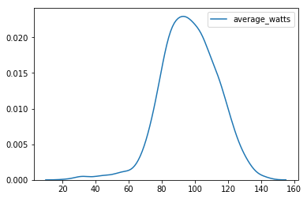


```python
df_raw[df_raw.commute == 0].average_watts.sum()
```


    54522.7


```python
sns.barplot(x="commute", y="average_watts", data=df_raw, estimator=sum)
```


    <matplotlib.axes._subplots.AxesSubplot at 0x7f920c106da0>


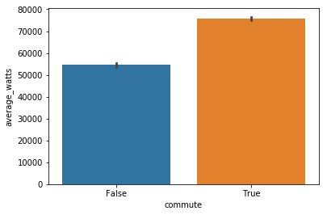


```python
sns.countplot(x="average_watts", data=df_raw)
```


    <matplotlib.axes._subplots.AxesSubplot at 0x7f920cbf9b70>


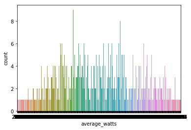


```python
sns.lmplot('distance', 'total_elevation_gain', data=df_raw, fit_reg=False)
```


    <seaborn.axisgrid.FacetGrid at 0x7f9212ac7160>


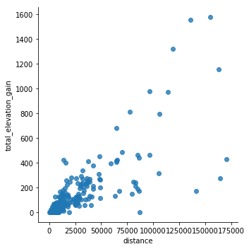


```python
sns.distplot(df_raw.average_speed, kde=False);
```


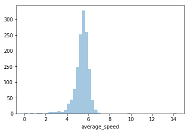


```python
sns.lmplot('average_watts', 'average_speed', data=df_raw, fit_reg=False)
```


    <seaborn.axisgrid.FacetGrid at 0x7f921190d240>


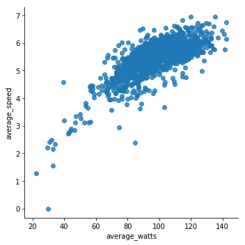


```python
sns.distplot(df_raw.max_speed)
```


    <matplotlib.axes._subplots.AxesSubplot at 0x7f9212171a58>


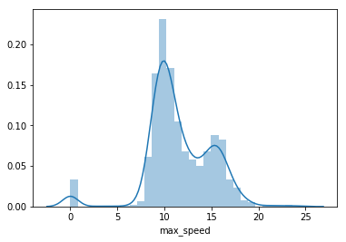


```python
add_datepart(df_raw, 'start_date_local')
```


```python
sns.kdeplot(df_raw.average_speed)
```


    <matplotlib.axes._subplots.AxesSubplot at 0x7f9211d6d6d8>


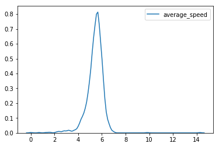


```python
sns.kdeplot(df_raw.average_watts)
```

    /workspace/conda/envs/fastai/lib/python3.6/site-packages/statsmodels/nonparametric/kde.py:448: RuntimeWarning: invalid value encountered in greater
      X = X[np.logical_and(X > clip[0], X < clip[1])] # won't work for two columns.
    /workspace/conda/envs/fastai/lib/python3.6/site-packages/statsmodels/nonparametric/kde.py:448: RuntimeWarning: invalid value encountered in less
      X = X[np.logical_and(X > clip[0], X < clip[1])] # won't work for two columns.


    <matplotlib.axes._subplots.AxesSubplot at 0x7f9211e2e128>


```python
sns.lineplot(x="kilojoules", y="average_speed", data=df_raw)
```


    <matplotlib.axes._subplots.AxesSubplot at 0x7f9211c32eb8>


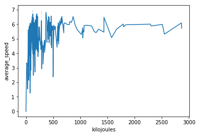


```python
sns.lineplot(x="start_date_localYear", y="suffer_score", data=df_raw)
```


    <matplotlib.axes._subplots.AxesSubplot at 0x7f9210927dd8>


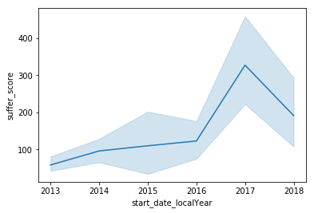


```python
sns.lineplot(x="start_date_localYear", y="max_heartrate", data=df_raw)
```


    <matplotlib.axes._subplots.AxesSubplot at 0x7f92108cf358>


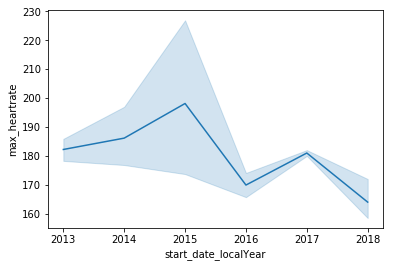


```python
sns.lineplot(x="start_date_localYear", y="achievement_count", data=df_raw)
```


    <matplotlib.axes._subplots.AxesSubplot at 0x7f9210883780>


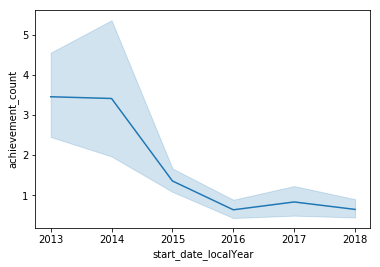


```python
df_raw.location_state.value_counts()
```


    Scotland    784
    Name: location_state, dtype: int64


```python
train_cats(df_raw)
```


```python
df_raw.type.cat.categories
```


    Index(['Ride'], dtype='object')


```python

```


```python
df_raw.info(verbose=True)
```

    <class 'pandas.core.frame.DataFrame'>
    Int64Index: 1388 entries, 0 to 1571
    Data columns (total 62 columns):
    achievement_count                   1388 non-null int64
    athlete_count                       1388 non-null int64
    average_cadence                     47 non-null float64
    average_heartrate                   58 non-null float64
    average_speed                       1388 non-null float64
    average_temp                        31 non-null float64
    average_watts                       1350 non-null float64
    comment_count                       1388 non-null int64
    commute                             1388 non-null bool
    device_watts                        1388 non-null float64
    display_hide_heartrate_option       1388 non-null bool
    distance                            1388 non-null float64
    elapsed_time                        1388 non-null int64
    elev_high                           1351 non-null float64
    elev_low                            1351 non-null float64
    external_id                         1351 non-null category
    flagged                             1388 non-null bool
    from_accepted_tag                   1351 non-null float64
    gear_id                             1388 non-null category
    has_heartrate                       1388 non-null bool
    has_kudoed                          1388 non-null bool
    heartrate_opt_out                   1388 non-null bool
    id                                  1388 non-null int64
    kilojoules                          1350 non-null float64
    kudos_count                         1388 non-null int64
    location_city                       901 non-null category
    location_country                    1387 non-null category
    location_state                      784 non-null category
    manual                              1388 non-null bool
    max_heartrate                       58 non-null float64
    max_speed                           1388 non-null float64
    moving_time                         1388 non-null int64
    name                                1388 non-null category
    photo_count                         1388 non-null int64
    pr_count                            1388 non-null int64
    private                             1388 non-null bool
    resource_state                      1388 non-null int64
    start_date                          1388 non-null category
    start_latitude                      1352 non-null float64
    start_longitude                     1352 non-null float64
    suffer_score                        58 non-null float64
    timezone                            1388 non-null category
    total_elevation_gain                1388 non-null float64
    total_photo_count                   1388 non-null int64
    trainer                             1388 non-null bool
    type                                1388 non-null category
    utc_offset                          1388 non-null int64
    visibility                          1388 non-null category
    workout_type                        1274 non-null float64
    start_date_localYear                1388 non-null int64
    start_date_localMonth               1388 non-null int64
    start_date_localWeek                1388 non-null int64
    start_date_localDay                 1388 non-null int64
    start_date_localDayofweek           1388 non-null int64
    start_date_localDayofyear           1388 non-null int64
    start_date_localIs_month_end        1388 non-null bool
    start_date_localIs_month_start      1388 non-null bool
    start_date_localIs_quarter_end      1388 non-null bool
    start_date_localIs_quarter_start    1388 non-null bool
    start_date_localIs_year_end         1388 non-null bool
    start_date_localIs_year_start       1388 non-null bool
    start_date_localElapsed             1388 non-null int64
    dtypes: bool(15), category(10), float64(18), int64(19)
    memory usage: 564.1 KB


```python
display_all(df_raw.isnull().sum().sort_index()/len(df_raw))
```


    achievement_count                   0.000000
    athlete_count                       0.000000
    average_cadence                     0.966138
    average_heartrate                   0.958213
    average_speed                       0.000000
    average_temp                        0.977666
    average_watts                       0.027378
    comment_count                       0.000000
    commute                             0.000000
    device_watts                        0.000000
    display_hide_heartrate_option       0.000000
    distance                            0.000000
    elapsed_time                        0.000000
    elev_high                           0.026657
    elev_low                            0.026657
    external_id                         0.026657
    flagged                             0.000000
    from_accepted_tag                   0.026657
    gear_id                             0.000000
    has_heartrate                       0.000000
    has_kudoed                          0.000000
    heartrate_opt_out                   0.000000
    id                                  0.000000
    kilojoules                          0.027378
    kudos_count                         0.000000
    location_city                       0.350865
    location_country                    0.000720
    location_state                      0.435159
    manual                              0.000000
    max_heartrate                       0.958213
    max_speed                           0.000000
    moving_time                         0.000000
    name                                0.000000
    photo_count                         0.000000
    pr_count                            0.000000
    private                             0.000000
    resource_state                      0.000000
    start_date                          0.000000
    start_date_localDay                 0.000000
    start_date_localDayofweek           0.000000
    start_date_localDayofyear           0.000000
    start_date_localElapsed             0.000000
    start_date_localIs_month_end        0.000000
    start_date_localIs_month_start      0.000000
    start_date_localIs_quarter_end      0.000000
    start_date_localIs_quarter_start    0.000000
    start_date_localIs_year_end         0.000000
    start_date_localIs_year_start       0.000000
    start_date_localMonth               0.000000
    start_date_localWeek                0.000000
    start_date_localYear                0.000000
    start_latitude                      0.025937
    start_longitude                     0.025937
    suffer_score                        0.958213
    timezone                            0.000000
    total_elevation_gain                0.000000
    total_photo_count                   0.000000
    trainer                             0.000000
    type                                0.000000
    utc_offset                          0.000000
    visibility                          0.000000
    workout_type                        0.082133
    dtype: float64


```python
df, y, nas = proc_df(df_raw, 'average_speed')
```


```python
nas
```


    {'average_cadence': 64.1,
     'average_heartrate': 141.4,
     'average_temp': 17.0,
     'average_watts': 96.4,
     'elev_high': 17.8,
     'elev_low': 2.4,
     'from_accepted_tag': 0.0,
     'kilojoules': 113.05,
     'max_heartrate': 179.5,
     'start_latitude': 55.86,
     'start_longitude': -4.28,
     'suffer_score': 65.5,
     'workout_type': 10.0}


```python
display_all(df)
```


<div>
<style scoped>
    .dataframe tbody tr th:only-of-type {
        vertical-align: middle;
    }

    .dataframe tbody tr th {
        vertical-align: top;
    }

    .dataframe thead th {
        text-align: right;
    }
</style>
<table border="1" class="dataframe">
  <thead>
    <tr style="text-align: right;">
      <th></th>
      <th>achievement_count</th>
      <th>athlete_count</th>
      <th>average_cadence</th>
      <th>average_heartrate</th>
      <th>average_temp</th>
      <th>average_watts</th>
      <th>comment_count</th>
      <th>commute</th>
      <th>device_watts</th>
      <th>display_hide_heartrate_option</th>
      <th>distance</th>
      <th>elapsed_time</th>
      <th>elev_high</th>
      <th>elev_low</th>
      <th>external_id</th>
      <th>flagged</th>
      <th>from_accepted_tag</th>
      <th>gear_id</th>
      <th>has_heartrate</th>
      <th>has_kudoed</th>
      <th>heartrate_opt_out</th>
      <th>id</th>
      <th>kilojoules</th>
      <th>kudos_count</th>
      <th>location_city</th>
      <th>location_country</th>
      <th>location_state</th>
      <th>manual</th>
      <th>max_heartrate</th>
      <th>max_speed</th>
      <th>moving_time</th>
      <th>name</th>
      <th>photo_count</th>
      <th>pr_count</th>
      <th>private</th>
      <th>resource_state</th>
      <th>start_date</th>
      <th>start_latitude</th>
      <th>start_longitude</th>
      <th>suffer_score</th>
      <th>timezone</th>
      <th>total_elevation_gain</th>
      <th>total_photo_count</th>
      <th>trainer</th>
      <th>type</th>
      <th>utc_offset</th>
      <th>visibility</th>
      <th>workout_type</th>
      <th>start_date_localYear</th>
      <th>start_date_localMonth</th>
      <th>start_date_localWeek</th>
      <th>start_date_localDay</th>
      <th>start_date_localDayofweek</th>
      <th>start_date_localDayofyear</th>
      <th>start_date_localIs_month_end</th>
      <th>start_date_localIs_month_start</th>
      <th>start_date_localIs_quarter_end</th>
      <th>start_date_localIs_quarter_start</th>
      <th>start_date_localIs_year_end</th>
      <th>start_date_localIs_year_start</th>
      <th>start_date_localElapsed</th>
      <th>average_cadence_na</th>
      <th>average_heartrate_na</th>
      <th>average_temp_na</th>
      <th>average_watts_na</th>
      <th>elev_high_na</th>
      <th>elev_low_na</th>
      <th>from_accepted_tag_na</th>
      <th>kilojoules_na</th>
      <th>max_heartrate_na</th>
      <th>start_latitude_na</th>
      <th>start_longitude_na</th>
      <th>suffer_score_na</th>
      <th>workout_type_na</th>
    </tr>
  </thead>
  <tbody>
    <tr>
      <th>0</th>
      <td>4</td>
      <td>1</td>
      <td>64.1</td>
      <td>141.4</td>
      <td>17.0</td>
      <td>107.7</td>
      <td>0</td>
      <td>False</td>
      <td>0.0</td>
      <td>False</td>
      <td>42222.3</td>
      <td>7238</td>
      <td>74.7</td>
      <td>9.8</td>
      <td>162</td>
      <td>False</td>
      <td>0.0</td>
      <td>3</td>
      <td>False</td>
      <td>False</td>
      <td>False</td>
      <td>58781593</td>
      <td>760.30</td>
      <td>1</td>
      <td>5</td>
      <td>1</td>
      <td>1</td>
      <td>False</td>
      <td>179.5</td>
      <td>17.600</td>
      <td>7057</td>
      <td>125</td>
      <td>0</td>
      <td>2</td>
      <td>False</td>
      <td>2</td>
      <td>15</td>
      <td>55.83</td>
      <td>-4.46</td>
      <td>65.5</td>
      <td>2</td>
      <td>210.5</td>
      <td>0</td>
      <td>False</td>
      <td>1</td>
      <td>3600</td>
      <td>1</td>
      <td>10.0</td>
      <td>2013</td>
      <td>6</td>
      <td>23</td>
      <td>7</td>
      <td>4</td>
      <td>158</td>
      <td>False</td>
      <td>False</td>
      <td>False</td>
      <td>False</td>
      <td>False</td>
      <td>False</td>
      <td>1370599539</td>
      <td>True</td>
      <td>True</td>
      <td>True</td>
      <td>False</td>
      <td>False</td>
      <td>False</td>
      <td>False</td>
      <td>False</td>
      <td>True</td>
      <td>False</td>
      <td>False</td>
      <td>True</td>
      <td>True</td>
    </tr>
    <tr>
      <th>1</th>
      <td>10</td>
      <td>1</td>
      <td>64.1</td>
      <td>141.4</td>
      <td>17.0</td>
      <td>108.1</td>
      <td>0</td>
      <td>False</td>
      <td>0.0</td>
      <td>False</td>
      <td>38794.0</td>
      <td>6669</td>
      <td>140.2</td>
      <td>9.8</td>
      <td>1078</td>
      <td>False</td>
      <td>0.0</td>
      <td>3</td>
      <td>False</td>
      <td>False</td>
      <td>False</td>
      <td>57644181</td>
      <td>697.60</td>
      <td>3</td>
      <td>5</td>
      <td>1</td>
      <td>1</td>
      <td>False</td>
      <td>179.5</td>
      <td>16.300</td>
      <td>6452</td>
      <td>125</td>
      <td>0</td>
      <td>2</td>
      <td>False</td>
      <td>2</td>
      <td>14</td>
      <td>55.83</td>
      <td>-4.46</td>
      <td>65.5</td>
      <td>2</td>
      <td>245.8</td>
      <td>0</td>
      <td>False</td>
      <td>1</td>
      <td>3600</td>
      <td>1</td>
      <td>10.0</td>
      <td>2013</td>
      <td>6</td>
      <td>22</td>
      <td>2</td>
      <td>6</td>
      <td>153</td>
      <td>False</td>
      <td>False</td>
      <td>False</td>
      <td>False</td>
      <td>False</td>
      <td>False</td>
      <td>1370159959</td>
      <td>True</td>
      <td>True</td>
      <td>True</td>
      <td>False</td>
      <td>False</td>
      <td>False</td>
      <td>False</td>
      <td>False</td>
      <td>True</td>
      <td>False</td>
      <td>False</td>
      <td>True</td>
      <td>True</td>
    </tr>
    <tr>
      <th>2</th>
      <td>16</td>
      <td>1</td>
      <td>64.1</td>
      <td>141.4</td>
      <td>17.0</td>
      <td>120.9</td>
      <td>2</td>
      <td>False</td>
      <td>0.0</td>
      <td>False</td>
      <td>35699.6</td>
      <td>5646</td>
      <td>128.3</td>
      <td>9.8</td>
      <td>849</td>
      <td>False</td>
      <td>0.0</td>
      <td>3</td>
      <td>False</td>
      <td>False</td>
      <td>False</td>
      <td>57138077</td>
      <td>660.20</td>
      <td>3</td>
      <td>5</td>
      <td>1</td>
      <td>1</td>
      <td>False</td>
      <td>179.5</td>
      <td>15.700</td>
      <td>5459</td>
      <td>40</td>
      <td>0</td>
      <td>7</td>
      <td>False</td>
      <td>2</td>
      <td>13</td>
      <td>55.83</td>
      <td>-4.46</td>
      <td>65.5</td>
      <td>2</td>
      <td>227.9</td>
      <td>0</td>
      <td>False</td>
      <td>1</td>
      <td>3600</td>
      <td>1</td>
      <td>10.0</td>
      <td>2013</td>
      <td>5</td>
      <td>22</td>
      <td>30</td>
      <td>3</td>
      <td>150</td>
      <td>False</td>
      <td>False</td>
      <td>False</td>
      <td>False</td>
      <td>False</td>
      <td>False</td>
      <td>1369931197</td>
      <td>True</td>
      <td>True</td>
      <td>True</td>
      <td>False</td>
      <td>False</td>
      <td>False</td>
      <td>False</td>
      <td>False</td>
      <td>True</td>
      <td>False</td>
      <td>False</td>
      <td>True</td>
      <td>True</td>
    </tr>
    <tr>
      <th>3</th>
      <td>2</td>
      <td>1</td>
      <td>64.1</td>
      <td>141.4</td>
      <td>17.0</td>
      <td>111.8</td>
      <td>7</td>
      <td>False</td>
      <td>0.0</td>
      <td>False</td>
      <td>48361.5</td>
      <td>8194</td>
      <td>97.0</td>
      <td>9.9</td>
      <td>1086</td>
      <td>False</td>
      <td>0.0</td>
      <td>3</td>
      <td>False</td>
      <td>False</td>
      <td>False</td>
      <td>56318686</td>
      <td>855.60</td>
      <td>1</td>
      <td>5</td>
      <td>1</td>
      <td>1</td>
      <td>False</td>
      <td>179.5</td>
      <td>16.200</td>
      <td>7652</td>
      <td>125</td>
      <td>0</td>
      <td>0</td>
      <td>False</td>
      <td>2</td>
      <td>12</td>
      <td>55.83</td>
      <td>-4.46</td>
      <td>65.5</td>
      <td>2</td>
      <td>271.4</td>
      <td>0</td>
      <td>False</td>
      <td>1</td>
      <td>3600</td>
      <td>1</td>
      <td>10.0</td>
      <td>2013</td>
      <td>5</td>
      <td>21</td>
      <td>26</td>
      <td>6</td>
      <td>146</td>
      <td>False</td>
      <td>False</td>
      <td>False</td>
      <td>False</td>
      <td>False</td>
      <td>False</td>
      <td>1369555751</td>
      <td>True</td>
      <td>True</td>
      <td>True</td>
      <td>False</td>
      <td>False</td>
      <td>False</td>
      <td>False</td>
      <td>False</td>
      <td>True</td>
      <td>False</td>
      <td>False</td>
      <td>True</td>
      <td>True</td>
    </tr>
    <tr>
      <th>4</th>
      <td>2</td>
      <td>1</td>
      <td>64.1</td>
      <td>141.4</td>
      <td>17.0</td>
      <td>94.7</td>
      <td>8</td>
      <td>False</td>
      <td>0.0</td>
      <td>False</td>
      <td>28249.5</td>
      <td>4990</td>
      <td>55.5</td>
      <td>9.8</td>
      <td>863</td>
      <td>False</td>
      <td>0.0</td>
      <td>3</td>
      <td>False</td>
      <td>False</td>
      <td>False</td>
      <td>55683357</td>
      <td>439.00</td>
      <td>3</td>
      <td>5</td>
      <td>1</td>
      <td>1</td>
      <td>False</td>
      <td>179.5</td>
      <td>16.200</td>
      <td>4638</td>
      <td>40</td>
      <td>0</td>
      <td>2</td>
      <td>False</td>
      <td>2</td>
      <td>11</td>
      <td>55.83</td>
      <td>-4.46</td>
      <td>65.5</td>
      <td>2</td>
      <td>119.0</td>
      <td>0</td>
      <td>False</td>
      <td>1</td>
      <td>3600</td>
      <td>1</td>
      <td>10.0</td>
      <td>2013</td>
      <td>5</td>
      <td>21</td>
      <td>22</td>
      <td>2</td>
      <td>142</td>
      <td>False</td>
      <td>False</td>
      <td>False</td>
      <td>False</td>
      <td>False</td>
      <td>False</td>
      <td>1369238688</td>
      <td>True</td>
      <td>True</td>
      <td>True</td>
      <td>False</td>
      <td>False</td>
      <td>False</td>
      <td>False</td>
      <td>False</td>
      <td>True</td>
      <td>False</td>
      <td>False</td>
      <td>True</td>
      <td>True</td>
    </tr>
    <tr>
      <th>5</th>
      <td>5</td>
      <td>1</td>
      <td>64.1</td>
      <td>141.4</td>
      <td>17.0</td>
      <td>104.1</td>
      <td>37</td>
      <td>False</td>
      <td>0.0</td>
      <td>False</td>
      <td>49098.4</td>
      <td>9484</td>
      <td>96.9</td>
      <td>9.9</td>
      <td>501</td>
      <td>False</td>
      <td>0.0</td>
      <td>3</td>
      <td>False</td>
      <td>False</td>
      <td>False</td>
      <td>54821040</td>
      <td>835.00</td>
      <td>3</td>
      <td>5</td>
      <td>1</td>
      <td>1</td>
      <td>False</td>
      <td>179.5</td>
      <td>17.800</td>
      <td>8018</td>
      <td>125</td>
      <td>0</td>
      <td>3</td>
      <td>False</td>
      <td>2</td>
      <td>10</td>
      <td>55.83</td>
      <td>-4.46</td>
      <td>65.5</td>
      <td>2</td>
      <td>262.9</td>
      <td>0</td>
      <td>False</td>
      <td>1</td>
      <td>3600</td>
      <td>1</td>
      <td>10.0</td>
      <td>2013</td>
      <td>5</td>
      <td>20</td>
      <td>18</td>
      <td>5</td>
      <td>138</td>
      <td>False</td>
      <td>False</td>
      <td>False</td>
      <td>False</td>
      <td>False</td>
      <td>False</td>
      <td>1368866546</td>
      <td>True</td>
      <td>True</td>
      <td>True</td>
      <td>False</td>
      <td>False</td>
      <td>False</td>
      <td>False</td>
      <td>False</td>
      <td>True</td>
      <td>False</td>
      <td>False</td>
      <td>True</td>
      <td>True</td>
    </tr>
    <tr>
      <th>6</th>
      <td>1</td>
      <td>1</td>
      <td>64.1</td>
      <td>141.4</td>
      <td>17.0</td>
      <td>106.0</td>
      <td>0</td>
      <td>False</td>
      <td>0.0</td>
      <td>False</td>
      <td>25803.0</td>
      <td>4620</td>
      <td>56.2</td>
      <td>9.9</td>
      <td>858</td>
      <td>False</td>
      <td>0.0</td>
      <td>3</td>
      <td>False</td>
      <td>False</td>
      <td>False</td>
      <td>54338990</td>
      <td>445.50</td>
      <td>2</td>
      <td>5</td>
      <td>1</td>
      <td>1</td>
      <td>False</td>
      <td>179.5</td>
      <td>14.700</td>
      <td>4204</td>
      <td>40</td>
      <td>0</td>
      <td>1</td>
      <td>False</td>
      <td>2</td>
      <td>9</td>
      <td>55.84</td>
      <td>-4.46</td>
      <td>65.5</td>
      <td>2</td>
      <td>126.8</td>
      <td>0</td>
      <td>False</td>
      <td>1</td>
      <td>3600</td>
      <td>1</td>
      <td>10.0</td>
      <td>2013</td>
      <td>5</td>
      <td>20</td>
      <td>15</td>
      <td>2</td>
      <td>135</td>
      <td>False</td>
      <td>False</td>
      <td>False</td>
      <td>False</td>
      <td>False</td>
      <td>False</td>
      <td>1368634453</td>
      <td>True</td>
      <td>True</td>
      <td>True</td>
      <td>False</td>
      <td>False</td>
      <td>False</td>
      <td>False</td>
      <td>False</td>
      <td>True</td>
      <td>False</td>
      <td>False</td>
      <td>True</td>
      <td>True</td>
    </tr>
    <tr>
      <th>7</th>
      <td>2</td>
      <td>1</td>
      <td>64.1</td>
      <td>141.4</td>
      <td>17.0</td>
      <td>99.8</td>
      <td>6</td>
      <td>False</td>
      <td>0.0</td>
      <td>False</td>
      <td>47684.4</td>
      <td>8965</td>
      <td>97.0</td>
      <td>9.9</td>
      <td>1256</td>
      <td>False</td>
      <td>0.0</td>
      <td>3</td>
      <td>False</td>
      <td>False</td>
      <td>False</td>
      <td>53733060</td>
      <td>797.10</td>
      <td>2</td>
      <td>5</td>
      <td>1</td>
      <td>1</td>
      <td>False</td>
      <td>179.5</td>
      <td>15.400</td>
      <td>7990</td>
      <td>125</td>
      <td>0</td>
      <td>0</td>
      <td>False</td>
      <td>2</td>
      <td>8</td>
      <td>55.83</td>
      <td>-4.46</td>
      <td>65.5</td>
      <td>2</td>
      <td>307.8</td>
      <td>0</td>
      <td>False</td>
      <td>1</td>
      <td>3600</td>
      <td>1</td>
      <td>10.0</td>
      <td>2013</td>
      <td>5</td>
      <td>19</td>
      <td>12</td>
      <td>6</td>
      <td>132</td>
      <td>False</td>
      <td>False</td>
      <td>False</td>
      <td>False</td>
      <td>False</td>
      <td>False</td>
      <td>1368344154</td>
      <td>True</td>
      <td>True</td>
      <td>True</td>
      <td>False</td>
      <td>False</td>
      <td>False</td>
      <td>False</td>
      <td>False</td>
      <td>True</td>
      <td>False</td>
      <td>False</td>
      <td>True</td>
      <td>True</td>
    </tr>
    <tr>
      <th>8</th>
      <td>1</td>
      <td>1</td>
      <td>64.1</td>
      <td>141.4</td>
      <td>17.0</td>
      <td>92.8</td>
      <td>1</td>
      <td>False</td>
      <td>0.0</td>
      <td>False</td>
      <td>26424.4</td>
      <td>6074</td>
      <td>54.3</td>
      <td>9.8</td>
      <td>132</td>
      <td>False</td>
      <td>0.0</td>
      <td>3</td>
      <td>False</td>
      <td>False</td>
      <td>False</td>
      <td>52662822</td>
      <td>433.30</td>
      <td>3</td>
      <td>5</td>
      <td>1</td>
      <td>1</td>
      <td>False</td>
      <td>179.5</td>
      <td>16.000</td>
      <td>4669</td>
      <td>125</td>
      <td>0</td>
      <td>0</td>
      <td>False</td>
      <td>2</td>
      <td>7</td>
      <td>55.83</td>
      <td>-4.46</td>
      <td>65.5</td>
      <td>2</td>
      <td>103.8</td>
      <td>0</td>
      <td>False</td>
      <td>1</td>
      <td>3600</td>
      <td>1</td>
      <td>10.0</td>
      <td>2013</td>
      <td>5</td>
      <td>19</td>
      <td>6</td>
      <td>0</td>
      <td>126</td>
      <td>False</td>
      <td>False</td>
      <td>False</td>
      <td>False</td>
      <td>False</td>
      <td>False</td>
      <td>1367836691</td>
      <td>True</td>
      <td>True</td>
      <td>True</td>
      <td>False</td>
      <td>False</td>
      <td>False</td>
      <td>False</td>
      <td>False</td>
      <td>True</td>
      <td>False</td>
      <td>False</td>
      <td>True</td>
      <td>True</td>
    </tr>
    <tr>
      <th>9</th>
      <td>1</td>
      <td>1</td>
      <td>64.1</td>
      <td>141.4</td>
      <td>17.0</td>
      <td>88.5</td>
      <td>0</td>
      <td>False</td>
      <td>0.0</td>
      <td>False</td>
      <td>28659.0</td>
      <td>5664</td>
      <td>54.6</td>
      <td>9.9</td>
      <td>962</td>
      <td>False</td>
      <td>0.0</td>
      <td>3</td>
      <td>False</td>
      <td>False</td>
      <td>False</td>
      <td>52419567</td>
      <td>461.10</td>
      <td>2</td>
      <td>5</td>
      <td>1</td>
      <td>1</td>
      <td>False</td>
      <td>179.5</td>
      <td>16.300</td>
      <td>5212</td>
      <td>125</td>
      <td>0</td>
      <td>0</td>
      <td>False</td>
      <td>2</td>
      <td>6</td>
      <td>55.83</td>
      <td>-4.46</td>
      <td>65.5</td>
      <td>2</td>
      <td>106.7</td>
      <td>0</td>
      <td>False</td>
      <td>1</td>
      <td>3600</td>
      <td>1</td>
      <td>10.0</td>
      <td>2013</td>
      <td>5</td>
      <td>18</td>
      <td>5</td>
      <td>6</td>
      <td>125</td>
      <td>False</td>
      <td>False</td>
      <td>False</td>
      <td>False</td>
      <td>False</td>
      <td>False</td>
      <td>1367743419</td>
      <td>True</td>
      <td>True</td>
      <td>True</td>
      <td>False</td>
      <td>False</td>
      <td>False</td>
      <td>False</td>
      <td>False</td>
      <td>True</td>
      <td>False</td>
      <td>False</td>
      <td>True</td>
      <td>True</td>
    </tr>
    <tr>
      <th>10</th>
      <td>1</td>
      <td>1</td>
      <td>64.1</td>
      <td>141.4</td>
      <td>17.0</td>
      <td>83.3</td>
      <td>4</td>
      <td>False</td>
      <td>0.0</td>
      <td>False</td>
      <td>26552.5</td>
      <td>8769</td>
      <td>55.7</td>
      <td>9.9</td>
      <td>5</td>
      <td>False</td>
      <td>0.0</td>
      <td>3</td>
      <td>False</td>
      <td>False</td>
      <td>False</td>
      <td>52237991</td>
      <td>420.30</td>
      <td>3</td>
      <td>5</td>
      <td>1</td>
      <td>1</td>
      <td>False</td>
      <td>179.5</td>
      <td>11.700</td>
      <td>5046</td>
      <td>125</td>
      <td>0</td>
      <td>1</td>
      <td>False</td>
      <td>2</td>
      <td>5</td>
      <td>55.83</td>
      <td>-4.46</td>
      <td>65.5</td>
      <td>2</td>
      <td>116.1</td>
      <td>0</td>
      <td>False</td>
      <td>1</td>
      <td>3600</td>
      <td>1</td>
      <td>10.0</td>
      <td>2013</td>
      <td>5</td>
      <td>18</td>
      <td>4</td>
      <td>5</td>
      <td>124</td>
      <td>False</td>
      <td>False</td>
      <td>False</td>
      <td>False</td>
      <td>False</td>
      <td>False</td>
      <td>1367660710</td>
      <td>True</td>
      <td>True</td>
      <td>True</td>
      <td>False</td>
      <td>False</td>
      <td>False</td>
      <td>False</td>
      <td>False</td>
      <td>True</td>
      <td>False</td>
      <td>False</td>
      <td>True</td>
      <td>True</td>
    </tr>
    <tr>
      <th>11</th>
      <td>1</td>
      <td>1</td>
      <td>64.1</td>
      <td>141.4</td>
      <td>17.0</td>
      <td>87.2</td>
      <td>3</td>
      <td>False</td>
      <td>0.0</td>
      <td>False</td>
      <td>26731.0</td>
      <td>5564</td>
      <td>54.6</td>
      <td>9.9</td>
      <td>653</td>
      <td>False</td>
      <td>0.0</td>
      <td>3</td>
      <td>False</td>
      <td>False</td>
      <td>False</td>
      <td>50909596</td>
      <td>408.20</td>
      <td>3</td>
      <td>5</td>
      <td>1</td>
      <td>1</td>
      <td>False</td>
      <td>179.5</td>
      <td>15.700</td>
      <td>4683</td>
      <td>125</td>
      <td>0</td>
      <td>0</td>
      <td>False</td>
      <td>2</td>
      <td>4</td>
      <td>55.83</td>
      <td>-4.46</td>
      <td>65.5</td>
      <td>2</td>
      <td>113.5</td>
      <td>0</td>
      <td>False</td>
      <td>1</td>
      <td>3600</td>
      <td>1</td>
      <td>10.0</td>
      <td>2013</td>
      <td>4</td>
      <td>17</td>
      <td>27</td>
      <td>5</td>
      <td>117</td>
      <td>False</td>
      <td>False</td>
      <td>False</td>
      <td>False</td>
      <td>False</td>
      <td>False</td>
      <td>1367050893</td>
      <td>True</td>
      <td>True</td>
      <td>True</td>
      <td>False</td>
      <td>False</td>
      <td>False</td>
      <td>False</td>
      <td>False</td>
      <td>True</td>
      <td>False</td>
      <td>False</td>
      <td>True</td>
      <td>True</td>
    </tr>
    <tr>
      <th>12</th>
      <td>0</td>
      <td>1</td>
      <td>64.1</td>
      <td>141.4</td>
      <td>17.0</td>
      <td>78.3</td>
      <td>1</td>
      <td>False</td>
      <td>0.0</td>
      <td>False</td>
      <td>9501.2</td>
      <td>2140</td>
      <td>25.0</td>
      <td>9.9</td>
      <td>737</td>
      <td>False</td>
      <td>0.0</td>
      <td>3</td>
      <td>False</td>
      <td>False</td>
      <td>False</td>
      <td>50615788</td>
      <td>139.70</td>
      <td>2</td>
      <td>5</td>
      <td>1</td>
      <td>1</td>
      <td>False</td>
      <td>179.5</td>
      <td>14.800</td>
      <td>1784</td>
      <td>40</td>
      <td>0</td>
      <td>0</td>
      <td>False</td>
      <td>2</td>
      <td>3</td>
      <td>55.84</td>
      <td>-4.46</td>
      <td>65.5</td>
      <td>2</td>
      <td>11.0</td>
      <td>0</td>
      <td>False</td>
      <td>1</td>
      <td>3600</td>
      <td>1</td>
      <td>10.0</td>
      <td>2013</td>
      <td>4</td>
      <td>17</td>
      <td>25</td>
      <td>3</td>
      <td>115</td>
      <td>False</td>
      <td>False</td>
      <td>False</td>
      <td>False</td>
      <td>False</td>
      <td>False</td>
      <td>1366899591</td>
      <td>True</td>
      <td>True</td>
      <td>True</td>
      <td>False</td>
      <td>False</td>
      <td>False</td>
      <td>False</td>
      <td>False</td>
      <td>True</td>
      <td>False</td>
      <td>False</td>
      <td>True</td>
      <td>True</td>
    </tr>
    <tr>
      <th>13</th>
      <td>0</td>
      <td>1</td>
      <td>64.1</td>
      <td>141.4</td>
      <td>17.0</td>
      <td>83.5</td>
      <td>9</td>
      <td>False</td>
      <td>0.0</td>
      <td>False</td>
      <td>24335.5</td>
      <td>5459</td>
      <td>55.2</td>
      <td>9.8</td>
      <td>899</td>
      <td>False</td>
      <td>0.0</td>
      <td>3</td>
      <td>False</td>
      <td>False</td>
      <td>False</td>
      <td>49534782</td>
      <td>361.40</td>
      <td>2</td>
      <td>5</td>
      <td>1</td>
      <td>1</td>
      <td>False</td>
      <td>179.5</td>
      <td>15.727</td>
      <td>4327</td>
      <td>125</td>
      <td>0</td>
      <td>0</td>
      <td>False</td>
      <td>2</td>
      <td>2</td>
      <td>55.83</td>
      <td>-4.46</td>
      <td>65.5</td>
      <td>2</td>
      <td>97.9</td>
      <td>0</td>
      <td>False</td>
      <td>1</td>
      <td>3600</td>
      <td>1</td>
      <td>10.0</td>
      <td>2013</td>
      <td>4</td>
      <td>16</td>
      <td>19</td>
      <td>4</td>
      <td>109</td>
      <td>False</td>
      <td>False</td>
      <td>False</td>
      <td>False</td>
      <td>False</td>
      <td>False</td>
      <td>1366363256</td>
      <td>True</td>
      <td>True</td>
      <td>True</td>
      <td>False</td>
      <td>False</td>
      <td>False</td>
      <td>False</td>
      <td>False</td>
      <td>True</td>
      <td>False</td>
      <td>False</td>
      <td>True</td>
      <td>True</td>
    </tr>
    <tr>
      <th>14</th>
      <td>0</td>
      <td>1</td>
      <td>64.1</td>
      <td>141.4</td>
      <td>17.0</td>
      <td>67.1</td>
      <td>1</td>
      <td>False</td>
      <td>0.0</td>
      <td>False</td>
      <td>14776.4</td>
      <td>3882</td>
      <td>51.6</td>
      <td>9.9</td>
      <td>765</td>
      <td>False</td>
      <td>0.0</td>
      <td>3</td>
      <td>False</td>
      <td>False</td>
      <td>False</td>
      <td>48755320</td>
      <td>218.20</td>
      <td>2</td>
      <td>5</td>
      <td>1</td>
      <td>1</td>
      <td>False</td>
      <td>179.5</td>
      <td>10.996</td>
      <td>3254</td>
      <td>40</td>
      <td>0</td>
      <td>0</td>
      <td>False</td>
      <td>2</td>
      <td>1</td>
      <td>55.83</td>
      <td>-4.46</td>
      <td>65.5</td>
      <td>2</td>
      <td>57.7</td>
      <td>0</td>
      <td>False</td>
      <td>1</td>
      <td>3600</td>
      <td>1</td>
      <td>10.0</td>
      <td>2013</td>
      <td>4</td>
      <td>15</td>
      <td>14</td>
      <td>6</td>
      <td>104</td>
      <td>False</td>
      <td>False</td>
      <td>False</td>
      <td>False</td>
      <td>False</td>
      <td>False</td>
      <td>1365947360</td>
      <td>True</td>
      <td>True</td>
      <td>True</td>
      <td>False</td>
      <td>False</td>
      <td>False</td>
      <td>False</td>
      <td>False</td>
      <td>True</td>
      <td>False</td>
      <td>False</td>
      <td>True</td>
      <td>True</td>
    </tr>
    <tr>
      <th>15</th>
      <td>4</td>
      <td>1</td>
      <td>64.0</td>
      <td>144.4</td>
      <td>17.0</td>
      <td>117.9</td>
      <td>0</td>
      <td>False</td>
      <td>0.0</td>
      <td>False</td>
      <td>32274.0</td>
      <td>5602</td>
      <td>107.0</td>
      <td>2.6</td>
      <td>1307</td>
      <td>False</td>
      <td>0.0</td>
      <td>3</td>
      <td>True</td>
      <td>False</td>
      <td>False</td>
      <td>80281786</td>
      <td>638.30</td>
      <td>2</td>
      <td>5</td>
      <td>1</td>
      <td>1</td>
      <td>False</td>
      <td>179.0</td>
      <td>11.300</td>
      <td>5416</td>
      <td>11</td>
      <td>0</td>
      <td>2</td>
      <td>False</td>
      <td>2</td>
      <td>36</td>
      <td>55.83</td>
      <td>-4.46</td>
      <td>55.0</td>
      <td>2</td>
      <td>336.4</td>
      <td>0</td>
      <td>False</td>
      <td>1</td>
      <td>3600</td>
      <td>1</td>
      <td>10.0</td>
      <td>2013</td>
      <td>9</td>
      <td>36</td>
      <td>5</td>
      <td>3</td>
      <td>248</td>
      <td>False</td>
      <td>False</td>
      <td>False</td>
      <td>False</td>
      <td>False</td>
      <td>False</td>
      <td>1378397168</td>
      <td>False</td>
      <td>False</td>
      <td>True</td>
      <td>False</td>
      <td>False</td>
      <td>False</td>
      <td>False</td>
      <td>False</td>
      <td>False</td>
      <td>False</td>
      <td>False</td>
      <td>False</td>
      <td>True</td>
    </tr>
    <tr>
      <th>16</th>
      <td>4</td>
      <td>1</td>
      <td>70.3</td>
      <td>149.8</td>
      <td>17.0</td>
      <td>129.7</td>
      <td>0</td>
      <td>False</td>
      <td>0.0</td>
      <td>False</td>
      <td>32308.0</td>
      <td>5620</td>
      <td>57.2</td>
      <td>8.8</td>
      <td>1306</td>
      <td>False</td>
      <td>0.0</td>
      <td>3</td>
      <td>True</td>
      <td>False</td>
      <td>False</td>
      <td>79743642</td>
      <td>652.20</td>
      <td>2</td>
      <td>5</td>
      <td>1</td>
      <td>1</td>
      <td>False</td>
      <td>181.0</td>
      <td>11.200</td>
      <td>5029</td>
      <td>9</td>
      <td>0</td>
      <td>1</td>
      <td>False</td>
      <td>2</td>
      <td>35</td>
      <td>55.83</td>
      <td>-4.46</td>
      <td>54.0</td>
      <td>2</td>
      <td>270.8</td>
      <td>0</td>
      <td>False</td>
      <td>1</td>
      <td>3600</td>
      <td>1</td>
      <td>10.0</td>
      <td>2013</td>
      <td>9</td>
      <td>36</td>
      <td>3</td>
      <td>1</td>
      <td>246</td>
      <td>False</td>
      <td>False</td>
      <td>False</td>
      <td>False</td>
      <td>False</td>
      <td>False</td>
      <td>1378224579</td>
      <td>False</td>
      <td>False</td>
      <td>True</td>
      <td>False</td>
      <td>False</td>
      <td>False</td>
      <td>False</td>
      <td>False</td>
      <td>False</td>
      <td>False</td>
      <td>False</td>
      <td>False</td>
      <td>True</td>
    </tr>
    <tr>
      <th>17</th>
      <td>9</td>
      <td>1</td>
      <td>67.0</td>
      <td>144.9</td>
      <td>17.0</td>
      <td>92.1</td>
      <td>0</td>
      <td>False</td>
      <td>0.0</td>
      <td>False</td>
      <td>42011.5</td>
      <td>7115</td>
      <td>67.8</td>
      <td>9.9</td>
      <td>1305</td>
      <td>False</td>
      <td>0.0</td>
      <td>3</td>
      <td>True</td>
      <td>False</td>
      <td>False</td>
      <td>78649879</td>
      <td>620.70</td>
      <td>1</td>
      <td>5</td>
      <td>1</td>
      <td>1</td>
      <td>False</td>
      <td>184.0</td>
      <td>11.800</td>
      <td>6737</td>
      <td>27</td>
      <td>0</td>
      <td>2</td>
      <td>False</td>
      <td>2</td>
      <td>34</td>
      <td>55.83</td>
      <td>-4.46</td>
      <td>65.0</td>
      <td>2</td>
      <td>187.8</td>
      <td>0</td>
      <td>False</td>
      <td>1</td>
      <td>3600</td>
      <td>1</td>
      <td>10.0</td>
      <td>2013</td>
      <td>8</td>
      <td>35</td>
      <td>30</td>
      <td>4</td>
      <td>242</td>
      <td>False</td>
      <td>False</td>
      <td>False</td>
      <td>False</td>
      <td>False</td>
      <td>False</td>
      <td>1377859044</td>
      <td>False</td>
      <td>False</td>
      <td>True</td>
      <td>False</td>
      <td>False</td>
      <td>False</td>
      <td>False</td>
      <td>False</td>
      <td>False</td>
      <td>False</td>
      <td>False</td>
      <td>False</td>
      <td>True</td>
    </tr>
    <tr>
      <th>18</th>
      <td>6</td>
      <td>1</td>
      <td>67.7</td>
      <td>152.0</td>
      <td>17.0</td>
      <td>104.1</td>
      <td>0</td>
      <td>False</td>
      <td>0.0</td>
      <td>False</td>
      <td>26033.5</td>
      <td>4370</td>
      <td>54.5</td>
      <td>9.9</td>
      <td>1304</td>
      <td>False</td>
      <td>0.0</td>
      <td>3</td>
      <td>True</td>
      <td>False</td>
      <td>False</td>
      <td>77698418</td>
      <td>415.20</td>
      <td>1</td>
      <td>5</td>
      <td>1</td>
      <td>1</td>
      <td>False</td>
      <td>189.0</td>
      <td>9.600</td>
      <td>3987</td>
      <td>21</td>
      <td>0</td>
      <td>3</td>
      <td>False</td>
      <td>2</td>
      <td>33</td>
      <td>55.83</td>
      <td>-4.46</td>
      <td>48.0</td>
      <td>2</td>
      <td>119.1</td>
      <td>0</td>
      <td>False</td>
      <td>1</td>
      <td>3600</td>
      <td>1</td>
      <td>10.0</td>
      <td>2013</td>
      <td>8</td>
      <td>35</td>
      <td>26</td>
      <td>0</td>
      <td>238</td>
      <td>False</td>
      <td>False</td>
      <td>False</td>
      <td>False</td>
      <td>False</td>
      <td>False</td>
      <td>1377533194</td>
      <td>False</td>
      <td>False</td>
      <td>True</td>
      <td>False</td>
      <td>False</td>
      <td>False</td>
      <td>False</td>
      <td>False</td>
      <td>False</td>
      <td>False</td>
      <td>False</td>
      <td>False</td>
      <td>True</td>
    </tr>
    <tr>
      <th>19</th>
      <td>2</td>
      <td>1</td>
      <td>62.0</td>
      <td>141.3</td>
      <td>17.0</td>
      <td>87.7</td>
      <td>0</td>
      <td>False</td>
      <td>0.0</td>
      <td>False</td>
      <td>36062.3</td>
      <td>6525</td>
      <td>67.7</td>
      <td>9.9</td>
      <td>1303</td>
      <td>False</td>
      <td>0.0</td>
      <td>3</td>
      <td>True</td>
      <td>False</td>
      <td>False</td>
      <td>77312182</td>
      <td>540.90</td>
      <td>1</td>
      <td>5</td>
      <td>1</td>
      <td>1</td>
      <td>False</td>
      <td>185.0</td>
      <td>12.000</td>
      <td>6164</td>
      <td>20</td>
      <td>0</td>
      <td>0</td>
      <td>False</td>
      <td>2</td>
      <td>32</td>
      <td>55.84</td>
      <td>-4.46</td>
      <td>57.0</td>
      <td>2</td>
      <td>209.4</td>
      <td>0</td>
      <td>False</td>
      <td>1</td>
      <td>3600</td>
      <td>1</td>
      <td>10.0</td>
      <td>2013</td>
      <td>8</td>
      <td>34</td>
      <td>25</td>
      <td>6</td>
      <td>237</td>
      <td>False</td>
      <td>False</td>
      <td>False</td>
      <td>False</td>
      <td>False</td>
      <td>False</td>
      <td>1377412771</td>
      <td>False</td>
      <td>False</td>
      <td>True</td>
      <td>False</td>
      <td>False</td>
      <td>False</td>
      <td>False</td>
      <td>False</td>
      <td>False</td>
      <td>False</td>
      <td>False</td>
      <td>False</td>
      <td>True</td>
    </tr>
    <tr>
      <th>20</th>
      <td>0</td>
      <td>1</td>
      <td>63.3</td>
      <td>149.8</td>
      <td>17.0</td>
      <td>94.2</td>
      <td>0</td>
      <td>False</td>
      <td>0.0</td>
      <td>False</td>
      <td>26096.4</td>
      <td>4645</td>
      <td>54.4</td>
      <td>9.9</td>
      <td>1302</td>
      <td>False</td>
      <td>0.0</td>
      <td>3</td>
      <td>True</td>
      <td>False</td>
      <td>False</td>
      <td>74418273</td>
      <td>401.60</td>
      <td>0</td>
      <td>5</td>
      <td>1</td>
      <td>1</td>
      <td>False</td>
      <td>184.0</td>
      <td>11.200</td>
      <td>4265</td>
      <td>15</td>
      <td>0</td>
      <td>0</td>
      <td>False</td>
      <td>2</td>
      <td>31</td>
      <td>55.83</td>
      <td>-4.46</td>
      <td>50.0</td>
      <td>2</td>
      <td>118.9</td>
      <td>0</td>
      <td>False</td>
      <td>1</td>
      <td>3600</td>
      <td>1</td>
      <td>10.0</td>
      <td>2013</td>
      <td>8</td>
      <td>33</td>
      <td>13</td>
      <td>1</td>
      <td>225</td>
      <td>False</td>
      <td>False</td>
      <td>False</td>
      <td>False</td>
      <td>False</td>
      <td>False</td>
      <td>1376416338</td>
      <td>False</td>
      <td>False</td>
      <td>True</td>
      <td>False</td>
      <td>False</td>
      <td>False</td>
      <td>False</td>
      <td>False</td>
      <td>False</td>
      <td>False</td>
      <td>False</td>
      <td>False</td>
      <td>True</td>
    </tr>
    <tr>
      <th>21</th>
      <td>7</td>
      <td>1</td>
      <td>70.2</td>
      <td>144.9</td>
      <td>17.0</td>
      <td>95.8</td>
      <td>0</td>
      <td>False</td>
      <td>0.0</td>
      <td>False</td>
      <td>38628.6</td>
      <td>6643</td>
      <td>144.2</td>
      <td>9.9</td>
      <td>1301</td>
      <td>False</td>
      <td>0.0</td>
      <td>3</td>
      <td>True</td>
      <td>False</td>
      <td>False</td>
      <td>73776794</td>
      <td>616.30</td>
      <td>1</td>
      <td>5</td>
      <td>1</td>
      <td>1</td>
      <td>False</td>
      <td>178.0</td>
      <td>14.100</td>
      <td>6435</td>
      <td>14</td>
      <td>0</td>
      <td>4</td>
      <td>False</td>
      <td>2</td>
      <td>30</td>
      <td>55.84</td>
      <td>-4.46</td>
      <td>61.0</td>
      <td>2</td>
      <td>270.0</td>
      <td>0</td>
      <td>False</td>
      <td>1</td>
      <td>3600</td>
      <td>1</td>
      <td>10.0</td>
      <td>2013</td>
      <td>8</td>
      <td>32</td>
      <td>11</td>
      <td>6</td>
      <td>223</td>
      <td>False</td>
      <td>False</td>
      <td>False</td>
      <td>False</td>
      <td>False</td>
      <td>False</td>
      <td>1376208025</td>
      <td>False</td>
      <td>False</td>
      <td>True</td>
      <td>False</td>
      <td>False</td>
      <td>False</td>
      <td>False</td>
      <td>False</td>
      <td>False</td>
      <td>False</td>
      <td>False</td>
      <td>False</td>
      <td>True</td>
    </tr>
    <tr>
      <th>22</th>
      <td>1</td>
      <td>1</td>
      <td>66.4</td>
      <td>151.4</td>
      <td>17.0</td>
      <td>92.5</td>
      <td>0</td>
      <td>False</td>
      <td>0.0</td>
      <td>False</td>
      <td>26108.6</td>
      <td>4325</td>
      <td>54.4</td>
      <td>9.9</td>
      <td>1300</td>
      <td>False</td>
      <td>0.0</td>
      <td>3</td>
      <td>True</td>
      <td>False</td>
      <td>False</td>
      <td>73541891</td>
      <td>383.60</td>
      <td>2</td>
      <td>5</td>
      <td>1</td>
      <td>1</td>
      <td>False</td>
      <td>178.0</td>
      <td>10.500</td>
      <td>4147</td>
      <td>13</td>
      <td>0</td>
      <td>0</td>
      <td>False</td>
      <td>2</td>
      <td>29</td>
      <td>55.83</td>
      <td>-4.46</td>
      <td>47.0</td>
      <td>2</td>
      <td>105.1</td>
      <td>0</td>
      <td>False</td>
      <td>1</td>
      <td>3600</td>
      <td>1</td>
      <td>10.0</td>
      <td>2013</td>
      <td>8</td>
      <td>32</td>
      <td>10</td>
      <td>5</td>
      <td>222</td>
      <td>False</td>
      <td>False</td>
      <td>False</td>
      <td>False</td>
      <td>False</td>
      <td>False</td>
      <td>1376132875</td>
      <td>False</td>
      <td>False</td>
      <td>True</td>
      <td>False</td>
      <td>False</td>
      <td>False</td>
      <td>False</td>
      <td>False</td>
      <td>False</td>
      <td>False</td>
      <td>False</td>
      <td>False</td>
      <td>True</td>
    </tr>
    <tr>
      <th>23</th>
      <td>0</td>
      <td>3</td>
      <td>68.4</td>
      <td>154.8</td>
      <td>17.0</td>
      <td>97.9</td>
      <td>8</td>
      <td>False</td>
      <td>0.0</td>
      <td>False</td>
      <td>77363.5</td>
      <td>15599</td>
      <td>277.3</td>
      <td>17.4</td>
      <td>1299</td>
      <td>False</td>
      <td>0.0</td>
      <td>3</td>
      <td>True</td>
      <td>False</td>
      <td>False</td>
      <td>72133097</td>
      <td>1337.80</td>
      <td>3</td>
      <td>1</td>
      <td>1</td>
      <td>1</td>
      <td>False</td>
      <td>196.0</td>
      <td>14.800</td>
      <td>13664</td>
      <td>10</td>
      <td>0</td>
      <td>0</td>
      <td>False</td>
      <td>2</td>
      <td>28</td>
      <td>55.48</td>
      <td>-4.57</td>
      <td>190.0</td>
      <td>2</td>
      <td>812.0</td>
      <td>0</td>
      <td>False</td>
      <td>1</td>
      <td>3600</td>
      <td>1</td>
      <td>10.0</td>
      <td>2013</td>
      <td>8</td>
      <td>31</td>
      <td>4</td>
      <td>6</td>
      <td>216</td>
      <td>False</td>
      <td>False</td>
      <td>False</td>
      <td>False</td>
      <td>False</td>
      <td>False</td>
      <td>1375606244</td>
      <td>False</td>
      <td>False</td>
      <td>True</td>
      <td>False</td>
      <td>False</td>
      <td>False</td>
      <td>False</td>
      <td>False</td>
      <td>False</td>
      <td>False</td>
      <td>False</td>
      <td>False</td>
      <td>True</td>
    </tr>
    <tr>
      <th>24</th>
      <td>0</td>
      <td>1</td>
      <td>60.4</td>
      <td>126.1</td>
      <td>17.0</td>
      <td>120.4</td>
      <td>0</td>
      <td>False</td>
      <td>0.0</td>
      <td>False</td>
      <td>13032.1</td>
      <td>2601</td>
      <td>128.2</td>
      <td>86.8</td>
      <td>1297</td>
      <td>False</td>
      <td>0.0</td>
      <td>3</td>
      <td>True</td>
      <td>False</td>
      <td>False</td>
      <td>71602261</td>
      <td>285.60</td>
      <td>0</td>
      <td>4</td>
      <td>1</td>
      <td>1</td>
      <td>False</td>
      <td>186.0</td>
      <td>9.400</td>
      <td>2371</td>
      <td>6</td>
      <td>0</td>
      <td>0</td>
      <td>False</td>
      <td>2</td>
      <td>27</td>
      <td>55.80</td>
      <td>-4.62</td>
      <td>16.0</td>
      <td>2</td>
      <td>141.8</td>
      <td>0</td>
      <td>False</td>
      <td>1</td>
      <td>3600</td>
      <td>1</td>
      <td>10.0</td>
      <td>2013</td>
      <td>8</td>
      <td>31</td>
      <td>2</td>
      <td>4</td>
      <td>214</td>
      <td>False</td>
      <td>False</td>
      <td>False</td>
      <td>False</td>
      <td>False</td>
      <td>False</td>
      <td>1375443040</td>
      <td>False</td>
      <td>False</td>
      <td>True</td>
      <td>False</td>
      <td>False</td>
      <td>False</td>
      <td>False</td>
      <td>False</td>
      <td>False</td>
      <td>False</td>
      <td>False</td>
      <td>False</td>
      <td>True</td>
    </tr>
    <tr>
      <th>25</th>
      <td>1</td>
      <td>1</td>
      <td>51.7</td>
      <td>121.1</td>
      <td>17.0</td>
      <td>117.0</td>
      <td>0</td>
      <td>False</td>
      <td>0.0</td>
      <td>False</td>
      <td>15603.5</td>
      <td>3538</td>
      <td>70.4</td>
      <td>-500.0</td>
      <td>1298</td>
      <td>False</td>
      <td>0.0</td>
      <td>3</td>
      <td>True</td>
      <td>False</td>
      <td>False</td>
      <td>71602010</td>
      <td>384.70</td>
      <td>0</td>
      <td>5</td>
      <td>1</td>
      <td>1</td>
      <td>False</td>
      <td>157.0</td>
      <td>8.900</td>
      <td>3288</td>
      <td>7</td>
      <td>0</td>
      <td>0</td>
      <td>False</td>
      <td>2</td>
      <td>26</td>
      <td>55.84</td>
      <td>-4.46</td>
      <td>19.0</td>
      <td>2</td>
      <td>401.4</td>
      <td>0</td>
      <td>False</td>
      <td>1</td>
      <td>3600</td>
      <td>1</td>
      <td>10.0</td>
      <td>2013</td>
      <td>8</td>
      <td>31</td>
      <td>2</td>
      <td>4</td>
      <td>214</td>
      <td>False</td>
      <td>False</td>
      <td>False</td>
      <td>False</td>
      <td>False</td>
      <td>False</td>
      <td>1375438083</td>
      <td>False</td>
      <td>False</td>
      <td>True</td>
      <td>False</td>
      <td>False</td>
      <td>False</td>
      <td>False</td>
      <td>False</td>
      <td>False</td>
      <td>False</td>
      <td>False</td>
      <td>False</td>
      <td>True</td>
    </tr>
    <tr>
      <th>26</th>
      <td>10</td>
      <td>1</td>
      <td>63.8</td>
      <td>148.1</td>
      <td>17.0</td>
      <td>132.7</td>
      <td>1</td>
      <td>False</td>
      <td>0.0</td>
      <td>False</td>
      <td>37516.0</td>
      <td>6373</td>
      <td>178.6</td>
      <td>36.2</td>
      <td>1296</td>
      <td>False</td>
      <td>0.0</td>
      <td>3</td>
      <td>True</td>
      <td>False</td>
      <td>False</td>
      <td>70875128</td>
      <td>805.10</td>
      <td>2</td>
      <td>5</td>
      <td>1</td>
      <td>1</td>
      <td>False</td>
      <td>185.0</td>
      <td>12.100</td>
      <td>6068</td>
      <td>26</td>
      <td>0</td>
      <td>0</td>
      <td>False</td>
      <td>2</td>
      <td>25</td>
      <td>55.84</td>
      <td>-4.46</td>
      <td>66.0</td>
      <td>2</td>
      <td>411.0</td>
      <td>0</td>
      <td>False</td>
      <td>1</td>
      <td>3600</td>
      <td>1</td>
      <td>10.0</td>
      <td>2013</td>
      <td>7</td>
      <td>31</td>
      <td>30</td>
      <td>1</td>
      <td>211</td>
      <td>False</td>
      <td>False</td>
      <td>False</td>
      <td>False</td>
      <td>False</td>
      <td>False</td>
      <td>1375181338</td>
      <td>False</td>
      <td>False</td>
      <td>True</td>
      <td>False</td>
      <td>False</td>
      <td>False</td>
      <td>False</td>
      <td>False</td>
      <td>False</td>
      <td>False</td>
      <td>False</td>
      <td>False</td>
      <td>True</td>
    </tr>
    <tr>
      <th>27</th>
      <td>2</td>
      <td>1</td>
      <td>64.1</td>
      <td>141.4</td>
      <td>17.0</td>
      <td>101.1</td>
      <td>2</td>
      <td>False</td>
      <td>0.0</td>
      <td>False</td>
      <td>27536.9</td>
      <td>6419</td>
      <td>55.4</td>
      <td>9.9</td>
      <td>545</td>
      <td>False</td>
      <td>0.0</td>
      <td>3</td>
      <td>False</td>
      <td>False</td>
      <td>False</td>
      <td>70675478</td>
      <td>466.40</td>
      <td>2</td>
      <td>5</td>
      <td>1</td>
      <td>1</td>
      <td>False</td>
      <td>179.5</td>
      <td>16.800</td>
      <td>4613</td>
      <td>40</td>
      <td>0</td>
      <td>1</td>
      <td>False</td>
      <td>2</td>
      <td>24</td>
      <td>55.83</td>
      <td>-4.46</td>
      <td>65.5</td>
      <td>2</td>
      <td>107.1</td>
      <td>0</td>
      <td>False</td>
      <td>1</td>
      <td>3600</td>
      <td>1</td>
      <td>10.0</td>
      <td>2013</td>
      <td>7</td>
      <td>31</td>
      <td>29</td>
      <td>0</td>
      <td>210</td>
      <td>False</td>
      <td>False</td>
      <td>False</td>
      <td>False</td>
      <td>False</td>
      <td>False</td>
      <td>1375108527</td>
      <td>True</td>
      <td>True</td>
      <td>True</td>
      <td>False</td>
      <td>False</td>
      <td>False</td>
      <td>False</td>
      <td>False</td>
      <td>True</td>
      <td>False</td>
      <td>False</td>
      <td>True</td>
      <td>True</td>
    </tr>
    <tr>
      <th>28</th>
      <td>7</td>
      <td>1</td>
      <td>64.1</td>
      <td>141.4</td>
      <td>17.0</td>
      <td>116.5</td>
      <td>0</td>
      <td>False</td>
      <td>0.0</td>
      <td>False</td>
      <td>26113.2</td>
      <td>4634</td>
      <td>54.6</td>
      <td>9.9</td>
      <td>1215</td>
      <td>False</td>
      <td>0.0</td>
      <td>3</td>
      <td>False</td>
      <td>False</td>
      <td>False</td>
      <td>67285705</td>
      <td>463.60</td>
      <td>2</td>
      <td>5</td>
      <td>1</td>
      <td>1</td>
      <td>False</td>
      <td>179.5</td>
      <td>16.300</td>
      <td>3979</td>
      <td>40</td>
      <td>0</td>
      <td>1</td>
      <td>False</td>
      <td>2</td>
      <td>23</td>
      <td>55.83</td>
      <td>-4.46</td>
      <td>65.5</td>
      <td>2</td>
      <td>93.0</td>
      <td>0</td>
      <td>False</td>
      <td>1</td>
      <td>3600</td>
      <td>1</td>
      <td>10.0</td>
      <td>2013</td>
      <td>7</td>
      <td>29</td>
      <td>15</td>
      <td>0</td>
      <td>196</td>
      <td>False</td>
      <td>False</td>
      <td>False</td>
      <td>False</td>
      <td>False</td>
      <td>False</td>
      <td>1373905307</td>
      <td>True</td>
      <td>True</td>
      <td>True</td>
      <td>False</td>
      <td>False</td>
      <td>False</td>
      <td>False</td>
      <td>False</td>
      <td>True</td>
      <td>False</td>
      <td>False</td>
      <td>True</td>
      <td>True</td>
    </tr>
    <tr>
      <th>29</th>
      <td>8</td>
      <td>1</td>
      <td>64.1</td>
      <td>141.4</td>
      <td>17.0</td>
      <td>111.2</td>
      <td>0</td>
      <td>False</td>
      <td>0.0</td>
      <td>False</td>
      <td>36135.9</td>
      <td>6056</td>
      <td>141.5</td>
      <td>9.8</td>
      <td>114</td>
      <td>False</td>
      <td>0.0</td>
      <td>3</td>
      <td>False</td>
      <td>False</td>
      <td>False</td>
      <td>66688769</td>
      <td>643.40</td>
      <td>1</td>
      <td>5</td>
      <td>1</td>
      <td>1</td>
      <td>False</td>
      <td>179.5</td>
      <td>16.500</td>
      <td>5787</td>
      <td>125</td>
      <td>0</td>
      <td>1</td>
      <td>False</td>
      <td>2</td>
      <td>22</td>
      <td>55.83</td>
      <td>-4.46</td>
      <td>65.5</td>
      <td>2</td>
      <td>272.4</td>
      <td>0</td>
      <td>False</td>
      <td>1</td>
      <td>3600</td>
      <td>1</td>
      <td>10.0</td>
      <td>2013</td>
      <td>7</td>
      <td>28</td>
      <td>13</td>
      <td>5</td>
      <td>194</td>
      <td>False</td>
      <td>False</td>
      <td>False</td>
      <td>False</td>
      <td>False</td>
      <td>False</td>
      <td>1373701156</td>
      <td>True</td>
      <td>True</td>
      <td>True</td>
      <td>False</td>
      <td>False</td>
      <td>False</td>
      <td>False</td>
      <td>False</td>
      <td>True</td>
      <td>False</td>
      <td>False</td>
      <td>True</td>
      <td>True</td>
    </tr>
    <tr>
      <th>30</th>
      <td>3</td>
      <td>1</td>
      <td>64.1</td>
      <td>141.4</td>
      <td>17.0</td>
      <td>98.3</td>
      <td>0</td>
      <td>False</td>
      <td>0.0</td>
      <td>False</td>
      <td>28019.9</td>
      <td>5813</td>
      <td>54.7</td>
      <td>9.8</td>
      <td>882</td>
      <td>False</td>
      <td>0.0</td>
      <td>3</td>
      <td>False</td>
      <td>False</td>
      <td>False</td>
      <td>65861197</td>
      <td>476.80</td>
      <td>0</td>
      <td>5</td>
      <td>1</td>
      <td>1</td>
      <td>False</td>
      <td>179.5</td>
      <td>13.600</td>
      <td>4851</td>
      <td>40</td>
      <td>0</td>
      <td>3</td>
      <td>False</td>
      <td>2</td>
      <td>21</td>
      <td>55.83</td>
      <td>-4.46</td>
      <td>65.5</td>
      <td>2</td>
      <td>105.8</td>
      <td>0</td>
      <td>False</td>
      <td>1</td>
      <td>3600</td>
      <td>1</td>
      <td>10.0</td>
      <td>2013</td>
      <td>7</td>
      <td>28</td>
      <td>9</td>
      <td>1</td>
      <td>190</td>
      <td>False</td>
      <td>False</td>
      <td>False</td>
      <td>False</td>
      <td>False</td>
      <td>False</td>
      <td>1373386785</td>
      <td>True</td>
      <td>True</td>
      <td>True</td>
      <td>False</td>
      <td>False</td>
      <td>False</td>
      <td>False</td>
      <td>False</td>
      <td>True</td>
      <td>False</td>
      <td>False</td>
      <td>True</td>
      <td>True</td>
    </tr>
    <tr>
      <th>31</th>
      <td>1</td>
      <td>1</td>
      <td>64.1</td>
      <td>141.4</td>
      <td>17.0</td>
      <td>106.3</td>
      <td>0</td>
      <td>False</td>
      <td>0.0</td>
      <td>False</td>
      <td>26338.2</td>
      <td>7255</td>
      <td>54.8</td>
      <td>9.9</td>
      <td>224</td>
      <td>False</td>
      <td>0.0</td>
      <td>3</td>
      <td>False</td>
      <td>False</td>
      <td>False</td>
      <td>65340584</td>
      <td>462.70</td>
      <td>2</td>
      <td>5</td>
      <td>1</td>
      <td>1</td>
      <td>False</td>
      <td>179.5</td>
      <td>14.600</td>
      <td>4353</td>
      <td>114</td>
      <td>0</td>
      <td>0</td>
      <td>False</td>
      <td>2</td>
      <td>20</td>
      <td>55.83</td>
      <td>-4.46</td>
      <td>65.5</td>
      <td>2</td>
      <td>115.9</td>
      <td>0</td>
      <td>False</td>
      <td>1</td>
      <td>3600</td>
      <td>1</td>
      <td>10.0</td>
      <td>2013</td>
      <td>7</td>
      <td>27</td>
      <td>7</td>
      <td>6</td>
      <td>188</td>
      <td>False</td>
      <td>False</td>
      <td>False</td>
      <td>False</td>
      <td>False</td>
      <td>False</td>
      <td>1373199523</td>
      <td>True</td>
      <td>True</td>
      <td>True</td>
      <td>False</td>
      <td>False</td>
      <td>False</td>
      <td>False</td>
      <td>False</td>
      <td>True</td>
      <td>False</td>
      <td>False</td>
      <td>True</td>
      <td>True</td>
    </tr>
    <tr>
      <th>32</th>
      <td>4</td>
      <td>1</td>
      <td>64.1</td>
      <td>141.4</td>
      <td>17.0</td>
      <td>109.4</td>
      <td>2</td>
      <td>False</td>
      <td>0.0</td>
      <td>False</td>
      <td>48513.5</td>
      <td>8989</td>
      <td>139.8</td>
      <td>9.8</td>
      <td>143</td>
      <td>False</td>
      <td>0.0</td>
      <td>3</td>
      <td>False</td>
      <td>False</td>
      <td>False</td>
      <td>65046975</td>
      <td>945.20</td>
      <td>3</td>
      <td>5</td>
      <td>1</td>
      <td>1</td>
      <td>False</td>
      <td>179.5</td>
      <td>16.400</td>
      <td>8642</td>
      <td>96</td>
      <td>0</td>
      <td>1</td>
      <td>False</td>
      <td>2</td>
      <td>19</td>
      <td>55.83</td>
      <td>-4.46</td>
      <td>65.5</td>
      <td>2</td>
      <td>452.1</td>
      <td>0</td>
      <td>False</td>
      <td>1</td>
      <td>3600</td>
      <td>1</td>
      <td>10.0</td>
      <td>2013</td>
      <td>7</td>
      <td>27</td>
      <td>6</td>
      <td>5</td>
      <td>187</td>
      <td>False</td>
      <td>False</td>
      <td>False</td>
      <td>False</td>
      <td>False</td>
      <td>False</td>
      <td>1373094178</td>
      <td>True</td>
      <td>True</td>
      <td>True</td>
      <td>False</td>
      <td>False</td>
      <td>False</td>
      <td>False</td>
      <td>False</td>
      <td>True</td>
      <td>False</td>
      <td>False</td>
      <td>True</td>
      <td>True</td>
    </tr>
    <tr>
      <th>33</th>
      <td>3</td>
      <td>1</td>
      <td>64.1</td>
      <td>141.4</td>
      <td>17.0</td>
      <td>87.5</td>
      <td>0</td>
      <td>False</td>
      <td>0.0</td>
      <td>False</td>
      <td>16231.9</td>
      <td>3400</td>
      <td>36.1</td>
      <td>10.7</td>
      <td>449</td>
      <td>False</td>
      <td>0.0</td>
      <td>3</td>
      <td>False</td>
      <td>False</td>
      <td>False</td>
      <td>64068269</td>
      <td>292.70</td>
      <td>0</td>
      <td>5</td>
      <td>1</td>
      <td>1</td>
      <td>False</td>
      <td>179.5</td>
      <td>19.300</td>
      <td>3346</td>
      <td>81</td>
      <td>0</td>
      <td>1</td>
      <td>False</td>
      <td>2</td>
      <td>18</td>
      <td>55.83</td>
      <td>-4.46</td>
      <td>65.5</td>
      <td>2</td>
      <td>89.7</td>
      <td>0</td>
      <td>False</td>
      <td>1</td>
      <td>3600</td>
      <td>1</td>
      <td>10.0</td>
      <td>2013</td>
      <td>7</td>
      <td>27</td>
      <td>1</td>
      <td>0</td>
      <td>182</td>
      <td>False</td>
      <td>True</td>
      <td>False</td>
      <td>True</td>
      <td>False</td>
      <td>False</td>
      <td>1372702507</td>
      <td>True</td>
      <td>True</td>
      <td>True</td>
      <td>False</td>
      <td>False</td>
      <td>False</td>
      <td>False</td>
      <td>False</td>
      <td>True</td>
      <td>False</td>
      <td>False</td>
      <td>True</td>
      <td>True</td>
    </tr>
    <tr>
      <th>34</th>
      <td>3</td>
      <td>1</td>
      <td>64.1</td>
      <td>141.4</td>
      <td>17.0</td>
      <td>98.9</td>
      <td>0</td>
      <td>False</td>
      <td>0.0</td>
      <td>False</td>
      <td>28936.6</td>
      <td>6035</td>
      <td>55.0</td>
      <td>9.9</td>
      <td>583</td>
      <td>False</td>
      <td>0.0</td>
      <td>3</td>
      <td>False</td>
      <td>False</td>
      <td>False</td>
      <td>61855399</td>
      <td>485.70</td>
      <td>3</td>
      <td>5</td>
      <td>1</td>
      <td>1</td>
      <td>False</td>
      <td>179.5</td>
      <td>15.900</td>
      <td>4910</td>
      <td>66</td>
      <td>0</td>
      <td>0</td>
      <td>False</td>
      <td>2</td>
      <td>17</td>
      <td>55.83</td>
      <td>-4.46</td>
      <td>65.5</td>
      <td>2</td>
      <td>117.2</td>
      <td>0</td>
      <td>False</td>
      <td>1</td>
      <td>3600</td>
      <td>1</td>
      <td>10.0</td>
      <td>2013</td>
      <td>6</td>
      <td>25</td>
      <td>21</td>
      <td>4</td>
      <td>172</td>
      <td>False</td>
      <td>False</td>
      <td>False</td>
      <td>False</td>
      <td>False</td>
      <td>False</td>
      <td>1371812372</td>
      <td>True</td>
      <td>True</td>
      <td>True</td>
      <td>False</td>
      <td>False</td>
      <td>False</td>
      <td>False</td>
      <td>False</td>
      <td>True</td>
      <td>False</td>
      <td>False</td>
      <td>True</td>
      <td>True</td>
    </tr>
    <tr>
      <th>35</th>
      <td>8</td>
      <td>1</td>
      <td>64.1</td>
      <td>141.4</td>
      <td>17.0</td>
      <td>114.3</td>
      <td>0</td>
      <td>False</td>
      <td>0.0</td>
      <td>False</td>
      <td>35993.5</td>
      <td>6042</td>
      <td>137.9</td>
      <td>9.9</td>
      <td>460</td>
      <td>False</td>
      <td>0.0</td>
      <td>3</td>
      <td>False</td>
      <td>False</td>
      <td>False</td>
      <td>59164263</td>
      <td>643.60</td>
      <td>2</td>
      <td>5</td>
      <td>1</td>
      <td>1</td>
      <td>False</td>
      <td>179.5</td>
      <td>17.800</td>
      <td>5632</td>
      <td>125</td>
      <td>0</td>
      <td>2</td>
      <td>False</td>
      <td>2</td>
      <td>16</td>
      <td>55.83</td>
      <td>-4.46</td>
      <td>65.5</td>
      <td>2</td>
      <td>244.7</td>
      <td>0</td>
      <td>False</td>
      <td>1</td>
      <td>3600</td>
      <td>1</td>
      <td>10.0</td>
      <td>2013</td>
      <td>6</td>
      <td>23</td>
      <td>9</td>
      <td>6</td>
      <td>160</td>
      <td>False</td>
      <td>False</td>
      <td>False</td>
      <td>False</td>
      <td>False</td>
      <td>False</td>
      <td>1370765535</td>
      <td>True</td>
      <td>True</td>
      <td>True</td>
      <td>False</td>
      <td>False</td>
      <td>False</td>
      <td>False</td>
      <td>False</td>
      <td>True</td>
      <td>False</td>
      <td>False</td>
      <td>True</td>
      <td>True</td>
    </tr>
    <tr>
      <th>36</th>
      <td>0</td>
      <td>1</td>
      <td>63.7</td>
      <td>135.8</td>
      <td>17.0</td>
      <td>83.8</td>
      <td>0</td>
      <td>False</td>
      <td>0.0</td>
      <td>False</td>
      <td>32718.0</td>
      <td>6488</td>
      <td>1073.4</td>
      <td>-11.4</td>
      <td>1312</td>
      <td>False</td>
      <td>0.0</td>
      <td>3</td>
      <td>True</td>
      <td>False</td>
      <td>False</td>
      <td>97798490</td>
      <td>492.20</td>
      <td>1</td>
      <td>5</td>
      <td>1</td>
      <td>1</td>
      <td>False</td>
      <td>179.0</td>
      <td>10.300</td>
      <td>5872</td>
      <td>28</td>
      <td>0</td>
      <td>0</td>
      <td>False</td>
      <td>2</td>
      <td>41</td>
      <td>55.84</td>
      <td>-4.46</td>
      <td>53.0</td>
      <td>2</td>
      <td>205.4</td>
      <td>0</td>
      <td>False</td>
      <td>1</td>
      <td>0</td>
      <td>1</td>
      <td>10.0</td>
      <td>2013</td>
      <td>11</td>
      <td>48</td>
      <td>30</td>
      <td>5</td>
      <td>334</td>
      <td>True</td>
      <td>False</td>
      <td>False</td>
      <td>False</td>
      <td>False</td>
      <td>False</td>
      <td>1385799656</td>
      <td>False</td>
      <td>False</td>
      <td>True</td>
      <td>False</td>
      <td>False</td>
      <td>False</td>
      <td>False</td>
      <td>False</td>
      <td>False</td>
      <td>False</td>
      <td>False</td>
      <td>False</td>
      <td>True</td>
    </tr>
    <tr>
      <th>37</th>
      <td>0</td>
      <td>1</td>
      <td>68.7</td>
      <td>142.8</td>
      <td>17.0</td>
      <td>91.5</td>
      <td>0</td>
      <td>False</td>
      <td>0.0</td>
      <td>False</td>
      <td>11902.5</td>
      <td>2269</td>
      <td>177.4</td>
      <td>148.2</td>
      <td>1311</td>
      <td>False</td>
      <td>0.0</td>
      <td>3</td>
      <td>True</td>
      <td>False</td>
      <td>False</td>
      <td>92660847</td>
      <td>205.60</td>
      <td>1</td>
      <td>5</td>
      <td>1</td>
      <td>1</td>
      <td>False</td>
      <td>179.0</td>
      <td>11.100</td>
      <td>2247</td>
      <td>8</td>
      <td>0</td>
      <td>0</td>
      <td>False</td>
      <td>2</td>
      <td>40</td>
      <td>55.84</td>
      <td>-4.46</td>
      <td>20.0</td>
      <td>2</td>
      <td>123.4</td>
      <td>0</td>
      <td>False</td>
      <td>1</td>
      <td>0</td>
      <td>1</td>
      <td>10.0</td>
      <td>2013</td>
      <td>11</td>
      <td>44</td>
      <td>2</td>
      <td>5</td>
      <td>306</td>
      <td>False</td>
      <td>False</td>
      <td>False</td>
      <td>False</td>
      <td>False</td>
      <td>False</td>
      <td>1383379861</td>
      <td>False</td>
      <td>False</td>
      <td>True</td>
      <td>False</td>
      <td>False</td>
      <td>False</td>
      <td>False</td>
      <td>False</td>
      <td>False</td>
      <td>False</td>
      <td>False</td>
      <td>False</td>
      <td>True</td>
    </tr>
    <tr>
      <th>38</th>
      <td>4</td>
      <td>1</td>
      <td>64.3</td>
      <td>143.9</td>
      <td>17.0</td>
      <td>91.4</td>
      <td>0</td>
      <td>False</td>
      <td>0.0</td>
      <td>False</td>
      <td>30706.9</td>
      <td>5651</td>
      <td>217.8</td>
      <td>131.0</td>
      <td>1310</td>
      <td>False</td>
      <td>0.0</td>
      <td>3</td>
      <td>True</td>
      <td>False</td>
      <td>False</td>
      <td>91333006</td>
      <td>490.60</td>
      <td>0</td>
      <td>5</td>
      <td>1</td>
      <td>1</td>
      <td>False</td>
      <td>190.0</td>
      <td>10.400</td>
      <td>5365</td>
      <td>22</td>
      <td>0</td>
      <td>3</td>
      <td>False</td>
      <td>2</td>
      <td>39</td>
      <td>55.84</td>
      <td>-4.46</td>
      <td>53.0</td>
      <td>2</td>
      <td>229.8</td>
      <td>0</td>
      <td>False</td>
      <td>1</td>
      <td>3600</td>
      <td>1</td>
      <td>10.0</td>
      <td>2013</td>
      <td>10</td>
      <td>43</td>
      <td>26</td>
      <td>5</td>
      <td>299</td>
      <td>False</td>
      <td>False</td>
      <td>False</td>
      <td>False</td>
      <td>False</td>
      <td>False</td>
      <td>1382775060</td>
      <td>False</td>
      <td>False</td>
      <td>True</td>
      <td>False</td>
      <td>False</td>
      <td>False</td>
      <td>False</td>
      <td>False</td>
      <td>False</td>
      <td>False</td>
      <td>False</td>
      <td>False</td>
      <td>True</td>
    </tr>
    <tr>
      <th>39</th>
      <td>8</td>
      <td>1</td>
      <td>63.4</td>
      <td>140.5</td>
      <td>17.0</td>
      <td>103.8</td>
      <td>0</td>
      <td>False</td>
      <td>0.0</td>
      <td>False</td>
      <td>29358.2</td>
      <td>5507</td>
      <td>50.6</td>
      <td>10.0</td>
      <td>1309</td>
      <td>False</td>
      <td>0.0</td>
      <td>3</td>
      <td>True</td>
      <td>False</td>
      <td>False</td>
      <td>85476355</td>
      <td>513.00</td>
      <td>2</td>
      <td>5</td>
      <td>1</td>
      <td>1</td>
      <td>False</td>
      <td>179.0</td>
      <td>9.800</td>
      <td>4942</td>
      <td>24</td>
      <td>0</td>
      <td>2</td>
      <td>False</td>
      <td>2</td>
      <td>38</td>
      <td>55.83</td>
      <td>-4.46</td>
      <td>42.0</td>
      <td>2</td>
      <td>194.6</td>
      <td>0</td>
      <td>False</td>
      <td>1</td>
      <td>3600</td>
      <td>1</td>
      <td>10.0</td>
      <td>2013</td>
      <td>9</td>
      <td>39</td>
      <td>28</td>
      <td>5</td>
      <td>271</td>
      <td>False</td>
      <td>False</td>
      <td>False</td>
      <td>False</td>
      <td>False</td>
      <td>False</td>
      <td>1380374497</td>
      <td>False</td>
      <td>False</td>
      <td>True</td>
      <td>False</td>
      <td>False</td>
      <td>False</td>
      <td>False</td>
      <td>False</td>
      <td>False</td>
      <td>False</td>
      <td>False</td>
      <td>False</td>
      <td>True</td>
    </tr>
    <tr>
      <th>40</th>
      <td>4</td>
      <td>1</td>
      <td>66.1</td>
      <td>149.1</td>
      <td>17.0</td>
      <td>92.8</td>
      <td>1</td>
      <td>False</td>
      <td>0.0</td>
      <td>False</td>
      <td>64646.8</td>
      <td>12949</td>
      <td>71.4</td>
      <td>-14.8</td>
      <td>1308</td>
      <td>False</td>
      <td>0.0</td>
      <td>3</td>
      <td>True</td>
      <td>False</td>
      <td>False</td>
      <td>85250380</td>
      <td>1043.80</td>
      <td>2</td>
      <td>5</td>
      <td>1</td>
      <td>1</td>
      <td>False</td>
      <td>191.0</td>
      <td>18.000</td>
      <td>11244</td>
      <td>23</td>
      <td>0</td>
      <td>2</td>
      <td>False</td>
      <td>2</td>
      <td>37</td>
      <td>55.84</td>
      <td>-4.46</td>
      <td>131.0</td>
      <td>2</td>
      <td>408.8</td>
      <td>0</td>
      <td>False</td>
      <td>1</td>
      <td>3600</td>
      <td>1</td>
      <td>10.0</td>
      <td>2013</td>
      <td>9</td>
      <td>39</td>
      <td>27</td>
      <td>4</td>
      <td>270</td>
      <td>False</td>
      <td>False</td>
      <td>False</td>
      <td>False</td>
      <td>False</td>
      <td>False</td>
      <td>1380274878</td>
      <td>False</td>
      <td>False</td>
      <td>True</td>
      <td>False</td>
      <td>False</td>
      <td>False</td>
      <td>False</td>
      <td>False</td>
      <td>False</td>
      <td>False</td>
      <td>False</td>
      <td>False</td>
      <td>True</td>
    </tr>
    <tr>
      <th>41</th>
      <td>1</td>
      <td>1</td>
      <td>64.0</td>
      <td>139.1</td>
      <td>3.0</td>
      <td>78.1</td>
      <td>0</td>
      <td>False</td>
      <td>0.0</td>
      <td>False</td>
      <td>28830.2</td>
      <td>5167</td>
      <td>46.4</td>
      <td>5.2</td>
      <td>164</td>
      <td>False</td>
      <td>0.0</td>
      <td>3</td>
      <td>True</td>
      <td>False</td>
      <td>False</td>
      <td>116859309</td>
      <td>390.40</td>
      <td>3</td>
      <td>5</td>
      <td>1</td>
      <td>1</td>
      <td>False</td>
      <td>179.0</td>
      <td>10.800</td>
      <td>4999</td>
      <td>2</td>
      <td>0</td>
      <td>0</td>
      <td>False</td>
      <td>2</td>
      <td>47</td>
      <td>55.83</td>
      <td>-4.46</td>
      <td>45.0</td>
      <td>2</td>
      <td>133.0</td>
      <td>0</td>
      <td>False</td>
      <td>1</td>
      <td>0</td>
      <td>1</td>
      <td>10.0</td>
      <td>2014</td>
      <td>3</td>
      <td>9</td>
      <td>1</td>
      <td>5</td>
      <td>60</td>
      <td>False</td>
      <td>True</td>
      <td>False</td>
      <td>False</td>
      <td>False</td>
      <td>False</td>
      <td>1393660731</td>
      <td>False</td>
      <td>False</td>
      <td>False</td>
      <td>False</td>
      <td>False</td>
      <td>False</td>
      <td>False</td>
      <td>False</td>
      <td>False</td>
      <td>False</td>
      <td>False</td>
      <td>False</td>
      <td>True</td>
    </tr>
    <tr>
      <th>42</th>
      <td>8</td>
      <td>2</td>
      <td>69.9</td>
      <td>161.1</td>
      <td>17.0</td>
      <td>83.2</td>
      <td>1</td>
      <td>False</td>
      <td>0.0</td>
      <td>False</td>
      <td>64427.8</td>
      <td>17516</td>
      <td>394.4</td>
      <td>277.6</td>
      <td>1316</td>
      <td>False</td>
      <td>0.0</td>
      <td>3</td>
      <td>True</td>
      <td>False</td>
      <td>False</td>
      <td>113406035</td>
      <td>908.70</td>
      <td>4</td>
      <td>5</td>
      <td>1</td>
      <td>1</td>
      <td>False</td>
      <td>189.0</td>
      <td>10.400</td>
      <td>10919</td>
      <td>197</td>
      <td>0</td>
      <td>6</td>
      <td>False</td>
      <td>2</td>
      <td>46</td>
      <td>55.83</td>
      <td>-4.46</td>
      <td>184.0</td>
      <td>2</td>
      <td>417.0</td>
      <td>0</td>
      <td>False</td>
      <td>1</td>
      <td>0</td>
      <td>1</td>
      <td>0.0</td>
      <td>2014</td>
      <td>2</td>
      <td>7</td>
      <td>15</td>
      <td>5</td>
      <td>46</td>
      <td>False</td>
      <td>False</td>
      <td>False</td>
      <td>False</td>
      <td>False</td>
      <td>False</td>
      <td>1392452877</td>
      <td>False</td>
      <td>False</td>
      <td>True</td>
      <td>False</td>
      <td>False</td>
      <td>False</td>
      <td>False</td>
      <td>False</td>
      <td>False</td>
      <td>False</td>
      <td>False</td>
      <td>False</td>
      <td>False</td>
    </tr>
    <tr>
      <th>43</th>
      <td>3</td>
      <td>1</td>
      <td>62.8</td>
      <td>151.0</td>
      <td>17.0</td>
      <td>90.3</td>
      <td>2</td>
      <td>False</td>
      <td>0.0</td>
      <td>False</td>
      <td>65137.8</td>
      <td>12859</td>
      <td>86.6</td>
      <td>-2.8</td>
      <td>1320</td>
      <td>False</td>
      <td>0.0</td>
      <td>3</td>
      <td>True</td>
      <td>False</td>
      <td>False</td>
      <td>111712940</td>
      <td>1049.90</td>
      <td>2</td>
      <td>5</td>
      <td>1</td>
      <td>1</td>
      <td>False</td>
      <td>182.0</td>
      <td>11.300</td>
      <td>11630</td>
      <td>134</td>
      <td>0</td>
      <td>1</td>
      <td>False</td>
      <td>2</td>
      <td>45</td>
      <td>55.83</td>
      <td>-4.46</td>
      <td>133.0</td>
      <td>2</td>
      <td>421.0</td>
      <td>0</td>
      <td>False</td>
      <td>1</td>
      <td>0</td>
      <td>1</td>
      <td>10.0</td>
      <td>2014</td>
      <td>2</td>
      <td>6</td>
      <td>7</td>
      <td>4</td>
      <td>38</td>
      <td>False</td>
      <td>False</td>
      <td>False</td>
      <td>False</td>
      <td>False</td>
      <td>False</td>
      <td>1391763340</td>
      <td>False</td>
      <td>False</td>
      <td>True</td>
      <td>False</td>
      <td>False</td>
      <td>False</td>
      <td>False</td>
      <td>False</td>
      <td>False</td>
      <td>False</td>
      <td>False</td>
      <td>False</td>
      <td>True</td>
    </tr>
    <tr>
      <th>44</th>
      <td>0</td>
      <td>1</td>
      <td>66.6</td>
      <td>148.4</td>
      <td>17.0</td>
      <td>114.2</td>
      <td>8</td>
      <td>False</td>
      <td>0.0</td>
      <td>False</td>
      <td>26167.7</td>
      <td>4931</td>
      <td>64.2</td>
      <td>12.6</td>
      <td>1315</td>
      <td>False</td>
      <td>0.0</td>
      <td>3</td>
      <td>True</td>
      <td>False</td>
      <td>False</td>
      <td>110309491</td>
      <td>530.60</td>
      <td>3</td>
      <td>5</td>
      <td>1</td>
      <td>1</td>
      <td>False</td>
      <td>181.0</td>
      <td>10.200</td>
      <td>4647</td>
      <td>5</td>
      <td>0</td>
      <td>0</td>
      <td>False</td>
      <td>2</td>
      <td>44</td>
      <td>55.83</td>
      <td>-4.46</td>
      <td>49.0</td>
      <td>2</td>
      <td>274.8</td>
      <td>0</td>
      <td>False</td>
      <td>1</td>
      <td>0</td>
      <td>1</td>
      <td>10.0</td>
      <td>2014</td>
      <td>2</td>
      <td>5</td>
      <td>1</td>
      <td>5</td>
      <td>32</td>
      <td>False</td>
      <td>True</td>
      <td>False</td>
      <td>False</td>
      <td>False</td>
      <td>False</td>
      <td>1391241688</td>
      <td>False</td>
      <td>False</td>
      <td>True</td>
      <td>False</td>
      <td>False</td>
      <td>False</td>
      <td>False</td>
      <td>False</td>
      <td>False</td>
      <td>False</td>
      <td>False</td>
      <td>False</td>
      <td>True</td>
    </tr>
    <tr>
      <th>45</th>
      <td>0</td>
      <td>1</td>
      <td>63.5</td>
      <td>142.4</td>
      <td>17.0</td>
      <td>111.7</td>
      <td>1</td>
      <td>False</td>
      <td>0.0</td>
      <td>False</td>
      <td>30619.7</td>
      <td>5334</td>
      <td>91.6</td>
      <td>-2.0</td>
      <td>1314</td>
      <td>False</td>
      <td>0.0</td>
      <td>3</td>
      <td>True</td>
      <td>False</td>
      <td>False</td>
      <td>103426663</td>
      <td>583.40</td>
      <td>2</td>
      <td>5</td>
      <td>1</td>
      <td>1</td>
      <td>False</td>
      <td>181.0</td>
      <td>9.700</td>
      <td>5224</td>
      <td>202</td>
      <td>0</td>
      <td>0</td>
      <td>False</td>
      <td>2</td>
      <td>43</td>
      <td>55.83</td>
      <td>-4.46</td>
      <td>54.0</td>
      <td>2</td>
      <td>294.6</td>
      <td>0</td>
      <td>False</td>
      <td>1</td>
      <td>0</td>
      <td>1</td>
      <td>10.0</td>
      <td>2014</td>
      <td>1</td>
      <td>1</td>
      <td>2</td>
      <td>3</td>
      <td>2</td>
      <td>False</td>
      <td>False</td>
      <td>False</td>
      <td>False</td>
      <td>False</td>
      <td>False</td>
      <td>1388655662</td>
      <td>False</td>
      <td>False</td>
      <td>True</td>
      <td>False</td>
      <td>False</td>
      <td>False</td>
      <td>False</td>
      <td>False</td>
      <td>False</td>
      <td>False</td>
      <td>False</td>
      <td>False</td>
      <td>True</td>
    </tr>
    <tr>
      <th>46</th>
      <td>0</td>
      <td>1</td>
      <td>55.8</td>
      <td>149.7</td>
      <td>17.0</td>
      <td>87.0</td>
      <td>0</td>
      <td>False</td>
      <td>0.0</td>
      <td>False</td>
      <td>10545.3</td>
      <td>2522</td>
      <td>83.0</td>
      <td>-47.0</td>
      <td>1313</td>
      <td>False</td>
      <td>0.0</td>
      <td>3</td>
      <td>True</td>
      <td>False</td>
      <td>False</td>
      <td>102532407</td>
      <td>208.50</td>
      <td>1</td>
      <td>5</td>
      <td>1</td>
      <td>1</td>
      <td>False</td>
      <td>180.0</td>
      <td>12.200</td>
      <td>2398</td>
      <td>201</td>
      <td>0</td>
      <td>0</td>
      <td>False</td>
      <td>2</td>
      <td>42</td>
      <td>55.84</td>
      <td>-4.46</td>
      <td>27.0</td>
      <td>2</td>
      <td>164.8</td>
      <td>0</td>
      <td>False</td>
      <td>1</td>
      <td>0</td>
      <td>1</td>
      <td>10.0</td>
      <td>2013</td>
      <td>12</td>
      <td>52</td>
      <td>29</td>
      <td>6</td>
      <td>363</td>
      <td>False</td>
      <td>False</td>
      <td>False</td>
      <td>False</td>
      <td>False</td>
      <td>False</td>
      <td>1388308644</td>
      <td>False</td>
      <td>False</td>
      <td>True</td>
      <td>False</td>
      <td>False</td>
      <td>False</td>
      <td>False</td>
      <td>False</td>
      <td>False</td>
      <td>False</td>
      <td>False</td>
      <td>False</td>
      <td>True</td>
    </tr>
    <tr>
      <th>49</th>
      <td>1</td>
      <td>1</td>
      <td>64.1</td>
      <td>126.2</td>
      <td>17.0</td>
      <td>68.5</td>
      <td>2</td>
      <td>False</td>
      <td>0.0</td>
      <td>False</td>
      <td>17722.8</td>
      <td>4124</td>
      <td>-0.4</td>
      <td>-18.8</td>
      <td>1325</td>
      <td>False</td>
      <td>0.0</td>
      <td>3</td>
      <td>True</td>
      <td>False</td>
      <td>False</td>
      <td>144873807</td>
      <td>274.00</td>
      <td>5</td>
      <td>3</td>
      <td>1</td>
      <td>1</td>
      <td>False</td>
      <td>177.0</td>
      <td>9.200</td>
      <td>4000</td>
      <td>68</td>
      <td>0</td>
      <td>1</td>
      <td>False</td>
      <td>2</td>
      <td>63</td>
      <td>55.86</td>
      <td>-4.28</td>
      <td>29.0</td>
      <td>2</td>
      <td>133.2</td>
      <td>0</td>
      <td>False</td>
      <td>1</td>
      <td>3600</td>
      <td>1</td>
      <td>10.0</td>
      <td>2014</td>
      <td>5</td>
      <td>21</td>
      <td>24</td>
      <td>5</td>
      <td>144</td>
      <td>False</td>
      <td>False</td>
      <td>False</td>
      <td>False</td>
      <td>False</td>
      <td>False</td>
      <td>1400926220</td>
      <td>True</td>
      <td>False</td>
      <td>True</td>
      <td>False</td>
      <td>False</td>
      <td>False</td>
      <td>False</td>
      <td>False</td>
      <td>False</td>
      <td>False</td>
      <td>False</td>
      <td>False</td>
      <td>True</td>
    </tr>
    <tr>
      <th>50</th>
      <td>1</td>
      <td>1</td>
      <td>64.1</td>
      <td>141.4</td>
      <td>17.0</td>
      <td>71.4</td>
      <td>0</td>
      <td>False</td>
      <td>0.0</td>
      <td>False</td>
      <td>3848.7</td>
      <td>937</td>
      <td>16.9</td>
      <td>3.5</td>
      <td>1231</td>
      <td>False</td>
      <td>0.0</td>
      <td>1</td>
      <td>False</td>
      <td>False</td>
      <td>False</td>
      <td>144613282</td>
      <td>60.20</td>
      <td>2</td>
      <td>3</td>
      <td>1</td>
      <td>1</td>
      <td>False</td>
      <td>179.5</td>
      <td>9.500</td>
      <td>843</td>
      <td>40</td>
      <td>0</td>
      <td>0</td>
      <td>False</td>
      <td>2</td>
      <td>62</td>
      <td>55.85</td>
      <td>-4.32</td>
      <td>65.5</td>
      <td>2</td>
      <td>12.7</td>
      <td>0</td>
      <td>False</td>
      <td>1</td>
      <td>3600</td>
      <td>1</td>
      <td>0.0</td>
      <td>2014</td>
      <td>5</td>
      <td>21</td>
      <td>23</td>
      <td>4</td>
      <td>143</td>
      <td>False</td>
      <td>False</td>
      <td>False</td>
      <td>False</td>
      <td>False</td>
      <td>False</td>
      <td>1400859395</td>
      <td>True</td>
      <td>True</td>
      <td>True</td>
      <td>False</td>
      <td>False</td>
      <td>False</td>
      <td>False</td>
      <td>False</td>
      <td>True</td>
      <td>False</td>
      <td>False</td>
      <td>True</td>
      <td>False</td>
    </tr>
    <tr>
      <th>51</th>
      <td>2</td>
      <td>1</td>
      <td>64.1</td>
      <td>141.4</td>
      <td>17.0</td>
      <td>85.9</td>
      <td>0</td>
      <td>False</td>
      <td>0.0</td>
      <td>False</td>
      <td>3939.1</td>
      <td>796</td>
      <td>16.4</td>
      <td>2.0</td>
      <td>666</td>
      <td>False</td>
      <td>0.0</td>
      <td>1</td>
      <td>False</td>
      <td>False</td>
      <td>False</td>
      <td>144512728</td>
      <td>62.00</td>
      <td>2</td>
      <td>3</td>
      <td>1</td>
      <td>1</td>
      <td>False</td>
      <td>179.5</td>
      <td>10.700</td>
      <td>722</td>
      <td>125</td>
      <td>0</td>
      <td>1</td>
      <td>False</td>
      <td>2</td>
      <td>61</td>
      <td>55.86</td>
      <td>-4.28</td>
      <td>65.5</td>
      <td>2</td>
      <td>11.6</td>
      <td>0</td>
      <td>False</td>
      <td>1</td>
      <td>3600</td>
      <td>1</td>
      <td>0.0</td>
      <td>2014</td>
      <td>5</td>
      <td>21</td>
      <td>23</td>
      <td>4</td>
      <td>143</td>
      <td>False</td>
      <td>False</td>
      <td>False</td>
      <td>False</td>
      <td>False</td>
      <td>False</td>
      <td>1400827185</td>
      <td>True</td>
      <td>True</td>
      <td>True</td>
      <td>False</td>
      <td>False</td>
      <td>False</td>
      <td>False</td>
      <td>False</td>
      <td>True</td>
      <td>False</td>
      <td>False</td>
      <td>True</td>
      <td>False</td>
    </tr>
    <tr>
      <th>57</th>
      <td>0</td>
      <td>1</td>
      <td>64.1</td>
      <td>141.4</td>
      <td>17.0</td>
      <td>96.4</td>
      <td>0</td>
      <td>False</td>
      <td>0.0</td>
      <td>False</td>
      <td>3862.4</td>
      <td>1200</td>
      <td>17.8</td>
      <td>2.4</td>
      <td>0</td>
      <td>False</td>
      <td>0.0</td>
      <td>1</td>
      <td>False</td>
      <td>False</td>
      <td>False</td>
      <td>143062674</td>
      <td>113.05</td>
      <td>0</td>
      <td>3</td>
      <td>1</td>
      <td>1</td>
      <td>True</td>
      <td>179.5</td>
      <td>0.000</td>
      <td>1200</td>
      <td>40</td>
      <td>0</td>
      <td>0</td>
      <td>False</td>
      <td>2</td>
      <td>60</td>
      <td>55.86</td>
      <td>-4.25</td>
      <td>65.5</td>
      <td>2</td>
      <td>0.0</td>
      <td>0</td>
      <td>False</td>
      <td>1</td>
      <td>3600</td>
      <td>1</td>
      <td>10.0</td>
      <td>2014</td>
      <td>5</td>
      <td>21</td>
      <td>19</td>
      <td>0</td>
      <td>139</td>
      <td>False</td>
      <td>False</td>
      <td>False</td>
      <td>False</td>
      <td>False</td>
      <td>False</td>
      <td>1400513580</td>
      <td>True</td>
      <td>True</td>
      <td>True</td>
      <td>True</td>
      <td>True</td>
      <td>True</td>
      <td>True</td>
      <td>True</td>
      <td>True</td>
      <td>False</td>
      <td>False</td>
      <td>True</td>
      <td>True</td>
    </tr>
    <tr>
      <th>58</th>
      <td>2</td>
      <td>1</td>
      <td>64.1</td>
      <td>141.4</td>
      <td>17.0</td>
      <td>80.2</td>
      <td>0</td>
      <td>False</td>
      <td>0.0</td>
      <td>False</td>
      <td>3906.4</td>
      <td>752</td>
      <td>16.5</td>
      <td>1.9</td>
      <td>574</td>
      <td>False</td>
      <td>0.0</td>
      <td>1</td>
      <td>False</td>
      <td>False</td>
      <td>False</td>
      <td>142939920</td>
      <td>58.50</td>
      <td>2</td>
      <td>3</td>
      <td>1</td>
      <td>1</td>
      <td>False</td>
      <td>179.5</td>
      <td>9.200</td>
      <td>729</td>
      <td>125</td>
      <td>0</td>
      <td>0</td>
      <td>False</td>
      <td>2</td>
      <td>59</td>
      <td>55.86</td>
      <td>-4.28</td>
      <td>65.5</td>
      <td>2</td>
      <td>11.7</td>
      <td>0</td>
      <td>False</td>
      <td>1</td>
      <td>3600</td>
      <td>1</td>
      <td>0.0</td>
      <td>2014</td>
      <td>5</td>
      <td>21</td>
      <td>19</td>
      <td>0</td>
      <td>139</td>
      <td>False</td>
      <td>False</td>
      <td>False</td>
      <td>False</td>
      <td>False</td>
      <td>False</td>
      <td>1400481572</td>
      <td>True</td>
      <td>True</td>
      <td>True</td>
      <td>False</td>
      <td>False</td>
      <td>False</td>
      <td>False</td>
      <td>False</td>
      <td>True</td>
      <td>False</td>
      <td>False</td>
      <td>True</td>
      <td>False</td>
    </tr>
    <tr>
      <th>60</th>
      <td>20</td>
      <td>1</td>
      <td>64.1</td>
      <td>140.5</td>
      <td>17.0</td>
      <td>86.5</td>
      <td>0</td>
      <td>False</td>
      <td>0.0</td>
      <td>False</td>
      <td>32257.2</td>
      <td>5885</td>
      <td>8.4</td>
      <td>-13.2</td>
      <td>1324</td>
      <td>False</td>
      <td>0.0</td>
      <td>3</td>
      <td>True</td>
      <td>False</td>
      <td>False</td>
      <td>142048842</td>
      <td>497.50</td>
      <td>4</td>
      <td>3</td>
      <td>1</td>
      <td>1</td>
      <td>False</td>
      <td>180.0</td>
      <td>9.600</td>
      <td>5752</td>
      <td>18</td>
      <td>0</td>
      <td>16</td>
      <td>False</td>
      <td>2</td>
      <td>58</td>
      <td>55.86</td>
      <td>-4.28</td>
      <td>50.0</td>
      <td>2</td>
      <td>236.8</td>
      <td>0</td>
      <td>False</td>
      <td>1</td>
      <td>3600</td>
      <td>1</td>
      <td>10.0</td>
      <td>2014</td>
      <td>5</td>
      <td>20</td>
      <td>17</td>
      <td>5</td>
      <td>137</td>
      <td>False</td>
      <td>False</td>
      <td>False</td>
      <td>False</td>
      <td>False</td>
      <td>False</td>
      <td>1400313806</td>
      <td>True</td>
      <td>False</td>
      <td>True</td>
      <td>False</td>
      <td>False</td>
      <td>False</td>
      <td>False</td>
      <td>False</td>
      <td>False</td>
      <td>False</td>
      <td>False</td>
      <td>False</td>
      <td>True</td>
    </tr>
    <tr>
      <th>62</th>
      <td>3</td>
      <td>1</td>
      <td>64.1</td>
      <td>141.4</td>
      <td>17.0</td>
      <td>80.9</td>
      <td>0</td>
      <td>False</td>
      <td>0.0</td>
      <td>False</td>
      <td>4078.2</td>
      <td>863</td>
      <td>16.5</td>
      <td>2.2</td>
      <td>467</td>
      <td>False</td>
      <td>0.0</td>
      <td>1</td>
      <td>False</td>
      <td>False</td>
      <td>False</td>
      <td>141422561</td>
      <td>65.70</td>
      <td>2</td>
      <td>3</td>
      <td>1</td>
      <td>1</td>
      <td>False</td>
      <td>179.5</td>
      <td>11.000</td>
      <td>813</td>
      <td>40</td>
      <td>0</td>
      <td>1</td>
      <td>False</td>
      <td>2</td>
      <td>57</td>
      <td>55.85</td>
      <td>-4.32</td>
      <td>65.5</td>
      <td>2</td>
      <td>13.7</td>
      <td>0</td>
      <td>False</td>
      <td>1</td>
      <td>3600</td>
      <td>1</td>
      <td>0.0</td>
      <td>2014</td>
      <td>5</td>
      <td>20</td>
      <td>15</td>
      <td>3</td>
      <td>135</td>
      <td>False</td>
      <td>False</td>
      <td>False</td>
      <td>False</td>
      <td>False</td>
      <td>False</td>
      <td>1400168266</td>
      <td>True</td>
      <td>True</td>
      <td>True</td>
      <td>False</td>
      <td>False</td>
      <td>False</td>
      <td>False</td>
      <td>False</td>
      <td>True</td>
      <td>False</td>
      <td>False</td>
      <td>True</td>
      <td>False</td>
    </tr>
    <tr>
      <th>63</th>
      <td>2</td>
      <td>1</td>
      <td>64.1</td>
      <td>141.4</td>
      <td>17.0</td>
      <td>86.3</td>
      <td>0</td>
      <td>False</td>
      <td>0.0</td>
      <td>False</td>
      <td>4155.0</td>
      <td>786</td>
      <td>16.4</td>
      <td>2.4</td>
      <td>1200</td>
      <td>False</td>
      <td>0.0</td>
      <td>1</td>
      <td>False</td>
      <td>False</td>
      <td>False</td>
      <td>141305438</td>
      <td>61.50</td>
      <td>3</td>
      <td>3</td>
      <td>1</td>
      <td>1</td>
      <td>False</td>
      <td>179.5</td>
      <td>10.400</td>
      <td>712</td>
      <td>125</td>
      <td>0</td>
      <td>2</td>
      <td>False</td>
      <td>2</td>
      <td>56</td>
      <td>55.86</td>
      <td>-4.28</td>
      <td>65.5</td>
      <td>2</td>
      <td>11.3</td>
      <td>0</td>
      <td>False</td>
      <td>1</td>
      <td>3600</td>
      <td>1</td>
      <td>0.0</td>
      <td>2014</td>
      <td>5</td>
      <td>20</td>
      <td>15</td>
      <td>3</td>
      <td>135</td>
      <td>False</td>
      <td>False</td>
      <td>False</td>
      <td>False</td>
      <td>False</td>
      <td>False</td>
      <td>1400136215</td>
      <td>True</td>
      <td>True</td>
      <td>True</td>
      <td>False</td>
      <td>False</td>
      <td>False</td>
      <td>False</td>
      <td>False</td>
      <td>True</td>
      <td>False</td>
      <td>False</td>
      <td>True</td>
      <td>False</td>
    </tr>
    <tr>
      <th>64</th>
      <td>2</td>
      <td>1</td>
      <td>64.1</td>
      <td>141.4</td>
      <td>17.0</td>
      <td>78.8</td>
      <td>0</td>
      <td>False</td>
      <td>0.0</td>
      <td>False</td>
      <td>3996.5</td>
      <td>856</td>
      <td>16.9</td>
      <td>2.0</td>
      <td>1271</td>
      <td>False</td>
      <td>0.0</td>
      <td>1</td>
      <td>False</td>
      <td>False</td>
      <td>False</td>
      <td>141025210</td>
      <td>62.00</td>
      <td>3</td>
      <td>3</td>
      <td>1</td>
      <td>1</td>
      <td>False</td>
      <td>179.5</td>
      <td>10.100</td>
      <td>786</td>
      <td>40</td>
      <td>0</td>
      <td>2</td>
      <td>False</td>
      <td>2</td>
      <td>55</td>
      <td>55.85</td>
      <td>-4.32</td>
      <td>65.5</td>
      <td>2</td>
      <td>13.9</td>
      <td>0</td>
      <td>False</td>
      <td>1</td>
      <td>3600</td>
      <td>1</td>
      <td>0.0</td>
      <td>2014</td>
      <td>5</td>
      <td>20</td>
      <td>14</td>
      <td>2</td>
      <td>134</td>
      <td>False</td>
      <td>False</td>
      <td>False</td>
      <td>False</td>
      <td>False</td>
      <td>False</td>
      <td>1400081869</td>
      <td>True</td>
      <td>True</td>
      <td>True</td>
      <td>False</td>
      <td>False</td>
      <td>False</td>
      <td>False</td>
      <td>False</td>
      <td>True</td>
      <td>False</td>
      <td>False</td>
      <td>True</td>
      <td>False</td>
    </tr>
    <tr>
      <th>65</th>
      <td>2</td>
      <td>1</td>
      <td>64.1</td>
      <td>141.4</td>
      <td>17.0</td>
      <td>77.0</td>
      <td>2</td>
      <td>False</td>
      <td>0.0</td>
      <td>False</td>
      <td>3853.4</td>
      <td>846</td>
      <td>16.3</td>
      <td>1.8</td>
      <td>1045</td>
      <td>False</td>
      <td>0.0</td>
      <td>1</td>
      <td>False</td>
      <td>False</td>
      <td>False</td>
      <td>140902825</td>
      <td>61.20</td>
      <td>3</td>
      <td>3</td>
      <td>1</td>
      <td>1</td>
      <td>False</td>
      <td>179.5</td>
      <td>13.400</td>
      <td>795</td>
      <td>125</td>
      <td>0</td>
      <td>0</td>
      <td>False</td>
      <td>2</td>
      <td>54</td>
      <td>55.86</td>
      <td>-4.28</td>
      <td>65.5</td>
      <td>2</td>
      <td>11.8</td>
      <td>0</td>
      <td>False</td>
      <td>1</td>
      <td>3600</td>
      <td>1</td>
      <td>0.0</td>
      <td>2014</td>
      <td>5</td>
      <td>20</td>
      <td>14</td>
      <td>2</td>
      <td>134</td>
      <td>False</td>
      <td>False</td>
      <td>False</td>
      <td>False</td>
      <td>False</td>
      <td>False</td>
      <td>1400049608</td>
      <td>True</td>
      <td>True</td>
      <td>True</td>
      <td>False</td>
      <td>False</td>
      <td>False</td>
      <td>False</td>
      <td>False</td>
      <td>True</td>
      <td>False</td>
      <td>False</td>
      <td>True</td>
      <td>False</td>
    </tr>
    <tr>
      <th>66</th>
      <td>4</td>
      <td>1</td>
      <td>64.1</td>
      <td>141.4</td>
      <td>17.0</td>
      <td>78.4</td>
      <td>0</td>
      <td>False</td>
      <td>0.0</td>
      <td>False</td>
      <td>4029.5</td>
      <td>904</td>
      <td>16.4</td>
      <td>2.0</td>
      <td>193</td>
      <td>False</td>
      <td>0.0</td>
      <td>1</td>
      <td>False</td>
      <td>False</td>
      <td>False</td>
      <td>140635520</td>
      <td>69.20</td>
      <td>2</td>
      <td>3</td>
      <td>1</td>
      <td>1</td>
      <td>False</td>
      <td>179.5</td>
      <td>12.500</td>
      <td>882</td>
      <td>40</td>
      <td>0</td>
      <td>1</td>
      <td>False</td>
      <td>2</td>
      <td>53</td>
      <td>55.85</td>
      <td>-4.32</td>
      <td>65.5</td>
      <td>2</td>
      <td>13.9</td>
      <td>0</td>
      <td>False</td>
      <td>1</td>
      <td>3600</td>
      <td>1</td>
      <td>0.0</td>
      <td>2014</td>
      <td>5</td>
      <td>20</td>
      <td>13</td>
      <td>1</td>
      <td>133</td>
      <td>False</td>
      <td>False</td>
      <td>False</td>
      <td>False</td>
      <td>False</td>
      <td>False</td>
      <td>1399995474</td>
      <td>True</td>
      <td>True</td>
      <td>True</td>
      <td>False</td>
      <td>False</td>
      <td>False</td>
      <td>False</td>
      <td>False</td>
      <td>True</td>
      <td>False</td>
      <td>False</td>
      <td>True</td>
      <td>False</td>
    </tr>
    <tr>
      <th>67</th>
      <td>0</td>
      <td>1</td>
      <td>64.1</td>
      <td>141.4</td>
      <td>17.0</td>
      <td>89.4</td>
      <td>3</td>
      <td>False</td>
      <td>0.0</td>
      <td>False</td>
      <td>2786.5</td>
      <td>518</td>
      <td>15.9</td>
      <td>4.0</td>
      <td>1262</td>
      <td>False</td>
      <td>0.0</td>
      <td>1</td>
      <td>False</td>
      <td>False</td>
      <td>False</td>
      <td>140518608</td>
      <td>44.40</td>
      <td>3</td>
      <td>3</td>
      <td>1</td>
      <td>1</td>
      <td>False</td>
      <td>179.5</td>
      <td>11.200</td>
      <td>496</td>
      <td>167</td>
      <td>0</td>
      <td>0</td>
      <td>False</td>
      <td>2</td>
      <td>52</td>
      <td>55.86</td>
      <td>-4.29</td>
      <td>65.5</td>
      <td>2</td>
      <td>11.4</td>
      <td>0</td>
      <td>False</td>
      <td>1</td>
      <td>3600</td>
      <td>1</td>
      <td>0.0</td>
      <td>2014</td>
      <td>5</td>
      <td>20</td>
      <td>13</td>
      <td>1</td>
      <td>133</td>
      <td>False</td>
      <td>False</td>
      <td>False</td>
      <td>False</td>
      <td>False</td>
      <td>False</td>
      <td>1399963675</td>
      <td>True</td>
      <td>True</td>
      <td>True</td>
      <td>False</td>
      <td>False</td>
      <td>False</td>
      <td>False</td>
      <td>False</td>
      <td>True</td>
      <td>False</td>
      <td>False</td>
      <td>True</td>
      <td>False</td>
    </tr>
    <tr>
      <th>70</th>
      <td>1</td>
      <td>1</td>
      <td>64.1</td>
      <td>141.4</td>
      <td>17.0</td>
      <td>75.9</td>
      <td>1</td>
      <td>False</td>
      <td>0.0</td>
      <td>False</td>
      <td>8022.2</td>
      <td>1772</td>
      <td>16.5</td>
      <td>-1.5</td>
      <td>213</td>
      <td>False</td>
      <td>0.0</td>
      <td>1</td>
      <td>False</td>
      <td>False</td>
      <td>False</td>
      <td>139800491</td>
      <td>134.50</td>
      <td>4</td>
      <td>3</td>
      <td>1</td>
      <td>1</td>
      <td>False</td>
      <td>179.5</td>
      <td>11.400</td>
      <td>1772</td>
      <td>87</td>
      <td>0</td>
      <td>1</td>
      <td>False</td>
      <td>2</td>
      <td>51</td>
      <td>55.86</td>
      <td>-4.28</td>
      <td>65.5</td>
      <td>2</td>
      <td>25.2</td>
      <td>0</td>
      <td>False</td>
      <td>1</td>
      <td>3600</td>
      <td>1</td>
      <td>0.0</td>
      <td>2014</td>
      <td>5</td>
      <td>19</td>
      <td>11</td>
      <td>6</td>
      <td>131</td>
      <td>False</td>
      <td>False</td>
      <td>False</td>
      <td>False</td>
      <td>False</td>
      <td>False</td>
      <td>1399802533</td>
      <td>True</td>
      <td>True</td>
      <td>True</td>
      <td>False</td>
      <td>False</td>
      <td>False</td>
      <td>False</td>
      <td>False</td>
      <td>True</td>
      <td>False</td>
      <td>False</td>
      <td>True</td>
      <td>False</td>
    </tr>
    <tr>
      <th>74</th>
      <td>46</td>
      <td>2</td>
      <td>64.1</td>
      <td>144.3</td>
      <td>17.0</td>
      <td>67.2</td>
      <td>3</td>
      <td>False</td>
      <td>0.0</td>
      <td>False</td>
      <td>33714.3</td>
      <td>6611</td>
      <td>16.8</td>
      <td>0.9</td>
      <td>1323</td>
      <td>False</td>
      <td>0.0</td>
      <td>3</td>
      <td>True</td>
      <td>False</td>
      <td>False</td>
      <td>137661342</td>
      <td>414.60</td>
      <td>4</td>
      <td>3</td>
      <td>1</td>
      <td>1</td>
      <td>False</td>
      <td>223.0</td>
      <td>10.600</td>
      <td>6166</td>
      <td>31</td>
      <td>0</td>
      <td>27</td>
      <td>False</td>
      <td>2</td>
      <td>50</td>
      <td>55.86</td>
      <td>-4.28</td>
      <td>68.0</td>
      <td>2</td>
      <td>56.7</td>
      <td>0</td>
      <td>False</td>
      <td>1</td>
      <td>3600</td>
      <td>1</td>
      <td>10.0</td>
      <td>2014</td>
      <td>5</td>
      <td>19</td>
      <td>5</td>
      <td>0</td>
      <td>125</td>
      <td>False</td>
      <td>False</td>
      <td>False</td>
      <td>False</td>
      <td>False</td>
      <td>False</td>
      <td>1399282285</td>
      <td>True</td>
      <td>False</td>
      <td>True</td>
      <td>False</td>
      <td>False</td>
      <td>False</td>
      <td>False</td>
      <td>False</td>
      <td>False</td>
      <td>False</td>
      <td>False</td>
      <td>False</td>
      <td>True</td>
    </tr>
    <tr>
      <th>78</th>
      <td>108</td>
      <td>2</td>
      <td>55.9</td>
      <td>142.6</td>
      <td>17.0</td>
      <td>75.4</td>
      <td>12</td>
      <td>False</td>
      <td>0.0</td>
      <td>False</td>
      <td>69871.5</td>
      <td>20974</td>
      <td>27.0</td>
      <td>-15.0</td>
      <td>1322</td>
      <td>False</td>
      <td>0.0</td>
      <td>3</td>
      <td>True</td>
      <td>False</td>
      <td>False</td>
      <td>134029818</td>
      <td>1043.90</td>
      <td>5</td>
      <td>3</td>
      <td>1</td>
      <td>1</td>
      <td>False</td>
      <td>227.0</td>
      <td>12.200</td>
      <td>13840</td>
      <td>52</td>
      <td>0</td>
      <td>36</td>
      <td>False</td>
      <td>2</td>
      <td>49</td>
      <td>55.86</td>
      <td>-4.28</td>
      <td>143.0</td>
      <td>2</td>
      <td>486.6</td>
      <td>0</td>
      <td>False</td>
      <td>1</td>
      <td>3600</td>
      <td>1</td>
      <td>10.0</td>
      <td>2014</td>
      <td>4</td>
      <td>17</td>
      <td>25</td>
      <td>4</td>
      <td>115</td>
      <td>False</td>
      <td>False</td>
      <td>False</td>
      <td>False</td>
      <td>False</td>
      <td>False</td>
      <td>1398418552</td>
      <td>False</td>
      <td>False</td>
      <td>True</td>
      <td>False</td>
      <td>False</td>
      <td>False</td>
      <td>False</td>
      <td>False</td>
      <td>False</td>
      <td>False</td>
      <td>False</td>
      <td>False</td>
      <td>True</td>
    </tr>
    <tr>
      <th>79</th>
      <td>2</td>
      <td>1</td>
      <td>49.7</td>
      <td>120.5</td>
      <td>17.0</td>
      <td>62.9</td>
      <td>3</td>
      <td>False</td>
      <td>0.0</td>
      <td>False</td>
      <td>14685.8</td>
      <td>3421</td>
      <td>2.0</td>
      <td>-11.6</td>
      <td>1321</td>
      <td>False</td>
      <td>0.0</td>
      <td>3</td>
      <td>True</td>
      <td>False</td>
      <td>False</td>
      <td>131789749</td>
      <td>195.10</td>
      <td>4</td>
      <td>3</td>
      <td>1</td>
      <td>1</td>
      <td>False</td>
      <td>153.0</td>
      <td>8.800</td>
      <td>3102</td>
      <td>19</td>
      <td>0</td>
      <td>0</td>
      <td>False</td>
      <td>2</td>
      <td>48</td>
      <td>55.86</td>
      <td>-4.29</td>
      <td>18.0</td>
      <td>2</td>
      <td>86.2</td>
      <td>0</td>
      <td>False</td>
      <td>1</td>
      <td>3600</td>
      <td>1</td>
      <td>10.0</td>
      <td>2014</td>
      <td>4</td>
      <td>16</td>
      <td>19</td>
      <td>5</td>
      <td>109</td>
      <td>False</td>
      <td>False</td>
      <td>False</td>
      <td>False</td>
      <td>False</td>
      <td>False</td>
      <td>1397904839</td>
      <td>False</td>
      <td>False</td>
      <td>True</td>
      <td>False</td>
      <td>False</td>
      <td>False</td>
      <td>False</td>
      <td>False</td>
      <td>False</td>
      <td>False</td>
      <td>False</td>
      <td>False</td>
      <td>True</td>
    </tr>
    <tr>
      <th>88</th>
      <td>15</td>
      <td>2</td>
      <td>62.8</td>
      <td>148.0</td>
      <td>17.0</td>
      <td>97.6</td>
      <td>1</td>
      <td>False</td>
      <td>0.0</td>
      <td>False</td>
      <td>96860.3</td>
      <td>26513</td>
      <td>283.8</td>
      <td>-1.7</td>
      <td>1317</td>
      <td>False</td>
      <td>0.0</td>
      <td>3</td>
      <td>True</td>
      <td>False</td>
      <td>False</td>
      <td>190668907</td>
      <td>1668.30</td>
      <td>3</td>
      <td>3</td>
      <td>1</td>
      <td>1</td>
      <td>False</td>
      <td>185.0</td>
      <td>14.400</td>
      <td>17096</td>
      <td>109</td>
      <td>0</td>
      <td>8</td>
      <td>False</td>
      <td>2</td>
      <td>149</td>
      <td>55.86</td>
      <td>-4.28</td>
      <td>198.0</td>
      <td>2</td>
      <td>979.3</td>
      <td>0</td>
      <td>False</td>
      <td>1</td>
      <td>3600</td>
      <td>1</td>
      <td>10.0</td>
      <td>2014</td>
      <td>9</td>
      <td>36</td>
      <td>6</td>
      <td>5</td>
      <td>249</td>
      <td>False</td>
      <td>False</td>
      <td>False</td>
      <td>False</td>
      <td>False</td>
      <td>False</td>
      <td>1409992957</td>
      <td>False</td>
      <td>False</td>
      <td>True</td>
      <td>False</td>
      <td>False</td>
      <td>False</td>
      <td>False</td>
      <td>False</td>
      <td>False</td>
      <td>False</td>
      <td>False</td>
      <td>False</td>
      <td>True</td>
    </tr>
    <tr>
      <th>89</th>
      <td>1</td>
      <td>1</td>
      <td>64.1</td>
      <td>141.4</td>
      <td>17.0</td>
      <td>85.4</td>
      <td>0</td>
      <td>False</td>
      <td>0.0</td>
      <td>False</td>
      <td>7534.8</td>
      <td>5480</td>
      <td>25.8</td>
      <td>1.8</td>
      <td>763</td>
      <td>False</td>
      <td>0.0</td>
      <td>1</td>
      <td>False</td>
      <td>False</td>
      <td>False</td>
      <td>189310687</td>
      <td>128.70</td>
      <td>3</td>
      <td>3</td>
      <td>1</td>
      <td>1</td>
      <td>False</td>
      <td>179.5</td>
      <td>14.200</td>
      <td>1507</td>
      <td>40</td>
      <td>0</td>
      <td>0</td>
      <td>False</td>
      <td>2</td>
      <td>148</td>
      <td>55.85</td>
      <td>-4.32</td>
      <td>65.5</td>
      <td>2</td>
      <td>24.0</td>
      <td>0</td>
      <td>False</td>
      <td>1</td>
      <td>3600</td>
      <td>1</td>
      <td>0.0</td>
      <td>2014</td>
      <td>9</td>
      <td>36</td>
      <td>3</td>
      <td>2</td>
      <td>246</td>
      <td>False</td>
      <td>False</td>
      <td>False</td>
      <td>False</td>
      <td>False</td>
      <td>False</td>
      <td>1409758973</td>
      <td>True</td>
      <td>True</td>
      <td>True</td>
      <td>False</td>
      <td>False</td>
      <td>False</td>
      <td>False</td>
      <td>False</td>
      <td>True</td>
      <td>False</td>
      <td>False</td>
      <td>True</td>
      <td>False</td>
    </tr>
    <tr>
      <th>90</th>
      <td>0</td>
      <td>1</td>
      <td>64.1</td>
      <td>141.4</td>
      <td>17.0</td>
      <td>78.1</td>
      <td>0</td>
      <td>False</td>
      <td>0.0</td>
      <td>False</td>
      <td>3947.7</td>
      <td>762</td>
      <td>18.0</td>
      <td>1.8</td>
      <td>300</td>
      <td>False</td>
      <td>0.0</td>
      <td>1</td>
      <td>False</td>
      <td>False</td>
      <td>False</td>
      <td>189133826</td>
      <td>59.50</td>
      <td>1</td>
      <td>3</td>
      <td>1</td>
      <td>1</td>
      <td>False</td>
      <td>179.5</td>
      <td>9.900</td>
      <td>762</td>
      <td>125</td>
      <td>0</td>
      <td>0</td>
      <td>False</td>
      <td>2</td>
      <td>147</td>
      <td>55.86</td>
      <td>-4.28</td>
      <td>65.5</td>
      <td>2</td>
      <td>15.7</td>
      <td>0</td>
      <td>False</td>
      <td>1</td>
      <td>3600</td>
      <td>1</td>
      <td>0.0</td>
      <td>2014</td>
      <td>9</td>
      <td>36</td>
      <td>3</td>
      <td>2</td>
      <td>246</td>
      <td>False</td>
      <td>False</td>
      <td>False</td>
      <td>False</td>
      <td>False</td>
      <td>False</td>
      <td>1409727409</td>
      <td>True</td>
      <td>True</td>
      <td>True</td>
      <td>False</td>
      <td>False</td>
      <td>False</td>
      <td>False</td>
      <td>False</td>
      <td>True</td>
      <td>False</td>
      <td>False</td>
      <td>True</td>
      <td>False</td>
    </tr>
    <tr>
      <th>91</th>
      <td>0</td>
      <td>1</td>
      <td>64.1</td>
      <td>141.4</td>
      <td>17.0</td>
      <td>84.9</td>
      <td>0</td>
      <td>False</td>
      <td>0.0</td>
      <td>False</td>
      <td>3830.9</td>
      <td>801</td>
      <td>18.1</td>
      <td>2.1</td>
      <td>575</td>
      <td>False</td>
      <td>0.0</td>
      <td>1</td>
      <td>False</td>
      <td>False</td>
      <td>False</td>
      <td>188814260</td>
      <td>56.50</td>
      <td>2</td>
      <td>3</td>
      <td>1</td>
      <td>1</td>
      <td>False</td>
      <td>179.5</td>
      <td>11.300</td>
      <td>665</td>
      <td>40</td>
      <td>0</td>
      <td>0</td>
      <td>False</td>
      <td>2</td>
      <td>146</td>
      <td>55.85</td>
      <td>-4.32</td>
      <td>65.5</td>
      <td>2</td>
      <td>13.8</td>
      <td>0</td>
      <td>False</td>
      <td>1</td>
      <td>3600</td>
      <td>1</td>
      <td>0.0</td>
      <td>2014</td>
      <td>9</td>
      <td>36</td>
      <td>2</td>
      <td>1</td>
      <td>245</td>
      <td>False</td>
      <td>False</td>
      <td>False</td>
      <td>False</td>
      <td>False</td>
      <td>False</td>
      <td>1409672333</td>
      <td>True</td>
      <td>True</td>
      <td>True</td>
      <td>False</td>
      <td>False</td>
      <td>False</td>
      <td>False</td>
      <td>False</td>
      <td>True</td>
      <td>False</td>
      <td>False</td>
      <td>True</td>
      <td>False</td>
    </tr>
    <tr>
      <th>92</th>
      <td>0</td>
      <td>1</td>
      <td>64.1</td>
      <td>141.4</td>
      <td>17.0</td>
      <td>85.3</td>
      <td>0</td>
      <td>False</td>
      <td>0.0</td>
      <td>False</td>
      <td>3953.2</td>
      <td>731</td>
      <td>18.0</td>
      <td>1.7</td>
      <td>602</td>
      <td>False</td>
      <td>0.0</td>
      <td>1</td>
      <td>False</td>
      <td>False</td>
      <td>False</td>
      <td>188678755</td>
      <td>62.30</td>
      <td>2</td>
      <td>3</td>
      <td>1</td>
      <td>1</td>
      <td>False</td>
      <td>179.5</td>
      <td>9.800</td>
      <td>731</td>
      <td>125</td>
      <td>0</td>
      <td>0</td>
      <td>False</td>
      <td>2</td>
      <td>145</td>
      <td>55.86</td>
      <td>-4.28</td>
      <td>65.5</td>
      <td>2</td>
      <td>15.8</td>
      <td>0</td>
      <td>False</td>
      <td>1</td>
      <td>3600</td>
      <td>1</td>
      <td>0.0</td>
      <td>2014</td>
      <td>9</td>
      <td>36</td>
      <td>2</td>
      <td>1</td>
      <td>245</td>
      <td>False</td>
      <td>False</td>
      <td>False</td>
      <td>False</td>
      <td>False</td>
      <td>False</td>
      <td>1409642262</td>
      <td>True</td>
      <td>True</td>
      <td>True</td>
      <td>False</td>
      <td>False</td>
      <td>False</td>
      <td>False</td>
      <td>False</td>
      <td>True</td>
      <td>False</td>
      <td>False</td>
      <td>True</td>
      <td>False</td>
    </tr>
    <tr>
      <th>93</th>
      <td>0</td>
      <td>1</td>
      <td>64.1</td>
      <td>141.4</td>
      <td>17.0</td>
      <td>96.1</td>
      <td>0</td>
      <td>False</td>
      <td>0.0</td>
      <td>False</td>
      <td>4020.0</td>
      <td>865</td>
      <td>18.1</td>
      <td>1.9</td>
      <td>1047</td>
      <td>False</td>
      <td>0.0</td>
      <td>1</td>
      <td>False</td>
      <td>False</td>
      <td>False</td>
      <td>188333466</td>
      <td>69.10</td>
      <td>2</td>
      <td>3</td>
      <td>1</td>
      <td>1</td>
      <td>False</td>
      <td>179.5</td>
      <td>11.100</td>
      <td>719</td>
      <td>40</td>
      <td>0</td>
      <td>0</td>
      <td>False</td>
      <td>2</td>
      <td>144</td>
      <td>55.85</td>
      <td>-4.32</td>
      <td>65.5</td>
      <td>2</td>
      <td>14.1</td>
      <td>0</td>
      <td>False</td>
      <td>1</td>
      <td>3600</td>
      <td>1</td>
      <td>0.0</td>
      <td>2014</td>
      <td>9</td>
      <td>36</td>
      <td>1</td>
      <td>0</td>
      <td>244</td>
      <td>False</td>
      <td>True</td>
      <td>False</td>
      <td>False</td>
      <td>False</td>
      <td>False</td>
      <td>1409586195</td>
      <td>True</td>
      <td>True</td>
      <td>True</td>
      <td>False</td>
      <td>False</td>
      <td>False</td>
      <td>False</td>
      <td>False</td>
      <td>True</td>
      <td>False</td>
      <td>False</td>
      <td>True</td>
      <td>False</td>
    </tr>
    <tr>
      <th>94</th>
      <td>0</td>
      <td>1</td>
      <td>64.1</td>
      <td>141.4</td>
      <td>17.0</td>
      <td>85.2</td>
      <td>0</td>
      <td>False</td>
      <td>0.0</td>
      <td>False</td>
      <td>3916.1</td>
      <td>721</td>
      <td>18.0</td>
      <td>2.0</td>
      <td>895</td>
      <td>False</td>
      <td>0.0</td>
      <td>1</td>
      <td>False</td>
      <td>False</td>
      <td>False</td>
      <td>188199908</td>
      <td>61.40</td>
      <td>3</td>
      <td>3</td>
      <td>1</td>
      <td>1</td>
      <td>False</td>
      <td>179.5</td>
      <td>10.600</td>
      <td>721</td>
      <td>125</td>
      <td>0</td>
      <td>0</td>
      <td>False</td>
      <td>2</td>
      <td>143</td>
      <td>55.86</td>
      <td>-4.28</td>
      <td>65.5</td>
      <td>2</td>
      <td>15.5</td>
      <td>0</td>
      <td>False</td>
      <td>1</td>
      <td>3600</td>
      <td>1</td>
      <td>0.0</td>
      <td>2014</td>
      <td>9</td>
      <td>36</td>
      <td>1</td>
      <td>0</td>
      <td>244</td>
      <td>False</td>
      <td>True</td>
      <td>False</td>
      <td>False</td>
      <td>False</td>
      <td>False</td>
      <td>1409554585</td>
      <td>True</td>
      <td>True</td>
      <td>True</td>
      <td>False</td>
      <td>False</td>
      <td>False</td>
      <td>False</td>
      <td>False</td>
      <td>True</td>
      <td>False</td>
      <td>False</td>
      <td>True</td>
      <td>False</td>
    </tr>
    <tr>
      <th>96</th>
      <td>1</td>
      <td>1</td>
      <td>64.1</td>
      <td>141.4</td>
      <td>17.0</td>
      <td>87.6</td>
      <td>0</td>
      <td>False</td>
      <td>0.0</td>
      <td>False</td>
      <td>4142.5</td>
      <td>930</td>
      <td>18.0</td>
      <td>1.9</td>
      <td>1266</td>
      <td>False</td>
      <td>0.0</td>
      <td>1</td>
      <td>False</td>
      <td>False</td>
      <td>False</td>
      <td>186946079</td>
      <td>71.40</td>
      <td>1</td>
      <td>3</td>
      <td>1</td>
      <td>1</td>
      <td>False</td>
      <td>179.5</td>
      <td>10.600</td>
      <td>815</td>
      <td>40</td>
      <td>0</td>
      <td>0</td>
      <td>False</td>
      <td>2</td>
      <td>142</td>
      <td>55.85</td>
      <td>-4.32</td>
      <td>65.5</td>
      <td>2</td>
      <td>13.8</td>
      <td>0</td>
      <td>False</td>
      <td>1</td>
      <td>3600</td>
      <td>1</td>
      <td>0.0</td>
      <td>2014</td>
      <td>8</td>
      <td>35</td>
      <td>29</td>
      <td>4</td>
      <td>241</td>
      <td>False</td>
      <td>False</td>
      <td>False</td>
      <td>False</td>
      <td>False</td>
      <td>False</td>
      <td>1409327433</td>
      <td>True</td>
      <td>True</td>
      <td>True</td>
      <td>False</td>
      <td>False</td>
      <td>False</td>
      <td>False</td>
      <td>False</td>
      <td>True</td>
      <td>False</td>
      <td>False</td>
      <td>True</td>
      <td>False</td>
    </tr>
    <tr>
      <th>97</th>
      <td>0</td>
      <td>1</td>
      <td>64.1</td>
      <td>141.4</td>
      <td>17.0</td>
      <td>87.3</td>
      <td>0</td>
      <td>False</td>
      <td>0.0</td>
      <td>False</td>
      <td>4054.3</td>
      <td>702</td>
      <td>18.0</td>
      <td>1.8</td>
      <td>556</td>
      <td>False</td>
      <td>0.0</td>
      <td>1</td>
      <td>False</td>
      <td>False</td>
      <td>False</td>
      <td>186805991</td>
      <td>61.30</td>
      <td>1</td>
      <td>3</td>
      <td>1</td>
      <td>1</td>
      <td>False</td>
      <td>179.5</td>
      <td>11.300</td>
      <td>702</td>
      <td>125</td>
      <td>0</td>
      <td>0</td>
      <td>False</td>
      <td>2</td>
      <td>141</td>
      <td>55.86</td>
      <td>-4.28</td>
      <td>65.5</td>
      <td>2</td>
      <td>15.7</td>
      <td>0</td>
      <td>False</td>
      <td>1</td>
      <td>3600</td>
      <td>1</td>
      <td>0.0</td>
      <td>2014</td>
      <td>8</td>
      <td>35</td>
      <td>29</td>
      <td>4</td>
      <td>241</td>
      <td>False</td>
      <td>False</td>
      <td>False</td>
      <td>False</td>
      <td>False</td>
      <td>False</td>
      <td>1409295072</td>
      <td>True</td>
      <td>True</td>
      <td>True</td>
      <td>False</td>
      <td>False</td>
      <td>False</td>
      <td>False</td>
      <td>False</td>
      <td>True</td>
      <td>False</td>
      <td>False</td>
      <td>True</td>
      <td>False</td>
    </tr>
    <tr>
      <th>99</th>
      <td>1</td>
      <td>1</td>
      <td>64.1</td>
      <td>141.4</td>
      <td>17.0</td>
      <td>86.7</td>
      <td>0</td>
      <td>False</td>
      <td>0.0</td>
      <td>False</td>
      <td>4067.4</td>
      <td>984</td>
      <td>18.0</td>
      <td>2.1</td>
      <td>527</td>
      <td>False</td>
      <td>0.0</td>
      <td>1</td>
      <td>False</td>
      <td>False</td>
      <td>False</td>
      <td>186555134</td>
      <td>66.30</td>
      <td>2</td>
      <td>3</td>
      <td>1</td>
      <td>1</td>
      <td>False</td>
      <td>179.5</td>
      <td>10.500</td>
      <td>765</td>
      <td>175</td>
      <td>0</td>
      <td>1</td>
      <td>False</td>
      <td>2</td>
      <td>140</td>
      <td>55.85</td>
      <td>-4.32</td>
      <td>65.5</td>
      <td>2</td>
      <td>13.7</td>
      <td>0</td>
      <td>False</td>
      <td>1</td>
      <td>3600</td>
      <td>1</td>
      <td>0.0</td>
      <td>2014</td>
      <td>8</td>
      <td>35</td>
      <td>28</td>
      <td>3</td>
      <td>240</td>
      <td>False</td>
      <td>False</td>
      <td>False</td>
      <td>False</td>
      <td>False</td>
      <td>False</td>
      <td>1409248111</td>
      <td>True</td>
      <td>True</td>
      <td>True</td>
      <td>False</td>
      <td>False</td>
      <td>False</td>
      <td>False</td>
      <td>False</td>
      <td>True</td>
      <td>False</td>
      <td>False</td>
      <td>True</td>
      <td>False</td>
    </tr>
    <tr>
      <th>100</th>
      <td>1</td>
      <td>1</td>
      <td>64.1</td>
      <td>141.4</td>
      <td>17.0</td>
      <td>83.8</td>
      <td>0</td>
      <td>False</td>
      <td>0.0</td>
      <td>False</td>
      <td>4002.3</td>
      <td>749</td>
      <td>18.0</td>
      <td>1.9</td>
      <td>393</td>
      <td>False</td>
      <td>0.0</td>
      <td>1</td>
      <td>False</td>
      <td>False</td>
      <td>False</td>
      <td>186364262</td>
      <td>60.60</td>
      <td>1</td>
      <td>3</td>
      <td>1</td>
      <td>1</td>
      <td>False</td>
      <td>179.5</td>
      <td>11.400</td>
      <td>724</td>
      <td>125</td>
      <td>0</td>
      <td>0</td>
      <td>False</td>
      <td>2</td>
      <td>139</td>
      <td>55.86</td>
      <td>-4.28</td>
      <td>65.5</td>
      <td>2</td>
      <td>15.5</td>
      <td>0</td>
      <td>False</td>
      <td>1</td>
      <td>3600</td>
      <td>1</td>
      <td>0.0</td>
      <td>2014</td>
      <td>8</td>
      <td>35</td>
      <td>28</td>
      <td>3</td>
      <td>240</td>
      <td>False</td>
      <td>False</td>
      <td>False</td>
      <td>False</td>
      <td>False</td>
      <td>False</td>
      <td>1409208788</td>
      <td>True</td>
      <td>True</td>
      <td>True</td>
      <td>False</td>
      <td>False</td>
      <td>False</td>
      <td>False</td>
      <td>False</td>
      <td>True</td>
      <td>False</td>
      <td>False</td>
      <td>True</td>
      <td>False</td>
    </tr>
    <tr>
      <th>101</th>
      <td>0</td>
      <td>1</td>
      <td>64.1</td>
      <td>141.4</td>
      <td>17.0</td>
      <td>85.7</td>
      <td>0</td>
      <td>False</td>
      <td>0.0</td>
      <td>False</td>
      <td>7516.7</td>
      <td>5684</td>
      <td>25.9</td>
      <td>1.9</td>
      <td>390</td>
      <td>False</td>
      <td>0.0</td>
      <td>1</td>
      <td>False</td>
      <td>False</td>
      <td>False</td>
      <td>186097409</td>
      <td>123.80</td>
      <td>1</td>
      <td>3</td>
      <td>1</td>
      <td>1</td>
      <td>False</td>
      <td>179.5</td>
      <td>13.800</td>
      <td>1445</td>
      <td>118</td>
      <td>0</td>
      <td>0</td>
      <td>False</td>
      <td>2</td>
      <td>138</td>
      <td>55.85</td>
      <td>-4.32</td>
      <td>65.5</td>
      <td>2</td>
      <td>23.9</td>
      <td>0</td>
      <td>False</td>
      <td>1</td>
      <td>3600</td>
      <td>1</td>
      <td>0.0</td>
      <td>2014</td>
      <td>8</td>
      <td>35</td>
      <td>27</td>
      <td>2</td>
      <td>239</td>
      <td>False</td>
      <td>False</td>
      <td>False</td>
      <td>False</td>
      <td>False</td>
      <td>False</td>
      <td>1409155613</td>
      <td>True</td>
      <td>True</td>
      <td>True</td>
      <td>False</td>
      <td>False</td>
      <td>False</td>
      <td>False</td>
      <td>False</td>
      <td>True</td>
      <td>False</td>
      <td>False</td>
      <td>True</td>
      <td>False</td>
    </tr>
    <tr>
      <th>102</th>
      <td>0</td>
      <td>1</td>
      <td>64.1</td>
      <td>141.4</td>
      <td>17.0</td>
      <td>84.4</td>
      <td>0</td>
      <td>False</td>
      <td>0.0</td>
      <td>False</td>
      <td>6947.8</td>
      <td>1489</td>
      <td>19.1</td>
      <td>1.0</td>
      <td>1152</td>
      <td>False</td>
      <td>0.0</td>
      <td>1</td>
      <td>False</td>
      <td>False</td>
      <td>False</td>
      <td>185893438</td>
      <td>106.00</td>
      <td>2</td>
      <td>3</td>
      <td>1</td>
      <td>1</td>
      <td>False</td>
      <td>179.5</td>
      <td>14.700</td>
      <td>1255</td>
      <td>125</td>
      <td>0</td>
      <td>0</td>
      <td>False</td>
      <td>2</td>
      <td>137</td>
      <td>55.86</td>
      <td>-4.28</td>
      <td>65.5</td>
      <td>2</td>
      <td>16.9</td>
      <td>0</td>
      <td>False</td>
      <td>1</td>
      <td>3600</td>
      <td>1</td>
      <td>0.0</td>
      <td>2014</td>
      <td>8</td>
      <td>35</td>
      <td>27</td>
      <td>2</td>
      <td>239</td>
      <td>False</td>
      <td>False</td>
      <td>False</td>
      <td>False</td>
      <td>False</td>
      <td>False</td>
      <td>1409121944</td>
      <td>True</td>
      <td>True</td>
      <td>True</td>
      <td>False</td>
      <td>False</td>
      <td>False</td>
      <td>False</td>
      <td>False</td>
      <td>True</td>
      <td>False</td>
      <td>False</td>
      <td>True</td>
      <td>False</td>
    </tr>
    <tr>
      <th>103</th>
      <td>3</td>
      <td>1</td>
      <td>64.1</td>
      <td>141.4</td>
      <td>17.0</td>
      <td>73.4</td>
      <td>0</td>
      <td>False</td>
      <td>0.0</td>
      <td>False</td>
      <td>7716.3</td>
      <td>10840</td>
      <td>27.1</td>
      <td>2.2</td>
      <td>1199</td>
      <td>False</td>
      <td>0.0</td>
      <td>1</td>
      <td>False</td>
      <td>False</td>
      <td>False</td>
      <td>185641057</td>
      <td>124.70</td>
      <td>2</td>
      <td>3</td>
      <td>1</td>
      <td>1</td>
      <td>False</td>
      <td>179.5</td>
      <td>12.200</td>
      <td>1700</td>
      <td>75</td>
      <td>0</td>
      <td>2</td>
      <td>False</td>
      <td>2</td>
      <td>136</td>
      <td>55.85</td>
      <td>-4.32</td>
      <td>65.5</td>
      <td>2</td>
      <td>24.4</td>
      <td>0</td>
      <td>False</td>
      <td>1</td>
      <td>3600</td>
      <td>1</td>
      <td>10.0</td>
      <td>2014</td>
      <td>8</td>
      <td>35</td>
      <td>26</td>
      <td>1</td>
      <td>238</td>
      <td>False</td>
      <td>False</td>
      <td>False</td>
      <td>False</td>
      <td>False</td>
      <td>False</td>
      <td>1409068559</td>
      <td>True</td>
      <td>True</td>
      <td>True</td>
      <td>False</td>
      <td>False</td>
      <td>False</td>
      <td>False</td>
      <td>False</td>
      <td>True</td>
      <td>False</td>
      <td>False</td>
      <td>True</td>
      <td>True</td>
    </tr>
    <tr>
      <th>104</th>
      <td>0</td>
      <td>1</td>
      <td>64.1</td>
      <td>141.4</td>
      <td>17.0</td>
      <td>89.9</td>
      <td>0</td>
      <td>False</td>
      <td>0.0</td>
      <td>False</td>
      <td>6749.1</td>
      <td>1194</td>
      <td>19.1</td>
      <td>1.0</td>
      <td>670</td>
      <td>False</td>
      <td>0.0</td>
      <td>1</td>
      <td>False</td>
      <td>False</td>
      <td>False</td>
      <td>185421971</td>
      <td>103.10</td>
      <td>2</td>
      <td>3</td>
      <td>1</td>
      <td>1</td>
      <td>False</td>
      <td>179.5</td>
      <td>13.300</td>
      <td>1147</td>
      <td>125</td>
      <td>0</td>
      <td>0</td>
      <td>False</td>
      <td>2</td>
      <td>135</td>
      <td>55.86</td>
      <td>-4.28</td>
      <td>65.5</td>
      <td>2</td>
      <td>16.9</td>
      <td>0</td>
      <td>False</td>
      <td>1</td>
      <td>3600</td>
      <td>1</td>
      <td>0.0</td>
      <td>2014</td>
      <td>8</td>
      <td>35</td>
      <td>26</td>
      <td>1</td>
      <td>238</td>
      <td>False</td>
      <td>False</td>
      <td>False</td>
      <td>False</td>
      <td>False</td>
      <td>False</td>
      <td>1409035308</td>
      <td>True</td>
      <td>True</td>
      <td>True</td>
      <td>False</td>
      <td>False</td>
      <td>False</td>
      <td>False</td>
      <td>False</td>
      <td>True</td>
      <td>False</td>
      <td>False</td>
      <td>True</td>
      <td>False</td>
    </tr>
    <tr>
      <th>105</th>
      <td>24</td>
      <td>1</td>
      <td>64.1</td>
      <td>141.4</td>
      <td>17.0</td>
      <td>101.1</td>
      <td>0</td>
      <td>False</td>
      <td>0.0</td>
      <td>False</td>
      <td>25233.5</td>
      <td>4408</td>
      <td>49.3</td>
      <td>0.9</td>
      <td>939</td>
      <td>False</td>
      <td>0.0</td>
      <td>1</td>
      <td>False</td>
      <td>False</td>
      <td>False</td>
      <td>184749597</td>
      <td>407.00</td>
      <td>3</td>
      <td>3</td>
      <td>1</td>
      <td>1</td>
      <td>False</td>
      <td>179.5</td>
      <td>16.800</td>
      <td>4026</td>
      <td>69</td>
      <td>0</td>
      <td>13</td>
      <td>False</td>
      <td>2</td>
      <td>134</td>
      <td>55.85</td>
      <td>-4.32</td>
      <td>65.5</td>
      <td>2</td>
      <td>66.6</td>
      <td>0</td>
      <td>False</td>
      <td>1</td>
      <td>3600</td>
      <td>1</td>
      <td>0.0</td>
      <td>2014</td>
      <td>8</td>
      <td>34</td>
      <td>24</td>
      <td>6</td>
      <td>236</td>
      <td>False</td>
      <td>False</td>
      <td>False</td>
      <td>False</td>
      <td>False</td>
      <td>False</td>
      <td>1408895448</td>
      <td>True</td>
      <td>True</td>
      <td>True</td>
      <td>False</td>
      <td>False</td>
      <td>False</td>
      <td>False</td>
      <td>False</td>
      <td>True</td>
      <td>False</td>
      <td>False</td>
      <td>True</td>
      <td>False</td>
    </tr>
    <tr>
      <th>106</th>
      <td>0</td>
      <td>1</td>
      <td>64.1</td>
      <td>141.4</td>
      <td>17.0</td>
      <td>91.2</td>
      <td>0</td>
      <td>False</td>
      <td>0.0</td>
      <td>False</td>
      <td>6711.3</td>
      <td>1109</td>
      <td>19.2</td>
      <td>1.0</td>
      <td>175</td>
      <td>False</td>
      <td>0.0</td>
      <td>1</td>
      <td>False</td>
      <td>False</td>
      <td>False</td>
      <td>184503984</td>
      <td>99.20</td>
      <td>2</td>
      <td>3</td>
      <td>1</td>
      <td>1</td>
      <td>False</td>
      <td>179.5</td>
      <td>12.700</td>
      <td>1087</td>
      <td>125</td>
      <td>0</td>
      <td>0</td>
      <td>False</td>
      <td>2</td>
      <td>133</td>
      <td>55.86</td>
      <td>-4.28</td>
      <td>65.5</td>
      <td>2</td>
      <td>16.9</td>
      <td>0</td>
      <td>False</td>
      <td>1</td>
      <td>3600</td>
      <td>1</td>
      <td>0.0</td>
      <td>2014</td>
      <td>8</td>
      <td>34</td>
      <td>24</td>
      <td>6</td>
      <td>236</td>
      <td>False</td>
      <td>False</td>
      <td>False</td>
      <td>False</td>
      <td>False</td>
      <td>False</td>
      <td>1408868550</td>
      <td>True</td>
      <td>True</td>
      <td>True</td>
      <td>False</td>
      <td>False</td>
      <td>False</td>
      <td>False</td>
      <td>False</td>
      <td>True</td>
      <td>False</td>
      <td>False</td>
      <td>True</td>
      <td>False</td>
    </tr>
    <tr>
      <th>107</th>
      <td>20</td>
      <td>1</td>
      <td>64.1</td>
      <td>141.4</td>
      <td>17.0</td>
      <td>94.9</td>
      <td>0</td>
      <td>False</td>
      <td>0.0</td>
      <td>False</td>
      <td>27573.5</td>
      <td>4794</td>
      <td>54.6</td>
      <td>0.9</td>
      <td>1258</td>
      <td>False</td>
      <td>0.0</td>
      <td>1</td>
      <td>False</td>
      <td>False</td>
      <td>False</td>
      <td>183798704</td>
      <td>444.30</td>
      <td>3</td>
      <td>3</td>
      <td>1</td>
      <td>1</td>
      <td>False</td>
      <td>179.5</td>
      <td>14.600</td>
      <td>4681</td>
      <td>146</td>
      <td>0</td>
      <td>10</td>
      <td>False</td>
      <td>2</td>
      <td>132</td>
      <td>55.85</td>
      <td>-4.32</td>
      <td>65.5</td>
      <td>2</td>
      <td>76.0</td>
      <td>0</td>
      <td>False</td>
      <td>1</td>
      <td>3600</td>
      <td>1</td>
      <td>0.0</td>
      <td>2014</td>
      <td>8</td>
      <td>34</td>
      <td>22</td>
      <td>4</td>
      <td>234</td>
      <td>False</td>
      <td>False</td>
      <td>False</td>
      <td>False</td>
      <td>False</td>
      <td>False</td>
      <td>1408721464</td>
      <td>True</td>
      <td>True</td>
      <td>True</td>
      <td>False</td>
      <td>False</td>
      <td>False</td>
      <td>False</td>
      <td>False</td>
      <td>True</td>
      <td>False</td>
      <td>False</td>
      <td>True</td>
      <td>False</td>
    </tr>
    <tr>
      <th>108</th>
      <td>0</td>
      <td>1</td>
      <td>64.1</td>
      <td>141.4</td>
      <td>17.0</td>
      <td>93.2</td>
      <td>0</td>
      <td>False</td>
      <td>0.0</td>
      <td>False</td>
      <td>6881.4</td>
      <td>1225</td>
      <td>19.1</td>
      <td>1.0</td>
      <td>435</td>
      <td>False</td>
      <td>0.0</td>
      <td>1</td>
      <td>False</td>
      <td>False</td>
      <td>False</td>
      <td>183644022</td>
      <td>108.80</td>
      <td>2</td>
      <td>3</td>
      <td>1</td>
      <td>1</td>
      <td>False</td>
      <td>179.5</td>
      <td>12.500</td>
      <td>1168</td>
      <td>125</td>
      <td>0</td>
      <td>0</td>
      <td>False</td>
      <td>2</td>
      <td>131</td>
      <td>55.86</td>
      <td>-4.28</td>
      <td>65.5</td>
      <td>2</td>
      <td>16.9</td>
      <td>0</td>
      <td>False</td>
      <td>1</td>
      <td>3600</td>
      <td>1</td>
      <td>0.0</td>
      <td>2014</td>
      <td>8</td>
      <td>34</td>
      <td>22</td>
      <td>4</td>
      <td>234</td>
      <td>False</td>
      <td>False</td>
      <td>False</td>
      <td>False</td>
      <td>False</td>
      <td>False</td>
      <td>1408689953</td>
      <td>True</td>
      <td>True</td>
      <td>True</td>
      <td>False</td>
      <td>False</td>
      <td>False</td>
      <td>False</td>
      <td>False</td>
      <td>True</td>
      <td>False</td>
      <td>False</td>
      <td>True</td>
      <td>False</td>
    </tr>
    <tr>
      <th>110</th>
      <td>4</td>
      <td>1</td>
      <td>64.1</td>
      <td>141.4</td>
      <td>17.0</td>
      <td>111.8</td>
      <td>0</td>
      <td>False</td>
      <td>0.0</td>
      <td>False</td>
      <td>4158.1</td>
      <td>753</td>
      <td>18.2</td>
      <td>2.0</td>
      <td>1155</td>
      <td>False</td>
      <td>0.0</td>
      <td>1</td>
      <td>False</td>
      <td>False</td>
      <td>False</td>
      <td>182895706</td>
      <td>76.50</td>
      <td>2</td>
      <td>3</td>
      <td>1</td>
      <td>1</td>
      <td>False</td>
      <td>179.5</td>
      <td>11.800</td>
      <td>684</td>
      <td>40</td>
      <td>0</td>
      <td>2</td>
      <td>False</td>
      <td>2</td>
      <td>130</td>
      <td>55.85</td>
      <td>-4.32</td>
      <td>65.5</td>
      <td>2</td>
      <td>13.9</td>
      <td>0</td>
      <td>False</td>
      <td>1</td>
      <td>3600</td>
      <td>1</td>
      <td>0.0</td>
      <td>2014</td>
      <td>8</td>
      <td>34</td>
      <td>20</td>
      <td>2</td>
      <td>232</td>
      <td>False</td>
      <td>False</td>
      <td>False</td>
      <td>False</td>
      <td>False</td>
      <td>False</td>
      <td>1408549138</td>
      <td>True</td>
      <td>True</td>
      <td>True</td>
      <td>False</td>
      <td>False</td>
      <td>False</td>
      <td>False</td>
      <td>False</td>
      <td>True</td>
      <td>False</td>
      <td>False</td>
      <td>True</td>
      <td>False</td>
    </tr>
    <tr>
      <th>111</th>
      <td>0</td>
      <td>1</td>
      <td>64.1</td>
      <td>141.4</td>
      <td>17.0</td>
      <td>90.7</td>
      <td>0</td>
      <td>False</td>
      <td>0.0</td>
      <td>False</td>
      <td>6912.3</td>
      <td>1389</td>
      <td>19.1</td>
      <td>1.0</td>
      <td>1065</td>
      <td>False</td>
      <td>0.0</td>
      <td>1</td>
      <td>False</td>
      <td>False</td>
      <td>False</td>
      <td>182742678</td>
      <td>107.20</td>
      <td>2</td>
      <td>3</td>
      <td>1</td>
      <td>1</td>
      <td>False</td>
      <td>179.5</td>
      <td>9.500</td>
      <td>1183</td>
      <td>125</td>
      <td>0</td>
      <td>0</td>
      <td>False</td>
      <td>2</td>
      <td>129</td>
      <td>55.86</td>
      <td>-4.28</td>
      <td>65.5</td>
      <td>2</td>
      <td>16.9</td>
      <td>0</td>
      <td>False</td>
      <td>1</td>
      <td>3600</td>
      <td>1</td>
      <td>0.0</td>
      <td>2014</td>
      <td>8</td>
      <td>34</td>
      <td>20</td>
      <td>2</td>
      <td>232</td>
      <td>False</td>
      <td>False</td>
      <td>False</td>
      <td>False</td>
      <td>False</td>
      <td>False</td>
      <td>1408516955</td>
      <td>True</td>
      <td>True</td>
      <td>True</td>
      <td>False</td>
      <td>False</td>
      <td>False</td>
      <td>False</td>
      <td>False</td>
      <td>True</td>
      <td>False</td>
      <td>False</td>
      <td>True</td>
      <td>False</td>
    </tr>
    <tr>
      <th>113</th>
      <td>3</td>
      <td>1</td>
      <td>64.1</td>
      <td>141.4</td>
      <td>17.0</td>
      <td>90.1</td>
      <td>0</td>
      <td>False</td>
      <td>0.0</td>
      <td>False</td>
      <td>4022.0</td>
      <td>795</td>
      <td>18.1</td>
      <td>2.1</td>
      <td>473</td>
      <td>False</td>
      <td>0.0</td>
      <td>1</td>
      <td>False</td>
      <td>False</td>
      <td>False</td>
      <td>182403940</td>
      <td>68.30</td>
      <td>2</td>
      <td>3</td>
      <td>1</td>
      <td>1</td>
      <td>False</td>
      <td>179.5</td>
      <td>14.500</td>
      <td>758</td>
      <td>99</td>
      <td>0</td>
      <td>1</td>
      <td>False</td>
      <td>2</td>
      <td>128</td>
      <td>55.85</td>
      <td>-4.32</td>
      <td>65.5</td>
      <td>2</td>
      <td>13.9</td>
      <td>0</td>
      <td>False</td>
      <td>1</td>
      <td>3600</td>
      <td>1</td>
      <td>0.0</td>
      <td>2014</td>
      <td>8</td>
      <td>34</td>
      <td>19</td>
      <td>1</td>
      <td>231</td>
      <td>False</td>
      <td>False</td>
      <td>False</td>
      <td>False</td>
      <td>False</td>
      <td>False</td>
      <td>1408462655</td>
      <td>True</td>
      <td>True</td>
      <td>True</td>
      <td>False</td>
      <td>False</td>
      <td>False</td>
      <td>False</td>
      <td>False</td>
      <td>True</td>
      <td>False</td>
      <td>False</td>
      <td>True</td>
      <td>False</td>
    </tr>
    <tr>
      <th>114</th>
      <td>0</td>
      <td>1</td>
      <td>64.1</td>
      <td>141.4</td>
      <td>17.0</td>
      <td>90.8</td>
      <td>0</td>
      <td>False</td>
      <td>0.0</td>
      <td>False</td>
      <td>6857.8</td>
      <td>1207</td>
      <td>19.1</td>
      <td>1.0</td>
      <td>635</td>
      <td>False</td>
      <td>0.0</td>
      <td>1</td>
      <td>False</td>
      <td>False</td>
      <td>False</td>
      <td>182256324</td>
      <td>104.10</td>
      <td>2</td>
      <td>3</td>
      <td>1</td>
      <td>1</td>
      <td>False</td>
      <td>179.5</td>
      <td>12.000</td>
      <td>1147</td>
      <td>91</td>
      <td>0</td>
      <td>0</td>
      <td>False</td>
      <td>2</td>
      <td>127</td>
      <td>55.86</td>
      <td>-4.28</td>
      <td>65.5</td>
      <td>2</td>
      <td>16.9</td>
      <td>0</td>
      <td>False</td>
      <td>1</td>
      <td>3600</td>
      <td>1</td>
      <td>10.0</td>
      <td>2014</td>
      <td>8</td>
      <td>34</td>
      <td>19</td>
      <td>1</td>
      <td>231</td>
      <td>False</td>
      <td>False</td>
      <td>False</td>
      <td>False</td>
      <td>False</td>
      <td>False</td>
      <td>1408430606</td>
      <td>True</td>
      <td>True</td>
      <td>True</td>
      <td>False</td>
      <td>False</td>
      <td>False</td>
      <td>False</td>
      <td>False</td>
      <td>True</td>
      <td>False</td>
      <td>False</td>
      <td>True</td>
      <td>True</td>
    </tr>
    <tr>
      <th>115</th>
      <td>1</td>
      <td>1</td>
      <td>64.1</td>
      <td>141.4</td>
      <td>17.0</td>
      <td>94.5</td>
      <td>0</td>
      <td>False</td>
      <td>0.0</td>
      <td>False</td>
      <td>4207.9</td>
      <td>751</td>
      <td>18.0</td>
      <td>3.5</td>
      <td>123</td>
      <td>False</td>
      <td>0.0</td>
      <td>1</td>
      <td>False</td>
      <td>False</td>
      <td>False</td>
      <td>181928933</td>
      <td>67.20</td>
      <td>2</td>
      <td>3</td>
      <td>1</td>
      <td>1</td>
      <td>False</td>
      <td>179.5</td>
      <td>11.200</td>
      <td>711</td>
      <td>40</td>
      <td>0</td>
      <td>1</td>
      <td>False</td>
      <td>2</td>
      <td>126</td>
      <td>55.85</td>
      <td>-4.32</td>
      <td>65.5</td>
      <td>2</td>
      <td>12.6</td>
      <td>0</td>
      <td>False</td>
      <td>1</td>
      <td>3600</td>
      <td>1</td>
      <td>0.0</td>
      <td>2014</td>
      <td>8</td>
      <td>34</td>
      <td>18</td>
      <td>0</td>
      <td>230</td>
      <td>False</td>
      <td>False</td>
      <td>False</td>
      <td>False</td>
      <td>False</td>
      <td>False</td>
      <td>1408375641</td>
      <td>True</td>
      <td>True</td>
      <td>True</td>
      <td>False</td>
      <td>False</td>
      <td>False</td>
      <td>False</td>
      <td>False</td>
      <td>True</td>
      <td>False</td>
      <td>False</td>
      <td>True</td>
      <td>False</td>
    </tr>
    <tr>
      <th>116</th>
      <td>0</td>
      <td>1</td>
      <td>64.1</td>
      <td>141.4</td>
      <td>17.0</td>
      <td>93.5</td>
      <td>0</td>
      <td>False</td>
      <td>0.0</td>
      <td>False</td>
      <td>6312.7</td>
      <td>1071</td>
      <td>19.1</td>
      <td>1.0</td>
      <td>406</td>
      <td>False</td>
      <td>0.0</td>
      <td>1</td>
      <td>False</td>
      <td>False</td>
      <td>False</td>
      <td>181806971</td>
      <td>98.60</td>
      <td>1</td>
      <td>3</td>
      <td>1</td>
      <td>1</td>
      <td>False</td>
      <td>179.5</td>
      <td>12.900</td>
      <td>1054</td>
      <td>125</td>
      <td>0</td>
      <td>0</td>
      <td>False</td>
      <td>2</td>
      <td>125</td>
      <td>55.86</td>
      <td>-4.28</td>
      <td>65.5</td>
      <td>2</td>
      <td>16.8</td>
      <td>0</td>
      <td>False</td>
      <td>1</td>
      <td>3600</td>
      <td>1</td>
      <td>0.0</td>
      <td>2014</td>
      <td>8</td>
      <td>34</td>
      <td>18</td>
      <td>0</td>
      <td>230</td>
      <td>False</td>
      <td>False</td>
      <td>False</td>
      <td>False</td>
      <td>False</td>
      <td>False</td>
      <td>1408347843</td>
      <td>True</td>
      <td>True</td>
      <td>True</td>
      <td>False</td>
      <td>False</td>
      <td>False</td>
      <td>False</td>
      <td>False</td>
      <td>True</td>
      <td>False</td>
      <td>False</td>
      <td>True</td>
      <td>False</td>
    </tr>
    <tr>
      <th>118</th>
      <td>0</td>
      <td>1</td>
      <td>64.1</td>
      <td>141.4</td>
      <td>17.0</td>
      <td>85.0</td>
      <td>0</td>
      <td>False</td>
      <td>0.0</td>
      <td>False</td>
      <td>4008.4</td>
      <td>869</td>
      <td>18.0</td>
      <td>2.0</td>
      <td>476</td>
      <td>False</td>
      <td>0.0</td>
      <td>1</td>
      <td>False</td>
      <td>False</td>
      <td>False</td>
      <td>180108998</td>
      <td>66.50</td>
      <td>2</td>
      <td>3</td>
      <td>1</td>
      <td>1</td>
      <td>False</td>
      <td>179.5</td>
      <td>10.700</td>
      <td>783</td>
      <td>40</td>
      <td>0</td>
      <td>0</td>
      <td>False</td>
      <td>2</td>
      <td>124</td>
      <td>55.85</td>
      <td>-4.32</td>
      <td>65.5</td>
      <td>2</td>
      <td>13.9</td>
      <td>0</td>
      <td>False</td>
      <td>1</td>
      <td>3600</td>
      <td>1</td>
      <td>0.0</td>
      <td>2014</td>
      <td>8</td>
      <td>33</td>
      <td>14</td>
      <td>3</td>
      <td>226</td>
      <td>False</td>
      <td>False</td>
      <td>False</td>
      <td>False</td>
      <td>False</td>
      <td>False</td>
      <td>1408030625</td>
      <td>True</td>
      <td>True</td>
      <td>True</td>
      <td>False</td>
      <td>False</td>
      <td>False</td>
      <td>False</td>
      <td>False</td>
      <td>True</td>
      <td>False</td>
      <td>False</td>
      <td>True</td>
      <td>False</td>
    </tr>
    <tr>
      <th>119</th>
      <td>3</td>
      <td>1</td>
      <td>64.1</td>
      <td>141.4</td>
      <td>17.0</td>
      <td>85.6</td>
      <td>0</td>
      <td>False</td>
      <td>0.0</td>
      <td>False</td>
      <td>6727.6</td>
      <td>1220</td>
      <td>19.2</td>
      <td>1.0</td>
      <td>1000</td>
      <td>False</td>
      <td>0.0</td>
      <td>1</td>
      <td>False</td>
      <td>False</td>
      <td>False</td>
      <td>179965881</td>
      <td>100.40</td>
      <td>2</td>
      <td>3</td>
      <td>1</td>
      <td>1</td>
      <td>False</td>
      <td>179.5</td>
      <td>11.600</td>
      <td>1173</td>
      <td>125</td>
      <td>0</td>
      <td>2</td>
      <td>False</td>
      <td>2</td>
      <td>123</td>
      <td>55.86</td>
      <td>-4.28</td>
      <td>65.5</td>
      <td>2</td>
      <td>16.9</td>
      <td>0</td>
      <td>False</td>
      <td>1</td>
      <td>3600</td>
      <td>1</td>
      <td>0.0</td>
      <td>2014</td>
      <td>8</td>
      <td>33</td>
      <td>14</td>
      <td>3</td>
      <td>226</td>
      <td>False</td>
      <td>False</td>
      <td>False</td>
      <td>False</td>
      <td>False</td>
      <td>False</td>
      <td>1407999433</td>
      <td>True</td>
      <td>True</td>
      <td>True</td>
      <td>False</td>
      <td>False</td>
      <td>False</td>
      <td>False</td>
      <td>False</td>
      <td>True</td>
      <td>False</td>
      <td>False</td>
      <td>True</td>
      <td>False</td>
    </tr>
    <tr>
      <th>120</th>
      <td>5</td>
      <td>1</td>
      <td>64.1</td>
      <td>141.4</td>
      <td>17.0</td>
      <td>50.3</td>
      <td>0</td>
      <td>False</td>
      <td>0.0</td>
      <td>False</td>
      <td>20376.1</td>
      <td>13495</td>
      <td>54.6</td>
      <td>2.1</td>
      <td>1291</td>
      <td>False</td>
      <td>0.0</td>
      <td>1</td>
      <td>False</td>
      <td>False</td>
      <td>False</td>
      <td>179737282</td>
      <td>314.40</td>
      <td>3</td>
      <td>3</td>
      <td>1</td>
      <td>1</td>
      <td>False</td>
      <td>179.5</td>
      <td>12.200</td>
      <td>6257</td>
      <td>40</td>
      <td>0</td>
      <td>2</td>
      <td>False</td>
      <td>2</td>
      <td>122</td>
      <td>55.85</td>
      <td>-4.32</td>
      <td>65.5</td>
      <td>2</td>
      <td>103.7</td>
      <td>0</td>
      <td>False</td>
      <td>1</td>
      <td>3600</td>
      <td>1</td>
      <td>0.0</td>
      <td>2014</td>
      <td>8</td>
      <td>33</td>
      <td>13</td>
      <td>2</td>
      <td>225</td>
      <td>False</td>
      <td>False</td>
      <td>False</td>
      <td>False</td>
      <td>False</td>
      <td>False</td>
      <td>1407944458</td>
      <td>True</td>
      <td>True</td>
      <td>True</td>
      <td>False</td>
      <td>False</td>
      <td>False</td>
      <td>False</td>
      <td>False</td>
      <td>True</td>
      <td>False</td>
      <td>False</td>
      <td>True</td>
      <td>False</td>
    </tr>
    <tr>
      <th>121</th>
      <td>0</td>
      <td>1</td>
      <td>64.1</td>
      <td>141.4</td>
      <td>17.0</td>
      <td>86.8</td>
      <td>0</td>
      <td>False</td>
      <td>0.0</td>
      <td>False</td>
      <td>6246.4</td>
      <td>1130</td>
      <td>19.1</td>
      <td>1.0</td>
      <td>688</td>
      <td>False</td>
      <td>0.0</td>
      <td>1</td>
      <td>False</td>
      <td>False</td>
      <td>False</td>
      <td>179495553</td>
      <td>96.10</td>
      <td>2</td>
      <td>3</td>
      <td>1</td>
      <td>1</td>
      <td>False</td>
      <td>179.5</td>
      <td>13.900</td>
      <td>1108</td>
      <td>125</td>
      <td>0</td>
      <td>0</td>
      <td>False</td>
      <td>2</td>
      <td>121</td>
      <td>55.86</td>
      <td>-4.28</td>
      <td>65.5</td>
      <td>2</td>
      <td>16.9</td>
      <td>0</td>
      <td>False</td>
      <td>1</td>
      <td>3600</td>
      <td>1</td>
      <td>0.0</td>
      <td>2014</td>
      <td>8</td>
      <td>33</td>
      <td>13</td>
      <td>2</td>
      <td>225</td>
      <td>False</td>
      <td>False</td>
      <td>False</td>
      <td>False</td>
      <td>False</td>
      <td>False</td>
      <td>1407912426</td>
      <td>True</td>
      <td>True</td>
      <td>True</td>
      <td>False</td>
      <td>False</td>
      <td>False</td>
      <td>False</td>
      <td>False</td>
      <td>True</td>
      <td>False</td>
      <td>False</td>
      <td>True</td>
      <td>False</td>
    </tr>
    <tr>
      <th>123</th>
      <td>28</td>
      <td>2</td>
      <td>64.1</td>
      <td>141.4</td>
      <td>17.0</td>
      <td>83.5</td>
      <td>5</td>
      <td>False</td>
      <td>0.0</td>
      <td>False</td>
      <td>82637.7</td>
      <td>23942</td>
      <td>36.5</td>
      <td>0.0</td>
      <td>410</td>
      <td>False</td>
      <td>0.0</td>
      <td>1</td>
      <td>False</td>
      <td>False</td>
      <td>False</td>
      <td>177727853</td>
      <td>1256.30</td>
      <td>5</td>
      <td>3</td>
      <td>1</td>
      <td>1</td>
      <td>False</td>
      <td>179.5</td>
      <td>16.000</td>
      <td>15045</td>
      <td>88</td>
      <td>0</td>
      <td>13</td>
      <td>False</td>
      <td>2</td>
      <td>120</td>
      <td>55.86</td>
      <td>-4.28</td>
      <td>65.5</td>
      <td>2</td>
      <td>240.1</td>
      <td>0</td>
      <td>False</td>
      <td>1</td>
      <td>3600</td>
      <td>1</td>
      <td>0.0</td>
      <td>2014</td>
      <td>8</td>
      <td>32</td>
      <td>9</td>
      <td>5</td>
      <td>221</td>
      <td>False</td>
      <td>False</td>
      <td>False</td>
      <td>False</td>
      <td>False</td>
      <td>False</td>
      <td>1407574065</td>
      <td>True</td>
      <td>True</td>
      <td>True</td>
      <td>False</td>
      <td>False</td>
      <td>False</td>
      <td>False</td>
      <td>False</td>
      <td>True</td>
      <td>False</td>
      <td>False</td>
      <td>True</td>
      <td>False</td>
    </tr>
    <tr>
      <th>124</th>
      <td>1</td>
      <td>1</td>
      <td>64.1</td>
      <td>141.4</td>
      <td>17.0</td>
      <td>78.5</td>
      <td>0</td>
      <td>False</td>
      <td>0.0</td>
      <td>False</td>
      <td>4377.6</td>
      <td>1036</td>
      <td>18.1</td>
      <td>2.0</td>
      <td>1015</td>
      <td>False</td>
      <td>0.0</td>
      <td>1</td>
      <td>False</td>
      <td>False</td>
      <td>False</td>
      <td>176813528</td>
      <td>68.60</td>
      <td>1</td>
      <td>3</td>
      <td>1</td>
      <td>1</td>
      <td>False</td>
      <td>179.5</td>
      <td>10.500</td>
      <td>874</td>
      <td>40</td>
      <td>0</td>
      <td>0</td>
      <td>False</td>
      <td>2</td>
      <td>119</td>
      <td>55.85</td>
      <td>-4.32</td>
      <td>65.5</td>
      <td>2</td>
      <td>14.2</td>
      <td>0</td>
      <td>False</td>
      <td>1</td>
      <td>3600</td>
      <td>1</td>
      <td>0.0</td>
      <td>2014</td>
      <td>8</td>
      <td>32</td>
      <td>7</td>
      <td>3</td>
      <td>219</td>
      <td>False</td>
      <td>False</td>
      <td>False</td>
      <td>False</td>
      <td>False</td>
      <td>False</td>
      <td>1407426169</td>
      <td>True</td>
      <td>True</td>
      <td>True</td>
      <td>False</td>
      <td>False</td>
      <td>False</td>
      <td>False</td>
      <td>False</td>
      <td>True</td>
      <td>False</td>
      <td>False</td>
      <td>True</td>
      <td>False</td>
    </tr>
    <tr>
      <th>125</th>
      <td>1</td>
      <td>1</td>
      <td>64.1</td>
      <td>141.4</td>
      <td>17.0</td>
      <td>83.1</td>
      <td>0</td>
      <td>False</td>
      <td>0.0</td>
      <td>False</td>
      <td>6272.8</td>
      <td>1139</td>
      <td>19.1</td>
      <td>1.0</td>
      <td>1067</td>
      <td>False</td>
      <td>0.0</td>
      <td>1</td>
      <td>False</td>
      <td>False</td>
      <td>False</td>
      <td>176651565</td>
      <td>93.30</td>
      <td>2</td>
      <td>3</td>
      <td>1</td>
      <td>1</td>
      <td>False</td>
      <td>179.5</td>
      <td>10.800</td>
      <td>1122</td>
      <td>125</td>
      <td>0</td>
      <td>1</td>
      <td>False</td>
      <td>2</td>
      <td>118</td>
      <td>55.86</td>
      <td>-4.28</td>
      <td>65.5</td>
      <td>2</td>
      <td>16.9</td>
      <td>0</td>
      <td>False</td>
      <td>1</td>
      <td>3600</td>
      <td>1</td>
      <td>0.0</td>
      <td>2014</td>
      <td>8</td>
      <td>32</td>
      <td>7</td>
      <td>3</td>
      <td>219</td>
      <td>False</td>
      <td>False</td>
      <td>False</td>
      <td>False</td>
      <td>False</td>
      <td>False</td>
      <td>1407396414</td>
      <td>True</td>
      <td>True</td>
      <td>True</td>
      <td>False</td>
      <td>False</td>
      <td>False</td>
      <td>False</td>
      <td>False</td>
      <td>True</td>
      <td>False</td>
      <td>False</td>
      <td>True</td>
      <td>False</td>
    </tr>
    <tr>
      <th>127</th>
      <td>1</td>
      <td>1</td>
      <td>64.1</td>
      <td>141.4</td>
      <td>17.0</td>
      <td>31.9</td>
      <td>5</td>
      <td>False</td>
      <td>0.0</td>
      <td>False</td>
      <td>10745.7</td>
      <td>12759</td>
      <td>29.5</td>
      <td>2.0</td>
      <td>441</td>
      <td>False</td>
      <td>0.0</td>
      <td>1</td>
      <td>False</td>
      <td>False</td>
      <td>False</td>
      <td>175903828</td>
      <td>138.00</td>
      <td>2</td>
      <td>3</td>
      <td>1</td>
      <td>1</td>
      <td>False</td>
      <td>179.5</td>
      <td>11.100</td>
      <td>4326</td>
      <td>40</td>
      <td>0</td>
      <td>0</td>
      <td>False</td>
      <td>2</td>
      <td>117</td>
      <td>55.85</td>
      <td>-4.32</td>
      <td>65.5</td>
      <td>2</td>
      <td>40.0</td>
      <td>0</td>
      <td>False</td>
      <td>1</td>
      <td>3600</td>
      <td>1</td>
      <td>0.0</td>
      <td>2014</td>
      <td>8</td>
      <td>32</td>
      <td>5</td>
      <td>1</td>
      <td>217</td>
      <td>False</td>
      <td>False</td>
      <td>False</td>
      <td>False</td>
      <td>False</td>
      <td>False</td>
      <td>1407253615</td>
      <td>True</td>
      <td>True</td>
      <td>True</td>
      <td>False</td>
      <td>False</td>
      <td>False</td>
      <td>False</td>
      <td>False</td>
      <td>True</td>
      <td>False</td>
      <td>False</td>
      <td>True</td>
      <td>False</td>
    </tr>
    <tr>
      <th>128</th>
      <td>0</td>
      <td>1</td>
      <td>64.1</td>
      <td>141.4</td>
      <td>17.0</td>
      <td>83.3</td>
      <td>0</td>
      <td>False</td>
      <td>0.0</td>
      <td>False</td>
      <td>4181.8</td>
      <td>1053</td>
      <td>18.0</td>
      <td>2.3</td>
      <td>1204</td>
      <td>False</td>
      <td>0.0</td>
      <td>1</td>
      <td>False</td>
      <td>False</td>
      <td>False</td>
      <td>175643181</td>
      <td>71.00</td>
      <td>0</td>
      <td>3</td>
      <td>1</td>
      <td>1</td>
      <td>False</td>
      <td>179.5</td>
      <td>12.800</td>
      <td>852</td>
      <td>125</td>
      <td>0</td>
      <td>0</td>
      <td>False</td>
      <td>2</td>
      <td>116</td>
      <td>55.86</td>
      <td>-4.28</td>
      <td>65.5</td>
      <td>2</td>
      <td>14.8</td>
      <td>0</td>
      <td>False</td>
      <td>1</td>
      <td>3600</td>
      <td>1</td>
      <td>0.0</td>
      <td>2014</td>
      <td>8</td>
      <td>32</td>
      <td>5</td>
      <td>1</td>
      <td>217</td>
      <td>False</td>
      <td>False</td>
      <td>False</td>
      <td>False</td>
      <td>False</td>
      <td>False</td>
      <td>1407224354</td>
      <td>True</td>
      <td>True</td>
      <td>True</td>
      <td>False</td>
      <td>False</td>
      <td>False</td>
      <td>False</td>
      <td>False</td>
      <td>True</td>
      <td>False</td>
      <td>False</td>
      <td>True</td>
      <td>False</td>
    </tr>
    <tr>
      <th>129</th>
      <td>2</td>
      <td>1</td>
      <td>64.1</td>
      <td>141.4</td>
      <td>17.0</td>
      <td>74.7</td>
      <td>0</td>
      <td>False</td>
      <td>0.0</td>
      <td>False</td>
      <td>23519.2</td>
      <td>7851</td>
      <td>49.3</td>
      <td>2.0</td>
      <td>1146</td>
      <td>False</td>
      <td>0.0</td>
      <td>1</td>
      <td>False</td>
      <td>False</td>
      <td>False</td>
      <td>175359424</td>
      <td>360.70</td>
      <td>2</td>
      <td>3</td>
      <td>1</td>
      <td>1</td>
      <td>False</td>
      <td>179.5</td>
      <td>12.100</td>
      <td>4829</td>
      <td>40</td>
      <td>0</td>
      <td>1</td>
      <td>False</td>
      <td>2</td>
      <td>115</td>
      <td>55.85</td>
      <td>-4.30</td>
      <td>65.5</td>
      <td>2</td>
      <td>106.8</td>
      <td>0</td>
      <td>False</td>
      <td>1</td>
      <td>3600</td>
      <td>1</td>
      <td>0.0</td>
      <td>2014</td>
      <td>8</td>
      <td>32</td>
      <td>4</td>
      <td>0</td>
      <td>216</td>
      <td>False</td>
      <td>False</td>
      <td>False</td>
      <td>False</td>
      <td>False</td>
      <td>False</td>
      <td>1407167212</td>
      <td>True</td>
      <td>True</td>
      <td>True</td>
      <td>False</td>
      <td>False</td>
      <td>False</td>
      <td>False</td>
      <td>False</td>
      <td>True</td>
      <td>False</td>
      <td>False</td>
      <td>True</td>
      <td>False</td>
    </tr>
    <tr>
      <th>130</th>
      <td>0</td>
      <td>1</td>
      <td>64.1</td>
      <td>141.4</td>
      <td>17.0</td>
      <td>66.9</td>
      <td>3</td>
      <td>False</td>
      <td>0.0</td>
      <td>False</td>
      <td>4109.6</td>
      <td>987</td>
      <td>18.0</td>
      <td>2.1</td>
      <td>771</td>
      <td>False</td>
      <td>0.0</td>
      <td>1</td>
      <td>False</td>
      <td>False</td>
      <td>False</td>
      <td>174174152</td>
      <td>59.80</td>
      <td>2</td>
      <td>3</td>
      <td>1</td>
      <td>1</td>
      <td>False</td>
      <td>179.5</td>
      <td>10.400</td>
      <td>894</td>
      <td>125</td>
      <td>0</td>
      <td>0</td>
      <td>False</td>
      <td>2</td>
      <td>114</td>
      <td>55.86</td>
      <td>-4.28</td>
      <td>65.5</td>
      <td>2</td>
      <td>14.8</td>
      <td>0</td>
      <td>False</td>
      <td>1</td>
      <td>3600</td>
      <td>1</td>
      <td>0.0</td>
      <td>2014</td>
      <td>8</td>
      <td>31</td>
      <td>2</td>
      <td>5</td>
      <td>214</td>
      <td>False</td>
      <td>False</td>
      <td>False</td>
      <td>False</td>
      <td>False</td>
      <td>False</td>
      <td>1406961818</td>
      <td>True</td>
      <td>True</td>
      <td>True</td>
      <td>False</td>
      <td>False</td>
      <td>False</td>
      <td>False</td>
      <td>False</td>
      <td>True</td>
      <td>False</td>
      <td>False</td>
      <td>True</td>
      <td>False</td>
    </tr>
    <tr>
      <th>131</th>
      <td>3</td>
      <td>1</td>
      <td>64.1</td>
      <td>141.4</td>
      <td>17.0</td>
      <td>80.1</td>
      <td>0</td>
      <td>False</td>
      <td>0.0</td>
      <td>False</td>
      <td>4492.5</td>
      <td>1011</td>
      <td>18.8</td>
      <td>2.2</td>
      <td>952</td>
      <td>False</td>
      <td>0.0</td>
      <td>1</td>
      <td>False</td>
      <td>False</td>
      <td>False</td>
      <td>173934590</td>
      <td>73.80</td>
      <td>2</td>
      <td>3</td>
      <td>1</td>
      <td>1</td>
      <td>False</td>
      <td>179.5</td>
      <td>12.900</td>
      <td>921</td>
      <td>40</td>
      <td>0</td>
      <td>1</td>
      <td>False</td>
      <td>2</td>
      <td>113</td>
      <td>55.85</td>
      <td>-4.32</td>
      <td>65.5</td>
      <td>2</td>
      <td>15.5</td>
      <td>0</td>
      <td>False</td>
      <td>1</td>
      <td>3600</td>
      <td>1</td>
      <td>0.0</td>
      <td>2014</td>
      <td>8</td>
      <td>31</td>
      <td>1</td>
      <td>4</td>
      <td>213</td>
      <td>False</td>
      <td>True</td>
      <td>False</td>
      <td>False</td>
      <td>False</td>
      <td>False</td>
      <td>1406907520</td>
      <td>True</td>
      <td>True</td>
      <td>True</td>
      <td>False</td>
      <td>False</td>
      <td>False</td>
      <td>False</td>
      <td>False</td>
      <td>True</td>
      <td>False</td>
      <td>False</td>
      <td>True</td>
      <td>False</td>
    </tr>
    <tr>
      <th>132</th>
      <td>0</td>
      <td>1</td>
      <td>64.1</td>
      <td>141.4</td>
      <td>17.0</td>
      <td>74.5</td>
      <td>0</td>
      <td>False</td>
      <td>0.0</td>
      <td>False</td>
      <td>4062.4</td>
      <td>1032</td>
      <td>18.0</td>
      <td>2.3</td>
      <td>10</td>
      <td>False</td>
      <td>0.0</td>
      <td>1</td>
      <td>False</td>
      <td>False</td>
      <td>False</td>
      <td>173797737</td>
      <td>65.40</td>
      <td>1</td>
      <td>3</td>
      <td>1</td>
      <td>1</td>
      <td>False</td>
      <td>179.5</td>
      <td>9.800</td>
      <td>878</td>
      <td>125</td>
      <td>0</td>
      <td>0</td>
      <td>False</td>
      <td>2</td>
      <td>112</td>
      <td>55.86</td>
      <td>-4.28</td>
      <td>65.5</td>
      <td>2</td>
      <td>14.8</td>
      <td>0</td>
      <td>False</td>
      <td>1</td>
      <td>3600</td>
      <td>1</td>
      <td>0.0</td>
      <td>2014</td>
      <td>8</td>
      <td>31</td>
      <td>1</td>
      <td>4</td>
      <td>213</td>
      <td>False</td>
      <td>True</td>
      <td>False</td>
      <td>False</td>
      <td>False</td>
      <td>False</td>
      <td>1406875244</td>
      <td>True</td>
      <td>True</td>
      <td>True</td>
      <td>False</td>
      <td>False</td>
      <td>False</td>
      <td>False</td>
      <td>False</td>
      <td>True</td>
      <td>False</td>
      <td>False</td>
      <td>True</td>
      <td>False</td>
    </tr>
    <tr>
      <th>136</th>
      <td>4</td>
      <td>1</td>
      <td>64.1</td>
      <td>141.4</td>
      <td>17.0</td>
      <td>66.3</td>
      <td>0</td>
      <td>False</td>
      <td>0.0</td>
      <td>False</td>
      <td>17781.3</td>
      <td>10884</td>
      <td>49.5</td>
      <td>2.1</td>
      <td>282</td>
      <td>False</td>
      <td>0.0</td>
      <td>1</td>
      <td>False</td>
      <td>False</td>
      <td>False</td>
      <td>170356224</td>
      <td>276.60</td>
      <td>1</td>
      <td>3</td>
      <td>1</td>
      <td>1</td>
      <td>False</td>
      <td>179.5</td>
      <td>11.300</td>
      <td>4175</td>
      <td>40</td>
      <td>0</td>
      <td>0</td>
      <td>False</td>
      <td>2</td>
      <td>111</td>
      <td>55.85</td>
      <td>-4.32</td>
      <td>65.5</td>
      <td>2</td>
      <td>65.2</td>
      <td>0</td>
      <td>False</td>
      <td>1</td>
      <td>3600</td>
      <td>1</td>
      <td>0.0</td>
      <td>2014</td>
      <td>7</td>
      <td>30</td>
      <td>24</td>
      <td>3</td>
      <td>205</td>
      <td>False</td>
      <td>False</td>
      <td>False</td>
      <td>False</td>
      <td>False</td>
      <td>False</td>
      <td>1406216567</td>
      <td>True</td>
      <td>True</td>
      <td>True</td>
      <td>False</td>
      <td>False</td>
      <td>False</td>
      <td>False</td>
      <td>False</td>
      <td>True</td>
      <td>False</td>
      <td>False</td>
      <td>True</td>
      <td>False</td>
    </tr>
    <tr>
      <th>137</th>
      <td>2</td>
      <td>1</td>
      <td>64.1</td>
      <td>141.4</td>
      <td>17.0</td>
      <td>95.8</td>
      <td>0</td>
      <td>False</td>
      <td>0.0</td>
      <td>False</td>
      <td>5215.0</td>
      <td>1326</td>
      <td>18.2</td>
      <td>2.6</td>
      <td>400</td>
      <td>False</td>
      <td>0.0</td>
      <td>1</td>
      <td>False</td>
      <td>False</td>
      <td>False</td>
      <td>170166223</td>
      <td>102.10</td>
      <td>2</td>
      <td>3</td>
      <td>1</td>
      <td>1</td>
      <td>False</td>
      <td>179.5</td>
      <td>13.100</td>
      <td>1066</td>
      <td>125</td>
      <td>0</td>
      <td>0</td>
      <td>False</td>
      <td>2</td>
      <td>110</td>
      <td>55.86</td>
      <td>-4.28</td>
      <td>65.5</td>
      <td>2</td>
      <td>15.2</td>
      <td>0</td>
      <td>False</td>
      <td>1</td>
      <td>3600</td>
      <td>1</td>
      <td>0.0</td>
      <td>2014</td>
      <td>7</td>
      <td>30</td>
      <td>24</td>
      <td>3</td>
      <td>205</td>
      <td>False</td>
      <td>False</td>
      <td>False</td>
      <td>False</td>
      <td>False</td>
      <td>False</td>
      <td>1406188864</td>
      <td>True</td>
      <td>True</td>
      <td>True</td>
      <td>False</td>
      <td>False</td>
      <td>False</td>
      <td>False</td>
      <td>False</td>
      <td>True</td>
      <td>False</td>
      <td>False</td>
      <td>True</td>
      <td>False</td>
    </tr>
    <tr>
      <th>138</th>
      <td>9</td>
      <td>1</td>
      <td>64.1</td>
      <td>141.4</td>
      <td>17.0</td>
      <td>61.4</td>
      <td>0</td>
      <td>False</td>
      <td>0.0</td>
      <td>False</td>
      <td>41088.3</td>
      <td>16919</td>
      <td>48.9</td>
      <td>-0.8</td>
      <td>383</td>
      <td>False</td>
      <td>0.0</td>
      <td>1</td>
      <td>False</td>
      <td>False</td>
      <td>False</td>
      <td>169951377</td>
      <td>572.50</td>
      <td>4</td>
      <td>3</td>
      <td>1</td>
      <td>1</td>
      <td>False</td>
      <td>179.5</td>
      <td>15.900</td>
      <td>9316</td>
      <td>164</td>
      <td>0</td>
      <td>2</td>
      <td>False</td>
      <td>2</td>
      <td>109</td>
      <td>55.85</td>
      <td>-4.32</td>
      <td>65.5</td>
      <td>2</td>
      <td>126.4</td>
      <td>0</td>
      <td>False</td>
      <td>1</td>
      <td>3600</td>
      <td>1</td>
      <td>10.0</td>
      <td>2014</td>
      <td>7</td>
      <td>30</td>
      <td>23</td>
      <td>2</td>
      <td>204</td>
      <td>False</td>
      <td>False</td>
      <td>False</td>
      <td>False</td>
      <td>False</td>
      <td>False</td>
      <td>1406130162</td>
      <td>True</td>
      <td>True</td>
      <td>True</td>
      <td>False</td>
      <td>False</td>
      <td>False</td>
      <td>False</td>
      <td>False</td>
      <td>True</td>
      <td>False</td>
      <td>False</td>
      <td>True</td>
      <td>True</td>
    </tr>
    <tr>
      <th>139</th>
      <td>5</td>
      <td>1</td>
      <td>64.1</td>
      <td>141.4</td>
      <td>17.0</td>
      <td>87.1</td>
      <td>1</td>
      <td>False</td>
      <td>0.0</td>
      <td>False</td>
      <td>4811.2</td>
      <td>1072</td>
      <td>18.9</td>
      <td>2.1</td>
      <td>1030</td>
      <td>False</td>
      <td>0.0</td>
      <td>1</td>
      <td>False</td>
      <td>False</td>
      <td>False</td>
      <td>169666246</td>
      <td>87.30</td>
      <td>2</td>
      <td>3</td>
      <td>1</td>
      <td>1</td>
      <td>False</td>
      <td>179.5</td>
      <td>13.100</td>
      <td>1002</td>
      <td>126</td>
      <td>0</td>
      <td>4</td>
      <td>False</td>
      <td>2</td>
      <td>108</td>
      <td>55.86</td>
      <td>-4.28</td>
      <td>65.5</td>
      <td>2</td>
      <td>14.2</td>
      <td>0</td>
      <td>False</td>
      <td>1</td>
      <td>3600</td>
      <td>1</td>
      <td>10.0</td>
      <td>2014</td>
      <td>7</td>
      <td>30</td>
      <td>23</td>
      <td>2</td>
      <td>204</td>
      <td>False</td>
      <td>False</td>
      <td>False</td>
      <td>False</td>
      <td>False</td>
      <td>False</td>
      <td>1406096929</td>
      <td>True</td>
      <td>True</td>
      <td>True</td>
      <td>False</td>
      <td>False</td>
      <td>False</td>
      <td>False</td>
      <td>False</td>
      <td>True</td>
      <td>False</td>
      <td>False</td>
      <td>True</td>
      <td>True</td>
    </tr>
    <tr>
      <th>144</th>
      <td>6</td>
      <td>1</td>
      <td>64.1</td>
      <td>141.4</td>
      <td>17.0</td>
      <td>94.4</td>
      <td>4</td>
      <td>False</td>
      <td>0.0</td>
      <td>False</td>
      <td>26958.8</td>
      <td>6202</td>
      <td>48.6</td>
      <td>0.9</td>
      <td>912</td>
      <td>False</td>
      <td>0.0</td>
      <td>1</td>
      <td>False</td>
      <td>False</td>
      <td>False</td>
      <td>167177350</td>
      <td>454.40</td>
      <td>3</td>
      <td>3</td>
      <td>1</td>
      <td>1</td>
      <td>False</td>
      <td>179.5</td>
      <td>18.000</td>
      <td>4815</td>
      <td>40</td>
      <td>0</td>
      <td>4</td>
      <td>False</td>
      <td>2</td>
      <td>107</td>
      <td>55.85</td>
      <td>-4.32</td>
      <td>65.5</td>
      <td>2</td>
      <td>71.7</td>
      <td>0</td>
      <td>False</td>
      <td>1</td>
      <td>3600</td>
      <td>1</td>
      <td>0.0</td>
      <td>2014</td>
      <td>7</td>
      <td>29</td>
      <td>17</td>
      <td>3</td>
      <td>198</td>
      <td>False</td>
      <td>False</td>
      <td>False</td>
      <td>False</td>
      <td>False</td>
      <td>False</td>
      <td>1405611426</td>
      <td>True</td>
      <td>True</td>
      <td>True</td>
      <td>False</td>
      <td>False</td>
      <td>False</td>
      <td>False</td>
      <td>False</td>
      <td>True</td>
      <td>False</td>
      <td>False</td>
      <td>True</td>
      <td>False</td>
    </tr>
    <tr>
      <th>145</th>
      <td>1</td>
      <td>1</td>
      <td>64.1</td>
      <td>141.4</td>
      <td>17.0</td>
      <td>87.9</td>
      <td>0</td>
      <td>False</td>
      <td>0.0</td>
      <td>False</td>
      <td>6880.0</td>
      <td>1310</td>
      <td>19.4</td>
      <td>1.0</td>
      <td>429</td>
      <td>False</td>
      <td>0.0</td>
      <td>1</td>
      <td>False</td>
      <td>False</td>
      <td>False</td>
      <td>167006183</td>
      <td>112.30</td>
      <td>2</td>
      <td>3</td>
      <td>1</td>
      <td>1</td>
      <td>False</td>
      <td>179.5</td>
      <td>11.700</td>
      <td>1277</td>
      <td>125</td>
      <td>0</td>
      <td>1</td>
      <td>False</td>
      <td>2</td>
      <td>106</td>
      <td>55.86</td>
      <td>-4.28</td>
      <td>65.5</td>
      <td>2</td>
      <td>16.9</td>
      <td>0</td>
      <td>False</td>
      <td>1</td>
      <td>3600</td>
      <td>1</td>
      <td>0.0</td>
      <td>2014</td>
      <td>7</td>
      <td>29</td>
      <td>17</td>
      <td>3</td>
      <td>198</td>
      <td>False</td>
      <td>False</td>
      <td>False</td>
      <td>False</td>
      <td>False</td>
      <td>False</td>
      <td>1405578981</td>
      <td>True</td>
      <td>True</td>
      <td>True</td>
      <td>False</td>
      <td>False</td>
      <td>False</td>
      <td>False</td>
      <td>False</td>
      <td>True</td>
      <td>False</td>
      <td>False</td>
      <td>True</td>
      <td>False</td>
    </tr>
    <tr>
      <th>148</th>
      <td>1</td>
      <td>1</td>
      <td>64.1</td>
      <td>141.4</td>
      <td>17.0</td>
      <td>94.1</td>
      <td>0</td>
      <td>False</td>
      <td>0.0</td>
      <td>False</td>
      <td>6455.1</td>
      <td>1516</td>
      <td>20.6</td>
      <td>1.0</td>
      <td>296</td>
      <td>False</td>
      <td>0.0</td>
      <td>1</td>
      <td>False</td>
      <td>False</td>
      <td>False</td>
      <td>166231399</td>
      <td>113.30</td>
      <td>2</td>
      <td>3</td>
      <td>1</td>
      <td>1</td>
      <td>False</td>
      <td>179.5</td>
      <td>19.000</td>
      <td>1204</td>
      <td>40</td>
      <td>0</td>
      <td>1</td>
      <td>False</td>
      <td>2</td>
      <td>105</td>
      <td>55.85</td>
      <td>-4.32</td>
      <td>65.5</td>
      <td>2</td>
      <td>12.5</td>
      <td>0</td>
      <td>False</td>
      <td>1</td>
      <td>3600</td>
      <td>1</td>
      <td>0.0</td>
      <td>2014</td>
      <td>7</td>
      <td>29</td>
      <td>15</td>
      <td>1</td>
      <td>196</td>
      <td>False</td>
      <td>False</td>
      <td>False</td>
      <td>False</td>
      <td>False</td>
      <td>False</td>
      <td>1405438607</td>
      <td>True</td>
      <td>True</td>
      <td>True</td>
      <td>False</td>
      <td>False</td>
      <td>False</td>
      <td>False</td>
      <td>False</td>
      <td>True</td>
      <td>False</td>
      <td>False</td>
      <td>True</td>
      <td>False</td>
    </tr>
    <tr>
      <th>149</th>
      <td>1</td>
      <td>1</td>
      <td>64.1</td>
      <td>141.4</td>
      <td>17.0</td>
      <td>96.4</td>
      <td>0</td>
      <td>False</td>
      <td>0.0</td>
      <td>False</td>
      <td>6662.5</td>
      <td>1292</td>
      <td>23.8</td>
      <td>3.9</td>
      <td>251</td>
      <td>False</td>
      <td>0.0</td>
      <td>1</td>
      <td>False</td>
      <td>False</td>
      <td>False</td>
      <td>166085025</td>
      <td>113.05</td>
      <td>2</td>
      <td>3</td>
      <td>1</td>
      <td>1</td>
      <td>False</td>
      <td>179.5</td>
      <td>15.600</td>
      <td>1272</td>
      <td>125</td>
      <td>0</td>
      <td>0</td>
      <td>False</td>
      <td>2</td>
      <td>104</td>
      <td>55.86</td>
      <td>-4.28</td>
      <td>65.5</td>
      <td>2</td>
      <td>11.4</td>
      <td>0</td>
      <td>False</td>
      <td>1</td>
      <td>3600</td>
      <td>1</td>
      <td>0.0</td>
      <td>2014</td>
      <td>7</td>
      <td>29</td>
      <td>15</td>
      <td>1</td>
      <td>196</td>
      <td>False</td>
      <td>False</td>
      <td>False</td>
      <td>False</td>
      <td>False</td>
      <td>False</td>
      <td>1405406115</td>
      <td>True</td>
      <td>True</td>
      <td>True</td>
      <td>True</td>
      <td>False</td>
      <td>False</td>
      <td>False</td>
      <td>True</td>
      <td>True</td>
      <td>False</td>
      <td>False</td>
      <td>True</td>
      <td>False</td>
    </tr>
    <tr>
      <th>150</th>
      <td>1</td>
      <td>1</td>
      <td>64.1</td>
      <td>141.4</td>
      <td>17.0</td>
      <td>79.1</td>
      <td>4</td>
      <td>False</td>
      <td>0.0</td>
      <td>False</td>
      <td>5134.3</td>
      <td>1251</td>
      <td>18.1</td>
      <td>2.1</td>
      <td>734</td>
      <td>False</td>
      <td>0.0</td>
      <td>1</td>
      <td>False</td>
      <td>False</td>
      <td>False</td>
      <td>165809117</td>
      <td>91.60</td>
      <td>2</td>
      <td>3</td>
      <td>1</td>
      <td>1</td>
      <td>False</td>
      <td>179.5</td>
      <td>16.200</td>
      <td>1158</td>
      <td>123</td>
      <td>0</td>
      <td>0</td>
      <td>False</td>
      <td>2</td>
      <td>103</td>
      <td>55.85</td>
      <td>-4.32</td>
      <td>65.5</td>
      <td>2</td>
      <td>13.9</td>
      <td>0</td>
      <td>False</td>
      <td>1</td>
      <td>3600</td>
      <td>1</td>
      <td>0.0</td>
      <td>2014</td>
      <td>7</td>
      <td>29</td>
      <td>14</td>
      <td>0</td>
      <td>195</td>
      <td>False</td>
      <td>False</td>
      <td>False</td>
      <td>False</td>
      <td>False</td>
      <td>False</td>
      <td>1405352151</td>
      <td>True</td>
      <td>True</td>
      <td>True</td>
      <td>False</td>
      <td>False</td>
      <td>False</td>
      <td>False</td>
      <td>False</td>
      <td>True</td>
      <td>False</td>
      <td>False</td>
      <td>True</td>
      <td>False</td>
    </tr>
    <tr>
      <th>151</th>
      <td>1</td>
      <td>1</td>
      <td>64.1</td>
      <td>141.4</td>
      <td>17.0</td>
      <td>83.4</td>
      <td>0</td>
      <td>False</td>
      <td>0.0</td>
      <td>False</td>
      <td>6330.6</td>
      <td>1146</td>
      <td>18.9</td>
      <td>1.0</td>
      <td>385</td>
      <td>False</td>
      <td>0.0</td>
      <td>1</td>
      <td>False</td>
      <td>False</td>
      <td>False</td>
      <td>165675968</td>
      <td>94.00</td>
      <td>2</td>
      <td>3</td>
      <td>1</td>
      <td>1</td>
      <td>False</td>
      <td>179.5</td>
      <td>11.800</td>
      <td>1127</td>
      <td>125</td>
      <td>0</td>
      <td>1</td>
      <td>False</td>
      <td>2</td>
      <td>102</td>
      <td>55.86</td>
      <td>-4.28</td>
      <td>65.5</td>
      <td>2</td>
      <td>16.8</td>
      <td>0</td>
      <td>False</td>
      <td>1</td>
      <td>3600</td>
      <td>1</td>
      <td>0.0</td>
      <td>2014</td>
      <td>7</td>
      <td>29</td>
      <td>14</td>
      <td>0</td>
      <td>195</td>
      <td>False</td>
      <td>False</td>
      <td>False</td>
      <td>False</td>
      <td>False</td>
      <td>False</td>
      <td>1405320616</td>
      <td>True</td>
      <td>True</td>
      <td>True</td>
      <td>False</td>
      <td>False</td>
      <td>False</td>
      <td>False</td>
      <td>False</td>
      <td>True</td>
      <td>False</td>
      <td>False</td>
      <td>True</td>
      <td>False</td>
    </tr>
    <tr>
      <th>154</th>
      <td>2</td>
      <td>2</td>
      <td>64.1</td>
      <td>141.4</td>
      <td>17.0</td>
      <td>92.9</td>
      <td>0</td>
      <td>False</td>
      <td>0.0</td>
      <td>False</td>
      <td>6527.9</td>
      <td>1269</td>
      <td>19.2</td>
      <td>1.0</td>
      <td>414</td>
      <td>False</td>
      <td>0.0</td>
      <td>1</td>
      <td>False</td>
      <td>False</td>
      <td>False</td>
      <td>164084352</td>
      <td>107.20</td>
      <td>1</td>
      <td>3</td>
      <td>1</td>
      <td>1</td>
      <td>False</td>
      <td>179.5</td>
      <td>12.700</td>
      <td>1154</td>
      <td>40</td>
      <td>0</td>
      <td>1</td>
      <td>False</td>
      <td>2</td>
      <td>101</td>
      <td>55.85</td>
      <td>-4.32</td>
      <td>65.5</td>
      <td>2</td>
      <td>12.6</td>
      <td>0</td>
      <td>False</td>
      <td>1</td>
      <td>3600</td>
      <td>1</td>
      <td>0.0</td>
      <td>2014</td>
      <td>7</td>
      <td>28</td>
      <td>10</td>
      <td>3</td>
      <td>191</td>
      <td>False</td>
      <td>False</td>
      <td>False</td>
      <td>False</td>
      <td>False</td>
      <td>False</td>
      <td>1405006544</td>
      <td>True</td>
      <td>True</td>
      <td>True</td>
      <td>False</td>
      <td>False</td>
      <td>False</td>
      <td>False</td>
      <td>False</td>
      <td>True</td>
      <td>False</td>
      <td>False</td>
      <td>True</td>
      <td>False</td>
    </tr>
    <tr>
      <th>155</th>
      <td>3</td>
      <td>1</td>
      <td>64.1</td>
      <td>141.4</td>
      <td>17.0</td>
      <td>103.3</td>
      <td>0</td>
      <td>False</td>
      <td>0.0</td>
      <td>False</td>
      <td>6260.0</td>
      <td>1120</td>
      <td>19.2</td>
      <td>1.0</td>
      <td>1190</td>
      <td>False</td>
      <td>0.0</td>
      <td>1</td>
      <td>False</td>
      <td>False</td>
      <td>False</td>
      <td>163969419</td>
      <td>108.40</td>
      <td>3</td>
      <td>3</td>
      <td>1</td>
      <td>1</td>
      <td>False</td>
      <td>179.5</td>
      <td>16.100</td>
      <td>1050</td>
      <td>125</td>
      <td>0</td>
      <td>0</td>
      <td>False</td>
      <td>2</td>
      <td>100</td>
      <td>55.86</td>
      <td>-4.28</td>
      <td>65.5</td>
      <td>2</td>
      <td>17.0</td>
      <td>0</td>
      <td>False</td>
      <td>1</td>
      <td>3600</td>
      <td>1</td>
      <td>0.0</td>
      <td>2014</td>
      <td>7</td>
      <td>28</td>
      <td>10</td>
      <td>3</td>
      <td>191</td>
      <td>False</td>
      <td>False</td>
      <td>False</td>
      <td>False</td>
      <td>False</td>
      <td>False</td>
      <td>1404978390</td>
      <td>True</td>
      <td>True</td>
      <td>True</td>
      <td>False</td>
      <td>False</td>
      <td>False</td>
      <td>False</td>
      <td>False</td>
      <td>True</td>
      <td>False</td>
      <td>False</td>
      <td>True</td>
      <td>False</td>
    </tr>
    <tr>
      <th>156</th>
      <td>12</td>
      <td>1</td>
      <td>64.1</td>
      <td>141.4</td>
      <td>17.0</td>
      <td>74.8</td>
      <td>0</td>
      <td>False</td>
      <td>0.0</td>
      <td>False</td>
      <td>37203.1</td>
      <td>19628</td>
      <td>58.7</td>
      <td>0.9</td>
      <td>935</td>
      <td>False</td>
      <td>0.0</td>
      <td>1</td>
      <td>False</td>
      <td>False</td>
      <td>False</td>
      <td>163814689</td>
      <td>601.00</td>
      <td>4</td>
      <td>3</td>
      <td>1</td>
      <td>1</td>
      <td>False</td>
      <td>179.5</td>
      <td>13.400</td>
      <td>8037</td>
      <td>40</td>
      <td>0</td>
      <td>2</td>
      <td>False</td>
      <td>2</td>
      <td>99</td>
      <td>55.85</td>
      <td>-4.32</td>
      <td>65.5</td>
      <td>2</td>
      <td>110.6</td>
      <td>0</td>
      <td>False</td>
      <td>1</td>
      <td>3600</td>
      <td>1</td>
      <td>0.0</td>
      <td>2014</td>
      <td>7</td>
      <td>28</td>
      <td>9</td>
      <td>2</td>
      <td>190</td>
      <td>False</td>
      <td>False</td>
      <td>False</td>
      <td>False</td>
      <td>False</td>
      <td>False</td>
      <td>1404920490</td>
      <td>True</td>
      <td>True</td>
      <td>True</td>
      <td>False</td>
      <td>False</td>
      <td>False</td>
      <td>False</td>
      <td>False</td>
      <td>True</td>
      <td>False</td>
      <td>False</td>
      <td>True</td>
      <td>False</td>
    </tr>
    <tr>
      <th>157</th>
      <td>0</td>
      <td>1</td>
      <td>64.1</td>
      <td>141.4</td>
      <td>17.0</td>
      <td>93.1</td>
      <td>0</td>
      <td>False</td>
      <td>0.0</td>
      <td>False</td>
      <td>6377.6</td>
      <td>1203</td>
      <td>19.1</td>
      <td>1.0</td>
      <td>787</td>
      <td>False</td>
      <td>0.0</td>
      <td>1</td>
      <td>False</td>
      <td>False</td>
      <td>False</td>
      <td>163558790</td>
      <td>109.70</td>
      <td>2</td>
      <td>3</td>
      <td>1</td>
      <td>1</td>
      <td>False</td>
      <td>179.5</td>
      <td>18.300</td>
      <td>1179</td>
      <td>130</td>
      <td>0</td>
      <td>0</td>
      <td>False</td>
      <td>2</td>
      <td>98</td>
      <td>55.86</td>
      <td>-4.28</td>
      <td>65.5</td>
      <td>2</td>
      <td>16.9</td>
      <td>0</td>
      <td>False</td>
      <td>1</td>
      <td>3600</td>
      <td>1</td>
      <td>10.0</td>
      <td>2014</td>
      <td>7</td>
      <td>28</td>
      <td>9</td>
      <td>2</td>
      <td>190</td>
      <td>False</td>
      <td>False</td>
      <td>False</td>
      <td>False</td>
      <td>False</td>
      <td>False</td>
      <td>1404890992</td>
      <td>True</td>
      <td>True</td>
      <td>True</td>
      <td>False</td>
      <td>False</td>
      <td>False</td>
      <td>False</td>
      <td>False</td>
      <td>True</td>
      <td>False</td>
      <td>False</td>
      <td>True</td>
      <td>True</td>
    </tr>
    <tr>
      <th>158</th>
      <td>4</td>
      <td>1</td>
      <td>64.1</td>
      <td>141.4</td>
      <td>17.0</td>
      <td>71.9</td>
      <td>4</td>
      <td>False</td>
      <td>0.0</td>
      <td>False</td>
      <td>19004.1</td>
      <td>8867</td>
      <td>49.4</td>
      <td>1.0</td>
      <td>905</td>
      <td>False</td>
      <td>0.0</td>
      <td>1</td>
      <td>False</td>
      <td>False</td>
      <td>False</td>
      <td>163322759</td>
      <td>308.20</td>
      <td>3</td>
      <td>3</td>
      <td>1</td>
      <td>1</td>
      <td>False</td>
      <td>179.5</td>
      <td>11.900</td>
      <td>4285</td>
      <td>40</td>
      <td>0</td>
      <td>1</td>
      <td>False</td>
      <td>2</td>
      <td>97</td>
      <td>55.85</td>
      <td>-4.32</td>
      <td>65.5</td>
      <td>2</td>
      <td>72.5</td>
      <td>0</td>
      <td>False</td>
      <td>1</td>
      <td>3600</td>
      <td>1</td>
      <td>0.0</td>
      <td>2014</td>
      <td>7</td>
      <td>28</td>
      <td>8</td>
      <td>1</td>
      <td>189</td>
      <td>False</td>
      <td>False</td>
      <td>False</td>
      <td>False</td>
      <td>False</td>
      <td>False</td>
      <td>1404834145</td>
      <td>True</td>
      <td>True</td>
      <td>True</td>
      <td>False</td>
      <td>False</td>
      <td>False</td>
      <td>False</td>
      <td>False</td>
      <td>True</td>
      <td>False</td>
      <td>False</td>
      <td>True</td>
      <td>False</td>
    </tr>
    <tr>
      <th>159</th>
      <td>1</td>
      <td>1</td>
      <td>64.1</td>
      <td>141.4</td>
      <td>17.0</td>
      <td>105.7</td>
      <td>0</td>
      <td>False</td>
      <td>0.0</td>
      <td>False</td>
      <td>4130.4</td>
      <td>900</td>
      <td>18.0</td>
      <td>2.4</td>
      <td>1054</td>
      <td>False</td>
      <td>0.0</td>
      <td>1</td>
      <td>False</td>
      <td>False</td>
      <td>False</td>
      <td>163143155</td>
      <td>83.10</td>
      <td>3</td>
      <td>3</td>
      <td>1</td>
      <td>1</td>
      <td>False</td>
      <td>179.5</td>
      <td>11.300</td>
      <td>786</td>
      <td>129</td>
      <td>0</td>
      <td>1</td>
      <td>False</td>
      <td>2</td>
      <td>96</td>
      <td>55.86</td>
      <td>-4.28</td>
      <td>65.5</td>
      <td>2</td>
      <td>14.9</td>
      <td>0</td>
      <td>False</td>
      <td>1</td>
      <td>3600</td>
      <td>1</td>
      <td>10.0</td>
      <td>2014</td>
      <td>7</td>
      <td>28</td>
      <td>8</td>
      <td>1</td>
      <td>189</td>
      <td>False</td>
      <td>False</td>
      <td>False</td>
      <td>False</td>
      <td>False</td>
      <td>False</td>
      <td>1404801441</td>
      <td>True</td>
      <td>True</td>
      <td>True</td>
      <td>False</td>
      <td>False</td>
      <td>False</td>
      <td>False</td>
      <td>False</td>
      <td>True</td>
      <td>False</td>
      <td>False</td>
      <td>True</td>
      <td>True</td>
    </tr>
    <tr>
      <th>163</th>
      <td>29</td>
      <td>2</td>
      <td>64.1</td>
      <td>139.9</td>
      <td>17.0</td>
      <td>65.2</td>
      <td>7</td>
      <td>False</td>
      <td>0.0</td>
      <td>False</td>
      <td>82772.8</td>
      <td>24612</td>
      <td>38.0</td>
      <td>0.1</td>
      <td>166</td>
      <td>False</td>
      <td>0.0</td>
      <td>3</td>
      <td>True</td>
      <td>False</td>
      <td>False</td>
      <td>161226058</td>
      <td>1018.80</td>
      <td>5</td>
      <td>3</td>
      <td>1</td>
      <td>1</td>
      <td>False</td>
      <td>188.0</td>
      <td>11.800</td>
      <td>15627</td>
      <td>52</td>
      <td>0</td>
      <td>14</td>
      <td>False</td>
      <td>2</td>
      <td>95</td>
      <td>55.86</td>
      <td>-4.28</td>
      <td>153.0</td>
      <td>2</td>
      <td>212.5</td>
      <td>0</td>
      <td>False</td>
      <td>1</td>
      <td>3600</td>
      <td>1</td>
      <td>10.0</td>
      <td>2014</td>
      <td>7</td>
      <td>27</td>
      <td>3</td>
      <td>3</td>
      <td>184</td>
      <td>False</td>
      <td>False</td>
      <td>False</td>
      <td>False</td>
      <td>False</td>
      <td>False</td>
      <td>1404380133</td>
      <td>True</td>
      <td>False</td>
      <td>False</td>
      <td>False</td>
      <td>False</td>
      <td>False</td>
      <td>False</td>
      <td>False</td>
      <td>False</td>
      <td>False</td>
      <td>False</td>
      <td>False</td>
      <td>True</td>
    </tr>
    <tr>
      <th>165</th>
      <td>0</td>
      <td>1</td>
      <td>64.1</td>
      <td>141.4</td>
      <td>17.0</td>
      <td>77.0</td>
      <td>0</td>
      <td>False</td>
      <td>0.0</td>
      <td>False</td>
      <td>4049.4</td>
      <td>892</td>
      <td>18.1</td>
      <td>1.4</td>
      <td>918</td>
      <td>False</td>
      <td>0.0</td>
      <td>1</td>
      <td>False</td>
      <td>False</td>
      <td>False</td>
      <td>160789582</td>
      <td>67.10</td>
      <td>1</td>
      <td>3</td>
      <td>1</td>
      <td>1</td>
      <td>False</td>
      <td>179.5</td>
      <td>14.800</td>
      <td>872</td>
      <td>42</td>
      <td>0</td>
      <td>0</td>
      <td>False</td>
      <td>2</td>
      <td>94</td>
      <td>55.85</td>
      <td>-4.32</td>
      <td>65.5</td>
      <td>2</td>
      <td>14.3</td>
      <td>0</td>
      <td>False</td>
      <td>1</td>
      <td>3600</td>
      <td>1</td>
      <td>0.0</td>
      <td>2014</td>
      <td>7</td>
      <td>27</td>
      <td>2</td>
      <td>2</td>
      <td>183</td>
      <td>False</td>
      <td>False</td>
      <td>False</td>
      <td>False</td>
      <td>False</td>
      <td>False</td>
      <td>1404315356</td>
      <td>True</td>
      <td>True</td>
      <td>True</td>
      <td>False</td>
      <td>False</td>
      <td>False</td>
      <td>False</td>
      <td>False</td>
      <td>True</td>
      <td>False</td>
      <td>False</td>
      <td>True</td>
      <td>False</td>
    </tr>
    <tr>
      <th>166</th>
      <td>1</td>
      <td>1</td>
      <td>64.1</td>
      <td>141.4</td>
      <td>17.0</td>
      <td>75.9</td>
      <td>0</td>
      <td>False</td>
      <td>0.0</td>
      <td>False</td>
      <td>4519.6</td>
      <td>984</td>
      <td>24.7</td>
      <td>2.1</td>
      <td>48</td>
      <td>False</td>
      <td>0.0</td>
      <td>1</td>
      <td>False</td>
      <td>False</td>
      <td>False</td>
      <td>160653278</td>
      <td>71.10</td>
      <td>1</td>
      <td>3</td>
      <td>1</td>
      <td>1</td>
      <td>False</td>
      <td>179.5</td>
      <td>13.300</td>
      <td>936</td>
      <td>125</td>
      <td>0</td>
      <td>0</td>
      <td>False</td>
      <td>2</td>
      <td>93</td>
      <td>55.86</td>
      <td>-4.28</td>
      <td>65.5</td>
      <td>2</td>
      <td>15.5</td>
      <td>0</td>
      <td>False</td>
      <td>1</td>
      <td>3600</td>
      <td>1</td>
      <td>0.0</td>
      <td>2014</td>
      <td>7</td>
      <td>27</td>
      <td>2</td>
      <td>2</td>
      <td>183</td>
      <td>False</td>
      <td>False</td>
      <td>False</td>
      <td>False</td>
      <td>False</td>
      <td>False</td>
      <td>1404283016</td>
      <td>True</td>
      <td>True</td>
      <td>True</td>
      <td>False</td>
      <td>False</td>
      <td>False</td>
      <td>False</td>
      <td>False</td>
      <td>True</td>
      <td>False</td>
      <td>False</td>
      <td>True</td>
      <td>False</td>
    </tr>
    <tr>
      <th>167</th>
      <td>3</td>
      <td>1</td>
      <td>64.1</td>
      <td>141.4</td>
      <td>17.0</td>
      <td>54.8</td>
      <td>3</td>
      <td>False</td>
      <td>0.0</td>
      <td>False</td>
      <td>9281.0</td>
      <td>3231</td>
      <td>28.9</td>
      <td>0.9</td>
      <td>845</td>
      <td>False</td>
      <td>0.0</td>
      <td>1</td>
      <td>False</td>
      <td>False</td>
      <td>False</td>
      <td>160364372</td>
      <td>140.10</td>
      <td>4</td>
      <td>3</td>
      <td>1</td>
      <td>1</td>
      <td>False</td>
      <td>179.5</td>
      <td>11.400</td>
      <td>2554</td>
      <td>184</td>
      <td>0</td>
      <td>0</td>
      <td>False</td>
      <td>2</td>
      <td>92</td>
      <td>55.85</td>
      <td>-4.32</td>
      <td>65.5</td>
      <td>2</td>
      <td>24.6</td>
      <td>0</td>
      <td>False</td>
      <td>1</td>
      <td>3600</td>
      <td>1</td>
      <td>0.0</td>
      <td>2014</td>
      <td>7</td>
      <td>27</td>
      <td>1</td>
      <td>1</td>
      <td>182</td>
      <td>False</td>
      <td>True</td>
      <td>False</td>
      <td>True</td>
      <td>False</td>
      <td>False</td>
      <td>1404229039</td>
      <td>True</td>
      <td>True</td>
      <td>True</td>
      <td>False</td>
      <td>False</td>
      <td>False</td>
      <td>False</td>
      <td>False</td>
      <td>True</td>
      <td>False</td>
      <td>False</td>
      <td>True</td>
      <td>False</td>
    </tr>
    <tr>
      <th>168</th>
      <td>0</td>
      <td>1</td>
      <td>64.1</td>
      <td>141.4</td>
      <td>17.0</td>
      <td>102.4</td>
      <td>0</td>
      <td>False</td>
      <td>0.0</td>
      <td>False</td>
      <td>5278.3</td>
      <td>981</td>
      <td>18.0</td>
      <td>2.2</td>
      <td>601</td>
      <td>False</td>
      <td>0.0</td>
      <td>1</td>
      <td>False</td>
      <td>False</td>
      <td>False</td>
      <td>160217409</td>
      <td>100.40</td>
      <td>2</td>
      <td>3</td>
      <td>1</td>
      <td>1</td>
      <td>False</td>
      <td>179.5</td>
      <td>14.900</td>
      <td>981</td>
      <td>128</td>
      <td>0</td>
      <td>0</td>
      <td>False</td>
      <td>2</td>
      <td>91</td>
      <td>55.86</td>
      <td>-4.28</td>
      <td>65.5</td>
      <td>2</td>
      <td>15.4</td>
      <td>0</td>
      <td>False</td>
      <td>1</td>
      <td>3600</td>
      <td>1</td>
      <td>10.0</td>
      <td>2014</td>
      <td>7</td>
      <td>27</td>
      <td>1</td>
      <td>1</td>
      <td>182</td>
      <td>False</td>
      <td>True</td>
      <td>False</td>
      <td>True</td>
      <td>False</td>
      <td>False</td>
      <td>1404197982</td>
      <td>True</td>
      <td>True</td>
      <td>True</td>
      <td>False</td>
      <td>False</td>
      <td>False</td>
      <td>False</td>
      <td>False</td>
      <td>True</td>
      <td>False</td>
      <td>False</td>
      <td>True</td>
      <td>True</td>
    </tr>
    <tr>
      <th>169</th>
      <td>1</td>
      <td>1</td>
      <td>64.1</td>
      <td>141.4</td>
      <td>17.0</td>
      <td>52.7</td>
      <td>1</td>
      <td>False</td>
      <td>0.0</td>
      <td>False</td>
      <td>9648.4</td>
      <td>11296</td>
      <td>28.4</td>
      <td>1.6</td>
      <td>761</td>
      <td>False</td>
      <td>0.0</td>
      <td>1</td>
      <td>False</td>
      <td>False</td>
      <td>False</td>
      <td>160006412</td>
      <td>163.70</td>
      <td>2</td>
      <td>3</td>
      <td>1</td>
      <td>1</td>
      <td>False</td>
      <td>179.5</td>
      <td>17.100</td>
      <td>3103</td>
      <td>183</td>
      <td>0</td>
      <td>0</td>
      <td>False</td>
      <td>2</td>
      <td>90</td>
      <td>55.85</td>
      <td>-4.32</td>
      <td>65.5</td>
      <td>2</td>
      <td>26.8</td>
      <td>0</td>
      <td>False</td>
      <td>1</td>
      <td>3600</td>
      <td>1</td>
      <td>10.0</td>
      <td>2014</td>
      <td>6</td>
      <td>27</td>
      <td>30</td>
      <td>0</td>
      <td>181</td>
      <td>True</td>
      <td>False</td>
      <td>True</td>
      <td>False</td>
      <td>False</td>
      <td>False</td>
      <td>1404142895</td>
      <td>True</td>
      <td>True</td>
      <td>True</td>
      <td>False</td>
      <td>False</td>
      <td>False</td>
      <td>False</td>
      <td>False</td>
      <td>True</td>
      <td>False</td>
      <td>False</td>
      <td>True</td>
      <td>True</td>
    </tr>
    <tr>
      <th>170</th>
      <td>0</td>
      <td>1</td>
      <td>64.1</td>
      <td>141.4</td>
      <td>17.0</td>
      <td>69.8</td>
      <td>5</td>
      <td>False</td>
      <td>0.0</td>
      <td>False</td>
      <td>4018.7</td>
      <td>952</td>
      <td>18.0</td>
      <td>2.1</td>
      <td>1254</td>
      <td>False</td>
      <td>0.0</td>
      <td>1</td>
      <td>False</td>
      <td>False</td>
      <td>False</td>
      <td>159820761</td>
      <td>59.20</td>
      <td>4</td>
      <td>3</td>
      <td>1</td>
      <td>1</td>
      <td>False</td>
      <td>179.5</td>
      <td>10.200</td>
      <td>848</td>
      <td>127</td>
      <td>0</td>
      <td>0</td>
      <td>False</td>
      <td>2</td>
      <td>89</td>
      <td>55.86</td>
      <td>-4.28</td>
      <td>65.5</td>
      <td>2</td>
      <td>15.5</td>
      <td>0</td>
      <td>False</td>
      <td>1</td>
      <td>3600</td>
      <td>1</td>
      <td>0.0</td>
      <td>2014</td>
      <td>6</td>
      <td>27</td>
      <td>30</td>
      <td>0</td>
      <td>181</td>
      <td>True</td>
      <td>False</td>
      <td>True</td>
      <td>False</td>
      <td>False</td>
      <td>False</td>
      <td>1404110785</td>
      <td>True</td>
      <td>True</td>
      <td>True</td>
      <td>False</td>
      <td>False</td>
      <td>False</td>
      <td>False</td>
      <td>False</td>
      <td>True</td>
      <td>False</td>
      <td>False</td>
      <td>True</td>
      <td>False</td>
    </tr>
    <tr>
      <th>173</th>
      <td>2</td>
      <td>1</td>
      <td>64.1</td>
      <td>141.4</td>
      <td>17.0</td>
      <td>90.8</td>
      <td>2</td>
      <td>False</td>
      <td>0.0</td>
      <td>False</td>
      <td>4113.9</td>
      <td>1079</td>
      <td>17.9</td>
      <td>2.0</td>
      <td>124</td>
      <td>False</td>
      <td>0.0</td>
      <td>3</td>
      <td>False</td>
      <td>False</td>
      <td>False</td>
      <td>159069219</td>
      <td>69.60</td>
      <td>1</td>
      <td>3</td>
      <td>1</td>
      <td>1</td>
      <td>False</td>
      <td>179.5</td>
      <td>14.000</td>
      <td>767</td>
      <td>40</td>
      <td>0</td>
      <td>0</td>
      <td>False</td>
      <td>2</td>
      <td>88</td>
      <td>55.85</td>
      <td>-4.32</td>
      <td>65.5</td>
      <td>2</td>
      <td>14.1</td>
      <td>0</td>
      <td>False</td>
      <td>1</td>
      <td>3600</td>
      <td>1</td>
      <td>0.0</td>
      <td>2014</td>
      <td>6</td>
      <td>26</td>
      <td>28</td>
      <td>5</td>
      <td>179</td>
      <td>False</td>
      <td>False</td>
      <td>False</td>
      <td>False</td>
      <td>False</td>
      <td>False</td>
      <td>1403964966</td>
      <td>True</td>
      <td>True</td>
      <td>True</td>
      <td>False</td>
      <td>False</td>
      <td>False</td>
      <td>False</td>
      <td>False</td>
      <td>True</td>
      <td>False</td>
      <td>False</td>
      <td>True</td>
      <td>False</td>
    </tr>
    <tr>
      <th>174</th>
      <td>1</td>
      <td>1</td>
      <td>64.1</td>
      <td>141.4</td>
      <td>17.0</td>
      <td>96.0</td>
      <td>0</td>
      <td>False</td>
      <td>0.0</td>
      <td>False</td>
      <td>4026.4</td>
      <td>718</td>
      <td>18.0</td>
      <td>2.1</td>
      <td>782</td>
      <td>False</td>
      <td>0.0</td>
      <td>3</td>
      <td>False</td>
      <td>False</td>
      <td>False</td>
      <td>158956866</td>
      <td>69.00</td>
      <td>1</td>
      <td>3</td>
      <td>1</td>
      <td>1</td>
      <td>False</td>
      <td>179.5</td>
      <td>12.300</td>
      <td>718</td>
      <td>125</td>
      <td>0</td>
      <td>0</td>
      <td>False</td>
      <td>2</td>
      <td>87</td>
      <td>55.86</td>
      <td>-4.28</td>
      <td>65.5</td>
      <td>2</td>
      <td>15.5</td>
      <td>0</td>
      <td>False</td>
      <td>1</td>
      <td>3600</td>
      <td>1</td>
      <td>0.0</td>
      <td>2014</td>
      <td>6</td>
      <td>26</td>
      <td>28</td>
      <td>5</td>
      <td>179</td>
      <td>False</td>
      <td>False</td>
      <td>False</td>
      <td>False</td>
      <td>False</td>
      <td>False</td>
      <td>1403939014</td>
      <td>True</td>
      <td>True</td>
      <td>True</td>
      <td>False</td>
      <td>False</td>
      <td>False</td>
      <td>False</td>
      <td>False</td>
      <td>True</td>
      <td>False</td>
      <td>False</td>
      <td>True</td>
      <td>False</td>
    </tr>
    <tr>
      <th>176</th>
      <td>6</td>
      <td>1</td>
      <td>64.1</td>
      <td>141.4</td>
      <td>17.0</td>
      <td>73.5</td>
      <td>0</td>
      <td>False</td>
      <td>0.0</td>
      <td>False</td>
      <td>27996.2</td>
      <td>15257</td>
      <td>55.0</td>
      <td>1.9</td>
      <td>94</td>
      <td>False</td>
      <td>0.0</td>
      <td>1</td>
      <td>False</td>
      <td>False</td>
      <td>False</td>
      <td>158478596</td>
      <td>470.50</td>
      <td>4</td>
      <td>3</td>
      <td>1</td>
      <td>1</td>
      <td>False</td>
      <td>179.5</td>
      <td>15.900</td>
      <td>6403</td>
      <td>40</td>
      <td>0</td>
      <td>3</td>
      <td>False</td>
      <td>2</td>
      <td>86</td>
      <td>55.85</td>
      <td>-4.32</td>
      <td>65.5</td>
      <td>2</td>
      <td>148.0</td>
      <td>0</td>
      <td>False</td>
      <td>1</td>
      <td>3600</td>
      <td>1</td>
      <td>0.0</td>
      <td>2014</td>
      <td>6</td>
      <td>26</td>
      <td>26</td>
      <td>3</td>
      <td>177</td>
      <td>False</td>
      <td>False</td>
      <td>False</td>
      <td>False</td>
      <td>False</td>
      <td>False</td>
      <td>1403797646</td>
      <td>True</td>
      <td>True</td>
      <td>True</td>
      <td>False</td>
      <td>False</td>
      <td>False</td>
      <td>False</td>
      <td>False</td>
      <td>True</td>
      <td>False</td>
      <td>False</td>
      <td>True</td>
      <td>False</td>
    </tr>
    <tr>
      <th>177</th>
      <td>1</td>
      <td>1</td>
      <td>64.1</td>
      <td>141.4</td>
      <td>17.0</td>
      <td>85.5</td>
      <td>0</td>
      <td>False</td>
      <td>0.0</td>
      <td>False</td>
      <td>3935.8</td>
      <td>729</td>
      <td>18.0</td>
      <td>2.1</td>
      <td>887</td>
      <td>False</td>
      <td>0.0</td>
      <td>1</td>
      <td>False</td>
      <td>False</td>
      <td>False</td>
      <td>158263602</td>
      <td>62.30</td>
      <td>0</td>
      <td>3</td>
      <td>1</td>
      <td>1</td>
      <td>False</td>
      <td>179.5</td>
      <td>12.300</td>
      <td>729</td>
      <td>125</td>
      <td>0</td>
      <td>1</td>
      <td>False</td>
      <td>2</td>
      <td>85</td>
      <td>55.86</td>
      <td>-4.28</td>
      <td>65.5</td>
      <td>2</td>
      <td>15.4</td>
      <td>0</td>
      <td>False</td>
      <td>1</td>
      <td>3600</td>
      <td>1</td>
      <td>0.0</td>
      <td>2014</td>
      <td>6</td>
      <td>26</td>
      <td>26</td>
      <td>3</td>
      <td>177</td>
      <td>False</td>
      <td>False</td>
      <td>False</td>
      <td>False</td>
      <td>False</td>
      <td>False</td>
      <td>1403764993</td>
      <td>True</td>
      <td>True</td>
      <td>True</td>
      <td>False</td>
      <td>False</td>
      <td>False</td>
      <td>False</td>
      <td>False</td>
      <td>True</td>
      <td>False</td>
      <td>False</td>
      <td>True</td>
      <td>False</td>
    </tr>
    <tr>
      <th>178</th>
      <td>1</td>
      <td>1</td>
      <td>64.1</td>
      <td>141.4</td>
      <td>17.0</td>
      <td>86.4</td>
      <td>0</td>
      <td>False</td>
      <td>0.0</td>
      <td>False</td>
      <td>4018.1</td>
      <td>851</td>
      <td>18.0</td>
      <td>1.9</td>
      <td>680</td>
      <td>False</td>
      <td>0.0</td>
      <td>1</td>
      <td>False</td>
      <td>False</td>
      <td>False</td>
      <td>157563436</td>
      <td>65.10</td>
      <td>2</td>
      <td>3</td>
      <td>1</td>
      <td>1</td>
      <td>False</td>
      <td>179.5</td>
      <td>10.100</td>
      <td>753</td>
      <td>40</td>
      <td>0</td>
      <td>1</td>
      <td>False</td>
      <td>2</td>
      <td>84</td>
      <td>55.85</td>
      <td>-4.32</td>
      <td>65.5</td>
      <td>2</td>
      <td>14.0</td>
      <td>0</td>
      <td>False</td>
      <td>1</td>
      <td>3600</td>
      <td>1</td>
      <td>0.0</td>
      <td>2014</td>
      <td>6</td>
      <td>26</td>
      <td>24</td>
      <td>1</td>
      <td>175</td>
      <td>False</td>
      <td>False</td>
      <td>False</td>
      <td>False</td>
      <td>False</td>
      <td>False</td>
      <td>1403624332</td>
      <td>True</td>
      <td>True</td>
      <td>True</td>
      <td>False</td>
      <td>False</td>
      <td>False</td>
      <td>False</td>
      <td>False</td>
      <td>True</td>
      <td>False</td>
      <td>False</td>
      <td>True</td>
      <td>False</td>
    </tr>
    <tr>
      <th>179</th>
      <td>0</td>
      <td>1</td>
      <td>64.1</td>
      <td>141.4</td>
      <td>17.0</td>
      <td>85.2</td>
      <td>0</td>
      <td>False</td>
      <td>0.0</td>
      <td>False</td>
      <td>3901.8</td>
      <td>792</td>
      <td>18.0</td>
      <td>3.5</td>
      <td>1285</td>
      <td>False</td>
      <td>0.0</td>
      <td>1</td>
      <td>False</td>
      <td>False</td>
      <td>False</td>
      <td>157430137</td>
      <td>65.80</td>
      <td>3</td>
      <td>3</td>
      <td>1</td>
      <td>1</td>
      <td>False</td>
      <td>179.5</td>
      <td>14.100</td>
      <td>772</td>
      <td>125</td>
      <td>0</td>
      <td>0</td>
      <td>False</td>
      <td>2</td>
      <td>83</td>
      <td>55.86</td>
      <td>-4.28</td>
      <td>65.5</td>
      <td>2</td>
      <td>14.2</td>
      <td>0</td>
      <td>False</td>
      <td>1</td>
      <td>3600</td>
      <td>1</td>
      <td>0.0</td>
      <td>2014</td>
      <td>6</td>
      <td>26</td>
      <td>24</td>
      <td>1</td>
      <td>175</td>
      <td>False</td>
      <td>False</td>
      <td>False</td>
      <td>False</td>
      <td>False</td>
      <td>False</td>
      <td>1403592292</td>
      <td>True</td>
      <td>True</td>
      <td>True</td>
      <td>False</td>
      <td>False</td>
      <td>False</td>
      <td>False</td>
      <td>False</td>
      <td>True</td>
      <td>False</td>
      <td>False</td>
      <td>True</td>
      <td>False</td>
    </tr>
    <tr>
      <th>180</th>
      <td>5</td>
      <td>1</td>
      <td>64.1</td>
      <td>141.4</td>
      <td>17.0</td>
      <td>82.9</td>
      <td>3</td>
      <td>False</td>
      <td>0.0</td>
      <td>False</td>
      <td>34651.5</td>
      <td>14150</td>
      <td>59.9</td>
      <td>1.3</td>
      <td>914</td>
      <td>False</td>
      <td>0.0</td>
      <td>1</td>
      <td>False</td>
      <td>False</td>
      <td>False</td>
      <td>157257489</td>
      <td>591.90</td>
      <td>3</td>
      <td>3</td>
      <td>1</td>
      <td>1</td>
      <td>False</td>
      <td>179.5</td>
      <td>13.400</td>
      <td>7144</td>
      <td>40</td>
      <td>0</td>
      <td>4</td>
      <td>False</td>
      <td>2</td>
      <td>82</td>
      <td>55.85</td>
      <td>-4.32</td>
      <td>65.5</td>
      <td>2</td>
      <td>104.5</td>
      <td>0</td>
      <td>False</td>
      <td>1</td>
      <td>3600</td>
      <td>1</td>
      <td>0.0</td>
      <td>2014</td>
      <td>6</td>
      <td>26</td>
      <td>23</td>
      <td>0</td>
      <td>174</td>
      <td>False</td>
      <td>False</td>
      <td>False</td>
      <td>False</td>
      <td>False</td>
      <td>False</td>
      <td>1403538497</td>
      <td>True</td>
      <td>True</td>
      <td>True</td>
      <td>False</td>
      <td>False</td>
      <td>False</td>
      <td>False</td>
      <td>False</td>
      <td>True</td>
      <td>False</td>
      <td>False</td>
      <td>True</td>
      <td>False</td>
    </tr>
    <tr>
      <th>181</th>
      <td>0</td>
      <td>1</td>
      <td>64.1</td>
      <td>141.4</td>
      <td>17.0</td>
      <td>73.1</td>
      <td>0</td>
      <td>False</td>
      <td>0.0</td>
      <td>False</td>
      <td>3950.5</td>
      <td>802</td>
      <td>18.0</td>
      <td>2.0</td>
      <td>112</td>
      <td>False</td>
      <td>0.0</td>
      <td>1</td>
      <td>False</td>
      <td>False</td>
      <td>False</td>
      <td>157038344</td>
      <td>58.60</td>
      <td>3</td>
      <td>3</td>
      <td>1</td>
      <td>1</td>
      <td>False</td>
      <td>179.5</td>
      <td>11.900</td>
      <td>802</td>
      <td>125</td>
      <td>0</td>
      <td>0</td>
      <td>False</td>
      <td>2</td>
      <td>81</td>
      <td>55.86</td>
      <td>-4.28</td>
      <td>65.5</td>
      <td>2</td>
      <td>15.5</td>
      <td>0</td>
      <td>False</td>
      <td>1</td>
      <td>3600</td>
      <td>1</td>
      <td>0.0</td>
      <td>2014</td>
      <td>6</td>
      <td>26</td>
      <td>23</td>
      <td>0</td>
      <td>174</td>
      <td>False</td>
      <td>False</td>
      <td>False</td>
      <td>False</td>
      <td>False</td>
      <td>False</td>
      <td>1403506203</td>
      <td>True</td>
      <td>True</td>
      <td>True</td>
      <td>False</td>
      <td>False</td>
      <td>False</td>
      <td>False</td>
      <td>False</td>
      <td>True</td>
      <td>False</td>
      <td>False</td>
      <td>True</td>
      <td>False</td>
    </tr>
    <tr>
      <th>183</th>
      <td>42</td>
      <td>1</td>
      <td>64.1</td>
      <td>140.2</td>
      <td>17.0</td>
      <td>71.8</td>
      <td>3</td>
      <td>False</td>
      <td>0.0</td>
      <td>False</td>
      <td>80969.5</td>
      <td>34390</td>
      <td>51.9</td>
      <td>0.3</td>
      <td>165</td>
      <td>False</td>
      <td>0.0</td>
      <td>3</td>
      <td>True</td>
      <td>False</td>
      <td>False</td>
      <td>156370185</td>
      <td>1065.50</td>
      <td>5</td>
      <td>3</td>
      <td>1</td>
      <td>1</td>
      <td>False</td>
      <td>175.0</td>
      <td>11.200</td>
      <td>14831</td>
      <td>53</td>
      <td>0</td>
      <td>26</td>
      <td>False</td>
      <td>2</td>
      <td>80</td>
      <td>55.86</td>
      <td>-4.29</td>
      <td>127.0</td>
      <td>2</td>
      <td>248.0</td>
      <td>0</td>
      <td>False</td>
      <td>1</td>
      <td>3600</td>
      <td>1</td>
      <td>10.0</td>
      <td>2014</td>
      <td>6</td>
      <td>25</td>
      <td>21</td>
      <td>5</td>
      <td>172</td>
      <td>False</td>
      <td>False</td>
      <td>False</td>
      <td>False</td>
      <td>False</td>
      <td>False</td>
      <td>1403346303</td>
      <td>True</td>
      <td>False</td>
      <td>False</td>
      <td>False</td>
      <td>False</td>
      <td>False</td>
      <td>False</td>
      <td>False</td>
      <td>False</td>
      <td>False</td>
      <td>False</td>
      <td>False</td>
      <td>True</td>
    </tr>
    <tr>
      <th>186</th>
      <td>5</td>
      <td>1</td>
      <td>64.1</td>
      <td>141.4</td>
      <td>17.0</td>
      <td>84.3</td>
      <td>0</td>
      <td>False</td>
      <td>0.0</td>
      <td>False</td>
      <td>8957.0</td>
      <td>2062</td>
      <td>29.9</td>
      <td>1.9</td>
      <td>991</td>
      <td>False</td>
      <td>0.0</td>
      <td>1</td>
      <td>False</td>
      <td>False</td>
      <td>False</td>
      <td>155482525</td>
      <td>150.00</td>
      <td>3</td>
      <td>3</td>
      <td>1</td>
      <td>1</td>
      <td>False</td>
      <td>179.5</td>
      <td>11.100</td>
      <td>1779</td>
      <td>40</td>
      <td>0</td>
      <td>0</td>
      <td>False</td>
      <td>2</td>
      <td>79</td>
      <td>55.85</td>
      <td>-4.32</td>
      <td>65.5</td>
      <td>2</td>
      <td>36.8</td>
      <td>0</td>
      <td>False</td>
      <td>1</td>
      <td>3600</td>
      <td>1</td>
      <td>0.0</td>
      <td>2014</td>
      <td>6</td>
      <td>25</td>
      <td>19</td>
      <td>3</td>
      <td>170</td>
      <td>False</td>
      <td>False</td>
      <td>False</td>
      <td>False</td>
      <td>False</td>
      <td>False</td>
      <td>1403192376</td>
      <td>True</td>
      <td>True</td>
      <td>True</td>
      <td>False</td>
      <td>False</td>
      <td>False</td>
      <td>False</td>
      <td>False</td>
      <td>True</td>
      <td>False</td>
      <td>False</td>
      <td>True</td>
      <td>False</td>
    </tr>
    <tr>
      <th>187</th>
      <td>0</td>
      <td>1</td>
      <td>64.1</td>
      <td>141.4</td>
      <td>17.0</td>
      <td>83.8</td>
      <td>0</td>
      <td>False</td>
      <td>0.0</td>
      <td>False</td>
      <td>4029.0</td>
      <td>758</td>
      <td>18.0</td>
      <td>1.6</td>
      <td>140</td>
      <td>False</td>
      <td>0.0</td>
      <td>1</td>
      <td>False</td>
      <td>False</td>
      <td>False</td>
      <td>155344466</td>
      <td>63.50</td>
      <td>1</td>
      <td>3</td>
      <td>1</td>
      <td>1</td>
      <td>False</td>
      <td>179.5</td>
      <td>10.100</td>
      <td>758</td>
      <td>125</td>
      <td>0</td>
      <td>0</td>
      <td>False</td>
      <td>2</td>
      <td>78</td>
      <td>55.86</td>
      <td>-4.28</td>
      <td>65.5</td>
      <td>2</td>
      <td>15.8</td>
      <td>0</td>
      <td>False</td>
      <td>1</td>
      <td>3600</td>
      <td>1</td>
      <td>0.0</td>
      <td>2014</td>
      <td>6</td>
      <td>25</td>
      <td>19</td>
      <td>3</td>
      <td>170</td>
      <td>False</td>
      <td>False</td>
      <td>False</td>
      <td>False</td>
      <td>False</td>
      <td>False</td>
      <td>1403160049</td>
      <td>True</td>
      <td>True</td>
      <td>True</td>
      <td>False</td>
      <td>False</td>
      <td>False</td>
      <td>False</td>
      <td>False</td>
      <td>True</td>
      <td>False</td>
      <td>False</td>
      <td>True</td>
      <td>False</td>
    </tr>
    <tr>
      <th>188</th>
      <td>2</td>
      <td>1</td>
      <td>64.1</td>
      <td>141.4</td>
      <td>17.0</td>
      <td>67.7</td>
      <td>3</td>
      <td>False</td>
      <td>0.0</td>
      <td>False</td>
      <td>13858.4</td>
      <td>8116</td>
      <td>34.2</td>
      <td>2.1</td>
      <td>150</td>
      <td>False</td>
      <td>0.0</td>
      <td>1</td>
      <td>False</td>
      <td>False</td>
      <td>False</td>
      <td>155120312</td>
      <td>230.00</td>
      <td>2</td>
      <td>3</td>
      <td>1</td>
      <td>1</td>
      <td>False</td>
      <td>179.5</td>
      <td>15.500</td>
      <td>3399</td>
      <td>40</td>
      <td>0</td>
      <td>2</td>
      <td>False</td>
      <td>2</td>
      <td>77</td>
      <td>55.85</td>
      <td>-4.32</td>
      <td>65.5</td>
      <td>2</td>
      <td>43.0</td>
      <td>0</td>
      <td>False</td>
      <td>1</td>
      <td>3600</td>
      <td>1</td>
      <td>0.0</td>
      <td>2014</td>
      <td>6</td>
      <td>25</td>
      <td>18</td>
      <td>2</td>
      <td>169</td>
      <td>False</td>
      <td>False</td>
      <td>False</td>
      <td>False</td>
      <td>False</td>
      <td>False</td>
      <td>1403106289</td>
      <td>True</td>
      <td>True</td>
      <td>True</td>
      <td>False</td>
      <td>False</td>
      <td>False</td>
      <td>False</td>
      <td>False</td>
      <td>True</td>
      <td>False</td>
      <td>False</td>
      <td>True</td>
      <td>False</td>
    </tr>
    <tr>
      <th>189</th>
      <td>2</td>
      <td>1</td>
      <td>64.1</td>
      <td>141.4</td>
      <td>17.0</td>
      <td>99.0</td>
      <td>0</td>
      <td>False</td>
      <td>0.0</td>
      <td>False</td>
      <td>3893.8</td>
      <td>727</td>
      <td>18.3</td>
      <td>2.6</td>
      <td>938</td>
      <td>False</td>
      <td>0.0</td>
      <td>1</td>
      <td>False</td>
      <td>False</td>
      <td>False</td>
      <td>154950864</td>
      <td>70.30</td>
      <td>3</td>
      <td>3</td>
      <td>1</td>
      <td>1</td>
      <td>False</td>
      <td>179.5</td>
      <td>10.900</td>
      <td>710</td>
      <td>125</td>
      <td>0</td>
      <td>1</td>
      <td>False</td>
      <td>2</td>
      <td>76</td>
      <td>55.86</td>
      <td>-4.28</td>
      <td>65.5</td>
      <td>2</td>
      <td>15.3</td>
      <td>0</td>
      <td>False</td>
      <td>1</td>
      <td>3600</td>
      <td>1</td>
      <td>0.0</td>
      <td>2014</td>
      <td>6</td>
      <td>25</td>
      <td>18</td>
      <td>2</td>
      <td>169</td>
      <td>False</td>
      <td>False</td>
      <td>False</td>
      <td>False</td>
      <td>False</td>
      <td>False</td>
      <td>1403073787</td>
      <td>True</td>
      <td>True</td>
      <td>True</td>
      <td>False</td>
      <td>False</td>
      <td>False</td>
      <td>False</td>
      <td>False</td>
      <td>True</td>
      <td>False</td>
      <td>False</td>
      <td>True</td>
      <td>False</td>
    </tr>
    <tr>
      <th>191</th>
      <td>1</td>
      <td>1</td>
      <td>64.1</td>
      <td>141.4</td>
      <td>17.0</td>
      <td>92.3</td>
      <td>1</td>
      <td>False</td>
      <td>0.0</td>
      <td>False</td>
      <td>4677.4</td>
      <td>938</td>
      <td>16.4</td>
      <td>3.1</td>
      <td>445</td>
      <td>False</td>
      <td>0.0</td>
      <td>1</td>
      <td>False</td>
      <td>False</td>
      <td>False</td>
      <td>154655531</td>
      <td>73.90</td>
      <td>2</td>
      <td>3</td>
      <td>1</td>
      <td>1</td>
      <td>False</td>
      <td>179.5</td>
      <td>10.100</td>
      <td>801</td>
      <td>40</td>
      <td>0</td>
      <td>0</td>
      <td>False</td>
      <td>2</td>
      <td>75</td>
      <td>55.85</td>
      <td>-4.32</td>
      <td>65.5</td>
      <td>2</td>
      <td>12.7</td>
      <td>0</td>
      <td>False</td>
      <td>1</td>
      <td>3600</td>
      <td>1</td>
      <td>0.0</td>
      <td>2014</td>
      <td>6</td>
      <td>25</td>
      <td>17</td>
      <td>1</td>
      <td>168</td>
      <td>False</td>
      <td>False</td>
      <td>False</td>
      <td>False</td>
      <td>False</td>
      <td>False</td>
      <td>1403019417</td>
      <td>True</td>
      <td>True</td>
      <td>True</td>
      <td>False</td>
      <td>False</td>
      <td>False</td>
      <td>False</td>
      <td>False</td>
      <td>True</td>
      <td>False</td>
      <td>False</td>
      <td>True</td>
      <td>False</td>
    </tr>
    <tr>
      <th>192</th>
      <td>1</td>
      <td>1</td>
      <td>64.1</td>
      <td>141.4</td>
      <td>17.0</td>
      <td>98.5</td>
      <td>0</td>
      <td>False</td>
      <td>0.0</td>
      <td>False</td>
      <td>3893.1</td>
      <td>726</td>
      <td>18.0</td>
      <td>2.7</td>
      <td>664</td>
      <td>False</td>
      <td>0.0</td>
      <td>1</td>
      <td>False</td>
      <td>False</td>
      <td>False</td>
      <td>154524673</td>
      <td>71.50</td>
      <td>3</td>
      <td>3</td>
      <td>1</td>
      <td>1</td>
      <td>False</td>
      <td>179.5</td>
      <td>12.100</td>
      <td>726</td>
      <td>125</td>
      <td>0</td>
      <td>0</td>
      <td>False</td>
      <td>2</td>
      <td>74</td>
      <td>55.86</td>
      <td>-4.28</td>
      <td>65.5</td>
      <td>2</td>
      <td>14.9</td>
      <td>0</td>
      <td>False</td>
      <td>1</td>
      <td>3600</td>
      <td>1</td>
      <td>0.0</td>
      <td>2014</td>
      <td>6</td>
      <td>25</td>
      <td>17</td>
      <td>1</td>
      <td>168</td>
      <td>False</td>
      <td>False</td>
      <td>False</td>
      <td>False</td>
      <td>False</td>
      <td>False</td>
      <td>1402987146</td>
      <td>True</td>
      <td>True</td>
      <td>True</td>
      <td>False</td>
      <td>False</td>
      <td>False</td>
      <td>False</td>
      <td>False</td>
      <td>True</td>
      <td>False</td>
      <td>False</td>
      <td>True</td>
      <td>False</td>
    </tr>
    <tr>
      <th>194</th>
      <td>1</td>
      <td>1</td>
      <td>64.1</td>
      <td>141.4</td>
      <td>17.0</td>
      <td>74.1</td>
      <td>0</td>
      <td>False</td>
      <td>0.0</td>
      <td>False</td>
      <td>4030.0</td>
      <td>1030</td>
      <td>18.1</td>
      <td>2.1</td>
      <td>173</td>
      <td>False</td>
      <td>0.0</td>
      <td>1</td>
      <td>False</td>
      <td>False</td>
      <td>False</td>
      <td>154263639</td>
      <td>70.00</td>
      <td>2</td>
      <td>3</td>
      <td>1</td>
      <td>1</td>
      <td>False</td>
      <td>179.5</td>
      <td>11.700</td>
      <td>945</td>
      <td>40</td>
      <td>0</td>
      <td>1</td>
      <td>False</td>
      <td>2</td>
      <td>73</td>
      <td>55.85</td>
      <td>-4.32</td>
      <td>65.5</td>
      <td>2</td>
      <td>13.9</td>
      <td>0</td>
      <td>False</td>
      <td>1</td>
      <td>3600</td>
      <td>1</td>
      <td>0.0</td>
      <td>2014</td>
      <td>6</td>
      <td>25</td>
      <td>16</td>
      <td>0</td>
      <td>167</td>
      <td>False</td>
      <td>False</td>
      <td>False</td>
      <td>False</td>
      <td>False</td>
      <td>False</td>
      <td>1402933474</td>
      <td>True</td>
      <td>True</td>
      <td>True</td>
      <td>False</td>
      <td>False</td>
      <td>False</td>
      <td>False</td>
      <td>False</td>
      <td>True</td>
      <td>False</td>
      <td>False</td>
      <td>True</td>
      <td>False</td>
    </tr>
    <tr>
      <th>195</th>
      <td>2</td>
      <td>1</td>
      <td>64.1</td>
      <td>141.4</td>
      <td>17.0</td>
      <td>97.8</td>
      <td>0</td>
      <td>False</td>
      <td>0.0</td>
      <td>False</td>
      <td>3803.7</td>
      <td>696</td>
      <td>16.3</td>
      <td>2.3</td>
      <td>338</td>
      <td>False</td>
      <td>0.0</td>
      <td>1</td>
      <td>False</td>
      <td>False</td>
      <td>False</td>
      <td>154135062</td>
      <td>66.50</td>
      <td>3</td>
      <td>3</td>
      <td>1</td>
      <td>1</td>
      <td>False</td>
      <td>179.5</td>
      <td>10.200</td>
      <td>680</td>
      <td>125</td>
      <td>0</td>
      <td>0</td>
      <td>False</td>
      <td>2</td>
      <td>72</td>
      <td>55.86</td>
      <td>-4.28</td>
      <td>65.5</td>
      <td>2</td>
      <td>11.3</td>
      <td>0</td>
      <td>False</td>
      <td>1</td>
      <td>3600</td>
      <td>1</td>
      <td>0.0</td>
      <td>2014</td>
      <td>6</td>
      <td>25</td>
      <td>16</td>
      <td>0</td>
      <td>167</td>
      <td>False</td>
      <td>False</td>
      <td>False</td>
      <td>False</td>
      <td>False</td>
      <td>False</td>
      <td>1402900980</td>
      <td>True</td>
      <td>True</td>
      <td>True</td>
      <td>False</td>
      <td>False</td>
      <td>False</td>
      <td>False</td>
      <td>False</td>
      <td>True</td>
      <td>False</td>
      <td>False</td>
      <td>True</td>
      <td>False</td>
    </tr>
    <tr>
      <th>198</th>
      <td>1</td>
      <td>1</td>
      <td>64.1</td>
      <td>141.4</td>
      <td>17.0</td>
      <td>89.3</td>
      <td>0</td>
      <td>False</td>
      <td>0.0</td>
      <td>False</td>
      <td>3806.2</td>
      <td>852</td>
      <td>16.8</td>
      <td>2.1</td>
      <td>1005</td>
      <td>False</td>
      <td>0.0</td>
      <td>1</td>
      <td>False</td>
      <td>False</td>
      <td>False</td>
      <td>152657326</td>
      <td>68.80</td>
      <td>1</td>
      <td>3</td>
      <td>1</td>
      <td>1</td>
      <td>False</td>
      <td>179.5</td>
      <td>13.100</td>
      <td>770</td>
      <td>40</td>
      <td>0</td>
      <td>1</td>
      <td>False</td>
      <td>2</td>
      <td>71</td>
      <td>55.85</td>
      <td>-4.32</td>
      <td>65.5</td>
      <td>2</td>
      <td>13.8</td>
      <td>0</td>
      <td>False</td>
      <td>1</td>
      <td>3600</td>
      <td>1</td>
      <td>0.0</td>
      <td>2014</td>
      <td>6</td>
      <td>24</td>
      <td>12</td>
      <td>3</td>
      <td>163</td>
      <td>False</td>
      <td>False</td>
      <td>False</td>
      <td>False</td>
      <td>False</td>
      <td>False</td>
      <td>1402587357</td>
      <td>True</td>
      <td>True</td>
      <td>True</td>
      <td>False</td>
      <td>False</td>
      <td>False</td>
      <td>False</td>
      <td>False</td>
      <td>True</td>
      <td>False</td>
      <td>False</td>
      <td>True</td>
      <td>False</td>
    </tr>
    <tr>
      <th>199</th>
      <td>0</td>
      <td>1</td>
      <td>64.1</td>
      <td>141.4</td>
      <td>17.0</td>
      <td>96.9</td>
      <td>0</td>
      <td>False</td>
      <td>0.0</td>
      <td>False</td>
      <td>4186.5</td>
      <td>860</td>
      <td>16.5</td>
      <td>2.0</td>
      <td>237</td>
      <td>False</td>
      <td>0.0</td>
      <td>1</td>
      <td>False</td>
      <td>False</td>
      <td>False</td>
      <td>152533183</td>
      <td>71.80</td>
      <td>1</td>
      <td>3</td>
      <td>1</td>
      <td>1</td>
      <td>False</td>
      <td>179.5</td>
      <td>16.900</td>
      <td>741</td>
      <td>125</td>
      <td>0</td>
      <td>0</td>
      <td>False</td>
      <td>2</td>
      <td>70</td>
      <td>55.86</td>
      <td>-4.28</td>
      <td>65.5</td>
      <td>2</td>
      <td>11.5</td>
      <td>0</td>
      <td>False</td>
      <td>1</td>
      <td>3600</td>
      <td>1</td>
      <td>0.0</td>
      <td>2014</td>
      <td>6</td>
      <td>24</td>
      <td>12</td>
      <td>3</td>
      <td>163</td>
      <td>False</td>
      <td>False</td>
      <td>False</td>
      <td>False</td>
      <td>False</td>
      <td>False</td>
      <td>1402555216</td>
      <td>True</td>
      <td>True</td>
      <td>True</td>
      <td>False</td>
      <td>False</td>
      <td>False</td>
      <td>False</td>
      <td>False</td>
      <td>True</td>
      <td>False</td>
      <td>False</td>
      <td>True</td>
      <td>False</td>
    </tr>
    <tr>
      <th>200</th>
      <td>3</td>
      <td>1</td>
      <td>64.1</td>
      <td>141.4</td>
      <td>17.0</td>
      <td>84.5</td>
      <td>0</td>
      <td>False</td>
      <td>0.0</td>
      <td>False</td>
      <td>4004.0</td>
      <td>885</td>
      <td>16.4</td>
      <td>2.0</td>
      <td>992</td>
      <td>False</td>
      <td>0.0</td>
      <td>1</td>
      <td>False</td>
      <td>False</td>
      <td>False</td>
      <td>152239327</td>
      <td>68.10</td>
      <td>2</td>
      <td>3</td>
      <td>1</td>
      <td>1</td>
      <td>False</td>
      <td>179.5</td>
      <td>13.900</td>
      <td>806</td>
      <td>40</td>
      <td>0</td>
      <td>0</td>
      <td>False</td>
      <td>2</td>
      <td>69</td>
      <td>55.85</td>
      <td>-4.32</td>
      <td>65.5</td>
      <td>2</td>
      <td>13.8</td>
      <td>0</td>
      <td>False</td>
      <td>1</td>
      <td>3600</td>
      <td>1</td>
      <td>0.0</td>
      <td>2014</td>
      <td>6</td>
      <td>24</td>
      <td>11</td>
      <td>2</td>
      <td>162</td>
      <td>False</td>
      <td>False</td>
      <td>False</td>
      <td>False</td>
      <td>False</td>
      <td>False</td>
      <td>1402500984</td>
      <td>True</td>
      <td>True</td>
      <td>True</td>
      <td>False</td>
      <td>False</td>
      <td>False</td>
      <td>False</td>
      <td>False</td>
      <td>True</td>
      <td>False</td>
      <td>False</td>
      <td>True</td>
      <td>False</td>
    </tr>
    <tr>
      <th>201</th>
      <td>1</td>
      <td>1</td>
      <td>64.1</td>
      <td>141.4</td>
      <td>17.0</td>
      <td>81.3</td>
      <td>0</td>
      <td>False</td>
      <td>0.0</td>
      <td>False</td>
      <td>3942.8</td>
      <td>805</td>
      <td>16.4</td>
      <td>1.9</td>
      <td>184</td>
      <td>False</td>
      <td>0.0</td>
      <td>1</td>
      <td>False</td>
      <td>False</td>
      <td>False</td>
      <td>152111114</td>
      <td>61.60</td>
      <td>3</td>
      <td>3</td>
      <td>1</td>
      <td>1</td>
      <td>False</td>
      <td>179.5</td>
      <td>9.100</td>
      <td>758</td>
      <td>125</td>
      <td>0</td>
      <td>0</td>
      <td>False</td>
      <td>2</td>
      <td>68</td>
      <td>55.86</td>
      <td>-4.28</td>
      <td>65.5</td>
      <td>2</td>
      <td>11.7</td>
      <td>0</td>
      <td>False</td>
      <td>1</td>
      <td>3600</td>
      <td>1</td>
      <td>0.0</td>
      <td>2014</td>
      <td>6</td>
      <td>24</td>
      <td>11</td>
      <td>2</td>
      <td>162</td>
      <td>False</td>
      <td>False</td>
      <td>False</td>
      <td>False</td>
      <td>False</td>
      <td>False</td>
      <td>1402468632</td>
      <td>True</td>
      <td>True</td>
      <td>True</td>
      <td>False</td>
      <td>False</td>
      <td>False</td>
      <td>False</td>
      <td>False</td>
      <td>True</td>
      <td>False</td>
      <td>False</td>
      <td>True</td>
      <td>False</td>
    </tr>
    <tr>
      <th>203</th>
      <td>2</td>
      <td>1</td>
      <td>64.1</td>
      <td>141.4</td>
      <td>17.0</td>
      <td>74.4</td>
      <td>0</td>
      <td>False</td>
      <td>0.0</td>
      <td>False</td>
      <td>4004.5</td>
      <td>1028</td>
      <td>16.6</td>
      <td>2.1</td>
      <td>1122</td>
      <td>False</td>
      <td>0.0</td>
      <td>1</td>
      <td>False</td>
      <td>False</td>
      <td>False</td>
      <td>151823366</td>
      <td>63.60</td>
      <td>3</td>
      <td>3</td>
      <td>1</td>
      <td>1</td>
      <td>False</td>
      <td>179.5</td>
      <td>12.100</td>
      <td>855</td>
      <td>40</td>
      <td>0</td>
      <td>0</td>
      <td>False</td>
      <td>2</td>
      <td>67</td>
      <td>55.85</td>
      <td>-4.32</td>
      <td>65.5</td>
      <td>2</td>
      <td>13.9</td>
      <td>0</td>
      <td>False</td>
      <td>1</td>
      <td>3600</td>
      <td>1</td>
      <td>0.0</td>
      <td>2014</td>
      <td>6</td>
      <td>24</td>
      <td>10</td>
      <td>1</td>
      <td>161</td>
      <td>False</td>
      <td>False</td>
      <td>False</td>
      <td>False</td>
      <td>False</td>
      <td>False</td>
      <td>1402414796</td>
      <td>True</td>
      <td>True</td>
      <td>True</td>
      <td>False</td>
      <td>False</td>
      <td>False</td>
      <td>False</td>
      <td>False</td>
      <td>True</td>
      <td>False</td>
      <td>False</td>
      <td>True</td>
      <td>False</td>
    </tr>
    <tr>
      <th>204</th>
      <td>2</td>
      <td>1</td>
      <td>64.1</td>
      <td>141.4</td>
      <td>17.0</td>
      <td>117.6</td>
      <td>0</td>
      <td>False</td>
      <td>0.0</td>
      <td>False</td>
      <td>4870.8</td>
      <td>828</td>
      <td>16.3</td>
      <td>2.3</td>
      <td>262</td>
      <td>False</td>
      <td>0.0</td>
      <td>1</td>
      <td>False</td>
      <td>False</td>
      <td>False</td>
      <td>151693269</td>
      <td>95.30</td>
      <td>1</td>
      <td>3</td>
      <td>1</td>
      <td>1</td>
      <td>False</td>
      <td>179.5</td>
      <td>24.400</td>
      <td>811</td>
      <td>125</td>
      <td>0</td>
      <td>2</td>
      <td>False</td>
      <td>2</td>
      <td>66</td>
      <td>55.86</td>
      <td>-4.28</td>
      <td>65.5</td>
      <td>2</td>
      <td>11.4</td>
      <td>0</td>
      <td>False</td>
      <td>1</td>
      <td>3600</td>
      <td>1</td>
      <td>0.0</td>
      <td>2014</td>
      <td>6</td>
      <td>24</td>
      <td>10</td>
      <td>1</td>
      <td>161</td>
      <td>False</td>
      <td>False</td>
      <td>False</td>
      <td>False</td>
      <td>False</td>
      <td>False</td>
      <td>1402382146</td>
      <td>True</td>
      <td>True</td>
      <td>True</td>
      <td>False</td>
      <td>False</td>
      <td>False</td>
      <td>False</td>
      <td>False</td>
      <td>True</td>
      <td>False</td>
      <td>False</td>
      <td>True</td>
      <td>False</td>
    </tr>
    <tr>
      <th>205</th>
      <td>2</td>
      <td>1</td>
      <td>64.1</td>
      <td>141.4</td>
      <td>17.0</td>
      <td>70.6</td>
      <td>0</td>
      <td>False</td>
      <td>0.0</td>
      <td>False</td>
      <td>4063.3</td>
      <td>1029</td>
      <td>16.9</td>
      <td>1.8</td>
      <td>118</td>
      <td>False</td>
      <td>0.0</td>
      <td>1</td>
      <td>False</td>
      <td>False</td>
      <td>False</td>
      <td>151444075</td>
      <td>62.10</td>
      <td>2</td>
      <td>3</td>
      <td>1</td>
      <td>1</td>
      <td>False</td>
      <td>179.5</td>
      <td>10.400</td>
      <td>880</td>
      <td>40</td>
      <td>0</td>
      <td>0</td>
      <td>False</td>
      <td>2</td>
      <td>65</td>
      <td>55.85</td>
      <td>-4.32</td>
      <td>65.5</td>
      <td>2</td>
      <td>14.0</td>
      <td>0</td>
      <td>False</td>
      <td>1</td>
      <td>3600</td>
      <td>1</td>
      <td>0.0</td>
      <td>2014</td>
      <td>6</td>
      <td>24</td>
      <td>9</td>
      <td>0</td>
      <td>160</td>
      <td>False</td>
      <td>False</td>
      <td>False</td>
      <td>False</td>
      <td>False</td>
      <td>False</td>
      <td>1402328498</td>
      <td>True</td>
      <td>True</td>
      <td>True</td>
      <td>False</td>
      <td>False</td>
      <td>False</td>
      <td>False</td>
      <td>False</td>
      <td>True</td>
      <td>False</td>
      <td>False</td>
      <td>True</td>
      <td>False</td>
    </tr>
    <tr>
      <th>206</th>
      <td>0</td>
      <td>1</td>
      <td>64.1</td>
      <td>141.4</td>
      <td>17.0</td>
      <td>72.9</td>
      <td>2</td>
      <td>False</td>
      <td>0.0</td>
      <td>False</td>
      <td>3846.6</td>
      <td>892</td>
      <td>16.3</td>
      <td>1.9</td>
      <td>436</td>
      <td>False</td>
      <td>0.0</td>
      <td>1</td>
      <td>False</td>
      <td>False</td>
      <td>False</td>
      <td>151293692</td>
      <td>58.60</td>
      <td>3</td>
      <td>3</td>
      <td>1</td>
      <td>1</td>
      <td>False</td>
      <td>179.5</td>
      <td>10.800</td>
      <td>803</td>
      <td>125</td>
      <td>0</td>
      <td>0</td>
      <td>False</td>
      <td>2</td>
      <td>64</td>
      <td>55.86</td>
      <td>-4.28</td>
      <td>65.5</td>
      <td>2</td>
      <td>11.8</td>
      <td>0</td>
      <td>False</td>
      <td>1</td>
      <td>3600</td>
      <td>1</td>
      <td>0.0</td>
      <td>2014</td>
      <td>6</td>
      <td>24</td>
      <td>9</td>
      <td>0</td>
      <td>160</td>
      <td>False</td>
      <td>False</td>
      <td>False</td>
      <td>False</td>
      <td>False</td>
      <td>False</td>
      <td>1402295845</td>
      <td>True</td>
      <td>True</td>
      <td>True</td>
      <td>False</td>
      <td>False</td>
      <td>False</td>
      <td>False</td>
      <td>False</td>
      <td>True</td>
      <td>False</td>
      <td>False</td>
      <td>True</td>
      <td>False</td>
    </tr>
    <tr>
      <th>207</th>
      <td>0</td>
      <td>1</td>
      <td>64.1</td>
      <td>141.4</td>
      <td>17.0</td>
      <td>90.1</td>
      <td>0</td>
      <td>False</td>
      <td>0.0</td>
      <td>False</td>
      <td>3875.2</td>
      <td>906</td>
      <td>18.0</td>
      <td>1.9</td>
      <td>528</td>
      <td>False</td>
      <td>0.0</td>
      <td>1</td>
      <td>False</td>
      <td>False</td>
      <td>False</td>
      <td>226100561</td>
      <td>68.60</td>
      <td>2</td>
      <td>3</td>
      <td>1</td>
      <td>1</td>
      <td>False</td>
      <td>179.5</td>
      <td>10.800</td>
      <td>761</td>
      <td>114</td>
      <td>0</td>
      <td>0</td>
      <td>False</td>
      <td>2</td>
      <td>196</td>
      <td>55.85</td>
      <td>-4.32</td>
      <td>65.5</td>
      <td>2</td>
      <td>13.2</td>
      <td>0</td>
      <td>False</td>
      <td>1</td>
      <td>0</td>
      <td>1</td>
      <td>0.0</td>
      <td>2014</td>
      <td>12</td>
      <td>49</td>
      <td>4</td>
      <td>3</td>
      <td>338</td>
      <td>False</td>
      <td>False</td>
      <td>False</td>
      <td>False</td>
      <td>False</td>
      <td>False</td>
      <td>1417696393</td>
      <td>True</td>
      <td>True</td>
      <td>True</td>
      <td>False</td>
      <td>False</td>
      <td>False</td>
      <td>False</td>
      <td>False</td>
      <td>True</td>
      <td>False</td>
      <td>False</td>
      <td>True</td>
      <td>False</td>
    </tr>
    <tr>
      <th>208</th>
      <td>1</td>
      <td>1</td>
      <td>64.1</td>
      <td>141.4</td>
      <td>17.0</td>
      <td>77.5</td>
      <td>0</td>
      <td>False</td>
      <td>0.0</td>
      <td>False</td>
      <td>3837.8</td>
      <td>929</td>
      <td>18.0</td>
      <td>1.9</td>
      <td>638</td>
      <td>False</td>
      <td>0.0</td>
      <td>1</td>
      <td>False</td>
      <td>False</td>
      <td>False</td>
      <td>226040186</td>
      <td>61.40</td>
      <td>3</td>
      <td>3</td>
      <td>1</td>
      <td>1</td>
      <td>False</td>
      <td>179.5</td>
      <td>9.700</td>
      <td>793</td>
      <td>125</td>
      <td>0</td>
      <td>1</td>
      <td>False</td>
      <td>2</td>
      <td>195</td>
      <td>55.86</td>
      <td>-4.28</td>
      <td>65.5</td>
      <td>2</td>
      <td>15.6</td>
      <td>0</td>
      <td>False</td>
      <td>1</td>
      <td>0</td>
      <td>1</td>
      <td>0.0</td>
      <td>2014</td>
      <td>12</td>
      <td>49</td>
      <td>4</td>
      <td>3</td>
      <td>338</td>
      <td>False</td>
      <td>False</td>
      <td>False</td>
      <td>False</td>
      <td>False</td>
      <td>False</td>
      <td>1417677009</td>
      <td>True</td>
      <td>True</td>
      <td>True</td>
      <td>False</td>
      <td>False</td>
      <td>False</td>
      <td>False</td>
      <td>False</td>
      <td>True</td>
      <td>False</td>
      <td>False</td>
      <td>True</td>
      <td>False</td>
    </tr>
    <tr>
      <th>209</th>
      <td>0</td>
      <td>1</td>
      <td>64.1</td>
      <td>141.4</td>
      <td>17.0</td>
      <td>97.5</td>
      <td>0</td>
      <td>False</td>
      <td>0.0</td>
      <td>False</td>
      <td>4059.3</td>
      <td>855</td>
      <td>18.1</td>
      <td>2.0</td>
      <td>176</td>
      <td>False</td>
      <td>0.0</td>
      <td>1</td>
      <td>False</td>
      <td>False</td>
      <td>False</td>
      <td>225836028</td>
      <td>70.50</td>
      <td>1</td>
      <td>3</td>
      <td>1</td>
      <td>1</td>
      <td>False</td>
      <td>179.5</td>
      <td>15.500</td>
      <td>723</td>
      <td>40</td>
      <td>0</td>
      <td>0</td>
      <td>False</td>
      <td>2</td>
      <td>194</td>
      <td>55.85</td>
      <td>-4.32</td>
      <td>65.5</td>
      <td>2</td>
      <td>13.4</td>
      <td>0</td>
      <td>False</td>
      <td>1</td>
      <td>0</td>
      <td>1</td>
      <td>0.0</td>
      <td>2014</td>
      <td>12</td>
      <td>49</td>
      <td>3</td>
      <td>2</td>
      <td>337</td>
      <td>False</td>
      <td>False</td>
      <td>False</td>
      <td>False</td>
      <td>False</td>
      <td>False</td>
      <td>1417620539</td>
      <td>True</td>
      <td>True</td>
      <td>True</td>
      <td>False</td>
      <td>False</td>
      <td>False</td>
      <td>False</td>
      <td>False</td>
      <td>True</td>
      <td>False</td>
      <td>False</td>
      <td>True</td>
      <td>False</td>
    </tr>
    <tr>
      <th>210</th>
      <td>0</td>
      <td>1</td>
      <td>64.1</td>
      <td>141.4</td>
      <td>17.0</td>
      <td>86.3</td>
      <td>0</td>
      <td>False</td>
      <td>0.0</td>
      <td>False</td>
      <td>2953.6</td>
      <td>916</td>
      <td>18.0</td>
      <td>2.2</td>
      <td>884</td>
      <td>False</td>
      <td>0.0</td>
      <td>1</td>
      <td>False</td>
      <td>False</td>
      <td>False</td>
      <td>225732948</td>
      <td>53.20</td>
      <td>1</td>
      <td>3</td>
      <td>1</td>
      <td>1</td>
      <td>False</td>
      <td>179.5</td>
      <td>9.500</td>
      <td>616</td>
      <td>125</td>
      <td>0</td>
      <td>0</td>
      <td>False</td>
      <td>2</td>
      <td>193</td>
      <td>55.86</td>
      <td>-4.29</td>
      <td>65.5</td>
      <td>2</td>
      <td>15.3</td>
      <td>0</td>
      <td>False</td>
      <td>1</td>
      <td>0</td>
      <td>1</td>
      <td>0.0</td>
      <td>2014</td>
      <td>12</td>
      <td>49</td>
      <td>3</td>
      <td>2</td>
      <td>337</td>
      <td>False</td>
      <td>False</td>
      <td>False</td>
      <td>False</td>
      <td>False</td>
      <td>False</td>
      <td>1417590686</td>
      <td>True</td>
      <td>True</td>
      <td>True</td>
      <td>False</td>
      <td>False</td>
      <td>False</td>
      <td>False</td>
      <td>False</td>
      <td>True</td>
      <td>False</td>
      <td>False</td>
      <td>True</td>
      <td>False</td>
    </tr>
    <tr>
      <th>213</th>
      <td>0</td>
      <td>1</td>
      <td>64.1</td>
      <td>141.4</td>
      <td>17.0</td>
      <td>92.3</td>
      <td>0</td>
      <td>False</td>
      <td>0.0</td>
      <td>False</td>
      <td>3941.3</td>
      <td>775</td>
      <td>18.2</td>
      <td>2.1</td>
      <td>573</td>
      <td>False</td>
      <td>0.0</td>
      <td>1</td>
      <td>False</td>
      <td>False</td>
      <td>False</td>
      <td>221285220</td>
      <td>67.70</td>
      <td>1</td>
      <td>3</td>
      <td>1</td>
      <td>1</td>
      <td>False</td>
      <td>179.5</td>
      <td>13.400</td>
      <td>734</td>
      <td>40</td>
      <td>0</td>
      <td>0</td>
      <td>False</td>
      <td>2</td>
      <td>192</td>
      <td>55.85</td>
      <td>-4.32</td>
      <td>65.5</td>
      <td>2</td>
      <td>13.2</td>
      <td>0</td>
      <td>False</td>
      <td>1</td>
      <td>0</td>
      <td>1</td>
      <td>0.0</td>
      <td>2014</td>
      <td>11</td>
      <td>47</td>
      <td>20</td>
      <td>3</td>
      <td>324</td>
      <td>False</td>
      <td>False</td>
      <td>False</td>
      <td>False</td>
      <td>False</td>
      <td>False</td>
      <td>1416497981</td>
      <td>True</td>
      <td>True</td>
      <td>True</td>
      <td>False</td>
      <td>False</td>
      <td>False</td>
      <td>False</td>
      <td>False</td>
      <td>True</td>
      <td>False</td>
      <td>False</td>
      <td>True</td>
      <td>False</td>
    </tr>
    <tr>
      <th>214</th>
      <td>0</td>
      <td>1</td>
      <td>64.1</td>
      <td>141.4</td>
      <td>17.0</td>
      <td>96.3</td>
      <td>0</td>
      <td>False</td>
      <td>0.0</td>
      <td>False</td>
      <td>3904.9</td>
      <td>863</td>
      <td>18.0</td>
      <td>2.0</td>
      <td>558</td>
      <td>False</td>
      <td>0.0</td>
      <td>1</td>
      <td>False</td>
      <td>False</td>
      <td>False</td>
      <td>221166651</td>
      <td>72.10</td>
      <td>2</td>
      <td>3</td>
      <td>1</td>
      <td>1</td>
      <td>False</td>
      <td>179.5</td>
      <td>14.400</td>
      <td>748</td>
      <td>125</td>
      <td>0</td>
      <td>0</td>
      <td>False</td>
      <td>2</td>
      <td>191</td>
      <td>55.86</td>
      <td>-4.28</td>
      <td>65.5</td>
      <td>2</td>
      <td>15.6</td>
      <td>0</td>
      <td>False</td>
      <td>1</td>
      <td>0</td>
      <td>1</td>
      <td>0.0</td>
      <td>2014</td>
      <td>11</td>
      <td>47</td>
      <td>20</td>
      <td>3</td>
      <td>324</td>
      <td>False</td>
      <td>False</td>
      <td>False</td>
      <td>False</td>
      <td>False</td>
      <td>False</td>
      <td>1416467071</td>
      <td>True</td>
      <td>True</td>
      <td>True</td>
      <td>False</td>
      <td>False</td>
      <td>False</td>
      <td>False</td>
      <td>False</td>
      <td>True</td>
      <td>False</td>
      <td>False</td>
      <td>True</td>
      <td>False</td>
    </tr>
    <tr>
      <th>215</th>
      <td>0</td>
      <td>1</td>
      <td>64.1</td>
      <td>141.4</td>
      <td>17.0</td>
      <td>81.6</td>
      <td>0</td>
      <td>False</td>
      <td>0.0</td>
      <td>False</td>
      <td>4011.3</td>
      <td>903</td>
      <td>18.1</td>
      <td>2.1</td>
      <td>736</td>
      <td>False</td>
      <td>0.0</td>
      <td>1</td>
      <td>False</td>
      <td>False</td>
      <td>False</td>
      <td>220580269</td>
      <td>62.60</td>
      <td>3</td>
      <td>3</td>
      <td>1</td>
      <td>1</td>
      <td>False</td>
      <td>179.5</td>
      <td>11.900</td>
      <td>767</td>
      <td>40</td>
      <td>0</td>
      <td>0</td>
      <td>False</td>
      <td>2</td>
      <td>190</td>
      <td>55.85</td>
      <td>-4.32</td>
      <td>65.5</td>
      <td>2</td>
      <td>13.3</td>
      <td>0</td>
      <td>False</td>
      <td>1</td>
      <td>0</td>
      <td>1</td>
      <td>0.0</td>
      <td>2014</td>
      <td>11</td>
      <td>47</td>
      <td>18</td>
      <td>1</td>
      <td>322</td>
      <td>False</td>
      <td>False</td>
      <td>False</td>
      <td>False</td>
      <td>False</td>
      <td>False</td>
      <td>1416325192</td>
      <td>True</td>
      <td>True</td>
      <td>True</td>
      <td>False</td>
      <td>False</td>
      <td>False</td>
      <td>False</td>
      <td>False</td>
      <td>True</td>
      <td>False</td>
      <td>False</td>
      <td>True</td>
      <td>False</td>
    </tr>
    <tr>
      <th>216</th>
      <td>0</td>
      <td>1</td>
      <td>64.1</td>
      <td>141.4</td>
      <td>17.0</td>
      <td>44.4</td>
      <td>0</td>
      <td>False</td>
      <td>0.0</td>
      <td>False</td>
      <td>5440.7</td>
      <td>2761</td>
      <td>18.0</td>
      <td>1.9</td>
      <td>1257</td>
      <td>False</td>
      <td>0.0</td>
      <td>1</td>
      <td>False</td>
      <td>False</td>
      <td>False</td>
      <td>220519440</td>
      <td>83.90</td>
      <td>3</td>
      <td>3</td>
      <td>1</td>
      <td>1</td>
      <td>False</td>
      <td>179.5</td>
      <td>11.000</td>
      <td>1889</td>
      <td>125</td>
      <td>0</td>
      <td>0</td>
      <td>False</td>
      <td>2</td>
      <td>189</td>
      <td>55.86</td>
      <td>-4.28</td>
      <td>65.5</td>
      <td>2</td>
      <td>15.6</td>
      <td>0</td>
      <td>False</td>
      <td>1</td>
      <td>0</td>
      <td>1</td>
      <td>0.0</td>
      <td>2014</td>
      <td>11</td>
      <td>47</td>
      <td>18</td>
      <td>1</td>
      <td>322</td>
      <td>False</td>
      <td>False</td>
      <td>False</td>
      <td>False</td>
      <td>False</td>
      <td>False</td>
      <td>1416294399</td>
      <td>True</td>
      <td>True</td>
      <td>True</td>
      <td>False</td>
      <td>False</td>
      <td>False</td>
      <td>False</td>
      <td>False</td>
      <td>True</td>
      <td>False</td>
      <td>False</td>
      <td>True</td>
      <td>False</td>
    </tr>
    <tr>
      <th>217</th>
      <td>0</td>
      <td>1</td>
      <td>64.1</td>
      <td>141.4</td>
      <td>17.0</td>
      <td>80.2</td>
      <td>0</td>
      <td>False</td>
      <td>0.0</td>
      <td>False</td>
      <td>4053.0</td>
      <td>903</td>
      <td>18.1</td>
      <td>1.9</td>
      <td>76</td>
      <td>False</td>
      <td>0.0</td>
      <td>1</td>
      <td>False</td>
      <td>False</td>
      <td>False</td>
      <td>220247841</td>
      <td>61.90</td>
      <td>3</td>
      <td>3</td>
      <td>1</td>
      <td>1</td>
      <td>False</td>
      <td>179.5</td>
      <td>11.200</td>
      <td>772</td>
      <td>40</td>
      <td>0</td>
      <td>0</td>
      <td>False</td>
      <td>2</td>
      <td>188</td>
      <td>55.85</td>
      <td>-4.32</td>
      <td>65.5</td>
      <td>2</td>
      <td>13.8</td>
      <td>0</td>
      <td>False</td>
      <td>1</td>
      <td>0</td>
      <td>1</td>
      <td>0.0</td>
      <td>2014</td>
      <td>11</td>
      <td>47</td>
      <td>17</td>
      <td>0</td>
      <td>321</td>
      <td>False</td>
      <td>False</td>
      <td>False</td>
      <td>False</td>
      <td>False</td>
      <td>False</td>
      <td>1416238611</td>
      <td>True</td>
      <td>True</td>
      <td>True</td>
      <td>False</td>
      <td>False</td>
      <td>False</td>
      <td>False</td>
      <td>False</td>
      <td>True</td>
      <td>False</td>
      <td>False</td>
      <td>True</td>
      <td>False</td>
    </tr>
    <tr>
      <th>218</th>
      <td>0</td>
      <td>1</td>
      <td>64.1</td>
      <td>141.4</td>
      <td>17.0</td>
      <td>85.7</td>
      <td>0</td>
      <td>False</td>
      <td>0.0</td>
      <td>False</td>
      <td>3940.2</td>
      <td>811</td>
      <td>18.0</td>
      <td>2.0</td>
      <td>699</td>
      <td>False</td>
      <td>0.0</td>
      <td>1</td>
      <td>False</td>
      <td>False</td>
      <td>False</td>
      <td>220164837</td>
      <td>63.10</td>
      <td>3</td>
      <td>3</td>
      <td>1</td>
      <td>1</td>
      <td>False</td>
      <td>179.5</td>
      <td>11.000</td>
      <td>737</td>
      <td>125</td>
      <td>0</td>
      <td>0</td>
      <td>False</td>
      <td>2</td>
      <td>187</td>
      <td>55.86</td>
      <td>-4.28</td>
      <td>65.5</td>
      <td>2</td>
      <td>15.7</td>
      <td>0</td>
      <td>False</td>
      <td>1</td>
      <td>0</td>
      <td>1</td>
      <td>0.0</td>
      <td>2014</td>
      <td>11</td>
      <td>47</td>
      <td>17</td>
      <td>0</td>
      <td>321</td>
      <td>False</td>
      <td>False</td>
      <td>False</td>
      <td>False</td>
      <td>False</td>
      <td>False</td>
      <td>1416213926</td>
      <td>True</td>
      <td>True</td>
      <td>True</td>
      <td>False</td>
      <td>False</td>
      <td>False</td>
      <td>False</td>
      <td>False</td>
      <td>True</td>
      <td>False</td>
      <td>False</td>
      <td>True</td>
      <td>False</td>
    </tr>
    <tr>
      <th>219</th>
      <td>0</td>
      <td>1</td>
      <td>64.1</td>
      <td>141.4</td>
      <td>17.0</td>
      <td>84.6</td>
      <td>0</td>
      <td>False</td>
      <td>0.0</td>
      <td>False</td>
      <td>4059.8</td>
      <td>968</td>
      <td>18.2</td>
      <td>2.3</td>
      <td>708</td>
      <td>False</td>
      <td>0.0</td>
      <td>1</td>
      <td>False</td>
      <td>False</td>
      <td>False</td>
      <td>218830387</td>
      <td>66.60</td>
      <td>3</td>
      <td>3</td>
      <td>1</td>
      <td>1</td>
      <td>False</td>
      <td>179.5</td>
      <td>10.100</td>
      <td>787</td>
      <td>40</td>
      <td>0</td>
      <td>0</td>
      <td>False</td>
      <td>2</td>
      <td>186</td>
      <td>55.85</td>
      <td>-4.32</td>
      <td>65.5</td>
      <td>2</td>
      <td>13.3</td>
      <td>0</td>
      <td>False</td>
      <td>1</td>
      <td>0</td>
      <td>1</td>
      <td>0.0</td>
      <td>2014</td>
      <td>11</td>
      <td>46</td>
      <td>13</td>
      <td>3</td>
      <td>317</td>
      <td>False</td>
      <td>False</td>
      <td>False</td>
      <td>False</td>
      <td>False</td>
      <td>False</td>
      <td>1415892714</td>
      <td>True</td>
      <td>True</td>
      <td>True</td>
      <td>False</td>
      <td>False</td>
      <td>False</td>
      <td>False</td>
      <td>False</td>
      <td>True</td>
      <td>False</td>
      <td>False</td>
      <td>True</td>
      <td>False</td>
    </tr>
    <tr>
      <th>220</th>
      <td>0</td>
      <td>1</td>
      <td>64.1</td>
      <td>141.4</td>
      <td>17.0</td>
      <td>83.0</td>
      <td>0</td>
      <td>False</td>
      <td>0.0</td>
      <td>False</td>
      <td>3910.3</td>
      <td>897</td>
      <td>18.0</td>
      <td>2.0</td>
      <td>177</td>
      <td>False</td>
      <td>0.0</td>
      <td>1</td>
      <td>False</td>
      <td>False</td>
      <td>False</td>
      <td>218715954</td>
      <td>64.10</td>
      <td>3</td>
      <td>3</td>
      <td>1</td>
      <td>1</td>
      <td>False</td>
      <td>179.5</td>
      <td>10.700</td>
      <td>772</td>
      <td>125</td>
      <td>0</td>
      <td>0</td>
      <td>False</td>
      <td>2</td>
      <td>185</td>
      <td>55.86</td>
      <td>-4.28</td>
      <td>65.5</td>
      <td>2</td>
      <td>15.6</td>
      <td>0</td>
      <td>False</td>
      <td>1</td>
      <td>0</td>
      <td>1</td>
      <td>0.0</td>
      <td>2014</td>
      <td>11</td>
      <td>46</td>
      <td>13</td>
      <td>3</td>
      <td>317</td>
      <td>False</td>
      <td>False</td>
      <td>False</td>
      <td>False</td>
      <td>False</td>
      <td>False</td>
      <td>1415861866</td>
      <td>True</td>
      <td>True</td>
      <td>True</td>
      <td>False</td>
      <td>False</td>
      <td>False</td>
      <td>False</td>
      <td>False</td>
      <td>True</td>
      <td>False</td>
      <td>False</td>
      <td>True</td>
      <td>False</td>
    </tr>
    <tr>
      <th>221</th>
      <td>0</td>
      <td>1</td>
      <td>64.1</td>
      <td>141.4</td>
      <td>17.0</td>
      <td>89.2</td>
      <td>0</td>
      <td>False</td>
      <td>0.0</td>
      <td>False</td>
      <td>3972.2</td>
      <td>878</td>
      <td>18.0</td>
      <td>1.9</td>
      <td>1198</td>
      <td>False</td>
      <td>0.0</td>
      <td>1</td>
      <td>False</td>
      <td>False</td>
      <td>False</td>
      <td>218487588</td>
      <td>67.10</td>
      <td>4</td>
      <td>3</td>
      <td>1</td>
      <td>1</td>
      <td>False</td>
      <td>179.5</td>
      <td>13.800</td>
      <td>752</td>
      <td>40</td>
      <td>0</td>
      <td>0</td>
      <td>False</td>
      <td>2</td>
      <td>184</td>
      <td>55.85</td>
      <td>-4.32</td>
      <td>65.5</td>
      <td>2</td>
      <td>13.2</td>
      <td>0</td>
      <td>False</td>
      <td>1</td>
      <td>0</td>
      <td>1</td>
      <td>0.0</td>
      <td>2014</td>
      <td>11</td>
      <td>46</td>
      <td>12</td>
      <td>2</td>
      <td>316</td>
      <td>False</td>
      <td>False</td>
      <td>False</td>
      <td>False</td>
      <td>False</td>
      <td>False</td>
      <td>1415806518</td>
      <td>True</td>
      <td>True</td>
      <td>True</td>
      <td>False</td>
      <td>False</td>
      <td>False</td>
      <td>False</td>
      <td>False</td>
      <td>True</td>
      <td>False</td>
      <td>False</td>
      <td>True</td>
      <td>False</td>
    </tr>
    <tr>
      <th>222</th>
      <td>0</td>
      <td>1</td>
      <td>64.1</td>
      <td>141.4</td>
      <td>17.0</td>
      <td>88.6</td>
      <td>0</td>
      <td>False</td>
      <td>0.0</td>
      <td>False</td>
      <td>3663.2</td>
      <td>896</td>
      <td>18.0</td>
      <td>1.9</td>
      <td>357</td>
      <td>False</td>
      <td>0.0</td>
      <td>1</td>
      <td>False</td>
      <td>False</td>
      <td>False</td>
      <td>218367173</td>
      <td>62.70</td>
      <td>3</td>
      <td>3</td>
      <td>1</td>
      <td>1</td>
      <td>False</td>
      <td>179.5</td>
      <td>13.300</td>
      <td>707</td>
      <td>125</td>
      <td>0</td>
      <td>0</td>
      <td>False</td>
      <td>2</td>
      <td>183</td>
      <td>55.86</td>
      <td>-4.28</td>
      <td>65.5</td>
      <td>2</td>
      <td>15.7</td>
      <td>0</td>
      <td>False</td>
      <td>1</td>
      <td>0</td>
      <td>1</td>
      <td>0.0</td>
      <td>2014</td>
      <td>11</td>
      <td>46</td>
      <td>12</td>
      <td>2</td>
      <td>316</td>
      <td>False</td>
      <td>False</td>
      <td>False</td>
      <td>False</td>
      <td>False</td>
      <td>False</td>
      <td>1415774158</td>
      <td>True</td>
      <td>True</td>
      <td>True</td>
      <td>False</td>
      <td>False</td>
      <td>False</td>
      <td>False</td>
      <td>False</td>
      <td>True</td>
      <td>False</td>
      <td>False</td>
      <td>True</td>
      <td>False</td>
    </tr>
    <tr>
      <th>223</th>
      <td>0</td>
      <td>1</td>
      <td>64.1</td>
      <td>141.4</td>
      <td>17.0</td>
      <td>80.3</td>
      <td>0</td>
      <td>False</td>
      <td>0.0</td>
      <td>False</td>
      <td>3889.3</td>
      <td>812</td>
      <td>18.2</td>
      <td>2.0</td>
      <td>521</td>
      <td>False</td>
      <td>0.0</td>
      <td>1</td>
      <td>False</td>
      <td>False</td>
      <td>False</td>
      <td>218116988</td>
      <td>63.80</td>
      <td>4</td>
      <td>3</td>
      <td>1</td>
      <td>1</td>
      <td>False</td>
      <td>179.5</td>
      <td>9.900</td>
      <td>794</td>
      <td>40</td>
      <td>0</td>
      <td>0</td>
      <td>False</td>
      <td>2</td>
      <td>182</td>
      <td>55.85</td>
      <td>-4.32</td>
      <td>65.5</td>
      <td>2</td>
      <td>13.5</td>
      <td>0</td>
      <td>False</td>
      <td>1</td>
      <td>0</td>
      <td>1</td>
      <td>0.0</td>
      <td>2014</td>
      <td>11</td>
      <td>46</td>
      <td>11</td>
      <td>1</td>
      <td>315</td>
      <td>False</td>
      <td>False</td>
      <td>False</td>
      <td>False</td>
      <td>False</td>
      <td>False</td>
      <td>1415719976</td>
      <td>True</td>
      <td>True</td>
      <td>True</td>
      <td>False</td>
      <td>False</td>
      <td>False</td>
      <td>False</td>
      <td>False</td>
      <td>True</td>
      <td>False</td>
      <td>False</td>
      <td>True</td>
      <td>False</td>
    </tr>
    <tr>
      <th>224</th>
      <td>0</td>
      <td>1</td>
      <td>64.1</td>
      <td>141.4</td>
      <td>17.0</td>
      <td>83.0</td>
      <td>0</td>
      <td>False</td>
      <td>0.0</td>
      <td>False</td>
      <td>3766.1</td>
      <td>877</td>
      <td>18.0</td>
      <td>1.8</td>
      <td>809</td>
      <td>False</td>
      <td>0.0</td>
      <td>1</td>
      <td>False</td>
      <td>False</td>
      <td>False</td>
      <td>217984893</td>
      <td>60.10</td>
      <td>4</td>
      <td>3</td>
      <td>1</td>
      <td>1</td>
      <td>False</td>
      <td>179.5</td>
      <td>11.100</td>
      <td>724</td>
      <td>125</td>
      <td>0</td>
      <td>0</td>
      <td>False</td>
      <td>2</td>
      <td>181</td>
      <td>55.86</td>
      <td>-4.28</td>
      <td>65.5</td>
      <td>2</td>
      <td>15.7</td>
      <td>0</td>
      <td>False</td>
      <td>1</td>
      <td>0</td>
      <td>1</td>
      <td>0.0</td>
      <td>2014</td>
      <td>11</td>
      <td>46</td>
      <td>11</td>
      <td>1</td>
      <td>315</td>
      <td>False</td>
      <td>False</td>
      <td>False</td>
      <td>False</td>
      <td>False</td>
      <td>False</td>
      <td>1415688677</td>
      <td>True</td>
      <td>True</td>
      <td>True</td>
      <td>False</td>
      <td>False</td>
      <td>False</td>
      <td>False</td>
      <td>False</td>
      <td>True</td>
      <td>False</td>
      <td>False</td>
      <td>True</td>
      <td>False</td>
    </tr>
    <tr>
      <th>225</th>
      <td>0</td>
      <td>1</td>
      <td>64.1</td>
      <td>141.4</td>
      <td>17.0</td>
      <td>88.8</td>
      <td>0</td>
      <td>False</td>
      <td>0.0</td>
      <td>False</td>
      <td>3914.3</td>
      <td>819</td>
      <td>18.2</td>
      <td>1.8</td>
      <td>712</td>
      <td>False</td>
      <td>0.0</td>
      <td>1</td>
      <td>False</td>
      <td>False</td>
      <td>False</td>
      <td>217746793</td>
      <td>68.10</td>
      <td>4</td>
      <td>3</td>
      <td>1</td>
      <td>1</td>
      <td>False</td>
      <td>179.5</td>
      <td>10.800</td>
      <td>767</td>
      <td>40</td>
      <td>0</td>
      <td>0</td>
      <td>False</td>
      <td>2</td>
      <td>180</td>
      <td>55.85</td>
      <td>-4.32</td>
      <td>65.5</td>
      <td>2</td>
      <td>13.5</td>
      <td>0</td>
      <td>False</td>
      <td>1</td>
      <td>0</td>
      <td>1</td>
      <td>0.0</td>
      <td>2014</td>
      <td>11</td>
      <td>46</td>
      <td>10</td>
      <td>0</td>
      <td>314</td>
      <td>False</td>
      <td>False</td>
      <td>False</td>
      <td>False</td>
      <td>False</td>
      <td>False</td>
      <td>1415633889</td>
      <td>True</td>
      <td>True</td>
      <td>True</td>
      <td>False</td>
      <td>False</td>
      <td>False</td>
      <td>False</td>
      <td>False</td>
      <td>True</td>
      <td>False</td>
      <td>False</td>
      <td>True</td>
      <td>False</td>
    </tr>
    <tr>
      <th>226</th>
      <td>0</td>
      <td>1</td>
      <td>64.1</td>
      <td>141.4</td>
      <td>17.0</td>
      <td>73.6</td>
      <td>2</td>
      <td>False</td>
      <td>0.0</td>
      <td>False</td>
      <td>4374.0</td>
      <td>881</td>
      <td>18.0</td>
      <td>2.1</td>
      <td>83</td>
      <td>False</td>
      <td>0.0</td>
      <td>1</td>
      <td>False</td>
      <td>False</td>
      <td>False</td>
      <td>217624560</td>
      <td>60.70</td>
      <td>5</td>
      <td>3</td>
      <td>1</td>
      <td>1</td>
      <td>False</td>
      <td>179.5</td>
      <td>9.900</td>
      <td>825</td>
      <td>125</td>
      <td>0</td>
      <td>0</td>
      <td>False</td>
      <td>2</td>
      <td>179</td>
      <td>55.86</td>
      <td>-4.28</td>
      <td>65.5</td>
      <td>2</td>
      <td>15.4</td>
      <td>0</td>
      <td>False</td>
      <td>1</td>
      <td>0</td>
      <td>1</td>
      <td>0.0</td>
      <td>2014</td>
      <td>11</td>
      <td>46</td>
      <td>10</td>
      <td>0</td>
      <td>314</td>
      <td>False</td>
      <td>False</td>
      <td>False</td>
      <td>False</td>
      <td>False</td>
      <td>False</td>
      <td>1415602966</td>
      <td>True</td>
      <td>True</td>
      <td>True</td>
      <td>False</td>
      <td>False</td>
      <td>False</td>
      <td>False</td>
      <td>False</td>
      <td>True</td>
      <td>False</td>
      <td>False</td>
      <td>True</td>
      <td>False</td>
    </tr>
    <tr>
      <th>227</th>
      <td>1</td>
      <td>1</td>
      <td>64.1</td>
      <td>141.4</td>
      <td>17.0</td>
      <td>79.0</td>
      <td>0</td>
      <td>False</td>
      <td>0.0</td>
      <td>False</td>
      <td>7051.3</td>
      <td>1455</td>
      <td>19.2</td>
      <td>1.0</td>
      <td>678</td>
      <td>False</td>
      <td>0.0</td>
      <td>1</td>
      <td>False</td>
      <td>False</td>
      <td>False</td>
      <td>215820449</td>
      <td>104.30</td>
      <td>4</td>
      <td>3</td>
      <td>1</td>
      <td>1</td>
      <td>False</td>
      <td>179.5</td>
      <td>17.000</td>
      <td>1320</td>
      <td>40</td>
      <td>0</td>
      <td>0</td>
      <td>False</td>
      <td>2</td>
      <td>178</td>
      <td>55.85</td>
      <td>-4.32</td>
      <td>65.5</td>
      <td>2</td>
      <td>12.6</td>
      <td>0</td>
      <td>False</td>
      <td>1</td>
      <td>0</td>
      <td>1</td>
      <td>0.0</td>
      <td>2014</td>
      <td>11</td>
      <td>45</td>
      <td>5</td>
      <td>2</td>
      <td>309</td>
      <td>False</td>
      <td>False</td>
      <td>False</td>
      <td>False</td>
      <td>False</td>
      <td>False</td>
      <td>1415201700</td>
      <td>True</td>
      <td>True</td>
      <td>True</td>
      <td>False</td>
      <td>False</td>
      <td>False</td>
      <td>False</td>
      <td>False</td>
      <td>True</td>
      <td>False</td>
      <td>False</td>
      <td>True</td>
      <td>False</td>
    </tr>
    <tr>
      <th>228</th>
      <td>0</td>
      <td>1</td>
      <td>64.1</td>
      <td>141.4</td>
      <td>17.0</td>
      <td>78.6</td>
      <td>0</td>
      <td>False</td>
      <td>0.0</td>
      <td>False</td>
      <td>3614.5</td>
      <td>984</td>
      <td>18.3</td>
      <td>1.8</td>
      <td>709</td>
      <td>False</td>
      <td>0.0</td>
      <td>1</td>
      <td>False</td>
      <td>False</td>
      <td>False</td>
      <td>215691688</td>
      <td>61.20</td>
      <td>4</td>
      <td>3</td>
      <td>1</td>
      <td>1</td>
      <td>False</td>
      <td>179.5</td>
      <td>11.000</td>
      <td>779</td>
      <td>91</td>
      <td>0</td>
      <td>0</td>
      <td>False</td>
      <td>2</td>
      <td>177</td>
      <td>55.86</td>
      <td>-4.28</td>
      <td>65.5</td>
      <td>2</td>
      <td>15.9</td>
      <td>0</td>
      <td>False</td>
      <td>1</td>
      <td>0</td>
      <td>1</td>
      <td>10.0</td>
      <td>2014</td>
      <td>11</td>
      <td>45</td>
      <td>5</td>
      <td>2</td>
      <td>309</td>
      <td>False</td>
      <td>False</td>
      <td>False</td>
      <td>False</td>
      <td>False</td>
      <td>False</td>
      <td>1415170972</td>
      <td>True</td>
      <td>True</td>
      <td>True</td>
      <td>False</td>
      <td>False</td>
      <td>False</td>
      <td>False</td>
      <td>False</td>
      <td>True</td>
      <td>False</td>
      <td>False</td>
      <td>True</td>
      <td>True</td>
    </tr>
    <tr>
      <th>229</th>
      <td>1</td>
      <td>1</td>
      <td>64.1</td>
      <td>141.4</td>
      <td>17.0</td>
      <td>80.4</td>
      <td>0</td>
      <td>False</td>
      <td>0.0</td>
      <td>False</td>
      <td>6908.7</td>
      <td>1492</td>
      <td>19.2</td>
      <td>1.0</td>
      <td>220</td>
      <td>False</td>
      <td>0.0</td>
      <td>1</td>
      <td>False</td>
      <td>False</td>
      <td>False</td>
      <td>215447566</td>
      <td>112.70</td>
      <td>4</td>
      <td>3</td>
      <td>1</td>
      <td>1</td>
      <td>False</td>
      <td>179.5</td>
      <td>11.200</td>
      <td>1403</td>
      <td>40</td>
      <td>0</td>
      <td>0</td>
      <td>False</td>
      <td>2</td>
      <td>176</td>
      <td>55.85</td>
      <td>-4.32</td>
      <td>65.5</td>
      <td>2</td>
      <td>12.6</td>
      <td>0</td>
      <td>False</td>
      <td>1</td>
      <td>0</td>
      <td>1</td>
      <td>0.0</td>
      <td>2014</td>
      <td>11</td>
      <td>45</td>
      <td>4</td>
      <td>1</td>
      <td>308</td>
      <td>False</td>
      <td>False</td>
      <td>False</td>
      <td>False</td>
      <td>False</td>
      <td>False</td>
      <td>1415115016</td>
      <td>True</td>
      <td>True</td>
      <td>True</td>
      <td>False</td>
      <td>False</td>
      <td>False</td>
      <td>False</td>
      <td>False</td>
      <td>True</td>
      <td>False</td>
      <td>False</td>
      <td>True</td>
      <td>False</td>
    </tr>
    <tr>
      <th>230</th>
      <td>0</td>
      <td>1</td>
      <td>64.1</td>
      <td>141.4</td>
      <td>17.0</td>
      <td>56.7</td>
      <td>0</td>
      <td>False</td>
      <td>0.0</td>
      <td>False</td>
      <td>3919.0</td>
      <td>961</td>
      <td>18.0</td>
      <td>1.8</td>
      <td>593</td>
      <td>False</td>
      <td>0.0</td>
      <td>1</td>
      <td>False</td>
      <td>False</td>
      <td>False</td>
      <td>215321314</td>
      <td>50.10</td>
      <td>3</td>
      <td>3</td>
      <td>1</td>
      <td>1</td>
      <td>False</td>
      <td>179.5</td>
      <td>8.700</td>
      <td>883</td>
      <td>125</td>
      <td>0</td>
      <td>0</td>
      <td>False</td>
      <td>2</td>
      <td>175</td>
      <td>55.86</td>
      <td>-4.28</td>
      <td>65.5</td>
      <td>2</td>
      <td>15.7</td>
      <td>0</td>
      <td>False</td>
      <td>1</td>
      <td>0</td>
      <td>1</td>
      <td>0.0</td>
      <td>2014</td>
      <td>11</td>
      <td>45</td>
      <td>4</td>
      <td>1</td>
      <td>308</td>
      <td>False</td>
      <td>False</td>
      <td>False</td>
      <td>False</td>
      <td>False</td>
      <td>False</td>
      <td>1415083344</td>
      <td>True</td>
      <td>True</td>
      <td>True</td>
      <td>False</td>
      <td>False</td>
      <td>False</td>
      <td>False</td>
      <td>False</td>
      <td>True</td>
      <td>False</td>
      <td>False</td>
      <td>True</td>
      <td>False</td>
    </tr>
    <tr>
      <th>231</th>
      <td>0</td>
      <td>1</td>
      <td>64.1</td>
      <td>141.4</td>
      <td>17.0</td>
      <td>91.2</td>
      <td>0</td>
      <td>False</td>
      <td>0.0</td>
      <td>False</td>
      <td>3949.1</td>
      <td>1031</td>
      <td>18.1</td>
      <td>2.0</td>
      <td>382</td>
      <td>False</td>
      <td>0.0</td>
      <td>1</td>
      <td>False</td>
      <td>False</td>
      <td>False</td>
      <td>215084492</td>
      <td>71.80</td>
      <td>5</td>
      <td>3</td>
      <td>1</td>
      <td>1</td>
      <td>False</td>
      <td>179.5</td>
      <td>10.000</td>
      <td>787</td>
      <td>40</td>
      <td>0</td>
      <td>0</td>
      <td>False</td>
      <td>2</td>
      <td>174</td>
      <td>55.85</td>
      <td>-4.32</td>
      <td>65.5</td>
      <td>2</td>
      <td>13.5</td>
      <td>0</td>
      <td>False</td>
      <td>1</td>
      <td>0</td>
      <td>1</td>
      <td>0.0</td>
      <td>2014</td>
      <td>11</td>
      <td>45</td>
      <td>3</td>
      <td>0</td>
      <td>307</td>
      <td>False</td>
      <td>False</td>
      <td>False</td>
      <td>False</td>
      <td>False</td>
      <td>False</td>
      <td>1415028486</td>
      <td>True</td>
      <td>True</td>
      <td>True</td>
      <td>False</td>
      <td>False</td>
      <td>False</td>
      <td>False</td>
      <td>False</td>
      <td>True</td>
      <td>False</td>
      <td>False</td>
      <td>True</td>
      <td>False</td>
    </tr>
    <tr>
      <th>232</th>
      <td>0</td>
      <td>1</td>
      <td>64.1</td>
      <td>141.4</td>
      <td>17.0</td>
      <td>96.4</td>
      <td>0</td>
      <td>False</td>
      <td>0.0</td>
      <td>False</td>
      <td>4023.4</td>
      <td>720</td>
      <td>17.8</td>
      <td>2.4</td>
      <td>0</td>
      <td>False</td>
      <td>0.0</td>
      <td>1</td>
      <td>False</td>
      <td>False</td>
      <td>False</td>
      <td>214980945</td>
      <td>113.05</td>
      <td>4</td>
      <td>3</td>
      <td>1</td>
      <td>1</td>
      <td>True</td>
      <td>179.5</td>
      <td>0.000</td>
      <td>720</td>
      <td>125</td>
      <td>0</td>
      <td>0</td>
      <td>False</td>
      <td>2</td>
      <td>173</td>
      <td>55.86</td>
      <td>-4.25</td>
      <td>65.5</td>
      <td>2</td>
      <td>0.0</td>
      <td>0</td>
      <td>False</td>
      <td>1</td>
      <td>0</td>
      <td>1</td>
      <td>10.0</td>
      <td>2014</td>
      <td>11</td>
      <td>45</td>
      <td>3</td>
      <td>0</td>
      <td>307</td>
      <td>False</td>
      <td>False</td>
      <td>False</td>
      <td>False</td>
      <td>False</td>
      <td>False</td>
      <td>1414998000</td>
      <td>True</td>
      <td>True</td>
      <td>True</td>
      <td>True</td>
      <td>True</td>
      <td>True</td>
      <td>True</td>
      <td>True</td>
      <td>True</td>
      <td>False</td>
      <td>False</td>
      <td>True</td>
      <td>True</td>
    </tr>
    <tr>
      <th>233</th>
      <td>1</td>
      <td>1</td>
      <td>64.1</td>
      <td>141.4</td>
      <td>17.0</td>
      <td>82.9</td>
      <td>0</td>
      <td>False</td>
      <td>0.0</td>
      <td>False</td>
      <td>4116.9</td>
      <td>904</td>
      <td>18.2</td>
      <td>1.8</td>
      <td>928</td>
      <td>False</td>
      <td>0.0</td>
      <td>1</td>
      <td>False</td>
      <td>False</td>
      <td>False</td>
      <td>213084343</td>
      <td>63.20</td>
      <td>3</td>
      <td>3</td>
      <td>1</td>
      <td>1</td>
      <td>False</td>
      <td>179.5</td>
      <td>10.000</td>
      <td>763</td>
      <td>114</td>
      <td>0</td>
      <td>0</td>
      <td>False</td>
      <td>2</td>
      <td>172</td>
      <td>55.85</td>
      <td>-4.32</td>
      <td>65.5</td>
      <td>2</td>
      <td>13.7</td>
      <td>0</td>
      <td>False</td>
      <td>1</td>
      <td>0</td>
      <td>1</td>
      <td>0.0</td>
      <td>2014</td>
      <td>10</td>
      <td>44</td>
      <td>29</td>
      <td>2</td>
      <td>302</td>
      <td>False</td>
      <td>False</td>
      <td>False</td>
      <td>False</td>
      <td>False</td>
      <td>False</td>
      <td>1414581993</td>
      <td>True</td>
      <td>True</td>
      <td>True</td>
      <td>False</td>
      <td>False</td>
      <td>False</td>
      <td>False</td>
      <td>False</td>
      <td>True</td>
      <td>False</td>
      <td>False</td>
      <td>True</td>
      <td>False</td>
    </tr>
    <tr>
      <th>234</th>
      <td>0</td>
      <td>1</td>
      <td>64.1</td>
      <td>141.4</td>
      <td>17.0</td>
      <td>80.0</td>
      <td>0</td>
      <td>False</td>
      <td>0.0</td>
      <td>False</td>
      <td>3790.0</td>
      <td>873</td>
      <td>18.0</td>
      <td>2.0</td>
      <td>13</td>
      <td>False</td>
      <td>0.0</td>
      <td>1</td>
      <td>False</td>
      <td>False</td>
      <td>False</td>
      <td>213012729</td>
      <td>59.30</td>
      <td>2</td>
      <td>3</td>
      <td>1</td>
      <td>1</td>
      <td>False</td>
      <td>179.5</td>
      <td>9.300</td>
      <td>741</td>
      <td>125</td>
      <td>0</td>
      <td>0</td>
      <td>False</td>
      <td>2</td>
      <td>171</td>
      <td>55.86</td>
      <td>-4.28</td>
      <td>65.5</td>
      <td>2</td>
      <td>15.6</td>
      <td>0</td>
      <td>False</td>
      <td>1</td>
      <td>0</td>
      <td>1</td>
      <td>0.0</td>
      <td>2014</td>
      <td>10</td>
      <td>44</td>
      <td>29</td>
      <td>2</td>
      <td>302</td>
      <td>False</td>
      <td>False</td>
      <td>False</td>
      <td>False</td>
      <td>False</td>
      <td>False</td>
      <td>1414565473</td>
      <td>True</td>
      <td>True</td>
      <td>True</td>
      <td>False</td>
      <td>False</td>
      <td>False</td>
      <td>False</td>
      <td>False</td>
      <td>True</td>
      <td>False</td>
      <td>False</td>
      <td>True</td>
      <td>False</td>
    </tr>
    <tr>
      <th>235</th>
      <td>0</td>
      <td>1</td>
      <td>64.1</td>
      <td>141.4</td>
      <td>17.0</td>
      <td>76.7</td>
      <td>0</td>
      <td>False</td>
      <td>0.0</td>
      <td>False</td>
      <td>4187.9</td>
      <td>1119</td>
      <td>18.1</td>
      <td>1.8</td>
      <td>1220</td>
      <td>False</td>
      <td>0.0</td>
      <td>1</td>
      <td>False</td>
      <td>False</td>
      <td>False</td>
      <td>210729021</td>
      <td>65.70</td>
      <td>3</td>
      <td>3</td>
      <td>1</td>
      <td>1</td>
      <td>False</td>
      <td>179.5</td>
      <td>10.300</td>
      <td>857</td>
      <td>57</td>
      <td>0</td>
      <td>0</td>
      <td>False</td>
      <td>2</td>
      <td>170</td>
      <td>55.85</td>
      <td>-4.32</td>
      <td>65.5</td>
      <td>2</td>
      <td>14.1</td>
      <td>0</td>
      <td>False</td>
      <td>1</td>
      <td>3600</td>
      <td>1</td>
      <td>10.0</td>
      <td>2014</td>
      <td>10</td>
      <td>43</td>
      <td>23</td>
      <td>3</td>
      <td>296</td>
      <td>False</td>
      <td>False</td>
      <td>False</td>
      <td>False</td>
      <td>False</td>
      <td>False</td>
      <td>1414078535</td>
      <td>True</td>
      <td>True</td>
      <td>True</td>
      <td>False</td>
      <td>False</td>
      <td>False</td>
      <td>False</td>
      <td>False</td>
      <td>True</td>
      <td>False</td>
      <td>False</td>
      <td>True</td>
      <td>True</td>
    </tr>
    <tr>
      <th>236</th>
      <td>0</td>
      <td>1</td>
      <td>64.1</td>
      <td>141.4</td>
      <td>17.0</td>
      <td>58.9</td>
      <td>0</td>
      <td>False</td>
      <td>0.0</td>
      <td>False</td>
      <td>3898.0</td>
      <td>1014</td>
      <td>18.0</td>
      <td>1.6</td>
      <td>295</td>
      <td>False</td>
      <td>0.0</td>
      <td>1</td>
      <td>False</td>
      <td>False</td>
      <td>False</td>
      <td>210612536</td>
      <td>55.30</td>
      <td>2</td>
      <td>3</td>
      <td>1</td>
      <td>1</td>
      <td>False</td>
      <td>179.5</td>
      <td>9.800</td>
      <td>939</td>
      <td>125</td>
      <td>0</td>
      <td>0</td>
      <td>False</td>
      <td>2</td>
      <td>169</td>
      <td>55.86</td>
      <td>-4.28</td>
      <td>65.5</td>
      <td>2</td>
      <td>16.0</td>
      <td>0</td>
      <td>False</td>
      <td>1</td>
      <td>3600</td>
      <td>1</td>
      <td>0.0</td>
      <td>2014</td>
      <td>10</td>
      <td>43</td>
      <td>23</td>
      <td>3</td>
      <td>296</td>
      <td>False</td>
      <td>False</td>
      <td>False</td>
      <td>False</td>
      <td>False</td>
      <td>False</td>
      <td>1414047481</td>
      <td>True</td>
      <td>True</td>
      <td>True</td>
      <td>False</td>
      <td>False</td>
      <td>False</td>
      <td>False</td>
      <td>False</td>
      <td>True</td>
      <td>False</td>
      <td>False</td>
      <td>True</td>
      <td>False</td>
    </tr>
    <tr>
      <th>237</th>
      <td>0</td>
      <td>1</td>
      <td>64.1</td>
      <td>141.4</td>
      <td>17.0</td>
      <td>73.2</td>
      <td>0</td>
      <td>False</td>
      <td>0.0</td>
      <td>False</td>
      <td>3878.3</td>
      <td>979</td>
      <td>18.1</td>
      <td>1.9</td>
      <td>762</td>
      <td>False</td>
      <td>0.0</td>
      <td>1</td>
      <td>False</td>
      <td>False</td>
      <td>False</td>
      <td>210383118</td>
      <td>60.10</td>
      <td>1</td>
      <td>3</td>
      <td>1</td>
      <td>1</td>
      <td>False</td>
      <td>179.5</td>
      <td>9.500</td>
      <td>822</td>
      <td>40</td>
      <td>0</td>
      <td>0</td>
      <td>False</td>
      <td>2</td>
      <td>168</td>
      <td>55.85</td>
      <td>-4.32</td>
      <td>65.5</td>
      <td>2</td>
      <td>14.0</td>
      <td>0</td>
      <td>False</td>
      <td>1</td>
      <td>3600</td>
      <td>1</td>
      <td>0.0</td>
      <td>2014</td>
      <td>10</td>
      <td>43</td>
      <td>22</td>
      <td>2</td>
      <td>295</td>
      <td>False</td>
      <td>False</td>
      <td>False</td>
      <td>False</td>
      <td>False</td>
      <td>False</td>
      <td>1413992350</td>
      <td>True</td>
      <td>True</td>
      <td>True</td>
      <td>False</td>
      <td>False</td>
      <td>False</td>
      <td>False</td>
      <td>False</td>
      <td>True</td>
      <td>False</td>
      <td>False</td>
      <td>True</td>
      <td>False</td>
    </tr>
    <tr>
      <th>238</th>
      <td>0</td>
      <td>1</td>
      <td>64.1</td>
      <td>141.4</td>
      <td>17.0</td>
      <td>56.3</td>
      <td>0</td>
      <td>False</td>
      <td>0.0</td>
      <td>False</td>
      <td>3775.5</td>
      <td>973</td>
      <td>18.0</td>
      <td>1.9</td>
      <td>344</td>
      <td>False</td>
      <td>0.0</td>
      <td>1</td>
      <td>False</td>
      <td>False</td>
      <td>False</td>
      <td>210252717</td>
      <td>48.30</td>
      <td>1</td>
      <td>3</td>
      <td>1</td>
      <td>1</td>
      <td>False</td>
      <td>179.5</td>
      <td>14.200</td>
      <td>857</td>
      <td>125</td>
      <td>0</td>
      <td>0</td>
      <td>False</td>
      <td>2</td>
      <td>167</td>
      <td>55.86</td>
      <td>-4.28</td>
      <td>65.5</td>
      <td>2</td>
      <td>15.6</td>
      <td>0</td>
      <td>False</td>
      <td>1</td>
      <td>3600</td>
      <td>1</td>
      <td>0.0</td>
      <td>2014</td>
      <td>10</td>
      <td>43</td>
      <td>22</td>
      <td>2</td>
      <td>295</td>
      <td>False</td>
      <td>False</td>
      <td>False</td>
      <td>False</td>
      <td>False</td>
      <td>False</td>
      <td>1413960662</td>
      <td>True</td>
      <td>True</td>
      <td>True</td>
      <td>False</td>
      <td>False</td>
      <td>False</td>
      <td>False</td>
      <td>False</td>
      <td>True</td>
      <td>False</td>
      <td>False</td>
      <td>True</td>
      <td>False</td>
    </tr>
    <tr>
      <th>239</th>
      <td>1</td>
      <td>1</td>
      <td>64.1</td>
      <td>141.4</td>
      <td>17.0</td>
      <td>82.6</td>
      <td>0</td>
      <td>False</td>
      <td>0.0</td>
      <td>False</td>
      <td>6233.7</td>
      <td>1123</td>
      <td>19.0</td>
      <td>1.0</td>
      <td>1167</td>
      <td>False</td>
      <td>0.0</td>
      <td>1</td>
      <td>False</td>
      <td>False</td>
      <td>False</td>
      <td>207632284</td>
      <td>91.60</td>
      <td>2</td>
      <td>3</td>
      <td>1</td>
      <td>1</td>
      <td>False</td>
      <td>179.5</td>
      <td>14.100</td>
      <td>1109</td>
      <td>40</td>
      <td>0</td>
      <td>1</td>
      <td>False</td>
      <td>2</td>
      <td>166</td>
      <td>55.85</td>
      <td>-4.32</td>
      <td>65.5</td>
      <td>2</td>
      <td>12.7</td>
      <td>0</td>
      <td>False</td>
      <td>1</td>
      <td>3600</td>
      <td>1</td>
      <td>0.0</td>
      <td>2014</td>
      <td>10</td>
      <td>42</td>
      <td>15</td>
      <td>2</td>
      <td>288</td>
      <td>False</td>
      <td>False</td>
      <td>False</td>
      <td>False</td>
      <td>False</td>
      <td>False</td>
      <td>1413387466</td>
      <td>True</td>
      <td>True</td>
      <td>True</td>
      <td>False</td>
      <td>False</td>
      <td>False</td>
      <td>False</td>
      <td>False</td>
      <td>True</td>
      <td>False</td>
      <td>False</td>
      <td>True</td>
      <td>False</td>
    </tr>
    <tr>
      <th>240</th>
      <td>0</td>
      <td>1</td>
      <td>64.1</td>
      <td>141.4</td>
      <td>17.0</td>
      <td>73.4</td>
      <td>0</td>
      <td>False</td>
      <td>0.0</td>
      <td>False</td>
      <td>3932.3</td>
      <td>846</td>
      <td>18.0</td>
      <td>1.9</td>
      <td>1287</td>
      <td>False</td>
      <td>0.0</td>
      <td>1</td>
      <td>False</td>
      <td>False</td>
      <td>False</td>
      <td>207509525</td>
      <td>58.80</td>
      <td>2</td>
      <td>3</td>
      <td>1</td>
      <td>1</td>
      <td>False</td>
      <td>179.5</td>
      <td>11.300</td>
      <td>801</td>
      <td>125</td>
      <td>0</td>
      <td>0</td>
      <td>False</td>
      <td>2</td>
      <td>165</td>
      <td>55.86</td>
      <td>-4.28</td>
      <td>65.5</td>
      <td>2</td>
      <td>15.6</td>
      <td>0</td>
      <td>False</td>
      <td>1</td>
      <td>3600</td>
      <td>1</td>
      <td>0.0</td>
      <td>2014</td>
      <td>10</td>
      <td>42</td>
      <td>15</td>
      <td>2</td>
      <td>288</td>
      <td>False</td>
      <td>False</td>
      <td>False</td>
      <td>False</td>
      <td>False</td>
      <td>False</td>
      <td>1413357293</td>
      <td>True</td>
      <td>True</td>
      <td>True</td>
      <td>False</td>
      <td>False</td>
      <td>False</td>
      <td>False</td>
      <td>False</td>
      <td>True</td>
      <td>False</td>
      <td>False</td>
      <td>True</td>
      <td>False</td>
    </tr>
    <tr>
      <th>241</th>
      <td>1</td>
      <td>1</td>
      <td>64.1</td>
      <td>141.4</td>
      <td>17.0</td>
      <td>76.8</td>
      <td>0</td>
      <td>False</td>
      <td>0.0</td>
      <td>False</td>
      <td>6862.0</td>
      <td>1264</td>
      <td>18.9</td>
      <td>1.0</td>
      <td>624</td>
      <td>False</td>
      <td>0.0</td>
      <td>1</td>
      <td>False</td>
      <td>False</td>
      <td>False</td>
      <td>207240813</td>
      <td>96.70</td>
      <td>2</td>
      <td>3</td>
      <td>1</td>
      <td>1</td>
      <td>False</td>
      <td>179.5</td>
      <td>11.200</td>
      <td>1258</td>
      <td>40</td>
      <td>0</td>
      <td>0</td>
      <td>False</td>
      <td>2</td>
      <td>164</td>
      <td>55.85</td>
      <td>-4.32</td>
      <td>65.5</td>
      <td>2</td>
      <td>12.6</td>
      <td>0</td>
      <td>False</td>
      <td>1</td>
      <td>3600</td>
      <td>1</td>
      <td>0.0</td>
      <td>2014</td>
      <td>10</td>
      <td>42</td>
      <td>14</td>
      <td>1</td>
      <td>287</td>
      <td>False</td>
      <td>False</td>
      <td>False</td>
      <td>False</td>
      <td>False</td>
      <td>False</td>
      <td>1413300975</td>
      <td>True</td>
      <td>True</td>
      <td>True</td>
      <td>False</td>
      <td>False</td>
      <td>False</td>
      <td>False</td>
      <td>False</td>
      <td>True</td>
      <td>False</td>
      <td>False</td>
      <td>True</td>
      <td>False</td>
    </tr>
    <tr>
      <th>242</th>
      <td>0</td>
      <td>1</td>
      <td>64.1</td>
      <td>141.4</td>
      <td>17.0</td>
      <td>75.6</td>
      <td>0</td>
      <td>False</td>
      <td>0.0</td>
      <td>False</td>
      <td>3658.3</td>
      <td>813</td>
      <td>18.0</td>
      <td>1.7</td>
      <td>621</td>
      <td>False</td>
      <td>0.0</td>
      <td>1</td>
      <td>False</td>
      <td>False</td>
      <td>False</td>
      <td>207114903</td>
      <td>55.20</td>
      <td>2</td>
      <td>3</td>
      <td>1</td>
      <td>1</td>
      <td>False</td>
      <td>179.5</td>
      <td>10.300</td>
      <td>730</td>
      <td>125</td>
      <td>0</td>
      <td>0</td>
      <td>False</td>
      <td>2</td>
      <td>163</td>
      <td>55.86</td>
      <td>-4.28</td>
      <td>65.5</td>
      <td>2</td>
      <td>15.8</td>
      <td>0</td>
      <td>False</td>
      <td>1</td>
      <td>3600</td>
      <td>1</td>
      <td>0.0</td>
      <td>2014</td>
      <td>10</td>
      <td>42</td>
      <td>14</td>
      <td>1</td>
      <td>287</td>
      <td>False</td>
      <td>False</td>
      <td>False</td>
      <td>False</td>
      <td>False</td>
      <td>False</td>
      <td>1413269602</td>
      <td>True</td>
      <td>True</td>
      <td>True</td>
      <td>False</td>
      <td>False</td>
      <td>False</td>
      <td>False</td>
      <td>False</td>
      <td>True</td>
      <td>False</td>
      <td>False</td>
      <td>True</td>
      <td>False</td>
    </tr>
    <tr>
      <th>243</th>
      <td>0</td>
      <td>1</td>
      <td>64.1</td>
      <td>141.4</td>
      <td>17.0</td>
      <td>71.2</td>
      <td>0</td>
      <td>False</td>
      <td>0.0</td>
      <td>False</td>
      <td>4255.9</td>
      <td>3261</td>
      <td>18.0</td>
      <td>2.0</td>
      <td>1264</td>
      <td>False</td>
      <td>0.0</td>
      <td>1</td>
      <td>False</td>
      <td>False</td>
      <td>False</td>
      <td>205295586</td>
      <td>66.00</td>
      <td>2</td>
      <td>3</td>
      <td>1</td>
      <td>1</td>
      <td>False</td>
      <td>179.5</td>
      <td>10.900</td>
      <td>927</td>
      <td>40</td>
      <td>0</td>
      <td>0</td>
      <td>False</td>
      <td>2</td>
      <td>162</td>
      <td>55.85</td>
      <td>-4.32</td>
      <td>65.5</td>
      <td>2</td>
      <td>13.9</td>
      <td>0</td>
      <td>False</td>
      <td>1</td>
      <td>3600</td>
      <td>1</td>
      <td>0.0</td>
      <td>2014</td>
      <td>10</td>
      <td>41</td>
      <td>9</td>
      <td>3</td>
      <td>282</td>
      <td>False</td>
      <td>False</td>
      <td>False</td>
      <td>False</td>
      <td>False</td>
      <td>False</td>
      <td>1412869264</td>
      <td>True</td>
      <td>True</td>
      <td>True</td>
      <td>False</td>
      <td>False</td>
      <td>False</td>
      <td>False</td>
      <td>False</td>
      <td>True</td>
      <td>False</td>
      <td>False</td>
      <td>True</td>
      <td>False</td>
    </tr>
    <tr>
      <th>244</th>
      <td>0</td>
      <td>1</td>
      <td>64.1</td>
      <td>141.4</td>
      <td>17.0</td>
      <td>73.5</td>
      <td>0</td>
      <td>False</td>
      <td>0.0</td>
      <td>False</td>
      <td>3966.4</td>
      <td>973</td>
      <td>18.0</td>
      <td>1.8</td>
      <td>855</td>
      <td>False</td>
      <td>0.0</td>
      <td>1</td>
      <td>False</td>
      <td>False</td>
      <td>False</td>
      <td>205113460</td>
      <td>60.90</td>
      <td>2</td>
      <td>3</td>
      <td>1</td>
      <td>1</td>
      <td>False</td>
      <td>179.5</td>
      <td>9.600</td>
      <td>828</td>
      <td>125</td>
      <td>0</td>
      <td>0</td>
      <td>False</td>
      <td>2</td>
      <td>161</td>
      <td>55.86</td>
      <td>-4.28</td>
      <td>65.5</td>
      <td>2</td>
      <td>15.8</td>
      <td>0</td>
      <td>False</td>
      <td>1</td>
      <td>3600</td>
      <td>1</td>
      <td>0.0</td>
      <td>2014</td>
      <td>10</td>
      <td>41</td>
      <td>9</td>
      <td>3</td>
      <td>282</td>
      <td>False</td>
      <td>False</td>
      <td>False</td>
      <td>False</td>
      <td>False</td>
      <td>False</td>
      <td>1412841060</td>
      <td>True</td>
      <td>True</td>
      <td>True</td>
      <td>False</td>
      <td>False</td>
      <td>False</td>
      <td>False</td>
      <td>False</td>
      <td>True</td>
      <td>False</td>
      <td>False</td>
      <td>True</td>
      <td>False</td>
    </tr>
    <tr>
      <th>245</th>
      <td>0</td>
      <td>1</td>
      <td>64.1</td>
      <td>141.4</td>
      <td>17.0</td>
      <td>70.6</td>
      <td>0</td>
      <td>False</td>
      <td>0.0</td>
      <td>False</td>
      <td>6318.8</td>
      <td>1218</td>
      <td>19.2</td>
      <td>1.0</td>
      <td>756</td>
      <td>False</td>
      <td>0.0</td>
      <td>1</td>
      <td>False</td>
      <td>False</td>
      <td>False</td>
      <td>204833637</td>
      <td>81.50</td>
      <td>1</td>
      <td>3</td>
      <td>1</td>
      <td>1</td>
      <td>False</td>
      <td>179.5</td>
      <td>13.300</td>
      <td>1155</td>
      <td>40</td>
      <td>0</td>
      <td>0</td>
      <td>False</td>
      <td>2</td>
      <td>160</td>
      <td>55.85</td>
      <td>-4.32</td>
      <td>65.5</td>
      <td>2</td>
      <td>12.6</td>
      <td>0</td>
      <td>False</td>
      <td>1</td>
      <td>3600</td>
      <td>1</td>
      <td>0.0</td>
      <td>2014</td>
      <td>10</td>
      <td>41</td>
      <td>8</td>
      <td>2</td>
      <td>281</td>
      <td>False</td>
      <td>False</td>
      <td>False</td>
      <td>False</td>
      <td>False</td>
      <td>False</td>
      <td>1412782721</td>
      <td>True</td>
      <td>True</td>
      <td>True</td>
      <td>False</td>
      <td>False</td>
      <td>False</td>
      <td>False</td>
      <td>False</td>
      <td>True</td>
      <td>False</td>
      <td>False</td>
      <td>True</td>
      <td>False</td>
    </tr>
    <tr>
      <th>246</th>
      <td>0</td>
      <td>1</td>
      <td>64.1</td>
      <td>141.4</td>
      <td>17.0</td>
      <td>58.0</td>
      <td>0</td>
      <td>False</td>
      <td>0.0</td>
      <td>False</td>
      <td>4093.0</td>
      <td>1029</td>
      <td>18.0</td>
      <td>1.9</td>
      <td>22</td>
      <td>False</td>
      <td>0.0</td>
      <td>1</td>
      <td>False</td>
      <td>False</td>
      <td>False</td>
      <td>204705330</td>
      <td>54.40</td>
      <td>1</td>
      <td>3</td>
      <td>1</td>
      <td>1</td>
      <td>False</td>
      <td>179.5</td>
      <td>9.200</td>
      <td>939</td>
      <td>125</td>
      <td>0</td>
      <td>0</td>
      <td>False</td>
      <td>2</td>
      <td>159</td>
      <td>55.86</td>
      <td>-4.28</td>
      <td>65.5</td>
      <td>2</td>
      <td>15.6</td>
      <td>0</td>
      <td>False</td>
      <td>1</td>
      <td>3600</td>
      <td>1</td>
      <td>0.0</td>
      <td>2014</td>
      <td>10</td>
      <td>41</td>
      <td>8</td>
      <td>2</td>
      <td>281</td>
      <td>False</td>
      <td>False</td>
      <td>False</td>
      <td>False</td>
      <td>False</td>
      <td>False</td>
      <td>1412751331</td>
      <td>True</td>
      <td>True</td>
      <td>True</td>
      <td>False</td>
      <td>False</td>
      <td>False</td>
      <td>False</td>
      <td>False</td>
      <td>True</td>
      <td>False</td>
      <td>False</td>
      <td>True</td>
      <td>False</td>
    </tr>
    <tr>
      <th>247</th>
      <td>0</td>
      <td>1</td>
      <td>64.1</td>
      <td>141.4</td>
      <td>17.0</td>
      <td>79.0</td>
      <td>0</td>
      <td>False</td>
      <td>0.0</td>
      <td>False</td>
      <td>6264.7</td>
      <td>1287</td>
      <td>19.2</td>
      <td>1.0</td>
      <td>995</td>
      <td>False</td>
      <td>0.0</td>
      <td>1</td>
      <td>False</td>
      <td>False</td>
      <td>False</td>
      <td>204430622</td>
      <td>94.70</td>
      <td>1</td>
      <td>3</td>
      <td>1</td>
      <td>1</td>
      <td>False</td>
      <td>179.5</td>
      <td>11.600</td>
      <td>1198</td>
      <td>40</td>
      <td>0</td>
      <td>0</td>
      <td>False</td>
      <td>2</td>
      <td>158</td>
      <td>55.85</td>
      <td>-4.32</td>
      <td>65.5</td>
      <td>2</td>
      <td>12.6</td>
      <td>0</td>
      <td>False</td>
      <td>1</td>
      <td>3600</td>
      <td>1</td>
      <td>0.0</td>
      <td>2014</td>
      <td>10</td>
      <td>41</td>
      <td>7</td>
      <td>1</td>
      <td>280</td>
      <td>False</td>
      <td>False</td>
      <td>False</td>
      <td>False</td>
      <td>False</td>
      <td>False</td>
      <td>1412696440</td>
      <td>True</td>
      <td>True</td>
      <td>True</td>
      <td>False</td>
      <td>False</td>
      <td>False</td>
      <td>False</td>
      <td>False</td>
      <td>True</td>
      <td>False</td>
      <td>False</td>
      <td>True</td>
      <td>False</td>
    </tr>
    <tr>
      <th>248</th>
      <td>0</td>
      <td>1</td>
      <td>64.1</td>
      <td>141.4</td>
      <td>17.0</td>
      <td>53.6</td>
      <td>1</td>
      <td>False</td>
      <td>0.0</td>
      <td>False</td>
      <td>4056.3</td>
      <td>1129</td>
      <td>18.0</td>
      <td>2.0</td>
      <td>820</td>
      <td>False</td>
      <td>0.0</td>
      <td>1</td>
      <td>False</td>
      <td>False</td>
      <td>False</td>
      <td>204302451</td>
      <td>57.00</td>
      <td>1</td>
      <td>3</td>
      <td>1</td>
      <td>1</td>
      <td>False</td>
      <td>179.5</td>
      <td>8.700</td>
      <td>1063</td>
      <td>125</td>
      <td>0</td>
      <td>0</td>
      <td>False</td>
      <td>2</td>
      <td>157</td>
      <td>55.86</td>
      <td>-4.28</td>
      <td>65.5</td>
      <td>2</td>
      <td>15.5</td>
      <td>0</td>
      <td>False</td>
      <td>1</td>
      <td>3600</td>
      <td>1</td>
      <td>0.0</td>
      <td>2014</td>
      <td>10</td>
      <td>41</td>
      <td>7</td>
      <td>1</td>
      <td>280</td>
      <td>False</td>
      <td>False</td>
      <td>False</td>
      <td>False</td>
      <td>False</td>
      <td>False</td>
      <td>1412664958</td>
      <td>True</td>
      <td>True</td>
      <td>True</td>
      <td>False</td>
      <td>False</td>
      <td>False</td>
      <td>False</td>
      <td>False</td>
      <td>True</td>
      <td>False</td>
      <td>False</td>
      <td>True</td>
      <td>False</td>
    </tr>
    <tr>
      <th>249</th>
      <td>0</td>
      <td>1</td>
      <td>64.1</td>
      <td>141.4</td>
      <td>17.0</td>
      <td>66.7</td>
      <td>0</td>
      <td>False</td>
      <td>0.0</td>
      <td>False</td>
      <td>7312.9</td>
      <td>6692</td>
      <td>27.6</td>
      <td>0.0</td>
      <td>187</td>
      <td>False</td>
      <td>0.0</td>
      <td>1</td>
      <td>False</td>
      <td>False</td>
      <td>False</td>
      <td>202886914</td>
      <td>116.10</td>
      <td>1</td>
      <td>3</td>
      <td>1</td>
      <td>1</td>
      <td>False</td>
      <td>179.5</td>
      <td>10.100</td>
      <td>1742</td>
      <td>40</td>
      <td>0</td>
      <td>0</td>
      <td>False</td>
      <td>2</td>
      <td>156</td>
      <td>55.86</td>
      <td>-4.28</td>
      <td>65.5</td>
      <td>2</td>
      <td>27.2</td>
      <td>0</td>
      <td>False</td>
      <td>1</td>
      <td>3600</td>
      <td>1</td>
      <td>0.0</td>
      <td>2014</td>
      <td>10</td>
      <td>40</td>
      <td>2</td>
      <td>3</td>
      <td>275</td>
      <td>False</td>
      <td>False</td>
      <td>False</td>
      <td>False</td>
      <td>False</td>
      <td>False</td>
      <td>1412263664</td>
      <td>True</td>
      <td>True</td>
      <td>True</td>
      <td>False</td>
      <td>False</td>
      <td>False</td>
      <td>False</td>
      <td>False</td>
      <td>True</td>
      <td>False</td>
      <td>False</td>
      <td>True</td>
      <td>False</td>
    </tr>
    <tr>
      <th>251</th>
      <td>7</td>
      <td>1</td>
      <td>64.1</td>
      <td>141.4</td>
      <td>17.0</td>
      <td>85.8</td>
      <td>0</td>
      <td>False</td>
      <td>0.0</td>
      <td>False</td>
      <td>25146.2</td>
      <td>6191</td>
      <td>48.7</td>
      <td>0.9</td>
      <td>766</td>
      <td>False</td>
      <td>0.0</td>
      <td>1</td>
      <td>False</td>
      <td>False</td>
      <td>False</td>
      <td>193069223</td>
      <td>387.30</td>
      <td>3</td>
      <td>3</td>
      <td>1</td>
      <td>1</td>
      <td>False</td>
      <td>179.5</td>
      <td>13.900</td>
      <td>4513</td>
      <td>120</td>
      <td>0</td>
      <td>0</td>
      <td>False</td>
      <td>2</td>
      <td>155</td>
      <td>55.85</td>
      <td>-4.32</td>
      <td>65.5</td>
      <td>2</td>
      <td>60.2</td>
      <td>0</td>
      <td>False</td>
      <td>1</td>
      <td>3600</td>
      <td>1</td>
      <td>0.0</td>
      <td>2014</td>
      <td>9</td>
      <td>37</td>
      <td>11</td>
      <td>3</td>
      <td>254</td>
      <td>False</td>
      <td>False</td>
      <td>False</td>
      <td>False</td>
      <td>False</td>
      <td>False</td>
      <td>1410449893</td>
      <td>True</td>
      <td>True</td>
      <td>True</td>
      <td>False</td>
      <td>False</td>
      <td>False</td>
      <td>False</td>
      <td>False</td>
      <td>True</td>
      <td>False</td>
      <td>False</td>
      <td>True</td>
      <td>False</td>
    </tr>
    <tr>
      <th>252</th>
      <td>0</td>
      <td>1</td>
      <td>64.1</td>
      <td>141.4</td>
      <td>17.0</td>
      <td>81.7</td>
      <td>0</td>
      <td>False</td>
      <td>0.0</td>
      <td>False</td>
      <td>3957.0</td>
      <td>763</td>
      <td>18.0</td>
      <td>2.1</td>
      <td>847</td>
      <td>False</td>
      <td>0.0</td>
      <td>1</td>
      <td>False</td>
      <td>False</td>
      <td>False</td>
      <td>192892213</td>
      <td>62.30</td>
      <td>2</td>
      <td>3</td>
      <td>1</td>
      <td>1</td>
      <td>False</td>
      <td>179.5</td>
      <td>10.600</td>
      <td>763</td>
      <td>125</td>
      <td>0</td>
      <td>0</td>
      <td>False</td>
      <td>2</td>
      <td>154</td>
      <td>55.86</td>
      <td>-4.28</td>
      <td>65.5</td>
      <td>2</td>
      <td>15.5</td>
      <td>0</td>
      <td>False</td>
      <td>1</td>
      <td>3600</td>
      <td>1</td>
      <td>0.0</td>
      <td>2014</td>
      <td>9</td>
      <td>37</td>
      <td>11</td>
      <td>3</td>
      <td>254</td>
      <td>False</td>
      <td>False</td>
      <td>False</td>
      <td>False</td>
      <td>False</td>
      <td>False</td>
      <td>1410418728</td>
      <td>True</td>
      <td>True</td>
      <td>True</td>
      <td>False</td>
      <td>False</td>
      <td>False</td>
      <td>False</td>
      <td>False</td>
      <td>True</td>
      <td>False</td>
      <td>False</td>
      <td>True</td>
      <td>False</td>
    </tr>
    <tr>
      <th>253</th>
      <td>15</td>
      <td>1</td>
      <td>64.1</td>
      <td>141.4</td>
      <td>17.0</td>
      <td>87.4</td>
      <td>0</td>
      <td>False</td>
      <td>0.0</td>
      <td>False</td>
      <td>25285.5</td>
      <td>5864</td>
      <td>48.9</td>
      <td>1.0</td>
      <td>716</td>
      <td>False</td>
      <td>0.0</td>
      <td>1</td>
      <td>False</td>
      <td>False</td>
      <td>False</td>
      <td>192607956</td>
      <td>399.30</td>
      <td>2</td>
      <td>3</td>
      <td>1</td>
      <td>1</td>
      <td>False</td>
      <td>179.5</td>
      <td>13.700</td>
      <td>4570</td>
      <td>119</td>
      <td>0</td>
      <td>4</td>
      <td>False</td>
      <td>2</td>
      <td>153</td>
      <td>55.85</td>
      <td>-4.32</td>
      <td>65.5</td>
      <td>2</td>
      <td>59.7</td>
      <td>0</td>
      <td>False</td>
      <td>1</td>
      <td>3600</td>
      <td>1</td>
      <td>0.0</td>
      <td>2014</td>
      <td>9</td>
      <td>37</td>
      <td>10</td>
      <td>2</td>
      <td>253</td>
      <td>False</td>
      <td>False</td>
      <td>False</td>
      <td>False</td>
      <td>False</td>
      <td>False</td>
      <td>1410363349</td>
      <td>True</td>
      <td>True</td>
      <td>True</td>
      <td>False</td>
      <td>False</td>
      <td>False</td>
      <td>False</td>
      <td>False</td>
      <td>True</td>
      <td>False</td>
      <td>False</td>
      <td>True</td>
      <td>False</td>
    </tr>
    <tr>
      <th>254</th>
      <td>0</td>
      <td>1</td>
      <td>64.1</td>
      <td>141.4</td>
      <td>17.0</td>
      <td>76.7</td>
      <td>0</td>
      <td>False</td>
      <td>0.0</td>
      <td>False</td>
      <td>3966.7</td>
      <td>823</td>
      <td>18.0</td>
      <td>1.8</td>
      <td>1017</td>
      <td>False</td>
      <td>0.0</td>
      <td>1</td>
      <td>False</td>
      <td>False</td>
      <td>False</td>
      <td>192435611</td>
      <td>60.30</td>
      <td>1</td>
      <td>3</td>
      <td>1</td>
      <td>1</td>
      <td>False</td>
      <td>179.5</td>
      <td>9.600</td>
      <td>786</td>
      <td>125</td>
      <td>0</td>
      <td>0</td>
      <td>False</td>
      <td>2</td>
      <td>152</td>
      <td>55.86</td>
      <td>-4.28</td>
      <td>65.5</td>
      <td>2</td>
      <td>15.6</td>
      <td>0</td>
      <td>False</td>
      <td>1</td>
      <td>3600</td>
      <td>1</td>
      <td>0.0</td>
      <td>2014</td>
      <td>9</td>
      <td>37</td>
      <td>10</td>
      <td>2</td>
      <td>253</td>
      <td>False</td>
      <td>False</td>
      <td>False</td>
      <td>False</td>
      <td>False</td>
      <td>False</td>
      <td>1410333302</td>
      <td>True</td>
      <td>True</td>
      <td>True</td>
      <td>False</td>
      <td>False</td>
      <td>False</td>
      <td>False</td>
      <td>False</td>
      <td>True</td>
      <td>False</td>
      <td>False</td>
      <td>True</td>
      <td>False</td>
    </tr>
    <tr>
      <th>256</th>
      <td>1</td>
      <td>1</td>
      <td>64.1</td>
      <td>141.4</td>
      <td>17.0</td>
      <td>83.0</td>
      <td>0</td>
      <td>False</td>
      <td>0.0</td>
      <td>False</td>
      <td>4168.7</td>
      <td>956</td>
      <td>18.0</td>
      <td>2.1</td>
      <td>1140</td>
      <td>False</td>
      <td>0.0</td>
      <td>1</td>
      <td>False</td>
      <td>False</td>
      <td>False</td>
      <td>192105402</td>
      <td>65.70</td>
      <td>1</td>
      <td>3</td>
      <td>1</td>
      <td>1</td>
      <td>False</td>
      <td>179.5</td>
      <td>10.900</td>
      <td>792</td>
      <td>40</td>
      <td>0</td>
      <td>0</td>
      <td>False</td>
      <td>2</td>
      <td>151</td>
      <td>55.85</td>
      <td>-4.32</td>
      <td>65.5</td>
      <td>2</td>
      <td>13.8</td>
      <td>0</td>
      <td>False</td>
      <td>1</td>
      <td>3600</td>
      <td>1</td>
      <td>0.0</td>
      <td>2014</td>
      <td>9</td>
      <td>37</td>
      <td>9</td>
      <td>1</td>
      <td>252</td>
      <td>False</td>
      <td>False</td>
      <td>False</td>
      <td>False</td>
      <td>False</td>
      <td>False</td>
      <td>1410277029</td>
      <td>True</td>
      <td>True</td>
      <td>True</td>
      <td>False</td>
      <td>False</td>
      <td>False</td>
      <td>False</td>
      <td>False</td>
      <td>True</td>
      <td>False</td>
      <td>False</td>
      <td>True</td>
      <td>False</td>
    </tr>
    <tr>
      <th>257</th>
      <td>0</td>
      <td>1</td>
      <td>64.1</td>
      <td>141.4</td>
      <td>17.0</td>
      <td>74.3</td>
      <td>0</td>
      <td>False</td>
      <td>0.0</td>
      <td>False</td>
      <td>4043.5</td>
      <td>822</td>
      <td>18.0</td>
      <td>1.8</td>
      <td>1222</td>
      <td>False</td>
      <td>0.0</td>
      <td>1</td>
      <td>False</td>
      <td>False</td>
      <td>False</td>
      <td>191963128</td>
      <td>60.00</td>
      <td>1</td>
      <td>3</td>
      <td>1</td>
      <td>1</td>
      <td>False</td>
      <td>179.5</td>
      <td>10.200</td>
      <td>807</td>
      <td>125</td>
      <td>0</td>
      <td>0</td>
      <td>False</td>
      <td>2</td>
      <td>150</td>
      <td>55.86</td>
      <td>-4.28</td>
      <td>65.5</td>
      <td>2</td>
      <td>15.7</td>
      <td>0</td>
      <td>False</td>
      <td>1</td>
      <td>3600</td>
      <td>1</td>
      <td>0.0</td>
      <td>2014</td>
      <td>9</td>
      <td>37</td>
      <td>9</td>
      <td>1</td>
      <td>252</td>
      <td>False</td>
      <td>False</td>
      <td>False</td>
      <td>False</td>
      <td>False</td>
      <td>False</td>
      <td>1410247942</td>
      <td>True</td>
      <td>True</td>
      <td>True</td>
      <td>False</td>
      <td>False</td>
      <td>False</td>
      <td>False</td>
      <td>False</td>
      <td>True</td>
      <td>False</td>
      <td>False</td>
      <td>True</td>
      <td>False</td>
    </tr>
    <tr>
      <th>258</th>
      <td>6</td>
      <td>1</td>
      <td>64.1</td>
      <td>141.4</td>
      <td>17.0</td>
      <td>89.1</td>
      <td>10</td>
      <td>False</td>
      <td>0.0</td>
      <td>False</td>
      <td>6202.8</td>
      <td>1176</td>
      <td>16.2</td>
      <td>2.7</td>
      <td>428</td>
      <td>False</td>
      <td>0.0</td>
      <td>1</td>
      <td>False</td>
      <td>False</td>
      <td>False</td>
      <td>262430339</td>
      <td>102.10</td>
      <td>4</td>
      <td>3</td>
      <td>1</td>
      <td>0</td>
      <td>False</td>
      <td>179.5</td>
      <td>12.300</td>
      <td>1146</td>
      <td>41</td>
      <td>0</td>
      <td>1</td>
      <td>False</td>
      <td>2</td>
      <td>222</td>
      <td>55.84</td>
      <td>-4.23</td>
      <td>65.5</td>
      <td>2</td>
      <td>13.2</td>
      <td>0</td>
      <td>False</td>
      <td>1</td>
      <td>0</td>
      <td>1</td>
      <td>10.0</td>
      <td>2015</td>
      <td>3</td>
      <td>10</td>
      <td>3</td>
      <td>1</td>
      <td>62</td>
      <td>False</td>
      <td>False</td>
      <td>False</td>
      <td>False</td>
      <td>False</td>
      <td>False</td>
      <td>1425397340</td>
      <td>True</td>
      <td>True</td>
      <td>True</td>
      <td>False</td>
      <td>False</td>
      <td>False</td>
      <td>False</td>
      <td>False</td>
      <td>True</td>
      <td>False</td>
      <td>False</td>
      <td>True</td>
      <td>True</td>
    </tr>
    <tr>
      <th>259</th>
      <td>3</td>
      <td>1</td>
      <td>64.1</td>
      <td>141.4</td>
      <td>17.0</td>
      <td>80.9</td>
      <td>0</td>
      <td>False</td>
      <td>0.0</td>
      <td>False</td>
      <td>6040.0</td>
      <td>1463</td>
      <td>12.9</td>
      <td>1.9</td>
      <td>978</td>
      <td>False</td>
      <td>0.0</td>
      <td>1</td>
      <td>False</td>
      <td>False</td>
      <td>False</td>
      <td>262283031</td>
      <td>101.70</td>
      <td>4</td>
      <td>3</td>
      <td>1</td>
      <td>1</td>
      <td>False</td>
      <td>179.5</td>
      <td>11.500</td>
      <td>1256</td>
      <td>125</td>
      <td>0</td>
      <td>1</td>
      <td>False</td>
      <td>2</td>
      <td>221</td>
      <td>55.86</td>
      <td>-4.28</td>
      <td>65.5</td>
      <td>2</td>
      <td>0.0</td>
      <td>0</td>
      <td>False</td>
      <td>1</td>
      <td>0</td>
      <td>1</td>
      <td>0.0</td>
      <td>2015</td>
      <td>3</td>
      <td>10</td>
      <td>3</td>
      <td>1</td>
      <td>62</td>
      <td>False</td>
      <td>False</td>
      <td>False</td>
      <td>False</td>
      <td>False</td>
      <td>False</td>
      <td>1425365998</td>
      <td>True</td>
      <td>True</td>
      <td>True</td>
      <td>False</td>
      <td>False</td>
      <td>False</td>
      <td>False</td>
      <td>False</td>
      <td>True</td>
      <td>False</td>
      <td>False</td>
      <td>True</td>
      <td>False</td>
    </tr>
    <tr>
      <th>260</th>
      <td>2</td>
      <td>1</td>
      <td>64.1</td>
      <td>141.4</td>
      <td>17.0</td>
      <td>92.4</td>
      <td>0</td>
      <td>False</td>
      <td>0.0</td>
      <td>False</td>
      <td>6251.5</td>
      <td>1279</td>
      <td>16.1</td>
      <td>2.7</td>
      <td>148</td>
      <td>False</td>
      <td>0.0</td>
      <td>1</td>
      <td>False</td>
      <td>False</td>
      <td>False</td>
      <td>262009138</td>
      <td>108.10</td>
      <td>5</td>
      <td>3</td>
      <td>1</td>
      <td>0</td>
      <td>False</td>
      <td>179.5</td>
      <td>11.400</td>
      <td>1170</td>
      <td>40</td>
      <td>0</td>
      <td>0</td>
      <td>False</td>
      <td>2</td>
      <td>220</td>
      <td>55.84</td>
      <td>-4.23</td>
      <td>65.5</td>
      <td>2</td>
      <td>13.0</td>
      <td>0</td>
      <td>False</td>
      <td>1</td>
      <td>0</td>
      <td>1</td>
      <td>0.0</td>
      <td>2015</td>
      <td>3</td>
      <td>10</td>
      <td>2</td>
      <td>0</td>
      <td>61</td>
      <td>False</td>
      <td>False</td>
      <td>False</td>
      <td>False</td>
      <td>False</td>
      <td>False</td>
      <td>1425311029</td>
      <td>True</td>
      <td>True</td>
      <td>True</td>
      <td>False</td>
      <td>False</td>
      <td>False</td>
      <td>False</td>
      <td>False</td>
      <td>True</td>
      <td>False</td>
      <td>False</td>
      <td>True</td>
      <td>False</td>
    </tr>
    <tr>
      <th>261</th>
      <td>0</td>
      <td>1</td>
      <td>64.1</td>
      <td>141.4</td>
      <td>17.0</td>
      <td>82.9</td>
      <td>0</td>
      <td>False</td>
      <td>0.0</td>
      <td>False</td>
      <td>5881.4</td>
      <td>1307</td>
      <td>12.9</td>
      <td>1.9</td>
      <td>1036</td>
      <td>False</td>
      <td>0.0</td>
      <td>1</td>
      <td>False</td>
      <td>False</td>
      <td>False</td>
      <td>261878293</td>
      <td>97.90</td>
      <td>5</td>
      <td>3</td>
      <td>1</td>
      <td>1</td>
      <td>False</td>
      <td>179.5</td>
      <td>8.700</td>
      <td>1181</td>
      <td>125</td>
      <td>0</td>
      <td>0</td>
      <td>False</td>
      <td>2</td>
      <td>219</td>
      <td>55.86</td>
      <td>-4.28</td>
      <td>65.5</td>
      <td>2</td>
      <td>0.0</td>
      <td>0</td>
      <td>False</td>
      <td>1</td>
      <td>0</td>
      <td>1</td>
      <td>0.0</td>
      <td>2015</td>
      <td>3</td>
      <td>10</td>
      <td>2</td>
      <td>0</td>
      <td>61</td>
      <td>False</td>
      <td>False</td>
      <td>False</td>
      <td>False</td>
      <td>False</td>
      <td>False</td>
      <td>1425280358</td>
      <td>True</td>
      <td>True</td>
      <td>True</td>
      <td>False</td>
      <td>False</td>
      <td>False</td>
      <td>False</td>
      <td>False</td>
      <td>True</td>
      <td>False</td>
      <td>False</td>
      <td>True</td>
      <td>False</td>
    </tr>
    <tr>
      <th>262</th>
      <td>0</td>
      <td>1</td>
      <td>64.1</td>
      <td>141.4</td>
      <td>17.0</td>
      <td>79.7</td>
      <td>0</td>
      <td>False</td>
      <td>0.0</td>
      <td>False</td>
      <td>6276.7</td>
      <td>1362</td>
      <td>16.3</td>
      <td>2.4</td>
      <td>799</td>
      <td>False</td>
      <td>0.0</td>
      <td>1</td>
      <td>False</td>
      <td>False</td>
      <td>False</td>
      <td>260139285</td>
      <td>101.60</td>
      <td>4</td>
      <td>3</td>
      <td>1</td>
      <td>0</td>
      <td>False</td>
      <td>179.5</td>
      <td>13.000</td>
      <td>1274</td>
      <td>177</td>
      <td>0</td>
      <td>0</td>
      <td>False</td>
      <td>2</td>
      <td>218</td>
      <td>55.84</td>
      <td>-4.23</td>
      <td>65.5</td>
      <td>2</td>
      <td>22.3</td>
      <td>0</td>
      <td>False</td>
      <td>1</td>
      <td>0</td>
      <td>1</td>
      <td>10.0</td>
      <td>2015</td>
      <td>2</td>
      <td>9</td>
      <td>26</td>
      <td>3</td>
      <td>57</td>
      <td>False</td>
      <td>False</td>
      <td>False</td>
      <td>False</td>
      <td>False</td>
      <td>False</td>
      <td>1424965244</td>
      <td>True</td>
      <td>True</td>
      <td>True</td>
      <td>False</td>
      <td>False</td>
      <td>False</td>
      <td>False</td>
      <td>False</td>
      <td>True</td>
      <td>False</td>
      <td>False</td>
      <td>True</td>
      <td>True</td>
    </tr>
    <tr>
      <th>263</th>
      <td>0</td>
      <td>1</td>
      <td>64.1</td>
      <td>141.4</td>
      <td>17.0</td>
      <td>88.2</td>
      <td>0</td>
      <td>False</td>
      <td>0.0</td>
      <td>False</td>
      <td>6198.6</td>
      <td>1313</td>
      <td>16.0</td>
      <td>1.9</td>
      <td>1044</td>
      <td>False</td>
      <td>0.0</td>
      <td>1</td>
      <td>False</td>
      <td>False</td>
      <td>False</td>
      <td>260002590</td>
      <td>107.70</td>
      <td>5</td>
      <td>3</td>
      <td>1</td>
      <td>1</td>
      <td>False</td>
      <td>179.5</td>
      <td>9.800</td>
      <td>1222</td>
      <td>125</td>
      <td>0</td>
      <td>0</td>
      <td>False</td>
      <td>2</td>
      <td>217</td>
      <td>55.86</td>
      <td>-4.28</td>
      <td>65.5</td>
      <td>2</td>
      <td>10.5</td>
      <td>0</td>
      <td>False</td>
      <td>1</td>
      <td>0</td>
      <td>1</td>
      <td>0.0</td>
      <td>2015</td>
      <td>2</td>
      <td>9</td>
      <td>26</td>
      <td>3</td>
      <td>57</td>
      <td>False</td>
      <td>False</td>
      <td>False</td>
      <td>False</td>
      <td>False</td>
      <td>False</td>
      <td>1424933808</td>
      <td>True</td>
      <td>True</td>
      <td>True</td>
      <td>False</td>
      <td>False</td>
      <td>False</td>
      <td>False</td>
      <td>False</td>
      <td>True</td>
      <td>False</td>
      <td>False</td>
      <td>True</td>
      <td>False</td>
    </tr>
    <tr>
      <th>264</th>
      <td>7</td>
      <td>1</td>
      <td>64.1</td>
      <td>141.4</td>
      <td>17.0</td>
      <td>87.0</td>
      <td>0</td>
      <td>False</td>
      <td>0.0</td>
      <td>False</td>
      <td>6255.0</td>
      <td>1275</td>
      <td>15.7</td>
      <td>2.6</td>
      <td>1246</td>
      <td>False</td>
      <td>0.0</td>
      <td>1</td>
      <td>False</td>
      <td>False</td>
      <td>False</td>
      <td>259716818</td>
      <td>107.20</td>
      <td>4</td>
      <td>3</td>
      <td>1</td>
      <td>0</td>
      <td>False</td>
      <td>179.5</td>
      <td>10.700</td>
      <td>1232</td>
      <td>40</td>
      <td>0</td>
      <td>4</td>
      <td>False</td>
      <td>2</td>
      <td>216</td>
      <td>55.84</td>
      <td>-4.23</td>
      <td>65.5</td>
      <td>2</td>
      <td>12.6</td>
      <td>0</td>
      <td>False</td>
      <td>1</td>
      <td>0</td>
      <td>1</td>
      <td>0.0</td>
      <td>2015</td>
      <td>2</td>
      <td>9</td>
      <td>25</td>
      <td>2</td>
      <td>56</td>
      <td>False</td>
      <td>False</td>
      <td>False</td>
      <td>False</td>
      <td>False</td>
      <td>False</td>
      <td>1424878655</td>
      <td>True</td>
      <td>True</td>
      <td>True</td>
      <td>False</td>
      <td>False</td>
      <td>False</td>
      <td>False</td>
      <td>False</td>
      <td>True</td>
      <td>False</td>
      <td>False</td>
      <td>True</td>
      <td>False</td>
    </tr>
    <tr>
      <th>265</th>
      <td>2</td>
      <td>1</td>
      <td>64.1</td>
      <td>141.4</td>
      <td>17.0</td>
      <td>81.8</td>
      <td>0</td>
      <td>False</td>
      <td>0.0</td>
      <td>False</td>
      <td>6014.1</td>
      <td>1241</td>
      <td>15.0</td>
      <td>1.9</td>
      <td>412</td>
      <td>False</td>
      <td>0.0</td>
      <td>1</td>
      <td>False</td>
      <td>False</td>
      <td>False</td>
      <td>259568944</td>
      <td>94.50</td>
      <td>4</td>
      <td>3</td>
      <td>1</td>
      <td>1</td>
      <td>False</td>
      <td>179.5</td>
      <td>14.700</td>
      <td>1155</td>
      <td>125</td>
      <td>0</td>
      <td>0</td>
      <td>False</td>
      <td>2</td>
      <td>215</td>
      <td>55.86</td>
      <td>-4.28</td>
      <td>65.5</td>
      <td>2</td>
      <td>0.0</td>
      <td>0</td>
      <td>False</td>
      <td>1</td>
      <td>0</td>
      <td>1</td>
      <td>0.0</td>
      <td>2015</td>
      <td>2</td>
      <td>9</td>
      <td>25</td>
      <td>2</td>
      <td>56</td>
      <td>False</td>
      <td>False</td>
      <td>False</td>
      <td>False</td>
      <td>False</td>
      <td>False</td>
      <td>1424847376</td>
      <td>True</td>
      <td>True</td>
      <td>True</td>
      <td>False</td>
      <td>False</td>
      <td>False</td>
      <td>False</td>
      <td>False</td>
      <td>True</td>
      <td>False</td>
      <td>False</td>
      <td>True</td>
      <td>False</td>
    </tr>
    <tr>
      <th>266</th>
      <td>1</td>
      <td>1</td>
      <td>64.1</td>
      <td>141.4</td>
      <td>17.0</td>
      <td>82.1</td>
      <td>0</td>
      <td>False</td>
      <td>0.0</td>
      <td>False</td>
      <td>6206.1</td>
      <td>1372</td>
      <td>16.1</td>
      <td>2.4</td>
      <td>418</td>
      <td>False</td>
      <td>0.0</td>
      <td>1</td>
      <td>False</td>
      <td>False</td>
      <td>False</td>
      <td>259279046</td>
      <td>99.60</td>
      <td>4</td>
      <td>3</td>
      <td>1</td>
      <td>0</td>
      <td>False</td>
      <td>179.5</td>
      <td>9.700</td>
      <td>1213</td>
      <td>189</td>
      <td>0</td>
      <td>0</td>
      <td>False</td>
      <td>2</td>
      <td>214</td>
      <td>55.84</td>
      <td>-4.23</td>
      <td>65.5</td>
      <td>2</td>
      <td>20.8</td>
      <td>0</td>
      <td>False</td>
      <td>1</td>
      <td>0</td>
      <td>1</td>
      <td>10.0</td>
      <td>2015</td>
      <td>2</td>
      <td>9</td>
      <td>24</td>
      <td>1</td>
      <td>55</td>
      <td>False</td>
      <td>False</td>
      <td>False</td>
      <td>False</td>
      <td>False</td>
      <td>False</td>
      <td>1424792377</td>
      <td>True</td>
      <td>True</td>
      <td>True</td>
      <td>False</td>
      <td>False</td>
      <td>False</td>
      <td>False</td>
      <td>False</td>
      <td>True</td>
      <td>False</td>
      <td>False</td>
      <td>True</td>
      <td>True</td>
    </tr>
    <tr>
      <th>267</th>
      <td>8</td>
      <td>1</td>
      <td>64.1</td>
      <td>141.4</td>
      <td>17.0</td>
      <td>84.7</td>
      <td>0</td>
      <td>False</td>
      <td>0.0</td>
      <td>False</td>
      <td>6079.0</td>
      <td>1415</td>
      <td>15.7</td>
      <td>1.9</td>
      <td>182</td>
      <td>False</td>
      <td>0.0</td>
      <td>1</td>
      <td>False</td>
      <td>False</td>
      <td>False</td>
      <td>259132778</td>
      <td>100.80</td>
      <td>4</td>
      <td>3</td>
      <td>1</td>
      <td>1</td>
      <td>False</td>
      <td>179.5</td>
      <td>14.400</td>
      <td>1190</td>
      <td>125</td>
      <td>0</td>
      <td>2</td>
      <td>False</td>
      <td>2</td>
      <td>213</td>
      <td>55.86</td>
      <td>-4.28</td>
      <td>65.5</td>
      <td>2</td>
      <td>0.0</td>
      <td>0</td>
      <td>False</td>
      <td>1</td>
      <td>0</td>
      <td>1</td>
      <td>0.0</td>
      <td>2015</td>
      <td>2</td>
      <td>9</td>
      <td>24</td>
      <td>1</td>
      <td>55</td>
      <td>False</td>
      <td>False</td>
      <td>False</td>
      <td>False</td>
      <td>False</td>
      <td>False</td>
      <td>1424760288</td>
      <td>True</td>
      <td>True</td>
      <td>True</td>
      <td>False</td>
      <td>False</td>
      <td>False</td>
      <td>False</td>
      <td>False</td>
      <td>True</td>
      <td>False</td>
      <td>False</td>
      <td>True</td>
      <td>False</td>
    </tr>
    <tr>
      <th>268</th>
      <td>10</td>
      <td>1</td>
      <td>64.1</td>
      <td>141.4</td>
      <td>17.0</td>
      <td>104.0</td>
      <td>2</td>
      <td>False</td>
      <td>0.0</td>
      <td>False</td>
      <td>6112.2</td>
      <td>1051</td>
      <td>15.8</td>
      <td>2.6</td>
      <td>58</td>
      <td>False</td>
      <td>0.0</td>
      <td>1</td>
      <td>False</td>
      <td>False</td>
      <td>False</td>
      <td>258887558</td>
      <td>106.40</td>
      <td>4</td>
      <td>3</td>
      <td>1</td>
      <td>0</td>
      <td>False</td>
      <td>179.5</td>
      <td>10.000</td>
      <td>1023</td>
      <td>73</td>
      <td>0</td>
      <td>8</td>
      <td>False</td>
      <td>2</td>
      <td>212</td>
      <td>55.84</td>
      <td>-4.23</td>
      <td>65.5</td>
      <td>2</td>
      <td>20.6</td>
      <td>0</td>
      <td>False</td>
      <td>1</td>
      <td>0</td>
      <td>1</td>
      <td>0.0</td>
      <td>2015</td>
      <td>2</td>
      <td>9</td>
      <td>23</td>
      <td>0</td>
      <td>54</td>
      <td>False</td>
      <td>False</td>
      <td>False</td>
      <td>False</td>
      <td>False</td>
      <td>False</td>
      <td>1424706598</td>
      <td>True</td>
      <td>True</td>
      <td>True</td>
      <td>False</td>
      <td>False</td>
      <td>False</td>
      <td>False</td>
      <td>False</td>
      <td>True</td>
      <td>False</td>
      <td>False</td>
      <td>True</td>
      <td>False</td>
    </tr>
    <tr>
      <th>269</th>
      <td>10</td>
      <td>1</td>
      <td>64.1</td>
      <td>141.4</td>
      <td>17.0</td>
      <td>92.2</td>
      <td>0</td>
      <td>False</td>
      <td>0.0</td>
      <td>False</td>
      <td>6075.9</td>
      <td>1269</td>
      <td>15.5</td>
      <td>1.9</td>
      <td>43</td>
      <td>False</td>
      <td>0.0</td>
      <td>1</td>
      <td>False</td>
      <td>False</td>
      <td>False</td>
      <td>258754911</td>
      <td>106.90</td>
      <td>4</td>
      <td>3</td>
      <td>1</td>
      <td>1</td>
      <td>False</td>
      <td>179.5</td>
      <td>10.600</td>
      <td>1159</td>
      <td>125</td>
      <td>0</td>
      <td>3</td>
      <td>False</td>
      <td>2</td>
      <td>211</td>
      <td>55.86</td>
      <td>-4.28</td>
      <td>65.5</td>
      <td>2</td>
      <td>0.0</td>
      <td>0</td>
      <td>False</td>
      <td>1</td>
      <td>0</td>
      <td>1</td>
      <td>0.0</td>
      <td>2015</td>
      <td>2</td>
      <td>9</td>
      <td>23</td>
      <td>0</td>
      <td>54</td>
      <td>False</td>
      <td>False</td>
      <td>False</td>
      <td>False</td>
      <td>False</td>
      <td>False</td>
      <td>1424674676</td>
      <td>True</td>
      <td>True</td>
      <td>True</td>
      <td>False</td>
      <td>False</td>
      <td>False</td>
      <td>False</td>
      <td>False</td>
      <td>True</td>
      <td>False</td>
      <td>False</td>
      <td>True</td>
      <td>False</td>
    </tr>
    <tr>
      <th>270</th>
      <td>8</td>
      <td>1</td>
      <td>64.1</td>
      <td>141.4</td>
      <td>17.0</td>
      <td>90.6</td>
      <td>2</td>
      <td>False</td>
      <td>0.0</td>
      <td>False</td>
      <td>9727.7</td>
      <td>1828</td>
      <td>18.9</td>
      <td>1.0</td>
      <td>346</td>
      <td>False</td>
      <td>0.0</td>
      <td>1</td>
      <td>False</td>
      <td>False</td>
      <td>False</td>
      <td>257087886</td>
      <td>160.50</td>
      <td>4</td>
      <td>3</td>
      <td>1</td>
      <td>0</td>
      <td>False</td>
      <td>179.5</td>
      <td>12.400</td>
      <td>1772</td>
      <td>190</td>
      <td>0</td>
      <td>1</td>
      <td>False</td>
      <td>2</td>
      <td>210</td>
      <td>55.84</td>
      <td>-4.23</td>
      <td>65.5</td>
      <td>2</td>
      <td>12.5</td>
      <td>0</td>
      <td>False</td>
      <td>1</td>
      <td>0</td>
      <td>1</td>
      <td>10.0</td>
      <td>2015</td>
      <td>2</td>
      <td>8</td>
      <td>19</td>
      <td>3</td>
      <td>50</td>
      <td>False</td>
      <td>False</td>
      <td>False</td>
      <td>False</td>
      <td>False</td>
      <td>False</td>
      <td>1424360273</td>
      <td>True</td>
      <td>True</td>
      <td>True</td>
      <td>False</td>
      <td>False</td>
      <td>False</td>
      <td>False</td>
      <td>False</td>
      <td>True</td>
      <td>False</td>
      <td>False</td>
      <td>True</td>
      <td>True</td>
    </tr>
    <tr>
      <th>271</th>
      <td>10</td>
      <td>1</td>
      <td>64.1</td>
      <td>141.4</td>
      <td>17.0</td>
      <td>93.7</td>
      <td>2</td>
      <td>False</td>
      <td>0.0</td>
      <td>False</td>
      <td>6206.6</td>
      <td>1303</td>
      <td>16.0</td>
      <td>1.9</td>
      <td>1197</td>
      <td>False</td>
      <td>0.0</td>
      <td>1</td>
      <td>False</td>
      <td>False</td>
      <td>False</td>
      <td>256945425</td>
      <td>116.30</td>
      <td>4</td>
      <td>3</td>
      <td>1</td>
      <td>1</td>
      <td>False</td>
      <td>179.5</td>
      <td>12.400</td>
      <td>1241</td>
      <td>125</td>
      <td>0</td>
      <td>10</td>
      <td>False</td>
      <td>2</td>
      <td>209</td>
      <td>55.86</td>
      <td>-4.28</td>
      <td>65.5</td>
      <td>2</td>
      <td>0.0</td>
      <td>0</td>
      <td>False</td>
      <td>1</td>
      <td>0</td>
      <td>1</td>
      <td>0.0</td>
      <td>2015</td>
      <td>2</td>
      <td>8</td>
      <td>19</td>
      <td>3</td>
      <td>50</td>
      <td>False</td>
      <td>False</td>
      <td>False</td>
      <td>False</td>
      <td>False</td>
      <td>False</td>
      <td>1424328303</td>
      <td>True</td>
      <td>True</td>
      <td>True</td>
      <td>False</td>
      <td>False</td>
      <td>False</td>
      <td>False</td>
      <td>False</td>
      <td>True</td>
      <td>False</td>
      <td>False</td>
      <td>True</td>
      <td>False</td>
    </tr>
    <tr>
      <th>272</th>
      <td>10</td>
      <td>1</td>
      <td>64.1</td>
      <td>141.4</td>
      <td>17.0</td>
      <td>91.3</td>
      <td>0</td>
      <td>False</td>
      <td>0.0</td>
      <td>False</td>
      <td>6191.8</td>
      <td>1218</td>
      <td>16.0</td>
      <td>2.4</td>
      <td>1056</td>
      <td>False</td>
      <td>0.0</td>
      <td>1</td>
      <td>False</td>
      <td>False</td>
      <td>False</td>
      <td>256657282</td>
      <td>108.00</td>
      <td>6</td>
      <td>0</td>
      <td>0</td>
      <td>0</td>
      <td>False</td>
      <td>179.5</td>
      <td>12.700</td>
      <td>1183</td>
      <td>40</td>
      <td>0</td>
      <td>6</td>
      <td>False</td>
      <td>2</td>
      <td>208</td>
      <td>55.84</td>
      <td>-4.23</td>
      <td>65.5</td>
      <td>2</td>
      <td>13.0</td>
      <td>0</td>
      <td>False</td>
      <td>1</td>
      <td>0</td>
      <td>1</td>
      <td>0.0</td>
      <td>2015</td>
      <td>2</td>
      <td>8</td>
      <td>18</td>
      <td>2</td>
      <td>49</td>
      <td>False</td>
      <td>False</td>
      <td>False</td>
      <td>False</td>
      <td>False</td>
      <td>False</td>
      <td>1424274168</td>
      <td>True</td>
      <td>True</td>
      <td>True</td>
      <td>False</td>
      <td>False</td>
      <td>False</td>
      <td>False</td>
      <td>False</td>
      <td>True</td>
      <td>False</td>
      <td>False</td>
      <td>True</td>
      <td>False</td>
    </tr>
    <tr>
      <th>273</th>
      <td>10</td>
      <td>1</td>
      <td>64.1</td>
      <td>141.4</td>
      <td>17.0</td>
      <td>77.2</td>
      <td>0</td>
      <td>False</td>
      <td>0.0</td>
      <td>False</td>
      <td>6035.2</td>
      <td>1349</td>
      <td>15.9</td>
      <td>1.9</td>
      <td>90</td>
      <td>False</td>
      <td>0.0</td>
      <td>1</td>
      <td>False</td>
      <td>False</td>
      <td>False</td>
      <td>256499461</td>
      <td>93.10</td>
      <td>4</td>
      <td>3</td>
      <td>1</td>
      <td>1</td>
      <td>False</td>
      <td>179.5</td>
      <td>12.100</td>
      <td>1206</td>
      <td>125</td>
      <td>0</td>
      <td>9</td>
      <td>False</td>
      <td>2</td>
      <td>207</td>
      <td>55.86</td>
      <td>-4.28</td>
      <td>65.5</td>
      <td>2</td>
      <td>11.0</td>
      <td>0</td>
      <td>False</td>
      <td>1</td>
      <td>0</td>
      <td>1</td>
      <td>0.0</td>
      <td>2015</td>
      <td>2</td>
      <td>8</td>
      <td>18</td>
      <td>2</td>
      <td>49</td>
      <td>False</td>
      <td>False</td>
      <td>False</td>
      <td>False</td>
      <td>False</td>
      <td>False</td>
      <td>1424241809</td>
      <td>True</td>
      <td>True</td>
      <td>True</td>
      <td>False</td>
      <td>False</td>
      <td>False</td>
      <td>False</td>
      <td>False</td>
      <td>True</td>
      <td>False</td>
      <td>False</td>
      <td>True</td>
      <td>False</td>
    </tr>
    <tr>
      <th>274</th>
      <td>10</td>
      <td>1</td>
      <td>64.1</td>
      <td>141.4</td>
      <td>17.0</td>
      <td>78.6</td>
      <td>5</td>
      <td>False</td>
      <td>0.0</td>
      <td>False</td>
      <td>6287.5</td>
      <td>1710</td>
      <td>16.1</td>
      <td>2.9</td>
      <td>1150</td>
      <td>False</td>
      <td>0.0</td>
      <td>1</td>
      <td>False</td>
      <td>False</td>
      <td>False</td>
      <td>256203510</td>
      <td>101.60</td>
      <td>4</td>
      <td>6</td>
      <td>1</td>
      <td>0</td>
      <td>False</td>
      <td>179.5</td>
      <td>10.000</td>
      <td>1293</td>
      <td>40</td>
      <td>0</td>
      <td>2</td>
      <td>False</td>
      <td>2</td>
      <td>206</td>
      <td>55.84</td>
      <td>-4.23</td>
      <td>65.5</td>
      <td>2</td>
      <td>12.9</td>
      <td>0</td>
      <td>False</td>
      <td>1</td>
      <td>0</td>
      <td>1</td>
      <td>0.0</td>
      <td>2015</td>
      <td>2</td>
      <td>8</td>
      <td>17</td>
      <td>1</td>
      <td>48</td>
      <td>False</td>
      <td>False</td>
      <td>False</td>
      <td>False</td>
      <td>False</td>
      <td>False</td>
      <td>1424187627</td>
      <td>True</td>
      <td>True</td>
      <td>True</td>
      <td>False</td>
      <td>False</td>
      <td>False</td>
      <td>False</td>
      <td>False</td>
      <td>True</td>
      <td>False</td>
      <td>False</td>
      <td>True</td>
      <td>False</td>
    </tr>
    <tr>
      <th>275</th>
      <td>7</td>
      <td>1</td>
      <td>64.1</td>
      <td>141.4</td>
      <td>17.0</td>
      <td>63.5</td>
      <td>0</td>
      <td>False</td>
      <td>0.0</td>
      <td>False</td>
      <td>6377.7</td>
      <td>1564</td>
      <td>16.0</td>
      <td>2.6</td>
      <td>613</td>
      <td>False</td>
      <td>0.0</td>
      <td>1</td>
      <td>False</td>
      <td>False</td>
      <td>False</td>
      <td>256043621</td>
      <td>91.10</td>
      <td>4</td>
      <td>3</td>
      <td>1</td>
      <td>1</td>
      <td>False</td>
      <td>179.5</td>
      <td>12.300</td>
      <td>1433</td>
      <td>125</td>
      <td>0</td>
      <td>4</td>
      <td>False</td>
      <td>2</td>
      <td>205</td>
      <td>55.86</td>
      <td>-4.28</td>
      <td>65.5</td>
      <td>2</td>
      <td>0.0</td>
      <td>0</td>
      <td>False</td>
      <td>1</td>
      <td>0</td>
      <td>1</td>
      <td>0.0</td>
      <td>2015</td>
      <td>2</td>
      <td>8</td>
      <td>17</td>
      <td>1</td>
      <td>48</td>
      <td>False</td>
      <td>False</td>
      <td>False</td>
      <td>False</td>
      <td>False</td>
      <td>False</td>
      <td>1424155373</td>
      <td>True</td>
      <td>True</td>
      <td>True</td>
      <td>False</td>
      <td>False</td>
      <td>False</td>
      <td>False</td>
      <td>False</td>
      <td>True</td>
      <td>False</td>
      <td>False</td>
      <td>True</td>
      <td>False</td>
    </tr>
    <tr>
      <th>276</th>
      <td>1</td>
      <td>1</td>
      <td>64.1</td>
      <td>141.4</td>
      <td>17.0</td>
      <td>82.5</td>
      <td>0</td>
      <td>False</td>
      <td>0.0</td>
      <td>False</td>
      <td>6012.4</td>
      <td>1245</td>
      <td>16.0</td>
      <td>3.0</td>
      <td>826</td>
      <td>False</td>
      <td>0.0</td>
      <td>1</td>
      <td>False</td>
      <td>False</td>
      <td>False</td>
      <td>255768703</td>
      <td>101.40</td>
      <td>3</td>
      <td>3</td>
      <td>1</td>
      <td>0</td>
      <td>False</td>
      <td>179.5</td>
      <td>9.500</td>
      <td>1229</td>
      <td>40</td>
      <td>0</td>
      <td>0</td>
      <td>False</td>
      <td>2</td>
      <td>204</td>
      <td>55.84</td>
      <td>-4.22</td>
      <td>65.5</td>
      <td>2</td>
      <td>12.8</td>
      <td>0</td>
      <td>False</td>
      <td>1</td>
      <td>0</td>
      <td>1</td>
      <td>0.0</td>
      <td>2015</td>
      <td>2</td>
      <td>8</td>
      <td>16</td>
      <td>0</td>
      <td>47</td>
      <td>False</td>
      <td>False</td>
      <td>False</td>
      <td>False</td>
      <td>False</td>
      <td>False</td>
      <td>1424101567</td>
      <td>True</td>
      <td>True</td>
      <td>True</td>
      <td>False</td>
      <td>False</td>
      <td>False</td>
      <td>False</td>
      <td>False</td>
      <td>True</td>
      <td>False</td>
      <td>False</td>
      <td>True</td>
      <td>False</td>
    </tr>
    <tr>
      <th>277</th>
      <td>4</td>
      <td>1</td>
      <td>64.1</td>
      <td>141.4</td>
      <td>17.0</td>
      <td>67.4</td>
      <td>1</td>
      <td>False</td>
      <td>0.0</td>
      <td>False</td>
      <td>6185.5</td>
      <td>1489</td>
      <td>16.0</td>
      <td>1.8</td>
      <td>1058</td>
      <td>False</td>
      <td>0.0</td>
      <td>1</td>
      <td>False</td>
      <td>False</td>
      <td>False</td>
      <td>255625116</td>
      <td>96.10</td>
      <td>4</td>
      <td>3</td>
      <td>1</td>
      <td>1</td>
      <td>False</td>
      <td>179.5</td>
      <td>13.800</td>
      <td>1426</td>
      <td>51</td>
      <td>0</td>
      <td>2</td>
      <td>False</td>
      <td>2</td>
      <td>203</td>
      <td>55.86</td>
      <td>-4.28</td>
      <td>65.5</td>
      <td>2</td>
      <td>10.1</td>
      <td>0</td>
      <td>False</td>
      <td>1</td>
      <td>0</td>
      <td>1</td>
      <td>0.0</td>
      <td>2015</td>
      <td>2</td>
      <td>8</td>
      <td>16</td>
      <td>0</td>
      <td>47</td>
      <td>False</td>
      <td>False</td>
      <td>False</td>
      <td>False</td>
      <td>False</td>
      <td>False</td>
      <td>1424068567</td>
      <td>True</td>
      <td>True</td>
      <td>True</td>
      <td>False</td>
      <td>False</td>
      <td>False</td>
      <td>False</td>
      <td>False</td>
      <td>True</td>
      <td>False</td>
      <td>False</td>
      <td>True</td>
      <td>False</td>
    </tr>
    <tr>
      <th>279</th>
      <td>1</td>
      <td>1</td>
      <td>64.1</td>
      <td>141.4</td>
      <td>17.0</td>
      <td>87.1</td>
      <td>0</td>
      <td>False</td>
      <td>0.0</td>
      <td>False</td>
      <td>6823.8</td>
      <td>1628</td>
      <td>19.2</td>
      <td>1.0</td>
      <td>44</td>
      <td>False</td>
      <td>0.0</td>
      <td>1</td>
      <td>False</td>
      <td>False</td>
      <td>False</td>
      <td>238393593</td>
      <td>110.50</td>
      <td>4</td>
      <td>3</td>
      <td>1</td>
      <td>1</td>
      <td>False</td>
      <td>179.5</td>
      <td>11.900</td>
      <td>1268</td>
      <td>40</td>
      <td>0</td>
      <td>0</td>
      <td>False</td>
      <td>2</td>
      <td>202</td>
      <td>55.85</td>
      <td>-4.32</td>
      <td>65.5</td>
      <td>2</td>
      <td>12.6</td>
      <td>0</td>
      <td>False</td>
      <td>1</td>
      <td>0</td>
      <td>1</td>
      <td>0.0</td>
      <td>2015</td>
      <td>1</td>
      <td>2</td>
      <td>8</td>
      <td>3</td>
      <td>8</td>
      <td>False</td>
      <td>False</td>
      <td>False</td>
      <td>False</td>
      <td>False</td>
      <td>False</td>
      <td>1420732019</td>
      <td>True</td>
      <td>True</td>
      <td>True</td>
      <td>False</td>
      <td>False</td>
      <td>False</td>
      <td>False</td>
      <td>False</td>
      <td>True</td>
      <td>False</td>
      <td>False</td>
      <td>True</td>
      <td>False</td>
    </tr>
    <tr>
      <th>280</th>
      <td>1</td>
      <td>1</td>
      <td>64.1</td>
      <td>141.4</td>
      <td>17.0</td>
      <td>53.5</td>
      <td>0</td>
      <td>False</td>
      <td>0.0</td>
      <td>False</td>
      <td>4302.3</td>
      <td>1947</td>
      <td>18.0</td>
      <td>1.8</td>
      <td>318</td>
      <td>False</td>
      <td>0.0</td>
      <td>1</td>
      <td>False</td>
      <td>False</td>
      <td>False</td>
      <td>238263295</td>
      <td>62.10</td>
      <td>5</td>
      <td>3</td>
      <td>1</td>
      <td>1</td>
      <td>False</td>
      <td>179.5</td>
      <td>8.400</td>
      <td>1159</td>
      <td>125</td>
      <td>0</td>
      <td>1</td>
      <td>False</td>
      <td>2</td>
      <td>201</td>
      <td>55.86</td>
      <td>-4.28</td>
      <td>65.5</td>
      <td>2</td>
      <td>15.8</td>
      <td>0</td>
      <td>False</td>
      <td>1</td>
      <td>0</td>
      <td>1</td>
      <td>0.0</td>
      <td>2015</td>
      <td>1</td>
      <td>2</td>
      <td>8</td>
      <td>3</td>
      <td>8</td>
      <td>False</td>
      <td>False</td>
      <td>False</td>
      <td>False</td>
      <td>False</td>
      <td>False</td>
      <td>1420700304</td>
      <td>True</td>
      <td>True</td>
      <td>True</td>
      <td>False</td>
      <td>False</td>
      <td>False</td>
      <td>False</td>
      <td>False</td>
      <td>True</td>
      <td>False</td>
      <td>False</td>
      <td>True</td>
      <td>False</td>
    </tr>
    <tr>
      <th>281</th>
      <td>2</td>
      <td>1</td>
      <td>64.1</td>
      <td>141.4</td>
      <td>17.0</td>
      <td>91.8</td>
      <td>0</td>
      <td>False</td>
      <td>0.0</td>
      <td>False</td>
      <td>3889.9</td>
      <td>722</td>
      <td>18.2</td>
      <td>2.3</td>
      <td>1274</td>
      <td>False</td>
      <td>0.0</td>
      <td>1</td>
      <td>False</td>
      <td>False</td>
      <td>False</td>
      <td>237978555</td>
      <td>62.70</td>
      <td>3</td>
      <td>3</td>
      <td>1</td>
      <td>1</td>
      <td>False</td>
      <td>179.5</td>
      <td>11.600</td>
      <td>683</td>
      <td>40</td>
      <td>0</td>
      <td>0</td>
      <td>False</td>
      <td>2</td>
      <td>200</td>
      <td>55.85</td>
      <td>-4.32</td>
      <td>65.5</td>
      <td>2</td>
      <td>12.6</td>
      <td>0</td>
      <td>False</td>
      <td>1</td>
      <td>0</td>
      <td>1</td>
      <td>0.0</td>
      <td>2015</td>
      <td>1</td>
      <td>2</td>
      <td>7</td>
      <td>2</td>
      <td>7</td>
      <td>False</td>
      <td>False</td>
      <td>False</td>
      <td>False</td>
      <td>False</td>
      <td>False</td>
      <td>1420645216</td>
      <td>True</td>
      <td>True</td>
      <td>True</td>
      <td>False</td>
      <td>False</td>
      <td>False</td>
      <td>False</td>
      <td>False</td>
      <td>True</td>
      <td>False</td>
      <td>False</td>
      <td>True</td>
      <td>False</td>
    </tr>
    <tr>
      <th>282</th>
      <td>1</td>
      <td>1</td>
      <td>64.1</td>
      <td>141.4</td>
      <td>17.0</td>
      <td>70.1</td>
      <td>0</td>
      <td>False</td>
      <td>0.0</td>
      <td>False</td>
      <td>4046.1</td>
      <td>1591</td>
      <td>18.0</td>
      <td>2.0</td>
      <td>273</td>
      <td>False</td>
      <td>0.0</td>
      <td>1</td>
      <td>False</td>
      <td>False</td>
      <td>False</td>
      <td>237840476</td>
      <td>64.40</td>
      <td>4</td>
      <td>3</td>
      <td>1</td>
      <td>1</td>
      <td>False</td>
      <td>179.5</td>
      <td>11.700</td>
      <td>919</td>
      <td>125</td>
      <td>0</td>
      <td>1</td>
      <td>False</td>
      <td>2</td>
      <td>199</td>
      <td>55.86</td>
      <td>-4.28</td>
      <td>65.5</td>
      <td>2</td>
      <td>15.6</td>
      <td>0</td>
      <td>False</td>
      <td>1</td>
      <td>0</td>
      <td>1</td>
      <td>0.0</td>
      <td>2015</td>
      <td>1</td>
      <td>2</td>
      <td>7</td>
      <td>2</td>
      <td>7</td>
      <td>False</td>
      <td>False</td>
      <td>False</td>
      <td>False</td>
      <td>False</td>
      <td>False</td>
      <td>1420613733</td>
      <td>True</td>
      <td>True</td>
      <td>True</td>
      <td>False</td>
      <td>False</td>
      <td>False</td>
      <td>False</td>
      <td>False</td>
      <td>True</td>
      <td>False</td>
      <td>False</td>
      <td>True</td>
      <td>False</td>
    </tr>
    <tr>
      <th>283</th>
      <td>0</td>
      <td>1</td>
      <td>64.1</td>
      <td>141.4</td>
      <td>17.0</td>
      <td>96.4</td>
      <td>0</td>
      <td>False</td>
      <td>0.0</td>
      <td>False</td>
      <td>4023.4</td>
      <td>840</td>
      <td>17.8</td>
      <td>2.4</td>
      <td>0</td>
      <td>False</td>
      <td>0.0</td>
      <td>1</td>
      <td>False</td>
      <td>False</td>
      <td>False</td>
      <td>237537254</td>
      <td>113.05</td>
      <td>2</td>
      <td>0</td>
      <td>1</td>
      <td>0</td>
      <td>True</td>
      <td>179.5</td>
      <td>0.000</td>
      <td>840</td>
      <td>40</td>
      <td>0</td>
      <td>0</td>
      <td>False</td>
      <td>2</td>
      <td>198</td>
      <td>55.86</td>
      <td>-4.28</td>
      <td>65.5</td>
      <td>2</td>
      <td>0.0</td>
      <td>0</td>
      <td>False</td>
      <td>1</td>
      <td>0</td>
      <td>1</td>
      <td>0.0</td>
      <td>2015</td>
      <td>1</td>
      <td>2</td>
      <td>6</td>
      <td>1</td>
      <td>6</td>
      <td>False</td>
      <td>False</td>
      <td>False</td>
      <td>False</td>
      <td>False</td>
      <td>False</td>
      <td>1420559100</td>
      <td>True</td>
      <td>True</td>
      <td>True</td>
      <td>True</td>
      <td>True</td>
      <td>True</td>
      <td>True</td>
      <td>True</td>
      <td>True</td>
      <td>True</td>
      <td>True</td>
      <td>True</td>
      <td>False</td>
    </tr>
    <tr>
      <th>284</th>
      <td>0</td>
      <td>1</td>
      <td>64.1</td>
      <td>141.4</td>
      <td>17.0</td>
      <td>96.4</td>
      <td>0</td>
      <td>True</td>
      <td>0.0</td>
      <td>False</td>
      <td>4023.4</td>
      <td>780</td>
      <td>17.8</td>
      <td>2.4</td>
      <td>0</td>
      <td>False</td>
      <td>0.0</td>
      <td>1</td>
      <td>False</td>
      <td>True</td>
      <td>False</td>
      <td>237368841</td>
      <td>113.05</td>
      <td>5</td>
      <td>0</td>
      <td>1</td>
      <td>0</td>
      <td>True</td>
      <td>179.5</td>
      <td>0.000</td>
      <td>780</td>
      <td>60</td>
      <td>0</td>
      <td>0</td>
      <td>False</td>
      <td>2</td>
      <td>197</td>
      <td>55.86</td>
      <td>-4.28</td>
      <td>65.5</td>
      <td>2</td>
      <td>0.0</td>
      <td>0</td>
      <td>False</td>
      <td>1</td>
      <td>0</td>
      <td>1</td>
      <td>10.0</td>
      <td>2015</td>
      <td>1</td>
      <td>2</td>
      <td>6</td>
      <td>1</td>
      <td>6</td>
      <td>False</td>
      <td>False</td>
      <td>False</td>
      <td>False</td>
      <td>False</td>
      <td>False</td>
      <td>1420526700</td>
      <td>True</td>
      <td>True</td>
      <td>True</td>
      <td>True</td>
      <td>True</td>
      <td>True</td>
      <td>True</td>
      <td>True</td>
      <td>True</td>
      <td>True</td>
      <td>True</td>
      <td>True</td>
      <td>True</td>
    </tr>
    <tr>
      <th>287</th>
      <td>3</td>
      <td>1</td>
      <td>64.1</td>
      <td>141.4</td>
      <td>17.0</td>
      <td>87.3</td>
      <td>0</td>
      <td>False</td>
      <td>0.0</td>
      <td>False</td>
      <td>9474.0</td>
      <td>1658</td>
      <td>19.2</td>
      <td>1.0</td>
      <td>1226</td>
      <td>False</td>
      <td>0.0</td>
      <td>1</td>
      <td>False</td>
      <td>False</td>
      <td>False</td>
      <td>318141463</td>
      <td>144.70</td>
      <td>4</td>
      <td>3</td>
      <td>1</td>
      <td>0</td>
      <td>False</td>
      <td>179.5</td>
      <td>12.100</td>
      <td>1658</td>
      <td>40</td>
      <td>0</td>
      <td>2</td>
      <td>False</td>
      <td>2</td>
      <td>275</td>
      <td>55.84</td>
      <td>-4.23</td>
      <td>65.5</td>
      <td>2</td>
      <td>12.8</td>
      <td>0</td>
      <td>False</td>
      <td>1</td>
      <td>3600</td>
      <td>1</td>
      <td>10.0</td>
      <td>2015</td>
      <td>6</td>
      <td>23</td>
      <td>4</td>
      <td>3</td>
      <td>155</td>
      <td>False</td>
      <td>False</td>
      <td>False</td>
      <td>False</td>
      <td>False</td>
      <td>False</td>
      <td>1433432476</td>
      <td>True</td>
      <td>True</td>
      <td>True</td>
      <td>False</td>
      <td>False</td>
      <td>False</td>
      <td>False</td>
      <td>False</td>
      <td>True</td>
      <td>False</td>
      <td>False</td>
      <td>True</td>
      <td>True</td>
    </tr>
    <tr>
      <th>288</th>
      <td>0</td>
      <td>2</td>
      <td>64.1</td>
      <td>141.4</td>
      <td>17.0</td>
      <td>79.5</td>
      <td>0</td>
      <td>False</td>
      <td>0.0</td>
      <td>False</td>
      <td>5913.1</td>
      <td>1166</td>
      <td>15.9</td>
      <td>2.2</td>
      <td>707</td>
      <td>False</td>
      <td>0.0</td>
      <td>1</td>
      <td>False</td>
      <td>False</td>
      <td>False</td>
      <td>317902152</td>
      <td>86.40</td>
      <td>3</td>
      <td>3</td>
      <td>1</td>
      <td>1</td>
      <td>False</td>
      <td>179.5</td>
      <td>8.800</td>
      <td>1086</td>
      <td>125</td>
      <td>0</td>
      <td>0</td>
      <td>False</td>
      <td>2</td>
      <td>274</td>
      <td>55.86</td>
      <td>-4.28</td>
      <td>65.5</td>
      <td>2</td>
      <td>0.0</td>
      <td>0</td>
      <td>False</td>
      <td>1</td>
      <td>3600</td>
      <td>1</td>
      <td>0.0</td>
      <td>2015</td>
      <td>6</td>
      <td>23</td>
      <td>4</td>
      <td>3</td>
      <td>155</td>
      <td>False</td>
      <td>False</td>
      <td>False</td>
      <td>False</td>
      <td>False</td>
      <td>False</td>
      <td>1433401403</td>
      <td>True</td>
      <td>True</td>
      <td>True</td>
      <td>False</td>
      <td>False</td>
      <td>False</td>
      <td>False</td>
      <td>False</td>
      <td>True</td>
      <td>False</td>
      <td>False</td>
      <td>True</td>
      <td>False</td>
    </tr>
    <tr>
      <th>289</th>
      <td>0</td>
      <td>1</td>
      <td>64.1</td>
      <td>141.4</td>
      <td>17.0</td>
      <td>77.6</td>
      <td>1</td>
      <td>False</td>
      <td>0.0</td>
      <td>False</td>
      <td>6227.5</td>
      <td>1345</td>
      <td>16.0</td>
      <td>2.6</td>
      <td>530</td>
      <td>False</td>
      <td>0.0</td>
      <td>1</td>
      <td>False</td>
      <td>False</td>
      <td>False</td>
      <td>317404146</td>
      <td>97.30</td>
      <td>3</td>
      <td>3</td>
      <td>1</td>
      <td>0</td>
      <td>False</td>
      <td>179.5</td>
      <td>9.900</td>
      <td>1253</td>
      <td>106</td>
      <td>0</td>
      <td>0</td>
      <td>False</td>
      <td>2</td>
      <td>273</td>
      <td>55.84</td>
      <td>-4.23</td>
      <td>65.5</td>
      <td>2</td>
      <td>21.0</td>
      <td>0</td>
      <td>False</td>
      <td>1</td>
      <td>3600</td>
      <td>1</td>
      <td>10.0</td>
      <td>2015</td>
      <td>6</td>
      <td>23</td>
      <td>3</td>
      <td>2</td>
      <td>154</td>
      <td>False</td>
      <td>False</td>
      <td>False</td>
      <td>False</td>
      <td>False</td>
      <td>False</td>
      <td>1433345972</td>
      <td>True</td>
      <td>True</td>
      <td>True</td>
      <td>False</td>
      <td>False</td>
      <td>False</td>
      <td>False</td>
      <td>False</td>
      <td>True</td>
      <td>False</td>
      <td>False</td>
      <td>True</td>
      <td>True</td>
    </tr>
    <tr>
      <th>290</th>
      <td>0</td>
      <td>1</td>
      <td>64.1</td>
      <td>141.4</td>
      <td>17.0</td>
      <td>79.7</td>
      <td>0</td>
      <td>False</td>
      <td>0.0</td>
      <td>False</td>
      <td>6019.2</td>
      <td>1190</td>
      <td>13.7</td>
      <td>2.2</td>
      <td>405</td>
      <td>False</td>
      <td>0.0</td>
      <td>1</td>
      <td>False</td>
      <td>False</td>
      <td>False</td>
      <td>317184815</td>
      <td>89.60</td>
      <td>3</td>
      <td>3</td>
      <td>1</td>
      <td>1</td>
      <td>False</td>
      <td>179.5</td>
      <td>9.400</td>
      <td>1123</td>
      <td>125</td>
      <td>0</td>
      <td>0</td>
      <td>False</td>
      <td>2</td>
      <td>272</td>
      <td>55.86</td>
      <td>-4.28</td>
      <td>65.5</td>
      <td>2</td>
      <td>0.0</td>
      <td>0</td>
      <td>False</td>
      <td>1</td>
      <td>3600</td>
      <td>1</td>
      <td>0.0</td>
      <td>2015</td>
      <td>6</td>
      <td>23</td>
      <td>3</td>
      <td>2</td>
      <td>154</td>
      <td>False</td>
      <td>False</td>
      <td>False</td>
      <td>False</td>
      <td>False</td>
      <td>False</td>
      <td>1433313601</td>
      <td>True</td>
      <td>True</td>
      <td>True</td>
      <td>False</td>
      <td>False</td>
      <td>False</td>
      <td>False</td>
      <td>False</td>
      <td>True</td>
      <td>False</td>
      <td>False</td>
      <td>True</td>
      <td>False</td>
    </tr>
    <tr>
      <th>292</th>
      <td>1</td>
      <td>1</td>
      <td>64.1</td>
      <td>141.4</td>
      <td>17.0</td>
      <td>88.8</td>
      <td>0</td>
      <td>False</td>
      <td>0.0</td>
      <td>False</td>
      <td>6199.0</td>
      <td>1228</td>
      <td>16.1</td>
      <td>2.8</td>
      <td>1129</td>
      <td>False</td>
      <td>0.0</td>
      <td>1</td>
      <td>False</td>
      <td>False</td>
      <td>False</td>
      <td>308836581</td>
      <td>98.90</td>
      <td>3</td>
      <td>3</td>
      <td>1</td>
      <td>0</td>
      <td>False</td>
      <td>179.5</td>
      <td>11.000</td>
      <td>1114</td>
      <td>40</td>
      <td>0</td>
      <td>0</td>
      <td>False</td>
      <td>2</td>
      <td>271</td>
      <td>55.84</td>
      <td>-4.23</td>
      <td>65.5</td>
      <td>2</td>
      <td>13.1</td>
      <td>0</td>
      <td>False</td>
      <td>1</td>
      <td>3600</td>
      <td>1</td>
      <td>0.0</td>
      <td>2015</td>
      <td>5</td>
      <td>21</td>
      <td>21</td>
      <td>3</td>
      <td>141</td>
      <td>False</td>
      <td>False</td>
      <td>False</td>
      <td>False</td>
      <td>False</td>
      <td>False</td>
      <td>1432222841</td>
      <td>True</td>
      <td>True</td>
      <td>True</td>
      <td>False</td>
      <td>False</td>
      <td>False</td>
      <td>False</td>
      <td>False</td>
      <td>True</td>
      <td>False</td>
      <td>False</td>
      <td>True</td>
      <td>False</td>
    </tr>
    <tr>
      <th>293</th>
      <td>0</td>
      <td>1</td>
      <td>64.1</td>
      <td>141.4</td>
      <td>17.0</td>
      <td>92.8</td>
      <td>0</td>
      <td>False</td>
      <td>0.0</td>
      <td>False</td>
      <td>6240.7</td>
      <td>1100</td>
      <td>16.0</td>
      <td>2.2</td>
      <td>830</td>
      <td>False</td>
      <td>0.0</td>
      <td>1</td>
      <td>False</td>
      <td>False</td>
      <td>False</td>
      <td>308655379</td>
      <td>99.40</td>
      <td>2</td>
      <td>3</td>
      <td>1</td>
      <td>1</td>
      <td>False</td>
      <td>179.5</td>
      <td>16.800</td>
      <td>1072</td>
      <td>125</td>
      <td>0</td>
      <td>0</td>
      <td>False</td>
      <td>2</td>
      <td>270</td>
      <td>55.86</td>
      <td>-4.28</td>
      <td>65.5</td>
      <td>2</td>
      <td>0.0</td>
      <td>0</td>
      <td>False</td>
      <td>1</td>
      <td>3600</td>
      <td>1</td>
      <td>0.0</td>
      <td>2015</td>
      <td>5</td>
      <td>21</td>
      <td>21</td>
      <td>3</td>
      <td>141</td>
      <td>False</td>
      <td>False</td>
      <td>False</td>
      <td>False</td>
      <td>False</td>
      <td>False</td>
      <td>1432193675</td>
      <td>True</td>
      <td>True</td>
      <td>True</td>
      <td>False</td>
      <td>False</td>
      <td>False</td>
      <td>False</td>
      <td>False</td>
      <td>True</td>
      <td>False</td>
      <td>False</td>
      <td>True</td>
      <td>False</td>
    </tr>
    <tr>
      <th>294</th>
      <td>0</td>
      <td>1</td>
      <td>64.1</td>
      <td>141.4</td>
      <td>17.0</td>
      <td>73.0</td>
      <td>0</td>
      <td>False</td>
      <td>0.0</td>
      <td>False</td>
      <td>6218.4</td>
      <td>1373</td>
      <td>16.0</td>
      <td>2.6</td>
      <td>504</td>
      <td>False</td>
      <td>0.0</td>
      <td>1</td>
      <td>False</td>
      <td>False</td>
      <td>False</td>
      <td>308223226</td>
      <td>91.70</td>
      <td>1</td>
      <td>3</td>
      <td>1</td>
      <td>0</td>
      <td>False</td>
      <td>179.5</td>
      <td>9.400</td>
      <td>1256</td>
      <td>40</td>
      <td>0</td>
      <td>0</td>
      <td>False</td>
      <td>2</td>
      <td>269</td>
      <td>55.84</td>
      <td>-4.23</td>
      <td>65.5</td>
      <td>2</td>
      <td>20.9</td>
      <td>0</td>
      <td>False</td>
      <td>1</td>
      <td>3600</td>
      <td>1</td>
      <td>0.0</td>
      <td>2015</td>
      <td>5</td>
      <td>21</td>
      <td>20</td>
      <td>2</td>
      <td>140</td>
      <td>False</td>
      <td>False</td>
      <td>False</td>
      <td>False</td>
      <td>False</td>
      <td>False</td>
      <td>1432136416</td>
      <td>True</td>
      <td>True</td>
      <td>True</td>
      <td>False</td>
      <td>False</td>
      <td>False</td>
      <td>False</td>
      <td>False</td>
      <td>True</td>
      <td>False</td>
      <td>False</td>
      <td>True</td>
      <td>False</td>
    </tr>
    <tr>
      <th>295</th>
      <td>1</td>
      <td>1</td>
      <td>64.1</td>
      <td>141.4</td>
      <td>17.0</td>
      <td>83.2</td>
      <td>0</td>
      <td>False</td>
      <td>0.0</td>
      <td>False</td>
      <td>6151.1</td>
      <td>1127</td>
      <td>16.0</td>
      <td>2.2</td>
      <td>110</td>
      <td>False</td>
      <td>0.0</td>
      <td>1</td>
      <td>False</td>
      <td>False</td>
      <td>False</td>
      <td>308016610</td>
      <td>92.60</td>
      <td>1</td>
      <td>3</td>
      <td>1</td>
      <td>1</td>
      <td>False</td>
      <td>179.5</td>
      <td>9.800</td>
      <td>1114</td>
      <td>125</td>
      <td>0</td>
      <td>1</td>
      <td>False</td>
      <td>2</td>
      <td>268</td>
      <td>55.86</td>
      <td>-4.28</td>
      <td>65.5</td>
      <td>2</td>
      <td>0.0</td>
      <td>0</td>
      <td>False</td>
      <td>1</td>
      <td>3600</td>
      <td>1</td>
      <td>0.0</td>
      <td>2015</td>
      <td>5</td>
      <td>21</td>
      <td>20</td>
      <td>2</td>
      <td>140</td>
      <td>False</td>
      <td>False</td>
      <td>False</td>
      <td>False</td>
      <td>False</td>
      <td>False</td>
      <td>1432106048</td>
      <td>True</td>
      <td>True</td>
      <td>True</td>
      <td>False</td>
      <td>False</td>
      <td>False</td>
      <td>False</td>
      <td>False</td>
      <td>True</td>
      <td>False</td>
      <td>False</td>
      <td>True</td>
      <td>False</td>
    </tr>
    <tr>
      <th>296</th>
      <td>0</td>
      <td>1</td>
      <td>64.1</td>
      <td>141.4</td>
      <td>17.0</td>
      <td>70.1</td>
      <td>0</td>
      <td>False</td>
      <td>0.0</td>
      <td>False</td>
      <td>6720.7</td>
      <td>1546</td>
      <td>18.8</td>
      <td>2.6</td>
      <td>1114</td>
      <td>False</td>
      <td>0.0</td>
      <td>1</td>
      <td>False</td>
      <td>False</td>
      <td>False</td>
      <td>307596941</td>
      <td>100.00</td>
      <td>2</td>
      <td>3</td>
      <td>1</td>
      <td>0</td>
      <td>False</td>
      <td>179.5</td>
      <td>9.400</td>
      <td>1426</td>
      <td>40</td>
      <td>0</td>
      <td>0</td>
      <td>False</td>
      <td>2</td>
      <td>267</td>
      <td>55.84</td>
      <td>-4.23</td>
      <td>65.5</td>
      <td>2</td>
      <td>20.9</td>
      <td>0</td>
      <td>False</td>
      <td>1</td>
      <td>3600</td>
      <td>1</td>
      <td>0.0</td>
      <td>2015</td>
      <td>5</td>
      <td>21</td>
      <td>19</td>
      <td>1</td>
      <td>139</td>
      <td>False</td>
      <td>False</td>
      <td>False</td>
      <td>False</td>
      <td>False</td>
      <td>False</td>
      <td>1432049984</td>
      <td>True</td>
      <td>True</td>
      <td>True</td>
      <td>False</td>
      <td>False</td>
      <td>False</td>
      <td>False</td>
      <td>False</td>
      <td>True</td>
      <td>False</td>
      <td>False</td>
      <td>True</td>
      <td>False</td>
    </tr>
    <tr>
      <th>297</th>
      <td>1</td>
      <td>1</td>
      <td>64.1</td>
      <td>141.4</td>
      <td>17.0</td>
      <td>88.8</td>
      <td>0</td>
      <td>False</td>
      <td>0.0</td>
      <td>False</td>
      <td>5792.9</td>
      <td>1204</td>
      <td>12.7</td>
      <td>2.2</td>
      <td>778</td>
      <td>False</td>
      <td>0.0</td>
      <td>1</td>
      <td>False</td>
      <td>False</td>
      <td>False</td>
      <td>307413808</td>
      <td>97.30</td>
      <td>2</td>
      <td>3</td>
      <td>1</td>
      <td>1</td>
      <td>False</td>
      <td>179.5</td>
      <td>9.800</td>
      <td>1095</td>
      <td>125</td>
      <td>0</td>
      <td>1</td>
      <td>False</td>
      <td>2</td>
      <td>266</td>
      <td>55.86</td>
      <td>-4.28</td>
      <td>65.5</td>
      <td>2</td>
      <td>0.0</td>
      <td>0</td>
      <td>False</td>
      <td>1</td>
      <td>3600</td>
      <td>1</td>
      <td>0.0</td>
      <td>2015</td>
      <td>5</td>
      <td>21</td>
      <td>19</td>
      <td>1</td>
      <td>139</td>
      <td>False</td>
      <td>False</td>
      <td>False</td>
      <td>False</td>
      <td>False</td>
      <td>False</td>
      <td>1432018003</td>
      <td>True</td>
      <td>True</td>
      <td>True</td>
      <td>False</td>
      <td>False</td>
      <td>False</td>
      <td>False</td>
      <td>False</td>
      <td>True</td>
      <td>False</td>
      <td>False</td>
      <td>True</td>
      <td>False</td>
    </tr>
    <tr>
      <th>298</th>
      <td>7</td>
      <td>1</td>
      <td>64.1</td>
      <td>141.4</td>
      <td>17.0</td>
      <td>96.4</td>
      <td>0</td>
      <td>False</td>
      <td>0.0</td>
      <td>False</td>
      <td>9843.0</td>
      <td>1863</td>
      <td>19.2</td>
      <td>0.9</td>
      <td>1131</td>
      <td>False</td>
      <td>0.0</td>
      <td>1</td>
      <td>False</td>
      <td>False</td>
      <td>False</td>
      <td>304421618</td>
      <td>162.00</td>
      <td>6</td>
      <td>3</td>
      <td>1</td>
      <td>0</td>
      <td>False</td>
      <td>179.5</td>
      <td>14.100</td>
      <td>1680</td>
      <td>40</td>
      <td>0</td>
      <td>3</td>
      <td>False</td>
      <td>2</td>
      <td>265</td>
      <td>55.84</td>
      <td>-4.23</td>
      <td>65.5</td>
      <td>2</td>
      <td>22.9</td>
      <td>0</td>
      <td>False</td>
      <td>1</td>
      <td>3600</td>
      <td>1</td>
      <td>0.0</td>
      <td>2015</td>
      <td>5</td>
      <td>20</td>
      <td>14</td>
      <td>3</td>
      <td>134</td>
      <td>False</td>
      <td>False</td>
      <td>False</td>
      <td>False</td>
      <td>False</td>
      <td>False</td>
      <td>1431617974</td>
      <td>True</td>
      <td>True</td>
      <td>True</td>
      <td>False</td>
      <td>False</td>
      <td>False</td>
      <td>False</td>
      <td>False</td>
      <td>True</td>
      <td>False</td>
      <td>False</td>
      <td>True</td>
      <td>False</td>
    </tr>
    <tr>
      <th>299</th>
      <td>0</td>
      <td>1</td>
      <td>64.1</td>
      <td>141.4</td>
      <td>17.0</td>
      <td>77.6</td>
      <td>0</td>
      <td>False</td>
      <td>0.0</td>
      <td>False</td>
      <td>6348.6</td>
      <td>1335</td>
      <td>15.9</td>
      <td>1.7</td>
      <td>837</td>
      <td>False</td>
      <td>0.0</td>
      <td>1</td>
      <td>False</td>
      <td>False</td>
      <td>False</td>
      <td>304181158</td>
      <td>95.30</td>
      <td>3</td>
      <td>3</td>
      <td>1</td>
      <td>1</td>
      <td>False</td>
      <td>179.5</td>
      <td>15.500</td>
      <td>1227</td>
      <td>125</td>
      <td>0</td>
      <td>0</td>
      <td>False</td>
      <td>2</td>
      <td>264</td>
      <td>55.86</td>
      <td>-4.28</td>
      <td>65.5</td>
      <td>2</td>
      <td>10.0</td>
      <td>1</td>
      <td>False</td>
      <td>1</td>
      <td>3600</td>
      <td>1</td>
      <td>0.0</td>
      <td>2015</td>
      <td>5</td>
      <td>20</td>
      <td>14</td>
      <td>3</td>
      <td>134</td>
      <td>False</td>
      <td>False</td>
      <td>False</td>
      <td>False</td>
      <td>False</td>
      <td>False</td>
      <td>1431588245</td>
      <td>True</td>
      <td>True</td>
      <td>True</td>
      <td>False</td>
      <td>False</td>
      <td>False</td>
      <td>False</td>
      <td>False</td>
      <td>True</td>
      <td>False</td>
      <td>False</td>
      <td>True</td>
      <td>False</td>
    </tr>
    <tr>
      <th>300</th>
      <td>7</td>
      <td>1</td>
      <td>64.1</td>
      <td>141.4</td>
      <td>17.0</td>
      <td>100.1</td>
      <td>0</td>
      <td>False</td>
      <td>0.0</td>
      <td>False</td>
      <td>9667.8</td>
      <td>1770</td>
      <td>19.2</td>
      <td>1.0</td>
      <td>1132</td>
      <td>False</td>
      <td>0.0</td>
      <td>1</td>
      <td>False</td>
      <td>False</td>
      <td>False</td>
      <td>303725119</td>
      <td>165.80</td>
      <td>3</td>
      <td>3</td>
      <td>1</td>
      <td>0</td>
      <td>False</td>
      <td>179.5</td>
      <td>13.600</td>
      <td>1656</td>
      <td>40</td>
      <td>0</td>
      <td>3</td>
      <td>False</td>
      <td>2</td>
      <td>263</td>
      <td>55.84</td>
      <td>-4.23</td>
      <td>65.5</td>
      <td>2</td>
      <td>12.5</td>
      <td>0</td>
      <td>False</td>
      <td>1</td>
      <td>3600</td>
      <td>1</td>
      <td>0.0</td>
      <td>2015</td>
      <td>5</td>
      <td>20</td>
      <td>13</td>
      <td>2</td>
      <td>133</td>
      <td>False</td>
      <td>False</td>
      <td>False</td>
      <td>False</td>
      <td>False</td>
      <td>False</td>
      <td>1431531509</td>
      <td>True</td>
      <td>True</td>
      <td>True</td>
      <td>False</td>
      <td>False</td>
      <td>False</td>
      <td>False</td>
      <td>False</td>
      <td>True</td>
      <td>False</td>
      <td>False</td>
      <td>True</td>
      <td>False</td>
    </tr>
    <tr>
      <th>301</th>
      <td>4</td>
      <td>1</td>
      <td>64.1</td>
      <td>141.4</td>
      <td>17.0</td>
      <td>93.8</td>
      <td>0</td>
      <td>False</td>
      <td>0.0</td>
      <td>False</td>
      <td>6255.3</td>
      <td>1147</td>
      <td>15.9</td>
      <td>2.2</td>
      <td>331</td>
      <td>False</td>
      <td>0.0</td>
      <td>1</td>
      <td>False</td>
      <td>False</td>
      <td>False</td>
      <td>303515121</td>
      <td>101.00</td>
      <td>4</td>
      <td>3</td>
      <td>1</td>
      <td>1</td>
      <td>False</td>
      <td>179.5</td>
      <td>10.300</td>
      <td>1077</td>
      <td>125</td>
      <td>0</td>
      <td>2</td>
      <td>False</td>
      <td>2</td>
      <td>262</td>
      <td>55.86</td>
      <td>-4.28</td>
      <td>65.5</td>
      <td>2</td>
      <td>0.0</td>
      <td>0</td>
      <td>False</td>
      <td>1</td>
      <td>3600</td>
      <td>1</td>
      <td>0.0</td>
      <td>2015</td>
      <td>5</td>
      <td>20</td>
      <td>13</td>
      <td>2</td>
      <td>133</td>
      <td>False</td>
      <td>False</td>
      <td>False</td>
      <td>False</td>
      <td>False</td>
      <td>False</td>
      <td>1431501808</td>
      <td>True</td>
      <td>True</td>
      <td>True</td>
      <td>False</td>
      <td>False</td>
      <td>False</td>
      <td>False</td>
      <td>False</td>
      <td>True</td>
      <td>False</td>
      <td>False</td>
      <td>True</td>
      <td>False</td>
    </tr>
    <tr>
      <th>302</th>
      <td>0</td>
      <td>2</td>
      <td>64.1</td>
      <td>141.4</td>
      <td>17.0</td>
      <td>82.2</td>
      <td>0</td>
      <td>False</td>
      <td>0.0</td>
      <td>False</td>
      <td>6181.5</td>
      <td>1324</td>
      <td>16.0</td>
      <td>3.1</td>
      <td>469</td>
      <td>False</td>
      <td>0.0</td>
      <td>1</td>
      <td>False</td>
      <td>False</td>
      <td>False</td>
      <td>303039163</td>
      <td>100.30</td>
      <td>3</td>
      <td>3</td>
      <td>1</td>
      <td>0</td>
      <td>False</td>
      <td>179.5</td>
      <td>15.100</td>
      <td>1220</td>
      <td>143</td>
      <td>0</td>
      <td>0</td>
      <td>False</td>
      <td>2</td>
      <td>261</td>
      <td>55.84</td>
      <td>-4.23</td>
      <td>65.5</td>
      <td>2</td>
      <td>21.2</td>
      <td>0</td>
      <td>False</td>
      <td>1</td>
      <td>3600</td>
      <td>1</td>
      <td>10.0</td>
      <td>2015</td>
      <td>5</td>
      <td>20</td>
      <td>12</td>
      <td>1</td>
      <td>132</td>
      <td>False</td>
      <td>False</td>
      <td>False</td>
      <td>False</td>
      <td>False</td>
      <td>False</td>
      <td>1431445221</td>
      <td>True</td>
      <td>True</td>
      <td>True</td>
      <td>False</td>
      <td>False</td>
      <td>False</td>
      <td>False</td>
      <td>False</td>
      <td>True</td>
      <td>False</td>
      <td>False</td>
      <td>True</td>
      <td>True</td>
    </tr>
    <tr>
      <th>303</th>
      <td>1</td>
      <td>2</td>
      <td>64.1</td>
      <td>141.4</td>
      <td>17.0</td>
      <td>86.8</td>
      <td>0</td>
      <td>False</td>
      <td>0.0</td>
      <td>False</td>
      <td>6148.6</td>
      <td>1498</td>
      <td>16.0</td>
      <td>2.2</td>
      <td>448</td>
      <td>False</td>
      <td>0.0</td>
      <td>1</td>
      <td>False</td>
      <td>False</td>
      <td>False</td>
      <td>302843705</td>
      <td>94.00</td>
      <td>4</td>
      <td>3</td>
      <td>1</td>
      <td>1</td>
      <td>False</td>
      <td>179.5</td>
      <td>11.400</td>
      <td>1083</td>
      <td>125</td>
      <td>0</td>
      <td>0</td>
      <td>False</td>
      <td>2</td>
      <td>260</td>
      <td>55.86</td>
      <td>-4.28</td>
      <td>65.5</td>
      <td>2</td>
      <td>0.0</td>
      <td>0</td>
      <td>False</td>
      <td>1</td>
      <td>3600</td>
      <td>1</td>
      <td>0.0</td>
      <td>2015</td>
      <td>5</td>
      <td>20</td>
      <td>12</td>
      <td>1</td>
      <td>132</td>
      <td>False</td>
      <td>False</td>
      <td>False</td>
      <td>False</td>
      <td>False</td>
      <td>False</td>
      <td>1431415414</td>
      <td>True</td>
      <td>True</td>
      <td>True</td>
      <td>False</td>
      <td>False</td>
      <td>False</td>
      <td>False</td>
      <td>False</td>
      <td>True</td>
      <td>False</td>
      <td>False</td>
      <td>True</td>
      <td>False</td>
    </tr>
    <tr>
      <th>304</th>
      <td>3</td>
      <td>1</td>
      <td>64.1</td>
      <td>141.4</td>
      <td>17.0</td>
      <td>83.5</td>
      <td>0</td>
      <td>False</td>
      <td>0.0</td>
      <td>False</td>
      <td>9797.3</td>
      <td>1901</td>
      <td>19.2</td>
      <td>1.0</td>
      <td>856</td>
      <td>False</td>
      <td>0.0</td>
      <td>1</td>
      <td>False</td>
      <td>False</td>
      <td>False</td>
      <td>302417894</td>
      <td>149.90</td>
      <td>3</td>
      <td>3</td>
      <td>1</td>
      <td>0</td>
      <td>False</td>
      <td>179.5</td>
      <td>11.300</td>
      <td>1796</td>
      <td>40</td>
      <td>0</td>
      <td>0</td>
      <td>False</td>
      <td>2</td>
      <td>259</td>
      <td>55.84</td>
      <td>-4.23</td>
      <td>65.5</td>
      <td>2</td>
      <td>12.5</td>
      <td>0</td>
      <td>False</td>
      <td>1</td>
      <td>3600</td>
      <td>1</td>
      <td>0.0</td>
      <td>2015</td>
      <td>5</td>
      <td>20</td>
      <td>11</td>
      <td>0</td>
      <td>131</td>
      <td>False</td>
      <td>False</td>
      <td>False</td>
      <td>False</td>
      <td>False</td>
      <td>False</td>
      <td>1431358763</td>
      <td>True</td>
      <td>True</td>
      <td>True</td>
      <td>False</td>
      <td>False</td>
      <td>False</td>
      <td>False</td>
      <td>False</td>
      <td>True</td>
      <td>False</td>
      <td>False</td>
      <td>True</td>
      <td>False</td>
    </tr>
    <tr>
      <th>305</th>
      <td>1</td>
      <td>1</td>
      <td>64.1</td>
      <td>141.4</td>
      <td>17.0</td>
      <td>71.7</td>
      <td>0</td>
      <td>False</td>
      <td>0.0</td>
      <td>False</td>
      <td>6146.9</td>
      <td>1236</td>
      <td>15.8</td>
      <td>2.1</td>
      <td>885</td>
      <td>False</td>
      <td>0.0</td>
      <td>1</td>
      <td>False</td>
      <td>False</td>
      <td>False</td>
      <td>302239941</td>
      <td>85.80</td>
      <td>4</td>
      <td>3</td>
      <td>1</td>
      <td>1</td>
      <td>False</td>
      <td>179.5</td>
      <td>9.300</td>
      <td>1196</td>
      <td>125</td>
      <td>0</td>
      <td>0</td>
      <td>False</td>
      <td>2</td>
      <td>258</td>
      <td>55.86</td>
      <td>-4.28</td>
      <td>65.5</td>
      <td>2</td>
      <td>0.0</td>
      <td>0</td>
      <td>False</td>
      <td>1</td>
      <td>3600</td>
      <td>1</td>
      <td>0.0</td>
      <td>2015</td>
      <td>5</td>
      <td>20</td>
      <td>11</td>
      <td>0</td>
      <td>131</td>
      <td>False</td>
      <td>False</td>
      <td>False</td>
      <td>False</td>
      <td>False</td>
      <td>False</td>
      <td>1431330106</td>
      <td>True</td>
      <td>True</td>
      <td>True</td>
      <td>False</td>
      <td>False</td>
      <td>False</td>
      <td>False</td>
      <td>False</td>
      <td>True</td>
      <td>False</td>
      <td>False</td>
      <td>True</td>
      <td>False</td>
    </tr>
    <tr>
      <th>306</th>
      <td>5</td>
      <td>1</td>
      <td>64.1</td>
      <td>141.4</td>
      <td>17.0</td>
      <td>96.2</td>
      <td>0</td>
      <td>False</td>
      <td>0.0</td>
      <td>False</td>
      <td>6262.8</td>
      <td>1262</td>
      <td>16.0</td>
      <td>2.7</td>
      <td>423</td>
      <td>False</td>
      <td>0.0</td>
      <td>1</td>
      <td>False</td>
      <td>False</td>
      <td>False</td>
      <td>300464319</td>
      <td>107.10</td>
      <td>5</td>
      <td>3</td>
      <td>1</td>
      <td>0</td>
      <td>False</td>
      <td>179.5</td>
      <td>11.200</td>
      <td>1113</td>
      <td>40</td>
      <td>0</td>
      <td>2</td>
      <td>False</td>
      <td>2</td>
      <td>257</td>
      <td>55.84</td>
      <td>-4.23</td>
      <td>65.5</td>
      <td>2</td>
      <td>13.1</td>
      <td>0</td>
      <td>False</td>
      <td>1</td>
      <td>3600</td>
      <td>1</td>
      <td>0.0</td>
      <td>2015</td>
      <td>5</td>
      <td>19</td>
      <td>8</td>
      <td>4</td>
      <td>128</td>
      <td>False</td>
      <td>False</td>
      <td>False</td>
      <td>False</td>
      <td>False</td>
      <td>False</td>
      <td>1431099562</td>
      <td>True</td>
      <td>True</td>
      <td>True</td>
      <td>False</td>
      <td>False</td>
      <td>False</td>
      <td>False</td>
      <td>False</td>
      <td>True</td>
      <td>False</td>
      <td>False</td>
      <td>True</td>
      <td>False</td>
    </tr>
    <tr>
      <th>307</th>
      <td>1</td>
      <td>2</td>
      <td>64.1</td>
      <td>141.4</td>
      <td>17.0</td>
      <td>82.0</td>
      <td>0</td>
      <td>False</td>
      <td>0.0</td>
      <td>False</td>
      <td>5912.9</td>
      <td>1105</td>
      <td>13.5</td>
      <td>2.2</td>
      <td>723</td>
      <td>False</td>
      <td>0.0</td>
      <td>1</td>
      <td>False</td>
      <td>False</td>
      <td>False</td>
      <td>300275040</td>
      <td>88.40</td>
      <td>4</td>
      <td>3</td>
      <td>1</td>
      <td>1</td>
      <td>False</td>
      <td>179.5</td>
      <td>13.200</td>
      <td>1078</td>
      <td>125</td>
      <td>0</td>
      <td>1</td>
      <td>False</td>
      <td>2</td>
      <td>256</td>
      <td>55.86</td>
      <td>-4.28</td>
      <td>65.5</td>
      <td>2</td>
      <td>0.0</td>
      <td>0</td>
      <td>False</td>
      <td>1</td>
      <td>3600</td>
      <td>1</td>
      <td>0.0</td>
      <td>2015</td>
      <td>5</td>
      <td>19</td>
      <td>8</td>
      <td>4</td>
      <td>128</td>
      <td>False</td>
      <td>False</td>
      <td>False</td>
      <td>False</td>
      <td>False</td>
      <td>False</td>
      <td>1431068605</td>
      <td>True</td>
      <td>True</td>
      <td>True</td>
      <td>False</td>
      <td>False</td>
      <td>False</td>
      <td>False</td>
      <td>False</td>
      <td>True</td>
      <td>False</td>
      <td>False</td>
      <td>True</td>
      <td>False</td>
    </tr>
    <tr>
      <th>308</th>
      <td>1</td>
      <td>1</td>
      <td>64.1</td>
      <td>141.4</td>
      <td>17.0</td>
      <td>74.2</td>
      <td>0</td>
      <td>False</td>
      <td>0.0</td>
      <td>False</td>
      <td>9634.0</td>
      <td>2063</td>
      <td>19.2</td>
      <td>0.9</td>
      <td>710</td>
      <td>False</td>
      <td>0.0</td>
      <td>1</td>
      <td>False</td>
      <td>False</td>
      <td>False</td>
      <td>299852990</td>
      <td>142.20</td>
      <td>4</td>
      <td>3</td>
      <td>1</td>
      <td>0</td>
      <td>False</td>
      <td>179.5</td>
      <td>11.900</td>
      <td>1916</td>
      <td>40</td>
      <td>0</td>
      <td>0</td>
      <td>False</td>
      <td>2</td>
      <td>255</td>
      <td>55.84</td>
      <td>-4.23</td>
      <td>65.5</td>
      <td>2</td>
      <td>23.2</td>
      <td>0</td>
      <td>False</td>
      <td>1</td>
      <td>3600</td>
      <td>1</td>
      <td>0.0</td>
      <td>2015</td>
      <td>5</td>
      <td>19</td>
      <td>7</td>
      <td>3</td>
      <td>127</td>
      <td>False</td>
      <td>False</td>
      <td>False</td>
      <td>False</td>
      <td>False</td>
      <td>False</td>
      <td>1431013160</td>
      <td>True</td>
      <td>True</td>
      <td>True</td>
      <td>False</td>
      <td>False</td>
      <td>False</td>
      <td>False</td>
      <td>False</td>
      <td>True</td>
      <td>False</td>
      <td>False</td>
      <td>True</td>
      <td>False</td>
    </tr>
    <tr>
      <th>309</th>
      <td>0</td>
      <td>1</td>
      <td>64.1</td>
      <td>141.4</td>
      <td>17.0</td>
      <td>65.9</td>
      <td>1</td>
      <td>False</td>
      <td>0.0</td>
      <td>False</td>
      <td>7292.3</td>
      <td>2105</td>
      <td>24.0</td>
      <td>2.8</td>
      <td>553</td>
      <td>False</td>
      <td>0.0</td>
      <td>1</td>
      <td>False</td>
      <td>False</td>
      <td>False</td>
      <td>299662126</td>
      <td>109.00</td>
      <td>5</td>
      <td>3</td>
      <td>1</td>
      <td>1</td>
      <td>False</td>
      <td>179.5</td>
      <td>10.800</td>
      <td>1655</td>
      <td>178</td>
      <td>0</td>
      <td>0</td>
      <td>False</td>
      <td>2</td>
      <td>254</td>
      <td>55.86</td>
      <td>-4.28</td>
      <td>65.5</td>
      <td>2</td>
      <td>0.0</td>
      <td>1</td>
      <td>False</td>
      <td>1</td>
      <td>3600</td>
      <td>1</td>
      <td>10.0</td>
      <td>2015</td>
      <td>5</td>
      <td>19</td>
      <td>7</td>
      <td>3</td>
      <td>127</td>
      <td>False</td>
      <td>False</td>
      <td>False</td>
      <td>False</td>
      <td>False</td>
      <td>False</td>
      <td>1430983172</td>
      <td>True</td>
      <td>True</td>
      <td>True</td>
      <td>False</td>
      <td>False</td>
      <td>False</td>
      <td>False</td>
      <td>False</td>
      <td>True</td>
      <td>False</td>
      <td>False</td>
      <td>True</td>
      <td>True</td>
    </tr>
    <tr>
      <th>310</th>
      <td>0</td>
      <td>2</td>
      <td>64.1</td>
      <td>141.4</td>
      <td>17.0</td>
      <td>84.9</td>
      <td>0</td>
      <td>False</td>
      <td>0.0</td>
      <td>False</td>
      <td>6408.0</td>
      <td>1471</td>
      <td>16.0</td>
      <td>3.0</td>
      <td>870</td>
      <td>False</td>
      <td>0.0</td>
      <td>1</td>
      <td>False</td>
      <td>False</td>
      <td>False</td>
      <td>295404839</td>
      <td>103.80</td>
      <td>4</td>
      <td>3</td>
      <td>1</td>
      <td>0</td>
      <td>False</td>
      <td>179.5</td>
      <td>13.200</td>
      <td>1223</td>
      <td>40</td>
      <td>0</td>
      <td>0</td>
      <td>False</td>
      <td>2</td>
      <td>253</td>
      <td>55.84</td>
      <td>-4.23</td>
      <td>65.5</td>
      <td>2</td>
      <td>20.8</td>
      <td>0</td>
      <td>False</td>
      <td>1</td>
      <td>3600</td>
      <td>1</td>
      <td>0.0</td>
      <td>2015</td>
      <td>4</td>
      <td>18</td>
      <td>30</td>
      <td>3</td>
      <td>120</td>
      <td>True</td>
      <td>False</td>
      <td>False</td>
      <td>False</td>
      <td>False</td>
      <td>False</td>
      <td>1430408450</td>
      <td>True</td>
      <td>True</td>
      <td>True</td>
      <td>False</td>
      <td>False</td>
      <td>False</td>
      <td>False</td>
      <td>False</td>
      <td>True</td>
      <td>False</td>
      <td>False</td>
      <td>True</td>
      <td>False</td>
    </tr>
    <tr>
      <th>311</th>
      <td>0</td>
      <td>1</td>
      <td>64.1</td>
      <td>141.4</td>
      <td>17.0</td>
      <td>94.8</td>
      <td>0</td>
      <td>False</td>
      <td>0.0</td>
      <td>False</td>
      <td>6128.1</td>
      <td>1191</td>
      <td>12.5</td>
      <td>2.2</td>
      <td>215</td>
      <td>False</td>
      <td>0.0</td>
      <td>1</td>
      <td>False</td>
      <td>False</td>
      <td>False</td>
      <td>295237719</td>
      <td>109.10</td>
      <td>4</td>
      <td>3</td>
      <td>1</td>
      <td>1</td>
      <td>False</td>
      <td>179.5</td>
      <td>13.300</td>
      <td>1151</td>
      <td>125</td>
      <td>0</td>
      <td>0</td>
      <td>False</td>
      <td>2</td>
      <td>252</td>
      <td>55.86</td>
      <td>-4.28</td>
      <td>65.5</td>
      <td>2</td>
      <td>0.0</td>
      <td>0</td>
      <td>False</td>
      <td>1</td>
      <td>3600</td>
      <td>1</td>
      <td>0.0</td>
      <td>2015</td>
      <td>4</td>
      <td>18</td>
      <td>30</td>
      <td>3</td>
      <td>120</td>
      <td>True</td>
      <td>False</td>
      <td>False</td>
      <td>False</td>
      <td>False</td>
      <td>False</td>
      <td>1430380727</td>
      <td>True</td>
      <td>True</td>
      <td>True</td>
      <td>False</td>
      <td>False</td>
      <td>False</td>
      <td>False</td>
      <td>False</td>
      <td>True</td>
      <td>False</td>
      <td>False</td>
      <td>True</td>
      <td>False</td>
    </tr>
    <tr>
      <th>312</th>
      <td>2</td>
      <td>1</td>
      <td>64.1</td>
      <td>141.4</td>
      <td>17.0</td>
      <td>87.8</td>
      <td>0</td>
      <td>False</td>
      <td>0.0</td>
      <td>False</td>
      <td>6449.5</td>
      <td>1457</td>
      <td>16.0</td>
      <td>2.6</td>
      <td>63</td>
      <td>False</td>
      <td>0.0</td>
      <td>1</td>
      <td>False</td>
      <td>False</td>
      <td>False</td>
      <td>294793640</td>
      <td>110.90</td>
      <td>3</td>
      <td>3</td>
      <td>1</td>
      <td>0</td>
      <td>False</td>
      <td>179.5</td>
      <td>12.200</td>
      <td>1263</td>
      <td>40</td>
      <td>0</td>
      <td>1</td>
      <td>False</td>
      <td>2</td>
      <td>251</td>
      <td>55.84</td>
      <td>-4.23</td>
      <td>65.5</td>
      <td>2</td>
      <td>21.0</td>
      <td>0</td>
      <td>False</td>
      <td>1</td>
      <td>3600</td>
      <td>1</td>
      <td>0.0</td>
      <td>2015</td>
      <td>4</td>
      <td>18</td>
      <td>29</td>
      <td>2</td>
      <td>119</td>
      <td>False</td>
      <td>False</td>
      <td>False</td>
      <td>False</td>
      <td>False</td>
      <td>False</td>
      <td>1430321907</td>
      <td>True</td>
      <td>True</td>
      <td>True</td>
      <td>False</td>
      <td>False</td>
      <td>False</td>
      <td>False</td>
      <td>False</td>
      <td>True</td>
      <td>False</td>
      <td>False</td>
      <td>True</td>
      <td>False</td>
    </tr>
    <tr>
      <th>313</th>
      <td>0</td>
      <td>1</td>
      <td>64.1</td>
      <td>141.4</td>
      <td>17.0</td>
      <td>91.2</td>
      <td>0</td>
      <td>False</td>
      <td>0.0</td>
      <td>False</td>
      <td>5578.7</td>
      <td>1314</td>
      <td>12.5</td>
      <td>1.3</td>
      <td>515</td>
      <td>False</td>
      <td>0.0</td>
      <td>1</td>
      <td>False</td>
      <td>False</td>
      <td>False</td>
      <td>294626561</td>
      <td>98.00</td>
      <td>2</td>
      <td>3</td>
      <td>1</td>
      <td>1</td>
      <td>False</td>
      <td>179.5</td>
      <td>13.200</td>
      <td>1074</td>
      <td>125</td>
      <td>0</td>
      <td>0</td>
      <td>False</td>
      <td>2</td>
      <td>250</td>
      <td>55.86</td>
      <td>-4.29</td>
      <td>65.5</td>
      <td>2</td>
      <td>10.2</td>
      <td>0</td>
      <td>False</td>
      <td>1</td>
      <td>3600</td>
      <td>1</td>
      <td>0.0</td>
      <td>2015</td>
      <td>4</td>
      <td>18</td>
      <td>29</td>
      <td>2</td>
      <td>119</td>
      <td>False</td>
      <td>False</td>
      <td>False</td>
      <td>False</td>
      <td>False</td>
      <td>False</td>
      <td>1430293591</td>
      <td>True</td>
      <td>True</td>
      <td>True</td>
      <td>False</td>
      <td>False</td>
      <td>False</td>
      <td>False</td>
      <td>False</td>
      <td>True</td>
      <td>False</td>
      <td>False</td>
      <td>True</td>
      <td>False</td>
    </tr>
    <tr>
      <th>314</th>
      <td>0</td>
      <td>1</td>
      <td>64.1</td>
      <td>141.4</td>
      <td>17.0</td>
      <td>77.9</td>
      <td>0</td>
      <td>False</td>
      <td>0.0</td>
      <td>False</td>
      <td>6130.4</td>
      <td>1336</td>
      <td>16.1</td>
      <td>3.0</td>
      <td>498</td>
      <td>False</td>
      <td>0.0</td>
      <td>1</td>
      <td>False</td>
      <td>False</td>
      <td>False</td>
      <td>294164355</td>
      <td>95.50</td>
      <td>3</td>
      <td>3</td>
      <td>1</td>
      <td>0</td>
      <td>False</td>
      <td>179.5</td>
      <td>11.100</td>
      <td>1225</td>
      <td>40</td>
      <td>0</td>
      <td>0</td>
      <td>False</td>
      <td>2</td>
      <td>249</td>
      <td>55.84</td>
      <td>-4.23</td>
      <td>65.5</td>
      <td>2</td>
      <td>12.9</td>
      <td>0</td>
      <td>False</td>
      <td>1</td>
      <td>3600</td>
      <td>1</td>
      <td>0.0</td>
      <td>2015</td>
      <td>4</td>
      <td>18</td>
      <td>28</td>
      <td>1</td>
      <td>118</td>
      <td>False</td>
      <td>False</td>
      <td>False</td>
      <td>False</td>
      <td>False</td>
      <td>False</td>
      <td>1430235561</td>
      <td>True</td>
      <td>True</td>
      <td>True</td>
      <td>False</td>
      <td>False</td>
      <td>False</td>
      <td>False</td>
      <td>False</td>
      <td>True</td>
      <td>False</td>
      <td>False</td>
      <td>True</td>
      <td>False</td>
    </tr>
    <tr>
      <th>315</th>
      <td>1</td>
      <td>1</td>
      <td>64.1</td>
      <td>141.4</td>
      <td>17.0</td>
      <td>75.0</td>
      <td>0</td>
      <td>False</td>
      <td>0.0</td>
      <td>False</td>
      <td>5931.8</td>
      <td>1281</td>
      <td>14.4</td>
      <td>2.2</td>
      <td>1046</td>
      <td>False</td>
      <td>0.0</td>
      <td>1</td>
      <td>False</td>
      <td>False</td>
      <td>False</td>
      <td>293990067</td>
      <td>90.60</td>
      <td>2</td>
      <td>3</td>
      <td>1</td>
      <td>1</td>
      <td>False</td>
      <td>179.5</td>
      <td>9.700</td>
      <td>1208</td>
      <td>125</td>
      <td>0</td>
      <td>1</td>
      <td>False</td>
      <td>2</td>
      <td>248</td>
      <td>55.86</td>
      <td>-4.28</td>
      <td>65.5</td>
      <td>2</td>
      <td>0.0</td>
      <td>0</td>
      <td>False</td>
      <td>1</td>
      <td>3600</td>
      <td>1</td>
      <td>0.0</td>
      <td>2015</td>
      <td>4</td>
      <td>18</td>
      <td>28</td>
      <td>1</td>
      <td>118</td>
      <td>False</td>
      <td>False</td>
      <td>False</td>
      <td>False</td>
      <td>False</td>
      <td>False</td>
      <td>1430207509</td>
      <td>True</td>
      <td>True</td>
      <td>True</td>
      <td>False</td>
      <td>False</td>
      <td>False</td>
      <td>False</td>
      <td>False</td>
      <td>True</td>
      <td>False</td>
      <td>False</td>
      <td>True</td>
      <td>False</td>
    </tr>
    <tr>
      <th>316</th>
      <td>4</td>
      <td>1</td>
      <td>64.1</td>
      <td>141.4</td>
      <td>17.0</td>
      <td>96.4</td>
      <td>5</td>
      <td>False</td>
      <td>0.0</td>
      <td>False</td>
      <td>6186.4</td>
      <td>1177</td>
      <td>16.0</td>
      <td>3.0</td>
      <td>384</td>
      <td>False</td>
      <td>0.0</td>
      <td>1</td>
      <td>False</td>
      <td>False</td>
      <td>False</td>
      <td>293586839</td>
      <td>105.00</td>
      <td>6</td>
      <td>3</td>
      <td>1</td>
      <td>0</td>
      <td>False</td>
      <td>179.5</td>
      <td>10.600</td>
      <td>1089</td>
      <td>192</td>
      <td>0</td>
      <td>1</td>
      <td>False</td>
      <td>2</td>
      <td>247</td>
      <td>55.84</td>
      <td>-4.23</td>
      <td>65.5</td>
      <td>2</td>
      <td>12.7</td>
      <td>0</td>
      <td>False</td>
      <td>1</td>
      <td>3600</td>
      <td>1</td>
      <td>0.0</td>
      <td>2015</td>
      <td>4</td>
      <td>18</td>
      <td>27</td>
      <td>0</td>
      <td>117</td>
      <td>False</td>
      <td>False</td>
      <td>False</td>
      <td>False</td>
      <td>False</td>
      <td>False</td>
      <td>1430148949</td>
      <td>True</td>
      <td>True</td>
      <td>True</td>
      <td>False</td>
      <td>False</td>
      <td>False</td>
      <td>False</td>
      <td>False</td>
      <td>True</td>
      <td>False</td>
      <td>False</td>
      <td>True</td>
      <td>False</td>
    </tr>
    <tr>
      <th>317</th>
      <td>1</td>
      <td>1</td>
      <td>64.1</td>
      <td>141.4</td>
      <td>17.0</td>
      <td>72.6</td>
      <td>0</td>
      <td>False</td>
      <td>0.0</td>
      <td>False</td>
      <td>5887.1</td>
      <td>1339</td>
      <td>12.6</td>
      <td>2.2</td>
      <td>1144</td>
      <td>False</td>
      <td>0.0</td>
      <td>1</td>
      <td>False</td>
      <td>False</td>
      <td>False</td>
      <td>293407331</td>
      <td>89.70</td>
      <td>5</td>
      <td>3</td>
      <td>1</td>
      <td>1</td>
      <td>False</td>
      <td>179.5</td>
      <td>8.700</td>
      <td>1235</td>
      <td>125</td>
      <td>0</td>
      <td>0</td>
      <td>False</td>
      <td>2</td>
      <td>246</td>
      <td>55.86</td>
      <td>-4.28</td>
      <td>65.5</td>
      <td>2</td>
      <td>0.0</td>
      <td>0</td>
      <td>False</td>
      <td>1</td>
      <td>3600</td>
      <td>1</td>
      <td>0.0</td>
      <td>2015</td>
      <td>4</td>
      <td>18</td>
      <td>27</td>
      <td>0</td>
      <td>117</td>
      <td>False</td>
      <td>False</td>
      <td>False</td>
      <td>False</td>
      <td>False</td>
      <td>False</td>
      <td>1430121185</td>
      <td>True</td>
      <td>True</td>
      <td>True</td>
      <td>False</td>
      <td>False</td>
      <td>False</td>
      <td>False</td>
      <td>False</td>
      <td>True</td>
      <td>False</td>
      <td>False</td>
      <td>True</td>
      <td>False</td>
    </tr>
    <tr>
      <th>319</th>
      <td>0</td>
      <td>2</td>
      <td>64.1</td>
      <td>141.4</td>
      <td>17.0</td>
      <td>77.0</td>
      <td>0</td>
      <td>False</td>
      <td>0.0</td>
      <td>False</td>
      <td>12672.7</td>
      <td>5365</td>
      <td>26.4</td>
      <td>0.9</td>
      <td>103</td>
      <td>False</td>
      <td>0.0</td>
      <td>1</td>
      <td>False</td>
      <td>False</td>
      <td>False</td>
      <td>291098608</td>
      <td>210.10</td>
      <td>5</td>
      <td>6</td>
      <td>1</td>
      <td>0</td>
      <td>False</td>
      <td>179.5</td>
      <td>12.300</td>
      <td>2728</td>
      <td>117</td>
      <td>0</td>
      <td>0</td>
      <td>False</td>
      <td>2</td>
      <td>245</td>
      <td>55.84</td>
      <td>-4.23</td>
      <td>65.5</td>
      <td>2</td>
      <td>24.9</td>
      <td>1</td>
      <td>False</td>
      <td>1</td>
      <td>3600</td>
      <td>1</td>
      <td>0.0</td>
      <td>2015</td>
      <td>4</td>
      <td>17</td>
      <td>23</td>
      <td>3</td>
      <td>113</td>
      <td>False</td>
      <td>False</td>
      <td>False</td>
      <td>False</td>
      <td>False</td>
      <td>False</td>
      <td>1429803827</td>
      <td>True</td>
      <td>True</td>
      <td>True</td>
      <td>False</td>
      <td>False</td>
      <td>False</td>
      <td>False</td>
      <td>False</td>
      <td>True</td>
      <td>False</td>
      <td>False</td>
      <td>True</td>
      <td>False</td>
    </tr>
    <tr>
      <th>320</th>
      <td>0</td>
      <td>1</td>
      <td>64.1</td>
      <td>141.4</td>
      <td>17.0</td>
      <td>73.0</td>
      <td>0</td>
      <td>False</td>
      <td>0.0</td>
      <td>False</td>
      <td>6255.0</td>
      <td>1375</td>
      <td>15.7</td>
      <td>1.9</td>
      <td>1205</td>
      <td>False</td>
      <td>0.0</td>
      <td>1</td>
      <td>False</td>
      <td>False</td>
      <td>False</td>
      <td>290888576</td>
      <td>92.90</td>
      <td>3</td>
      <td>3</td>
      <td>1</td>
      <td>1</td>
      <td>False</td>
      <td>179.5</td>
      <td>10.700</td>
      <td>1273</td>
      <td>125</td>
      <td>0</td>
      <td>0</td>
      <td>False</td>
      <td>2</td>
      <td>244</td>
      <td>55.86</td>
      <td>-4.28</td>
      <td>65.5</td>
      <td>2</td>
      <td>0.0</td>
      <td>1</td>
      <td>False</td>
      <td>1</td>
      <td>3600</td>
      <td>1</td>
      <td>0.0</td>
      <td>2015</td>
      <td>4</td>
      <td>17</td>
      <td>23</td>
      <td>3</td>
      <td>113</td>
      <td>False</td>
      <td>False</td>
      <td>False</td>
      <td>False</td>
      <td>False</td>
      <td>False</td>
      <td>1429776196</td>
      <td>True</td>
      <td>True</td>
      <td>True</td>
      <td>False</td>
      <td>False</td>
      <td>False</td>
      <td>False</td>
      <td>False</td>
      <td>True</td>
      <td>False</td>
      <td>False</td>
      <td>True</td>
      <td>False</td>
    </tr>
    <tr>
      <th>322</th>
      <td>2</td>
      <td>1</td>
      <td>64.1</td>
      <td>141.4</td>
      <td>17.0</td>
      <td>66.1</td>
      <td>0</td>
      <td>False</td>
      <td>0.0</td>
      <td>False</td>
      <td>10033.3</td>
      <td>2631</td>
      <td>18.9</td>
      <td>0.9</td>
      <td>199</td>
      <td>False</td>
      <td>0.0</td>
      <td>1</td>
      <td>False</td>
      <td>False</td>
      <td>False</td>
      <td>290440173</td>
      <td>145.60</td>
      <td>5</td>
      <td>3</td>
      <td>1</td>
      <td>0</td>
      <td>False</td>
      <td>179.5</td>
      <td>9.900</td>
      <td>2202</td>
      <td>40</td>
      <td>0</td>
      <td>1</td>
      <td>False</td>
      <td>2</td>
      <td>243</td>
      <td>55.84</td>
      <td>-4.23</td>
      <td>65.5</td>
      <td>2</td>
      <td>23.1</td>
      <td>0</td>
      <td>False</td>
      <td>1</td>
      <td>3600</td>
      <td>1</td>
      <td>0.0</td>
      <td>2015</td>
      <td>4</td>
      <td>17</td>
      <td>22</td>
      <td>2</td>
      <td>112</td>
      <td>False</td>
      <td>False</td>
      <td>False</td>
      <td>False</td>
      <td>False</td>
      <td>False</td>
      <td>1429717180</td>
      <td>True</td>
      <td>True</td>
      <td>True</td>
      <td>False</td>
      <td>False</td>
      <td>False</td>
      <td>False</td>
      <td>False</td>
      <td>True</td>
      <td>False</td>
      <td>False</td>
      <td>True</td>
      <td>False</td>
    </tr>
    <tr>
      <th>323</th>
      <td>1</td>
      <td>1</td>
      <td>64.1</td>
      <td>141.4</td>
      <td>17.0</td>
      <td>78.7</td>
      <td>0</td>
      <td>False</td>
      <td>0.0</td>
      <td>False</td>
      <td>6420.7</td>
      <td>1451</td>
      <td>16.1</td>
      <td>1.6</td>
      <td>185</td>
      <td>False</td>
      <td>0.0</td>
      <td>1</td>
      <td>False</td>
      <td>False</td>
      <td>False</td>
      <td>290251647</td>
      <td>106.30</td>
      <td>5</td>
      <td>3</td>
      <td>1</td>
      <td>1</td>
      <td>False</td>
      <td>179.5</td>
      <td>11.600</td>
      <td>1351</td>
      <td>125</td>
      <td>0</td>
      <td>0</td>
      <td>False</td>
      <td>2</td>
      <td>242</td>
      <td>55.86</td>
      <td>-4.28</td>
      <td>65.5</td>
      <td>2</td>
      <td>0.0</td>
      <td>0</td>
      <td>False</td>
      <td>1</td>
      <td>3600</td>
      <td>1</td>
      <td>0.0</td>
      <td>2015</td>
      <td>4</td>
      <td>17</td>
      <td>22</td>
      <td>2</td>
      <td>112</td>
      <td>False</td>
      <td>False</td>
      <td>False</td>
      <td>False</td>
      <td>False</td>
      <td>False</td>
      <td>1429689184</td>
      <td>True</td>
      <td>True</td>
      <td>True</td>
      <td>False</td>
      <td>False</td>
      <td>False</td>
      <td>False</td>
      <td>False</td>
      <td>True</td>
      <td>False</td>
      <td>False</td>
      <td>True</td>
      <td>False</td>
    </tr>
    <tr>
      <th>324</th>
      <td>1</td>
      <td>1</td>
      <td>64.1</td>
      <td>141.4</td>
      <td>17.0</td>
      <td>68.1</td>
      <td>3</td>
      <td>False</td>
      <td>0.0</td>
      <td>False</td>
      <td>12791.5</td>
      <td>5948</td>
      <td>31.1</td>
      <td>0.9</td>
      <td>454</td>
      <td>False</td>
      <td>0.0</td>
      <td>1</td>
      <td>False</td>
      <td>False</td>
      <td>False</td>
      <td>289797044</td>
      <td>209.30</td>
      <td>3</td>
      <td>3</td>
      <td>1</td>
      <td>0</td>
      <td>False</td>
      <td>179.5</td>
      <td>11.400</td>
      <td>3075</td>
      <td>135</td>
      <td>0</td>
      <td>1</td>
      <td>False</td>
      <td>2</td>
      <td>241</td>
      <td>55.84</td>
      <td>-4.23</td>
      <td>65.5</td>
      <td>2</td>
      <td>40.8</td>
      <td>0</td>
      <td>False</td>
      <td>1</td>
      <td>3600</td>
      <td>1</td>
      <td>0.0</td>
      <td>2015</td>
      <td>4</td>
      <td>17</td>
      <td>21</td>
      <td>1</td>
      <td>111</td>
      <td>False</td>
      <td>False</td>
      <td>False</td>
      <td>False</td>
      <td>False</td>
      <td>False</td>
      <td>1429631135</td>
      <td>True</td>
      <td>True</td>
      <td>True</td>
      <td>False</td>
      <td>False</td>
      <td>False</td>
      <td>False</td>
      <td>False</td>
      <td>True</td>
      <td>False</td>
      <td>False</td>
      <td>True</td>
      <td>False</td>
    </tr>
    <tr>
      <th>325</th>
      <td>1</td>
      <td>1</td>
      <td>64.1</td>
      <td>141.4</td>
      <td>17.0</td>
      <td>75.8</td>
      <td>2</td>
      <td>False</td>
      <td>0.0</td>
      <td>False</td>
      <td>6168.9</td>
      <td>1408</td>
      <td>16.1</td>
      <td>2.0</td>
      <td>371</td>
      <td>False</td>
      <td>0.0</td>
      <td>1</td>
      <td>False</td>
      <td>False</td>
      <td>False</td>
      <td>289547279</td>
      <td>97.10</td>
      <td>4</td>
      <td>3</td>
      <td>1</td>
      <td>1</td>
      <td>False</td>
      <td>179.5</td>
      <td>12.100</td>
      <td>1281</td>
      <td>125</td>
      <td>0</td>
      <td>0</td>
      <td>False</td>
      <td>2</td>
      <td>240</td>
      <td>55.86</td>
      <td>-4.28</td>
      <td>65.5</td>
      <td>2</td>
      <td>0.0</td>
      <td>0</td>
      <td>False</td>
      <td>1</td>
      <td>3600</td>
      <td>1</td>
      <td>0.0</td>
      <td>2015</td>
      <td>4</td>
      <td>17</td>
      <td>21</td>
      <td>1</td>
      <td>111</td>
      <td>False</td>
      <td>False</td>
      <td>False</td>
      <td>False</td>
      <td>False</td>
      <td>False</td>
      <td>1429602488</td>
      <td>True</td>
      <td>True</td>
      <td>True</td>
      <td>False</td>
      <td>False</td>
      <td>False</td>
      <td>False</td>
      <td>False</td>
      <td>True</td>
      <td>False</td>
      <td>False</td>
      <td>True</td>
      <td>False</td>
    </tr>
    <tr>
      <th>326</th>
      <td>1</td>
      <td>1</td>
      <td>64.1</td>
      <td>141.4</td>
      <td>17.0</td>
      <td>63.6</td>
      <td>1</td>
      <td>False</td>
      <td>0.0</td>
      <td>False</td>
      <td>9966.6</td>
      <td>2548</td>
      <td>19.2</td>
      <td>1.0</td>
      <td>1139</td>
      <td>False</td>
      <td>0.0</td>
      <td>1</td>
      <td>False</td>
      <td>False</td>
      <td>False</td>
      <td>289139725</td>
      <td>148.30</td>
      <td>4</td>
      <td>6</td>
      <td>1</td>
      <td>0</td>
      <td>False</td>
      <td>179.5</td>
      <td>11.100</td>
      <td>2330</td>
      <td>40</td>
      <td>0</td>
      <td>0</td>
      <td>False</td>
      <td>2</td>
      <td>239</td>
      <td>55.84</td>
      <td>-4.23</td>
      <td>65.5</td>
      <td>2</td>
      <td>12.5</td>
      <td>0</td>
      <td>False</td>
      <td>1</td>
      <td>3600</td>
      <td>1</td>
      <td>0.0</td>
      <td>2015</td>
      <td>4</td>
      <td>17</td>
      <td>20</td>
      <td>0</td>
      <td>110</td>
      <td>False</td>
      <td>False</td>
      <td>False</td>
      <td>False</td>
      <td>False</td>
      <td>False</td>
      <td>1429544456</td>
      <td>True</td>
      <td>True</td>
      <td>True</td>
      <td>False</td>
      <td>False</td>
      <td>False</td>
      <td>False</td>
      <td>False</td>
      <td>True</td>
      <td>False</td>
      <td>False</td>
      <td>True</td>
      <td>False</td>
    </tr>
    <tr>
      <th>327</th>
      <td>0</td>
      <td>1</td>
      <td>64.1</td>
      <td>141.4</td>
      <td>17.0</td>
      <td>70.2</td>
      <td>0</td>
      <td>False</td>
      <td>0.0</td>
      <td>False</td>
      <td>5970.4</td>
      <td>1449</td>
      <td>14.7</td>
      <td>1.9</td>
      <td>982</td>
      <td>False</td>
      <td>0.0</td>
      <td>1</td>
      <td>False</td>
      <td>False</td>
      <td>False</td>
      <td>288960808</td>
      <td>92.90</td>
      <td>4</td>
      <td>3</td>
      <td>1</td>
      <td>1</td>
      <td>False</td>
      <td>179.5</td>
      <td>8.400</td>
      <td>1323</td>
      <td>125</td>
      <td>0</td>
      <td>0</td>
      <td>False</td>
      <td>2</td>
      <td>238</td>
      <td>55.86</td>
      <td>-4.28</td>
      <td>65.5</td>
      <td>2</td>
      <td>0.0</td>
      <td>0</td>
      <td>False</td>
      <td>1</td>
      <td>3600</td>
      <td>1</td>
      <td>0.0</td>
      <td>2015</td>
      <td>4</td>
      <td>17</td>
      <td>20</td>
      <td>0</td>
      <td>110</td>
      <td>False</td>
      <td>False</td>
      <td>False</td>
      <td>False</td>
      <td>False</td>
      <td>False</td>
      <td>1429515616</td>
      <td>True</td>
      <td>True</td>
      <td>True</td>
      <td>False</td>
      <td>False</td>
      <td>False</td>
      <td>False</td>
      <td>False</td>
      <td>True</td>
      <td>False</td>
      <td>False</td>
      <td>True</td>
      <td>False</td>
    </tr>
    <tr>
      <th>328</th>
      <td>11</td>
      <td>1</td>
      <td>64.1</td>
      <td>141.4</td>
      <td>17.0</td>
      <td>68.6</td>
      <td>1</td>
      <td>False</td>
      <td>0.0</td>
      <td>False</td>
      <td>30919.7</td>
      <td>21886</td>
      <td>59.3</td>
      <td>14.8</td>
      <td>18</td>
      <td>False</td>
      <td>0.0</td>
      <td>1</td>
      <td>False</td>
      <td>False</td>
      <td>False</td>
      <td>287831961</td>
      <td>463.90</td>
      <td>5</td>
      <td>3</td>
      <td>1</td>
      <td>1</td>
      <td>False</td>
      <td>179.5</td>
      <td>13.100</td>
      <td>6764</td>
      <td>162</td>
      <td>0</td>
      <td>0</td>
      <td>False</td>
      <td>2</td>
      <td>237</td>
      <td>55.86</td>
      <td>-4.28</td>
      <td>65.5</td>
      <td>2</td>
      <td>102.2</td>
      <td>1</td>
      <td>False</td>
      <td>1</td>
      <td>3600</td>
      <td>1</td>
      <td>0.0</td>
      <td>2015</td>
      <td>4</td>
      <td>16</td>
      <td>18</td>
      <td>5</td>
      <td>108</td>
      <td>False</td>
      <td>False</td>
      <td>False</td>
      <td>False</td>
      <td>False</td>
      <td>False</td>
      <td>1429356051</td>
      <td>True</td>
      <td>True</td>
      <td>True</td>
      <td>False</td>
      <td>False</td>
      <td>False</td>
      <td>False</td>
      <td>False</td>
      <td>True</td>
      <td>False</td>
      <td>False</td>
      <td>True</td>
      <td>False</td>
    </tr>
    <tr>
      <th>329</th>
      <td>0</td>
      <td>2</td>
      <td>61.1</td>
      <td>74.0</td>
      <td>11.0</td>
      <td>103.4</td>
      <td>0</td>
      <td>False</td>
      <td>0.0</td>
      <td>False</td>
      <td>42193.3</td>
      <td>10508</td>
      <td>180.0</td>
      <td>-37.2</td>
      <td>1348</td>
      <td>False</td>
      <td>0.0</td>
      <td>2</td>
      <td>True</td>
      <td>False</td>
      <td>False</td>
      <td>287261381</td>
      <td>715.80</td>
      <td>5</td>
      <td>2</td>
      <td>1</td>
      <td>0</td>
      <td>False</td>
      <td>156.0</td>
      <td>14.400</td>
      <td>6921</td>
      <td>17</td>
      <td>0</td>
      <td>0</td>
      <td>False</td>
      <td>2</td>
      <td>236</td>
      <td>55.95</td>
      <td>-3.14</td>
      <td>31.0</td>
      <td>2</td>
      <td>379.0</td>
      <td>0</td>
      <td>False</td>
      <td>1</td>
      <td>3600</td>
      <td>1</td>
      <td>10.0</td>
      <td>2015</td>
      <td>4</td>
      <td>16</td>
      <td>17</td>
      <td>4</td>
      <td>107</td>
      <td>False</td>
      <td>False</td>
      <td>False</td>
      <td>False</td>
      <td>False</td>
      <td>False</td>
      <td>1429265753</td>
      <td>False</td>
      <td>False</td>
      <td>False</td>
      <td>False</td>
      <td>False</td>
      <td>False</td>
      <td>False</td>
      <td>False</td>
      <td>False</td>
      <td>False</td>
      <td>False</td>
      <td>False</td>
      <td>True</td>
    </tr>
    <tr>
      <th>330</th>
      <td>2</td>
      <td>1</td>
      <td>54.5</td>
      <td>147.7</td>
      <td>17.0</td>
      <td>58.1</td>
      <td>3</td>
      <td>False</td>
      <td>0.0</td>
      <td>False</td>
      <td>7823.2</td>
      <td>2400</td>
      <td>28.2</td>
      <td>1.0</td>
      <td>1326</td>
      <td>False</td>
      <td>0.0</td>
      <td>2</td>
      <td>True</td>
      <td>False</td>
      <td>False</td>
      <td>285989389</td>
      <td>102.10</td>
      <td>5</td>
      <td>3</td>
      <td>1</td>
      <td>1</td>
      <td>False</td>
      <td>190.0</td>
      <td>10.600</td>
      <td>1758</td>
      <td>116</td>
      <td>0</td>
      <td>1</td>
      <td>False</td>
      <td>2</td>
      <td>235</td>
      <td>55.86</td>
      <td>-4.29</td>
      <td>22.0</td>
      <td>2</td>
      <td>27.1</td>
      <td>2</td>
      <td>False</td>
      <td>1</td>
      <td>3600</td>
      <td>1</td>
      <td>10.0</td>
      <td>2015</td>
      <td>4</td>
      <td>16</td>
      <td>15</td>
      <td>2</td>
      <td>105</td>
      <td>False</td>
      <td>False</td>
      <td>False</td>
      <td>False</td>
      <td>False</td>
      <td>False</td>
      <td>1429118241</td>
      <td>False</td>
      <td>False</td>
      <td>True</td>
      <td>False</td>
      <td>False</td>
      <td>False</td>
      <td>False</td>
      <td>False</td>
      <td>False</td>
      <td>False</td>
      <td>False</td>
      <td>False</td>
      <td>True</td>
    </tr>
    <tr>
      <th>331</th>
      <td>0</td>
      <td>1</td>
      <td>64.1</td>
      <td>141.4</td>
      <td>17.0</td>
      <td>79.9</td>
      <td>0</td>
      <td>False</td>
      <td>0.0</td>
      <td>False</td>
      <td>6146.7</td>
      <td>1226</td>
      <td>16.0</td>
      <td>3.0</td>
      <td>1196</td>
      <td>False</td>
      <td>0.0</td>
      <td>1</td>
      <td>False</td>
      <td>False</td>
      <td>False</td>
      <td>285912469</td>
      <td>96.20</td>
      <td>4</td>
      <td>3</td>
      <td>1</td>
      <td>0</td>
      <td>False</td>
      <td>179.5</td>
      <td>9.300</td>
      <td>1203</td>
      <td>40</td>
      <td>0</td>
      <td>0</td>
      <td>False</td>
      <td>2</td>
      <td>234</td>
      <td>55.84</td>
      <td>-4.23</td>
      <td>65.5</td>
      <td>2</td>
      <td>12.6</td>
      <td>0</td>
      <td>False</td>
      <td>1</td>
      <td>3600</td>
      <td>1</td>
      <td>0.0</td>
      <td>2015</td>
      <td>4</td>
      <td>16</td>
      <td>15</td>
      <td>2</td>
      <td>105</td>
      <td>False</td>
      <td>False</td>
      <td>False</td>
      <td>False</td>
      <td>False</td>
      <td>False</td>
      <td>1429112250</td>
      <td>True</td>
      <td>True</td>
      <td>True</td>
      <td>False</td>
      <td>False</td>
      <td>False</td>
      <td>False</td>
      <td>False</td>
      <td>True</td>
      <td>False</td>
      <td>False</td>
      <td>True</td>
      <td>False</td>
    </tr>
    <tr>
      <th>332</th>
      <td>2</td>
      <td>1</td>
      <td>64.1</td>
      <td>141.4</td>
      <td>17.0</td>
      <td>80.4</td>
      <td>3</td>
      <td>False</td>
      <td>0.0</td>
      <td>False</td>
      <td>6291.9</td>
      <td>1286</td>
      <td>15.8</td>
      <td>1.9</td>
      <td>531</td>
      <td>False</td>
      <td>0.0</td>
      <td>1</td>
      <td>False</td>
      <td>False</td>
      <td>False</td>
      <td>285688758</td>
      <td>98.00</td>
      <td>5</td>
      <td>3</td>
      <td>1</td>
      <td>1</td>
      <td>False</td>
      <td>179.5</td>
      <td>11.200</td>
      <td>1219</td>
      <td>125</td>
      <td>0</td>
      <td>1</td>
      <td>False</td>
      <td>2</td>
      <td>233</td>
      <td>55.86</td>
      <td>-4.28</td>
      <td>65.5</td>
      <td>2</td>
      <td>0.0</td>
      <td>0</td>
      <td>False</td>
      <td>1</td>
      <td>3600</td>
      <td>1</td>
      <td>0.0</td>
      <td>2015</td>
      <td>4</td>
      <td>16</td>
      <td>15</td>
      <td>2</td>
      <td>105</td>
      <td>False</td>
      <td>False</td>
      <td>False</td>
      <td>False</td>
      <td>False</td>
      <td>False</td>
      <td>1429080807</td>
      <td>True</td>
      <td>True</td>
      <td>True</td>
      <td>False</td>
      <td>False</td>
      <td>False</td>
      <td>False</td>
      <td>False</td>
      <td>True</td>
      <td>False</td>
      <td>False</td>
      <td>True</td>
      <td>False</td>
    </tr>
    <tr>
      <th>333</th>
      <td>0</td>
      <td>1</td>
      <td>64.1</td>
      <td>141.4</td>
      <td>17.0</td>
      <td>85.6</td>
      <td>0</td>
      <td>False</td>
      <td>0.0</td>
      <td>False</td>
      <td>6224.7</td>
      <td>1300</td>
      <td>16.0</td>
      <td>2.4</td>
      <td>1101</td>
      <td>False</td>
      <td>0.0</td>
      <td>1</td>
      <td>False</td>
      <td>False</td>
      <td>False</td>
      <td>285230151</td>
      <td>102.30</td>
      <td>4</td>
      <td>3</td>
      <td>1</td>
      <td>0</td>
      <td>False</td>
      <td>179.5</td>
      <td>12.300</td>
      <td>1195</td>
      <td>40</td>
      <td>0</td>
      <td>0</td>
      <td>False</td>
      <td>2</td>
      <td>232</td>
      <td>55.84</td>
      <td>-4.23</td>
      <td>65.5</td>
      <td>2</td>
      <td>12.8</td>
      <td>0</td>
      <td>False</td>
      <td>1</td>
      <td>3600</td>
      <td>1</td>
      <td>0.0</td>
      <td>2015</td>
      <td>4</td>
      <td>16</td>
      <td>14</td>
      <td>1</td>
      <td>104</td>
      <td>False</td>
      <td>False</td>
      <td>False</td>
      <td>False</td>
      <td>False</td>
      <td>False</td>
      <td>1429025824</td>
      <td>True</td>
      <td>True</td>
      <td>True</td>
      <td>False</td>
      <td>False</td>
      <td>False</td>
      <td>False</td>
      <td>False</td>
      <td>True</td>
      <td>False</td>
      <td>False</td>
      <td>True</td>
      <td>False</td>
    </tr>
    <tr>
      <th>334</th>
      <td>3</td>
      <td>1</td>
      <td>64.1</td>
      <td>141.4</td>
      <td>17.0</td>
      <td>80.5</td>
      <td>0</td>
      <td>False</td>
      <td>0.0</td>
      <td>False</td>
      <td>6297.1</td>
      <td>1981</td>
      <td>16.0</td>
      <td>2.6</td>
      <td>851</td>
      <td>False</td>
      <td>0.0</td>
      <td>1</td>
      <td>False</td>
      <td>False</td>
      <td>False</td>
      <td>285043486</td>
      <td>109.20</td>
      <td>6</td>
      <td>3</td>
      <td>1</td>
      <td>1</td>
      <td>False</td>
      <td>179.5</td>
      <td>10.700</td>
      <td>1357</td>
      <td>50</td>
      <td>0</td>
      <td>0</td>
      <td>False</td>
      <td>2</td>
      <td>231</td>
      <td>55.86</td>
      <td>-4.28</td>
      <td>65.5</td>
      <td>2</td>
      <td>10.2</td>
      <td>0</td>
      <td>False</td>
      <td>1</td>
      <td>3600</td>
      <td>1</td>
      <td>10.0</td>
      <td>2015</td>
      <td>4</td>
      <td>16</td>
      <td>14</td>
      <td>1</td>
      <td>104</td>
      <td>False</td>
      <td>False</td>
      <td>False</td>
      <td>False</td>
      <td>False</td>
      <td>False</td>
      <td>1428994790</td>
      <td>True</td>
      <td>True</td>
      <td>True</td>
      <td>False</td>
      <td>False</td>
      <td>False</td>
      <td>False</td>
      <td>False</td>
      <td>True</td>
      <td>False</td>
      <td>False</td>
      <td>True</td>
      <td>True</td>
    </tr>
    <tr>
      <th>335</th>
      <td>8</td>
      <td>1</td>
      <td>64.1</td>
      <td>141.4</td>
      <td>17.0</td>
      <td>94.6</td>
      <td>0</td>
      <td>False</td>
      <td>0.0</td>
      <td>False</td>
      <td>9717.2</td>
      <td>1840</td>
      <td>19.2</td>
      <td>0.9</td>
      <td>395</td>
      <td>False</td>
      <td>0.0</td>
      <td>1</td>
      <td>False</td>
      <td>False</td>
      <td>False</td>
      <td>267504051</td>
      <td>161.70</td>
      <td>3</td>
      <td>3</td>
      <td>1</td>
      <td>0</td>
      <td>False</td>
      <td>179.5</td>
      <td>12.400</td>
      <td>1709</td>
      <td>214</td>
      <td>0</td>
      <td>5</td>
      <td>False</td>
      <td>2</td>
      <td>230</td>
      <td>55.84</td>
      <td>-4.23</td>
      <td>65.5</td>
      <td>2</td>
      <td>12.6</td>
      <td>0</td>
      <td>False</td>
      <td>1</td>
      <td>0</td>
      <td>1</td>
      <td>10.0</td>
      <td>2015</td>
      <td>3</td>
      <td>11</td>
      <td>13</td>
      <td>4</td>
      <td>72</td>
      <td>False</td>
      <td>False</td>
      <td>False</td>
      <td>False</td>
      <td>False</td>
      <td>False</td>
      <td>1426261388</td>
      <td>True</td>
      <td>True</td>
      <td>True</td>
      <td>False</td>
      <td>False</td>
      <td>False</td>
      <td>False</td>
      <td>False</td>
      <td>True</td>
      <td>False</td>
      <td>False</td>
      <td>True</td>
      <td>True</td>
    </tr>
    <tr>
      <th>336</th>
      <td>0</td>
      <td>1</td>
      <td>64.1</td>
      <td>141.4</td>
      <td>17.0</td>
      <td>70.7</td>
      <td>0</td>
      <td>False</td>
      <td>0.0</td>
      <td>False</td>
      <td>6210.4</td>
      <td>1369</td>
      <td>16.0</td>
      <td>1.9</td>
      <td>861</td>
      <td>False</td>
      <td>0.0</td>
      <td>1</td>
      <td>False</td>
      <td>False</td>
      <td>False</td>
      <td>267355432</td>
      <td>93.10</td>
      <td>2</td>
      <td>3</td>
      <td>1</td>
      <td>1</td>
      <td>False</td>
      <td>179.5</td>
      <td>9.500</td>
      <td>1317</td>
      <td>125</td>
      <td>0</td>
      <td>0</td>
      <td>False</td>
      <td>2</td>
      <td>229</td>
      <td>55.86</td>
      <td>-4.28</td>
      <td>65.5</td>
      <td>2</td>
      <td>10.9</td>
      <td>0</td>
      <td>False</td>
      <td>1</td>
      <td>0</td>
      <td>1</td>
      <td>0.0</td>
      <td>2015</td>
      <td>3</td>
      <td>11</td>
      <td>13</td>
      <td>4</td>
      <td>72</td>
      <td>False</td>
      <td>False</td>
      <td>False</td>
      <td>False</td>
      <td>False</td>
      <td>False</td>
      <td>1426231965</td>
      <td>True</td>
      <td>True</td>
      <td>True</td>
      <td>False</td>
      <td>False</td>
      <td>False</td>
      <td>False</td>
      <td>False</td>
      <td>True</td>
      <td>False</td>
      <td>False</td>
      <td>True</td>
      <td>False</td>
    </tr>
    <tr>
      <th>337</th>
      <td>0</td>
      <td>1</td>
      <td>64.1</td>
      <td>141.4</td>
      <td>17.0</td>
      <td>96.4</td>
      <td>0</td>
      <td>False</td>
      <td>0.0</td>
      <td>False</td>
      <td>6276.5</td>
      <td>900</td>
      <td>17.8</td>
      <td>2.4</td>
      <td>0</td>
      <td>False</td>
      <td>0.0</td>
      <td>1</td>
      <td>False</td>
      <td>False</td>
      <td>False</td>
      <td>266538649</td>
      <td>113.05</td>
      <td>4</td>
      <td>0</td>
      <td>1</td>
      <td>0</td>
      <td>True</td>
      <td>179.5</td>
      <td>0.000</td>
      <td>900</td>
      <td>40</td>
      <td>0</td>
      <td>0</td>
      <td>False</td>
      <td>2</td>
      <td>228</td>
      <td>55.86</td>
      <td>-4.28</td>
      <td>65.5</td>
      <td>2</td>
      <td>0.0</td>
      <td>0</td>
      <td>False</td>
      <td>1</td>
      <td>0</td>
      <td>1</td>
      <td>0.0</td>
      <td>2015</td>
      <td>3</td>
      <td>11</td>
      <td>11</td>
      <td>2</td>
      <td>70</td>
      <td>False</td>
      <td>False</td>
      <td>False</td>
      <td>False</td>
      <td>False</td>
      <td>False</td>
      <td>1426091640</td>
      <td>True</td>
      <td>True</td>
      <td>True</td>
      <td>True</td>
      <td>True</td>
      <td>True</td>
      <td>True</td>
      <td>True</td>
      <td>True</td>
      <td>True</td>
      <td>True</td>
      <td>True</td>
      <td>False</td>
    </tr>
    <tr>
      <th>338</th>
      <td>1</td>
      <td>1</td>
      <td>64.1</td>
      <td>141.4</td>
      <td>17.0</td>
      <td>78.2</td>
      <td>0</td>
      <td>False</td>
      <td>0.0</td>
      <td>False</td>
      <td>6287.4</td>
      <td>1353</td>
      <td>15.7</td>
      <td>1.9</td>
      <td>225</td>
      <td>False</td>
      <td>0.0</td>
      <td>1</td>
      <td>False</td>
      <td>False</td>
      <td>False</td>
      <td>266351368</td>
      <td>99.60</td>
      <td>5</td>
      <td>3</td>
      <td>1</td>
      <td>1</td>
      <td>False</td>
      <td>179.5</td>
      <td>12.400</td>
      <td>1274</td>
      <td>125</td>
      <td>0</td>
      <td>0</td>
      <td>False</td>
      <td>2</td>
      <td>227</td>
      <td>55.86</td>
      <td>-4.28</td>
      <td>65.5</td>
      <td>2</td>
      <td>0.0</td>
      <td>0</td>
      <td>False</td>
      <td>1</td>
      <td>0</td>
      <td>1</td>
      <td>0.0</td>
      <td>2015</td>
      <td>3</td>
      <td>11</td>
      <td>11</td>
      <td>2</td>
      <td>70</td>
      <td>False</td>
      <td>False</td>
      <td>False</td>
      <td>False</td>
      <td>False</td>
      <td>False</td>
      <td>1426057260</td>
      <td>True</td>
      <td>True</td>
      <td>True</td>
      <td>False</td>
      <td>False</td>
      <td>False</td>
      <td>False</td>
      <td>False</td>
      <td>True</td>
      <td>False</td>
      <td>False</td>
      <td>True</td>
      <td>False</td>
    </tr>
    <tr>
      <th>339</th>
      <td>6</td>
      <td>1</td>
      <td>64.1</td>
      <td>141.4</td>
      <td>17.0</td>
      <td>78.3</td>
      <td>2</td>
      <td>False</td>
      <td>0.0</td>
      <td>False</td>
      <td>9617.3</td>
      <td>2087</td>
      <td>19.2</td>
      <td>0.9</td>
      <td>28</td>
      <td>False</td>
      <td>0.0</td>
      <td>1</td>
      <td>False</td>
      <td>False</td>
      <td>False</td>
      <td>265990097</td>
      <td>154.00</td>
      <td>5</td>
      <td>3</td>
      <td>1</td>
      <td>0</td>
      <td>False</td>
      <td>179.5</td>
      <td>11.200</td>
      <td>1966</td>
      <td>103</td>
      <td>0</td>
      <td>2</td>
      <td>False</td>
      <td>2</td>
      <td>226</td>
      <td>55.84</td>
      <td>-4.23</td>
      <td>65.5</td>
      <td>2</td>
      <td>12.6</td>
      <td>0</td>
      <td>False</td>
      <td>1</td>
      <td>0</td>
      <td>1</td>
      <td>0.0</td>
      <td>2015</td>
      <td>3</td>
      <td>11</td>
      <td>10</td>
      <td>1</td>
      <td>69</td>
      <td>False</td>
      <td>False</td>
      <td>False</td>
      <td>False</td>
      <td>False</td>
      <td>False</td>
      <td>1426001921</td>
      <td>True</td>
      <td>True</td>
      <td>True</td>
      <td>False</td>
      <td>False</td>
      <td>False</td>
      <td>False</td>
      <td>False</td>
      <td>True</td>
      <td>False</td>
      <td>False</td>
      <td>True</td>
      <td>False</td>
    </tr>
    <tr>
      <th>340</th>
      <td>5</td>
      <td>1</td>
      <td>64.1</td>
      <td>141.4</td>
      <td>17.0</td>
      <td>95.8</td>
      <td>0</td>
      <td>False</td>
      <td>0.0</td>
      <td>False</td>
      <td>5938.7</td>
      <td>1160</td>
      <td>16.3</td>
      <td>1.9</td>
      <td>607</td>
      <td>False</td>
      <td>0.0</td>
      <td>1</td>
      <td>False</td>
      <td>False</td>
      <td>False</td>
      <td>265801792</td>
      <td>102.40</td>
      <td>5</td>
      <td>3</td>
      <td>1</td>
      <td>1</td>
      <td>False</td>
      <td>179.5</td>
      <td>10.400</td>
      <td>1069</td>
      <td>125</td>
      <td>0</td>
      <td>1</td>
      <td>False</td>
      <td>2</td>
      <td>225</td>
      <td>55.86</td>
      <td>-4.28</td>
      <td>65.5</td>
      <td>2</td>
      <td>0.0</td>
      <td>0</td>
      <td>False</td>
      <td>1</td>
      <td>0</td>
      <td>1</td>
      <td>0.0</td>
      <td>2015</td>
      <td>3</td>
      <td>11</td>
      <td>10</td>
      <td>1</td>
      <td>69</td>
      <td>False</td>
      <td>False</td>
      <td>False</td>
      <td>False</td>
      <td>False</td>
      <td>False</td>
      <td>1425970626</td>
      <td>True</td>
      <td>True</td>
      <td>True</td>
      <td>False</td>
      <td>False</td>
      <td>False</td>
      <td>False</td>
      <td>False</td>
      <td>True</td>
      <td>False</td>
      <td>False</td>
      <td>True</td>
      <td>False</td>
    </tr>
    <tr>
      <th>341</th>
      <td>3</td>
      <td>1</td>
      <td>64.1</td>
      <td>141.4</td>
      <td>17.0</td>
      <td>90.9</td>
      <td>5</td>
      <td>False</td>
      <td>0.0</td>
      <td>False</td>
      <td>6160.8</td>
      <td>1284</td>
      <td>15.9</td>
      <td>2.6</td>
      <td>56</td>
      <td>False</td>
      <td>0.0</td>
      <td>1</td>
      <td>False</td>
      <td>False</td>
      <td>False</td>
      <td>265495257</td>
      <td>107.00</td>
      <td>5</td>
      <td>3</td>
      <td>1</td>
      <td>0</td>
      <td>False</td>
      <td>179.5</td>
      <td>11.200</td>
      <td>1177</td>
      <td>40</td>
      <td>0</td>
      <td>0</td>
      <td>False</td>
      <td>2</td>
      <td>224</td>
      <td>55.84</td>
      <td>-4.23</td>
      <td>65.5</td>
      <td>2</td>
      <td>12.9</td>
      <td>0</td>
      <td>False</td>
      <td>1</td>
      <td>0</td>
      <td>1</td>
      <td>0.0</td>
      <td>2015</td>
      <td>3</td>
      <td>11</td>
      <td>9</td>
      <td>0</td>
      <td>68</td>
      <td>False</td>
      <td>False</td>
      <td>False</td>
      <td>False</td>
      <td>False</td>
      <td>False</td>
      <td>1425915594</td>
      <td>True</td>
      <td>True</td>
      <td>True</td>
      <td>False</td>
      <td>False</td>
      <td>False</td>
      <td>False</td>
      <td>False</td>
      <td>True</td>
      <td>False</td>
      <td>False</td>
      <td>True</td>
      <td>False</td>
    </tr>
    <tr>
      <th>342</th>
      <td>1</td>
      <td>1</td>
      <td>64.1</td>
      <td>141.4</td>
      <td>17.0</td>
      <td>84.3</td>
      <td>0</td>
      <td>False</td>
      <td>0.0</td>
      <td>False</td>
      <td>6080.2</td>
      <td>1296</td>
      <td>15.4</td>
      <td>2.0</td>
      <td>1027</td>
      <td>False</td>
      <td>0.0</td>
      <td>1</td>
      <td>False</td>
      <td>False</td>
      <td>False</td>
      <td>265346504</td>
      <td>98.40</td>
      <td>5</td>
      <td>3</td>
      <td>1</td>
      <td>1</td>
      <td>False</td>
      <td>179.5</td>
      <td>13.000</td>
      <td>1168</td>
      <td>125</td>
      <td>0</td>
      <td>0</td>
      <td>False</td>
      <td>2</td>
      <td>223</td>
      <td>55.86</td>
      <td>-4.28</td>
      <td>65.5</td>
      <td>2</td>
      <td>10.0</td>
      <td>0</td>
      <td>False</td>
      <td>1</td>
      <td>0</td>
      <td>1</td>
      <td>0.0</td>
      <td>2015</td>
      <td>3</td>
      <td>11</td>
      <td>9</td>
      <td>0</td>
      <td>68</td>
      <td>False</td>
      <td>False</td>
      <td>False</td>
      <td>False</td>
      <td>False</td>
      <td>False</td>
      <td>1425885230</td>
      <td>True</td>
      <td>True</td>
      <td>True</td>
      <td>False</td>
      <td>False</td>
      <td>False</td>
      <td>False</td>
      <td>False</td>
      <td>True</td>
      <td>False</td>
      <td>False</td>
      <td>True</td>
      <td>False</td>
    </tr>
    <tr>
      <th>344</th>
      <td>0</td>
      <td>3</td>
      <td>50.7</td>
      <td>132.7</td>
      <td>19.0</td>
      <td>68.5</td>
      <td>0</td>
      <td>False</td>
      <td>0.0</td>
      <td>False</td>
      <td>4285.6</td>
      <td>1441</td>
      <td>0.2</td>
      <td>-13.2</td>
      <td>1351</td>
      <td>False</td>
      <td>0.0</td>
      <td>2</td>
      <td>True</td>
      <td>False</td>
      <td>False</td>
      <td>386348074</td>
      <td>74.40</td>
      <td>5</td>
      <td>3</td>
      <td>1</td>
      <td>0</td>
      <td>False</td>
      <td>168.0</td>
      <td>9.400</td>
      <td>1085</td>
      <td>156</td>
      <td>0</td>
      <td>0</td>
      <td>False</td>
      <td>2</td>
      <td>346</td>
      <td>55.86</td>
      <td>-4.25</td>
      <td>11.0</td>
      <td>2</td>
      <td>23.0</td>
      <td>0</td>
      <td>False</td>
      <td>1</td>
      <td>3600</td>
      <td>1</td>
      <td>10.0</td>
      <td>2015</td>
      <td>9</td>
      <td>36</td>
      <td>6</td>
      <td>6</td>
      <td>249</td>
      <td>False</td>
      <td>False</td>
      <td>False</td>
      <td>False</td>
      <td>False</td>
      <td>False</td>
      <td>1441558448</td>
      <td>False</td>
      <td>False</td>
      <td>False</td>
      <td>False</td>
      <td>False</td>
      <td>False</td>
      <td>False</td>
      <td>False</td>
      <td>False</td>
      <td>False</td>
      <td>False</td>
      <td>False</td>
      <td>True</td>
    </tr>
    <tr>
      <th>345</th>
      <td>1</td>
      <td>3</td>
      <td>62.0</td>
      <td>144.2</td>
      <td>14.0</td>
      <td>95.8</td>
      <td>0</td>
      <td>False</td>
      <td>0.0</td>
      <td>False</td>
      <td>114187.0</td>
      <td>29306</td>
      <td>216.6</td>
      <td>-9.8</td>
      <td>1350</td>
      <td>False</td>
      <td>0.0</td>
      <td>2</td>
      <td>True</td>
      <td>False</td>
      <td>False</td>
      <td>386348273</td>
      <td>1835.20</td>
      <td>7</td>
      <td>3</td>
      <td>1</td>
      <td>1</td>
      <td>False</td>
      <td>254.0</td>
      <td>14.800</td>
      <td>19153</td>
      <td>172</td>
      <td>0</td>
      <td>0</td>
      <td>False</td>
      <td>2</td>
      <td>345</td>
      <td>55.86</td>
      <td>-4.28</td>
      <td>351.0</td>
      <td>2</td>
      <td>970.0</td>
      <td>2</td>
      <td>False</td>
      <td>1</td>
      <td>3600</td>
      <td>1</td>
      <td>10.0</td>
      <td>2015</td>
      <td>9</td>
      <td>36</td>
      <td>6</td>
      <td>6</td>
      <td>249</td>
      <td>False</td>
      <td>False</td>
      <td>False</td>
      <td>False</td>
      <td>False</td>
      <td>False</td>
      <td>1441525443</td>
      <td>False</td>
      <td>False</td>
      <td>False</td>
      <td>False</td>
      <td>False</td>
      <td>False</td>
      <td>False</td>
      <td>False</td>
      <td>False</td>
      <td>False</td>
      <td>False</td>
      <td>False</td>
      <td>True</td>
    </tr>
    <tr>
      <th>346</th>
      <td>0</td>
      <td>1</td>
      <td>52.4</td>
      <td>166.8</td>
      <td>19.0</td>
      <td>66.5</td>
      <td>2</td>
      <td>False</td>
      <td>0.0</td>
      <td>False</td>
      <td>5145.6</td>
      <td>1333</td>
      <td>11.8</td>
      <td>-10.2</td>
      <td>167</td>
      <td>False</td>
      <td>0.0</td>
      <td>2</td>
      <td>True</td>
      <td>False</td>
      <td>False</td>
      <td>385393676</td>
      <td>72.20</td>
      <td>2</td>
      <td>3</td>
      <td>1</td>
      <td>1</td>
      <td>False</td>
      <td>252.0</td>
      <td>8.400</td>
      <td>1086</td>
      <td>165</td>
      <td>0</td>
      <td>0</td>
      <td>False</td>
      <td>2</td>
      <td>344</td>
      <td>55.86</td>
      <td>-4.29</td>
      <td>38.0</td>
      <td>2</td>
      <td>30.0</td>
      <td>0</td>
      <td>False</td>
      <td>1</td>
      <td>3600</td>
      <td>1</td>
      <td>10.0</td>
      <td>2015</td>
      <td>9</td>
      <td>36</td>
      <td>5</td>
      <td>5</td>
      <td>248</td>
      <td>False</td>
      <td>False</td>
      <td>False</td>
      <td>False</td>
      <td>False</td>
      <td>False</td>
      <td>1441465211</td>
      <td>False</td>
      <td>False</td>
      <td>False</td>
      <td>False</td>
      <td>False</td>
      <td>False</td>
      <td>False</td>
      <td>False</td>
      <td>False</td>
      <td>False</td>
      <td>False</td>
      <td>False</td>
      <td>True</td>
    </tr>
    <tr>
      <th>347</th>
      <td>0</td>
      <td>1</td>
      <td>64.1</td>
      <td>141.4</td>
      <td>17.0</td>
      <td>33.1</td>
      <td>1</td>
      <td>False</td>
      <td>0.0</td>
      <td>False</td>
      <td>3123.8</td>
      <td>1836</td>
      <td>16.2</td>
      <td>2.2</td>
      <td>1066</td>
      <td>False</td>
      <td>0.0</td>
      <td>1</td>
      <td>False</td>
      <td>False</td>
      <td>False</td>
      <td>382267090</td>
      <td>48.10</td>
      <td>4</td>
      <td>3</td>
      <td>1</td>
      <td>1</td>
      <td>False</td>
      <td>179.5</td>
      <td>9.100</td>
      <td>1456</td>
      <td>153</td>
      <td>0</td>
      <td>0</td>
      <td>False</td>
      <td>2</td>
      <td>343</td>
      <td>55.86</td>
      <td>-4.28</td>
      <td>65.5</td>
      <td>2</td>
      <td>13.2</td>
      <td>0</td>
      <td>False</td>
      <td>1</td>
      <td>3600</td>
      <td>1</td>
      <td>0.0</td>
      <td>2015</td>
      <td>9</td>
      <td>36</td>
      <td>1</td>
      <td>1</td>
      <td>244</td>
      <td>False</td>
      <td>True</td>
      <td>False</td>
      <td>False</td>
      <td>False</td>
      <td>False</td>
      <td>1441093513</td>
      <td>True</td>
      <td>True</td>
      <td>True</td>
      <td>False</td>
      <td>False</td>
      <td>False</td>
      <td>False</td>
      <td>False</td>
      <td>True</td>
      <td>False</td>
      <td>False</td>
      <td>True</td>
      <td>False</td>
    </tr>
    <tr>
      <th>348</th>
      <td>0</td>
      <td>1</td>
      <td>64.1</td>
      <td>141.4</td>
      <td>17.0</td>
      <td>87.0</td>
      <td>0</td>
      <td>False</td>
      <td>0.0</td>
      <td>False</td>
      <td>6251.3</td>
      <td>1322</td>
      <td>16.1</td>
      <td>2.3</td>
      <td>714</td>
      <td>False</td>
      <td>0.0</td>
      <td>1</td>
      <td>False</td>
      <td>False</td>
      <td>False</td>
      <td>379352722</td>
      <td>104.30</td>
      <td>1</td>
      <td>3</td>
      <td>1</td>
      <td>0</td>
      <td>False</td>
      <td>179.5</td>
      <td>10.200</td>
      <td>1198</td>
      <td>40</td>
      <td>0</td>
      <td>0</td>
      <td>False</td>
      <td>2</td>
      <td>342</td>
      <td>55.84</td>
      <td>-4.23</td>
      <td>65.5</td>
      <td>2</td>
      <td>21.0</td>
      <td>0</td>
      <td>False</td>
      <td>1</td>
      <td>3600</td>
      <td>1</td>
      <td>0.0</td>
      <td>2015</td>
      <td>8</td>
      <td>35</td>
      <td>28</td>
      <td>4</td>
      <td>240</td>
      <td>False</td>
      <td>False</td>
      <td>False</td>
      <td>False</td>
      <td>False</td>
      <td>False</td>
      <td>1440776929</td>
      <td>True</td>
      <td>True</td>
      <td>True</td>
      <td>False</td>
      <td>False</td>
      <td>False</td>
      <td>False</td>
      <td>False</td>
      <td>True</td>
      <td>False</td>
      <td>False</td>
      <td>True</td>
      <td>False</td>
    </tr>
    <tr>
      <th>349</th>
      <td>0</td>
      <td>1</td>
      <td>64.1</td>
      <td>141.4</td>
      <td>17.0</td>
      <td>86.2</td>
      <td>0</td>
      <td>False</td>
      <td>0.0</td>
      <td>False</td>
      <td>5991.5</td>
      <td>1155</td>
      <td>16.0</td>
      <td>2.2</td>
      <td>865</td>
      <td>False</td>
      <td>0.0</td>
      <td>1</td>
      <td>False</td>
      <td>False</td>
      <td>False</td>
      <td>379121358</td>
      <td>95.10</td>
      <td>2</td>
      <td>3</td>
      <td>1</td>
      <td>1</td>
      <td>False</td>
      <td>179.5</td>
      <td>9.300</td>
      <td>1103</td>
      <td>125</td>
      <td>0</td>
      <td>0</td>
      <td>False</td>
      <td>2</td>
      <td>341</td>
      <td>55.86</td>
      <td>-4.28</td>
      <td>65.5</td>
      <td>2</td>
      <td>0.0</td>
      <td>0</td>
      <td>False</td>
      <td>1</td>
      <td>3600</td>
      <td>1</td>
      <td>0.0</td>
      <td>2015</td>
      <td>8</td>
      <td>35</td>
      <td>28</td>
      <td>4</td>
      <td>240</td>
      <td>False</td>
      <td>False</td>
      <td>False</td>
      <td>False</td>
      <td>False</td>
      <td>False</td>
      <td>1440748873</td>
      <td>True</td>
      <td>True</td>
      <td>True</td>
      <td>False</td>
      <td>False</td>
      <td>False</td>
      <td>False</td>
      <td>False</td>
      <td>True</td>
      <td>False</td>
      <td>False</td>
      <td>True</td>
      <td>False</td>
    </tr>
    <tr>
      <th>350</th>
      <td>0</td>
      <td>1</td>
      <td>64.1</td>
      <td>141.4</td>
      <td>17.0</td>
      <td>87.2</td>
      <td>0</td>
      <td>False</td>
      <td>0.0</td>
      <td>False</td>
      <td>6244.7</td>
      <td>1297</td>
      <td>16.1</td>
      <td>2.8</td>
      <td>1221</td>
      <td>False</td>
      <td>0.0</td>
      <td>1</td>
      <td>False</td>
      <td>False</td>
      <td>False</td>
      <td>378622235</td>
      <td>104.20</td>
      <td>2</td>
      <td>3</td>
      <td>1</td>
      <td>0</td>
      <td>False</td>
      <td>179.5</td>
      <td>11.800</td>
      <td>1195</td>
      <td>40</td>
      <td>0</td>
      <td>0</td>
      <td>False</td>
      <td>2</td>
      <td>340</td>
      <td>55.84</td>
      <td>-4.23</td>
      <td>65.5</td>
      <td>2</td>
      <td>21.1</td>
      <td>0</td>
      <td>False</td>
      <td>1</td>
      <td>3600</td>
      <td>1</td>
      <td>0.0</td>
      <td>2015</td>
      <td>8</td>
      <td>35</td>
      <td>27</td>
      <td>3</td>
      <td>239</td>
      <td>False</td>
      <td>False</td>
      <td>False</td>
      <td>False</td>
      <td>False</td>
      <td>False</td>
      <td>1440690121</td>
      <td>True</td>
      <td>True</td>
      <td>True</td>
      <td>False</td>
      <td>False</td>
      <td>False</td>
      <td>False</td>
      <td>False</td>
      <td>True</td>
      <td>False</td>
      <td>False</td>
      <td>True</td>
      <td>False</td>
    </tr>
    <tr>
      <th>351</th>
      <td>0</td>
      <td>1</td>
      <td>64.1</td>
      <td>141.4</td>
      <td>17.0</td>
      <td>82.9</td>
      <td>0</td>
      <td>False</td>
      <td>0.0</td>
      <td>False</td>
      <td>6114.5</td>
      <td>1233</td>
      <td>16.0</td>
      <td>2.2</td>
      <td>795</td>
      <td>False</td>
      <td>0.0</td>
      <td>1</td>
      <td>False</td>
      <td>False</td>
      <td>False</td>
      <td>378403000</td>
      <td>97.30</td>
      <td>3</td>
      <td>3</td>
      <td>1</td>
      <td>1</td>
      <td>False</td>
      <td>179.5</td>
      <td>9.700</td>
      <td>1173</td>
      <td>125</td>
      <td>0</td>
      <td>0</td>
      <td>False</td>
      <td>2</td>
      <td>339</td>
      <td>55.86</td>
      <td>-4.28</td>
      <td>65.5</td>
      <td>2</td>
      <td>0.0</td>
      <td>0</td>
      <td>False</td>
      <td>1</td>
      <td>3600</td>
      <td>1</td>
      <td>0.0</td>
      <td>2015</td>
      <td>8</td>
      <td>35</td>
      <td>27</td>
      <td>3</td>
      <td>239</td>
      <td>False</td>
      <td>False</td>
      <td>False</td>
      <td>False</td>
      <td>False</td>
      <td>False</td>
      <td>1440662871</td>
      <td>True</td>
      <td>True</td>
      <td>True</td>
      <td>False</td>
      <td>False</td>
      <td>False</td>
      <td>False</td>
      <td>False</td>
      <td>True</td>
      <td>False</td>
      <td>False</td>
      <td>True</td>
      <td>False</td>
    </tr>
    <tr>
      <th>352</th>
      <td>0</td>
      <td>1</td>
      <td>64.1</td>
      <td>141.4</td>
      <td>17.0</td>
      <td>91.2</td>
      <td>0</td>
      <td>False</td>
      <td>0.0</td>
      <td>False</td>
      <td>6183.9</td>
      <td>1294</td>
      <td>16.0</td>
      <td>3.0</td>
      <td>47</td>
      <td>False</td>
      <td>0.0</td>
      <td>1</td>
      <td>False</td>
      <td>False</td>
      <td>False</td>
      <td>377875508</td>
      <td>102.80</td>
      <td>0</td>
      <td>3</td>
      <td>1</td>
      <td>0</td>
      <td>False</td>
      <td>179.5</td>
      <td>10.500</td>
      <td>1127</td>
      <td>40</td>
      <td>0</td>
      <td>0</td>
      <td>False</td>
      <td>2</td>
      <td>338</td>
      <td>55.84</td>
      <td>-4.23</td>
      <td>65.5</td>
      <td>2</td>
      <td>12.6</td>
      <td>0</td>
      <td>False</td>
      <td>1</td>
      <td>3600</td>
      <td>1</td>
      <td>0.0</td>
      <td>2015</td>
      <td>8</td>
      <td>35</td>
      <td>26</td>
      <td>2</td>
      <td>238</td>
      <td>False</td>
      <td>False</td>
      <td>False</td>
      <td>False</td>
      <td>False</td>
      <td>False</td>
      <td>1440604724</td>
      <td>True</td>
      <td>True</td>
      <td>True</td>
      <td>False</td>
      <td>False</td>
      <td>False</td>
      <td>False</td>
      <td>False</td>
      <td>True</td>
      <td>False</td>
      <td>False</td>
      <td>True</td>
      <td>False</td>
    </tr>
    <tr>
      <th>353</th>
      <td>0</td>
      <td>1</td>
      <td>64.1</td>
      <td>141.4</td>
      <td>17.0</td>
      <td>81.1</td>
      <td>0</td>
      <td>False</td>
      <td>0.0</td>
      <td>False</td>
      <td>6094.9</td>
      <td>1265</td>
      <td>16.0</td>
      <td>2.2</td>
      <td>249</td>
      <td>False</td>
      <td>0.0</td>
      <td>1</td>
      <td>False</td>
      <td>False</td>
      <td>False</td>
      <td>377651301</td>
      <td>93.70</td>
      <td>2</td>
      <td>3</td>
      <td>1</td>
      <td>1</td>
      <td>False</td>
      <td>179.5</td>
      <td>9.800</td>
      <td>1155</td>
      <td>125</td>
      <td>0</td>
      <td>0</td>
      <td>False</td>
      <td>2</td>
      <td>337</td>
      <td>55.86</td>
      <td>-4.28</td>
      <td>65.5</td>
      <td>2</td>
      <td>0.0</td>
      <td>0</td>
      <td>False</td>
      <td>1</td>
      <td>3600</td>
      <td>1</td>
      <td>0.0</td>
      <td>2015</td>
      <td>8</td>
      <td>35</td>
      <td>26</td>
      <td>2</td>
      <td>238</td>
      <td>False</td>
      <td>False</td>
      <td>False</td>
      <td>False</td>
      <td>False</td>
      <td>False</td>
      <td>1440576628</td>
      <td>True</td>
      <td>True</td>
      <td>True</td>
      <td>False</td>
      <td>False</td>
      <td>False</td>
      <td>False</td>
      <td>False</td>
      <td>True</td>
      <td>False</td>
      <td>False</td>
      <td>True</td>
      <td>False</td>
    </tr>
    <tr>
      <th>354</th>
      <td>1</td>
      <td>1</td>
      <td>64.1</td>
      <td>141.4</td>
      <td>17.0</td>
      <td>83.5</td>
      <td>0</td>
      <td>False</td>
      <td>0.0</td>
      <td>False</td>
      <td>9730.5</td>
      <td>2096</td>
      <td>19.2</td>
      <td>1.0</td>
      <td>475</td>
      <td>False</td>
      <td>0.0</td>
      <td>1</td>
      <td>False</td>
      <td>False</td>
      <td>False</td>
      <td>377130327</td>
      <td>157.40</td>
      <td>1</td>
      <td>3</td>
      <td>1</td>
      <td>0</td>
      <td>False</td>
      <td>179.5</td>
      <td>11.300</td>
      <td>1884</td>
      <td>40</td>
      <td>0</td>
      <td>0</td>
      <td>False</td>
      <td>2</td>
      <td>336</td>
      <td>55.84</td>
      <td>-4.23</td>
      <td>65.5</td>
      <td>2</td>
      <td>12.5</td>
      <td>0</td>
      <td>False</td>
      <td>1</td>
      <td>3600</td>
      <td>1</td>
      <td>0.0</td>
      <td>2015</td>
      <td>8</td>
      <td>35</td>
      <td>25</td>
      <td>1</td>
      <td>237</td>
      <td>False</td>
      <td>False</td>
      <td>False</td>
      <td>False</td>
      <td>False</td>
      <td>False</td>
      <td>1440517269</td>
      <td>True</td>
      <td>True</td>
      <td>True</td>
      <td>False</td>
      <td>False</td>
      <td>False</td>
      <td>False</td>
      <td>False</td>
      <td>True</td>
      <td>False</td>
      <td>False</td>
      <td>True</td>
      <td>False</td>
    </tr>
    <tr>
      <th>355</th>
      <td>0</td>
      <td>1</td>
      <td>64.1</td>
      <td>141.4</td>
      <td>17.0</td>
      <td>89.8</td>
      <td>0</td>
      <td>False</td>
      <td>0.0</td>
      <td>False</td>
      <td>6044.9</td>
      <td>1242</td>
      <td>14.2</td>
      <td>2.2</td>
      <td>1023</td>
      <td>False</td>
      <td>0.0</td>
      <td>1</td>
      <td>False</td>
      <td>False</td>
      <td>False</td>
      <td>376891575</td>
      <td>100.90</td>
      <td>1</td>
      <td>3</td>
      <td>1</td>
      <td>1</td>
      <td>False</td>
      <td>179.5</td>
      <td>10.500</td>
      <td>1124</td>
      <td>125</td>
      <td>0</td>
      <td>0</td>
      <td>False</td>
      <td>2</td>
      <td>335</td>
      <td>55.86</td>
      <td>-4.28</td>
      <td>65.5</td>
      <td>2</td>
      <td>0.0</td>
      <td>0</td>
      <td>False</td>
      <td>1</td>
      <td>3600</td>
      <td>1</td>
      <td>0.0</td>
      <td>2015</td>
      <td>8</td>
      <td>35</td>
      <td>25</td>
      <td>1</td>
      <td>237</td>
      <td>False</td>
      <td>False</td>
      <td>False</td>
      <td>False</td>
      <td>False</td>
      <td>False</td>
      <td>1440488993</td>
      <td>True</td>
      <td>True</td>
      <td>True</td>
      <td>False</td>
      <td>False</td>
      <td>False</td>
      <td>False</td>
      <td>False</td>
      <td>True</td>
      <td>False</td>
      <td>False</td>
      <td>True</td>
      <td>False</td>
    </tr>
    <tr>
      <th>357</th>
      <td>0</td>
      <td>1</td>
      <td>64.1</td>
      <td>141.4</td>
      <td>17.0</td>
      <td>97.9</td>
      <td>0</td>
      <td>False</td>
      <td>0.0</td>
      <td>False</td>
      <td>6406.8</td>
      <td>1252</td>
      <td>16.1</td>
      <td>3.3</td>
      <td>487</td>
      <td>False</td>
      <td>0.0</td>
      <td>1</td>
      <td>False</td>
      <td>False</td>
      <td>False</td>
      <td>376441491</td>
      <td>108.40</td>
      <td>3</td>
      <td>3</td>
      <td>1</td>
      <td>0</td>
      <td>False</td>
      <td>179.5</td>
      <td>16.400</td>
      <td>1107</td>
      <td>40</td>
      <td>0</td>
      <td>0</td>
      <td>False</td>
      <td>2</td>
      <td>334</td>
      <td>55.84</td>
      <td>-4.23</td>
      <td>65.5</td>
      <td>2</td>
      <td>12.6</td>
      <td>0</td>
      <td>False</td>
      <td>1</td>
      <td>3600</td>
      <td>1</td>
      <td>0.0</td>
      <td>2015</td>
      <td>8</td>
      <td>35</td>
      <td>24</td>
      <td>0</td>
      <td>236</td>
      <td>False</td>
      <td>False</td>
      <td>False</td>
      <td>False</td>
      <td>False</td>
      <td>False</td>
      <td>1440430786</td>
      <td>True</td>
      <td>True</td>
      <td>True</td>
      <td>False</td>
      <td>False</td>
      <td>False</td>
      <td>False</td>
      <td>False</td>
      <td>True</td>
      <td>False</td>
      <td>False</td>
      <td>True</td>
      <td>False</td>
    </tr>
    <tr>
      <th>358</th>
      <td>0</td>
      <td>1</td>
      <td>64.1</td>
      <td>141.4</td>
      <td>17.0</td>
      <td>99.4</td>
      <td>0</td>
      <td>False</td>
      <td>0.0</td>
      <td>False</td>
      <td>5956.0</td>
      <td>1149</td>
      <td>12.5</td>
      <td>2.1</td>
      <td>1229</td>
      <td>False</td>
      <td>0.0</td>
      <td>1</td>
      <td>False</td>
      <td>False</td>
      <td>False</td>
      <td>376238823</td>
      <td>102.00</td>
      <td>3</td>
      <td>3</td>
      <td>1</td>
      <td>1</td>
      <td>False</td>
      <td>179.5</td>
      <td>10.100</td>
      <td>1026</td>
      <td>125</td>
      <td>0</td>
      <td>0</td>
      <td>False</td>
      <td>2</td>
      <td>333</td>
      <td>55.86</td>
      <td>-4.28</td>
      <td>65.5</td>
      <td>2</td>
      <td>0.0</td>
      <td>0</td>
      <td>False</td>
      <td>1</td>
      <td>3600</td>
      <td>1</td>
      <td>0.0</td>
      <td>2015</td>
      <td>8</td>
      <td>35</td>
      <td>24</td>
      <td>0</td>
      <td>236</td>
      <td>False</td>
      <td>False</td>
      <td>False</td>
      <td>False</td>
      <td>False</td>
      <td>False</td>
      <td>1440402816</td>
      <td>True</td>
      <td>True</td>
      <td>True</td>
      <td>False</td>
      <td>False</td>
      <td>False</td>
      <td>False</td>
      <td>False</td>
      <td>True</td>
      <td>False</td>
      <td>False</td>
      <td>True</td>
      <td>False</td>
    </tr>
    <tr>
      <th>359</th>
      <td>0</td>
      <td>1</td>
      <td>64.1</td>
      <td>141.4</td>
      <td>17.0</td>
      <td>94.5</td>
      <td>0</td>
      <td>False</td>
      <td>0.0</td>
      <td>False</td>
      <td>9963.8</td>
      <td>1733</td>
      <td>19.1</td>
      <td>1.0</td>
      <td>1244</td>
      <td>False</td>
      <td>0.0</td>
      <td>1</td>
      <td>False</td>
      <td>False</td>
      <td>False</td>
      <td>374098932</td>
      <td>163.80</td>
      <td>4</td>
      <td>3</td>
      <td>1</td>
      <td>0</td>
      <td>False</td>
      <td>179.5</td>
      <td>10.900</td>
      <td>1733</td>
      <td>40</td>
      <td>0</td>
      <td>0</td>
      <td>False</td>
      <td>2</td>
      <td>332</td>
      <td>55.84</td>
      <td>-4.23</td>
      <td>65.5</td>
      <td>2</td>
      <td>12.6</td>
      <td>0</td>
      <td>False</td>
      <td>1</td>
      <td>3600</td>
      <td>1</td>
      <td>0.0</td>
      <td>2015</td>
      <td>8</td>
      <td>34</td>
      <td>21</td>
      <td>4</td>
      <td>233</td>
      <td>False</td>
      <td>False</td>
      <td>False</td>
      <td>False</td>
      <td>False</td>
      <td>False</td>
      <td>1440171536</td>
      <td>True</td>
      <td>True</td>
      <td>True</td>
      <td>False</td>
      <td>False</td>
      <td>False</td>
      <td>False</td>
      <td>False</td>
      <td>True</td>
      <td>False</td>
      <td>False</td>
      <td>True</td>
      <td>False</td>
    </tr>
    <tr>
      <th>360</th>
      <td>0</td>
      <td>1</td>
      <td>64.1</td>
      <td>141.4</td>
      <td>17.0</td>
      <td>89.4</td>
      <td>0</td>
      <td>False</td>
      <td>0.0</td>
      <td>False</td>
      <td>6209.2</td>
      <td>1152</td>
      <td>16.0</td>
      <td>2.1</td>
      <td>679</td>
      <td>False</td>
      <td>0.0</td>
      <td>1</td>
      <td>False</td>
      <td>False</td>
      <td>False</td>
      <td>373871591</td>
      <td>98.30</td>
      <td>2</td>
      <td>3</td>
      <td>1</td>
      <td>1</td>
      <td>False</td>
      <td>179.5</td>
      <td>9.900</td>
      <td>1099</td>
      <td>125</td>
      <td>0</td>
      <td>0</td>
      <td>False</td>
      <td>2</td>
      <td>331</td>
      <td>55.86</td>
      <td>-4.28</td>
      <td>65.5</td>
      <td>2</td>
      <td>0.0</td>
      <td>0</td>
      <td>False</td>
      <td>1</td>
      <td>3600</td>
      <td>1</td>
      <td>0.0</td>
      <td>2015</td>
      <td>8</td>
      <td>34</td>
      <td>21</td>
      <td>4</td>
      <td>233</td>
      <td>False</td>
      <td>False</td>
      <td>False</td>
      <td>False</td>
      <td>False</td>
      <td>False</td>
      <td>1440143567</td>
      <td>True</td>
      <td>True</td>
      <td>True</td>
      <td>False</td>
      <td>False</td>
      <td>False</td>
      <td>False</td>
      <td>False</td>
      <td>True</td>
      <td>False</td>
      <td>False</td>
      <td>True</td>
      <td>False</td>
    </tr>
    <tr>
      <th>361</th>
      <td>1</td>
      <td>1</td>
      <td>64.1</td>
      <td>141.4</td>
      <td>17.0</td>
      <td>92.0</td>
      <td>0</td>
      <td>False</td>
      <td>0.0</td>
      <td>False</td>
      <td>9767.1</td>
      <td>1846</td>
      <td>19.4</td>
      <td>1.0</td>
      <td>559</td>
      <td>False</td>
      <td>0.0</td>
      <td>1</td>
      <td>False</td>
      <td>False</td>
      <td>False</td>
      <td>373378895</td>
      <td>162.40</td>
      <td>3</td>
      <td>3</td>
      <td>1</td>
      <td>0</td>
      <td>False</td>
      <td>179.5</td>
      <td>11.800</td>
      <td>1765</td>
      <td>40</td>
      <td>0</td>
      <td>1</td>
      <td>False</td>
      <td>2</td>
      <td>330</td>
      <td>55.84</td>
      <td>-4.23</td>
      <td>65.5</td>
      <td>2</td>
      <td>12.8</td>
      <td>0</td>
      <td>False</td>
      <td>1</td>
      <td>3600</td>
      <td>1</td>
      <td>0.0</td>
      <td>2015</td>
      <td>8</td>
      <td>34</td>
      <td>20</td>
      <td>3</td>
      <td>232</td>
      <td>False</td>
      <td>False</td>
      <td>False</td>
      <td>False</td>
      <td>False</td>
      <td>False</td>
      <td>1440085307</td>
      <td>True</td>
      <td>True</td>
      <td>True</td>
      <td>False</td>
      <td>False</td>
      <td>False</td>
      <td>False</td>
      <td>False</td>
      <td>True</td>
      <td>False</td>
      <td>False</td>
      <td>True</td>
      <td>False</td>
    </tr>
    <tr>
      <th>362</th>
      <td>1</td>
      <td>1</td>
      <td>64.1</td>
      <td>141.4</td>
      <td>17.0</td>
      <td>98.3</td>
      <td>0</td>
      <td>False</td>
      <td>0.0</td>
      <td>False</td>
      <td>6013.7</td>
      <td>1143</td>
      <td>14.4</td>
      <td>2.2</td>
      <td>738</td>
      <td>False</td>
      <td>0.0</td>
      <td>1</td>
      <td>False</td>
      <td>False</td>
      <td>False</td>
      <td>373120045</td>
      <td>102.10</td>
      <td>2</td>
      <td>3</td>
      <td>1</td>
      <td>1</td>
      <td>False</td>
      <td>179.5</td>
      <td>10.200</td>
      <td>1039</td>
      <td>125</td>
      <td>0</td>
      <td>0</td>
      <td>False</td>
      <td>2</td>
      <td>329</td>
      <td>55.86</td>
      <td>-4.28</td>
      <td>65.5</td>
      <td>2</td>
      <td>0.0</td>
      <td>0</td>
      <td>False</td>
      <td>1</td>
      <td>3600</td>
      <td>1</td>
      <td>0.0</td>
      <td>2015</td>
      <td>8</td>
      <td>34</td>
      <td>20</td>
      <td>3</td>
      <td>232</td>
      <td>False</td>
      <td>False</td>
      <td>False</td>
      <td>False</td>
      <td>False</td>
      <td>False</td>
      <td>1440055307</td>
      <td>True</td>
      <td>True</td>
      <td>True</td>
      <td>False</td>
      <td>False</td>
      <td>False</td>
      <td>False</td>
      <td>False</td>
      <td>True</td>
      <td>False</td>
      <td>False</td>
      <td>True</td>
      <td>False</td>
    </tr>
    <tr>
      <th>363</th>
      <td>2</td>
      <td>1</td>
      <td>64.1</td>
      <td>141.4</td>
      <td>17.0</td>
      <td>90.1</td>
      <td>0</td>
      <td>False</td>
      <td>0.0</td>
      <td>False</td>
      <td>9985.6</td>
      <td>2084</td>
      <td>19.1</td>
      <td>1.0</td>
      <td>632</td>
      <td>False</td>
      <td>0.0</td>
      <td>1</td>
      <td>False</td>
      <td>False</td>
      <td>False</td>
      <td>372606494</td>
      <td>160.00</td>
      <td>2</td>
      <td>3</td>
      <td>1</td>
      <td>0</td>
      <td>False</td>
      <td>179.5</td>
      <td>15.000</td>
      <td>1777</td>
      <td>40</td>
      <td>0</td>
      <td>1</td>
      <td>False</td>
      <td>2</td>
      <td>328</td>
      <td>55.84</td>
      <td>-4.23</td>
      <td>65.5</td>
      <td>2</td>
      <td>12.9</td>
      <td>0</td>
      <td>False</td>
      <td>1</td>
      <td>3600</td>
      <td>1</td>
      <td>0.0</td>
      <td>2015</td>
      <td>8</td>
      <td>34</td>
      <td>19</td>
      <td>2</td>
      <td>231</td>
      <td>False</td>
      <td>False</td>
      <td>False</td>
      <td>False</td>
      <td>False</td>
      <td>False</td>
      <td>1439998782</td>
      <td>True</td>
      <td>True</td>
      <td>True</td>
      <td>False</td>
      <td>False</td>
      <td>False</td>
      <td>False</td>
      <td>False</td>
      <td>True</td>
      <td>False</td>
      <td>False</td>
      <td>True</td>
      <td>False</td>
    </tr>
    <tr>
      <th>364</th>
      <td>0</td>
      <td>1</td>
      <td>64.1</td>
      <td>141.4</td>
      <td>17.0</td>
      <td>103.5</td>
      <td>0</td>
      <td>False</td>
      <td>0.0</td>
      <td>False</td>
      <td>6210.0</td>
      <td>1174</td>
      <td>16.0</td>
      <td>2.1</td>
      <td>36</td>
      <td>False</td>
      <td>0.0</td>
      <td>1</td>
      <td>False</td>
      <td>False</td>
      <td>False</td>
      <td>372342986</td>
      <td>111.60</td>
      <td>1</td>
      <td>3</td>
      <td>1</td>
      <td>1</td>
      <td>False</td>
      <td>179.5</td>
      <td>12.600</td>
      <td>1078</td>
      <td>125</td>
      <td>0</td>
      <td>0</td>
      <td>False</td>
      <td>2</td>
      <td>327</td>
      <td>55.86</td>
      <td>-4.28</td>
      <td>65.5</td>
      <td>2</td>
      <td>0.0</td>
      <td>0</td>
      <td>False</td>
      <td>1</td>
      <td>3600</td>
      <td>1</td>
      <td>0.0</td>
      <td>2015</td>
      <td>8</td>
      <td>34</td>
      <td>19</td>
      <td>2</td>
      <td>231</td>
      <td>False</td>
      <td>False</td>
      <td>False</td>
      <td>False</td>
      <td>False</td>
      <td>False</td>
      <td>1439969285</td>
      <td>True</td>
      <td>True</td>
      <td>True</td>
      <td>False</td>
      <td>False</td>
      <td>False</td>
      <td>False</td>
      <td>False</td>
      <td>True</td>
      <td>False</td>
      <td>False</td>
      <td>True</td>
      <td>False</td>
    </tr>
    <tr>
      <th>365</th>
      <td>3</td>
      <td>1</td>
      <td>64.1</td>
      <td>141.4</td>
      <td>17.0</td>
      <td>88.4</td>
      <td>0</td>
      <td>True</td>
      <td>0.0</td>
      <td>False</td>
      <td>9542.5</td>
      <td>1570</td>
      <td>19.3</td>
      <td>1.0</td>
      <td>942</td>
      <td>False</td>
      <td>0.0</td>
      <td>1</td>
      <td>False</td>
      <td>False</td>
      <td>False</td>
      <td>371847061</td>
      <td>138.90</td>
      <td>2</td>
      <td>3</td>
      <td>1</td>
      <td>0</td>
      <td>False</td>
      <td>179.5</td>
      <td>14.100</td>
      <td>1570</td>
      <td>40</td>
      <td>0</td>
      <td>0</td>
      <td>False</td>
      <td>2</td>
      <td>326</td>
      <td>55.84</td>
      <td>-4.23</td>
      <td>65.5</td>
      <td>2</td>
      <td>12.7</td>
      <td>0</td>
      <td>False</td>
      <td>1</td>
      <td>3600</td>
      <td>1</td>
      <td>10.0</td>
      <td>2015</td>
      <td>8</td>
      <td>34</td>
      <td>18</td>
      <td>1</td>
      <td>230</td>
      <td>False</td>
      <td>False</td>
      <td>False</td>
      <td>False</td>
      <td>False</td>
      <td>False</td>
      <td>1439915247</td>
      <td>True</td>
      <td>True</td>
      <td>True</td>
      <td>False</td>
      <td>False</td>
      <td>False</td>
      <td>False</td>
      <td>False</td>
      <td>True</td>
      <td>False</td>
      <td>False</td>
      <td>True</td>
      <td>True</td>
    </tr>
    <tr>
      <th>366</th>
      <td>1</td>
      <td>1</td>
      <td>64.1</td>
      <td>141.4</td>
      <td>17.0</td>
      <td>90.8</td>
      <td>0</td>
      <td>False</td>
      <td>0.0</td>
      <td>False</td>
      <td>6173.6</td>
      <td>1179</td>
      <td>16.0</td>
      <td>2.2</td>
      <td>163</td>
      <td>False</td>
      <td>0.0</td>
      <td>1</td>
      <td>False</td>
      <td>False</td>
      <td>False</td>
      <td>371568459</td>
      <td>96.20</td>
      <td>2</td>
      <td>3</td>
      <td>1</td>
      <td>1</td>
      <td>False</td>
      <td>179.5</td>
      <td>13.200</td>
      <td>1060</td>
      <td>125</td>
      <td>0</td>
      <td>0</td>
      <td>False</td>
      <td>2</td>
      <td>325</td>
      <td>55.86</td>
      <td>-4.28</td>
      <td>65.5</td>
      <td>2</td>
      <td>0.0</td>
      <td>0</td>
      <td>False</td>
      <td>1</td>
      <td>3600</td>
      <td>1</td>
      <td>0.0</td>
      <td>2015</td>
      <td>8</td>
      <td>34</td>
      <td>18</td>
      <td>1</td>
      <td>230</td>
      <td>False</td>
      <td>False</td>
      <td>False</td>
      <td>False</td>
      <td>False</td>
      <td>False</td>
      <td>1439883188</td>
      <td>True</td>
      <td>True</td>
      <td>True</td>
      <td>False</td>
      <td>False</td>
      <td>False</td>
      <td>False</td>
      <td>False</td>
      <td>True</td>
      <td>False</td>
      <td>False</td>
      <td>True</td>
      <td>False</td>
    </tr>
    <tr>
      <th>367</th>
      <td>2</td>
      <td>1</td>
      <td>64.1</td>
      <td>141.4</td>
      <td>17.0</td>
      <td>69.8</td>
      <td>0</td>
      <td>False</td>
      <td>0.0</td>
      <td>False</td>
      <td>10533.1</td>
      <td>3039</td>
      <td>19.1</td>
      <td>1.0</td>
      <td>949</td>
      <td>False</td>
      <td>0.0</td>
      <td>1</td>
      <td>False</td>
      <td>False</td>
      <td>False</td>
      <td>371142606</td>
      <td>164.60</td>
      <td>3</td>
      <td>3</td>
      <td>1</td>
      <td>0</td>
      <td>False</td>
      <td>179.5</td>
      <td>13.100</td>
      <td>2357</td>
      <td>40</td>
      <td>0</td>
      <td>0</td>
      <td>False</td>
      <td>2</td>
      <td>324</td>
      <td>55.84</td>
      <td>-4.23</td>
      <td>65.5</td>
      <td>3</td>
      <td>12.5</td>
      <td>0</td>
      <td>False</td>
      <td>1</td>
      <td>0</td>
      <td>1</td>
      <td>0.0</td>
      <td>2015</td>
      <td>8</td>
      <td>34</td>
      <td>17</td>
      <td>0</td>
      <td>229</td>
      <td>False</td>
      <td>False</td>
      <td>False</td>
      <td>False</td>
      <td>False</td>
      <td>False</td>
      <td>1439824760</td>
      <td>True</td>
      <td>True</td>
      <td>True</td>
      <td>False</td>
      <td>False</td>
      <td>False</td>
      <td>False</td>
      <td>False</td>
      <td>True</td>
      <td>False</td>
      <td>False</td>
      <td>True</td>
      <td>False</td>
    </tr>
    <tr>
      <th>368</th>
      <td>0</td>
      <td>1</td>
      <td>64.1</td>
      <td>141.4</td>
      <td>17.0</td>
      <td>79.6</td>
      <td>0</td>
      <td>False</td>
      <td>0.0</td>
      <td>False</td>
      <td>6232.4</td>
      <td>1294</td>
      <td>16.0</td>
      <td>2.2</td>
      <td>542</td>
      <td>False</td>
      <td>0.0</td>
      <td>1</td>
      <td>False</td>
      <td>False</td>
      <td>False</td>
      <td>370861712</td>
      <td>92.90</td>
      <td>4</td>
      <td>3</td>
      <td>1</td>
      <td>1</td>
      <td>False</td>
      <td>179.5</td>
      <td>13.800</td>
      <td>1166</td>
      <td>48</td>
      <td>0</td>
      <td>0</td>
      <td>False</td>
      <td>2</td>
      <td>323</td>
      <td>55.86</td>
      <td>-4.28</td>
      <td>65.5</td>
      <td>2</td>
      <td>0.0</td>
      <td>0</td>
      <td>False</td>
      <td>1</td>
      <td>3600</td>
      <td>1</td>
      <td>10.0</td>
      <td>2015</td>
      <td>8</td>
      <td>34</td>
      <td>17</td>
      <td>0</td>
      <td>229</td>
      <td>False</td>
      <td>False</td>
      <td>False</td>
      <td>False</td>
      <td>False</td>
      <td>False</td>
      <td>1439797546</td>
      <td>True</td>
      <td>True</td>
      <td>True</td>
      <td>False</td>
      <td>False</td>
      <td>False</td>
      <td>False</td>
      <td>False</td>
      <td>True</td>
      <td>False</td>
      <td>False</td>
      <td>True</td>
      <td>True</td>
    </tr>
    <tr>
      <th>369</th>
      <td>1</td>
      <td>1</td>
      <td>64.1</td>
      <td>141.4</td>
      <td>17.0</td>
      <td>89.6</td>
      <td>0</td>
      <td>False</td>
      <td>0.0</td>
      <td>False</td>
      <td>6114.7</td>
      <td>1204</td>
      <td>16.0</td>
      <td>2.9</td>
      <td>1074</td>
      <td>False</td>
      <td>0.0</td>
      <td>1</td>
      <td>False</td>
      <td>False</td>
      <td>False</td>
      <td>368845081</td>
      <td>105.90</td>
      <td>2</td>
      <td>3</td>
      <td>1</td>
      <td>0</td>
      <td>False</td>
      <td>179.5</td>
      <td>9.900</td>
      <td>1182</td>
      <td>40</td>
      <td>0</td>
      <td>0</td>
      <td>False</td>
      <td>2</td>
      <td>322</td>
      <td>55.84</td>
      <td>-4.23</td>
      <td>65.5</td>
      <td>2</td>
      <td>12.8</td>
      <td>0</td>
      <td>False</td>
      <td>1</td>
      <td>3600</td>
      <td>1</td>
      <td>0.0</td>
      <td>2015</td>
      <td>8</td>
      <td>33</td>
      <td>14</td>
      <td>4</td>
      <td>226</td>
      <td>False</td>
      <td>False</td>
      <td>False</td>
      <td>False</td>
      <td>False</td>
      <td>False</td>
      <td>1439566770</td>
      <td>True</td>
      <td>True</td>
      <td>True</td>
      <td>False</td>
      <td>False</td>
      <td>False</td>
      <td>False</td>
      <td>False</td>
      <td>True</td>
      <td>False</td>
      <td>False</td>
      <td>True</td>
      <td>False</td>
    </tr>
    <tr>
      <th>370</th>
      <td>0</td>
      <td>1</td>
      <td>64.1</td>
      <td>141.4</td>
      <td>17.0</td>
      <td>93.7</td>
      <td>0</td>
      <td>False</td>
      <td>0.0</td>
      <td>False</td>
      <td>6465.8</td>
      <td>1202</td>
      <td>16.1</td>
      <td>2.2</td>
      <td>705</td>
      <td>False</td>
      <td>0.0</td>
      <td>1</td>
      <td>False</td>
      <td>False</td>
      <td>False</td>
      <td>368610953</td>
      <td>107.60</td>
      <td>0</td>
      <td>3</td>
      <td>1</td>
      <td>1</td>
      <td>False</td>
      <td>179.5</td>
      <td>14.900</td>
      <td>1149</td>
      <td>125</td>
      <td>0</td>
      <td>0</td>
      <td>False</td>
      <td>2</td>
      <td>321</td>
      <td>55.86</td>
      <td>-4.28</td>
      <td>65.5</td>
      <td>2</td>
      <td>0.0</td>
      <td>0</td>
      <td>False</td>
      <td>1</td>
      <td>3600</td>
      <td>1</td>
      <td>0.0</td>
      <td>2015</td>
      <td>8</td>
      <td>33</td>
      <td>14</td>
      <td>4</td>
      <td>226</td>
      <td>False</td>
      <td>False</td>
      <td>False</td>
      <td>False</td>
      <td>False</td>
      <td>False</td>
      <td>1439537848</td>
      <td>True</td>
      <td>True</td>
      <td>True</td>
      <td>False</td>
      <td>False</td>
      <td>False</td>
      <td>False</td>
      <td>False</td>
      <td>True</td>
      <td>False</td>
      <td>False</td>
      <td>True</td>
      <td>False</td>
    </tr>
    <tr>
      <th>371</th>
      <td>3</td>
      <td>1</td>
      <td>64.1</td>
      <td>141.4</td>
      <td>17.0</td>
      <td>87.8</td>
      <td>0</td>
      <td>False</td>
      <td>0.0</td>
      <td>False</td>
      <td>9834.5</td>
      <td>2129</td>
      <td>19.8</td>
      <td>1.0</td>
      <td>1216</td>
      <td>False</td>
      <td>0.0</td>
      <td>1</td>
      <td>False</td>
      <td>False</td>
      <td>False</td>
      <td>368091211</td>
      <td>157.90</td>
      <td>3</td>
      <td>3</td>
      <td>1</td>
      <td>0</td>
      <td>False</td>
      <td>179.5</td>
      <td>12.300</td>
      <td>1799</td>
      <td>40</td>
      <td>0</td>
      <td>1</td>
      <td>False</td>
      <td>2</td>
      <td>320</td>
      <td>55.84</td>
      <td>-4.23</td>
      <td>65.5</td>
      <td>3</td>
      <td>12.6</td>
      <td>0</td>
      <td>False</td>
      <td>1</td>
      <td>0</td>
      <td>1</td>
      <td>0.0</td>
      <td>2015</td>
      <td>8</td>
      <td>33</td>
      <td>13</td>
      <td>3</td>
      <td>225</td>
      <td>False</td>
      <td>False</td>
      <td>False</td>
      <td>False</td>
      <td>False</td>
      <td>False</td>
      <td>1439477508</td>
      <td>True</td>
      <td>True</td>
      <td>True</td>
      <td>False</td>
      <td>False</td>
      <td>False</td>
      <td>False</td>
      <td>False</td>
      <td>True</td>
      <td>False</td>
      <td>False</td>
      <td>True</td>
      <td>False</td>
    </tr>
    <tr>
      <th>372</th>
      <td>0</td>
      <td>1</td>
      <td>64.1</td>
      <td>141.4</td>
      <td>17.0</td>
      <td>97.5</td>
      <td>0</td>
      <td>False</td>
      <td>0.0</td>
      <td>False</td>
      <td>5502.9</td>
      <td>1298</td>
      <td>13.6</td>
      <td>2.2</td>
      <td>675</td>
      <td>False</td>
      <td>0.0</td>
      <td>1</td>
      <td>False</td>
      <td>False</td>
      <td>False</td>
      <td>367839497</td>
      <td>101.90</td>
      <td>0</td>
      <td>3</td>
      <td>1</td>
      <td>1</td>
      <td>False</td>
      <td>179.5</td>
      <td>13.300</td>
      <td>1045</td>
      <td>125</td>
      <td>0</td>
      <td>0</td>
      <td>False</td>
      <td>2</td>
      <td>319</td>
      <td>55.86</td>
      <td>-4.29</td>
      <td>65.5</td>
      <td>2</td>
      <td>0.0</td>
      <td>0</td>
      <td>False</td>
      <td>1</td>
      <td>3600</td>
      <td>1</td>
      <td>0.0</td>
      <td>2015</td>
      <td>8</td>
      <td>33</td>
      <td>13</td>
      <td>3</td>
      <td>225</td>
      <td>False</td>
      <td>False</td>
      <td>False</td>
      <td>False</td>
      <td>False</td>
      <td>False</td>
      <td>1439451138</td>
      <td>True</td>
      <td>True</td>
      <td>True</td>
      <td>False</td>
      <td>False</td>
      <td>False</td>
      <td>False</td>
      <td>False</td>
      <td>True</td>
      <td>False</td>
      <td>False</td>
      <td>True</td>
      <td>False</td>
    </tr>
    <tr>
      <th>374</th>
      <td>1</td>
      <td>1</td>
      <td>64.1</td>
      <td>141.4</td>
      <td>17.0</td>
      <td>86.2</td>
      <td>0</td>
      <td>False</td>
      <td>0.0</td>
      <td>False</td>
      <td>6273.5</td>
      <td>1256</td>
      <td>16.3</td>
      <td>2.8</td>
      <td>1011</td>
      <td>False</td>
      <td>0.0</td>
      <td>1</td>
      <td>False</td>
      <td>False</td>
      <td>False</td>
      <td>367392937</td>
      <td>99.30</td>
      <td>2</td>
      <td>3</td>
      <td>1</td>
      <td>0</td>
      <td>False</td>
      <td>179.5</td>
      <td>12.400</td>
      <td>1151</td>
      <td>40</td>
      <td>0</td>
      <td>1</td>
      <td>False</td>
      <td>2</td>
      <td>318</td>
      <td>55.84</td>
      <td>-4.23</td>
      <td>65.5</td>
      <td>2</td>
      <td>21.3</td>
      <td>0</td>
      <td>False</td>
      <td>1</td>
      <td>3600</td>
      <td>1</td>
      <td>0.0</td>
      <td>2015</td>
      <td>8</td>
      <td>33</td>
      <td>12</td>
      <td>2</td>
      <td>224</td>
      <td>False</td>
      <td>False</td>
      <td>False</td>
      <td>False</td>
      <td>False</td>
      <td>False</td>
      <td>1439401479</td>
      <td>True</td>
      <td>True</td>
      <td>True</td>
      <td>False</td>
      <td>False</td>
      <td>False</td>
      <td>False</td>
      <td>False</td>
      <td>True</td>
      <td>False</td>
      <td>False</td>
      <td>True</td>
      <td>False</td>
    </tr>
    <tr>
      <th>375</th>
      <td>2</td>
      <td>1</td>
      <td>64.1</td>
      <td>141.4</td>
      <td>17.0</td>
      <td>97.5</td>
      <td>0</td>
      <td>False</td>
      <td>0.0</td>
      <td>False</td>
      <td>6166.1</td>
      <td>1143</td>
      <td>16.0</td>
      <td>2.2</td>
      <td>839</td>
      <td>False</td>
      <td>0.0</td>
      <td>1</td>
      <td>False</td>
      <td>False</td>
      <td>False</td>
      <td>367056236</td>
      <td>103.70</td>
      <td>3</td>
      <td>3</td>
      <td>1</td>
      <td>1</td>
      <td>False</td>
      <td>179.5</td>
      <td>12.900</td>
      <td>1063</td>
      <td>125</td>
      <td>0</td>
      <td>0</td>
      <td>False</td>
      <td>2</td>
      <td>317</td>
      <td>55.86</td>
      <td>-4.28</td>
      <td>65.5</td>
      <td>2</td>
      <td>0.0</td>
      <td>0</td>
      <td>False</td>
      <td>1</td>
      <td>3600</td>
      <td>1</td>
      <td>0.0</td>
      <td>2015</td>
      <td>8</td>
      <td>33</td>
      <td>12</td>
      <td>2</td>
      <td>224</td>
      <td>False</td>
      <td>False</td>
      <td>False</td>
      <td>False</td>
      <td>False</td>
      <td>False</td>
      <td>1439364623</td>
      <td>True</td>
      <td>True</td>
      <td>True</td>
      <td>False</td>
      <td>False</td>
      <td>False</td>
      <td>False</td>
      <td>False</td>
      <td>True</td>
      <td>False</td>
      <td>False</td>
      <td>True</td>
      <td>False</td>
    </tr>
    <tr>
      <th>376</th>
      <td>0</td>
      <td>1</td>
      <td>64.1</td>
      <td>141.4</td>
      <td>17.0</td>
      <td>84.9</td>
      <td>0</td>
      <td>False</td>
      <td>0.0</td>
      <td>False</td>
      <td>6261.2</td>
      <td>1429</td>
      <td>16.3</td>
      <td>2.9</td>
      <td>376</td>
      <td>False</td>
      <td>0.0</td>
      <td>1</td>
      <td>False</td>
      <td>False</td>
      <td>False</td>
      <td>366519537</td>
      <td>99.30</td>
      <td>0</td>
      <td>3</td>
      <td>1</td>
      <td>0</td>
      <td>False</td>
      <td>179.5</td>
      <td>13.100</td>
      <td>1170</td>
      <td>40</td>
      <td>0</td>
      <td>0</td>
      <td>False</td>
      <td>2</td>
      <td>316</td>
      <td>55.84</td>
      <td>-4.23</td>
      <td>65.5</td>
      <td>2</td>
      <td>13.1</td>
      <td>0</td>
      <td>False</td>
      <td>1</td>
      <td>3600</td>
      <td>1</td>
      <td>0.0</td>
      <td>2015</td>
      <td>8</td>
      <td>33</td>
      <td>11</td>
      <td>1</td>
      <td>223</td>
      <td>False</td>
      <td>False</td>
      <td>False</td>
      <td>False</td>
      <td>False</td>
      <td>False</td>
      <td>1439307464</td>
      <td>True</td>
      <td>True</td>
      <td>True</td>
      <td>False</td>
      <td>False</td>
      <td>False</td>
      <td>False</td>
      <td>False</td>
      <td>True</td>
      <td>False</td>
      <td>False</td>
      <td>True</td>
      <td>False</td>
    </tr>
    <tr>
      <th>377</th>
      <td>0</td>
      <td>1</td>
      <td>64.1</td>
      <td>141.4</td>
      <td>17.0</td>
      <td>92.5</td>
      <td>0</td>
      <td>False</td>
      <td>0.0</td>
      <td>False</td>
      <td>6005.6</td>
      <td>1268</td>
      <td>12.7</td>
      <td>2.2</td>
      <td>365</td>
      <td>False</td>
      <td>0.0</td>
      <td>1</td>
      <td>False</td>
      <td>False</td>
      <td>False</td>
      <td>366272342</td>
      <td>101.90</td>
      <td>0</td>
      <td>3</td>
      <td>1</td>
      <td>1</td>
      <td>False</td>
      <td>179.5</td>
      <td>10.400</td>
      <td>1101</td>
      <td>125</td>
      <td>0</td>
      <td>0</td>
      <td>False</td>
      <td>2</td>
      <td>315</td>
      <td>55.86</td>
      <td>-4.28</td>
      <td>65.5</td>
      <td>2</td>
      <td>0.0</td>
      <td>0</td>
      <td>False</td>
      <td>1</td>
      <td>3600</td>
      <td>1</td>
      <td>0.0</td>
      <td>2015</td>
      <td>8</td>
      <td>33</td>
      <td>11</td>
      <td>1</td>
      <td>223</td>
      <td>False</td>
      <td>False</td>
      <td>False</td>
      <td>False</td>
      <td>False</td>
      <td>False</td>
      <td>1439278106</td>
      <td>True</td>
      <td>True</td>
      <td>True</td>
      <td>False</td>
      <td>False</td>
      <td>False</td>
      <td>False</td>
      <td>False</td>
      <td>True</td>
      <td>False</td>
      <td>False</td>
      <td>True</td>
      <td>False</td>
    </tr>
    <tr>
      <th>378</th>
      <td>0</td>
      <td>1</td>
      <td>64.1</td>
      <td>141.4</td>
      <td>17.0</td>
      <td>79.2</td>
      <td>0</td>
      <td>False</td>
      <td>0.0</td>
      <td>False</td>
      <td>6138.8</td>
      <td>1321</td>
      <td>15.9</td>
      <td>2.8</td>
      <td>196</td>
      <td>False</td>
      <td>0.0</td>
      <td>1</td>
      <td>False</td>
      <td>False</td>
      <td>False</td>
      <td>365797181</td>
      <td>94.20</td>
      <td>1</td>
      <td>3</td>
      <td>1</td>
      <td>0</td>
      <td>False</td>
      <td>179.5</td>
      <td>11.800</td>
      <td>1190</td>
      <td>40</td>
      <td>0</td>
      <td>0</td>
      <td>False</td>
      <td>2</td>
      <td>314</td>
      <td>55.84</td>
      <td>-4.23</td>
      <td>65.5</td>
      <td>2</td>
      <td>20.6</td>
      <td>0</td>
      <td>False</td>
      <td>1</td>
      <td>3600</td>
      <td>1</td>
      <td>0.0</td>
      <td>2015</td>
      <td>8</td>
      <td>33</td>
      <td>10</td>
      <td>0</td>
      <td>222</td>
      <td>False</td>
      <td>False</td>
      <td>False</td>
      <td>False</td>
      <td>False</td>
      <td>False</td>
      <td>1439221365</td>
      <td>True</td>
      <td>True</td>
      <td>True</td>
      <td>False</td>
      <td>False</td>
      <td>False</td>
      <td>False</td>
      <td>False</td>
      <td>True</td>
      <td>False</td>
      <td>False</td>
      <td>True</td>
      <td>False</td>
    </tr>
    <tr>
      <th>379</th>
      <td>0</td>
      <td>1</td>
      <td>64.1</td>
      <td>141.4</td>
      <td>17.0</td>
      <td>83.0</td>
      <td>0</td>
      <td>False</td>
      <td>0.0</td>
      <td>False</td>
      <td>5790.6</td>
      <td>1245</td>
      <td>12.7</td>
      <td>2.2</td>
      <td>642</td>
      <td>False</td>
      <td>0.0</td>
      <td>1</td>
      <td>False</td>
      <td>False</td>
      <td>False</td>
      <td>365595183</td>
      <td>93.00</td>
      <td>1</td>
      <td>3</td>
      <td>1</td>
      <td>1</td>
      <td>False</td>
      <td>179.5</td>
      <td>10.700</td>
      <td>1120</td>
      <td>125</td>
      <td>0</td>
      <td>0</td>
      <td>False</td>
      <td>2</td>
      <td>313</td>
      <td>55.86</td>
      <td>-4.28</td>
      <td>65.5</td>
      <td>2</td>
      <td>0.0</td>
      <td>0</td>
      <td>False</td>
      <td>1</td>
      <td>3600</td>
      <td>1</td>
      <td>0.0</td>
      <td>2015</td>
      <td>8</td>
      <td>33</td>
      <td>10</td>
      <td>0</td>
      <td>222</td>
      <td>False</td>
      <td>False</td>
      <td>False</td>
      <td>False</td>
      <td>False</td>
      <td>False</td>
      <td>1439192490</td>
      <td>True</td>
      <td>True</td>
      <td>True</td>
      <td>False</td>
      <td>False</td>
      <td>False</td>
      <td>False</td>
      <td>False</td>
      <td>True</td>
      <td>False</td>
      <td>False</td>
      <td>True</td>
      <td>False</td>
    </tr>
    <tr>
      <th>381</th>
      <td>1</td>
      <td>1</td>
      <td>64.1</td>
      <td>141.4</td>
      <td>17.0</td>
      <td>80.2</td>
      <td>0</td>
      <td>False</td>
      <td>0.0</td>
      <td>False</td>
      <td>9702.7</td>
      <td>1857</td>
      <td>19.2</td>
      <td>1.0</td>
      <td>373</td>
      <td>False</td>
      <td>0.0</td>
      <td>1</td>
      <td>False</td>
      <td>False</td>
      <td>False</td>
      <td>363382855</td>
      <td>141.80</td>
      <td>2</td>
      <td>3</td>
      <td>1</td>
      <td>0</td>
      <td>False</td>
      <td>179.5</td>
      <td>12.300</td>
      <td>1767</td>
      <td>40</td>
      <td>0</td>
      <td>0</td>
      <td>False</td>
      <td>2</td>
      <td>312</td>
      <td>55.84</td>
      <td>-4.23</td>
      <td>65.5</td>
      <td>2</td>
      <td>12.5</td>
      <td>0</td>
      <td>False</td>
      <td>1</td>
      <td>3600</td>
      <td>1</td>
      <td>0.0</td>
      <td>2015</td>
      <td>8</td>
      <td>32</td>
      <td>7</td>
      <td>4</td>
      <td>219</td>
      <td>False</td>
      <td>False</td>
      <td>False</td>
      <td>False</td>
      <td>False</td>
      <td>False</td>
      <td>1438962099</td>
      <td>True</td>
      <td>True</td>
      <td>True</td>
      <td>False</td>
      <td>False</td>
      <td>False</td>
      <td>False</td>
      <td>False</td>
      <td>True</td>
      <td>False</td>
      <td>False</td>
      <td>True</td>
      <td>False</td>
    </tr>
    <tr>
      <th>382</th>
      <td>0</td>
      <td>1</td>
      <td>64.1</td>
      <td>141.4</td>
      <td>17.0</td>
      <td>73.9</td>
      <td>0</td>
      <td>False</td>
      <td>0.0</td>
      <td>False</td>
      <td>6121.8</td>
      <td>1264</td>
      <td>16.2</td>
      <td>2.3</td>
      <td>848</td>
      <td>False</td>
      <td>0.0</td>
      <td>1</td>
      <td>False</td>
      <td>False</td>
      <td>False</td>
      <td>363116449</td>
      <td>88.10</td>
      <td>0</td>
      <td>3</td>
      <td>1</td>
      <td>1</td>
      <td>False</td>
      <td>179.5</td>
      <td>10.400</td>
      <td>1192</td>
      <td>125</td>
      <td>0</td>
      <td>0</td>
      <td>False</td>
      <td>2</td>
      <td>311</td>
      <td>55.86</td>
      <td>-4.28</td>
      <td>65.5</td>
      <td>2</td>
      <td>0.0</td>
      <td>0</td>
      <td>False</td>
      <td>1</td>
      <td>3600</td>
      <td>1</td>
      <td>0.0</td>
      <td>2015</td>
      <td>8</td>
      <td>32</td>
      <td>7</td>
      <td>4</td>
      <td>219</td>
      <td>False</td>
      <td>False</td>
      <td>False</td>
      <td>False</td>
      <td>False</td>
      <td>False</td>
      <td>1438933033</td>
      <td>True</td>
      <td>True</td>
      <td>True</td>
      <td>False</td>
      <td>False</td>
      <td>False</td>
      <td>False</td>
      <td>False</td>
      <td>True</td>
      <td>False</td>
      <td>False</td>
      <td>True</td>
      <td>False</td>
    </tr>
    <tr>
      <th>384</th>
      <td>1</td>
      <td>2</td>
      <td>64.1</td>
      <td>141.4</td>
      <td>17.0</td>
      <td>69.5</td>
      <td>4</td>
      <td>False</td>
      <td>0.0</td>
      <td>False</td>
      <td>7147.1</td>
      <td>2305</td>
      <td>19.6</td>
      <td>2.7</td>
      <td>1275</td>
      <td>False</td>
      <td>0.0</td>
      <td>1</td>
      <td>False</td>
      <td>False</td>
      <td>False</td>
      <td>361828986</td>
      <td>125.80</td>
      <td>3</td>
      <td>3</td>
      <td>1</td>
      <td>0</td>
      <td>False</td>
      <td>179.5</td>
      <td>14.500</td>
      <td>1810</td>
      <td>40</td>
      <td>0</td>
      <td>1</td>
      <td>False</td>
      <td>2</td>
      <td>310</td>
      <td>55.84</td>
      <td>-4.23</td>
      <td>65.5</td>
      <td>2</td>
      <td>12.7</td>
      <td>0</td>
      <td>False</td>
      <td>1</td>
      <td>3600</td>
      <td>1</td>
      <td>0.0</td>
      <td>2015</td>
      <td>8</td>
      <td>32</td>
      <td>5</td>
      <td>2</td>
      <td>217</td>
      <td>False</td>
      <td>False</td>
      <td>False</td>
      <td>False</td>
      <td>False</td>
      <td>False</td>
      <td>1438789351</td>
      <td>True</td>
      <td>True</td>
      <td>True</td>
      <td>False</td>
      <td>False</td>
      <td>False</td>
      <td>False</td>
      <td>False</td>
      <td>True</td>
      <td>False</td>
      <td>False</td>
      <td>True</td>
      <td>False</td>
    </tr>
    <tr>
      <th>385</th>
      <td>1</td>
      <td>2</td>
      <td>64.1</td>
      <td>141.4</td>
      <td>17.0</td>
      <td>98.9</td>
      <td>0</td>
      <td>False</td>
      <td>0.0</td>
      <td>False</td>
      <td>6003.1</td>
      <td>1164</td>
      <td>14.8</td>
      <td>2.2</td>
      <td>828</td>
      <td>False</td>
      <td>0.0</td>
      <td>1</td>
      <td>False</td>
      <td>False</td>
      <td>False</td>
      <td>361569596</td>
      <td>107.50</td>
      <td>3</td>
      <td>3</td>
      <td>1</td>
      <td>1</td>
      <td>False</td>
      <td>179.5</td>
      <td>11.400</td>
      <td>1087</td>
      <td>125</td>
      <td>0</td>
      <td>1</td>
      <td>False</td>
      <td>2</td>
      <td>309</td>
      <td>55.86</td>
      <td>-4.28</td>
      <td>65.5</td>
      <td>2</td>
      <td>0.0</td>
      <td>0</td>
      <td>False</td>
      <td>1</td>
      <td>3600</td>
      <td>1</td>
      <td>0.0</td>
      <td>2015</td>
      <td>8</td>
      <td>32</td>
      <td>5</td>
      <td>2</td>
      <td>217</td>
      <td>False</td>
      <td>False</td>
      <td>False</td>
      <td>False</td>
      <td>False</td>
      <td>False</td>
      <td>1438760313</td>
      <td>True</td>
      <td>True</td>
      <td>True</td>
      <td>False</td>
      <td>False</td>
      <td>False</td>
      <td>False</td>
      <td>False</td>
      <td>True</td>
      <td>False</td>
      <td>False</td>
      <td>True</td>
      <td>False</td>
    </tr>
    <tr>
      <th>386</th>
      <td>0</td>
      <td>1</td>
      <td>64.1</td>
      <td>141.4</td>
      <td>17.0</td>
      <td>98.1</td>
      <td>0</td>
      <td>False</td>
      <td>0.0</td>
      <td>False</td>
      <td>6181.4</td>
      <td>1283</td>
      <td>16.1</td>
      <td>2.9</td>
      <td>821</td>
      <td>False</td>
      <td>0.0</td>
      <td>1</td>
      <td>False</td>
      <td>False</td>
      <td>False</td>
      <td>361096626</td>
      <td>107.00</td>
      <td>3</td>
      <td>3</td>
      <td>1</td>
      <td>0</td>
      <td>False</td>
      <td>179.5</td>
      <td>12.900</td>
      <td>1090</td>
      <td>40</td>
      <td>0</td>
      <td>0</td>
      <td>False</td>
      <td>2</td>
      <td>308</td>
      <td>55.84</td>
      <td>-4.23</td>
      <td>65.5</td>
      <td>2</td>
      <td>12.9</td>
      <td>0</td>
      <td>False</td>
      <td>1</td>
      <td>3600</td>
      <td>1</td>
      <td>0.0</td>
      <td>2015</td>
      <td>8</td>
      <td>32</td>
      <td>4</td>
      <td>1</td>
      <td>216</td>
      <td>False</td>
      <td>False</td>
      <td>False</td>
      <td>False</td>
      <td>False</td>
      <td>False</td>
      <td>1438707976</td>
      <td>True</td>
      <td>True</td>
      <td>True</td>
      <td>False</td>
      <td>False</td>
      <td>False</td>
      <td>False</td>
      <td>False</td>
      <td>True</td>
      <td>False</td>
      <td>False</td>
      <td>True</td>
      <td>False</td>
    </tr>
    <tr>
      <th>387</th>
      <td>0</td>
      <td>1</td>
      <td>64.1</td>
      <td>141.4</td>
      <td>17.0</td>
      <td>90.4</td>
      <td>0</td>
      <td>False</td>
      <td>0.0</td>
      <td>False</td>
      <td>6022.5</td>
      <td>1235</td>
      <td>15.4</td>
      <td>2.5</td>
      <td>317</td>
      <td>False</td>
      <td>0.0</td>
      <td>1</td>
      <td>False</td>
      <td>False</td>
      <td>False</td>
      <td>360806233</td>
      <td>96.60</td>
      <td>2</td>
      <td>3</td>
      <td>1</td>
      <td>1</td>
      <td>False</td>
      <td>179.5</td>
      <td>10.400</td>
      <td>1069</td>
      <td>80</td>
      <td>0</td>
      <td>0</td>
      <td>False</td>
      <td>2</td>
      <td>307</td>
      <td>55.86</td>
      <td>-4.28</td>
      <td>65.5</td>
      <td>2</td>
      <td>0.0</td>
      <td>0</td>
      <td>False</td>
      <td>1</td>
      <td>3600</td>
      <td>1</td>
      <td>0.0</td>
      <td>2015</td>
      <td>8</td>
      <td>32</td>
      <td>4</td>
      <td>1</td>
      <td>216</td>
      <td>False</td>
      <td>False</td>
      <td>False</td>
      <td>False</td>
      <td>False</td>
      <td>False</td>
      <td>1438673721</td>
      <td>True</td>
      <td>True</td>
      <td>True</td>
      <td>False</td>
      <td>False</td>
      <td>False</td>
      <td>False</td>
      <td>False</td>
      <td>True</td>
      <td>False</td>
      <td>False</td>
      <td>True</td>
      <td>False</td>
    </tr>
    <tr>
      <th>389</th>
      <td>1</td>
      <td>1</td>
      <td>64.1</td>
      <td>141.4</td>
      <td>17.0</td>
      <td>78.2</td>
      <td>0</td>
      <td>False</td>
      <td>0.0</td>
      <td>False</td>
      <td>6239.4</td>
      <td>1331</td>
      <td>16.0</td>
      <td>3.0</td>
      <td>958</td>
      <td>False</td>
      <td>0.0</td>
      <td>1</td>
      <td>False</td>
      <td>False</td>
      <td>False</td>
      <td>360322334</td>
      <td>90.80</td>
      <td>2</td>
      <td>3</td>
      <td>1</td>
      <td>0</td>
      <td>False</td>
      <td>179.5</td>
      <td>11.600</td>
      <td>1161</td>
      <td>40</td>
      <td>0</td>
      <td>1</td>
      <td>False</td>
      <td>2</td>
      <td>306</td>
      <td>55.84</td>
      <td>-4.23</td>
      <td>65.5</td>
      <td>2</td>
      <td>12.9</td>
      <td>0</td>
      <td>False</td>
      <td>1</td>
      <td>3600</td>
      <td>1</td>
      <td>0.0</td>
      <td>2015</td>
      <td>8</td>
      <td>32</td>
      <td>3</td>
      <td>0</td>
      <td>215</td>
      <td>False</td>
      <td>False</td>
      <td>False</td>
      <td>False</td>
      <td>False</td>
      <td>False</td>
      <td>1438616697</td>
      <td>True</td>
      <td>True</td>
      <td>True</td>
      <td>False</td>
      <td>False</td>
      <td>False</td>
      <td>False</td>
      <td>False</td>
      <td>True</td>
      <td>False</td>
      <td>False</td>
      <td>True</td>
      <td>False</td>
    </tr>
    <tr>
      <th>390</th>
      <td>0</td>
      <td>1</td>
      <td>64.1</td>
      <td>141.4</td>
      <td>17.0</td>
      <td>96.0</td>
      <td>1</td>
      <td>False</td>
      <td>0.0</td>
      <td>False</td>
      <td>5308.6</td>
      <td>1274</td>
      <td>12.7</td>
      <td>2.6</td>
      <td>852</td>
      <td>False</td>
      <td>0.0</td>
      <td>1</td>
      <td>False</td>
      <td>False</td>
      <td>False</td>
      <td>360097833</td>
      <td>97.90</td>
      <td>1</td>
      <td>3</td>
      <td>1</td>
      <td>1</td>
      <td>False</td>
      <td>179.5</td>
      <td>12.300</td>
      <td>1020</td>
      <td>193</td>
      <td>0</td>
      <td>0</td>
      <td>False</td>
      <td>2</td>
      <td>305</td>
      <td>55.86</td>
      <td>-4.28</td>
      <td>65.5</td>
      <td>2</td>
      <td>0.0</td>
      <td>0</td>
      <td>False</td>
      <td>1</td>
      <td>3600</td>
      <td>1</td>
      <td>0.0</td>
      <td>2015</td>
      <td>8</td>
      <td>32</td>
      <td>3</td>
      <td>0</td>
      <td>215</td>
      <td>False</td>
      <td>False</td>
      <td>False</td>
      <td>False</td>
      <td>False</td>
      <td>False</td>
      <td>1438587168</td>
      <td>True</td>
      <td>True</td>
      <td>True</td>
      <td>False</td>
      <td>False</td>
      <td>False</td>
      <td>False</td>
      <td>False</td>
      <td>True</td>
      <td>False</td>
      <td>False</td>
      <td>True</td>
      <td>False</td>
    </tr>
    <tr>
      <th>392</th>
      <td>0</td>
      <td>1</td>
      <td>64.1</td>
      <td>141.4</td>
      <td>17.0</td>
      <td>82.9</td>
      <td>4</td>
      <td>False</td>
      <td>0.0</td>
      <td>False</td>
      <td>6339.8</td>
      <td>1640</td>
      <td>16.3</td>
      <td>3.1</td>
      <td>639</td>
      <td>False</td>
      <td>0.0</td>
      <td>1</td>
      <td>False</td>
      <td>False</td>
      <td>False</td>
      <td>358743106</td>
      <td>100.70</td>
      <td>2</td>
      <td>3</td>
      <td>1</td>
      <td>0</td>
      <td>False</td>
      <td>179.5</td>
      <td>11.800</td>
      <td>1214</td>
      <td>169</td>
      <td>0</td>
      <td>0</td>
      <td>False</td>
      <td>2</td>
      <td>304</td>
      <td>55.84</td>
      <td>-4.23</td>
      <td>65.5</td>
      <td>2</td>
      <td>12.8</td>
      <td>0</td>
      <td>False</td>
      <td>1</td>
      <td>3600</td>
      <td>1</td>
      <td>0.0</td>
      <td>2015</td>
      <td>8</td>
      <td>31</td>
      <td>1</td>
      <td>5</td>
      <td>213</td>
      <td>False</td>
      <td>True</td>
      <td>False</td>
      <td>False</td>
      <td>False</td>
      <td>False</td>
      <td>1438443489</td>
      <td>True</td>
      <td>True</td>
      <td>True</td>
      <td>False</td>
      <td>False</td>
      <td>False</td>
      <td>False</td>
      <td>False</td>
      <td>True</td>
      <td>False</td>
      <td>False</td>
      <td>True</td>
      <td>False</td>
    </tr>
    <tr>
      <th>393</th>
      <td>0</td>
      <td>1</td>
      <td>64.1</td>
      <td>141.4</td>
      <td>17.0</td>
      <td>80.5</td>
      <td>0</td>
      <td>False</td>
      <td>0.0</td>
      <td>False</td>
      <td>6179.8</td>
      <td>1179</td>
      <td>16.2</td>
      <td>2.5</td>
      <td>746</td>
      <td>False</td>
      <td>0.0</td>
      <td>1</td>
      <td>False</td>
      <td>False</td>
      <td>False</td>
      <td>358434219</td>
      <td>92.60</td>
      <td>2</td>
      <td>3</td>
      <td>1</td>
      <td>1</td>
      <td>False</td>
      <td>179.5</td>
      <td>10.200</td>
      <td>1151</td>
      <td>56</td>
      <td>0</td>
      <td>0</td>
      <td>False</td>
      <td>2</td>
      <td>303</td>
      <td>55.86</td>
      <td>-4.28</td>
      <td>65.5</td>
      <td>2</td>
      <td>0.0</td>
      <td>0</td>
      <td>False</td>
      <td>1</td>
      <td>3600</td>
      <td>1</td>
      <td>0.0</td>
      <td>2015</td>
      <td>8</td>
      <td>31</td>
      <td>1</td>
      <td>5</td>
      <td>213</td>
      <td>False</td>
      <td>True</td>
      <td>False</td>
      <td>False</td>
      <td>False</td>
      <td>False</td>
      <td>1438414115</td>
      <td>True</td>
      <td>True</td>
      <td>True</td>
      <td>False</td>
      <td>False</td>
      <td>False</td>
      <td>False</td>
      <td>False</td>
      <td>True</td>
      <td>False</td>
      <td>False</td>
      <td>True</td>
      <td>False</td>
    </tr>
    <tr>
      <th>394</th>
      <td>0</td>
      <td>1</td>
      <td>64.1</td>
      <td>141.4</td>
      <td>17.0</td>
      <td>73.7</td>
      <td>0</td>
      <td>False</td>
      <td>0.0</td>
      <td>False</td>
      <td>6166.9</td>
      <td>1443</td>
      <td>16.1</td>
      <td>2.6</td>
      <td>1203</td>
      <td>False</td>
      <td>0.0</td>
      <td>1</td>
      <td>False</td>
      <td>False</td>
      <td>False</td>
      <td>357328451</td>
      <td>89.90</td>
      <td>3</td>
      <td>3</td>
      <td>1</td>
      <td>0</td>
      <td>False</td>
      <td>179.5</td>
      <td>10.100</td>
      <td>1221</td>
      <td>40</td>
      <td>0</td>
      <td>0</td>
      <td>False</td>
      <td>2</td>
      <td>302</td>
      <td>55.84</td>
      <td>-4.23</td>
      <td>65.5</td>
      <td>2</td>
      <td>20.7</td>
      <td>0</td>
      <td>False</td>
      <td>1</td>
      <td>3600</td>
      <td>1</td>
      <td>0.0</td>
      <td>2015</td>
      <td>7</td>
      <td>31</td>
      <td>30</td>
      <td>3</td>
      <td>211</td>
      <td>False</td>
      <td>False</td>
      <td>False</td>
      <td>False</td>
      <td>False</td>
      <td>False</td>
      <td>1438271021</td>
      <td>True</td>
      <td>True</td>
      <td>True</td>
      <td>False</td>
      <td>False</td>
      <td>False</td>
      <td>False</td>
      <td>False</td>
      <td>True</td>
      <td>False</td>
      <td>False</td>
      <td>True</td>
      <td>False</td>
    </tr>
    <tr>
      <th>395</th>
      <td>2</td>
      <td>1</td>
      <td>64.1</td>
      <td>141.4</td>
      <td>17.0</td>
      <td>98.4</td>
      <td>0</td>
      <td>False</td>
      <td>0.0</td>
      <td>False</td>
      <td>5948.1</td>
      <td>1078</td>
      <td>12.7</td>
      <td>2.7</td>
      <td>216</td>
      <td>False</td>
      <td>0.0</td>
      <td>1</td>
      <td>False</td>
      <td>False</td>
      <td>False</td>
      <td>357087995</td>
      <td>97.50</td>
      <td>3</td>
      <td>3</td>
      <td>1</td>
      <td>1</td>
      <td>False</td>
      <td>179.5</td>
      <td>10.600</td>
      <td>991</td>
      <td>125</td>
      <td>0</td>
      <td>0</td>
      <td>False</td>
      <td>2</td>
      <td>301</td>
      <td>55.86</td>
      <td>-4.28</td>
      <td>65.5</td>
      <td>2</td>
      <td>0.0</td>
      <td>0</td>
      <td>False</td>
      <td>1</td>
      <td>3600</td>
      <td>1</td>
      <td>0.0</td>
      <td>2015</td>
      <td>7</td>
      <td>31</td>
      <td>30</td>
      <td>3</td>
      <td>211</td>
      <td>False</td>
      <td>False</td>
      <td>False</td>
      <td>False</td>
      <td>False</td>
      <td>False</td>
      <td>1438240602</td>
      <td>True</td>
      <td>True</td>
      <td>True</td>
      <td>False</td>
      <td>False</td>
      <td>False</td>
      <td>False</td>
      <td>False</td>
      <td>True</td>
      <td>False</td>
      <td>False</td>
      <td>True</td>
      <td>False</td>
    </tr>
    <tr>
      <th>398</th>
      <td>0</td>
      <td>1</td>
      <td>64.1</td>
      <td>141.4</td>
      <td>17.0</td>
      <td>96.4</td>
      <td>2</td>
      <td>False</td>
      <td>0.0</td>
      <td>False</td>
      <td>19312.1</td>
      <td>3600</td>
      <td>17.8</td>
      <td>2.4</td>
      <td>0</td>
      <td>False</td>
      <td>0.0</td>
      <td>1</td>
      <td>False</td>
      <td>False</td>
      <td>False</td>
      <td>353700928</td>
      <td>113.05</td>
      <td>4</td>
      <td>0</td>
      <td>1</td>
      <td>0</td>
      <td>True</td>
      <td>179.5</td>
      <td>0.000</td>
      <td>3600</td>
      <td>182</td>
      <td>0</td>
      <td>0</td>
      <td>False</td>
      <td>2</td>
      <td>300</td>
      <td>55.86</td>
      <td>-4.28</td>
      <td>65.5</td>
      <td>2</td>
      <td>0.0</td>
      <td>1</td>
      <td>False</td>
      <td>1</td>
      <td>3600</td>
      <td>1</td>
      <td>0.0</td>
      <td>2015</td>
      <td>7</td>
      <td>30</td>
      <td>25</td>
      <td>5</td>
      <td>206</td>
      <td>False</td>
      <td>False</td>
      <td>False</td>
      <td>False</td>
      <td>False</td>
      <td>False</td>
      <td>1437835184</td>
      <td>True</td>
      <td>True</td>
      <td>True</td>
      <td>True</td>
      <td>True</td>
      <td>True</td>
      <td>True</td>
      <td>True</td>
      <td>True</td>
      <td>True</td>
      <td>True</td>
      <td>True</td>
      <td>False</td>
    </tr>
    <tr>
      <th>399</th>
      <td>1</td>
      <td>1</td>
      <td>64.1</td>
      <td>141.4</td>
      <td>17.0</td>
      <td>49.9</td>
      <td>0</td>
      <td>False</td>
      <td>0.0</td>
      <td>False</td>
      <td>13153.0</td>
      <td>13914</td>
      <td>22.3</td>
      <td>2.8</td>
      <td>493</td>
      <td>False</td>
      <td>0.0</td>
      <td>1</td>
      <td>False</td>
      <td>False</td>
      <td>False</td>
      <td>353776754</td>
      <td>191.90</td>
      <td>2</td>
      <td>3</td>
      <td>1</td>
      <td>1</td>
      <td>False</td>
      <td>179.5</td>
      <td>16.400</td>
      <td>3847</td>
      <td>92</td>
      <td>0</td>
      <td>1</td>
      <td>False</td>
      <td>2</td>
      <td>299</td>
      <td>55.85</td>
      <td>-4.21</td>
      <td>65.5</td>
      <td>2</td>
      <td>24.6</td>
      <td>0</td>
      <td>False</td>
      <td>1</td>
      <td>3600</td>
      <td>1</td>
      <td>0.0</td>
      <td>2015</td>
      <td>7</td>
      <td>30</td>
      <td>25</td>
      <td>5</td>
      <td>206</td>
      <td>False</td>
      <td>False</td>
      <td>False</td>
      <td>False</td>
      <td>False</td>
      <td>False</td>
      <td>1437829927</td>
      <td>True</td>
      <td>True</td>
      <td>True</td>
      <td>False</td>
      <td>False</td>
      <td>False</td>
      <td>False</td>
      <td>False</td>
      <td>True</td>
      <td>False</td>
      <td>False</td>
      <td>True</td>
      <td>False</td>
    </tr>
    <tr>
      <th>400</th>
      <td>2</td>
      <td>1</td>
      <td>64.1</td>
      <td>141.4</td>
      <td>17.0</td>
      <td>57.3</td>
      <td>0</td>
      <td>False</td>
      <td>0.0</td>
      <td>False</td>
      <td>10564.1</td>
      <td>2832</td>
      <td>19.0</td>
      <td>2.1</td>
      <td>818</td>
      <td>False</td>
      <td>0.0</td>
      <td>1</td>
      <td>False</td>
      <td>False</td>
      <td>False</td>
      <td>353543823</td>
      <td>142.50</td>
      <td>1</td>
      <td>3</td>
      <td>1</td>
      <td>1</td>
      <td>False</td>
      <td>179.5</td>
      <td>8.800</td>
      <td>2488</td>
      <td>179</td>
      <td>0</td>
      <td>1</td>
      <td>False</td>
      <td>2</td>
      <td>298</td>
      <td>55.86</td>
      <td>-4.28</td>
      <td>65.5</td>
      <td>2</td>
      <td>11.0</td>
      <td>0</td>
      <td>False</td>
      <td>1</td>
      <td>3600</td>
      <td>1</td>
      <td>0.0</td>
      <td>2015</td>
      <td>7</td>
      <td>30</td>
      <td>25</td>
      <td>5</td>
      <td>206</td>
      <td>False</td>
      <td>False</td>
      <td>False</td>
      <td>False</td>
      <td>False</td>
      <td>False</td>
      <td>1437821389</td>
      <td>True</td>
      <td>True</td>
      <td>True</td>
      <td>False</td>
      <td>False</td>
      <td>False</td>
      <td>False</td>
      <td>False</td>
      <td>True</td>
      <td>False</td>
      <td>False</td>
      <td>True</td>
      <td>False</td>
    </tr>
    <tr>
      <th>402</th>
      <td>5</td>
      <td>2</td>
      <td>58.8</td>
      <td>146.5</td>
      <td>15.0</td>
      <td>76.2</td>
      <td>2</td>
      <td>False</td>
      <td>0.0</td>
      <td>False</td>
      <td>49327.3</td>
      <td>18474</td>
      <td>126.4</td>
      <td>38.2</td>
      <td>1349</td>
      <td>False</td>
      <td>0.0</td>
      <td>2</td>
      <td>True</td>
      <td>False</td>
      <td>False</td>
      <td>349451134</td>
      <td>695.90</td>
      <td>6</td>
      <td>3</td>
      <td>1</td>
      <td>1</td>
      <td>False</td>
      <td>189.0</td>
      <td>11.700</td>
      <td>9131</td>
      <td>94</td>
      <td>0</td>
      <td>1</td>
      <td>False</td>
      <td>2</td>
      <td>297</td>
      <td>55.86</td>
      <td>-4.29</td>
      <td>104.0</td>
      <td>2</td>
      <td>199.0</td>
      <td>0</td>
      <td>False</td>
      <td>1</td>
      <td>3600</td>
      <td>1</td>
      <td>10.0</td>
      <td>2015</td>
      <td>7</td>
      <td>29</td>
      <td>19</td>
      <td>6</td>
      <td>200</td>
      <td>False</td>
      <td>False</td>
      <td>False</td>
      <td>False</td>
      <td>False</td>
      <td>False</td>
      <td>1437302133</td>
      <td>False</td>
      <td>False</td>
      <td>False</td>
      <td>False</td>
      <td>False</td>
      <td>False</td>
      <td>False</td>
      <td>False</td>
      <td>False</td>
      <td>False</td>
      <td>False</td>
      <td>False</td>
      <td>True</td>
    </tr>
    <tr>
      <th>403</th>
      <td>1</td>
      <td>1</td>
      <td>64.1</td>
      <td>141.4</td>
      <td>17.0</td>
      <td>100.1</td>
      <td>0</td>
      <td>False</td>
      <td>0.0</td>
      <td>False</td>
      <td>6247.8</td>
      <td>1118</td>
      <td>16.0</td>
      <td>2.2</td>
      <td>151</td>
      <td>False</td>
      <td>0.0</td>
      <td>1</td>
      <td>False</td>
      <td>False</td>
      <td>False</td>
      <td>347354202</td>
      <td>105.80</td>
      <td>2</td>
      <td>3</td>
      <td>1</td>
      <td>0</td>
      <td>False</td>
      <td>179.5</td>
      <td>13.300</td>
      <td>1057</td>
      <td>40</td>
      <td>0</td>
      <td>0</td>
      <td>False</td>
      <td>2</td>
      <td>296</td>
      <td>55.84</td>
      <td>-4.23</td>
      <td>65.5</td>
      <td>2</td>
      <td>20.7</td>
      <td>0</td>
      <td>False</td>
      <td>1</td>
      <td>3600</td>
      <td>1</td>
      <td>0.0</td>
      <td>2015</td>
      <td>7</td>
      <td>29</td>
      <td>16</td>
      <td>3</td>
      <td>197</td>
      <td>False</td>
      <td>False</td>
      <td>False</td>
      <td>False</td>
      <td>False</td>
      <td>False</td>
      <td>1437064280</td>
      <td>True</td>
      <td>True</td>
      <td>True</td>
      <td>False</td>
      <td>False</td>
      <td>False</td>
      <td>False</td>
      <td>False</td>
      <td>True</td>
      <td>False</td>
      <td>False</td>
      <td>True</td>
      <td>False</td>
    </tr>
    <tr>
      <th>404</th>
      <td>0</td>
      <td>1</td>
      <td>64.1</td>
      <td>141.4</td>
      <td>17.0</td>
      <td>83.1</td>
      <td>0</td>
      <td>False</td>
      <td>0.0</td>
      <td>False</td>
      <td>6083.4</td>
      <td>1182</td>
      <td>16.1</td>
      <td>2.5</td>
      <td>805</td>
      <td>False</td>
      <td>0.0</td>
      <td>1</td>
      <td>False</td>
      <td>False</td>
      <td>False</td>
      <td>347091803</td>
      <td>93.70</td>
      <td>1</td>
      <td>3</td>
      <td>1</td>
      <td>1</td>
      <td>False</td>
      <td>179.5</td>
      <td>10.600</td>
      <td>1127</td>
      <td>125</td>
      <td>0</td>
      <td>0</td>
      <td>False</td>
      <td>2</td>
      <td>295</td>
      <td>55.86</td>
      <td>-4.28</td>
      <td>65.5</td>
      <td>2</td>
      <td>0.0</td>
      <td>0</td>
      <td>False</td>
      <td>1</td>
      <td>3600</td>
      <td>1</td>
      <td>0.0</td>
      <td>2015</td>
      <td>7</td>
      <td>29</td>
      <td>16</td>
      <td>3</td>
      <td>197</td>
      <td>False</td>
      <td>False</td>
      <td>False</td>
      <td>False</td>
      <td>False</td>
      <td>False</td>
      <td>1437030986</td>
      <td>True</td>
      <td>True</td>
      <td>True</td>
      <td>False</td>
      <td>False</td>
      <td>False</td>
      <td>False</td>
      <td>False</td>
      <td>True</td>
      <td>False</td>
      <td>False</td>
      <td>True</td>
      <td>False</td>
    </tr>
    <tr>
      <th>407</th>
      <td>0</td>
      <td>1</td>
      <td>64.1</td>
      <td>141.4</td>
      <td>17.0</td>
      <td>83.4</td>
      <td>0</td>
      <td>False</td>
      <td>0.0</td>
      <td>False</td>
      <td>6247.5</td>
      <td>1176</td>
      <td>16.5</td>
      <td>2.7</td>
      <td>973</td>
      <td>False</td>
      <td>0.0</td>
      <td>1</td>
      <td>False</td>
      <td>False</td>
      <td>False</td>
      <td>345883425</td>
      <td>95.90</td>
      <td>1</td>
      <td>3</td>
      <td>1</td>
      <td>0</td>
      <td>False</td>
      <td>179.5</td>
      <td>11.100</td>
      <td>1150</td>
      <td>40</td>
      <td>0</td>
      <td>0</td>
      <td>False</td>
      <td>2</td>
      <td>294</td>
      <td>55.84</td>
      <td>-4.23</td>
      <td>65.5</td>
      <td>2</td>
      <td>13.2</td>
      <td>0</td>
      <td>False</td>
      <td>1</td>
      <td>3600</td>
      <td>1</td>
      <td>0.0</td>
      <td>2015</td>
      <td>7</td>
      <td>29</td>
      <td>14</td>
      <td>1</td>
      <td>195</td>
      <td>False</td>
      <td>False</td>
      <td>False</td>
      <td>False</td>
      <td>False</td>
      <td>False</td>
      <td>1436888974</td>
      <td>True</td>
      <td>True</td>
      <td>True</td>
      <td>False</td>
      <td>False</td>
      <td>False</td>
      <td>False</td>
      <td>False</td>
      <td>True</td>
      <td>False</td>
      <td>False</td>
      <td>True</td>
      <td>False</td>
    </tr>
    <tr>
      <th>408</th>
      <td>1</td>
      <td>1</td>
      <td>64.1</td>
      <td>141.4</td>
      <td>17.0</td>
      <td>82.1</td>
      <td>0</td>
      <td>False</td>
      <td>0.0</td>
      <td>False</td>
      <td>6131.0</td>
      <td>1138</td>
      <td>15.9</td>
      <td>2.2</td>
      <td>1022</td>
      <td>False</td>
      <td>0.0</td>
      <td>1</td>
      <td>False</td>
      <td>False</td>
      <td>False</td>
      <td>345637887</td>
      <td>91.50</td>
      <td>3</td>
      <td>3</td>
      <td>1</td>
      <td>1</td>
      <td>False</td>
      <td>179.5</td>
      <td>10.000</td>
      <td>1114</td>
      <td>125</td>
      <td>0</td>
      <td>0</td>
      <td>False</td>
      <td>2</td>
      <td>293</td>
      <td>55.86</td>
      <td>-4.28</td>
      <td>65.5</td>
      <td>2</td>
      <td>0.0</td>
      <td>0</td>
      <td>False</td>
      <td>1</td>
      <td>3600</td>
      <td>1</td>
      <td>0.0</td>
      <td>2015</td>
      <td>7</td>
      <td>29</td>
      <td>14</td>
      <td>1</td>
      <td>195</td>
      <td>False</td>
      <td>False</td>
      <td>False</td>
      <td>False</td>
      <td>False</td>
      <td>False</td>
      <td>1436858451</td>
      <td>True</td>
      <td>True</td>
      <td>True</td>
      <td>False</td>
      <td>False</td>
      <td>False</td>
      <td>False</td>
      <td>False</td>
      <td>True</td>
      <td>False</td>
      <td>False</td>
      <td>True</td>
      <td>False</td>
    </tr>
    <tr>
      <th>411</th>
      <td>0</td>
      <td>1</td>
      <td>64.1</td>
      <td>141.4</td>
      <td>17.0</td>
      <td>39.7</td>
      <td>3</td>
      <td>False</td>
      <td>0.0</td>
      <td>False</td>
      <td>6833.0</td>
      <td>11046</td>
      <td>18.9</td>
      <td>8.4</td>
      <td>379</td>
      <td>False</td>
      <td>0.0</td>
      <td>1</td>
      <td>False</td>
      <td>False</td>
      <td>False</td>
      <td>341019822</td>
      <td>59.10</td>
      <td>1</td>
      <td>3</td>
      <td>1</td>
      <td>0</td>
      <td>False</td>
      <td>179.5</td>
      <td>12.100</td>
      <td>1490</td>
      <td>40</td>
      <td>0</td>
      <td>0</td>
      <td>False</td>
      <td>2</td>
      <td>292</td>
      <td>55.84</td>
      <td>-4.23</td>
      <td>65.5</td>
      <td>2</td>
      <td>10.0</td>
      <td>0</td>
      <td>False</td>
      <td>1</td>
      <td>3600</td>
      <td>1</td>
      <td>0.0</td>
      <td>2015</td>
      <td>7</td>
      <td>28</td>
      <td>7</td>
      <td>1</td>
      <td>188</td>
      <td>False</td>
      <td>False</td>
      <td>False</td>
      <td>False</td>
      <td>False</td>
      <td>False</td>
      <td>1436288454</td>
      <td>True</td>
      <td>True</td>
      <td>True</td>
      <td>False</td>
      <td>False</td>
      <td>False</td>
      <td>False</td>
      <td>False</td>
      <td>True</td>
      <td>False</td>
      <td>False</td>
      <td>True</td>
      <td>False</td>
    </tr>
    <tr>
      <th>413</th>
      <td>0</td>
      <td>1</td>
      <td>64.1</td>
      <td>141.4</td>
      <td>17.0</td>
      <td>97.1</td>
      <td>0</td>
      <td>False</td>
      <td>0.0</td>
      <td>False</td>
      <td>6852.9</td>
      <td>6073</td>
      <td>22.2</td>
      <td>2.8</td>
      <td>4</td>
      <td>False</td>
      <td>0.0</td>
      <td>1</td>
      <td>False</td>
      <td>False</td>
      <td>False</td>
      <td>336963419</td>
      <td>137.60</td>
      <td>1</td>
      <td>3</td>
      <td>1</td>
      <td>0</td>
      <td>False</td>
      <td>179.5</td>
      <td>13.100</td>
      <td>1417</td>
      <td>40</td>
      <td>0</td>
      <td>0</td>
      <td>False</td>
      <td>2</td>
      <td>291</td>
      <td>55.84</td>
      <td>-4.23</td>
      <td>65.5</td>
      <td>2</td>
      <td>12.8</td>
      <td>0</td>
      <td>False</td>
      <td>1</td>
      <td>3600</td>
      <td>1</td>
      <td>0.0</td>
      <td>2015</td>
      <td>7</td>
      <td>27</td>
      <td>1</td>
      <td>2</td>
      <td>182</td>
      <td>False</td>
      <td>True</td>
      <td>False</td>
      <td>True</td>
      <td>False</td>
      <td>False</td>
      <td>1435765787</td>
      <td>True</td>
      <td>True</td>
      <td>True</td>
      <td>False</td>
      <td>False</td>
      <td>False</td>
      <td>False</td>
      <td>False</td>
      <td>True</td>
      <td>False</td>
      <td>False</td>
      <td>True</td>
      <td>False</td>
    </tr>
    <tr>
      <th>414</th>
      <td>1</td>
      <td>1</td>
      <td>64.1</td>
      <td>141.4</td>
      <td>17.0</td>
      <td>94.7</td>
      <td>0</td>
      <td>False</td>
      <td>0.0</td>
      <td>False</td>
      <td>5738.7</td>
      <td>1150</td>
      <td>14.4</td>
      <td>2.1</td>
      <td>1253</td>
      <td>False</td>
      <td>0.0</td>
      <td>1</td>
      <td>False</td>
      <td>False</td>
      <td>False</td>
      <td>336684482</td>
      <td>98.30</td>
      <td>4</td>
      <td>3</td>
      <td>1</td>
      <td>1</td>
      <td>False</td>
      <td>179.5</td>
      <td>11.000</td>
      <td>1038</td>
      <td>125</td>
      <td>0</td>
      <td>0</td>
      <td>False</td>
      <td>2</td>
      <td>290</td>
      <td>55.86</td>
      <td>-4.28</td>
      <td>65.5</td>
      <td>2</td>
      <td>0.0</td>
      <td>0</td>
      <td>False</td>
      <td>1</td>
      <td>3600</td>
      <td>1</td>
      <td>0.0</td>
      <td>2015</td>
      <td>7</td>
      <td>27</td>
      <td>1</td>
      <td>2</td>
      <td>182</td>
      <td>False</td>
      <td>True</td>
      <td>False</td>
      <td>True</td>
      <td>False</td>
      <td>False</td>
      <td>1435735793</td>
      <td>True</td>
      <td>True</td>
      <td>True</td>
      <td>False</td>
      <td>False</td>
      <td>False</td>
      <td>False</td>
      <td>False</td>
      <td>True</td>
      <td>False</td>
      <td>False</td>
      <td>True</td>
      <td>False</td>
    </tr>
    <tr>
      <th>416</th>
      <td>2</td>
      <td>1</td>
      <td>64.1</td>
      <td>141.4</td>
      <td>17.0</td>
      <td>88.8</td>
      <td>0</td>
      <td>False</td>
      <td>0.0</td>
      <td>False</td>
      <td>9702.7</td>
      <td>1826</td>
      <td>19.5</td>
      <td>1.0</td>
      <td>129</td>
      <td>False</td>
      <td>0.0</td>
      <td>1</td>
      <td>False</td>
      <td>False</td>
      <td>False</td>
      <td>336172421</td>
      <td>156.90</td>
      <td>3</td>
      <td>3</td>
      <td>1</td>
      <td>0</td>
      <td>False</td>
      <td>179.5</td>
      <td>13.200</td>
      <td>1768</td>
      <td>40</td>
      <td>0</td>
      <td>0</td>
      <td>False</td>
      <td>2</td>
      <td>289</td>
      <td>55.84</td>
      <td>-4.23</td>
      <td>65.5</td>
      <td>2</td>
      <td>12.6</td>
      <td>0</td>
      <td>False</td>
      <td>1</td>
      <td>3600</td>
      <td>1</td>
      <td>0.0</td>
      <td>2015</td>
      <td>6</td>
      <td>27</td>
      <td>30</td>
      <td>1</td>
      <td>181</td>
      <td>True</td>
      <td>False</td>
      <td>True</td>
      <td>False</td>
      <td>False</td>
      <td>False</td>
      <td>1435678839</td>
      <td>True</td>
      <td>True</td>
      <td>True</td>
      <td>False</td>
      <td>False</td>
      <td>False</td>
      <td>False</td>
      <td>False</td>
      <td>True</td>
      <td>False</td>
      <td>False</td>
      <td>True</td>
      <td>False</td>
    </tr>
    <tr>
      <th>417</th>
      <td>1</td>
      <td>1</td>
      <td>64.1</td>
      <td>141.4</td>
      <td>17.0</td>
      <td>94.2</td>
      <td>0</td>
      <td>False</td>
      <td>0.0</td>
      <td>False</td>
      <td>6032.5</td>
      <td>1125</td>
      <td>12.7</td>
      <td>2.2</td>
      <td>293</td>
      <td>False</td>
      <td>0.0</td>
      <td>1</td>
      <td>False</td>
      <td>False</td>
      <td>False</td>
      <td>336153935</td>
      <td>99.70</td>
      <td>2</td>
      <td>3</td>
      <td>1</td>
      <td>1</td>
      <td>False</td>
      <td>179.5</td>
      <td>13.900</td>
      <td>1059</td>
      <td>125</td>
      <td>0</td>
      <td>0</td>
      <td>False</td>
      <td>2</td>
      <td>288</td>
      <td>55.86</td>
      <td>-4.28</td>
      <td>65.5</td>
      <td>2</td>
      <td>0.0</td>
      <td>0</td>
      <td>False</td>
      <td>1</td>
      <td>3600</td>
      <td>1</td>
      <td>0.0</td>
      <td>2015</td>
      <td>6</td>
      <td>27</td>
      <td>30</td>
      <td>1</td>
      <td>181</td>
      <td>True</td>
      <td>False</td>
      <td>True</td>
      <td>False</td>
      <td>False</td>
      <td>False</td>
      <td>1435648808</td>
      <td>True</td>
      <td>True</td>
      <td>True</td>
      <td>False</td>
      <td>False</td>
      <td>False</td>
      <td>False</td>
      <td>False</td>
      <td>True</td>
      <td>False</td>
      <td>False</td>
      <td>True</td>
      <td>False</td>
    </tr>
    <tr>
      <th>418</th>
      <td>0</td>
      <td>1</td>
      <td>64.1</td>
      <td>141.4</td>
      <td>17.0</td>
      <td>74.8</td>
      <td>0</td>
      <td>False</td>
      <td>0.0</td>
      <td>False</td>
      <td>6333.7</td>
      <td>1275</td>
      <td>16.1</td>
      <td>2.4</td>
      <td>790</td>
      <td>False</td>
      <td>0.0</td>
      <td>1</td>
      <td>False</td>
      <td>False</td>
      <td>False</td>
      <td>335461868</td>
      <td>93.10</td>
      <td>3</td>
      <td>3</td>
      <td>1</td>
      <td>0</td>
      <td>False</td>
      <td>179.5</td>
      <td>13.000</td>
      <td>1244</td>
      <td>40</td>
      <td>0</td>
      <td>0</td>
      <td>False</td>
      <td>2</td>
      <td>287</td>
      <td>55.84</td>
      <td>-4.23</td>
      <td>65.5</td>
      <td>2</td>
      <td>20.9</td>
      <td>0</td>
      <td>False</td>
      <td>1</td>
      <td>3600</td>
      <td>1</td>
      <td>0.0</td>
      <td>2015</td>
      <td>6</td>
      <td>27</td>
      <td>29</td>
      <td>0</td>
      <td>180</td>
      <td>False</td>
      <td>False</td>
      <td>False</td>
      <td>False</td>
      <td>False</td>
      <td>False</td>
      <td>1435592356</td>
      <td>True</td>
      <td>True</td>
      <td>True</td>
      <td>False</td>
      <td>False</td>
      <td>False</td>
      <td>False</td>
      <td>False</td>
      <td>True</td>
      <td>False</td>
      <td>False</td>
      <td>True</td>
      <td>False</td>
    </tr>
    <tr>
      <th>419</th>
      <td>0</td>
      <td>1</td>
      <td>64.1</td>
      <td>141.4</td>
      <td>17.0</td>
      <td>82.6</td>
      <td>0</td>
      <td>False</td>
      <td>0.0</td>
      <td>False</td>
      <td>5904.6</td>
      <td>1215</td>
      <td>12.6</td>
      <td>2.0</td>
      <td>758</td>
      <td>False</td>
      <td>0.0</td>
      <td>1</td>
      <td>False</td>
      <td>False</td>
      <td>False</td>
      <td>335251966</td>
      <td>91.50</td>
      <td>3</td>
      <td>3</td>
      <td>1</td>
      <td>1</td>
      <td>False</td>
      <td>179.5</td>
      <td>11.400</td>
      <td>1108</td>
      <td>125</td>
      <td>0</td>
      <td>0</td>
      <td>False</td>
      <td>2</td>
      <td>286</td>
      <td>55.86</td>
      <td>-4.28</td>
      <td>65.5</td>
      <td>2</td>
      <td>0.0</td>
      <td>0</td>
      <td>False</td>
      <td>1</td>
      <td>3600</td>
      <td>1</td>
      <td>0.0</td>
      <td>2015</td>
      <td>6</td>
      <td>27</td>
      <td>29</td>
      <td>0</td>
      <td>180</td>
      <td>False</td>
      <td>False</td>
      <td>False</td>
      <td>False</td>
      <td>False</td>
      <td>False</td>
      <td>1435561951</td>
      <td>True</td>
      <td>True</td>
      <td>True</td>
      <td>False</td>
      <td>False</td>
      <td>False</td>
      <td>False</td>
      <td>False</td>
      <td>True</td>
      <td>False</td>
      <td>False</td>
      <td>True</td>
      <td>False</td>
    </tr>
    <tr>
      <th>421</th>
      <td>0</td>
      <td>1</td>
      <td>64.1</td>
      <td>141.4</td>
      <td>17.0</td>
      <td>86.3</td>
      <td>0</td>
      <td>False</td>
      <td>0.0</td>
      <td>False</td>
      <td>6222.2</td>
      <td>1187</td>
      <td>15.9</td>
      <td>2.2</td>
      <td>458</td>
      <td>False</td>
      <td>0.0</td>
      <td>1</td>
      <td>False</td>
      <td>False</td>
      <td>False</td>
      <td>331080880</td>
      <td>99.60</td>
      <td>4</td>
      <td>3</td>
      <td>1</td>
      <td>1</td>
      <td>False</td>
      <td>179.5</td>
      <td>11.100</td>
      <td>1155</td>
      <td>125</td>
      <td>0</td>
      <td>0</td>
      <td>False</td>
      <td>2</td>
      <td>285</td>
      <td>55.86</td>
      <td>-4.28</td>
      <td>65.5</td>
      <td>2</td>
      <td>0.0</td>
      <td>0</td>
      <td>False</td>
      <td>1</td>
      <td>3600</td>
      <td>1</td>
      <td>0.0</td>
      <td>2015</td>
      <td>6</td>
      <td>26</td>
      <td>23</td>
      <td>1</td>
      <td>174</td>
      <td>False</td>
      <td>False</td>
      <td>False</td>
      <td>False</td>
      <td>False</td>
      <td>False</td>
      <td>1435042905</td>
      <td>True</td>
      <td>True</td>
      <td>True</td>
      <td>False</td>
      <td>False</td>
      <td>False</td>
      <td>False</td>
      <td>False</td>
      <td>True</td>
      <td>False</td>
      <td>False</td>
      <td>True</td>
      <td>False</td>
    </tr>
    <tr>
      <th>423</th>
      <td>0</td>
      <td>1</td>
      <td>64.1</td>
      <td>141.4</td>
      <td>17.0</td>
      <td>92.6</td>
      <td>0</td>
      <td>False</td>
      <td>0.0</td>
      <td>False</td>
      <td>6174.0</td>
      <td>1180</td>
      <td>16.0</td>
      <td>2.8</td>
      <td>1188</td>
      <td>False</td>
      <td>0.0</td>
      <td>1</td>
      <td>False</td>
      <td>False</td>
      <td>False</td>
      <td>330663420</td>
      <td>103.00</td>
      <td>2</td>
      <td>6</td>
      <td>1</td>
      <td>0</td>
      <td>False</td>
      <td>179.5</td>
      <td>9.700</td>
      <td>1113</td>
      <td>40</td>
      <td>0</td>
      <td>0</td>
      <td>False</td>
      <td>2</td>
      <td>284</td>
      <td>55.84</td>
      <td>-4.23</td>
      <td>65.5</td>
      <td>2</td>
      <td>20.8</td>
      <td>0</td>
      <td>False</td>
      <td>1</td>
      <td>3600</td>
      <td>1</td>
      <td>0.0</td>
      <td>2015</td>
      <td>6</td>
      <td>26</td>
      <td>22</td>
      <td>0</td>
      <td>173</td>
      <td>False</td>
      <td>False</td>
      <td>False</td>
      <td>False</td>
      <td>False</td>
      <td>False</td>
      <td>1434987715</td>
      <td>True</td>
      <td>True</td>
      <td>True</td>
      <td>False</td>
      <td>False</td>
      <td>False</td>
      <td>False</td>
      <td>False</td>
      <td>True</td>
      <td>False</td>
      <td>False</td>
      <td>True</td>
      <td>False</td>
    </tr>
    <tr>
      <th>424</th>
      <td>2</td>
      <td>1</td>
      <td>64.1</td>
      <td>141.4</td>
      <td>17.0</td>
      <td>80.2</td>
      <td>0</td>
      <td>False</td>
      <td>0.0</td>
      <td>False</td>
      <td>5852.7</td>
      <td>1247</td>
      <td>12.6</td>
      <td>2.2</td>
      <td>686</td>
      <td>False</td>
      <td>0.0</td>
      <td>1</td>
      <td>False</td>
      <td>False</td>
      <td>False</td>
      <td>330479228</td>
      <td>89.60</td>
      <td>4</td>
      <td>3</td>
      <td>1</td>
      <td>1</td>
      <td>False</td>
      <td>179.5</td>
      <td>9.900</td>
      <td>1118</td>
      <td>125</td>
      <td>0</td>
      <td>0</td>
      <td>False</td>
      <td>2</td>
      <td>283</td>
      <td>55.86</td>
      <td>-4.28</td>
      <td>65.5</td>
      <td>2</td>
      <td>0.0</td>
      <td>0</td>
      <td>False</td>
      <td>1</td>
      <td>3600</td>
      <td>1</td>
      <td>0.0</td>
      <td>2015</td>
      <td>6</td>
      <td>26</td>
      <td>22</td>
      <td>0</td>
      <td>173</td>
      <td>False</td>
      <td>False</td>
      <td>False</td>
      <td>False</td>
      <td>False</td>
      <td>False</td>
      <td>1434956251</td>
      <td>True</td>
      <td>True</td>
      <td>True</td>
      <td>False</td>
      <td>False</td>
      <td>False</td>
      <td>False</td>
      <td>False</td>
      <td>True</td>
      <td>False</td>
      <td>False</td>
      <td>True</td>
      <td>False</td>
    </tr>
    <tr>
      <th>425</th>
      <td>0</td>
      <td>1</td>
      <td>64.1</td>
      <td>141.4</td>
      <td>17.0</td>
      <td>84.1</td>
      <td>0</td>
      <td>False</td>
      <td>0.0</td>
      <td>False</td>
      <td>6427.2</td>
      <td>1306</td>
      <td>16.1</td>
      <td>2.6</td>
      <td>955</td>
      <td>False</td>
      <td>0.0</td>
      <td>1</td>
      <td>False</td>
      <td>False</td>
      <td>False</td>
      <td>326618089</td>
      <td>95.90</td>
      <td>2</td>
      <td>3</td>
      <td>1</td>
      <td>0</td>
      <td>False</td>
      <td>179.5</td>
      <td>12.400</td>
      <td>1140</td>
      <td>40</td>
      <td>0</td>
      <td>0</td>
      <td>False</td>
      <td>2</td>
      <td>282</td>
      <td>55.84</td>
      <td>-4.23</td>
      <td>65.5</td>
      <td>2</td>
      <td>12.9</td>
      <td>0</td>
      <td>False</td>
      <td>1</td>
      <td>3600</td>
      <td>1</td>
      <td>0.0</td>
      <td>2015</td>
      <td>6</td>
      <td>25</td>
      <td>16</td>
      <td>1</td>
      <td>167</td>
      <td>False</td>
      <td>False</td>
      <td>False</td>
      <td>False</td>
      <td>False</td>
      <td>False</td>
      <td>1434470105</td>
      <td>True</td>
      <td>True</td>
      <td>True</td>
      <td>False</td>
      <td>False</td>
      <td>False</td>
      <td>False</td>
      <td>False</td>
      <td>True</td>
      <td>False</td>
      <td>False</td>
      <td>True</td>
      <td>False</td>
    </tr>
    <tr>
      <th>426</th>
      <td>0</td>
      <td>1</td>
      <td>64.1</td>
      <td>141.4</td>
      <td>17.0</td>
      <td>81.3</td>
      <td>0</td>
      <td>False</td>
      <td>0.0</td>
      <td>False</td>
      <td>6229.2</td>
      <td>1210</td>
      <td>15.8</td>
      <td>2.2</td>
      <td>1263</td>
      <td>False</td>
      <td>0.0</td>
      <td>1</td>
      <td>False</td>
      <td>False</td>
      <td>False</td>
      <td>326403603</td>
      <td>94.90</td>
      <td>2</td>
      <td>3</td>
      <td>1</td>
      <td>1</td>
      <td>False</td>
      <td>179.5</td>
      <td>12.100</td>
      <td>1168</td>
      <td>125</td>
      <td>0</td>
      <td>0</td>
      <td>False</td>
      <td>2</td>
      <td>281</td>
      <td>55.86</td>
      <td>-4.28</td>
      <td>65.5</td>
      <td>2</td>
      <td>0.0</td>
      <td>0</td>
      <td>False</td>
      <td>1</td>
      <td>3600</td>
      <td>1</td>
      <td>0.0</td>
      <td>2015</td>
      <td>6</td>
      <td>25</td>
      <td>16</td>
      <td>1</td>
      <td>167</td>
      <td>False</td>
      <td>False</td>
      <td>False</td>
      <td>False</td>
      <td>False</td>
      <td>False</td>
      <td>1434440295</td>
      <td>True</td>
      <td>True</td>
      <td>True</td>
      <td>False</td>
      <td>False</td>
      <td>False</td>
      <td>False</td>
      <td>False</td>
      <td>True</td>
      <td>False</td>
      <td>False</td>
      <td>True</td>
      <td>False</td>
    </tr>
    <tr>
      <th>428</th>
      <td>8</td>
      <td>1</td>
      <td>64.1</td>
      <td>141.4</td>
      <td>17.0</td>
      <td>76.4</td>
      <td>0</td>
      <td>False</td>
      <td>0.0</td>
      <td>False</td>
      <td>18311.1</td>
      <td>18141</td>
      <td>71.3</td>
      <td>11.1</td>
      <td>316</td>
      <td>False</td>
      <td>0.0</td>
      <td>1</td>
      <td>False</td>
      <td>False</td>
      <td>False</td>
      <td>324023239</td>
      <td>344.40</td>
      <td>5</td>
      <td>3</td>
      <td>1</td>
      <td>1</td>
      <td>False</td>
      <td>179.5</td>
      <td>12.200</td>
      <td>4507</td>
      <td>157</td>
      <td>0</td>
      <td>5</td>
      <td>False</td>
      <td>2</td>
      <td>280</td>
      <td>55.86</td>
      <td>-4.28</td>
      <td>65.5</td>
      <td>2</td>
      <td>126.6</td>
      <td>0</td>
      <td>False</td>
      <td>1</td>
      <td>3600</td>
      <td>1</td>
      <td>10.0</td>
      <td>2015</td>
      <td>6</td>
      <td>24</td>
      <td>12</td>
      <td>4</td>
      <td>163</td>
      <td>False</td>
      <td>False</td>
      <td>False</td>
      <td>False</td>
      <td>False</td>
      <td>False</td>
      <td>1434116739</td>
      <td>True</td>
      <td>True</td>
      <td>True</td>
      <td>False</td>
      <td>False</td>
      <td>False</td>
      <td>False</td>
      <td>False</td>
      <td>True</td>
      <td>False</td>
      <td>False</td>
      <td>True</td>
      <td>True</td>
    </tr>
    <tr>
      <th>432</th>
      <td>1</td>
      <td>2</td>
      <td>64.1</td>
      <td>141.4</td>
      <td>17.0</td>
      <td>82.5</td>
      <td>0</td>
      <td>False</td>
      <td>0.0</td>
      <td>False</td>
      <td>10162.1</td>
      <td>2093</td>
      <td>16.1</td>
      <td>0.9</td>
      <td>19</td>
      <td>False</td>
      <td>0.0</td>
      <td>1</td>
      <td>False</td>
      <td>False</td>
      <td>False</td>
      <td>321754002</td>
      <td>164.20</td>
      <td>3</td>
      <td>3</td>
      <td>1</td>
      <td>0</td>
      <td>False</td>
      <td>179.5</td>
      <td>13.600</td>
      <td>1990</td>
      <td>40</td>
      <td>0</td>
      <td>0</td>
      <td>False</td>
      <td>2</td>
      <td>279</td>
      <td>55.84</td>
      <td>-4.23</td>
      <td>65.5</td>
      <td>2</td>
      <td>14.5</td>
      <td>0</td>
      <td>False</td>
      <td>1</td>
      <td>3600</td>
      <td>1</td>
      <td>0.0</td>
      <td>2015</td>
      <td>6</td>
      <td>24</td>
      <td>9</td>
      <td>1</td>
      <td>160</td>
      <td>False</td>
      <td>False</td>
      <td>False</td>
      <td>False</td>
      <td>False</td>
      <td>False</td>
      <td>1433864439</td>
      <td>True</td>
      <td>True</td>
      <td>True</td>
      <td>False</td>
      <td>False</td>
      <td>False</td>
      <td>False</td>
      <td>False</td>
      <td>True</td>
      <td>False</td>
      <td>False</td>
      <td>True</td>
      <td>False</td>
    </tr>
    <tr>
      <th>433</th>
      <td>0</td>
      <td>1</td>
      <td>64.1</td>
      <td>141.4</td>
      <td>17.0</td>
      <td>74.6</td>
      <td>0</td>
      <td>False</td>
      <td>0.0</td>
      <td>False</td>
      <td>6018.0</td>
      <td>1314</td>
      <td>12.9</td>
      <td>2.1</td>
      <td>1070</td>
      <td>False</td>
      <td>0.0</td>
      <td>1</td>
      <td>False</td>
      <td>False</td>
      <td>False</td>
      <td>321524155</td>
      <td>90.30</td>
      <td>4</td>
      <td>3</td>
      <td>1</td>
      <td>1</td>
      <td>False</td>
      <td>179.5</td>
      <td>11.200</td>
      <td>1210</td>
      <td>125</td>
      <td>0</td>
      <td>0</td>
      <td>False</td>
      <td>2</td>
      <td>278</td>
      <td>55.86</td>
      <td>-4.28</td>
      <td>65.5</td>
      <td>2</td>
      <td>0.0</td>
      <td>0</td>
      <td>False</td>
      <td>1</td>
      <td>3600</td>
      <td>1</td>
      <td>0.0</td>
      <td>2015</td>
      <td>6</td>
      <td>24</td>
      <td>9</td>
      <td>1</td>
      <td>160</td>
      <td>False</td>
      <td>False</td>
      <td>False</td>
      <td>False</td>
      <td>False</td>
      <td>False</td>
      <td>1433833448</td>
      <td>True</td>
      <td>True</td>
      <td>True</td>
      <td>False</td>
      <td>False</td>
      <td>False</td>
      <td>False</td>
      <td>False</td>
      <td>True</td>
      <td>False</td>
      <td>False</td>
      <td>True</td>
      <td>False</td>
    </tr>
    <tr>
      <th>434</th>
      <td>0</td>
      <td>1</td>
      <td>64.1</td>
      <td>141.4</td>
      <td>17.0</td>
      <td>77.1</td>
      <td>0</td>
      <td>False</td>
      <td>0.0</td>
      <td>False</td>
      <td>6256.2</td>
      <td>1259</td>
      <td>16.0</td>
      <td>2.4</td>
      <td>77</td>
      <td>False</td>
      <td>0.0</td>
      <td>1</td>
      <td>False</td>
      <td>False</td>
      <td>False</td>
      <td>321088378</td>
      <td>95.70</td>
      <td>4</td>
      <td>3</td>
      <td>1</td>
      <td>0</td>
      <td>False</td>
      <td>179.5</td>
      <td>8.700</td>
      <td>1242</td>
      <td>40</td>
      <td>0</td>
      <td>0</td>
      <td>False</td>
      <td>2</td>
      <td>277</td>
      <td>55.84</td>
      <td>-4.23</td>
      <td>65.5</td>
      <td>2</td>
      <td>13.0</td>
      <td>0</td>
      <td>False</td>
      <td>1</td>
      <td>3600</td>
      <td>1</td>
      <td>0.0</td>
      <td>2015</td>
      <td>6</td>
      <td>24</td>
      <td>8</td>
      <td>0</td>
      <td>159</td>
      <td>False</td>
      <td>False</td>
      <td>False</td>
      <td>False</td>
      <td>False</td>
      <td>False</td>
      <td>1433777912</td>
      <td>True</td>
      <td>True</td>
      <td>True</td>
      <td>False</td>
      <td>False</td>
      <td>False</td>
      <td>False</td>
      <td>False</td>
      <td>True</td>
      <td>False</td>
      <td>False</td>
      <td>True</td>
      <td>False</td>
    </tr>
    <tr>
      <th>435</th>
      <td>0</td>
      <td>1</td>
      <td>64.1</td>
      <td>141.4</td>
      <td>17.0</td>
      <td>91.0</td>
      <td>0</td>
      <td>False</td>
      <td>0.0</td>
      <td>False</td>
      <td>4898.9</td>
      <td>905</td>
      <td>12.6</td>
      <td>2.5</td>
      <td>181</td>
      <td>False</td>
      <td>0.0</td>
      <td>1</td>
      <td>False</td>
      <td>False</td>
      <td>False</td>
      <td>320886804</td>
      <td>81.60</td>
      <td>2</td>
      <td>3</td>
      <td>1</td>
      <td>1</td>
      <td>False</td>
      <td>179.5</td>
      <td>11.300</td>
      <td>897</td>
      <td>125</td>
      <td>0</td>
      <td>0</td>
      <td>False</td>
      <td>2</td>
      <td>276</td>
      <td>55.86</td>
      <td>-4.28</td>
      <td>65.5</td>
      <td>2</td>
      <td>0.0</td>
      <td>0</td>
      <td>False</td>
      <td>1</td>
      <td>3600</td>
      <td>1</td>
      <td>0.0</td>
      <td>2015</td>
      <td>6</td>
      <td>24</td>
      <td>8</td>
      <td>0</td>
      <td>159</td>
      <td>False</td>
      <td>False</td>
      <td>False</td>
      <td>False</td>
      <td>False</td>
      <td>False</td>
      <td>1433748029</td>
      <td>True</td>
      <td>True</td>
      <td>True</td>
      <td>False</td>
      <td>False</td>
      <td>False</td>
      <td>False</td>
      <td>False</td>
      <td>True</td>
      <td>False</td>
      <td>False</td>
      <td>True</td>
      <td>False</td>
    </tr>
    <tr>
      <th>436</th>
      <td>4</td>
      <td>1</td>
      <td>64.1</td>
      <td>141.4</td>
      <td>17.0</td>
      <td>132.9</td>
      <td>1</td>
      <td>False</td>
      <td>0.0</td>
      <td>False</td>
      <td>6193.7</td>
      <td>985</td>
      <td>16.0</td>
      <td>2.0</td>
      <td>214</td>
      <td>False</td>
      <td>0.0</td>
      <td>1</td>
      <td>False</td>
      <td>False</td>
      <td>False</td>
      <td>446037091</td>
      <td>129.20</td>
      <td>4</td>
      <td>6</td>
      <td>1</td>
      <td>0</td>
      <td>False</td>
      <td>179.5</td>
      <td>18.300</td>
      <td>972</td>
      <td>40</td>
      <td>0</td>
      <td>2</td>
      <td>False</td>
      <td>2</td>
      <td>432</td>
      <td>55.84</td>
      <td>-4.23</td>
      <td>65.5</td>
      <td>2</td>
      <td>13.1</td>
      <td>0</td>
      <td>False</td>
      <td>1</td>
      <td>0</td>
      <td>1</td>
      <td>0.0</td>
      <td>2015</td>
      <td>12</td>
      <td>50</td>
      <td>7</td>
      <td>0</td>
      <td>341</td>
      <td>False</td>
      <td>False</td>
      <td>False</td>
      <td>False</td>
      <td>False</td>
      <td>False</td>
      <td>1449501609</td>
      <td>True</td>
      <td>True</td>
      <td>True</td>
      <td>False</td>
      <td>False</td>
      <td>False</td>
      <td>False</td>
      <td>False</td>
      <td>True</td>
      <td>False</td>
      <td>False</td>
      <td>True</td>
      <td>False</td>
    </tr>
    <tr>
      <th>437</th>
      <td>0</td>
      <td>1</td>
      <td>64.1</td>
      <td>141.4</td>
      <td>17.0</td>
      <td>103.0</td>
      <td>0</td>
      <td>False</td>
      <td>0.0</td>
      <td>False</td>
      <td>6145.2</td>
      <td>1273</td>
      <td>16.2</td>
      <td>2.2</td>
      <td>1093</td>
      <td>False</td>
      <td>0.0</td>
      <td>1</td>
      <td>False</td>
      <td>False</td>
      <td>False</td>
      <td>445853712</td>
      <td>112.00</td>
      <td>4</td>
      <td>3</td>
      <td>1</td>
      <td>1</td>
      <td>False</td>
      <td>179.5</td>
      <td>14.600</td>
      <td>1087</td>
      <td>181</td>
      <td>0</td>
      <td>0</td>
      <td>False</td>
      <td>2</td>
      <td>431</td>
      <td>55.86</td>
      <td>-4.28</td>
      <td>65.5</td>
      <td>2</td>
      <td>0.0</td>
      <td>0</td>
      <td>False</td>
      <td>1</td>
      <td>0</td>
      <td>1</td>
      <td>0.0</td>
      <td>2015</td>
      <td>12</td>
      <td>50</td>
      <td>7</td>
      <td>0</td>
      <td>341</td>
      <td>False</td>
      <td>False</td>
      <td>False</td>
      <td>False</td>
      <td>False</td>
      <td>False</td>
      <td>1449473438</td>
      <td>True</td>
      <td>True</td>
      <td>True</td>
      <td>False</td>
      <td>False</td>
      <td>False</td>
      <td>False</td>
      <td>False</td>
      <td>True</td>
      <td>False</td>
      <td>False</td>
      <td>True</td>
      <td>False</td>
    </tr>
    <tr>
      <th>438</th>
      <td>1</td>
      <td>1</td>
      <td>64.1</td>
      <td>141.4</td>
      <td>17.0</td>
      <td>111.4</td>
      <td>2</td>
      <td>False</td>
      <td>0.0</td>
      <td>False</td>
      <td>6121.4</td>
      <td>1181</td>
      <td>16.1</td>
      <td>3.1</td>
      <td>1133</td>
      <td>False</td>
      <td>0.0</td>
      <td>1</td>
      <td>False</td>
      <td>False</td>
      <td>False</td>
      <td>444192093</td>
      <td>115.60</td>
      <td>2</td>
      <td>3</td>
      <td>1</td>
      <td>0</td>
      <td>False</td>
      <td>179.5</td>
      <td>16.500</td>
      <td>1038</td>
      <td>40</td>
      <td>0</td>
      <td>0</td>
      <td>False</td>
      <td>2</td>
      <td>430</td>
      <td>55.84</td>
      <td>-4.23</td>
      <td>65.5</td>
      <td>2</td>
      <td>12.8</td>
      <td>0</td>
      <td>False</td>
      <td>1</td>
      <td>0</td>
      <td>1</td>
      <td>0.0</td>
      <td>2015</td>
      <td>12</td>
      <td>49</td>
      <td>4</td>
      <td>4</td>
      <td>338</td>
      <td>False</td>
      <td>False</td>
      <td>False</td>
      <td>False</td>
      <td>False</td>
      <td>False</td>
      <td>1449243062</td>
      <td>True</td>
      <td>True</td>
      <td>True</td>
      <td>False</td>
      <td>False</td>
      <td>False</td>
      <td>False</td>
      <td>False</td>
      <td>True</td>
      <td>False</td>
      <td>False</td>
      <td>True</td>
      <td>False</td>
    </tr>
    <tr>
      <th>439</th>
      <td>0</td>
      <td>1</td>
      <td>64.1</td>
      <td>141.4</td>
      <td>17.0</td>
      <td>96.8</td>
      <td>0</td>
      <td>False</td>
      <td>0.0</td>
      <td>False</td>
      <td>6283.5</td>
      <td>1252</td>
      <td>16.2</td>
      <td>2.2</td>
      <td>157</td>
      <td>False</td>
      <td>0.0</td>
      <td>1</td>
      <td>False</td>
      <td>False</td>
      <td>False</td>
      <td>444033102</td>
      <td>109.40</td>
      <td>1</td>
      <td>3</td>
      <td>1</td>
      <td>1</td>
      <td>False</td>
      <td>179.5</td>
      <td>15.300</td>
      <td>1130</td>
      <td>125</td>
      <td>0</td>
      <td>0</td>
      <td>False</td>
      <td>2</td>
      <td>429</td>
      <td>55.86</td>
      <td>-4.28</td>
      <td>65.5</td>
      <td>2</td>
      <td>0.0</td>
      <td>0</td>
      <td>False</td>
      <td>1</td>
      <td>0</td>
      <td>1</td>
      <td>0.0</td>
      <td>2015</td>
      <td>12</td>
      <td>49</td>
      <td>4</td>
      <td>4</td>
      <td>338</td>
      <td>False</td>
      <td>False</td>
      <td>False</td>
      <td>False</td>
      <td>False</td>
      <td>False</td>
      <td>1449214894</td>
      <td>True</td>
      <td>True</td>
      <td>True</td>
      <td>False</td>
      <td>False</td>
      <td>False</td>
      <td>False</td>
      <td>False</td>
      <td>True</td>
      <td>False</td>
      <td>False</td>
      <td>True</td>
      <td>False</td>
    </tr>
    <tr>
      <th>440</th>
      <td>4</td>
      <td>1</td>
      <td>64.1</td>
      <td>141.4</td>
      <td>17.0</td>
      <td>120.3</td>
      <td>0</td>
      <td>False</td>
      <td>0.0</td>
      <td>False</td>
      <td>6307.1</td>
      <td>1136</td>
      <td>16.3</td>
      <td>2.8</td>
      <td>729</td>
      <td>False</td>
      <td>0.0</td>
      <td>1</td>
      <td>False</td>
      <td>False</td>
      <td>False</td>
      <td>443669828</td>
      <td>119.10</td>
      <td>3</td>
      <td>3</td>
      <td>1</td>
      <td>0</td>
      <td>False</td>
      <td>179.5</td>
      <td>15.800</td>
      <td>990</td>
      <td>40</td>
      <td>0</td>
      <td>2</td>
      <td>False</td>
      <td>2</td>
      <td>428</td>
      <td>55.84</td>
      <td>-4.23</td>
      <td>65.5</td>
      <td>2</td>
      <td>13.3</td>
      <td>0</td>
      <td>False</td>
      <td>1</td>
      <td>0</td>
      <td>1</td>
      <td>0.0</td>
      <td>2015</td>
      <td>12</td>
      <td>49</td>
      <td>3</td>
      <td>3</td>
      <td>337</td>
      <td>False</td>
      <td>False</td>
      <td>False</td>
      <td>False</td>
      <td>False</td>
      <td>False</td>
      <td>1449156985</td>
      <td>True</td>
      <td>True</td>
      <td>True</td>
      <td>False</td>
      <td>False</td>
      <td>False</td>
      <td>False</td>
      <td>False</td>
      <td>True</td>
      <td>False</td>
      <td>False</td>
      <td>True</td>
      <td>False</td>
    </tr>
    <tr>
      <th>441</th>
      <td>0</td>
      <td>1</td>
      <td>64.1</td>
      <td>141.4</td>
      <td>17.0</td>
      <td>91.7</td>
      <td>0</td>
      <td>False</td>
      <td>0.0</td>
      <td>False</td>
      <td>6421.2</td>
      <td>1090</td>
      <td>16.3</td>
      <td>2.2</td>
      <td>256</td>
      <td>False</td>
      <td>0.0</td>
      <td>1</td>
      <td>False</td>
      <td>False</td>
      <td>False</td>
      <td>443500751</td>
      <td>98.40</td>
      <td>1</td>
      <td>3</td>
      <td>1</td>
      <td>1</td>
      <td>False</td>
      <td>179.5</td>
      <td>16.700</td>
      <td>1073</td>
      <td>125</td>
      <td>0</td>
      <td>0</td>
      <td>False</td>
      <td>2</td>
      <td>427</td>
      <td>55.86</td>
      <td>-4.28</td>
      <td>65.5</td>
      <td>2</td>
      <td>0.0</td>
      <td>0</td>
      <td>False</td>
      <td>1</td>
      <td>0</td>
      <td>1</td>
      <td>0.0</td>
      <td>2015</td>
      <td>12</td>
      <td>49</td>
      <td>3</td>
      <td>3</td>
      <td>337</td>
      <td>False</td>
      <td>False</td>
      <td>False</td>
      <td>False</td>
      <td>False</td>
      <td>False</td>
      <td>1449129487</td>
      <td>True</td>
      <td>True</td>
      <td>True</td>
      <td>False</td>
      <td>False</td>
      <td>False</td>
      <td>False</td>
      <td>False</td>
      <td>True</td>
      <td>False</td>
      <td>False</td>
      <td>True</td>
      <td>False</td>
    </tr>
    <tr>
      <th>442</th>
      <td>1</td>
      <td>1</td>
      <td>64.1</td>
      <td>141.4</td>
      <td>17.0</td>
      <td>87.9</td>
      <td>0</td>
      <td>False</td>
      <td>0.0</td>
      <td>False</td>
      <td>6756.1</td>
      <td>2081</td>
      <td>18.5</td>
      <td>2.8</td>
      <td>660</td>
      <td>False</td>
      <td>0.0</td>
      <td>1</td>
      <td>False</td>
      <td>False</td>
      <td>False</td>
      <td>443129329</td>
      <td>124.80</td>
      <td>3</td>
      <td>3</td>
      <td>1</td>
      <td>0</td>
      <td>False</td>
      <td>179.5</td>
      <td>14.600</td>
      <td>1420</td>
      <td>40</td>
      <td>0</td>
      <td>0</td>
      <td>False</td>
      <td>2</td>
      <td>426</td>
      <td>55.84</td>
      <td>-4.23</td>
      <td>65.5</td>
      <td>2</td>
      <td>15.4</td>
      <td>0</td>
      <td>False</td>
      <td>1</td>
      <td>0</td>
      <td>1</td>
      <td>0.0</td>
      <td>2015</td>
      <td>12</td>
      <td>49</td>
      <td>2</td>
      <td>2</td>
      <td>336</td>
      <td>False</td>
      <td>False</td>
      <td>False</td>
      <td>False</td>
      <td>False</td>
      <td>False</td>
      <td>1449070796</td>
      <td>True</td>
      <td>True</td>
      <td>True</td>
      <td>False</td>
      <td>False</td>
      <td>False</td>
      <td>False</td>
      <td>False</td>
      <td>True</td>
      <td>False</td>
      <td>False</td>
      <td>True</td>
      <td>False</td>
    </tr>
    <tr>
      <th>443</th>
      <td>0</td>
      <td>1</td>
      <td>64.1</td>
      <td>141.4</td>
      <td>17.0</td>
      <td>92.6</td>
      <td>0</td>
      <td>False</td>
      <td>0.0</td>
      <td>False</td>
      <td>6209.7</td>
      <td>1230</td>
      <td>16.2</td>
      <td>2.4</td>
      <td>264</td>
      <td>False</td>
      <td>0.0</td>
      <td>1</td>
      <td>False</td>
      <td>False</td>
      <td>False</td>
      <td>442935540</td>
      <td>106.90</td>
      <td>2</td>
      <td>3</td>
      <td>1</td>
      <td>1</td>
      <td>False</td>
      <td>179.5</td>
      <td>15.200</td>
      <td>1155</td>
      <td>125</td>
      <td>0</td>
      <td>0</td>
      <td>False</td>
      <td>2</td>
      <td>425</td>
      <td>55.86</td>
      <td>-4.28</td>
      <td>65.5</td>
      <td>2</td>
      <td>0.0</td>
      <td>0</td>
      <td>False</td>
      <td>1</td>
      <td>0</td>
      <td>1</td>
      <td>0.0</td>
      <td>2015</td>
      <td>12</td>
      <td>49</td>
      <td>2</td>
      <td>2</td>
      <td>336</td>
      <td>False</td>
      <td>False</td>
      <td>False</td>
      <td>False</td>
      <td>False</td>
      <td>False</td>
      <td>1449041081</td>
      <td>True</td>
      <td>True</td>
      <td>True</td>
      <td>False</td>
      <td>False</td>
      <td>False</td>
      <td>False</td>
      <td>False</td>
      <td>True</td>
      <td>False</td>
      <td>False</td>
      <td>True</td>
      <td>False</td>
    </tr>
    <tr>
      <th>444</th>
      <td>1</td>
      <td>1</td>
      <td>64.1</td>
      <td>141.4</td>
      <td>17.0</td>
      <td>113.8</td>
      <td>0</td>
      <td>False</td>
      <td>0.0</td>
      <td>False</td>
      <td>6000.2</td>
      <td>978</td>
      <td>16.0</td>
      <td>3.1</td>
      <td>941</td>
      <td>False</td>
      <td>0.0</td>
      <td>1</td>
      <td>False</td>
      <td>False</td>
      <td>False</td>
      <td>442538000</td>
      <td>109.10</td>
      <td>4</td>
      <td>3</td>
      <td>1</td>
      <td>0</td>
      <td>False</td>
      <td>179.5</td>
      <td>16.600</td>
      <td>958</td>
      <td>40</td>
      <td>0</td>
      <td>0</td>
      <td>False</td>
      <td>2</td>
      <td>424</td>
      <td>55.84</td>
      <td>-4.23</td>
      <td>65.5</td>
      <td>2</td>
      <td>12.4</td>
      <td>0</td>
      <td>False</td>
      <td>1</td>
      <td>0</td>
      <td>1</td>
      <td>0.0</td>
      <td>2015</td>
      <td>12</td>
      <td>49</td>
      <td>1</td>
      <td>1</td>
      <td>335</td>
      <td>False</td>
      <td>True</td>
      <td>False</td>
      <td>False</td>
      <td>False</td>
      <td>False</td>
      <td>1448984433</td>
      <td>True</td>
      <td>True</td>
      <td>True</td>
      <td>False</td>
      <td>False</td>
      <td>False</td>
      <td>False</td>
      <td>False</td>
      <td>True</td>
      <td>False</td>
      <td>False</td>
      <td>True</td>
      <td>False</td>
    </tr>
    <tr>
      <th>445</th>
      <td>0</td>
      <td>1</td>
      <td>64.1</td>
      <td>141.4</td>
      <td>17.0</td>
      <td>84.3</td>
      <td>0</td>
      <td>False</td>
      <td>0.0</td>
      <td>False</td>
      <td>5917.4</td>
      <td>1263</td>
      <td>16.3</td>
      <td>2.2</td>
      <td>650</td>
      <td>False</td>
      <td>0.0</td>
      <td>1</td>
      <td>False</td>
      <td>False</td>
      <td>False</td>
      <td>442361187</td>
      <td>90.10</td>
      <td>3</td>
      <td>3</td>
      <td>1</td>
      <td>1</td>
      <td>False</td>
      <td>179.5</td>
      <td>15.100</td>
      <td>1069</td>
      <td>125</td>
      <td>0</td>
      <td>0</td>
      <td>False</td>
      <td>2</td>
      <td>423</td>
      <td>55.86</td>
      <td>-4.28</td>
      <td>65.5</td>
      <td>2</td>
      <td>0.0</td>
      <td>0</td>
      <td>False</td>
      <td>1</td>
      <td>0</td>
      <td>1</td>
      <td>0.0</td>
      <td>2015</td>
      <td>12</td>
      <td>49</td>
      <td>1</td>
      <td>1</td>
      <td>335</td>
      <td>False</td>
      <td>True</td>
      <td>False</td>
      <td>False</td>
      <td>False</td>
      <td>False</td>
      <td>1448955156</td>
      <td>True</td>
      <td>True</td>
      <td>True</td>
      <td>False</td>
      <td>False</td>
      <td>False</td>
      <td>False</td>
      <td>False</td>
      <td>True</td>
      <td>False</td>
      <td>False</td>
      <td>True</td>
      <td>False</td>
    </tr>
    <tr>
      <th>446</th>
      <td>0</td>
      <td>1</td>
      <td>64.1</td>
      <td>141.4</td>
      <td>17.0</td>
      <td>71.5</td>
      <td>0</td>
      <td>False</td>
      <td>0.0</td>
      <td>False</td>
      <td>7231.5</td>
      <td>2184</td>
      <td>18.4</td>
      <td>2.8</td>
      <td>1103</td>
      <td>False</td>
      <td>0.0</td>
      <td>1</td>
      <td>False</td>
      <td>False</td>
      <td>False</td>
      <td>442026197</td>
      <td>129.80</td>
      <td>2</td>
      <td>3</td>
      <td>1</td>
      <td>0</td>
      <td>False</td>
      <td>179.5</td>
      <td>15.000</td>
      <td>1815</td>
      <td>40</td>
      <td>0</td>
      <td>0</td>
      <td>False</td>
      <td>2</td>
      <td>422</td>
      <td>55.84</td>
      <td>-4.23</td>
      <td>65.5</td>
      <td>2</td>
      <td>15.4</td>
      <td>0</td>
      <td>False</td>
      <td>1</td>
      <td>0</td>
      <td>1</td>
      <td>0.0</td>
      <td>2015</td>
      <td>11</td>
      <td>49</td>
      <td>30</td>
      <td>0</td>
      <td>334</td>
      <td>True</td>
      <td>False</td>
      <td>False</td>
      <td>False</td>
      <td>False</td>
      <td>False</td>
      <td>1448897530</td>
      <td>True</td>
      <td>True</td>
      <td>True</td>
      <td>False</td>
      <td>False</td>
      <td>False</td>
      <td>False</td>
      <td>False</td>
      <td>True</td>
      <td>False</td>
      <td>False</td>
      <td>True</td>
      <td>False</td>
    </tr>
    <tr>
      <th>447</th>
      <td>0</td>
      <td>1</td>
      <td>64.1</td>
      <td>141.4</td>
      <td>17.0</td>
      <td>94.6</td>
      <td>0</td>
      <td>False</td>
      <td>0.0</td>
      <td>False</td>
      <td>6022.4</td>
      <td>1234</td>
      <td>16.3</td>
      <td>2.2</td>
      <td>1149</td>
      <td>False</td>
      <td>0.0</td>
      <td>1</td>
      <td>False</td>
      <td>False</td>
      <td>False</td>
      <td>441878174</td>
      <td>104.30</td>
      <td>1</td>
      <td>3</td>
      <td>1</td>
      <td>1</td>
      <td>False</td>
      <td>179.5</td>
      <td>12.200</td>
      <td>1102</td>
      <td>125</td>
      <td>0</td>
      <td>0</td>
      <td>False</td>
      <td>2</td>
      <td>421</td>
      <td>55.86</td>
      <td>-4.28</td>
      <td>65.5</td>
      <td>2</td>
      <td>0.0</td>
      <td>0</td>
      <td>False</td>
      <td>1</td>
      <td>0</td>
      <td>1</td>
      <td>0.0</td>
      <td>2015</td>
      <td>11</td>
      <td>49</td>
      <td>30</td>
      <td>0</td>
      <td>334</td>
      <td>True</td>
      <td>False</td>
      <td>False</td>
      <td>False</td>
      <td>False</td>
      <td>False</td>
      <td>1448870909</td>
      <td>True</td>
      <td>True</td>
      <td>True</td>
      <td>False</td>
      <td>False</td>
      <td>False</td>
      <td>False</td>
      <td>False</td>
      <td>True</td>
      <td>False</td>
      <td>False</td>
      <td>True</td>
      <td>False</td>
    </tr>
    <tr>
      <th>449</th>
      <td>1</td>
      <td>1</td>
      <td>64.1</td>
      <td>141.4</td>
      <td>17.0</td>
      <td>108.9</td>
      <td>0</td>
      <td>False</td>
      <td>0.0</td>
      <td>False</td>
      <td>6174.3</td>
      <td>1259</td>
      <td>16.1</td>
      <td>2.7</td>
      <td>434</td>
      <td>False</td>
      <td>0.0</td>
      <td>1</td>
      <td>False</td>
      <td>False</td>
      <td>False</td>
      <td>440272132</td>
      <td>117.10</td>
      <td>3</td>
      <td>3</td>
      <td>1</td>
      <td>0</td>
      <td>False</td>
      <td>179.5</td>
      <td>17.000</td>
      <td>1076</td>
      <td>40</td>
      <td>0</td>
      <td>0</td>
      <td>False</td>
      <td>2</td>
      <td>420</td>
      <td>55.84</td>
      <td>-4.23</td>
      <td>65.5</td>
      <td>2</td>
      <td>13.0</td>
      <td>0</td>
      <td>False</td>
      <td>1</td>
      <td>0</td>
      <td>1</td>
      <td>0.0</td>
      <td>2015</td>
      <td>11</td>
      <td>48</td>
      <td>27</td>
      <td>4</td>
      <td>331</td>
      <td>False</td>
      <td>False</td>
      <td>False</td>
      <td>False</td>
      <td>False</td>
      <td>False</td>
      <td>1448639029</td>
      <td>True</td>
      <td>True</td>
      <td>True</td>
      <td>False</td>
      <td>False</td>
      <td>False</td>
      <td>False</td>
      <td>False</td>
      <td>True</td>
      <td>False</td>
      <td>False</td>
      <td>True</td>
      <td>False</td>
    </tr>
    <tr>
      <th>450</th>
      <td>0</td>
      <td>1</td>
      <td>64.1</td>
      <td>141.4</td>
      <td>17.0</td>
      <td>89.9</td>
      <td>0</td>
      <td>False</td>
      <td>0.0</td>
      <td>False</td>
      <td>6130.9</td>
      <td>1144</td>
      <td>16.2</td>
      <td>2.2</td>
      <td>1289</td>
      <td>False</td>
      <td>0.0</td>
      <td>1</td>
      <td>False</td>
      <td>False</td>
      <td>False</td>
      <td>440108694</td>
      <td>95.90</td>
      <td>2</td>
      <td>3</td>
      <td>1</td>
      <td>1</td>
      <td>False</td>
      <td>179.5</td>
      <td>16.200</td>
      <td>1067</td>
      <td>125</td>
      <td>0</td>
      <td>0</td>
      <td>False</td>
      <td>2</td>
      <td>419</td>
      <td>55.86</td>
      <td>-4.28</td>
      <td>65.5</td>
      <td>2</td>
      <td>0.0</td>
      <td>0</td>
      <td>False</td>
      <td>1</td>
      <td>0</td>
      <td>1</td>
      <td>0.0</td>
      <td>2015</td>
      <td>11</td>
      <td>48</td>
      <td>27</td>
      <td>4</td>
      <td>331</td>
      <td>False</td>
      <td>False</td>
      <td>False</td>
      <td>False</td>
      <td>False</td>
      <td>False</td>
      <td>1448608434</td>
      <td>True</td>
      <td>True</td>
      <td>True</td>
      <td>False</td>
      <td>False</td>
      <td>False</td>
      <td>False</td>
      <td>False</td>
      <td>True</td>
      <td>False</td>
      <td>False</td>
      <td>True</td>
      <td>False</td>
    </tr>
    <tr>
      <th>451</th>
      <td>0</td>
      <td>1</td>
      <td>64.1</td>
      <td>141.4</td>
      <td>17.0</td>
      <td>85.7</td>
      <td>0</td>
      <td>False</td>
      <td>0.0</td>
      <td>False</td>
      <td>7106.8</td>
      <td>1764</td>
      <td>19.7</td>
      <td>3.1</td>
      <td>719</td>
      <td>False</td>
      <td>0.0</td>
      <td>1</td>
      <td>False</td>
      <td>False</td>
      <td>False</td>
      <td>439734787</td>
      <td>127.30</td>
      <td>3</td>
      <td>3</td>
      <td>1</td>
      <td>0</td>
      <td>False</td>
      <td>179.5</td>
      <td>17.200</td>
      <td>1485</td>
      <td>40</td>
      <td>0</td>
      <td>0</td>
      <td>False</td>
      <td>2</td>
      <td>418</td>
      <td>55.84</td>
      <td>-4.23</td>
      <td>65.5</td>
      <td>2</td>
      <td>16.4</td>
      <td>0</td>
      <td>False</td>
      <td>1</td>
      <td>0</td>
      <td>1</td>
      <td>0.0</td>
      <td>2015</td>
      <td>11</td>
      <td>48</td>
      <td>26</td>
      <td>3</td>
      <td>330</td>
      <td>False</td>
      <td>False</td>
      <td>False</td>
      <td>False</td>
      <td>False</td>
      <td>False</td>
      <td>1448552246</td>
      <td>True</td>
      <td>True</td>
      <td>True</td>
      <td>False</td>
      <td>False</td>
      <td>False</td>
      <td>False</td>
      <td>False</td>
      <td>True</td>
      <td>False</td>
      <td>False</td>
      <td>True</td>
      <td>False</td>
    </tr>
    <tr>
      <th>452</th>
      <td>0</td>
      <td>1</td>
      <td>64.1</td>
      <td>141.4</td>
      <td>17.0</td>
      <td>110.4</td>
      <td>0</td>
      <td>False</td>
      <td>0.0</td>
      <td>False</td>
      <td>6211.8</td>
      <td>1173</td>
      <td>16.3</td>
      <td>2.2</td>
      <td>324</td>
      <td>False</td>
      <td>0.0</td>
      <td>1</td>
      <td>False</td>
      <td>False</td>
      <td>False</td>
      <td>439534371</td>
      <td>118.80</td>
      <td>3</td>
      <td>3</td>
      <td>1</td>
      <td>1</td>
      <td>False</td>
      <td>179.5</td>
      <td>16.500</td>
      <td>1076</td>
      <td>125</td>
      <td>0</td>
      <td>0</td>
      <td>False</td>
      <td>2</td>
      <td>417</td>
      <td>55.86</td>
      <td>-4.28</td>
      <td>65.5</td>
      <td>2</td>
      <td>0.0</td>
      <td>0</td>
      <td>False</td>
      <td>1</td>
      <td>0</td>
      <td>1</td>
      <td>0.0</td>
      <td>2015</td>
      <td>11</td>
      <td>48</td>
      <td>26</td>
      <td>3</td>
      <td>330</td>
      <td>False</td>
      <td>False</td>
      <td>False</td>
      <td>False</td>
      <td>False</td>
      <td>False</td>
      <td>1448521309</td>
      <td>True</td>
      <td>True</td>
      <td>True</td>
      <td>False</td>
      <td>False</td>
      <td>False</td>
      <td>False</td>
      <td>False</td>
      <td>True</td>
      <td>False</td>
      <td>False</td>
      <td>True</td>
      <td>False</td>
    </tr>
    <tr>
      <th>453</th>
      <td>0</td>
      <td>1</td>
      <td>64.1</td>
      <td>141.4</td>
      <td>17.0</td>
      <td>77.4</td>
      <td>0</td>
      <td>False</td>
      <td>0.0</td>
      <td>False</td>
      <td>6872.1</td>
      <td>2155</td>
      <td>19.1</td>
      <td>2.2</td>
      <td>136</td>
      <td>False</td>
      <td>0.0</td>
      <td>1</td>
      <td>False</td>
      <td>False</td>
      <td>False</td>
      <td>439174779</td>
      <td>120.70</td>
      <td>3</td>
      <td>3</td>
      <td>1</td>
      <td>0</td>
      <td>False</td>
      <td>179.5</td>
      <td>15.200</td>
      <td>1559</td>
      <td>40</td>
      <td>0</td>
      <td>0</td>
      <td>False</td>
      <td>2</td>
      <td>416</td>
      <td>55.84</td>
      <td>-4.23</td>
      <td>65.5</td>
      <td>2</td>
      <td>16.2</td>
      <td>0</td>
      <td>False</td>
      <td>1</td>
      <td>0</td>
      <td>1</td>
      <td>0.0</td>
      <td>2015</td>
      <td>11</td>
      <td>48</td>
      <td>25</td>
      <td>2</td>
      <td>329</td>
      <td>False</td>
      <td>False</td>
      <td>False</td>
      <td>False</td>
      <td>False</td>
      <td>False</td>
      <td>1448465938</td>
      <td>True</td>
      <td>True</td>
      <td>True</td>
      <td>False</td>
      <td>False</td>
      <td>False</td>
      <td>False</td>
      <td>False</td>
      <td>True</td>
      <td>False</td>
      <td>False</td>
      <td>True</td>
      <td>False</td>
    </tr>
    <tr>
      <th>454</th>
      <td>0</td>
      <td>1</td>
      <td>64.1</td>
      <td>141.4</td>
      <td>17.0</td>
      <td>107.6</td>
      <td>0</td>
      <td>False</td>
      <td>0.0</td>
      <td>False</td>
      <td>6063.7</td>
      <td>1162</td>
      <td>16.2</td>
      <td>2.2</td>
      <td>619</td>
      <td>False</td>
      <td>0.0</td>
      <td>1</td>
      <td>False</td>
      <td>False</td>
      <td>False</td>
      <td>438974963</td>
      <td>104.60</td>
      <td>2</td>
      <td>3</td>
      <td>1</td>
      <td>1</td>
      <td>False</td>
      <td>179.5</td>
      <td>15.900</td>
      <td>973</td>
      <td>125</td>
      <td>0</td>
      <td>0</td>
      <td>False</td>
      <td>2</td>
      <td>415</td>
      <td>55.86</td>
      <td>-4.28</td>
      <td>65.5</td>
      <td>2</td>
      <td>0.0</td>
      <td>0</td>
      <td>False</td>
      <td>1</td>
      <td>0</td>
      <td>1</td>
      <td>0.0</td>
      <td>2015</td>
      <td>11</td>
      <td>48</td>
      <td>25</td>
      <td>2</td>
      <td>329</td>
      <td>False</td>
      <td>False</td>
      <td>False</td>
      <td>False</td>
      <td>False</td>
      <td>False</td>
      <td>1448435310</td>
      <td>True</td>
      <td>True</td>
      <td>True</td>
      <td>False</td>
      <td>False</td>
      <td>False</td>
      <td>False</td>
      <td>False</td>
      <td>True</td>
      <td>False</td>
      <td>False</td>
      <td>True</td>
      <td>False</td>
    </tr>
    <tr>
      <th>455</th>
      <td>0</td>
      <td>1</td>
      <td>64.1</td>
      <td>141.4</td>
      <td>17.0</td>
      <td>105.5</td>
      <td>0</td>
      <td>False</td>
      <td>0.0</td>
      <td>False</td>
      <td>6141.9</td>
      <td>1233</td>
      <td>16.0</td>
      <td>1.9</td>
      <td>459</td>
      <td>False</td>
      <td>0.0</td>
      <td>1</td>
      <td>False</td>
      <td>False</td>
      <td>False</td>
      <td>438574159</td>
      <td>116.30</td>
      <td>4</td>
      <td>3</td>
      <td>1</td>
      <td>0</td>
      <td>False</td>
      <td>179.5</td>
      <td>15.400</td>
      <td>1103</td>
      <td>40</td>
      <td>0</td>
      <td>0</td>
      <td>False</td>
      <td>2</td>
      <td>414</td>
      <td>55.84</td>
      <td>-4.23</td>
      <td>65.5</td>
      <td>2</td>
      <td>13.7</td>
      <td>0</td>
      <td>False</td>
      <td>1</td>
      <td>0</td>
      <td>1</td>
      <td>0.0</td>
      <td>2015</td>
      <td>11</td>
      <td>48</td>
      <td>24</td>
      <td>1</td>
      <td>328</td>
      <td>False</td>
      <td>False</td>
      <td>False</td>
      <td>False</td>
      <td>False</td>
      <td>False</td>
      <td>1448379510</td>
      <td>True</td>
      <td>True</td>
      <td>True</td>
      <td>False</td>
      <td>False</td>
      <td>False</td>
      <td>False</td>
      <td>False</td>
      <td>True</td>
      <td>False</td>
      <td>False</td>
      <td>True</td>
      <td>False</td>
    </tr>
    <tr>
      <th>456</th>
      <td>2</td>
      <td>1</td>
      <td>64.1</td>
      <td>141.4</td>
      <td>17.0</td>
      <td>102.8</td>
      <td>0</td>
      <td>False</td>
      <td>0.0</td>
      <td>False</td>
      <td>6127.3</td>
      <td>1201</td>
      <td>16.4</td>
      <td>2.2</td>
      <td>153</td>
      <td>False</td>
      <td>0.0</td>
      <td>1</td>
      <td>False</td>
      <td>False</td>
      <td>False</td>
      <td>438376642</td>
      <td>108.90</td>
      <td>4</td>
      <td>3</td>
      <td>1</td>
      <td>1</td>
      <td>False</td>
      <td>179.5</td>
      <td>16.000</td>
      <td>1060</td>
      <td>125</td>
      <td>0</td>
      <td>0</td>
      <td>False</td>
      <td>2</td>
      <td>413</td>
      <td>55.86</td>
      <td>-4.28</td>
      <td>65.5</td>
      <td>2</td>
      <td>0.0</td>
      <td>0</td>
      <td>False</td>
      <td>1</td>
      <td>0</td>
      <td>1</td>
      <td>0.0</td>
      <td>2015</td>
      <td>11</td>
      <td>48</td>
      <td>24</td>
      <td>1</td>
      <td>328</td>
      <td>False</td>
      <td>False</td>
      <td>False</td>
      <td>False</td>
      <td>False</td>
      <td>False</td>
      <td>1448349069</td>
      <td>True</td>
      <td>True</td>
      <td>True</td>
      <td>False</td>
      <td>False</td>
      <td>False</td>
      <td>False</td>
      <td>False</td>
      <td>True</td>
      <td>False</td>
      <td>False</td>
      <td>True</td>
      <td>False</td>
    </tr>
    <tr>
      <th>457</th>
      <td>0</td>
      <td>1</td>
      <td>64.1</td>
      <td>141.4</td>
      <td>17.0</td>
      <td>43.1</td>
      <td>1</td>
      <td>False</td>
      <td>0.0</td>
      <td>False</td>
      <td>6143.0</td>
      <td>2462</td>
      <td>16.0</td>
      <td>2.6</td>
      <td>1265</td>
      <td>False</td>
      <td>0.0</td>
      <td>1</td>
      <td>False</td>
      <td>False</td>
      <td>False</td>
      <td>438011463</td>
      <td>95.50</td>
      <td>4</td>
      <td>3</td>
      <td>1</td>
      <td>0</td>
      <td>False</td>
      <td>179.5</td>
      <td>15.400</td>
      <td>2216</td>
      <td>40</td>
      <td>0</td>
      <td>0</td>
      <td>False</td>
      <td>2</td>
      <td>412</td>
      <td>55.84</td>
      <td>-4.23</td>
      <td>65.5</td>
      <td>2</td>
      <td>13.3</td>
      <td>0</td>
      <td>False</td>
      <td>1</td>
      <td>0</td>
      <td>1</td>
      <td>0.0</td>
      <td>2015</td>
      <td>11</td>
      <td>48</td>
      <td>23</td>
      <td>0</td>
      <td>327</td>
      <td>False</td>
      <td>False</td>
      <td>False</td>
      <td>False</td>
      <td>False</td>
      <td>False</td>
      <td>1448293097</td>
      <td>True</td>
      <td>True</td>
      <td>True</td>
      <td>False</td>
      <td>False</td>
      <td>False</td>
      <td>False</td>
      <td>False</td>
      <td>True</td>
      <td>False</td>
      <td>False</td>
      <td>True</td>
      <td>False</td>
    </tr>
    <tr>
      <th>458</th>
      <td>0</td>
      <td>1</td>
      <td>64.1</td>
      <td>141.4</td>
      <td>17.0</td>
      <td>105.6</td>
      <td>0</td>
      <td>False</td>
      <td>0.0</td>
      <td>False</td>
      <td>6099.0</td>
      <td>1150</td>
      <td>16.3</td>
      <td>2.2</td>
      <td>432</td>
      <td>False</td>
      <td>0.0</td>
      <td>1</td>
      <td>False</td>
      <td>False</td>
      <td>False</td>
      <td>437823984</td>
      <td>114.20</td>
      <td>4</td>
      <td>3</td>
      <td>1</td>
      <td>1</td>
      <td>False</td>
      <td>179.5</td>
      <td>13.100</td>
      <td>1081</td>
      <td>125</td>
      <td>0</td>
      <td>0</td>
      <td>False</td>
      <td>2</td>
      <td>411</td>
      <td>55.86</td>
      <td>-4.28</td>
      <td>65.5</td>
      <td>2</td>
      <td>0.0</td>
      <td>0</td>
      <td>False</td>
      <td>1</td>
      <td>0</td>
      <td>1</td>
      <td>0.0</td>
      <td>2015</td>
      <td>11</td>
      <td>48</td>
      <td>23</td>
      <td>0</td>
      <td>327</td>
      <td>False</td>
      <td>False</td>
      <td>False</td>
      <td>False</td>
      <td>False</td>
      <td>False</td>
      <td>1448263697</td>
      <td>True</td>
      <td>True</td>
      <td>True</td>
      <td>False</td>
      <td>False</td>
      <td>False</td>
      <td>False</td>
      <td>False</td>
      <td>True</td>
      <td>False</td>
      <td>False</td>
      <td>True</td>
      <td>False</td>
    </tr>
    <tr>
      <th>460</th>
      <td>0</td>
      <td>1</td>
      <td>64.1</td>
      <td>141.4</td>
      <td>17.0</td>
      <td>109.9</td>
      <td>0</td>
      <td>False</td>
      <td>0.0</td>
      <td>False</td>
      <td>6338.7</td>
      <td>1263</td>
      <td>16.2</td>
      <td>2.3</td>
      <td>538</td>
      <td>False</td>
      <td>0.0</td>
      <td>1</td>
      <td>False</td>
      <td>False</td>
      <td>False</td>
      <td>436071237</td>
      <td>119.30</td>
      <td>2</td>
      <td>3</td>
      <td>1</td>
      <td>0</td>
      <td>False</td>
      <td>179.5</td>
      <td>16.300</td>
      <td>1086</td>
      <td>40</td>
      <td>0</td>
      <td>0</td>
      <td>False</td>
      <td>2</td>
      <td>410</td>
      <td>55.84</td>
      <td>-4.23</td>
      <td>65.5</td>
      <td>2</td>
      <td>13.7</td>
      <td>0</td>
      <td>False</td>
      <td>1</td>
      <td>0</td>
      <td>1</td>
      <td>0.0</td>
      <td>2015</td>
      <td>11</td>
      <td>47</td>
      <td>20</td>
      <td>4</td>
      <td>324</td>
      <td>False</td>
      <td>False</td>
      <td>False</td>
      <td>False</td>
      <td>False</td>
      <td>False</td>
      <td>1448034061</td>
      <td>True</td>
      <td>True</td>
      <td>True</td>
      <td>False</td>
      <td>False</td>
      <td>False</td>
      <td>False</td>
      <td>False</td>
      <td>True</td>
      <td>False</td>
      <td>False</td>
      <td>True</td>
      <td>False</td>
    </tr>
    <tr>
      <th>461</th>
      <td>0</td>
      <td>1</td>
      <td>64.1</td>
      <td>141.4</td>
      <td>17.0</td>
      <td>95.3</td>
      <td>0</td>
      <td>False</td>
      <td>0.0</td>
      <td>False</td>
      <td>6215.8</td>
      <td>1166</td>
      <td>16.3</td>
      <td>2.2</td>
      <td>84</td>
      <td>False</td>
      <td>0.0</td>
      <td>1</td>
      <td>False</td>
      <td>False</td>
      <td>False</td>
      <td>435890358</td>
      <td>100.10</td>
      <td>2</td>
      <td>3</td>
      <td>1</td>
      <td>1</td>
      <td>False</td>
      <td>179.5</td>
      <td>15.000</td>
      <td>1050</td>
      <td>125</td>
      <td>0</td>
      <td>0</td>
      <td>False</td>
      <td>2</td>
      <td>409</td>
      <td>55.86</td>
      <td>-4.28</td>
      <td>65.5</td>
      <td>2</td>
      <td>0.0</td>
      <td>0</td>
      <td>False</td>
      <td>1</td>
      <td>0</td>
      <td>1</td>
      <td>0.0</td>
      <td>2015</td>
      <td>11</td>
      <td>47</td>
      <td>20</td>
      <td>4</td>
      <td>324</td>
      <td>False</td>
      <td>False</td>
      <td>False</td>
      <td>False</td>
      <td>False</td>
      <td>False</td>
      <td>1448003691</td>
      <td>True</td>
      <td>True</td>
      <td>True</td>
      <td>False</td>
      <td>False</td>
      <td>False</td>
      <td>False</td>
      <td>False</td>
      <td>True</td>
      <td>False</td>
      <td>False</td>
      <td>True</td>
      <td>False</td>
    </tr>
    <tr>
      <th>462</th>
      <td>0</td>
      <td>1</td>
      <td>64.1</td>
      <td>141.4</td>
      <td>17.0</td>
      <td>104.3</td>
      <td>0</td>
      <td>False</td>
      <td>0.0</td>
      <td>False</td>
      <td>6228.4</td>
      <td>1259</td>
      <td>16.1</td>
      <td>1.9</td>
      <td>26</td>
      <td>False</td>
      <td>0.0</td>
      <td>1</td>
      <td>False</td>
      <td>False</td>
      <td>False</td>
      <td>435541185</td>
      <td>114.90</td>
      <td>3</td>
      <td>3</td>
      <td>1</td>
      <td>0</td>
      <td>False</td>
      <td>179.5</td>
      <td>16.000</td>
      <td>1102</td>
      <td>40</td>
      <td>0</td>
      <td>0</td>
      <td>False</td>
      <td>2</td>
      <td>408</td>
      <td>55.84</td>
      <td>-4.23</td>
      <td>65.5</td>
      <td>2</td>
      <td>13.5</td>
      <td>0</td>
      <td>False</td>
      <td>1</td>
      <td>0</td>
      <td>1</td>
      <td>0.0</td>
      <td>2015</td>
      <td>11</td>
      <td>47</td>
      <td>19</td>
      <td>3</td>
      <td>323</td>
      <td>False</td>
      <td>False</td>
      <td>False</td>
      <td>False</td>
      <td>False</td>
      <td>False</td>
      <td>1447947581</td>
      <td>True</td>
      <td>True</td>
      <td>True</td>
      <td>False</td>
      <td>False</td>
      <td>False</td>
      <td>False</td>
      <td>False</td>
      <td>True</td>
      <td>False</td>
      <td>False</td>
      <td>True</td>
      <td>False</td>
    </tr>
    <tr>
      <th>463</th>
      <td>3</td>
      <td>1</td>
      <td>64.1</td>
      <td>141.4</td>
      <td>17.0</td>
      <td>100.0</td>
      <td>0</td>
      <td>False</td>
      <td>0.0</td>
      <td>False</td>
      <td>6069.5</td>
      <td>1154</td>
      <td>16.5</td>
      <td>2.2</td>
      <td>1225</td>
      <td>False</td>
      <td>0.0</td>
      <td>1</td>
      <td>False</td>
      <td>False</td>
      <td>False</td>
      <td>435357871</td>
      <td>100.70</td>
      <td>3</td>
      <td>3</td>
      <td>1</td>
      <td>1</td>
      <td>False</td>
      <td>179.5</td>
      <td>16.900</td>
      <td>1007</td>
      <td>125</td>
      <td>0</td>
      <td>2</td>
      <td>False</td>
      <td>2</td>
      <td>407</td>
      <td>55.86</td>
      <td>-4.28</td>
      <td>65.5</td>
      <td>2</td>
      <td>0.0</td>
      <td>0</td>
      <td>False</td>
      <td>1</td>
      <td>0</td>
      <td>1</td>
      <td>0.0</td>
      <td>2015</td>
      <td>11</td>
      <td>47</td>
      <td>19</td>
      <td>3</td>
      <td>323</td>
      <td>False</td>
      <td>False</td>
      <td>False</td>
      <td>False</td>
      <td>False</td>
      <td>False</td>
      <td>1447916545</td>
      <td>True</td>
      <td>True</td>
      <td>True</td>
      <td>False</td>
      <td>False</td>
      <td>False</td>
      <td>False</td>
      <td>False</td>
      <td>True</td>
      <td>False</td>
      <td>False</td>
      <td>True</td>
      <td>False</td>
    </tr>
    <tr>
      <th>464</th>
      <td>0</td>
      <td>1</td>
      <td>64.1</td>
      <td>141.4</td>
      <td>17.0</td>
      <td>34.3</td>
      <td>0</td>
      <td>False</td>
      <td>0.0</td>
      <td>False</td>
      <td>6065.5</td>
      <td>5823</td>
      <td>15.9</td>
      <td>2.1</td>
      <td>1136</td>
      <td>False</td>
      <td>0.0</td>
      <td>1</td>
      <td>False</td>
      <td>False</td>
      <td>False</td>
      <td>435059295</td>
      <td>89.20</td>
      <td>2</td>
      <td>3</td>
      <td>1</td>
      <td>0</td>
      <td>False</td>
      <td>179.5</td>
      <td>15.800</td>
      <td>2597</td>
      <td>40</td>
      <td>0</td>
      <td>0</td>
      <td>False</td>
      <td>2</td>
      <td>406</td>
      <td>55.84</td>
      <td>-4.23</td>
      <td>65.5</td>
      <td>2</td>
      <td>13.4</td>
      <td>0</td>
      <td>False</td>
      <td>1</td>
      <td>0</td>
      <td>1</td>
      <td>0.0</td>
      <td>2015</td>
      <td>11</td>
      <td>47</td>
      <td>18</td>
      <td>2</td>
      <td>322</td>
      <td>False</td>
      <td>False</td>
      <td>False</td>
      <td>False</td>
      <td>False</td>
      <td>False</td>
      <td>1447860700</td>
      <td>True</td>
      <td>True</td>
      <td>True</td>
      <td>False</td>
      <td>False</td>
      <td>False</td>
      <td>False</td>
      <td>False</td>
      <td>True</td>
      <td>False</td>
      <td>False</td>
      <td>True</td>
      <td>False</td>
    </tr>
    <tr>
      <th>465</th>
      <td>0</td>
      <td>1</td>
      <td>64.1</td>
      <td>141.4</td>
      <td>17.0</td>
      <td>87.5</td>
      <td>0</td>
      <td>False</td>
      <td>0.0</td>
      <td>False</td>
      <td>5976.6</td>
      <td>1674</td>
      <td>16.2</td>
      <td>1.9</td>
      <td>41</td>
      <td>False</td>
      <td>0.0</td>
      <td>1</td>
      <td>False</td>
      <td>False</td>
      <td>False</td>
      <td>434804999</td>
      <td>93.50</td>
      <td>1</td>
      <td>3</td>
      <td>1</td>
      <td>1</td>
      <td>False</td>
      <td>179.5</td>
      <td>15.700</td>
      <td>1068</td>
      <td>194</td>
      <td>0</td>
      <td>0</td>
      <td>False</td>
      <td>2</td>
      <td>405</td>
      <td>55.86</td>
      <td>-4.28</td>
      <td>65.5</td>
      <td>2</td>
      <td>0.0</td>
      <td>0</td>
      <td>False</td>
      <td>1</td>
      <td>0</td>
      <td>1</td>
      <td>0.0</td>
      <td>2015</td>
      <td>11</td>
      <td>47</td>
      <td>18</td>
      <td>2</td>
      <td>322</td>
      <td>False</td>
      <td>False</td>
      <td>False</td>
      <td>False</td>
      <td>False</td>
      <td>False</td>
      <td>1447830252</td>
      <td>True</td>
      <td>True</td>
      <td>True</td>
      <td>False</td>
      <td>False</td>
      <td>False</td>
      <td>False</td>
      <td>False</td>
      <td>True</td>
      <td>False</td>
      <td>False</td>
      <td>True</td>
      <td>False</td>
    </tr>
    <tr>
      <th>466</th>
      <td>0</td>
      <td>1</td>
      <td>64.1</td>
      <td>141.4</td>
      <td>17.0</td>
      <td>92.2</td>
      <td>0</td>
      <td>False</td>
      <td>0.0</td>
      <td>False</td>
      <td>6295.1</td>
      <td>1326</td>
      <td>16.0</td>
      <td>2.4</td>
      <td>788</td>
      <td>False</td>
      <td>0.0</td>
      <td>1</td>
      <td>False</td>
      <td>False</td>
      <td>False</td>
      <td>433865189</td>
      <td>107.80</td>
      <td>2</td>
      <td>3</td>
      <td>1</td>
      <td>0</td>
      <td>False</td>
      <td>179.5</td>
      <td>14.800</td>
      <td>1169</td>
      <td>40</td>
      <td>0</td>
      <td>0</td>
      <td>False</td>
      <td>2</td>
      <td>404</td>
      <td>55.84</td>
      <td>-4.23</td>
      <td>65.5</td>
      <td>2</td>
      <td>13.1</td>
      <td>0</td>
      <td>False</td>
      <td>1</td>
      <td>0</td>
      <td>1</td>
      <td>0.0</td>
      <td>2015</td>
      <td>11</td>
      <td>47</td>
      <td>16</td>
      <td>0</td>
      <td>320</td>
      <td>False</td>
      <td>False</td>
      <td>False</td>
      <td>False</td>
      <td>False</td>
      <td>False</td>
      <td>1447688502</td>
      <td>True</td>
      <td>True</td>
      <td>True</td>
      <td>False</td>
      <td>False</td>
      <td>False</td>
      <td>False</td>
      <td>False</td>
      <td>True</td>
      <td>False</td>
      <td>False</td>
      <td>True</td>
      <td>False</td>
    </tr>
    <tr>
      <th>467</th>
      <td>2</td>
      <td>1</td>
      <td>64.1</td>
      <td>141.4</td>
      <td>17.0</td>
      <td>117.2</td>
      <td>0</td>
      <td>False</td>
      <td>0.0</td>
      <td>False</td>
      <td>6317.3</td>
      <td>1464</td>
      <td>16.2</td>
      <td>2.2</td>
      <td>1158</td>
      <td>False</td>
      <td>0.0</td>
      <td>1</td>
      <td>False</td>
      <td>False</td>
      <td>False</td>
      <td>433704582</td>
      <td>131.50</td>
      <td>3</td>
      <td>3</td>
      <td>1</td>
      <td>1</td>
      <td>False</td>
      <td>179.5</td>
      <td>15.200</td>
      <td>1122</td>
      <td>125</td>
      <td>0</td>
      <td>0</td>
      <td>False</td>
      <td>2</td>
      <td>403</td>
      <td>55.86</td>
      <td>-4.28</td>
      <td>65.5</td>
      <td>2</td>
      <td>0.0</td>
      <td>0</td>
      <td>False</td>
      <td>1</td>
      <td>0</td>
      <td>1</td>
      <td>0.0</td>
      <td>2015</td>
      <td>11</td>
      <td>47</td>
      <td>16</td>
      <td>0</td>
      <td>320</td>
      <td>False</td>
      <td>False</td>
      <td>False</td>
      <td>False</td>
      <td>False</td>
      <td>False</td>
      <td>1447659656</td>
      <td>True</td>
      <td>True</td>
      <td>True</td>
      <td>False</td>
      <td>False</td>
      <td>False</td>
      <td>False</td>
      <td>False</td>
      <td>True</td>
      <td>False</td>
      <td>False</td>
      <td>True</td>
      <td>False</td>
    </tr>
    <tr>
      <th>469</th>
      <td>2</td>
      <td>1</td>
      <td>64.1</td>
      <td>141.4</td>
      <td>17.0</td>
      <td>110.9</td>
      <td>0</td>
      <td>False</td>
      <td>0.0</td>
      <td>False</td>
      <td>6261.4</td>
      <td>1119</td>
      <td>16.1</td>
      <td>3.1</td>
      <td>754</td>
      <td>False</td>
      <td>0.0</td>
      <td>1</td>
      <td>False</td>
      <td>False</td>
      <td>False</td>
      <td>431351498</td>
      <td>118.40</td>
      <td>4</td>
      <td>3</td>
      <td>1</td>
      <td>0</td>
      <td>False</td>
      <td>179.5</td>
      <td>17.500</td>
      <td>1068</td>
      <td>198</td>
      <td>0</td>
      <td>1</td>
      <td>False</td>
      <td>2</td>
      <td>402</td>
      <td>55.84</td>
      <td>-4.23</td>
      <td>65.5</td>
      <td>2</td>
      <td>12.8</td>
      <td>0</td>
      <td>False</td>
      <td>1</td>
      <td>0</td>
      <td>1</td>
      <td>0.0</td>
      <td>2015</td>
      <td>11</td>
      <td>46</td>
      <td>12</td>
      <td>3</td>
      <td>316</td>
      <td>False</td>
      <td>False</td>
      <td>False</td>
      <td>False</td>
      <td>False</td>
      <td>False</td>
      <td>1447342809</td>
      <td>True</td>
      <td>True</td>
      <td>True</td>
      <td>False</td>
      <td>False</td>
      <td>False</td>
      <td>False</td>
      <td>False</td>
      <td>True</td>
      <td>False</td>
      <td>False</td>
      <td>True</td>
      <td>False</td>
    </tr>
    <tr>
      <th>470</th>
      <td>0</td>
      <td>1</td>
      <td>64.1</td>
      <td>141.4</td>
      <td>17.0</td>
      <td>120.2</td>
      <td>0</td>
      <td>False</td>
      <td>0.0</td>
      <td>False</td>
      <td>6346.8</td>
      <td>1191</td>
      <td>16.3</td>
      <td>2.2</td>
      <td>456</td>
      <td>False</td>
      <td>0.0</td>
      <td>1</td>
      <td>False</td>
      <td>False</td>
      <td>False</td>
      <td>431205272</td>
      <td>133.40</td>
      <td>2</td>
      <td>3</td>
      <td>1</td>
      <td>1</td>
      <td>False</td>
      <td>179.5</td>
      <td>19.000</td>
      <td>1110</td>
      <td>125</td>
      <td>0</td>
      <td>0</td>
      <td>False</td>
      <td>2</td>
      <td>401</td>
      <td>55.86</td>
      <td>-4.28</td>
      <td>65.5</td>
      <td>2</td>
      <td>0.0</td>
      <td>0</td>
      <td>False</td>
      <td>1</td>
      <td>0</td>
      <td>1</td>
      <td>0.0</td>
      <td>2015</td>
      <td>11</td>
      <td>46</td>
      <td>12</td>
      <td>3</td>
      <td>316</td>
      <td>False</td>
      <td>False</td>
      <td>False</td>
      <td>False</td>
      <td>False</td>
      <td>False</td>
      <td>1447311935</td>
      <td>True</td>
      <td>True</td>
      <td>True</td>
      <td>False</td>
      <td>False</td>
      <td>False</td>
      <td>False</td>
      <td>False</td>
      <td>True</td>
      <td>False</td>
      <td>False</td>
      <td>True</td>
      <td>False</td>
    </tr>
    <tr>
      <th>471</th>
      <td>1</td>
      <td>1</td>
      <td>64.1</td>
      <td>141.4</td>
      <td>17.0</td>
      <td>127.8</td>
      <td>0</td>
      <td>False</td>
      <td>0.0</td>
      <td>False</td>
      <td>6045.5</td>
      <td>1092</td>
      <td>16.2</td>
      <td>2.9</td>
      <td>82</td>
      <td>False</td>
      <td>0.0</td>
      <td>1</td>
      <td>False</td>
      <td>False</td>
      <td>False</td>
      <td>430797511</td>
      <td>123.30</td>
      <td>3</td>
      <td>3</td>
      <td>1</td>
      <td>0</td>
      <td>False</td>
      <td>179.5</td>
      <td>17.200</td>
      <td>965</td>
      <td>40</td>
      <td>0</td>
      <td>0</td>
      <td>False</td>
      <td>2</td>
      <td>400</td>
      <td>55.84</td>
      <td>-4.23</td>
      <td>65.5</td>
      <td>2</td>
      <td>12.8</td>
      <td>0</td>
      <td>False</td>
      <td>1</td>
      <td>0</td>
      <td>1</td>
      <td>0.0</td>
      <td>2015</td>
      <td>11</td>
      <td>46</td>
      <td>11</td>
      <td>2</td>
      <td>315</td>
      <td>False</td>
      <td>False</td>
      <td>False</td>
      <td>False</td>
      <td>False</td>
      <td>False</td>
      <td>1447256397</td>
      <td>True</td>
      <td>True</td>
      <td>True</td>
      <td>False</td>
      <td>False</td>
      <td>False</td>
      <td>False</td>
      <td>False</td>
      <td>True</td>
      <td>False</td>
      <td>False</td>
      <td>True</td>
      <td>False</td>
    </tr>
    <tr>
      <th>472</th>
      <td>1</td>
      <td>1</td>
      <td>64.1</td>
      <td>141.4</td>
      <td>17.0</td>
      <td>106.2</td>
      <td>0</td>
      <td>False</td>
      <td>0.0</td>
      <td>False</td>
      <td>6168.7</td>
      <td>1128</td>
      <td>16.2</td>
      <td>2.2</td>
      <td>867</td>
      <td>False</td>
      <td>0.0</td>
      <td>1</td>
      <td>False</td>
      <td>False</td>
      <td>False</td>
      <td>430565598</td>
      <td>107.90</td>
      <td>2</td>
      <td>3</td>
      <td>1</td>
      <td>1</td>
      <td>False</td>
      <td>179.5</td>
      <td>15.300</td>
      <td>1016</td>
      <td>125</td>
      <td>0</td>
      <td>0</td>
      <td>False</td>
      <td>2</td>
      <td>399</td>
      <td>55.86</td>
      <td>-4.28</td>
      <td>65.5</td>
      <td>2</td>
      <td>0.0</td>
      <td>0</td>
      <td>False</td>
      <td>1</td>
      <td>0</td>
      <td>1</td>
      <td>0.0</td>
      <td>2015</td>
      <td>11</td>
      <td>46</td>
      <td>11</td>
      <td>2</td>
      <td>315</td>
      <td>False</td>
      <td>False</td>
      <td>False</td>
      <td>False</td>
      <td>False</td>
      <td>False</td>
      <td>1447226035</td>
      <td>True</td>
      <td>True</td>
      <td>True</td>
      <td>False</td>
      <td>False</td>
      <td>False</td>
      <td>False</td>
      <td>False</td>
      <td>True</td>
      <td>False</td>
      <td>False</td>
      <td>True</td>
      <td>False</td>
    </tr>
    <tr>
      <th>473</th>
      <td>1</td>
      <td>1</td>
      <td>64.1</td>
      <td>141.4</td>
      <td>17.0</td>
      <td>103.5</td>
      <td>0</td>
      <td>False</td>
      <td>0.0</td>
      <td>False</td>
      <td>6212.8</td>
      <td>1097</td>
      <td>16.0</td>
      <td>1.9</td>
      <td>339</td>
      <td>False</td>
      <td>0.0</td>
      <td>1</td>
      <td>False</td>
      <td>False</td>
      <td>False</td>
      <td>430135507</td>
      <td>109.20</td>
      <td>3</td>
      <td>3</td>
      <td>1</td>
      <td>0</td>
      <td>False</td>
      <td>179.5</td>
      <td>17.600</td>
      <td>1055</td>
      <td>40</td>
      <td>0</td>
      <td>0</td>
      <td>False</td>
      <td>2</td>
      <td>398</td>
      <td>55.84</td>
      <td>-4.23</td>
      <td>65.5</td>
      <td>2</td>
      <td>12.4</td>
      <td>0</td>
      <td>False</td>
      <td>1</td>
      <td>0</td>
      <td>1</td>
      <td>0.0</td>
      <td>2015</td>
      <td>11</td>
      <td>46</td>
      <td>10</td>
      <td>1</td>
      <td>314</td>
      <td>False</td>
      <td>False</td>
      <td>False</td>
      <td>False</td>
      <td>False</td>
      <td>False</td>
      <td>1447170135</td>
      <td>True</td>
      <td>True</td>
      <td>True</td>
      <td>False</td>
      <td>False</td>
      <td>False</td>
      <td>False</td>
      <td>False</td>
      <td>True</td>
      <td>False</td>
      <td>False</td>
      <td>True</td>
      <td>False</td>
    </tr>
    <tr>
      <th>474</th>
      <td>1</td>
      <td>1</td>
      <td>64.1</td>
      <td>141.4</td>
      <td>17.0</td>
      <td>105.2</td>
      <td>0</td>
      <td>False</td>
      <td>0.0</td>
      <td>False</td>
      <td>6209.0</td>
      <td>1418</td>
      <td>16.2</td>
      <td>2.2</td>
      <td>1079</td>
      <td>False</td>
      <td>0.0</td>
      <td>1</td>
      <td>False</td>
      <td>False</td>
      <td>False</td>
      <td>429933216</td>
      <td>105.00</td>
      <td>2</td>
      <td>3</td>
      <td>1</td>
      <td>1</td>
      <td>False</td>
      <td>179.5</td>
      <td>15.800</td>
      <td>998</td>
      <td>125</td>
      <td>0</td>
      <td>0</td>
      <td>False</td>
      <td>2</td>
      <td>397</td>
      <td>55.86</td>
      <td>-4.28</td>
      <td>65.5</td>
      <td>2</td>
      <td>0.0</td>
      <td>0</td>
      <td>False</td>
      <td>1</td>
      <td>0</td>
      <td>1</td>
      <td>0.0</td>
      <td>2015</td>
      <td>11</td>
      <td>46</td>
      <td>10</td>
      <td>1</td>
      <td>314</td>
      <td>False</td>
      <td>False</td>
      <td>False</td>
      <td>False</td>
      <td>False</td>
      <td>False</td>
      <td>1447138460</td>
      <td>True</td>
      <td>True</td>
      <td>True</td>
      <td>False</td>
      <td>False</td>
      <td>False</td>
      <td>False</td>
      <td>False</td>
      <td>True</td>
      <td>False</td>
      <td>False</td>
      <td>True</td>
      <td>False</td>
    </tr>
    <tr>
      <th>475</th>
      <td>2</td>
      <td>1</td>
      <td>64.1</td>
      <td>141.4</td>
      <td>17.0</td>
      <td>118.8</td>
      <td>0</td>
      <td>False</td>
      <td>0.0</td>
      <td>False</td>
      <td>6236.4</td>
      <td>1006</td>
      <td>16.0</td>
      <td>2.3</td>
      <td>1279</td>
      <td>False</td>
      <td>0.0</td>
      <td>1</td>
      <td>False</td>
      <td>False</td>
      <td>False</td>
      <td>429552425</td>
      <td>117.90</td>
      <td>2</td>
      <td>6</td>
      <td>1</td>
      <td>0</td>
      <td>False</td>
      <td>179.5</td>
      <td>16.800</td>
      <td>993</td>
      <td>40</td>
      <td>0</td>
      <td>0</td>
      <td>False</td>
      <td>2</td>
      <td>396</td>
      <td>55.84</td>
      <td>-4.23</td>
      <td>65.5</td>
      <td>2</td>
      <td>13.2</td>
      <td>0</td>
      <td>False</td>
      <td>1</td>
      <td>0</td>
      <td>1</td>
      <td>0.0</td>
      <td>2015</td>
      <td>11</td>
      <td>46</td>
      <td>9</td>
      <td>0</td>
      <td>313</td>
      <td>False</td>
      <td>False</td>
      <td>False</td>
      <td>False</td>
      <td>False</td>
      <td>False</td>
      <td>1447082979</td>
      <td>True</td>
      <td>True</td>
      <td>True</td>
      <td>False</td>
      <td>False</td>
      <td>False</td>
      <td>False</td>
      <td>False</td>
      <td>True</td>
      <td>False</td>
      <td>False</td>
      <td>True</td>
      <td>False</td>
    </tr>
    <tr>
      <th>476</th>
      <td>4</td>
      <td>1</td>
      <td>64.1</td>
      <td>141.4</td>
      <td>17.0</td>
      <td>113.5</td>
      <td>0</td>
      <td>False</td>
      <td>0.0</td>
      <td>False</td>
      <td>6300.0</td>
      <td>1127</td>
      <td>16.2</td>
      <td>2.2</td>
      <td>302</td>
      <td>False</td>
      <td>0.0</td>
      <td>1</td>
      <td>False</td>
      <td>False</td>
      <td>False</td>
      <td>429374473</td>
      <td>116.00</td>
      <td>3</td>
      <td>3</td>
      <td>1</td>
      <td>1</td>
      <td>False</td>
      <td>179.5</td>
      <td>15.400</td>
      <td>1022</td>
      <td>140</td>
      <td>0</td>
      <td>4</td>
      <td>False</td>
      <td>2</td>
      <td>395</td>
      <td>55.86</td>
      <td>-4.28</td>
      <td>65.5</td>
      <td>2</td>
      <td>0.0</td>
      <td>0</td>
      <td>False</td>
      <td>1</td>
      <td>0</td>
      <td>1</td>
      <td>10.0</td>
      <td>2015</td>
      <td>11</td>
      <td>46</td>
      <td>9</td>
      <td>0</td>
      <td>313</td>
      <td>False</td>
      <td>False</td>
      <td>False</td>
      <td>False</td>
      <td>False</td>
      <td>False</td>
      <td>1447054042</td>
      <td>True</td>
      <td>True</td>
      <td>True</td>
      <td>False</td>
      <td>False</td>
      <td>False</td>
      <td>False</td>
      <td>False</td>
      <td>True</td>
      <td>False</td>
      <td>False</td>
      <td>True</td>
      <td>True</td>
    </tr>
    <tr>
      <th>477</th>
      <td>1</td>
      <td>1</td>
      <td>64.1</td>
      <td>141.4</td>
      <td>17.0</td>
      <td>114.2</td>
      <td>0</td>
      <td>False</td>
      <td>0.0</td>
      <td>False</td>
      <td>5994.9</td>
      <td>980</td>
      <td>15.8</td>
      <td>2.8</td>
      <td>370</td>
      <td>False</td>
      <td>0.0</td>
      <td>1</td>
      <td>False</td>
      <td>False</td>
      <td>False</td>
      <td>427541821</td>
      <td>110.10</td>
      <td>3</td>
      <td>3</td>
      <td>1</td>
      <td>0</td>
      <td>False</td>
      <td>179.5</td>
      <td>16.400</td>
      <td>964</td>
      <td>40</td>
      <td>0</td>
      <td>1</td>
      <td>False</td>
      <td>2</td>
      <td>394</td>
      <td>55.84</td>
      <td>-4.23</td>
      <td>65.5</td>
      <td>2</td>
      <td>11.9</td>
      <td>0</td>
      <td>False</td>
      <td>1</td>
      <td>0</td>
      <td>1</td>
      <td>0.0</td>
      <td>2015</td>
      <td>11</td>
      <td>45</td>
      <td>6</td>
      <td>4</td>
      <td>310</td>
      <td>False</td>
      <td>False</td>
      <td>False</td>
      <td>False</td>
      <td>False</td>
      <td>False</td>
      <td>1446823815</td>
      <td>True</td>
      <td>True</td>
      <td>True</td>
      <td>False</td>
      <td>False</td>
      <td>False</td>
      <td>False</td>
      <td>False</td>
      <td>True</td>
      <td>False</td>
      <td>False</td>
      <td>True</td>
      <td>False</td>
    </tr>
    <tr>
      <th>478</th>
      <td>0</td>
      <td>1</td>
      <td>64.1</td>
      <td>141.4</td>
      <td>17.0</td>
      <td>110.3</td>
      <td>0</td>
      <td>False</td>
      <td>0.0</td>
      <td>False</td>
      <td>6146.6</td>
      <td>1412</td>
      <td>16.3</td>
      <td>2.2</td>
      <td>27</td>
      <td>False</td>
      <td>0.0</td>
      <td>1</td>
      <td>False</td>
      <td>False</td>
      <td>False</td>
      <td>427355913</td>
      <td>113.10</td>
      <td>1</td>
      <td>3</td>
      <td>1</td>
      <td>1</td>
      <td>False</td>
      <td>179.5</td>
      <td>14.700</td>
      <td>1025</td>
      <td>125</td>
      <td>0</td>
      <td>0</td>
      <td>False</td>
      <td>2</td>
      <td>393</td>
      <td>55.86</td>
      <td>-4.28</td>
      <td>65.5</td>
      <td>2</td>
      <td>0.0</td>
      <td>0</td>
      <td>False</td>
      <td>1</td>
      <td>0</td>
      <td>1</td>
      <td>0.0</td>
      <td>2015</td>
      <td>11</td>
      <td>45</td>
      <td>6</td>
      <td>4</td>
      <td>310</td>
      <td>False</td>
      <td>False</td>
      <td>False</td>
      <td>False</td>
      <td>False</td>
      <td>False</td>
      <td>1446793100</td>
      <td>True</td>
      <td>True</td>
      <td>True</td>
      <td>False</td>
      <td>False</td>
      <td>False</td>
      <td>False</td>
      <td>False</td>
      <td>True</td>
      <td>False</td>
      <td>False</td>
      <td>True</td>
      <td>False</td>
    </tr>
    <tr>
      <th>479</th>
      <td>4</td>
      <td>1</td>
      <td>64.1</td>
      <td>141.4</td>
      <td>17.0</td>
      <td>112.1</td>
      <td>0</td>
      <td>False</td>
      <td>0.0</td>
      <td>False</td>
      <td>6367.7</td>
      <td>1121</td>
      <td>16.1</td>
      <td>2.6</td>
      <td>79</td>
      <td>False</td>
      <td>0.0</td>
      <td>1</td>
      <td>False</td>
      <td>False</td>
      <td>False</td>
      <td>426978012</td>
      <td>118.20</td>
      <td>4</td>
      <td>3</td>
      <td>1</td>
      <td>0</td>
      <td>False</td>
      <td>179.5</td>
      <td>14.300</td>
      <td>1055</td>
      <td>40</td>
      <td>0</td>
      <td>2</td>
      <td>False</td>
      <td>2</td>
      <td>392</td>
      <td>55.84</td>
      <td>-4.23</td>
      <td>65.5</td>
      <td>2</td>
      <td>13.3</td>
      <td>0</td>
      <td>False</td>
      <td>1</td>
      <td>0</td>
      <td>1</td>
      <td>0.0</td>
      <td>2015</td>
      <td>11</td>
      <td>45</td>
      <td>5</td>
      <td>3</td>
      <td>309</td>
      <td>False</td>
      <td>False</td>
      <td>False</td>
      <td>False</td>
      <td>False</td>
      <td>False</td>
      <td>1446737457</td>
      <td>True</td>
      <td>True</td>
      <td>True</td>
      <td>False</td>
      <td>False</td>
      <td>False</td>
      <td>False</td>
      <td>False</td>
      <td>True</td>
      <td>False</td>
      <td>False</td>
      <td>True</td>
      <td>False</td>
    </tr>
    <tr>
      <th>480</th>
      <td>0</td>
      <td>1</td>
      <td>64.1</td>
      <td>141.4</td>
      <td>17.0</td>
      <td>106.6</td>
      <td>0</td>
      <td>False</td>
      <td>0.0</td>
      <td>False</td>
      <td>6240.4</td>
      <td>1184</td>
      <td>16.0</td>
      <td>2.2</td>
      <td>1208</td>
      <td>False</td>
      <td>0.0</td>
      <td>1</td>
      <td>False</td>
      <td>False</td>
      <td>False</td>
      <td>426772815</td>
      <td>111.90</td>
      <td>2</td>
      <td>3</td>
      <td>1</td>
      <td>1</td>
      <td>False</td>
      <td>179.5</td>
      <td>15.100</td>
      <td>1050</td>
      <td>125</td>
      <td>0</td>
      <td>0</td>
      <td>False</td>
      <td>2</td>
      <td>391</td>
      <td>55.86</td>
      <td>-4.28</td>
      <td>65.5</td>
      <td>2</td>
      <td>0.0</td>
      <td>0</td>
      <td>False</td>
      <td>1</td>
      <td>0</td>
      <td>1</td>
      <td>0.0</td>
      <td>2015</td>
      <td>11</td>
      <td>45</td>
      <td>5</td>
      <td>3</td>
      <td>309</td>
      <td>False</td>
      <td>False</td>
      <td>False</td>
      <td>False</td>
      <td>False</td>
      <td>False</td>
      <td>1446706105</td>
      <td>True</td>
      <td>True</td>
      <td>True</td>
      <td>False</td>
      <td>False</td>
      <td>False</td>
      <td>False</td>
      <td>False</td>
      <td>True</td>
      <td>False</td>
      <td>False</td>
      <td>True</td>
      <td>False</td>
    </tr>
    <tr>
      <th>481</th>
      <td>1</td>
      <td>1</td>
      <td>64.1</td>
      <td>141.4</td>
      <td>17.0</td>
      <td>87.7</td>
      <td>0</td>
      <td>False</td>
      <td>0.0</td>
      <td>False</td>
      <td>6991.5</td>
      <td>2364</td>
      <td>18.4</td>
      <td>3.0</td>
      <td>102</td>
      <td>False</td>
      <td>0.0</td>
      <td>1</td>
      <td>False</td>
      <td>False</td>
      <td>False</td>
      <td>426379237</td>
      <td>131.90</td>
      <td>3</td>
      <td>3</td>
      <td>1</td>
      <td>0</td>
      <td>False</td>
      <td>179.5</td>
      <td>16.700</td>
      <td>1503</td>
      <td>40</td>
      <td>0</td>
      <td>0</td>
      <td>False</td>
      <td>2</td>
      <td>390</td>
      <td>55.84</td>
      <td>-4.23</td>
      <td>65.5</td>
      <td>2</td>
      <td>12.7</td>
      <td>0</td>
      <td>False</td>
      <td>1</td>
      <td>0</td>
      <td>1</td>
      <td>0.0</td>
      <td>2015</td>
      <td>11</td>
      <td>45</td>
      <td>4</td>
      <td>2</td>
      <td>308</td>
      <td>False</td>
      <td>False</td>
      <td>False</td>
      <td>False</td>
      <td>False</td>
      <td>False</td>
      <td>1446649956</td>
      <td>True</td>
      <td>True</td>
      <td>True</td>
      <td>False</td>
      <td>False</td>
      <td>False</td>
      <td>False</td>
      <td>False</td>
      <td>True</td>
      <td>False</td>
      <td>False</td>
      <td>True</td>
      <td>False</td>
    </tr>
    <tr>
      <th>482</th>
      <td>0</td>
      <td>1</td>
      <td>64.1</td>
      <td>141.4</td>
      <td>17.0</td>
      <td>119.3</td>
      <td>0</td>
      <td>False</td>
      <td>0.0</td>
      <td>False</td>
      <td>6513.0</td>
      <td>1563</td>
      <td>16.3</td>
      <td>2.0</td>
      <td>1104</td>
      <td>False</td>
      <td>0.0</td>
      <td>1</td>
      <td>False</td>
      <td>False</td>
      <td>False</td>
      <td>426165249</td>
      <td>128.10</td>
      <td>3</td>
      <td>3</td>
      <td>1</td>
      <td>1</td>
      <td>False</td>
      <td>179.5</td>
      <td>14.500</td>
      <td>1074</td>
      <td>125</td>
      <td>0</td>
      <td>0</td>
      <td>False</td>
      <td>2</td>
      <td>389</td>
      <td>55.86</td>
      <td>-4.28</td>
      <td>65.5</td>
      <td>2</td>
      <td>0.0</td>
      <td>0</td>
      <td>False</td>
      <td>1</td>
      <td>0</td>
      <td>1</td>
      <td>0.0</td>
      <td>2015</td>
      <td>11</td>
      <td>45</td>
      <td>4</td>
      <td>2</td>
      <td>308</td>
      <td>False</td>
      <td>False</td>
      <td>False</td>
      <td>False</td>
      <td>False</td>
      <td>False</td>
      <td>1446620492</td>
      <td>True</td>
      <td>True</td>
      <td>True</td>
      <td>False</td>
      <td>False</td>
      <td>False</td>
      <td>False</td>
      <td>False</td>
      <td>True</td>
      <td>False</td>
      <td>False</td>
      <td>True</td>
      <td>False</td>
    </tr>
    <tr>
      <th>483</th>
      <td>0</td>
      <td>1</td>
      <td>64.1</td>
      <td>141.4</td>
      <td>17.0</td>
      <td>88.9</td>
      <td>0</td>
      <td>False</td>
      <td>0.0</td>
      <td>False</td>
      <td>7078.9</td>
      <td>2062</td>
      <td>19.0</td>
      <td>3.1</td>
      <td>201</td>
      <td>False</td>
      <td>0.0</td>
      <td>1</td>
      <td>False</td>
      <td>False</td>
      <td>False</td>
      <td>425745865</td>
      <td>133.80</td>
      <td>3</td>
      <td>3</td>
      <td>1</td>
      <td>0</td>
      <td>False</td>
      <td>179.5</td>
      <td>17.400</td>
      <td>1506</td>
      <td>40</td>
      <td>0</td>
      <td>0</td>
      <td>False</td>
      <td>2</td>
      <td>388</td>
      <td>55.84</td>
      <td>-4.23</td>
      <td>65.5</td>
      <td>2</td>
      <td>12.6</td>
      <td>0</td>
      <td>False</td>
      <td>1</td>
      <td>0</td>
      <td>1</td>
      <td>0.0</td>
      <td>2015</td>
      <td>11</td>
      <td>45</td>
      <td>3</td>
      <td>1</td>
      <td>307</td>
      <td>False</td>
      <td>False</td>
      <td>False</td>
      <td>False</td>
      <td>False</td>
      <td>False</td>
      <td>1446565148</td>
      <td>True</td>
      <td>True</td>
      <td>True</td>
      <td>False</td>
      <td>False</td>
      <td>False</td>
      <td>False</td>
      <td>False</td>
      <td>True</td>
      <td>False</td>
      <td>False</td>
      <td>True</td>
      <td>False</td>
    </tr>
    <tr>
      <th>484</th>
      <td>0</td>
      <td>1</td>
      <td>64.1</td>
      <td>141.4</td>
      <td>17.0</td>
      <td>103.5</td>
      <td>0</td>
      <td>False</td>
      <td>0.0</td>
      <td>False</td>
      <td>6098.0</td>
      <td>1523</td>
      <td>16.4</td>
      <td>2.2</td>
      <td>1245</td>
      <td>False</td>
      <td>0.0</td>
      <td>1</td>
      <td>False</td>
      <td>False</td>
      <td>False</td>
      <td>425519025</td>
      <td>107.90</td>
      <td>3</td>
      <td>3</td>
      <td>1</td>
      <td>1</td>
      <td>False</td>
      <td>179.5</td>
      <td>14.600</td>
      <td>1042</td>
      <td>125</td>
      <td>0</td>
      <td>0</td>
      <td>False</td>
      <td>2</td>
      <td>387</td>
      <td>55.86</td>
      <td>-4.28</td>
      <td>65.5</td>
      <td>2</td>
      <td>0.0</td>
      <td>0</td>
      <td>False</td>
      <td>1</td>
      <td>0</td>
      <td>1</td>
      <td>0.0</td>
      <td>2015</td>
      <td>11</td>
      <td>45</td>
      <td>3</td>
      <td>1</td>
      <td>307</td>
      <td>False</td>
      <td>False</td>
      <td>False</td>
      <td>False</td>
      <td>False</td>
      <td>False</td>
      <td>1446532907</td>
      <td>True</td>
      <td>True</td>
      <td>True</td>
      <td>False</td>
      <td>False</td>
      <td>False</td>
      <td>False</td>
      <td>False</td>
      <td>True</td>
      <td>False</td>
      <td>False</td>
      <td>True</td>
      <td>False</td>
    </tr>
    <tr>
      <th>485</th>
      <td>2</td>
      <td>1</td>
      <td>64.1</td>
      <td>141.4</td>
      <td>17.0</td>
      <td>72.6</td>
      <td>0</td>
      <td>False</td>
      <td>0.0</td>
      <td>False</td>
      <td>7380.1</td>
      <td>2150</td>
      <td>18.9</td>
      <td>2.2</td>
      <td>32</td>
      <td>False</td>
      <td>0.0</td>
      <td>1</td>
      <td>False</td>
      <td>False</td>
      <td>False</td>
      <td>425144122</td>
      <td>128.40</td>
      <td>3</td>
      <td>3</td>
      <td>1</td>
      <td>0</td>
      <td>False</td>
      <td>179.5</td>
      <td>16.400</td>
      <td>1769</td>
      <td>40</td>
      <td>0</td>
      <td>1</td>
      <td>False</td>
      <td>2</td>
      <td>386</td>
      <td>55.84</td>
      <td>-4.23</td>
      <td>65.5</td>
      <td>2</td>
      <td>21.2</td>
      <td>0</td>
      <td>False</td>
      <td>1</td>
      <td>0</td>
      <td>1</td>
      <td>0.0</td>
      <td>2015</td>
      <td>11</td>
      <td>45</td>
      <td>2</td>
      <td>0</td>
      <td>306</td>
      <td>False</td>
      <td>False</td>
      <td>False</td>
      <td>False</td>
      <td>False</td>
      <td>False</td>
      <td>1446478692</td>
      <td>True</td>
      <td>True</td>
      <td>True</td>
      <td>False</td>
      <td>False</td>
      <td>False</td>
      <td>False</td>
      <td>False</td>
      <td>True</td>
      <td>False</td>
      <td>False</td>
      <td>True</td>
      <td>False</td>
    </tr>
    <tr>
      <th>486</th>
      <td>0</td>
      <td>1</td>
      <td>64.1</td>
      <td>141.4</td>
      <td>17.0</td>
      <td>90.6</td>
      <td>0</td>
      <td>False</td>
      <td>0.0</td>
      <td>False</td>
      <td>6193.9</td>
      <td>1529</td>
      <td>16.3</td>
      <td>2.2</td>
      <td>668</td>
      <td>False</td>
      <td>0.0</td>
      <td>1</td>
      <td>False</td>
      <td>False</td>
      <td>False</td>
      <td>424930369</td>
      <td>102.30</td>
      <td>3</td>
      <td>3</td>
      <td>1</td>
      <td>1</td>
      <td>False</td>
      <td>179.5</td>
      <td>13.300</td>
      <td>1129</td>
      <td>125</td>
      <td>0</td>
      <td>0</td>
      <td>False</td>
      <td>2</td>
      <td>385</td>
      <td>55.86</td>
      <td>-4.28</td>
      <td>65.5</td>
      <td>2</td>
      <td>0.0</td>
      <td>0</td>
      <td>False</td>
      <td>1</td>
      <td>0</td>
      <td>1</td>
      <td>0.0</td>
      <td>2015</td>
      <td>11</td>
      <td>45</td>
      <td>2</td>
      <td>0</td>
      <td>306</td>
      <td>False</td>
      <td>False</td>
      <td>False</td>
      <td>False</td>
      <td>False</td>
      <td>False</td>
      <td>1446448477</td>
      <td>True</td>
      <td>True</td>
      <td>True</td>
      <td>False</td>
      <td>False</td>
      <td>False</td>
      <td>False</td>
      <td>False</td>
      <td>True</td>
      <td>False</td>
      <td>False</td>
      <td>True</td>
      <td>False</td>
    </tr>
    <tr>
      <th>488</th>
      <td>4</td>
      <td>1</td>
      <td>64.1</td>
      <td>141.4</td>
      <td>17.0</td>
      <td>112.6</td>
      <td>0</td>
      <td>False</td>
      <td>0.0</td>
      <td>False</td>
      <td>6295.4</td>
      <td>1404</td>
      <td>16.6</td>
      <td>2.5</td>
      <td>683</td>
      <td>False</td>
      <td>0.0</td>
      <td>1</td>
      <td>False</td>
      <td>False</td>
      <td>False</td>
      <td>423097281</td>
      <td>114.30</td>
      <td>3</td>
      <td>3</td>
      <td>1</td>
      <td>0</td>
      <td>False</td>
      <td>179.5</td>
      <td>16.500</td>
      <td>1015</td>
      <td>40</td>
      <td>0</td>
      <td>3</td>
      <td>False</td>
      <td>2</td>
      <td>384</td>
      <td>55.84</td>
      <td>-4.23</td>
      <td>65.5</td>
      <td>2</td>
      <td>13.2</td>
      <td>0</td>
      <td>False</td>
      <td>1</td>
      <td>0</td>
      <td>1</td>
      <td>0.0</td>
      <td>2015</td>
      <td>10</td>
      <td>44</td>
      <td>30</td>
      <td>4</td>
      <td>303</td>
      <td>False</td>
      <td>False</td>
      <td>False</td>
      <td>False</td>
      <td>False</td>
      <td>False</td>
      <td>1446218334</td>
      <td>True</td>
      <td>True</td>
      <td>True</td>
      <td>False</td>
      <td>False</td>
      <td>False</td>
      <td>False</td>
      <td>False</td>
      <td>True</td>
      <td>False</td>
      <td>False</td>
      <td>True</td>
      <td>False</td>
    </tr>
    <tr>
      <th>489</th>
      <td>0</td>
      <td>1</td>
      <td>64.1</td>
      <td>141.4</td>
      <td>17.0</td>
      <td>99.9</td>
      <td>0</td>
      <td>False</td>
      <td>0.0</td>
      <td>False</td>
      <td>6100.6</td>
      <td>1319</td>
      <td>16.2</td>
      <td>1.9</td>
      <td>1111</td>
      <td>False</td>
      <td>0.0</td>
      <td>1</td>
      <td>False</td>
      <td>False</td>
      <td>False</td>
      <td>422904377</td>
      <td>107.20</td>
      <td>2</td>
      <td>3</td>
      <td>1</td>
      <td>1</td>
      <td>False</td>
      <td>179.5</td>
      <td>14.800</td>
      <td>1073</td>
      <td>125</td>
      <td>0</td>
      <td>0</td>
      <td>False</td>
      <td>2</td>
      <td>383</td>
      <td>55.86</td>
      <td>-4.28</td>
      <td>65.5</td>
      <td>2</td>
      <td>0.0</td>
      <td>0</td>
      <td>False</td>
      <td>1</td>
      <td>0</td>
      <td>1</td>
      <td>0.0</td>
      <td>2015</td>
      <td>10</td>
      <td>44</td>
      <td>30</td>
      <td>4</td>
      <td>303</td>
      <td>False</td>
      <td>False</td>
      <td>False</td>
      <td>False</td>
      <td>False</td>
      <td>False</td>
      <td>1446188970</td>
      <td>True</td>
      <td>True</td>
      <td>True</td>
      <td>False</td>
      <td>False</td>
      <td>False</td>
      <td>False</td>
      <td>False</td>
      <td>True</td>
      <td>False</td>
      <td>False</td>
      <td>True</td>
      <td>False</td>
    </tr>
    <tr>
      <th>490</th>
      <td>1</td>
      <td>1</td>
      <td>64.1</td>
      <td>141.4</td>
      <td>17.0</td>
      <td>79.4</td>
      <td>0</td>
      <td>False</td>
      <td>0.0</td>
      <td>False</td>
      <td>6962.0</td>
      <td>2316</td>
      <td>18.6</td>
      <td>2.0</td>
      <td>17</td>
      <td>False</td>
      <td>0.0</td>
      <td>1</td>
      <td>False</td>
      <td>False</td>
      <td>False</td>
      <td>422535899</td>
      <td>121.10</td>
      <td>2</td>
      <td>3</td>
      <td>1</td>
      <td>0</td>
      <td>False</td>
      <td>179.5</td>
      <td>16.600</td>
      <td>1525</td>
      <td>40</td>
      <td>0</td>
      <td>0</td>
      <td>False</td>
      <td>2</td>
      <td>382</td>
      <td>55.84</td>
      <td>-4.23</td>
      <td>65.5</td>
      <td>2</td>
      <td>13.8</td>
      <td>0</td>
      <td>False</td>
      <td>1</td>
      <td>0</td>
      <td>1</td>
      <td>0.0</td>
      <td>2015</td>
      <td>10</td>
      <td>44</td>
      <td>29</td>
      <td>3</td>
      <td>302</td>
      <td>False</td>
      <td>False</td>
      <td>False</td>
      <td>False</td>
      <td>False</td>
      <td>False</td>
      <td>1446133282</td>
      <td>True</td>
      <td>True</td>
      <td>True</td>
      <td>False</td>
      <td>False</td>
      <td>False</td>
      <td>False</td>
      <td>False</td>
      <td>True</td>
      <td>False</td>
      <td>False</td>
      <td>True</td>
      <td>False</td>
    </tr>
    <tr>
      <th>491</th>
      <td>0</td>
      <td>1</td>
      <td>64.1</td>
      <td>141.4</td>
      <td>17.0</td>
      <td>118.4</td>
      <td>0</td>
      <td>False</td>
      <td>0.0</td>
      <td>False</td>
      <td>6173.5</td>
      <td>1784</td>
      <td>16.3</td>
      <td>2.2</td>
      <td>280</td>
      <td>False</td>
      <td>0.0</td>
      <td>1</td>
      <td>False</td>
      <td>False</td>
      <td>False</td>
      <td>422329290</td>
      <td>120.00</td>
      <td>2</td>
      <td>3</td>
      <td>1</td>
      <td>1</td>
      <td>False</td>
      <td>179.5</td>
      <td>13.800</td>
      <td>1013</td>
      <td>125</td>
      <td>0</td>
      <td>0</td>
      <td>False</td>
      <td>2</td>
      <td>381</td>
      <td>55.86</td>
      <td>-4.28</td>
      <td>65.5</td>
      <td>2</td>
      <td>0.0</td>
      <td>0</td>
      <td>False</td>
      <td>1</td>
      <td>0</td>
      <td>1</td>
      <td>0.0</td>
      <td>2015</td>
      <td>10</td>
      <td>44</td>
      <td>29</td>
      <td>3</td>
      <td>302</td>
      <td>False</td>
      <td>False</td>
      <td>False</td>
      <td>False</td>
      <td>False</td>
      <td>False</td>
      <td>1446101448</td>
      <td>True</td>
      <td>True</td>
      <td>True</td>
      <td>False</td>
      <td>False</td>
      <td>False</td>
      <td>False</td>
      <td>False</td>
      <td>True</td>
      <td>False</td>
      <td>False</td>
      <td>True</td>
      <td>False</td>
    </tr>
    <tr>
      <th>492</th>
      <td>3</td>
      <td>1</td>
      <td>64.1</td>
      <td>141.4</td>
      <td>17.0</td>
      <td>118.1</td>
      <td>0</td>
      <td>True</td>
      <td>0.0</td>
      <td>False</td>
      <td>6567.0</td>
      <td>1328</td>
      <td>16.1</td>
      <td>2.7</td>
      <td>450</td>
      <td>False</td>
      <td>0.0</td>
      <td>1</td>
      <td>False</td>
      <td>False</td>
      <td>False</td>
      <td>421958419</td>
      <td>120.40</td>
      <td>3</td>
      <td>3</td>
      <td>1</td>
      <td>0</td>
      <td>False</td>
      <td>179.5</td>
      <td>16.800</td>
      <td>1019</td>
      <td>180</td>
      <td>0</td>
      <td>1</td>
      <td>False</td>
      <td>2</td>
      <td>380</td>
      <td>55.84</td>
      <td>-4.23</td>
      <td>65.5</td>
      <td>2</td>
      <td>13.0</td>
      <td>0</td>
      <td>False</td>
      <td>1</td>
      <td>0</td>
      <td>1</td>
      <td>10.0</td>
      <td>2015</td>
      <td>10</td>
      <td>44</td>
      <td>28</td>
      <td>2</td>
      <td>301</td>
      <td>False</td>
      <td>False</td>
      <td>False</td>
      <td>False</td>
      <td>False</td>
      <td>False</td>
      <td>1446046167</td>
      <td>True</td>
      <td>True</td>
      <td>True</td>
      <td>False</td>
      <td>False</td>
      <td>False</td>
      <td>False</td>
      <td>False</td>
      <td>True</td>
      <td>False</td>
      <td>False</td>
      <td>True</td>
      <td>True</td>
    </tr>
    <tr>
      <th>493</th>
      <td>2</td>
      <td>2</td>
      <td>64.1</td>
      <td>141.4</td>
      <td>17.0</td>
      <td>99.9</td>
      <td>0</td>
      <td>False</td>
      <td>0.0</td>
      <td>False</td>
      <td>6689.0</td>
      <td>1549</td>
      <td>16.4</td>
      <td>2.2</td>
      <td>701</td>
      <td>False</td>
      <td>0.0</td>
      <td>1</td>
      <td>False</td>
      <td>False</td>
      <td>False</td>
      <td>421764746</td>
      <td>120.80</td>
      <td>3</td>
      <td>3</td>
      <td>1</td>
      <td>1</td>
      <td>False</td>
      <td>179.5</td>
      <td>15.700</td>
      <td>1210</td>
      <td>125</td>
      <td>0</td>
      <td>1</td>
      <td>False</td>
      <td>2</td>
      <td>379</td>
      <td>55.86</td>
      <td>-4.28</td>
      <td>65.5</td>
      <td>2</td>
      <td>0.0</td>
      <td>0</td>
      <td>False</td>
      <td>1</td>
      <td>0</td>
      <td>1</td>
      <td>0.0</td>
      <td>2015</td>
      <td>10</td>
      <td>44</td>
      <td>28</td>
      <td>2</td>
      <td>301</td>
      <td>False</td>
      <td>False</td>
      <td>False</td>
      <td>False</td>
      <td>False</td>
      <td>False</td>
      <td>1446015627</td>
      <td>True</td>
      <td>True</td>
      <td>True</td>
      <td>False</td>
      <td>False</td>
      <td>False</td>
      <td>False</td>
      <td>False</td>
      <td>True</td>
      <td>False</td>
      <td>False</td>
      <td>True</td>
      <td>False</td>
    </tr>
    <tr>
      <th>494</th>
      <td>3</td>
      <td>2</td>
      <td>64.1</td>
      <td>141.4</td>
      <td>17.0</td>
      <td>120.4</td>
      <td>1</td>
      <td>False</td>
      <td>0.0</td>
      <td>False</td>
      <td>6428.0</td>
      <td>1093</td>
      <td>16.0</td>
      <td>2.3</td>
      <td>517</td>
      <td>False</td>
      <td>0.0</td>
      <td>1</td>
      <td>False</td>
      <td>False</td>
      <td>False</td>
      <td>421361560</td>
      <td>117.60</td>
      <td>3</td>
      <td>3</td>
      <td>1</td>
      <td>0</td>
      <td>False</td>
      <td>179.5</td>
      <td>13.600</td>
      <td>977</td>
      <td>40</td>
      <td>0</td>
      <td>0</td>
      <td>False</td>
      <td>2</td>
      <td>378</td>
      <td>55.84</td>
      <td>-4.23</td>
      <td>65.5</td>
      <td>2</td>
      <td>13.5</td>
      <td>0</td>
      <td>False</td>
      <td>1</td>
      <td>0</td>
      <td>1</td>
      <td>0.0</td>
      <td>2015</td>
      <td>10</td>
      <td>44</td>
      <td>27</td>
      <td>1</td>
      <td>300</td>
      <td>False</td>
      <td>False</td>
      <td>False</td>
      <td>False</td>
      <td>False</td>
      <td>False</td>
      <td>1445959891</td>
      <td>True</td>
      <td>True</td>
      <td>True</td>
      <td>False</td>
      <td>False</td>
      <td>False</td>
      <td>False</td>
      <td>False</td>
      <td>True</td>
      <td>False</td>
      <td>False</td>
      <td>True</td>
      <td>False</td>
    </tr>
    <tr>
      <th>495</th>
      <td>0</td>
      <td>1</td>
      <td>64.1</td>
      <td>141.4</td>
      <td>17.0</td>
      <td>98.1</td>
      <td>0</td>
      <td>False</td>
      <td>0.0</td>
      <td>False</td>
      <td>6381.1</td>
      <td>1578</td>
      <td>16.3</td>
      <td>2.2</td>
      <td>1260</td>
      <td>False</td>
      <td>0.0</td>
      <td>1</td>
      <td>False</td>
      <td>False</td>
      <td>False</td>
      <td>421129400</td>
      <td>110.70</td>
      <td>1</td>
      <td>3</td>
      <td>1</td>
      <td>1</td>
      <td>False</td>
      <td>179.5</td>
      <td>15.900</td>
      <td>1128</td>
      <td>125</td>
      <td>0</td>
      <td>0</td>
      <td>False</td>
      <td>2</td>
      <td>377</td>
      <td>55.86</td>
      <td>-4.28</td>
      <td>65.5</td>
      <td>2</td>
      <td>0.0</td>
      <td>0</td>
      <td>False</td>
      <td>1</td>
      <td>0</td>
      <td>1</td>
      <td>0.0</td>
      <td>2015</td>
      <td>10</td>
      <td>44</td>
      <td>27</td>
      <td>1</td>
      <td>300</td>
      <td>False</td>
      <td>False</td>
      <td>False</td>
      <td>False</td>
      <td>False</td>
      <td>False</td>
      <td>1445928996</td>
      <td>True</td>
      <td>True</td>
      <td>True</td>
      <td>False</td>
      <td>False</td>
      <td>False</td>
      <td>False</td>
      <td>False</td>
      <td>True</td>
      <td>False</td>
      <td>False</td>
      <td>True</td>
      <td>False</td>
    </tr>
    <tr>
      <th>496</th>
      <td>7</td>
      <td>1</td>
      <td>64.1</td>
      <td>141.4</td>
      <td>17.0</td>
      <td>103.2</td>
      <td>4</td>
      <td>False</td>
      <td>0.0</td>
      <td>False</td>
      <td>6381.5</td>
      <td>1235</td>
      <td>16.1</td>
      <td>2.5</td>
      <td>592</td>
      <td>False</td>
      <td>0.0</td>
      <td>1</td>
      <td>False</td>
      <td>False</td>
      <td>False</td>
      <td>420759027</td>
      <td>107.90</td>
      <td>3</td>
      <td>3</td>
      <td>1</td>
      <td>0</td>
      <td>False</td>
      <td>179.5</td>
      <td>17.700</td>
      <td>1045</td>
      <td>40</td>
      <td>0</td>
      <td>4</td>
      <td>False</td>
      <td>2</td>
      <td>376</td>
      <td>55.84</td>
      <td>-4.23</td>
      <td>65.5</td>
      <td>2</td>
      <td>13.3</td>
      <td>0</td>
      <td>False</td>
      <td>1</td>
      <td>0</td>
      <td>1</td>
      <td>0.0</td>
      <td>2015</td>
      <td>10</td>
      <td>44</td>
      <td>26</td>
      <td>0</td>
      <td>299</td>
      <td>False</td>
      <td>False</td>
      <td>False</td>
      <td>False</td>
      <td>False</td>
      <td>False</td>
      <td>1445874098</td>
      <td>True</td>
      <td>True</td>
      <td>True</td>
      <td>False</td>
      <td>False</td>
      <td>False</td>
      <td>False</td>
      <td>False</td>
      <td>True</td>
      <td>False</td>
      <td>False</td>
      <td>True</td>
      <td>False</td>
    </tr>
    <tr>
      <th>497</th>
      <td>0</td>
      <td>1</td>
      <td>64.1</td>
      <td>141.4</td>
      <td>17.0</td>
      <td>99.9</td>
      <td>0</td>
      <td>False</td>
      <td>0.0</td>
      <td>False</td>
      <td>6393.5</td>
      <td>1229</td>
      <td>16.1</td>
      <td>2.2</td>
      <td>81</td>
      <td>False</td>
      <td>0.0</td>
      <td>1</td>
      <td>False</td>
      <td>False</td>
      <td>False</td>
      <td>420545795</td>
      <td>109.40</td>
      <td>2</td>
      <td>3</td>
      <td>1</td>
      <td>1</td>
      <td>False</td>
      <td>179.5</td>
      <td>15.600</td>
      <td>1095</td>
      <td>125</td>
      <td>0</td>
      <td>0</td>
      <td>False</td>
      <td>2</td>
      <td>375</td>
      <td>55.86</td>
      <td>-4.28</td>
      <td>65.5</td>
      <td>2</td>
      <td>0.0</td>
      <td>0</td>
      <td>False</td>
      <td>1</td>
      <td>0</td>
      <td>1</td>
      <td>0.0</td>
      <td>2015</td>
      <td>10</td>
      <td>44</td>
      <td>26</td>
      <td>0</td>
      <td>299</td>
      <td>False</td>
      <td>False</td>
      <td>False</td>
      <td>False</td>
      <td>False</td>
      <td>False</td>
      <td>1445843202</td>
      <td>True</td>
      <td>True</td>
      <td>True</td>
      <td>False</td>
      <td>False</td>
      <td>False</td>
      <td>False</td>
      <td>False</td>
      <td>True</td>
      <td>False</td>
      <td>False</td>
      <td>True</td>
      <td>False</td>
    </tr>
    <tr>
      <th>498</th>
      <td>0</td>
      <td>1</td>
      <td>64.1</td>
      <td>141.4</td>
      <td>17.0</td>
      <td>116.2</td>
      <td>0</td>
      <td>False</td>
      <td>0.0</td>
      <td>False</td>
      <td>6714.1</td>
      <td>1570</td>
      <td>16.3</td>
      <td>3.1</td>
      <td>804</td>
      <td>False</td>
      <td>0.0</td>
      <td>1</td>
      <td>False</td>
      <td>False</td>
      <td>False</td>
      <td>418645600</td>
      <td>126.40</td>
      <td>1</td>
      <td>3</td>
      <td>1</td>
      <td>0</td>
      <td>False</td>
      <td>179.5</td>
      <td>18.600</td>
      <td>1088</td>
      <td>40</td>
      <td>0</td>
      <td>0</td>
      <td>False</td>
      <td>2</td>
      <td>374</td>
      <td>55.84</td>
      <td>-4.23</td>
      <td>65.5</td>
      <td>2</td>
      <td>12.9</td>
      <td>0</td>
      <td>False</td>
      <td>1</td>
      <td>3600</td>
      <td>1</td>
      <td>0.0</td>
      <td>2015</td>
      <td>10</td>
      <td>43</td>
      <td>23</td>
      <td>4</td>
      <td>296</td>
      <td>False</td>
      <td>False</td>
      <td>False</td>
      <td>False</td>
      <td>False</td>
      <td>False</td>
      <td>1445614086</td>
      <td>True</td>
      <td>True</td>
      <td>True</td>
      <td>False</td>
      <td>False</td>
      <td>False</td>
      <td>False</td>
      <td>False</td>
      <td>True</td>
      <td>False</td>
      <td>False</td>
      <td>True</td>
      <td>False</td>
    </tr>
    <tr>
      <th>499</th>
      <td>0</td>
      <td>1</td>
      <td>64.1</td>
      <td>141.4</td>
      <td>17.0</td>
      <td>105.0</td>
      <td>0</td>
      <td>False</td>
      <td>0.0</td>
      <td>False</td>
      <td>6167.5</td>
      <td>1468</td>
      <td>16.4</td>
      <td>2.0</td>
      <td>252</td>
      <td>False</td>
      <td>0.0</td>
      <td>1</td>
      <td>False</td>
      <td>False</td>
      <td>False</td>
      <td>418459464</td>
      <td>113.00</td>
      <td>1</td>
      <td>3</td>
      <td>1</td>
      <td>1</td>
      <td>False</td>
      <td>179.5</td>
      <td>15.400</td>
      <td>1076</td>
      <td>125</td>
      <td>0</td>
      <td>0</td>
      <td>False</td>
      <td>2</td>
      <td>373</td>
      <td>55.86</td>
      <td>-4.28</td>
      <td>65.5</td>
      <td>2</td>
      <td>0.0</td>
      <td>0</td>
      <td>False</td>
      <td>1</td>
      <td>3600</td>
      <td>1</td>
      <td>0.0</td>
      <td>2015</td>
      <td>10</td>
      <td>43</td>
      <td>23</td>
      <td>4</td>
      <td>296</td>
      <td>False</td>
      <td>False</td>
      <td>False</td>
      <td>False</td>
      <td>False</td>
      <td>False</td>
      <td>1445584973</td>
      <td>True</td>
      <td>True</td>
      <td>True</td>
      <td>False</td>
      <td>False</td>
      <td>False</td>
      <td>False</td>
      <td>False</td>
      <td>True</td>
      <td>False</td>
      <td>False</td>
      <td>True</td>
      <td>False</td>
    </tr>
    <tr>
      <th>500</th>
      <td>0</td>
      <td>1</td>
      <td>64.1</td>
      <td>141.4</td>
      <td>17.0</td>
      <td>80.1</td>
      <td>0</td>
      <td>False</td>
      <td>0.0</td>
      <td>False</td>
      <td>7164.5</td>
      <td>2436</td>
      <td>18.5</td>
      <td>2.0</td>
      <td>1038</td>
      <td>False</td>
      <td>0.0</td>
      <td>1</td>
      <td>False</td>
      <td>False</td>
      <td>False</td>
      <td>418070415</td>
      <td>121.70</td>
      <td>1</td>
      <td>3</td>
      <td>1</td>
      <td>0</td>
      <td>False</td>
      <td>179.5</td>
      <td>16.400</td>
      <td>1520</td>
      <td>40</td>
      <td>0</td>
      <td>0</td>
      <td>False</td>
      <td>2</td>
      <td>372</td>
      <td>55.84</td>
      <td>-4.23</td>
      <td>65.5</td>
      <td>2</td>
      <td>20.9</td>
      <td>0</td>
      <td>False</td>
      <td>1</td>
      <td>3600</td>
      <td>1</td>
      <td>0.0</td>
      <td>2015</td>
      <td>10</td>
      <td>43</td>
      <td>22</td>
      <td>3</td>
      <td>295</td>
      <td>False</td>
      <td>False</td>
      <td>False</td>
      <td>False</td>
      <td>False</td>
      <td>False</td>
      <td>1445527620</td>
      <td>True</td>
      <td>True</td>
      <td>True</td>
      <td>False</td>
      <td>False</td>
      <td>False</td>
      <td>False</td>
      <td>False</td>
      <td>True</td>
      <td>False</td>
      <td>False</td>
      <td>True</td>
      <td>False</td>
    </tr>
    <tr>
      <th>501</th>
      <td>2</td>
      <td>1</td>
      <td>64.1</td>
      <td>141.4</td>
      <td>17.0</td>
      <td>99.5</td>
      <td>0</td>
      <td>False</td>
      <td>0.0</td>
      <td>False</td>
      <td>6089.9</td>
      <td>1710</td>
      <td>16.2</td>
      <td>2.2</td>
      <td>66</td>
      <td>False</td>
      <td>0.0</td>
      <td>1</td>
      <td>False</td>
      <td>False</td>
      <td>False</td>
      <td>417873468</td>
      <td>106.00</td>
      <td>3</td>
      <td>3</td>
      <td>1</td>
      <td>1</td>
      <td>False</td>
      <td>179.5</td>
      <td>15.100</td>
      <td>1065</td>
      <td>125</td>
      <td>0</td>
      <td>0</td>
      <td>False</td>
      <td>2</td>
      <td>371</td>
      <td>55.86</td>
      <td>-4.28</td>
      <td>65.5</td>
      <td>2</td>
      <td>0.0</td>
      <td>0</td>
      <td>False</td>
      <td>1</td>
      <td>3600</td>
      <td>1</td>
      <td>0.0</td>
      <td>2015</td>
      <td>10</td>
      <td>43</td>
      <td>22</td>
      <td>3</td>
      <td>295</td>
      <td>False</td>
      <td>False</td>
      <td>False</td>
      <td>False</td>
      <td>False</td>
      <td>False</td>
      <td>1445496993</td>
      <td>True</td>
      <td>True</td>
      <td>True</td>
      <td>False</td>
      <td>False</td>
      <td>False</td>
      <td>False</td>
      <td>False</td>
      <td>True</td>
      <td>False</td>
      <td>False</td>
      <td>True</td>
      <td>False</td>
    </tr>
    <tr>
      <th>502</th>
      <td>1</td>
      <td>1</td>
      <td>64.1</td>
      <td>141.4</td>
      <td>17.0</td>
      <td>86.1</td>
      <td>0</td>
      <td>False</td>
      <td>0.0</td>
      <td>False</td>
      <td>7356.6</td>
      <td>2575</td>
      <td>19.2</td>
      <td>2.8</td>
      <td>552</td>
      <td>False</td>
      <td>0.0</td>
      <td>1</td>
      <td>False</td>
      <td>False</td>
      <td>False</td>
      <td>417465590</td>
      <td>136.00</td>
      <td>3</td>
      <td>3</td>
      <td>1</td>
      <td>0</td>
      <td>False</td>
      <td>179.5</td>
      <td>15.900</td>
      <td>1580</td>
      <td>40</td>
      <td>0</td>
      <td>0</td>
      <td>False</td>
      <td>2</td>
      <td>370</td>
      <td>55.84</td>
      <td>-4.23</td>
      <td>65.5</td>
      <td>2</td>
      <td>13.1</td>
      <td>0</td>
      <td>False</td>
      <td>1</td>
      <td>3600</td>
      <td>1</td>
      <td>0.0</td>
      <td>2015</td>
      <td>10</td>
      <td>43</td>
      <td>21</td>
      <td>2</td>
      <td>294</td>
      <td>False</td>
      <td>False</td>
      <td>False</td>
      <td>False</td>
      <td>False</td>
      <td>False</td>
      <td>1445441825</td>
      <td>True</td>
      <td>True</td>
      <td>True</td>
      <td>False</td>
      <td>False</td>
      <td>False</td>
      <td>False</td>
      <td>False</td>
      <td>True</td>
      <td>False</td>
      <td>False</td>
      <td>True</td>
      <td>False</td>
    </tr>
    <tr>
      <th>503</th>
      <td>1</td>
      <td>1</td>
      <td>64.1</td>
      <td>141.4</td>
      <td>17.0</td>
      <td>94.8</td>
      <td>0</td>
      <td>False</td>
      <td>0.0</td>
      <td>False</td>
      <td>6348.0</td>
      <td>1180</td>
      <td>16.2</td>
      <td>2.2</td>
      <td>860</td>
      <td>False</td>
      <td>0.0</td>
      <td>1</td>
      <td>False</td>
      <td>False</td>
      <td>False</td>
      <td>417246823</td>
      <td>100.50</td>
      <td>2</td>
      <td>3</td>
      <td>1</td>
      <td>1</td>
      <td>False</td>
      <td>179.5</td>
      <td>16.400</td>
      <td>1060</td>
      <td>125</td>
      <td>0</td>
      <td>0</td>
      <td>False</td>
      <td>2</td>
      <td>369</td>
      <td>55.86</td>
      <td>-4.28</td>
      <td>65.5</td>
      <td>2</td>
      <td>0.0</td>
      <td>0</td>
      <td>False</td>
      <td>1</td>
      <td>3600</td>
      <td>1</td>
      <td>0.0</td>
      <td>2015</td>
      <td>10</td>
      <td>43</td>
      <td>21</td>
      <td>2</td>
      <td>294</td>
      <td>False</td>
      <td>False</td>
      <td>False</td>
      <td>False</td>
      <td>False</td>
      <td>False</td>
      <td>1445411580</td>
      <td>True</td>
      <td>True</td>
      <td>True</td>
      <td>False</td>
      <td>False</td>
      <td>False</td>
      <td>False</td>
      <td>False</td>
      <td>True</td>
      <td>False</td>
      <td>False</td>
      <td>True</td>
      <td>False</td>
    </tr>
    <tr>
      <th>504</th>
      <td>0</td>
      <td>1</td>
      <td>64.1</td>
      <td>141.4</td>
      <td>17.0</td>
      <td>101.9</td>
      <td>0</td>
      <td>False</td>
      <td>0.0</td>
      <td>False</td>
      <td>6301.2</td>
      <td>1158</td>
      <td>16.1</td>
      <td>2.6</td>
      <td>791</td>
      <td>False</td>
      <td>0.0</td>
      <td>1</td>
      <td>False</td>
      <td>False</td>
      <td>False</td>
      <td>416769401</td>
      <td>110.30</td>
      <td>2</td>
      <td>3</td>
      <td>1</td>
      <td>0</td>
      <td>False</td>
      <td>179.5</td>
      <td>15.500</td>
      <td>1082</td>
      <td>40</td>
      <td>0</td>
      <td>0</td>
      <td>False</td>
      <td>2</td>
      <td>368</td>
      <td>55.84</td>
      <td>-4.23</td>
      <td>65.5</td>
      <td>2</td>
      <td>13.1</td>
      <td>0</td>
      <td>False</td>
      <td>1</td>
      <td>3600</td>
      <td>1</td>
      <td>0.0</td>
      <td>2015</td>
      <td>10</td>
      <td>43</td>
      <td>20</td>
      <td>1</td>
      <td>293</td>
      <td>False</td>
      <td>False</td>
      <td>False</td>
      <td>False</td>
      <td>False</td>
      <td>False</td>
      <td>1445355557</td>
      <td>True</td>
      <td>True</td>
      <td>True</td>
      <td>False</td>
      <td>False</td>
      <td>False</td>
      <td>False</td>
      <td>False</td>
      <td>True</td>
      <td>False</td>
      <td>False</td>
      <td>True</td>
      <td>False</td>
    </tr>
    <tr>
      <th>505</th>
      <td>0</td>
      <td>1</td>
      <td>64.1</td>
      <td>141.4</td>
      <td>17.0</td>
      <td>97.4</td>
      <td>0</td>
      <td>False</td>
      <td>0.0</td>
      <td>False</td>
      <td>6711.8</td>
      <td>1170</td>
      <td>16.3</td>
      <td>2.1</td>
      <td>862</td>
      <td>False</td>
      <td>0.0</td>
      <td>1</td>
      <td>False</td>
      <td>False</td>
      <td>False</td>
      <td>416560202</td>
      <td>111.00</td>
      <td>2</td>
      <td>3</td>
      <td>1</td>
      <td>1</td>
      <td>False</td>
      <td>179.5</td>
      <td>15.500</td>
      <td>1140</td>
      <td>125</td>
      <td>0</td>
      <td>0</td>
      <td>False</td>
      <td>2</td>
      <td>367</td>
      <td>55.86</td>
      <td>-4.28</td>
      <td>65.5</td>
      <td>2</td>
      <td>0.0</td>
      <td>0</td>
      <td>False</td>
      <td>1</td>
      <td>3600</td>
      <td>1</td>
      <td>0.0</td>
      <td>2015</td>
      <td>10</td>
      <td>43</td>
      <td>20</td>
      <td>1</td>
      <td>293</td>
      <td>False</td>
      <td>False</td>
      <td>False</td>
      <td>False</td>
      <td>False</td>
      <td>False</td>
      <td>1445324950</td>
      <td>True</td>
      <td>True</td>
      <td>True</td>
      <td>False</td>
      <td>False</td>
      <td>False</td>
      <td>False</td>
      <td>False</td>
      <td>True</td>
      <td>False</td>
      <td>False</td>
      <td>True</td>
      <td>False</td>
    </tr>
    <tr>
      <th>506</th>
      <td>1</td>
      <td>1</td>
      <td>64.1</td>
      <td>141.4</td>
      <td>17.0</td>
      <td>102.3</td>
      <td>0</td>
      <td>False</td>
      <td>0.0</td>
      <td>False</td>
      <td>6412.0</td>
      <td>1203</td>
      <td>16.1</td>
      <td>2.3</td>
      <td>427</td>
      <td>False</td>
      <td>0.0</td>
      <td>1</td>
      <td>False</td>
      <td>False</td>
      <td>False</td>
      <td>416164077</td>
      <td>108.40</td>
      <td>2</td>
      <td>3</td>
      <td>1</td>
      <td>0</td>
      <td>False</td>
      <td>179.5</td>
      <td>11.100</td>
      <td>1060</td>
      <td>40</td>
      <td>0</td>
      <td>0</td>
      <td>False</td>
      <td>2</td>
      <td>366</td>
      <td>55.84</td>
      <td>-4.23</td>
      <td>65.5</td>
      <td>2</td>
      <td>21.2</td>
      <td>0</td>
      <td>False</td>
      <td>1</td>
      <td>3600</td>
      <td>1</td>
      <td>0.0</td>
      <td>2015</td>
      <td>10</td>
      <td>43</td>
      <td>19</td>
      <td>0</td>
      <td>292</td>
      <td>False</td>
      <td>False</td>
      <td>False</td>
      <td>False</td>
      <td>False</td>
      <td>False</td>
      <td>1445270322</td>
      <td>True</td>
      <td>True</td>
      <td>True</td>
      <td>False</td>
      <td>False</td>
      <td>False</td>
      <td>False</td>
      <td>False</td>
      <td>True</td>
      <td>False</td>
      <td>False</td>
      <td>True</td>
      <td>False</td>
    </tr>
    <tr>
      <th>507</th>
      <td>0</td>
      <td>1</td>
      <td>64.1</td>
      <td>141.4</td>
      <td>17.0</td>
      <td>81.7</td>
      <td>0</td>
      <td>False</td>
      <td>0.0</td>
      <td>False</td>
      <td>6150.6</td>
      <td>1408</td>
      <td>16.3</td>
      <td>2.2</td>
      <td>1007</td>
      <td>False</td>
      <td>0.0</td>
      <td>1</td>
      <td>False</td>
      <td>False</td>
      <td>False</td>
      <td>415976582</td>
      <td>92.70</td>
      <td>2</td>
      <td>3</td>
      <td>1</td>
      <td>1</td>
      <td>False</td>
      <td>179.5</td>
      <td>17.600</td>
      <td>1134</td>
      <td>125</td>
      <td>0</td>
      <td>0</td>
      <td>False</td>
      <td>2</td>
      <td>365</td>
      <td>55.86</td>
      <td>-4.28</td>
      <td>65.5</td>
      <td>2</td>
      <td>0.0</td>
      <td>0</td>
      <td>False</td>
      <td>1</td>
      <td>3600</td>
      <td>1</td>
      <td>0.0</td>
      <td>2015</td>
      <td>10</td>
      <td>43</td>
      <td>19</td>
      <td>0</td>
      <td>292</td>
      <td>False</td>
      <td>False</td>
      <td>False</td>
      <td>False</td>
      <td>False</td>
      <td>False</td>
      <td>1445238922</td>
      <td>True</td>
      <td>True</td>
      <td>True</td>
      <td>False</td>
      <td>False</td>
      <td>False</td>
      <td>False</td>
      <td>False</td>
      <td>True</td>
      <td>False</td>
      <td>False</td>
      <td>True</td>
      <td>False</td>
    </tr>
    <tr>
      <th>508</th>
      <td>0</td>
      <td>1</td>
      <td>64.1</td>
      <td>141.4</td>
      <td>17.0</td>
      <td>86.8</td>
      <td>0</td>
      <td>False</td>
      <td>0.0</td>
      <td>False</td>
      <td>9777.6</td>
      <td>2039</td>
      <td>19.2</td>
      <td>1.0</td>
      <td>518</td>
      <td>False</td>
      <td>0.0</td>
      <td>1</td>
      <td>False</td>
      <td>False</td>
      <td>False</td>
      <td>414133090</td>
      <td>149.50</td>
      <td>1</td>
      <td>3</td>
      <td>1</td>
      <td>0</td>
      <td>False</td>
      <td>179.5</td>
      <td>10.900</td>
      <td>1723</td>
      <td>40</td>
      <td>0</td>
      <td>0</td>
      <td>False</td>
      <td>2</td>
      <td>364</td>
      <td>55.84</td>
      <td>-4.23</td>
      <td>65.5</td>
      <td>2</td>
      <td>12.8</td>
      <td>0</td>
      <td>False</td>
      <td>1</td>
      <td>3600</td>
      <td>1</td>
      <td>0.0</td>
      <td>2015</td>
      <td>10</td>
      <td>42</td>
      <td>16</td>
      <td>4</td>
      <td>289</td>
      <td>False</td>
      <td>False</td>
      <td>False</td>
      <td>False</td>
      <td>False</td>
      <td>False</td>
      <td>1445010128</td>
      <td>True</td>
      <td>True</td>
      <td>True</td>
      <td>False</td>
      <td>False</td>
      <td>False</td>
      <td>False</td>
      <td>False</td>
      <td>True</td>
      <td>False</td>
      <td>False</td>
      <td>True</td>
      <td>False</td>
    </tr>
    <tr>
      <th>509</th>
      <td>0</td>
      <td>1</td>
      <td>64.1</td>
      <td>141.4</td>
      <td>17.0</td>
      <td>88.9</td>
      <td>0</td>
      <td>False</td>
      <td>0.0</td>
      <td>False</td>
      <td>6389.0</td>
      <td>1222</td>
      <td>16.3</td>
      <td>2.2</td>
      <td>226</td>
      <td>False</td>
      <td>0.0</td>
      <td>1</td>
      <td>False</td>
      <td>False</td>
      <td>False</td>
      <td>413947136</td>
      <td>105.60</td>
      <td>2</td>
      <td>3</td>
      <td>1</td>
      <td>1</td>
      <td>False</td>
      <td>179.5</td>
      <td>14.400</td>
      <td>1187</td>
      <td>125</td>
      <td>0</td>
      <td>0</td>
      <td>False</td>
      <td>2</td>
      <td>363</td>
      <td>55.86</td>
      <td>-4.28</td>
      <td>65.5</td>
      <td>2</td>
      <td>0.0</td>
      <td>0</td>
      <td>False</td>
      <td>1</td>
      <td>3600</td>
      <td>1</td>
      <td>0.0</td>
      <td>2015</td>
      <td>10</td>
      <td>42</td>
      <td>16</td>
      <td>4</td>
      <td>289</td>
      <td>False</td>
      <td>False</td>
      <td>False</td>
      <td>False</td>
      <td>False</td>
      <td>False</td>
      <td>1444980102</td>
      <td>True</td>
      <td>True</td>
      <td>True</td>
      <td>False</td>
      <td>False</td>
      <td>False</td>
      <td>False</td>
      <td>False</td>
      <td>True</td>
      <td>False</td>
      <td>False</td>
      <td>True</td>
      <td>False</td>
    </tr>
    <tr>
      <th>510</th>
      <td>2</td>
      <td>1</td>
      <td>64.1</td>
      <td>141.4</td>
      <td>17.0</td>
      <td>105.5</td>
      <td>0</td>
      <td>False</td>
      <td>0.0</td>
      <td>False</td>
      <td>9851.7</td>
      <td>1768</td>
      <td>19.0</td>
      <td>1.0</td>
      <td>681</td>
      <td>False</td>
      <td>0.0</td>
      <td>1</td>
      <td>False</td>
      <td>False</td>
      <td>False</td>
      <td>413543344</td>
      <td>169.70</td>
      <td>4</td>
      <td>3</td>
      <td>1</td>
      <td>0</td>
      <td>False</td>
      <td>179.5</td>
      <td>11.700</td>
      <td>1609</td>
      <td>40</td>
      <td>0</td>
      <td>1</td>
      <td>False</td>
      <td>2</td>
      <td>362</td>
      <td>55.84</td>
      <td>-4.23</td>
      <td>65.5</td>
      <td>2</td>
      <td>23.1</td>
      <td>0</td>
      <td>False</td>
      <td>1</td>
      <td>3600</td>
      <td>1</td>
      <td>0.0</td>
      <td>2015</td>
      <td>10</td>
      <td>42</td>
      <td>15</td>
      <td>3</td>
      <td>288</td>
      <td>False</td>
      <td>False</td>
      <td>False</td>
      <td>False</td>
      <td>False</td>
      <td>False</td>
      <td>1444923137</td>
      <td>True</td>
      <td>True</td>
      <td>True</td>
      <td>False</td>
      <td>False</td>
      <td>False</td>
      <td>False</td>
      <td>False</td>
      <td>True</td>
      <td>False</td>
      <td>False</td>
      <td>True</td>
      <td>False</td>
    </tr>
    <tr>
      <th>511</th>
      <td>0</td>
      <td>1</td>
      <td>64.1</td>
      <td>141.4</td>
      <td>17.0</td>
      <td>87.6</td>
      <td>0</td>
      <td>False</td>
      <td>0.0</td>
      <td>False</td>
      <td>6162.1</td>
      <td>1220</td>
      <td>16.3</td>
      <td>2.3</td>
      <td>620</td>
      <td>False</td>
      <td>0.0</td>
      <td>1</td>
      <td>False</td>
      <td>False</td>
      <td>False</td>
      <td>413342577</td>
      <td>95.30</td>
      <td>2</td>
      <td>3</td>
      <td>1</td>
      <td>1</td>
      <td>False</td>
      <td>179.5</td>
      <td>13.500</td>
      <td>1087</td>
      <td>125</td>
      <td>0</td>
      <td>0</td>
      <td>False</td>
      <td>2</td>
      <td>361</td>
      <td>55.86</td>
      <td>-4.28</td>
      <td>65.5</td>
      <td>2</td>
      <td>0.0</td>
      <td>0</td>
      <td>False</td>
      <td>1</td>
      <td>3600</td>
      <td>1</td>
      <td>0.0</td>
      <td>2015</td>
      <td>10</td>
      <td>42</td>
      <td>15</td>
      <td>3</td>
      <td>288</td>
      <td>False</td>
      <td>False</td>
      <td>False</td>
      <td>False</td>
      <td>False</td>
      <td>False</td>
      <td>1444893938</td>
      <td>True</td>
      <td>True</td>
      <td>True</td>
      <td>False</td>
      <td>False</td>
      <td>False</td>
      <td>False</td>
      <td>False</td>
      <td>True</td>
      <td>False</td>
      <td>False</td>
      <td>True</td>
      <td>False</td>
    </tr>
    <tr>
      <th>512</th>
      <td>0</td>
      <td>1</td>
      <td>64.1</td>
      <td>141.4</td>
      <td>17.0</td>
      <td>77.9</td>
      <td>0</td>
      <td>False</td>
      <td>0.0</td>
      <td>False</td>
      <td>10970.9</td>
      <td>3050</td>
      <td>19.2</td>
      <td>1.0</td>
      <td>1032</td>
      <td>False</td>
      <td>0.0</td>
      <td>1</td>
      <td>False</td>
      <td>False</td>
      <td>False</td>
      <td>412927405</td>
      <td>177.40</td>
      <td>1</td>
      <td>3</td>
      <td>1</td>
      <td>0</td>
      <td>False</td>
      <td>179.5</td>
      <td>12.600</td>
      <td>2278</td>
      <td>40</td>
      <td>0</td>
      <td>0</td>
      <td>False</td>
      <td>2</td>
      <td>360</td>
      <td>55.84</td>
      <td>-4.23</td>
      <td>65.5</td>
      <td>2</td>
      <td>23.2</td>
      <td>0</td>
      <td>False</td>
      <td>1</td>
      <td>3600</td>
      <td>1</td>
      <td>0.0</td>
      <td>2015</td>
      <td>10</td>
      <td>42</td>
      <td>14</td>
      <td>2</td>
      <td>287</td>
      <td>False</td>
      <td>False</td>
      <td>False</td>
      <td>False</td>
      <td>False</td>
      <td>False</td>
      <td>1444837188</td>
      <td>True</td>
      <td>True</td>
      <td>True</td>
      <td>False</td>
      <td>False</td>
      <td>False</td>
      <td>False</td>
      <td>False</td>
      <td>True</td>
      <td>False</td>
      <td>False</td>
      <td>True</td>
      <td>False</td>
    </tr>
    <tr>
      <th>513</th>
      <td>0</td>
      <td>1</td>
      <td>64.1</td>
      <td>141.4</td>
      <td>17.0</td>
      <td>82.1</td>
      <td>0</td>
      <td>False</td>
      <td>0.0</td>
      <td>False</td>
      <td>6159.2</td>
      <td>1272</td>
      <td>16.2</td>
      <td>2.2</td>
      <td>1072</td>
      <td>False</td>
      <td>0.0</td>
      <td>1</td>
      <td>False</td>
      <td>False</td>
      <td>False</td>
      <td>412694561</td>
      <td>96.40</td>
      <td>3</td>
      <td>3</td>
      <td>1</td>
      <td>1</td>
      <td>False</td>
      <td>179.5</td>
      <td>15.300</td>
      <td>1174</td>
      <td>125</td>
      <td>0</td>
      <td>0</td>
      <td>False</td>
      <td>2</td>
      <td>359</td>
      <td>55.86</td>
      <td>-4.28</td>
      <td>65.5</td>
      <td>2</td>
      <td>0.0</td>
      <td>0</td>
      <td>False</td>
      <td>1</td>
      <td>3600</td>
      <td>1</td>
      <td>0.0</td>
      <td>2015</td>
      <td>10</td>
      <td>42</td>
      <td>14</td>
      <td>2</td>
      <td>287</td>
      <td>False</td>
      <td>False</td>
      <td>False</td>
      <td>False</td>
      <td>False</td>
      <td>False</td>
      <td>1444808263</td>
      <td>True</td>
      <td>True</td>
      <td>True</td>
      <td>False</td>
      <td>False</td>
      <td>False</td>
      <td>False</td>
      <td>False</td>
      <td>True</td>
      <td>False</td>
      <td>False</td>
      <td>True</td>
      <td>False</td>
    </tr>
    <tr>
      <th>514</th>
      <td>0</td>
      <td>1</td>
      <td>64.1</td>
      <td>141.4</td>
      <td>17.0</td>
      <td>87.8</td>
      <td>0</td>
      <td>True</td>
      <td>0.0</td>
      <td>False</td>
      <td>9767.0</td>
      <td>2050</td>
      <td>19.1</td>
      <td>1.0</td>
      <td>544</td>
      <td>False</td>
      <td>0.0</td>
      <td>1</td>
      <td>False</td>
      <td>False</td>
      <td>False</td>
      <td>412235889</td>
      <td>152.10</td>
      <td>1</td>
      <td>3</td>
      <td>1</td>
      <td>0</td>
      <td>False</td>
      <td>179.5</td>
      <td>17.600</td>
      <td>1732</td>
      <td>40</td>
      <td>0</td>
      <td>0</td>
      <td>False</td>
      <td>2</td>
      <td>358</td>
      <td>55.84</td>
      <td>-4.23</td>
      <td>65.5</td>
      <td>2</td>
      <td>12.5</td>
      <td>1</td>
      <td>False</td>
      <td>1</td>
      <td>3600</td>
      <td>1</td>
      <td>0.0</td>
      <td>2015</td>
      <td>10</td>
      <td>42</td>
      <td>13</td>
      <td>1</td>
      <td>286</td>
      <td>False</td>
      <td>False</td>
      <td>False</td>
      <td>False</td>
      <td>False</td>
      <td>False</td>
      <td>1444750493</td>
      <td>True</td>
      <td>True</td>
      <td>True</td>
      <td>False</td>
      <td>False</td>
      <td>False</td>
      <td>False</td>
      <td>False</td>
      <td>True</td>
      <td>False</td>
      <td>False</td>
      <td>True</td>
      <td>False</td>
    </tr>
    <tr>
      <th>515</th>
      <td>0</td>
      <td>1</td>
      <td>64.1</td>
      <td>141.4</td>
      <td>17.0</td>
      <td>85.5</td>
      <td>0</td>
      <td>False</td>
      <td>0.0</td>
      <td>False</td>
      <td>5911.3</td>
      <td>4018</td>
      <td>16.3</td>
      <td>2.2</td>
      <td>533</td>
      <td>False</td>
      <td>0.0</td>
      <td>1</td>
      <td>False</td>
      <td>False</td>
      <td>False</td>
      <td>412036938</td>
      <td>96.40</td>
      <td>1</td>
      <td>3</td>
      <td>1</td>
      <td>1</td>
      <td>False</td>
      <td>179.5</td>
      <td>15.500</td>
      <td>1128</td>
      <td>125</td>
      <td>0</td>
      <td>0</td>
      <td>False</td>
      <td>2</td>
      <td>357</td>
      <td>55.86</td>
      <td>-4.28</td>
      <td>65.5</td>
      <td>2</td>
      <td>0.0</td>
      <td>0</td>
      <td>False</td>
      <td>1</td>
      <td>3600</td>
      <td>1</td>
      <td>0.0</td>
      <td>2015</td>
      <td>10</td>
      <td>42</td>
      <td>13</td>
      <td>1</td>
      <td>286</td>
      <td>False</td>
      <td>False</td>
      <td>False</td>
      <td>False</td>
      <td>False</td>
      <td>False</td>
      <td>1444721829</td>
      <td>True</td>
      <td>True</td>
      <td>True</td>
      <td>False</td>
      <td>False</td>
      <td>False</td>
      <td>False</td>
      <td>False</td>
      <td>True</td>
      <td>False</td>
      <td>False</td>
      <td>True</td>
      <td>False</td>
    </tr>
    <tr>
      <th>516</th>
      <td>0</td>
      <td>1</td>
      <td>64.1</td>
      <td>141.4</td>
      <td>17.0</td>
      <td>90.0</td>
      <td>0</td>
      <td>False</td>
      <td>0.0</td>
      <td>False</td>
      <td>9918.9</td>
      <td>2102</td>
      <td>19.2</td>
      <td>1.0</td>
      <td>320</td>
      <td>False</td>
      <td>0.0</td>
      <td>1</td>
      <td>False</td>
      <td>False</td>
      <td>False</td>
      <td>411574591</td>
      <td>159.00</td>
      <td>2</td>
      <td>3</td>
      <td>1</td>
      <td>0</td>
      <td>False</td>
      <td>179.5</td>
      <td>15.300</td>
      <td>1767</td>
      <td>40</td>
      <td>0</td>
      <td>0</td>
      <td>False</td>
      <td>2</td>
      <td>356</td>
      <td>55.84</td>
      <td>-4.23</td>
      <td>65.5</td>
      <td>2</td>
      <td>23.0</td>
      <td>0</td>
      <td>False</td>
      <td>1</td>
      <td>3600</td>
      <td>1</td>
      <td>0.0</td>
      <td>2015</td>
      <td>10</td>
      <td>42</td>
      <td>12</td>
      <td>0</td>
      <td>285</td>
      <td>False</td>
      <td>False</td>
      <td>False</td>
      <td>False</td>
      <td>False</td>
      <td>False</td>
      <td>1444664105</td>
      <td>True</td>
      <td>True</td>
      <td>True</td>
      <td>False</td>
      <td>False</td>
      <td>False</td>
      <td>False</td>
      <td>False</td>
      <td>True</td>
      <td>False</td>
      <td>False</td>
      <td>True</td>
      <td>False</td>
    </tr>
    <tr>
      <th>517</th>
      <td>0</td>
      <td>1</td>
      <td>64.1</td>
      <td>141.4</td>
      <td>17.0</td>
      <td>75.1</td>
      <td>0</td>
      <td>False</td>
      <td>0.0</td>
      <td>False</td>
      <td>6231.1</td>
      <td>1618</td>
      <td>16.2</td>
      <td>2.2</td>
      <td>144</td>
      <td>False</td>
      <td>0.0</td>
      <td>1</td>
      <td>False</td>
      <td>False</td>
      <td>False</td>
      <td>411363432</td>
      <td>93.30</td>
      <td>2</td>
      <td>3</td>
      <td>1</td>
      <td>1</td>
      <td>False</td>
      <td>179.5</td>
      <td>15.000</td>
      <td>1243</td>
      <td>125</td>
      <td>0</td>
      <td>0</td>
      <td>False</td>
      <td>2</td>
      <td>355</td>
      <td>55.86</td>
      <td>-4.28</td>
      <td>65.5</td>
      <td>2</td>
      <td>0.0</td>
      <td>0</td>
      <td>False</td>
      <td>1</td>
      <td>3600</td>
      <td>1</td>
      <td>0.0</td>
      <td>2015</td>
      <td>10</td>
      <td>42</td>
      <td>12</td>
      <td>0</td>
      <td>285</td>
      <td>False</td>
      <td>False</td>
      <td>False</td>
      <td>False</td>
      <td>False</td>
      <td>False</td>
      <td>1444637448</td>
      <td>True</td>
      <td>True</td>
      <td>True</td>
      <td>False</td>
      <td>False</td>
      <td>False</td>
      <td>False</td>
      <td>False</td>
      <td>True</td>
      <td>False</td>
      <td>False</td>
      <td>True</td>
      <td>False</td>
    </tr>
    <tr>
      <th>518</th>
      <td>16</td>
      <td>2</td>
      <td>64.9</td>
      <td>129.9</td>
      <td>13.0</td>
      <td>113.9</td>
      <td>2</td>
      <td>False</td>
      <td>0.0</td>
      <td>False</td>
      <td>118940.0</td>
      <td>31180</td>
      <td>240.4</td>
      <td>19.6</td>
      <td>168</td>
      <td>False</td>
      <td>0.0</td>
      <td>2</td>
      <td>True</td>
      <td>False</td>
      <td>False</td>
      <td>394985464</td>
      <td>2304.80</td>
      <td>7</td>
      <td>3</td>
      <td>1</td>
      <td>1</td>
      <td>False</td>
      <td>178.0</td>
      <td>15.500</td>
      <td>20236</td>
      <td>95</td>
      <td>0</td>
      <td>12</td>
      <td>False</td>
      <td>2</td>
      <td>354</td>
      <td>55.86</td>
      <td>-4.28</td>
      <td>214.0</td>
      <td>2</td>
      <td>1322.0</td>
      <td>3</td>
      <td>False</td>
      <td>1</td>
      <td>3600</td>
      <td>1</td>
      <td>10.0</td>
      <td>2015</td>
      <td>9</td>
      <td>38</td>
      <td>18</td>
      <td>4</td>
      <td>261</td>
      <td>False</td>
      <td>False</td>
      <td>False</td>
      <td>False</td>
      <td>False</td>
      <td>False</td>
      <td>1442562994</td>
      <td>False</td>
      <td>False</td>
      <td>False</td>
      <td>False</td>
      <td>False</td>
      <td>False</td>
      <td>False</td>
      <td>False</td>
      <td>False</td>
      <td>False</td>
      <td>False</td>
      <td>False</td>
      <td>True</td>
    </tr>
    <tr>
      <th>519</th>
      <td>0</td>
      <td>1</td>
      <td>64.1</td>
      <td>141.4</td>
      <td>17.0</td>
      <td>96.0</td>
      <td>0</td>
      <td>False</td>
      <td>0.0</td>
      <td>False</td>
      <td>6363.7</td>
      <td>1187</td>
      <td>16.0</td>
      <td>2.8</td>
      <td>179</td>
      <td>False</td>
      <td>0.0</td>
      <td>1</td>
      <td>False</td>
      <td>False</td>
      <td>False</td>
      <td>394134506</td>
      <td>110.60</td>
      <td>1</td>
      <td>3</td>
      <td>1</td>
      <td>0</td>
      <td>False</td>
      <td>179.5</td>
      <td>16.400</td>
      <td>1152</td>
      <td>40</td>
      <td>0</td>
      <td>0</td>
      <td>False</td>
      <td>2</td>
      <td>353</td>
      <td>55.84</td>
      <td>-4.23</td>
      <td>65.5</td>
      <td>2</td>
      <td>20.7</td>
      <td>0</td>
      <td>False</td>
      <td>1</td>
      <td>3600</td>
      <td>1</td>
      <td>0.0</td>
      <td>2015</td>
      <td>9</td>
      <td>38</td>
      <td>17</td>
      <td>3</td>
      <td>260</td>
      <td>False</td>
      <td>False</td>
      <td>False</td>
      <td>False</td>
      <td>False</td>
      <td>False</td>
      <td>1442504140</td>
      <td>True</td>
      <td>True</td>
      <td>True</td>
      <td>False</td>
      <td>False</td>
      <td>False</td>
      <td>False</td>
      <td>False</td>
      <td>True</td>
      <td>False</td>
      <td>False</td>
      <td>True</td>
      <td>False</td>
    </tr>
    <tr>
      <th>520</th>
      <td>0</td>
      <td>1</td>
      <td>64.1</td>
      <td>141.4</td>
      <td>17.0</td>
      <td>104.9</td>
      <td>0</td>
      <td>False</td>
      <td>0.0</td>
      <td>False</td>
      <td>6607.4</td>
      <td>1128</td>
      <td>16.3</td>
      <td>2.2</td>
      <td>864</td>
      <td>False</td>
      <td>0.0</td>
      <td>1</td>
      <td>False</td>
      <td>False</td>
      <td>False</td>
      <td>393929868</td>
      <td>112.80</td>
      <td>1</td>
      <td>3</td>
      <td>1</td>
      <td>1</td>
      <td>False</td>
      <td>179.5</td>
      <td>15.000</td>
      <td>1075</td>
      <td>125</td>
      <td>0</td>
      <td>0</td>
      <td>False</td>
      <td>2</td>
      <td>352</td>
      <td>55.86</td>
      <td>-4.28</td>
      <td>65.5</td>
      <td>2</td>
      <td>0.0</td>
      <td>0</td>
      <td>False</td>
      <td>1</td>
      <td>3600</td>
      <td>1</td>
      <td>0.0</td>
      <td>2015</td>
      <td>9</td>
      <td>38</td>
      <td>17</td>
      <td>3</td>
      <td>260</td>
      <td>False</td>
      <td>False</td>
      <td>False</td>
      <td>False</td>
      <td>False</td>
      <td>False</td>
      <td>1442474624</td>
      <td>True</td>
      <td>True</td>
      <td>True</td>
      <td>False</td>
      <td>False</td>
      <td>False</td>
      <td>False</td>
      <td>False</td>
      <td>True</td>
      <td>False</td>
      <td>False</td>
      <td>True</td>
      <td>False</td>
    </tr>
    <tr>
      <th>522</th>
      <td>0</td>
      <td>1</td>
      <td>64.1</td>
      <td>141.4</td>
      <td>17.0</td>
      <td>92.8</td>
      <td>0</td>
      <td>False</td>
      <td>0.0</td>
      <td>False</td>
      <td>6566.1</td>
      <td>1707</td>
      <td>16.1</td>
      <td>3.1</td>
      <td>319</td>
      <td>False</td>
      <td>0.0</td>
      <td>1</td>
      <td>False</td>
      <td>False</td>
      <td>False</td>
      <td>393521800</td>
      <td>124.30</td>
      <td>2</td>
      <td>3</td>
      <td>1</td>
      <td>0</td>
      <td>False</td>
      <td>179.5</td>
      <td>15.700</td>
      <td>1339</td>
      <td>40</td>
      <td>0</td>
      <td>0</td>
      <td>False</td>
      <td>2</td>
      <td>351</td>
      <td>55.84</td>
      <td>-4.23</td>
      <td>65.5</td>
      <td>2</td>
      <td>21.2</td>
      <td>0</td>
      <td>False</td>
      <td>1</td>
      <td>3600</td>
      <td>1</td>
      <td>0.0</td>
      <td>2015</td>
      <td>9</td>
      <td>38</td>
      <td>16</td>
      <td>2</td>
      <td>259</td>
      <td>False</td>
      <td>False</td>
      <td>False</td>
      <td>False</td>
      <td>False</td>
      <td>False</td>
      <td>1442418201</td>
      <td>True</td>
      <td>True</td>
      <td>True</td>
      <td>False</td>
      <td>False</td>
      <td>False</td>
      <td>False</td>
      <td>False</td>
      <td>True</td>
      <td>False</td>
      <td>False</td>
      <td>True</td>
      <td>False</td>
    </tr>
    <tr>
      <th>523</th>
      <td>0</td>
      <td>1</td>
      <td>64.1</td>
      <td>141.4</td>
      <td>17.0</td>
      <td>80.1</td>
      <td>0</td>
      <td>False</td>
      <td>0.0</td>
      <td>False</td>
      <td>6095.8</td>
      <td>1269</td>
      <td>16.0</td>
      <td>1.9</td>
      <td>963</td>
      <td>False</td>
      <td>0.0</td>
      <td>1</td>
      <td>False</td>
      <td>False</td>
      <td>False</td>
      <td>393283572</td>
      <td>97.40</td>
      <td>3</td>
      <td>3</td>
      <td>1</td>
      <td>1</td>
      <td>False</td>
      <td>179.5</td>
      <td>9.300</td>
      <td>1215</td>
      <td>125</td>
      <td>0</td>
      <td>0</td>
      <td>False</td>
      <td>2</td>
      <td>350</td>
      <td>55.86</td>
      <td>-4.28</td>
      <td>65.5</td>
      <td>2</td>
      <td>0.0</td>
      <td>0</td>
      <td>False</td>
      <td>1</td>
      <td>3600</td>
      <td>1</td>
      <td>0.0</td>
      <td>2015</td>
      <td>9</td>
      <td>38</td>
      <td>16</td>
      <td>2</td>
      <td>259</td>
      <td>False</td>
      <td>False</td>
      <td>False</td>
      <td>False</td>
      <td>False</td>
      <td>False</td>
      <td>1442387238</td>
      <td>True</td>
      <td>True</td>
      <td>True</td>
      <td>False</td>
      <td>False</td>
      <td>False</td>
      <td>False</td>
      <td>False</td>
      <td>True</td>
      <td>False</td>
      <td>False</td>
      <td>True</td>
      <td>False</td>
    </tr>
    <tr>
      <th>524</th>
      <td>0</td>
      <td>1</td>
      <td>64.1</td>
      <td>141.4</td>
      <td>17.0</td>
      <td>88.2</td>
      <td>0</td>
      <td>False</td>
      <td>0.0</td>
      <td>False</td>
      <td>6251.9</td>
      <td>1245</td>
      <td>16.0</td>
      <td>3.2</td>
      <td>480</td>
      <td>False</td>
      <td>0.0</td>
      <td>1</td>
      <td>False</td>
      <td>False</td>
      <td>False</td>
      <td>392119742</td>
      <td>106.00</td>
      <td>2</td>
      <td>3</td>
      <td>1</td>
      <td>0</td>
      <td>False</td>
      <td>179.5</td>
      <td>12.800</td>
      <td>1202</td>
      <td>40</td>
      <td>0</td>
      <td>0</td>
      <td>False</td>
      <td>2</td>
      <td>349</td>
      <td>55.84</td>
      <td>-4.23</td>
      <td>65.5</td>
      <td>2</td>
      <td>12.5</td>
      <td>0</td>
      <td>False</td>
      <td>1</td>
      <td>3600</td>
      <td>1</td>
      <td>0.0</td>
      <td>2015</td>
      <td>9</td>
      <td>38</td>
      <td>14</td>
      <td>0</td>
      <td>257</td>
      <td>False</td>
      <td>False</td>
      <td>False</td>
      <td>False</td>
      <td>False</td>
      <td>False</td>
      <td>1442245274</td>
      <td>True</td>
      <td>True</td>
      <td>True</td>
      <td>False</td>
      <td>False</td>
      <td>False</td>
      <td>False</td>
      <td>False</td>
      <td>True</td>
      <td>False</td>
      <td>False</td>
      <td>True</td>
      <td>False</td>
    </tr>
    <tr>
      <th>525</th>
      <td>0</td>
      <td>1</td>
      <td>64.1</td>
      <td>141.4</td>
      <td>17.0</td>
      <td>65.2</td>
      <td>0</td>
      <td>False</td>
      <td>0.0</td>
      <td>False</td>
      <td>6372.8</td>
      <td>1396</td>
      <td>16.1</td>
      <td>2.2</td>
      <td>900</td>
      <td>False</td>
      <td>0.0</td>
      <td>1</td>
      <td>False</td>
      <td>False</td>
      <td>False</td>
      <td>391918933</td>
      <td>85.60</td>
      <td>3</td>
      <td>3</td>
      <td>1</td>
      <td>1</td>
      <td>False</td>
      <td>179.5</td>
      <td>11.100</td>
      <td>1312</td>
      <td>125</td>
      <td>0</td>
      <td>0</td>
      <td>False</td>
      <td>2</td>
      <td>348</td>
      <td>55.86</td>
      <td>-4.28</td>
      <td>65.5</td>
      <td>2</td>
      <td>10.3</td>
      <td>0</td>
      <td>False</td>
      <td>1</td>
      <td>3600</td>
      <td>1</td>
      <td>0.0</td>
      <td>2015</td>
      <td>9</td>
      <td>38</td>
      <td>14</td>
      <td>0</td>
      <td>257</td>
      <td>False</td>
      <td>False</td>
      <td>False</td>
      <td>False</td>
      <td>False</td>
      <td>False</td>
      <td>1442216160</td>
      <td>True</td>
      <td>True</td>
      <td>True</td>
      <td>False</td>
      <td>False</td>
      <td>False</td>
      <td>False</td>
      <td>False</td>
      <td>True</td>
      <td>False</td>
      <td>False</td>
      <td>True</td>
      <td>False</td>
    </tr>
    <tr>
      <th>526</th>
      <td>0</td>
      <td>1</td>
      <td>64.1</td>
      <td>141.4</td>
      <td>17.0</td>
      <td>33.0</td>
      <td>1</td>
      <td>False</td>
      <td>0.0</td>
      <td>False</td>
      <td>1402.5</td>
      <td>2399</td>
      <td>26.6</td>
      <td>21.5</td>
      <td>363</td>
      <td>False</td>
      <td>0.0</td>
      <td>1</td>
      <td>False</td>
      <td>False</td>
      <td>False</td>
      <td>391598235</td>
      <td>29.90</td>
      <td>2</td>
      <td>5</td>
      <td>1</td>
      <td>0</td>
      <td>False</td>
      <td>179.5</td>
      <td>7.000</td>
      <td>906</td>
      <td>185</td>
      <td>0</td>
      <td>0</td>
      <td>False</td>
      <td>2</td>
      <td>347</td>
      <td>55.83</td>
      <td>-4.46</td>
      <td>65.5</td>
      <td>2</td>
      <td>0.0</td>
      <td>0</td>
      <td>False</td>
      <td>1</td>
      <td>3600</td>
      <td>1</td>
      <td>0.0</td>
      <td>2015</td>
      <td>9</td>
      <td>37</td>
      <td>13</td>
      <td>6</td>
      <td>256</td>
      <td>False</td>
      <td>False</td>
      <td>False</td>
      <td>False</td>
      <td>False</td>
      <td>False</td>
      <td>1442168678</td>
      <td>True</td>
      <td>True</td>
      <td>True</td>
      <td>False</td>
      <td>False</td>
      <td>False</td>
      <td>False</td>
      <td>False</td>
      <td>True</td>
      <td>False</td>
      <td>False</td>
      <td>True</td>
      <td>False</td>
    </tr>
    <tr>
      <th>528</th>
      <td>0</td>
      <td>1</td>
      <td>64.1</td>
      <td>141.4</td>
      <td>17.0</td>
      <td>104.2</td>
      <td>0</td>
      <td>True</td>
      <td>0.0</td>
      <td>False</td>
      <td>6449.4</td>
      <td>1650</td>
      <td>16.1</td>
      <td>2.1</td>
      <td>1174</td>
      <td>False</td>
      <td>0.0</td>
      <td>1</td>
      <td>False</td>
      <td>False</td>
      <td>False</td>
      <td>510945457</td>
      <td>119.60</td>
      <td>4</td>
      <td>0</td>
      <td>1</td>
      <td>0</td>
      <td>False</td>
      <td>179.5</td>
      <td>15.400</td>
      <td>1148</td>
      <td>40</td>
      <td>0</td>
      <td>0</td>
      <td>False</td>
      <td>2</td>
      <td>450</td>
      <td>55.84</td>
      <td>-4.23</td>
      <td>65.5</td>
      <td>2</td>
      <td>13.6</td>
      <td>0</td>
      <td>False</td>
      <td>1</td>
      <td>0</td>
      <td>1</td>
      <td>10.0</td>
      <td>2016</td>
      <td>3</td>
      <td>10</td>
      <td>7</td>
      <td>0</td>
      <td>67</td>
      <td>False</td>
      <td>False</td>
      <td>False</td>
      <td>False</td>
      <td>False</td>
      <td>False</td>
      <td>1457364663</td>
      <td>True</td>
      <td>True</td>
      <td>True</td>
      <td>False</td>
      <td>False</td>
      <td>False</td>
      <td>False</td>
      <td>False</td>
      <td>True</td>
      <td>False</td>
      <td>False</td>
      <td>True</td>
      <td>False</td>
    </tr>
    <tr>
      <th>529</th>
      <td>0</td>
      <td>1</td>
      <td>64.1</td>
      <td>141.4</td>
      <td>17.0</td>
      <td>100.4</td>
      <td>3</td>
      <td>True</td>
      <td>0.0</td>
      <td>False</td>
      <td>6324.1</td>
      <td>1382</td>
      <td>16.1</td>
      <td>2.2</td>
      <td>1206</td>
      <td>False</td>
      <td>0.0</td>
      <td>1</td>
      <td>False</td>
      <td>False</td>
      <td>False</td>
      <td>510696705</td>
      <td>116.00</td>
      <td>5</td>
      <td>3</td>
      <td>1</td>
      <td>1</td>
      <td>False</td>
      <td>179.5</td>
      <td>14.200</td>
      <td>1156</td>
      <td>207</td>
      <td>0</td>
      <td>0</td>
      <td>False</td>
      <td>2</td>
      <td>449</td>
      <td>55.86</td>
      <td>-4.28</td>
      <td>65.5</td>
      <td>2</td>
      <td>0.0</td>
      <td>1</td>
      <td>False</td>
      <td>1</td>
      <td>0</td>
      <td>1</td>
      <td>10.0</td>
      <td>2016</td>
      <td>3</td>
      <td>10</td>
      <td>7</td>
      <td>0</td>
      <td>67</td>
      <td>False</td>
      <td>False</td>
      <td>False</td>
      <td>False</td>
      <td>False</td>
      <td>False</td>
      <td>1457332945</td>
      <td>True</td>
      <td>True</td>
      <td>True</td>
      <td>False</td>
      <td>False</td>
      <td>False</td>
      <td>False</td>
      <td>False</td>
      <td>True</td>
      <td>False</td>
      <td>False</td>
      <td>True</td>
      <td>False</td>
    </tr>
    <tr>
      <th>534</th>
      <td>0</td>
      <td>1</td>
      <td>64.1</td>
      <td>141.4</td>
      <td>17.0</td>
      <td>113.9</td>
      <td>0</td>
      <td>True</td>
      <td>0.0</td>
      <td>False</td>
      <td>5995.4</td>
      <td>1188</td>
      <td>15.8</td>
      <td>2.6</td>
      <td>1189</td>
      <td>False</td>
      <td>0.0</td>
      <td>1</td>
      <td>False</td>
      <td>False</td>
      <td>False</td>
      <td>451710697</td>
      <td>117.00</td>
      <td>1</td>
      <td>3</td>
      <td>1</td>
      <td>0</td>
      <td>False</td>
      <td>179.5</td>
      <td>15.500</td>
      <td>1027</td>
      <td>40</td>
      <td>0</td>
      <td>0</td>
      <td>False</td>
      <td>2</td>
      <td>448</td>
      <td>55.84</td>
      <td>-4.23</td>
      <td>65.5</td>
      <td>2</td>
      <td>11.9</td>
      <td>0</td>
      <td>False</td>
      <td>1</td>
      <td>0</td>
      <td>1</td>
      <td>0.0</td>
      <td>2015</td>
      <td>12</td>
      <td>51</td>
      <td>17</td>
      <td>3</td>
      <td>351</td>
      <td>False</td>
      <td>False</td>
      <td>False</td>
      <td>False</td>
      <td>False</td>
      <td>False</td>
      <td>1450365149</td>
      <td>True</td>
      <td>True</td>
      <td>True</td>
      <td>False</td>
      <td>False</td>
      <td>False</td>
      <td>False</td>
      <td>False</td>
      <td>True</td>
      <td>False</td>
      <td>False</td>
      <td>True</td>
      <td>False</td>
    </tr>
    <tr>
      <th>535</th>
      <td>0</td>
      <td>1</td>
      <td>64.1</td>
      <td>141.4</td>
      <td>17.0</td>
      <td>91.8</td>
      <td>0</td>
      <td>False</td>
      <td>0.0</td>
      <td>False</td>
      <td>6001.9</td>
      <td>1491</td>
      <td>16.4</td>
      <td>2.2</td>
      <td>135</td>
      <td>False</td>
      <td>0.0</td>
      <td>1</td>
      <td>False</td>
      <td>False</td>
      <td>False</td>
      <td>451538744</td>
      <td>106.40</td>
      <td>2</td>
      <td>3</td>
      <td>1</td>
      <td>1</td>
      <td>False</td>
      <td>179.5</td>
      <td>15.300</td>
      <td>1159</td>
      <td>125</td>
      <td>0</td>
      <td>0</td>
      <td>False</td>
      <td>2</td>
      <td>447</td>
      <td>55.86</td>
      <td>-4.28</td>
      <td>65.5</td>
      <td>2</td>
      <td>0.0</td>
      <td>0</td>
      <td>False</td>
      <td>1</td>
      <td>0</td>
      <td>1</td>
      <td>0.0</td>
      <td>2015</td>
      <td>12</td>
      <td>51</td>
      <td>17</td>
      <td>3</td>
      <td>351</td>
      <td>False</td>
      <td>False</td>
      <td>False</td>
      <td>False</td>
      <td>False</td>
      <td>False</td>
      <td>1450337368</td>
      <td>True</td>
      <td>True</td>
      <td>True</td>
      <td>False</td>
      <td>False</td>
      <td>False</td>
      <td>False</td>
      <td>False</td>
      <td>True</td>
      <td>False</td>
      <td>False</td>
      <td>True</td>
      <td>False</td>
    </tr>
    <tr>
      <th>536</th>
      <td>0</td>
      <td>1</td>
      <td>64.1</td>
      <td>141.4</td>
      <td>17.0</td>
      <td>76.1</td>
      <td>0</td>
      <td>False</td>
      <td>0.0</td>
      <td>False</td>
      <td>6904.7</td>
      <td>3521</td>
      <td>18.2</td>
      <td>2.6</td>
      <td>477</td>
      <td>False</td>
      <td>0.0</td>
      <td>1</td>
      <td>False</td>
      <td>False</td>
      <td>False</td>
      <td>451202030</td>
      <td>123.20</td>
      <td>3</td>
      <td>3</td>
      <td>1</td>
      <td>0</td>
      <td>False</td>
      <td>179.5</td>
      <td>14.500</td>
      <td>1620</td>
      <td>40</td>
      <td>0</td>
      <td>0</td>
      <td>False</td>
      <td>2</td>
      <td>446</td>
      <td>55.84</td>
      <td>-4.23</td>
      <td>65.5</td>
      <td>2</td>
      <td>15.3</td>
      <td>0</td>
      <td>False</td>
      <td>1</td>
      <td>0</td>
      <td>1</td>
      <td>0.0</td>
      <td>2015</td>
      <td>12</td>
      <td>51</td>
      <td>16</td>
      <td>2</td>
      <td>350</td>
      <td>False</td>
      <td>False</td>
      <td>False</td>
      <td>False</td>
      <td>False</td>
      <td>False</td>
      <td>1450281794</td>
      <td>True</td>
      <td>True</td>
      <td>True</td>
      <td>False</td>
      <td>False</td>
      <td>False</td>
      <td>False</td>
      <td>False</td>
      <td>True</td>
      <td>False</td>
      <td>False</td>
      <td>True</td>
      <td>False</td>
    </tr>
    <tr>
      <th>537</th>
      <td>0</td>
      <td>1</td>
      <td>64.1</td>
      <td>141.4</td>
      <td>17.0</td>
      <td>85.0</td>
      <td>0</td>
      <td>False</td>
      <td>0.0</td>
      <td>False</td>
      <td>5981.1</td>
      <td>1228</td>
      <td>16.2</td>
      <td>2.2</td>
      <td>703</td>
      <td>False</td>
      <td>0.0</td>
      <td>1</td>
      <td>False</td>
      <td>False</td>
      <td>False</td>
      <td>450996545</td>
      <td>94.00</td>
      <td>1</td>
      <td>3</td>
      <td>1</td>
      <td>1</td>
      <td>False</td>
      <td>179.5</td>
      <td>14.900</td>
      <td>1106</td>
      <td>125</td>
      <td>0</td>
      <td>0</td>
      <td>False</td>
      <td>2</td>
      <td>445</td>
      <td>55.86</td>
      <td>-4.28</td>
      <td>65.5</td>
      <td>2</td>
      <td>0.0</td>
      <td>0</td>
      <td>False</td>
      <td>1</td>
      <td>0</td>
      <td>1</td>
      <td>0.0</td>
      <td>2015</td>
      <td>12</td>
      <td>51</td>
      <td>16</td>
      <td>2</td>
      <td>350</td>
      <td>False</td>
      <td>False</td>
      <td>False</td>
      <td>False</td>
      <td>False</td>
      <td>False</td>
      <td>1450249968</td>
      <td>True</td>
      <td>True</td>
      <td>True</td>
      <td>False</td>
      <td>False</td>
      <td>False</td>
      <td>False</td>
      <td>False</td>
      <td>True</td>
      <td>False</td>
      <td>False</td>
      <td>True</td>
      <td>False</td>
    </tr>
    <tr>
      <th>538</th>
      <td>1</td>
      <td>1</td>
      <td>64.1</td>
      <td>141.4</td>
      <td>17.0</td>
      <td>112.7</td>
      <td>0</td>
      <td>False</td>
      <td>0.0</td>
      <td>False</td>
      <td>6125.5</td>
      <td>1776</td>
      <td>16.1</td>
      <td>3.0</td>
      <td>1251</td>
      <td>False</td>
      <td>0.0</td>
      <td>1</td>
      <td>False</td>
      <td>False</td>
      <td>False</td>
      <td>450625195</td>
      <td>115.30</td>
      <td>2</td>
      <td>3</td>
      <td>1</td>
      <td>0</td>
      <td>False</td>
      <td>179.5</td>
      <td>14.000</td>
      <td>1023</td>
      <td>149</td>
      <td>0</td>
      <td>0</td>
      <td>False</td>
      <td>2</td>
      <td>444</td>
      <td>55.84</td>
      <td>-4.23</td>
      <td>65.5</td>
      <td>2</td>
      <td>12.8</td>
      <td>1</td>
      <td>False</td>
      <td>1</td>
      <td>0</td>
      <td>1</td>
      <td>0.0</td>
      <td>2015</td>
      <td>12</td>
      <td>51</td>
      <td>15</td>
      <td>1</td>
      <td>349</td>
      <td>False</td>
      <td>False</td>
      <td>False</td>
      <td>False</td>
      <td>False</td>
      <td>False</td>
      <td>1450193980</td>
      <td>True</td>
      <td>True</td>
      <td>True</td>
      <td>False</td>
      <td>False</td>
      <td>False</td>
      <td>False</td>
      <td>False</td>
      <td>True</td>
      <td>False</td>
      <td>False</td>
      <td>True</td>
      <td>False</td>
    </tr>
    <tr>
      <th>539</th>
      <td>0</td>
      <td>1</td>
      <td>64.1</td>
      <td>141.4</td>
      <td>17.0</td>
      <td>102.8</td>
      <td>0</td>
      <td>False</td>
      <td>0.0</td>
      <td>False</td>
      <td>6217.7</td>
      <td>1158</td>
      <td>16.1</td>
      <td>2.2</td>
      <td>1284</td>
      <td>False</td>
      <td>0.0</td>
      <td>1</td>
      <td>False</td>
      <td>False</td>
      <td>False</td>
      <td>450434575</td>
      <td>108.30</td>
      <td>2</td>
      <td>3</td>
      <td>1</td>
      <td>1</td>
      <td>False</td>
      <td>179.5</td>
      <td>15.400</td>
      <td>1054</td>
      <td>125</td>
      <td>0</td>
      <td>0</td>
      <td>False</td>
      <td>2</td>
      <td>443</td>
      <td>55.86</td>
      <td>-4.28</td>
      <td>65.5</td>
      <td>2</td>
      <td>0.0</td>
      <td>0</td>
      <td>False</td>
      <td>1</td>
      <td>0</td>
      <td>1</td>
      <td>0.0</td>
      <td>2015</td>
      <td>12</td>
      <td>51</td>
      <td>15</td>
      <td>1</td>
      <td>349</td>
      <td>False</td>
      <td>False</td>
      <td>False</td>
      <td>False</td>
      <td>False</td>
      <td>False</td>
      <td>1450164198</td>
      <td>True</td>
      <td>True</td>
      <td>True</td>
      <td>False</td>
      <td>False</td>
      <td>False</td>
      <td>False</td>
      <td>False</td>
      <td>True</td>
      <td>False</td>
      <td>False</td>
      <td>True</td>
      <td>False</td>
    </tr>
    <tr>
      <th>540</th>
      <td>1</td>
      <td>1</td>
      <td>64.1</td>
      <td>141.4</td>
      <td>17.0</td>
      <td>79.9</td>
      <td>0</td>
      <td>False</td>
      <td>0.0</td>
      <td>False</td>
      <td>7057.0</td>
      <td>2073</td>
      <td>19.3</td>
      <td>2.9</td>
      <td>180</td>
      <td>False</td>
      <td>0.0</td>
      <td>1</td>
      <td>False</td>
      <td>False</td>
      <td>False</td>
      <td>450092701</td>
      <td>126.10</td>
      <td>3</td>
      <td>3</td>
      <td>1</td>
      <td>0</td>
      <td>False</td>
      <td>179.5</td>
      <td>16.200</td>
      <td>1578</td>
      <td>40</td>
      <td>0</td>
      <td>0</td>
      <td>False</td>
      <td>2</td>
      <td>442</td>
      <td>55.84</td>
      <td>-4.23</td>
      <td>65.5</td>
      <td>2</td>
      <td>16.1</td>
      <td>0</td>
      <td>False</td>
      <td>1</td>
      <td>0</td>
      <td>1</td>
      <td>0.0</td>
      <td>2015</td>
      <td>12</td>
      <td>51</td>
      <td>14</td>
      <td>0</td>
      <td>348</td>
      <td>False</td>
      <td>False</td>
      <td>False</td>
      <td>False</td>
      <td>False</td>
      <td>False</td>
      <td>1450107447</td>
      <td>True</td>
      <td>True</td>
      <td>True</td>
      <td>False</td>
      <td>False</td>
      <td>False</td>
      <td>False</td>
      <td>False</td>
      <td>True</td>
      <td>False</td>
      <td>False</td>
      <td>True</td>
      <td>False</td>
    </tr>
    <tr>
      <th>541</th>
      <td>0</td>
      <td>1</td>
      <td>64.1</td>
      <td>141.4</td>
      <td>17.0</td>
      <td>85.9</td>
      <td>0</td>
      <td>False</td>
      <td>0.0</td>
      <td>False</td>
      <td>6033.7</td>
      <td>1333</td>
      <td>16.2</td>
      <td>2.2</td>
      <td>1061</td>
      <td>False</td>
      <td>0.0</td>
      <td>1</td>
      <td>False</td>
      <td>False</td>
      <td>False</td>
      <td>449927186</td>
      <td>99.30</td>
      <td>1</td>
      <td>3</td>
      <td>1</td>
      <td>1</td>
      <td>False</td>
      <td>179.5</td>
      <td>14.600</td>
      <td>1156</td>
      <td>125</td>
      <td>0</td>
      <td>0</td>
      <td>False</td>
      <td>2</td>
      <td>441</td>
      <td>55.86</td>
      <td>-4.28</td>
      <td>65.5</td>
      <td>2</td>
      <td>0.0</td>
      <td>0</td>
      <td>False</td>
      <td>1</td>
      <td>0</td>
      <td>1</td>
      <td>0.0</td>
      <td>2015</td>
      <td>12</td>
      <td>51</td>
      <td>14</td>
      <td>0</td>
      <td>348</td>
      <td>False</td>
      <td>False</td>
      <td>False</td>
      <td>False</td>
      <td>False</td>
      <td>False</td>
      <td>1450078953</td>
      <td>True</td>
      <td>True</td>
      <td>True</td>
      <td>False</td>
      <td>False</td>
      <td>False</td>
      <td>False</td>
      <td>False</td>
      <td>True</td>
      <td>False</td>
      <td>False</td>
      <td>True</td>
      <td>False</td>
    </tr>
    <tr>
      <th>543</th>
      <td>0</td>
      <td>1</td>
      <td>64.1</td>
      <td>141.4</td>
      <td>17.0</td>
      <td>110.0</td>
      <td>0</td>
      <td>False</td>
      <td>0.0</td>
      <td>False</td>
      <td>6047.9</td>
      <td>1067</td>
      <td>16.0</td>
      <td>3.0</td>
      <td>540</td>
      <td>False</td>
      <td>0.0</td>
      <td>1</td>
      <td>False</td>
      <td>False</td>
      <td>False</td>
      <td>448294186</td>
      <td>113.30</td>
      <td>1</td>
      <td>3</td>
      <td>1</td>
      <td>0</td>
      <td>False</td>
      <td>179.5</td>
      <td>16.000</td>
      <td>1030</td>
      <td>40</td>
      <td>0</td>
      <td>0</td>
      <td>False</td>
      <td>2</td>
      <td>440</td>
      <td>55.84</td>
      <td>-4.23</td>
      <td>65.5</td>
      <td>2</td>
      <td>12.2</td>
      <td>0</td>
      <td>False</td>
      <td>1</td>
      <td>0</td>
      <td>1</td>
      <td>0.0</td>
      <td>2015</td>
      <td>12</td>
      <td>50</td>
      <td>11</td>
      <td>4</td>
      <td>345</td>
      <td>False</td>
      <td>False</td>
      <td>False</td>
      <td>False</td>
      <td>False</td>
      <td>False</td>
      <td>1449848181</td>
      <td>True</td>
      <td>True</td>
      <td>True</td>
      <td>False</td>
      <td>False</td>
      <td>False</td>
      <td>False</td>
      <td>False</td>
      <td>True</td>
      <td>False</td>
      <td>False</td>
      <td>True</td>
      <td>False</td>
    </tr>
    <tr>
      <th>544</th>
      <td>0</td>
      <td>1</td>
      <td>64.1</td>
      <td>141.4</td>
      <td>17.0</td>
      <td>97.6</td>
      <td>0</td>
      <td>False</td>
      <td>0.0</td>
      <td>False</td>
      <td>6134.9</td>
      <td>1221</td>
      <td>16.2</td>
      <td>2.2</td>
      <td>1236</td>
      <td>False</td>
      <td>0.0</td>
      <td>1</td>
      <td>False</td>
      <td>False</td>
      <td>False</td>
      <td>448141371</td>
      <td>104.80</td>
      <td>1</td>
      <td>3</td>
      <td>1</td>
      <td>1</td>
      <td>False</td>
      <td>179.5</td>
      <td>16.800</td>
      <td>1074</td>
      <td>125</td>
      <td>0</td>
      <td>0</td>
      <td>False</td>
      <td>2</td>
      <td>439</td>
      <td>55.86</td>
      <td>-4.28</td>
      <td>65.5</td>
      <td>2</td>
      <td>0.0</td>
      <td>0</td>
      <td>False</td>
      <td>1</td>
      <td>0</td>
      <td>1</td>
      <td>0.0</td>
      <td>2015</td>
      <td>12</td>
      <td>50</td>
      <td>11</td>
      <td>4</td>
      <td>345</td>
      <td>False</td>
      <td>False</td>
      <td>False</td>
      <td>False</td>
      <td>False</td>
      <td>False</td>
      <td>1449818638</td>
      <td>True</td>
      <td>True</td>
      <td>True</td>
      <td>False</td>
      <td>False</td>
      <td>False</td>
      <td>False</td>
      <td>False</td>
      <td>True</td>
      <td>False</td>
      <td>False</td>
      <td>True</td>
      <td>False</td>
    </tr>
    <tr>
      <th>545</th>
      <td>0</td>
      <td>1</td>
      <td>64.1</td>
      <td>141.4</td>
      <td>17.0</td>
      <td>94.7</td>
      <td>0</td>
      <td>False</td>
      <td>0.0</td>
      <td>False</td>
      <td>6268.8</td>
      <td>1300</td>
      <td>15.9</td>
      <td>2.2</td>
      <td>1071</td>
      <td>False</td>
      <td>0.0</td>
      <td>1</td>
      <td>False</td>
      <td>False</td>
      <td>False</td>
      <td>447788274</td>
      <td>106.10</td>
      <td>1</td>
      <td>3</td>
      <td>1</td>
      <td>0</td>
      <td>False</td>
      <td>179.5</td>
      <td>16.600</td>
      <td>1120</td>
      <td>40</td>
      <td>0</td>
      <td>0</td>
      <td>False</td>
      <td>2</td>
      <td>438</td>
      <td>55.84</td>
      <td>-4.23</td>
      <td>65.5</td>
      <td>2</td>
      <td>13.3</td>
      <td>0</td>
      <td>False</td>
      <td>1</td>
      <td>0</td>
      <td>1</td>
      <td>0.0</td>
      <td>2015</td>
      <td>12</td>
      <td>50</td>
      <td>10</td>
      <td>3</td>
      <td>344</td>
      <td>False</td>
      <td>False</td>
      <td>False</td>
      <td>False</td>
      <td>False</td>
      <td>False</td>
      <td>1449762055</td>
      <td>True</td>
      <td>True</td>
      <td>True</td>
      <td>False</td>
      <td>False</td>
      <td>False</td>
      <td>False</td>
      <td>False</td>
      <td>True</td>
      <td>False</td>
      <td>False</td>
      <td>True</td>
      <td>False</td>
    </tr>
    <tr>
      <th>546</th>
      <td>1</td>
      <td>1</td>
      <td>64.1</td>
      <td>141.4</td>
      <td>17.0</td>
      <td>118.9</td>
      <td>0</td>
      <td>False</td>
      <td>0.0</td>
      <td>False</td>
      <td>6206.9</td>
      <td>1412</td>
      <td>16.4</td>
      <td>2.2</td>
      <td>812</td>
      <td>False</td>
      <td>0.0</td>
      <td>1</td>
      <td>False</td>
      <td>False</td>
      <td>False</td>
      <td>447614103</td>
      <td>125.80</td>
      <td>3</td>
      <td>3</td>
      <td>1</td>
      <td>1</td>
      <td>False</td>
      <td>179.5</td>
      <td>16.300</td>
      <td>1058</td>
      <td>125</td>
      <td>0</td>
      <td>1</td>
      <td>False</td>
      <td>2</td>
      <td>437</td>
      <td>55.86</td>
      <td>-4.28</td>
      <td>65.5</td>
      <td>2</td>
      <td>0.0</td>
      <td>0</td>
      <td>False</td>
      <td>1</td>
      <td>0</td>
      <td>1</td>
      <td>0.0</td>
      <td>2015</td>
      <td>12</td>
      <td>50</td>
      <td>10</td>
      <td>3</td>
      <td>344</td>
      <td>False</td>
      <td>False</td>
      <td>False</td>
      <td>False</td>
      <td>False</td>
      <td>False</td>
      <td>1449732882</td>
      <td>True</td>
      <td>True</td>
      <td>True</td>
      <td>False</td>
      <td>False</td>
      <td>False</td>
      <td>False</td>
      <td>False</td>
      <td>True</td>
      <td>False</td>
      <td>False</td>
      <td>True</td>
      <td>False</td>
    </tr>
    <tr>
      <th>547</th>
      <td>0</td>
      <td>1</td>
      <td>64.1</td>
      <td>141.4</td>
      <td>17.0</td>
      <td>88.2</td>
      <td>0</td>
      <td>False</td>
      <td>0.0</td>
      <td>False</td>
      <td>6449.9</td>
      <td>1348</td>
      <td>17.0</td>
      <td>2.3</td>
      <td>560</td>
      <td>False</td>
      <td>0.0</td>
      <td>1</td>
      <td>False</td>
      <td>False</td>
      <td>False</td>
      <td>447233614</td>
      <td>106.60</td>
      <td>3</td>
      <td>3</td>
      <td>1</td>
      <td>0</td>
      <td>False</td>
      <td>179.5</td>
      <td>17.500</td>
      <td>1209</td>
      <td>40</td>
      <td>0</td>
      <td>0</td>
      <td>False</td>
      <td>2</td>
      <td>436</td>
      <td>55.84</td>
      <td>-4.23</td>
      <td>65.5</td>
      <td>2</td>
      <td>14.1</td>
      <td>0</td>
      <td>False</td>
      <td>1</td>
      <td>0</td>
      <td>1</td>
      <td>0.0</td>
      <td>2015</td>
      <td>12</td>
      <td>50</td>
      <td>9</td>
      <td>2</td>
      <td>343</td>
      <td>False</td>
      <td>False</td>
      <td>False</td>
      <td>False</td>
      <td>False</td>
      <td>False</td>
      <td>1449675621</td>
      <td>True</td>
      <td>True</td>
      <td>True</td>
      <td>False</td>
      <td>False</td>
      <td>False</td>
      <td>False</td>
      <td>False</td>
      <td>True</td>
      <td>False</td>
      <td>False</td>
      <td>True</td>
      <td>False</td>
    </tr>
    <tr>
      <th>548</th>
      <td>0</td>
      <td>1</td>
      <td>64.1</td>
      <td>141.4</td>
      <td>17.0</td>
      <td>89.6</td>
      <td>0</td>
      <td>False</td>
      <td>0.0</td>
      <td>False</td>
      <td>5973.0</td>
      <td>1592</td>
      <td>16.4</td>
      <td>2.2</td>
      <td>1004</td>
      <td>False</td>
      <td>0.0</td>
      <td>1</td>
      <td>False</td>
      <td>False</td>
      <td>False</td>
      <td>447041608</td>
      <td>106.60</td>
      <td>2</td>
      <td>3</td>
      <td>1</td>
      <td>1</td>
      <td>False</td>
      <td>179.5</td>
      <td>14.900</td>
      <td>1189</td>
      <td>125</td>
      <td>0</td>
      <td>0</td>
      <td>False</td>
      <td>2</td>
      <td>435</td>
      <td>55.86</td>
      <td>-4.28</td>
      <td>65.5</td>
      <td>2</td>
      <td>0.0</td>
      <td>0</td>
      <td>False</td>
      <td>1</td>
      <td>0</td>
      <td>1</td>
      <td>0.0</td>
      <td>2015</td>
      <td>12</td>
      <td>50</td>
      <td>9</td>
      <td>2</td>
      <td>343</td>
      <td>False</td>
      <td>False</td>
      <td>False</td>
      <td>False</td>
      <td>False</td>
      <td>False</td>
      <td>1449645350</td>
      <td>True</td>
      <td>True</td>
      <td>True</td>
      <td>False</td>
      <td>False</td>
      <td>False</td>
      <td>False</td>
      <td>False</td>
      <td>True</td>
      <td>False</td>
      <td>False</td>
      <td>True</td>
      <td>False</td>
    </tr>
    <tr>
      <th>549</th>
      <td>0</td>
      <td>1</td>
      <td>64.1</td>
      <td>141.4</td>
      <td>17.0</td>
      <td>77.5</td>
      <td>0</td>
      <td>False</td>
      <td>0.0</td>
      <td>False</td>
      <td>6927.7</td>
      <td>2086</td>
      <td>18.1</td>
      <td>3.1</td>
      <td>827</td>
      <td>False</td>
      <td>0.0</td>
      <td>1</td>
      <td>False</td>
      <td>False</td>
      <td>False</td>
      <td>446647701</td>
      <td>115.30</td>
      <td>4</td>
      <td>3</td>
      <td>1</td>
      <td>0</td>
      <td>False</td>
      <td>179.5</td>
      <td>14.500</td>
      <td>1488</td>
      <td>40</td>
      <td>0</td>
      <td>0</td>
      <td>False</td>
      <td>2</td>
      <td>434</td>
      <td>55.84</td>
      <td>-4.23</td>
      <td>65.5</td>
      <td>2</td>
      <td>14.7</td>
      <td>0</td>
      <td>False</td>
      <td>1</td>
      <td>0</td>
      <td>1</td>
      <td>0.0</td>
      <td>2015</td>
      <td>12</td>
      <td>50</td>
      <td>8</td>
      <td>1</td>
      <td>342</td>
      <td>False</td>
      <td>False</td>
      <td>False</td>
      <td>False</td>
      <td>False</td>
      <td>False</td>
      <td>1449589113</td>
      <td>True</td>
      <td>True</td>
      <td>True</td>
      <td>False</td>
      <td>False</td>
      <td>False</td>
      <td>False</td>
      <td>False</td>
      <td>True</td>
      <td>False</td>
      <td>False</td>
      <td>True</td>
      <td>False</td>
    </tr>
    <tr>
      <th>550</th>
      <td>1</td>
      <td>1</td>
      <td>64.1</td>
      <td>141.4</td>
      <td>17.0</td>
      <td>95.3</td>
      <td>0</td>
      <td>False</td>
      <td>0.0</td>
      <td>False</td>
      <td>6169.0</td>
      <td>1102</td>
      <td>16.3</td>
      <td>2.2</td>
      <td>134</td>
      <td>False</td>
      <td>0.0</td>
      <td>1</td>
      <td>False</td>
      <td>False</td>
      <td>False</td>
      <td>446415620</td>
      <td>101.40</td>
      <td>2</td>
      <td>3</td>
      <td>1</td>
      <td>1</td>
      <td>False</td>
      <td>179.5</td>
      <td>16.000</td>
      <td>1063</td>
      <td>125</td>
      <td>0</td>
      <td>0</td>
      <td>False</td>
      <td>2</td>
      <td>433</td>
      <td>55.86</td>
      <td>-4.28</td>
      <td>65.5</td>
      <td>2</td>
      <td>0.0</td>
      <td>0</td>
      <td>False</td>
      <td>1</td>
      <td>0</td>
      <td>1</td>
      <td>0.0</td>
      <td>2015</td>
      <td>12</td>
      <td>50</td>
      <td>8</td>
      <td>1</td>
      <td>342</td>
      <td>False</td>
      <td>False</td>
      <td>False</td>
      <td>False</td>
      <td>False</td>
      <td>False</td>
      <td>1449560791</td>
      <td>True</td>
      <td>True</td>
      <td>True</td>
      <td>False</td>
      <td>False</td>
      <td>False</td>
      <td>False</td>
      <td>False</td>
      <td>True</td>
      <td>False</td>
      <td>False</td>
      <td>True</td>
      <td>False</td>
    </tr>
    <tr>
      <th>551</th>
      <td>0</td>
      <td>1</td>
      <td>64.1</td>
      <td>141.4</td>
      <td>17.0</td>
      <td>82.8</td>
      <td>0</td>
      <td>True</td>
      <td>0.0</td>
      <td>False</td>
      <td>10370.3</td>
      <td>2495</td>
      <td>19.2</td>
      <td>1.0</td>
      <td>74</td>
      <td>False</td>
      <td>0.0</td>
      <td>1</td>
      <td>False</td>
      <td>False</td>
      <td>False</td>
      <td>601605558</td>
      <td>176.70</td>
      <td>6</td>
      <td>0</td>
      <td>1</td>
      <td>0</td>
      <td>False</td>
      <td>179.5</td>
      <td>15.200</td>
      <td>2134</td>
      <td>40</td>
      <td>0</td>
      <td>0</td>
      <td>False</td>
      <td>2</td>
      <td>560</td>
      <td>55.84</td>
      <td>-4.23</td>
      <td>65.5</td>
      <td>2</td>
      <td>28.8</td>
      <td>0</td>
      <td>False</td>
      <td>1</td>
      <td>3600</td>
      <td>1</td>
      <td>10.0</td>
      <td>2016</td>
      <td>6</td>
      <td>23</td>
      <td>7</td>
      <td>1</td>
      <td>159</td>
      <td>False</td>
      <td>False</td>
      <td>False</td>
      <td>False</td>
      <td>False</td>
      <td>False</td>
      <td>1465313477</td>
      <td>True</td>
      <td>True</td>
      <td>True</td>
      <td>False</td>
      <td>False</td>
      <td>False</td>
      <td>False</td>
      <td>False</td>
      <td>True</td>
      <td>False</td>
      <td>False</td>
      <td>True</td>
      <td>False</td>
    </tr>
    <tr>
      <th>552</th>
      <td>0</td>
      <td>1</td>
      <td>64.1</td>
      <td>141.4</td>
      <td>17.0</td>
      <td>100.6</td>
      <td>0</td>
      <td>True</td>
      <td>0.0</td>
      <td>False</td>
      <td>6327.0</td>
      <td>1091</td>
      <td>16.3</td>
      <td>2.2</td>
      <td>310</td>
      <td>False</td>
      <td>0.0</td>
      <td>1</td>
      <td>False</td>
      <td>False</td>
      <td>False</td>
      <td>601216177</td>
      <td>106.20</td>
      <td>7</td>
      <td>3</td>
      <td>1</td>
      <td>1</td>
      <td>False</td>
      <td>179.5</td>
      <td>15.800</td>
      <td>1056</td>
      <td>125</td>
      <td>0</td>
      <td>0</td>
      <td>False</td>
      <td>2</td>
      <td>559</td>
      <td>55.86</td>
      <td>-4.28</td>
      <td>65.5</td>
      <td>2</td>
      <td>0.0</td>
      <td>0</td>
      <td>False</td>
      <td>1</td>
      <td>3600</td>
      <td>1</td>
      <td>10.0</td>
      <td>2016</td>
      <td>6</td>
      <td>23</td>
      <td>7</td>
      <td>1</td>
      <td>159</td>
      <td>False</td>
      <td>False</td>
      <td>False</td>
      <td>False</td>
      <td>False</td>
      <td>False</td>
      <td>1465282549</td>
      <td>True</td>
      <td>True</td>
      <td>True</td>
      <td>False</td>
      <td>False</td>
      <td>False</td>
      <td>False</td>
      <td>False</td>
      <td>True</td>
      <td>False</td>
      <td>False</td>
      <td>True</td>
      <td>False</td>
    </tr>
    <tr>
      <th>553</th>
      <td>0</td>
      <td>1</td>
      <td>64.1</td>
      <td>141.4</td>
      <td>17.0</td>
      <td>120.0</td>
      <td>0</td>
      <td>True</td>
      <td>0.0</td>
      <td>False</td>
      <td>6275.1</td>
      <td>1070</td>
      <td>16.1</td>
      <td>2.2</td>
      <td>267</td>
      <td>False</td>
      <td>0.0</td>
      <td>1</td>
      <td>False</td>
      <td>False</td>
      <td>False</td>
      <td>600532080</td>
      <td>122.50</td>
      <td>3</td>
      <td>0</td>
      <td>1</td>
      <td>0</td>
      <td>False</td>
      <td>179.5</td>
      <td>16.200</td>
      <td>1021</td>
      <td>40</td>
      <td>0</td>
      <td>0</td>
      <td>False</td>
      <td>2</td>
      <td>558</td>
      <td>55.84</td>
      <td>-4.23</td>
      <td>65.5</td>
      <td>2</td>
      <td>13.5</td>
      <td>0</td>
      <td>False</td>
      <td>1</td>
      <td>3600</td>
      <td>1</td>
      <td>10.0</td>
      <td>2016</td>
      <td>6</td>
      <td>23</td>
      <td>6</td>
      <td>0</td>
      <td>158</td>
      <td>False</td>
      <td>False</td>
      <td>False</td>
      <td>False</td>
      <td>False</td>
      <td>False</td>
      <td>1465229812</td>
      <td>True</td>
      <td>True</td>
      <td>True</td>
      <td>False</td>
      <td>False</td>
      <td>False</td>
      <td>False</td>
      <td>False</td>
      <td>True</td>
      <td>False</td>
      <td>False</td>
      <td>True</td>
      <td>False</td>
    </tr>
    <tr>
      <th>554</th>
      <td>3</td>
      <td>2</td>
      <td>64.1</td>
      <td>141.4</td>
      <td>17.0</td>
      <td>109.2</td>
      <td>0</td>
      <td>True</td>
      <td>0.0</td>
      <td>False</td>
      <td>6282.4</td>
      <td>1070</td>
      <td>16.1</td>
      <td>2.2</td>
      <td>1064</td>
      <td>False</td>
      <td>0.0</td>
      <td>1</td>
      <td>False</td>
      <td>False</td>
      <td>False</td>
      <td>600157541</td>
      <td>103.80</td>
      <td>8</td>
      <td>3</td>
      <td>1</td>
      <td>1</td>
      <td>False</td>
      <td>179.5</td>
      <td>16.100</td>
      <td>951</td>
      <td>125</td>
      <td>0</td>
      <td>0</td>
      <td>False</td>
      <td>2</td>
      <td>557</td>
      <td>55.86</td>
      <td>-4.28</td>
      <td>65.5</td>
      <td>2</td>
      <td>0.0</td>
      <td>0</td>
      <td>False</td>
      <td>1</td>
      <td>3600</td>
      <td>1</td>
      <td>10.0</td>
      <td>2016</td>
      <td>6</td>
      <td>23</td>
      <td>6</td>
      <td>0</td>
      <td>158</td>
      <td>False</td>
      <td>False</td>
      <td>False</td>
      <td>False</td>
      <td>False</td>
      <td>False</td>
      <td>1465196809</td>
      <td>True</td>
      <td>True</td>
      <td>True</td>
      <td>False</td>
      <td>False</td>
      <td>False</td>
      <td>False</td>
      <td>False</td>
      <td>True</td>
      <td>False</td>
      <td>False</td>
      <td>True</td>
      <td>False</td>
    </tr>
    <tr>
      <th>557</th>
      <td>4</td>
      <td>2</td>
      <td>64.1</td>
      <td>141.4</td>
      <td>17.0</td>
      <td>122.5</td>
      <td>0</td>
      <td>True</td>
      <td>0.0</td>
      <td>False</td>
      <td>6320.5</td>
      <td>1091</td>
      <td>16.1</td>
      <td>2.3</td>
      <td>1235</td>
      <td>False</td>
      <td>0.0</td>
      <td>1</td>
      <td>False</td>
      <td>False</td>
      <td>False</td>
      <td>597159459</td>
      <td>123.20</td>
      <td>4</td>
      <td>0</td>
      <td>1</td>
      <td>0</td>
      <td>False</td>
      <td>179.5</td>
      <td>16.900</td>
      <td>1006</td>
      <td>40</td>
      <td>0</td>
      <td>2</td>
      <td>False</td>
      <td>2</td>
      <td>556</td>
      <td>55.84</td>
      <td>-4.23</td>
      <td>65.5</td>
      <td>2</td>
      <td>13.4</td>
      <td>0</td>
      <td>False</td>
      <td>1</td>
      <td>3600</td>
      <td>1</td>
      <td>10.0</td>
      <td>2016</td>
      <td>6</td>
      <td>22</td>
      <td>3</td>
      <td>4</td>
      <td>155</td>
      <td>False</td>
      <td>False</td>
      <td>False</td>
      <td>False</td>
      <td>False</td>
      <td>False</td>
      <td>1464967730</td>
      <td>True</td>
      <td>True</td>
      <td>True</td>
      <td>False</td>
      <td>False</td>
      <td>False</td>
      <td>False</td>
      <td>False</td>
      <td>True</td>
      <td>False</td>
      <td>False</td>
      <td>True</td>
      <td>False</td>
    </tr>
    <tr>
      <th>558</th>
      <td>1</td>
      <td>1</td>
      <td>64.1</td>
      <td>141.4</td>
      <td>17.0</td>
      <td>100.4</td>
      <td>0</td>
      <td>True</td>
      <td>0.0</td>
      <td>False</td>
      <td>6307.1</td>
      <td>1120</td>
      <td>16.3</td>
      <td>2.2</td>
      <td>51</td>
      <td>False</td>
      <td>0.0</td>
      <td>1</td>
      <td>False</td>
      <td>False</td>
      <td>False</td>
      <td>596828177</td>
      <td>104.80</td>
      <td>5</td>
      <td>3</td>
      <td>1</td>
      <td>1</td>
      <td>False</td>
      <td>179.5</td>
      <td>16.800</td>
      <td>1044</td>
      <td>125</td>
      <td>0</td>
      <td>0</td>
      <td>False</td>
      <td>2</td>
      <td>555</td>
      <td>55.86</td>
      <td>-4.28</td>
      <td>65.5</td>
      <td>2</td>
      <td>0.0</td>
      <td>0</td>
      <td>False</td>
      <td>1</td>
      <td>3600</td>
      <td>1</td>
      <td>10.0</td>
      <td>2016</td>
      <td>6</td>
      <td>22</td>
      <td>3</td>
      <td>4</td>
      <td>155</td>
      <td>False</td>
      <td>False</td>
      <td>False</td>
      <td>False</td>
      <td>False</td>
      <td>False</td>
      <td>1464937363</td>
      <td>True</td>
      <td>True</td>
      <td>True</td>
      <td>False</td>
      <td>False</td>
      <td>False</td>
      <td>False</td>
      <td>False</td>
      <td>True</td>
      <td>False</td>
      <td>False</td>
      <td>True</td>
      <td>False</td>
    </tr>
    <tr>
      <th>559</th>
      <td>4</td>
      <td>1</td>
      <td>64.1</td>
      <td>141.4</td>
      <td>17.0</td>
      <td>97.3</td>
      <td>0</td>
      <td>True</td>
      <td>0.0</td>
      <td>False</td>
      <td>6818.4</td>
      <td>1825</td>
      <td>18.4</td>
      <td>2.4</td>
      <td>93</td>
      <td>False</td>
      <td>0.0</td>
      <td>1</td>
      <td>False</td>
      <td>False</td>
      <td>False</td>
      <td>596149848</td>
      <td>132.40</td>
      <td>5</td>
      <td>0</td>
      <td>1</td>
      <td>0</td>
      <td>False</td>
      <td>179.5</td>
      <td>17.200</td>
      <td>1360</td>
      <td>40</td>
      <td>0</td>
      <td>1</td>
      <td>False</td>
      <td>2</td>
      <td>554</td>
      <td>55.84</td>
      <td>-4.23</td>
      <td>65.5</td>
      <td>2</td>
      <td>15.5</td>
      <td>0</td>
      <td>False</td>
      <td>1</td>
      <td>3600</td>
      <td>1</td>
      <td>10.0</td>
      <td>2016</td>
      <td>6</td>
      <td>22</td>
      <td>2</td>
      <td>3</td>
      <td>154</td>
      <td>False</td>
      <td>False</td>
      <td>False</td>
      <td>False</td>
      <td>False</td>
      <td>False</td>
      <td>1464881829</td>
      <td>True</td>
      <td>True</td>
      <td>True</td>
      <td>False</td>
      <td>False</td>
      <td>False</td>
      <td>False</td>
      <td>False</td>
      <td>True</td>
      <td>False</td>
      <td>False</td>
      <td>True</td>
      <td>False</td>
    </tr>
    <tr>
      <th>560</th>
      <td>0</td>
      <td>1</td>
      <td>64.1</td>
      <td>141.4</td>
      <td>17.0</td>
      <td>89.2</td>
      <td>0</td>
      <td>True</td>
      <td>0.0</td>
      <td>False</td>
      <td>5961.5</td>
      <td>1104</td>
      <td>16.3</td>
      <td>2.2</td>
      <td>381</td>
      <td>False</td>
      <td>0.0</td>
      <td>1</td>
      <td>False</td>
      <td>False</td>
      <td>False</td>
      <td>595797460</td>
      <td>94.40</td>
      <td>3</td>
      <td>3</td>
      <td>1</td>
      <td>1</td>
      <td>False</td>
      <td>179.5</td>
      <td>15.100</td>
      <td>1058</td>
      <td>125</td>
      <td>0</td>
      <td>0</td>
      <td>False</td>
      <td>2</td>
      <td>553</td>
      <td>55.86</td>
      <td>-4.28</td>
      <td>65.5</td>
      <td>2</td>
      <td>0.0</td>
      <td>0</td>
      <td>False</td>
      <td>1</td>
      <td>3600</td>
      <td>1</td>
      <td>10.0</td>
      <td>2016</td>
      <td>6</td>
      <td>22</td>
      <td>2</td>
      <td>3</td>
      <td>154</td>
      <td>False</td>
      <td>False</td>
      <td>False</td>
      <td>False</td>
      <td>False</td>
      <td>False</td>
      <td>1464850606</td>
      <td>True</td>
      <td>True</td>
      <td>True</td>
      <td>False</td>
      <td>False</td>
      <td>False</td>
      <td>False</td>
      <td>False</td>
      <td>True</td>
      <td>False</td>
      <td>False</td>
      <td>True</td>
      <td>False</td>
    </tr>
    <tr>
      <th>562</th>
      <td>1</td>
      <td>2</td>
      <td>64.1</td>
      <td>141.4</td>
      <td>17.0</td>
      <td>95.5</td>
      <td>0</td>
      <td>True</td>
      <td>0.0</td>
      <td>False</td>
      <td>9283.8</td>
      <td>1798</td>
      <td>19.2</td>
      <td>1.0</td>
      <td>294</td>
      <td>False</td>
      <td>0.0</td>
      <td>1</td>
      <td>False</td>
      <td>False</td>
      <td>False</td>
      <td>595098687</td>
      <td>161.40</td>
      <td>4</td>
      <td>0</td>
      <td>1</td>
      <td>0</td>
      <td>False</td>
      <td>179.5</td>
      <td>15.100</td>
      <td>1690</td>
      <td>40</td>
      <td>0</td>
      <td>0</td>
      <td>False</td>
      <td>2</td>
      <td>552</td>
      <td>55.84</td>
      <td>-4.23</td>
      <td>65.5</td>
      <td>2</td>
      <td>18.0</td>
      <td>0</td>
      <td>False</td>
      <td>1</td>
      <td>3600</td>
      <td>1</td>
      <td>10.0</td>
      <td>2016</td>
      <td>6</td>
      <td>22</td>
      <td>1</td>
      <td>2</td>
      <td>153</td>
      <td>False</td>
      <td>True</td>
      <td>False</td>
      <td>False</td>
      <td>False</td>
      <td>False</td>
      <td>1464795416</td>
      <td>True</td>
      <td>True</td>
      <td>True</td>
      <td>False</td>
      <td>False</td>
      <td>False</td>
      <td>False</td>
      <td>False</td>
      <td>True</td>
      <td>False</td>
      <td>False</td>
      <td>True</td>
      <td>False</td>
    </tr>
    <tr>
      <th>563</th>
      <td>0</td>
      <td>1</td>
      <td>64.1</td>
      <td>141.4</td>
      <td>17.0</td>
      <td>101.5</td>
      <td>0</td>
      <td>True</td>
      <td>0.0</td>
      <td>False</td>
      <td>6155.1</td>
      <td>1094</td>
      <td>16.3</td>
      <td>2.0</td>
      <td>1088</td>
      <td>False</td>
      <td>0.0</td>
      <td>1</td>
      <td>False</td>
      <td>False</td>
      <td>False</td>
      <td>594734312</td>
      <td>104.40</td>
      <td>5</td>
      <td>3</td>
      <td>1</td>
      <td>1</td>
      <td>False</td>
      <td>179.5</td>
      <td>15.000</td>
      <td>1028</td>
      <td>125</td>
      <td>0</td>
      <td>0</td>
      <td>False</td>
      <td>2</td>
      <td>551</td>
      <td>55.86</td>
      <td>-4.28</td>
      <td>65.5</td>
      <td>2</td>
      <td>0.0</td>
      <td>0</td>
      <td>False</td>
      <td>1</td>
      <td>3600</td>
      <td>1</td>
      <td>10.0</td>
      <td>2016</td>
      <td>6</td>
      <td>22</td>
      <td>1</td>
      <td>2</td>
      <td>153</td>
      <td>False</td>
      <td>True</td>
      <td>False</td>
      <td>False</td>
      <td>False</td>
      <td>False</td>
      <td>1464763330</td>
      <td>True</td>
      <td>True</td>
      <td>True</td>
      <td>False</td>
      <td>False</td>
      <td>False</td>
      <td>False</td>
      <td>False</td>
      <td>True</td>
      <td>False</td>
      <td>False</td>
      <td>True</td>
      <td>False</td>
    </tr>
    <tr>
      <th>565</th>
      <td>0</td>
      <td>1</td>
      <td>64.1</td>
      <td>141.4</td>
      <td>17.0</td>
      <td>129.5</td>
      <td>0</td>
      <td>True</td>
      <td>0.0</td>
      <td>False</td>
      <td>6551.9</td>
      <td>1063</td>
      <td>16.1</td>
      <td>2.4</td>
      <td>997</td>
      <td>False</td>
      <td>0.0</td>
      <td>1</td>
      <td>False</td>
      <td>False</td>
      <td>False</td>
      <td>588683442</td>
      <td>126.10</td>
      <td>4</td>
      <td>0</td>
      <td>1</td>
      <td>0</td>
      <td>False</td>
      <td>179.5</td>
      <td>17.400</td>
      <td>974</td>
      <td>40</td>
      <td>0</td>
      <td>0</td>
      <td>False</td>
      <td>2</td>
      <td>550</td>
      <td>55.84</td>
      <td>-4.23</td>
      <td>65.5</td>
      <td>2</td>
      <td>13.4</td>
      <td>0</td>
      <td>False</td>
      <td>1</td>
      <td>3600</td>
      <td>1</td>
      <td>10.0</td>
      <td>2016</td>
      <td>5</td>
      <td>21</td>
      <td>26</td>
      <td>3</td>
      <td>147</td>
      <td>False</td>
      <td>False</td>
      <td>False</td>
      <td>False</td>
      <td>False</td>
      <td>False</td>
      <td>1464276780</td>
      <td>True</td>
      <td>True</td>
      <td>True</td>
      <td>False</td>
      <td>False</td>
      <td>False</td>
      <td>False</td>
      <td>False</td>
      <td>True</td>
      <td>False</td>
      <td>False</td>
      <td>True</td>
      <td>False</td>
    </tr>
    <tr>
      <th>566</th>
      <td>1</td>
      <td>1</td>
      <td>64.1</td>
      <td>141.4</td>
      <td>17.0</td>
      <td>115.2</td>
      <td>0</td>
      <td>True</td>
      <td>0.0</td>
      <td>False</td>
      <td>6465.1</td>
      <td>1050</td>
      <td>16.2</td>
      <td>2.2</td>
      <td>314</td>
      <td>False</td>
      <td>0.0</td>
      <td>1</td>
      <td>False</td>
      <td>False</td>
      <td>False</td>
      <td>588315852</td>
      <td>117.00</td>
      <td>4</td>
      <td>3</td>
      <td>1</td>
      <td>1</td>
      <td>False</td>
      <td>179.5</td>
      <td>16.600</td>
      <td>1016</td>
      <td>125</td>
      <td>0</td>
      <td>0</td>
      <td>False</td>
      <td>2</td>
      <td>549</td>
      <td>55.86</td>
      <td>-4.28</td>
      <td>65.5</td>
      <td>2</td>
      <td>0.0</td>
      <td>0</td>
      <td>False</td>
      <td>1</td>
      <td>3600</td>
      <td>1</td>
      <td>10.0</td>
      <td>2016</td>
      <td>5</td>
      <td>21</td>
      <td>26</td>
      <td>3</td>
      <td>147</td>
      <td>False</td>
      <td>False</td>
      <td>False</td>
      <td>False</td>
      <td>False</td>
      <td>False</td>
      <td>1464246300</td>
      <td>True</td>
      <td>True</td>
      <td>True</td>
      <td>False</td>
      <td>False</td>
      <td>False</td>
      <td>False</td>
      <td>False</td>
      <td>True</td>
      <td>False</td>
      <td>False</td>
      <td>True</td>
      <td>False</td>
    </tr>
    <tr>
      <th>567</th>
      <td>0</td>
      <td>1</td>
      <td>64.1</td>
      <td>141.4</td>
      <td>17.0</td>
      <td>135.1</td>
      <td>0</td>
      <td>True</td>
      <td>0.0</td>
      <td>False</td>
      <td>6389.5</td>
      <td>999</td>
      <td>16.1</td>
      <td>2.7</td>
      <td>953</td>
      <td>False</td>
      <td>0.0</td>
      <td>1</td>
      <td>False</td>
      <td>False</td>
      <td>False</td>
      <td>587591458</td>
      <td>124.20</td>
      <td>5</td>
      <td>0</td>
      <td>1</td>
      <td>0</td>
      <td>False</td>
      <td>179.5</td>
      <td>15.300</td>
      <td>919</td>
      <td>40</td>
      <td>0</td>
      <td>0</td>
      <td>False</td>
      <td>2</td>
      <td>548</td>
      <td>55.84</td>
      <td>-4.23</td>
      <td>65.5</td>
      <td>2</td>
      <td>13.1</td>
      <td>0</td>
      <td>False</td>
      <td>1</td>
      <td>3600</td>
      <td>1</td>
      <td>10.0</td>
      <td>2016</td>
      <td>5</td>
      <td>21</td>
      <td>25</td>
      <td>2</td>
      <td>146</td>
      <td>False</td>
      <td>False</td>
      <td>False</td>
      <td>False</td>
      <td>False</td>
      <td>False</td>
      <td>1464190772</td>
      <td>True</td>
      <td>True</td>
      <td>True</td>
      <td>False</td>
      <td>False</td>
      <td>False</td>
      <td>False</td>
      <td>False</td>
      <td>True</td>
      <td>False</td>
      <td>False</td>
      <td>True</td>
      <td>False</td>
    </tr>
    <tr>
      <th>568</th>
      <td>0</td>
      <td>1</td>
      <td>64.1</td>
      <td>141.4</td>
      <td>17.0</td>
      <td>102.9</td>
      <td>0</td>
      <td>True</td>
      <td>0.0</td>
      <td>False</td>
      <td>6519.9</td>
      <td>1211</td>
      <td>15.9</td>
      <td>2.0</td>
      <td>943</td>
      <td>False</td>
      <td>0.0</td>
      <td>1</td>
      <td>False</td>
      <td>False</td>
      <td>False</td>
      <td>587254882</td>
      <td>114.20</td>
      <td>5</td>
      <td>3</td>
      <td>1</td>
      <td>1</td>
      <td>False</td>
      <td>179.5</td>
      <td>15.300</td>
      <td>1110</td>
      <td>125</td>
      <td>0</td>
      <td>0</td>
      <td>False</td>
      <td>2</td>
      <td>547</td>
      <td>55.86</td>
      <td>-4.28</td>
      <td>65.5</td>
      <td>2</td>
      <td>0.0</td>
      <td>0</td>
      <td>False</td>
      <td>1</td>
      <td>3600</td>
      <td>1</td>
      <td>10.0</td>
      <td>2016</td>
      <td>5</td>
      <td>21</td>
      <td>25</td>
      <td>2</td>
      <td>146</td>
      <td>False</td>
      <td>False</td>
      <td>False</td>
      <td>False</td>
      <td>False</td>
      <td>False</td>
      <td>1464161120</td>
      <td>True</td>
      <td>True</td>
      <td>True</td>
      <td>False</td>
      <td>False</td>
      <td>False</td>
      <td>False</td>
      <td>False</td>
      <td>True</td>
      <td>False</td>
      <td>False</td>
      <td>True</td>
      <td>False</td>
    </tr>
    <tr>
      <th>569</th>
      <td>0</td>
      <td>1</td>
      <td>64.1</td>
      <td>141.4</td>
      <td>17.0</td>
      <td>130.9</td>
      <td>0</td>
      <td>True</td>
      <td>0.0</td>
      <td>False</td>
      <td>6417.4</td>
      <td>1083</td>
      <td>16.3</td>
      <td>2.5</td>
      <td>1084</td>
      <td>False</td>
      <td>0.0</td>
      <td>1</td>
      <td>False</td>
      <td>False</td>
      <td>False</td>
      <td>586453243</td>
      <td>132.40</td>
      <td>4</td>
      <td>0</td>
      <td>1</td>
      <td>0</td>
      <td>False</td>
      <td>179.5</td>
      <td>14.500</td>
      <td>1012</td>
      <td>40</td>
      <td>0</td>
      <td>0</td>
      <td>False</td>
      <td>2</td>
      <td>546</td>
      <td>55.84</td>
      <td>-4.23</td>
      <td>65.5</td>
      <td>2</td>
      <td>13.4</td>
      <td>0</td>
      <td>False</td>
      <td>1</td>
      <td>3600</td>
      <td>1</td>
      <td>10.0</td>
      <td>2016</td>
      <td>5</td>
      <td>21</td>
      <td>24</td>
      <td>1</td>
      <td>145</td>
      <td>False</td>
      <td>False</td>
      <td>False</td>
      <td>False</td>
      <td>False</td>
      <td>False</td>
      <td>1464103118</td>
      <td>True</td>
      <td>True</td>
      <td>True</td>
      <td>False</td>
      <td>False</td>
      <td>False</td>
      <td>False</td>
      <td>False</td>
      <td>True</td>
      <td>False</td>
      <td>False</td>
      <td>True</td>
      <td>False</td>
    </tr>
    <tr>
      <th>570</th>
      <td>0</td>
      <td>1</td>
      <td>64.1</td>
      <td>141.4</td>
      <td>17.0</td>
      <td>96.3</td>
      <td>0</td>
      <td>True</td>
      <td>0.0</td>
      <td>False</td>
      <td>6284.7</td>
      <td>1135</td>
      <td>16.2</td>
      <td>1.9</td>
      <td>773</td>
      <td>False</td>
      <td>0.0</td>
      <td>1</td>
      <td>False</td>
      <td>False</td>
      <td>False</td>
      <td>586121557</td>
      <td>107.10</td>
      <td>4</td>
      <td>3</td>
      <td>1</td>
      <td>1</td>
      <td>False</td>
      <td>179.5</td>
      <td>14.600</td>
      <td>1112</td>
      <td>125</td>
      <td>0</td>
      <td>0</td>
      <td>False</td>
      <td>2</td>
      <td>545</td>
      <td>55.86</td>
      <td>-4.28</td>
      <td>65.5</td>
      <td>2</td>
      <td>0.0</td>
      <td>0</td>
      <td>False</td>
      <td>1</td>
      <td>3600</td>
      <td>1</td>
      <td>10.0</td>
      <td>2016</td>
      <td>5</td>
      <td>21</td>
      <td>24</td>
      <td>1</td>
      <td>145</td>
      <td>False</td>
      <td>False</td>
      <td>False</td>
      <td>False</td>
      <td>False</td>
      <td>False</td>
      <td>1464074325</td>
      <td>True</td>
      <td>True</td>
      <td>True</td>
      <td>False</td>
      <td>False</td>
      <td>False</td>
      <td>False</td>
      <td>False</td>
      <td>True</td>
      <td>False</td>
      <td>False</td>
      <td>True</td>
      <td>False</td>
    </tr>
    <tr>
      <th>571</th>
      <td>0</td>
      <td>1</td>
      <td>64.1</td>
      <td>141.4</td>
      <td>17.0</td>
      <td>82.2</td>
      <td>0</td>
      <td>True</td>
      <td>0.0</td>
      <td>False</td>
      <td>6953.3</td>
      <td>1747</td>
      <td>18.3</td>
      <td>2.4</td>
      <td>1006</td>
      <td>False</td>
      <td>0.0</td>
      <td>1</td>
      <td>False</td>
      <td>False</td>
      <td>False</td>
      <td>585442545</td>
      <td>119.90</td>
      <td>2</td>
      <td>0</td>
      <td>1</td>
      <td>0</td>
      <td>False</td>
      <td>179.5</td>
      <td>15.500</td>
      <td>1459</td>
      <td>40</td>
      <td>0</td>
      <td>0</td>
      <td>False</td>
      <td>2</td>
      <td>544</td>
      <td>55.84</td>
      <td>-4.23</td>
      <td>65.5</td>
      <td>2</td>
      <td>15.4</td>
      <td>0</td>
      <td>False</td>
      <td>1</td>
      <td>3600</td>
      <td>1</td>
      <td>10.0</td>
      <td>2016</td>
      <td>5</td>
      <td>21</td>
      <td>23</td>
      <td>0</td>
      <td>144</td>
      <td>False</td>
      <td>False</td>
      <td>False</td>
      <td>False</td>
      <td>False</td>
      <td>False</td>
      <td>1464017514</td>
      <td>True</td>
      <td>True</td>
      <td>True</td>
      <td>False</td>
      <td>False</td>
      <td>False</td>
      <td>False</td>
      <td>False</td>
      <td>True</td>
      <td>False</td>
      <td>False</td>
      <td>True</td>
      <td>False</td>
    </tr>
    <tr>
      <th>572</th>
      <td>0</td>
      <td>1</td>
      <td>64.1</td>
      <td>141.4</td>
      <td>17.0</td>
      <td>112.7</td>
      <td>0</td>
      <td>True</td>
      <td>0.0</td>
      <td>False</td>
      <td>6411.5</td>
      <td>1099</td>
      <td>16.4</td>
      <td>2.2</td>
      <td>326</td>
      <td>False</td>
      <td>0.0</td>
      <td>1</td>
      <td>False</td>
      <td>False</td>
      <td>False</td>
      <td>585150175</td>
      <td>113.50</td>
      <td>6</td>
      <td>3</td>
      <td>1</td>
      <td>1</td>
      <td>False</td>
      <td>179.5</td>
      <td>15.800</td>
      <td>1007</td>
      <td>125</td>
      <td>0</td>
      <td>0</td>
      <td>False</td>
      <td>2</td>
      <td>543</td>
      <td>55.86</td>
      <td>-4.28</td>
      <td>65.5</td>
      <td>2</td>
      <td>0.0</td>
      <td>0</td>
      <td>False</td>
      <td>1</td>
      <td>3600</td>
      <td>1</td>
      <td>10.0</td>
      <td>2016</td>
      <td>5</td>
      <td>21</td>
      <td>23</td>
      <td>0</td>
      <td>144</td>
      <td>False</td>
      <td>False</td>
      <td>False</td>
      <td>False</td>
      <td>False</td>
      <td>False</td>
      <td>1463987466</td>
      <td>True</td>
      <td>True</td>
      <td>True</td>
      <td>False</td>
      <td>False</td>
      <td>False</td>
      <td>False</td>
      <td>False</td>
      <td>True</td>
      <td>False</td>
      <td>False</td>
      <td>True</td>
      <td>False</td>
    </tr>
    <tr>
      <th>573</th>
      <td>0</td>
      <td>1</td>
      <td>64.1</td>
      <td>141.4</td>
      <td>17.0</td>
      <td>116.3</td>
      <td>0</td>
      <td>True</td>
      <td>0.0</td>
      <td>False</td>
      <td>6281.3</td>
      <td>1252</td>
      <td>16.1</td>
      <td>2.1</td>
      <td>425</td>
      <td>False</td>
      <td>0.0</td>
      <td>1</td>
      <td>False</td>
      <td>False</td>
      <td>False</td>
      <td>582169373</td>
      <td>121.00</td>
      <td>3</td>
      <td>0</td>
      <td>1</td>
      <td>0</td>
      <td>False</td>
      <td>179.5</td>
      <td>16.500</td>
      <td>1041</td>
      <td>40</td>
      <td>0</td>
      <td>0</td>
      <td>False</td>
      <td>2</td>
      <td>542</td>
      <td>55.84</td>
      <td>-4.23</td>
      <td>65.5</td>
      <td>2</td>
      <td>13.7</td>
      <td>0</td>
      <td>False</td>
      <td>1</td>
      <td>3600</td>
      <td>1</td>
      <td>10.0</td>
      <td>2016</td>
      <td>5</td>
      <td>20</td>
      <td>20</td>
      <td>4</td>
      <td>141</td>
      <td>False</td>
      <td>False</td>
      <td>False</td>
      <td>False</td>
      <td>False</td>
      <td>False</td>
      <td>1463758190</td>
      <td>True</td>
      <td>True</td>
      <td>True</td>
      <td>False</td>
      <td>False</td>
      <td>False</td>
      <td>False</td>
      <td>False</td>
      <td>True</td>
      <td>False</td>
      <td>False</td>
      <td>True</td>
      <td>False</td>
    </tr>
    <tr>
      <th>574</th>
      <td>1</td>
      <td>1</td>
      <td>64.1</td>
      <td>141.4</td>
      <td>17.0</td>
      <td>102.4</td>
      <td>0</td>
      <td>True</td>
      <td>0.0</td>
      <td>False</td>
      <td>6324.3</td>
      <td>1128</td>
      <td>16.1</td>
      <td>2.2</td>
      <td>359</td>
      <td>False</td>
      <td>0.0</td>
      <td>1</td>
      <td>False</td>
      <td>False</td>
      <td>False</td>
      <td>581847938</td>
      <td>104.40</td>
      <td>3</td>
      <td>3</td>
      <td>1</td>
      <td>1</td>
      <td>False</td>
      <td>179.5</td>
      <td>15.800</td>
      <td>1019</td>
      <td>125</td>
      <td>0</td>
      <td>0</td>
      <td>False</td>
      <td>2</td>
      <td>541</td>
      <td>55.86</td>
      <td>-4.28</td>
      <td>65.5</td>
      <td>2</td>
      <td>0.0</td>
      <td>0</td>
      <td>False</td>
      <td>1</td>
      <td>3600</td>
      <td>1</td>
      <td>10.0</td>
      <td>2016</td>
      <td>5</td>
      <td>20</td>
      <td>20</td>
      <td>4</td>
      <td>141</td>
      <td>False</td>
      <td>False</td>
      <td>False</td>
      <td>False</td>
      <td>False</td>
      <td>False</td>
      <td>1463729760</td>
      <td>True</td>
      <td>True</td>
      <td>True</td>
      <td>False</td>
      <td>False</td>
      <td>False</td>
      <td>False</td>
      <td>False</td>
      <td>True</td>
      <td>False</td>
      <td>False</td>
      <td>True</td>
      <td>False</td>
    </tr>
    <tr>
      <th>575</th>
      <td>3</td>
      <td>1</td>
      <td>64.1</td>
      <td>141.4</td>
      <td>17.0</td>
      <td>95.4</td>
      <td>0</td>
      <td>True</td>
      <td>0.0</td>
      <td>False</td>
      <td>7080.8</td>
      <td>2088</td>
      <td>18.2</td>
      <td>1.8</td>
      <td>301</td>
      <td>False</td>
      <td>0.0</td>
      <td>1</td>
      <td>False</td>
      <td>False</td>
      <td>False</td>
      <td>581152039</td>
      <td>132.30</td>
      <td>3</td>
      <td>0</td>
      <td>1</td>
      <td>0</td>
      <td>False</td>
      <td>179.5</td>
      <td>17.200</td>
      <td>1387</td>
      <td>40</td>
      <td>0</td>
      <td>2</td>
      <td>False</td>
      <td>2</td>
      <td>540</td>
      <td>55.84</td>
      <td>-4.23</td>
      <td>65.5</td>
      <td>2</td>
      <td>16.0</td>
      <td>0</td>
      <td>False</td>
      <td>1</td>
      <td>3600</td>
      <td>1</td>
      <td>10.0</td>
      <td>2016</td>
      <td>5</td>
      <td>20</td>
      <td>19</td>
      <td>3</td>
      <td>140</td>
      <td>False</td>
      <td>False</td>
      <td>False</td>
      <td>False</td>
      <td>False</td>
      <td>False</td>
      <td>1463671758</td>
      <td>True</td>
      <td>True</td>
      <td>True</td>
      <td>False</td>
      <td>False</td>
      <td>False</td>
      <td>False</td>
      <td>False</td>
      <td>True</td>
      <td>False</td>
      <td>False</td>
      <td>True</td>
      <td>False</td>
    </tr>
    <tr>
      <th>576</th>
      <td>0</td>
      <td>1</td>
      <td>64.1</td>
      <td>141.4</td>
      <td>17.0</td>
      <td>100.8</td>
      <td>0</td>
      <td>True</td>
      <td>0.0</td>
      <td>False</td>
      <td>5977.9</td>
      <td>1130</td>
      <td>16.1</td>
      <td>2.2</td>
      <td>1108</td>
      <td>False</td>
      <td>0.0</td>
      <td>1</td>
      <td>False</td>
      <td>False</td>
      <td>False</td>
      <td>580828707</td>
      <td>108.90</td>
      <td>4</td>
      <td>3</td>
      <td>1</td>
      <td>1</td>
      <td>False</td>
      <td>179.5</td>
      <td>14.900</td>
      <td>1081</td>
      <td>125</td>
      <td>0</td>
      <td>0</td>
      <td>False</td>
      <td>2</td>
      <td>539</td>
      <td>55.86</td>
      <td>-4.28</td>
      <td>65.5</td>
      <td>2</td>
      <td>0.0</td>
      <td>0</td>
      <td>False</td>
      <td>1</td>
      <td>3600</td>
      <td>1</td>
      <td>10.0</td>
      <td>2016</td>
      <td>5</td>
      <td>20</td>
      <td>19</td>
      <td>3</td>
      <td>140</td>
      <td>False</td>
      <td>False</td>
      <td>False</td>
      <td>False</td>
      <td>False</td>
      <td>False</td>
      <td>1463643300</td>
      <td>True</td>
      <td>True</td>
      <td>True</td>
      <td>False</td>
      <td>False</td>
      <td>False</td>
      <td>False</td>
      <td>False</td>
      <td>True</td>
      <td>False</td>
      <td>False</td>
      <td>True</td>
      <td>False</td>
    </tr>
    <tr>
      <th>577</th>
      <td>0</td>
      <td>2</td>
      <td>64.1</td>
      <td>141.4</td>
      <td>17.0</td>
      <td>109.2</td>
      <td>7</td>
      <td>True</td>
      <td>0.0</td>
      <td>False</td>
      <td>6520.6</td>
      <td>1434</td>
      <td>16.1</td>
      <td>2.6</td>
      <td>944</td>
      <td>False</td>
      <td>0.0</td>
      <td>1</td>
      <td>False</td>
      <td>False</td>
      <td>False</td>
      <td>580118674</td>
      <td>128.00</td>
      <td>7</td>
      <td>0</td>
      <td>1</td>
      <td>0</td>
      <td>False</td>
      <td>179.5</td>
      <td>14.100</td>
      <td>1172</td>
      <td>4</td>
      <td>0</td>
      <td>0</td>
      <td>False</td>
      <td>2</td>
      <td>538</td>
      <td>55.84</td>
      <td>-4.23</td>
      <td>65.5</td>
      <td>2</td>
      <td>13.3</td>
      <td>1</td>
      <td>False</td>
      <td>1</td>
      <td>3600</td>
      <td>1</td>
      <td>10.0</td>
      <td>2016</td>
      <td>5</td>
      <td>20</td>
      <td>18</td>
      <td>2</td>
      <td>139</td>
      <td>False</td>
      <td>False</td>
      <td>False</td>
      <td>False</td>
      <td>False</td>
      <td>False</td>
      <td>1463585724</td>
      <td>True</td>
      <td>True</td>
      <td>True</td>
      <td>False</td>
      <td>False</td>
      <td>False</td>
      <td>False</td>
      <td>False</td>
      <td>True</td>
      <td>False</td>
      <td>False</td>
      <td>True</td>
      <td>False</td>
    </tr>
    <tr>
      <th>578</th>
      <td>0</td>
      <td>1</td>
      <td>64.1</td>
      <td>141.4</td>
      <td>17.0</td>
      <td>96.4</td>
      <td>0</td>
      <td>True</td>
      <td>0.0</td>
      <td>False</td>
      <td>6190.2</td>
      <td>1185</td>
      <td>16.4</td>
      <td>2.2</td>
      <td>1153</td>
      <td>False</td>
      <td>0.0</td>
      <td>1</td>
      <td>False</td>
      <td>False</td>
      <td>False</td>
      <td>579780939</td>
      <td>103.00</td>
      <td>5</td>
      <td>3</td>
      <td>1</td>
      <td>1</td>
      <td>False</td>
      <td>179.5</td>
      <td>15.200</td>
      <td>1068</td>
      <td>125</td>
      <td>0</td>
      <td>0</td>
      <td>False</td>
      <td>2</td>
      <td>537</td>
      <td>55.86</td>
      <td>-4.28</td>
      <td>65.5</td>
      <td>2</td>
      <td>0.0</td>
      <td>0</td>
      <td>False</td>
      <td>1</td>
      <td>3600</td>
      <td>1</td>
      <td>10.0</td>
      <td>2016</td>
      <td>5</td>
      <td>20</td>
      <td>18</td>
      <td>2</td>
      <td>139</td>
      <td>False</td>
      <td>False</td>
      <td>False</td>
      <td>False</td>
      <td>False</td>
      <td>False</td>
      <td>1463555370</td>
      <td>True</td>
      <td>True</td>
      <td>True</td>
      <td>False</td>
      <td>False</td>
      <td>False</td>
      <td>False</td>
      <td>False</td>
      <td>True</td>
      <td>False</td>
      <td>False</td>
      <td>True</td>
      <td>False</td>
    </tr>
    <tr>
      <th>579</th>
      <td>0</td>
      <td>1</td>
      <td>64.1</td>
      <td>141.4</td>
      <td>17.0</td>
      <td>96.4</td>
      <td>0</td>
      <td>False</td>
      <td>0.0</td>
      <td>False</td>
      <td>4989.0</td>
      <td>1350</td>
      <td>17.8</td>
      <td>2.4</td>
      <td>0</td>
      <td>False</td>
      <td>0.0</td>
      <td>1</td>
      <td>False</td>
      <td>False</td>
      <td>False</td>
      <td>579806229</td>
      <td>113.05</td>
      <td>0</td>
      <td>0</td>
      <td>1</td>
      <td>0</td>
      <td>True</td>
      <td>179.5</td>
      <td>0.000</td>
      <td>1350</td>
      <td>147</td>
      <td>0</td>
      <td>0</td>
      <td>False</td>
      <td>2</td>
      <td>536</td>
      <td>55.86</td>
      <td>-4.28</td>
      <td>65.5</td>
      <td>2</td>
      <td>0.0</td>
      <td>0</td>
      <td>False</td>
      <td>1</td>
      <td>3600</td>
      <td>1</td>
      <td>10.0</td>
      <td>2016</td>
      <td>5</td>
      <td>19</td>
      <td>14</td>
      <td>5</td>
      <td>135</td>
      <td>False</td>
      <td>False</td>
      <td>False</td>
      <td>False</td>
      <td>False</td>
      <td>False</td>
      <td>1463221800</td>
      <td>True</td>
      <td>True</td>
      <td>True</td>
      <td>True</td>
      <td>True</td>
      <td>True</td>
      <td>True</td>
      <td>True</td>
      <td>True</td>
      <td>True</td>
      <td>True</td>
      <td>True</td>
      <td>True</td>
    </tr>
    <tr>
      <th>580</th>
      <td>8</td>
      <td>2</td>
      <td>64.1</td>
      <td>141.4</td>
      <td>17.0</td>
      <td>84.7</td>
      <td>0</td>
      <td>False</td>
      <td>0.0</td>
      <td>False</td>
      <td>13982.7</td>
      <td>9529</td>
      <td>275.0</td>
      <td>70.3</td>
      <td>822</td>
      <td>False</td>
      <td>0.0</td>
      <td>1</td>
      <td>False</td>
      <td>False</td>
      <td>False</td>
      <td>574742816</td>
      <td>498.30</td>
      <td>7</td>
      <td>0</td>
      <td>1</td>
      <td>0</td>
      <td>False</td>
      <td>179.5</td>
      <td>9.600</td>
      <td>5881</td>
      <td>58</td>
      <td>0</td>
      <td>5</td>
      <td>False</td>
      <td>2</td>
      <td>535</td>
      <td>56.85</td>
      <td>-5.00</td>
      <td>65.5</td>
      <td>2</td>
      <td>424.4</td>
      <td>2</td>
      <td>False</td>
      <td>1</td>
      <td>3600</td>
      <td>1</td>
      <td>10.0</td>
      <td>2016</td>
      <td>5</td>
      <td>19</td>
      <td>13</td>
      <td>4</td>
      <td>134</td>
      <td>False</td>
      <td>False</td>
      <td>False</td>
      <td>False</td>
      <td>False</td>
      <td>False</td>
      <td>1463146295</td>
      <td>True</td>
      <td>True</td>
      <td>True</td>
      <td>False</td>
      <td>False</td>
      <td>False</td>
      <td>False</td>
      <td>False</td>
      <td>True</td>
      <td>False</td>
      <td>False</td>
      <td>True</td>
      <td>False</td>
    </tr>
    <tr>
      <th>581</th>
      <td>0</td>
      <td>2</td>
      <td>64.1</td>
      <td>141.4</td>
      <td>17.0</td>
      <td>55.1</td>
      <td>2</td>
      <td>False</td>
      <td>0.0</td>
      <td>False</td>
      <td>4651.0</td>
      <td>2508</td>
      <td>277.3</td>
      <td>70.0</td>
      <td>692</td>
      <td>False</td>
      <td>0.0</td>
      <td>1</td>
      <td>False</td>
      <td>False</td>
      <td>False</td>
      <td>574584041</td>
      <td>82.50</td>
      <td>8</td>
      <td>0</td>
      <td>1</td>
      <td>0</td>
      <td>False</td>
      <td>179.5</td>
      <td>8.400</td>
      <td>1497</td>
      <td>200</td>
      <td>0</td>
      <td>0</td>
      <td>False</td>
      <td>2</td>
      <td>534</td>
      <td>56.84</td>
      <td>-5.01</td>
      <td>65.5</td>
      <td>2</td>
      <td>30.9</td>
      <td>3</td>
      <td>False</td>
      <td>1</td>
      <td>3600</td>
      <td>1</td>
      <td>10.0</td>
      <td>2016</td>
      <td>5</td>
      <td>19</td>
      <td>13</td>
      <td>4</td>
      <td>134</td>
      <td>False</td>
      <td>False</td>
      <td>False</td>
      <td>False</td>
      <td>False</td>
      <td>False</td>
      <td>1463141396</td>
      <td>True</td>
      <td>True</td>
      <td>True</td>
      <td>False</td>
      <td>False</td>
      <td>False</td>
      <td>False</td>
      <td>False</td>
      <td>True</td>
      <td>False</td>
      <td>False</td>
      <td>True</td>
      <td>False</td>
    </tr>
    <tr>
      <th>582</th>
      <td>7</td>
      <td>1</td>
      <td>64.1</td>
      <td>141.4</td>
      <td>17.0</td>
      <td>139.8</td>
      <td>0</td>
      <td>True</td>
      <td>0.0</td>
      <td>False</td>
      <td>6406.1</td>
      <td>1386</td>
      <td>16.1</td>
      <td>2.1</td>
      <td>783</td>
      <td>False</td>
      <td>0.0</td>
      <td>1</td>
      <td>False</td>
      <td>False</td>
      <td>False</td>
      <td>573682968</td>
      <td>138.80</td>
      <td>4</td>
      <td>0</td>
      <td>1</td>
      <td>0</td>
      <td>False</td>
      <td>179.5</td>
      <td>12.800</td>
      <td>993</td>
      <td>40</td>
      <td>0</td>
      <td>6</td>
      <td>False</td>
      <td>2</td>
      <td>533</td>
      <td>55.84</td>
      <td>-4.23</td>
      <td>65.5</td>
      <td>2</td>
      <td>13.6</td>
      <td>0</td>
      <td>False</td>
      <td>1</td>
      <td>3600</td>
      <td>1</td>
      <td>10.0</td>
      <td>2016</td>
      <td>5</td>
      <td>19</td>
      <td>12</td>
      <td>3</td>
      <td>133</td>
      <td>False</td>
      <td>False</td>
      <td>False</td>
      <td>False</td>
      <td>False</td>
      <td>False</td>
      <td>1463066073</td>
      <td>True</td>
      <td>True</td>
      <td>True</td>
      <td>False</td>
      <td>False</td>
      <td>False</td>
      <td>False</td>
      <td>False</td>
      <td>True</td>
      <td>False</td>
      <td>False</td>
      <td>True</td>
      <td>False</td>
    </tr>
    <tr>
      <th>583</th>
      <td>0</td>
      <td>1</td>
      <td>64.1</td>
      <td>141.4</td>
      <td>17.0</td>
      <td>117.2</td>
      <td>0</td>
      <td>True</td>
      <td>0.0</td>
      <td>False</td>
      <td>6457.0</td>
      <td>1094</td>
      <td>15.9</td>
      <td>2.2</td>
      <td>127</td>
      <td>False</td>
      <td>0.0</td>
      <td>1</td>
      <td>False</td>
      <td>False</td>
      <td>False</td>
      <td>573338551</td>
      <td>115.80</td>
      <td>6</td>
      <td>3</td>
      <td>1</td>
      <td>1</td>
      <td>False</td>
      <td>179.5</td>
      <td>15.700</td>
      <td>988</td>
      <td>125</td>
      <td>0</td>
      <td>0</td>
      <td>False</td>
      <td>2</td>
      <td>532</td>
      <td>55.86</td>
      <td>-4.28</td>
      <td>65.5</td>
      <td>2</td>
      <td>0.0</td>
      <td>0</td>
      <td>False</td>
      <td>1</td>
      <td>3600</td>
      <td>1</td>
      <td>10.0</td>
      <td>2016</td>
      <td>5</td>
      <td>19</td>
      <td>12</td>
      <td>3</td>
      <td>133</td>
      <td>False</td>
      <td>False</td>
      <td>False</td>
      <td>False</td>
      <td>False</td>
      <td>False</td>
      <td>1463036844</td>
      <td>True</td>
      <td>True</td>
      <td>True</td>
      <td>False</td>
      <td>False</td>
      <td>False</td>
      <td>False</td>
      <td>False</td>
      <td>True</td>
      <td>False</td>
      <td>False</td>
      <td>True</td>
      <td>False</td>
    </tr>
    <tr>
      <th>584</th>
      <td>0</td>
      <td>1</td>
      <td>64.1</td>
      <td>141.4</td>
      <td>17.0</td>
      <td>115.1</td>
      <td>0</td>
      <td>True</td>
      <td>0.0</td>
      <td>False</td>
      <td>5711.4</td>
      <td>1135</td>
      <td>15.9</td>
      <td>2.6</td>
      <td>306</td>
      <td>False</td>
      <td>0.0</td>
      <td>1</td>
      <td>False</td>
      <td>False</td>
      <td>False</td>
      <td>572611775</td>
      <td>118.10</td>
      <td>6</td>
      <td>0</td>
      <td>1</td>
      <td>0</td>
      <td>False</td>
      <td>179.5</td>
      <td>10.700</td>
      <td>1026</td>
      <td>40</td>
      <td>0</td>
      <td>0</td>
      <td>False</td>
      <td>2</td>
      <td>531</td>
      <td>55.84</td>
      <td>-4.23</td>
      <td>65.5</td>
      <td>2</td>
      <td>12.7</td>
      <td>0</td>
      <td>False</td>
      <td>1</td>
      <td>3600</td>
      <td>1</td>
      <td>10.0</td>
      <td>2016</td>
      <td>5</td>
      <td>19</td>
      <td>11</td>
      <td>2</td>
      <td>132</td>
      <td>False</td>
      <td>False</td>
      <td>False</td>
      <td>False</td>
      <td>False</td>
      <td>False</td>
      <td>1462979886</td>
      <td>True</td>
      <td>True</td>
      <td>True</td>
      <td>False</td>
      <td>False</td>
      <td>False</td>
      <td>False</td>
      <td>False</td>
      <td>True</td>
      <td>False</td>
      <td>False</td>
      <td>True</td>
      <td>False</td>
    </tr>
    <tr>
      <th>585</th>
      <td>0</td>
      <td>1</td>
      <td>64.1</td>
      <td>141.4</td>
      <td>17.0</td>
      <td>101.5</td>
      <td>0</td>
      <td>True</td>
      <td>0.0</td>
      <td>False</td>
      <td>5884.7</td>
      <td>1066</td>
      <td>16.0</td>
      <td>2.2</td>
      <td>1173</td>
      <td>False</td>
      <td>0.0</td>
      <td>1</td>
      <td>False</td>
      <td>False</td>
      <td>False</td>
      <td>572290879</td>
      <td>107.10</td>
      <td>5</td>
      <td>3</td>
      <td>1</td>
      <td>1</td>
      <td>False</td>
      <td>179.5</td>
      <td>14.600</td>
      <td>1055</td>
      <td>125</td>
      <td>0</td>
      <td>0</td>
      <td>False</td>
      <td>2</td>
      <td>530</td>
      <td>55.86</td>
      <td>-4.28</td>
      <td>65.5</td>
      <td>2</td>
      <td>0.0</td>
      <td>0</td>
      <td>False</td>
      <td>1</td>
      <td>3600</td>
      <td>1</td>
      <td>10.0</td>
      <td>2016</td>
      <td>5</td>
      <td>19</td>
      <td>11</td>
      <td>2</td>
      <td>132</td>
      <td>False</td>
      <td>False</td>
      <td>False</td>
      <td>False</td>
      <td>False</td>
      <td>False</td>
      <td>1462949602</td>
      <td>True</td>
      <td>True</td>
      <td>True</td>
      <td>False</td>
      <td>False</td>
      <td>False</td>
      <td>False</td>
      <td>False</td>
      <td>True</td>
      <td>False</td>
      <td>False</td>
      <td>True</td>
      <td>False</td>
    </tr>
    <tr>
      <th>587</th>
      <td>1</td>
      <td>1</td>
      <td>64.1</td>
      <td>141.4</td>
      <td>17.0</td>
      <td>86.4</td>
      <td>0</td>
      <td>True</td>
      <td>0.0</td>
      <td>False</td>
      <td>6178.4</td>
      <td>1374</td>
      <td>15.8</td>
      <td>2.8</td>
      <td>131</td>
      <td>False</td>
      <td>0.0</td>
      <td>1</td>
      <td>False</td>
      <td>False</td>
      <td>False</td>
      <td>571564878</td>
      <td>118.00</td>
      <td>3</td>
      <td>0</td>
      <td>1</td>
      <td>0</td>
      <td>False</td>
      <td>179.5</td>
      <td>13.300</td>
      <td>1365</td>
      <td>40</td>
      <td>0</td>
      <td>1</td>
      <td>False</td>
      <td>2</td>
      <td>529</td>
      <td>55.84</td>
      <td>-4.23</td>
      <td>65.5</td>
      <td>2</td>
      <td>12.1</td>
      <td>0</td>
      <td>False</td>
      <td>1</td>
      <td>3600</td>
      <td>1</td>
      <td>10.0</td>
      <td>2016</td>
      <td>5</td>
      <td>19</td>
      <td>10</td>
      <td>1</td>
      <td>131</td>
      <td>False</td>
      <td>False</td>
      <td>False</td>
      <td>False</td>
      <td>False</td>
      <td>False</td>
      <td>1462894589</td>
      <td>True</td>
      <td>True</td>
      <td>True</td>
      <td>False</td>
      <td>False</td>
      <td>False</td>
      <td>False</td>
      <td>False</td>
      <td>True</td>
      <td>False</td>
      <td>False</td>
      <td>True</td>
      <td>False</td>
    </tr>
    <tr>
      <th>588</th>
      <td>0</td>
      <td>1</td>
      <td>64.1</td>
      <td>141.4</td>
      <td>17.0</td>
      <td>105.7</td>
      <td>0</td>
      <td>True</td>
      <td>0.0</td>
      <td>False</td>
      <td>5881.1</td>
      <td>1100</td>
      <td>16.2</td>
      <td>2.2</td>
      <td>1178</td>
      <td>False</td>
      <td>0.0</td>
      <td>1</td>
      <td>False</td>
      <td>False</td>
      <td>False</td>
      <td>571228170</td>
      <td>106.60</td>
      <td>6</td>
      <td>3</td>
      <td>1</td>
      <td>1</td>
      <td>False</td>
      <td>179.5</td>
      <td>15.300</td>
      <td>1009</td>
      <td>125</td>
      <td>0</td>
      <td>0</td>
      <td>False</td>
      <td>2</td>
      <td>528</td>
      <td>55.86</td>
      <td>-4.28</td>
      <td>65.5</td>
      <td>2</td>
      <td>0.0</td>
      <td>0</td>
      <td>False</td>
      <td>1</td>
      <td>3600</td>
      <td>1</td>
      <td>10.0</td>
      <td>2016</td>
      <td>5</td>
      <td>19</td>
      <td>10</td>
      <td>1</td>
      <td>131</td>
      <td>False</td>
      <td>False</td>
      <td>False</td>
      <td>False</td>
      <td>False</td>
      <td>False</td>
      <td>1462862545</td>
      <td>True</td>
      <td>True</td>
      <td>True</td>
      <td>False</td>
      <td>False</td>
      <td>False</td>
      <td>False</td>
      <td>False</td>
      <td>True</td>
      <td>False</td>
      <td>False</td>
      <td>True</td>
      <td>False</td>
    </tr>
    <tr>
      <th>590</th>
      <td>1</td>
      <td>1</td>
      <td>64.1</td>
      <td>141.4</td>
      <td>17.0</td>
      <td>95.4</td>
      <td>3</td>
      <td>True</td>
      <td>0.0</td>
      <td>False</td>
      <td>10266.9</td>
      <td>9001</td>
      <td>27.2</td>
      <td>2.5</td>
      <td>486</td>
      <td>False</td>
      <td>0.0</td>
      <td>1</td>
      <td>False</td>
      <td>False</td>
      <td>False</td>
      <td>570704859</td>
      <td>196.70</td>
      <td>9</td>
      <td>0</td>
      <td>1</td>
      <td>0</td>
      <td>False</td>
      <td>179.5</td>
      <td>15.400</td>
      <td>2061</td>
      <td>121</td>
      <td>0</td>
      <td>1</td>
      <td>False</td>
      <td>2</td>
      <td>527</td>
      <td>55.84</td>
      <td>-4.23</td>
      <td>65.5</td>
      <td>2</td>
      <td>23.6</td>
      <td>1</td>
      <td>False</td>
      <td>1</td>
      <td>3600</td>
      <td>1</td>
      <td>10.0</td>
      <td>2016</td>
      <td>5</td>
      <td>19</td>
      <td>9</td>
      <td>0</td>
      <td>130</td>
      <td>False</td>
      <td>False</td>
      <td>False</td>
      <td>False</td>
      <td>False</td>
      <td>False</td>
      <td>1462807581</td>
      <td>True</td>
      <td>True</td>
      <td>True</td>
      <td>False</td>
      <td>False</td>
      <td>False</td>
      <td>False</td>
      <td>False</td>
      <td>True</td>
      <td>False</td>
      <td>False</td>
      <td>True</td>
      <td>False</td>
    </tr>
    <tr>
      <th>591</th>
      <td>0</td>
      <td>1</td>
      <td>64.1</td>
      <td>141.4</td>
      <td>17.0</td>
      <td>96.6</td>
      <td>0</td>
      <td>True</td>
      <td>0.0</td>
      <td>False</td>
      <td>6074.1</td>
      <td>1074</td>
      <td>16.2</td>
      <td>2.2</td>
      <td>841</td>
      <td>False</td>
      <td>0.0</td>
      <td>1</td>
      <td>False</td>
      <td>False</td>
      <td>False</td>
      <td>570282410</td>
      <td>100.00</td>
      <td>6</td>
      <td>3</td>
      <td>1</td>
      <td>1</td>
      <td>False</td>
      <td>179.5</td>
      <td>14.500</td>
      <td>1035</td>
      <td>125</td>
      <td>0</td>
      <td>0</td>
      <td>False</td>
      <td>2</td>
      <td>526</td>
      <td>55.86</td>
      <td>-4.28</td>
      <td>65.5</td>
      <td>2</td>
      <td>0.0</td>
      <td>0</td>
      <td>False</td>
      <td>1</td>
      <td>3600</td>
      <td>1</td>
      <td>10.0</td>
      <td>2016</td>
      <td>5</td>
      <td>19</td>
      <td>9</td>
      <td>0</td>
      <td>130</td>
      <td>False</td>
      <td>False</td>
      <td>False</td>
      <td>False</td>
      <td>False</td>
      <td>False</td>
      <td>1462778682</td>
      <td>True</td>
      <td>True</td>
      <td>True</td>
      <td>False</td>
      <td>False</td>
      <td>False</td>
      <td>False</td>
      <td>False</td>
      <td>True</td>
      <td>False</td>
      <td>False</td>
      <td>True</td>
      <td>False</td>
    </tr>
    <tr>
      <th>592</th>
      <td>0</td>
      <td>1</td>
      <td>64.1</td>
      <td>141.4</td>
      <td>17.0</td>
      <td>98.3</td>
      <td>1</td>
      <td>True</td>
      <td>0.0</td>
      <td>False</td>
      <td>10546.4</td>
      <td>3591</td>
      <td>19.2</td>
      <td>1.0</td>
      <td>115</td>
      <td>False</td>
      <td>0.0</td>
      <td>1</td>
      <td>False</td>
      <td>False</td>
      <td>False</td>
      <td>567373393</td>
      <td>196.50</td>
      <td>8</td>
      <td>0</td>
      <td>1</td>
      <td>0</td>
      <td>False</td>
      <td>179.5</td>
      <td>14.800</td>
      <td>1999</td>
      <td>40</td>
      <td>0</td>
      <td>0</td>
      <td>False</td>
      <td>2</td>
      <td>525</td>
      <td>55.84</td>
      <td>-4.23</td>
      <td>65.5</td>
      <td>2</td>
      <td>18.0</td>
      <td>0</td>
      <td>False</td>
      <td>1</td>
      <td>3600</td>
      <td>1</td>
      <td>10.0</td>
      <td>2016</td>
      <td>5</td>
      <td>18</td>
      <td>6</td>
      <td>4</td>
      <td>127</td>
      <td>False</td>
      <td>False</td>
      <td>False</td>
      <td>False</td>
      <td>False</td>
      <td>False</td>
      <td>1462548688</td>
      <td>True</td>
      <td>True</td>
      <td>True</td>
      <td>False</td>
      <td>False</td>
      <td>False</td>
      <td>False</td>
      <td>False</td>
      <td>True</td>
      <td>False</td>
      <td>False</td>
      <td>True</td>
      <td>False</td>
    </tr>
    <tr>
      <th>593</th>
      <td>0</td>
      <td>1</td>
      <td>64.1</td>
      <td>141.4</td>
      <td>17.0</td>
      <td>94.4</td>
      <td>0</td>
      <td>True</td>
      <td>0.0</td>
      <td>False</td>
      <td>5934.9</td>
      <td>1078</td>
      <td>16.0</td>
      <td>2.2</td>
      <td>689</td>
      <td>False</td>
      <td>0.0</td>
      <td>1</td>
      <td>False</td>
      <td>False</td>
      <td>False</td>
      <td>567023902</td>
      <td>96.90</td>
      <td>1</td>
      <td>3</td>
      <td>1</td>
      <td>1</td>
      <td>False</td>
      <td>179.5</td>
      <td>15.100</td>
      <td>1027</td>
      <td>125</td>
      <td>0</td>
      <td>0</td>
      <td>False</td>
      <td>2</td>
      <td>524</td>
      <td>55.86</td>
      <td>-4.28</td>
      <td>65.5</td>
      <td>2</td>
      <td>0.0</td>
      <td>0</td>
      <td>False</td>
      <td>1</td>
      <td>3600</td>
      <td>1</td>
      <td>10.0</td>
      <td>2016</td>
      <td>5</td>
      <td>18</td>
      <td>6</td>
      <td>4</td>
      <td>127</td>
      <td>False</td>
      <td>False</td>
      <td>False</td>
      <td>False</td>
      <td>False</td>
      <td>False</td>
      <td>1462519081</td>
      <td>True</td>
      <td>True</td>
      <td>True</td>
      <td>False</td>
      <td>False</td>
      <td>False</td>
      <td>False</td>
      <td>False</td>
      <td>True</td>
      <td>False</td>
      <td>False</td>
      <td>True</td>
      <td>False</td>
    </tr>
    <tr>
      <th>594</th>
      <td>2</td>
      <td>1</td>
      <td>64.1</td>
      <td>141.4</td>
      <td>17.0</td>
      <td>106.4</td>
      <td>0</td>
      <td>True</td>
      <td>0.0</td>
      <td>False</td>
      <td>7769.5</td>
      <td>1665</td>
      <td>24.0</td>
      <td>2.4</td>
      <td>1059</td>
      <td>False</td>
      <td>0.0</td>
      <td>1</td>
      <td>False</td>
      <td>False</td>
      <td>False</td>
      <td>566307252</td>
      <td>153.10</td>
      <td>4</td>
      <td>0</td>
      <td>1</td>
      <td>0</td>
      <td>False</td>
      <td>179.5</td>
      <td>16.500</td>
      <td>1439</td>
      <td>40</td>
      <td>0</td>
      <td>1</td>
      <td>False</td>
      <td>2</td>
      <td>523</td>
      <td>55.84</td>
      <td>-4.23</td>
      <td>65.5</td>
      <td>2</td>
      <td>21.4</td>
      <td>0</td>
      <td>False</td>
      <td>1</td>
      <td>3600</td>
      <td>1</td>
      <td>10.0</td>
      <td>2016</td>
      <td>5</td>
      <td>18</td>
      <td>5</td>
      <td>3</td>
      <td>126</td>
      <td>False</td>
      <td>False</td>
      <td>False</td>
      <td>False</td>
      <td>False</td>
      <td>False</td>
      <td>1462462660</td>
      <td>True</td>
      <td>True</td>
      <td>True</td>
      <td>False</td>
      <td>False</td>
      <td>False</td>
      <td>False</td>
      <td>False</td>
      <td>True</td>
      <td>False</td>
      <td>False</td>
      <td>True</td>
      <td>False</td>
    </tr>
    <tr>
      <th>595</th>
      <td>1</td>
      <td>1</td>
      <td>64.1</td>
      <td>141.4</td>
      <td>17.0</td>
      <td>106.8</td>
      <td>0</td>
      <td>True</td>
      <td>0.0</td>
      <td>False</td>
      <td>6223.6</td>
      <td>1131</td>
      <td>16.0</td>
      <td>2.2</td>
      <td>554</td>
      <td>False</td>
      <td>0.0</td>
      <td>1</td>
      <td>False</td>
      <td>False</td>
      <td>False</td>
      <td>565869614</td>
      <td>112.70</td>
      <td>3</td>
      <td>3</td>
      <td>1</td>
      <td>1</td>
      <td>False</td>
      <td>179.5</td>
      <td>10.800</td>
      <td>1055</td>
      <td>125</td>
      <td>0</td>
      <td>1</td>
      <td>False</td>
      <td>2</td>
      <td>522</td>
      <td>55.86</td>
      <td>-4.28</td>
      <td>65.5</td>
      <td>2</td>
      <td>0.0</td>
      <td>0</td>
      <td>False</td>
      <td>1</td>
      <td>3600</td>
      <td>1</td>
      <td>10.0</td>
      <td>2016</td>
      <td>5</td>
      <td>18</td>
      <td>5</td>
      <td>3</td>
      <td>126</td>
      <td>False</td>
      <td>False</td>
      <td>False</td>
      <td>False</td>
      <td>False</td>
      <td>False</td>
      <td>1462432328</td>
      <td>True</td>
      <td>True</td>
      <td>True</td>
      <td>False</td>
      <td>False</td>
      <td>False</td>
      <td>False</td>
      <td>False</td>
      <td>True</td>
      <td>False</td>
      <td>False</td>
      <td>True</td>
      <td>False</td>
    </tr>
    <tr>
      <th>596</th>
      <td>0</td>
      <td>1</td>
      <td>64.1</td>
      <td>141.4</td>
      <td>17.0</td>
      <td>88.6</td>
      <td>0</td>
      <td>True</td>
      <td>0.0</td>
      <td>False</td>
      <td>7021.4</td>
      <td>2033</td>
      <td>18.4</td>
      <td>2.0</td>
      <td>98</td>
      <td>False</td>
      <td>0.0</td>
      <td>1</td>
      <td>False</td>
      <td>False</td>
      <td>False</td>
      <td>565171389</td>
      <td>131.90</td>
      <td>3</td>
      <td>0</td>
      <td>1</td>
      <td>0</td>
      <td>False</td>
      <td>179.5</td>
      <td>15.000</td>
      <td>1489</td>
      <td>40</td>
      <td>0</td>
      <td>0</td>
      <td>False</td>
      <td>2</td>
      <td>521</td>
      <td>55.84</td>
      <td>-4.23</td>
      <td>65.5</td>
      <td>2</td>
      <td>15.9</td>
      <td>0</td>
      <td>False</td>
      <td>1</td>
      <td>3600</td>
      <td>1</td>
      <td>10.0</td>
      <td>2016</td>
      <td>5</td>
      <td>18</td>
      <td>4</td>
      <td>2</td>
      <td>125</td>
      <td>False</td>
      <td>False</td>
      <td>False</td>
      <td>False</td>
      <td>False</td>
      <td>False</td>
      <td>1462375873</td>
      <td>True</td>
      <td>True</td>
      <td>True</td>
      <td>False</td>
      <td>False</td>
      <td>False</td>
      <td>False</td>
      <td>False</td>
      <td>True</td>
      <td>False</td>
      <td>False</td>
      <td>True</td>
      <td>False</td>
    </tr>
    <tr>
      <th>597</th>
      <td>0</td>
      <td>1</td>
      <td>64.1</td>
      <td>141.4</td>
      <td>17.0</td>
      <td>110.7</td>
      <td>0</td>
      <td>True</td>
      <td>0.0</td>
      <td>False</td>
      <td>6482.4</td>
      <td>1085</td>
      <td>16.2</td>
      <td>2.2</td>
      <td>1141</td>
      <td>False</td>
      <td>0.0</td>
      <td>1</td>
      <td>False</td>
      <td>False</td>
      <td>False</td>
      <td>564820353</td>
      <td>115.80</td>
      <td>2</td>
      <td>3</td>
      <td>1</td>
      <td>1</td>
      <td>False</td>
      <td>179.5</td>
      <td>15.500</td>
      <td>1046</td>
      <td>125</td>
      <td>0</td>
      <td>0</td>
      <td>False</td>
      <td>2</td>
      <td>520</td>
      <td>55.86</td>
      <td>-4.28</td>
      <td>65.5</td>
      <td>2</td>
      <td>0.0</td>
      <td>0</td>
      <td>False</td>
      <td>1</td>
      <td>3600</td>
      <td>1</td>
      <td>10.0</td>
      <td>2016</td>
      <td>5</td>
      <td>18</td>
      <td>4</td>
      <td>2</td>
      <td>125</td>
      <td>False</td>
      <td>False</td>
      <td>False</td>
      <td>False</td>
      <td>False</td>
      <td>False</td>
      <td>1462347082</td>
      <td>True</td>
      <td>True</td>
      <td>True</td>
      <td>False</td>
      <td>False</td>
      <td>False</td>
      <td>False</td>
      <td>False</td>
      <td>True</td>
      <td>False</td>
      <td>False</td>
      <td>True</td>
      <td>False</td>
    </tr>
    <tr>
      <th>598</th>
      <td>0</td>
      <td>1</td>
      <td>64.1</td>
      <td>141.4</td>
      <td>17.0</td>
      <td>96.3</td>
      <td>0</td>
      <td>True</td>
      <td>0.0</td>
      <td>False</td>
      <td>6212.7</td>
      <td>1117</td>
      <td>16.0</td>
      <td>2.4</td>
      <td>88</td>
      <td>False</td>
      <td>0.0</td>
      <td>1</td>
      <td>False</td>
      <td>False</td>
      <td>False</td>
      <td>564058476</td>
      <td>104.40</td>
      <td>3</td>
      <td>0</td>
      <td>1</td>
      <td>0</td>
      <td>False</td>
      <td>179.5</td>
      <td>16.100</td>
      <td>1084</td>
      <td>40</td>
      <td>0</td>
      <td>0</td>
      <td>False</td>
      <td>2</td>
      <td>519</td>
      <td>55.84</td>
      <td>-4.23</td>
      <td>65.5</td>
      <td>2</td>
      <td>13.2</td>
      <td>0</td>
      <td>False</td>
      <td>1</td>
      <td>3600</td>
      <td>1</td>
      <td>10.0</td>
      <td>2016</td>
      <td>5</td>
      <td>18</td>
      <td>3</td>
      <td>1</td>
      <td>124</td>
      <td>False</td>
      <td>False</td>
      <td>False</td>
      <td>False</td>
      <td>False</td>
      <td>False</td>
      <td>1462289817</td>
      <td>True</td>
      <td>True</td>
      <td>True</td>
      <td>False</td>
      <td>False</td>
      <td>False</td>
      <td>False</td>
      <td>False</td>
      <td>True</td>
      <td>False</td>
      <td>False</td>
      <td>True</td>
      <td>False</td>
    </tr>
    <tr>
      <th>599</th>
      <td>4</td>
      <td>1</td>
      <td>64.1</td>
      <td>141.4</td>
      <td>17.0</td>
      <td>110.9</td>
      <td>0</td>
      <td>True</td>
      <td>0.0</td>
      <td>False</td>
      <td>6580.9</td>
      <td>1008</td>
      <td>16.1</td>
      <td>2.2</td>
      <td>239</td>
      <td>False</td>
      <td>0.0</td>
      <td>1</td>
      <td>False</td>
      <td>False</td>
      <td>False</td>
      <td>563750004</td>
      <td>111.20</td>
      <td>5</td>
      <td>3</td>
      <td>1</td>
      <td>1</td>
      <td>False</td>
      <td>179.5</td>
      <td>17.900</td>
      <td>1003</td>
      <td>125</td>
      <td>0</td>
      <td>1</td>
      <td>False</td>
      <td>2</td>
      <td>518</td>
      <td>55.86</td>
      <td>-4.28</td>
      <td>65.5</td>
      <td>2</td>
      <td>0.0</td>
      <td>0</td>
      <td>False</td>
      <td>1</td>
      <td>3600</td>
      <td>1</td>
      <td>10.0</td>
      <td>2016</td>
      <td>5</td>
      <td>18</td>
      <td>3</td>
      <td>1</td>
      <td>124</td>
      <td>False</td>
      <td>False</td>
      <td>False</td>
      <td>False</td>
      <td>False</td>
      <td>False</td>
      <td>1462261095</td>
      <td>True</td>
      <td>True</td>
      <td>True</td>
      <td>False</td>
      <td>False</td>
      <td>False</td>
      <td>False</td>
      <td>False</td>
      <td>True</td>
      <td>False</td>
      <td>False</td>
      <td>True</td>
      <td>False</td>
    </tr>
    <tr>
      <th>601</th>
      <td>13</td>
      <td>3</td>
      <td>68.7</td>
      <td>141.4</td>
      <td>10.0</td>
      <td>102.4</td>
      <td>0</td>
      <td>False</td>
      <td>0.0</td>
      <td>False</td>
      <td>64658.1</td>
      <td>20809</td>
      <td>165.8</td>
      <td>1.2</td>
      <td>169</td>
      <td>False</td>
      <td>0.0</td>
      <td>2</td>
      <td>False</td>
      <td>False</td>
      <td>False</td>
      <td>562512421</td>
      <td>1117.40</td>
      <td>5</td>
      <td>0</td>
      <td>1</td>
      <td>0</td>
      <td>False</td>
      <td>179.5</td>
      <td>18.400</td>
      <td>10908</td>
      <td>148</td>
      <td>0</td>
      <td>7</td>
      <td>False</td>
      <td>2</td>
      <td>517</td>
      <td>55.86</td>
      <td>-4.28</td>
      <td>65.5</td>
      <td>2</td>
      <td>680.6</td>
      <td>0</td>
      <td>False</td>
      <td>1</td>
      <td>3600</td>
      <td>1</td>
      <td>10.0</td>
      <td>2016</td>
      <td>5</td>
      <td>17</td>
      <td>1</td>
      <td>6</td>
      <td>122</td>
      <td>False</td>
      <td>True</td>
      <td>False</td>
      <td>False</td>
      <td>False</td>
      <td>False</td>
      <td>1462101513</td>
      <td>False</td>
      <td>True</td>
      <td>False</td>
      <td>False</td>
      <td>False</td>
      <td>False</td>
      <td>False</td>
      <td>False</td>
      <td>True</td>
      <td>False</td>
      <td>False</td>
      <td>True</td>
      <td>True</td>
    </tr>
    <tr>
      <th>602</th>
      <td>0</td>
      <td>1</td>
      <td>57.5</td>
      <td>109.4</td>
      <td>17.0</td>
      <td>44.0</td>
      <td>0</td>
      <td>False</td>
      <td>0.0</td>
      <td>False</td>
      <td>5513.7</td>
      <td>1960</td>
      <td>50.6</td>
      <td>-20.8</td>
      <td>1318</td>
      <td>False</td>
      <td>0.0</td>
      <td>2</td>
      <td>True</td>
      <td>False</td>
      <td>False</td>
      <td>562873442</td>
      <td>86.20</td>
      <td>0</td>
      <td>0</td>
      <td>1</td>
      <td>0</td>
      <td>False</td>
      <td>164.0</td>
      <td>10.300</td>
      <td>1960</td>
      <td>165</td>
      <td>0</td>
      <td>0</td>
      <td>False</td>
      <td>2</td>
      <td>516</td>
      <td>55.86</td>
      <td>-4.28</td>
      <td>9.0</td>
      <td>2</td>
      <td>128.6</td>
      <td>0</td>
      <td>False</td>
      <td>1</td>
      <td>3600</td>
      <td>1</td>
      <td>12.0</td>
      <td>2016</td>
      <td>4</td>
      <td>17</td>
      <td>30</td>
      <td>5</td>
      <td>121</td>
      <td>True</td>
      <td>False</td>
      <td>False</td>
      <td>False</td>
      <td>False</td>
      <td>False</td>
      <td>1462012655</td>
      <td>False</td>
      <td>False</td>
      <td>True</td>
      <td>False</td>
      <td>False</td>
      <td>False</td>
      <td>False</td>
      <td>False</td>
      <td>False</td>
      <td>True</td>
      <td>True</td>
      <td>False</td>
      <td>False</td>
    </tr>
    <tr>
      <th>603</th>
      <td>0</td>
      <td>2</td>
      <td>64.1</td>
      <td>141.4</td>
      <td>17.0</td>
      <td>104.2</td>
      <td>0</td>
      <td>True</td>
      <td>0.0</td>
      <td>False</td>
      <td>6355.7</td>
      <td>1157</td>
      <td>16.1</td>
      <td>2.6</td>
      <td>648</td>
      <td>False</td>
      <td>0.0</td>
      <td>1</td>
      <td>False</td>
      <td>False</td>
      <td>False</td>
      <td>560032975</td>
      <td>116.80</td>
      <td>1</td>
      <td>0</td>
      <td>1</td>
      <td>0</td>
      <td>False</td>
      <td>179.5</td>
      <td>15.600</td>
      <td>1121</td>
      <td>40</td>
      <td>0</td>
      <td>0</td>
      <td>False</td>
      <td>2</td>
      <td>515</td>
      <td>55.84</td>
      <td>-4.23</td>
      <td>65.5</td>
      <td>2</td>
      <td>13.1</td>
      <td>0</td>
      <td>False</td>
      <td>1</td>
      <td>3600</td>
      <td>1</td>
      <td>10.0</td>
      <td>2016</td>
      <td>4</td>
      <td>17</td>
      <td>29</td>
      <td>4</td>
      <td>120</td>
      <td>False</td>
      <td>False</td>
      <td>False</td>
      <td>False</td>
      <td>False</td>
      <td>False</td>
      <td>1461944399</td>
      <td>True</td>
      <td>True</td>
      <td>True</td>
      <td>False</td>
      <td>False</td>
      <td>False</td>
      <td>False</td>
      <td>False</td>
      <td>True</td>
      <td>False</td>
      <td>False</td>
      <td>True</td>
      <td>False</td>
    </tr>
    <tr>
      <th>604</th>
      <td>0</td>
      <td>1</td>
      <td>64.1</td>
      <td>141.4</td>
      <td>17.0</td>
      <td>98.0</td>
      <td>0</td>
      <td>True</td>
      <td>0.0</td>
      <td>False</td>
      <td>5852.9</td>
      <td>994</td>
      <td>16.0</td>
      <td>2.2</td>
      <td>1109</td>
      <td>False</td>
      <td>0.0</td>
      <td>1</td>
      <td>False</td>
      <td>False</td>
      <td>False</td>
      <td>559747889</td>
      <td>97.10</td>
      <td>2</td>
      <td>3</td>
      <td>1</td>
      <td>1</td>
      <td>False</td>
      <td>179.5</td>
      <td>16.000</td>
      <td>991</td>
      <td>125</td>
      <td>0</td>
      <td>0</td>
      <td>False</td>
      <td>2</td>
      <td>514</td>
      <td>55.86</td>
      <td>-4.28</td>
      <td>65.5</td>
      <td>2</td>
      <td>0.0</td>
      <td>0</td>
      <td>False</td>
      <td>1</td>
      <td>3600</td>
      <td>1</td>
      <td>10.0</td>
      <td>2016</td>
      <td>4</td>
      <td>17</td>
      <td>29</td>
      <td>4</td>
      <td>120</td>
      <td>False</td>
      <td>False</td>
      <td>False</td>
      <td>False</td>
      <td>False</td>
      <td>False</td>
      <td>1461913717</td>
      <td>True</td>
      <td>True</td>
      <td>True</td>
      <td>False</td>
      <td>False</td>
      <td>False</td>
      <td>False</td>
      <td>False</td>
      <td>True</td>
      <td>False</td>
      <td>False</td>
      <td>True</td>
      <td>False</td>
    </tr>
    <tr>
      <th>605</th>
      <td>0</td>
      <td>1</td>
      <td>64.1</td>
      <td>141.4</td>
      <td>17.0</td>
      <td>90.0</td>
      <td>0</td>
      <td>True</td>
      <td>0.0</td>
      <td>False</td>
      <td>6817.3</td>
      <td>1774</td>
      <td>18.4</td>
      <td>2.5</td>
      <td>240</td>
      <td>False</td>
      <td>0.0</td>
      <td>1</td>
      <td>False</td>
      <td>False</td>
      <td>False</td>
      <td>559186220</td>
      <td>123.10</td>
      <td>2</td>
      <td>0</td>
      <td>1</td>
      <td>0</td>
      <td>False</td>
      <td>179.5</td>
      <td>16.100</td>
      <td>1368</td>
      <td>40</td>
      <td>0</td>
      <td>0</td>
      <td>False</td>
      <td>2</td>
      <td>513</td>
      <td>55.84</td>
      <td>-4.23</td>
      <td>65.5</td>
      <td>2</td>
      <td>15.4</td>
      <td>0</td>
      <td>False</td>
      <td>1</td>
      <td>3600</td>
      <td>1</td>
      <td>10.0</td>
      <td>2016</td>
      <td>4</td>
      <td>17</td>
      <td>28</td>
      <td>3</td>
      <td>119</td>
      <td>False</td>
      <td>False</td>
      <td>False</td>
      <td>False</td>
      <td>False</td>
      <td>False</td>
      <td>1461856891</td>
      <td>True</td>
      <td>True</td>
      <td>True</td>
      <td>False</td>
      <td>False</td>
      <td>False</td>
      <td>False</td>
      <td>False</td>
      <td>True</td>
      <td>False</td>
      <td>False</td>
      <td>True</td>
      <td>False</td>
    </tr>
    <tr>
      <th>606</th>
      <td>0</td>
      <td>1</td>
      <td>64.1</td>
      <td>141.4</td>
      <td>17.0</td>
      <td>86.9</td>
      <td>0</td>
      <td>True</td>
      <td>0.0</td>
      <td>False</td>
      <td>5821.0</td>
      <td>1136</td>
      <td>16.2</td>
      <td>2.2</td>
      <td>247</td>
      <td>False</td>
      <td>0.0</td>
      <td>1</td>
      <td>False</td>
      <td>False</td>
      <td>False</td>
      <td>558884452</td>
      <td>95.30</td>
      <td>2</td>
      <td>3</td>
      <td>1</td>
      <td>1</td>
      <td>False</td>
      <td>179.5</td>
      <td>14.900</td>
      <td>1096</td>
      <td>125</td>
      <td>0</td>
      <td>0</td>
      <td>False</td>
      <td>2</td>
      <td>512</td>
      <td>55.86</td>
      <td>-4.28</td>
      <td>65.5</td>
      <td>2</td>
      <td>0.0</td>
      <td>0</td>
      <td>False</td>
      <td>1</td>
      <td>3600</td>
      <td>1</td>
      <td>10.0</td>
      <td>2016</td>
      <td>4</td>
      <td>17</td>
      <td>28</td>
      <td>3</td>
      <td>119</td>
      <td>False</td>
      <td>False</td>
      <td>False</td>
      <td>False</td>
      <td>False</td>
      <td>False</td>
      <td>1461826385</td>
      <td>True</td>
      <td>True</td>
      <td>True</td>
      <td>False</td>
      <td>False</td>
      <td>False</td>
      <td>False</td>
      <td>False</td>
      <td>True</td>
      <td>False</td>
      <td>False</td>
      <td>True</td>
      <td>False</td>
    </tr>
    <tr>
      <th>607</th>
      <td>0</td>
      <td>1</td>
      <td>64.1</td>
      <td>141.4</td>
      <td>17.0</td>
      <td>96.5</td>
      <td>0</td>
      <td>True</td>
      <td>0.0</td>
      <td>False</td>
      <td>6374.7</td>
      <td>1251</td>
      <td>16.0</td>
      <td>2.1</td>
      <td>286</td>
      <td>False</td>
      <td>0.0</td>
      <td>1</td>
      <td>False</td>
      <td>False</td>
      <td>False</td>
      <td>556450937</td>
      <td>113.50</td>
      <td>3</td>
      <td>0</td>
      <td>1</td>
      <td>0</td>
      <td>False</td>
      <td>179.5</td>
      <td>11.800</td>
      <td>1176</td>
      <td>40</td>
      <td>0</td>
      <td>0</td>
      <td>False</td>
      <td>2</td>
      <td>511</td>
      <td>55.84</td>
      <td>-4.23</td>
      <td>65.5</td>
      <td>2</td>
      <td>13.4</td>
      <td>0</td>
      <td>False</td>
      <td>1</td>
      <td>3600</td>
      <td>1</td>
      <td>10.0</td>
      <td>2016</td>
      <td>4</td>
      <td>17</td>
      <td>25</td>
      <td>0</td>
      <td>116</td>
      <td>False</td>
      <td>False</td>
      <td>False</td>
      <td>False</td>
      <td>False</td>
      <td>False</td>
      <td>1461598665</td>
      <td>True</td>
      <td>True</td>
      <td>True</td>
      <td>False</td>
      <td>False</td>
      <td>False</td>
      <td>False</td>
      <td>False</td>
      <td>True</td>
      <td>False</td>
      <td>False</td>
      <td>True</td>
      <td>False</td>
    </tr>
    <tr>
      <th>...</th>
      <td>...</td>
      <td>...</td>
      <td>...</td>
      <td>...</td>
      <td>...</td>
      <td>...</td>
      <td>...</td>
      <td>...</td>
      <td>...</td>
      <td>...</td>
      <td>...</td>
      <td>...</td>
      <td>...</td>
      <td>...</td>
      <td>...</td>
      <td>...</td>
      <td>...</td>
      <td>...</td>
      <td>...</td>
      <td>...</td>
      <td>...</td>
      <td>...</td>
      <td>...</td>
      <td>...</td>
      <td>...</td>
      <td>...</td>
      <td>...</td>
      <td>...</td>
      <td>...</td>
      <td>...</td>
      <td>...</td>
      <td>...</td>
      <td>...</td>
      <td>...</td>
      <td>...</td>
      <td>...</td>
      <td>...</td>
      <td>...</td>
      <td>...</td>
      <td>...</td>
      <td>...</td>
      <td>...</td>
      <td>...</td>
      <td>...</td>
      <td>...</td>
      <td>...</td>
      <td>...</td>
      <td>...</td>
      <td>...</td>
      <td>...</td>
      <td>...</td>
      <td>...</td>
      <td>...</td>
      <td>...</td>
      <td>...</td>
      <td>...</td>
      <td>...</td>
      <td>...</td>
      <td>...</td>
      <td>...</td>
      <td>...</td>
      <td>...</td>
      <td>...</td>
      <td>...</td>
      <td>...</td>
      <td>...</td>
      <td>...</td>
      <td>...</td>
      <td>...</td>
      <td>...</td>
      <td>...</td>
      <td>...</td>
      <td>...</td>
      <td>...</td>
    </tr>
    <tr>
      <th>1025</th>
      <td>0</td>
      <td>1</td>
      <td>64.1</td>
      <td>141.4</td>
      <td>17.0</td>
      <td>82.4</td>
      <td>0</td>
      <td>True</td>
      <td>0.0</td>
      <td>False</td>
      <td>5755.6</td>
      <td>1160</td>
      <td>18.0</td>
      <td>2.8</td>
      <td>1124</td>
      <td>False</td>
      <td>0.0</td>
      <td>1</td>
      <td>False</td>
      <td>False</td>
      <td>False</td>
      <td>1077819792</td>
      <td>91.90</td>
      <td>9</td>
      <td>3</td>
      <td>1</td>
      <td>1</td>
      <td>False</td>
      <td>179.5</td>
      <td>8.200</td>
      <td>1115</td>
      <td>125</td>
      <td>0</td>
      <td>0</td>
      <td>False</td>
      <td>2</td>
      <td>869</td>
      <td>55.86</td>
      <td>-4.28</td>
      <td>65.5</td>
      <td>2</td>
      <td>43.4</td>
      <td>0</td>
      <td>False</td>
      <td>1</td>
      <td>3600</td>
      <td>1</td>
      <td>10.0</td>
      <td>2017</td>
      <td>7</td>
      <td>28</td>
      <td>11</td>
      <td>1</td>
      <td>192</td>
      <td>False</td>
      <td>False</td>
      <td>False</td>
      <td>False</td>
      <td>False</td>
      <td>False</td>
      <td>1499757067</td>
      <td>True</td>
      <td>True</td>
      <td>True</td>
      <td>False</td>
      <td>False</td>
      <td>False</td>
      <td>False</td>
      <td>False</td>
      <td>True</td>
      <td>False</td>
      <td>False</td>
      <td>True</td>
      <td>False</td>
    </tr>
    <tr>
      <th>1026</th>
      <td>1</td>
      <td>1</td>
      <td>64.1</td>
      <td>141.4</td>
      <td>17.0</td>
      <td>114.4</td>
      <td>0</td>
      <td>True</td>
      <td>0.0</td>
      <td>False</td>
      <td>6057.3</td>
      <td>1129</td>
      <td>17.4</td>
      <td>-4.6</td>
      <td>630</td>
      <td>False</td>
      <td>0.0</td>
      <td>1</td>
      <td>False</td>
      <td>False</td>
      <td>False</td>
      <td>1076847743</td>
      <td>126.60</td>
      <td>6</td>
      <td>0</td>
      <td>1</td>
      <td>0</td>
      <td>False</td>
      <td>179.5</td>
      <td>12.600</td>
      <td>1107</td>
      <td>40</td>
      <td>0</td>
      <td>1</td>
      <td>False</td>
      <td>2</td>
      <td>868</td>
      <td>55.84</td>
      <td>-4.23</td>
      <td>65.5</td>
      <td>2</td>
      <td>59.2</td>
      <td>0</td>
      <td>False</td>
      <td>1</td>
      <td>3600</td>
      <td>1</td>
      <td>10.0</td>
      <td>2017</td>
      <td>7</td>
      <td>28</td>
      <td>10</td>
      <td>0</td>
      <td>191</td>
      <td>False</td>
      <td>False</td>
      <td>False</td>
      <td>False</td>
      <td>False</td>
      <td>False</td>
      <td>1499701080</td>
      <td>True</td>
      <td>True</td>
      <td>True</td>
      <td>False</td>
      <td>False</td>
      <td>False</td>
      <td>False</td>
      <td>False</td>
      <td>True</td>
      <td>False</td>
      <td>False</td>
      <td>True</td>
      <td>False</td>
    </tr>
    <tr>
      <th>1027</th>
      <td>0</td>
      <td>1</td>
      <td>64.1</td>
      <td>141.4</td>
      <td>17.0</td>
      <td>88.8</td>
      <td>0</td>
      <td>True</td>
      <td>0.0</td>
      <td>False</td>
      <td>5818.2</td>
      <td>1117</td>
      <td>17.6</td>
      <td>2.8</td>
      <td>1172</td>
      <td>False</td>
      <td>0.0</td>
      <td>1</td>
      <td>False</td>
      <td>False</td>
      <td>False</td>
      <td>1076394944</td>
      <td>97.00</td>
      <td>5</td>
      <td>3</td>
      <td>1</td>
      <td>1</td>
      <td>False</td>
      <td>179.5</td>
      <td>9.000</td>
      <td>1092</td>
      <td>125</td>
      <td>0</td>
      <td>0</td>
      <td>False</td>
      <td>2</td>
      <td>867</td>
      <td>55.86</td>
      <td>-4.28</td>
      <td>65.5</td>
      <td>2</td>
      <td>50.7</td>
      <td>0</td>
      <td>False</td>
      <td>1</td>
      <td>3600</td>
      <td>1</td>
      <td>10.0</td>
      <td>2017</td>
      <td>7</td>
      <td>28</td>
      <td>10</td>
      <td>0</td>
      <td>191</td>
      <td>False</td>
      <td>False</td>
      <td>False</td>
      <td>False</td>
      <td>False</td>
      <td>False</td>
      <td>1499672311</td>
      <td>True</td>
      <td>True</td>
      <td>True</td>
      <td>False</td>
      <td>False</td>
      <td>False</td>
      <td>False</td>
      <td>False</td>
      <td>True</td>
      <td>False</td>
      <td>False</td>
      <td>True</td>
      <td>False</td>
    </tr>
    <tr>
      <th>1028</th>
      <td>0</td>
      <td>1</td>
      <td>64.1</td>
      <td>141.4</td>
      <td>17.0</td>
      <td>96.4</td>
      <td>0</td>
      <td>False</td>
      <td>0.0</td>
      <td>False</td>
      <td>482.8</td>
      <td>180</td>
      <td>17.8</td>
      <td>2.4</td>
      <td>0</td>
      <td>False</td>
      <td>0.0</td>
      <td>1</td>
      <td>False</td>
      <td>False</td>
      <td>False</td>
      <td>1075570850</td>
      <td>113.05</td>
      <td>4</td>
      <td>0</td>
      <td>1</td>
      <td>0</td>
      <td>True</td>
      <td>179.5</td>
      <td>0.000</td>
      <td>180</td>
      <td>152</td>
      <td>0</td>
      <td>0</td>
      <td>False</td>
      <td>2</td>
      <td>866</td>
      <td>55.86</td>
      <td>-4.28</td>
      <td>65.5</td>
      <td>2</td>
      <td>0.0</td>
      <td>1</td>
      <td>False</td>
      <td>1</td>
      <td>3600</td>
      <td>1</td>
      <td>10.0</td>
      <td>2017</td>
      <td>7</td>
      <td>27</td>
      <td>9</td>
      <td>6</td>
      <td>190</td>
      <td>False</td>
      <td>False</td>
      <td>False</td>
      <td>False</td>
      <td>False</td>
      <td>False</td>
      <td>1499622317</td>
      <td>True</td>
      <td>True</td>
      <td>True</td>
      <td>True</td>
      <td>True</td>
      <td>True</td>
      <td>True</td>
      <td>True</td>
      <td>True</td>
      <td>True</td>
      <td>True</td>
      <td>True</td>
      <td>False</td>
    </tr>
    <tr>
      <th>1029</th>
      <td>28</td>
      <td>1</td>
      <td>64.8</td>
      <td>142.2</td>
      <td>17.0</td>
      <td>80.9</td>
      <td>2</td>
      <td>False</td>
      <td>0.0</td>
      <td>False</td>
      <td>96704.8</td>
      <td>51482</td>
      <td>143.0</td>
      <td>-11.2</td>
      <td>1328</td>
      <td>False</td>
      <td>0.0</td>
      <td>2</td>
      <td>True</td>
      <td>False</td>
      <td>False</td>
      <td>1073656476</td>
      <td>1434.00</td>
      <td>8</td>
      <td>3</td>
      <td>1</td>
      <td>1</td>
      <td>False</td>
      <td>182.0</td>
      <td>13.600</td>
      <td>17728</td>
      <td>125</td>
      <td>0</td>
      <td>2</td>
      <td>False</td>
      <td>2</td>
      <td>865</td>
      <td>55.86</td>
      <td>-4.30</td>
      <td>301.0</td>
      <td>2</td>
      <td>464.0</td>
      <td>5</td>
      <td>False</td>
      <td>1</td>
      <td>3600</td>
      <td>1</td>
      <td>10.0</td>
      <td>2017</td>
      <td>7</td>
      <td>27</td>
      <td>8</td>
      <td>5</td>
      <td>189</td>
      <td>False</td>
      <td>False</td>
      <td>False</td>
      <td>False</td>
      <td>False</td>
      <td>False</td>
      <td>1499503502</td>
      <td>False</td>
      <td>False</td>
      <td>False</td>
      <td>False</td>
      <td>False</td>
      <td>False</td>
      <td>False</td>
      <td>False</td>
      <td>False</td>
      <td>False</td>
      <td>False</td>
      <td>False</td>
      <td>False</td>
    </tr>
    <tr>
      <th>1030</th>
      <td>0</td>
      <td>1</td>
      <td>64.1</td>
      <td>141.4</td>
      <td>17.0</td>
      <td>92.3</td>
      <td>0</td>
      <td>True</td>
      <td>0.0</td>
      <td>False</td>
      <td>6424.6</td>
      <td>1487</td>
      <td>18.0</td>
      <td>-4.9</td>
      <td>186</td>
      <td>False</td>
      <td>0.0</td>
      <td>1</td>
      <td>False</td>
      <td>False</td>
      <td>False</td>
      <td>1072008008</td>
      <td>125.10</td>
      <td>7</td>
      <td>0</td>
      <td>1</td>
      <td>0</td>
      <td>False</td>
      <td>179.5</td>
      <td>9.500</td>
      <td>1355</td>
      <td>168</td>
      <td>0</td>
      <td>0</td>
      <td>False</td>
      <td>2</td>
      <td>864</td>
      <td>55.84</td>
      <td>-4.23</td>
      <td>65.5</td>
      <td>2</td>
      <td>56.3</td>
      <td>0</td>
      <td>False</td>
      <td>1</td>
      <td>3600</td>
      <td>1</td>
      <td>10.0</td>
      <td>2017</td>
      <td>7</td>
      <td>27</td>
      <td>7</td>
      <td>4</td>
      <td>188</td>
      <td>False</td>
      <td>False</td>
      <td>False</td>
      <td>False</td>
      <td>False</td>
      <td>False</td>
      <td>1499441965</td>
      <td>True</td>
      <td>True</td>
      <td>True</td>
      <td>False</td>
      <td>False</td>
      <td>False</td>
      <td>False</td>
      <td>False</td>
      <td>True</td>
      <td>False</td>
      <td>False</td>
      <td>True</td>
      <td>False</td>
    </tr>
    <tr>
      <th>1031</th>
      <td>2</td>
      <td>1</td>
      <td>64.1</td>
      <td>141.4</td>
      <td>17.0</td>
      <td>102.5</td>
      <td>0</td>
      <td>True</td>
      <td>0.0</td>
      <td>False</td>
      <td>6346.0</td>
      <td>1338</td>
      <td>17.8</td>
      <td>2.8</td>
      <td>1012</td>
      <td>False</td>
      <td>0.0</td>
      <td>1</td>
      <td>False</td>
      <td>False</td>
      <td>False</td>
      <td>1071554321</td>
      <td>121.60</td>
      <td>7</td>
      <td>3</td>
      <td>1</td>
      <td>1</td>
      <td>False</td>
      <td>179.5</td>
      <td>10.100</td>
      <td>1186</td>
      <td>125</td>
      <td>0</td>
      <td>0</td>
      <td>False</td>
      <td>2</td>
      <td>863</td>
      <td>55.86</td>
      <td>-4.28</td>
      <td>65.5</td>
      <td>2</td>
      <td>55.9</td>
      <td>0</td>
      <td>False</td>
      <td>1</td>
      <td>3600</td>
      <td>1</td>
      <td>10.0</td>
      <td>2017</td>
      <td>7</td>
      <td>27</td>
      <td>7</td>
      <td>4</td>
      <td>188</td>
      <td>False</td>
      <td>False</td>
      <td>False</td>
      <td>False</td>
      <td>False</td>
      <td>False</td>
      <td>1499414495</td>
      <td>True</td>
      <td>True</td>
      <td>True</td>
      <td>False</td>
      <td>False</td>
      <td>False</td>
      <td>False</td>
      <td>False</td>
      <td>True</td>
      <td>False</td>
      <td>False</td>
      <td>True</td>
      <td>False</td>
    </tr>
    <tr>
      <th>1032</th>
      <td>0</td>
      <td>1</td>
      <td>64.1</td>
      <td>141.4</td>
      <td>17.0</td>
      <td>114.4</td>
      <td>0</td>
      <td>True</td>
      <td>0.0</td>
      <td>False</td>
      <td>6118.0</td>
      <td>1132</td>
      <td>17.7</td>
      <td>-4.9</td>
      <td>1294</td>
      <td>False</td>
      <td>0.0</td>
      <td>1</td>
      <td>False</td>
      <td>False</td>
      <td>False</td>
      <td>1070489399</td>
      <td>124.70</td>
      <td>6</td>
      <td>0</td>
      <td>1</td>
      <td>0</td>
      <td>False</td>
      <td>179.5</td>
      <td>11.300</td>
      <td>1090</td>
      <td>40</td>
      <td>0</td>
      <td>0</td>
      <td>False</td>
      <td>2</td>
      <td>862</td>
      <td>55.84</td>
      <td>-4.23</td>
      <td>65.5</td>
      <td>2</td>
      <td>56.1</td>
      <td>0</td>
      <td>False</td>
      <td>1</td>
      <td>3600</td>
      <td>1</td>
      <td>10.0</td>
      <td>2017</td>
      <td>7</td>
      <td>27</td>
      <td>6</td>
      <td>3</td>
      <td>187</td>
      <td>False</td>
      <td>False</td>
      <td>False</td>
      <td>False</td>
      <td>False</td>
      <td>False</td>
      <td>1499355579</td>
      <td>True</td>
      <td>True</td>
      <td>True</td>
      <td>False</td>
      <td>False</td>
      <td>False</td>
      <td>False</td>
      <td>False</td>
      <td>True</td>
      <td>False</td>
      <td>False</td>
      <td>True</td>
      <td>False</td>
    </tr>
    <tr>
      <th>1033</th>
      <td>0</td>
      <td>1</td>
      <td>64.1</td>
      <td>141.4</td>
      <td>17.0</td>
      <td>85.5</td>
      <td>0</td>
      <td>True</td>
      <td>0.0</td>
      <td>False</td>
      <td>6045.4</td>
      <td>1205</td>
      <td>17.9</td>
      <td>2.8</td>
      <td>603</td>
      <td>False</td>
      <td>0.0</td>
      <td>1</td>
      <td>False</td>
      <td>False</td>
      <td>False</td>
      <td>1070008091</td>
      <td>98.10</td>
      <td>8</td>
      <td>3</td>
      <td>1</td>
      <td>1</td>
      <td>False</td>
      <td>179.5</td>
      <td>8.900</td>
      <td>1148</td>
      <td>125</td>
      <td>0</td>
      <td>0</td>
      <td>False</td>
      <td>2</td>
      <td>861</td>
      <td>55.86</td>
      <td>-4.28</td>
      <td>65.5</td>
      <td>2</td>
      <td>60.0</td>
      <td>0</td>
      <td>False</td>
      <td>1</td>
      <td>3600</td>
      <td>1</td>
      <td>10.0</td>
      <td>2017</td>
      <td>7</td>
      <td>27</td>
      <td>6</td>
      <td>3</td>
      <td>187</td>
      <td>False</td>
      <td>False</td>
      <td>False</td>
      <td>False</td>
      <td>False</td>
      <td>False</td>
      <td>1499326789</td>
      <td>True</td>
      <td>True</td>
      <td>True</td>
      <td>False</td>
      <td>False</td>
      <td>False</td>
      <td>False</td>
      <td>False</td>
      <td>True</td>
      <td>False</td>
      <td>False</td>
      <td>True</td>
      <td>False</td>
    </tr>
    <tr>
      <th>1034</th>
      <td>2</td>
      <td>1</td>
      <td>64.1</td>
      <td>141.4</td>
      <td>17.0</td>
      <td>103.4</td>
      <td>0</td>
      <td>True</td>
      <td>0.0</td>
      <td>False</td>
      <td>9130.1</td>
      <td>1701</td>
      <td>19.9</td>
      <td>-4.9</td>
      <td>254</td>
      <td>False</td>
      <td>0.0</td>
      <td>1</td>
      <td>False</td>
      <td>False</td>
      <td>False</td>
      <td>1068850199</td>
      <td>168.20</td>
      <td>7</td>
      <td>0</td>
      <td>1</td>
      <td>0</td>
      <td>False</td>
      <td>179.5</td>
      <td>12.200</td>
      <td>1627</td>
      <td>40</td>
      <td>0</td>
      <td>1</td>
      <td>False</td>
      <td>2</td>
      <td>860</td>
      <td>55.84</td>
      <td>-4.23</td>
      <td>65.5</td>
      <td>2</td>
      <td>81.0</td>
      <td>0</td>
      <td>False</td>
      <td>1</td>
      <td>3600</td>
      <td>1</td>
      <td>10.0</td>
      <td>2017</td>
      <td>7</td>
      <td>27</td>
      <td>5</td>
      <td>2</td>
      <td>186</td>
      <td>False</td>
      <td>False</td>
      <td>False</td>
      <td>False</td>
      <td>False</td>
      <td>False</td>
      <td>1499268974</td>
      <td>True</td>
      <td>True</td>
      <td>True</td>
      <td>False</td>
      <td>False</td>
      <td>False</td>
      <td>False</td>
      <td>False</td>
      <td>True</td>
      <td>False</td>
      <td>False</td>
      <td>True</td>
      <td>False</td>
    </tr>
    <tr>
      <th>1035</th>
      <td>0</td>
      <td>2</td>
      <td>64.1</td>
      <td>141.4</td>
      <td>17.0</td>
      <td>79.3</td>
      <td>2</td>
      <td>True</td>
      <td>0.0</td>
      <td>False</td>
      <td>5769.2</td>
      <td>1135</td>
      <td>17.7</td>
      <td>2.8</td>
      <td>113</td>
      <td>False</td>
      <td>0.0</td>
      <td>1</td>
      <td>False</td>
      <td>False</td>
      <td>False</td>
      <td>1068315595</td>
      <td>85.80</td>
      <td>9</td>
      <td>3</td>
      <td>1</td>
      <td>1</td>
      <td>False</td>
      <td>179.5</td>
      <td>8.400</td>
      <td>1082</td>
      <td>125</td>
      <td>0</td>
      <td>0</td>
      <td>False</td>
      <td>2</td>
      <td>859</td>
      <td>55.86</td>
      <td>-4.28</td>
      <td>65.5</td>
      <td>2</td>
      <td>48.9</td>
      <td>0</td>
      <td>False</td>
      <td>1</td>
      <td>3600</td>
      <td>1</td>
      <td>10.0</td>
      <td>2017</td>
      <td>7</td>
      <td>27</td>
      <td>5</td>
      <td>2</td>
      <td>186</td>
      <td>False</td>
      <td>False</td>
      <td>False</td>
      <td>False</td>
      <td>False</td>
      <td>False</td>
      <td>1499238459</td>
      <td>True</td>
      <td>True</td>
      <td>True</td>
      <td>False</td>
      <td>False</td>
      <td>False</td>
      <td>False</td>
      <td>False</td>
      <td>True</td>
      <td>False</td>
      <td>False</td>
      <td>True</td>
      <td>False</td>
    </tr>
    <tr>
      <th>1036</th>
      <td>0</td>
      <td>1</td>
      <td>64.1</td>
      <td>141.4</td>
      <td>17.0</td>
      <td>110.2</td>
      <td>0</td>
      <td>False</td>
      <td>0.0</td>
      <td>False</td>
      <td>6141.4</td>
      <td>1185</td>
      <td>17.8</td>
      <td>-5.1</td>
      <td>277</td>
      <td>False</td>
      <td>0.0</td>
      <td>1</td>
      <td>False</td>
      <td>False</td>
      <td>False</td>
      <td>1067137038</td>
      <td>119.30</td>
      <td>8</td>
      <td>0</td>
      <td>1</td>
      <td>0</td>
      <td>False</td>
      <td>179.5</td>
      <td>9.900</td>
      <td>1082</td>
      <td>40</td>
      <td>0</td>
      <td>0</td>
      <td>False</td>
      <td>2</td>
      <td>858</td>
      <td>55.84</td>
      <td>-4.23</td>
      <td>65.5</td>
      <td>2</td>
      <td>58.2</td>
      <td>0</td>
      <td>False</td>
      <td>1</td>
      <td>3600</td>
      <td>1</td>
      <td>10.0</td>
      <td>2017</td>
      <td>7</td>
      <td>27</td>
      <td>4</td>
      <td>1</td>
      <td>185</td>
      <td>False</td>
      <td>False</td>
      <td>False</td>
      <td>False</td>
      <td>False</td>
      <td>False</td>
      <td>1499182431</td>
      <td>True</td>
      <td>True</td>
      <td>True</td>
      <td>False</td>
      <td>False</td>
      <td>False</td>
      <td>False</td>
      <td>False</td>
      <td>True</td>
      <td>False</td>
      <td>False</td>
      <td>True</td>
      <td>False</td>
    </tr>
    <tr>
      <th>1037</th>
      <td>0</td>
      <td>1</td>
      <td>64.1</td>
      <td>141.4</td>
      <td>17.0</td>
      <td>81.0</td>
      <td>0</td>
      <td>True</td>
      <td>0.0</td>
      <td>False</td>
      <td>5831.1</td>
      <td>1172</td>
      <td>17.6</td>
      <td>2.8</td>
      <td>1082</td>
      <td>False</td>
      <td>0.0</td>
      <td>1</td>
      <td>False</td>
      <td>False</td>
      <td>False</td>
      <td>1066639014</td>
      <td>90.80</td>
      <td>7</td>
      <td>3</td>
      <td>1</td>
      <td>1</td>
      <td>False</td>
      <td>179.5</td>
      <td>8.900</td>
      <td>1122</td>
      <td>221</td>
      <td>0</td>
      <td>0</td>
      <td>False</td>
      <td>2</td>
      <td>857</td>
      <td>55.86</td>
      <td>-4.28</td>
      <td>65.5</td>
      <td>2</td>
      <td>45.4</td>
      <td>0</td>
      <td>False</td>
      <td>1</td>
      <td>3600</td>
      <td>1</td>
      <td>10.0</td>
      <td>2017</td>
      <td>7</td>
      <td>27</td>
      <td>4</td>
      <td>1</td>
      <td>185</td>
      <td>False</td>
      <td>False</td>
      <td>False</td>
      <td>False</td>
      <td>False</td>
      <td>False</td>
      <td>1499153318</td>
      <td>True</td>
      <td>True</td>
      <td>True</td>
      <td>False</td>
      <td>False</td>
      <td>False</td>
      <td>False</td>
      <td>False</td>
      <td>True</td>
      <td>False</td>
      <td>False</td>
      <td>True</td>
      <td>False</td>
    </tr>
    <tr>
      <th>1039</th>
      <td>0</td>
      <td>1</td>
      <td>64.1</td>
      <td>141.4</td>
      <td>17.0</td>
      <td>100.7</td>
      <td>0</td>
      <td>True</td>
      <td>0.0</td>
      <td>False</td>
      <td>6155.6</td>
      <td>1272</td>
      <td>18.0</td>
      <td>-5.1</td>
      <td>907</td>
      <td>False</td>
      <td>0.0</td>
      <td>1</td>
      <td>False</td>
      <td>False</td>
      <td>False</td>
      <td>1065577211</td>
      <td>120.20</td>
      <td>10</td>
      <td>0</td>
      <td>1</td>
      <td>0</td>
      <td>False</td>
      <td>179.5</td>
      <td>9.400</td>
      <td>1194</td>
      <td>40</td>
      <td>0</td>
      <td>0</td>
      <td>False</td>
      <td>2</td>
      <td>856</td>
      <td>55.84</td>
      <td>-4.23</td>
      <td>65.5</td>
      <td>2</td>
      <td>55.4</td>
      <td>0</td>
      <td>False</td>
      <td>1</td>
      <td>3600</td>
      <td>1</td>
      <td>10.0</td>
      <td>2017</td>
      <td>7</td>
      <td>27</td>
      <td>3</td>
      <td>0</td>
      <td>184</td>
      <td>False</td>
      <td>False</td>
      <td>False</td>
      <td>False</td>
      <td>False</td>
      <td>False</td>
      <td>1499096194</td>
      <td>True</td>
      <td>True</td>
      <td>True</td>
      <td>False</td>
      <td>False</td>
      <td>False</td>
      <td>False</td>
      <td>False</td>
      <td>True</td>
      <td>False</td>
      <td>False</td>
      <td>True</td>
      <td>False</td>
    </tr>
    <tr>
      <th>1040</th>
      <td>0</td>
      <td>1</td>
      <td>64.1</td>
      <td>141.4</td>
      <td>17.0</td>
      <td>94.4</td>
      <td>0</td>
      <td>True</td>
      <td>0.0</td>
      <td>False</td>
      <td>5832.1</td>
      <td>1070</td>
      <td>18.0</td>
      <td>3.0</td>
      <td>691</td>
      <td>False</td>
      <td>0.0</td>
      <td>1</td>
      <td>False</td>
      <td>False</td>
      <td>False</td>
      <td>1065116860</td>
      <td>97.40</td>
      <td>11</td>
      <td>3</td>
      <td>1</td>
      <td>1</td>
      <td>False</td>
      <td>179.5</td>
      <td>9.000</td>
      <td>1032</td>
      <td>125</td>
      <td>0</td>
      <td>0</td>
      <td>False</td>
      <td>2</td>
      <td>855</td>
      <td>55.86</td>
      <td>-4.28</td>
      <td>65.5</td>
      <td>2</td>
      <td>47.5</td>
      <td>0</td>
      <td>False</td>
      <td>1</td>
      <td>3600</td>
      <td>1</td>
      <td>10.0</td>
      <td>2017</td>
      <td>7</td>
      <td>27</td>
      <td>3</td>
      <td>0</td>
      <td>184</td>
      <td>False</td>
      <td>False</td>
      <td>False</td>
      <td>False</td>
      <td>False</td>
      <td>False</td>
      <td>1499066093</td>
      <td>True</td>
      <td>True</td>
      <td>True</td>
      <td>False</td>
      <td>False</td>
      <td>False</td>
      <td>False</td>
      <td>False</td>
      <td>True</td>
      <td>False</td>
      <td>False</td>
      <td>True</td>
      <td>False</td>
    </tr>
    <tr>
      <th>1043</th>
      <td>5</td>
      <td>1</td>
      <td>64.1</td>
      <td>141.4</td>
      <td>17.0</td>
      <td>109.7</td>
      <td>0</td>
      <td>False</td>
      <td>0.0</td>
      <td>False</td>
      <td>12859.1</td>
      <td>5671</td>
      <td>50.1</td>
      <td>1.0</td>
      <td>87</td>
      <td>False</td>
      <td>0.0</td>
      <td>1</td>
      <td>False</td>
      <td>False</td>
      <td>False</td>
      <td>1052893801</td>
      <td>312.90</td>
      <td>8</td>
      <td>3</td>
      <td>1</td>
      <td>1</td>
      <td>False</td>
      <td>179.5</td>
      <td>9.900</td>
      <td>2851</td>
      <td>125</td>
      <td>0</td>
      <td>0</td>
      <td>False</td>
      <td>2</td>
      <td>854</td>
      <td>55.86</td>
      <td>-4.28</td>
      <td>65.5</td>
      <td>2</td>
      <td>174.9</td>
      <td>4</td>
      <td>False</td>
      <td>1</td>
      <td>3600</td>
      <td>1</td>
      <td>10.0</td>
      <td>2017</td>
      <td>6</td>
      <td>25</td>
      <td>25</td>
      <td>6</td>
      <td>176</td>
      <td>False</td>
      <td>False</td>
      <td>False</td>
      <td>False</td>
      <td>False</td>
      <td>False</td>
      <td>1498379649</td>
      <td>True</td>
      <td>True</td>
      <td>True</td>
      <td>False</td>
      <td>False</td>
      <td>False</td>
      <td>False</td>
      <td>False</td>
      <td>True</td>
      <td>False</td>
      <td>False</td>
      <td>True</td>
      <td>False</td>
    </tr>
    <tr>
      <th>1044</th>
      <td>0</td>
      <td>1</td>
      <td>64.1</td>
      <td>141.4</td>
      <td>17.0</td>
      <td>97.3</td>
      <td>0</td>
      <td>True</td>
      <td>0.0</td>
      <td>False</td>
      <td>10002.0</td>
      <td>2380</td>
      <td>19.9</td>
      <td>-4.9</td>
      <td>276</td>
      <td>False</td>
      <td>0.0</td>
      <td>1</td>
      <td>False</td>
      <td>False</td>
      <td>False</td>
      <td>1050401517</td>
      <td>188.60</td>
      <td>8</td>
      <td>0</td>
      <td>1</td>
      <td>0</td>
      <td>False</td>
      <td>179.5</td>
      <td>10.000</td>
      <td>1939</td>
      <td>174</td>
      <td>0</td>
      <td>0</td>
      <td>False</td>
      <td>2</td>
      <td>853</td>
      <td>55.84</td>
      <td>-4.23</td>
      <td>65.5</td>
      <td>2</td>
      <td>77.3</td>
      <td>0</td>
      <td>False</td>
      <td>1</td>
      <td>3600</td>
      <td>1</td>
      <td>10.0</td>
      <td>2017</td>
      <td>6</td>
      <td>25</td>
      <td>23</td>
      <td>4</td>
      <td>174</td>
      <td>False</td>
      <td>False</td>
      <td>False</td>
      <td>False</td>
      <td>False</td>
      <td>False</td>
      <td>1498232484</td>
      <td>True</td>
      <td>True</td>
      <td>True</td>
      <td>False</td>
      <td>False</td>
      <td>False</td>
      <td>False</td>
      <td>False</td>
      <td>True</td>
      <td>False</td>
      <td>False</td>
      <td>True</td>
      <td>False</td>
    </tr>
    <tr>
      <th>1045</th>
      <td>0</td>
      <td>1</td>
      <td>64.1</td>
      <td>141.4</td>
      <td>17.0</td>
      <td>94.6</td>
      <td>0</td>
      <td>True</td>
      <td>0.0</td>
      <td>False</td>
      <td>6047.0</td>
      <td>1059</td>
      <td>17.5</td>
      <td>2.8</td>
      <td>655</td>
      <td>False</td>
      <td>0.0</td>
      <td>1</td>
      <td>False</td>
      <td>False</td>
      <td>False</td>
      <td>1049912017</td>
      <td>95.50</td>
      <td>7</td>
      <td>3</td>
      <td>1</td>
      <td>1</td>
      <td>False</td>
      <td>179.5</td>
      <td>9.900</td>
      <td>1009</td>
      <td>125</td>
      <td>0</td>
      <td>0</td>
      <td>False</td>
      <td>2</td>
      <td>852</td>
      <td>55.86</td>
      <td>-4.28</td>
      <td>65.5</td>
      <td>2</td>
      <td>49.1</td>
      <td>0</td>
      <td>False</td>
      <td>1</td>
      <td>3600</td>
      <td>1</td>
      <td>10.0</td>
      <td>2017</td>
      <td>6</td>
      <td>25</td>
      <td>23</td>
      <td>4</td>
      <td>174</td>
      <td>False</td>
      <td>False</td>
      <td>False</td>
      <td>False</td>
      <td>False</td>
      <td>False</td>
      <td>1498202115</td>
      <td>True</td>
      <td>True</td>
      <td>True</td>
      <td>False</td>
      <td>False</td>
      <td>False</td>
      <td>False</td>
      <td>False</td>
      <td>True</td>
      <td>False</td>
      <td>False</td>
      <td>True</td>
      <td>False</td>
    </tr>
    <tr>
      <th>1046</th>
      <td>0</td>
      <td>1</td>
      <td>64.1</td>
      <td>141.4</td>
      <td>17.0</td>
      <td>103.8</td>
      <td>0</td>
      <td>True</td>
      <td>0.0</td>
      <td>False</td>
      <td>11820.5</td>
      <td>3174</td>
      <td>33.8</td>
      <td>-5.0</td>
      <td>1107</td>
      <td>False</td>
      <td>0.0</td>
      <td>1</td>
      <td>False</td>
      <td>False</td>
      <td>False</td>
      <td>1048980861</td>
      <td>243.10</td>
      <td>10</td>
      <td>0</td>
      <td>1</td>
      <td>0</td>
      <td>False</td>
      <td>179.5</td>
      <td>10.500</td>
      <td>2342</td>
      <td>32</td>
      <td>0</td>
      <td>0</td>
      <td>False</td>
      <td>2</td>
      <td>851</td>
      <td>55.84</td>
      <td>-4.23</td>
      <td>65.5</td>
      <td>2</td>
      <td>104.9</td>
      <td>1</td>
      <td>False</td>
      <td>1</td>
      <td>3600</td>
      <td>1</td>
      <td>10.0</td>
      <td>2017</td>
      <td>6</td>
      <td>25</td>
      <td>22</td>
      <td>3</td>
      <td>173</td>
      <td>False</td>
      <td>False</td>
      <td>False</td>
      <td>False</td>
      <td>False</td>
      <td>False</td>
      <td>1498145969</td>
      <td>True</td>
      <td>True</td>
      <td>True</td>
      <td>False</td>
      <td>False</td>
      <td>False</td>
      <td>False</td>
      <td>False</td>
      <td>True</td>
      <td>False</td>
      <td>False</td>
      <td>True</td>
      <td>False</td>
    </tr>
    <tr>
      <th>1047</th>
      <td>0</td>
      <td>1</td>
      <td>64.1</td>
      <td>141.4</td>
      <td>17.0</td>
      <td>101.8</td>
      <td>0</td>
      <td>True</td>
      <td>0.0</td>
      <td>False</td>
      <td>5586.6</td>
      <td>1061</td>
      <td>17.9</td>
      <td>2.8</td>
      <td>255</td>
      <td>False</td>
      <td>0.0</td>
      <td>1</td>
      <td>False</td>
      <td>False</td>
      <td>False</td>
      <td>1048439663</td>
      <td>101.40</td>
      <td>9</td>
      <td>3</td>
      <td>1</td>
      <td>1</td>
      <td>False</td>
      <td>179.5</td>
      <td>9.000</td>
      <td>996</td>
      <td>125</td>
      <td>0</td>
      <td>0</td>
      <td>False</td>
      <td>2</td>
      <td>850</td>
      <td>55.86</td>
      <td>-4.28</td>
      <td>65.5</td>
      <td>2</td>
      <td>56.4</td>
      <td>0</td>
      <td>False</td>
      <td>1</td>
      <td>3600</td>
      <td>1</td>
      <td>10.0</td>
      <td>2017</td>
      <td>6</td>
      <td>25</td>
      <td>22</td>
      <td>3</td>
      <td>173</td>
      <td>False</td>
      <td>False</td>
      <td>False</td>
      <td>False</td>
      <td>False</td>
      <td>False</td>
      <td>1498115900</td>
      <td>True</td>
      <td>True</td>
      <td>True</td>
      <td>False</td>
      <td>False</td>
      <td>False</td>
      <td>False</td>
      <td>False</td>
      <td>True</td>
      <td>False</td>
      <td>False</td>
      <td>True</td>
      <td>False</td>
    </tr>
    <tr>
      <th>1048</th>
      <td>0</td>
      <td>1</td>
      <td>64.1</td>
      <td>141.4</td>
      <td>17.0</td>
      <td>122.9</td>
      <td>0</td>
      <td>True</td>
      <td>0.0</td>
      <td>False</td>
      <td>6114.1</td>
      <td>1041</td>
      <td>18.0</td>
      <td>-4.7</td>
      <td>407</td>
      <td>False</td>
      <td>0.0</td>
      <td>1</td>
      <td>False</td>
      <td>False</td>
      <td>False</td>
      <td>1047372653</td>
      <td>126.10</td>
      <td>9</td>
      <td>0</td>
      <td>1</td>
      <td>0</td>
      <td>False</td>
      <td>179.5</td>
      <td>9.400</td>
      <td>1026</td>
      <td>40</td>
      <td>0</td>
      <td>0</td>
      <td>False</td>
      <td>2</td>
      <td>849</td>
      <td>55.84</td>
      <td>-4.23</td>
      <td>65.5</td>
      <td>2</td>
      <td>56.5</td>
      <td>0</td>
      <td>False</td>
      <td>1</td>
      <td>3600</td>
      <td>1</td>
      <td>10.0</td>
      <td>2017</td>
      <td>6</td>
      <td>25</td>
      <td>21</td>
      <td>2</td>
      <td>172</td>
      <td>False</td>
      <td>False</td>
      <td>False</td>
      <td>False</td>
      <td>False</td>
      <td>False</td>
      <td>1498059762</td>
      <td>True</td>
      <td>True</td>
      <td>True</td>
      <td>False</td>
      <td>False</td>
      <td>False</td>
      <td>False</td>
      <td>False</td>
      <td>True</td>
      <td>False</td>
      <td>False</td>
      <td>True</td>
      <td>False</td>
    </tr>
    <tr>
      <th>1049</th>
      <td>0</td>
      <td>1</td>
      <td>64.1</td>
      <td>141.4</td>
      <td>17.0</td>
      <td>92.0</td>
      <td>0</td>
      <td>True</td>
      <td>0.0</td>
      <td>False</td>
      <td>5650.5</td>
      <td>1081</td>
      <td>17.8</td>
      <td>2.8</td>
      <td>785</td>
      <td>False</td>
      <td>0.0</td>
      <td>1</td>
      <td>False</td>
      <td>False</td>
      <td>False</td>
      <td>1046863485</td>
      <td>95.20</td>
      <td>10</td>
      <td>3</td>
      <td>1</td>
      <td>1</td>
      <td>False</td>
      <td>179.5</td>
      <td>9.600</td>
      <td>1035</td>
      <td>125</td>
      <td>0</td>
      <td>0</td>
      <td>False</td>
      <td>2</td>
      <td>848</td>
      <td>55.86</td>
      <td>-4.28</td>
      <td>65.5</td>
      <td>2</td>
      <td>53.7</td>
      <td>0</td>
      <td>False</td>
      <td>1</td>
      <td>3600</td>
      <td>1</td>
      <td>10.0</td>
      <td>2017</td>
      <td>6</td>
      <td>25</td>
      <td>21</td>
      <td>2</td>
      <td>172</td>
      <td>False</td>
      <td>False</td>
      <td>False</td>
      <td>False</td>
      <td>False</td>
      <td>False</td>
      <td>1498029468</td>
      <td>True</td>
      <td>True</td>
      <td>True</td>
      <td>False</td>
      <td>False</td>
      <td>False</td>
      <td>False</td>
      <td>False</td>
      <td>True</td>
      <td>False</td>
      <td>False</td>
      <td>True</td>
      <td>False</td>
    </tr>
    <tr>
      <th>1050</th>
      <td>0</td>
      <td>1</td>
      <td>64.1</td>
      <td>141.4</td>
      <td>17.0</td>
      <td>107.9</td>
      <td>0</td>
      <td>True</td>
      <td>0.0</td>
      <td>False</td>
      <td>9637.7</td>
      <td>1856</td>
      <td>19.9</td>
      <td>-4.7</td>
      <td>1241</td>
      <td>False</td>
      <td>0.0</td>
      <td>1</td>
      <td>False</td>
      <td>False</td>
      <td>False</td>
      <td>1045794149</td>
      <td>181.70</td>
      <td>9</td>
      <td>0</td>
      <td>1</td>
      <td>0</td>
      <td>False</td>
      <td>179.5</td>
      <td>10.500</td>
      <td>1683</td>
      <td>40</td>
      <td>0</td>
      <td>0</td>
      <td>False</td>
      <td>2</td>
      <td>847</td>
      <td>55.84</td>
      <td>-4.23</td>
      <td>65.5</td>
      <td>2</td>
      <td>79.7</td>
      <td>0</td>
      <td>False</td>
      <td>1</td>
      <td>3600</td>
      <td>1</td>
      <td>10.0</td>
      <td>2017</td>
      <td>6</td>
      <td>25</td>
      <td>20</td>
      <td>1</td>
      <td>171</td>
      <td>False</td>
      <td>False</td>
      <td>False</td>
      <td>False</td>
      <td>False</td>
      <td>False</td>
      <td>1497974950</td>
      <td>True</td>
      <td>True</td>
      <td>True</td>
      <td>False</td>
      <td>False</td>
      <td>False</td>
      <td>False</td>
      <td>False</td>
      <td>True</td>
      <td>False</td>
      <td>False</td>
      <td>True</td>
      <td>False</td>
    </tr>
    <tr>
      <th>1051</th>
      <td>0</td>
      <td>1</td>
      <td>64.1</td>
      <td>141.4</td>
      <td>17.0</td>
      <td>93.6</td>
      <td>0</td>
      <td>True</td>
      <td>0.0</td>
      <td>False</td>
      <td>5653.5</td>
      <td>1071</td>
      <td>18.0</td>
      <td>2.8</td>
      <td>871</td>
      <td>False</td>
      <td>0.0</td>
      <td>1</td>
      <td>False</td>
      <td>False</td>
      <td>False</td>
      <td>1045201079</td>
      <td>94.60</td>
      <td>7</td>
      <td>3</td>
      <td>1</td>
      <td>1</td>
      <td>False</td>
      <td>179.5</td>
      <td>10.800</td>
      <td>1011</td>
      <td>125</td>
      <td>0</td>
      <td>0</td>
      <td>False</td>
      <td>2</td>
      <td>846</td>
      <td>55.86</td>
      <td>-4.28</td>
      <td>65.5</td>
      <td>2</td>
      <td>46.6</td>
      <td>0</td>
      <td>False</td>
      <td>1</td>
      <td>3600</td>
      <td>1</td>
      <td>10.0</td>
      <td>2017</td>
      <td>6</td>
      <td>25</td>
      <td>20</td>
      <td>1</td>
      <td>171</td>
      <td>False</td>
      <td>False</td>
      <td>False</td>
      <td>False</td>
      <td>False</td>
      <td>False</td>
      <td>1497942054</td>
      <td>True</td>
      <td>True</td>
      <td>True</td>
      <td>False</td>
      <td>False</td>
      <td>False</td>
      <td>False</td>
      <td>False</td>
      <td>True</td>
      <td>False</td>
      <td>False</td>
      <td>True</td>
      <td>False</td>
    </tr>
    <tr>
      <th>1053</th>
      <td>0</td>
      <td>1</td>
      <td>64.1</td>
      <td>141.4</td>
      <td>17.0</td>
      <td>82.4</td>
      <td>0</td>
      <td>True</td>
      <td>0.0</td>
      <td>False</td>
      <td>6851.9</td>
      <td>1828</td>
      <td>19.0</td>
      <td>-4.6</td>
      <td>2</td>
      <td>False</td>
      <td>0.0</td>
      <td>1</td>
      <td>False</td>
      <td>False</td>
      <td>False</td>
      <td>1044270074</td>
      <td>127.30</td>
      <td>9</td>
      <td>0</td>
      <td>1</td>
      <td>0</td>
      <td>False</td>
      <td>179.5</td>
      <td>10.900</td>
      <td>1544</td>
      <td>40</td>
      <td>0</td>
      <td>0</td>
      <td>False</td>
      <td>2</td>
      <td>845</td>
      <td>55.84</td>
      <td>-4.23</td>
      <td>65.5</td>
      <td>2</td>
      <td>63.0</td>
      <td>0</td>
      <td>False</td>
      <td>1</td>
      <td>3600</td>
      <td>1</td>
      <td>10.0</td>
      <td>2017</td>
      <td>6</td>
      <td>25</td>
      <td>19</td>
      <td>0</td>
      <td>170</td>
      <td>False</td>
      <td>False</td>
      <td>False</td>
      <td>False</td>
      <td>False</td>
      <td>False</td>
      <td>1497886672</td>
      <td>True</td>
      <td>True</td>
      <td>True</td>
      <td>False</td>
      <td>False</td>
      <td>False</td>
      <td>False</td>
      <td>False</td>
      <td>True</td>
      <td>False</td>
      <td>False</td>
      <td>True</td>
      <td>False</td>
    </tr>
    <tr>
      <th>1054</th>
      <td>3</td>
      <td>1</td>
      <td>64.1</td>
      <td>141.4</td>
      <td>17.0</td>
      <td>111.7</td>
      <td>0</td>
      <td>True</td>
      <td>0.0</td>
      <td>False</td>
      <td>6175.6</td>
      <td>947</td>
      <td>17.8</td>
      <td>2.8</td>
      <td>408</td>
      <td>False</td>
      <td>0.0</td>
      <td>1</td>
      <td>False</td>
      <td>False</td>
      <td>False</td>
      <td>1043738686</td>
      <td>105.50</td>
      <td>8</td>
      <td>3</td>
      <td>1</td>
      <td>1</td>
      <td>False</td>
      <td>179.5</td>
      <td>12.800</td>
      <td>944</td>
      <td>125</td>
      <td>0</td>
      <td>0</td>
      <td>False</td>
      <td>2</td>
      <td>844</td>
      <td>55.86</td>
      <td>-4.28</td>
      <td>65.5</td>
      <td>2</td>
      <td>58.2</td>
      <td>0</td>
      <td>False</td>
      <td>1</td>
      <td>3600</td>
      <td>1</td>
      <td>10.0</td>
      <td>2017</td>
      <td>6</td>
      <td>25</td>
      <td>19</td>
      <td>0</td>
      <td>170</td>
      <td>False</td>
      <td>False</td>
      <td>False</td>
      <td>False</td>
      <td>False</td>
      <td>False</td>
      <td>1497856446</td>
      <td>True</td>
      <td>True</td>
      <td>True</td>
      <td>False</td>
      <td>False</td>
      <td>False</td>
      <td>False</td>
      <td>False</td>
      <td>True</td>
      <td>False</td>
      <td>False</td>
      <td>True</td>
      <td>False</td>
    </tr>
    <tr>
      <th>1055</th>
      <td>13</td>
      <td>1</td>
      <td>64.1</td>
      <td>141.4</td>
      <td>17.0</td>
      <td>102.5</td>
      <td>3</td>
      <td>False</td>
      <td>0.0</td>
      <td>False</td>
      <td>19734.1</td>
      <td>6274</td>
      <td>50.1</td>
      <td>-3.7</td>
      <td>1238</td>
      <td>False</td>
      <td>0.0</td>
      <td>1</td>
      <td>False</td>
      <td>False</td>
      <td>False</td>
      <td>1042170270</td>
      <td>428.70</td>
      <td>9</td>
      <td>3</td>
      <td>1</td>
      <td>1</td>
      <td>False</td>
      <td>179.5</td>
      <td>10.000</td>
      <td>4181</td>
      <td>125</td>
      <td>0</td>
      <td>8</td>
      <td>False</td>
      <td>2</td>
      <td>843</td>
      <td>55.86</td>
      <td>-4.28</td>
      <td>65.5</td>
      <td>2</td>
      <td>248.8</td>
      <td>3</td>
      <td>False</td>
      <td>1</td>
      <td>3600</td>
      <td>1</td>
      <td>10.0</td>
      <td>2017</td>
      <td>6</td>
      <td>24</td>
      <td>18</td>
      <td>6</td>
      <td>169</td>
      <td>False</td>
      <td>False</td>
      <td>False</td>
      <td>False</td>
      <td>False</td>
      <td>False</td>
      <td>1497776198</td>
      <td>True</td>
      <td>True</td>
      <td>True</td>
      <td>False</td>
      <td>False</td>
      <td>False</td>
      <td>False</td>
      <td>False</td>
      <td>True</td>
      <td>False</td>
      <td>False</td>
      <td>True</td>
      <td>False</td>
    </tr>
    <tr>
      <th>1057</th>
      <td>0</td>
      <td>1</td>
      <td>64.1</td>
      <td>141.4</td>
      <td>17.0</td>
      <td>103.6</td>
      <td>2</td>
      <td>True</td>
      <td>0.0</td>
      <td>False</td>
      <td>9675.4</td>
      <td>1773</td>
      <td>19.9</td>
      <td>-4.9</td>
      <td>840</td>
      <td>False</td>
      <td>0.0</td>
      <td>1</td>
      <td>False</td>
      <td>False</td>
      <td>False</td>
      <td>1039440021</td>
      <td>179.20</td>
      <td>9</td>
      <td>0</td>
      <td>1</td>
      <td>0</td>
      <td>False</td>
      <td>179.5</td>
      <td>10.900</td>
      <td>1729</td>
      <td>40</td>
      <td>0</td>
      <td>0</td>
      <td>False</td>
      <td>2</td>
      <td>842</td>
      <td>55.84</td>
      <td>-4.23</td>
      <td>65.5</td>
      <td>2</td>
      <td>77.7</td>
      <td>0</td>
      <td>False</td>
      <td>1</td>
      <td>3600</td>
      <td>1</td>
      <td>10.0</td>
      <td>2017</td>
      <td>6</td>
      <td>24</td>
      <td>16</td>
      <td>4</td>
      <td>167</td>
      <td>False</td>
      <td>False</td>
      <td>False</td>
      <td>False</td>
      <td>False</td>
      <td>False</td>
      <td>1497627833</td>
      <td>True</td>
      <td>True</td>
      <td>True</td>
      <td>False</td>
      <td>False</td>
      <td>False</td>
      <td>False</td>
      <td>False</td>
      <td>True</td>
      <td>False</td>
      <td>False</td>
      <td>True</td>
      <td>False</td>
    </tr>
    <tr>
      <th>1058</th>
      <td>1</td>
      <td>2</td>
      <td>64.1</td>
      <td>141.4</td>
      <td>17.0</td>
      <td>124.1</td>
      <td>0</td>
      <td>True</td>
      <td>0.0</td>
      <td>False</td>
      <td>6141.4</td>
      <td>1023</td>
      <td>18.0</td>
      <td>3.0</td>
      <td>1021</td>
      <td>False</td>
      <td>0.0</td>
      <td>1</td>
      <td>False</td>
      <td>False</td>
      <td>False</td>
      <td>1038935864</td>
      <td>123.40</td>
      <td>8</td>
      <td>3</td>
      <td>1</td>
      <td>1</td>
      <td>False</td>
      <td>179.5</td>
      <td>12.100</td>
      <td>994</td>
      <td>125</td>
      <td>0</td>
      <td>0</td>
      <td>False</td>
      <td>2</td>
      <td>841</td>
      <td>55.86</td>
      <td>-4.28</td>
      <td>65.5</td>
      <td>2</td>
      <td>50.3</td>
      <td>0</td>
      <td>False</td>
      <td>1</td>
      <td>3600</td>
      <td>1</td>
      <td>10.0</td>
      <td>2017</td>
      <td>6</td>
      <td>24</td>
      <td>16</td>
      <td>4</td>
      <td>167</td>
      <td>False</td>
      <td>False</td>
      <td>False</td>
      <td>False</td>
      <td>False</td>
      <td>False</td>
      <td>1497597822</td>
      <td>True</td>
      <td>True</td>
      <td>True</td>
      <td>False</td>
      <td>False</td>
      <td>False</td>
      <td>False</td>
      <td>False</td>
      <td>True</td>
      <td>False</td>
      <td>False</td>
      <td>True</td>
      <td>False</td>
    </tr>
    <tr>
      <th>1059</th>
      <td>0</td>
      <td>1</td>
      <td>64.1</td>
      <td>141.4</td>
      <td>17.0</td>
      <td>125.7</td>
      <td>1</td>
      <td>True</td>
      <td>0.0</td>
      <td>False</td>
      <td>6183.6</td>
      <td>1037</td>
      <td>18.0</td>
      <td>-5.1</td>
      <td>610</td>
      <td>False</td>
      <td>0.0</td>
      <td>1</td>
      <td>False</td>
      <td>False</td>
      <td>False</td>
      <td>1037905327</td>
      <td>128.00</td>
      <td>7</td>
      <td>0</td>
      <td>1</td>
      <td>0</td>
      <td>False</td>
      <td>179.5</td>
      <td>14.400</td>
      <td>1018</td>
      <td>74</td>
      <td>0</td>
      <td>0</td>
      <td>False</td>
      <td>2</td>
      <td>840</td>
      <td>55.84</td>
      <td>-4.23</td>
      <td>65.5</td>
      <td>2</td>
      <td>63.8</td>
      <td>0</td>
      <td>False</td>
      <td>1</td>
      <td>3600</td>
      <td>1</td>
      <td>10.0</td>
      <td>2017</td>
      <td>6</td>
      <td>24</td>
      <td>15</td>
      <td>3</td>
      <td>166</td>
      <td>False</td>
      <td>False</td>
      <td>False</td>
      <td>False</td>
      <td>False</td>
      <td>False</td>
      <td>1497541327</td>
      <td>True</td>
      <td>True</td>
      <td>True</td>
      <td>False</td>
      <td>False</td>
      <td>False</td>
      <td>False</td>
      <td>False</td>
      <td>True</td>
      <td>False</td>
      <td>False</td>
      <td>True</td>
      <td>False</td>
    </tr>
    <tr>
      <th>1060</th>
      <td>4</td>
      <td>1</td>
      <td>64.1</td>
      <td>141.4</td>
      <td>17.0</td>
      <td>122.6</td>
      <td>0</td>
      <td>True</td>
      <td>0.0</td>
      <td>False</td>
      <td>5844.5</td>
      <td>1020</td>
      <td>17.3</td>
      <td>3.0</td>
      <td>534</td>
      <td>False</td>
      <td>0.0</td>
      <td>1</td>
      <td>False</td>
      <td>False</td>
      <td>False</td>
      <td>1037365922</td>
      <td>117.50</td>
      <td>8</td>
      <td>3</td>
      <td>1</td>
      <td>1</td>
      <td>False</td>
      <td>179.5</td>
      <td>12.400</td>
      <td>958</td>
      <td>125</td>
      <td>0</td>
      <td>1</td>
      <td>False</td>
      <td>2</td>
      <td>839</td>
      <td>55.86</td>
      <td>-4.28</td>
      <td>65.5</td>
      <td>2</td>
      <td>45.4</td>
      <td>0</td>
      <td>False</td>
      <td>1</td>
      <td>3600</td>
      <td>1</td>
      <td>10.0</td>
      <td>2017</td>
      <td>6</td>
      <td>24</td>
      <td>15</td>
      <td>3</td>
      <td>166</td>
      <td>False</td>
      <td>False</td>
      <td>False</td>
      <td>False</td>
      <td>False</td>
      <td>False</td>
      <td>1497512164</td>
      <td>True</td>
      <td>True</td>
      <td>True</td>
      <td>False</td>
      <td>False</td>
      <td>False</td>
      <td>False</td>
      <td>False</td>
      <td>True</td>
      <td>False</td>
      <td>False</td>
      <td>True</td>
      <td>False</td>
    </tr>
    <tr>
      <th>1061</th>
      <td>0</td>
      <td>1</td>
      <td>64.1</td>
      <td>141.4</td>
      <td>17.0</td>
      <td>111.9</td>
      <td>0</td>
      <td>True</td>
      <td>0.0</td>
      <td>False</td>
      <td>6145.6</td>
      <td>1099</td>
      <td>18.0</td>
      <td>-5.0</td>
      <td>55</td>
      <td>False</td>
      <td>0.0</td>
      <td>1</td>
      <td>False</td>
      <td>False</td>
      <td>False</td>
      <td>1036259943</td>
      <td>120.00</td>
      <td>6</td>
      <td>0</td>
      <td>1</td>
      <td>0</td>
      <td>False</td>
      <td>179.5</td>
      <td>9.600</td>
      <td>1072</td>
      <td>40</td>
      <td>0</td>
      <td>0</td>
      <td>False</td>
      <td>2</td>
      <td>838</td>
      <td>55.84</td>
      <td>-4.23</td>
      <td>65.5</td>
      <td>2</td>
      <td>64.7</td>
      <td>0</td>
      <td>False</td>
      <td>1</td>
      <td>3600</td>
      <td>1</td>
      <td>10.0</td>
      <td>2017</td>
      <td>6</td>
      <td>24</td>
      <td>14</td>
      <td>2</td>
      <td>165</td>
      <td>False</td>
      <td>False</td>
      <td>False</td>
      <td>False</td>
      <td>False</td>
      <td>False</td>
      <td>1497454676</td>
      <td>True</td>
      <td>True</td>
      <td>True</td>
      <td>False</td>
      <td>False</td>
      <td>False</td>
      <td>False</td>
      <td>False</td>
      <td>True</td>
      <td>False</td>
      <td>False</td>
      <td>True</td>
      <td>False</td>
    </tr>
    <tr>
      <th>1062</th>
      <td>0</td>
      <td>1</td>
      <td>64.1</td>
      <td>141.4</td>
      <td>17.0</td>
      <td>91.7</td>
      <td>0</td>
      <td>True</td>
      <td>0.0</td>
      <td>False</td>
      <td>5597.7</td>
      <td>1117</td>
      <td>18.0</td>
      <td>2.8</td>
      <td>512</td>
      <td>False</td>
      <td>0.0</td>
      <td>1</td>
      <td>False</td>
      <td>False</td>
      <td>False</td>
      <td>1035739068</td>
      <td>98.60</td>
      <td>9</td>
      <td>3</td>
      <td>1</td>
      <td>1</td>
      <td>False</td>
      <td>179.5</td>
      <td>8.100</td>
      <td>1075</td>
      <td>125</td>
      <td>0</td>
      <td>0</td>
      <td>False</td>
      <td>2</td>
      <td>837</td>
      <td>55.86</td>
      <td>-4.28</td>
      <td>65.5</td>
      <td>2</td>
      <td>45.6</td>
      <td>0</td>
      <td>False</td>
      <td>1</td>
      <td>3600</td>
      <td>1</td>
      <td>10.0</td>
      <td>2017</td>
      <td>6</td>
      <td>24</td>
      <td>14</td>
      <td>2</td>
      <td>165</td>
      <td>False</td>
      <td>False</td>
      <td>False</td>
      <td>False</td>
      <td>False</td>
      <td>False</td>
      <td>1497424262</td>
      <td>True</td>
      <td>True</td>
      <td>True</td>
      <td>False</td>
      <td>False</td>
      <td>False</td>
      <td>False</td>
      <td>False</td>
      <td>True</td>
      <td>False</td>
      <td>False</td>
      <td>True</td>
      <td>False</td>
    </tr>
    <tr>
      <th>1063</th>
      <td>0</td>
      <td>1</td>
      <td>64.1</td>
      <td>141.4</td>
      <td>17.0</td>
      <td>86.9</td>
      <td>0</td>
      <td>True</td>
      <td>0.0</td>
      <td>False</td>
      <td>7045.9</td>
      <td>1855</td>
      <td>19.1</td>
      <td>-5.1</td>
      <td>898</td>
      <td>False</td>
      <td>0.0</td>
      <td>1</td>
      <td>False</td>
      <td>False</td>
      <td>False</td>
      <td>1034620511</td>
      <td>131.00</td>
      <td>7</td>
      <td>0</td>
      <td>1</td>
      <td>0</td>
      <td>False</td>
      <td>179.5</td>
      <td>10.700</td>
      <td>1507</td>
      <td>40</td>
      <td>0</td>
      <td>0</td>
      <td>False</td>
      <td>2</td>
      <td>836</td>
      <td>55.84</td>
      <td>-4.23</td>
      <td>65.5</td>
      <td>2</td>
      <td>58.0</td>
      <td>0</td>
      <td>False</td>
      <td>1</td>
      <td>3600</td>
      <td>1</td>
      <td>10.0</td>
      <td>2017</td>
      <td>6</td>
      <td>24</td>
      <td>13</td>
      <td>1</td>
      <td>164</td>
      <td>False</td>
      <td>False</td>
      <td>False</td>
      <td>False</td>
      <td>False</td>
      <td>False</td>
      <td>1497368177</td>
      <td>True</td>
      <td>True</td>
      <td>True</td>
      <td>False</td>
      <td>False</td>
      <td>False</td>
      <td>False</td>
      <td>False</td>
      <td>True</td>
      <td>False</td>
      <td>False</td>
      <td>True</td>
      <td>False</td>
    </tr>
    <tr>
      <th>1064</th>
      <td>0</td>
      <td>1</td>
      <td>64.1</td>
      <td>141.4</td>
      <td>17.0</td>
      <td>99.4</td>
      <td>0</td>
      <td>True</td>
      <td>0.0</td>
      <td>False</td>
      <td>6006.1</td>
      <td>994</td>
      <td>17.7</td>
      <td>2.8</td>
      <td>929</td>
      <td>False</td>
      <td>0.0</td>
      <td>1</td>
      <td>False</td>
      <td>False</td>
      <td>False</td>
      <td>1034076680</td>
      <td>97.80</td>
      <td>8</td>
      <td>3</td>
      <td>1</td>
      <td>1</td>
      <td>False</td>
      <td>179.5</td>
      <td>9.800</td>
      <td>984</td>
      <td>125</td>
      <td>0</td>
      <td>0</td>
      <td>False</td>
      <td>2</td>
      <td>835</td>
      <td>55.86</td>
      <td>-4.28</td>
      <td>65.5</td>
      <td>2</td>
      <td>45.2</td>
      <td>0</td>
      <td>False</td>
      <td>1</td>
      <td>3600</td>
      <td>1</td>
      <td>10.0</td>
      <td>2017</td>
      <td>6</td>
      <td>24</td>
      <td>13</td>
      <td>1</td>
      <td>164</td>
      <td>False</td>
      <td>False</td>
      <td>False</td>
      <td>False</td>
      <td>False</td>
      <td>False</td>
      <td>1497336788</td>
      <td>True</td>
      <td>True</td>
      <td>True</td>
      <td>False</td>
      <td>False</td>
      <td>False</td>
      <td>False</td>
      <td>False</td>
      <td>True</td>
      <td>False</td>
      <td>False</td>
      <td>True</td>
      <td>False</td>
    </tr>
    <tr>
      <th>1065</th>
      <td>0</td>
      <td>1</td>
      <td>64.1</td>
      <td>141.4</td>
      <td>17.0</td>
      <td>121.8</td>
      <td>0</td>
      <td>True</td>
      <td>0.0</td>
      <td>False</td>
      <td>5912.3</td>
      <td>1015</td>
      <td>18.0</td>
      <td>-4.9</td>
      <td>31</td>
      <td>False</td>
      <td>0.0</td>
      <td>1</td>
      <td>False</td>
      <td>False</td>
      <td>False</td>
      <td>1033166593</td>
      <td>120.00</td>
      <td>9</td>
      <td>0</td>
      <td>1</td>
      <td>0</td>
      <td>False</td>
      <td>179.5</td>
      <td>10.000</td>
      <td>986</td>
      <td>232</td>
      <td>0</td>
      <td>0</td>
      <td>False</td>
      <td>2</td>
      <td>834</td>
      <td>55.84</td>
      <td>-4.23</td>
      <td>65.5</td>
      <td>2</td>
      <td>56.1</td>
      <td>0</td>
      <td>False</td>
      <td>1</td>
      <td>3600</td>
      <td>1</td>
      <td>10.0</td>
      <td>2017</td>
      <td>6</td>
      <td>24</td>
      <td>12</td>
      <td>0</td>
      <td>163</td>
      <td>False</td>
      <td>False</td>
      <td>False</td>
      <td>False</td>
      <td>False</td>
      <td>False</td>
      <td>1497282352</td>
      <td>True</td>
      <td>True</td>
      <td>True</td>
      <td>False</td>
      <td>False</td>
      <td>False</td>
      <td>False</td>
      <td>False</td>
      <td>True</td>
      <td>False</td>
      <td>False</td>
      <td>True</td>
      <td>False</td>
    </tr>
    <tr>
      <th>1066</th>
      <td>2</td>
      <td>1</td>
      <td>64.1</td>
      <td>141.4</td>
      <td>17.0</td>
      <td>98.2</td>
      <td>0</td>
      <td>True</td>
      <td>0.0</td>
      <td>False</td>
      <td>5817.9</td>
      <td>1091</td>
      <td>18.0</td>
      <td>2.8</td>
      <td>8</td>
      <td>False</td>
      <td>0.0</td>
      <td>1</td>
      <td>False</td>
      <td>False</td>
      <td>False</td>
      <td>1032732832</td>
      <td>101.90</td>
      <td>8</td>
      <td>3</td>
      <td>1</td>
      <td>1</td>
      <td>False</td>
      <td>179.5</td>
      <td>10.800</td>
      <td>1038</td>
      <td>125</td>
      <td>0</td>
      <td>1</td>
      <td>False</td>
      <td>2</td>
      <td>833</td>
      <td>55.86</td>
      <td>-4.28</td>
      <td>65.5</td>
      <td>2</td>
      <td>51.5</td>
      <td>0</td>
      <td>False</td>
      <td>1</td>
      <td>3600</td>
      <td>1</td>
      <td>10.0</td>
      <td>2017</td>
      <td>6</td>
      <td>24</td>
      <td>12</td>
      <td>0</td>
      <td>163</td>
      <td>False</td>
      <td>False</td>
      <td>False</td>
      <td>False</td>
      <td>False</td>
      <td>False</td>
      <td>1497253846</td>
      <td>True</td>
      <td>True</td>
      <td>True</td>
      <td>False</td>
      <td>False</td>
      <td>False</td>
      <td>False</td>
      <td>False</td>
      <td>True</td>
      <td>False</td>
      <td>False</td>
      <td>True</td>
      <td>False</td>
    </tr>
    <tr>
      <th>1067</th>
      <td>4</td>
      <td>1</td>
      <td>64.1</td>
      <td>141.4</td>
      <td>17.0</td>
      <td>114.5</td>
      <td>0</td>
      <td>False</td>
      <td>0.0</td>
      <td>False</td>
      <td>14693.5</td>
      <td>4173</td>
      <td>52.4</td>
      <td>-4.9</td>
      <td>401</td>
      <td>False</td>
      <td>0.0</td>
      <td>1</td>
      <td>False</td>
      <td>False</td>
      <td>False</td>
      <td>1031022193</td>
      <td>343.50</td>
      <td>12</td>
      <td>3</td>
      <td>1</td>
      <td>1</td>
      <td>False</td>
      <td>179.5</td>
      <td>10.500</td>
      <td>2999</td>
      <td>49</td>
      <td>0</td>
      <td>2</td>
      <td>False</td>
      <td>2</td>
      <td>832</td>
      <td>55.86</td>
      <td>-4.28</td>
      <td>65.5</td>
      <td>2</td>
      <td>193.6</td>
      <td>4</td>
      <td>False</td>
      <td>1</td>
      <td>3600</td>
      <td>1</td>
      <td>10.0</td>
      <td>2017</td>
      <td>6</td>
      <td>23</td>
      <td>11</td>
      <td>6</td>
      <td>162</td>
      <td>False</td>
      <td>False</td>
      <td>False</td>
      <td>False</td>
      <td>False</td>
      <td>False</td>
      <td>1497173525</td>
      <td>True</td>
      <td>True</td>
      <td>True</td>
      <td>False</td>
      <td>False</td>
      <td>False</td>
      <td>False</td>
      <td>False</td>
      <td>True</td>
      <td>False</td>
      <td>False</td>
      <td>True</td>
      <td>False</td>
    </tr>
    <tr>
      <th>1068</th>
      <td>10</td>
      <td>1</td>
      <td>64.1</td>
      <td>141.4</td>
      <td>17.0</td>
      <td>104.2</td>
      <td>0</td>
      <td>False</td>
      <td>0.0</td>
      <td>False</td>
      <td>36486.4</td>
      <td>7383</td>
      <td>19.9</td>
      <td>-4.9</td>
      <td>735</td>
      <td>False</td>
      <td>0.0</td>
      <td>1</td>
      <td>False</td>
      <td>False</td>
      <td>False</td>
      <td>1030028849</td>
      <td>639.40</td>
      <td>9</td>
      <td>3</td>
      <td>1</td>
      <td>1</td>
      <td>False</td>
      <td>179.5</td>
      <td>12.800</td>
      <td>6135</td>
      <td>236</td>
      <td>0</td>
      <td>3</td>
      <td>False</td>
      <td>2</td>
      <td>831</td>
      <td>55.86</td>
      <td>-4.28</td>
      <td>65.5</td>
      <td>2</td>
      <td>242.9</td>
      <td>3</td>
      <td>False</td>
      <td>1</td>
      <td>3600</td>
      <td>1</td>
      <td>10.0</td>
      <td>2017</td>
      <td>6</td>
      <td>23</td>
      <td>10</td>
      <td>5</td>
      <td>161</td>
      <td>False</td>
      <td>False</td>
      <td>False</td>
      <td>False</td>
      <td>False</td>
      <td>False</td>
      <td>1497109005</td>
      <td>True</td>
      <td>True</td>
      <td>True</td>
      <td>False</td>
      <td>False</td>
      <td>False</td>
      <td>False</td>
      <td>False</td>
      <td>True</td>
      <td>False</td>
      <td>False</td>
      <td>True</td>
      <td>False</td>
    </tr>
    <tr>
      <th>1069</th>
      <td>1</td>
      <td>1</td>
      <td>64.1</td>
      <td>141.4</td>
      <td>17.0</td>
      <td>96.6</td>
      <td>0</td>
      <td>False</td>
      <td>0.0</td>
      <td>False</td>
      <td>4881.4</td>
      <td>1160</td>
      <td>20.0</td>
      <td>-2.5</td>
      <td>1145</td>
      <td>False</td>
      <td>0.0</td>
      <td>1</td>
      <td>False</td>
      <td>False</td>
      <td>False</td>
      <td>1028503979</td>
      <td>91.50</td>
      <td>8</td>
      <td>3</td>
      <td>1</td>
      <td>1</td>
      <td>False</td>
      <td>179.5</td>
      <td>9.500</td>
      <td>948</td>
      <td>226</td>
      <td>0</td>
      <td>0</td>
      <td>False</td>
      <td>2</td>
      <td>830</td>
      <td>55.86</td>
      <td>-4.28</td>
      <td>65.5</td>
      <td>2</td>
      <td>34.7</td>
      <td>3</td>
      <td>False</td>
      <td>1</td>
      <td>3600</td>
      <td>1</td>
      <td>10.0</td>
      <td>2017</td>
      <td>6</td>
      <td>23</td>
      <td>9</td>
      <td>4</td>
      <td>160</td>
      <td>False</td>
      <td>False</td>
      <td>False</td>
      <td>False</td>
      <td>False</td>
      <td>False</td>
      <td>1497033523</td>
      <td>True</td>
      <td>True</td>
      <td>True</td>
      <td>False</td>
      <td>False</td>
      <td>False</td>
      <td>False</td>
      <td>False</td>
      <td>True</td>
      <td>False</td>
      <td>False</td>
      <td>True</td>
      <td>False</td>
    </tr>
    <tr>
      <th>1070</th>
      <td>0</td>
      <td>1</td>
      <td>64.1</td>
      <td>141.4</td>
      <td>17.0</td>
      <td>96.4</td>
      <td>1</td>
      <td>True</td>
      <td>0.0</td>
      <td>False</td>
      <td>5954.6</td>
      <td>1200</td>
      <td>17.8</td>
      <td>2.4</td>
      <td>0</td>
      <td>False</td>
      <td>0.0</td>
      <td>1</td>
      <td>False</td>
      <td>False</td>
      <td>False</td>
      <td>1305745665</td>
      <td>113.05</td>
      <td>6</td>
      <td>0</td>
      <td>1</td>
      <td>0</td>
      <td>True</td>
      <td>179.5</td>
      <td>0.000</td>
      <td>1200</td>
      <td>229</td>
      <td>0</td>
      <td>0</td>
      <td>False</td>
      <td>2</td>
      <td>1014</td>
      <td>55.86</td>
      <td>-4.28</td>
      <td>65.5</td>
      <td>2</td>
      <td>0.0</td>
      <td>1</td>
      <td>False</td>
      <td>1</td>
      <td>0</td>
      <td>1</td>
      <td>10.0</td>
      <td>2017</td>
      <td>12</td>
      <td>49</td>
      <td>7</td>
      <td>3</td>
      <td>341</td>
      <td>False</td>
      <td>False</td>
      <td>False</td>
      <td>False</td>
      <td>False</td>
      <td>False</td>
      <td>1512660000</td>
      <td>True</td>
      <td>True</td>
      <td>True</td>
      <td>True</td>
      <td>True</td>
      <td>True</td>
      <td>True</td>
      <td>True</td>
      <td>True</td>
      <td>True</td>
      <td>True</td>
      <td>True</td>
      <td>False</td>
    </tr>
    <tr>
      <th>1071</th>
      <td>2</td>
      <td>1</td>
      <td>64.1</td>
      <td>141.4</td>
      <td>17.0</td>
      <td>96.6</td>
      <td>0</td>
      <td>True</td>
      <td>0.0</td>
      <td>False</td>
      <td>5819.2</td>
      <td>1194</td>
      <td>18.0</td>
      <td>2.8</td>
      <td>421</td>
      <td>False</td>
      <td>0.0</td>
      <td>1</td>
      <td>False</td>
      <td>False</td>
      <td>False</td>
      <td>1305298645</td>
      <td>103.20</td>
      <td>6</td>
      <td>3</td>
      <td>1</td>
      <td>1</td>
      <td>False</td>
      <td>179.5</td>
      <td>11.300</td>
      <td>1068</td>
      <td>199</td>
      <td>0</td>
      <td>2</td>
      <td>False</td>
      <td>2</td>
      <td>1013</td>
      <td>55.86</td>
      <td>-4.28</td>
      <td>65.5</td>
      <td>2</td>
      <td>44.2</td>
      <td>0</td>
      <td>False</td>
      <td>1</td>
      <td>0</td>
      <td>1</td>
      <td>10.0</td>
      <td>2017</td>
      <td>12</td>
      <td>49</td>
      <td>7</td>
      <td>3</td>
      <td>341</td>
      <td>False</td>
      <td>False</td>
      <td>False</td>
      <td>False</td>
      <td>False</td>
      <td>False</td>
      <td>1512630518</td>
      <td>True</td>
      <td>True</td>
      <td>True</td>
      <td>False</td>
      <td>False</td>
      <td>False</td>
      <td>False</td>
      <td>False</td>
      <td>True</td>
      <td>False</td>
      <td>False</td>
      <td>True</td>
      <td>False</td>
    </tr>
    <tr>
      <th>1072</th>
      <td>0</td>
      <td>1</td>
      <td>64.1</td>
      <td>141.4</td>
      <td>17.0</td>
      <td>121.0</td>
      <td>0</td>
      <td>True</td>
      <td>0.0</td>
      <td>False</td>
      <td>6159.8</td>
      <td>1216</td>
      <td>18.0</td>
      <td>2.8</td>
      <td>233</td>
      <td>False</td>
      <td>0.0</td>
      <td>1</td>
      <td>False</td>
      <td>False</td>
      <td>False</td>
      <td>1304513518</td>
      <td>129.50</td>
      <td>6</td>
      <td>0</td>
      <td>1</td>
      <td>0</td>
      <td>False</td>
      <td>179.5</td>
      <td>11.900</td>
      <td>1070</td>
      <td>40</td>
      <td>0</td>
      <td>0</td>
      <td>False</td>
      <td>2</td>
      <td>1012</td>
      <td>55.84</td>
      <td>-4.23</td>
      <td>65.5</td>
      <td>2</td>
      <td>46.2</td>
      <td>0</td>
      <td>False</td>
      <td>1</td>
      <td>0</td>
      <td>1</td>
      <td>10.0</td>
      <td>2017</td>
      <td>12</td>
      <td>49</td>
      <td>6</td>
      <td>2</td>
      <td>340</td>
      <td>False</td>
      <td>False</td>
      <td>False</td>
      <td>False</td>
      <td>False</td>
      <td>False</td>
      <td>1512574674</td>
      <td>True</td>
      <td>True</td>
      <td>True</td>
      <td>False</td>
      <td>False</td>
      <td>False</td>
      <td>False</td>
      <td>False</td>
      <td>True</td>
      <td>False</td>
      <td>False</td>
      <td>True</td>
      <td>False</td>
    </tr>
    <tr>
      <th>1073</th>
      <td>0</td>
      <td>1</td>
      <td>64.1</td>
      <td>141.4</td>
      <td>17.0</td>
      <td>95.7</td>
      <td>0</td>
      <td>True</td>
      <td>0.0</td>
      <td>False</td>
      <td>5789.8</td>
      <td>1148</td>
      <td>17.4</td>
      <td>2.8</td>
      <td>430</td>
      <td>False</td>
      <td>0.0</td>
      <td>1</td>
      <td>False</td>
      <td>False</td>
      <td>False</td>
      <td>1304005206</td>
      <td>103.50</td>
      <td>7</td>
      <td>3</td>
      <td>1</td>
      <td>1</td>
      <td>False</td>
      <td>179.5</td>
      <td>9.200</td>
      <td>1082</td>
      <td>125</td>
      <td>0</td>
      <td>0</td>
      <td>False</td>
      <td>2</td>
      <td>1011</td>
      <td>55.86</td>
      <td>-4.28</td>
      <td>65.5</td>
      <td>2</td>
      <td>44.4</td>
      <td>0</td>
      <td>False</td>
      <td>1</td>
      <td>0</td>
      <td>1</td>
      <td>10.0</td>
      <td>2017</td>
      <td>12</td>
      <td>49</td>
      <td>6</td>
      <td>2</td>
      <td>340</td>
      <td>False</td>
      <td>False</td>
      <td>False</td>
      <td>False</td>
      <td>False</td>
      <td>False</td>
      <td>1512544095</td>
      <td>True</td>
      <td>True</td>
      <td>True</td>
      <td>False</td>
      <td>False</td>
      <td>False</td>
      <td>False</td>
      <td>False</td>
      <td>True</td>
      <td>False</td>
      <td>False</td>
      <td>True</td>
      <td>False</td>
    </tr>
    <tr>
      <th>1074</th>
      <td>0</td>
      <td>1</td>
      <td>64.1</td>
      <td>141.4</td>
      <td>17.0</td>
      <td>116.6</td>
      <td>0</td>
      <td>True</td>
      <td>0.0</td>
      <td>False</td>
      <td>5816.7</td>
      <td>1161</td>
      <td>17.5</td>
      <td>2.8</td>
      <td>604</td>
      <td>False</td>
      <td>0.0</td>
      <td>1</td>
      <td>False</td>
      <td>False</td>
      <td>False</td>
      <td>1303160200</td>
      <td>120.10</td>
      <td>6</td>
      <td>0</td>
      <td>1</td>
      <td>0</td>
      <td>False</td>
      <td>179.5</td>
      <td>9.700</td>
      <td>1030</td>
      <td>40</td>
      <td>0</td>
      <td>0</td>
      <td>False</td>
      <td>2</td>
      <td>1010</td>
      <td>55.84</td>
      <td>-4.23</td>
      <td>65.5</td>
      <td>2</td>
      <td>47.8</td>
      <td>0</td>
      <td>False</td>
      <td>1</td>
      <td>0</td>
      <td>1</td>
      <td>10.0</td>
      <td>2017</td>
      <td>12</td>
      <td>49</td>
      <td>5</td>
      <td>1</td>
      <td>339</td>
      <td>False</td>
      <td>False</td>
      <td>False</td>
      <td>False</td>
      <td>False</td>
      <td>False</td>
      <td>1512488511</td>
      <td>True</td>
      <td>True</td>
      <td>True</td>
      <td>False</td>
      <td>False</td>
      <td>False</td>
      <td>False</td>
      <td>False</td>
      <td>True</td>
      <td>False</td>
      <td>False</td>
      <td>True</td>
      <td>False</td>
    </tr>
    <tr>
      <th>1075</th>
      <td>0</td>
      <td>1</td>
      <td>64.1</td>
      <td>141.4</td>
      <td>17.0</td>
      <td>83.0</td>
      <td>0</td>
      <td>True</td>
      <td>0.0</td>
      <td>False</td>
      <td>5802.2</td>
      <td>1159</td>
      <td>17.4</td>
      <td>2.8</td>
      <td>73</td>
      <td>False</td>
      <td>0.0</td>
      <td>1</td>
      <td>False</td>
      <td>False</td>
      <td>False</td>
      <td>1302683428</td>
      <td>91.50</td>
      <td>8</td>
      <td>3</td>
      <td>1</td>
      <td>1</td>
      <td>False</td>
      <td>179.5</td>
      <td>8.700</td>
      <td>1102</td>
      <td>125</td>
      <td>0</td>
      <td>0</td>
      <td>False</td>
      <td>2</td>
      <td>1009</td>
      <td>55.86</td>
      <td>-4.28</td>
      <td>65.5</td>
      <td>2</td>
      <td>44.3</td>
      <td>0</td>
      <td>False</td>
      <td>1</td>
      <td>0</td>
      <td>1</td>
      <td>10.0</td>
      <td>2017</td>
      <td>12</td>
      <td>49</td>
      <td>5</td>
      <td>1</td>
      <td>339</td>
      <td>False</td>
      <td>False</td>
      <td>False</td>
      <td>False</td>
      <td>False</td>
      <td>False</td>
      <td>1512458352</td>
      <td>True</td>
      <td>True</td>
      <td>True</td>
      <td>False</td>
      <td>False</td>
      <td>False</td>
      <td>False</td>
      <td>False</td>
      <td>True</td>
      <td>False</td>
      <td>False</td>
      <td>True</td>
      <td>False</td>
    </tr>
    <tr>
      <th>1076</th>
      <td>0</td>
      <td>1</td>
      <td>64.1</td>
      <td>141.4</td>
      <td>17.0</td>
      <td>99.5</td>
      <td>0</td>
      <td>True</td>
      <td>0.0</td>
      <td>False</td>
      <td>6144.7</td>
      <td>1264</td>
      <td>17.7</td>
      <td>2.8</td>
      <td>682</td>
      <td>False</td>
      <td>0.0</td>
      <td>1</td>
      <td>False</td>
      <td>False</td>
      <td>False</td>
      <td>1301874491</td>
      <td>112.50</td>
      <td>10</td>
      <td>0</td>
      <td>1</td>
      <td>0</td>
      <td>False</td>
      <td>179.5</td>
      <td>9.200</td>
      <td>1130</td>
      <td>40</td>
      <td>0</td>
      <td>0</td>
      <td>False</td>
      <td>2</td>
      <td>1008</td>
      <td>55.84</td>
      <td>-4.23</td>
      <td>65.5</td>
      <td>2</td>
      <td>45.6</td>
      <td>0</td>
      <td>False</td>
      <td>1</td>
      <td>0</td>
      <td>1</td>
      <td>10.0</td>
      <td>2017</td>
      <td>12</td>
      <td>49</td>
      <td>4</td>
      <td>0</td>
      <td>338</td>
      <td>False</td>
      <td>False</td>
      <td>False</td>
      <td>False</td>
      <td>False</td>
      <td>False</td>
      <td>1512401840</td>
      <td>True</td>
      <td>True</td>
      <td>True</td>
      <td>False</td>
      <td>False</td>
      <td>False</td>
      <td>False</td>
      <td>False</td>
      <td>True</td>
      <td>False</td>
      <td>False</td>
      <td>True</td>
      <td>False</td>
    </tr>
    <tr>
      <th>1077</th>
      <td>0</td>
      <td>1</td>
      <td>64.1</td>
      <td>141.4</td>
      <td>17.0</td>
      <td>85.3</td>
      <td>0</td>
      <td>True</td>
      <td>0.0</td>
      <td>False</td>
      <td>5810.5</td>
      <td>1167</td>
      <td>17.9</td>
      <td>2.8</td>
      <td>984</td>
      <td>False</td>
      <td>0.0</td>
      <td>1</td>
      <td>False</td>
      <td>False</td>
      <td>False</td>
      <td>1301473069</td>
      <td>93.30</td>
      <td>8</td>
      <td>3</td>
      <td>1</td>
      <td>1</td>
      <td>False</td>
      <td>179.5</td>
      <td>8.300</td>
      <td>1094</td>
      <td>125</td>
      <td>0</td>
      <td>0</td>
      <td>False</td>
      <td>2</td>
      <td>1007</td>
      <td>55.86</td>
      <td>-4.28</td>
      <td>65.5</td>
      <td>2</td>
      <td>44.7</td>
      <td>0</td>
      <td>False</td>
      <td>1</td>
      <td>0</td>
      <td>1</td>
      <td>10.0</td>
      <td>2017</td>
      <td>12</td>
      <td>49</td>
      <td>4</td>
      <td>0</td>
      <td>338</td>
      <td>False</td>
      <td>False</td>
      <td>False</td>
      <td>False</td>
      <td>False</td>
      <td>False</td>
      <td>1512371168</td>
      <td>True</td>
      <td>True</td>
      <td>True</td>
      <td>False</td>
      <td>False</td>
      <td>False</td>
      <td>False</td>
      <td>False</td>
      <td>True</td>
      <td>False</td>
      <td>False</td>
      <td>True</td>
      <td>False</td>
    </tr>
    <tr>
      <th>1078</th>
      <td>0</td>
      <td>1</td>
      <td>64.1</td>
      <td>141.4</td>
      <td>17.0</td>
      <td>74.3</td>
      <td>0</td>
      <td>True</td>
      <td>0.0</td>
      <td>False</td>
      <td>7376.7</td>
      <td>2182</td>
      <td>19.4</td>
      <td>2.8</td>
      <td>341</td>
      <td>False</td>
      <td>0.0</td>
      <td>1</td>
      <td>False</td>
      <td>False</td>
      <td>False</td>
      <td>1295501459</td>
      <td>139.60</td>
      <td>8</td>
      <td>0</td>
      <td>1</td>
      <td>0</td>
      <td>False</td>
      <td>179.5</td>
      <td>9.100</td>
      <td>1879</td>
      <td>40</td>
      <td>0</td>
      <td>0</td>
      <td>False</td>
      <td>2</td>
      <td>1006</td>
      <td>55.84</td>
      <td>-4.23</td>
      <td>65.5</td>
      <td>2</td>
      <td>52.4</td>
      <td>0</td>
      <td>False</td>
      <td>1</td>
      <td>0</td>
      <td>1</td>
      <td>10.0</td>
      <td>2017</td>
      <td>11</td>
      <td>48</td>
      <td>29</td>
      <td>2</td>
      <td>333</td>
      <td>False</td>
      <td>False</td>
      <td>False</td>
      <td>False</td>
      <td>False</td>
      <td>False</td>
      <td>1511970096</td>
      <td>True</td>
      <td>True</td>
      <td>True</td>
      <td>False</td>
      <td>False</td>
      <td>False</td>
      <td>False</td>
      <td>False</td>
      <td>True</td>
      <td>False</td>
      <td>False</td>
      <td>True</td>
      <td>False</td>
    </tr>
    <tr>
      <th>1079</th>
      <td>0</td>
      <td>1</td>
      <td>64.1</td>
      <td>141.4</td>
      <td>17.0</td>
      <td>90.3</td>
      <td>0</td>
      <td>True</td>
      <td>0.0</td>
      <td>False</td>
      <td>8748.6</td>
      <td>1647</td>
      <td>20.0</td>
      <td>1.0</td>
      <td>969</td>
      <td>False</td>
      <td>0.0</td>
      <td>1</td>
      <td>False</td>
      <td>False</td>
      <td>False</td>
      <td>1294991401</td>
      <td>142.50</td>
      <td>9</td>
      <td>3</td>
      <td>1</td>
      <td>1</td>
      <td>False</td>
      <td>179.5</td>
      <td>9.700</td>
      <td>1578</td>
      <td>125</td>
      <td>0</td>
      <td>0</td>
      <td>False</td>
      <td>2</td>
      <td>1005</td>
      <td>55.86</td>
      <td>-4.28</td>
      <td>65.5</td>
      <td>2</td>
      <td>61.6</td>
      <td>1</td>
      <td>False</td>
      <td>1</td>
      <td>0</td>
      <td>1</td>
      <td>10.0</td>
      <td>2017</td>
      <td>11</td>
      <td>48</td>
      <td>29</td>
      <td>2</td>
      <td>333</td>
      <td>False</td>
      <td>False</td>
      <td>False</td>
      <td>False</td>
      <td>False</td>
      <td>False</td>
      <td>1511936560</td>
      <td>True</td>
      <td>True</td>
      <td>True</td>
      <td>False</td>
      <td>False</td>
      <td>False</td>
      <td>False</td>
      <td>False</td>
      <td>True</td>
      <td>False</td>
      <td>False</td>
      <td>True</td>
      <td>False</td>
    </tr>
    <tr>
      <th>1080</th>
      <td>0</td>
      <td>1</td>
      <td>64.1</td>
      <td>141.4</td>
      <td>17.0</td>
      <td>108.5</td>
      <td>0</td>
      <td>True</td>
      <td>0.0</td>
      <td>False</td>
      <td>6068.0</td>
      <td>1274</td>
      <td>18.0</td>
      <td>2.8</td>
      <td>502</td>
      <td>False</td>
      <td>0.0</td>
      <td>1</td>
      <td>False</td>
      <td>False</td>
      <td>False</td>
      <td>1294117025</td>
      <td>120.60</td>
      <td>6</td>
      <td>0</td>
      <td>1</td>
      <td>0</td>
      <td>False</td>
      <td>179.5</td>
      <td>9.200</td>
      <td>1112</td>
      <td>40</td>
      <td>0</td>
      <td>0</td>
      <td>False</td>
      <td>2</td>
      <td>1004</td>
      <td>55.84</td>
      <td>-4.23</td>
      <td>65.5</td>
      <td>2</td>
      <td>52.4</td>
      <td>0</td>
      <td>False</td>
      <td>1</td>
      <td>0</td>
      <td>1</td>
      <td>10.0</td>
      <td>2017</td>
      <td>11</td>
      <td>48</td>
      <td>28</td>
      <td>1</td>
      <td>332</td>
      <td>False</td>
      <td>False</td>
      <td>False</td>
      <td>False</td>
      <td>False</td>
      <td>False</td>
      <td>1511883573</td>
      <td>True</td>
      <td>True</td>
      <td>True</td>
      <td>False</td>
      <td>False</td>
      <td>False</td>
      <td>False</td>
      <td>False</td>
      <td>True</td>
      <td>False</td>
      <td>False</td>
      <td>True</td>
      <td>False</td>
    </tr>
    <tr>
      <th>1081</th>
      <td>0</td>
      <td>1</td>
      <td>64.1</td>
      <td>141.4</td>
      <td>17.0</td>
      <td>86.8</td>
      <td>0</td>
      <td>True</td>
      <td>0.0</td>
      <td>False</td>
      <td>5863.9</td>
      <td>1221</td>
      <td>17.6</td>
      <td>2.8</td>
      <td>1077</td>
      <td>False</td>
      <td>0.0</td>
      <td>1</td>
      <td>False</td>
      <td>False</td>
      <td>False</td>
      <td>1293630606</td>
      <td>97.80</td>
      <td>6</td>
      <td>3</td>
      <td>1</td>
      <td>1</td>
      <td>False</td>
      <td>179.5</td>
      <td>8.800</td>
      <td>1127</td>
      <td>125</td>
      <td>0</td>
      <td>0</td>
      <td>False</td>
      <td>2</td>
      <td>1003</td>
      <td>55.86</td>
      <td>-4.28</td>
      <td>65.5</td>
      <td>2</td>
      <td>43.1</td>
      <td>0</td>
      <td>False</td>
      <td>1</td>
      <td>0</td>
      <td>1</td>
      <td>10.0</td>
      <td>2017</td>
      <td>11</td>
      <td>48</td>
      <td>28</td>
      <td>1</td>
      <td>332</td>
      <td>False</td>
      <td>False</td>
      <td>False</td>
      <td>False</td>
      <td>False</td>
      <td>False</td>
      <td>1511853101</td>
      <td>True</td>
      <td>True</td>
      <td>True</td>
      <td>False</td>
      <td>False</td>
      <td>False</td>
      <td>False</td>
      <td>False</td>
      <td>True</td>
      <td>False</td>
      <td>False</td>
      <td>True</td>
      <td>False</td>
    </tr>
    <tr>
      <th>1082</th>
      <td>0</td>
      <td>2</td>
      <td>64.1</td>
      <td>141.4</td>
      <td>17.0</td>
      <td>108.4</td>
      <td>0</td>
      <td>True</td>
      <td>0.0</td>
      <td>False</td>
      <td>6073.5</td>
      <td>1101</td>
      <td>17.8</td>
      <td>2.8</td>
      <td>836</td>
      <td>False</td>
      <td>0.0</td>
      <td>1</td>
      <td>False</td>
      <td>False</td>
      <td>False</td>
      <td>1292807709</td>
      <td>115.00</td>
      <td>6</td>
      <td>0</td>
      <td>1</td>
      <td>0</td>
      <td>False</td>
      <td>179.5</td>
      <td>10.800</td>
      <td>1061</td>
      <td>40</td>
      <td>0</td>
      <td>0</td>
      <td>False</td>
      <td>2</td>
      <td>1002</td>
      <td>55.84</td>
      <td>-4.23</td>
      <td>65.5</td>
      <td>2</td>
      <td>48.4</td>
      <td>0</td>
      <td>False</td>
      <td>1</td>
      <td>0</td>
      <td>1</td>
      <td>10.0</td>
      <td>2017</td>
      <td>11</td>
      <td>48</td>
      <td>27</td>
      <td>0</td>
      <td>331</td>
      <td>False</td>
      <td>False</td>
      <td>False</td>
      <td>False</td>
      <td>False</td>
      <td>False</td>
      <td>1511797192</td>
      <td>True</td>
      <td>True</td>
      <td>True</td>
      <td>False</td>
      <td>False</td>
      <td>False</td>
      <td>False</td>
      <td>False</td>
      <td>True</td>
      <td>False</td>
      <td>False</td>
      <td>True</td>
      <td>False</td>
    </tr>
    <tr>
      <th>1083</th>
      <td>0</td>
      <td>1</td>
      <td>64.1</td>
      <td>141.4</td>
      <td>17.0</td>
      <td>81.7</td>
      <td>0</td>
      <td>True</td>
      <td>0.0</td>
      <td>False</td>
      <td>6033.2</td>
      <td>1257</td>
      <td>18.0</td>
      <td>2.8</td>
      <td>1148</td>
      <td>False</td>
      <td>0.0</td>
      <td>1</td>
      <td>False</td>
      <td>False</td>
      <td>False</td>
      <td>1292409785</td>
      <td>93.50</td>
      <td>7</td>
      <td>3</td>
      <td>1</td>
      <td>1</td>
      <td>False</td>
      <td>179.5</td>
      <td>8.600</td>
      <td>1144</td>
      <td>125</td>
      <td>0</td>
      <td>0</td>
      <td>False</td>
      <td>2</td>
      <td>1001</td>
      <td>55.86</td>
      <td>-4.28</td>
      <td>65.5</td>
      <td>2</td>
      <td>44.0</td>
      <td>0</td>
      <td>False</td>
      <td>1</td>
      <td>0</td>
      <td>1</td>
      <td>10.0</td>
      <td>2017</td>
      <td>11</td>
      <td>48</td>
      <td>27</td>
      <td>0</td>
      <td>331</td>
      <td>False</td>
      <td>False</td>
      <td>False</td>
      <td>False</td>
      <td>False</td>
      <td>False</td>
      <td>1511766515</td>
      <td>True</td>
      <td>True</td>
      <td>True</td>
      <td>False</td>
      <td>False</td>
      <td>False</td>
      <td>False</td>
      <td>False</td>
      <td>True</td>
      <td>False</td>
      <td>False</td>
      <td>True</td>
      <td>False</td>
    </tr>
    <tr>
      <th>1084</th>
      <td>0</td>
      <td>1</td>
      <td>64.1</td>
      <td>141.4</td>
      <td>17.0</td>
      <td>97.5</td>
      <td>0</td>
      <td>False</td>
      <td>0.0</td>
      <td>False</td>
      <td>6207.7</td>
      <td>2217</td>
      <td>17.9</td>
      <td>2.8</td>
      <td>96</td>
      <td>False</td>
      <td>0.0</td>
      <td>1</td>
      <td>False</td>
      <td>False</td>
      <td>False</td>
      <td>1288646710</td>
      <td>118.10</td>
      <td>5</td>
      <td>0</td>
      <td>1</td>
      <td>0</td>
      <td>False</td>
      <td>179.5</td>
      <td>8.600</td>
      <td>1212</td>
      <td>40</td>
      <td>0</td>
      <td>0</td>
      <td>False</td>
      <td>2</td>
      <td>1000</td>
      <td>55.84</td>
      <td>-4.23</td>
      <td>65.5</td>
      <td>2</td>
      <td>53.1</td>
      <td>0</td>
      <td>False</td>
      <td>1</td>
      <td>0</td>
      <td>1</td>
      <td>10.0</td>
      <td>2017</td>
      <td>11</td>
      <td>47</td>
      <td>24</td>
      <td>4</td>
      <td>328</td>
      <td>False</td>
      <td>False</td>
      <td>False</td>
      <td>False</td>
      <td>False</td>
      <td>False</td>
      <td>1511537952</td>
      <td>True</td>
      <td>True</td>
      <td>True</td>
      <td>False</td>
      <td>False</td>
      <td>False</td>
      <td>False</td>
      <td>False</td>
      <td>True</td>
      <td>False</td>
      <td>False</td>
      <td>True</td>
      <td>False</td>
    </tr>
    <tr>
      <th>1085</th>
      <td>0</td>
      <td>1</td>
      <td>64.1</td>
      <td>141.4</td>
      <td>17.0</td>
      <td>86.1</td>
      <td>0</td>
      <td>True</td>
      <td>0.0</td>
      <td>False</td>
      <td>5649.5</td>
      <td>1260</td>
      <td>17.4</td>
      <td>2.8</td>
      <td>1116</td>
      <td>False</td>
      <td>0.0</td>
      <td>1</td>
      <td>False</td>
      <td>False</td>
      <td>False</td>
      <td>1288199965</td>
      <td>92.30</td>
      <td>5</td>
      <td>3</td>
      <td>1</td>
      <td>1</td>
      <td>False</td>
      <td>179.5</td>
      <td>8.600</td>
      <td>1071</td>
      <td>67</td>
      <td>0</td>
      <td>0</td>
      <td>False</td>
      <td>2</td>
      <td>999</td>
      <td>55.86</td>
      <td>-4.28</td>
      <td>65.5</td>
      <td>2</td>
      <td>42.7</td>
      <td>1</td>
      <td>False</td>
      <td>1</td>
      <td>0</td>
      <td>1</td>
      <td>10.0</td>
      <td>2017</td>
      <td>11</td>
      <td>47</td>
      <td>24</td>
      <td>4</td>
      <td>328</td>
      <td>False</td>
      <td>False</td>
      <td>False</td>
      <td>False</td>
      <td>False</td>
      <td>False</td>
      <td>1511506587</td>
      <td>True</td>
      <td>True</td>
      <td>True</td>
      <td>False</td>
      <td>False</td>
      <td>False</td>
      <td>False</td>
      <td>False</td>
      <td>True</td>
      <td>False</td>
      <td>False</td>
      <td>True</td>
      <td>False</td>
    </tr>
    <tr>
      <th>1086</th>
      <td>0</td>
      <td>1</td>
      <td>64.1</td>
      <td>141.4</td>
      <td>17.0</td>
      <td>85.0</td>
      <td>0</td>
      <td>True</td>
      <td>0.0</td>
      <td>False</td>
      <td>6859.3</td>
      <td>2332</td>
      <td>19.2</td>
      <td>2.8</td>
      <td>657</td>
      <td>False</td>
      <td>0.0</td>
      <td>1</td>
      <td>False</td>
      <td>False</td>
      <td>False</td>
      <td>1287383748</td>
      <td>140.10</td>
      <td>6</td>
      <td>0</td>
      <td>1</td>
      <td>0</td>
      <td>False</td>
      <td>179.5</td>
      <td>10.300</td>
      <td>1648</td>
      <td>40</td>
      <td>0</td>
      <td>0</td>
      <td>False</td>
      <td>2</td>
      <td>998</td>
      <td>55.84</td>
      <td>-4.23</td>
      <td>65.5</td>
      <td>2</td>
      <td>51.5</td>
      <td>0</td>
      <td>False</td>
      <td>1</td>
      <td>0</td>
      <td>1</td>
      <td>10.0</td>
      <td>2017</td>
      <td>11</td>
      <td>47</td>
      <td>23</td>
      <td>3</td>
      <td>327</td>
      <td>False</td>
      <td>False</td>
      <td>False</td>
      <td>False</td>
      <td>False</td>
      <td>False</td>
      <td>1511451563</td>
      <td>True</td>
      <td>True</td>
      <td>True</td>
      <td>False</td>
      <td>False</td>
      <td>False</td>
      <td>False</td>
      <td>False</td>
      <td>True</td>
      <td>False</td>
      <td>False</td>
      <td>True</td>
      <td>False</td>
    </tr>
    <tr>
      <th>1087</th>
      <td>0</td>
      <td>1</td>
      <td>64.1</td>
      <td>141.4</td>
      <td>17.0</td>
      <td>81.4</td>
      <td>0</td>
      <td>True</td>
      <td>0.0</td>
      <td>False</td>
      <td>5857.7</td>
      <td>1183</td>
      <td>17.6</td>
      <td>2.8</td>
      <td>676</td>
      <td>False</td>
      <td>0.0</td>
      <td>1</td>
      <td>False</td>
      <td>False</td>
      <td>False</td>
      <td>1286836827</td>
      <td>90.40</td>
      <td>7</td>
      <td>3</td>
      <td>1</td>
      <td>1</td>
      <td>False</td>
      <td>179.5</td>
      <td>9.500</td>
      <td>1110</td>
      <td>176</td>
      <td>0</td>
      <td>0</td>
      <td>False</td>
      <td>2</td>
      <td>997</td>
      <td>55.86</td>
      <td>-4.28</td>
      <td>65.5</td>
      <td>2</td>
      <td>44.6</td>
      <td>0</td>
      <td>False</td>
      <td>1</td>
      <td>0</td>
      <td>1</td>
      <td>10.0</td>
      <td>2017</td>
      <td>11</td>
      <td>47</td>
      <td>23</td>
      <td>3</td>
      <td>327</td>
      <td>False</td>
      <td>False</td>
      <td>False</td>
      <td>False</td>
      <td>False</td>
      <td>False</td>
      <td>1511419330</td>
      <td>True</td>
      <td>True</td>
      <td>True</td>
      <td>False</td>
      <td>False</td>
      <td>False</td>
      <td>False</td>
      <td>False</td>
      <td>True</td>
      <td>False</td>
      <td>False</td>
      <td>True</td>
      <td>False</td>
    </tr>
    <tr>
      <th>1088</th>
      <td>0</td>
      <td>1</td>
      <td>64.1</td>
      <td>141.4</td>
      <td>17.0</td>
      <td>116.9</td>
      <td>5</td>
      <td>True</td>
      <td>0.0</td>
      <td>False</td>
      <td>6075.6</td>
      <td>1092</td>
      <td>17.7</td>
      <td>2.8</td>
      <td>457</td>
      <td>False</td>
      <td>0.0</td>
      <td>1</td>
      <td>False</td>
      <td>False</td>
      <td>False</td>
      <td>1286018976</td>
      <td>123.90</td>
      <td>7</td>
      <td>0</td>
      <td>1</td>
      <td>0</td>
      <td>False</td>
      <td>179.5</td>
      <td>10.400</td>
      <td>1060</td>
      <td>155</td>
      <td>0</td>
      <td>0</td>
      <td>False</td>
      <td>2</td>
      <td>996</td>
      <td>55.84</td>
      <td>-4.23</td>
      <td>65.5</td>
      <td>2</td>
      <td>56.6</td>
      <td>0</td>
      <td>False</td>
      <td>1</td>
      <td>0</td>
      <td>1</td>
      <td>10.0</td>
      <td>2017</td>
      <td>11</td>
      <td>47</td>
      <td>22</td>
      <td>2</td>
      <td>326</td>
      <td>False</td>
      <td>False</td>
      <td>False</td>
      <td>False</td>
      <td>False</td>
      <td>False</td>
      <td>1511365420</td>
      <td>True</td>
      <td>True</td>
      <td>True</td>
      <td>False</td>
      <td>False</td>
      <td>False</td>
      <td>False</td>
      <td>False</td>
      <td>True</td>
      <td>False</td>
      <td>False</td>
      <td>True</td>
      <td>False</td>
    </tr>
    <tr>
      <th>1089</th>
      <td>0</td>
      <td>1</td>
      <td>64.1</td>
      <td>141.4</td>
      <td>17.0</td>
      <td>91.9</td>
      <td>2</td>
      <td>True</td>
      <td>0.0</td>
      <td>False</td>
      <td>5856.2</td>
      <td>1264</td>
      <td>17.7</td>
      <td>2.8</td>
      <td>188</td>
      <td>False</td>
      <td>0.0</td>
      <td>1</td>
      <td>False</td>
      <td>False</td>
      <td>False</td>
      <td>1285543542</td>
      <td>103.00</td>
      <td>7</td>
      <td>3</td>
      <td>1</td>
      <td>1</td>
      <td>False</td>
      <td>179.5</td>
      <td>12.300</td>
      <td>1121</td>
      <td>155</td>
      <td>0</td>
      <td>0</td>
      <td>False</td>
      <td>2</td>
      <td>995</td>
      <td>55.86</td>
      <td>-4.28</td>
      <td>65.5</td>
      <td>2</td>
      <td>44.4</td>
      <td>0</td>
      <td>False</td>
      <td>1</td>
      <td>0</td>
      <td>1</td>
      <td>10.0</td>
      <td>2017</td>
      <td>11</td>
      <td>47</td>
      <td>22</td>
      <td>2</td>
      <td>326</td>
      <td>False</td>
      <td>False</td>
      <td>False</td>
      <td>False</td>
      <td>False</td>
      <td>False</td>
      <td>1511333874</td>
      <td>True</td>
      <td>True</td>
      <td>True</td>
      <td>False</td>
      <td>False</td>
      <td>False</td>
      <td>False</td>
      <td>False</td>
      <td>True</td>
      <td>False</td>
      <td>False</td>
      <td>True</td>
      <td>False</td>
    </tr>
    <tr>
      <th>1090</th>
      <td>0</td>
      <td>1</td>
      <td>64.1</td>
      <td>141.4</td>
      <td>17.0</td>
      <td>120.6</td>
      <td>0</td>
      <td>True</td>
      <td>0.0</td>
      <td>False</td>
      <td>6110.5</td>
      <td>1269</td>
      <td>17.7</td>
      <td>2.8</td>
      <td>172</td>
      <td>False</td>
      <td>0.0</td>
      <td>1</td>
      <td>False</td>
      <td>False</td>
      <td>False</td>
      <td>1284662735</td>
      <td>130.80</td>
      <td>7</td>
      <td>0</td>
      <td>1</td>
      <td>0</td>
      <td>False</td>
      <td>179.5</td>
      <td>9.900</td>
      <td>1085</td>
      <td>155</td>
      <td>0</td>
      <td>0</td>
      <td>False</td>
      <td>2</td>
      <td>994</td>
      <td>55.84</td>
      <td>-4.23</td>
      <td>65.5</td>
      <td>2</td>
      <td>55.5</td>
      <td>0</td>
      <td>False</td>
      <td>1</td>
      <td>0</td>
      <td>1</td>
      <td>10.0</td>
      <td>2017</td>
      <td>11</td>
      <td>47</td>
      <td>21</td>
      <td>1</td>
      <td>325</td>
      <td>False</td>
      <td>False</td>
      <td>False</td>
      <td>False</td>
      <td>False</td>
      <td>False</td>
      <td>1511278873</td>
      <td>True</td>
      <td>True</td>
      <td>True</td>
      <td>False</td>
      <td>False</td>
      <td>False</td>
      <td>False</td>
      <td>False</td>
      <td>True</td>
      <td>False</td>
      <td>False</td>
      <td>True</td>
      <td>False</td>
    </tr>
    <tr>
      <th>1091</th>
      <td>0</td>
      <td>1</td>
      <td>64.1</td>
      <td>141.4</td>
      <td>17.0</td>
      <td>75.5</td>
      <td>0</td>
      <td>True</td>
      <td>0.0</td>
      <td>False</td>
      <td>5808.3</td>
      <td>1249</td>
      <td>17.9</td>
      <td>2.8</td>
      <td>1184</td>
      <td>False</td>
      <td>0.0</td>
      <td>1</td>
      <td>False</td>
      <td>False</td>
      <td>False</td>
      <td>1284185968</td>
      <td>88.90</td>
      <td>7</td>
      <td>3</td>
      <td>1</td>
      <td>1</td>
      <td>False</td>
      <td>179.5</td>
      <td>8.400</td>
      <td>1178</td>
      <td>155</td>
      <td>0</td>
      <td>0</td>
      <td>False</td>
      <td>2</td>
      <td>993</td>
      <td>55.86</td>
      <td>-4.28</td>
      <td>65.5</td>
      <td>2</td>
      <td>44.9</td>
      <td>0</td>
      <td>False</td>
      <td>1</td>
      <td>0</td>
      <td>1</td>
      <td>10.0</td>
      <td>2017</td>
      <td>11</td>
      <td>47</td>
      <td>21</td>
      <td>1</td>
      <td>325</td>
      <td>False</td>
      <td>False</td>
      <td>False</td>
      <td>False</td>
      <td>False</td>
      <td>False</td>
      <td>1511248465</td>
      <td>True</td>
      <td>True</td>
      <td>True</td>
      <td>False</td>
      <td>False</td>
      <td>False</td>
      <td>False</td>
      <td>False</td>
      <td>True</td>
      <td>False</td>
      <td>False</td>
      <td>True</td>
      <td>False</td>
    </tr>
    <tr>
      <th>1092</th>
      <td>0</td>
      <td>1</td>
      <td>64.1</td>
      <td>141.4</td>
      <td>17.0</td>
      <td>115.3</td>
      <td>0</td>
      <td>True</td>
      <td>0.0</td>
      <td>False</td>
      <td>6203.2</td>
      <td>1288</td>
      <td>18.0</td>
      <td>2.8</td>
      <td>366</td>
      <td>False</td>
      <td>0.0</td>
      <td>1</td>
      <td>False</td>
      <td>False</td>
      <td>False</td>
      <td>1277828702</td>
      <td>134.40</td>
      <td>5</td>
      <td>0</td>
      <td>1</td>
      <td>0</td>
      <td>False</td>
      <td>179.5</td>
      <td>9.700</td>
      <td>1165</td>
      <td>72</td>
      <td>0</td>
      <td>0</td>
      <td>False</td>
      <td>2</td>
      <td>992</td>
      <td>55.84</td>
      <td>-4.23</td>
      <td>65.5</td>
      <td>2</td>
      <td>50.3</td>
      <td>0</td>
      <td>False</td>
      <td>1</td>
      <td>0</td>
      <td>1</td>
      <td>10.0</td>
      <td>2017</td>
      <td>11</td>
      <td>46</td>
      <td>16</td>
      <td>3</td>
      <td>320</td>
      <td>False</td>
      <td>False</td>
      <td>False</td>
      <td>False</td>
      <td>False</td>
      <td>False</td>
      <td>1510846852</td>
      <td>True</td>
      <td>True</td>
      <td>True</td>
      <td>False</td>
      <td>False</td>
      <td>False</td>
      <td>False</td>
      <td>False</td>
      <td>True</td>
      <td>False</td>
      <td>False</td>
      <td>True</td>
      <td>False</td>
    </tr>
    <tr>
      <th>1093</th>
      <td>2</td>
      <td>1</td>
      <td>64.1</td>
      <td>141.4</td>
      <td>17.0</td>
      <td>116.8</td>
      <td>0</td>
      <td>True</td>
      <td>0.0</td>
      <td>False</td>
      <td>5766.5</td>
      <td>1072</td>
      <td>17.8</td>
      <td>2.8</td>
      <td>253</td>
      <td>False</td>
      <td>0.0</td>
      <td>1</td>
      <td>False</td>
      <td>False</td>
      <td>False</td>
      <td>1277371373</td>
      <td>113.80</td>
      <td>7</td>
      <td>3</td>
      <td>1</td>
      <td>1</td>
      <td>False</td>
      <td>179.5</td>
      <td>13.400</td>
      <td>974</td>
      <td>71</td>
      <td>0</td>
      <td>0</td>
      <td>False</td>
      <td>2</td>
      <td>991</td>
      <td>55.86</td>
      <td>-4.28</td>
      <td>65.5</td>
      <td>2</td>
      <td>38.2</td>
      <td>0</td>
      <td>False</td>
      <td>1</td>
      <td>0</td>
      <td>1</td>
      <td>10.0</td>
      <td>2017</td>
      <td>11</td>
      <td>46</td>
      <td>16</td>
      <td>3</td>
      <td>320</td>
      <td>False</td>
      <td>False</td>
      <td>False</td>
      <td>False</td>
      <td>False</td>
      <td>False</td>
      <td>1510815931</td>
      <td>True</td>
      <td>True</td>
      <td>True</td>
      <td>False</td>
      <td>False</td>
      <td>False</td>
      <td>False</td>
      <td>False</td>
      <td>True</td>
      <td>False</td>
      <td>False</td>
      <td>True</td>
      <td>False</td>
    </tr>
    <tr>
      <th>1094</th>
      <td>0</td>
      <td>1</td>
      <td>64.1</td>
      <td>141.4</td>
      <td>17.0</td>
      <td>84.0</td>
      <td>0</td>
      <td>True</td>
      <td>0.0</td>
      <td>False</td>
      <td>6958.4</td>
      <td>1925</td>
      <td>20.1</td>
      <td>2.8</td>
      <td>586</td>
      <td>False</td>
      <td>0.0</td>
      <td>1</td>
      <td>False</td>
      <td>False</td>
      <td>False</td>
      <td>1276504278</td>
      <td>136.60</td>
      <td>7</td>
      <td>0</td>
      <td>1</td>
      <td>0</td>
      <td>False</td>
      <td>179.5</td>
      <td>10.800</td>
      <td>1627</td>
      <td>233</td>
      <td>0</td>
      <td>0</td>
      <td>False</td>
      <td>2</td>
      <td>990</td>
      <td>55.84</td>
      <td>-4.23</td>
      <td>65.5</td>
      <td>2</td>
      <td>50.3</td>
      <td>1</td>
      <td>False</td>
      <td>1</td>
      <td>0</td>
      <td>1</td>
      <td>10.0</td>
      <td>2017</td>
      <td>11</td>
      <td>46</td>
      <td>15</td>
      <td>2</td>
      <td>319</td>
      <td>False</td>
      <td>False</td>
      <td>False</td>
      <td>False</td>
      <td>False</td>
      <td>False</td>
      <td>1510760208</td>
      <td>True</td>
      <td>True</td>
      <td>True</td>
      <td>False</td>
      <td>False</td>
      <td>False</td>
      <td>False</td>
      <td>False</td>
      <td>True</td>
      <td>False</td>
      <td>False</td>
      <td>True</td>
      <td>False</td>
    </tr>
    <tr>
      <th>1095</th>
      <td>0</td>
      <td>1</td>
      <td>64.1</td>
      <td>141.4</td>
      <td>17.0</td>
      <td>86.9</td>
      <td>0</td>
      <td>True</td>
      <td>0.0</td>
      <td>False</td>
      <td>5763.0</td>
      <td>1175</td>
      <td>18.0</td>
      <td>2.8</td>
      <td>564</td>
      <td>False</td>
      <td>0.0</td>
      <td>1</td>
      <td>False</td>
      <td>False</td>
      <td>False</td>
      <td>1275944551</td>
      <td>96.90</td>
      <td>5</td>
      <td>3</td>
      <td>1</td>
      <td>1</td>
      <td>False</td>
      <td>179.5</td>
      <td>9.300</td>
      <td>1115</td>
      <td>125</td>
      <td>0</td>
      <td>0</td>
      <td>False</td>
      <td>2</td>
      <td>989</td>
      <td>55.86</td>
      <td>-4.28</td>
      <td>65.5</td>
      <td>2</td>
      <td>44.3</td>
      <td>0</td>
      <td>False</td>
      <td>1</td>
      <td>0</td>
      <td>1</td>
      <td>10.0</td>
      <td>2017</td>
      <td>11</td>
      <td>46</td>
      <td>15</td>
      <td>2</td>
      <td>319</td>
      <td>False</td>
      <td>False</td>
      <td>False</td>
      <td>False</td>
      <td>False</td>
      <td>False</td>
      <td>1510728612</td>
      <td>True</td>
      <td>True</td>
      <td>True</td>
      <td>False</td>
      <td>False</td>
      <td>False</td>
      <td>False</td>
      <td>False</td>
      <td>True</td>
      <td>False</td>
      <td>False</td>
      <td>True</td>
      <td>False</td>
    </tr>
    <tr>
      <th>1096</th>
      <td>0</td>
      <td>1</td>
      <td>64.1</td>
      <td>141.4</td>
      <td>17.0</td>
      <td>121.5</td>
      <td>0</td>
      <td>True</td>
      <td>0.0</td>
      <td>False</td>
      <td>5968.8</td>
      <td>1012</td>
      <td>18.0</td>
      <td>-5.0</td>
      <td>462</td>
      <td>False</td>
      <td>0.0</td>
      <td>1</td>
      <td>False</td>
      <td>False</td>
      <td>False</td>
      <td>1275025723</td>
      <td>121.70</td>
      <td>6</td>
      <td>0</td>
      <td>1</td>
      <td>0</td>
      <td>False</td>
      <td>179.5</td>
      <td>9.800</td>
      <td>1001</td>
      <td>40</td>
      <td>0</td>
      <td>0</td>
      <td>False</td>
      <td>2</td>
      <td>988</td>
      <td>55.84</td>
      <td>-4.23</td>
      <td>65.5</td>
      <td>2</td>
      <td>55.7</td>
      <td>0</td>
      <td>False</td>
      <td>1</td>
      <td>0</td>
      <td>1</td>
      <td>10.0</td>
      <td>2017</td>
      <td>11</td>
      <td>46</td>
      <td>14</td>
      <td>1</td>
      <td>318</td>
      <td>False</td>
      <td>False</td>
      <td>False</td>
      <td>False</td>
      <td>False</td>
      <td>False</td>
      <td>1510674042</td>
      <td>True</td>
      <td>True</td>
      <td>True</td>
      <td>False</td>
      <td>False</td>
      <td>False</td>
      <td>False</td>
      <td>False</td>
      <td>True</td>
      <td>False</td>
      <td>False</td>
      <td>True</td>
      <td>False</td>
    </tr>
    <tr>
      <th>1097</th>
      <td>0</td>
      <td>1</td>
      <td>64.1</td>
      <td>141.4</td>
      <td>17.0</td>
      <td>88.7</td>
      <td>0</td>
      <td>True</td>
      <td>0.0</td>
      <td>False</td>
      <td>5926.7</td>
      <td>1258</td>
      <td>17.9</td>
      <td>2.8</td>
      <td>1134</td>
      <td>False</td>
      <td>0.0</td>
      <td>1</td>
      <td>False</td>
      <td>False</td>
      <td>False</td>
      <td>1274541410</td>
      <td>104.30</td>
      <td>5</td>
      <td>3</td>
      <td>1</td>
      <td>1</td>
      <td>False</td>
      <td>179.5</td>
      <td>8.400</td>
      <td>1177</td>
      <td>125</td>
      <td>0</td>
      <td>0</td>
      <td>False</td>
      <td>2</td>
      <td>987</td>
      <td>55.86</td>
      <td>-4.28</td>
      <td>65.5</td>
      <td>2</td>
      <td>55.8</td>
      <td>0</td>
      <td>False</td>
      <td>1</td>
      <td>0</td>
      <td>1</td>
      <td>10.0</td>
      <td>2017</td>
      <td>11</td>
      <td>46</td>
      <td>14</td>
      <td>1</td>
      <td>318</td>
      <td>False</td>
      <td>False</td>
      <td>False</td>
      <td>False</td>
      <td>False</td>
      <td>False</td>
      <td>1510641255</td>
      <td>True</td>
      <td>True</td>
      <td>True</td>
      <td>False</td>
      <td>False</td>
      <td>False</td>
      <td>False</td>
      <td>False</td>
      <td>True</td>
      <td>False</td>
      <td>False</td>
      <td>True</td>
      <td>False</td>
    </tr>
    <tr>
      <th>1098</th>
      <td>0</td>
      <td>1</td>
      <td>64.1</td>
      <td>141.4</td>
      <td>17.0</td>
      <td>47.5</td>
      <td>4</td>
      <td>False</td>
      <td>0.0</td>
      <td>False</td>
      <td>968.3</td>
      <td>368</td>
      <td>13.0</td>
      <td>7.8</td>
      <td>1118</td>
      <td>False</td>
      <td>0.0</td>
      <td>1</td>
      <td>False</td>
      <td>False</td>
      <td>False</td>
      <td>1273673365</td>
      <td>13.80</td>
      <td>7</td>
      <td>0</td>
      <td>1</td>
      <td>0</td>
      <td>False</td>
      <td>179.5</td>
      <td>6.000</td>
      <td>290</td>
      <td>37</td>
      <td>0</td>
      <td>0</td>
      <td>False</td>
      <td>2</td>
      <td>986</td>
      <td>55.84</td>
      <td>-4.23</td>
      <td>65.5</td>
      <td>2</td>
      <td>4.7</td>
      <td>0</td>
      <td>False</td>
      <td>1</td>
      <td>0</td>
      <td>1</td>
      <td>10.0</td>
      <td>2017</td>
      <td>11</td>
      <td>46</td>
      <td>13</td>
      <td>0</td>
      <td>317</td>
      <td>False</td>
      <td>False</td>
      <td>False</td>
      <td>False</td>
      <td>False</td>
      <td>False</td>
      <td>1510587619</td>
      <td>True</td>
      <td>True</td>
      <td>True</td>
      <td>False</td>
      <td>False</td>
      <td>False</td>
      <td>False</td>
      <td>False</td>
      <td>True</td>
      <td>False</td>
      <td>False</td>
      <td>True</td>
      <td>False</td>
    </tr>
    <tr>
      <th>1099</th>
      <td>0</td>
      <td>1</td>
      <td>64.1</td>
      <td>141.4</td>
      <td>17.0</td>
      <td>79.8</td>
      <td>0</td>
      <td>True</td>
      <td>0.0</td>
      <td>False</td>
      <td>6058.7</td>
      <td>1257</td>
      <td>18.0</td>
      <td>2.8</td>
      <td>109</td>
      <td>False</td>
      <td>0.0</td>
      <td>1</td>
      <td>False</td>
      <td>False</td>
      <td>False</td>
      <td>1273239871</td>
      <td>94.30</td>
      <td>7</td>
      <td>3</td>
      <td>1</td>
      <td>1</td>
      <td>False</td>
      <td>179.5</td>
      <td>8.200</td>
      <td>1181</td>
      <td>238</td>
      <td>0</td>
      <td>0</td>
      <td>False</td>
      <td>2</td>
      <td>985</td>
      <td>55.86</td>
      <td>-4.28</td>
      <td>65.5</td>
      <td>2</td>
      <td>45.2</td>
      <td>0</td>
      <td>False</td>
      <td>1</td>
      <td>0</td>
      <td>1</td>
      <td>10.0</td>
      <td>2017</td>
      <td>11</td>
      <td>46</td>
      <td>13</td>
      <td>0</td>
      <td>317</td>
      <td>False</td>
      <td>False</td>
      <td>False</td>
      <td>False</td>
      <td>False</td>
      <td>False</td>
      <td>1510554652</td>
      <td>True</td>
      <td>True</td>
      <td>True</td>
      <td>False</td>
      <td>False</td>
      <td>False</td>
      <td>False</td>
      <td>False</td>
      <td>True</td>
      <td>False</td>
      <td>False</td>
      <td>True</td>
      <td>False</td>
    </tr>
    <tr>
      <th>1100</th>
      <td>0</td>
      <td>1</td>
      <td>64.1</td>
      <td>141.4</td>
      <td>17.0</td>
      <td>122.6</td>
      <td>0</td>
      <td>True</td>
      <td>0.0</td>
      <td>False</td>
      <td>6159.1</td>
      <td>1181</td>
      <td>17.7</td>
      <td>-4.8</td>
      <td>465</td>
      <td>False</td>
      <td>0.0</td>
      <td>1</td>
      <td>False</td>
      <td>False</td>
      <td>False</td>
      <td>1269335966</td>
      <td>134.80</td>
      <td>6</td>
      <td>0</td>
      <td>1</td>
      <td>0</td>
      <td>False</td>
      <td>179.5</td>
      <td>10.400</td>
      <td>1100</td>
      <td>163</td>
      <td>0</td>
      <td>0</td>
      <td>False</td>
      <td>2</td>
      <td>984</td>
      <td>55.84</td>
      <td>-4.23</td>
      <td>65.5</td>
      <td>2</td>
      <td>59.8</td>
      <td>0</td>
      <td>False</td>
      <td>1</td>
      <td>0</td>
      <td>1</td>
      <td>10.0</td>
      <td>2017</td>
      <td>11</td>
      <td>45</td>
      <td>10</td>
      <td>4</td>
      <td>314</td>
      <td>False</td>
      <td>False</td>
      <td>False</td>
      <td>False</td>
      <td>False</td>
      <td>False</td>
      <td>1510328273</td>
      <td>True</td>
      <td>True</td>
      <td>True</td>
      <td>False</td>
      <td>False</td>
      <td>False</td>
      <td>False</td>
      <td>False</td>
      <td>True</td>
      <td>False</td>
      <td>False</td>
      <td>True</td>
      <td>False</td>
    </tr>
    <tr>
      <th>1101</th>
      <td>0</td>
      <td>1</td>
      <td>64.1</td>
      <td>141.4</td>
      <td>17.0</td>
      <td>104.8</td>
      <td>0</td>
      <td>True</td>
      <td>0.0</td>
      <td>False</td>
      <td>5766.1</td>
      <td>1095</td>
      <td>18.0</td>
      <td>2.8</td>
      <td>539</td>
      <td>False</td>
      <td>0.0</td>
      <td>1</td>
      <td>False</td>
      <td>False</td>
      <td>False</td>
      <td>1268910336</td>
      <td>104.20</td>
      <td>9</td>
      <td>3</td>
      <td>1</td>
      <td>1</td>
      <td>False</td>
      <td>179.5</td>
      <td>9.500</td>
      <td>995</td>
      <td>125</td>
      <td>0</td>
      <td>0</td>
      <td>False</td>
      <td>2</td>
      <td>983</td>
      <td>55.86</td>
      <td>-4.28</td>
      <td>65.5</td>
      <td>2</td>
      <td>42.9</td>
      <td>0</td>
      <td>False</td>
      <td>1</td>
      <td>0</td>
      <td>1</td>
      <td>10.0</td>
      <td>2017</td>
      <td>11</td>
      <td>45</td>
      <td>10</td>
      <td>4</td>
      <td>314</td>
      <td>False</td>
      <td>False</td>
      <td>False</td>
      <td>False</td>
      <td>False</td>
      <td>False</td>
      <td>1510298886</td>
      <td>True</td>
      <td>True</td>
      <td>True</td>
      <td>False</td>
      <td>False</td>
      <td>False</td>
      <td>False</td>
      <td>False</td>
      <td>True</td>
      <td>False</td>
      <td>False</td>
      <td>True</td>
      <td>False</td>
    </tr>
    <tr>
      <th>1102</th>
      <td>0</td>
      <td>1</td>
      <td>64.1</td>
      <td>141.4</td>
      <td>17.0</td>
      <td>115.3</td>
      <td>0</td>
      <td>True</td>
      <td>0.0</td>
      <td>False</td>
      <td>6103.5</td>
      <td>1129</td>
      <td>18.0</td>
      <td>-4.9</td>
      <td>915</td>
      <td>False</td>
      <td>0.0</td>
      <td>1</td>
      <td>False</td>
      <td>False</td>
      <td>False</td>
      <td>1268061045</td>
      <td>126.00</td>
      <td>8</td>
      <td>0</td>
      <td>1</td>
      <td>0</td>
      <td>False</td>
      <td>179.5</td>
      <td>9.200</td>
      <td>1093</td>
      <td>40</td>
      <td>0</td>
      <td>0</td>
      <td>False</td>
      <td>2</td>
      <td>982</td>
      <td>55.84</td>
      <td>-4.23</td>
      <td>65.5</td>
      <td>2</td>
      <td>62.9</td>
      <td>0</td>
      <td>False</td>
      <td>1</td>
      <td>0</td>
      <td>1</td>
      <td>10.0</td>
      <td>2017</td>
      <td>11</td>
      <td>45</td>
      <td>9</td>
      <td>3</td>
      <td>313</td>
      <td>False</td>
      <td>False</td>
      <td>False</td>
      <td>False</td>
      <td>False</td>
      <td>False</td>
      <td>1510241906</td>
      <td>True</td>
      <td>True</td>
      <td>True</td>
      <td>False</td>
      <td>False</td>
      <td>False</td>
      <td>False</td>
      <td>False</td>
      <td>True</td>
      <td>False</td>
      <td>False</td>
      <td>True</td>
      <td>False</td>
    </tr>
    <tr>
      <th>1103</th>
      <td>0</td>
      <td>1</td>
      <td>64.1</td>
      <td>141.4</td>
      <td>17.0</td>
      <td>97.7</td>
      <td>0</td>
      <td>True</td>
      <td>0.0</td>
      <td>False</td>
      <td>5845.0</td>
      <td>1121</td>
      <td>18.0</td>
      <td>2.8</td>
      <td>25</td>
      <td>False</td>
      <td>0.0</td>
      <td>1</td>
      <td>False</td>
      <td>False</td>
      <td>False</td>
      <td>1267584929</td>
      <td>102.30</td>
      <td>9</td>
      <td>3</td>
      <td>1</td>
      <td>1</td>
      <td>False</td>
      <td>179.5</td>
      <td>10.800</td>
      <td>1047</td>
      <td>125</td>
      <td>0</td>
      <td>0</td>
      <td>False</td>
      <td>2</td>
      <td>981</td>
      <td>55.86</td>
      <td>-4.28</td>
      <td>65.5</td>
      <td>2</td>
      <td>45.2</td>
      <td>0</td>
      <td>False</td>
      <td>1</td>
      <td>0</td>
      <td>1</td>
      <td>10.0</td>
      <td>2017</td>
      <td>11</td>
      <td>45</td>
      <td>9</td>
      <td>3</td>
      <td>313</td>
      <td>False</td>
      <td>False</td>
      <td>False</td>
      <td>False</td>
      <td>False</td>
      <td>False</td>
      <td>1510211740</td>
      <td>True</td>
      <td>True</td>
      <td>True</td>
      <td>False</td>
      <td>False</td>
      <td>False</td>
      <td>False</td>
      <td>False</td>
      <td>True</td>
      <td>False</td>
      <td>False</td>
      <td>True</td>
      <td>False</td>
    </tr>
    <tr>
      <th>1104</th>
      <td>0</td>
      <td>1</td>
      <td>64.1</td>
      <td>141.4</td>
      <td>17.0</td>
      <td>128.9</td>
      <td>0</td>
      <td>True</td>
      <td>0.0</td>
      <td>False</td>
      <td>6088.0</td>
      <td>1027</td>
      <td>17.7</td>
      <td>-4.8</td>
      <td>1168</td>
      <td>False</td>
      <td>0.0</td>
      <td>1</td>
      <td>False</td>
      <td>False</td>
      <td>False</td>
      <td>1266690724</td>
      <td>130.10</td>
      <td>7</td>
      <td>0</td>
      <td>1</td>
      <td>0</td>
      <td>False</td>
      <td>179.5</td>
      <td>11.200</td>
      <td>1009</td>
      <td>40</td>
      <td>0</td>
      <td>0</td>
      <td>False</td>
      <td>2</td>
      <td>980</td>
      <td>55.84</td>
      <td>-4.23</td>
      <td>65.5</td>
      <td>2</td>
      <td>57.5</td>
      <td>0</td>
      <td>False</td>
      <td>1</td>
      <td>0</td>
      <td>1</td>
      <td>10.0</td>
      <td>2017</td>
      <td>11</td>
      <td>45</td>
      <td>8</td>
      <td>2</td>
      <td>312</td>
      <td>False</td>
      <td>False</td>
      <td>False</td>
      <td>False</td>
      <td>False</td>
      <td>False</td>
      <td>1510155156</td>
      <td>True</td>
      <td>True</td>
      <td>True</td>
      <td>False</td>
      <td>False</td>
      <td>False</td>
      <td>False</td>
      <td>False</td>
      <td>True</td>
      <td>False</td>
      <td>False</td>
      <td>True</td>
      <td>False</td>
    </tr>
    <tr>
      <th>1105</th>
      <td>0</td>
      <td>1</td>
      <td>64.1</td>
      <td>141.4</td>
      <td>17.0</td>
      <td>96.9</td>
      <td>0</td>
      <td>False</td>
      <td>0.0</td>
      <td>False</td>
      <td>5775.5</td>
      <td>1144</td>
      <td>17.8</td>
      <td>2.8</td>
      <td>977</td>
      <td>False</td>
      <td>0.0</td>
      <td>1</td>
      <td>False</td>
      <td>False</td>
      <td>False</td>
      <td>1266215563</td>
      <td>103.00</td>
      <td>8</td>
      <td>3</td>
      <td>1</td>
      <td>1</td>
      <td>False</td>
      <td>179.5</td>
      <td>9.500</td>
      <td>1063</td>
      <td>125</td>
      <td>0</td>
      <td>0</td>
      <td>False</td>
      <td>2</td>
      <td>979</td>
      <td>55.86</td>
      <td>-4.28</td>
      <td>65.5</td>
      <td>2</td>
      <td>46.9</td>
      <td>0</td>
      <td>False</td>
      <td>1</td>
      <td>0</td>
      <td>1</td>
      <td>10.0</td>
      <td>2017</td>
      <td>11</td>
      <td>45</td>
      <td>8</td>
      <td>2</td>
      <td>312</td>
      <td>False</td>
      <td>False</td>
      <td>False</td>
      <td>False</td>
      <td>False</td>
      <td>False</td>
      <td>1510124920</td>
      <td>True</td>
      <td>True</td>
      <td>True</td>
      <td>False</td>
      <td>False</td>
      <td>False</td>
      <td>False</td>
      <td>False</td>
      <td>True</td>
      <td>False</td>
      <td>False</td>
      <td>True</td>
      <td>False</td>
    </tr>
    <tr>
      <th>1106</th>
      <td>0</td>
      <td>1</td>
      <td>64.1</td>
      <td>141.4</td>
      <td>17.0</td>
      <td>113.3</td>
      <td>0</td>
      <td>True</td>
      <td>0.0</td>
      <td>False</td>
      <td>6245.6</td>
      <td>1201</td>
      <td>18.0</td>
      <td>-4.7</td>
      <td>888</td>
      <td>False</td>
      <td>0.0</td>
      <td>1</td>
      <td>False</td>
      <td>False</td>
      <td>False</td>
      <td>1265314970</td>
      <td>129.30</td>
      <td>7</td>
      <td>0</td>
      <td>1</td>
      <td>0</td>
      <td>False</td>
      <td>179.5</td>
      <td>10.300</td>
      <td>1142</td>
      <td>40</td>
      <td>0</td>
      <td>0</td>
      <td>False</td>
      <td>2</td>
      <td>978</td>
      <td>55.84</td>
      <td>-4.23</td>
      <td>65.5</td>
      <td>2</td>
      <td>56.2</td>
      <td>0</td>
      <td>False</td>
      <td>1</td>
      <td>0</td>
      <td>1</td>
      <td>10.0</td>
      <td>2017</td>
      <td>11</td>
      <td>45</td>
      <td>7</td>
      <td>1</td>
      <td>311</td>
      <td>False</td>
      <td>False</td>
      <td>False</td>
      <td>False</td>
      <td>False</td>
      <td>False</td>
      <td>1510069506</td>
      <td>True</td>
      <td>True</td>
      <td>True</td>
      <td>False</td>
      <td>False</td>
      <td>False</td>
      <td>False</td>
      <td>False</td>
      <td>True</td>
      <td>False</td>
      <td>False</td>
      <td>True</td>
      <td>False</td>
    </tr>
    <tr>
      <th>1107</th>
      <td>0</td>
      <td>1</td>
      <td>64.1</td>
      <td>141.4</td>
      <td>17.0</td>
      <td>86.1</td>
      <td>0</td>
      <td>True</td>
      <td>0.0</td>
      <td>False</td>
      <td>6012.2</td>
      <td>1142</td>
      <td>17.8</td>
      <td>2.8</td>
      <td>950</td>
      <td>False</td>
      <td>0.0</td>
      <td>1</td>
      <td>False</td>
      <td>False</td>
      <td>False</td>
      <td>1264797100</td>
      <td>95.30</td>
      <td>7</td>
      <td>3</td>
      <td>1</td>
      <td>1</td>
      <td>False</td>
      <td>179.5</td>
      <td>9.200</td>
      <td>1106</td>
      <td>125</td>
      <td>0</td>
      <td>0</td>
      <td>False</td>
      <td>2</td>
      <td>977</td>
      <td>55.86</td>
      <td>-4.28</td>
      <td>65.5</td>
      <td>2</td>
      <td>45.4</td>
      <td>0</td>
      <td>False</td>
      <td>1</td>
      <td>0</td>
      <td>1</td>
      <td>10.0</td>
      <td>2017</td>
      <td>11</td>
      <td>45</td>
      <td>7</td>
      <td>1</td>
      <td>311</td>
      <td>False</td>
      <td>False</td>
      <td>False</td>
      <td>False</td>
      <td>False</td>
      <td>False</td>
      <td>1510038726</td>
      <td>True</td>
      <td>True</td>
      <td>True</td>
      <td>False</td>
      <td>False</td>
      <td>False</td>
      <td>False</td>
      <td>False</td>
      <td>True</td>
      <td>False</td>
      <td>False</td>
      <td>True</td>
      <td>False</td>
    </tr>
    <tr>
      <th>1108</th>
      <td>0</td>
      <td>1</td>
      <td>64.1</td>
      <td>141.4</td>
      <td>17.0</td>
      <td>119.4</td>
      <td>0</td>
      <td>True</td>
      <td>0.0</td>
      <td>False</td>
      <td>6178.8</td>
      <td>1171</td>
      <td>17.8</td>
      <td>-4.7</td>
      <td>178</td>
      <td>False</td>
      <td>0.0</td>
      <td>1</td>
      <td>False</td>
      <td>False</td>
      <td>False</td>
      <td>1263924616</td>
      <td>127.90</td>
      <td>7</td>
      <td>0</td>
      <td>1</td>
      <td>0</td>
      <td>False</td>
      <td>179.5</td>
      <td>10.300</td>
      <td>1071</td>
      <td>40</td>
      <td>0</td>
      <td>0</td>
      <td>False</td>
      <td>2</td>
      <td>976</td>
      <td>55.84</td>
      <td>-4.23</td>
      <td>65.5</td>
      <td>2</td>
      <td>61.1</td>
      <td>0</td>
      <td>False</td>
      <td>1</td>
      <td>0</td>
      <td>1</td>
      <td>10.0</td>
      <td>2017</td>
      <td>11</td>
      <td>45</td>
      <td>6</td>
      <td>0</td>
      <td>310</td>
      <td>False</td>
      <td>False</td>
      <td>False</td>
      <td>False</td>
      <td>False</td>
      <td>False</td>
      <td>1509982611</td>
      <td>True</td>
      <td>True</td>
      <td>True</td>
      <td>False</td>
      <td>False</td>
      <td>False</td>
      <td>False</td>
      <td>False</td>
      <td>True</td>
      <td>False</td>
      <td>False</td>
      <td>True</td>
      <td>False</td>
    </tr>
    <tr>
      <th>1109</th>
      <td>0</td>
      <td>1</td>
      <td>64.1</td>
      <td>141.4</td>
      <td>17.0</td>
      <td>93.7</td>
      <td>0</td>
      <td>True</td>
      <td>0.0</td>
      <td>False</td>
      <td>6100.7</td>
      <td>1197</td>
      <td>18.0</td>
      <td>2.8</td>
      <td>800</td>
      <td>False</td>
      <td>0.0</td>
      <td>1</td>
      <td>False</td>
      <td>False</td>
      <td>False</td>
      <td>1263473392</td>
      <td>104.70</td>
      <td>12</td>
      <td>3</td>
      <td>1</td>
      <td>1</td>
      <td>False</td>
      <td>179.5</td>
      <td>9.000</td>
      <td>1117</td>
      <td>125</td>
      <td>0</td>
      <td>0</td>
      <td>False</td>
      <td>2</td>
      <td>975</td>
      <td>55.86</td>
      <td>-4.28</td>
      <td>65.5</td>
      <td>2</td>
      <td>44.3</td>
      <td>0</td>
      <td>False</td>
      <td>1</td>
      <td>0</td>
      <td>1</td>
      <td>10.0</td>
      <td>2017</td>
      <td>11</td>
      <td>45</td>
      <td>6</td>
      <td>0</td>
      <td>310</td>
      <td>False</td>
      <td>False</td>
      <td>False</td>
      <td>False</td>
      <td>False</td>
      <td>False</td>
      <td>1509951763</td>
      <td>True</td>
      <td>True</td>
      <td>True</td>
      <td>False</td>
      <td>False</td>
      <td>False</td>
      <td>False</td>
      <td>False</td>
      <td>True</td>
      <td>False</td>
      <td>False</td>
      <td>True</td>
      <td>False</td>
    </tr>
    <tr>
      <th>1110</th>
      <td>0</td>
      <td>1</td>
      <td>64.1</td>
      <td>141.4</td>
      <td>17.0</td>
      <td>127.9</td>
      <td>0</td>
      <td>True</td>
      <td>0.0</td>
      <td>False</td>
      <td>6104.2</td>
      <td>1199</td>
      <td>17.9</td>
      <td>-4.9</td>
      <td>1273</td>
      <td>False</td>
      <td>0.0</td>
      <td>1</td>
      <td>False</td>
      <td>False</td>
      <td>False</td>
      <td>1259432092</td>
      <td>137.80</td>
      <td>8</td>
      <td>0</td>
      <td>1</td>
      <td>0</td>
      <td>False</td>
      <td>179.5</td>
      <td>9.500</td>
      <td>1078</td>
      <td>40</td>
      <td>0</td>
      <td>0</td>
      <td>False</td>
      <td>2</td>
      <td>974</td>
      <td>55.84</td>
      <td>-4.23</td>
      <td>65.5</td>
      <td>2</td>
      <td>56.7</td>
      <td>0</td>
      <td>False</td>
      <td>1</td>
      <td>0</td>
      <td>1</td>
      <td>10.0</td>
      <td>2017</td>
      <td>11</td>
      <td>44</td>
      <td>3</td>
      <td>4</td>
      <td>307</td>
      <td>False</td>
      <td>False</td>
      <td>False</td>
      <td>False</td>
      <td>False</td>
      <td>False</td>
      <td>1509723714</td>
      <td>True</td>
      <td>True</td>
      <td>True</td>
      <td>False</td>
      <td>False</td>
      <td>False</td>
      <td>False</td>
      <td>False</td>
      <td>True</td>
      <td>False</td>
      <td>False</td>
      <td>True</td>
      <td>False</td>
    </tr>
    <tr>
      <th>1111</th>
      <td>0</td>
      <td>1</td>
      <td>64.1</td>
      <td>141.4</td>
      <td>17.0</td>
      <td>84.6</td>
      <td>0</td>
      <td>True</td>
      <td>0.0</td>
      <td>False</td>
      <td>5785.7</td>
      <td>1163</td>
      <td>18.0</td>
      <td>2.8</td>
      <td>145</td>
      <td>False</td>
      <td>0.0</td>
      <td>1</td>
      <td>False</td>
      <td>False</td>
      <td>False</td>
      <td>1257440257</td>
      <td>94.00</td>
      <td>8</td>
      <td>3</td>
      <td>1</td>
      <td>1</td>
      <td>False</td>
      <td>179.5</td>
      <td>8.800</td>
      <td>1111</td>
      <td>125</td>
      <td>0</td>
      <td>0</td>
      <td>False</td>
      <td>2</td>
      <td>973</td>
      <td>55.86</td>
      <td>-4.28</td>
      <td>65.5</td>
      <td>2</td>
      <td>44.6</td>
      <td>0</td>
      <td>False</td>
      <td>1</td>
      <td>0</td>
      <td>1</td>
      <td>10.0</td>
      <td>2017</td>
      <td>11</td>
      <td>44</td>
      <td>2</td>
      <td>3</td>
      <td>306</td>
      <td>False</td>
      <td>False</td>
      <td>False</td>
      <td>False</td>
      <td>False</td>
      <td>False</td>
      <td>1509606310</td>
      <td>True</td>
      <td>True</td>
      <td>True</td>
      <td>False</td>
      <td>False</td>
      <td>False</td>
      <td>False</td>
      <td>False</td>
      <td>True</td>
      <td>False</td>
      <td>False</td>
      <td>True</td>
      <td>False</td>
    </tr>
    <tr>
      <th>1112</th>
      <td>0</td>
      <td>1</td>
      <td>64.1</td>
      <td>141.4</td>
      <td>17.0</td>
      <td>116.1</td>
      <td>0</td>
      <td>True</td>
      <td>0.0</td>
      <td>False</td>
      <td>6066.4</td>
      <td>1138</td>
      <td>17.9</td>
      <td>-4.9</td>
      <td>784</td>
      <td>False</td>
      <td>0.0</td>
      <td>1</td>
      <td>False</td>
      <td>False</td>
      <td>False</td>
      <td>1256585928</td>
      <td>128.20</td>
      <td>8</td>
      <td>0</td>
      <td>1</td>
      <td>0</td>
      <td>False</td>
      <td>179.5</td>
      <td>9.700</td>
      <td>1104</td>
      <td>40</td>
      <td>0</td>
      <td>0</td>
      <td>False</td>
      <td>2</td>
      <td>972</td>
      <td>55.84</td>
      <td>-4.23</td>
      <td>65.5</td>
      <td>2</td>
      <td>61.9</td>
      <td>0</td>
      <td>False</td>
      <td>1</td>
      <td>0</td>
      <td>1</td>
      <td>10.0</td>
      <td>2017</td>
      <td>11</td>
      <td>44</td>
      <td>1</td>
      <td>2</td>
      <td>305</td>
      <td>False</td>
      <td>True</td>
      <td>False</td>
      <td>False</td>
      <td>False</td>
      <td>False</td>
      <td>1509551000</td>
      <td>True</td>
      <td>True</td>
      <td>True</td>
      <td>False</td>
      <td>False</td>
      <td>False</td>
      <td>False</td>
      <td>False</td>
      <td>True</td>
      <td>False</td>
      <td>False</td>
      <td>True</td>
      <td>False</td>
    </tr>
    <tr>
      <th>1113</th>
      <td>0</td>
      <td>1</td>
      <td>64.1</td>
      <td>141.4</td>
      <td>17.0</td>
      <td>93.4</td>
      <td>0</td>
      <td>True</td>
      <td>0.0</td>
      <td>False</td>
      <td>5804.8</td>
      <td>1153</td>
      <td>18.0</td>
      <td>2.8</td>
      <td>59</td>
      <td>False</td>
      <td>0.0</td>
      <td>1</td>
      <td>False</td>
      <td>False</td>
      <td>False</td>
      <td>1254442549</td>
      <td>100.00</td>
      <td>10</td>
      <td>3</td>
      <td>1</td>
      <td>1</td>
      <td>False</td>
      <td>179.5</td>
      <td>8.500</td>
      <td>1071</td>
      <td>125</td>
      <td>0</td>
      <td>0</td>
      <td>False</td>
      <td>2</td>
      <td>971</td>
      <td>55.86</td>
      <td>-4.28</td>
      <td>65.5</td>
      <td>2</td>
      <td>42.6</td>
      <td>0</td>
      <td>False</td>
      <td>1</td>
      <td>0</td>
      <td>1</td>
      <td>10.0</td>
      <td>2017</td>
      <td>10</td>
      <td>44</td>
      <td>31</td>
      <td>1</td>
      <td>304</td>
      <td>True</td>
      <td>False</td>
      <td>False</td>
      <td>False</td>
      <td>False</td>
      <td>False</td>
      <td>1509434231</td>
      <td>True</td>
      <td>True</td>
      <td>True</td>
      <td>False</td>
      <td>False</td>
      <td>False</td>
      <td>False</td>
      <td>False</td>
      <td>True</td>
      <td>False</td>
      <td>False</td>
      <td>True</td>
      <td>False</td>
    </tr>
    <tr>
      <th>1114</th>
      <td>0</td>
      <td>1</td>
      <td>64.1</td>
      <td>141.4</td>
      <td>17.0</td>
      <td>125.7</td>
      <td>0</td>
      <td>True</td>
      <td>0.0</td>
      <td>False</td>
      <td>6143.8</td>
      <td>1332</td>
      <td>17.9</td>
      <td>-4.9</td>
      <td>748</td>
      <td>False</td>
      <td>0.0</td>
      <td>1</td>
      <td>False</td>
      <td>False</td>
      <td>False</td>
      <td>1253607291</td>
      <td>136.50</td>
      <td>10</td>
      <td>0</td>
      <td>1</td>
      <td>0</td>
      <td>False</td>
      <td>179.5</td>
      <td>10.900</td>
      <td>1086</td>
      <td>40</td>
      <td>0</td>
      <td>0</td>
      <td>False</td>
      <td>2</td>
      <td>970</td>
      <td>55.84</td>
      <td>-4.23</td>
      <td>65.5</td>
      <td>2</td>
      <td>55.1</td>
      <td>0</td>
      <td>False</td>
      <td>1</td>
      <td>0</td>
      <td>1</td>
      <td>10.0</td>
      <td>2017</td>
      <td>10</td>
      <td>44</td>
      <td>30</td>
      <td>0</td>
      <td>303</td>
      <td>False</td>
      <td>False</td>
      <td>False</td>
      <td>False</td>
      <td>False</td>
      <td>False</td>
      <td>1509378056</td>
      <td>True</td>
      <td>True</td>
      <td>True</td>
      <td>False</td>
      <td>False</td>
      <td>False</td>
      <td>False</td>
      <td>False</td>
      <td>True</td>
      <td>False</td>
      <td>False</td>
      <td>True</td>
      <td>False</td>
    </tr>
    <tr>
      <th>1115</th>
      <td>0</td>
      <td>1</td>
      <td>64.1</td>
      <td>141.4</td>
      <td>17.0</td>
      <td>77.0</td>
      <td>0</td>
      <td>True</td>
      <td>0.0</td>
      <td>False</td>
      <td>6043.3</td>
      <td>1206</td>
      <td>18.0</td>
      <td>2.8</td>
      <td>234</td>
      <td>False</td>
      <td>0.0</td>
      <td>1</td>
      <td>False</td>
      <td>False</td>
      <td>False</td>
      <td>1253143224</td>
      <td>89.10</td>
      <td>9</td>
      <td>3</td>
      <td>1</td>
      <td>1</td>
      <td>False</td>
      <td>179.5</td>
      <td>8.100</td>
      <td>1157</td>
      <td>125</td>
      <td>0</td>
      <td>0</td>
      <td>False</td>
      <td>2</td>
      <td>969</td>
      <td>55.86</td>
      <td>-4.28</td>
      <td>65.5</td>
      <td>2</td>
      <td>51.6</td>
      <td>0</td>
      <td>False</td>
      <td>1</td>
      <td>0</td>
      <td>1</td>
      <td>10.0</td>
      <td>2017</td>
      <td>10</td>
      <td>44</td>
      <td>30</td>
      <td>0</td>
      <td>303</td>
      <td>False</td>
      <td>False</td>
      <td>False</td>
      <td>False</td>
      <td>False</td>
      <td>False</td>
      <td>1509347378</td>
      <td>True</td>
      <td>True</td>
      <td>True</td>
      <td>False</td>
      <td>False</td>
      <td>False</td>
      <td>False</td>
      <td>False</td>
      <td>True</td>
      <td>False</td>
      <td>False</td>
      <td>True</td>
      <td>False</td>
    </tr>
    <tr>
      <th>1116</th>
      <td>0</td>
      <td>1</td>
      <td>64.1</td>
      <td>141.4</td>
      <td>17.0</td>
      <td>114.3</td>
      <td>0</td>
      <td>True</td>
      <td>0.0</td>
      <td>False</td>
      <td>6132.0</td>
      <td>1110</td>
      <td>18.0</td>
      <td>-4.9</td>
      <td>7</td>
      <td>False</td>
      <td>0.0</td>
      <td>1</td>
      <td>False</td>
      <td>False</td>
      <td>False</td>
      <td>1249108376</td>
      <td>125.10</td>
      <td>8</td>
      <td>0</td>
      <td>1</td>
      <td>0</td>
      <td>False</td>
      <td>179.5</td>
      <td>9.100</td>
      <td>1095</td>
      <td>40</td>
      <td>0</td>
      <td>0</td>
      <td>False</td>
      <td>2</td>
      <td>968</td>
      <td>55.84</td>
      <td>-4.23</td>
      <td>65.5</td>
      <td>2</td>
      <td>57.0</td>
      <td>0</td>
      <td>False</td>
      <td>1</td>
      <td>3600</td>
      <td>1</td>
      <td>10.0</td>
      <td>2017</td>
      <td>10</td>
      <td>43</td>
      <td>27</td>
      <td>4</td>
      <td>300</td>
      <td>False</td>
      <td>False</td>
      <td>False</td>
      <td>False</td>
      <td>False</td>
      <td>False</td>
      <td>1509118546</td>
      <td>True</td>
      <td>True</td>
      <td>True</td>
      <td>False</td>
      <td>False</td>
      <td>False</td>
      <td>False</td>
      <td>False</td>
      <td>True</td>
      <td>False</td>
      <td>False</td>
      <td>True</td>
      <td>False</td>
    </tr>
    <tr>
      <th>1117</th>
      <td>0</td>
      <td>1</td>
      <td>64.1</td>
      <td>141.4</td>
      <td>17.0</td>
      <td>73.8</td>
      <td>0</td>
      <td>True</td>
      <td>0.0</td>
      <td>False</td>
      <td>5846.9</td>
      <td>1238</td>
      <td>18.0</td>
      <td>2.8</td>
      <td>204</td>
      <td>False</td>
      <td>0.0</td>
      <td>1</td>
      <td>False</td>
      <td>False</td>
      <td>False</td>
      <td>1248657971</td>
      <td>89.80</td>
      <td>8</td>
      <td>3</td>
      <td>1</td>
      <td>1</td>
      <td>False</td>
      <td>179.5</td>
      <td>8.000</td>
      <td>1216</td>
      <td>125</td>
      <td>0</td>
      <td>0</td>
      <td>False</td>
      <td>2</td>
      <td>967</td>
      <td>55.86</td>
      <td>-4.28</td>
      <td>65.5</td>
      <td>2</td>
      <td>48.8</td>
      <td>0</td>
      <td>False</td>
      <td>1</td>
      <td>3600</td>
      <td>1</td>
      <td>10.0</td>
      <td>2017</td>
      <td>10</td>
      <td>43</td>
      <td>27</td>
      <td>4</td>
      <td>300</td>
      <td>False</td>
      <td>False</td>
      <td>False</td>
      <td>False</td>
      <td>False</td>
      <td>False</td>
      <td>1509087806</td>
      <td>True</td>
      <td>True</td>
      <td>True</td>
      <td>False</td>
      <td>False</td>
      <td>False</td>
      <td>False</td>
      <td>False</td>
      <td>True</td>
      <td>False</td>
      <td>False</td>
      <td>True</td>
      <td>False</td>
    </tr>
    <tr>
      <th>1118</th>
      <td>0</td>
      <td>1</td>
      <td>64.1</td>
      <td>141.4</td>
      <td>17.0</td>
      <td>113.5</td>
      <td>0</td>
      <td>True</td>
      <td>0.0</td>
      <td>False</td>
      <td>6106.7</td>
      <td>1234</td>
      <td>17.5</td>
      <td>-4.9</td>
      <td>789</td>
      <td>False</td>
      <td>0.0</td>
      <td>1</td>
      <td>False</td>
      <td>False</td>
      <td>False</td>
      <td>1247753575</td>
      <td>127.20</td>
      <td>8</td>
      <td>0</td>
      <td>1</td>
      <td>0</td>
      <td>False</td>
      <td>179.5</td>
      <td>10.100</td>
      <td>1120</td>
      <td>40</td>
      <td>0</td>
      <td>0</td>
      <td>False</td>
      <td>2</td>
      <td>966</td>
      <td>55.84</td>
      <td>-4.23</td>
      <td>65.5</td>
      <td>2</td>
      <td>61.8</td>
      <td>0</td>
      <td>False</td>
      <td>1</td>
      <td>3600</td>
      <td>1</td>
      <td>10.0</td>
      <td>2017</td>
      <td>10</td>
      <td>43</td>
      <td>26</td>
      <td>3</td>
      <td>299</td>
      <td>False</td>
      <td>False</td>
      <td>False</td>
      <td>False</td>
      <td>False</td>
      <td>False</td>
      <td>1509032231</td>
      <td>True</td>
      <td>True</td>
      <td>True</td>
      <td>False</td>
      <td>False</td>
      <td>False</td>
      <td>False</td>
      <td>False</td>
      <td>True</td>
      <td>False</td>
      <td>False</td>
      <td>True</td>
      <td>False</td>
    </tr>
    <tr>
      <th>1119</th>
      <td>0</td>
      <td>1</td>
      <td>64.1</td>
      <td>141.4</td>
      <td>17.0</td>
      <td>90.7</td>
      <td>0</td>
      <td>True</td>
      <td>0.0</td>
      <td>False</td>
      <td>5975.1</td>
      <td>1052</td>
      <td>17.5</td>
      <td>2.8</td>
      <td>547</td>
      <td>False</td>
      <td>0.0</td>
      <td>1</td>
      <td>False</td>
      <td>False</td>
      <td>False</td>
      <td>1247246351</td>
      <td>95.40</td>
      <td>7</td>
      <td>3</td>
      <td>1</td>
      <td>1</td>
      <td>False</td>
      <td>179.5</td>
      <td>9.000</td>
      <td>1052</td>
      <td>125</td>
      <td>0</td>
      <td>0</td>
      <td>False</td>
      <td>2</td>
      <td>965</td>
      <td>55.86</td>
      <td>-4.28</td>
      <td>65.5</td>
      <td>2</td>
      <td>44.7</td>
      <td>0</td>
      <td>False</td>
      <td>1</td>
      <td>3600</td>
      <td>1</td>
      <td>10.0</td>
      <td>2017</td>
      <td>10</td>
      <td>43</td>
      <td>26</td>
      <td>3</td>
      <td>299</td>
      <td>False</td>
      <td>False</td>
      <td>False</td>
      <td>False</td>
      <td>False</td>
      <td>False</td>
      <td>1509000909</td>
      <td>True</td>
      <td>True</td>
      <td>True</td>
      <td>False</td>
      <td>False</td>
      <td>False</td>
      <td>False</td>
      <td>False</td>
      <td>True</td>
      <td>False</td>
      <td>False</td>
      <td>True</td>
      <td>False</td>
    </tr>
    <tr>
      <th>1120</th>
      <td>0</td>
      <td>1</td>
      <td>64.1</td>
      <td>141.4</td>
      <td>17.0</td>
      <td>109.5</td>
      <td>0</td>
      <td>True</td>
      <td>0.0</td>
      <td>False</td>
      <td>6090.7</td>
      <td>1207</td>
      <td>17.4</td>
      <td>-4.7</td>
      <td>30</td>
      <td>False</td>
      <td>0.0</td>
      <td>1</td>
      <td>False</td>
      <td>False</td>
      <td>False</td>
      <td>1246305486</td>
      <td>124.30</td>
      <td>8</td>
      <td>0</td>
      <td>1</td>
      <td>0</td>
      <td>False</td>
      <td>179.5</td>
      <td>8.800</td>
      <td>1135</td>
      <td>239</td>
      <td>0</td>
      <td>0</td>
      <td>False</td>
      <td>2</td>
      <td>964</td>
      <td>55.84</td>
      <td>-4.23</td>
      <td>65.5</td>
      <td>2</td>
      <td>57.7</td>
      <td>0</td>
      <td>False</td>
      <td>1</td>
      <td>3600</td>
      <td>1</td>
      <td>10.0</td>
      <td>2017</td>
      <td>10</td>
      <td>43</td>
      <td>25</td>
      <td>2</td>
      <td>298</td>
      <td>False</td>
      <td>False</td>
      <td>False</td>
      <td>False</td>
      <td>False</td>
      <td>False</td>
      <td>1508946547</td>
      <td>True</td>
      <td>True</td>
      <td>True</td>
      <td>False</td>
      <td>False</td>
      <td>False</td>
      <td>False</td>
      <td>False</td>
      <td>True</td>
      <td>False</td>
      <td>False</td>
      <td>True</td>
      <td>False</td>
    </tr>
    <tr>
      <th>1121</th>
      <td>1</td>
      <td>1</td>
      <td>64.1</td>
      <td>141.4</td>
      <td>17.0</td>
      <td>98.4</td>
      <td>0</td>
      <td>True</td>
      <td>0.0</td>
      <td>False</td>
      <td>5767.6</td>
      <td>1063</td>
      <td>17.3</td>
      <td>2.8</td>
      <td>1176</td>
      <td>False</td>
      <td>0.0</td>
      <td>1</td>
      <td>False</td>
      <td>False</td>
      <td>False</td>
      <td>1245787365</td>
      <td>103.30</td>
      <td>10</td>
      <td>3</td>
      <td>1</td>
      <td>1</td>
      <td>False</td>
      <td>179.5</td>
      <td>10.000</td>
      <td>1050</td>
      <td>125</td>
      <td>0</td>
      <td>0</td>
      <td>False</td>
      <td>2</td>
      <td>963</td>
      <td>55.86</td>
      <td>-4.28</td>
      <td>65.5</td>
      <td>2</td>
      <td>42.1</td>
      <td>0</td>
      <td>False</td>
      <td>1</td>
      <td>3600</td>
      <td>1</td>
      <td>10.0</td>
      <td>2017</td>
      <td>10</td>
      <td>43</td>
      <td>25</td>
      <td>2</td>
      <td>298</td>
      <td>False</td>
      <td>False</td>
      <td>False</td>
      <td>False</td>
      <td>False</td>
      <td>False</td>
      <td>1508916120</td>
      <td>True</td>
      <td>True</td>
      <td>True</td>
      <td>False</td>
      <td>False</td>
      <td>False</td>
      <td>False</td>
      <td>False</td>
      <td>True</td>
      <td>False</td>
      <td>False</td>
      <td>True</td>
      <td>False</td>
    </tr>
    <tr>
      <th>1122</th>
      <td>0</td>
      <td>1</td>
      <td>64.1</td>
      <td>141.4</td>
      <td>17.0</td>
      <td>121.4</td>
      <td>0</td>
      <td>True</td>
      <td>0.0</td>
      <td>False</td>
      <td>6117.6</td>
      <td>1155</td>
      <td>17.7</td>
      <td>-4.9</td>
      <td>333</td>
      <td>False</td>
      <td>0.0</td>
      <td>1</td>
      <td>False</td>
      <td>False</td>
      <td>False</td>
      <td>1244807979</td>
      <td>133.10</td>
      <td>6</td>
      <td>0</td>
      <td>1</td>
      <td>0</td>
      <td>False</td>
      <td>179.5</td>
      <td>9.900</td>
      <td>1097</td>
      <td>40</td>
      <td>0</td>
      <td>0</td>
      <td>False</td>
      <td>2</td>
      <td>962</td>
      <td>55.84</td>
      <td>-4.23</td>
      <td>65.5</td>
      <td>2</td>
      <td>60.3</td>
      <td>0</td>
      <td>False</td>
      <td>1</td>
      <td>3600</td>
      <td>1</td>
      <td>10.0</td>
      <td>2017</td>
      <td>10</td>
      <td>43</td>
      <td>24</td>
      <td>1</td>
      <td>297</td>
      <td>False</td>
      <td>False</td>
      <td>False</td>
      <td>False</td>
      <td>False</td>
      <td>False</td>
      <td>1508859645</td>
      <td>True</td>
      <td>True</td>
      <td>True</td>
      <td>False</td>
      <td>False</td>
      <td>False</td>
      <td>False</td>
      <td>False</td>
      <td>True</td>
      <td>False</td>
      <td>False</td>
      <td>True</td>
      <td>False</td>
    </tr>
    <tr>
      <th>1123</th>
      <td>0</td>
      <td>1</td>
      <td>64.1</td>
      <td>141.4</td>
      <td>17.0</td>
      <td>85.1</td>
      <td>0</td>
      <td>True</td>
      <td>0.0</td>
      <td>False</td>
      <td>6098.5</td>
      <td>1236</td>
      <td>17.8</td>
      <td>2.8</td>
      <td>270</td>
      <td>False</td>
      <td>0.0</td>
      <td>1</td>
      <td>False</td>
      <td>False</td>
      <td>False</td>
      <td>1244332744</td>
      <td>97.60</td>
      <td>7</td>
      <td>3</td>
      <td>1</td>
      <td>1</td>
      <td>False</td>
      <td>179.5</td>
      <td>9.200</td>
      <td>1147</td>
      <td>125</td>
      <td>0</td>
      <td>0</td>
      <td>False</td>
      <td>2</td>
      <td>961</td>
      <td>55.86</td>
      <td>-4.28</td>
      <td>65.5</td>
      <td>2</td>
      <td>44.0</td>
      <td>0</td>
      <td>False</td>
      <td>1</td>
      <td>3600</td>
      <td>1</td>
      <td>10.0</td>
      <td>2017</td>
      <td>10</td>
      <td>43</td>
      <td>24</td>
      <td>1</td>
      <td>297</td>
      <td>False</td>
      <td>False</td>
      <td>False</td>
      <td>False</td>
      <td>False</td>
      <td>False</td>
      <td>1508829717</td>
      <td>True</td>
      <td>True</td>
      <td>True</td>
      <td>False</td>
      <td>False</td>
      <td>False</td>
      <td>False</td>
      <td>False</td>
      <td>True</td>
      <td>False</td>
      <td>False</td>
      <td>True</td>
      <td>False</td>
    </tr>
    <tr>
      <th>1124</th>
      <td>0</td>
      <td>1</td>
      <td>64.1</td>
      <td>141.4</td>
      <td>17.0</td>
      <td>113.1</td>
      <td>0</td>
      <td>False</td>
      <td>0.0</td>
      <td>False</td>
      <td>6111.6</td>
      <td>1271</td>
      <td>17.9</td>
      <td>-4.9</td>
      <td>478</td>
      <td>False</td>
      <td>0.0</td>
      <td>1</td>
      <td>False</td>
      <td>False</td>
      <td>False</td>
      <td>1243443590</td>
      <td>125.60</td>
      <td>10</td>
      <td>0</td>
      <td>1</td>
      <td>0</td>
      <td>False</td>
      <td>179.5</td>
      <td>9.300</td>
      <td>1111</td>
      <td>40</td>
      <td>0</td>
      <td>0</td>
      <td>False</td>
      <td>2</td>
      <td>960</td>
      <td>55.84</td>
      <td>-4.23</td>
      <td>65.5</td>
      <td>2</td>
      <td>58.7</td>
      <td>0</td>
      <td>False</td>
      <td>1</td>
      <td>3600</td>
      <td>1</td>
      <td>10.0</td>
      <td>2017</td>
      <td>10</td>
      <td>43</td>
      <td>23</td>
      <td>0</td>
      <td>296</td>
      <td>False</td>
      <td>False</td>
      <td>False</td>
      <td>False</td>
      <td>False</td>
      <td>False</td>
      <td>1508773595</td>
      <td>True</td>
      <td>True</td>
      <td>True</td>
      <td>False</td>
      <td>False</td>
      <td>False</td>
      <td>False</td>
      <td>False</td>
      <td>True</td>
      <td>False</td>
      <td>False</td>
      <td>True</td>
      <td>False</td>
    </tr>
    <tr>
      <th>1125</th>
      <td>0</td>
      <td>1</td>
      <td>64.1</td>
      <td>141.4</td>
      <td>17.0</td>
      <td>96.4</td>
      <td>0</td>
      <td>True</td>
      <td>0.0</td>
      <td>False</td>
      <td>5954.6</td>
      <td>1200</td>
      <td>17.8</td>
      <td>2.4</td>
      <td>0</td>
      <td>False</td>
      <td>0.0</td>
      <td>1</td>
      <td>False</td>
      <td>False</td>
      <td>False</td>
      <td>1243013635</td>
      <td>113.05</td>
      <td>8</td>
      <td>0</td>
      <td>1</td>
      <td>0</td>
      <td>True</td>
      <td>179.5</td>
      <td>0.000</td>
      <td>1200</td>
      <td>125</td>
      <td>0</td>
      <td>0</td>
      <td>False</td>
      <td>2</td>
      <td>959</td>
      <td>55.86</td>
      <td>-4.28</td>
      <td>65.5</td>
      <td>2</td>
      <td>45.7</td>
      <td>0</td>
      <td>False</td>
      <td>1</td>
      <td>3600</td>
      <td>1</td>
      <td>10.0</td>
      <td>2017</td>
      <td>10</td>
      <td>43</td>
      <td>23</td>
      <td>0</td>
      <td>296</td>
      <td>False</td>
      <td>False</td>
      <td>False</td>
      <td>False</td>
      <td>False</td>
      <td>False</td>
      <td>1508743800</td>
      <td>True</td>
      <td>True</td>
      <td>True</td>
      <td>True</td>
      <td>True</td>
      <td>True</td>
      <td>True</td>
      <td>True</td>
      <td>True</td>
      <td>True</td>
      <td>True</td>
      <td>True</td>
      <td>True</td>
    </tr>
    <tr>
      <th>1126</th>
      <td>0</td>
      <td>1</td>
      <td>64.1</td>
      <td>141.4</td>
      <td>17.0</td>
      <td>112.1</td>
      <td>0</td>
      <td>True</td>
      <td>0.0</td>
      <td>False</td>
      <td>9517.5</td>
      <td>1804</td>
      <td>20.0</td>
      <td>-4.7</td>
      <td>419</td>
      <td>False</td>
      <td>0.0</td>
      <td>1</td>
      <td>False</td>
      <td>False</td>
      <td>False</td>
      <td>1238992436</td>
      <td>189.20</td>
      <td>9</td>
      <td>0</td>
      <td>1</td>
      <td>0</td>
      <td>False</td>
      <td>179.5</td>
      <td>10.200</td>
      <td>1688</td>
      <td>40</td>
      <td>0</td>
      <td>0</td>
      <td>False</td>
      <td>2</td>
      <td>958</td>
      <td>55.84</td>
      <td>-4.23</td>
      <td>65.5</td>
      <td>2</td>
      <td>78.4</td>
      <td>0</td>
      <td>False</td>
      <td>1</td>
      <td>3600</td>
      <td>1</td>
      <td>10.0</td>
      <td>2017</td>
      <td>10</td>
      <td>42</td>
      <td>20</td>
      <td>4</td>
      <td>293</td>
      <td>False</td>
      <td>False</td>
      <td>False</td>
      <td>False</td>
      <td>False</td>
      <td>False</td>
      <td>1508514249</td>
      <td>True</td>
      <td>True</td>
      <td>True</td>
      <td>False</td>
      <td>False</td>
      <td>False</td>
      <td>False</td>
      <td>False</td>
      <td>True</td>
      <td>False</td>
      <td>False</td>
      <td>True</td>
      <td>False</td>
    </tr>
    <tr>
      <th>1127</th>
      <td>0</td>
      <td>1</td>
      <td>64.1</td>
      <td>141.4</td>
      <td>17.0</td>
      <td>88.4</td>
      <td>0</td>
      <td>True</td>
      <td>0.0</td>
      <td>False</td>
      <td>6099.4</td>
      <td>1223</td>
      <td>18.0</td>
      <td>2.8</td>
      <td>212</td>
      <td>False</td>
      <td>0.0</td>
      <td>1</td>
      <td>False</td>
      <td>False</td>
      <td>False</td>
      <td>1238515365</td>
      <td>104.20</td>
      <td>7</td>
      <td>3</td>
      <td>1</td>
      <td>1</td>
      <td>False</td>
      <td>179.5</td>
      <td>10.100</td>
      <td>1179</td>
      <td>125</td>
      <td>0</td>
      <td>0</td>
      <td>False</td>
      <td>2</td>
      <td>957</td>
      <td>55.86</td>
      <td>-4.28</td>
      <td>65.5</td>
      <td>2</td>
      <td>51.0</td>
      <td>0</td>
      <td>False</td>
      <td>1</td>
      <td>3600</td>
      <td>1</td>
      <td>10.0</td>
      <td>2017</td>
      <td>10</td>
      <td>42</td>
      <td>20</td>
      <td>4</td>
      <td>293</td>
      <td>False</td>
      <td>False</td>
      <td>False</td>
      <td>False</td>
      <td>False</td>
      <td>False</td>
      <td>1508483893</td>
      <td>True</td>
      <td>True</td>
      <td>True</td>
      <td>False</td>
      <td>False</td>
      <td>False</td>
      <td>False</td>
      <td>False</td>
      <td>True</td>
      <td>False</td>
      <td>False</td>
      <td>True</td>
      <td>False</td>
    </tr>
    <tr>
      <th>1128</th>
      <td>0</td>
      <td>1</td>
      <td>64.1</td>
      <td>141.4</td>
      <td>17.0</td>
      <td>96.4</td>
      <td>0</td>
      <td>True</td>
      <td>0.0</td>
      <td>False</td>
      <td>1931.2</td>
      <td>1200</td>
      <td>17.8</td>
      <td>2.4</td>
      <td>0</td>
      <td>False</td>
      <td>0.0</td>
      <td>1</td>
      <td>False</td>
      <td>False</td>
      <td>False</td>
      <td>1237635265</td>
      <td>113.05</td>
      <td>4</td>
      <td>0</td>
      <td>1</td>
      <td>0</td>
      <td>True</td>
      <td>179.5</td>
      <td>0.000</td>
      <td>1200</td>
      <td>40</td>
      <td>0</td>
      <td>0</td>
      <td>False</td>
      <td>2</td>
      <td>956</td>
      <td>55.86</td>
      <td>-4.28</td>
      <td>65.5</td>
      <td>2</td>
      <td>0.0</td>
      <td>0</td>
      <td>False</td>
      <td>1</td>
      <td>3600</td>
      <td>1</td>
      <td>10.0</td>
      <td>2017</td>
      <td>10</td>
      <td>42</td>
      <td>19</td>
      <td>3</td>
      <td>292</td>
      <td>False</td>
      <td>False</td>
      <td>False</td>
      <td>False</td>
      <td>False</td>
      <td>False</td>
      <td>1508429675</td>
      <td>True</td>
      <td>True</td>
      <td>True</td>
      <td>True</td>
      <td>True</td>
      <td>True</td>
      <td>True</td>
      <td>True</td>
      <td>True</td>
      <td>True</td>
      <td>True</td>
      <td>True</td>
      <td>False</td>
    </tr>
    <tr>
      <th>1129</th>
      <td>1</td>
      <td>1</td>
      <td>64.1</td>
      <td>141.4</td>
      <td>17.0</td>
      <td>88.0</td>
      <td>0</td>
      <td>True</td>
      <td>0.0</td>
      <td>False</td>
      <td>4389.7</td>
      <td>1475</td>
      <td>34.0</td>
      <td>2.8</td>
      <td>34</td>
      <td>False</td>
      <td>0.0</td>
      <td>1</td>
      <td>False</td>
      <td>False</td>
      <td>False</td>
      <td>1237590099</td>
      <td>106.90</td>
      <td>6</td>
      <td>0</td>
      <td>1</td>
      <td>0</td>
      <td>False</td>
      <td>179.5</td>
      <td>9.900</td>
      <td>1215</td>
      <td>40</td>
      <td>0</td>
      <td>1</td>
      <td>False</td>
      <td>2</td>
      <td>955</td>
      <td>55.84</td>
      <td>-4.23</td>
      <td>65.5</td>
      <td>2</td>
      <td>58.4</td>
      <td>0</td>
      <td>False</td>
      <td>1</td>
      <td>3600</td>
      <td>1</td>
      <td>10.0</td>
      <td>2017</td>
      <td>10</td>
      <td>42</td>
      <td>19</td>
      <td>3</td>
      <td>292</td>
      <td>False</td>
      <td>False</td>
      <td>False</td>
      <td>False</td>
      <td>False</td>
      <td>False</td>
      <td>1508427190</td>
      <td>True</td>
      <td>True</td>
      <td>True</td>
      <td>False</td>
      <td>False</td>
      <td>False</td>
      <td>False</td>
      <td>False</td>
      <td>True</td>
      <td>False</td>
      <td>False</td>
      <td>True</td>
      <td>False</td>
    </tr>
    <tr>
      <th>1130</th>
      <td>0</td>
      <td>1</td>
      <td>64.1</td>
      <td>141.4</td>
      <td>17.0</td>
      <td>77.2</td>
      <td>0</td>
      <td>True</td>
      <td>0.0</td>
      <td>False</td>
      <td>6058.3</td>
      <td>1319</td>
      <td>17.8</td>
      <td>2.8</td>
      <td>1075</td>
      <td>False</td>
      <td>0.0</td>
      <td>1</td>
      <td>False</td>
      <td>False</td>
      <td>False</td>
      <td>1237134753</td>
      <td>95.50</td>
      <td>5</td>
      <td>3</td>
      <td>1</td>
      <td>1</td>
      <td>False</td>
      <td>179.5</td>
      <td>8.300</td>
      <td>1238</td>
      <td>125</td>
      <td>0</td>
      <td>0</td>
      <td>False</td>
      <td>2</td>
      <td>954</td>
      <td>55.86</td>
      <td>-4.28</td>
      <td>65.5</td>
      <td>2</td>
      <td>46.2</td>
      <td>0</td>
      <td>False</td>
      <td>1</td>
      <td>3600</td>
      <td>1</td>
      <td>10.0</td>
      <td>2017</td>
      <td>10</td>
      <td>42</td>
      <td>19</td>
      <td>3</td>
      <td>292</td>
      <td>False</td>
      <td>False</td>
      <td>False</td>
      <td>False</td>
      <td>False</td>
      <td>False</td>
      <td>1508398143</td>
      <td>True</td>
      <td>True</td>
      <td>True</td>
      <td>False</td>
      <td>False</td>
      <td>False</td>
      <td>False</td>
      <td>False</td>
      <td>True</td>
      <td>False</td>
      <td>False</td>
      <td>True</td>
      <td>False</td>
    </tr>
    <tr>
      <th>1131</th>
      <td>0</td>
      <td>1</td>
      <td>64.1</td>
      <td>141.4</td>
      <td>17.0</td>
      <td>116.2</td>
      <td>0</td>
      <td>True</td>
      <td>0.0</td>
      <td>False</td>
      <td>6109.5</td>
      <td>1179</td>
      <td>17.7</td>
      <td>-4.8</td>
      <td>913</td>
      <td>False</td>
      <td>0.0</td>
      <td>1</td>
      <td>False</td>
      <td>False</td>
      <td>False</td>
      <td>1236122844</td>
      <td>126.30</td>
      <td>5</td>
      <td>0</td>
      <td>1</td>
      <td>0</td>
      <td>False</td>
      <td>179.5</td>
      <td>8.900</td>
      <td>1087</td>
      <td>40</td>
      <td>0</td>
      <td>0</td>
      <td>False</td>
      <td>2</td>
      <td>953</td>
      <td>55.84</td>
      <td>-4.23</td>
      <td>65.5</td>
      <td>2</td>
      <td>71.3</td>
      <td>0</td>
      <td>False</td>
      <td>1</td>
      <td>3600</td>
      <td>1</td>
      <td>10.0</td>
      <td>2017</td>
      <td>10</td>
      <td>42</td>
      <td>18</td>
      <td>2</td>
      <td>291</td>
      <td>False</td>
      <td>False</td>
      <td>False</td>
      <td>False</td>
      <td>False</td>
      <td>False</td>
      <td>1508341399</td>
      <td>True</td>
      <td>True</td>
      <td>True</td>
      <td>False</td>
      <td>False</td>
      <td>False</td>
      <td>False</td>
      <td>False</td>
      <td>True</td>
      <td>False</td>
      <td>False</td>
      <td>True</td>
      <td>False</td>
    </tr>
    <tr>
      <th>1132</th>
      <td>0</td>
      <td>1</td>
      <td>64.1</td>
      <td>141.4</td>
      <td>17.0</td>
      <td>93.5</td>
      <td>0</td>
      <td>True</td>
      <td>0.0</td>
      <td>False</td>
      <td>6148.3</td>
      <td>1195</td>
      <td>18.0</td>
      <td>2.8</td>
      <td>141</td>
      <td>False</td>
      <td>0.0</td>
      <td>1</td>
      <td>False</td>
      <td>False</td>
      <td>False</td>
      <td>1235634867</td>
      <td>106.30</td>
      <td>6</td>
      <td>3</td>
      <td>1</td>
      <td>1</td>
      <td>False</td>
      <td>179.5</td>
      <td>9.300</td>
      <td>1137</td>
      <td>195</td>
      <td>0</td>
      <td>0</td>
      <td>False</td>
      <td>2</td>
      <td>952</td>
      <td>55.86</td>
      <td>-4.28</td>
      <td>65.5</td>
      <td>2</td>
      <td>40.5</td>
      <td>0</td>
      <td>False</td>
      <td>1</td>
      <td>3600</td>
      <td>1</td>
      <td>10.0</td>
      <td>2017</td>
      <td>10</td>
      <td>42</td>
      <td>18</td>
      <td>2</td>
      <td>291</td>
      <td>False</td>
      <td>False</td>
      <td>False</td>
      <td>False</td>
      <td>False</td>
      <td>False</td>
      <td>1508311144</td>
      <td>True</td>
      <td>True</td>
      <td>True</td>
      <td>False</td>
      <td>False</td>
      <td>False</td>
      <td>False</td>
      <td>False</td>
      <td>True</td>
      <td>False</td>
      <td>False</td>
      <td>True</td>
      <td>False</td>
    </tr>
    <tr>
      <th>1133</th>
      <td>0</td>
      <td>1</td>
      <td>64.1</td>
      <td>141.4</td>
      <td>17.0</td>
      <td>85.3</td>
      <td>0</td>
      <td>True</td>
      <td>0.0</td>
      <td>False</td>
      <td>7045.1</td>
      <td>4112</td>
      <td>28.0</td>
      <td>-4.5</td>
      <td>303</td>
      <td>False</td>
      <td>0.0</td>
      <td>1</td>
      <td>False</td>
      <td>False</td>
      <td>False</td>
      <td>1234700774</td>
      <td>150.80</td>
      <td>6</td>
      <td>0</td>
      <td>1</td>
      <td>0</td>
      <td>False</td>
      <td>179.5</td>
      <td>9.800</td>
      <td>1768</td>
      <td>40</td>
      <td>0</td>
      <td>0</td>
      <td>False</td>
      <td>2</td>
      <td>951</td>
      <td>55.84</td>
      <td>-4.23</td>
      <td>65.5</td>
      <td>2</td>
      <td>82.4</td>
      <td>0</td>
      <td>False</td>
      <td>1</td>
      <td>3600</td>
      <td>1</td>
      <td>10.0</td>
      <td>2017</td>
      <td>10</td>
      <td>42</td>
      <td>17</td>
      <td>1</td>
      <td>290</td>
      <td>False</td>
      <td>False</td>
      <td>False</td>
      <td>False</td>
      <td>False</td>
      <td>False</td>
      <td>1508253508</td>
      <td>True</td>
      <td>True</td>
      <td>True</td>
      <td>False</td>
      <td>False</td>
      <td>False</td>
      <td>False</td>
      <td>False</td>
      <td>True</td>
      <td>False</td>
      <td>False</td>
      <td>True</td>
      <td>False</td>
    </tr>
    <tr>
      <th>1134</th>
      <td>0</td>
      <td>1</td>
      <td>64.1</td>
      <td>141.4</td>
      <td>17.0</td>
      <td>90.3</td>
      <td>0</td>
      <td>True</td>
      <td>0.0</td>
      <td>False</td>
      <td>6109.9</td>
      <td>1216</td>
      <td>18.0</td>
      <td>2.8</td>
      <td>769</td>
      <td>False</td>
      <td>0.0</td>
      <td>1</td>
      <td>False</td>
      <td>False</td>
      <td>False</td>
      <td>1234069976</td>
      <td>104.20</td>
      <td>8</td>
      <td>3</td>
      <td>1</td>
      <td>1</td>
      <td>False</td>
      <td>179.5</td>
      <td>10.100</td>
      <td>1154</td>
      <td>218</td>
      <td>0</td>
      <td>0</td>
      <td>False</td>
      <td>2</td>
      <td>950</td>
      <td>55.86</td>
      <td>-4.28</td>
      <td>65.5</td>
      <td>2</td>
      <td>42.0</td>
      <td>0</td>
      <td>False</td>
      <td>1</td>
      <td>3600</td>
      <td>1</td>
      <td>10.0</td>
      <td>2017</td>
      <td>10</td>
      <td>42</td>
      <td>17</td>
      <td>1</td>
      <td>290</td>
      <td>False</td>
      <td>False</td>
      <td>False</td>
      <td>False</td>
      <td>False</td>
      <td>False</td>
      <td>1508225106</td>
      <td>True</td>
      <td>True</td>
      <td>True</td>
      <td>False</td>
      <td>False</td>
      <td>False</td>
      <td>False</td>
      <td>False</td>
      <td>True</td>
      <td>False</td>
      <td>False</td>
      <td>True</td>
      <td>False</td>
    </tr>
    <tr>
      <th>1135</th>
      <td>0</td>
      <td>1</td>
      <td>64.1</td>
      <td>141.4</td>
      <td>17.0</td>
      <td>125.8</td>
      <td>0</td>
      <td>True</td>
      <td>0.0</td>
      <td>False</td>
      <td>6159.5</td>
      <td>1241</td>
      <td>18.0</td>
      <td>-5.1</td>
      <td>780</td>
      <td>False</td>
      <td>0.0</td>
      <td>1</td>
      <td>False</td>
      <td>False</td>
      <td>False</td>
      <td>1233115816</td>
      <td>131.20</td>
      <td>7</td>
      <td>0</td>
      <td>1</td>
      <td>0</td>
      <td>False</td>
      <td>179.5</td>
      <td>11.100</td>
      <td>1043</td>
      <td>97</td>
      <td>0</td>
      <td>0</td>
      <td>False</td>
      <td>2</td>
      <td>949</td>
      <td>55.84</td>
      <td>-4.23</td>
      <td>65.5</td>
      <td>2</td>
      <td>60.2</td>
      <td>0</td>
      <td>False</td>
      <td>1</td>
      <td>3600</td>
      <td>1</td>
      <td>10.0</td>
      <td>2017</td>
      <td>10</td>
      <td>42</td>
      <td>16</td>
      <td>0</td>
      <td>289</td>
      <td>False</td>
      <td>False</td>
      <td>False</td>
      <td>False</td>
      <td>False</td>
      <td>False</td>
      <td>1508168473</td>
      <td>True</td>
      <td>True</td>
      <td>True</td>
      <td>False</td>
      <td>False</td>
      <td>False</td>
      <td>False</td>
      <td>False</td>
      <td>True</td>
      <td>False</td>
      <td>False</td>
      <td>True</td>
      <td>False</td>
    </tr>
    <tr>
      <th>1136</th>
      <td>0</td>
      <td>1</td>
      <td>64.1</td>
      <td>141.4</td>
      <td>17.0</td>
      <td>82.4</td>
      <td>0</td>
      <td>True</td>
      <td>0.0</td>
      <td>False</td>
      <td>6038.4</td>
      <td>1234</td>
      <td>17.8</td>
      <td>2.8</td>
      <td>107</td>
      <td>False</td>
      <td>0.0</td>
      <td>1</td>
      <td>False</td>
      <td>False</td>
      <td>False</td>
      <td>1232684213</td>
      <td>98.50</td>
      <td>7</td>
      <td>3</td>
      <td>1</td>
      <td>1</td>
      <td>False</td>
      <td>179.5</td>
      <td>8.900</td>
      <td>1195</td>
      <td>209</td>
      <td>0</td>
      <td>0</td>
      <td>False</td>
      <td>2</td>
      <td>948</td>
      <td>55.86</td>
      <td>-4.28</td>
      <td>65.5</td>
      <td>2</td>
      <td>50.5</td>
      <td>0</td>
      <td>False</td>
      <td>1</td>
      <td>3600</td>
      <td>1</td>
      <td>10.0</td>
      <td>2017</td>
      <td>10</td>
      <td>42</td>
      <td>16</td>
      <td>0</td>
      <td>289</td>
      <td>False</td>
      <td>False</td>
      <td>False</td>
      <td>False</td>
      <td>False</td>
      <td>False</td>
      <td>1508138464</td>
      <td>True</td>
      <td>True</td>
      <td>True</td>
      <td>False</td>
      <td>False</td>
      <td>False</td>
      <td>False</td>
      <td>False</td>
      <td>True</td>
      <td>False</td>
      <td>False</td>
      <td>True</td>
      <td>False</td>
    </tr>
    <tr>
      <th>1137</th>
      <td>14</td>
      <td>1</td>
      <td>64.1</td>
      <td>141.4</td>
      <td>17.0</td>
      <td>85.9</td>
      <td>0</td>
      <td>False</td>
      <td>0.0</td>
      <td>False</td>
      <td>14809.9</td>
      <td>6123</td>
      <td>50.0</td>
      <td>-2.5</td>
      <td>399</td>
      <td>False</td>
      <td>0.0</td>
      <td>1</td>
      <td>False</td>
      <td>False</td>
      <td>False</td>
      <td>1230952323</td>
      <td>310.50</td>
      <td>7</td>
      <td>3</td>
      <td>1</td>
      <td>1</td>
      <td>False</td>
      <td>179.5</td>
      <td>11.100</td>
      <td>3614</td>
      <td>125</td>
      <td>0</td>
      <td>7</td>
      <td>False</td>
      <td>2</td>
      <td>947</td>
      <td>55.86</td>
      <td>-4.28</td>
      <td>65.5</td>
      <td>2</td>
      <td>162.2</td>
      <td>0</td>
      <td>False</td>
      <td>1</td>
      <td>3600</td>
      <td>1</td>
      <td>10.0</td>
      <td>2017</td>
      <td>10</td>
      <td>41</td>
      <td>15</td>
      <td>6</td>
      <td>288</td>
      <td>False</td>
      <td>False</td>
      <td>False</td>
      <td>False</td>
      <td>False</td>
      <td>False</td>
      <td>1508058173</td>
      <td>True</td>
      <td>True</td>
      <td>True</td>
      <td>False</td>
      <td>False</td>
      <td>False</td>
      <td>False</td>
      <td>False</td>
      <td>True</td>
      <td>False</td>
      <td>False</td>
      <td>True</td>
      <td>False</td>
    </tr>
    <tr>
      <th>1138</th>
      <td>0</td>
      <td>1</td>
      <td>64.1</td>
      <td>141.4</td>
      <td>17.0</td>
      <td>81.9</td>
      <td>0</td>
      <td>True</td>
      <td>0.0</td>
      <td>False</td>
      <td>7131.5</td>
      <td>2723</td>
      <td>19.6</td>
      <td>-4.9</td>
      <td>747</td>
      <td>False</td>
      <td>0.0</td>
      <td>1</td>
      <td>False</td>
      <td>False</td>
      <td>False</td>
      <td>1214938103</td>
      <td>145.30</td>
      <td>8</td>
      <td>0</td>
      <td>1</td>
      <td>0</td>
      <td>False</td>
      <td>179.5</td>
      <td>10.300</td>
      <td>1773</td>
      <td>40</td>
      <td>0</td>
      <td>0</td>
      <td>False</td>
      <td>2</td>
      <td>946</td>
      <td>55.84</td>
      <td>-4.23</td>
      <td>65.5</td>
      <td>2</td>
      <td>59.4</td>
      <td>0</td>
      <td>False</td>
      <td>1</td>
      <td>3600</td>
      <td>1</td>
      <td>10.0</td>
      <td>2017</td>
      <td>10</td>
      <td>40</td>
      <td>4</td>
      <td>2</td>
      <td>277</td>
      <td>False</td>
      <td>False</td>
      <td>False</td>
      <td>False</td>
      <td>False</td>
      <td>False</td>
      <td>1507132479</td>
      <td>True</td>
      <td>True</td>
      <td>True</td>
      <td>False</td>
      <td>False</td>
      <td>False</td>
      <td>False</td>
      <td>False</td>
      <td>True</td>
      <td>False</td>
      <td>False</td>
      <td>True</td>
      <td>False</td>
    </tr>
    <tr>
      <th>1139</th>
      <td>0</td>
      <td>1</td>
      <td>64.1</td>
      <td>141.4</td>
      <td>17.0</td>
      <td>104.6</td>
      <td>0</td>
      <td>False</td>
      <td>0.0</td>
      <td>False</td>
      <td>6083.6</td>
      <td>1158</td>
      <td>18.0</td>
      <td>2.8</td>
      <td>439</td>
      <td>False</td>
      <td>0.0</td>
      <td>1</td>
      <td>False</td>
      <td>False</td>
      <td>False</td>
      <td>1214403636</td>
      <td>114.80</td>
      <td>7</td>
      <td>3</td>
      <td>1</td>
      <td>1</td>
      <td>False</td>
      <td>179.5</td>
      <td>10.100</td>
      <td>1097</td>
      <td>125</td>
      <td>0</td>
      <td>0</td>
      <td>False</td>
      <td>2</td>
      <td>945</td>
      <td>55.86</td>
      <td>-4.28</td>
      <td>65.5</td>
      <td>2</td>
      <td>51.8</td>
      <td>0</td>
      <td>False</td>
      <td>1</td>
      <td>3600</td>
      <td>1</td>
      <td>10.0</td>
      <td>2017</td>
      <td>10</td>
      <td>40</td>
      <td>4</td>
      <td>2</td>
      <td>277</td>
      <td>False</td>
      <td>False</td>
      <td>False</td>
      <td>False</td>
      <td>False</td>
      <td>False</td>
      <td>1507102223</td>
      <td>True</td>
      <td>True</td>
      <td>True</td>
      <td>False</td>
      <td>False</td>
      <td>False</td>
      <td>False</td>
      <td>False</td>
      <td>True</td>
      <td>False</td>
      <td>False</td>
      <td>True</td>
      <td>False</td>
    </tr>
    <tr>
      <th>1140</th>
      <td>0</td>
      <td>1</td>
      <td>64.1</td>
      <td>141.4</td>
      <td>17.0</td>
      <td>110.0</td>
      <td>0</td>
      <td>True</td>
      <td>0.0</td>
      <td>False</td>
      <td>5964.3</td>
      <td>1595</td>
      <td>18.0</td>
      <td>-4.9</td>
      <td>67</td>
      <td>False</td>
      <td>0.0</td>
      <td>1</td>
      <td>False</td>
      <td>False</td>
      <td>False</td>
      <td>1213335272</td>
      <td>130.60</td>
      <td>5</td>
      <td>0</td>
      <td>1</td>
      <td>0</td>
      <td>False</td>
      <td>179.5</td>
      <td>8.400</td>
      <td>1187</td>
      <td>40</td>
      <td>0</td>
      <td>0</td>
      <td>False</td>
      <td>2</td>
      <td>944</td>
      <td>55.84</td>
      <td>-4.23</td>
      <td>65.5</td>
      <td>2</td>
      <td>58.7</td>
      <td>0</td>
      <td>False</td>
      <td>1</td>
      <td>3600</td>
      <td>1</td>
      <td>10.0</td>
      <td>2017</td>
      <td>10</td>
      <td>40</td>
      <td>3</td>
      <td>1</td>
      <td>276</td>
      <td>False</td>
      <td>False</td>
      <td>False</td>
      <td>False</td>
      <td>False</td>
      <td>False</td>
      <td>1507045043</td>
      <td>True</td>
      <td>True</td>
      <td>True</td>
      <td>False</td>
      <td>False</td>
      <td>False</td>
      <td>False</td>
      <td>False</td>
      <td>True</td>
      <td>False</td>
      <td>False</td>
      <td>True</td>
      <td>False</td>
    </tr>
    <tr>
      <th>1141</th>
      <td>0</td>
      <td>1</td>
      <td>64.1</td>
      <td>141.4</td>
      <td>17.0</td>
      <td>82.4</td>
      <td>0</td>
      <td>True</td>
      <td>0.0</td>
      <td>False</td>
      <td>6129.3</td>
      <td>1368</td>
      <td>17.5</td>
      <td>2.8</td>
      <td>351</td>
      <td>False</td>
      <td>0.0</td>
      <td>1</td>
      <td>False</td>
      <td>False</td>
      <td>False</td>
      <td>1212876724</td>
      <td>103.90</td>
      <td>6</td>
      <td>3</td>
      <td>1</td>
      <td>1</td>
      <td>False</td>
      <td>179.5</td>
      <td>9.400</td>
      <td>1260</td>
      <td>125</td>
      <td>0</td>
      <td>0</td>
      <td>False</td>
      <td>2</td>
      <td>943</td>
      <td>55.86</td>
      <td>-4.28</td>
      <td>65.5</td>
      <td>2</td>
      <td>47.0</td>
      <td>0</td>
      <td>False</td>
      <td>1</td>
      <td>3600</td>
      <td>1</td>
      <td>10.0</td>
      <td>2017</td>
      <td>10</td>
      <td>40</td>
      <td>3</td>
      <td>1</td>
      <td>276</td>
      <td>False</td>
      <td>False</td>
      <td>False</td>
      <td>False</td>
      <td>False</td>
      <td>False</td>
      <td>1507015489</td>
      <td>True</td>
      <td>True</td>
      <td>True</td>
      <td>False</td>
      <td>False</td>
      <td>False</td>
      <td>False</td>
      <td>False</td>
      <td>True</td>
      <td>False</td>
      <td>False</td>
      <td>True</td>
      <td>False</td>
    </tr>
    <tr>
      <th>1143</th>
      <td>0</td>
      <td>1</td>
      <td>64.1</td>
      <td>141.4</td>
      <td>17.0</td>
      <td>105.3</td>
      <td>2</td>
      <td>True</td>
      <td>0.0</td>
      <td>False</td>
      <td>6203.8</td>
      <td>1339</td>
      <td>18.0</td>
      <td>-4.6</td>
      <td>519</td>
      <td>False</td>
      <td>0.0</td>
      <td>1</td>
      <td>False</td>
      <td>False</td>
      <td>False</td>
      <td>1191461493</td>
      <td>124.00</td>
      <td>8</td>
      <td>0</td>
      <td>1</td>
      <td>0</td>
      <td>False</td>
      <td>179.5</td>
      <td>10.000</td>
      <td>1177</td>
      <td>154</td>
      <td>0</td>
      <td>0</td>
      <td>False</td>
      <td>2</td>
      <td>942</td>
      <td>55.84</td>
      <td>-4.23</td>
      <td>65.5</td>
      <td>2</td>
      <td>55.7</td>
      <td>0</td>
      <td>False</td>
      <td>1</td>
      <td>3600</td>
      <td>1</td>
      <td>10.0</td>
      <td>2017</td>
      <td>9</td>
      <td>38</td>
      <td>19</td>
      <td>1</td>
      <td>262</td>
      <td>False</td>
      <td>False</td>
      <td>False</td>
      <td>False</td>
      <td>False</td>
      <td>False</td>
      <td>1505835569</td>
      <td>True</td>
      <td>True</td>
      <td>True</td>
      <td>False</td>
      <td>False</td>
      <td>False</td>
      <td>False</td>
      <td>False</td>
      <td>True</td>
      <td>False</td>
      <td>False</td>
      <td>True</td>
      <td>False</td>
    </tr>
    <tr>
      <th>1144</th>
      <td>0</td>
      <td>1</td>
      <td>64.1</td>
      <td>141.4</td>
      <td>17.0</td>
      <td>93.5</td>
      <td>0</td>
      <td>True</td>
      <td>0.0</td>
      <td>False</td>
      <td>5994.6</td>
      <td>1138</td>
      <td>18.0</td>
      <td>2.8</td>
      <td>443</td>
      <td>False</td>
      <td>0.0</td>
      <td>1</td>
      <td>False</td>
      <td>False</td>
      <td>False</td>
      <td>1190927169</td>
      <td>101.20</td>
      <td>8</td>
      <td>3</td>
      <td>1</td>
      <td>1</td>
      <td>False</td>
      <td>179.5</td>
      <td>9.300</td>
      <td>1082</td>
      <td>125</td>
      <td>0</td>
      <td>0</td>
      <td>False</td>
      <td>2</td>
      <td>941</td>
      <td>55.86</td>
      <td>-4.28</td>
      <td>65.5</td>
      <td>2</td>
      <td>41.1</td>
      <td>0</td>
      <td>False</td>
      <td>1</td>
      <td>3600</td>
      <td>1</td>
      <td>10.0</td>
      <td>2017</td>
      <td>9</td>
      <td>38</td>
      <td>19</td>
      <td>1</td>
      <td>262</td>
      <td>False</td>
      <td>False</td>
      <td>False</td>
      <td>False</td>
      <td>False</td>
      <td>False</td>
      <td>1505805037</td>
      <td>True</td>
      <td>True</td>
      <td>True</td>
      <td>False</td>
      <td>False</td>
      <td>False</td>
      <td>False</td>
      <td>False</td>
      <td>True</td>
      <td>False</td>
      <td>False</td>
      <td>True</td>
      <td>False</td>
    </tr>
    <tr>
      <th>1145</th>
      <td>0</td>
      <td>1</td>
      <td>64.1</td>
      <td>141.4</td>
      <td>17.0</td>
      <td>142.3</td>
      <td>0</td>
      <td>True</td>
      <td>0.0</td>
      <td>False</td>
      <td>6077.0</td>
      <td>1028</td>
      <td>18.0</td>
      <td>-5.0</td>
      <td>1008</td>
      <td>False</td>
      <td>0.0</td>
      <td>1</td>
      <td>False</td>
      <td>False</td>
      <td>False</td>
      <td>1189988755</td>
      <td>141.00</td>
      <td>6</td>
      <td>0</td>
      <td>1</td>
      <td>0</td>
      <td>False</td>
      <td>179.5</td>
      <td>10.500</td>
      <td>991</td>
      <td>40</td>
      <td>0</td>
      <td>0</td>
      <td>False</td>
      <td>2</td>
      <td>940</td>
      <td>55.84</td>
      <td>-4.23</td>
      <td>65.5</td>
      <td>2</td>
      <td>56.2</td>
      <td>0</td>
      <td>False</td>
      <td>1</td>
      <td>3600</td>
      <td>1</td>
      <td>10.0</td>
      <td>2017</td>
      <td>9</td>
      <td>38</td>
      <td>18</td>
      <td>0</td>
      <td>261</td>
      <td>False</td>
      <td>False</td>
      <td>False</td>
      <td>False</td>
      <td>False</td>
      <td>False</td>
      <td>1505748945</td>
      <td>True</td>
      <td>True</td>
      <td>True</td>
      <td>False</td>
      <td>False</td>
      <td>False</td>
      <td>False</td>
      <td>False</td>
      <td>True</td>
      <td>False</td>
      <td>False</td>
      <td>True</td>
      <td>False</td>
    </tr>
    <tr>
      <th>1146</th>
      <td>0</td>
      <td>1</td>
      <td>64.1</td>
      <td>141.4</td>
      <td>17.0</td>
      <td>97.5</td>
      <td>0</td>
      <td>True</td>
      <td>0.0</td>
      <td>False</td>
      <td>6036.0</td>
      <td>1129</td>
      <td>17.7</td>
      <td>2.8</td>
      <td>398</td>
      <td>False</td>
      <td>0.0</td>
      <td>1</td>
      <td>False</td>
      <td>False</td>
      <td>False</td>
      <td>1189512304</td>
      <td>104.60</td>
      <td>9</td>
      <td>3</td>
      <td>1</td>
      <td>1</td>
      <td>False</td>
      <td>179.5</td>
      <td>9.800</td>
      <td>1073</td>
      <td>125</td>
      <td>0</td>
      <td>0</td>
      <td>False</td>
      <td>2</td>
      <td>939</td>
      <td>55.86</td>
      <td>-4.28</td>
      <td>65.5</td>
      <td>2</td>
      <td>48.1</td>
      <td>0</td>
      <td>False</td>
      <td>1</td>
      <td>3600</td>
      <td>1</td>
      <td>10.0</td>
      <td>2017</td>
      <td>9</td>
      <td>38</td>
      <td>18</td>
      <td>0</td>
      <td>261</td>
      <td>False</td>
      <td>False</td>
      <td>False</td>
      <td>False</td>
      <td>False</td>
      <td>False</td>
      <td>1505718529</td>
      <td>True</td>
      <td>True</td>
      <td>True</td>
      <td>False</td>
      <td>False</td>
      <td>False</td>
      <td>False</td>
      <td>False</td>
      <td>True</td>
      <td>False</td>
      <td>False</td>
      <td>True</td>
      <td>False</td>
    </tr>
    <tr>
      <th>1147</th>
      <td>1</td>
      <td>1</td>
      <td>64.1</td>
      <td>141.4</td>
      <td>17.0</td>
      <td>116.5</td>
      <td>0</td>
      <td>False</td>
      <td>0.0</td>
      <td>False</td>
      <td>9188.8</td>
      <td>2655</td>
      <td>51.0</td>
      <td>1.0</td>
      <td>1154</td>
      <td>False</td>
      <td>0.0</td>
      <td>1</td>
      <td>False</td>
      <td>False</td>
      <td>False</td>
      <td>1187667468</td>
      <td>209.90</td>
      <td>9</td>
      <td>3</td>
      <td>1</td>
      <td>1</td>
      <td>False</td>
      <td>179.5</td>
      <td>9.600</td>
      <td>1802</td>
      <td>234</td>
      <td>0</td>
      <td>0</td>
      <td>False</td>
      <td>2</td>
      <td>938</td>
      <td>55.86</td>
      <td>-4.28</td>
      <td>65.5</td>
      <td>2</td>
      <td>125.8</td>
      <td>1</td>
      <td>False</td>
      <td>1</td>
      <td>3600</td>
      <td>1</td>
      <td>10.0</td>
      <td>2017</td>
      <td>9</td>
      <td>37</td>
      <td>17</td>
      <td>6</td>
      <td>260</td>
      <td>False</td>
      <td>False</td>
      <td>False</td>
      <td>False</td>
      <td>False</td>
      <td>False</td>
      <td>1505637775</td>
      <td>True</td>
      <td>True</td>
      <td>True</td>
      <td>False</td>
      <td>False</td>
      <td>False</td>
      <td>False</td>
      <td>False</td>
      <td>True</td>
      <td>False</td>
      <td>False</td>
      <td>True</td>
      <td>False</td>
    </tr>
    <tr>
      <th>1149</th>
      <td>0</td>
      <td>1</td>
      <td>64.1</td>
      <td>141.4</td>
      <td>17.0</td>
      <td>97.7</td>
      <td>0</td>
      <td>True</td>
      <td>0.0</td>
      <td>False</td>
      <td>9664.2</td>
      <td>1952</td>
      <td>19.9</td>
      <td>-4.9</td>
      <td>612</td>
      <td>False</td>
      <td>0.0</td>
      <td>1</td>
      <td>False</td>
      <td>False</td>
      <td>False</td>
      <td>1183671533</td>
      <td>181.40</td>
      <td>8</td>
      <td>0</td>
      <td>1</td>
      <td>0</td>
      <td>False</td>
      <td>179.5</td>
      <td>9.300</td>
      <td>1858</td>
      <td>40</td>
      <td>0</td>
      <td>0</td>
      <td>False</td>
      <td>2</td>
      <td>937</td>
      <td>55.84</td>
      <td>-4.23</td>
      <td>65.5</td>
      <td>2</td>
      <td>81.4</td>
      <td>0</td>
      <td>False</td>
      <td>1</td>
      <td>3600</td>
      <td>1</td>
      <td>10.0</td>
      <td>2017</td>
      <td>9</td>
      <td>37</td>
      <td>14</td>
      <td>3</td>
      <td>257</td>
      <td>False</td>
      <td>False</td>
      <td>False</td>
      <td>False</td>
      <td>False</td>
      <td>False</td>
      <td>1505403603</td>
      <td>True</td>
      <td>True</td>
      <td>True</td>
      <td>False</td>
      <td>False</td>
      <td>False</td>
      <td>False</td>
      <td>False</td>
      <td>True</td>
      <td>False</td>
      <td>False</td>
      <td>True</td>
      <td>False</td>
    </tr>
    <tr>
      <th>1150</th>
      <td>1</td>
      <td>1</td>
      <td>64.1</td>
      <td>141.4</td>
      <td>17.0</td>
      <td>103.2</td>
      <td>0</td>
      <td>True</td>
      <td>0.0</td>
      <td>False</td>
      <td>9044.9</td>
      <td>1526</td>
      <td>20.0</td>
      <td>-4.9</td>
      <td>524</td>
      <td>False</td>
      <td>0.0</td>
      <td>1</td>
      <td>False</td>
      <td>False</td>
      <td>False</td>
      <td>1183128486</td>
      <td>152.60</td>
      <td>8</td>
      <td>3</td>
      <td>1</td>
      <td>1</td>
      <td>False</td>
      <td>179.5</td>
      <td>10.300</td>
      <td>1479</td>
      <td>125</td>
      <td>0</td>
      <td>1</td>
      <td>False</td>
      <td>2</td>
      <td>936</td>
      <td>55.86</td>
      <td>-4.28</td>
      <td>65.5</td>
      <td>2</td>
      <td>71.3</td>
      <td>0</td>
      <td>False</td>
      <td>1</td>
      <td>3600</td>
      <td>1</td>
      <td>10.0</td>
      <td>2017</td>
      <td>9</td>
      <td>37</td>
      <td>14</td>
      <td>3</td>
      <td>257</td>
      <td>False</td>
      <td>False</td>
      <td>False</td>
      <td>False</td>
      <td>False</td>
      <td>False</td>
      <td>1505371110</td>
      <td>True</td>
      <td>True</td>
      <td>True</td>
      <td>False</td>
      <td>False</td>
      <td>False</td>
      <td>False</td>
      <td>False</td>
      <td>True</td>
      <td>False</td>
      <td>False</td>
      <td>True</td>
      <td>False</td>
    </tr>
    <tr>
      <th>1151</th>
      <td>0</td>
      <td>1</td>
      <td>64.1</td>
      <td>141.4</td>
      <td>17.0</td>
      <td>119.2</td>
      <td>0</td>
      <td>True</td>
      <td>0.0</td>
      <td>False</td>
      <td>6115.4</td>
      <td>1199</td>
      <td>18.0</td>
      <td>-4.7</td>
      <td>1014</td>
      <td>False</td>
      <td>0.0</td>
      <td>1</td>
      <td>False</td>
      <td>False</td>
      <td>False</td>
      <td>1182124692</td>
      <td>130.80</td>
      <td>8</td>
      <td>0</td>
      <td>1</td>
      <td>0</td>
      <td>False</td>
      <td>179.5</td>
      <td>10.400</td>
      <td>1097</td>
      <td>40</td>
      <td>0</td>
      <td>0</td>
      <td>False</td>
      <td>2</td>
      <td>935</td>
      <td>55.84</td>
      <td>-4.23</td>
      <td>65.5</td>
      <td>2</td>
      <td>63.5</td>
      <td>0</td>
      <td>False</td>
      <td>1</td>
      <td>3600</td>
      <td>1</td>
      <td>10.0</td>
      <td>2017</td>
      <td>9</td>
      <td>37</td>
      <td>13</td>
      <td>2</td>
      <td>256</td>
      <td>False</td>
      <td>False</td>
      <td>False</td>
      <td>False</td>
      <td>False</td>
      <td>False</td>
      <td>1505317049</td>
      <td>True</td>
      <td>True</td>
      <td>True</td>
      <td>False</td>
      <td>False</td>
      <td>False</td>
      <td>False</td>
      <td>False</td>
      <td>True</td>
      <td>False</td>
      <td>False</td>
      <td>True</td>
      <td>False</td>
    </tr>
    <tr>
      <th>1152</th>
      <td>0</td>
      <td>1</td>
      <td>64.1</td>
      <td>141.4</td>
      <td>17.0</td>
      <td>90.4</td>
      <td>0</td>
      <td>True</td>
      <td>0.0</td>
      <td>False</td>
      <td>6055.7</td>
      <td>1098</td>
      <td>17.3</td>
      <td>2.8</td>
      <td>492</td>
      <td>False</td>
      <td>0.0</td>
      <td>1</td>
      <td>False</td>
      <td>False</td>
      <td>False</td>
      <td>1181620373</td>
      <td>97.00</td>
      <td>11</td>
      <td>3</td>
      <td>1</td>
      <td>1</td>
      <td>False</td>
      <td>179.5</td>
      <td>10.300</td>
      <td>1073</td>
      <td>125</td>
      <td>0</td>
      <td>0</td>
      <td>False</td>
      <td>2</td>
      <td>934</td>
      <td>55.86</td>
      <td>-4.28</td>
      <td>65.5</td>
      <td>2</td>
      <td>40.6</td>
      <td>0</td>
      <td>False</td>
      <td>1</td>
      <td>3600</td>
      <td>1</td>
      <td>10.0</td>
      <td>2017</td>
      <td>9</td>
      <td>37</td>
      <td>13</td>
      <td>2</td>
      <td>256</td>
      <td>False</td>
      <td>False</td>
      <td>False</td>
      <td>False</td>
      <td>False</td>
      <td>False</td>
      <td>1505286215</td>
      <td>True</td>
      <td>True</td>
      <td>True</td>
      <td>False</td>
      <td>False</td>
      <td>False</td>
      <td>False</td>
      <td>False</td>
      <td>True</td>
      <td>False</td>
      <td>False</td>
      <td>True</td>
      <td>False</td>
    </tr>
    <tr>
      <th>1153</th>
      <td>0</td>
      <td>1</td>
      <td>64.1</td>
      <td>141.4</td>
      <td>17.0</td>
      <td>119.7</td>
      <td>0</td>
      <td>True</td>
      <td>0.0</td>
      <td>False</td>
      <td>6141.5</td>
      <td>1117</td>
      <td>18.0</td>
      <td>-4.9</td>
      <td>767</td>
      <td>False</td>
      <td>0.0</td>
      <td>1</td>
      <td>False</td>
      <td>False</td>
      <td>False</td>
      <td>1180532795</td>
      <td>131.90</td>
      <td>9</td>
      <td>0</td>
      <td>1</td>
      <td>0</td>
      <td>False</td>
      <td>179.5</td>
      <td>11.300</td>
      <td>1102</td>
      <td>40</td>
      <td>0</td>
      <td>0</td>
      <td>False</td>
      <td>2</td>
      <td>933</td>
      <td>55.84</td>
      <td>-4.23</td>
      <td>65.5</td>
      <td>2</td>
      <td>59.7</td>
      <td>0</td>
      <td>False</td>
      <td>1</td>
      <td>3600</td>
      <td>1</td>
      <td>10.0</td>
      <td>2017</td>
      <td>9</td>
      <td>37</td>
      <td>12</td>
      <td>1</td>
      <td>255</td>
      <td>False</td>
      <td>False</td>
      <td>False</td>
      <td>False</td>
      <td>False</td>
      <td>False</td>
      <td>1505230550</td>
      <td>True</td>
      <td>True</td>
      <td>True</td>
      <td>False</td>
      <td>False</td>
      <td>False</td>
      <td>False</td>
      <td>False</td>
      <td>True</td>
      <td>False</td>
      <td>False</td>
      <td>True</td>
      <td>False</td>
    </tr>
    <tr>
      <th>1154</th>
      <td>0</td>
      <td>1</td>
      <td>64.1</td>
      <td>141.4</td>
      <td>17.0</td>
      <td>92.1</td>
      <td>0</td>
      <td>True</td>
      <td>0.0</td>
      <td>False</td>
      <td>5989.6</td>
      <td>1232</td>
      <td>18.0</td>
      <td>2.8</td>
      <td>1272</td>
      <td>False</td>
      <td>0.0</td>
      <td>1</td>
      <td>False</td>
      <td>False</td>
      <td>False</td>
      <td>1180031021</td>
      <td>103.00</td>
      <td>10</td>
      <td>3</td>
      <td>1</td>
      <td>1</td>
      <td>False</td>
      <td>179.5</td>
      <td>9.200</td>
      <td>1119</td>
      <td>125</td>
      <td>0</td>
      <td>0</td>
      <td>False</td>
      <td>2</td>
      <td>932</td>
      <td>55.86</td>
      <td>-4.28</td>
      <td>65.5</td>
      <td>2</td>
      <td>40.8</td>
      <td>0</td>
      <td>False</td>
      <td>1</td>
      <td>3600</td>
      <td>1</td>
      <td>10.0</td>
      <td>2017</td>
      <td>9</td>
      <td>37</td>
      <td>12</td>
      <td>1</td>
      <td>255</td>
      <td>False</td>
      <td>False</td>
      <td>False</td>
      <td>False</td>
      <td>False</td>
      <td>False</td>
      <td>1505201701</td>
      <td>True</td>
      <td>True</td>
      <td>True</td>
      <td>False</td>
      <td>False</td>
      <td>False</td>
      <td>False</td>
      <td>False</td>
      <td>True</td>
      <td>False</td>
      <td>False</td>
      <td>True</td>
      <td>False</td>
    </tr>
    <tr>
      <th>1155</th>
      <td>0</td>
      <td>1</td>
      <td>64.1</td>
      <td>141.4</td>
      <td>17.0</td>
      <td>104.4</td>
      <td>0</td>
      <td>True</td>
      <td>0.0</td>
      <td>False</td>
      <td>6060.1</td>
      <td>1210</td>
      <td>17.8</td>
      <td>-4.8</td>
      <td>438</td>
      <td>False</td>
      <td>0.0</td>
      <td>1</td>
      <td>False</td>
      <td>False</td>
      <td>False</td>
      <td>1179054850</td>
      <td>126.00</td>
      <td>7</td>
      <td>0</td>
      <td>1</td>
      <td>0</td>
      <td>False</td>
      <td>179.5</td>
      <td>9.200</td>
      <td>1207</td>
      <td>40</td>
      <td>0</td>
      <td>0</td>
      <td>False</td>
      <td>2</td>
      <td>931</td>
      <td>55.84</td>
      <td>-4.23</td>
      <td>65.5</td>
      <td>2</td>
      <td>57.2</td>
      <td>0</td>
      <td>False</td>
      <td>1</td>
      <td>3600</td>
      <td>1</td>
      <td>10.0</td>
      <td>2017</td>
      <td>9</td>
      <td>37</td>
      <td>11</td>
      <td>0</td>
      <td>254</td>
      <td>False</td>
      <td>False</td>
      <td>False</td>
      <td>False</td>
      <td>False</td>
      <td>False</td>
      <td>1505144188</td>
      <td>True</td>
      <td>True</td>
      <td>True</td>
      <td>False</td>
      <td>False</td>
      <td>False</td>
      <td>False</td>
      <td>False</td>
      <td>True</td>
      <td>False</td>
      <td>False</td>
      <td>True</td>
      <td>False</td>
    </tr>
    <tr>
      <th>1156</th>
      <td>0</td>
      <td>1</td>
      <td>64.1</td>
      <td>141.4</td>
      <td>17.0</td>
      <td>79.9</td>
      <td>0</td>
      <td>True</td>
      <td>0.0</td>
      <td>False</td>
      <td>6334.9</td>
      <td>1264</td>
      <td>18.0</td>
      <td>2.8</td>
      <td>321</td>
      <td>False</td>
      <td>0.0</td>
      <td>1</td>
      <td>False</td>
      <td>False</td>
      <td>False</td>
      <td>1178589743</td>
      <td>98.00</td>
      <td>9</td>
      <td>3</td>
      <td>1</td>
      <td>1</td>
      <td>False</td>
      <td>179.5</td>
      <td>8.100</td>
      <td>1227</td>
      <td>125</td>
      <td>0</td>
      <td>0</td>
      <td>False</td>
      <td>2</td>
      <td>930</td>
      <td>55.86</td>
      <td>-4.28</td>
      <td>65.5</td>
      <td>2</td>
      <td>49.3</td>
      <td>0</td>
      <td>False</td>
      <td>1</td>
      <td>3600</td>
      <td>1</td>
      <td>10.0</td>
      <td>2017</td>
      <td>9</td>
      <td>37</td>
      <td>11</td>
      <td>0</td>
      <td>254</td>
      <td>False</td>
      <td>False</td>
      <td>False</td>
      <td>False</td>
      <td>False</td>
      <td>False</td>
      <td>1505113900</td>
      <td>True</td>
      <td>True</td>
      <td>True</td>
      <td>False</td>
      <td>False</td>
      <td>False</td>
      <td>False</td>
      <td>False</td>
      <td>True</td>
      <td>False</td>
      <td>False</td>
      <td>True</td>
      <td>False</td>
    </tr>
    <tr>
      <th>1157</th>
      <td>9</td>
      <td>2</td>
      <td>66.6</td>
      <td>141.5</td>
      <td>15.0</td>
      <td>106.7</td>
      <td>3</td>
      <td>False</td>
      <td>0.0</td>
      <td>False</td>
      <td>163218.0</td>
      <td>40187</td>
      <td>124.8</td>
      <td>28.0</td>
      <td>1338</td>
      <td>False</td>
      <td>0.0</td>
      <td>2</td>
      <td>True</td>
      <td>False</td>
      <td>False</td>
      <td>1176219537</td>
      <td>2859.60</td>
      <td>10</td>
      <td>0</td>
      <td>1</td>
      <td>0</td>
      <td>False</td>
      <td>180.0</td>
      <td>12.000</td>
      <td>26805</td>
      <td>3</td>
      <td>0</td>
      <td>6</td>
      <td>False</td>
      <td>2</td>
      <td>929</td>
      <td>55.95</td>
      <td>-3.14</td>
      <td>459.0</td>
      <td>2</td>
      <td>1155.0</td>
      <td>5</td>
      <td>False</td>
      <td>1</td>
      <td>3600</td>
      <td>1</td>
      <td>10.0</td>
      <td>2017</td>
      <td>9</td>
      <td>36</td>
      <td>9</td>
      <td>5</td>
      <td>252</td>
      <td>False</td>
      <td>False</td>
      <td>False</td>
      <td>False</td>
      <td>False</td>
      <td>False</td>
      <td>1504945653</td>
      <td>False</td>
      <td>False</td>
      <td>False</td>
      <td>False</td>
      <td>False</td>
      <td>False</td>
      <td>False</td>
      <td>False</td>
      <td>False</td>
      <td>False</td>
      <td>False</td>
      <td>False</td>
      <td>False</td>
    </tr>
    <tr>
      <th>1158</th>
      <td>0</td>
      <td>1</td>
      <td>64.1</td>
      <td>141.4</td>
      <td>17.0</td>
      <td>112.8</td>
      <td>0</td>
      <td>False</td>
      <td>0.0</td>
      <td>False</td>
      <td>5780.4</td>
      <td>2756</td>
      <td>17.8</td>
      <td>2.8</td>
      <td>52</td>
      <td>False</td>
      <td>0.0</td>
      <td>1</td>
      <td>False</td>
      <td>False</td>
      <td>False</td>
      <td>1428589089</td>
      <td>111.50</td>
      <td>6</td>
      <td>0</td>
      <td>1</td>
      <td>0</td>
      <td>False</td>
      <td>179.5</td>
      <td>10.200</td>
      <td>989</td>
      <td>40</td>
      <td>0</td>
      <td>0</td>
      <td>False</td>
      <td>2</td>
      <td>1082</td>
      <td>55.84</td>
      <td>-4.23</td>
      <td>65.5</td>
      <td>2</td>
      <td>39.4</td>
      <td>0</td>
      <td>False</td>
      <td>1</td>
      <td>0</td>
      <td>1</td>
      <td>10.0</td>
      <td>2018</td>
      <td>2</td>
      <td>9</td>
      <td>27</td>
      <td>1</td>
      <td>58</td>
      <td>False</td>
      <td>False</td>
      <td>False</td>
      <td>False</td>
      <td>False</td>
      <td>False</td>
      <td>1519745975</td>
      <td>True</td>
      <td>True</td>
      <td>True</td>
      <td>False</td>
      <td>False</td>
      <td>False</td>
      <td>False</td>
      <td>False</td>
      <td>True</td>
      <td>False</td>
      <td>False</td>
      <td>True</td>
      <td>False</td>
    </tr>
    <tr>
      <th>1159</th>
      <td>0</td>
      <td>1</td>
      <td>64.1</td>
      <td>141.4</td>
      <td>17.0</td>
      <td>83.9</td>
      <td>0</td>
      <td>True</td>
      <td>0.0</td>
      <td>False</td>
      <td>6068.6</td>
      <td>1204</td>
      <td>17.6</td>
      <td>2.8</td>
      <td>951</td>
      <td>False</td>
      <td>0.0</td>
      <td>1</td>
      <td>False</td>
      <td>False</td>
      <td>False</td>
      <td>1428021814</td>
      <td>97.40</td>
      <td>7</td>
      <td>3</td>
      <td>1</td>
      <td>1</td>
      <td>False</td>
      <td>179.5</td>
      <td>9.600</td>
      <td>1162</td>
      <td>125</td>
      <td>0</td>
      <td>0</td>
      <td>False</td>
      <td>2</td>
      <td>1081</td>
      <td>55.86</td>
      <td>-4.28</td>
      <td>65.5</td>
      <td>2</td>
      <td>37.4</td>
      <td>0</td>
      <td>False</td>
      <td>1</td>
      <td>0</td>
      <td>1</td>
      <td>10.0</td>
      <td>2018</td>
      <td>2</td>
      <td>9</td>
      <td>27</td>
      <td>1</td>
      <td>58</td>
      <td>False</td>
      <td>False</td>
      <td>False</td>
      <td>False</td>
      <td>False</td>
      <td>False</td>
      <td>1519714704</td>
      <td>True</td>
      <td>True</td>
      <td>True</td>
      <td>False</td>
      <td>False</td>
      <td>False</td>
      <td>False</td>
      <td>False</td>
      <td>True</td>
      <td>False</td>
      <td>False</td>
      <td>True</td>
      <td>False</td>
    </tr>
    <tr>
      <th>1160</th>
      <td>0</td>
      <td>1</td>
      <td>64.1</td>
      <td>141.4</td>
      <td>17.0</td>
      <td>123.3</td>
      <td>0</td>
      <td>True</td>
      <td>0.0</td>
      <td>False</td>
      <td>6082.5</td>
      <td>1043</td>
      <td>17.8</td>
      <td>2.8</td>
      <td>511</td>
      <td>False</td>
      <td>0.0</td>
      <td>1</td>
      <td>False</td>
      <td>False</td>
      <td>False</td>
      <td>1427091650</td>
      <td>126.10</td>
      <td>9</td>
      <td>0</td>
      <td>1</td>
      <td>0</td>
      <td>False</td>
      <td>179.5</td>
      <td>10.800</td>
      <td>1022</td>
      <td>40</td>
      <td>0</td>
      <td>0</td>
      <td>False</td>
      <td>2</td>
      <td>1080</td>
      <td>55.84</td>
      <td>-4.23</td>
      <td>65.5</td>
      <td>2</td>
      <td>45.5</td>
      <td>0</td>
      <td>False</td>
      <td>1</td>
      <td>0</td>
      <td>1</td>
      <td>10.0</td>
      <td>2018</td>
      <td>2</td>
      <td>9</td>
      <td>26</td>
      <td>0</td>
      <td>57</td>
      <td>False</td>
      <td>False</td>
      <td>False</td>
      <td>False</td>
      <td>False</td>
      <td>False</td>
      <td>1519659404</td>
      <td>True</td>
      <td>True</td>
      <td>True</td>
      <td>False</td>
      <td>False</td>
      <td>False</td>
      <td>False</td>
      <td>False</td>
      <td>True</td>
      <td>False</td>
      <td>False</td>
      <td>True</td>
      <td>False</td>
    </tr>
    <tr>
      <th>1161</th>
      <td>0</td>
      <td>1</td>
      <td>64.1</td>
      <td>141.4</td>
      <td>17.0</td>
      <td>86.4</td>
      <td>0</td>
      <td>False</td>
      <td>0.0</td>
      <td>False</td>
      <td>5994.7</td>
      <td>1219</td>
      <td>17.9</td>
      <td>2.8</td>
      <td>633</td>
      <td>False</td>
      <td>0.0</td>
      <td>1</td>
      <td>False</td>
      <td>False</td>
      <td>False</td>
      <td>1426627922</td>
      <td>100.50</td>
      <td>9</td>
      <td>3</td>
      <td>1</td>
      <td>1</td>
      <td>False</td>
      <td>179.5</td>
      <td>8.400</td>
      <td>1163</td>
      <td>125</td>
      <td>0</td>
      <td>0</td>
      <td>False</td>
      <td>2</td>
      <td>1079</td>
      <td>55.86</td>
      <td>-4.28</td>
      <td>65.5</td>
      <td>2</td>
      <td>40.8</td>
      <td>0</td>
      <td>False</td>
      <td>1</td>
      <td>0</td>
      <td>1</td>
      <td>10.0</td>
      <td>2018</td>
      <td>2</td>
      <td>9</td>
      <td>26</td>
      <td>0</td>
      <td>57</td>
      <td>False</td>
      <td>False</td>
      <td>False</td>
      <td>False</td>
      <td>False</td>
      <td>False</td>
      <td>1519629660</td>
      <td>True</td>
      <td>True</td>
      <td>True</td>
      <td>False</td>
      <td>False</td>
      <td>False</td>
      <td>False</td>
      <td>False</td>
      <td>True</td>
      <td>False</td>
      <td>False</td>
      <td>True</td>
      <td>False</td>
    </tr>
    <tr>
      <th>1162</th>
      <td>0</td>
      <td>1</td>
      <td>64.1</td>
      <td>141.4</td>
      <td>17.0</td>
      <td>96.4</td>
      <td>0</td>
      <td>False</td>
      <td>0.0</td>
      <td>False</td>
      <td>5954.6</td>
      <td>1200</td>
      <td>17.8</td>
      <td>2.4</td>
      <td>0</td>
      <td>False</td>
      <td>0.0</td>
      <td>1</td>
      <td>False</td>
      <td>False</td>
      <td>False</td>
      <td>1422060556</td>
      <td>113.05</td>
      <td>7</td>
      <td>0</td>
      <td>1</td>
      <td>0</td>
      <td>True</td>
      <td>179.5</td>
      <td>0.000</td>
      <td>1200</td>
      <td>40</td>
      <td>0</td>
      <td>0</td>
      <td>False</td>
      <td>2</td>
      <td>1078</td>
      <td>55.86</td>
      <td>-4.28</td>
      <td>65.5</td>
      <td>2</td>
      <td>61.0</td>
      <td>0</td>
      <td>False</td>
      <td>1</td>
      <td>0</td>
      <td>1</td>
      <td>10.0</td>
      <td>2018</td>
      <td>2</td>
      <td>8</td>
      <td>23</td>
      <td>4</td>
      <td>54</td>
      <td>False</td>
      <td>False</td>
      <td>False</td>
      <td>False</td>
      <td>False</td>
      <td>False</td>
      <td>1519399800</td>
      <td>True</td>
      <td>True</td>
      <td>True</td>
      <td>True</td>
      <td>True</td>
      <td>True</td>
      <td>True</td>
      <td>True</td>
      <td>True</td>
      <td>True</td>
      <td>True</td>
      <td>True</td>
      <td>True</td>
    </tr>
    <tr>
      <th>1163</th>
      <td>0</td>
      <td>1</td>
      <td>64.1</td>
      <td>141.4</td>
      <td>17.0</td>
      <td>96.4</td>
      <td>0</td>
      <td>False</td>
      <td>0.0</td>
      <td>False</td>
      <td>5954.6</td>
      <td>1200</td>
      <td>17.8</td>
      <td>2.4</td>
      <td>0</td>
      <td>False</td>
      <td>0.0</td>
      <td>1</td>
      <td>False</td>
      <td>False</td>
      <td>False</td>
      <td>1421544586</td>
      <td>113.05</td>
      <td>9</td>
      <td>0</td>
      <td>1</td>
      <td>0</td>
      <td>True</td>
      <td>179.5</td>
      <td>0.000</td>
      <td>1200</td>
      <td>125</td>
      <td>0</td>
      <td>0</td>
      <td>False</td>
      <td>2</td>
      <td>1077</td>
      <td>55.86</td>
      <td>-4.28</td>
      <td>65.5</td>
      <td>2</td>
      <td>61.0</td>
      <td>0</td>
      <td>False</td>
      <td>1</td>
      <td>0</td>
      <td>1</td>
      <td>10.0</td>
      <td>2018</td>
      <td>2</td>
      <td>8</td>
      <td>23</td>
      <td>4</td>
      <td>54</td>
      <td>False</td>
      <td>False</td>
      <td>False</td>
      <td>False</td>
      <td>False</td>
      <td>False</td>
      <td>1519369200</td>
      <td>True</td>
      <td>True</td>
      <td>True</td>
      <td>True</td>
      <td>True</td>
      <td>True</td>
      <td>True</td>
      <td>True</td>
      <td>True</td>
      <td>True</td>
      <td>True</td>
      <td>True</td>
      <td>True</td>
    </tr>
    <tr>
      <th>1164</th>
      <td>0</td>
      <td>1</td>
      <td>64.1</td>
      <td>141.4</td>
      <td>17.0</td>
      <td>96.4</td>
      <td>0</td>
      <td>False</td>
      <td>0.0</td>
      <td>False</td>
      <td>5954.6</td>
      <td>1200</td>
      <td>17.8</td>
      <td>2.4</td>
      <td>0</td>
      <td>False</td>
      <td>0.0</td>
      <td>1</td>
      <td>False</td>
      <td>False</td>
      <td>False</td>
      <td>1420556393</td>
      <td>113.05</td>
      <td>6</td>
      <td>0</td>
      <td>1</td>
      <td>0</td>
      <td>True</td>
      <td>179.5</td>
      <td>0.000</td>
      <td>1200</td>
      <td>40</td>
      <td>0</td>
      <td>0</td>
      <td>False</td>
      <td>2</td>
      <td>1076</td>
      <td>55.86</td>
      <td>-4.28</td>
      <td>65.5</td>
      <td>2</td>
      <td>61.0</td>
      <td>0</td>
      <td>False</td>
      <td>1</td>
      <td>0</td>
      <td>1</td>
      <td>10.0</td>
      <td>2018</td>
      <td>2</td>
      <td>8</td>
      <td>22</td>
      <td>3</td>
      <td>53</td>
      <td>False</td>
      <td>False</td>
      <td>False</td>
      <td>False</td>
      <td>False</td>
      <td>False</td>
      <td>1519313400</td>
      <td>True</td>
      <td>True</td>
      <td>True</td>
      <td>True</td>
      <td>True</td>
      <td>True</td>
      <td>True</td>
      <td>True</td>
      <td>True</td>
      <td>True</td>
      <td>True</td>
      <td>True</td>
      <td>True</td>
    </tr>
    <tr>
      <th>1165</th>
      <td>0</td>
      <td>1</td>
      <td>64.1</td>
      <td>141.4</td>
      <td>17.0</td>
      <td>96.4</td>
      <td>0</td>
      <td>True</td>
      <td>0.0</td>
      <td>False</td>
      <td>5954.6</td>
      <td>1200</td>
      <td>17.8</td>
      <td>2.4</td>
      <td>0</td>
      <td>False</td>
      <td>0.0</td>
      <td>1</td>
      <td>False</td>
      <td>False</td>
      <td>False</td>
      <td>1420008776</td>
      <td>113.05</td>
      <td>8</td>
      <td>0</td>
      <td>1</td>
      <td>0</td>
      <td>True</td>
      <td>179.5</td>
      <td>0.000</td>
      <td>1200</td>
      <td>125</td>
      <td>0</td>
      <td>0</td>
      <td>False</td>
      <td>2</td>
      <td>1075</td>
      <td>55.86</td>
      <td>-4.28</td>
      <td>65.5</td>
      <td>2</td>
      <td>61.0</td>
      <td>0</td>
      <td>False</td>
      <td>1</td>
      <td>0</td>
      <td>1</td>
      <td>10.0</td>
      <td>2018</td>
      <td>2</td>
      <td>8</td>
      <td>22</td>
      <td>3</td>
      <td>53</td>
      <td>False</td>
      <td>False</td>
      <td>False</td>
      <td>False</td>
      <td>False</td>
      <td>False</td>
      <td>1519281600</td>
      <td>True</td>
      <td>True</td>
      <td>True</td>
      <td>True</td>
      <td>True</td>
      <td>True</td>
      <td>True</td>
      <td>True</td>
      <td>True</td>
      <td>True</td>
      <td>True</td>
      <td>True</td>
      <td>True</td>
    </tr>
    <tr>
      <th>1166</th>
      <td>0</td>
      <td>1</td>
      <td>64.1</td>
      <td>141.4</td>
      <td>17.0</td>
      <td>96.4</td>
      <td>0</td>
      <td>True</td>
      <td>0.0</td>
      <td>False</td>
      <td>5954.6</td>
      <td>1200</td>
      <td>17.8</td>
      <td>2.4</td>
      <td>0</td>
      <td>False</td>
      <td>0.0</td>
      <td>1</td>
      <td>False</td>
      <td>False</td>
      <td>False</td>
      <td>1418955719</td>
      <td>113.05</td>
      <td>7</td>
      <td>0</td>
      <td>1</td>
      <td>0</td>
      <td>True</td>
      <td>179.5</td>
      <td>0.000</td>
      <td>1200</td>
      <td>40</td>
      <td>0</td>
      <td>0</td>
      <td>False</td>
      <td>2</td>
      <td>1074</td>
      <td>55.86</td>
      <td>-4.28</td>
      <td>65.5</td>
      <td>2</td>
      <td>61.0</td>
      <td>0</td>
      <td>False</td>
      <td>1</td>
      <td>0</td>
      <td>1</td>
      <td>10.0</td>
      <td>2018</td>
      <td>2</td>
      <td>8</td>
      <td>21</td>
      <td>2</td>
      <td>52</td>
      <td>False</td>
      <td>False</td>
      <td>False</td>
      <td>False</td>
      <td>False</td>
      <td>False</td>
      <td>1519225200</td>
      <td>True</td>
      <td>True</td>
      <td>True</td>
      <td>True</td>
      <td>True</td>
      <td>True</td>
      <td>True</td>
      <td>True</td>
      <td>True</td>
      <td>True</td>
      <td>True</td>
      <td>True</td>
      <td>True</td>
    </tr>
    <tr>
      <th>1167</th>
      <td>0</td>
      <td>1</td>
      <td>64.1</td>
      <td>141.4</td>
      <td>17.0</td>
      <td>30.0</td>
      <td>3</td>
      <td>False</td>
      <td>0.0</td>
      <td>False</td>
      <td>21.3</td>
      <td>0</td>
      <td>16.2</td>
      <td>16.0</td>
      <td>1288</td>
      <td>False</td>
      <td>0.0</td>
      <td>1</td>
      <td>False</td>
      <td>False</td>
      <td>False</td>
      <td>1418394973</td>
      <td>0.00</td>
      <td>7</td>
      <td>3</td>
      <td>1</td>
      <td>1</td>
      <td>False</td>
      <td>179.5</td>
      <td>3.000</td>
      <td>0</td>
      <td>125</td>
      <td>0</td>
      <td>0</td>
      <td>False</td>
      <td>2</td>
      <td>1073</td>
      <td>55.86</td>
      <td>-4.28</td>
      <td>65.5</td>
      <td>2</td>
      <td>0.0</td>
      <td>0</td>
      <td>False</td>
      <td>1</td>
      <td>0</td>
      <td>1</td>
      <td>10.0</td>
      <td>2018</td>
      <td>2</td>
      <td>8</td>
      <td>21</td>
      <td>2</td>
      <td>52</td>
      <td>False</td>
      <td>False</td>
      <td>False</td>
      <td>False</td>
      <td>False</td>
      <td>False</td>
      <td>1519198847</td>
      <td>True</td>
      <td>True</td>
      <td>True</td>
      <td>False</td>
      <td>False</td>
      <td>False</td>
      <td>False</td>
      <td>False</td>
      <td>True</td>
      <td>False</td>
      <td>False</td>
      <td>True</td>
      <td>False</td>
    </tr>
    <tr>
      <th>1168</th>
      <td>0</td>
      <td>1</td>
      <td>64.1</td>
      <td>141.4</td>
      <td>17.0</td>
      <td>96.4</td>
      <td>0</td>
      <td>True</td>
      <td>0.0</td>
      <td>False</td>
      <td>5953.0</td>
      <td>1200</td>
      <td>17.8</td>
      <td>2.4</td>
      <td>0</td>
      <td>False</td>
      <td>0.0</td>
      <td>1</td>
      <td>False</td>
      <td>False</td>
      <td>False</td>
      <td>1418405500</td>
      <td>113.05</td>
      <td>7</td>
      <td>0</td>
      <td>1</td>
      <td>0</td>
      <td>True</td>
      <td>179.5</td>
      <td>0.000</td>
      <td>1200</td>
      <td>125</td>
      <td>0</td>
      <td>0</td>
      <td>False</td>
      <td>2</td>
      <td>1072</td>
      <td>55.86</td>
      <td>-4.28</td>
      <td>65.5</td>
      <td>2</td>
      <td>61.0</td>
      <td>0</td>
      <td>False</td>
      <td>1</td>
      <td>0</td>
      <td>1</td>
      <td>10.0</td>
      <td>2018</td>
      <td>2</td>
      <td>8</td>
      <td>21</td>
      <td>2</td>
      <td>52</td>
      <td>False</td>
      <td>False</td>
      <td>False</td>
      <td>False</td>
      <td>False</td>
      <td>False</td>
      <td>1519197600</td>
      <td>True</td>
      <td>True</td>
      <td>True</td>
      <td>True</td>
      <td>True</td>
      <td>True</td>
      <td>True</td>
      <td>True</td>
      <td>True</td>
      <td>True</td>
      <td>True</td>
      <td>True</td>
      <td>True</td>
    </tr>
    <tr>
      <th>1169</th>
      <td>0</td>
      <td>1</td>
      <td>64.1</td>
      <td>141.4</td>
      <td>17.0</td>
      <td>128.2</td>
      <td>1</td>
      <td>True</td>
      <td>0.0</td>
      <td>False</td>
      <td>3712.6</td>
      <td>1119</td>
      <td>18.0</td>
      <td>2.8</td>
      <td>122</td>
      <td>False</td>
      <td>0.0</td>
      <td>1</td>
      <td>False</td>
      <td>False</td>
      <td>False</td>
      <td>1417236054</td>
      <td>88.70</td>
      <td>9</td>
      <td>0</td>
      <td>1</td>
      <td>0</td>
      <td>False</td>
      <td>179.5</td>
      <td>8.800</td>
      <td>692</td>
      <td>170</td>
      <td>0</td>
      <td>0</td>
      <td>False</td>
      <td>2</td>
      <td>1071</td>
      <td>55.84</td>
      <td>-4.23</td>
      <td>65.5</td>
      <td>2</td>
      <td>36.1</td>
      <td>0</td>
      <td>False</td>
      <td>1</td>
      <td>0</td>
      <td>1</td>
      <td>10.0</td>
      <td>2018</td>
      <td>2</td>
      <td>8</td>
      <td>20</td>
      <td>1</td>
      <td>51</td>
      <td>False</td>
      <td>False</td>
      <td>False</td>
      <td>False</td>
      <td>False</td>
      <td>False</td>
      <td>1519141139</td>
      <td>True</td>
      <td>True</td>
      <td>True</td>
      <td>False</td>
      <td>False</td>
      <td>False</td>
      <td>False</td>
      <td>False</td>
      <td>True</td>
      <td>False</td>
      <td>False</td>
      <td>True</td>
      <td>False</td>
    </tr>
    <tr>
      <th>1170</th>
      <td>0</td>
      <td>1</td>
      <td>64.1</td>
      <td>141.4</td>
      <td>17.0</td>
      <td>96.4</td>
      <td>2</td>
      <td>True</td>
      <td>0.0</td>
      <td>False</td>
      <td>4280.9</td>
      <td>300</td>
      <td>17.8</td>
      <td>2.4</td>
      <td>0</td>
      <td>False</td>
      <td>0.0</td>
      <td>1</td>
      <td>False</td>
      <td>False</td>
      <td>False</td>
      <td>1417250989</td>
      <td>113.05</td>
      <td>9</td>
      <td>0</td>
      <td>1</td>
      <td>0</td>
      <td>True</td>
      <td>179.5</td>
      <td>0.000</td>
      <td>300</td>
      <td>173</td>
      <td>0</td>
      <td>0</td>
      <td>False</td>
      <td>2</td>
      <td>1070</td>
      <td>55.86</td>
      <td>-4.28</td>
      <td>65.5</td>
      <td>2</td>
      <td>15.2</td>
      <td>0</td>
      <td>False</td>
      <td>1</td>
      <td>0</td>
      <td>1</td>
      <td>10.0</td>
      <td>2018</td>
      <td>2</td>
      <td>8</td>
      <td>20</td>
      <td>1</td>
      <td>51</td>
      <td>False</td>
      <td>False</td>
      <td>False</td>
      <td>False</td>
      <td>False</td>
      <td>False</td>
      <td>1519139400</td>
      <td>True</td>
      <td>True</td>
      <td>True</td>
      <td>True</td>
      <td>True</td>
      <td>True</td>
      <td>True</td>
      <td>True</td>
      <td>True</td>
      <td>True</td>
      <td>True</td>
      <td>True</td>
      <td>True</td>
    </tr>
    <tr>
      <th>1171</th>
      <td>0</td>
      <td>1</td>
      <td>64.1</td>
      <td>141.4</td>
      <td>17.0</td>
      <td>92.0</td>
      <td>0</td>
      <td>False</td>
      <td>0.0</td>
      <td>False</td>
      <td>4253.2</td>
      <td>1154</td>
      <td>19.0</td>
      <td>2.8</td>
      <td>917</td>
      <td>False</td>
      <td>0.0</td>
      <td>1</td>
      <td>False</td>
      <td>False</td>
      <td>False</td>
      <td>1416642457</td>
      <td>73.30</td>
      <td>9</td>
      <td>3</td>
      <td>1</td>
      <td>1</td>
      <td>False</td>
      <td>179.5</td>
      <td>18.500</td>
      <td>796</td>
      <td>125</td>
      <td>0</td>
      <td>0</td>
      <td>False</td>
      <td>2</td>
      <td>1069</td>
      <td>55.86</td>
      <td>-4.28</td>
      <td>65.5</td>
      <td>2</td>
      <td>34.1</td>
      <td>0</td>
      <td>False</td>
      <td>1</td>
      <td>0</td>
      <td>1</td>
      <td>10.0</td>
      <td>2018</td>
      <td>2</td>
      <td>8</td>
      <td>20</td>
      <td>1</td>
      <td>51</td>
      <td>False</td>
      <td>False</td>
      <td>False</td>
      <td>False</td>
      <td>False</td>
      <td>False</td>
      <td>1519110570</td>
      <td>True</td>
      <td>True</td>
      <td>True</td>
      <td>False</td>
      <td>False</td>
      <td>False</td>
      <td>False</td>
      <td>False</td>
      <td>True</td>
      <td>False</td>
      <td>False</td>
      <td>True</td>
      <td>False</td>
    </tr>
    <tr>
      <th>1173</th>
      <td>0</td>
      <td>1</td>
      <td>64.1</td>
      <td>141.4</td>
      <td>17.0</td>
      <td>97.7</td>
      <td>0</td>
      <td>False</td>
      <td>0.0</td>
      <td>False</td>
      <td>6101.3</td>
      <td>1174</td>
      <td>18.0</td>
      <td>2.8</td>
      <td>205</td>
      <td>False</td>
      <td>0.0</td>
      <td>1</td>
      <td>False</td>
      <td>False</td>
      <td>False</td>
      <td>1399204498</td>
      <td>112.00</td>
      <td>5</td>
      <td>0</td>
      <td>1</td>
      <td>0</td>
      <td>False</td>
      <td>179.5</td>
      <td>9.000</td>
      <td>1146</td>
      <td>40</td>
      <td>0</td>
      <td>0</td>
      <td>False</td>
      <td>2</td>
      <td>1068</td>
      <td>55.84</td>
      <td>-4.23</td>
      <td>65.5</td>
      <td>2</td>
      <td>58.4</td>
      <td>0</td>
      <td>False</td>
      <td>1</td>
      <td>0</td>
      <td>1</td>
      <td>10.0</td>
      <td>2018</td>
      <td>2</td>
      <td>6</td>
      <td>9</td>
      <td>4</td>
      <td>40</td>
      <td>False</td>
      <td>False</td>
      <td>False</td>
      <td>False</td>
      <td>False</td>
      <td>False</td>
      <td>1518190847</td>
      <td>True</td>
      <td>True</td>
      <td>True</td>
      <td>False</td>
      <td>False</td>
      <td>False</td>
      <td>False</td>
      <td>False</td>
      <td>True</td>
      <td>False</td>
      <td>False</td>
      <td>True</td>
      <td>False</td>
    </tr>
    <tr>
      <th>1174</th>
      <td>0</td>
      <td>1</td>
      <td>64.1</td>
      <td>141.4</td>
      <td>17.0</td>
      <td>91.9</td>
      <td>0</td>
      <td>False</td>
      <td>0.0</td>
      <td>False</td>
      <td>6029.0</td>
      <td>1240</td>
      <td>18.0</td>
      <td>2.8</td>
      <td>1193</td>
      <td>False</td>
      <td>0.0</td>
      <td>1</td>
      <td>False</td>
      <td>False</td>
      <td>False</td>
      <td>1398711960</td>
      <td>105.50</td>
      <td>6</td>
      <td>3</td>
      <td>1</td>
      <td>1</td>
      <td>False</td>
      <td>179.5</td>
      <td>9.800</td>
      <td>1148</td>
      <td>125</td>
      <td>0</td>
      <td>0</td>
      <td>False</td>
      <td>2</td>
      <td>1067</td>
      <td>55.86</td>
      <td>-4.28</td>
      <td>65.5</td>
      <td>2</td>
      <td>38.3</td>
      <td>0</td>
      <td>False</td>
      <td>1</td>
      <td>0</td>
      <td>1</td>
      <td>10.0</td>
      <td>2018</td>
      <td>2</td>
      <td>6</td>
      <td>9</td>
      <td>4</td>
      <td>40</td>
      <td>False</td>
      <td>False</td>
      <td>False</td>
      <td>False</td>
      <td>False</td>
      <td>False</td>
      <td>1518160269</td>
      <td>True</td>
      <td>True</td>
      <td>True</td>
      <td>False</td>
      <td>False</td>
      <td>False</td>
      <td>False</td>
      <td>False</td>
      <td>True</td>
      <td>False</td>
      <td>False</td>
      <td>True</td>
      <td>False</td>
    </tr>
    <tr>
      <th>1175</th>
      <td>0</td>
      <td>1</td>
      <td>64.1</td>
      <td>141.4</td>
      <td>17.0</td>
      <td>113.2</td>
      <td>0</td>
      <td>False</td>
      <td>0.0</td>
      <td>False</td>
      <td>6061.8</td>
      <td>1199</td>
      <td>17.7</td>
      <td>2.8</td>
      <td>1179</td>
      <td>False</td>
      <td>0.0</td>
      <td>1</td>
      <td>False</td>
      <td>False</td>
      <td>False</td>
      <td>1397672089</td>
      <td>127.00</td>
      <td>6</td>
      <td>0</td>
      <td>1</td>
      <td>0</td>
      <td>False</td>
      <td>179.5</td>
      <td>9.200</td>
      <td>1122</td>
      <td>40</td>
      <td>0</td>
      <td>0</td>
      <td>False</td>
      <td>2</td>
      <td>1066</td>
      <td>55.84</td>
      <td>-4.23</td>
      <td>65.5</td>
      <td>2</td>
      <td>49.6</td>
      <td>0</td>
      <td>False</td>
      <td>1</td>
      <td>0</td>
      <td>1</td>
      <td>10.0</td>
      <td>2018</td>
      <td>2</td>
      <td>6</td>
      <td>8</td>
      <td>3</td>
      <td>39</td>
      <td>False</td>
      <td>False</td>
      <td>False</td>
      <td>False</td>
      <td>False</td>
      <td>False</td>
      <td>1518104163</td>
      <td>True</td>
      <td>True</td>
      <td>True</td>
      <td>False</td>
      <td>False</td>
      <td>False</td>
      <td>False</td>
      <td>False</td>
      <td>True</td>
      <td>False</td>
      <td>False</td>
      <td>True</td>
      <td>False</td>
    </tr>
    <tr>
      <th>1176</th>
      <td>0</td>
      <td>1</td>
      <td>64.1</td>
      <td>141.4</td>
      <td>17.0</td>
      <td>81.2</td>
      <td>0</td>
      <td>False</td>
      <td>0.0</td>
      <td>False</td>
      <td>5855.8</td>
      <td>1278</td>
      <td>18.0</td>
      <td>2.8</td>
      <td>532</td>
      <td>False</td>
      <td>0.0</td>
      <td>1</td>
      <td>False</td>
      <td>False</td>
      <td>False</td>
      <td>1397169494</td>
      <td>99.50</td>
      <td>7</td>
      <td>3</td>
      <td>1</td>
      <td>1</td>
      <td>False</td>
      <td>179.5</td>
      <td>9.500</td>
      <td>1225</td>
      <td>125</td>
      <td>0</td>
      <td>0</td>
      <td>False</td>
      <td>2</td>
      <td>1065</td>
      <td>55.86</td>
      <td>-4.28</td>
      <td>65.5</td>
      <td>2</td>
      <td>45.7</td>
      <td>0</td>
      <td>False</td>
      <td>1</td>
      <td>0</td>
      <td>1</td>
      <td>10.0</td>
      <td>2018</td>
      <td>2</td>
      <td>6</td>
      <td>8</td>
      <td>3</td>
      <td>39</td>
      <td>False</td>
      <td>False</td>
      <td>False</td>
      <td>False</td>
      <td>False</td>
      <td>False</td>
      <td>1518073122</td>
      <td>True</td>
      <td>True</td>
      <td>True</td>
      <td>False</td>
      <td>False</td>
      <td>False</td>
      <td>False</td>
      <td>False</td>
      <td>True</td>
      <td>False</td>
      <td>False</td>
      <td>True</td>
      <td>False</td>
    </tr>
    <tr>
      <th>1177</th>
      <td>0</td>
      <td>1</td>
      <td>64.1</td>
      <td>141.4</td>
      <td>17.0</td>
      <td>106.5</td>
      <td>0</td>
      <td>False</td>
      <td>0.0</td>
      <td>False</td>
      <td>6062.8</td>
      <td>1097</td>
      <td>18.0</td>
      <td>2.8</td>
      <td>203</td>
      <td>False</td>
      <td>0.0</td>
      <td>1</td>
      <td>False</td>
      <td>False</td>
      <td>False</td>
      <td>1396121050</td>
      <td>114.20</td>
      <td>6</td>
      <td>0</td>
      <td>1</td>
      <td>0</td>
      <td>False</td>
      <td>179.5</td>
      <td>8.600</td>
      <td>1073</td>
      <td>40</td>
      <td>0</td>
      <td>0</td>
      <td>False</td>
      <td>2</td>
      <td>1064</td>
      <td>55.84</td>
      <td>-4.23</td>
      <td>65.5</td>
      <td>2</td>
      <td>45.9</td>
      <td>0</td>
      <td>False</td>
      <td>1</td>
      <td>0</td>
      <td>1</td>
      <td>10.0</td>
      <td>2018</td>
      <td>2</td>
      <td>6</td>
      <td>7</td>
      <td>2</td>
      <td>38</td>
      <td>False</td>
      <td>False</td>
      <td>False</td>
      <td>False</td>
      <td>False</td>
      <td>False</td>
      <td>1518017840</td>
      <td>True</td>
      <td>True</td>
      <td>True</td>
      <td>False</td>
      <td>False</td>
      <td>False</td>
      <td>False</td>
      <td>False</td>
      <td>True</td>
      <td>False</td>
      <td>False</td>
      <td>True</td>
      <td>False</td>
    </tr>
    <tr>
      <th>1178</th>
      <td>0</td>
      <td>1</td>
      <td>64.1</td>
      <td>141.4</td>
      <td>17.0</td>
      <td>72.7</td>
      <td>0</td>
      <td>False</td>
      <td>0.0</td>
      <td>False</td>
      <td>5829.9</td>
      <td>1319</td>
      <td>17.9</td>
      <td>2.8</td>
      <td>589</td>
      <td>False</td>
      <td>0.0</td>
      <td>1</td>
      <td>False</td>
      <td>False</td>
      <td>False</td>
      <td>1395567675</td>
      <td>93.00</td>
      <td>6</td>
      <td>3</td>
      <td>1</td>
      <td>1</td>
      <td>False</td>
      <td>179.5</td>
      <td>8.700</td>
      <td>1279</td>
      <td>125</td>
      <td>0</td>
      <td>0</td>
      <td>False</td>
      <td>2</td>
      <td>1063</td>
      <td>55.86</td>
      <td>-4.28</td>
      <td>65.5</td>
      <td>2</td>
      <td>40.8</td>
      <td>0</td>
      <td>False</td>
      <td>1</td>
      <td>0</td>
      <td>1</td>
      <td>10.0</td>
      <td>2018</td>
      <td>2</td>
      <td>6</td>
      <td>7</td>
      <td>2</td>
      <td>38</td>
      <td>False</td>
      <td>False</td>
      <td>False</td>
      <td>False</td>
      <td>False</td>
      <td>False</td>
      <td>1517986622</td>
      <td>True</td>
      <td>True</td>
      <td>True</td>
      <td>False</td>
      <td>False</td>
      <td>False</td>
      <td>False</td>
      <td>False</td>
      <td>True</td>
      <td>False</td>
      <td>False</td>
      <td>True</td>
      <td>False</td>
    </tr>
    <tr>
      <th>1179</th>
      <td>0</td>
      <td>1</td>
      <td>64.1</td>
      <td>141.4</td>
      <td>17.0</td>
      <td>110.0</td>
      <td>0</td>
      <td>False</td>
      <td>0.0</td>
      <td>False</td>
      <td>6146.6</td>
      <td>1280</td>
      <td>18.0</td>
      <td>2.8</td>
      <td>117</td>
      <td>False</td>
      <td>0.0</td>
      <td>1</td>
      <td>False</td>
      <td>False</td>
      <td>False</td>
      <td>1394450671</td>
      <td>128.70</td>
      <td>8</td>
      <td>0</td>
      <td>1</td>
      <td>0</td>
      <td>False</td>
      <td>179.5</td>
      <td>9.400</td>
      <td>1170</td>
      <td>40</td>
      <td>0</td>
      <td>0</td>
      <td>False</td>
      <td>2</td>
      <td>1062</td>
      <td>55.84</td>
      <td>-4.23</td>
      <td>65.5</td>
      <td>2</td>
      <td>50.4</td>
      <td>0</td>
      <td>False</td>
      <td>1</td>
      <td>0</td>
      <td>1</td>
      <td>10.0</td>
      <td>2018</td>
      <td>2</td>
      <td>6</td>
      <td>6</td>
      <td>1</td>
      <td>37</td>
      <td>False</td>
      <td>False</td>
      <td>False</td>
      <td>False</td>
      <td>False</td>
      <td>False</td>
      <td>1517931637</td>
      <td>True</td>
      <td>True</td>
      <td>True</td>
      <td>False</td>
      <td>False</td>
      <td>False</td>
      <td>False</td>
      <td>False</td>
      <td>True</td>
      <td>False</td>
      <td>False</td>
      <td>True</td>
      <td>False</td>
    </tr>
    <tr>
      <th>1180</th>
      <td>0</td>
      <td>1</td>
      <td>64.1</td>
      <td>141.4</td>
      <td>17.0</td>
      <td>83.8</td>
      <td>0</td>
      <td>False</td>
      <td>0.0</td>
      <td>False</td>
      <td>5901.5</td>
      <td>1247</td>
      <td>17.7</td>
      <td>2.8</td>
      <td>1051</td>
      <td>False</td>
      <td>0.0</td>
      <td>1</td>
      <td>False</td>
      <td>False</td>
      <td>False</td>
      <td>1393920294</td>
      <td>101.10</td>
      <td>8</td>
      <td>3</td>
      <td>1</td>
      <td>1</td>
      <td>False</td>
      <td>179.5</td>
      <td>9.100</td>
      <td>1206</td>
      <td>125</td>
      <td>0</td>
      <td>0</td>
      <td>False</td>
      <td>2</td>
      <td>1061</td>
      <td>55.86</td>
      <td>-4.28</td>
      <td>65.5</td>
      <td>2</td>
      <td>42.4</td>
      <td>0</td>
      <td>False</td>
      <td>1</td>
      <td>0</td>
      <td>1</td>
      <td>10.0</td>
      <td>2018</td>
      <td>2</td>
      <td>6</td>
      <td>6</td>
      <td>1</td>
      <td>37</td>
      <td>False</td>
      <td>False</td>
      <td>False</td>
      <td>False</td>
      <td>False</td>
      <td>False</td>
      <td>1517902135</td>
      <td>True</td>
      <td>True</td>
      <td>True</td>
      <td>False</td>
      <td>False</td>
      <td>False</td>
      <td>False</td>
      <td>False</td>
      <td>True</td>
      <td>False</td>
      <td>False</td>
      <td>True</td>
      <td>False</td>
    </tr>
    <tr>
      <th>1181</th>
      <td>0</td>
      <td>1</td>
      <td>64.1</td>
      <td>141.4</td>
      <td>17.0</td>
      <td>114.3</td>
      <td>0</td>
      <td>False</td>
      <td>0.0</td>
      <td>False</td>
      <td>6061.0</td>
      <td>1106</td>
      <td>17.7</td>
      <td>2.8</td>
      <td>759</td>
      <td>False</td>
      <td>0.0</td>
      <td>1</td>
      <td>False</td>
      <td>False</td>
      <td>False</td>
      <td>1392938091</td>
      <td>122.20</td>
      <td>8</td>
      <td>0</td>
      <td>1</td>
      <td>0</td>
      <td>False</td>
      <td>179.5</td>
      <td>10.300</td>
      <td>1069</td>
      <td>61</td>
      <td>0</td>
      <td>0</td>
      <td>False</td>
      <td>2</td>
      <td>1060</td>
      <td>55.84</td>
      <td>-4.23</td>
      <td>65.5</td>
      <td>2</td>
      <td>55.9</td>
      <td>0</td>
      <td>False</td>
      <td>1</td>
      <td>0</td>
      <td>1</td>
      <td>10.0</td>
      <td>2018</td>
      <td>2</td>
      <td>6</td>
      <td>5</td>
      <td>0</td>
      <td>36</td>
      <td>False</td>
      <td>False</td>
      <td>False</td>
      <td>False</td>
      <td>False</td>
      <td>False</td>
      <td>1517845302</td>
      <td>True</td>
      <td>True</td>
      <td>True</td>
      <td>False</td>
      <td>False</td>
      <td>False</td>
      <td>False</td>
      <td>False</td>
      <td>True</td>
      <td>False</td>
      <td>False</td>
      <td>True</td>
      <td>False</td>
    </tr>
    <tr>
      <th>1182</th>
      <td>0</td>
      <td>1</td>
      <td>64.1</td>
      <td>141.4</td>
      <td>17.0</td>
      <td>88.4</td>
      <td>0</td>
      <td>False</td>
      <td>0.0</td>
      <td>False</td>
      <td>5853.5</td>
      <td>1238</td>
      <td>17.6</td>
      <td>2.8</td>
      <td>817</td>
      <td>False</td>
      <td>0.0</td>
      <td>1</td>
      <td>False</td>
      <td>False</td>
      <td>False</td>
      <td>1392503814</td>
      <td>98.70</td>
      <td>8</td>
      <td>3</td>
      <td>1</td>
      <td>1</td>
      <td>False</td>
      <td>179.5</td>
      <td>9.200</td>
      <td>1117</td>
      <td>125</td>
      <td>0</td>
      <td>0</td>
      <td>False</td>
      <td>2</td>
      <td>1059</td>
      <td>55.86</td>
      <td>-4.28</td>
      <td>65.5</td>
      <td>2</td>
      <td>38.7</td>
      <td>0</td>
      <td>False</td>
      <td>1</td>
      <td>0</td>
      <td>1</td>
      <td>10.0</td>
      <td>2018</td>
      <td>2</td>
      <td>6</td>
      <td>5</td>
      <td>0</td>
      <td>36</td>
      <td>False</td>
      <td>False</td>
      <td>False</td>
      <td>False</td>
      <td>False</td>
      <td>False</td>
      <td>1517815694</td>
      <td>True</td>
      <td>True</td>
      <td>True</td>
      <td>False</td>
      <td>False</td>
      <td>False</td>
      <td>False</td>
      <td>False</td>
      <td>True</td>
      <td>False</td>
      <td>False</td>
      <td>True</td>
      <td>False</td>
    </tr>
    <tr>
      <th>1183</th>
      <td>0</td>
      <td>1</td>
      <td>64.1</td>
      <td>141.4</td>
      <td>17.0</td>
      <td>98.2</td>
      <td>0</td>
      <td>False</td>
      <td>0.0</td>
      <td>False</td>
      <td>6212.2</td>
      <td>2222</td>
      <td>17.8</td>
      <td>3.0</td>
      <td>340</td>
      <td>False</td>
      <td>0.0</td>
      <td>1</td>
      <td>False</td>
      <td>False</td>
      <td>False</td>
      <td>1386418082</td>
      <td>122.50</td>
      <td>8</td>
      <td>0</td>
      <td>1</td>
      <td>0</td>
      <td>False</td>
      <td>179.5</td>
      <td>8.500</td>
      <td>1247</td>
      <td>40</td>
      <td>0</td>
      <td>0</td>
      <td>False</td>
      <td>2</td>
      <td>1058</td>
      <td>55.84</td>
      <td>-4.23</td>
      <td>65.5</td>
      <td>2</td>
      <td>46.3</td>
      <td>0</td>
      <td>False</td>
      <td>1</td>
      <td>0</td>
      <td>1</td>
      <td>10.0</td>
      <td>2018</td>
      <td>2</td>
      <td>5</td>
      <td>1</td>
      <td>3</td>
      <td>32</td>
      <td>False</td>
      <td>True</td>
      <td>False</td>
      <td>False</td>
      <td>False</td>
      <td>False</td>
      <td>1517499582</td>
      <td>True</td>
      <td>True</td>
      <td>True</td>
      <td>False</td>
      <td>False</td>
      <td>False</td>
      <td>False</td>
      <td>False</td>
      <td>True</td>
      <td>False</td>
      <td>False</td>
      <td>True</td>
      <td>False</td>
    </tr>
    <tr>
      <th>1184</th>
      <td>0</td>
      <td>1</td>
      <td>64.1</td>
      <td>141.4</td>
      <td>17.0</td>
      <td>58.6</td>
      <td>0</td>
      <td>False</td>
      <td>0.0</td>
      <td>False</td>
      <td>5881.1</td>
      <td>1555</td>
      <td>18.0</td>
      <td>2.8</td>
      <td>506</td>
      <td>False</td>
      <td>0.0</td>
      <td>1</td>
      <td>False</td>
      <td>False</td>
      <td>False</td>
      <td>1385875420</td>
      <td>86.00</td>
      <td>8</td>
      <td>3</td>
      <td>1</td>
      <td>1</td>
      <td>False</td>
      <td>179.5</td>
      <td>7.500</td>
      <td>1466</td>
      <td>125</td>
      <td>0</td>
      <td>0</td>
      <td>False</td>
      <td>2</td>
      <td>1057</td>
      <td>55.86</td>
      <td>-4.28</td>
      <td>65.5</td>
      <td>2</td>
      <td>38.4</td>
      <td>0</td>
      <td>False</td>
      <td>1</td>
      <td>0</td>
      <td>1</td>
      <td>10.0</td>
      <td>2018</td>
      <td>2</td>
      <td>5</td>
      <td>1</td>
      <td>3</td>
      <td>32</td>
      <td>False</td>
      <td>True</td>
      <td>False</td>
      <td>False</td>
      <td>False</td>
      <td>False</td>
      <td>1517469631</td>
      <td>True</td>
      <td>True</td>
      <td>True</td>
      <td>False</td>
      <td>False</td>
      <td>False</td>
      <td>False</td>
      <td>False</td>
      <td>True</td>
      <td>False</td>
      <td>False</td>
      <td>True</td>
      <td>False</td>
    </tr>
    <tr>
      <th>1185</th>
      <td>0</td>
      <td>1</td>
      <td>64.1</td>
      <td>141.4</td>
      <td>17.0</td>
      <td>118.0</td>
      <td>0</td>
      <td>False</td>
      <td>0.0</td>
      <td>False</td>
      <td>6161.9</td>
      <td>1594</td>
      <td>18.0</td>
      <td>2.8</td>
      <td>740</td>
      <td>False</td>
      <td>0.0</td>
      <td>1</td>
      <td>False</td>
      <td>False</td>
      <td>False</td>
      <td>1384776325</td>
      <td>134.20</td>
      <td>8</td>
      <td>0</td>
      <td>1</td>
      <td>0</td>
      <td>False</td>
      <td>179.5</td>
      <td>10.900</td>
      <td>1137</td>
      <td>40</td>
      <td>0</td>
      <td>0</td>
      <td>False</td>
      <td>2</td>
      <td>1056</td>
      <td>55.84</td>
      <td>-4.23</td>
      <td>65.5</td>
      <td>2</td>
      <td>48.7</td>
      <td>0</td>
      <td>False</td>
      <td>1</td>
      <td>0</td>
      <td>1</td>
      <td>10.0</td>
      <td>2018</td>
      <td>1</td>
      <td>5</td>
      <td>31</td>
      <td>2</td>
      <td>31</td>
      <td>True</td>
      <td>False</td>
      <td>False</td>
      <td>False</td>
      <td>False</td>
      <td>False</td>
      <td>1517413179</td>
      <td>True</td>
      <td>True</td>
      <td>True</td>
      <td>False</td>
      <td>False</td>
      <td>False</td>
      <td>False</td>
      <td>False</td>
      <td>True</td>
      <td>False</td>
      <td>False</td>
      <td>True</td>
      <td>False</td>
    </tr>
    <tr>
      <th>1186</th>
      <td>0</td>
      <td>1</td>
      <td>64.1</td>
      <td>141.4</td>
      <td>17.0</td>
      <td>92.1</td>
      <td>0</td>
      <td>False</td>
      <td>0.0</td>
      <td>False</td>
      <td>5797.3</td>
      <td>1316</td>
      <td>18.0</td>
      <td>2.8</td>
      <td>154</td>
      <td>False</td>
      <td>0.0</td>
      <td>1</td>
      <td>False</td>
      <td>False</td>
      <td>False</td>
      <td>1384194213</td>
      <td>105.40</td>
      <td>8</td>
      <td>3</td>
      <td>1</td>
      <td>1</td>
      <td>False</td>
      <td>179.5</td>
      <td>9.200</td>
      <td>1145</td>
      <td>125</td>
      <td>0</td>
      <td>0</td>
      <td>False</td>
      <td>2</td>
      <td>1055</td>
      <td>55.86</td>
      <td>-4.28</td>
      <td>65.5</td>
      <td>2</td>
      <td>40.5</td>
      <td>0</td>
      <td>False</td>
      <td>1</td>
      <td>0</td>
      <td>1</td>
      <td>10.0</td>
      <td>2018</td>
      <td>1</td>
      <td>5</td>
      <td>31</td>
      <td>2</td>
      <td>31</td>
      <td>True</td>
      <td>False</td>
      <td>False</td>
      <td>False</td>
      <td>False</td>
      <td>False</td>
      <td>1517381777</td>
      <td>True</td>
      <td>True</td>
      <td>True</td>
      <td>False</td>
      <td>False</td>
      <td>False</td>
      <td>False</td>
      <td>False</td>
      <td>True</td>
      <td>False</td>
      <td>False</td>
      <td>True</td>
      <td>False</td>
    </tr>
    <tr>
      <th>1187</th>
      <td>0</td>
      <td>1</td>
      <td>64.1</td>
      <td>141.4</td>
      <td>17.0</td>
      <td>114.4</td>
      <td>0</td>
      <td>True</td>
      <td>0.0</td>
      <td>False</td>
      <td>6118.3</td>
      <td>1079</td>
      <td>18.0</td>
      <td>2.8</td>
      <td>859</td>
      <td>False</td>
      <td>0.0</td>
      <td>1</td>
      <td>False</td>
      <td>False</td>
      <td>False</td>
      <td>1383016334</td>
      <td>121.90</td>
      <td>8</td>
      <td>0</td>
      <td>1</td>
      <td>0</td>
      <td>False</td>
      <td>179.5</td>
      <td>10.000</td>
      <td>1066</td>
      <td>40</td>
      <td>0</td>
      <td>0</td>
      <td>False</td>
      <td>2</td>
      <td>1054</td>
      <td>55.84</td>
      <td>-4.23</td>
      <td>65.5</td>
      <td>2</td>
      <td>48.5</td>
      <td>0</td>
      <td>False</td>
      <td>1</td>
      <td>0</td>
      <td>1</td>
      <td>10.0</td>
      <td>2018</td>
      <td>1</td>
      <td>5</td>
      <td>30</td>
      <td>1</td>
      <td>30</td>
      <td>False</td>
      <td>False</td>
      <td>False</td>
      <td>False</td>
      <td>False</td>
      <td>False</td>
      <td>1517326507</td>
      <td>True</td>
      <td>True</td>
      <td>True</td>
      <td>False</td>
      <td>False</td>
      <td>False</td>
      <td>False</td>
      <td>False</td>
      <td>True</td>
      <td>False</td>
      <td>False</td>
      <td>True</td>
      <td>False</td>
    </tr>
    <tr>
      <th>1188</th>
      <td>0</td>
      <td>1</td>
      <td>64.1</td>
      <td>141.4</td>
      <td>17.0</td>
      <td>86.6</td>
      <td>0</td>
      <td>True</td>
      <td>0.0</td>
      <td>False</td>
      <td>5882.3</td>
      <td>1126</td>
      <td>17.6</td>
      <td>2.8</td>
      <td>663</td>
      <td>False</td>
      <td>0.0</td>
      <td>1</td>
      <td>False</td>
      <td>False</td>
      <td>False</td>
      <td>1382402537</td>
      <td>97.40</td>
      <td>7</td>
      <td>3</td>
      <td>1</td>
      <td>1</td>
      <td>False</td>
      <td>179.5</td>
      <td>10.000</td>
      <td>1124</td>
      <td>125</td>
      <td>0</td>
      <td>0</td>
      <td>False</td>
      <td>2</td>
      <td>1053</td>
      <td>55.86</td>
      <td>-4.28</td>
      <td>65.5</td>
      <td>2</td>
      <td>41.8</td>
      <td>0</td>
      <td>False</td>
      <td>1</td>
      <td>0</td>
      <td>1</td>
      <td>10.0</td>
      <td>2018</td>
      <td>1</td>
      <td>5</td>
      <td>30</td>
      <td>1</td>
      <td>30</td>
      <td>False</td>
      <td>False</td>
      <td>False</td>
      <td>False</td>
      <td>False</td>
      <td>False</td>
      <td>1517295940</td>
      <td>True</td>
      <td>True</td>
      <td>True</td>
      <td>False</td>
      <td>False</td>
      <td>False</td>
      <td>False</td>
      <td>False</td>
      <td>True</td>
      <td>False</td>
      <td>False</td>
      <td>True</td>
      <td>False</td>
    </tr>
    <tr>
      <th>1189</th>
      <td>0</td>
      <td>1</td>
      <td>64.1</td>
      <td>141.4</td>
      <td>17.0</td>
      <td>104.9</td>
      <td>0</td>
      <td>True</td>
      <td>0.0</td>
      <td>False</td>
      <td>6140.9</td>
      <td>1376</td>
      <td>17.2</td>
      <td>2.8</td>
      <td>1175</td>
      <td>False</td>
      <td>0.0</td>
      <td>1</td>
      <td>False</td>
      <td>False</td>
      <td>False</td>
      <td>1381430752</td>
      <td>121.50</td>
      <td>9</td>
      <td>0</td>
      <td>1</td>
      <td>0</td>
      <td>False</td>
      <td>179.5</td>
      <td>10.800</td>
      <td>1159</td>
      <td>40</td>
      <td>0</td>
      <td>0</td>
      <td>False</td>
      <td>2</td>
      <td>1052</td>
      <td>55.84</td>
      <td>-4.23</td>
      <td>65.5</td>
      <td>2</td>
      <td>50.0</td>
      <td>0</td>
      <td>False</td>
      <td>1</td>
      <td>0</td>
      <td>1</td>
      <td>10.0</td>
      <td>2018</td>
      <td>1</td>
      <td>5</td>
      <td>29</td>
      <td>0</td>
      <td>29</td>
      <td>False</td>
      <td>False</td>
      <td>False</td>
      <td>False</td>
      <td>False</td>
      <td>False</td>
      <td>1517240354</td>
      <td>True</td>
      <td>True</td>
      <td>True</td>
      <td>False</td>
      <td>False</td>
      <td>False</td>
      <td>False</td>
      <td>False</td>
      <td>True</td>
      <td>False</td>
      <td>False</td>
      <td>True</td>
      <td>False</td>
    </tr>
    <tr>
      <th>1190</th>
      <td>0</td>
      <td>1</td>
      <td>64.1</td>
      <td>141.4</td>
      <td>17.0</td>
      <td>83.7</td>
      <td>0</td>
      <td>True</td>
      <td>0.0</td>
      <td>False</td>
      <td>5783.1</td>
      <td>1148</td>
      <td>18.0</td>
      <td>2.8</td>
      <td>872</td>
      <td>False</td>
      <td>0.0</td>
      <td>1</td>
      <td>False</td>
      <td>False</td>
      <td>False</td>
      <td>1380906297</td>
      <td>93.30</td>
      <td>9</td>
      <td>3</td>
      <td>1</td>
      <td>1</td>
      <td>False</td>
      <td>179.5</td>
      <td>9.000</td>
      <td>1114</td>
      <td>125</td>
      <td>0</td>
      <td>0</td>
      <td>False</td>
      <td>2</td>
      <td>1051</td>
      <td>55.86</td>
      <td>-4.28</td>
      <td>65.5</td>
      <td>2</td>
      <td>38.5</td>
      <td>0</td>
      <td>False</td>
      <td>1</td>
      <td>0</td>
      <td>1</td>
      <td>10.0</td>
      <td>2018</td>
      <td>1</td>
      <td>5</td>
      <td>29</td>
      <td>0</td>
      <td>29</td>
      <td>False</td>
      <td>False</td>
      <td>False</td>
      <td>False</td>
      <td>False</td>
      <td>False</td>
      <td>1517209431</td>
      <td>True</td>
      <td>True</td>
      <td>True</td>
      <td>False</td>
      <td>False</td>
      <td>False</td>
      <td>False</td>
      <td>False</td>
      <td>True</td>
      <td>False</td>
      <td>False</td>
      <td>True</td>
      <td>False</td>
    </tr>
    <tr>
      <th>1191</th>
      <td>0</td>
      <td>1</td>
      <td>64.1</td>
      <td>141.4</td>
      <td>17.0</td>
      <td>110.7</td>
      <td>0</td>
      <td>True</td>
      <td>0.0</td>
      <td>False</td>
      <td>6063.7</td>
      <td>1462</td>
      <td>17.7</td>
      <td>2.8</td>
      <td>931</td>
      <td>False</td>
      <td>0.0</td>
      <td>1</td>
      <td>False</td>
      <td>False</td>
      <td>False</td>
      <td>1374688472</td>
      <td>124.90</td>
      <td>10</td>
      <td>0</td>
      <td>1</td>
      <td>0</td>
      <td>False</td>
      <td>179.5</td>
      <td>9.900</td>
      <td>1128</td>
      <td>40</td>
      <td>0</td>
      <td>0</td>
      <td>False</td>
      <td>2</td>
      <td>1050</td>
      <td>55.84</td>
      <td>-4.23</td>
      <td>65.5</td>
      <td>2</td>
      <td>52.1</td>
      <td>0</td>
      <td>False</td>
      <td>1</td>
      <td>0</td>
      <td>1</td>
      <td>10.0</td>
      <td>2018</td>
      <td>1</td>
      <td>4</td>
      <td>25</td>
      <td>3</td>
      <td>25</td>
      <td>False</td>
      <td>False</td>
      <td>False</td>
      <td>False</td>
      <td>False</td>
      <td>False</td>
      <td>1516894861</td>
      <td>True</td>
      <td>True</td>
      <td>True</td>
      <td>False</td>
      <td>False</td>
      <td>False</td>
      <td>False</td>
      <td>False</td>
      <td>True</td>
      <td>False</td>
      <td>False</td>
      <td>True</td>
      <td>False</td>
    </tr>
    <tr>
      <th>1192</th>
      <td>0</td>
      <td>1</td>
      <td>64.1</td>
      <td>141.4</td>
      <td>17.0</td>
      <td>89.1</td>
      <td>0</td>
      <td>True</td>
      <td>0.0</td>
      <td>False</td>
      <td>5766.9</td>
      <td>1170</td>
      <td>17.8</td>
      <td>2.8</td>
      <td>452</td>
      <td>False</td>
      <td>0.0</td>
      <td>1</td>
      <td>False</td>
      <td>False</td>
      <td>False</td>
      <td>1374110912</td>
      <td>98.70</td>
      <td>8</td>
      <td>3</td>
      <td>1</td>
      <td>1</td>
      <td>False</td>
      <td>179.5</td>
      <td>8.500</td>
      <td>1107</td>
      <td>125</td>
      <td>0</td>
      <td>0</td>
      <td>False</td>
      <td>2</td>
      <td>1049</td>
      <td>55.86</td>
      <td>-4.28</td>
      <td>65.5</td>
      <td>2</td>
      <td>40.8</td>
      <td>0</td>
      <td>False</td>
      <td>1</td>
      <td>0</td>
      <td>1</td>
      <td>10.0</td>
      <td>2018</td>
      <td>1</td>
      <td>4</td>
      <td>25</td>
      <td>3</td>
      <td>25</td>
      <td>False</td>
      <td>False</td>
      <td>False</td>
      <td>False</td>
      <td>False</td>
      <td>False</td>
      <td>1516863776</td>
      <td>True</td>
      <td>True</td>
      <td>True</td>
      <td>False</td>
      <td>False</td>
      <td>False</td>
      <td>False</td>
      <td>False</td>
      <td>True</td>
      <td>False</td>
      <td>False</td>
      <td>True</td>
      <td>False</td>
    </tr>
    <tr>
      <th>1193</th>
      <td>0</td>
      <td>1</td>
      <td>64.1</td>
      <td>141.4</td>
      <td>17.0</td>
      <td>113.7</td>
      <td>0</td>
      <td>True</td>
      <td>0.0</td>
      <td>False</td>
      <td>6130.1</td>
      <td>1333</td>
      <td>17.0</td>
      <td>2.8</td>
      <td>744</td>
      <td>False</td>
      <td>0.0</td>
      <td>1</td>
      <td>False</td>
      <td>False</td>
      <td>False</td>
      <td>1373074358</td>
      <td>124.70</td>
      <td>7</td>
      <td>0</td>
      <td>1</td>
      <td>0</td>
      <td>False</td>
      <td>179.5</td>
      <td>10.100</td>
      <td>1097</td>
      <td>40</td>
      <td>0</td>
      <td>0</td>
      <td>False</td>
      <td>2</td>
      <td>1048</td>
      <td>55.84</td>
      <td>-4.23</td>
      <td>65.5</td>
      <td>2</td>
      <td>46.8</td>
      <td>0</td>
      <td>False</td>
      <td>1</td>
      <td>0</td>
      <td>1</td>
      <td>10.0</td>
      <td>2018</td>
      <td>1</td>
      <td>4</td>
      <td>24</td>
      <td>2</td>
      <td>24</td>
      <td>False</td>
      <td>False</td>
      <td>False</td>
      <td>False</td>
      <td>False</td>
      <td>False</td>
      <td>1516808312</td>
      <td>True</td>
      <td>True</td>
      <td>True</td>
      <td>False</td>
      <td>False</td>
      <td>False</td>
      <td>False</td>
      <td>False</td>
      <td>True</td>
      <td>False</td>
      <td>False</td>
      <td>True</td>
      <td>False</td>
    </tr>
    <tr>
      <th>1194</th>
      <td>0</td>
      <td>1</td>
      <td>64.1</td>
      <td>141.4</td>
      <td>17.0</td>
      <td>90.3</td>
      <td>0</td>
      <td>True</td>
      <td>0.0</td>
      <td>False</td>
      <td>5804.3</td>
      <td>1141</td>
      <td>17.6</td>
      <td>2.8</td>
      <td>578</td>
      <td>False</td>
      <td>0.0</td>
      <td>1</td>
      <td>False</td>
      <td>False</td>
      <td>False</td>
      <td>1372511013</td>
      <td>97.90</td>
      <td>8</td>
      <td>3</td>
      <td>1</td>
      <td>1</td>
      <td>False</td>
      <td>179.5</td>
      <td>9.300</td>
      <td>1084</td>
      <td>125</td>
      <td>0</td>
      <td>0</td>
      <td>False</td>
      <td>2</td>
      <td>1047</td>
      <td>55.86</td>
      <td>-4.28</td>
      <td>65.5</td>
      <td>2</td>
      <td>39.2</td>
      <td>0</td>
      <td>False</td>
      <td>1</td>
      <td>0</td>
      <td>1</td>
      <td>10.0</td>
      <td>2018</td>
      <td>1</td>
      <td>4</td>
      <td>24</td>
      <td>2</td>
      <td>24</td>
      <td>False</td>
      <td>False</td>
      <td>False</td>
      <td>False</td>
      <td>False</td>
      <td>False</td>
      <td>1516777763</td>
      <td>True</td>
      <td>True</td>
      <td>True</td>
      <td>False</td>
      <td>False</td>
      <td>False</td>
      <td>False</td>
      <td>False</td>
      <td>True</td>
      <td>False</td>
      <td>False</td>
      <td>True</td>
      <td>False</td>
    </tr>
    <tr>
      <th>1195</th>
      <td>0</td>
      <td>1</td>
      <td>64.1</td>
      <td>141.4</td>
      <td>17.0</td>
      <td>113.1</td>
      <td>0</td>
      <td>True</td>
      <td>0.0</td>
      <td>False</td>
      <td>6152.4</td>
      <td>1316</td>
      <td>17.7</td>
      <td>2.8</td>
      <td>312</td>
      <td>False</td>
      <td>0.0</td>
      <td>1</td>
      <td>False</td>
      <td>False</td>
      <td>False</td>
      <td>1371381103</td>
      <td>130.30</td>
      <td>7</td>
      <td>0</td>
      <td>1</td>
      <td>0</td>
      <td>False</td>
      <td>179.5</td>
      <td>11.300</td>
      <td>1152</td>
      <td>40</td>
      <td>0</td>
      <td>0</td>
      <td>False</td>
      <td>2</td>
      <td>1046</td>
      <td>55.84</td>
      <td>-4.23</td>
      <td>65.5</td>
      <td>2</td>
      <td>45.7</td>
      <td>0</td>
      <td>False</td>
      <td>1</td>
      <td>0</td>
      <td>1</td>
      <td>10.0</td>
      <td>2018</td>
      <td>1</td>
      <td>4</td>
      <td>23</td>
      <td>1</td>
      <td>23</td>
      <td>False</td>
      <td>False</td>
      <td>False</td>
      <td>False</td>
      <td>False</td>
      <td>False</td>
      <td>1516721792</td>
      <td>True</td>
      <td>True</td>
      <td>True</td>
      <td>False</td>
      <td>False</td>
      <td>False</td>
      <td>False</td>
      <td>False</td>
      <td>True</td>
      <td>False</td>
      <td>False</td>
      <td>True</td>
      <td>False</td>
    </tr>
    <tr>
      <th>1196</th>
      <td>0</td>
      <td>1</td>
      <td>64.1</td>
      <td>141.4</td>
      <td>17.0</td>
      <td>89.3</td>
      <td>0</td>
      <td>True</td>
      <td>0.0</td>
      <td>False</td>
      <td>6041.2</td>
      <td>1278</td>
      <td>17.6</td>
      <td>2.8</td>
      <td>1240</td>
      <td>False</td>
      <td>0.0</td>
      <td>1</td>
      <td>False</td>
      <td>False</td>
      <td>False</td>
      <td>1370801430</td>
      <td>106.70</td>
      <td>8</td>
      <td>3</td>
      <td>1</td>
      <td>1</td>
      <td>False</td>
      <td>179.5</td>
      <td>8.700</td>
      <td>1195</td>
      <td>125</td>
      <td>0</td>
      <td>0</td>
      <td>False</td>
      <td>2</td>
      <td>1045</td>
      <td>55.86</td>
      <td>-4.28</td>
      <td>65.5</td>
      <td>2</td>
      <td>38.7</td>
      <td>0</td>
      <td>False</td>
      <td>1</td>
      <td>0</td>
      <td>1</td>
      <td>10.0</td>
      <td>2018</td>
      <td>1</td>
      <td>4</td>
      <td>23</td>
      <td>1</td>
      <td>23</td>
      <td>False</td>
      <td>False</td>
      <td>False</td>
      <td>False</td>
      <td>False</td>
      <td>False</td>
      <td>1516690521</td>
      <td>True</td>
      <td>True</td>
      <td>True</td>
      <td>False</td>
      <td>False</td>
      <td>False</td>
      <td>False</td>
      <td>False</td>
      <td>True</td>
      <td>False</td>
      <td>False</td>
      <td>True</td>
      <td>False</td>
    </tr>
    <tr>
      <th>1197</th>
      <td>0</td>
      <td>1</td>
      <td>64.1</td>
      <td>141.4</td>
      <td>17.0</td>
      <td>100.3</td>
      <td>0</td>
      <td>True</td>
      <td>0.0</td>
      <td>False</td>
      <td>6097.0</td>
      <td>1446</td>
      <td>18.0</td>
      <td>2.8</td>
      <td>924</td>
      <td>False</td>
      <td>0.0</td>
      <td>1</td>
      <td>False</td>
      <td>False</td>
      <td>False</td>
      <td>1369853690</td>
      <td>118.70</td>
      <td>8</td>
      <td>0</td>
      <td>1</td>
      <td>0</td>
      <td>False</td>
      <td>179.5</td>
      <td>9.200</td>
      <td>1184</td>
      <td>40</td>
      <td>0</td>
      <td>0</td>
      <td>False</td>
      <td>2</td>
      <td>1044</td>
      <td>55.84</td>
      <td>-4.23</td>
      <td>65.5</td>
      <td>2</td>
      <td>46.0</td>
      <td>0</td>
      <td>False</td>
      <td>1</td>
      <td>0</td>
      <td>1</td>
      <td>10.0</td>
      <td>2018</td>
      <td>1</td>
      <td>4</td>
      <td>22</td>
      <td>0</td>
      <td>22</td>
      <td>False</td>
      <td>False</td>
      <td>False</td>
      <td>False</td>
      <td>False</td>
      <td>False</td>
      <td>1516635676</td>
      <td>True</td>
      <td>True</td>
      <td>True</td>
      <td>False</td>
      <td>False</td>
      <td>False</td>
      <td>False</td>
      <td>False</td>
      <td>True</td>
      <td>False</td>
      <td>False</td>
      <td>True</td>
      <td>False</td>
    </tr>
    <tr>
      <th>1198</th>
      <td>0</td>
      <td>1</td>
      <td>64.1</td>
      <td>141.4</td>
      <td>17.0</td>
      <td>46.7</td>
      <td>0</td>
      <td>True</td>
      <td>0.0</td>
      <td>False</td>
      <td>6212.1</td>
      <td>2322</td>
      <td>17.8</td>
      <td>2.8</td>
      <td>1025</td>
      <td>False</td>
      <td>0.0</td>
      <td>1</td>
      <td>False</td>
      <td>False</td>
      <td>False</td>
      <td>1369300985</td>
      <td>102.00</td>
      <td>7</td>
      <td>3</td>
      <td>1</td>
      <td>1</td>
      <td>False</td>
      <td>179.5</td>
      <td>8.700</td>
      <td>2185</td>
      <td>34</td>
      <td>0</td>
      <td>0</td>
      <td>False</td>
      <td>2</td>
      <td>1043</td>
      <td>55.86</td>
      <td>-4.28</td>
      <td>65.5</td>
      <td>2</td>
      <td>43.1</td>
      <td>0</td>
      <td>False</td>
      <td>1</td>
      <td>0</td>
      <td>1</td>
      <td>10.0</td>
      <td>2018</td>
      <td>1</td>
      <td>4</td>
      <td>22</td>
      <td>0</td>
      <td>22</td>
      <td>False</td>
      <td>False</td>
      <td>False</td>
      <td>False</td>
      <td>False</td>
      <td>False</td>
      <td>1516604833</td>
      <td>True</td>
      <td>True</td>
      <td>True</td>
      <td>False</td>
      <td>False</td>
      <td>False</td>
      <td>False</td>
      <td>False</td>
      <td>True</td>
      <td>False</td>
      <td>False</td>
      <td>True</td>
      <td>False</td>
    </tr>
    <tr>
      <th>1200</th>
      <td>0</td>
      <td>1</td>
      <td>64.1</td>
      <td>141.4</td>
      <td>17.0</td>
      <td>102.8</td>
      <td>0</td>
      <td>True</td>
      <td>0.0</td>
      <td>False</td>
      <td>6157.0</td>
      <td>1375</td>
      <td>17.8</td>
      <td>2.8</td>
      <td>1209</td>
      <td>False</td>
      <td>0.0</td>
      <td>1</td>
      <td>False</td>
      <td>False</td>
      <td>False</td>
      <td>1360121245</td>
      <td>124.80</td>
      <td>9</td>
      <td>0</td>
      <td>1</td>
      <td>0</td>
      <td>False</td>
      <td>179.5</td>
      <td>9.300</td>
      <td>1214</td>
      <td>40</td>
      <td>0</td>
      <td>0</td>
      <td>False</td>
      <td>2</td>
      <td>1042</td>
      <td>55.84</td>
      <td>-4.23</td>
      <td>65.5</td>
      <td>2</td>
      <td>46.4</td>
      <td>0</td>
      <td>False</td>
      <td>1</td>
      <td>0</td>
      <td>1</td>
      <td>10.0</td>
      <td>2018</td>
      <td>1</td>
      <td>3</td>
      <td>16</td>
      <td>1</td>
      <td>16</td>
      <td>False</td>
      <td>False</td>
      <td>False</td>
      <td>False</td>
      <td>False</td>
      <td>False</td>
      <td>1516115288</td>
      <td>True</td>
      <td>True</td>
      <td>True</td>
      <td>False</td>
      <td>False</td>
      <td>False</td>
      <td>False</td>
      <td>False</td>
      <td>True</td>
      <td>False</td>
      <td>False</td>
      <td>True</td>
      <td>False</td>
    </tr>
    <tr>
      <th>1201</th>
      <td>0</td>
      <td>1</td>
      <td>64.1</td>
      <td>141.4</td>
      <td>17.0</td>
      <td>67.3</td>
      <td>0</td>
      <td>True</td>
      <td>0.0</td>
      <td>False</td>
      <td>5796.0</td>
      <td>1409</td>
      <td>17.8</td>
      <td>2.8</td>
      <td>611</td>
      <td>False</td>
      <td>0.0</td>
      <td>1</td>
      <td>False</td>
      <td>False</td>
      <td>False</td>
      <td>1359568357</td>
      <td>91.40</td>
      <td>6</td>
      <td>3</td>
      <td>1</td>
      <td>1</td>
      <td>False</td>
      <td>179.5</td>
      <td>7.500</td>
      <td>1358</td>
      <td>125</td>
      <td>0</td>
      <td>0</td>
      <td>False</td>
      <td>2</td>
      <td>1041</td>
      <td>55.86</td>
      <td>-4.28</td>
      <td>65.5</td>
      <td>2</td>
      <td>42.6</td>
      <td>0</td>
      <td>False</td>
      <td>1</td>
      <td>0</td>
      <td>1</td>
      <td>10.0</td>
      <td>2018</td>
      <td>1</td>
      <td>3</td>
      <td>16</td>
      <td>1</td>
      <td>16</td>
      <td>False</td>
      <td>False</td>
      <td>False</td>
      <td>False</td>
      <td>False</td>
      <td>False</td>
      <td>1516086834</td>
      <td>True</td>
      <td>True</td>
      <td>True</td>
      <td>False</td>
      <td>False</td>
      <td>False</td>
      <td>False</td>
      <td>False</td>
      <td>True</td>
      <td>False</td>
      <td>False</td>
      <td>True</td>
      <td>False</td>
    </tr>
    <tr>
      <th>1202</th>
      <td>0</td>
      <td>1</td>
      <td>64.1</td>
      <td>141.4</td>
      <td>17.0</td>
      <td>108.0</td>
      <td>0</td>
      <td>True</td>
      <td>0.0</td>
      <td>False</td>
      <td>6157.5</td>
      <td>1460</td>
      <td>18.0</td>
      <td>2.8</td>
      <td>1259</td>
      <td>False</td>
      <td>0.0</td>
      <td>1</td>
      <td>False</td>
      <td>False</td>
      <td>False</td>
      <td>1358556357</td>
      <td>120.50</td>
      <td>6</td>
      <td>0</td>
      <td>1</td>
      <td>0</td>
      <td>False</td>
      <td>179.5</td>
      <td>8.800</td>
      <td>1116</td>
      <td>40</td>
      <td>0</td>
      <td>0</td>
      <td>False</td>
      <td>2</td>
      <td>1040</td>
      <td>55.84</td>
      <td>-4.23</td>
      <td>65.5</td>
      <td>2</td>
      <td>46.0</td>
      <td>0</td>
      <td>False</td>
      <td>1</td>
      <td>0</td>
      <td>1</td>
      <td>10.0</td>
      <td>2018</td>
      <td>1</td>
      <td>3</td>
      <td>15</td>
      <td>0</td>
      <td>15</td>
      <td>False</td>
      <td>False</td>
      <td>False</td>
      <td>False</td>
      <td>False</td>
      <td>False</td>
      <td>1516030518</td>
      <td>True</td>
      <td>True</td>
      <td>True</td>
      <td>False</td>
      <td>False</td>
      <td>False</td>
      <td>False</td>
      <td>False</td>
      <td>True</td>
      <td>False</td>
      <td>False</td>
      <td>True</td>
      <td>False</td>
    </tr>
    <tr>
      <th>1203</th>
      <td>0</td>
      <td>1</td>
      <td>64.1</td>
      <td>141.4</td>
      <td>17.0</td>
      <td>82.7</td>
      <td>0</td>
      <td>True</td>
      <td>0.0</td>
      <td>False</td>
      <td>5819.7</td>
      <td>1251</td>
      <td>17.6</td>
      <td>2.8</td>
      <td>396</td>
      <td>False</td>
      <td>0.0</td>
      <td>1</td>
      <td>False</td>
      <td>False</td>
      <td>False</td>
      <td>1358082962</td>
      <td>98.40</td>
      <td>6</td>
      <td>3</td>
      <td>1</td>
      <td>1</td>
      <td>False</td>
      <td>179.5</td>
      <td>9.600</td>
      <td>1190</td>
      <td>125</td>
      <td>0</td>
      <td>0</td>
      <td>False</td>
      <td>2</td>
      <td>1039</td>
      <td>55.86</td>
      <td>-4.28</td>
      <td>65.5</td>
      <td>2</td>
      <td>41.7</td>
      <td>0</td>
      <td>False</td>
      <td>1</td>
      <td>0</td>
      <td>1</td>
      <td>10.0</td>
      <td>2018</td>
      <td>1</td>
      <td>3</td>
      <td>15</td>
      <td>0</td>
      <td>15</td>
      <td>False</td>
      <td>False</td>
      <td>False</td>
      <td>False</td>
      <td>False</td>
      <td>False</td>
      <td>1515999577</td>
      <td>True</td>
      <td>True</td>
      <td>True</td>
      <td>False</td>
      <td>False</td>
      <td>False</td>
      <td>False</td>
      <td>False</td>
      <td>True</td>
      <td>False</td>
      <td>False</td>
      <td>True</td>
      <td>False</td>
    </tr>
    <tr>
      <th>1204</th>
      <td>0</td>
      <td>1</td>
      <td>64.1</td>
      <td>141.4</td>
      <td>17.0</td>
      <td>117.3</td>
      <td>0</td>
      <td>False</td>
      <td>0.0</td>
      <td>False</td>
      <td>6102.5</td>
      <td>1277</td>
      <td>18.0</td>
      <td>2.8</td>
      <td>236</td>
      <td>False</td>
      <td>0.0</td>
      <td>1</td>
      <td>False</td>
      <td>False</td>
      <td>False</td>
      <td>1353361898</td>
      <td>123.50</td>
      <td>5</td>
      <td>0</td>
      <td>1</td>
      <td>0</td>
      <td>False</td>
      <td>179.5</td>
      <td>9.700</td>
      <td>1053</td>
      <td>40</td>
      <td>0</td>
      <td>0</td>
      <td>False</td>
      <td>2</td>
      <td>1038</td>
      <td>55.84</td>
      <td>-4.23</td>
      <td>65.5</td>
      <td>2</td>
      <td>45.7</td>
      <td>0</td>
      <td>False</td>
      <td>1</td>
      <td>0</td>
      <td>1</td>
      <td>10.0</td>
      <td>2018</td>
      <td>1</td>
      <td>2</td>
      <td>12</td>
      <td>4</td>
      <td>12</td>
      <td>False</td>
      <td>False</td>
      <td>False</td>
      <td>False</td>
      <td>False</td>
      <td>False</td>
      <td>1515771403</td>
      <td>True</td>
      <td>True</td>
      <td>True</td>
      <td>False</td>
      <td>False</td>
      <td>False</td>
      <td>False</td>
      <td>False</td>
      <td>True</td>
      <td>False</td>
      <td>False</td>
      <td>True</td>
      <td>False</td>
    </tr>
    <tr>
      <th>1205</th>
      <td>0</td>
      <td>1</td>
      <td>64.1</td>
      <td>141.4</td>
      <td>17.0</td>
      <td>81.9</td>
      <td>0</td>
      <td>True</td>
      <td>0.0</td>
      <td>False</td>
      <td>5444.6</td>
      <td>1156</td>
      <td>17.7</td>
      <td>2.8</td>
      <td>883</td>
      <td>False</td>
      <td>0.0</td>
      <td>1</td>
      <td>False</td>
      <td>False</td>
      <td>False</td>
      <td>1352855833</td>
      <td>89.20</td>
      <td>6</td>
      <td>3</td>
      <td>1</td>
      <td>1</td>
      <td>False</td>
      <td>179.5</td>
      <td>8.200</td>
      <td>1089</td>
      <td>125</td>
      <td>0</td>
      <td>0</td>
      <td>False</td>
      <td>2</td>
      <td>1037</td>
      <td>55.86</td>
      <td>-4.28</td>
      <td>65.5</td>
      <td>2</td>
      <td>37.8</td>
      <td>0</td>
      <td>False</td>
      <td>1</td>
      <td>0</td>
      <td>1</td>
      <td>10.0</td>
      <td>2018</td>
      <td>1</td>
      <td>2</td>
      <td>12</td>
      <td>4</td>
      <td>12</td>
      <td>False</td>
      <td>False</td>
      <td>False</td>
      <td>False</td>
      <td>False</td>
      <td>False</td>
      <td>1515742585</td>
      <td>True</td>
      <td>True</td>
      <td>True</td>
      <td>False</td>
      <td>False</td>
      <td>False</td>
      <td>False</td>
      <td>False</td>
      <td>True</td>
      <td>False</td>
      <td>False</td>
      <td>True</td>
      <td>False</td>
    </tr>
    <tr>
      <th>1206</th>
      <td>0</td>
      <td>1</td>
      <td>64.1</td>
      <td>141.4</td>
      <td>17.0</td>
      <td>110.2</td>
      <td>0</td>
      <td>True</td>
      <td>0.0</td>
      <td>False</td>
      <td>6103.6</td>
      <td>1306</td>
      <td>17.7</td>
      <td>2.8</td>
      <td>217</td>
      <td>False</td>
      <td>0.0</td>
      <td>1</td>
      <td>False</td>
      <td>False</td>
      <td>False</td>
      <td>1351834484</td>
      <td>123.00</td>
      <td>5</td>
      <td>0</td>
      <td>1</td>
      <td>0</td>
      <td>False</td>
      <td>179.5</td>
      <td>9.400</td>
      <td>1116</td>
      <td>40</td>
      <td>0</td>
      <td>0</td>
      <td>False</td>
      <td>2</td>
      <td>1036</td>
      <td>55.84</td>
      <td>-4.23</td>
      <td>65.5</td>
      <td>2</td>
      <td>47.5</td>
      <td>0</td>
      <td>False</td>
      <td>1</td>
      <td>0</td>
      <td>1</td>
      <td>10.0</td>
      <td>2018</td>
      <td>1</td>
      <td>2</td>
      <td>11</td>
      <td>3</td>
      <td>11</td>
      <td>False</td>
      <td>False</td>
      <td>False</td>
      <td>False</td>
      <td>False</td>
      <td>False</td>
      <td>1515685197</td>
      <td>True</td>
      <td>True</td>
      <td>True</td>
      <td>False</td>
      <td>False</td>
      <td>False</td>
      <td>False</td>
      <td>False</td>
      <td>True</td>
      <td>False</td>
      <td>False</td>
      <td>True</td>
      <td>False</td>
    </tr>
    <tr>
      <th>1207</th>
      <td>0</td>
      <td>1</td>
      <td>64.1</td>
      <td>141.4</td>
      <td>17.0</td>
      <td>78.8</td>
      <td>0</td>
      <td>True</td>
      <td>0.0</td>
      <td>False</td>
      <td>5871.3</td>
      <td>1205</td>
      <td>17.5</td>
      <td>2.8</td>
      <td>833</td>
      <td>False</td>
      <td>0.0</td>
      <td>1</td>
      <td>False</td>
      <td>False</td>
      <td>False</td>
      <td>1351301159</td>
      <td>90.00</td>
      <td>5</td>
      <td>3</td>
      <td>1</td>
      <td>1</td>
      <td>False</td>
      <td>179.5</td>
      <td>8.600</td>
      <td>1142</td>
      <td>125</td>
      <td>0</td>
      <td>0</td>
      <td>False</td>
      <td>2</td>
      <td>1035</td>
      <td>55.86</td>
      <td>-4.28</td>
      <td>65.5</td>
      <td>2</td>
      <td>40.4</td>
      <td>0</td>
      <td>False</td>
      <td>1</td>
      <td>0</td>
      <td>1</td>
      <td>10.0</td>
      <td>2018</td>
      <td>1</td>
      <td>2</td>
      <td>11</td>
      <td>3</td>
      <td>11</td>
      <td>False</td>
      <td>False</td>
      <td>False</td>
      <td>False</td>
      <td>False</td>
      <td>False</td>
      <td>1515655857</td>
      <td>True</td>
      <td>True</td>
      <td>True</td>
      <td>False</td>
      <td>False</td>
      <td>False</td>
      <td>False</td>
      <td>False</td>
      <td>True</td>
      <td>False</td>
      <td>False</td>
      <td>True</td>
      <td>False</td>
    </tr>
    <tr>
      <th>1208</th>
      <td>0</td>
      <td>1</td>
      <td>64.1</td>
      <td>141.4</td>
      <td>17.0</td>
      <td>108.9</td>
      <td>0</td>
      <td>True</td>
      <td>0.0</td>
      <td>False</td>
      <td>6062.8</td>
      <td>1168</td>
      <td>18.0</td>
      <td>2.8</td>
      <td>570</td>
      <td>False</td>
      <td>0.0</td>
      <td>1</td>
      <td>False</td>
      <td>False</td>
      <td>False</td>
      <td>1350214024</td>
      <td>124.90</td>
      <td>3</td>
      <td>0</td>
      <td>1</td>
      <td>0</td>
      <td>False</td>
      <td>179.5</td>
      <td>9.500</td>
      <td>1147</td>
      <td>40</td>
      <td>0</td>
      <td>0</td>
      <td>False</td>
      <td>2</td>
      <td>1034</td>
      <td>55.84</td>
      <td>-4.23</td>
      <td>65.5</td>
      <td>2</td>
      <td>46.0</td>
      <td>0</td>
      <td>False</td>
      <td>1</td>
      <td>0</td>
      <td>1</td>
      <td>10.0</td>
      <td>2018</td>
      <td>1</td>
      <td>2</td>
      <td>10</td>
      <td>2</td>
      <td>10</td>
      <td>False</td>
      <td>False</td>
      <td>False</td>
      <td>False</td>
      <td>False</td>
      <td>False</td>
      <td>1515598722</td>
      <td>True</td>
      <td>True</td>
      <td>True</td>
      <td>False</td>
      <td>False</td>
      <td>False</td>
      <td>False</td>
      <td>False</td>
      <td>True</td>
      <td>False</td>
      <td>False</td>
      <td>True</td>
      <td>False</td>
    </tr>
    <tr>
      <th>1209</th>
      <td>0</td>
      <td>1</td>
      <td>64.1</td>
      <td>141.4</td>
      <td>17.0</td>
      <td>81.8</td>
      <td>0</td>
      <td>True</td>
      <td>0.0</td>
      <td>False</td>
      <td>5902.0</td>
      <td>1191</td>
      <td>17.8</td>
      <td>2.8</td>
      <td>550</td>
      <td>False</td>
      <td>0.0</td>
      <td>1</td>
      <td>False</td>
      <td>False</td>
      <td>False</td>
      <td>1349653348</td>
      <td>92.40</td>
      <td>4</td>
      <td>3</td>
      <td>1</td>
      <td>1</td>
      <td>False</td>
      <td>179.5</td>
      <td>9.600</td>
      <td>1130</td>
      <td>125</td>
      <td>0</td>
      <td>0</td>
      <td>False</td>
      <td>2</td>
      <td>1033</td>
      <td>55.86</td>
      <td>-4.28</td>
      <td>65.5</td>
      <td>2</td>
      <td>43.2</td>
      <td>0</td>
      <td>False</td>
      <td>1</td>
      <td>0</td>
      <td>1</td>
      <td>10.0</td>
      <td>2018</td>
      <td>1</td>
      <td>2</td>
      <td>10</td>
      <td>2</td>
      <td>10</td>
      <td>False</td>
      <td>False</td>
      <td>False</td>
      <td>False</td>
      <td>False</td>
      <td>False</td>
      <td>1515568666</td>
      <td>True</td>
      <td>True</td>
      <td>True</td>
      <td>False</td>
      <td>False</td>
      <td>False</td>
      <td>False</td>
      <td>False</td>
      <td>True</td>
      <td>False</td>
      <td>False</td>
      <td>True</td>
      <td>False</td>
    </tr>
    <tr>
      <th>1210</th>
      <td>0</td>
      <td>1</td>
      <td>64.1</td>
      <td>141.4</td>
      <td>17.0</td>
      <td>113.1</td>
      <td>0</td>
      <td>True</td>
      <td>0.0</td>
      <td>False</td>
      <td>6123.3</td>
      <td>1093</td>
      <td>17.8</td>
      <td>2.8</td>
      <td>994</td>
      <td>False</td>
      <td>0.0</td>
      <td>1</td>
      <td>False</td>
      <td>False</td>
      <td>False</td>
      <td>1348543269</td>
      <td>120.30</td>
      <td>6</td>
      <td>0</td>
      <td>1</td>
      <td>0</td>
      <td>False</td>
      <td>179.5</td>
      <td>9.200</td>
      <td>1064</td>
      <td>40</td>
      <td>0</td>
      <td>0</td>
      <td>False</td>
      <td>2</td>
      <td>1032</td>
      <td>55.84</td>
      <td>-4.23</td>
      <td>65.5</td>
      <td>2</td>
      <td>46.4</td>
      <td>0</td>
      <td>False</td>
      <td>1</td>
      <td>0</td>
      <td>1</td>
      <td>10.0</td>
      <td>2018</td>
      <td>1</td>
      <td>2</td>
      <td>9</td>
      <td>1</td>
      <td>9</td>
      <td>False</td>
      <td>False</td>
      <td>False</td>
      <td>False</td>
      <td>False</td>
      <td>False</td>
      <td>1515512306</td>
      <td>True</td>
      <td>True</td>
      <td>True</td>
      <td>False</td>
      <td>False</td>
      <td>False</td>
      <td>False</td>
      <td>False</td>
      <td>True</td>
      <td>False</td>
      <td>False</td>
      <td>True</td>
      <td>False</td>
    </tr>
    <tr>
      <th>1211</th>
      <td>0</td>
      <td>1</td>
      <td>64.1</td>
      <td>141.4</td>
      <td>17.0</td>
      <td>70.8</td>
      <td>0</td>
      <td>True</td>
      <td>0.0</td>
      <td>False</td>
      <td>5448.0</td>
      <td>1228</td>
      <td>17.5</td>
      <td>2.8</td>
      <td>616</td>
      <td>False</td>
      <td>0.0</td>
      <td>1</td>
      <td>False</td>
      <td>False</td>
      <td>False</td>
      <td>1348023703</td>
      <td>82.40</td>
      <td>7</td>
      <td>3</td>
      <td>1</td>
      <td>1</td>
      <td>False</td>
      <td>179.5</td>
      <td>7.700</td>
      <td>1163</td>
      <td>125</td>
      <td>0</td>
      <td>0</td>
      <td>False</td>
      <td>2</td>
      <td>1031</td>
      <td>55.86</td>
      <td>-4.28</td>
      <td>65.5</td>
      <td>2</td>
      <td>38.7</td>
      <td>0</td>
      <td>False</td>
      <td>1</td>
      <td>0</td>
      <td>1</td>
      <td>10.0</td>
      <td>2018</td>
      <td>1</td>
      <td>2</td>
      <td>9</td>
      <td>1</td>
      <td>9</td>
      <td>False</td>
      <td>False</td>
      <td>False</td>
      <td>False</td>
      <td>False</td>
      <td>False</td>
      <td>1515482481</td>
      <td>True</td>
      <td>True</td>
      <td>True</td>
      <td>False</td>
      <td>False</td>
      <td>False</td>
      <td>False</td>
      <td>False</td>
      <td>True</td>
      <td>False</td>
      <td>False</td>
      <td>True</td>
      <td>False</td>
    </tr>
    <tr>
      <th>1212</th>
      <td>0</td>
      <td>1</td>
      <td>64.1</td>
      <td>141.4</td>
      <td>17.0</td>
      <td>97.4</td>
      <td>0</td>
      <td>True</td>
      <td>0.0</td>
      <td>False</td>
      <td>6057.7</td>
      <td>1329</td>
      <td>18.0</td>
      <td>2.8</td>
      <td>309</td>
      <td>False</td>
      <td>0.0</td>
      <td>1</td>
      <td>False</td>
      <td>False</td>
      <td>False</td>
      <td>1347012930</td>
      <td>115.10</td>
      <td>6</td>
      <td>0</td>
      <td>1</td>
      <td>0</td>
      <td>False</td>
      <td>179.5</td>
      <td>8.700</td>
      <td>1181</td>
      <td>40</td>
      <td>0</td>
      <td>0</td>
      <td>False</td>
      <td>2</td>
      <td>1030</td>
      <td>55.84</td>
      <td>-4.23</td>
      <td>65.5</td>
      <td>2</td>
      <td>46.0</td>
      <td>0</td>
      <td>False</td>
      <td>1</td>
      <td>0</td>
      <td>1</td>
      <td>10.0</td>
      <td>2018</td>
      <td>1</td>
      <td>2</td>
      <td>8</td>
      <td>0</td>
      <td>8</td>
      <td>False</td>
      <td>False</td>
      <td>False</td>
      <td>False</td>
      <td>False</td>
      <td>False</td>
      <td>1515425937</td>
      <td>True</td>
      <td>True</td>
      <td>True</td>
      <td>False</td>
      <td>False</td>
      <td>False</td>
      <td>False</td>
      <td>False</td>
      <td>True</td>
      <td>False</td>
      <td>False</td>
      <td>True</td>
      <td>False</td>
    </tr>
    <tr>
      <th>1213</th>
      <td>0</td>
      <td>1</td>
      <td>64.1</td>
      <td>141.4</td>
      <td>17.0</td>
      <td>61.8</td>
      <td>0</td>
      <td>True</td>
      <td>0.0</td>
      <td>False</td>
      <td>5811.7</td>
      <td>1455</td>
      <td>18.0</td>
      <td>2.8</td>
      <td>576</td>
      <td>False</td>
      <td>0.0</td>
      <td>1</td>
      <td>False</td>
      <td>False</td>
      <td>False</td>
      <td>1346522535</td>
      <td>86.70</td>
      <td>5</td>
      <td>3</td>
      <td>1</td>
      <td>1</td>
      <td>False</td>
      <td>179.5</td>
      <td>7.200</td>
      <td>1402</td>
      <td>125</td>
      <td>0</td>
      <td>0</td>
      <td>False</td>
      <td>2</td>
      <td>1029</td>
      <td>55.86</td>
      <td>-4.28</td>
      <td>65.5</td>
      <td>2</td>
      <td>43.2</td>
      <td>0</td>
      <td>False</td>
      <td>1</td>
      <td>0</td>
      <td>1</td>
      <td>10.0</td>
      <td>2018</td>
      <td>1</td>
      <td>2</td>
      <td>8</td>
      <td>0</td>
      <td>8</td>
      <td>False</td>
      <td>False</td>
      <td>False</td>
      <td>False</td>
      <td>False</td>
      <td>False</td>
      <td>1515395735</td>
      <td>True</td>
      <td>True</td>
      <td>True</td>
      <td>False</td>
      <td>False</td>
      <td>False</td>
      <td>False</td>
      <td>False</td>
      <td>True</td>
      <td>False</td>
      <td>False</td>
      <td>True</td>
      <td>False</td>
    </tr>
    <tr>
      <th>1217</th>
      <td>0</td>
      <td>1</td>
      <td>64.1</td>
      <td>141.4</td>
      <td>17.0</td>
      <td>96.4</td>
      <td>1</td>
      <td>True</td>
      <td>0.0</td>
      <td>False</td>
      <td>59062.9</td>
      <td>6000</td>
      <td>17.8</td>
      <td>2.4</td>
      <td>0</td>
      <td>False</td>
      <td>0.0</td>
      <td>1</td>
      <td>False</td>
      <td>False</td>
      <td>False</td>
      <td>1323169948</td>
      <td>113.05</td>
      <td>8</td>
      <td>0</td>
      <td>1</td>
      <td>0</td>
      <td>True</td>
      <td>179.5</td>
      <td>0.000</td>
      <td>6000</td>
      <td>211</td>
      <td>0</td>
      <td>0</td>
      <td>False</td>
      <td>2</td>
      <td>1028</td>
      <td>55.86</td>
      <td>-4.28</td>
      <td>65.5</td>
      <td>2</td>
      <td>396.2</td>
      <td>1</td>
      <td>False</td>
      <td>1</td>
      <td>0</td>
      <td>1</td>
      <td>10.0</td>
      <td>2017</td>
      <td>12</td>
      <td>51</td>
      <td>22</td>
      <td>4</td>
      <td>356</td>
      <td>False</td>
      <td>False</td>
      <td>False</td>
      <td>False</td>
      <td>False</td>
      <td>False</td>
      <td>1513957800</td>
      <td>True</td>
      <td>True</td>
      <td>True</td>
      <td>True</td>
      <td>True</td>
      <td>True</td>
      <td>True</td>
      <td>True</td>
      <td>True</td>
      <td>True</td>
      <td>True</td>
      <td>True</td>
      <td>False</td>
    </tr>
    <tr>
      <th>1218</th>
      <td>0</td>
      <td>1</td>
      <td>64.1</td>
      <td>141.4</td>
      <td>17.0</td>
      <td>96.4</td>
      <td>0</td>
      <td>True</td>
      <td>0.0</td>
      <td>False</td>
      <td>5954.6</td>
      <td>1200</td>
      <td>17.8</td>
      <td>2.4</td>
      <td>0</td>
      <td>False</td>
      <td>0.0</td>
      <td>1</td>
      <td>False</td>
      <td>False</td>
      <td>False</td>
      <td>1314903207</td>
      <td>113.05</td>
      <td>5</td>
      <td>0</td>
      <td>1</td>
      <td>0</td>
      <td>True</td>
      <td>179.5</td>
      <td>0.000</td>
      <td>1200</td>
      <td>40</td>
      <td>0</td>
      <td>0</td>
      <td>False</td>
      <td>2</td>
      <td>1027</td>
      <td>55.86</td>
      <td>-4.28</td>
      <td>65.5</td>
      <td>2</td>
      <td>0.0</td>
      <td>0</td>
      <td>False</td>
      <td>1</td>
      <td>0</td>
      <td>1</td>
      <td>10.0</td>
      <td>2017</td>
      <td>12</td>
      <td>50</td>
      <td>15</td>
      <td>4</td>
      <td>349</td>
      <td>False</td>
      <td>False</td>
      <td>False</td>
      <td>False</td>
      <td>False</td>
      <td>False</td>
      <td>1513354272</td>
      <td>True</td>
      <td>True</td>
      <td>True</td>
      <td>True</td>
      <td>True</td>
      <td>True</td>
      <td>True</td>
      <td>True</td>
      <td>True</td>
      <td>True</td>
      <td>True</td>
      <td>True</td>
      <td>False</td>
    </tr>
    <tr>
      <th>1219</th>
      <td>0</td>
      <td>1</td>
      <td>64.1</td>
      <td>141.4</td>
      <td>17.0</td>
      <td>96.4</td>
      <td>0</td>
      <td>False</td>
      <td>0.0</td>
      <td>False</td>
      <td>5954.6</td>
      <td>1200</td>
      <td>17.8</td>
      <td>2.4</td>
      <td>0</td>
      <td>False</td>
      <td>0.0</td>
      <td>1</td>
      <td>False</td>
      <td>False</td>
      <td>False</td>
      <td>1314547832</td>
      <td>113.05</td>
      <td>4</td>
      <td>0</td>
      <td>1</td>
      <td>0</td>
      <td>True</td>
      <td>179.5</td>
      <td>0.000</td>
      <td>1200</td>
      <td>125</td>
      <td>0</td>
      <td>0</td>
      <td>False</td>
      <td>2</td>
      <td>1026</td>
      <td>55.86</td>
      <td>-4.28</td>
      <td>65.5</td>
      <td>2</td>
      <td>42.7</td>
      <td>0</td>
      <td>False</td>
      <td>1</td>
      <td>0</td>
      <td>1</td>
      <td>10.0</td>
      <td>2017</td>
      <td>12</td>
      <td>50</td>
      <td>15</td>
      <td>4</td>
      <td>349</td>
      <td>False</td>
      <td>False</td>
      <td>False</td>
      <td>False</td>
      <td>False</td>
      <td>False</td>
      <td>1513324200</td>
      <td>True</td>
      <td>True</td>
      <td>True</td>
      <td>True</td>
      <td>True</td>
      <td>True</td>
      <td>True</td>
      <td>True</td>
      <td>True</td>
      <td>True</td>
      <td>True</td>
      <td>True</td>
      <td>True</td>
    </tr>
    <tr>
      <th>1220</th>
      <td>0</td>
      <td>1</td>
      <td>64.1</td>
      <td>141.4</td>
      <td>17.0</td>
      <td>115.6</td>
      <td>0</td>
      <td>True</td>
      <td>0.0</td>
      <td>False</td>
      <td>5558.1</td>
      <td>1309</td>
      <td>17.3</td>
      <td>2.8</td>
      <td>1185</td>
      <td>False</td>
      <td>0.0</td>
      <td>1</td>
      <td>False</td>
      <td>False</td>
      <td>False</td>
      <td>1313832752</td>
      <td>119.40</td>
      <td>8</td>
      <td>0</td>
      <td>1</td>
      <td>0</td>
      <td>False</td>
      <td>179.5</td>
      <td>11.100</td>
      <td>1033</td>
      <td>40</td>
      <td>0</td>
      <td>0</td>
      <td>False</td>
      <td>2</td>
      <td>1025</td>
      <td>55.84</td>
      <td>-4.23</td>
      <td>65.5</td>
      <td>2</td>
      <td>48.5</td>
      <td>0</td>
      <td>False</td>
      <td>1</td>
      <td>0</td>
      <td>1</td>
      <td>10.0</td>
      <td>2017</td>
      <td>12</td>
      <td>50</td>
      <td>14</td>
      <td>3</td>
      <td>348</td>
      <td>False</td>
      <td>False</td>
      <td>False</td>
      <td>False</td>
      <td>False</td>
      <td>False</td>
      <td>1513265829</td>
      <td>True</td>
      <td>True</td>
      <td>True</td>
      <td>False</td>
      <td>False</td>
      <td>False</td>
      <td>False</td>
      <td>False</td>
      <td>True</td>
      <td>False</td>
      <td>False</td>
      <td>True</td>
      <td>False</td>
    </tr>
    <tr>
      <th>1221</th>
      <td>0</td>
      <td>1</td>
      <td>64.1</td>
      <td>141.4</td>
      <td>17.0</td>
      <td>75.2</td>
      <td>0</td>
      <td>True</td>
      <td>0.0</td>
      <td>False</td>
      <td>3663.4</td>
      <td>1254</td>
      <td>14.0</td>
      <td>2.8</td>
      <td>1177</td>
      <td>False</td>
      <td>0.0</td>
      <td>1</td>
      <td>False</td>
      <td>False</td>
      <td>False</td>
      <td>1313440259</td>
      <td>59.50</td>
      <td>6</td>
      <td>3</td>
      <td>1</td>
      <td>1</td>
      <td>False</td>
      <td>179.5</td>
      <td>8.400</td>
      <td>791</td>
      <td>238</td>
      <td>0</td>
      <td>0</td>
      <td>False</td>
      <td>2</td>
      <td>1024</td>
      <td>55.86</td>
      <td>-4.28</td>
      <td>65.5</td>
      <td>2</td>
      <td>22.7</td>
      <td>0</td>
      <td>False</td>
      <td>1</td>
      <td>0</td>
      <td>1</td>
      <td>10.0</td>
      <td>2017</td>
      <td>12</td>
      <td>50</td>
      <td>14</td>
      <td>3</td>
      <td>348</td>
      <td>False</td>
      <td>False</td>
      <td>False</td>
      <td>False</td>
      <td>False</td>
      <td>False</td>
      <td>1513235169</td>
      <td>True</td>
      <td>True</td>
      <td>True</td>
      <td>False</td>
      <td>False</td>
      <td>False</td>
      <td>False</td>
      <td>False</td>
      <td>True</td>
      <td>False</td>
      <td>False</td>
      <td>True</td>
      <td>False</td>
    </tr>
    <tr>
      <th>1222</th>
      <td>0</td>
      <td>1</td>
      <td>64.1</td>
      <td>141.4</td>
      <td>17.0</td>
      <td>96.4</td>
      <td>0</td>
      <td>False</td>
      <td>0.0</td>
      <td>False</td>
      <td>2414.0</td>
      <td>600</td>
      <td>17.8</td>
      <td>2.4</td>
      <td>0</td>
      <td>False</td>
      <td>0.0</td>
      <td>1</td>
      <td>False</td>
      <td>False</td>
      <td>False</td>
      <td>1313440695</td>
      <td>113.05</td>
      <td>6</td>
      <td>0</td>
      <td>1</td>
      <td>0</td>
      <td>True</td>
      <td>179.5</td>
      <td>0.000</td>
      <td>600</td>
      <td>222</td>
      <td>0</td>
      <td>0</td>
      <td>False</td>
      <td>2</td>
      <td>1023</td>
      <td>55.86</td>
      <td>-4.28</td>
      <td>65.5</td>
      <td>2</td>
      <td>0.0</td>
      <td>0</td>
      <td>False</td>
      <td>1</td>
      <td>0</td>
      <td>1</td>
      <td>10.0</td>
      <td>2017</td>
      <td>12</td>
      <td>50</td>
      <td>14</td>
      <td>3</td>
      <td>348</td>
      <td>False</td>
      <td>False</td>
      <td>False</td>
      <td>False</td>
      <td>False</td>
      <td>False</td>
      <td>1513233600</td>
      <td>True</td>
      <td>True</td>
      <td>True</td>
      <td>True</td>
      <td>True</td>
      <td>True</td>
      <td>True</td>
      <td>True</td>
      <td>True</td>
      <td>True</td>
      <td>True</td>
      <td>True</td>
      <td>True</td>
    </tr>
    <tr>
      <th>1223</th>
      <td>0</td>
      <td>1</td>
      <td>64.1</td>
      <td>141.4</td>
      <td>17.0</td>
      <td>108.6</td>
      <td>2</td>
      <td>True</td>
      <td>0.0</td>
      <td>False</td>
      <td>6069.5</td>
      <td>1151</td>
      <td>18.0</td>
      <td>2.8</td>
      <td>1243</td>
      <td>False</td>
      <td>0.0</td>
      <td>1</td>
      <td>False</td>
      <td>False</td>
      <td>False</td>
      <td>1312721469</td>
      <td>119.20</td>
      <td>6</td>
      <td>0</td>
      <td>1</td>
      <td>0</td>
      <td>False</td>
      <td>179.5</td>
      <td>8.800</td>
      <td>1097</td>
      <td>16</td>
      <td>0</td>
      <td>0</td>
      <td>False</td>
      <td>2</td>
      <td>1022</td>
      <td>55.84</td>
      <td>-4.23</td>
      <td>65.5</td>
      <td>2</td>
      <td>46.5</td>
      <td>0</td>
      <td>False</td>
      <td>1</td>
      <td>0</td>
      <td>1</td>
      <td>10.0</td>
      <td>2017</td>
      <td>12</td>
      <td>50</td>
      <td>13</td>
      <td>2</td>
      <td>347</td>
      <td>False</td>
      <td>False</td>
      <td>False</td>
      <td>False</td>
      <td>False</td>
      <td>False</td>
      <td>1513179439</td>
      <td>True</td>
      <td>True</td>
      <td>True</td>
      <td>False</td>
      <td>False</td>
      <td>False</td>
      <td>False</td>
      <td>False</td>
      <td>True</td>
      <td>False</td>
      <td>False</td>
      <td>True</td>
      <td>False</td>
    </tr>
    <tr>
      <th>1224</th>
      <td>0</td>
      <td>1</td>
      <td>64.1</td>
      <td>141.4</td>
      <td>17.0</td>
      <td>92.1</td>
      <td>0</td>
      <td>True</td>
      <td>0.0</td>
      <td>False</td>
      <td>5902.9</td>
      <td>1136</td>
      <td>17.8</td>
      <td>2.8</td>
      <td>433</td>
      <td>False</td>
      <td>0.0</td>
      <td>1</td>
      <td>False</td>
      <td>False</td>
      <td>False</td>
      <td>1312323525</td>
      <td>99.40</td>
      <td>6</td>
      <td>3</td>
      <td>1</td>
      <td>1</td>
      <td>False</td>
      <td>179.5</td>
      <td>10.000</td>
      <td>1079</td>
      <td>125</td>
      <td>0</td>
      <td>0</td>
      <td>False</td>
      <td>2</td>
      <td>1021</td>
      <td>55.86</td>
      <td>-4.28</td>
      <td>65.5</td>
      <td>2</td>
      <td>42.4</td>
      <td>0</td>
      <td>False</td>
      <td>1</td>
      <td>0</td>
      <td>1</td>
      <td>10.0</td>
      <td>2017</td>
      <td>12</td>
      <td>50</td>
      <td>13</td>
      <td>2</td>
      <td>347</td>
      <td>False</td>
      <td>False</td>
      <td>False</td>
      <td>False</td>
      <td>False</td>
      <td>False</td>
      <td>1513148501</td>
      <td>True</td>
      <td>True</td>
      <td>True</td>
      <td>False</td>
      <td>False</td>
      <td>False</td>
      <td>False</td>
      <td>False</td>
      <td>True</td>
      <td>False</td>
      <td>False</td>
      <td>True</td>
      <td>False</td>
    </tr>
    <tr>
      <th>1225</th>
      <td>0</td>
      <td>1</td>
      <td>64.1</td>
      <td>141.4</td>
      <td>17.0</td>
      <td>121.5</td>
      <td>0</td>
      <td>True</td>
      <td>0.0</td>
      <td>False</td>
      <td>6093.6</td>
      <td>1070</td>
      <td>18.0</td>
      <td>2.8</td>
      <td>614</td>
      <td>False</td>
      <td>0.0</td>
      <td>1</td>
      <td>False</td>
      <td>False</td>
      <td>False</td>
      <td>1311564774</td>
      <td>124.60</td>
      <td>7</td>
      <td>0</td>
      <td>1</td>
      <td>0</td>
      <td>False</td>
      <td>179.5</td>
      <td>10.100</td>
      <td>1025</td>
      <td>40</td>
      <td>0</td>
      <td>0</td>
      <td>False</td>
      <td>2</td>
      <td>1020</td>
      <td>55.84</td>
      <td>-4.23</td>
      <td>65.5</td>
      <td>2</td>
      <td>45.8</td>
      <td>0</td>
      <td>False</td>
      <td>1</td>
      <td>0</td>
      <td>1</td>
      <td>10.0</td>
      <td>2017</td>
      <td>12</td>
      <td>50</td>
      <td>12</td>
      <td>1</td>
      <td>346</td>
      <td>False</td>
      <td>False</td>
      <td>False</td>
      <td>False</td>
      <td>False</td>
      <td>False</td>
      <td>1513092928</td>
      <td>True</td>
      <td>True</td>
      <td>True</td>
      <td>False</td>
      <td>False</td>
      <td>False</td>
      <td>False</td>
      <td>False</td>
      <td>True</td>
      <td>False</td>
      <td>False</td>
      <td>True</td>
      <td>False</td>
    </tr>
    <tr>
      <th>1226</th>
      <td>0</td>
      <td>1</td>
      <td>64.1</td>
      <td>141.4</td>
      <td>17.0</td>
      <td>82.6</td>
      <td>0</td>
      <td>True</td>
      <td>0.0</td>
      <td>False</td>
      <td>5851.7</td>
      <td>1175</td>
      <td>17.8</td>
      <td>2.8</td>
      <td>842</td>
      <td>False</td>
      <td>0.0</td>
      <td>1</td>
      <td>False</td>
      <td>False</td>
      <td>False</td>
      <td>1311158238</td>
      <td>92.20</td>
      <td>9</td>
      <td>3</td>
      <td>1</td>
      <td>1</td>
      <td>False</td>
      <td>179.5</td>
      <td>8.000</td>
      <td>1117</td>
      <td>125</td>
      <td>0</td>
      <td>0</td>
      <td>False</td>
      <td>2</td>
      <td>1019</td>
      <td>55.86</td>
      <td>-4.28</td>
      <td>65.5</td>
      <td>2</td>
      <td>41.4</td>
      <td>0</td>
      <td>False</td>
      <td>1</td>
      <td>0</td>
      <td>1</td>
      <td>10.0</td>
      <td>2017</td>
      <td>12</td>
      <td>50</td>
      <td>12</td>
      <td>1</td>
      <td>346</td>
      <td>False</td>
      <td>False</td>
      <td>False</td>
      <td>False</td>
      <td>False</td>
      <td>False</td>
      <td>1513064805</td>
      <td>True</td>
      <td>True</td>
      <td>True</td>
      <td>False</td>
      <td>False</td>
      <td>False</td>
      <td>False</td>
      <td>False</td>
      <td>True</td>
      <td>False</td>
      <td>False</td>
      <td>True</td>
      <td>False</td>
    </tr>
    <tr>
      <th>1227</th>
      <td>0</td>
      <td>1</td>
      <td>64.1</td>
      <td>141.4</td>
      <td>17.0</td>
      <td>96.4</td>
      <td>0</td>
      <td>True</td>
      <td>0.0</td>
      <td>False</td>
      <td>5954.6</td>
      <td>1020</td>
      <td>17.8</td>
      <td>2.4</td>
      <td>0</td>
      <td>False</td>
      <td>0.0</td>
      <td>1</td>
      <td>False</td>
      <td>False</td>
      <td>False</td>
      <td>1310445575</td>
      <td>113.05</td>
      <td>6</td>
      <td>0</td>
      <td>1</td>
      <td>0</td>
      <td>True</td>
      <td>179.5</td>
      <td>0.000</td>
      <td>1020</td>
      <td>40</td>
      <td>0</td>
      <td>0</td>
      <td>False</td>
      <td>2</td>
      <td>1018</td>
      <td>55.86</td>
      <td>-4.28</td>
      <td>65.5</td>
      <td>2</td>
      <td>0.0</td>
      <td>1</td>
      <td>False</td>
      <td>1</td>
      <td>0</td>
      <td>1</td>
      <td>10.0</td>
      <td>2017</td>
      <td>12</td>
      <td>50</td>
      <td>11</td>
      <td>0</td>
      <td>345</td>
      <td>False</td>
      <td>False</td>
      <td>False</td>
      <td>False</td>
      <td>False</td>
      <td>False</td>
      <td>1513007300</td>
      <td>True</td>
      <td>True</td>
      <td>True</td>
      <td>True</td>
      <td>True</td>
      <td>True</td>
      <td>True</td>
      <td>True</td>
      <td>True</td>
      <td>True</td>
      <td>True</td>
      <td>True</td>
      <td>False</td>
    </tr>
    <tr>
      <th>1228</th>
      <td>0</td>
      <td>1</td>
      <td>64.1</td>
      <td>141.4</td>
      <td>17.0</td>
      <td>74.3</td>
      <td>0</td>
      <td>True</td>
      <td>0.0</td>
      <td>False</td>
      <td>5780.3</td>
      <td>1218</td>
      <td>17.7</td>
      <td>2.8</td>
      <td>470</td>
      <td>False</td>
      <td>0.0</td>
      <td>1</td>
      <td>False</td>
      <td>False</td>
      <td>False</td>
      <td>1310114725</td>
      <td>87.70</td>
      <td>8</td>
      <td>3</td>
      <td>1</td>
      <td>1</td>
      <td>False</td>
      <td>179.5</td>
      <td>7.600</td>
      <td>1180</td>
      <td>125</td>
      <td>0</td>
      <td>0</td>
      <td>False</td>
      <td>2</td>
      <td>1017</td>
      <td>55.86</td>
      <td>-4.28</td>
      <td>65.5</td>
      <td>2</td>
      <td>39.1</td>
      <td>0</td>
      <td>False</td>
      <td>1</td>
      <td>0</td>
      <td>1</td>
      <td>10.0</td>
      <td>2017</td>
      <td>12</td>
      <td>50</td>
      <td>11</td>
      <td>0</td>
      <td>345</td>
      <td>False</td>
      <td>False</td>
      <td>False</td>
      <td>False</td>
      <td>False</td>
      <td>False</td>
      <td>1512976839</td>
      <td>True</td>
      <td>True</td>
      <td>True</td>
      <td>False</td>
      <td>False</td>
      <td>False</td>
      <td>False</td>
      <td>False</td>
      <td>True</td>
      <td>False</td>
      <td>False</td>
      <td>True</td>
      <td>False</td>
    </tr>
    <tr>
      <th>1229</th>
      <td>0</td>
      <td>1</td>
      <td>64.1</td>
      <td>141.4</td>
      <td>17.0</td>
      <td>92.2</td>
      <td>0</td>
      <td>True</td>
      <td>0.0</td>
      <td>False</td>
      <td>6132.3</td>
      <td>1260</td>
      <td>18.0</td>
      <td>2.8</td>
      <td>979</td>
      <td>False</td>
      <td>0.0</td>
      <td>1</td>
      <td>False</td>
      <td>False</td>
      <td>False</td>
      <td>1306882849</td>
      <td>110.50</td>
      <td>7</td>
      <td>0</td>
      <td>1</td>
      <td>0</td>
      <td>False</td>
      <td>179.5</td>
      <td>8.300</td>
      <td>1199</td>
      <td>40</td>
      <td>0</td>
      <td>0</td>
      <td>False</td>
      <td>2</td>
      <td>1016</td>
      <td>55.84</td>
      <td>-4.23</td>
      <td>65.5</td>
      <td>2</td>
      <td>45.6</td>
      <td>0</td>
      <td>False</td>
      <td>1</td>
      <td>0</td>
      <td>1</td>
      <td>10.0</td>
      <td>2017</td>
      <td>12</td>
      <td>49</td>
      <td>8</td>
      <td>4</td>
      <td>342</td>
      <td>False</td>
      <td>False</td>
      <td>False</td>
      <td>False</td>
      <td>False</td>
      <td>False</td>
      <td>1512747631</td>
      <td>True</td>
      <td>True</td>
      <td>True</td>
      <td>False</td>
      <td>False</td>
      <td>False</td>
      <td>False</td>
      <td>False</td>
      <td>True</td>
      <td>False</td>
      <td>False</td>
      <td>True</td>
      <td>False</td>
    </tr>
    <tr>
      <th>1230</th>
      <td>0</td>
      <td>1</td>
      <td>64.1</td>
      <td>141.4</td>
      <td>17.0</td>
      <td>90.4</td>
      <td>0</td>
      <td>True</td>
      <td>0.0</td>
      <td>False</td>
      <td>5742.8</td>
      <td>1128</td>
      <td>17.8</td>
      <td>2.8</td>
      <td>1161</td>
      <td>False</td>
      <td>0.0</td>
      <td>1</td>
      <td>False</td>
      <td>False</td>
      <td>False</td>
      <td>1306427127</td>
      <td>98.00</td>
      <td>7</td>
      <td>3</td>
      <td>1</td>
      <td>1</td>
      <td>False</td>
      <td>179.5</td>
      <td>8.800</td>
      <td>1084</td>
      <td>125</td>
      <td>0</td>
      <td>0</td>
      <td>False</td>
      <td>2</td>
      <td>1015</td>
      <td>55.86</td>
      <td>-4.28</td>
      <td>65.5</td>
      <td>2</td>
      <td>41.2</td>
      <td>0</td>
      <td>False</td>
      <td>1</td>
      <td>0</td>
      <td>1</td>
      <td>10.0</td>
      <td>2017</td>
      <td>12</td>
      <td>49</td>
      <td>8</td>
      <td>4</td>
      <td>342</td>
      <td>False</td>
      <td>False</td>
      <td>False</td>
      <td>False</td>
      <td>False</td>
      <td>False</td>
      <td>1512717306</td>
      <td>True</td>
      <td>True</td>
      <td>True</td>
      <td>False</td>
      <td>False</td>
      <td>False</td>
      <td>False</td>
      <td>False</td>
      <td>True</td>
      <td>False</td>
      <td>False</td>
      <td>True</td>
      <td>False</td>
    </tr>
    <tr>
      <th>1231</th>
      <td>0</td>
      <td>1</td>
      <td>64.1</td>
      <td>141.4</td>
      <td>17.0</td>
      <td>112.9</td>
      <td>0</td>
      <td>False</td>
      <td>0.0</td>
      <td>False</td>
      <td>6183.1</td>
      <td>1117</td>
      <td>17.0</td>
      <td>2.8</td>
      <td>1270</td>
      <td>False</td>
      <td>0.0</td>
      <td>1</td>
      <td>False</td>
      <td>False</td>
      <td>False</td>
      <td>1623160730</td>
      <td>119.20</td>
      <td>7</td>
      <td>0</td>
      <td>1</td>
      <td>0</td>
      <td>False</td>
      <td>179.5</td>
      <td>10.000</td>
      <td>1055</td>
      <td>40</td>
      <td>0</td>
      <td>0</td>
      <td>False</td>
      <td>2</td>
      <td>1178</td>
      <td>55.84</td>
      <td>-4.23</td>
      <td>65.5</td>
      <td>2</td>
      <td>52.6</td>
      <td>0</td>
      <td>False</td>
      <td>1</td>
      <td>3600</td>
      <td>1</td>
      <td>10.0</td>
      <td>2018</td>
      <td>6</td>
      <td>23</td>
      <td>7</td>
      <td>3</td>
      <td>158</td>
      <td>False</td>
      <td>False</td>
      <td>False</td>
      <td>False</td>
      <td>False</td>
      <td>False</td>
      <td>1528385996</td>
      <td>True</td>
      <td>True</td>
      <td>True</td>
      <td>False</td>
      <td>False</td>
      <td>False</td>
      <td>False</td>
      <td>False</td>
      <td>True</td>
      <td>False</td>
      <td>False</td>
      <td>True</td>
      <td>False</td>
    </tr>
    <tr>
      <th>1232</th>
      <td>0</td>
      <td>1</td>
      <td>64.1</td>
      <td>141.4</td>
      <td>17.0</td>
      <td>101.7</td>
      <td>0</td>
      <td>True</td>
      <td>0.0</td>
      <td>False</td>
      <td>6118.4</td>
      <td>1145</td>
      <td>18.0</td>
      <td>2.8</td>
      <td>474</td>
      <td>False</td>
      <td>0.0</td>
      <td>1</td>
      <td>False</td>
      <td>False</td>
      <td>False</td>
      <td>1622466683</td>
      <td>108.90</td>
      <td>10</td>
      <td>3</td>
      <td>1</td>
      <td>1</td>
      <td>False</td>
      <td>179.5</td>
      <td>10.300</td>
      <td>1071</td>
      <td>125</td>
      <td>0</td>
      <td>0</td>
      <td>False</td>
      <td>2</td>
      <td>1177</td>
      <td>55.86</td>
      <td>-4.28</td>
      <td>65.5</td>
      <td>2</td>
      <td>41.7</td>
      <td>0</td>
      <td>False</td>
      <td>1</td>
      <td>3600</td>
      <td>1</td>
      <td>10.0</td>
      <td>2018</td>
      <td>6</td>
      <td>23</td>
      <td>7</td>
      <td>3</td>
      <td>158</td>
      <td>False</td>
      <td>False</td>
      <td>False</td>
      <td>False</td>
      <td>False</td>
      <td>False</td>
      <td>1528355033</td>
      <td>True</td>
      <td>True</td>
      <td>True</td>
      <td>False</td>
      <td>False</td>
      <td>False</td>
      <td>False</td>
      <td>False</td>
      <td>True</td>
      <td>False</td>
      <td>False</td>
      <td>True</td>
      <td>False</td>
    </tr>
    <tr>
      <th>1233</th>
      <td>0</td>
      <td>2</td>
      <td>64.1</td>
      <td>141.4</td>
      <td>17.0</td>
      <td>109.9</td>
      <td>0</td>
      <td>True</td>
      <td>0.0</td>
      <td>False</td>
      <td>6196.9</td>
      <td>1224</td>
      <td>17.3</td>
      <td>2.8</td>
      <td>629</td>
      <td>False</td>
      <td>0.0</td>
      <td>1</td>
      <td>False</td>
      <td>False</td>
      <td>False</td>
      <td>1620988504</td>
      <td>117.70</td>
      <td>9</td>
      <td>0</td>
      <td>1</td>
      <td>0</td>
      <td>False</td>
      <td>179.5</td>
      <td>9.600</td>
      <td>1071</td>
      <td>40</td>
      <td>0</td>
      <td>0</td>
      <td>False</td>
      <td>2</td>
      <td>1176</td>
      <td>55.84</td>
      <td>-4.23</td>
      <td>65.5</td>
      <td>2</td>
      <td>52.9</td>
      <td>0</td>
      <td>False</td>
      <td>1</td>
      <td>3600</td>
      <td>1</td>
      <td>10.0</td>
      <td>2018</td>
      <td>6</td>
      <td>23</td>
      <td>6</td>
      <td>2</td>
      <td>157</td>
      <td>False</td>
      <td>False</td>
      <td>False</td>
      <td>False</td>
      <td>False</td>
      <td>False</td>
      <td>1528299456</td>
      <td>True</td>
      <td>True</td>
      <td>True</td>
      <td>False</td>
      <td>False</td>
      <td>False</td>
      <td>False</td>
      <td>False</td>
      <td>True</td>
      <td>False</td>
      <td>False</td>
      <td>True</td>
      <td>False</td>
    </tr>
    <tr>
      <th>1234</th>
      <td>0</td>
      <td>1</td>
      <td>64.1</td>
      <td>141.4</td>
      <td>17.0</td>
      <td>103.1</td>
      <td>0</td>
      <td>True</td>
      <td>0.0</td>
      <td>False</td>
      <td>6072.0</td>
      <td>1112</td>
      <td>18.0</td>
      <td>2.8</td>
      <td>1033</td>
      <td>False</td>
      <td>0.0</td>
      <td>1</td>
      <td>False</td>
      <td>False</td>
      <td>False</td>
      <td>1620275505</td>
      <td>104.80</td>
      <td>9</td>
      <td>3</td>
      <td>1</td>
      <td>1</td>
      <td>False</td>
      <td>179.5</td>
      <td>9.700</td>
      <td>1017</td>
      <td>125</td>
      <td>0</td>
      <td>0</td>
      <td>False</td>
      <td>2</td>
      <td>1175</td>
      <td>55.86</td>
      <td>-4.28</td>
      <td>65.5</td>
      <td>2</td>
      <td>41.3</td>
      <td>0</td>
      <td>False</td>
      <td>1</td>
      <td>3600</td>
      <td>1</td>
      <td>10.0</td>
      <td>2018</td>
      <td>6</td>
      <td>23</td>
      <td>6</td>
      <td>2</td>
      <td>157</td>
      <td>False</td>
      <td>False</td>
      <td>False</td>
      <td>False</td>
      <td>False</td>
      <td>False</td>
      <td>1528268909</td>
      <td>True</td>
      <td>True</td>
      <td>True</td>
      <td>False</td>
      <td>False</td>
      <td>False</td>
      <td>False</td>
      <td>False</td>
      <td>True</td>
      <td>False</td>
      <td>False</td>
      <td>True</td>
      <td>False</td>
    </tr>
    <tr>
      <th>1236</th>
      <td>2</td>
      <td>1</td>
      <td>64.1</td>
      <td>141.4</td>
      <td>17.0</td>
      <td>116.5</td>
      <td>0</td>
      <td>True</td>
      <td>0.0</td>
      <td>False</td>
      <td>6175.9</td>
      <td>1265</td>
      <td>17.7</td>
      <td>2.8</td>
      <td>581</td>
      <td>False</td>
      <td>0.0</td>
      <td>1</td>
      <td>False</td>
      <td>False</td>
      <td>False</td>
      <td>1618764238</td>
      <td>123.60</td>
      <td>9</td>
      <td>0</td>
      <td>1</td>
      <td>0</td>
      <td>False</td>
      <td>179.5</td>
      <td>11.500</td>
      <td>1061</td>
      <td>40</td>
      <td>0</td>
      <td>0</td>
      <td>False</td>
      <td>2</td>
      <td>1174</td>
      <td>55.84</td>
      <td>-4.23</td>
      <td>65.5</td>
      <td>2</td>
      <td>52.9</td>
      <td>0</td>
      <td>False</td>
      <td>1</td>
      <td>3600</td>
      <td>1</td>
      <td>10.0</td>
      <td>2018</td>
      <td>6</td>
      <td>23</td>
      <td>5</td>
      <td>1</td>
      <td>156</td>
      <td>False</td>
      <td>False</td>
      <td>False</td>
      <td>False</td>
      <td>False</td>
      <td>False</td>
      <td>1528212898</td>
      <td>True</td>
      <td>True</td>
      <td>True</td>
      <td>False</td>
      <td>False</td>
      <td>False</td>
      <td>False</td>
      <td>False</td>
      <td>True</td>
      <td>False</td>
      <td>False</td>
      <td>True</td>
      <td>False</td>
    </tr>
    <tr>
      <th>1237</th>
      <td>0</td>
      <td>2</td>
      <td>64.1</td>
      <td>141.4</td>
      <td>17.0</td>
      <td>97.0</td>
      <td>0</td>
      <td>True</td>
      <td>0.0</td>
      <td>False</td>
      <td>6129.6</td>
      <td>1165</td>
      <td>17.3</td>
      <td>2.8</td>
      <td>1214</td>
      <td>False</td>
      <td>0.0</td>
      <td>1</td>
      <td>False</td>
      <td>False</td>
      <td>False</td>
      <td>1618133984</td>
      <td>101.90</td>
      <td>8</td>
      <td>3</td>
      <td>1</td>
      <td>1</td>
      <td>False</td>
      <td>179.5</td>
      <td>10.000</td>
      <td>1051</td>
      <td>125</td>
      <td>0</td>
      <td>0</td>
      <td>False</td>
      <td>2</td>
      <td>1173</td>
      <td>55.86</td>
      <td>-4.28</td>
      <td>65.5</td>
      <td>2</td>
      <td>39.4</td>
      <td>0</td>
      <td>False</td>
      <td>1</td>
      <td>3600</td>
      <td>1</td>
      <td>10.0</td>
      <td>2018</td>
      <td>6</td>
      <td>23</td>
      <td>5</td>
      <td>1</td>
      <td>156</td>
      <td>False</td>
      <td>False</td>
      <td>False</td>
      <td>False</td>
      <td>False</td>
      <td>False</td>
      <td>1528184678</td>
      <td>True</td>
      <td>True</td>
      <td>True</td>
      <td>False</td>
      <td>False</td>
      <td>False</td>
      <td>False</td>
      <td>False</td>
      <td>True</td>
      <td>False</td>
      <td>False</td>
      <td>True</td>
      <td>False</td>
    </tr>
    <tr>
      <th>1238</th>
      <td>1</td>
      <td>1</td>
      <td>64.1</td>
      <td>141.4</td>
      <td>17.0</td>
      <td>117.5</td>
      <td>0</td>
      <td>True</td>
      <td>0.0</td>
      <td>False</td>
      <td>6196.1</td>
      <td>1200</td>
      <td>17.7</td>
      <td>2.8</td>
      <td>1255</td>
      <td>False</td>
      <td>0.0</td>
      <td>1</td>
      <td>False</td>
      <td>False</td>
      <td>False</td>
      <td>1616757430</td>
      <td>124.90</td>
      <td>11</td>
      <td>0</td>
      <td>1</td>
      <td>0</td>
      <td>False</td>
      <td>179.5</td>
      <td>10.500</td>
      <td>1063</td>
      <td>40</td>
      <td>0</td>
      <td>0</td>
      <td>False</td>
      <td>2</td>
      <td>1172</td>
      <td>55.84</td>
      <td>-4.23</td>
      <td>65.5</td>
      <td>2</td>
      <td>52.8</td>
      <td>0</td>
      <td>False</td>
      <td>1</td>
      <td>3600</td>
      <td>1</td>
      <td>10.0</td>
      <td>2018</td>
      <td>6</td>
      <td>23</td>
      <td>4</td>
      <td>0</td>
      <td>155</td>
      <td>False</td>
      <td>False</td>
      <td>False</td>
      <td>False</td>
      <td>False</td>
      <td>False</td>
      <td>1528126655</td>
      <td>True</td>
      <td>True</td>
      <td>True</td>
      <td>False</td>
      <td>False</td>
      <td>False</td>
      <td>False</td>
      <td>False</td>
      <td>True</td>
      <td>False</td>
      <td>False</td>
      <td>True</td>
      <td>False</td>
    </tr>
    <tr>
      <th>1239</th>
      <td>0</td>
      <td>1</td>
      <td>64.1</td>
      <td>141.4</td>
      <td>17.0</td>
      <td>104.2</td>
      <td>0</td>
      <td>True</td>
      <td>0.0</td>
      <td>False</td>
      <td>6110.6</td>
      <td>1045</td>
      <td>18.0</td>
      <td>2.8</td>
      <td>1194</td>
      <td>False</td>
      <td>0.0</td>
      <td>1</td>
      <td>False</td>
      <td>False</td>
      <td>False</td>
      <td>1616133488</td>
      <td>108.90</td>
      <td>12</td>
      <td>3</td>
      <td>1</td>
      <td>1</td>
      <td>False</td>
      <td>179.5</td>
      <td>10.100</td>
      <td>1045</td>
      <td>125</td>
      <td>0</td>
      <td>0</td>
      <td>False</td>
      <td>2</td>
      <td>1171</td>
      <td>55.86</td>
      <td>-4.28</td>
      <td>65.5</td>
      <td>2</td>
      <td>39.4</td>
      <td>0</td>
      <td>False</td>
      <td>1</td>
      <td>3600</td>
      <td>1</td>
      <td>10.0</td>
      <td>2018</td>
      <td>6</td>
      <td>23</td>
      <td>4</td>
      <td>0</td>
      <td>155</td>
      <td>False</td>
      <td>False</td>
      <td>False</td>
      <td>False</td>
      <td>False</td>
      <td>False</td>
      <td>1528096308</td>
      <td>True</td>
      <td>True</td>
      <td>True</td>
      <td>False</td>
      <td>False</td>
      <td>False</td>
      <td>False</td>
      <td>False</td>
      <td>True</td>
      <td>False</td>
      <td>False</td>
      <td>True</td>
      <td>False</td>
    </tr>
    <tr>
      <th>1241</th>
      <td>0</td>
      <td>1</td>
      <td>64.1</td>
      <td>141.4</td>
      <td>17.0</td>
      <td>108.0</td>
      <td>1</td>
      <td>True</td>
      <td>0.0</td>
      <td>False</td>
      <td>6281.9</td>
      <td>1413</td>
      <td>18.0</td>
      <td>2.8</td>
      <td>507</td>
      <td>False</td>
      <td>0.0</td>
      <td>1</td>
      <td>False</td>
      <td>False</td>
      <td>False</td>
      <td>1608083074</td>
      <td>127.90</td>
      <td>8</td>
      <td>0</td>
      <td>1</td>
      <td>0</td>
      <td>False</td>
      <td>179.5</td>
      <td>10.000</td>
      <td>1184</td>
      <td>77</td>
      <td>0</td>
      <td>0</td>
      <td>False</td>
      <td>2</td>
      <td>1170</td>
      <td>55.84</td>
      <td>-4.23</td>
      <td>65.5</td>
      <td>2</td>
      <td>50.9</td>
      <td>0</td>
      <td>False</td>
      <td>1</td>
      <td>3600</td>
      <td>1</td>
      <td>10.0</td>
      <td>2018</td>
      <td>5</td>
      <td>22</td>
      <td>31</td>
      <td>3</td>
      <td>151</td>
      <td>True</td>
      <td>False</td>
      <td>False</td>
      <td>False</td>
      <td>False</td>
      <td>False</td>
      <td>1527781080</td>
      <td>True</td>
      <td>True</td>
      <td>True</td>
      <td>False</td>
      <td>False</td>
      <td>False</td>
      <td>False</td>
      <td>False</td>
      <td>True</td>
      <td>False</td>
      <td>False</td>
      <td>True</td>
      <td>False</td>
    </tr>
    <tr>
      <th>1242</th>
      <td>0</td>
      <td>1</td>
      <td>64.1</td>
      <td>141.4</td>
      <td>17.0</td>
      <td>105.2</td>
      <td>0</td>
      <td>True</td>
      <td>0.0</td>
      <td>False</td>
      <td>6105.7</td>
      <td>1026</td>
      <td>17.6</td>
      <td>2.8</td>
      <td>594</td>
      <td>False</td>
      <td>0.0</td>
      <td>1</td>
      <td>False</td>
      <td>False</td>
      <td>False</td>
      <td>1607311909</td>
      <td>102.90</td>
      <td>7</td>
      <td>3</td>
      <td>1</td>
      <td>1</td>
      <td>False</td>
      <td>179.5</td>
      <td>10.900</td>
      <td>978</td>
      <td>125</td>
      <td>0</td>
      <td>0</td>
      <td>False</td>
      <td>2</td>
      <td>1169</td>
      <td>55.86</td>
      <td>-4.28</td>
      <td>65.5</td>
      <td>2</td>
      <td>43.1</td>
      <td>0</td>
      <td>False</td>
      <td>1</td>
      <td>3600</td>
      <td>1</td>
      <td>10.0</td>
      <td>2018</td>
      <td>5</td>
      <td>22</td>
      <td>31</td>
      <td>3</td>
      <td>151</td>
      <td>True</td>
      <td>False</td>
      <td>False</td>
      <td>False</td>
      <td>False</td>
      <td>False</td>
      <td>1527751632</td>
      <td>True</td>
      <td>True</td>
      <td>True</td>
      <td>False</td>
      <td>False</td>
      <td>False</td>
      <td>False</td>
      <td>False</td>
      <td>True</td>
      <td>False</td>
      <td>False</td>
      <td>True</td>
      <td>False</td>
    </tr>
    <tr>
      <th>1243</th>
      <td>0</td>
      <td>1</td>
      <td>64.1</td>
      <td>141.4</td>
      <td>17.0</td>
      <td>116.6</td>
      <td>0</td>
      <td>True</td>
      <td>0.0</td>
      <td>False</td>
      <td>6254.2</td>
      <td>1206</td>
      <td>17.8</td>
      <td>2.8</td>
      <td>209</td>
      <td>False</td>
      <td>0.0</td>
      <td>1</td>
      <td>False</td>
      <td>False</td>
      <td>False</td>
      <td>1605896158</td>
      <td>124.90</td>
      <td>10</td>
      <td>0</td>
      <td>1</td>
      <td>0</td>
      <td>False</td>
      <td>179.5</td>
      <td>9.600</td>
      <td>1071</td>
      <td>40</td>
      <td>0</td>
      <td>0</td>
      <td>False</td>
      <td>2</td>
      <td>1168</td>
      <td>55.84</td>
      <td>-4.23</td>
      <td>65.5</td>
      <td>2</td>
      <td>52.1</td>
      <td>0</td>
      <td>False</td>
      <td>1</td>
      <td>3600</td>
      <td>1</td>
      <td>10.0</td>
      <td>2018</td>
      <td>5</td>
      <td>22</td>
      <td>30</td>
      <td>2</td>
      <td>150</td>
      <td>False</td>
      <td>False</td>
      <td>False</td>
      <td>False</td>
      <td>False</td>
      <td>False</td>
      <td>1527694904</td>
      <td>True</td>
      <td>True</td>
      <td>True</td>
      <td>False</td>
      <td>False</td>
      <td>False</td>
      <td>False</td>
      <td>False</td>
      <td>True</td>
      <td>False</td>
      <td>False</td>
      <td>True</td>
      <td>False</td>
    </tr>
    <tr>
      <th>1244</th>
      <td>0</td>
      <td>1</td>
      <td>64.1</td>
      <td>141.4</td>
      <td>17.0</td>
      <td>87.3</td>
      <td>0</td>
      <td>True</td>
      <td>0.0</td>
      <td>False</td>
      <td>6220.9</td>
      <td>1186</td>
      <td>17.6</td>
      <td>2.8</td>
      <td>622</td>
      <td>False</td>
      <td>0.0</td>
      <td>1</td>
      <td>False</td>
      <td>False</td>
      <td>False</td>
      <td>1605193050</td>
      <td>98.10</td>
      <td>10</td>
      <td>3</td>
      <td>1</td>
      <td>1</td>
      <td>False</td>
      <td>179.5</td>
      <td>9.000</td>
      <td>1123</td>
      <td>125</td>
      <td>0</td>
      <td>0</td>
      <td>False</td>
      <td>2</td>
      <td>1167</td>
      <td>55.86</td>
      <td>-4.28</td>
      <td>65.5</td>
      <td>2</td>
      <td>40.0</td>
      <td>0</td>
      <td>False</td>
      <td>1</td>
      <td>3600</td>
      <td>1</td>
      <td>10.0</td>
      <td>2018</td>
      <td>5</td>
      <td>22</td>
      <td>30</td>
      <td>2</td>
      <td>150</td>
      <td>False</td>
      <td>False</td>
      <td>False</td>
      <td>False</td>
      <td>False</td>
      <td>False</td>
      <td>1527664063</td>
      <td>True</td>
      <td>True</td>
      <td>True</td>
      <td>False</td>
      <td>False</td>
      <td>False</td>
      <td>False</td>
      <td>False</td>
      <td>True</td>
      <td>False</td>
      <td>False</td>
      <td>True</td>
      <td>False</td>
    </tr>
    <tr>
      <th>1246</th>
      <td>0</td>
      <td>1</td>
      <td>64.1</td>
      <td>141.4</td>
      <td>17.0</td>
      <td>112.1</td>
      <td>0</td>
      <td>True</td>
      <td>0.0</td>
      <td>False</td>
      <td>6352.7</td>
      <td>1291</td>
      <td>17.6</td>
      <td>2.8</td>
      <td>241</td>
      <td>False</td>
      <td>0.0</td>
      <td>1</td>
      <td>False</td>
      <td>False</td>
      <td>False</td>
      <td>1603755247</td>
      <td>132.10</td>
      <td>8</td>
      <td>0</td>
      <td>1</td>
      <td>0</td>
      <td>False</td>
      <td>179.5</td>
      <td>10.000</td>
      <td>1179</td>
      <td>40</td>
      <td>0</td>
      <td>0</td>
      <td>False</td>
      <td>2</td>
      <td>1166</td>
      <td>55.84</td>
      <td>-4.23</td>
      <td>65.5</td>
      <td>2</td>
      <td>47.5</td>
      <td>0</td>
      <td>False</td>
      <td>1</td>
      <td>3600</td>
      <td>1</td>
      <td>10.0</td>
      <td>2018</td>
      <td>5</td>
      <td>22</td>
      <td>29</td>
      <td>1</td>
      <td>149</td>
      <td>False</td>
      <td>False</td>
      <td>False</td>
      <td>False</td>
      <td>False</td>
      <td>False</td>
      <td>1527608309</td>
      <td>True</td>
      <td>True</td>
      <td>True</td>
      <td>False</td>
      <td>False</td>
      <td>False</td>
      <td>False</td>
      <td>False</td>
      <td>True</td>
      <td>False</td>
      <td>False</td>
      <td>True</td>
      <td>False</td>
    </tr>
    <tr>
      <th>1247</th>
      <td>0</td>
      <td>1</td>
      <td>64.1</td>
      <td>141.4</td>
      <td>17.0</td>
      <td>91.2</td>
      <td>0</td>
      <td>True</td>
      <td>0.0</td>
      <td>False</td>
      <td>6127.7</td>
      <td>1165</td>
      <td>18.0</td>
      <td>2.8</td>
      <td>207</td>
      <td>False</td>
      <td>0.0</td>
      <td>1</td>
      <td>False</td>
      <td>False</td>
      <td>False</td>
      <td>1603052568</td>
      <td>101.70</td>
      <td>11</td>
      <td>3</td>
      <td>1</td>
      <td>1</td>
      <td>False</td>
      <td>179.5</td>
      <td>9.100</td>
      <td>1115</td>
      <td>125</td>
      <td>0</td>
      <td>0</td>
      <td>False</td>
      <td>2</td>
      <td>1165</td>
      <td>55.86</td>
      <td>-4.28</td>
      <td>65.5</td>
      <td>2</td>
      <td>42.0</td>
      <td>0</td>
      <td>False</td>
      <td>1</td>
      <td>3600</td>
      <td>1</td>
      <td>10.0</td>
      <td>2018</td>
      <td>5</td>
      <td>22</td>
      <td>29</td>
      <td>1</td>
      <td>149</td>
      <td>False</td>
      <td>False</td>
      <td>False</td>
      <td>False</td>
      <td>False</td>
      <td>False</td>
      <td>1527577721</td>
      <td>True</td>
      <td>True</td>
      <td>True</td>
      <td>False</td>
      <td>False</td>
      <td>False</td>
      <td>False</td>
      <td>False</td>
      <td>True</td>
      <td>False</td>
      <td>False</td>
      <td>True</td>
      <td>False</td>
    </tr>
    <tr>
      <th>1248</th>
      <td>1</td>
      <td>1</td>
      <td>64.1</td>
      <td>141.4</td>
      <td>17.0</td>
      <td>104.1</td>
      <td>0</td>
      <td>True</td>
      <td>0.0</td>
      <td>False</td>
      <td>6307.5</td>
      <td>1226</td>
      <td>17.9</td>
      <td>2.8</td>
      <td>491</td>
      <td>False</td>
      <td>0.0</td>
      <td>1</td>
      <td>False</td>
      <td>False</td>
      <td>False</td>
      <td>1601669543</td>
      <td>117.90</td>
      <td>12</td>
      <td>0</td>
      <td>1</td>
      <td>0</td>
      <td>False</td>
      <td>179.5</td>
      <td>11.700</td>
      <td>1133</td>
      <td>40</td>
      <td>0</td>
      <td>0</td>
      <td>False</td>
      <td>2</td>
      <td>1164</td>
      <td>55.84</td>
      <td>-4.23</td>
      <td>65.5</td>
      <td>2</td>
      <td>55.2</td>
      <td>0</td>
      <td>False</td>
      <td>1</td>
      <td>3600</td>
      <td>1</td>
      <td>10.0</td>
      <td>2018</td>
      <td>5</td>
      <td>22</td>
      <td>28</td>
      <td>0</td>
      <td>148</td>
      <td>False</td>
      <td>False</td>
      <td>False</td>
      <td>False</td>
      <td>False</td>
      <td>False</td>
      <td>1527521891</td>
      <td>True</td>
      <td>True</td>
      <td>True</td>
      <td>False</td>
      <td>False</td>
      <td>False</td>
      <td>False</td>
      <td>False</td>
      <td>True</td>
      <td>False</td>
      <td>False</td>
      <td>True</td>
      <td>False</td>
    </tr>
    <tr>
      <th>1249</th>
      <td>0</td>
      <td>1</td>
      <td>64.1</td>
      <td>141.4</td>
      <td>17.0</td>
      <td>94.7</td>
      <td>0</td>
      <td>False</td>
      <td>0.0</td>
      <td>False</td>
      <td>6179.1</td>
      <td>1156</td>
      <td>17.6</td>
      <td>2.8</td>
      <td>999</td>
      <td>False</td>
      <td>0.0</td>
      <td>1</td>
      <td>False</td>
      <td>False</td>
      <td>False</td>
      <td>1600924873</td>
      <td>109.50</td>
      <td>9</td>
      <td>3</td>
      <td>1</td>
      <td>1</td>
      <td>False</td>
      <td>179.5</td>
      <td>8.800</td>
      <td>1156</td>
      <td>125</td>
      <td>0</td>
      <td>0</td>
      <td>False</td>
      <td>2</td>
      <td>1163</td>
      <td>55.86</td>
      <td>-4.28</td>
      <td>65.5</td>
      <td>2</td>
      <td>44.0</td>
      <td>0</td>
      <td>False</td>
      <td>1</td>
      <td>3600</td>
      <td>1</td>
      <td>10.0</td>
      <td>2018</td>
      <td>5</td>
      <td>22</td>
      <td>28</td>
      <td>0</td>
      <td>148</td>
      <td>False</td>
      <td>False</td>
      <td>False</td>
      <td>False</td>
      <td>False</td>
      <td>False</td>
      <td>1527490557</td>
      <td>True</td>
      <td>True</td>
      <td>True</td>
      <td>False</td>
      <td>False</td>
      <td>False</td>
      <td>False</td>
      <td>False</td>
      <td>True</td>
      <td>False</td>
      <td>False</td>
      <td>True</td>
      <td>False</td>
    </tr>
    <tr>
      <th>1250</th>
      <td>7</td>
      <td>1</td>
      <td>64.1</td>
      <td>141.4</td>
      <td>17.0</td>
      <td>90.6</td>
      <td>0</td>
      <td>False</td>
      <td>0.0</td>
      <td>False</td>
      <td>15407.4</td>
      <td>2742</td>
      <td>35.4</td>
      <td>3.6</td>
      <td>1028</td>
      <td>False</td>
      <td>0.0</td>
      <td>1</td>
      <td>False</td>
      <td>False</td>
      <td>False</td>
      <td>1595567377</td>
      <td>240.70</td>
      <td>10</td>
      <td>0</td>
      <td>1</td>
      <td>0</td>
      <td>False</td>
      <td>179.5</td>
      <td>11.000</td>
      <td>2657</td>
      <td>81</td>
      <td>0</td>
      <td>5</td>
      <td>False</td>
      <td>2</td>
      <td>1162</td>
      <td>55.92</td>
      <td>-4.44</td>
      <td>65.5</td>
      <td>2</td>
      <td>55.5</td>
      <td>3</td>
      <td>False</td>
      <td>1</td>
      <td>3600</td>
      <td>1</td>
      <td>10.0</td>
      <td>2018</td>
      <td>5</td>
      <td>21</td>
      <td>25</td>
      <td>4</td>
      <td>145</td>
      <td>False</td>
      <td>False</td>
      <td>False</td>
      <td>False</td>
      <td>False</td>
      <td>False</td>
      <td>1527275732</td>
      <td>True</td>
      <td>True</td>
      <td>True</td>
      <td>False</td>
      <td>False</td>
      <td>False</td>
      <td>False</td>
      <td>False</td>
      <td>True</td>
      <td>False</td>
      <td>False</td>
      <td>True</td>
      <td>False</td>
    </tr>
    <tr>
      <th>1251</th>
      <td>3</td>
      <td>1</td>
      <td>64.1</td>
      <td>141.4</td>
      <td>17.0</td>
      <td>89.4</td>
      <td>0</td>
      <td>False</td>
      <td>0.0</td>
      <td>False</td>
      <td>17479.5</td>
      <td>5120</td>
      <td>44.6</td>
      <td>2.1</td>
      <td>1050</td>
      <td>False</td>
      <td>0.0</td>
      <td>1</td>
      <td>False</td>
      <td>False</td>
      <td>False</td>
      <td>1595167946</td>
      <td>332.50</td>
      <td>9</td>
      <td>0</td>
      <td>1</td>
      <td>0</td>
      <td>False</td>
      <td>179.5</td>
      <td>10.800</td>
      <td>3718</td>
      <td>40</td>
      <td>0</td>
      <td>1</td>
      <td>False</td>
      <td>2</td>
      <td>1161</td>
      <td>55.87</td>
      <td>-4.28</td>
      <td>65.5</td>
      <td>2</td>
      <td>140.3</td>
      <td>0</td>
      <td>False</td>
      <td>1</td>
      <td>3600</td>
      <td>1</td>
      <td>10.0</td>
      <td>2018</td>
      <td>5</td>
      <td>21</td>
      <td>25</td>
      <td>4</td>
      <td>145</td>
      <td>False</td>
      <td>False</td>
      <td>False</td>
      <td>False</td>
      <td>False</td>
      <td>False</td>
      <td>1527260341</td>
      <td>True</td>
      <td>True</td>
      <td>True</td>
      <td>False</td>
      <td>False</td>
      <td>False</td>
      <td>False</td>
      <td>False</td>
      <td>True</td>
      <td>False</td>
      <td>False</td>
      <td>True</td>
      <td>False</td>
    </tr>
    <tr>
      <th>1252</th>
      <td>0</td>
      <td>1</td>
      <td>64.1</td>
      <td>141.4</td>
      <td>17.0</td>
      <td>96.2</td>
      <td>0</td>
      <td>False</td>
      <td>0.0</td>
      <td>False</td>
      <td>1775.0</td>
      <td>450</td>
      <td>24.9</td>
      <td>15.0</td>
      <td>299</td>
      <td>False</td>
      <td>0.0</td>
      <td>1</td>
      <td>False</td>
      <td>False</td>
      <td>False</td>
      <td>1594859680</td>
      <td>40.90</td>
      <td>7</td>
      <td>3</td>
      <td>1</td>
      <td>1</td>
      <td>False</td>
      <td>179.5</td>
      <td>9.500</td>
      <td>425</td>
      <td>235</td>
      <td>0</td>
      <td>0</td>
      <td>False</td>
      <td>2</td>
      <td>1160</td>
      <td>55.86</td>
      <td>-4.28</td>
      <td>65.5</td>
      <td>2</td>
      <td>22.4</td>
      <td>0</td>
      <td>False</td>
      <td>1</td>
      <td>3600</td>
      <td>1</td>
      <td>10.0</td>
      <td>2018</td>
      <td>5</td>
      <td>21</td>
      <td>25</td>
      <td>4</td>
      <td>145</td>
      <td>False</td>
      <td>False</td>
      <td>False</td>
      <td>False</td>
      <td>False</td>
      <td>False</td>
      <td>1527253291</td>
      <td>True</td>
      <td>True</td>
      <td>True</td>
      <td>False</td>
      <td>False</td>
      <td>False</td>
      <td>False</td>
      <td>False</td>
      <td>True</td>
      <td>False</td>
      <td>False</td>
      <td>True</td>
      <td>False</td>
    </tr>
    <tr>
      <th>1253</th>
      <td>0</td>
      <td>1</td>
      <td>64.1</td>
      <td>141.4</td>
      <td>17.0</td>
      <td>116.0</td>
      <td>0</td>
      <td>True</td>
      <td>0.0</td>
      <td>False</td>
      <td>6112.4</td>
      <td>1136</td>
      <td>17.1</td>
      <td>2.8</td>
      <td>484</td>
      <td>False</td>
      <td>0.0</td>
      <td>1</td>
      <td>False</td>
      <td>False</td>
      <td>False</td>
      <td>1593121920</td>
      <td>126.80</td>
      <td>8</td>
      <td>0</td>
      <td>1</td>
      <td>0</td>
      <td>False</td>
      <td>179.5</td>
      <td>9.500</td>
      <td>1093</td>
      <td>40</td>
      <td>0</td>
      <td>0</td>
      <td>False</td>
      <td>2</td>
      <td>1159</td>
      <td>55.84</td>
      <td>-4.23</td>
      <td>65.5</td>
      <td>2</td>
      <td>46.9</td>
      <td>0</td>
      <td>False</td>
      <td>1</td>
      <td>3600</td>
      <td>1</td>
      <td>10.0</td>
      <td>2018</td>
      <td>5</td>
      <td>21</td>
      <td>24</td>
      <td>3</td>
      <td>144</td>
      <td>False</td>
      <td>False</td>
      <td>False</td>
      <td>False</td>
      <td>False</td>
      <td>False</td>
      <td>1527175984</td>
      <td>True</td>
      <td>True</td>
      <td>True</td>
      <td>False</td>
      <td>False</td>
      <td>False</td>
      <td>False</td>
      <td>False</td>
      <td>True</td>
      <td>False</td>
      <td>False</td>
      <td>True</td>
      <td>False</td>
    </tr>
    <tr>
      <th>1254</th>
      <td>0</td>
      <td>1</td>
      <td>64.1</td>
      <td>141.4</td>
      <td>17.0</td>
      <td>101.7</td>
      <td>0</td>
      <td>True</td>
      <td>0.0</td>
      <td>False</td>
      <td>6216.0</td>
      <td>1049</td>
      <td>17.7</td>
      <td>2.8</td>
      <td>500</td>
      <td>False</td>
      <td>0.0</td>
      <td>1</td>
      <td>False</td>
      <td>False</td>
      <td>False</td>
      <td>1592464969</td>
      <td>106.20</td>
      <td>7</td>
      <td>3</td>
      <td>1</td>
      <td>1</td>
      <td>False</td>
      <td>179.5</td>
      <td>9.300</td>
      <td>1044</td>
      <td>125</td>
      <td>0</td>
      <td>0</td>
      <td>False</td>
      <td>2</td>
      <td>1158</td>
      <td>55.86</td>
      <td>-4.28</td>
      <td>65.5</td>
      <td>2</td>
      <td>39.8</td>
      <td>0</td>
      <td>False</td>
      <td>1</td>
      <td>3600</td>
      <td>1</td>
      <td>10.0</td>
      <td>2018</td>
      <td>5</td>
      <td>21</td>
      <td>24</td>
      <td>3</td>
      <td>144</td>
      <td>False</td>
      <td>False</td>
      <td>False</td>
      <td>False</td>
      <td>False</td>
      <td>False</td>
      <td>1527146877</td>
      <td>True</td>
      <td>True</td>
      <td>True</td>
      <td>False</td>
      <td>False</td>
      <td>False</td>
      <td>False</td>
      <td>False</td>
      <td>True</td>
      <td>False</td>
      <td>False</td>
      <td>True</td>
      <td>False</td>
    </tr>
    <tr>
      <th>1256</th>
      <td>0</td>
      <td>1</td>
      <td>64.1</td>
      <td>141.4</td>
      <td>17.0</td>
      <td>105.3</td>
      <td>0</td>
      <td>True</td>
      <td>0.0</td>
      <td>False</td>
      <td>6186.9</td>
      <td>1397</td>
      <td>18.0</td>
      <td>2.8</td>
      <td>566</td>
      <td>False</td>
      <td>0.0</td>
      <td>1</td>
      <td>False</td>
      <td>False</td>
      <td>False</td>
      <td>1590951447</td>
      <td>123.00</td>
      <td>10</td>
      <td>0</td>
      <td>1</td>
      <td>0</td>
      <td>False</td>
      <td>179.5</td>
      <td>9.000</td>
      <td>1168</td>
      <td>40</td>
      <td>0</td>
      <td>0</td>
      <td>False</td>
      <td>2</td>
      <td>1157</td>
      <td>55.84</td>
      <td>-4.23</td>
      <td>65.5</td>
      <td>2</td>
      <td>46.6</td>
      <td>0</td>
      <td>False</td>
      <td>1</td>
      <td>3600</td>
      <td>1</td>
      <td>10.0</td>
      <td>2018</td>
      <td>5</td>
      <td>21</td>
      <td>23</td>
      <td>2</td>
      <td>143</td>
      <td>False</td>
      <td>False</td>
      <td>False</td>
      <td>False</td>
      <td>False</td>
      <td>False</td>
      <td>1527089765</td>
      <td>True</td>
      <td>True</td>
      <td>True</td>
      <td>False</td>
      <td>False</td>
      <td>False</td>
      <td>False</td>
      <td>False</td>
      <td>True</td>
      <td>False</td>
      <td>False</td>
      <td>True</td>
      <td>False</td>
    </tr>
    <tr>
      <th>1257</th>
      <td>0</td>
      <td>1</td>
      <td>64.1</td>
      <td>141.4</td>
      <td>17.0</td>
      <td>93.7</td>
      <td>0</td>
      <td>True</td>
      <td>0.0</td>
      <td>False</td>
      <td>6124.3</td>
      <td>1138</td>
      <td>17.6</td>
      <td>2.8</td>
      <td>671</td>
      <td>False</td>
      <td>0.0</td>
      <td>1</td>
      <td>False</td>
      <td>False</td>
      <td>False</td>
      <td>1590262847</td>
      <td>101.50</td>
      <td>9</td>
      <td>3</td>
      <td>1</td>
      <td>1</td>
      <td>False</td>
      <td>179.5</td>
      <td>9.200</td>
      <td>1083</td>
      <td>125</td>
      <td>0</td>
      <td>0</td>
      <td>False</td>
      <td>2</td>
      <td>1156</td>
      <td>55.86</td>
      <td>-4.28</td>
      <td>65.5</td>
      <td>2</td>
      <td>44.0</td>
      <td>0</td>
      <td>False</td>
      <td>1</td>
      <td>3600</td>
      <td>1</td>
      <td>10.0</td>
      <td>2018</td>
      <td>5</td>
      <td>21</td>
      <td>23</td>
      <td>2</td>
      <td>143</td>
      <td>False</td>
      <td>False</td>
      <td>False</td>
      <td>False</td>
      <td>False</td>
      <td>False</td>
      <td>1527060149</td>
      <td>True</td>
      <td>True</td>
      <td>True</td>
      <td>False</td>
      <td>False</td>
      <td>False</td>
      <td>False</td>
      <td>False</td>
      <td>True</td>
      <td>False</td>
      <td>False</td>
      <td>True</td>
      <td>False</td>
    </tr>
    <tr>
      <th>1258</th>
      <td>0</td>
      <td>1</td>
      <td>64.1</td>
      <td>141.4</td>
      <td>17.0</td>
      <td>117.4</td>
      <td>0</td>
      <td>False</td>
      <td>0.0</td>
      <td>False</td>
      <td>6256.0</td>
      <td>1240</td>
      <td>18.0</td>
      <td>2.8</td>
      <td>37</td>
      <td>False</td>
      <td>0.0</td>
      <td>1</td>
      <td>False</td>
      <td>False</td>
      <td>False</td>
      <td>1588786039</td>
      <td>129.60</td>
      <td>9</td>
      <td>0</td>
      <td>1</td>
      <td>0</td>
      <td>False</td>
      <td>179.5</td>
      <td>9.700</td>
      <td>1104</td>
      <td>40</td>
      <td>0</td>
      <td>0</td>
      <td>False</td>
      <td>2</td>
      <td>1155</td>
      <td>55.84</td>
      <td>-4.23</td>
      <td>65.5</td>
      <td>2</td>
      <td>49.6</td>
      <td>0</td>
      <td>False</td>
      <td>1</td>
      <td>3600</td>
      <td>1</td>
      <td>10.0</td>
      <td>2018</td>
      <td>5</td>
      <td>21</td>
      <td>22</td>
      <td>1</td>
      <td>142</td>
      <td>False</td>
      <td>False</td>
      <td>False</td>
      <td>False</td>
      <td>False</td>
      <td>False</td>
      <td>1527003366</td>
      <td>True</td>
      <td>True</td>
      <td>True</td>
      <td>False</td>
      <td>False</td>
      <td>False</td>
      <td>False</td>
      <td>False</td>
      <td>True</td>
      <td>False</td>
      <td>False</td>
      <td>True</td>
      <td>False</td>
    </tr>
    <tr>
      <th>1259</th>
      <td>0</td>
      <td>1</td>
      <td>64.1</td>
      <td>141.4</td>
      <td>17.0</td>
      <td>86.0</td>
      <td>0</td>
      <td>False</td>
      <td>0.0</td>
      <td>False</td>
      <td>6195.6</td>
      <td>1204</td>
      <td>17.4</td>
      <td>2.8</td>
      <td>358</td>
      <td>False</td>
      <td>0.0</td>
      <td>1</td>
      <td>False</td>
      <td>False</td>
      <td>False</td>
      <td>1588096458</td>
      <td>101.30</td>
      <td>9</td>
      <td>3</td>
      <td>1</td>
      <td>1</td>
      <td>False</td>
      <td>179.5</td>
      <td>8.400</td>
      <td>1177</td>
      <td>125</td>
      <td>0</td>
      <td>0</td>
      <td>False</td>
      <td>2</td>
      <td>1154</td>
      <td>55.86</td>
      <td>-4.28</td>
      <td>65.5</td>
      <td>2</td>
      <td>45.9</td>
      <td>0</td>
      <td>False</td>
      <td>1</td>
      <td>3600</td>
      <td>1</td>
      <td>10.0</td>
      <td>2018</td>
      <td>5</td>
      <td>21</td>
      <td>22</td>
      <td>1</td>
      <td>142</td>
      <td>False</td>
      <td>False</td>
      <td>False</td>
      <td>False</td>
      <td>False</td>
      <td>False</td>
      <td>1526973158</td>
      <td>True</td>
      <td>True</td>
      <td>True</td>
      <td>False</td>
      <td>False</td>
      <td>False</td>
      <td>False</td>
      <td>False</td>
      <td>True</td>
      <td>False</td>
      <td>False</td>
      <td>True</td>
      <td>False</td>
    </tr>
    <tr>
      <th>1260</th>
      <td>0</td>
      <td>2</td>
      <td>64.1</td>
      <td>141.4</td>
      <td>17.0</td>
      <td>108.9</td>
      <td>0</td>
      <td>True</td>
      <td>0.0</td>
      <td>False</td>
      <td>6183.5</td>
      <td>1183</td>
      <td>17.6</td>
      <td>2.8</td>
      <td>1224</td>
      <td>False</td>
      <td>0.0</td>
      <td>1</td>
      <td>False</td>
      <td>False</td>
      <td>False</td>
      <td>1586687575</td>
      <td>123.90</td>
      <td>9</td>
      <td>0</td>
      <td>1</td>
      <td>0</td>
      <td>False</td>
      <td>179.5</td>
      <td>10.400</td>
      <td>1138</td>
      <td>40</td>
      <td>0</td>
      <td>0</td>
      <td>False</td>
      <td>2</td>
      <td>1153</td>
      <td>55.84</td>
      <td>-4.23</td>
      <td>65.5</td>
      <td>2</td>
      <td>47.5</td>
      <td>0</td>
      <td>False</td>
      <td>1</td>
      <td>3600</td>
      <td>1</td>
      <td>10.0</td>
      <td>2018</td>
      <td>5</td>
      <td>21</td>
      <td>21</td>
      <td>0</td>
      <td>141</td>
      <td>False</td>
      <td>False</td>
      <td>False</td>
      <td>False</td>
      <td>False</td>
      <td>False</td>
      <td>1526917033</td>
      <td>True</td>
      <td>True</td>
      <td>True</td>
      <td>False</td>
      <td>False</td>
      <td>False</td>
      <td>False</td>
      <td>False</td>
      <td>True</td>
      <td>False</td>
      <td>False</td>
      <td>True</td>
      <td>False</td>
    </tr>
    <tr>
      <th>1261</th>
      <td>0</td>
      <td>1</td>
      <td>64.1</td>
      <td>141.4</td>
      <td>17.0</td>
      <td>94.7</td>
      <td>0</td>
      <td>False</td>
      <td>0.0</td>
      <td>False</td>
      <td>6248.2</td>
      <td>1119</td>
      <td>17.6</td>
      <td>2.8</td>
      <td>1</td>
      <td>False</td>
      <td>0.0</td>
      <td>1</td>
      <td>False</td>
      <td>False</td>
      <td>False</td>
      <td>1585819126</td>
      <td>105.90</td>
      <td>10</td>
      <td>3</td>
      <td>1</td>
      <td>1</td>
      <td>False</td>
      <td>179.5</td>
      <td>9.300</td>
      <td>1119</td>
      <td>125</td>
      <td>0</td>
      <td>0</td>
      <td>False</td>
      <td>2</td>
      <td>1152</td>
      <td>55.86</td>
      <td>-4.28</td>
      <td>65.5</td>
      <td>2</td>
      <td>45.6</td>
      <td>0</td>
      <td>False</td>
      <td>1</td>
      <td>3600</td>
      <td>1</td>
      <td>10.0</td>
      <td>2018</td>
      <td>5</td>
      <td>21</td>
      <td>21</td>
      <td>0</td>
      <td>141</td>
      <td>False</td>
      <td>False</td>
      <td>False</td>
      <td>False</td>
      <td>False</td>
      <td>False</td>
      <td>1526886335</td>
      <td>True</td>
      <td>True</td>
      <td>True</td>
      <td>False</td>
      <td>False</td>
      <td>False</td>
      <td>False</td>
      <td>False</td>
      <td>True</td>
      <td>False</td>
      <td>False</td>
      <td>True</td>
      <td>False</td>
    </tr>
    <tr>
      <th>1263</th>
      <td>2</td>
      <td>1</td>
      <td>64.1</td>
      <td>141.4</td>
      <td>17.0</td>
      <td>56.6</td>
      <td>3</td>
      <td>False</td>
      <td>0.0</td>
      <td>False</td>
      <td>12472.3</td>
      <td>6895</td>
      <td>39.0</td>
      <td>1.0</td>
      <td>345</td>
      <td>False</td>
      <td>0.0</td>
      <td>1</td>
      <td>False</td>
      <td>False</td>
      <td>False</td>
      <td>1581328276</td>
      <td>165.10</td>
      <td>12</td>
      <td>3</td>
      <td>1</td>
      <td>1</td>
      <td>False</td>
      <td>179.5</td>
      <td>10.000</td>
      <td>2915</td>
      <td>44</td>
      <td>0</td>
      <td>1</td>
      <td>False</td>
      <td>2</td>
      <td>1151</td>
      <td>55.86</td>
      <td>-4.28</td>
      <td>65.5</td>
      <td>2</td>
      <td>82.5</td>
      <td>4</td>
      <td>False</td>
      <td>1</td>
      <td>3600</td>
      <td>1</td>
      <td>10.0</td>
      <td>2018</td>
      <td>5</td>
      <td>20</td>
      <td>19</td>
      <td>5</td>
      <td>139</td>
      <td>False</td>
      <td>False</td>
      <td>False</td>
      <td>False</td>
      <td>False</td>
      <td>False</td>
      <td>1526718379</td>
      <td>True</td>
      <td>True</td>
      <td>True</td>
      <td>False</td>
      <td>False</td>
      <td>False</td>
      <td>False</td>
      <td>False</td>
      <td>True</td>
      <td>False</td>
      <td>False</td>
      <td>True</td>
      <td>False</td>
    </tr>
    <tr>
      <th>1264</th>
      <td>16</td>
      <td>2</td>
      <td>64.1</td>
      <td>131.9</td>
      <td>15.0</td>
      <td>99.7</td>
      <td>6</td>
      <td>False</td>
      <td>0.0</td>
      <td>False</td>
      <td>135877.0</td>
      <td>39601</td>
      <td>246.8</td>
      <td>-43.4</td>
      <td>1342</td>
      <td>False</td>
      <td>0.0</td>
      <td>2</td>
      <td>True</td>
      <td>False</td>
      <td>False</td>
      <td>1570167765</td>
      <td>2548.10</td>
      <td>14</td>
      <td>0</td>
      <td>1</td>
      <td>0</td>
      <td>False</td>
      <td>165.0</td>
      <td>14.000</td>
      <td>25559</td>
      <td>141</td>
      <td>0</td>
      <td>7</td>
      <td>False</td>
      <td>2</td>
      <td>1150</td>
      <td>56.70</td>
      <td>-3.73</td>
      <td>252.0</td>
      <td>2</td>
      <td>1556.0</td>
      <td>7</td>
      <td>False</td>
      <td>1</td>
      <td>3600</td>
      <td>1</td>
      <td>10.0</td>
      <td>2018</td>
      <td>5</td>
      <td>19</td>
      <td>13</td>
      <td>6</td>
      <td>133</td>
      <td>False</td>
      <td>False</td>
      <td>False</td>
      <td>False</td>
      <td>False</td>
      <td>False</td>
      <td>1526199023</td>
      <td>True</td>
      <td>False</td>
      <td>False</td>
      <td>False</td>
      <td>False</td>
      <td>False</td>
      <td>False</td>
      <td>False</td>
      <td>False</td>
      <td>False</td>
      <td>False</td>
      <td>False</td>
      <td>False</td>
    </tr>
    <tr>
      <th>1265</th>
      <td>0</td>
      <td>2</td>
      <td>64.1</td>
      <td>140.3</td>
      <td>16.0</td>
      <td>105.5</td>
      <td>2</td>
      <td>False</td>
      <td>0.0</td>
      <td>False</td>
      <td>155132.0</td>
      <td>40361</td>
      <td>443.4</td>
      <td>-9.2</td>
      <td>1341</td>
      <td>False</td>
      <td>0.0</td>
      <td>2</td>
      <td>True</td>
      <td>False</td>
      <td>False</td>
      <td>1567814354</td>
      <td>2864.30</td>
      <td>10</td>
      <td>0</td>
      <td>1</td>
      <td>0</td>
      <td>False</td>
      <td>182.0</td>
      <td>14.800</td>
      <td>27156</td>
      <td>105</td>
      <td>0</td>
      <td>0</td>
      <td>False</td>
      <td>2</td>
      <td>1149</td>
      <td>57.48</td>
      <td>-4.19</td>
      <td>421.0</td>
      <td>2</td>
      <td>1581.0</td>
      <td>8</td>
      <td>False</td>
      <td>1</td>
      <td>3600</td>
      <td>1</td>
      <td>10.0</td>
      <td>2018</td>
      <td>5</td>
      <td>19</td>
      <td>12</td>
      <td>5</td>
      <td>132</td>
      <td>False</td>
      <td>False</td>
      <td>False</td>
      <td>False</td>
      <td>False</td>
      <td>False</td>
      <td>1526111221</td>
      <td>True</td>
      <td>False</td>
      <td>False</td>
      <td>False</td>
      <td>False</td>
      <td>False</td>
      <td>False</td>
      <td>False</td>
      <td>False</td>
      <td>False</td>
      <td>False</td>
      <td>False</td>
      <td>False</td>
    </tr>
    <tr>
      <th>1266</th>
      <td>0</td>
      <td>1</td>
      <td>64.1</td>
      <td>141.4</td>
      <td>19.0</td>
      <td>103.2</td>
      <td>0</td>
      <td>False</td>
      <td>0.0</td>
      <td>False</td>
      <td>2690.4</td>
      <td>1082</td>
      <td>26.6</td>
      <td>3.4</td>
      <td>1340</td>
      <td>False</td>
      <td>0.0</td>
      <td>1</td>
      <td>False</td>
      <td>False</td>
      <td>False</td>
      <td>1567813707</td>
      <td>75.90</td>
      <td>6</td>
      <td>0</td>
      <td>1</td>
      <td>0</td>
      <td>False</td>
      <td>179.5</td>
      <td>6.800</td>
      <td>735</td>
      <td>40</td>
      <td>0</td>
      <td>0</td>
      <td>False</td>
      <td>2</td>
      <td>1148</td>
      <td>57.48</td>
      <td>-4.22</td>
      <td>65.5</td>
      <td>2</td>
      <td>47.0</td>
      <td>0</td>
      <td>False</td>
      <td>1</td>
      <td>3600</td>
      <td>1</td>
      <td>10.0</td>
      <td>2018</td>
      <td>5</td>
      <td>19</td>
      <td>11</td>
      <td>4</td>
      <td>131</td>
      <td>False</td>
      <td>False</td>
      <td>False</td>
      <td>False</td>
      <td>False</td>
      <td>False</td>
      <td>1526045715</td>
      <td>True</td>
      <td>True</td>
      <td>False</td>
      <td>False</td>
      <td>False</td>
      <td>False</td>
      <td>False</td>
      <td>False</td>
      <td>True</td>
      <td>False</td>
      <td>False</td>
      <td>True</td>
      <td>True</td>
    </tr>
    <tr>
      <th>1267</th>
      <td>1</td>
      <td>1</td>
      <td>64.1</td>
      <td>141.4</td>
      <td>9.0</td>
      <td>88.9</td>
      <td>0</td>
      <td>False</td>
      <td>0.0</td>
      <td>False</td>
      <td>1952.4</td>
      <td>640</td>
      <td>29.0</td>
      <td>15.4</td>
      <td>1339</td>
      <td>False</td>
      <td>0.0</td>
      <td>1</td>
      <td>False</td>
      <td>False</td>
      <td>False</td>
      <td>1567813675</td>
      <td>45.80</td>
      <td>5</td>
      <td>3</td>
      <td>1</td>
      <td>1</td>
      <td>False</td>
      <td>179.5</td>
      <td>7.500</td>
      <td>515</td>
      <td>125</td>
      <td>0</td>
      <td>1</td>
      <td>False</td>
      <td>2</td>
      <td>1147</td>
      <td>55.86</td>
      <td>-4.28</td>
      <td>65.5</td>
      <td>2</td>
      <td>17.0</td>
      <td>0</td>
      <td>False</td>
      <td>1</td>
      <td>3600</td>
      <td>1</td>
      <td>10.0</td>
      <td>2018</td>
      <td>5</td>
      <td>19</td>
      <td>11</td>
      <td>4</td>
      <td>131</td>
      <td>False</td>
      <td>False</td>
      <td>False</td>
      <td>False</td>
      <td>False</td>
      <td>False</td>
      <td>1526027664</td>
      <td>True</td>
      <td>True</td>
      <td>False</td>
      <td>False</td>
      <td>False</td>
      <td>False</td>
      <td>False</td>
      <td>False</td>
      <td>True</td>
      <td>False</td>
      <td>False</td>
      <td>True</td>
      <td>True</td>
    </tr>
    <tr>
      <th>1268</th>
      <td>0</td>
      <td>1</td>
      <td>64.1</td>
      <td>141.4</td>
      <td>17.0</td>
      <td>122.9</td>
      <td>0</td>
      <td>False</td>
      <td>0.0</td>
      <td>False</td>
      <td>6121.2</td>
      <td>1253</td>
      <td>18.0</td>
      <td>2.8</td>
      <td>1100</td>
      <td>False</td>
      <td>0.0</td>
      <td>1</td>
      <td>False</td>
      <td>False</td>
      <td>False</td>
      <td>1560155047</td>
      <td>126.10</td>
      <td>8</td>
      <td>0</td>
      <td>1</td>
      <td>0</td>
      <td>False</td>
      <td>179.5</td>
      <td>9.900</td>
      <td>1026</td>
      <td>40</td>
      <td>0</td>
      <td>0</td>
      <td>False</td>
      <td>2</td>
      <td>1146</td>
      <td>55.84</td>
      <td>-4.23</td>
      <td>65.5</td>
      <td>2</td>
      <td>45.7</td>
      <td>0</td>
      <td>False</td>
      <td>1</td>
      <td>3600</td>
      <td>1</td>
      <td>10.0</td>
      <td>2018</td>
      <td>5</td>
      <td>19</td>
      <td>9</td>
      <td>2</td>
      <td>129</td>
      <td>False</td>
      <td>False</td>
      <td>False</td>
      <td>False</td>
      <td>False</td>
      <td>False</td>
      <td>1525880259</td>
      <td>True</td>
      <td>True</td>
      <td>True</td>
      <td>False</td>
      <td>False</td>
      <td>False</td>
      <td>False</td>
      <td>False</td>
      <td>True</td>
      <td>False</td>
      <td>False</td>
      <td>True</td>
      <td>False</td>
    </tr>
    <tr>
      <th>1269</th>
      <td>0</td>
      <td>1</td>
      <td>64.1</td>
      <td>141.4</td>
      <td>17.0</td>
      <td>88.8</td>
      <td>0</td>
      <td>True</td>
      <td>0.0</td>
      <td>False</td>
      <td>6146.0</td>
      <td>1220</td>
      <td>18.0</td>
      <td>2.8</td>
      <td>896</td>
      <td>False</td>
      <td>0.0</td>
      <td>1</td>
      <td>False</td>
      <td>False</td>
      <td>False</td>
      <td>1559410445</td>
      <td>101.30</td>
      <td>7</td>
      <td>3</td>
      <td>1</td>
      <td>1</td>
      <td>False</td>
      <td>179.5</td>
      <td>10.900</td>
      <td>1141</td>
      <td>125</td>
      <td>0</td>
      <td>0</td>
      <td>False</td>
      <td>2</td>
      <td>1145</td>
      <td>55.86</td>
      <td>-4.28</td>
      <td>65.5</td>
      <td>2</td>
      <td>39.3</td>
      <td>0</td>
      <td>False</td>
      <td>1</td>
      <td>3600</td>
      <td>1</td>
      <td>10.0</td>
      <td>2018</td>
      <td>5</td>
      <td>19</td>
      <td>9</td>
      <td>2</td>
      <td>129</td>
      <td>False</td>
      <td>False</td>
      <td>False</td>
      <td>False</td>
      <td>False</td>
      <td>False</td>
      <td>1525849675</td>
      <td>True</td>
      <td>True</td>
      <td>True</td>
      <td>False</td>
      <td>False</td>
      <td>False</td>
      <td>False</td>
      <td>False</td>
      <td>True</td>
      <td>False</td>
      <td>False</td>
      <td>True</td>
      <td>False</td>
    </tr>
    <tr>
      <th>1270</th>
      <td>0</td>
      <td>1</td>
      <td>64.1</td>
      <td>141.4</td>
      <td>17.0</td>
      <td>116.7</td>
      <td>0</td>
      <td>False</td>
      <td>0.0</td>
      <td>False</td>
      <td>6238.0</td>
      <td>1307</td>
      <td>17.7</td>
      <td>2.8</td>
      <td>641</td>
      <td>False</td>
      <td>0.0</td>
      <td>1</td>
      <td>False</td>
      <td>False</td>
      <td>False</td>
      <td>1557922110</td>
      <td>135.60</td>
      <td>8</td>
      <td>0</td>
      <td>1</td>
      <td>0</td>
      <td>False</td>
      <td>179.5</td>
      <td>10.900</td>
      <td>1162</td>
      <td>40</td>
      <td>0</td>
      <td>0</td>
      <td>False</td>
      <td>2</td>
      <td>1144</td>
      <td>55.84</td>
      <td>-4.23</td>
      <td>65.5</td>
      <td>2</td>
      <td>58.6</td>
      <td>0</td>
      <td>False</td>
      <td>1</td>
      <td>3600</td>
      <td>1</td>
      <td>10.0</td>
      <td>2018</td>
      <td>5</td>
      <td>19</td>
      <td>8</td>
      <td>1</td>
      <td>128</td>
      <td>False</td>
      <td>False</td>
      <td>False</td>
      <td>False</td>
      <td>False</td>
      <td>False</td>
      <td>1525794297</td>
      <td>True</td>
      <td>True</td>
      <td>True</td>
      <td>False</td>
      <td>False</td>
      <td>False</td>
      <td>False</td>
      <td>False</td>
      <td>True</td>
      <td>False</td>
      <td>False</td>
      <td>True</td>
      <td>False</td>
    </tr>
    <tr>
      <th>1271</th>
      <td>0</td>
      <td>1</td>
      <td>64.1</td>
      <td>141.4</td>
      <td>17.0</td>
      <td>95.3</td>
      <td>0</td>
      <td>False</td>
      <td>0.0</td>
      <td>False</td>
      <td>6128.4</td>
      <td>1087</td>
      <td>17.9</td>
      <td>2.8</td>
      <td>562</td>
      <td>False</td>
      <td>0.0</td>
      <td>1</td>
      <td>False</td>
      <td>False</td>
      <td>False</td>
      <td>1557109129</td>
      <td>102.80</td>
      <td>6</td>
      <td>3</td>
      <td>1</td>
      <td>1</td>
      <td>False</td>
      <td>179.5</td>
      <td>9.900</td>
      <td>1078</td>
      <td>125</td>
      <td>0</td>
      <td>0</td>
      <td>False</td>
      <td>2</td>
      <td>1143</td>
      <td>55.86</td>
      <td>-4.28</td>
      <td>65.5</td>
      <td>2</td>
      <td>46.3</td>
      <td>0</td>
      <td>False</td>
      <td>1</td>
      <td>3600</td>
      <td>1</td>
      <td>10.0</td>
      <td>2018</td>
      <td>5</td>
      <td>19</td>
      <td>8</td>
      <td>1</td>
      <td>128</td>
      <td>False</td>
      <td>False</td>
      <td>False</td>
      <td>False</td>
      <td>False</td>
      <td>False</td>
      <td>1525762656</td>
      <td>True</td>
      <td>True</td>
      <td>True</td>
      <td>False</td>
      <td>False</td>
      <td>False</td>
      <td>False</td>
      <td>False</td>
      <td>True</td>
      <td>False</td>
      <td>False</td>
      <td>True</td>
      <td>False</td>
    </tr>
    <tr>
      <th>1272</th>
      <td>1</td>
      <td>1</td>
      <td>64.1</td>
      <td>141.4</td>
      <td>17.0</td>
      <td>123.3</td>
      <td>0</td>
      <td>False</td>
      <td>0.0</td>
      <td>False</td>
      <td>9059.8</td>
      <td>1532</td>
      <td>19.9</td>
      <td>1.0</td>
      <td>23</td>
      <td>False</td>
      <td>0.0</td>
      <td>1</td>
      <td>False</td>
      <td>False</td>
      <td>False</td>
      <td>1549105719</td>
      <td>184.50</td>
      <td>6</td>
      <td>0</td>
      <td>1</td>
      <td>0</td>
      <td>False</td>
      <td>179.5</td>
      <td>10.100</td>
      <td>1496</td>
      <td>40</td>
      <td>0</td>
      <td>0</td>
      <td>False</td>
      <td>2</td>
      <td>1142</td>
      <td>55.84</td>
      <td>-4.23</td>
      <td>65.5</td>
      <td>2</td>
      <td>62.2</td>
      <td>0</td>
      <td>False</td>
      <td>1</td>
      <td>3600</td>
      <td>1</td>
      <td>10.0</td>
      <td>2018</td>
      <td>5</td>
      <td>18</td>
      <td>4</td>
      <td>4</td>
      <td>124</td>
      <td>False</td>
      <td>False</td>
      <td>False</td>
      <td>False</td>
      <td>False</td>
      <td>False</td>
      <td>1525448476</td>
      <td>True</td>
      <td>True</td>
      <td>True</td>
      <td>False</td>
      <td>False</td>
      <td>False</td>
      <td>False</td>
      <td>False</td>
      <td>True</td>
      <td>False</td>
      <td>False</td>
      <td>True</td>
      <td>False</td>
    </tr>
    <tr>
      <th>1273</th>
      <td>0</td>
      <td>1</td>
      <td>64.1</td>
      <td>141.4</td>
      <td>17.0</td>
      <td>100.3</td>
      <td>0</td>
      <td>False</td>
      <td>0.0</td>
      <td>False</td>
      <td>6095.5</td>
      <td>1075</td>
      <td>17.4</td>
      <td>2.8</td>
      <td>235</td>
      <td>False</td>
      <td>0.0</td>
      <td>1</td>
      <td>False</td>
      <td>False</td>
      <td>False</td>
      <td>1548460301</td>
      <td>105.20</td>
      <td>7</td>
      <td>3</td>
      <td>1</td>
      <td>1</td>
      <td>False</td>
      <td>179.5</td>
      <td>9.600</td>
      <td>1049</td>
      <td>125</td>
      <td>0</td>
      <td>0</td>
      <td>False</td>
      <td>2</td>
      <td>1141</td>
      <td>55.86</td>
      <td>-4.28</td>
      <td>65.5</td>
      <td>2</td>
      <td>43.7</td>
      <td>0</td>
      <td>False</td>
      <td>1</td>
      <td>3600</td>
      <td>1</td>
      <td>10.0</td>
      <td>2018</td>
      <td>5</td>
      <td>18</td>
      <td>4</td>
      <td>4</td>
      <td>124</td>
      <td>False</td>
      <td>False</td>
      <td>False</td>
      <td>False</td>
      <td>False</td>
      <td>False</td>
      <td>1525418965</td>
      <td>True</td>
      <td>True</td>
      <td>True</td>
      <td>False</td>
      <td>False</td>
      <td>False</td>
      <td>False</td>
      <td>False</td>
      <td>True</td>
      <td>False</td>
      <td>False</td>
      <td>True</td>
      <td>False</td>
    </tr>
    <tr>
      <th>1274</th>
      <td>0</td>
      <td>1</td>
      <td>64.1</td>
      <td>141.4</td>
      <td>17.0</td>
      <td>127.9</td>
      <td>0</td>
      <td>False</td>
      <td>0.0</td>
      <td>False</td>
      <td>6146.6</td>
      <td>1014</td>
      <td>17.5</td>
      <td>2.8</td>
      <td>1083</td>
      <td>False</td>
      <td>0.0</td>
      <td>1</td>
      <td>False</td>
      <td>False</td>
      <td>False</td>
      <td>1547139969</td>
      <td>128.30</td>
      <td>7</td>
      <td>0</td>
      <td>1</td>
      <td>0</td>
      <td>False</td>
      <td>179.5</td>
      <td>9.500</td>
      <td>1003</td>
      <td>40</td>
      <td>0</td>
      <td>0</td>
      <td>False</td>
      <td>2</td>
      <td>1140</td>
      <td>55.84</td>
      <td>-4.23</td>
      <td>65.5</td>
      <td>2</td>
      <td>45.4</td>
      <td>0</td>
      <td>False</td>
      <td>1</td>
      <td>3600</td>
      <td>1</td>
      <td>10.0</td>
      <td>2018</td>
      <td>5</td>
      <td>18</td>
      <td>3</td>
      <td>3</td>
      <td>123</td>
      <td>False</td>
      <td>False</td>
      <td>False</td>
      <td>False</td>
      <td>False</td>
      <td>False</td>
      <td>1525361919</td>
      <td>True</td>
      <td>True</td>
      <td>True</td>
      <td>False</td>
      <td>False</td>
      <td>False</td>
      <td>False</td>
      <td>False</td>
      <td>True</td>
      <td>False</td>
      <td>False</td>
      <td>True</td>
      <td>False</td>
    </tr>
    <tr>
      <th>1275</th>
      <td>0</td>
      <td>1</td>
      <td>64.1</td>
      <td>141.4</td>
      <td>17.0</td>
      <td>105.8</td>
      <td>0</td>
      <td>False</td>
      <td>0.0</td>
      <td>False</td>
      <td>6071.8</td>
      <td>1073</td>
      <td>18.0</td>
      <td>2.8</td>
      <td>288</td>
      <td>False</td>
      <td>0.0</td>
      <td>1</td>
      <td>False</td>
      <td>False</td>
      <td>False</td>
      <td>1546475349</td>
      <td>107.20</td>
      <td>8</td>
      <td>3</td>
      <td>1</td>
      <td>1</td>
      <td>False</td>
      <td>179.5</td>
      <td>9.900</td>
      <td>1013</td>
      <td>125</td>
      <td>0</td>
      <td>0</td>
      <td>False</td>
      <td>2</td>
      <td>1139</td>
      <td>55.86</td>
      <td>-4.28</td>
      <td>65.5</td>
      <td>2</td>
      <td>39.4</td>
      <td>0</td>
      <td>False</td>
      <td>1</td>
      <td>3600</td>
      <td>1</td>
      <td>10.0</td>
      <td>2018</td>
      <td>5</td>
      <td>18</td>
      <td>3</td>
      <td>3</td>
      <td>123</td>
      <td>False</td>
      <td>False</td>
      <td>False</td>
      <td>False</td>
      <td>False</td>
      <td>False</td>
      <td>1525331609</td>
      <td>True</td>
      <td>True</td>
      <td>True</td>
      <td>False</td>
      <td>False</td>
      <td>False</td>
      <td>False</td>
      <td>False</td>
      <td>True</td>
      <td>False</td>
      <td>False</td>
      <td>True</td>
      <td>False</td>
    </tr>
    <tr>
      <th>1276</th>
      <td>0</td>
      <td>1</td>
      <td>64.1</td>
      <td>141.4</td>
      <td>17.0</td>
      <td>107.4</td>
      <td>0</td>
      <td>False</td>
      <td>0.0</td>
      <td>False</td>
      <td>6252.7</td>
      <td>1252</td>
      <td>17.7</td>
      <td>2.8</td>
      <td>160</td>
      <td>False</td>
      <td>0.0</td>
      <td>1</td>
      <td>False</td>
      <td>False</td>
      <td>False</td>
      <td>1545173871</td>
      <td>125.20</td>
      <td>7</td>
      <td>0</td>
      <td>1</td>
      <td>0</td>
      <td>False</td>
      <td>179.5</td>
      <td>9.200</td>
      <td>1165</td>
      <td>40</td>
      <td>0</td>
      <td>0</td>
      <td>False</td>
      <td>2</td>
      <td>1138</td>
      <td>55.84</td>
      <td>-4.23</td>
      <td>65.5</td>
      <td>2</td>
      <td>47.7</td>
      <td>0</td>
      <td>False</td>
      <td>1</td>
      <td>3600</td>
      <td>1</td>
      <td>10.0</td>
      <td>2018</td>
      <td>5</td>
      <td>18</td>
      <td>2</td>
      <td>2</td>
      <td>122</td>
      <td>False</td>
      <td>False</td>
      <td>False</td>
      <td>False</td>
      <td>False</td>
      <td>False</td>
      <td>1525275598</td>
      <td>True</td>
      <td>True</td>
      <td>True</td>
      <td>False</td>
      <td>False</td>
      <td>False</td>
      <td>False</td>
      <td>False</td>
      <td>True</td>
      <td>False</td>
      <td>False</td>
      <td>True</td>
      <td>False</td>
    </tr>
    <tr>
      <th>1277</th>
      <td>0</td>
      <td>1</td>
      <td>64.1</td>
      <td>141.4</td>
      <td>17.0</td>
      <td>102.7</td>
      <td>0</td>
      <td>False</td>
      <td>0.0</td>
      <td>False</td>
      <td>6076.9</td>
      <td>1005</td>
      <td>17.6</td>
      <td>2.8</td>
      <td>183</td>
      <td>False</td>
      <td>0.0</td>
      <td>1</td>
      <td>False</td>
      <td>False</td>
      <td>False</td>
      <td>1544512429</td>
      <td>103.20</td>
      <td>8</td>
      <td>3</td>
      <td>1</td>
      <td>1</td>
      <td>False</td>
      <td>179.5</td>
      <td>9.500</td>
      <td>1005</td>
      <td>125</td>
      <td>0</td>
      <td>0</td>
      <td>False</td>
      <td>2</td>
      <td>1137</td>
      <td>55.86</td>
      <td>-4.28</td>
      <td>65.5</td>
      <td>2</td>
      <td>42.1</td>
      <td>0</td>
      <td>False</td>
      <td>1</td>
      <td>3600</td>
      <td>1</td>
      <td>10.0</td>
      <td>2018</td>
      <td>5</td>
      <td>18</td>
      <td>2</td>
      <td>2</td>
      <td>122</td>
      <td>False</td>
      <td>False</td>
      <td>False</td>
      <td>False</td>
      <td>False</td>
      <td>False</td>
      <td>1525243694</td>
      <td>True</td>
      <td>True</td>
      <td>True</td>
      <td>False</td>
      <td>False</td>
      <td>False</td>
      <td>False</td>
      <td>False</td>
      <td>True</td>
      <td>False</td>
      <td>False</td>
      <td>True</td>
      <td>False</td>
    </tr>
    <tr>
      <th>1278</th>
      <td>0</td>
      <td>1</td>
      <td>64.1</td>
      <td>141.4</td>
      <td>17.0</td>
      <td>120.6</td>
      <td>0</td>
      <td>False</td>
      <td>0.0</td>
      <td>False</td>
      <td>6211.7</td>
      <td>1191</td>
      <td>17.2</td>
      <td>2.8</td>
      <td>451</td>
      <td>False</td>
      <td>0.0</td>
      <td>1</td>
      <td>False</td>
      <td>False</td>
      <td>False</td>
      <td>1543158818</td>
      <td>125.20</td>
      <td>11</td>
      <td>0</td>
      <td>1</td>
      <td>0</td>
      <td>False</td>
      <td>179.5</td>
      <td>10.900</td>
      <td>1038</td>
      <td>40</td>
      <td>0</td>
      <td>0</td>
      <td>False</td>
      <td>2</td>
      <td>1136</td>
      <td>55.84</td>
      <td>-4.23</td>
      <td>65.5</td>
      <td>2</td>
      <td>52.0</td>
      <td>0</td>
      <td>False</td>
      <td>1</td>
      <td>3600</td>
      <td>1</td>
      <td>10.0</td>
      <td>2018</td>
      <td>5</td>
      <td>18</td>
      <td>1</td>
      <td>1</td>
      <td>121</td>
      <td>False</td>
      <td>True</td>
      <td>False</td>
      <td>False</td>
      <td>False</td>
      <td>False</td>
      <td>1525189039</td>
      <td>True</td>
      <td>True</td>
      <td>True</td>
      <td>False</td>
      <td>False</td>
      <td>False</td>
      <td>False</td>
      <td>False</td>
      <td>True</td>
      <td>False</td>
      <td>False</td>
      <td>True</td>
      <td>False</td>
    </tr>
    <tr>
      <th>1279</th>
      <td>1</td>
      <td>1</td>
      <td>64.1</td>
      <td>141.4</td>
      <td>17.0</td>
      <td>96.4</td>
      <td>0</td>
      <td>False</td>
      <td>0.0</td>
      <td>False</td>
      <td>11954.2</td>
      <td>1973</td>
      <td>20.0</td>
      <td>1.0</td>
      <td>14</td>
      <td>False</td>
      <td>0.0</td>
      <td>1</td>
      <td>False</td>
      <td>False</td>
      <td>False</td>
      <td>1542088022</td>
      <td>189.80</td>
      <td>11</td>
      <td>3</td>
      <td>1</td>
      <td>1</td>
      <td>False</td>
      <td>179.5</td>
      <td>9.800</td>
      <td>1969</td>
      <td>125</td>
      <td>0</td>
      <td>0</td>
      <td>False</td>
      <td>2</td>
      <td>1135</td>
      <td>55.86</td>
      <td>-4.28</td>
      <td>65.5</td>
      <td>2</td>
      <td>61.4</td>
      <td>0</td>
      <td>False</td>
      <td>1</td>
      <td>3600</td>
      <td>1</td>
      <td>10.0</td>
      <td>2018</td>
      <td>5</td>
      <td>18</td>
      <td>1</td>
      <td>1</td>
      <td>121</td>
      <td>False</td>
      <td>True</td>
      <td>False</td>
      <td>False</td>
      <td>False</td>
      <td>False</td>
      <td>1525156622</td>
      <td>True</td>
      <td>True</td>
      <td>True</td>
      <td>False</td>
      <td>False</td>
      <td>False</td>
      <td>False</td>
      <td>False</td>
      <td>True</td>
      <td>False</td>
      <td>False</td>
      <td>True</td>
      <td>False</td>
    </tr>
    <tr>
      <th>1280</th>
      <td>0</td>
      <td>1</td>
      <td>64.1</td>
      <td>141.4</td>
      <td>17.0</td>
      <td>105.2</td>
      <td>0</td>
      <td>False</td>
      <td>0.0</td>
      <td>False</td>
      <td>6241.0</td>
      <td>1345</td>
      <td>17.8</td>
      <td>2.8</td>
      <td>1202</td>
      <td>False</td>
      <td>0.0</td>
      <td>1</td>
      <td>False</td>
      <td>False</td>
      <td>False</td>
      <td>1540981896</td>
      <td>118.00</td>
      <td>9</td>
      <td>0</td>
      <td>1</td>
      <td>0</td>
      <td>False</td>
      <td>179.5</td>
      <td>9.200</td>
      <td>1122</td>
      <td>40</td>
      <td>0</td>
      <td>0</td>
      <td>False</td>
      <td>2</td>
      <td>1134</td>
      <td>55.84</td>
      <td>-4.23</td>
      <td>65.5</td>
      <td>2</td>
      <td>50.3</td>
      <td>0</td>
      <td>False</td>
      <td>1</td>
      <td>3600</td>
      <td>1</td>
      <td>10.0</td>
      <td>2018</td>
      <td>4</td>
      <td>18</td>
      <td>30</td>
      <td>0</td>
      <td>120</td>
      <td>True</td>
      <td>False</td>
      <td>False</td>
      <td>False</td>
      <td>False</td>
      <td>False</td>
      <td>1525102448</td>
      <td>True</td>
      <td>True</td>
      <td>True</td>
      <td>False</td>
      <td>False</td>
      <td>False</td>
      <td>False</td>
      <td>False</td>
      <td>True</td>
      <td>False</td>
      <td>False</td>
      <td>True</td>
      <td>False</td>
    </tr>
    <tr>
      <th>1281</th>
      <td>2</td>
      <td>1</td>
      <td>64.1</td>
      <td>141.4</td>
      <td>17.0</td>
      <td>96.0</td>
      <td>0</td>
      <td>False</td>
      <td>0.0</td>
      <td>False</td>
      <td>10816.0</td>
      <td>1809</td>
      <td>19.9</td>
      <td>1.0</td>
      <td>426</td>
      <td>False</td>
      <td>0.0</td>
      <td>1</td>
      <td>False</td>
      <td>False</td>
      <td>False</td>
      <td>1540325740</td>
      <td>168.20</td>
      <td>10</td>
      <td>3</td>
      <td>1</td>
      <td>1</td>
      <td>False</td>
      <td>179.5</td>
      <td>9.300</td>
      <td>1752</td>
      <td>125</td>
      <td>0</td>
      <td>0</td>
      <td>False</td>
      <td>2</td>
      <td>1133</td>
      <td>55.86</td>
      <td>-4.28</td>
      <td>65.5</td>
      <td>2</td>
      <td>58.8</td>
      <td>0</td>
      <td>False</td>
      <td>1</td>
      <td>3600</td>
      <td>1</td>
      <td>10.0</td>
      <td>2018</td>
      <td>4</td>
      <td>18</td>
      <td>30</td>
      <td>0</td>
      <td>120</td>
      <td>True</td>
      <td>False</td>
      <td>False</td>
      <td>False</td>
      <td>False</td>
      <td>False</td>
      <td>1525071649</td>
      <td>True</td>
      <td>True</td>
      <td>True</td>
      <td>False</td>
      <td>False</td>
      <td>False</td>
      <td>False</td>
      <td>False</td>
      <td>True</td>
      <td>False</td>
      <td>False</td>
      <td>True</td>
      <td>False</td>
    </tr>
    <tr>
      <th>1282</th>
      <td>1</td>
      <td>1</td>
      <td>64.1</td>
      <td>141.4</td>
      <td>17.0</td>
      <td>109.5</td>
      <td>0</td>
      <td>False</td>
      <td>0.0</td>
      <td>False</td>
      <td>9688.7</td>
      <td>1838</td>
      <td>20.0</td>
      <td>1.0</td>
      <td>1181</td>
      <td>False</td>
      <td>0.0</td>
      <td>1</td>
      <td>False</td>
      <td>False</td>
      <td>False</td>
      <td>1534881219</td>
      <td>183.40</td>
      <td>7</td>
      <td>0</td>
      <td>1</td>
      <td>0</td>
      <td>False</td>
      <td>179.5</td>
      <td>9.300</td>
      <td>1675</td>
      <td>40</td>
      <td>0</td>
      <td>0</td>
      <td>False</td>
      <td>2</td>
      <td>1132</td>
      <td>55.84</td>
      <td>-4.23</td>
      <td>65.5</td>
      <td>2</td>
      <td>64.3</td>
      <td>0</td>
      <td>False</td>
      <td>1</td>
      <td>3600</td>
      <td>1</td>
      <td>10.0</td>
      <td>2018</td>
      <td>4</td>
      <td>17</td>
      <td>27</td>
      <td>4</td>
      <td>117</td>
      <td>False</td>
      <td>False</td>
      <td>False</td>
      <td>False</td>
      <td>False</td>
      <td>False</td>
      <td>1524843303</td>
      <td>True</td>
      <td>True</td>
      <td>True</td>
      <td>False</td>
      <td>False</td>
      <td>False</td>
      <td>False</td>
      <td>False</td>
      <td>True</td>
      <td>False</td>
      <td>False</td>
      <td>True</td>
      <td>False</td>
    </tr>
    <tr>
      <th>1283</th>
      <td>0</td>
      <td>2</td>
      <td>64.1</td>
      <td>141.4</td>
      <td>17.0</td>
      <td>100.2</td>
      <td>0</td>
      <td>False</td>
      <td>0.0</td>
      <td>False</td>
      <td>6092.5</td>
      <td>1111</td>
      <td>18.0</td>
      <td>2.8</td>
      <td>526</td>
      <td>False</td>
      <td>0.0</td>
      <td>1</td>
      <td>False</td>
      <td>False</td>
      <td>False</td>
      <td>1534265935</td>
      <td>109.00</td>
      <td>10</td>
      <td>3</td>
      <td>1</td>
      <td>1</td>
      <td>False</td>
      <td>179.5</td>
      <td>9.700</td>
      <td>1088</td>
      <td>125</td>
      <td>0</td>
      <td>0</td>
      <td>False</td>
      <td>2</td>
      <td>1131</td>
      <td>55.86</td>
      <td>-4.28</td>
      <td>65.5</td>
      <td>2</td>
      <td>39.4</td>
      <td>0</td>
      <td>False</td>
      <td>1</td>
      <td>3600</td>
      <td>1</td>
      <td>10.0</td>
      <td>2018</td>
      <td>4</td>
      <td>17</td>
      <td>27</td>
      <td>4</td>
      <td>117</td>
      <td>False</td>
      <td>False</td>
      <td>False</td>
      <td>False</td>
      <td>False</td>
      <td>False</td>
      <td>1524814114</td>
      <td>True</td>
      <td>True</td>
      <td>True</td>
      <td>False</td>
      <td>False</td>
      <td>False</td>
      <td>False</td>
      <td>False</td>
      <td>True</td>
      <td>False</td>
      <td>False</td>
      <td>True</td>
      <td>False</td>
    </tr>
    <tr>
      <th>1284</th>
      <td>0</td>
      <td>1</td>
      <td>64.1</td>
      <td>141.4</td>
      <td>17.0</td>
      <td>93.9</td>
      <td>0</td>
      <td>False</td>
      <td>0.0</td>
      <td>False</td>
      <td>6246.3</td>
      <td>1332</td>
      <td>17.9</td>
      <td>2.8</td>
      <td>222</td>
      <td>False</td>
      <td>0.0</td>
      <td>1</td>
      <td>False</td>
      <td>False</td>
      <td>False</td>
      <td>1532983966</td>
      <td>109.30</td>
      <td>8</td>
      <td>0</td>
      <td>1</td>
      <td>0</td>
      <td>False</td>
      <td>179.5</td>
      <td>9.300</td>
      <td>1165</td>
      <td>40</td>
      <td>0</td>
      <td>0</td>
      <td>False</td>
      <td>2</td>
      <td>1130</td>
      <td>55.84</td>
      <td>-4.23</td>
      <td>65.5</td>
      <td>2</td>
      <td>50.5</td>
      <td>0</td>
      <td>False</td>
      <td>1</td>
      <td>3600</td>
      <td>1</td>
      <td>10.0</td>
      <td>2018</td>
      <td>4</td>
      <td>17</td>
      <td>26</td>
      <td>3</td>
      <td>116</td>
      <td>False</td>
      <td>False</td>
      <td>False</td>
      <td>False</td>
      <td>False</td>
      <td>False</td>
      <td>1524757338</td>
      <td>True</td>
      <td>True</td>
      <td>True</td>
      <td>False</td>
      <td>False</td>
      <td>False</td>
      <td>False</td>
      <td>False</td>
      <td>True</td>
      <td>False</td>
      <td>False</td>
      <td>True</td>
      <td>False</td>
    </tr>
    <tr>
      <th>1285</th>
      <td>5</td>
      <td>1</td>
      <td>64.1</td>
      <td>141.4</td>
      <td>17.0</td>
      <td>100.9</td>
      <td>0</td>
      <td>True</td>
      <td>0.0</td>
      <td>False</td>
      <td>10874.6</td>
      <td>1791</td>
      <td>19.9</td>
      <td>1.0</td>
      <td>1048</td>
      <td>False</td>
      <td>0.0</td>
      <td>1</td>
      <td>False</td>
      <td>False</td>
      <td>False</td>
      <td>1532324019</td>
      <td>174.30</td>
      <td>7</td>
      <td>3</td>
      <td>1</td>
      <td>1</td>
      <td>False</td>
      <td>179.5</td>
      <td>10.500</td>
      <td>1728</td>
      <td>171</td>
      <td>0</td>
      <td>1</td>
      <td>False</td>
      <td>2</td>
      <td>1129</td>
      <td>55.86</td>
      <td>-4.28</td>
      <td>65.5</td>
      <td>2</td>
      <td>63.3</td>
      <td>1</td>
      <td>False</td>
      <td>1</td>
      <td>3600</td>
      <td>1</td>
      <td>10.0</td>
      <td>2018</td>
      <td>4</td>
      <td>17</td>
      <td>26</td>
      <td>3</td>
      <td>116</td>
      <td>False</td>
      <td>False</td>
      <td>False</td>
      <td>False</td>
      <td>False</td>
      <td>False</td>
      <td>1524725601</td>
      <td>True</td>
      <td>True</td>
      <td>True</td>
      <td>False</td>
      <td>False</td>
      <td>False</td>
      <td>False</td>
      <td>False</td>
      <td>True</td>
      <td>False</td>
      <td>False</td>
      <td>True</td>
      <td>False</td>
    </tr>
    <tr>
      <th>1286</th>
      <td>0</td>
      <td>1</td>
      <td>64.1</td>
      <td>141.4</td>
      <td>17.0</td>
      <td>122.4</td>
      <td>0</td>
      <td>False</td>
      <td>0.0</td>
      <td>False</td>
      <td>6195.5</td>
      <td>1042</td>
      <td>18.0</td>
      <td>2.8</td>
      <td>1037</td>
      <td>False</td>
      <td>0.0</td>
      <td>1</td>
      <td>False</td>
      <td>False</td>
      <td>False</td>
      <td>1531028019</td>
      <td>124.30</td>
      <td>7</td>
      <td>0</td>
      <td>1</td>
      <td>0</td>
      <td>False</td>
      <td>179.5</td>
      <td>11.800</td>
      <td>1015</td>
      <td>76</td>
      <td>0</td>
      <td>0</td>
      <td>False</td>
      <td>2</td>
      <td>1128</td>
      <td>55.84</td>
      <td>-4.23</td>
      <td>65.5</td>
      <td>2</td>
      <td>46.0</td>
      <td>0</td>
      <td>False</td>
      <td>1</td>
      <td>3600</td>
      <td>1</td>
      <td>10.0</td>
      <td>2018</td>
      <td>4</td>
      <td>17</td>
      <td>25</td>
      <td>2</td>
      <td>115</td>
      <td>False</td>
      <td>False</td>
      <td>False</td>
      <td>False</td>
      <td>False</td>
      <td>False</td>
      <td>1524670715</td>
      <td>True</td>
      <td>True</td>
      <td>True</td>
      <td>False</td>
      <td>False</td>
      <td>False</td>
      <td>False</td>
      <td>False</td>
      <td>True</td>
      <td>False</td>
      <td>False</td>
      <td>True</td>
      <td>False</td>
    </tr>
    <tr>
      <th>1287</th>
      <td>0</td>
      <td>1</td>
      <td>64.1</td>
      <td>141.4</td>
      <td>17.0</td>
      <td>96.0</td>
      <td>0</td>
      <td>False</td>
      <td>0.0</td>
      <td>False</td>
      <td>6175.5</td>
      <td>1121</td>
      <td>18.0</td>
      <td>2.8</td>
      <td>65</td>
      <td>False</td>
      <td>0.0</td>
      <td>1</td>
      <td>False</td>
      <td>False</td>
      <td>False</td>
      <td>1530337921</td>
      <td>106.40</td>
      <td>6</td>
      <td>3</td>
      <td>1</td>
      <td>1</td>
      <td>False</td>
      <td>179.5</td>
      <td>10.700</td>
      <td>1109</td>
      <td>125</td>
      <td>0</td>
      <td>0</td>
      <td>False</td>
      <td>2</td>
      <td>1127</td>
      <td>55.86</td>
      <td>-4.28</td>
      <td>65.5</td>
      <td>2</td>
      <td>39.1</td>
      <td>0</td>
      <td>False</td>
      <td>1</td>
      <td>3600</td>
      <td>1</td>
      <td>10.0</td>
      <td>2018</td>
      <td>4</td>
      <td>17</td>
      <td>25</td>
      <td>2</td>
      <td>115</td>
      <td>False</td>
      <td>False</td>
      <td>False</td>
      <td>False</td>
      <td>False</td>
      <td>False</td>
      <td>1524640488</td>
      <td>True</td>
      <td>True</td>
      <td>True</td>
      <td>False</td>
      <td>False</td>
      <td>False</td>
      <td>False</td>
      <td>False</td>
      <td>True</td>
      <td>False</td>
      <td>False</td>
      <td>True</td>
      <td>False</td>
    </tr>
    <tr>
      <th>1288</th>
      <td>0</td>
      <td>1</td>
      <td>64.1</td>
      <td>141.4</td>
      <td>17.0</td>
      <td>22.5</td>
      <td>0</td>
      <td>False</td>
      <td>0.0</td>
      <td>False</td>
      <td>4215.6</td>
      <td>3772</td>
      <td>49.0</td>
      <td>15.0</td>
      <td>806</td>
      <td>False</td>
      <td>0.0</td>
      <td>1</td>
      <td>False</td>
      <td>False</td>
      <td>False</td>
      <td>1529434503</td>
      <td>74.90</td>
      <td>6</td>
      <td>3</td>
      <td>1</td>
      <td>1</td>
      <td>False</td>
      <td>179.5</td>
      <td>4.300</td>
      <td>3334</td>
      <td>82</td>
      <td>0</td>
      <td>0</td>
      <td>False</td>
      <td>2</td>
      <td>1126</td>
      <td>55.86</td>
      <td>-4.28</td>
      <td>65.5</td>
      <td>2</td>
      <td>70.7</td>
      <td>0</td>
      <td>False</td>
      <td>1</td>
      <td>3600</td>
      <td>1</td>
      <td>10.0</td>
      <td>2018</td>
      <td>4</td>
      <td>17</td>
      <td>24</td>
      <td>1</td>
      <td>114</td>
      <td>False</td>
      <td>False</td>
      <td>False</td>
      <td>False</td>
      <td>False</td>
      <td>False</td>
      <td>1524596034</td>
      <td>True</td>
      <td>True</td>
      <td>True</td>
      <td>False</td>
      <td>False</td>
      <td>False</td>
      <td>False</td>
      <td>False</td>
      <td>True</td>
      <td>False</td>
      <td>False</td>
      <td>True</td>
      <td>False</td>
    </tr>
    <tr>
      <th>1289</th>
      <td>0</td>
      <td>1</td>
      <td>64.1</td>
      <td>141.4</td>
      <td>17.0</td>
      <td>117.3</td>
      <td>0</td>
      <td>False</td>
      <td>0.0</td>
      <td>False</td>
      <td>6183.6</td>
      <td>1182</td>
      <td>17.9</td>
      <td>2.8</td>
      <td>218</td>
      <td>False</td>
      <td>0.0</td>
      <td>1</td>
      <td>False</td>
      <td>False</td>
      <td>False</td>
      <td>1528879520</td>
      <td>130.80</td>
      <td>7</td>
      <td>0</td>
      <td>1</td>
      <td>0</td>
      <td>False</td>
      <td>179.5</td>
      <td>10.000</td>
      <td>1115</td>
      <td>40</td>
      <td>0</td>
      <td>0</td>
      <td>False</td>
      <td>2</td>
      <td>1125</td>
      <td>55.84</td>
      <td>-4.23</td>
      <td>65.5</td>
      <td>2</td>
      <td>46.6</td>
      <td>0</td>
      <td>False</td>
      <td>1</td>
      <td>3600</td>
      <td>1</td>
      <td>10.0</td>
      <td>2018</td>
      <td>4</td>
      <td>17</td>
      <td>24</td>
      <td>1</td>
      <td>114</td>
      <td>False</td>
      <td>False</td>
      <td>False</td>
      <td>False</td>
      <td>False</td>
      <td>False</td>
      <td>1524584264</td>
      <td>True</td>
      <td>True</td>
      <td>True</td>
      <td>False</td>
      <td>False</td>
      <td>False</td>
      <td>False</td>
      <td>False</td>
      <td>True</td>
      <td>False</td>
      <td>False</td>
      <td>True</td>
      <td>False</td>
    </tr>
    <tr>
      <th>1290</th>
      <td>0</td>
      <td>1</td>
      <td>64.1</td>
      <td>141.4</td>
      <td>17.0</td>
      <td>97.8</td>
      <td>0</td>
      <td>False</td>
      <td>0.0</td>
      <td>False</td>
      <td>6142.7</td>
      <td>1099</td>
      <td>18.0</td>
      <td>2.8</td>
      <td>20</td>
      <td>False</td>
      <td>0.0</td>
      <td>1</td>
      <td>False</td>
      <td>False</td>
      <td>False</td>
      <td>1528225342</td>
      <td>106.10</td>
      <td>8</td>
      <td>3</td>
      <td>1</td>
      <td>1</td>
      <td>False</td>
      <td>179.5</td>
      <td>9.600</td>
      <td>1085</td>
      <td>125</td>
      <td>0</td>
      <td>0</td>
      <td>False</td>
      <td>2</td>
      <td>1124</td>
      <td>55.86</td>
      <td>-4.28</td>
      <td>65.5</td>
      <td>2</td>
      <td>44.3</td>
      <td>0</td>
      <td>False</td>
      <td>1</td>
      <td>3600</td>
      <td>1</td>
      <td>10.0</td>
      <td>2018</td>
      <td>4</td>
      <td>17</td>
      <td>24</td>
      <td>1</td>
      <td>114</td>
      <td>False</td>
      <td>False</td>
      <td>False</td>
      <td>False</td>
      <td>False</td>
      <td>False</td>
      <td>1524553712</td>
      <td>True</td>
      <td>True</td>
      <td>True</td>
      <td>False</td>
      <td>False</td>
      <td>False</td>
      <td>False</td>
      <td>False</td>
      <td>True</td>
      <td>False</td>
      <td>False</td>
      <td>True</td>
      <td>False</td>
    </tr>
    <tr>
      <th>1291</th>
      <td>0</td>
      <td>1</td>
      <td>64.1</td>
      <td>141.4</td>
      <td>17.0</td>
      <td>115.1</td>
      <td>0</td>
      <td>False</td>
      <td>0.0</td>
      <td>False</td>
      <td>6208.3</td>
      <td>1069</td>
      <td>17.6</td>
      <td>2.8</td>
      <td>1043</td>
      <td>False</td>
      <td>0.0</td>
      <td>1</td>
      <td>False</td>
      <td>False</td>
      <td>False</td>
      <td>1526940748</td>
      <td>126.90</td>
      <td>7</td>
      <td>0</td>
      <td>1</td>
      <td>0</td>
      <td>False</td>
      <td>179.5</td>
      <td>9.500</td>
      <td>1102</td>
      <td>40</td>
      <td>0</td>
      <td>0</td>
      <td>False</td>
      <td>2</td>
      <td>1123</td>
      <td>55.84</td>
      <td>-4.23</td>
      <td>65.5</td>
      <td>2</td>
      <td>45.7</td>
      <td>0</td>
      <td>False</td>
      <td>1</td>
      <td>3600</td>
      <td>1</td>
      <td>10.0</td>
      <td>2018</td>
      <td>4</td>
      <td>17</td>
      <td>23</td>
      <td>0</td>
      <td>113</td>
      <td>False</td>
      <td>False</td>
      <td>False</td>
      <td>False</td>
      <td>False</td>
      <td>False</td>
      <td>1524497876</td>
      <td>True</td>
      <td>True</td>
      <td>True</td>
      <td>False</td>
      <td>False</td>
      <td>False</td>
      <td>False</td>
      <td>False</td>
      <td>True</td>
      <td>False</td>
      <td>False</td>
      <td>True</td>
      <td>False</td>
    </tr>
    <tr>
      <th>1292</th>
      <td>1</td>
      <td>1</td>
      <td>64.1</td>
      <td>141.4</td>
      <td>17.0</td>
      <td>116.3</td>
      <td>0</td>
      <td>True</td>
      <td>0.0</td>
      <td>False</td>
      <td>6103.5</td>
      <td>1034</td>
      <td>18.0</td>
      <td>2.8</td>
      <td>1121</td>
      <td>False</td>
      <td>0.0</td>
      <td>1</td>
      <td>False</td>
      <td>False</td>
      <td>False</td>
      <td>1526344109</td>
      <td>119.90</td>
      <td>8</td>
      <td>3</td>
      <td>1</td>
      <td>1</td>
      <td>False</td>
      <td>179.5</td>
      <td>14.700</td>
      <td>1031</td>
      <td>155</td>
      <td>0</td>
      <td>0</td>
      <td>False</td>
      <td>2</td>
      <td>1122</td>
      <td>55.86</td>
      <td>-4.28</td>
      <td>65.5</td>
      <td>2</td>
      <td>38.6</td>
      <td>0</td>
      <td>False</td>
      <td>1</td>
      <td>3600</td>
      <td>1</td>
      <td>10.0</td>
      <td>2018</td>
      <td>4</td>
      <td>17</td>
      <td>23</td>
      <td>0</td>
      <td>113</td>
      <td>False</td>
      <td>False</td>
      <td>False</td>
      <td>False</td>
      <td>False</td>
      <td>False</td>
      <td>1524467686</td>
      <td>True</td>
      <td>True</td>
      <td>True</td>
      <td>False</td>
      <td>False</td>
      <td>False</td>
      <td>False</td>
      <td>False</td>
      <td>True</td>
      <td>False</td>
      <td>False</td>
      <td>True</td>
      <td>False</td>
    </tr>
    <tr>
      <th>1293</th>
      <td>0</td>
      <td>1</td>
      <td>64.1</td>
      <td>141.4</td>
      <td>17.0</td>
      <td>117.3</td>
      <td>0</td>
      <td>False</td>
      <td>0.0</td>
      <td>False</td>
      <td>6213.5</td>
      <td>1226</td>
      <td>18.0</td>
      <td>2.8</td>
      <td>1081</td>
      <td>False</td>
      <td>0.0</td>
      <td>1</td>
      <td>False</td>
      <td>False</td>
      <td>False</td>
      <td>1518216869</td>
      <td>130.50</td>
      <td>9</td>
      <td>0</td>
      <td>1</td>
      <td>0</td>
      <td>False</td>
      <td>179.5</td>
      <td>10.300</td>
      <td>1113</td>
      <td>40</td>
      <td>0</td>
      <td>0</td>
      <td>False</td>
      <td>2</td>
      <td>1121</td>
      <td>55.84</td>
      <td>-4.23</td>
      <td>65.5</td>
      <td>2</td>
      <td>50.2</td>
      <td>0</td>
      <td>False</td>
      <td>1</td>
      <td>3600</td>
      <td>1</td>
      <td>10.0</td>
      <td>2018</td>
      <td>4</td>
      <td>16</td>
      <td>19</td>
      <td>3</td>
      <td>109</td>
      <td>False</td>
      <td>False</td>
      <td>False</td>
      <td>False</td>
      <td>False</td>
      <td>False</td>
      <td>1524152483</td>
      <td>True</td>
      <td>True</td>
      <td>True</td>
      <td>False</td>
      <td>False</td>
      <td>False</td>
      <td>False</td>
      <td>False</td>
      <td>True</td>
      <td>False</td>
      <td>False</td>
      <td>True</td>
      <td>False</td>
    </tr>
    <tr>
      <th>1294</th>
      <td>5</td>
      <td>1</td>
      <td>64.1</td>
      <td>141.4</td>
      <td>17.0</td>
      <td>100.6</td>
      <td>0</td>
      <td>False</td>
      <td>0.0</td>
      <td>False</td>
      <td>10918.3</td>
      <td>1781</td>
      <td>20.0</td>
      <td>1.0</td>
      <td>307</td>
      <td>False</td>
      <td>0.0</td>
      <td>1</td>
      <td>False</td>
      <td>False</td>
      <td>False</td>
      <td>1517502901</td>
      <td>179.10</td>
      <td>9</td>
      <td>3</td>
      <td>1</td>
      <td>1</td>
      <td>False</td>
      <td>179.5</td>
      <td>9.700</td>
      <td>1781</td>
      <td>125</td>
      <td>0</td>
      <td>4</td>
      <td>False</td>
      <td>2</td>
      <td>1120</td>
      <td>55.86</td>
      <td>-4.28</td>
      <td>65.5</td>
      <td>2</td>
      <td>63.5</td>
      <td>0</td>
      <td>False</td>
      <td>1</td>
      <td>3600</td>
      <td>1</td>
      <td>10.0</td>
      <td>2018</td>
      <td>4</td>
      <td>16</td>
      <td>19</td>
      <td>3</td>
      <td>109</td>
      <td>False</td>
      <td>False</td>
      <td>False</td>
      <td>False</td>
      <td>False</td>
      <td>False</td>
      <td>1524121221</td>
      <td>True</td>
      <td>True</td>
      <td>True</td>
      <td>False</td>
      <td>False</td>
      <td>False</td>
      <td>False</td>
      <td>False</td>
      <td>True</td>
      <td>False</td>
      <td>False</td>
      <td>True</td>
      <td>False</td>
    </tr>
    <tr>
      <th>1295</th>
      <td>0</td>
      <td>1</td>
      <td>64.1</td>
      <td>141.4</td>
      <td>17.0</td>
      <td>90.4</td>
      <td>0</td>
      <td>False</td>
      <td>0.0</td>
      <td>False</td>
      <td>6911.1</td>
      <td>2364</td>
      <td>19.0</td>
      <td>2.8</td>
      <td>142</td>
      <td>False</td>
      <td>0.0</td>
      <td>1</td>
      <td>False</td>
      <td>False</td>
      <td>False</td>
      <td>1516066116</td>
      <td>147.40</td>
      <td>9</td>
      <td>0</td>
      <td>1</td>
      <td>0</td>
      <td>False</td>
      <td>179.5</td>
      <td>10.600</td>
      <td>1631</td>
      <td>40</td>
      <td>0</td>
      <td>0</td>
      <td>False</td>
      <td>2</td>
      <td>1119</td>
      <td>55.84</td>
      <td>-4.23</td>
      <td>65.5</td>
      <td>2</td>
      <td>48.8</td>
      <td>0</td>
      <td>False</td>
      <td>1</td>
      <td>3600</td>
      <td>1</td>
      <td>10.0</td>
      <td>2018</td>
      <td>4</td>
      <td>16</td>
      <td>18</td>
      <td>2</td>
      <td>108</td>
      <td>False</td>
      <td>False</td>
      <td>False</td>
      <td>False</td>
      <td>False</td>
      <td>False</td>
      <td>1524065873</td>
      <td>True</td>
      <td>True</td>
      <td>True</td>
      <td>False</td>
      <td>False</td>
      <td>False</td>
      <td>False</td>
      <td>False</td>
      <td>True</td>
      <td>False</td>
      <td>False</td>
      <td>True</td>
      <td>False</td>
    </tr>
    <tr>
      <th>1296</th>
      <td>0</td>
      <td>1</td>
      <td>64.1</td>
      <td>141.4</td>
      <td>17.0</td>
      <td>94.5</td>
      <td>2</td>
      <td>True</td>
      <td>0.0</td>
      <td>False</td>
      <td>5753.3</td>
      <td>1053</td>
      <td>17.7</td>
      <td>2.8</td>
      <td>128</td>
      <td>False</td>
      <td>0.0</td>
      <td>1</td>
      <td>False</td>
      <td>False</td>
      <td>False</td>
      <td>1515324708</td>
      <td>98.40</td>
      <td>7</td>
      <td>3</td>
      <td>1</td>
      <td>1</td>
      <td>False</td>
      <td>179.5</td>
      <td>9.200</td>
      <td>1041</td>
      <td>86</td>
      <td>0</td>
      <td>0</td>
      <td>False</td>
      <td>2</td>
      <td>1118</td>
      <td>55.86</td>
      <td>-4.28</td>
      <td>65.5</td>
      <td>2</td>
      <td>45.1</td>
      <td>0</td>
      <td>False</td>
      <td>1</td>
      <td>3600</td>
      <td>1</td>
      <td>10.0</td>
      <td>2018</td>
      <td>4</td>
      <td>16</td>
      <td>18</td>
      <td>2</td>
      <td>108</td>
      <td>False</td>
      <td>False</td>
      <td>False</td>
      <td>False</td>
      <td>False</td>
      <td>False</td>
      <td>1524035270</td>
      <td>True</td>
      <td>True</td>
      <td>True</td>
      <td>False</td>
      <td>False</td>
      <td>False</td>
      <td>False</td>
      <td>False</td>
      <td>True</td>
      <td>False</td>
      <td>False</td>
      <td>True</td>
      <td>False</td>
    </tr>
    <tr>
      <th>1297</th>
      <td>0</td>
      <td>1</td>
      <td>64.1</td>
      <td>141.4</td>
      <td>17.0</td>
      <td>120.0</td>
      <td>0</td>
      <td>False</td>
      <td>0.0</td>
      <td>False</td>
      <td>6138.1</td>
      <td>1178</td>
      <td>18.0</td>
      <td>2.8</td>
      <td>1026</td>
      <td>False</td>
      <td>0.0</td>
      <td>1</td>
      <td>False</td>
      <td>False</td>
      <td>False</td>
      <td>1502359762</td>
      <td>126.90</td>
      <td>8</td>
      <td>0</td>
      <td>1</td>
      <td>0</td>
      <td>False</td>
      <td>179.5</td>
      <td>9.500</td>
      <td>1057</td>
      <td>40</td>
      <td>0</td>
      <td>0</td>
      <td>False</td>
      <td>2</td>
      <td>1117</td>
      <td>55.84</td>
      <td>-4.23</td>
      <td>65.5</td>
      <td>2</td>
      <td>46.2</td>
      <td>0</td>
      <td>False</td>
      <td>1</td>
      <td>3600</td>
      <td>1</td>
      <td>10.0</td>
      <td>2018</td>
      <td>4</td>
      <td>15</td>
      <td>11</td>
      <td>2</td>
      <td>101</td>
      <td>False</td>
      <td>False</td>
      <td>False</td>
      <td>False</td>
      <td>False</td>
      <td>False</td>
      <td>1523461080</td>
      <td>True</td>
      <td>True</td>
      <td>True</td>
      <td>False</td>
      <td>False</td>
      <td>False</td>
      <td>False</td>
      <td>False</td>
      <td>True</td>
      <td>False</td>
      <td>False</td>
      <td>True</td>
      <td>False</td>
    </tr>
    <tr>
      <th>1298</th>
      <td>0</td>
      <td>1</td>
      <td>64.1</td>
      <td>141.4</td>
      <td>17.0</td>
      <td>96.4</td>
      <td>0</td>
      <td>False</td>
      <td>0.0</td>
      <td>False</td>
      <td>5954.6</td>
      <td>1200</td>
      <td>17.8</td>
      <td>2.4</td>
      <td>0</td>
      <td>False</td>
      <td>0.0</td>
      <td>1</td>
      <td>False</td>
      <td>False</td>
      <td>False</td>
      <td>1501769714</td>
      <td>113.05</td>
      <td>9</td>
      <td>0</td>
      <td>1</td>
      <td>0</td>
      <td>True</td>
      <td>179.5</td>
      <td>0.000</td>
      <td>1200</td>
      <td>125</td>
      <td>0</td>
      <td>0</td>
      <td>False</td>
      <td>2</td>
      <td>1116</td>
      <td>55.86</td>
      <td>-4.28</td>
      <td>65.5</td>
      <td>2</td>
      <td>0.0</td>
      <td>0</td>
      <td>False</td>
      <td>1</td>
      <td>3600</td>
      <td>1</td>
      <td>10.0</td>
      <td>2018</td>
      <td>4</td>
      <td>15</td>
      <td>11</td>
      <td>2</td>
      <td>101</td>
      <td>False</td>
      <td>False</td>
      <td>False</td>
      <td>False</td>
      <td>False</td>
      <td>False</td>
      <td>1523431800</td>
      <td>True</td>
      <td>True</td>
      <td>True</td>
      <td>True</td>
      <td>True</td>
      <td>True</td>
      <td>True</td>
      <td>True</td>
      <td>True</td>
      <td>True</td>
      <td>True</td>
      <td>True</td>
      <td>True</td>
    </tr>
    <tr>
      <th>1299</th>
      <td>0</td>
      <td>1</td>
      <td>64.1</td>
      <td>141.4</td>
      <td>17.0</td>
      <td>119.3</td>
      <td>2</td>
      <td>True</td>
      <td>0.0</td>
      <td>False</td>
      <td>6277.7</td>
      <td>1494</td>
      <td>17.5</td>
      <td>2.8</td>
      <td>932</td>
      <td>False</td>
      <td>0.0</td>
      <td>1</td>
      <td>False</td>
      <td>False</td>
      <td>False</td>
      <td>1500469663</td>
      <td>129.60</td>
      <td>8</td>
      <td>0</td>
      <td>1</td>
      <td>0</td>
      <td>False</td>
      <td>179.5</td>
      <td>9.500</td>
      <td>1086</td>
      <td>45</td>
      <td>0</td>
      <td>0</td>
      <td>False</td>
      <td>2</td>
      <td>1115</td>
      <td>55.84</td>
      <td>-4.23</td>
      <td>65.5</td>
      <td>2</td>
      <td>45.9</td>
      <td>0</td>
      <td>False</td>
      <td>1</td>
      <td>3600</td>
      <td>1</td>
      <td>10.0</td>
      <td>2018</td>
      <td>4</td>
      <td>15</td>
      <td>10</td>
      <td>1</td>
      <td>100</td>
      <td>False</td>
      <td>False</td>
      <td>False</td>
      <td>False</td>
      <td>False</td>
      <td>False</td>
      <td>1523374757</td>
      <td>True</td>
      <td>True</td>
      <td>True</td>
      <td>False</td>
      <td>False</td>
      <td>False</td>
      <td>False</td>
      <td>False</td>
      <td>True</td>
      <td>False</td>
      <td>False</td>
      <td>True</td>
      <td>False</td>
    </tr>
    <tr>
      <th>1300</th>
      <td>0</td>
      <td>1</td>
      <td>64.1</td>
      <td>141.4</td>
      <td>17.0</td>
      <td>94.3</td>
      <td>0</td>
      <td>False</td>
      <td>0.0</td>
      <td>False</td>
      <td>6140.1</td>
      <td>1130</td>
      <td>17.5</td>
      <td>2.8</td>
      <td>933</td>
      <td>False</td>
      <td>0.0</td>
      <td>1</td>
      <td>False</td>
      <td>False</td>
      <td>False</td>
      <td>1499843094</td>
      <td>103.40</td>
      <td>8</td>
      <td>3</td>
      <td>1</td>
      <td>1</td>
      <td>False</td>
      <td>179.5</td>
      <td>9.300</td>
      <td>1097</td>
      <td>125</td>
      <td>0</td>
      <td>0</td>
      <td>False</td>
      <td>2</td>
      <td>1114</td>
      <td>55.86</td>
      <td>-4.28</td>
      <td>65.5</td>
      <td>2</td>
      <td>45.7</td>
      <td>0</td>
      <td>False</td>
      <td>1</td>
      <td>3600</td>
      <td>1</td>
      <td>10.0</td>
      <td>2018</td>
      <td>4</td>
      <td>15</td>
      <td>10</td>
      <td>1</td>
      <td>100</td>
      <td>False</td>
      <td>False</td>
      <td>False</td>
      <td>False</td>
      <td>False</td>
      <td>False</td>
      <td>1523345383</td>
      <td>True</td>
      <td>True</td>
      <td>True</td>
      <td>False</td>
      <td>False</td>
      <td>False</td>
      <td>False</td>
      <td>False</td>
      <td>True</td>
      <td>False</td>
      <td>False</td>
      <td>True</td>
      <td>False</td>
    </tr>
    <tr>
      <th>1302</th>
      <td>0</td>
      <td>1</td>
      <td>64.1</td>
      <td>141.4</td>
      <td>17.0</td>
      <td>114.2</td>
      <td>0</td>
      <td>False</td>
      <td>0.0</td>
      <td>False</td>
      <td>6157.0</td>
      <td>1086</td>
      <td>18.0</td>
      <td>2.8</td>
      <td>605</td>
      <td>False</td>
      <td>0.0</td>
      <td>1</td>
      <td>False</td>
      <td>False</td>
      <td>False</td>
      <td>1498664763</td>
      <td>123.10</td>
      <td>7</td>
      <td>0</td>
      <td>1</td>
      <td>0</td>
      <td>False</td>
      <td>179.5</td>
      <td>10.300</td>
      <td>1078</td>
      <td>40</td>
      <td>0</td>
      <td>0</td>
      <td>False</td>
      <td>2</td>
      <td>1113</td>
      <td>55.84</td>
      <td>-4.23</td>
      <td>65.5</td>
      <td>2</td>
      <td>46.0</td>
      <td>0</td>
      <td>False</td>
      <td>1</td>
      <td>3600</td>
      <td>1</td>
      <td>10.0</td>
      <td>2018</td>
      <td>4</td>
      <td>15</td>
      <td>9</td>
      <td>0</td>
      <td>99</td>
      <td>False</td>
      <td>False</td>
      <td>False</td>
      <td>False</td>
      <td>False</td>
      <td>False</td>
      <td>1523288158</td>
      <td>True</td>
      <td>True</td>
      <td>True</td>
      <td>False</td>
      <td>False</td>
      <td>False</td>
      <td>False</td>
      <td>False</td>
      <td>True</td>
      <td>False</td>
      <td>False</td>
      <td>True</td>
      <td>False</td>
    </tr>
    <tr>
      <th>1303</th>
      <td>0</td>
      <td>1</td>
      <td>64.1</td>
      <td>141.4</td>
      <td>17.0</td>
      <td>93.9</td>
      <td>0</td>
      <td>False</td>
      <td>0.0</td>
      <td>False</td>
      <td>6158.2</td>
      <td>1166</td>
      <td>17.8</td>
      <td>2.8</td>
      <td>417</td>
      <td>False</td>
      <td>0.0</td>
      <td>1</td>
      <td>False</td>
      <td>False</td>
      <td>False</td>
      <td>1498112217</td>
      <td>106.10</td>
      <td>7</td>
      <td>3</td>
      <td>1</td>
      <td>1</td>
      <td>False</td>
      <td>179.5</td>
      <td>9.000</td>
      <td>1130</td>
      <td>125</td>
      <td>0</td>
      <td>0</td>
      <td>False</td>
      <td>2</td>
      <td>1112</td>
      <td>55.86</td>
      <td>-4.28</td>
      <td>65.5</td>
      <td>2</td>
      <td>39.9</td>
      <td>0</td>
      <td>False</td>
      <td>1</td>
      <td>3600</td>
      <td>1</td>
      <td>10.0</td>
      <td>2018</td>
      <td>4</td>
      <td>15</td>
      <td>9</td>
      <td>0</td>
      <td>99</td>
      <td>False</td>
      <td>False</td>
      <td>False</td>
      <td>False</td>
      <td>False</td>
      <td>False</td>
      <td>1523257547</td>
      <td>True</td>
      <td>True</td>
      <td>True</td>
      <td>False</td>
      <td>False</td>
      <td>False</td>
      <td>False</td>
      <td>False</td>
      <td>True</td>
      <td>False</td>
      <td>False</td>
      <td>True</td>
      <td>False</td>
    </tr>
    <tr>
      <th>1304</th>
      <td>1</td>
      <td>1</td>
      <td>64.1</td>
      <td>141.4</td>
      <td>17.0</td>
      <td>123.4</td>
      <td>0</td>
      <td>False</td>
      <td>0.0</td>
      <td>False</td>
      <td>6227.6</td>
      <td>1539</td>
      <td>17.4</td>
      <td>2.8</td>
      <td>1123</td>
      <td>False</td>
      <td>0.0</td>
      <td>1</td>
      <td>False</td>
      <td>False</td>
      <td>False</td>
      <td>1492672371</td>
      <td>131.50</td>
      <td>8</td>
      <td>0</td>
      <td>1</td>
      <td>0</td>
      <td>False</td>
      <td>179.5</td>
      <td>10.700</td>
      <td>1065</td>
      <td>40</td>
      <td>0</td>
      <td>0</td>
      <td>False</td>
      <td>2</td>
      <td>1111</td>
      <td>55.84</td>
      <td>-4.23</td>
      <td>65.5</td>
      <td>2</td>
      <td>46.4</td>
      <td>0</td>
      <td>False</td>
      <td>1</td>
      <td>3600</td>
      <td>1</td>
      <td>10.0</td>
      <td>2018</td>
      <td>4</td>
      <td>14</td>
      <td>6</td>
      <td>4</td>
      <td>96</td>
      <td>False</td>
      <td>False</td>
      <td>False</td>
      <td>False</td>
      <td>False</td>
      <td>False</td>
      <td>1523028980</td>
      <td>True</td>
      <td>True</td>
      <td>True</td>
      <td>False</td>
      <td>False</td>
      <td>False</td>
      <td>False</td>
      <td>False</td>
      <td>True</td>
      <td>False</td>
      <td>False</td>
      <td>True</td>
      <td>False</td>
    </tr>
    <tr>
      <th>1305</th>
      <td>0</td>
      <td>1</td>
      <td>64.1</td>
      <td>141.4</td>
      <td>17.0</td>
      <td>88.6</td>
      <td>0</td>
      <td>False</td>
      <td>0.0</td>
      <td>False</td>
      <td>6110.5</td>
      <td>1209</td>
      <td>18.0</td>
      <td>2.8</td>
      <td>223</td>
      <td>False</td>
      <td>0.0</td>
      <td>1</td>
      <td>False</td>
      <td>False</td>
      <td>False</td>
      <td>1492100866</td>
      <td>102.30</td>
      <td>7</td>
      <td>3</td>
      <td>1</td>
      <td>1</td>
      <td>False</td>
      <td>179.5</td>
      <td>8.200</td>
      <td>1154</td>
      <td>125</td>
      <td>0</td>
      <td>0</td>
      <td>False</td>
      <td>2</td>
      <td>1110</td>
      <td>55.86</td>
      <td>-4.28</td>
      <td>65.5</td>
      <td>2</td>
      <td>46.6</td>
      <td>0</td>
      <td>False</td>
      <td>1</td>
      <td>3600</td>
      <td>1</td>
      <td>10.0</td>
      <td>2018</td>
      <td>4</td>
      <td>14</td>
      <td>6</td>
      <td>4</td>
      <td>96</td>
      <td>False</td>
      <td>False</td>
      <td>False</td>
      <td>False</td>
      <td>False</td>
      <td>False</td>
      <td>1522999507</td>
      <td>True</td>
      <td>True</td>
      <td>True</td>
      <td>False</td>
      <td>False</td>
      <td>False</td>
      <td>False</td>
      <td>False</td>
      <td>True</td>
      <td>False</td>
      <td>False</td>
      <td>True</td>
      <td>False</td>
    </tr>
    <tr>
      <th>1306</th>
      <td>0</td>
      <td>1</td>
      <td>64.1</td>
      <td>141.4</td>
      <td>17.0</td>
      <td>110.9</td>
      <td>0</td>
      <td>False</td>
      <td>0.0</td>
      <td>False</td>
      <td>6164.6</td>
      <td>1236</td>
      <td>17.7</td>
      <td>2.8</td>
      <td>1239</td>
      <td>False</td>
      <td>0.0</td>
      <td>1</td>
      <td>False</td>
      <td>False</td>
      <td>False</td>
      <td>1490853299</td>
      <td>124.10</td>
      <td>7</td>
      <td>0</td>
      <td>1</td>
      <td>0</td>
      <td>False</td>
      <td>179.5</td>
      <td>9.200</td>
      <td>1119</td>
      <td>40</td>
      <td>0</td>
      <td>0</td>
      <td>False</td>
      <td>2</td>
      <td>1109</td>
      <td>55.84</td>
      <td>-4.23</td>
      <td>65.5</td>
      <td>2</td>
      <td>47.3</td>
      <td>0</td>
      <td>False</td>
      <td>1</td>
      <td>3600</td>
      <td>1</td>
      <td>10.0</td>
      <td>2018</td>
      <td>4</td>
      <td>14</td>
      <td>5</td>
      <td>3</td>
      <td>95</td>
      <td>False</td>
      <td>False</td>
      <td>False</td>
      <td>False</td>
      <td>False</td>
      <td>False</td>
      <td>1522942629</td>
      <td>True</td>
      <td>True</td>
      <td>True</td>
      <td>False</td>
      <td>False</td>
      <td>False</td>
      <td>False</td>
      <td>False</td>
      <td>True</td>
      <td>False</td>
      <td>False</td>
      <td>True</td>
      <td>False</td>
    </tr>
    <tr>
      <th>1307</th>
      <td>0</td>
      <td>1</td>
      <td>64.1</td>
      <td>141.4</td>
      <td>17.0</td>
      <td>82.7</td>
      <td>0</td>
      <td>False</td>
      <td>0.0</td>
      <td>False</td>
      <td>6123.0</td>
      <td>1242</td>
      <td>17.4</td>
      <td>2.8</td>
      <td>89</td>
      <td>False</td>
      <td>0.0</td>
      <td>1</td>
      <td>False</td>
      <td>False</td>
      <td>False</td>
      <td>1490249264</td>
      <td>99.30</td>
      <td>7</td>
      <td>3</td>
      <td>1</td>
      <td>1</td>
      <td>False</td>
      <td>179.5</td>
      <td>8.800</td>
      <td>1201</td>
      <td>125</td>
      <td>0</td>
      <td>0</td>
      <td>False</td>
      <td>2</td>
      <td>1108</td>
      <td>55.86</td>
      <td>-4.28</td>
      <td>65.5</td>
      <td>2</td>
      <td>39.6</td>
      <td>0</td>
      <td>False</td>
      <td>1</td>
      <td>3600</td>
      <td>1</td>
      <td>10.0</td>
      <td>2018</td>
      <td>4</td>
      <td>14</td>
      <td>5</td>
      <td>3</td>
      <td>95</td>
      <td>False</td>
      <td>False</td>
      <td>False</td>
      <td>False</td>
      <td>False</td>
      <td>False</td>
      <td>1522912535</td>
      <td>True</td>
      <td>True</td>
      <td>True</td>
      <td>False</td>
      <td>False</td>
      <td>False</td>
      <td>False</td>
      <td>False</td>
      <td>True</td>
      <td>False</td>
      <td>False</td>
      <td>True</td>
      <td>False</td>
    </tr>
    <tr>
      <th>1308</th>
      <td>2</td>
      <td>1</td>
      <td>64.1</td>
      <td>141.4</td>
      <td>17.0</td>
      <td>124.2</td>
      <td>0</td>
      <td>False</td>
      <td>0.0</td>
      <td>False</td>
      <td>6210.8</td>
      <td>1146</td>
      <td>17.9</td>
      <td>2.8</td>
      <td>803</td>
      <td>False</td>
      <td>0.0</td>
      <td>1</td>
      <td>False</td>
      <td>False</td>
      <td>False</td>
      <td>1489096800</td>
      <td>138.50</td>
      <td>9</td>
      <td>0</td>
      <td>1</td>
      <td>0</td>
      <td>False</td>
      <td>179.5</td>
      <td>11.600</td>
      <td>1115</td>
      <td>40</td>
      <td>0</td>
      <td>2</td>
      <td>False</td>
      <td>2</td>
      <td>1107</td>
      <td>55.84</td>
      <td>-4.23</td>
      <td>65.5</td>
      <td>2</td>
      <td>51.9</td>
      <td>0</td>
      <td>False</td>
      <td>1</td>
      <td>3600</td>
      <td>1</td>
      <td>10.0</td>
      <td>2018</td>
      <td>4</td>
      <td>14</td>
      <td>4</td>
      <td>2</td>
      <td>94</td>
      <td>False</td>
      <td>False</td>
      <td>False</td>
      <td>False</td>
      <td>False</td>
      <td>False</td>
      <td>1522856277</td>
      <td>True</td>
      <td>True</td>
      <td>True</td>
      <td>False</td>
      <td>False</td>
      <td>False</td>
      <td>False</td>
      <td>False</td>
      <td>True</td>
      <td>False</td>
      <td>False</td>
      <td>True</td>
      <td>False</td>
    </tr>
    <tr>
      <th>1309</th>
      <td>0</td>
      <td>1</td>
      <td>64.1</td>
      <td>141.4</td>
      <td>17.0</td>
      <td>101.3</td>
      <td>0</td>
      <td>False</td>
      <td>0.0</td>
      <td>False</td>
      <td>6334.2</td>
      <td>1208</td>
      <td>18.0</td>
      <td>2.8</td>
      <td>1096</td>
      <td>False</td>
      <td>0.0</td>
      <td>1</td>
      <td>False</td>
      <td>False</td>
      <td>False</td>
      <td>1488517245</td>
      <td>118.20</td>
      <td>9</td>
      <td>3</td>
      <td>1</td>
      <td>1</td>
      <td>False</td>
      <td>179.5</td>
      <td>11.800</td>
      <td>1167</td>
      <td>125</td>
      <td>0</td>
      <td>0</td>
      <td>False</td>
      <td>2</td>
      <td>1106</td>
      <td>55.86</td>
      <td>-4.28</td>
      <td>65.5</td>
      <td>2</td>
      <td>44.3</td>
      <td>0</td>
      <td>False</td>
      <td>1</td>
      <td>3600</td>
      <td>1</td>
      <td>10.0</td>
      <td>2018</td>
      <td>4</td>
      <td>14</td>
      <td>4</td>
      <td>2</td>
      <td>94</td>
      <td>False</td>
      <td>False</td>
      <td>False</td>
      <td>False</td>
      <td>False</td>
      <td>False</td>
      <td>1522827172</td>
      <td>True</td>
      <td>True</td>
      <td>True</td>
      <td>False</td>
      <td>False</td>
      <td>False</td>
      <td>False</td>
      <td>False</td>
      <td>True</td>
      <td>False</td>
      <td>False</td>
      <td>True</td>
      <td>False</td>
    </tr>
    <tr>
      <th>1310</th>
      <td>3</td>
      <td>1</td>
      <td>64.1</td>
      <td>141.4</td>
      <td>17.0</td>
      <td>141.2</td>
      <td>0</td>
      <td>False</td>
      <td>0.0</td>
      <td>False</td>
      <td>6354.3</td>
      <td>1225</td>
      <td>18.0</td>
      <td>2.8</td>
      <td>422</td>
      <td>False</td>
      <td>0.0</td>
      <td>1</td>
      <td>False</td>
      <td>False</td>
      <td>False</td>
      <td>1487271479</td>
      <td>156.00</td>
      <td>6</td>
      <td>0</td>
      <td>1</td>
      <td>0</td>
      <td>False</td>
      <td>179.5</td>
      <td>12.000</td>
      <td>1105</td>
      <td>40</td>
      <td>0</td>
      <td>1</td>
      <td>False</td>
      <td>2</td>
      <td>1105</td>
      <td>55.84</td>
      <td>-4.23</td>
      <td>65.5</td>
      <td>2</td>
      <td>47.3</td>
      <td>0</td>
      <td>False</td>
      <td>1</td>
      <td>3600</td>
      <td>1</td>
      <td>10.0</td>
      <td>2018</td>
      <td>4</td>
      <td>14</td>
      <td>3</td>
      <td>1</td>
      <td>93</td>
      <td>False</td>
      <td>False</td>
      <td>False</td>
      <td>False</td>
      <td>False</td>
      <td>False</td>
      <td>1522769920</td>
      <td>True</td>
      <td>True</td>
      <td>True</td>
      <td>False</td>
      <td>False</td>
      <td>False</td>
      <td>False</td>
      <td>False</td>
      <td>True</td>
      <td>False</td>
      <td>False</td>
      <td>True</td>
      <td>False</td>
    </tr>
    <tr>
      <th>1311</th>
      <td>0</td>
      <td>1</td>
      <td>64.1</td>
      <td>141.4</td>
      <td>17.0</td>
      <td>83.1</td>
      <td>0</td>
      <td>False</td>
      <td>0.0</td>
      <td>False</td>
      <td>6166.6</td>
      <td>1201</td>
      <td>17.8</td>
      <td>2.8</td>
      <td>104</td>
      <td>False</td>
      <td>0.0</td>
      <td>1</td>
      <td>False</td>
      <td>False</td>
      <td>False</td>
      <td>1486673416</td>
      <td>97.10</td>
      <td>7</td>
      <td>3</td>
      <td>1</td>
      <td>1</td>
      <td>False</td>
      <td>179.5</td>
      <td>8.500</td>
      <td>1169</td>
      <td>125</td>
      <td>0</td>
      <td>0</td>
      <td>False</td>
      <td>2</td>
      <td>1104</td>
      <td>55.86</td>
      <td>-4.28</td>
      <td>65.5</td>
      <td>2</td>
      <td>39.6</td>
      <td>0</td>
      <td>False</td>
      <td>1</td>
      <td>3600</td>
      <td>1</td>
      <td>10.0</td>
      <td>2018</td>
      <td>4</td>
      <td>14</td>
      <td>3</td>
      <td>1</td>
      <td>93</td>
      <td>False</td>
      <td>False</td>
      <td>False</td>
      <td>False</td>
      <td>False</td>
      <td>False</td>
      <td>1522742651</td>
      <td>True</td>
      <td>True</td>
      <td>True</td>
      <td>False</td>
      <td>False</td>
      <td>False</td>
      <td>False</td>
      <td>False</td>
      <td>True</td>
      <td>False</td>
      <td>False</td>
      <td>True</td>
      <td>False</td>
    </tr>
    <tr>
      <th>1312</th>
      <td>0</td>
      <td>1</td>
      <td>64.1</td>
      <td>141.4</td>
      <td>17.0</td>
      <td>74.6</td>
      <td>2</td>
      <td>False</td>
      <td>0.0</td>
      <td>False</td>
      <td>11360.0</td>
      <td>6312</td>
      <td>34.3</td>
      <td>-1.0</td>
      <td>342</td>
      <td>False</td>
      <td>0.0</td>
      <td>1</td>
      <td>False</td>
      <td>False</td>
      <td>False</td>
      <td>1477719184</td>
      <td>289.70</td>
      <td>8</td>
      <td>0</td>
      <td>1</td>
      <td>0</td>
      <td>False</td>
      <td>179.5</td>
      <td>9.300</td>
      <td>3882</td>
      <td>188</td>
      <td>0</td>
      <td>0</td>
      <td>False</td>
      <td>2</td>
      <td>1103</td>
      <td>28.99</td>
      <td>-13.51</td>
      <td>65.5</td>
      <td>1</td>
      <td>138.5</td>
      <td>5</td>
      <td>False</td>
      <td>1</td>
      <td>3600</td>
      <td>1</td>
      <td>10.0</td>
      <td>2018</td>
      <td>3</td>
      <td>13</td>
      <td>29</td>
      <td>3</td>
      <td>88</td>
      <td>False</td>
      <td>False</td>
      <td>False</td>
      <td>False</td>
      <td>False</td>
      <td>False</td>
      <td>1522316520</td>
      <td>True</td>
      <td>True</td>
      <td>True</td>
      <td>False</td>
      <td>False</td>
      <td>False</td>
      <td>False</td>
      <td>False</td>
      <td>True</td>
      <td>False</td>
      <td>False</td>
      <td>True</td>
      <td>False</td>
    </tr>
    <tr>
      <th>1313</th>
      <td>1</td>
      <td>1</td>
      <td>64.1</td>
      <td>141.4</td>
      <td>17.0</td>
      <td>111.9</td>
      <td>0</td>
      <td>False</td>
      <td>0.0</td>
      <td>False</td>
      <td>6186.6</td>
      <td>1248</td>
      <td>17.4</td>
      <td>3.0</td>
      <td>661</td>
      <td>False</td>
      <td>0.0</td>
      <td>1</td>
      <td>False</td>
      <td>False</td>
      <td>False</td>
      <td>1469276058</td>
      <td>129.50</td>
      <td>6</td>
      <td>0</td>
      <td>1</td>
      <td>0</td>
      <td>False</td>
      <td>179.5</td>
      <td>9.500</td>
      <td>1157</td>
      <td>40</td>
      <td>0</td>
      <td>0</td>
      <td>False</td>
      <td>2</td>
      <td>1102</td>
      <td>55.84</td>
      <td>-4.23</td>
      <td>65.5</td>
      <td>2</td>
      <td>48.6</td>
      <td>0</td>
      <td>False</td>
      <td>1</td>
      <td>0</td>
      <td>1</td>
      <td>10.0</td>
      <td>2018</td>
      <td>3</td>
      <td>12</td>
      <td>24</td>
      <td>5</td>
      <td>83</td>
      <td>False</td>
      <td>False</td>
      <td>False</td>
      <td>False</td>
      <td>False</td>
      <td>False</td>
      <td>1521905992</td>
      <td>True</td>
      <td>True</td>
      <td>True</td>
      <td>False</td>
      <td>False</td>
      <td>False</td>
      <td>False</td>
      <td>False</td>
      <td>True</td>
      <td>False</td>
      <td>False</td>
      <td>True</td>
      <td>False</td>
    </tr>
    <tr>
      <th>1314</th>
      <td>2</td>
      <td>1</td>
      <td>64.1</td>
      <td>141.4</td>
      <td>17.0</td>
      <td>94.7</td>
      <td>0</td>
      <td>False</td>
      <td>0.0</td>
      <td>False</td>
      <td>11449.0</td>
      <td>2073</td>
      <td>20.0</td>
      <td>1.0</td>
      <td>877</td>
      <td>False</td>
      <td>0.0</td>
      <td>1</td>
      <td>False</td>
      <td>False</td>
      <td>False</td>
      <td>1468364979</td>
      <td>188.00</td>
      <td>6</td>
      <td>3</td>
      <td>1</td>
      <td>1</td>
      <td>False</td>
      <td>179.5</td>
      <td>9.900</td>
      <td>1986</td>
      <td>125</td>
      <td>0</td>
      <td>1</td>
      <td>False</td>
      <td>2</td>
      <td>1101</td>
      <td>55.86</td>
      <td>-4.28</td>
      <td>65.5</td>
      <td>2</td>
      <td>62.5</td>
      <td>4</td>
      <td>False</td>
      <td>1</td>
      <td>0</td>
      <td>1</td>
      <td>10.0</td>
      <td>2018</td>
      <td>3</td>
      <td>12</td>
      <td>24</td>
      <td>5</td>
      <td>83</td>
      <td>False</td>
      <td>False</td>
      <td>False</td>
      <td>False</td>
      <td>False</td>
      <td>False</td>
      <td>1521875996</td>
      <td>True</td>
      <td>True</td>
      <td>True</td>
      <td>False</td>
      <td>False</td>
      <td>False</td>
      <td>False</td>
      <td>False</td>
      <td>True</td>
      <td>False</td>
      <td>False</td>
      <td>True</td>
      <td>False</td>
    </tr>
    <tr>
      <th>1315</th>
      <td>1</td>
      <td>1</td>
      <td>64.1</td>
      <td>141.4</td>
      <td>17.0</td>
      <td>109.6</td>
      <td>0</td>
      <td>True</td>
      <td>0.0</td>
      <td>False</td>
      <td>6149.1</td>
      <td>1161</td>
      <td>17.8</td>
      <td>2.8</td>
      <td>272</td>
      <td>False</td>
      <td>0.0</td>
      <td>1</td>
      <td>False</td>
      <td>False</td>
      <td>False</td>
      <td>1467460865</td>
      <td>123.90</td>
      <td>7</td>
      <td>0</td>
      <td>1</td>
      <td>0</td>
      <td>False</td>
      <td>179.5</td>
      <td>8.300</td>
      <td>1131</td>
      <td>40</td>
      <td>0</td>
      <td>0</td>
      <td>False</td>
      <td>2</td>
      <td>1100</td>
      <td>55.84</td>
      <td>-4.23</td>
      <td>65.5</td>
      <td>2</td>
      <td>50.6</td>
      <td>0</td>
      <td>False</td>
      <td>1</td>
      <td>0</td>
      <td>1</td>
      <td>10.0</td>
      <td>2018</td>
      <td>3</td>
      <td>12</td>
      <td>23</td>
      <td>4</td>
      <td>82</td>
      <td>False</td>
      <td>False</td>
      <td>False</td>
      <td>False</td>
      <td>False</td>
      <td>False</td>
      <td>1521819821</td>
      <td>True</td>
      <td>True</td>
      <td>True</td>
      <td>False</td>
      <td>False</td>
      <td>False</td>
      <td>False</td>
      <td>False</td>
      <td>True</td>
      <td>False</td>
      <td>False</td>
      <td>True</td>
      <td>False</td>
    </tr>
    <tr>
      <th>1316</th>
      <td>1</td>
      <td>1</td>
      <td>64.1</td>
      <td>141.4</td>
      <td>17.0</td>
      <td>104.9</td>
      <td>0</td>
      <td>False</td>
      <td>0.0</td>
      <td>False</td>
      <td>6097.2</td>
      <td>1123</td>
      <td>18.0</td>
      <td>2.8</td>
      <td>1166</td>
      <td>False</td>
      <td>0.0</td>
      <td>1</td>
      <td>False</td>
      <td>False</td>
      <td>False</td>
      <td>1466915621</td>
      <td>108.70</td>
      <td>7</td>
      <td>3</td>
      <td>1</td>
      <td>1</td>
      <td>False</td>
      <td>179.5</td>
      <td>9.600</td>
      <td>1037</td>
      <td>125</td>
      <td>0</td>
      <td>0</td>
      <td>False</td>
      <td>2</td>
      <td>1099</td>
      <td>55.86</td>
      <td>-4.28</td>
      <td>65.5</td>
      <td>2</td>
      <td>55.0</td>
      <td>0</td>
      <td>False</td>
      <td>1</td>
      <td>0</td>
      <td>1</td>
      <td>10.0</td>
      <td>2018</td>
      <td>3</td>
      <td>12</td>
      <td>23</td>
      <td>4</td>
      <td>82</td>
      <td>False</td>
      <td>False</td>
      <td>False</td>
      <td>False</td>
      <td>False</td>
      <td>False</td>
      <td>1521790654</td>
      <td>True</td>
      <td>True</td>
      <td>True</td>
      <td>False</td>
      <td>False</td>
      <td>False</td>
      <td>False</td>
      <td>False</td>
      <td>True</td>
      <td>False</td>
      <td>False</td>
      <td>True</td>
      <td>False</td>
    </tr>
    <tr>
      <th>1317</th>
      <td>1</td>
      <td>1</td>
      <td>64.1</td>
      <td>141.4</td>
      <td>17.0</td>
      <td>116.8</td>
      <td>0</td>
      <td>False</td>
      <td>0.0</td>
      <td>False</td>
      <td>9558.9</td>
      <td>1678</td>
      <td>19.9</td>
      <td>1.0</td>
      <td>461</td>
      <td>False</td>
      <td>0.0</td>
      <td>1</td>
      <td>False</td>
      <td>False</td>
      <td>False</td>
      <td>1465876491</td>
      <td>189.40</td>
      <td>7</td>
      <td>0</td>
      <td>1</td>
      <td>0</td>
      <td>False</td>
      <td>179.5</td>
      <td>11.700</td>
      <td>1622</td>
      <td>40</td>
      <td>0</td>
      <td>1</td>
      <td>False</td>
      <td>2</td>
      <td>1098</td>
      <td>55.84</td>
      <td>-4.23</td>
      <td>65.5</td>
      <td>2</td>
      <td>66.0</td>
      <td>0</td>
      <td>False</td>
      <td>1</td>
      <td>0</td>
      <td>1</td>
      <td>10.0</td>
      <td>2018</td>
      <td>3</td>
      <td>12</td>
      <td>22</td>
      <td>3</td>
      <td>81</td>
      <td>False</td>
      <td>False</td>
      <td>False</td>
      <td>False</td>
      <td>False</td>
      <td>False</td>
      <td>1521733202</td>
      <td>True</td>
      <td>True</td>
      <td>True</td>
      <td>False</td>
      <td>False</td>
      <td>False</td>
      <td>False</td>
      <td>False</td>
      <td>True</td>
      <td>False</td>
      <td>False</td>
      <td>True</td>
      <td>False</td>
    </tr>
    <tr>
      <th>1318</th>
      <td>0</td>
      <td>1</td>
      <td>64.1</td>
      <td>141.4</td>
      <td>17.0</td>
      <td>101.9</td>
      <td>0</td>
      <td>False</td>
      <td>0.0</td>
      <td>False</td>
      <td>6075.5</td>
      <td>1099</td>
      <td>18.0</td>
      <td>2.8</td>
      <td>922</td>
      <td>False</td>
      <td>0.0</td>
      <td>1</td>
      <td>False</td>
      <td>False</td>
      <td>False</td>
      <td>1465350765</td>
      <td>105.60</td>
      <td>7</td>
      <td>3</td>
      <td>1</td>
      <td>1</td>
      <td>False</td>
      <td>179.5</td>
      <td>9.300</td>
      <td>1037</td>
      <td>125</td>
      <td>0</td>
      <td>0</td>
      <td>False</td>
      <td>2</td>
      <td>1097</td>
      <td>55.86</td>
      <td>-4.28</td>
      <td>65.5</td>
      <td>2</td>
      <td>39.1</td>
      <td>0</td>
      <td>False</td>
      <td>1</td>
      <td>0</td>
      <td>1</td>
      <td>10.0</td>
      <td>2018</td>
      <td>3</td>
      <td>12</td>
      <td>22</td>
      <td>3</td>
      <td>81</td>
      <td>False</td>
      <td>False</td>
      <td>False</td>
      <td>False</td>
      <td>False</td>
      <td>False</td>
      <td>1521706681</td>
      <td>True</td>
      <td>True</td>
      <td>True</td>
      <td>False</td>
      <td>False</td>
      <td>False</td>
      <td>False</td>
      <td>False</td>
      <td>True</td>
      <td>False</td>
      <td>False</td>
      <td>True</td>
      <td>False</td>
    </tr>
    <tr>
      <th>1319</th>
      <td>1</td>
      <td>1</td>
      <td>64.1</td>
      <td>141.4</td>
      <td>17.0</td>
      <td>104.5</td>
      <td>4</td>
      <td>True</td>
      <td>0.0</td>
      <td>False</td>
      <td>6156.6</td>
      <td>1251</td>
      <td>18.0</td>
      <td>2.8</td>
      <td>313</td>
      <td>False</td>
      <td>0.0</td>
      <td>1</td>
      <td>False</td>
      <td>False</td>
      <td>False</td>
      <td>1464238263</td>
      <td>120.30</td>
      <td>9</td>
      <td>0</td>
      <td>1</td>
      <td>0</td>
      <td>False</td>
      <td>179.5</td>
      <td>9.000</td>
      <td>1151</td>
      <td>108</td>
      <td>0</td>
      <td>1</td>
      <td>False</td>
      <td>2</td>
      <td>1096</td>
      <td>55.84</td>
      <td>-4.23</td>
      <td>65.5</td>
      <td>2</td>
      <td>50.3</td>
      <td>1</td>
      <td>False</td>
      <td>1</td>
      <td>0</td>
      <td>1</td>
      <td>10.0</td>
      <td>2018</td>
      <td>3</td>
      <td>12</td>
      <td>21</td>
      <td>2</td>
      <td>80</td>
      <td>False</td>
      <td>False</td>
      <td>False</td>
      <td>False</td>
      <td>False</td>
      <td>False</td>
      <td>1521646623</td>
      <td>True</td>
      <td>True</td>
      <td>True</td>
      <td>False</td>
      <td>False</td>
      <td>False</td>
      <td>False</td>
      <td>False</td>
      <td>True</td>
      <td>False</td>
      <td>False</td>
      <td>True</td>
      <td>False</td>
    </tr>
    <tr>
      <th>1320</th>
      <td>0</td>
      <td>1</td>
      <td>64.1</td>
      <td>141.4</td>
      <td>17.0</td>
      <td>105.4</td>
      <td>0</td>
      <td>False</td>
      <td>0.0</td>
      <td>False</td>
      <td>6162.6</td>
      <td>1112</td>
      <td>18.0</td>
      <td>2.8</td>
      <td>1002</td>
      <td>False</td>
      <td>0.0</td>
      <td>1</td>
      <td>False</td>
      <td>False</td>
      <td>False</td>
      <td>1463641565</td>
      <td>114.20</td>
      <td>8</td>
      <td>3</td>
      <td>1</td>
      <td>1</td>
      <td>False</td>
      <td>179.5</td>
      <td>9.400</td>
      <td>1084</td>
      <td>125</td>
      <td>0</td>
      <td>0</td>
      <td>False</td>
      <td>2</td>
      <td>1095</td>
      <td>55.86</td>
      <td>-4.28</td>
      <td>65.5</td>
      <td>2</td>
      <td>54.0</td>
      <td>0</td>
      <td>False</td>
      <td>1</td>
      <td>0</td>
      <td>1</td>
      <td>10.0</td>
      <td>2018</td>
      <td>3</td>
      <td>12</td>
      <td>21</td>
      <td>2</td>
      <td>80</td>
      <td>False</td>
      <td>False</td>
      <td>False</td>
      <td>False</td>
      <td>False</td>
      <td>False</td>
      <td>1521615764</td>
      <td>True</td>
      <td>True</td>
      <td>True</td>
      <td>False</td>
      <td>False</td>
      <td>False</td>
      <td>False</td>
      <td>False</td>
      <td>True</td>
      <td>False</td>
      <td>False</td>
      <td>True</td>
      <td>False</td>
    </tr>
    <tr>
      <th>1321</th>
      <td>0</td>
      <td>1</td>
      <td>64.1</td>
      <td>141.4</td>
      <td>17.0</td>
      <td>114.4</td>
      <td>0</td>
      <td>False</td>
      <td>0.0</td>
      <td>False</td>
      <td>6222.7</td>
      <td>1375</td>
      <td>17.8</td>
      <td>2.8</td>
      <td>967</td>
      <td>False</td>
      <td>0.0</td>
      <td>1</td>
      <td>False</td>
      <td>False</td>
      <td>False</td>
      <td>1462628471</td>
      <td>124.70</td>
      <td>8</td>
      <td>0</td>
      <td>1</td>
      <td>0</td>
      <td>False</td>
      <td>179.5</td>
      <td>8.500</td>
      <td>1090</td>
      <td>40</td>
      <td>0</td>
      <td>0</td>
      <td>False</td>
      <td>2</td>
      <td>1094</td>
      <td>55.84</td>
      <td>-4.23</td>
      <td>65.5</td>
      <td>2</td>
      <td>50.0</td>
      <td>0</td>
      <td>False</td>
      <td>1</td>
      <td>0</td>
      <td>1</td>
      <td>10.0</td>
      <td>2018</td>
      <td>3</td>
      <td>12</td>
      <td>20</td>
      <td>1</td>
      <td>79</td>
      <td>False</td>
      <td>False</td>
      <td>False</td>
      <td>False</td>
      <td>False</td>
      <td>False</td>
      <td>1521564056</td>
      <td>True</td>
      <td>True</td>
      <td>True</td>
      <td>False</td>
      <td>False</td>
      <td>False</td>
      <td>False</td>
      <td>False</td>
      <td>True</td>
      <td>False</td>
      <td>False</td>
      <td>True</td>
      <td>False</td>
    </tr>
    <tr>
      <th>1322</th>
      <td>0</td>
      <td>1</td>
      <td>64.1</td>
      <td>141.4</td>
      <td>17.0</td>
      <td>90.8</td>
      <td>0</td>
      <td>True</td>
      <td>0.0</td>
      <td>False</td>
      <td>9021.3</td>
      <td>1709</td>
      <td>20.0</td>
      <td>1.0</td>
      <td>690</td>
      <td>False</td>
      <td>0.0</td>
      <td>1</td>
      <td>False</td>
      <td>False</td>
      <td>False</td>
      <td>1461968333</td>
      <td>146.10</td>
      <td>8</td>
      <td>3</td>
      <td>1</td>
      <td>1</td>
      <td>False</td>
      <td>179.5</td>
      <td>9.500</td>
      <td>1608</td>
      <td>38</td>
      <td>0</td>
      <td>0</td>
      <td>False</td>
      <td>2</td>
      <td>1093</td>
      <td>55.86</td>
      <td>-4.28</td>
      <td>65.5</td>
      <td>2</td>
      <td>55.7</td>
      <td>1</td>
      <td>False</td>
      <td>1</td>
      <td>0</td>
      <td>1</td>
      <td>10.0</td>
      <td>2018</td>
      <td>3</td>
      <td>12</td>
      <td>20</td>
      <td>1</td>
      <td>79</td>
      <td>False</td>
      <td>False</td>
      <td>False</td>
      <td>False</td>
      <td>False</td>
      <td>False</td>
      <td>1521527813</td>
      <td>True</td>
      <td>True</td>
      <td>True</td>
      <td>False</td>
      <td>False</td>
      <td>False</td>
      <td>False</td>
      <td>False</td>
      <td>True</td>
      <td>False</td>
      <td>False</td>
      <td>True</td>
      <td>False</td>
    </tr>
    <tr>
      <th>1323</th>
      <td>1</td>
      <td>1</td>
      <td>64.1</td>
      <td>141.4</td>
      <td>17.0</td>
      <td>102.5</td>
      <td>0</td>
      <td>False</td>
      <td>0.0</td>
      <td>False</td>
      <td>6181.1</td>
      <td>1241</td>
      <td>18.0</td>
      <td>2.8</td>
      <td>149</td>
      <td>False</td>
      <td>0.0</td>
      <td>1</td>
      <td>False</td>
      <td>False</td>
      <td>False</td>
      <td>1460980847</td>
      <td>123.90</td>
      <td>8</td>
      <td>0</td>
      <td>1</td>
      <td>0</td>
      <td>False</td>
      <td>179.5</td>
      <td>8.500</td>
      <td>1209</td>
      <td>40</td>
      <td>0</td>
      <td>0</td>
      <td>False</td>
      <td>2</td>
      <td>1092</td>
      <td>55.84</td>
      <td>-4.23</td>
      <td>65.5</td>
      <td>2</td>
      <td>46.5</td>
      <td>0</td>
      <td>False</td>
      <td>1</td>
      <td>0</td>
      <td>1</td>
      <td>10.0</td>
      <td>2018</td>
      <td>3</td>
      <td>12</td>
      <td>19</td>
      <td>0</td>
      <td>78</td>
      <td>False</td>
      <td>False</td>
      <td>False</td>
      <td>False</td>
      <td>False</td>
      <td>False</td>
      <td>1521473738</td>
      <td>True</td>
      <td>True</td>
      <td>True</td>
      <td>False</td>
      <td>False</td>
      <td>False</td>
      <td>False</td>
      <td>False</td>
      <td>True</td>
      <td>False</td>
      <td>False</td>
      <td>True</td>
      <td>False</td>
    </tr>
    <tr>
      <th>1324</th>
      <td>0</td>
      <td>1</td>
      <td>64.1</td>
      <td>141.4</td>
      <td>17.0</td>
      <td>82.4</td>
      <td>0</td>
      <td>False</td>
      <td>0.0</td>
      <td>False</td>
      <td>6172.1</td>
      <td>1218</td>
      <td>18.0</td>
      <td>2.8</td>
      <td>1290</td>
      <td>False</td>
      <td>0.0</td>
      <td>1</td>
      <td>False</td>
      <td>False</td>
      <td>False</td>
      <td>1460467233</td>
      <td>97.10</td>
      <td>8</td>
      <td>3</td>
      <td>1</td>
      <td>1</td>
      <td>False</td>
      <td>179.5</td>
      <td>9.600</td>
      <td>1178</td>
      <td>125</td>
      <td>0</td>
      <td>0</td>
      <td>False</td>
      <td>2</td>
      <td>1091</td>
      <td>55.86</td>
      <td>-4.28</td>
      <td>65.5</td>
      <td>2</td>
      <td>39.1</td>
      <td>0</td>
      <td>False</td>
      <td>1</td>
      <td>0</td>
      <td>1</td>
      <td>10.0</td>
      <td>2018</td>
      <td>3</td>
      <td>12</td>
      <td>19</td>
      <td>0</td>
      <td>78</td>
      <td>False</td>
      <td>False</td>
      <td>False</td>
      <td>False</td>
      <td>False</td>
      <td>False</td>
      <td>1521441486</td>
      <td>True</td>
      <td>True</td>
      <td>True</td>
      <td>False</td>
      <td>False</td>
      <td>False</td>
      <td>False</td>
      <td>False</td>
      <td>True</td>
      <td>False</td>
      <td>False</td>
      <td>True</td>
      <td>False</td>
    </tr>
    <tr>
      <th>1325</th>
      <td>2</td>
      <td>1</td>
      <td>64.1</td>
      <td>141.4</td>
      <td>17.0</td>
      <td>106.8</td>
      <td>1</td>
      <td>False</td>
      <td>0.0</td>
      <td>False</td>
      <td>9036.9</td>
      <td>1631</td>
      <td>19.9</td>
      <td>1.0</td>
      <td>1171</td>
      <td>False</td>
      <td>0.0</td>
      <td>1</td>
      <td>False</td>
      <td>False</td>
      <td>False</td>
      <td>1454469895</td>
      <td>167.80</td>
      <td>9</td>
      <td>0</td>
      <td>1</td>
      <td>0</td>
      <td>False</td>
      <td>179.5</td>
      <td>10.500</td>
      <td>1571</td>
      <td>166</td>
      <td>0</td>
      <td>0</td>
      <td>False</td>
      <td>2</td>
      <td>1090</td>
      <td>55.84</td>
      <td>-4.23</td>
      <td>65.5</td>
      <td>2</td>
      <td>61.0</td>
      <td>0</td>
      <td>False</td>
      <td>1</td>
      <td>0</td>
      <td>1</td>
      <td>10.0</td>
      <td>2018</td>
      <td>3</td>
      <td>11</td>
      <td>15</td>
      <td>3</td>
      <td>74</td>
      <td>False</td>
      <td>False</td>
      <td>False</td>
      <td>False</td>
      <td>False</td>
      <td>False</td>
      <td>1521128257</td>
      <td>True</td>
      <td>True</td>
      <td>True</td>
      <td>False</td>
      <td>False</td>
      <td>False</td>
      <td>False</td>
      <td>False</td>
      <td>True</td>
      <td>False</td>
      <td>False</td>
      <td>True</td>
      <td>False</td>
    </tr>
    <tr>
      <th>1326</th>
      <td>0</td>
      <td>1</td>
      <td>64.1</td>
      <td>141.4</td>
      <td>17.0</td>
      <td>83.8</td>
      <td>0</td>
      <td>False</td>
      <td>0.0</td>
      <td>False</td>
      <td>6120.4</td>
      <td>1197</td>
      <td>18.0</td>
      <td>2.8</td>
      <td>868</td>
      <td>False</td>
      <td>0.0</td>
      <td>1</td>
      <td>False</td>
      <td>False</td>
      <td>False</td>
      <td>1453915431</td>
      <td>100.00</td>
      <td>6</td>
      <td>3</td>
      <td>1</td>
      <td>1</td>
      <td>False</td>
      <td>179.5</td>
      <td>8.000</td>
      <td>1193</td>
      <td>125</td>
      <td>0</td>
      <td>0</td>
      <td>False</td>
      <td>2</td>
      <td>1089</td>
      <td>55.86</td>
      <td>-4.28</td>
      <td>65.5</td>
      <td>2</td>
      <td>39.3</td>
      <td>0</td>
      <td>False</td>
      <td>1</td>
      <td>0</td>
      <td>1</td>
      <td>10.0</td>
      <td>2018</td>
      <td>3</td>
      <td>11</td>
      <td>15</td>
      <td>3</td>
      <td>74</td>
      <td>False</td>
      <td>False</td>
      <td>False</td>
      <td>False</td>
      <td>False</td>
      <td>False</td>
      <td>1521097573</td>
      <td>True</td>
      <td>True</td>
      <td>True</td>
      <td>False</td>
      <td>False</td>
      <td>False</td>
      <td>False</td>
      <td>False</td>
      <td>True</td>
      <td>False</td>
      <td>False</td>
      <td>True</td>
      <td>False</td>
    </tr>
    <tr>
      <th>1327</th>
      <td>0</td>
      <td>1</td>
      <td>64.1</td>
      <td>141.4</td>
      <td>17.0</td>
      <td>122.8</td>
      <td>0</td>
      <td>False</td>
      <td>0.0</td>
      <td>False</td>
      <td>6234.3</td>
      <td>1208</td>
      <td>18.0</td>
      <td>2.8</td>
      <td>6</td>
      <td>False</td>
      <td>0.0</td>
      <td>1</td>
      <td>False</td>
      <td>False</td>
      <td>False</td>
      <td>1452812986</td>
      <td>128.30</td>
      <td>8</td>
      <td>0</td>
      <td>1</td>
      <td>0</td>
      <td>False</td>
      <td>179.5</td>
      <td>10.700</td>
      <td>1045</td>
      <td>40</td>
      <td>0</td>
      <td>0</td>
      <td>False</td>
      <td>2</td>
      <td>1088</td>
      <td>55.84</td>
      <td>-4.23</td>
      <td>65.5</td>
      <td>2</td>
      <td>45.9</td>
      <td>0</td>
      <td>False</td>
      <td>1</td>
      <td>0</td>
      <td>1</td>
      <td>10.0</td>
      <td>2018</td>
      <td>3</td>
      <td>11</td>
      <td>14</td>
      <td>2</td>
      <td>73</td>
      <td>False</td>
      <td>False</td>
      <td>False</td>
      <td>False</td>
      <td>False</td>
      <td>False</td>
      <td>1521041815</td>
      <td>True</td>
      <td>True</td>
      <td>True</td>
      <td>False</td>
      <td>False</td>
      <td>False</td>
      <td>False</td>
      <td>False</td>
      <td>True</td>
      <td>False</td>
      <td>False</td>
      <td>True</td>
      <td>False</td>
    </tr>
    <tr>
      <th>1328</th>
      <td>0</td>
      <td>1</td>
      <td>64.1</td>
      <td>141.4</td>
      <td>17.0</td>
      <td>82.2</td>
      <td>0</td>
      <td>False</td>
      <td>0.0</td>
      <td>False</td>
      <td>5686.2</td>
      <td>1215</td>
      <td>17.6</td>
      <td>2.8</td>
      <td>646</td>
      <td>False</td>
      <td>0.0</td>
      <td>1</td>
      <td>False</td>
      <td>False</td>
      <td>False</td>
      <td>1452179570</td>
      <td>95.20</td>
      <td>6</td>
      <td>3</td>
      <td>1</td>
      <td>1</td>
      <td>False</td>
      <td>179.5</td>
      <td>9.100</td>
      <td>1158</td>
      <td>125</td>
      <td>0</td>
      <td>0</td>
      <td>False</td>
      <td>2</td>
      <td>1087</td>
      <td>55.86</td>
      <td>-4.28</td>
      <td>65.5</td>
      <td>2</td>
      <td>40.2</td>
      <td>0</td>
      <td>False</td>
      <td>1</td>
      <td>0</td>
      <td>1</td>
      <td>10.0</td>
      <td>2018</td>
      <td>3</td>
      <td>11</td>
      <td>14</td>
      <td>2</td>
      <td>73</td>
      <td>False</td>
      <td>False</td>
      <td>False</td>
      <td>False</td>
      <td>False</td>
      <td>False</td>
      <td>1521011052</td>
      <td>True</td>
      <td>True</td>
      <td>True</td>
      <td>False</td>
      <td>False</td>
      <td>False</td>
      <td>False</td>
      <td>False</td>
      <td>True</td>
      <td>False</td>
      <td>False</td>
      <td>True</td>
      <td>False</td>
    </tr>
    <tr>
      <th>1329</th>
      <td>0</td>
      <td>1</td>
      <td>64.1</td>
      <td>141.4</td>
      <td>17.0</td>
      <td>79.9</td>
      <td>0</td>
      <td>False</td>
      <td>0.0</td>
      <td>False</td>
      <td>6426.8</td>
      <td>1929</td>
      <td>19.0</td>
      <td>3.0</td>
      <td>111</td>
      <td>False</td>
      <td>0.0</td>
      <td>1</td>
      <td>False</td>
      <td>False</td>
      <td>False</td>
      <td>1451045602</td>
      <td>129.10</td>
      <td>8</td>
      <td>0</td>
      <td>1</td>
      <td>0</td>
      <td>False</td>
      <td>179.5</td>
      <td>13.900</td>
      <td>1616</td>
      <td>40</td>
      <td>0</td>
      <td>0</td>
      <td>False</td>
      <td>2</td>
      <td>1086</td>
      <td>55.84</td>
      <td>-4.23</td>
      <td>65.5</td>
      <td>2</td>
      <td>52.8</td>
      <td>0</td>
      <td>False</td>
      <td>1</td>
      <td>0</td>
      <td>1</td>
      <td>10.0</td>
      <td>2018</td>
      <td>3</td>
      <td>11</td>
      <td>13</td>
      <td>1</td>
      <td>72</td>
      <td>False</td>
      <td>False</td>
      <td>False</td>
      <td>False</td>
      <td>False</td>
      <td>False</td>
      <td>1520955539</td>
      <td>True</td>
      <td>True</td>
      <td>True</td>
      <td>False</td>
      <td>False</td>
      <td>False</td>
      <td>False</td>
      <td>False</td>
      <td>True</td>
      <td>False</td>
      <td>False</td>
      <td>True</td>
      <td>False</td>
    </tr>
    <tr>
      <th>1330</th>
      <td>0</td>
      <td>1</td>
      <td>64.1</td>
      <td>141.4</td>
      <td>17.0</td>
      <td>90.5</td>
      <td>0</td>
      <td>False</td>
      <td>0.0</td>
      <td>False</td>
      <td>6080.7</td>
      <td>1173</td>
      <td>17.5</td>
      <td>2.8</td>
      <td>1137</td>
      <td>False</td>
      <td>0.0</td>
      <td>1</td>
      <td>False</td>
      <td>False</td>
      <td>False</td>
      <td>1450396256</td>
      <td>101.70</td>
      <td>8</td>
      <td>3</td>
      <td>1</td>
      <td>1</td>
      <td>False</td>
      <td>179.5</td>
      <td>13.300</td>
      <td>1123</td>
      <td>125</td>
      <td>0</td>
      <td>0</td>
      <td>False</td>
      <td>2</td>
      <td>1085</td>
      <td>55.86</td>
      <td>-4.28</td>
      <td>65.5</td>
      <td>2</td>
      <td>38.4</td>
      <td>0</td>
      <td>False</td>
      <td>1</td>
      <td>0</td>
      <td>1</td>
      <td>10.0</td>
      <td>2018</td>
      <td>3</td>
      <td>11</td>
      <td>13</td>
      <td>1</td>
      <td>72</td>
      <td>False</td>
      <td>False</td>
      <td>False</td>
      <td>False</td>
      <td>False</td>
      <td>False</td>
      <td>1520924439</td>
      <td>True</td>
      <td>True</td>
      <td>True</td>
      <td>False</td>
      <td>False</td>
      <td>False</td>
      <td>False</td>
      <td>False</td>
      <td>True</td>
      <td>False</td>
      <td>False</td>
      <td>True</td>
      <td>False</td>
    </tr>
    <tr>
      <th>1331</th>
      <td>0</td>
      <td>1</td>
      <td>64.1</td>
      <td>141.4</td>
      <td>17.0</td>
      <td>104.1</td>
      <td>0</td>
      <td>False</td>
      <td>0.0</td>
      <td>False</td>
      <td>5998.8</td>
      <td>1242</td>
      <td>17.9</td>
      <td>2.8</td>
      <td>69</td>
      <td>False</td>
      <td>0.0</td>
      <td>1</td>
      <td>False</td>
      <td>False</td>
      <td>False</td>
      <td>1449396318</td>
      <td>117.80</td>
      <td>8</td>
      <td>0</td>
      <td>1</td>
      <td>0</td>
      <td>False</td>
      <td>179.5</td>
      <td>8.900</td>
      <td>1132</td>
      <td>40</td>
      <td>0</td>
      <td>0</td>
      <td>False</td>
      <td>2</td>
      <td>1084</td>
      <td>55.84</td>
      <td>-4.23</td>
      <td>65.5</td>
      <td>2</td>
      <td>45.6</td>
      <td>0</td>
      <td>False</td>
      <td>1</td>
      <td>0</td>
      <td>1</td>
      <td>10.0</td>
      <td>2018</td>
      <td>3</td>
      <td>11</td>
      <td>12</td>
      <td>0</td>
      <td>71</td>
      <td>False</td>
      <td>False</td>
      <td>False</td>
      <td>False</td>
      <td>False</td>
      <td>False</td>
      <td>1520869082</td>
      <td>True</td>
      <td>True</td>
      <td>True</td>
      <td>False</td>
      <td>False</td>
      <td>False</td>
      <td>False</td>
      <td>False</td>
      <td>True</td>
      <td>False</td>
      <td>False</td>
      <td>True</td>
      <td>False</td>
    </tr>
    <tr>
      <th>1332</th>
      <td>0</td>
      <td>1</td>
      <td>64.1</td>
      <td>141.4</td>
      <td>17.0</td>
      <td>96.4</td>
      <td>0</td>
      <td>False</td>
      <td>0.0</td>
      <td>False</td>
      <td>5954.6</td>
      <td>1200</td>
      <td>17.8</td>
      <td>2.4</td>
      <td>0</td>
      <td>False</td>
      <td>0.0</td>
      <td>1</td>
      <td>False</td>
      <td>False</td>
      <td>False</td>
      <td>1448898233</td>
      <td>113.05</td>
      <td>9</td>
      <td>0</td>
      <td>1</td>
      <td>0</td>
      <td>True</td>
      <td>179.5</td>
      <td>0.000</td>
      <td>1200</td>
      <td>125</td>
      <td>0</td>
      <td>0</td>
      <td>False</td>
      <td>2</td>
      <td>1083</td>
      <td>55.86</td>
      <td>-4.28</td>
      <td>65.5</td>
      <td>2</td>
      <td>61.0</td>
      <td>0</td>
      <td>False</td>
      <td>1</td>
      <td>0</td>
      <td>1</td>
      <td>10.0</td>
      <td>2018</td>
      <td>3</td>
      <td>11</td>
      <td>12</td>
      <td>0</td>
      <td>71</td>
      <td>False</td>
      <td>False</td>
      <td>False</td>
      <td>False</td>
      <td>False</td>
      <td>False</td>
      <td>1520838000</td>
      <td>True</td>
      <td>True</td>
      <td>True</td>
      <td>True</td>
      <td>True</td>
      <td>True</td>
      <td>True</td>
      <td>True</td>
      <td>True</td>
      <td>True</td>
      <td>True</td>
      <td>True</td>
      <td>True</td>
    </tr>
    <tr>
      <th>1334</th>
      <td>0</td>
      <td>1</td>
      <td>64.1</td>
      <td>141.4</td>
      <td>17.0</td>
      <td>112.3</td>
      <td>0</td>
      <td>True</td>
      <td>0.0</td>
      <td>False</td>
      <td>6130.8</td>
      <td>1014</td>
      <td>18.0</td>
      <td>2.8</td>
      <td>983</td>
      <td>False</td>
      <td>0.0</td>
      <td>1</td>
      <td>False</td>
      <td>False</td>
      <td>False</td>
      <td>1825398735</td>
      <td>108.40</td>
      <td>6</td>
      <td>0</td>
      <td>1</td>
      <td>0</td>
      <td>False</td>
      <td>179.5</td>
      <td>10.200</td>
      <td>965</td>
      <td>40</td>
      <td>0</td>
      <td>0</td>
      <td>False</td>
      <td>2</td>
      <td>1282</td>
      <td>55.84</td>
      <td>-4.23</td>
      <td>65.5</td>
      <td>2</td>
      <td>53.0</td>
      <td>0</td>
      <td>False</td>
      <td>1</td>
      <td>3600</td>
      <td>1</td>
      <td>10.0</td>
      <td>2018</td>
      <td>9</td>
      <td>36</td>
      <td>7</td>
      <td>4</td>
      <td>250</td>
      <td>False</td>
      <td>False</td>
      <td>False</td>
      <td>False</td>
      <td>False</td>
      <td>False</td>
      <td>1536334639</td>
      <td>True</td>
      <td>True</td>
      <td>True</td>
      <td>False</td>
      <td>False</td>
      <td>False</td>
      <td>False</td>
      <td>False</td>
      <td>True</td>
      <td>False</td>
      <td>False</td>
      <td>True</td>
      <td>False</td>
    </tr>
    <tr>
      <th>1335</th>
      <td>0</td>
      <td>1</td>
      <td>64.1</td>
      <td>141.4</td>
      <td>17.0</td>
      <td>100.0</td>
      <td>0</td>
      <td>True</td>
      <td>0.0</td>
      <td>False</td>
      <td>6101.5</td>
      <td>1103</td>
      <td>18.0</td>
      <td>2.8</td>
      <td>391</td>
      <td>False</td>
      <td>0.0</td>
      <td>1</td>
      <td>False</td>
      <td>False</td>
      <td>False</td>
      <td>1824648244</td>
      <td>104.10</td>
      <td>8</td>
      <td>3</td>
      <td>1</td>
      <td>1</td>
      <td>False</td>
      <td>179.5</td>
      <td>9.700</td>
      <td>1041</td>
      <td>125</td>
      <td>0</td>
      <td>0</td>
      <td>False</td>
      <td>2</td>
      <td>1281</td>
      <td>55.86</td>
      <td>-4.28</td>
      <td>65.5</td>
      <td>2</td>
      <td>39.9</td>
      <td>0</td>
      <td>False</td>
      <td>1</td>
      <td>3600</td>
      <td>1</td>
      <td>10.0</td>
      <td>2018</td>
      <td>9</td>
      <td>36</td>
      <td>7</td>
      <td>4</td>
      <td>250</td>
      <td>False</td>
      <td>False</td>
      <td>False</td>
      <td>False</td>
      <td>False</td>
      <td>False</td>
      <td>1536302177</td>
      <td>True</td>
      <td>True</td>
      <td>True</td>
      <td>False</td>
      <td>False</td>
      <td>False</td>
      <td>False</td>
      <td>False</td>
      <td>True</td>
      <td>False</td>
      <td>False</td>
      <td>True</td>
      <td>False</td>
    </tr>
    <tr>
      <th>1336</th>
      <td>1</td>
      <td>1</td>
      <td>64.1</td>
      <td>141.4</td>
      <td>17.0</td>
      <td>131.0</td>
      <td>0</td>
      <td>True</td>
      <td>0.0</td>
      <td>False</td>
      <td>6203.2</td>
      <td>1092</td>
      <td>18.0</td>
      <td>2.8</td>
      <td>119</td>
      <td>False</td>
      <td>0.0</td>
      <td>1</td>
      <td>False</td>
      <td>False</td>
      <td>False</td>
      <td>1823374853</td>
      <td>134.60</td>
      <td>10</td>
      <td>0</td>
      <td>1</td>
      <td>0</td>
      <td>False</td>
      <td>179.5</td>
      <td>11.100</td>
      <td>1027</td>
      <td>36</td>
      <td>0</td>
      <td>1</td>
      <td>False</td>
      <td>2</td>
      <td>1280</td>
      <td>55.84</td>
      <td>-4.23</td>
      <td>65.5</td>
      <td>2</td>
      <td>45.6</td>
      <td>0</td>
      <td>False</td>
      <td>1</td>
      <td>3600</td>
      <td>1</td>
      <td>10.0</td>
      <td>2018</td>
      <td>9</td>
      <td>36</td>
      <td>6</td>
      <td>3</td>
      <td>249</td>
      <td>False</td>
      <td>False</td>
      <td>False</td>
      <td>False</td>
      <td>False</td>
      <td>False</td>
      <td>1536248683</td>
      <td>True</td>
      <td>True</td>
      <td>True</td>
      <td>False</td>
      <td>False</td>
      <td>False</td>
      <td>False</td>
      <td>False</td>
      <td>True</td>
      <td>False</td>
      <td>False</td>
      <td>True</td>
      <td>False</td>
    </tr>
    <tr>
      <th>1337</th>
      <td>0</td>
      <td>1</td>
      <td>64.1</td>
      <td>141.4</td>
      <td>17.0</td>
      <td>107.8</td>
      <td>0</td>
      <td>True</td>
      <td>0.0</td>
      <td>False</td>
      <td>6139.8</td>
      <td>1027</td>
      <td>17.8</td>
      <td>2.8</td>
      <td>728</td>
      <td>False</td>
      <td>0.0</td>
      <td>1</td>
      <td>False</td>
      <td>False</td>
      <td>False</td>
      <td>1822594517</td>
      <td>110.70</td>
      <td>8</td>
      <td>3</td>
      <td>1</td>
      <td>1</td>
      <td>False</td>
      <td>179.5</td>
      <td>10.300</td>
      <td>1027</td>
      <td>125</td>
      <td>0</td>
      <td>0</td>
      <td>False</td>
      <td>2</td>
      <td>1279</td>
      <td>55.86</td>
      <td>-4.28</td>
      <td>65.5</td>
      <td>2</td>
      <td>39.6</td>
      <td>0</td>
      <td>False</td>
      <td>1</td>
      <td>3600</td>
      <td>1</td>
      <td>10.0</td>
      <td>2018</td>
      <td>9</td>
      <td>36</td>
      <td>6</td>
      <td>3</td>
      <td>249</td>
      <td>False</td>
      <td>False</td>
      <td>False</td>
      <td>False</td>
      <td>False</td>
      <td>False</td>
      <td>1536215669</td>
      <td>True</td>
      <td>True</td>
      <td>True</td>
      <td>False</td>
      <td>False</td>
      <td>False</td>
      <td>False</td>
      <td>False</td>
      <td>True</td>
      <td>False</td>
      <td>False</td>
      <td>True</td>
      <td>False</td>
    </tr>
    <tr>
      <th>1339</th>
      <td>0</td>
      <td>1</td>
      <td>64.1</td>
      <td>141.4</td>
      <td>17.0</td>
      <td>116.6</td>
      <td>0</td>
      <td>True</td>
      <td>0.0</td>
      <td>False</td>
      <td>6169.0</td>
      <td>1107</td>
      <td>18.0</td>
      <td>2.8</td>
      <td>269</td>
      <td>False</td>
      <td>0.0</td>
      <td>1</td>
      <td>False</td>
      <td>False</td>
      <td>False</td>
      <td>1821288013</td>
      <td>127.80</td>
      <td>7</td>
      <td>0</td>
      <td>1</td>
      <td>0</td>
      <td>False</td>
      <td>179.5</td>
      <td>9.800</td>
      <td>1096</td>
      <td>40</td>
      <td>0</td>
      <td>0</td>
      <td>False</td>
      <td>2</td>
      <td>1278</td>
      <td>55.84</td>
      <td>-4.23</td>
      <td>65.5</td>
      <td>2</td>
      <td>48.1</td>
      <td>0</td>
      <td>False</td>
      <td>1</td>
      <td>3600</td>
      <td>1</td>
      <td>10.0</td>
      <td>2018</td>
      <td>9</td>
      <td>36</td>
      <td>5</td>
      <td>2</td>
      <td>248</td>
      <td>False</td>
      <td>False</td>
      <td>False</td>
      <td>False</td>
      <td>False</td>
      <td>False</td>
      <td>1536166426</td>
      <td>True</td>
      <td>True</td>
      <td>True</td>
      <td>False</td>
      <td>False</td>
      <td>False</td>
      <td>False</td>
      <td>False</td>
      <td>True</td>
      <td>False</td>
      <td>False</td>
      <td>True</td>
      <td>False</td>
    </tr>
    <tr>
      <th>1340</th>
      <td>0</td>
      <td>2</td>
      <td>64.1</td>
      <td>141.4</td>
      <td>17.0</td>
      <td>83.9</td>
      <td>0</td>
      <td>True</td>
      <td>0.0</td>
      <td>False</td>
      <td>6541.0</td>
      <td>1400</td>
      <td>17.9</td>
      <td>2.8</td>
      <td>211</td>
      <td>False</td>
      <td>0.0</td>
      <td>1</td>
      <td>False</td>
      <td>False</td>
      <td>False</td>
      <td>1820334374</td>
      <td>109.30</td>
      <td>12</td>
      <td>3</td>
      <td>1</td>
      <td>1</td>
      <td>False</td>
      <td>179.5</td>
      <td>14.000</td>
      <td>1303</td>
      <td>125</td>
      <td>0</td>
      <td>0</td>
      <td>False</td>
      <td>2</td>
      <td>1277</td>
      <td>55.86</td>
      <td>-4.28</td>
      <td>65.5</td>
      <td>2</td>
      <td>46.9</td>
      <td>0</td>
      <td>False</td>
      <td>1</td>
      <td>3600</td>
      <td>1</td>
      <td>10.0</td>
      <td>2018</td>
      <td>9</td>
      <td>36</td>
      <td>5</td>
      <td>2</td>
      <td>248</td>
      <td>False</td>
      <td>False</td>
      <td>False</td>
      <td>False</td>
      <td>False</td>
      <td>False</td>
      <td>1536129917</td>
      <td>True</td>
      <td>True</td>
      <td>True</td>
      <td>False</td>
      <td>False</td>
      <td>False</td>
      <td>False</td>
      <td>False</td>
      <td>True</td>
      <td>False</td>
      <td>False</td>
      <td>True</td>
      <td>False</td>
    </tr>
    <tr>
      <th>1341</th>
      <td>0</td>
      <td>1</td>
      <td>64.1</td>
      <td>141.4</td>
      <td>17.0</td>
      <td>117.5</td>
      <td>0</td>
      <td>True</td>
      <td>0.0</td>
      <td>False</td>
      <td>6239.7</td>
      <td>1177</td>
      <td>18.0</td>
      <td>2.8</td>
      <td>1076</td>
      <td>False</td>
      <td>0.0</td>
      <td>1</td>
      <td>False</td>
      <td>False</td>
      <td>False</td>
      <td>1818815841</td>
      <td>129.50</td>
      <td>8</td>
      <td>0</td>
      <td>1</td>
      <td>0</td>
      <td>False</td>
      <td>179.5</td>
      <td>9.700</td>
      <td>1102</td>
      <td>40</td>
      <td>0</td>
      <td>0</td>
      <td>False</td>
      <td>2</td>
      <td>1276</td>
      <td>55.84</td>
      <td>-4.23</td>
      <td>65.5</td>
      <td>2</td>
      <td>46.4</td>
      <td>0</td>
      <td>False</td>
      <td>1</td>
      <td>3600</td>
      <td>1</td>
      <td>10.0</td>
      <td>2018</td>
      <td>9</td>
      <td>36</td>
      <td>4</td>
      <td>1</td>
      <td>247</td>
      <td>False</td>
      <td>False</td>
      <td>False</td>
      <td>False</td>
      <td>False</td>
      <td>False</td>
      <td>1536075458</td>
      <td>True</td>
      <td>True</td>
      <td>True</td>
      <td>False</td>
      <td>False</td>
      <td>False</td>
      <td>False</td>
      <td>False</td>
      <td>True</td>
      <td>False</td>
      <td>False</td>
      <td>True</td>
      <td>False</td>
    </tr>
    <tr>
      <th>1342</th>
      <td>0</td>
      <td>1</td>
      <td>64.1</td>
      <td>141.4</td>
      <td>17.0</td>
      <td>96.4</td>
      <td>0</td>
      <td>False</td>
      <td>0.0</td>
      <td>False</td>
      <td>9656.1</td>
      <td>1500</td>
      <td>17.8</td>
      <td>2.4</td>
      <td>0</td>
      <td>False</td>
      <td>0.0</td>
      <td>1</td>
      <td>False</td>
      <td>False</td>
      <td>False</td>
      <td>1818032804</td>
      <td>113.05</td>
      <td>8</td>
      <td>0</td>
      <td>1</td>
      <td>0</td>
      <td>True</td>
      <td>179.5</td>
      <td>0.000</td>
      <td>1500</td>
      <td>125</td>
      <td>0</td>
      <td>0</td>
      <td>False</td>
      <td>2</td>
      <td>1275</td>
      <td>55.86</td>
      <td>-4.28</td>
      <td>65.5</td>
      <td>2</td>
      <td>61.0</td>
      <td>0</td>
      <td>False</td>
      <td>1</td>
      <td>3600</td>
      <td>1</td>
      <td>10.0</td>
      <td>2018</td>
      <td>9</td>
      <td>36</td>
      <td>4</td>
      <td>1</td>
      <td>247</td>
      <td>False</td>
      <td>False</td>
      <td>False</td>
      <td>False</td>
      <td>False</td>
      <td>False</td>
      <td>1536041400</td>
      <td>True</td>
      <td>True</td>
      <td>True</td>
      <td>True</td>
      <td>True</td>
      <td>True</td>
      <td>True</td>
      <td>True</td>
      <td>True</td>
      <td>True</td>
      <td>True</td>
      <td>True</td>
      <td>True</td>
    </tr>
    <tr>
      <th>1343</th>
      <td>0</td>
      <td>1</td>
      <td>64.1</td>
      <td>141.4</td>
      <td>17.0</td>
      <td>120.1</td>
      <td>0</td>
      <td>True</td>
      <td>0.0</td>
      <td>False</td>
      <td>6165.8</td>
      <td>1149</td>
      <td>18.0</td>
      <td>2.8</td>
      <td>557</td>
      <td>False</td>
      <td>0.0</td>
      <td>1</td>
      <td>False</td>
      <td>False</td>
      <td>False</td>
      <td>1816583150</td>
      <td>125.10</td>
      <td>9</td>
      <td>0</td>
      <td>1</td>
      <td>0</td>
      <td>False</td>
      <td>179.5</td>
      <td>10.700</td>
      <td>1041</td>
      <td>40</td>
      <td>0</td>
      <td>0</td>
      <td>False</td>
      <td>2</td>
      <td>1274</td>
      <td>55.84</td>
      <td>-4.23</td>
      <td>65.5</td>
      <td>2</td>
      <td>45.9</td>
      <td>0</td>
      <td>False</td>
      <td>1</td>
      <td>3600</td>
      <td>1</td>
      <td>10.0</td>
      <td>2018</td>
      <td>9</td>
      <td>36</td>
      <td>3</td>
      <td>0</td>
      <td>246</td>
      <td>False</td>
      <td>False</td>
      <td>False</td>
      <td>False</td>
      <td>False</td>
      <td>False</td>
      <td>1535989054</td>
      <td>True</td>
      <td>True</td>
      <td>True</td>
      <td>False</td>
      <td>False</td>
      <td>False</td>
      <td>False</td>
      <td>False</td>
      <td>True</td>
      <td>False</td>
      <td>False</td>
      <td>True</td>
      <td>False</td>
    </tr>
    <tr>
      <th>1344</th>
      <td>0</td>
      <td>1</td>
      <td>64.1</td>
      <td>141.4</td>
      <td>17.0</td>
      <td>98.4</td>
      <td>0</td>
      <td>True</td>
      <td>0.0</td>
      <td>False</td>
      <td>6203.3</td>
      <td>1106</td>
      <td>17.8</td>
      <td>2.7</td>
      <td>685</td>
      <td>False</td>
      <td>0.0</td>
      <td>1</td>
      <td>False</td>
      <td>False</td>
      <td>False</td>
      <td>1815865321</td>
      <td>103.60</td>
      <td>8</td>
      <td>3</td>
      <td>1</td>
      <td>1</td>
      <td>False</td>
      <td>179.5</td>
      <td>12.200</td>
      <td>1053</td>
      <td>125</td>
      <td>0</td>
      <td>0</td>
      <td>False</td>
      <td>2</td>
      <td>1273</td>
      <td>55.86</td>
      <td>-4.28</td>
      <td>65.5</td>
      <td>2</td>
      <td>39.9</td>
      <td>0</td>
      <td>False</td>
      <td>1</td>
      <td>3600</td>
      <td>1</td>
      <td>10.0</td>
      <td>2018</td>
      <td>9</td>
      <td>36</td>
      <td>3</td>
      <td>0</td>
      <td>246</td>
      <td>False</td>
      <td>False</td>
      <td>False</td>
      <td>False</td>
      <td>False</td>
      <td>False</td>
      <td>1535957022</td>
      <td>True</td>
      <td>True</td>
      <td>True</td>
      <td>False</td>
      <td>False</td>
      <td>False</td>
      <td>False</td>
      <td>False</td>
      <td>True</td>
      <td>False</td>
      <td>False</td>
      <td>True</td>
      <td>False</td>
    </tr>
    <tr>
      <th>1345</th>
      <td>0</td>
      <td>2</td>
      <td>64.1</td>
      <td>141.4</td>
      <td>17.0</td>
      <td>69.8</td>
      <td>0</td>
      <td>True</td>
      <td>0.0</td>
      <td>False</td>
      <td>6897.3</td>
      <td>5999</td>
      <td>20.0</td>
      <td>3.0</td>
      <td>495</td>
      <td>False</td>
      <td>0.0</td>
      <td>1</td>
      <td>False</td>
      <td>False</td>
      <td>False</td>
      <td>1807863455</td>
      <td>135.10</td>
      <td>8</td>
      <td>0</td>
      <td>1</td>
      <td>0</td>
      <td>False</td>
      <td>179.5</td>
      <td>12.500</td>
      <td>1935</td>
      <td>40</td>
      <td>0</td>
      <td>0</td>
      <td>False</td>
      <td>2</td>
      <td>1272</td>
      <td>55.84</td>
      <td>-4.23</td>
      <td>65.5</td>
      <td>2</td>
      <td>55.8</td>
      <td>0</td>
      <td>False</td>
      <td>1</td>
      <td>3600</td>
      <td>1</td>
      <td>10.0</td>
      <td>2018</td>
      <td>8</td>
      <td>35</td>
      <td>30</td>
      <td>3</td>
      <td>242</td>
      <td>False</td>
      <td>False</td>
      <td>False</td>
      <td>False</td>
      <td>False</td>
      <td>False</td>
      <td>1535645482</td>
      <td>True</td>
      <td>True</td>
      <td>True</td>
      <td>False</td>
      <td>False</td>
      <td>False</td>
      <td>False</td>
      <td>False</td>
      <td>True</td>
      <td>False</td>
      <td>False</td>
      <td>True</td>
      <td>False</td>
    </tr>
    <tr>
      <th>1346</th>
      <td>0</td>
      <td>3</td>
      <td>64.1</td>
      <td>141.4</td>
      <td>17.0</td>
      <td>83.4</td>
      <td>0</td>
      <td>True</td>
      <td>0.0</td>
      <td>False</td>
      <td>6771.2</td>
      <td>3624</td>
      <td>18.0</td>
      <td>2.8</td>
      <td>567</td>
      <td>False</td>
      <td>0.0</td>
      <td>1</td>
      <td>False</td>
      <td>False</td>
      <td>False</td>
      <td>1806882832</td>
      <td>117.60</td>
      <td>11</td>
      <td>3</td>
      <td>1</td>
      <td>1</td>
      <td>False</td>
      <td>179.5</td>
      <td>12.200</td>
      <td>1411</td>
      <td>125</td>
      <td>0</td>
      <td>0</td>
      <td>False</td>
      <td>2</td>
      <td>1271</td>
      <td>55.86</td>
      <td>-4.28</td>
      <td>65.5</td>
      <td>2</td>
      <td>46.7</td>
      <td>0</td>
      <td>False</td>
      <td>1</td>
      <td>3600</td>
      <td>1</td>
      <td>10.0</td>
      <td>2018</td>
      <td>8</td>
      <td>35</td>
      <td>30</td>
      <td>3</td>
      <td>242</td>
      <td>False</td>
      <td>False</td>
      <td>False</td>
      <td>False</td>
      <td>False</td>
      <td>False</td>
      <td>1535612357</td>
      <td>True</td>
      <td>True</td>
      <td>True</td>
      <td>False</td>
      <td>False</td>
      <td>False</td>
      <td>False</td>
      <td>False</td>
      <td>True</td>
      <td>False</td>
      <td>False</td>
      <td>True</td>
      <td>False</td>
    </tr>
    <tr>
      <th>1347</th>
      <td>0</td>
      <td>2</td>
      <td>64.1</td>
      <td>141.4</td>
      <td>17.0</td>
      <td>77.5</td>
      <td>0</td>
      <td>True</td>
      <td>0.0</td>
      <td>False</td>
      <td>6578.5</td>
      <td>10839</td>
      <td>17.3</td>
      <td>3.0</td>
      <td>1286</td>
      <td>False</td>
      <td>0.0</td>
      <td>1</td>
      <td>False</td>
      <td>False</td>
      <td>False</td>
      <td>1805960243</td>
      <td>120.10</td>
      <td>7</td>
      <td>0</td>
      <td>1</td>
      <td>0</td>
      <td>False</td>
      <td>179.5</td>
      <td>10.400</td>
      <td>1550</td>
      <td>159</td>
      <td>0</td>
      <td>0</td>
      <td>False</td>
      <td>2</td>
      <td>1270</td>
      <td>55.84</td>
      <td>-4.23</td>
      <td>65.5</td>
      <td>2</td>
      <td>50.5</td>
      <td>2</td>
      <td>False</td>
      <td>1</td>
      <td>3600</td>
      <td>1</td>
      <td>10.0</td>
      <td>2018</td>
      <td>8</td>
      <td>35</td>
      <td>29</td>
      <td>2</td>
      <td>241</td>
      <td>False</td>
      <td>False</td>
      <td>False</td>
      <td>False</td>
      <td>False</td>
      <td>False</td>
      <td>1535560741</td>
      <td>True</td>
      <td>True</td>
      <td>True</td>
      <td>False</td>
      <td>False</td>
      <td>False</td>
      <td>False</td>
      <td>False</td>
      <td>True</td>
      <td>False</td>
      <td>False</td>
      <td>True</td>
      <td>False</td>
    </tr>
    <tr>
      <th>1348</th>
      <td>0</td>
      <td>3</td>
      <td>64.1</td>
      <td>141.4</td>
      <td>17.0</td>
      <td>76.3</td>
      <td>0</td>
      <td>True</td>
      <td>0.0</td>
      <td>False</td>
      <td>8000.2</td>
      <td>4384</td>
      <td>26.0</td>
      <td>2.8</td>
      <td>195</td>
      <td>False</td>
      <td>0.0</td>
      <td>1</td>
      <td>False</td>
      <td>False</td>
      <td>False</td>
      <td>1804681445</td>
      <td>153.20</td>
      <td>8</td>
      <td>3</td>
      <td>1</td>
      <td>1</td>
      <td>False</td>
      <td>179.5</td>
      <td>8.400</td>
      <td>2009</td>
      <td>125</td>
      <td>0</td>
      <td>0</td>
      <td>False</td>
      <td>2</td>
      <td>1269</td>
      <td>55.86</td>
      <td>-4.28</td>
      <td>65.5</td>
      <td>2</td>
      <td>68.3</td>
      <td>0</td>
      <td>False</td>
      <td>1</td>
      <td>3600</td>
      <td>1</td>
      <td>10.0</td>
      <td>2018</td>
      <td>8</td>
      <td>35</td>
      <td>29</td>
      <td>2</td>
      <td>241</td>
      <td>False</td>
      <td>False</td>
      <td>False</td>
      <td>False</td>
      <td>False</td>
      <td>False</td>
      <td>1535525253</td>
      <td>True</td>
      <td>True</td>
      <td>True</td>
      <td>False</td>
      <td>False</td>
      <td>False</td>
      <td>False</td>
      <td>False</td>
      <td>True</td>
      <td>False</td>
      <td>False</td>
      <td>True</td>
      <td>False</td>
    </tr>
    <tr>
      <th>1349</th>
      <td>0</td>
      <td>2</td>
      <td>64.1</td>
      <td>141.4</td>
      <td>17.0</td>
      <td>108.5</td>
      <td>0</td>
      <td>True</td>
      <td>0.0</td>
      <td>False</td>
      <td>6256.2</td>
      <td>1257</td>
      <td>17.1</td>
      <td>2.8</td>
      <td>597</td>
      <td>False</td>
      <td>0.0</td>
      <td>1</td>
      <td>False</td>
      <td>False</td>
      <td>False</td>
      <td>1803246238</td>
      <td>124.50</td>
      <td>8</td>
      <td>0</td>
      <td>1</td>
      <td>0</td>
      <td>False</td>
      <td>179.5</td>
      <td>10.300</td>
      <td>1147</td>
      <td>40</td>
      <td>0</td>
      <td>0</td>
      <td>False</td>
      <td>2</td>
      <td>1268</td>
      <td>55.84</td>
      <td>-4.23</td>
      <td>65.5</td>
      <td>2</td>
      <td>47.0</td>
      <td>0</td>
      <td>False</td>
      <td>1</td>
      <td>3600</td>
      <td>1</td>
      <td>10.0</td>
      <td>2018</td>
      <td>8</td>
      <td>35</td>
      <td>28</td>
      <td>1</td>
      <td>240</td>
      <td>False</td>
      <td>False</td>
      <td>False</td>
      <td>False</td>
      <td>False</td>
      <td>False</td>
      <td>1535475807</td>
      <td>True</td>
      <td>True</td>
      <td>True</td>
      <td>False</td>
      <td>False</td>
      <td>False</td>
      <td>False</td>
      <td>False</td>
      <td>True</td>
      <td>False</td>
      <td>False</td>
      <td>True</td>
      <td>False</td>
    </tr>
    <tr>
      <th>1350</th>
      <td>0</td>
      <td>2</td>
      <td>64.1</td>
      <td>141.4</td>
      <td>17.0</td>
      <td>78.6</td>
      <td>0</td>
      <td>True</td>
      <td>0.0</td>
      <td>False</td>
      <td>7493.3</td>
      <td>3025</td>
      <td>26.0</td>
      <td>2.8</td>
      <td>911</td>
      <td>False</td>
      <td>0.0</td>
      <td>1</td>
      <td>False</td>
      <td>False</td>
      <td>False</td>
      <td>1802295496</td>
      <td>126.80</td>
      <td>7</td>
      <td>3</td>
      <td>1</td>
      <td>1</td>
      <td>False</td>
      <td>179.5</td>
      <td>8.900</td>
      <td>1614</td>
      <td>125</td>
      <td>0</td>
      <td>0</td>
      <td>False</td>
      <td>2</td>
      <td>1267</td>
      <td>55.86</td>
      <td>-4.28</td>
      <td>65.5</td>
      <td>2</td>
      <td>61.3</td>
      <td>0</td>
      <td>False</td>
      <td>1</td>
      <td>3600</td>
      <td>1</td>
      <td>10.0</td>
      <td>2018</td>
      <td>8</td>
      <td>35</td>
      <td>28</td>
      <td>1</td>
      <td>240</td>
      <td>False</td>
      <td>False</td>
      <td>False</td>
      <td>False</td>
      <td>False</td>
      <td>False</td>
      <td>1535440179</td>
      <td>True</td>
      <td>True</td>
      <td>True</td>
      <td>False</td>
      <td>False</td>
      <td>False</td>
      <td>False</td>
      <td>False</td>
      <td>True</td>
      <td>False</td>
      <td>False</td>
      <td>True</td>
      <td>False</td>
    </tr>
    <tr>
      <th>1351</th>
      <td>0</td>
      <td>3</td>
      <td>64.1</td>
      <td>141.4</td>
      <td>17.0</td>
      <td>106.8</td>
      <td>0</td>
      <td>True</td>
      <td>0.0</td>
      <td>False</td>
      <td>6179.1</td>
      <td>1372</td>
      <td>17.3</td>
      <td>2.8</td>
      <td>1180</td>
      <td>False</td>
      <td>0.0</td>
      <td>1</td>
      <td>False</td>
      <td>False</td>
      <td>False</td>
      <td>1801079553</td>
      <td>129.20</td>
      <td>9</td>
      <td>0</td>
      <td>1</td>
      <td>0</td>
      <td>False</td>
      <td>179.5</td>
      <td>10.100</td>
      <td>1210</td>
      <td>40</td>
      <td>0</td>
      <td>0</td>
      <td>False</td>
      <td>2</td>
      <td>1266</td>
      <td>55.84</td>
      <td>-4.23</td>
      <td>65.5</td>
      <td>2</td>
      <td>46.4</td>
      <td>0</td>
      <td>False</td>
      <td>1</td>
      <td>3600</td>
      <td>1</td>
      <td>10.0</td>
      <td>2018</td>
      <td>8</td>
      <td>35</td>
      <td>27</td>
      <td>0</td>
      <td>239</td>
      <td>False</td>
      <td>False</td>
      <td>False</td>
      <td>False</td>
      <td>False</td>
      <td>False</td>
      <td>1535388898</td>
      <td>True</td>
      <td>True</td>
      <td>True</td>
      <td>False</td>
      <td>False</td>
      <td>False</td>
      <td>False</td>
      <td>False</td>
      <td>True</td>
      <td>False</td>
      <td>False</td>
      <td>True</td>
      <td>False</td>
    </tr>
    <tr>
      <th>1352</th>
      <td>1</td>
      <td>2</td>
      <td>64.1</td>
      <td>141.4</td>
      <td>17.0</td>
      <td>72.5</td>
      <td>0</td>
      <td>True</td>
      <td>0.0</td>
      <td>False</td>
      <td>10405.7</td>
      <td>6533</td>
      <td>27.0</td>
      <td>2.8</td>
      <td>946</td>
      <td>False</td>
      <td>0.0</td>
      <td>1</td>
      <td>False</td>
      <td>False</td>
      <td>False</td>
      <td>1800345798</td>
      <td>180.50</td>
      <td>7</td>
      <td>3</td>
      <td>1</td>
      <td>1</td>
      <td>False</td>
      <td>179.5</td>
      <td>8.500</td>
      <td>2489</td>
      <td>125</td>
      <td>0</td>
      <td>1</td>
      <td>False</td>
      <td>2</td>
      <td>1265</td>
      <td>55.86</td>
      <td>-4.28</td>
      <td>65.5</td>
      <td>2</td>
      <td>68.8</td>
      <td>0</td>
      <td>False</td>
      <td>1</td>
      <td>3600</td>
      <td>1</td>
      <td>10.0</td>
      <td>2018</td>
      <td>8</td>
      <td>35</td>
      <td>27</td>
      <td>0</td>
      <td>239</td>
      <td>False</td>
      <td>False</td>
      <td>False</td>
      <td>False</td>
      <td>False</td>
      <td>False</td>
      <td>1535355364</td>
      <td>True</td>
      <td>True</td>
      <td>True</td>
      <td>False</td>
      <td>False</td>
      <td>False</td>
      <td>False</td>
      <td>False</td>
      <td>True</td>
      <td>False</td>
      <td>False</td>
      <td>True</td>
      <td>False</td>
    </tr>
    <tr>
      <th>1353</th>
      <td>0</td>
      <td>1</td>
      <td>64.1</td>
      <td>141.4</td>
      <td>17.0</td>
      <td>107.9</td>
      <td>0</td>
      <td>True</td>
      <td>0.0</td>
      <td>False</td>
      <td>9080.1</td>
      <td>1671</td>
      <td>20.0</td>
      <td>1.0</td>
      <td>966</td>
      <td>False</td>
      <td>0.0</td>
      <td>1</td>
      <td>False</td>
      <td>False</td>
      <td>False</td>
      <td>1794362421</td>
      <td>169.60</td>
      <td>7</td>
      <td>0</td>
      <td>1</td>
      <td>0</td>
      <td>False</td>
      <td>179.5</td>
      <td>9.600</td>
      <td>1572</td>
      <td>40</td>
      <td>0</td>
      <td>0</td>
      <td>False</td>
      <td>2</td>
      <td>1264</td>
      <td>55.84</td>
      <td>-4.23</td>
      <td>65.5</td>
      <td>2</td>
      <td>60.5</td>
      <td>0</td>
      <td>False</td>
      <td>1</td>
      <td>3600</td>
      <td>1</td>
      <td>10.0</td>
      <td>2018</td>
      <td>8</td>
      <td>34</td>
      <td>24</td>
      <td>4</td>
      <td>236</td>
      <td>False</td>
      <td>False</td>
      <td>False</td>
      <td>False</td>
      <td>False</td>
      <td>False</td>
      <td>1535125145</td>
      <td>True</td>
      <td>True</td>
      <td>True</td>
      <td>False</td>
      <td>False</td>
      <td>False</td>
      <td>False</td>
      <td>False</td>
      <td>True</td>
      <td>False</td>
      <td>False</td>
      <td>True</td>
      <td>False</td>
    </tr>
    <tr>
      <th>1354</th>
      <td>3</td>
      <td>1</td>
      <td>64.1</td>
      <td>141.4</td>
      <td>17.0</td>
      <td>117.5</td>
      <td>0</td>
      <td>True</td>
      <td>0.0</td>
      <td>False</td>
      <td>11953.1</td>
      <td>1871</td>
      <td>20.0</td>
      <td>1.0</td>
      <td>662</td>
      <td>False</td>
      <td>0.0</td>
      <td>1</td>
      <td>False</td>
      <td>False</td>
      <td>False</td>
      <td>1793572380</td>
      <td>214.70</td>
      <td>8</td>
      <td>3</td>
      <td>1</td>
      <td>1</td>
      <td>False</td>
      <td>179.5</td>
      <td>10.900</td>
      <td>1827</td>
      <td>125</td>
      <td>0</td>
      <td>0</td>
      <td>False</td>
      <td>2</td>
      <td>1263</td>
      <td>55.86</td>
      <td>-4.28</td>
      <td>65.5</td>
      <td>2</td>
      <td>61.5</td>
      <td>0</td>
      <td>False</td>
      <td>1</td>
      <td>3600</td>
      <td>1</td>
      <td>10.0</td>
      <td>2018</td>
      <td>8</td>
      <td>34</td>
      <td>24</td>
      <td>4</td>
      <td>236</td>
      <td>False</td>
      <td>False</td>
      <td>False</td>
      <td>False</td>
      <td>False</td>
      <td>False</td>
      <td>1535092028</td>
      <td>True</td>
      <td>True</td>
      <td>True</td>
      <td>False</td>
      <td>False</td>
      <td>False</td>
      <td>False</td>
      <td>False</td>
      <td>True</td>
      <td>False</td>
      <td>False</td>
      <td>True</td>
      <td>False</td>
    </tr>
    <tr>
      <th>1355</th>
      <td>0</td>
      <td>1</td>
      <td>64.1</td>
      <td>141.4</td>
      <td>17.0</td>
      <td>123.3</td>
      <td>0</td>
      <td>True</td>
      <td>0.0</td>
      <td>False</td>
      <td>6205.3</td>
      <td>1181</td>
      <td>17.5</td>
      <td>2.8</td>
      <td>909</td>
      <td>False</td>
      <td>0.0</td>
      <td>1</td>
      <td>False</td>
      <td>False</td>
      <td>False</td>
      <td>1792200057</td>
      <td>132.80</td>
      <td>10</td>
      <td>0</td>
      <td>1</td>
      <td>0</td>
      <td>False</td>
      <td>179.5</td>
      <td>9.500</td>
      <td>1077</td>
      <td>40</td>
      <td>0</td>
      <td>0</td>
      <td>False</td>
      <td>2</td>
      <td>1262</td>
      <td>55.84</td>
      <td>-4.24</td>
      <td>65.5</td>
      <td>2</td>
      <td>48.6</td>
      <td>0</td>
      <td>False</td>
      <td>1</td>
      <td>3600</td>
      <td>1</td>
      <td>10.0</td>
      <td>2018</td>
      <td>8</td>
      <td>34</td>
      <td>23</td>
      <td>3</td>
      <td>235</td>
      <td>False</td>
      <td>False</td>
      <td>False</td>
      <td>False</td>
      <td>False</td>
      <td>False</td>
      <td>1535038427</td>
      <td>True</td>
      <td>True</td>
      <td>True</td>
      <td>False</td>
      <td>False</td>
      <td>False</td>
      <td>False</td>
      <td>False</td>
      <td>True</td>
      <td>False</td>
      <td>False</td>
      <td>True</td>
      <td>False</td>
    </tr>
    <tr>
      <th>1356</th>
      <td>6</td>
      <td>1</td>
      <td>64.1</td>
      <td>141.4</td>
      <td>17.0</td>
      <td>120.0</td>
      <td>0</td>
      <td>True</td>
      <td>0.0</td>
      <td>False</td>
      <td>16338.3</td>
      <td>2380</td>
      <td>20.0</td>
      <td>1.0</td>
      <td>1267</td>
      <td>False</td>
      <td>0.0</td>
      <td>1</td>
      <td>False</td>
      <td>False</td>
      <td>False</td>
      <td>1791352723</td>
      <td>282.30</td>
      <td>11</td>
      <td>3</td>
      <td>1</td>
      <td>1</td>
      <td>False</td>
      <td>179.5</td>
      <td>10.300</td>
      <td>2352</td>
      <td>125</td>
      <td>0</td>
      <td>3</td>
      <td>False</td>
      <td>2</td>
      <td>1261</td>
      <td>55.86</td>
      <td>-4.28</td>
      <td>65.5</td>
      <td>2</td>
      <td>73.3</td>
      <td>0</td>
      <td>False</td>
      <td>1</td>
      <td>3600</td>
      <td>1</td>
      <td>10.0</td>
      <td>2018</td>
      <td>8</td>
      <td>34</td>
      <td>23</td>
      <td>3</td>
      <td>235</td>
      <td>False</td>
      <td>False</td>
      <td>False</td>
      <td>False</td>
      <td>False</td>
      <td>False</td>
      <td>1535004784</td>
      <td>True</td>
      <td>True</td>
      <td>True</td>
      <td>False</td>
      <td>False</td>
      <td>False</td>
      <td>False</td>
      <td>False</td>
      <td>True</td>
      <td>False</td>
      <td>False</td>
      <td>True</td>
      <td>False</td>
    </tr>
    <tr>
      <th>1357</th>
      <td>0</td>
      <td>1</td>
      <td>64.1</td>
      <td>141.4</td>
      <td>17.0</td>
      <td>112.7</td>
      <td>0</td>
      <td>True</td>
      <td>0.0</td>
      <td>False</td>
      <td>6242.2</td>
      <td>1119</td>
      <td>18.0</td>
      <td>2.8</td>
      <td>954</td>
      <td>False</td>
      <td>0.0</td>
      <td>1</td>
      <td>False</td>
      <td>False</td>
      <td>False</td>
      <td>1789930586</td>
      <td>121.90</td>
      <td>8</td>
      <td>0</td>
      <td>1</td>
      <td>0</td>
      <td>False</td>
      <td>179.5</td>
      <td>9.800</td>
      <td>1082</td>
      <td>98</td>
      <td>0</td>
      <td>0</td>
      <td>False</td>
      <td>2</td>
      <td>1260</td>
      <td>55.84</td>
      <td>-4.23</td>
      <td>65.5</td>
      <td>2</td>
      <td>46.7</td>
      <td>0</td>
      <td>False</td>
      <td>1</td>
      <td>3600</td>
      <td>1</td>
      <td>10.0</td>
      <td>2018</td>
      <td>8</td>
      <td>34</td>
      <td>22</td>
      <td>2</td>
      <td>234</td>
      <td>False</td>
      <td>False</td>
      <td>False</td>
      <td>False</td>
      <td>False</td>
      <td>False</td>
      <td>1534952595</td>
      <td>True</td>
      <td>True</td>
      <td>True</td>
      <td>False</td>
      <td>False</td>
      <td>False</td>
      <td>False</td>
      <td>False</td>
      <td>True</td>
      <td>False</td>
      <td>False</td>
      <td>True</td>
      <td>False</td>
    </tr>
    <tr>
      <th>1358</th>
      <td>0</td>
      <td>1</td>
      <td>64.1</td>
      <td>141.4</td>
      <td>17.0</td>
      <td>107.3</td>
      <td>0</td>
      <td>False</td>
      <td>0.0</td>
      <td>False</td>
      <td>6076.9</td>
      <td>1026</td>
      <td>17.8</td>
      <td>2.8</td>
      <td>713</td>
      <td>False</td>
      <td>0.0</td>
      <td>1</td>
      <td>False</td>
      <td>False</td>
      <td>False</td>
      <td>1789036545</td>
      <td>109.40</td>
      <td>8</td>
      <td>3</td>
      <td>1</td>
      <td>1</td>
      <td>False</td>
      <td>179.5</td>
      <td>11.200</td>
      <td>1020</td>
      <td>155</td>
      <td>0</td>
      <td>0</td>
      <td>False</td>
      <td>2</td>
      <td>1259</td>
      <td>55.86</td>
      <td>-4.28</td>
      <td>65.5</td>
      <td>2</td>
      <td>38.8</td>
      <td>0</td>
      <td>False</td>
      <td>1</td>
      <td>3600</td>
      <td>1</td>
      <td>10.0</td>
      <td>2018</td>
      <td>8</td>
      <td>34</td>
      <td>22</td>
      <td>2</td>
      <td>234</td>
      <td>False</td>
      <td>False</td>
      <td>False</td>
      <td>False</td>
      <td>False</td>
      <td>False</td>
      <td>1534919560</td>
      <td>True</td>
      <td>True</td>
      <td>True</td>
      <td>False</td>
      <td>False</td>
      <td>False</td>
      <td>False</td>
      <td>False</td>
      <td>True</td>
      <td>False</td>
      <td>False</td>
      <td>True</td>
      <td>False</td>
    </tr>
    <tr>
      <th>1359</th>
      <td>0</td>
      <td>1</td>
      <td>64.1</td>
      <td>141.4</td>
      <td>17.0</td>
      <td>130.1</td>
      <td>0</td>
      <td>True</td>
      <td>0.0</td>
      <td>False</td>
      <td>6273.5</td>
      <td>1322</td>
      <td>17.8</td>
      <td>2.8</td>
      <td>64</td>
      <td>False</td>
      <td>0.0</td>
      <td>1</td>
      <td>False</td>
      <td>False</td>
      <td>False</td>
      <td>1787529917</td>
      <td>139.70</td>
      <td>6</td>
      <td>0</td>
      <td>1</td>
      <td>0</td>
      <td>False</td>
      <td>179.5</td>
      <td>10.500</td>
      <td>1074</td>
      <td>40</td>
      <td>0</td>
      <td>0</td>
      <td>False</td>
      <td>2</td>
      <td>1258</td>
      <td>55.84</td>
      <td>-4.23</td>
      <td>65.5</td>
      <td>2</td>
      <td>46.8</td>
      <td>0</td>
      <td>False</td>
      <td>1</td>
      <td>3600</td>
      <td>1</td>
      <td>10.0</td>
      <td>2018</td>
      <td>8</td>
      <td>34</td>
      <td>21</td>
      <td>1</td>
      <td>233</td>
      <td>False</td>
      <td>False</td>
      <td>False</td>
      <td>False</td>
      <td>False</td>
      <td>False</td>
      <td>1534866006</td>
      <td>True</td>
      <td>True</td>
      <td>True</td>
      <td>False</td>
      <td>False</td>
      <td>False</td>
      <td>False</td>
      <td>False</td>
      <td>True</td>
      <td>False</td>
      <td>False</td>
      <td>True</td>
      <td>False</td>
    </tr>
    <tr>
      <th>1360</th>
      <td>4</td>
      <td>1</td>
      <td>64.1</td>
      <td>141.4</td>
      <td>17.0</td>
      <td>104.9</td>
      <td>0</td>
      <td>True</td>
      <td>0.0</td>
      <td>False</td>
      <td>10159.7</td>
      <td>1647</td>
      <td>17.5</td>
      <td>2.8</td>
      <td>16</td>
      <td>False</td>
      <td>0.0</td>
      <td>1</td>
      <td>False</td>
      <td>False</td>
      <td>False</td>
      <td>1786628579</td>
      <td>168.80</td>
      <td>9</td>
      <td>3</td>
      <td>1</td>
      <td>1</td>
      <td>False</td>
      <td>179.5</td>
      <td>10.900</td>
      <td>1609</td>
      <td>155</td>
      <td>0</td>
      <td>2</td>
      <td>False</td>
      <td>2</td>
      <td>1257</td>
      <td>55.86</td>
      <td>-4.28</td>
      <td>65.5</td>
      <td>2</td>
      <td>47.8</td>
      <td>0</td>
      <td>False</td>
      <td>1</td>
      <td>3600</td>
      <td>1</td>
      <td>10.0</td>
      <td>2018</td>
      <td>8</td>
      <td>34</td>
      <td>21</td>
      <td>1</td>
      <td>233</td>
      <td>False</td>
      <td>False</td>
      <td>False</td>
      <td>False</td>
      <td>False</td>
      <td>False</td>
      <td>1534832822</td>
      <td>True</td>
      <td>True</td>
      <td>True</td>
      <td>False</td>
      <td>False</td>
      <td>False</td>
      <td>False</td>
      <td>False</td>
      <td>True</td>
      <td>False</td>
      <td>False</td>
      <td>True</td>
      <td>False</td>
    </tr>
    <tr>
      <th>1361</th>
      <td>0</td>
      <td>1</td>
      <td>64.1</td>
      <td>141.4</td>
      <td>17.0</td>
      <td>120.5</td>
      <td>0</td>
      <td>True</td>
      <td>0.0</td>
      <td>False</td>
      <td>6312.0</td>
      <td>1146</td>
      <td>18.0</td>
      <td>2.8</td>
      <td>354</td>
      <td>False</td>
      <td>0.0</td>
      <td>1</td>
      <td>False</td>
      <td>False</td>
      <td>False</td>
      <td>1785291198</td>
      <td>133.90</td>
      <td>8</td>
      <td>0</td>
      <td>1</td>
      <td>0</td>
      <td>False</td>
      <td>179.5</td>
      <td>10.200</td>
      <td>1111</td>
      <td>40</td>
      <td>0</td>
      <td>0</td>
      <td>False</td>
      <td>2</td>
      <td>1256</td>
      <td>55.84</td>
      <td>-4.23</td>
      <td>65.5</td>
      <td>2</td>
      <td>46.1</td>
      <td>0</td>
      <td>False</td>
      <td>1</td>
      <td>3600</td>
      <td>1</td>
      <td>10.0</td>
      <td>2018</td>
      <td>8</td>
      <td>34</td>
      <td>20</td>
      <td>0</td>
      <td>232</td>
      <td>False</td>
      <td>False</td>
      <td>False</td>
      <td>False</td>
      <td>False</td>
      <td>False</td>
      <td>1534779322</td>
      <td>True</td>
      <td>True</td>
      <td>True</td>
      <td>False</td>
      <td>False</td>
      <td>False</td>
      <td>False</td>
      <td>False</td>
      <td>True</td>
      <td>False</td>
      <td>False</td>
      <td>True</td>
      <td>False</td>
    </tr>
    <tr>
      <th>1362</th>
      <td>0</td>
      <td>1</td>
      <td>64.1</td>
      <td>141.4</td>
      <td>17.0</td>
      <td>104.2</td>
      <td>0</td>
      <td>True</td>
      <td>0.0</td>
      <td>False</td>
      <td>6162.1</td>
      <td>1119</td>
      <td>17.5</td>
      <td>2.8</td>
      <td>961</td>
      <td>False</td>
      <td>0.0</td>
      <td>1</td>
      <td>False</td>
      <td>False</td>
      <td>False</td>
      <td>1784497556</td>
      <td>115.00</td>
      <td>10</td>
      <td>3</td>
      <td>1</td>
      <td>1</td>
      <td>False</td>
      <td>179.5</td>
      <td>10.900</td>
      <td>1104</td>
      <td>125</td>
      <td>0</td>
      <td>0</td>
      <td>False</td>
      <td>2</td>
      <td>1255</td>
      <td>55.86</td>
      <td>-4.28</td>
      <td>65.5</td>
      <td>2</td>
      <td>54.6</td>
      <td>0</td>
      <td>False</td>
      <td>1</td>
      <td>3600</td>
      <td>1</td>
      <td>10.0</td>
      <td>2018</td>
      <td>8</td>
      <td>34</td>
      <td>20</td>
      <td>0</td>
      <td>232</td>
      <td>False</td>
      <td>False</td>
      <td>False</td>
      <td>False</td>
      <td>False</td>
      <td>False</td>
      <td>1534746718</td>
      <td>True</td>
      <td>True</td>
      <td>True</td>
      <td>False</td>
      <td>False</td>
      <td>False</td>
      <td>False</td>
      <td>False</td>
      <td>True</td>
      <td>False</td>
      <td>False</td>
      <td>True</td>
      <td>False</td>
    </tr>
    <tr>
      <th>1363</th>
      <td>0</td>
      <td>1</td>
      <td>64.1</td>
      <td>141.4</td>
      <td>17.0</td>
      <td>116.1</td>
      <td>0</td>
      <td>True</td>
      <td>0.0</td>
      <td>False</td>
      <td>6259.7</td>
      <td>1130</td>
      <td>17.8</td>
      <td>2.8</td>
      <td>1063</td>
      <td>False</td>
      <td>0.0</td>
      <td>1</td>
      <td>False</td>
      <td>False</td>
      <td>False</td>
      <td>1774052580</td>
      <td>124.30</td>
      <td>6</td>
      <td>0</td>
      <td>1</td>
      <td>0</td>
      <td>False</td>
      <td>179.5</td>
      <td>9.800</td>
      <td>1071</td>
      <td>40</td>
      <td>0</td>
      <td>0</td>
      <td>False</td>
      <td>2</td>
      <td>1254</td>
      <td>55.84</td>
      <td>-4.23</td>
      <td>65.5</td>
      <td>2</td>
      <td>49.7</td>
      <td>0</td>
      <td>False</td>
      <td>1</td>
      <td>3600</td>
      <td>1</td>
      <td>10.0</td>
      <td>2018</td>
      <td>8</td>
      <td>33</td>
      <td>15</td>
      <td>2</td>
      <td>227</td>
      <td>False</td>
      <td>False</td>
      <td>False</td>
      <td>False</td>
      <td>False</td>
      <td>False</td>
      <td>1534347531</td>
      <td>True</td>
      <td>True</td>
      <td>True</td>
      <td>False</td>
      <td>False</td>
      <td>False</td>
      <td>False</td>
      <td>False</td>
      <td>True</td>
      <td>False</td>
      <td>False</td>
      <td>True</td>
      <td>False</td>
    </tr>
    <tr>
      <th>1364</th>
      <td>0</td>
      <td>1</td>
      <td>64.1</td>
      <td>141.4</td>
      <td>17.0</td>
      <td>104.4</td>
      <td>0</td>
      <td>True</td>
      <td>0.0</td>
      <td>False</td>
      <td>6104.7</td>
      <td>1064</td>
      <td>17.5</td>
      <td>2.8</td>
      <td>850</td>
      <td>False</td>
      <td>0.0</td>
      <td>1</td>
      <td>False</td>
      <td>False</td>
      <td>False</td>
      <td>1773034503</td>
      <td>107.70</td>
      <td>12</td>
      <td>3</td>
      <td>1</td>
      <td>1</td>
      <td>False</td>
      <td>179.5</td>
      <td>9.400</td>
      <td>1031</td>
      <td>125</td>
      <td>0</td>
      <td>0</td>
      <td>False</td>
      <td>2</td>
      <td>1253</td>
      <td>55.86</td>
      <td>-4.28</td>
      <td>65.5</td>
      <td>2</td>
      <td>39.4</td>
      <td>0</td>
      <td>False</td>
      <td>1</td>
      <td>3600</td>
      <td>1</td>
      <td>10.0</td>
      <td>2018</td>
      <td>8</td>
      <td>33</td>
      <td>15</td>
      <td>2</td>
      <td>227</td>
      <td>False</td>
      <td>False</td>
      <td>False</td>
      <td>False</td>
      <td>False</td>
      <td>False</td>
      <td>1534314904</td>
      <td>True</td>
      <td>True</td>
      <td>True</td>
      <td>False</td>
      <td>False</td>
      <td>False</td>
      <td>False</td>
      <td>False</td>
      <td>True</td>
      <td>False</td>
      <td>False</td>
      <td>True</td>
      <td>False</td>
    </tr>
    <tr>
      <th>1365</th>
      <td>0</td>
      <td>1</td>
      <td>64.1</td>
      <td>141.4</td>
      <td>17.0</td>
      <td>128.3</td>
      <td>0</td>
      <td>True</td>
      <td>0.0</td>
      <td>False</td>
      <td>6225.3</td>
      <td>1070</td>
      <td>17.9</td>
      <td>2.8</td>
      <td>811</td>
      <td>False</td>
      <td>0.0</td>
      <td>1</td>
      <td>False</td>
      <td>False</td>
      <td>False</td>
      <td>1771673731</td>
      <td>133.90</td>
      <td>7</td>
      <td>0</td>
      <td>1</td>
      <td>0</td>
      <td>False</td>
      <td>179.5</td>
      <td>10.300</td>
      <td>1044</td>
      <td>40</td>
      <td>0</td>
      <td>0</td>
      <td>False</td>
      <td>2</td>
      <td>1252</td>
      <td>55.84</td>
      <td>-4.23</td>
      <td>65.5</td>
      <td>2</td>
      <td>51.9</td>
      <td>0</td>
      <td>False</td>
      <td>1</td>
      <td>3600</td>
      <td>1</td>
      <td>10.0</td>
      <td>2018</td>
      <td>8</td>
      <td>33</td>
      <td>14</td>
      <td>1</td>
      <td>226</td>
      <td>False</td>
      <td>False</td>
      <td>False</td>
      <td>False</td>
      <td>False</td>
      <td>False</td>
      <td>1534263463</td>
      <td>True</td>
      <td>True</td>
      <td>True</td>
      <td>False</td>
      <td>False</td>
      <td>False</td>
      <td>False</td>
      <td>False</td>
      <td>True</td>
      <td>False</td>
      <td>False</td>
      <td>True</td>
      <td>False</td>
    </tr>
    <tr>
      <th>1366</th>
      <td>3</td>
      <td>1</td>
      <td>64.1</td>
      <td>141.4</td>
      <td>17.0</td>
      <td>110.9</td>
      <td>0</td>
      <td>True</td>
      <td>0.0</td>
      <td>False</td>
      <td>11470.5</td>
      <td>1739</td>
      <td>18.0</td>
      <td>1.0</td>
      <td>1040</td>
      <td>False</td>
      <td>0.0</td>
      <td>1</td>
      <td>False</td>
      <td>False</td>
      <td>False</td>
      <td>1770698471</td>
      <td>192.80</td>
      <td>8</td>
      <td>3</td>
      <td>1</td>
      <td>1</td>
      <td>False</td>
      <td>179.5</td>
      <td>11.900</td>
      <td>1739</td>
      <td>125</td>
      <td>0</td>
      <td>2</td>
      <td>False</td>
      <td>2</td>
      <td>1251</td>
      <td>55.86</td>
      <td>-4.29</td>
      <td>65.5</td>
      <td>2</td>
      <td>61.4</td>
      <td>0</td>
      <td>False</td>
      <td>1</td>
      <td>3600</td>
      <td>1</td>
      <td>10.0</td>
      <td>2018</td>
      <td>8</td>
      <td>33</td>
      <td>14</td>
      <td>1</td>
      <td>226</td>
      <td>False</td>
      <td>False</td>
      <td>False</td>
      <td>False</td>
      <td>False</td>
      <td>False</td>
      <td>1534228140</td>
      <td>True</td>
      <td>True</td>
      <td>True</td>
      <td>False</td>
      <td>False</td>
      <td>False</td>
      <td>False</td>
      <td>False</td>
      <td>True</td>
      <td>False</td>
      <td>False</td>
      <td>True</td>
      <td>False</td>
    </tr>
    <tr>
      <th>1367</th>
      <td>0</td>
      <td>1</td>
      <td>64.1</td>
      <td>141.4</td>
      <td>17.0</td>
      <td>128.6</td>
      <td>0</td>
      <td>True</td>
      <td>0.0</td>
      <td>False</td>
      <td>6174.6</td>
      <td>1121</td>
      <td>17.1</td>
      <td>2.8</td>
      <td>159</td>
      <td>False</td>
      <td>0.0</td>
      <td>1</td>
      <td>False</td>
      <td>False</td>
      <td>False</td>
      <td>1769391401</td>
      <td>131.40</td>
      <td>9</td>
      <td>0</td>
      <td>1</td>
      <td>0</td>
      <td>False</td>
      <td>179.5</td>
      <td>11.100</td>
      <td>1022</td>
      <td>40</td>
      <td>0</td>
      <td>0</td>
      <td>False</td>
      <td>2</td>
      <td>1250</td>
      <td>55.84</td>
      <td>-4.23</td>
      <td>65.5</td>
      <td>2</td>
      <td>47.3</td>
      <td>0</td>
      <td>False</td>
      <td>1</td>
      <td>3600</td>
      <td>1</td>
      <td>10.0</td>
      <td>2018</td>
      <td>8</td>
      <td>33</td>
      <td>13</td>
      <td>0</td>
      <td>225</td>
      <td>False</td>
      <td>False</td>
      <td>False</td>
      <td>False</td>
      <td>False</td>
      <td>False</td>
      <td>1534174554</td>
      <td>True</td>
      <td>True</td>
      <td>True</td>
      <td>False</td>
      <td>False</td>
      <td>False</td>
      <td>False</td>
      <td>False</td>
      <td>True</td>
      <td>False</td>
      <td>False</td>
      <td>True</td>
      <td>False</td>
    </tr>
    <tr>
      <th>1368</th>
      <td>0</td>
      <td>1</td>
      <td>64.1</td>
      <td>141.4</td>
      <td>17.0</td>
      <td>101.7</td>
      <td>0</td>
      <td>True</td>
      <td>0.0</td>
      <td>False</td>
      <td>6105.7</td>
      <td>1063</td>
      <td>18.0</td>
      <td>2.8</td>
      <td>330</td>
      <td>False</td>
      <td>0.0</td>
      <td>1</td>
      <td>False</td>
      <td>False</td>
      <td>False</td>
      <td>1768625286</td>
      <td>108.10</td>
      <td>9</td>
      <td>3</td>
      <td>1</td>
      <td>1</td>
      <td>False</td>
      <td>179.5</td>
      <td>9.800</td>
      <td>1063</td>
      <td>125</td>
      <td>0</td>
      <td>0</td>
      <td>False</td>
      <td>2</td>
      <td>1249</td>
      <td>55.86</td>
      <td>-4.28</td>
      <td>65.5</td>
      <td>2</td>
      <td>39.5</td>
      <td>0</td>
      <td>False</td>
      <td>1</td>
      <td>3600</td>
      <td>1</td>
      <td>10.0</td>
      <td>2018</td>
      <td>8</td>
      <td>33</td>
      <td>13</td>
      <td>0</td>
      <td>225</td>
      <td>False</td>
      <td>False</td>
      <td>False</td>
      <td>False</td>
      <td>False</td>
      <td>False</td>
      <td>1534142266</td>
      <td>True</td>
      <td>True</td>
      <td>True</td>
      <td>False</td>
      <td>False</td>
      <td>False</td>
      <td>False</td>
      <td>False</td>
      <td>True</td>
      <td>False</td>
      <td>False</td>
      <td>True</td>
      <td>False</td>
    </tr>
    <tr>
      <th>1371</th>
      <td>0</td>
      <td>1</td>
      <td>64.1</td>
      <td>141.4</td>
      <td>17.0</td>
      <td>112.1</td>
      <td>0</td>
      <td>True</td>
      <td>0.0</td>
      <td>False</td>
      <td>6219.2</td>
      <td>1281</td>
      <td>17.9</td>
      <td>2.8</td>
      <td>1092</td>
      <td>False</td>
      <td>0.0</td>
      <td>1</td>
      <td>False</td>
      <td>False</td>
      <td>False</td>
      <td>1762765943</td>
      <td>128.80</td>
      <td>7</td>
      <td>0</td>
      <td>1</td>
      <td>0</td>
      <td>False</td>
      <td>179.5</td>
      <td>9.000</td>
      <td>1149</td>
      <td>220</td>
      <td>0</td>
      <td>0</td>
      <td>False</td>
      <td>2</td>
      <td>1248</td>
      <td>55.84</td>
      <td>-4.23</td>
      <td>65.5</td>
      <td>2</td>
      <td>49.0</td>
      <td>0</td>
      <td>False</td>
      <td>1</td>
      <td>3600</td>
      <td>1</td>
      <td>10.0</td>
      <td>2018</td>
      <td>8</td>
      <td>32</td>
      <td>10</td>
      <td>4</td>
      <td>222</td>
      <td>False</td>
      <td>False</td>
      <td>False</td>
      <td>False</td>
      <td>False</td>
      <td>False</td>
      <td>1533915744</td>
      <td>True</td>
      <td>True</td>
      <td>True</td>
      <td>False</td>
      <td>False</td>
      <td>False</td>
      <td>False</td>
      <td>False</td>
      <td>True</td>
      <td>False</td>
      <td>False</td>
      <td>True</td>
      <td>False</td>
    </tr>
    <tr>
      <th>1372</th>
      <td>0</td>
      <td>1</td>
      <td>64.1</td>
      <td>141.4</td>
      <td>17.0</td>
      <td>83.2</td>
      <td>0</td>
      <td>True</td>
      <td>0.0</td>
      <td>False</td>
      <td>6171.6</td>
      <td>1212</td>
      <td>17.6</td>
      <td>2.8</td>
      <td>906</td>
      <td>False</td>
      <td>0.0</td>
      <td>1</td>
      <td>False</td>
      <td>False</td>
      <td>False</td>
      <td>1761973482</td>
      <td>99.30</td>
      <td>8</td>
      <td>3</td>
      <td>1</td>
      <td>1</td>
      <td>False</td>
      <td>179.5</td>
      <td>8.900</td>
      <td>1193</td>
      <td>125</td>
      <td>0</td>
      <td>0</td>
      <td>False</td>
      <td>2</td>
      <td>1247</td>
      <td>55.86</td>
      <td>-4.28</td>
      <td>65.5</td>
      <td>2</td>
      <td>39.8</td>
      <td>0</td>
      <td>False</td>
      <td>1</td>
      <td>3600</td>
      <td>1</td>
      <td>10.0</td>
      <td>2018</td>
      <td>8</td>
      <td>32</td>
      <td>10</td>
      <td>4</td>
      <td>222</td>
      <td>False</td>
      <td>False</td>
      <td>False</td>
      <td>False</td>
      <td>False</td>
      <td>False</td>
      <td>1533883134</td>
      <td>True</td>
      <td>True</td>
      <td>True</td>
      <td>False</td>
      <td>False</td>
      <td>False</td>
      <td>False</td>
      <td>False</td>
      <td>True</td>
      <td>False</td>
      <td>False</td>
      <td>True</td>
      <td>False</td>
    </tr>
    <tr>
      <th>1373</th>
      <td>0</td>
      <td>1</td>
      <td>64.1</td>
      <td>141.4</td>
      <td>17.0</td>
      <td>108.7</td>
      <td>0</td>
      <td>True</td>
      <td>0.0</td>
      <td>False</td>
      <td>6241.8</td>
      <td>1180</td>
      <td>17.6</td>
      <td>2.8</td>
      <td>329</td>
      <td>False</td>
      <td>0.0</td>
      <td>1</td>
      <td>False</td>
      <td>False</td>
      <td>False</td>
      <td>1760675017</td>
      <td>122.90</td>
      <td>10</td>
      <td>0</td>
      <td>1</td>
      <td>0</td>
      <td>False</td>
      <td>179.5</td>
      <td>10.200</td>
      <td>1131</td>
      <td>40</td>
      <td>0</td>
      <td>0</td>
      <td>False</td>
      <td>2</td>
      <td>1246</td>
      <td>55.84</td>
      <td>-4.23</td>
      <td>65.5</td>
      <td>2</td>
      <td>50.0</td>
      <td>0</td>
      <td>False</td>
      <td>1</td>
      <td>3600</td>
      <td>1</td>
      <td>10.0</td>
      <td>2018</td>
      <td>8</td>
      <td>32</td>
      <td>9</td>
      <td>3</td>
      <td>221</td>
      <td>False</td>
      <td>False</td>
      <td>False</td>
      <td>False</td>
      <td>False</td>
      <td>False</td>
      <td>1533828720</td>
      <td>True</td>
      <td>True</td>
      <td>True</td>
      <td>False</td>
      <td>False</td>
      <td>False</td>
      <td>False</td>
      <td>False</td>
      <td>True</td>
      <td>False</td>
      <td>False</td>
      <td>True</td>
      <td>False</td>
    </tr>
    <tr>
      <th>1374</th>
      <td>3</td>
      <td>1</td>
      <td>64.1</td>
      <td>141.4</td>
      <td>17.0</td>
      <td>94.9</td>
      <td>0</td>
      <td>True</td>
      <td>0.0</td>
      <td>False</td>
      <td>11906.0</td>
      <td>2046</td>
      <td>20.0</td>
      <td>1.0</td>
      <td>1090</td>
      <td>False</td>
      <td>0.0</td>
      <td>1</td>
      <td>False</td>
      <td>False</td>
      <td>False</td>
      <td>1759853217</td>
      <td>190.70</td>
      <td>5</td>
      <td>3</td>
      <td>1</td>
      <td>1</td>
      <td>False</td>
      <td>179.5</td>
      <td>10.900</td>
      <td>2010</td>
      <td>125</td>
      <td>0</td>
      <td>2</td>
      <td>False</td>
      <td>2</td>
      <td>1245</td>
      <td>55.86</td>
      <td>-4.28</td>
      <td>65.5</td>
      <td>2</td>
      <td>61.8</td>
      <td>1</td>
      <td>False</td>
      <td>1</td>
      <td>3600</td>
      <td>1</td>
      <td>10.0</td>
      <td>2018</td>
      <td>8</td>
      <td>32</td>
      <td>9</td>
      <td>3</td>
      <td>221</td>
      <td>False</td>
      <td>False</td>
      <td>False</td>
      <td>False</td>
      <td>False</td>
      <td>False</td>
      <td>1533796286</td>
      <td>True</td>
      <td>True</td>
      <td>True</td>
      <td>False</td>
      <td>False</td>
      <td>False</td>
      <td>False</td>
      <td>False</td>
      <td>True</td>
      <td>False</td>
      <td>False</td>
      <td>True</td>
      <td>False</td>
    </tr>
    <tr>
      <th>1376</th>
      <td>2</td>
      <td>1</td>
      <td>64.1</td>
      <td>141.4</td>
      <td>17.0</td>
      <td>86.1</td>
      <td>0</td>
      <td>True</td>
      <td>0.0</td>
      <td>False</td>
      <td>6534.9</td>
      <td>1876</td>
      <td>40.0</td>
      <td>4.0</td>
      <td>1232</td>
      <td>False</td>
      <td>0.0</td>
      <td>1</td>
      <td>False</td>
      <td>False</td>
      <td>False</td>
      <td>1758493946</td>
      <td>136.90</td>
      <td>11</td>
      <td>0</td>
      <td>1</td>
      <td>0</td>
      <td>False</td>
      <td>179.5</td>
      <td>10.900</td>
      <td>1590</td>
      <td>132</td>
      <td>0</td>
      <td>1</td>
      <td>False</td>
      <td>2</td>
      <td>1244</td>
      <td>55.84</td>
      <td>-4.23</td>
      <td>65.5</td>
      <td>2</td>
      <td>61.6</td>
      <td>0</td>
      <td>False</td>
      <td>1</td>
      <td>3600</td>
      <td>1</td>
      <td>10.0</td>
      <td>2018</td>
      <td>8</td>
      <td>32</td>
      <td>8</td>
      <td>2</td>
      <td>220</td>
      <td>False</td>
      <td>False</td>
      <td>False</td>
      <td>False</td>
      <td>False</td>
      <td>False</td>
      <td>1533742405</td>
      <td>True</td>
      <td>True</td>
      <td>True</td>
      <td>False</td>
      <td>False</td>
      <td>False</td>
      <td>False</td>
      <td>False</td>
      <td>True</td>
      <td>False</td>
      <td>False</td>
      <td>True</td>
      <td>False</td>
    </tr>
    <tr>
      <th>1377</th>
      <td>3</td>
      <td>1</td>
      <td>64.1</td>
      <td>141.4</td>
      <td>17.0</td>
      <td>97.2</td>
      <td>0</td>
      <td>True</td>
      <td>0.0</td>
      <td>False</td>
      <td>11929.9</td>
      <td>1980</td>
      <td>19.9</td>
      <td>1.0</td>
      <td>380</td>
      <td>False</td>
      <td>0.0</td>
      <td>1</td>
      <td>False</td>
      <td>False</td>
      <td>False</td>
      <td>1757567780</td>
      <td>187.30</td>
      <td>10</td>
      <td>3</td>
      <td>1</td>
      <td>1</td>
      <td>False</td>
      <td>179.5</td>
      <td>12.300</td>
      <td>1928</td>
      <td>125</td>
      <td>0</td>
      <td>1</td>
      <td>False</td>
      <td>2</td>
      <td>1243</td>
      <td>55.86</td>
      <td>-4.28</td>
      <td>65.5</td>
      <td>2</td>
      <td>62.2</td>
      <td>0</td>
      <td>False</td>
      <td>1</td>
      <td>3600</td>
      <td>1</td>
      <td>10.0</td>
      <td>2018</td>
      <td>8</td>
      <td>32</td>
      <td>8</td>
      <td>2</td>
      <td>220</td>
      <td>False</td>
      <td>False</td>
      <td>False</td>
      <td>False</td>
      <td>False</td>
      <td>False</td>
      <td>1533709831</td>
      <td>True</td>
      <td>True</td>
      <td>True</td>
      <td>False</td>
      <td>False</td>
      <td>False</td>
      <td>False</td>
      <td>False</td>
      <td>True</td>
      <td>False</td>
      <td>False</td>
      <td>True</td>
      <td>False</td>
    </tr>
    <tr>
      <th>1378</th>
      <td>0</td>
      <td>1</td>
      <td>64.1</td>
      <td>141.4</td>
      <td>17.0</td>
      <td>119.6</td>
      <td>0</td>
      <td>True</td>
      <td>0.0</td>
      <td>False</td>
      <td>6132.5</td>
      <td>1072</td>
      <td>18.0</td>
      <td>2.8</td>
      <td>85</td>
      <td>False</td>
      <td>0.0</td>
      <td>1</td>
      <td>False</td>
      <td>False</td>
      <td>False</td>
      <td>1756108905</td>
      <td>125.60</td>
      <td>9</td>
      <td>0</td>
      <td>1</td>
      <td>0</td>
      <td>False</td>
      <td>179.5</td>
      <td>10.500</td>
      <td>1051</td>
      <td>40</td>
      <td>0</td>
      <td>0</td>
      <td>False</td>
      <td>2</td>
      <td>1242</td>
      <td>55.84</td>
      <td>-4.23</td>
      <td>65.5</td>
      <td>2</td>
      <td>46.2</td>
      <td>0</td>
      <td>False</td>
      <td>1</td>
      <td>3600</td>
      <td>1</td>
      <td>10.0</td>
      <td>2018</td>
      <td>8</td>
      <td>32</td>
      <td>7</td>
      <td>1</td>
      <td>219</td>
      <td>False</td>
      <td>False</td>
      <td>False</td>
      <td>False</td>
      <td>False</td>
      <td>False</td>
      <td>1533656014</td>
      <td>True</td>
      <td>True</td>
      <td>True</td>
      <td>False</td>
      <td>False</td>
      <td>False</td>
      <td>False</td>
      <td>False</td>
      <td>True</td>
      <td>False</td>
      <td>False</td>
      <td>True</td>
      <td>False</td>
    </tr>
    <tr>
      <th>1379</th>
      <td>2</td>
      <td>1</td>
      <td>64.1</td>
      <td>141.4</td>
      <td>17.0</td>
      <td>102.7</td>
      <td>0</td>
      <td>True</td>
      <td>0.0</td>
      <td>False</td>
      <td>12019.2</td>
      <td>1963</td>
      <td>19.9</td>
      <td>1.0</td>
      <td>779</td>
      <td>False</td>
      <td>0.0</td>
      <td>1</td>
      <td>False</td>
      <td>False</td>
      <td>False</td>
      <td>1755232053</td>
      <td>199.30</td>
      <td>10</td>
      <td>3</td>
      <td>1</td>
      <td>1</td>
      <td>False</td>
      <td>179.5</td>
      <td>12.500</td>
      <td>1940</td>
      <td>125</td>
      <td>0</td>
      <td>1</td>
      <td>False</td>
      <td>2</td>
      <td>1241</td>
      <td>55.86</td>
      <td>-4.28</td>
      <td>65.5</td>
      <td>2</td>
      <td>73.2</td>
      <td>0</td>
      <td>False</td>
      <td>1</td>
      <td>3600</td>
      <td>1</td>
      <td>10.0</td>
      <td>2018</td>
      <td>8</td>
      <td>32</td>
      <td>7</td>
      <td>1</td>
      <td>219</td>
      <td>False</td>
      <td>False</td>
      <td>False</td>
      <td>False</td>
      <td>False</td>
      <td>False</td>
      <td>1533622784</td>
      <td>True</td>
      <td>True</td>
      <td>True</td>
      <td>False</td>
      <td>False</td>
      <td>False</td>
      <td>False</td>
      <td>False</td>
      <td>True</td>
      <td>False</td>
      <td>False</td>
      <td>True</td>
      <td>False</td>
    </tr>
    <tr>
      <th>1380</th>
      <td>0</td>
      <td>1</td>
      <td>64.1</td>
      <td>141.4</td>
      <td>17.0</td>
      <td>132.6</td>
      <td>0</td>
      <td>True</td>
      <td>0.0</td>
      <td>False</td>
      <td>6144.3</td>
      <td>1090</td>
      <td>17.4</td>
      <td>2.8</td>
      <td>923</td>
      <td>False</td>
      <td>0.0</td>
      <td>1</td>
      <td>False</td>
      <td>False</td>
      <td>False</td>
      <td>1753912046</td>
      <td>138.10</td>
      <td>9</td>
      <td>0</td>
      <td>1</td>
      <td>0</td>
      <td>False</td>
      <td>179.5</td>
      <td>10.100</td>
      <td>1042</td>
      <td>40</td>
      <td>0</td>
      <td>0</td>
      <td>False</td>
      <td>2</td>
      <td>1240</td>
      <td>55.84</td>
      <td>-4.23</td>
      <td>65.5</td>
      <td>2</td>
      <td>49.2</td>
      <td>0</td>
      <td>False</td>
      <td>1</td>
      <td>3600</td>
      <td>1</td>
      <td>10.0</td>
      <td>2018</td>
      <td>8</td>
      <td>32</td>
      <td>6</td>
      <td>0</td>
      <td>218</td>
      <td>False</td>
      <td>False</td>
      <td>False</td>
      <td>False</td>
      <td>False</td>
      <td>False</td>
      <td>1533569573</td>
      <td>True</td>
      <td>True</td>
      <td>True</td>
      <td>False</td>
      <td>False</td>
      <td>False</td>
      <td>False</td>
      <td>False</td>
      <td>True</td>
      <td>False</td>
      <td>False</td>
      <td>True</td>
      <td>False</td>
    </tr>
    <tr>
      <th>1381</th>
      <td>0</td>
      <td>1</td>
      <td>64.1</td>
      <td>141.4</td>
      <td>17.0</td>
      <td>95.9</td>
      <td>0</td>
      <td>True</td>
      <td>0.0</td>
      <td>False</td>
      <td>6132.1</td>
      <td>1160</td>
      <td>18.0</td>
      <td>2.8</td>
      <td>947</td>
      <td>False</td>
      <td>0.0</td>
      <td>1</td>
      <td>False</td>
      <td>False</td>
      <td>False</td>
      <td>1753141211</td>
      <td>111.20</td>
      <td>9</td>
      <td>3</td>
      <td>1</td>
      <td>1</td>
      <td>False</td>
      <td>179.5</td>
      <td>9.600</td>
      <td>1160</td>
      <td>125</td>
      <td>0</td>
      <td>0</td>
      <td>False</td>
      <td>2</td>
      <td>1239</td>
      <td>55.86</td>
      <td>-4.28</td>
      <td>65.5</td>
      <td>2</td>
      <td>39.5</td>
      <td>0</td>
      <td>False</td>
      <td>1</td>
      <td>3600</td>
      <td>1</td>
      <td>10.0</td>
      <td>2018</td>
      <td>8</td>
      <td>32</td>
      <td>6</td>
      <td>0</td>
      <td>218</td>
      <td>False</td>
      <td>False</td>
      <td>False</td>
      <td>False</td>
      <td>False</td>
      <td>False</td>
      <td>1533537890</td>
      <td>True</td>
      <td>True</td>
      <td>True</td>
      <td>False</td>
      <td>False</td>
      <td>False</td>
      <td>False</td>
      <td>False</td>
      <td>True</td>
      <td>False</td>
      <td>False</td>
      <td>True</td>
      <td>False</td>
    </tr>
    <tr>
      <th>1383</th>
      <td>0</td>
      <td>1</td>
      <td>64.1</td>
      <td>141.4</td>
      <td>17.0</td>
      <td>90.7</td>
      <td>0</td>
      <td>True</td>
      <td>0.0</td>
      <td>False</td>
      <td>6672.6</td>
      <td>2040</td>
      <td>19.0</td>
      <td>2.0</td>
      <td>595</td>
      <td>False</td>
      <td>0.0</td>
      <td>1</td>
      <td>False</td>
      <td>False</td>
      <td>False</td>
      <td>1747240863</td>
      <td>138.20</td>
      <td>7</td>
      <td>0</td>
      <td>1</td>
      <td>0</td>
      <td>False</td>
      <td>179.5</td>
      <td>10.800</td>
      <td>1523</td>
      <td>40</td>
      <td>0</td>
      <td>0</td>
      <td>False</td>
      <td>2</td>
      <td>1238</td>
      <td>55.84</td>
      <td>-4.23</td>
      <td>65.5</td>
      <td>2</td>
      <td>55.2</td>
      <td>0</td>
      <td>False</td>
      <td>1</td>
      <td>3600</td>
      <td>1</td>
      <td>10.0</td>
      <td>2018</td>
      <td>8</td>
      <td>31</td>
      <td>3</td>
      <td>4</td>
      <td>215</td>
      <td>False</td>
      <td>False</td>
      <td>False</td>
      <td>False</td>
      <td>False</td>
      <td>False</td>
      <td>1533310406</td>
      <td>True</td>
      <td>True</td>
      <td>True</td>
      <td>False</td>
      <td>False</td>
      <td>False</td>
      <td>False</td>
      <td>False</td>
      <td>True</td>
      <td>False</td>
      <td>False</td>
      <td>True</td>
      <td>False</td>
    </tr>
    <tr>
      <th>1384</th>
      <td>0</td>
      <td>1</td>
      <td>64.1</td>
      <td>141.4</td>
      <td>17.0</td>
      <td>100.3</td>
      <td>0</td>
      <td>False</td>
      <td>0.0</td>
      <td>False</td>
      <td>6143.2</td>
      <td>1106</td>
      <td>17.8</td>
      <td>2.8</td>
      <td>289</td>
      <td>False</td>
      <td>0.0</td>
      <td>1</td>
      <td>False</td>
      <td>False</td>
      <td>False</td>
      <td>1746285712</td>
      <td>109.60</td>
      <td>8</td>
      <td>3</td>
      <td>1</td>
      <td>1</td>
      <td>False</td>
      <td>179.5</td>
      <td>9.200</td>
      <td>1093</td>
      <td>125</td>
      <td>0</td>
      <td>0</td>
      <td>False</td>
      <td>2</td>
      <td>1237</td>
      <td>55.86</td>
      <td>-4.28</td>
      <td>65.5</td>
      <td>2</td>
      <td>46.6</td>
      <td>0</td>
      <td>False</td>
      <td>1</td>
      <td>3600</td>
      <td>1</td>
      <td>10.0</td>
      <td>2018</td>
      <td>8</td>
      <td>31</td>
      <td>3</td>
      <td>4</td>
      <td>215</td>
      <td>False</td>
      <td>False</td>
      <td>False</td>
      <td>False</td>
      <td>False</td>
      <td>False</td>
      <td>1533278697</td>
      <td>True</td>
      <td>True</td>
      <td>True</td>
      <td>False</td>
      <td>False</td>
      <td>False</td>
      <td>False</td>
      <td>False</td>
      <td>True</td>
      <td>False</td>
      <td>False</td>
      <td>True</td>
      <td>False</td>
    </tr>
    <tr>
      <th>1385</th>
      <td>0</td>
      <td>1</td>
      <td>64.1</td>
      <td>141.4</td>
      <td>17.0</td>
      <td>113.9</td>
      <td>0</td>
      <td>True</td>
      <td>0.0</td>
      <td>False</td>
      <td>6202.6</td>
      <td>1193</td>
      <td>18.0</td>
      <td>2.8</td>
      <td>60</td>
      <td>False</td>
      <td>0.0</td>
      <td>1</td>
      <td>False</td>
      <td>False</td>
      <td>False</td>
      <td>1744923075</td>
      <td>125.00</td>
      <td>9</td>
      <td>0</td>
      <td>1</td>
      <td>0</td>
      <td>False</td>
      <td>179.5</td>
      <td>9.200</td>
      <td>1097</td>
      <td>40</td>
      <td>0</td>
      <td>0</td>
      <td>False</td>
      <td>2</td>
      <td>1236</td>
      <td>55.84</td>
      <td>-4.23</td>
      <td>65.5</td>
      <td>2</td>
      <td>51.8</td>
      <td>0</td>
      <td>False</td>
      <td>1</td>
      <td>3600</td>
      <td>1</td>
      <td>10.0</td>
      <td>2018</td>
      <td>8</td>
      <td>31</td>
      <td>2</td>
      <td>3</td>
      <td>214</td>
      <td>False</td>
      <td>False</td>
      <td>False</td>
      <td>False</td>
      <td>False</td>
      <td>False</td>
      <td>1533224249</td>
      <td>True</td>
      <td>True</td>
      <td>True</td>
      <td>False</td>
      <td>False</td>
      <td>False</td>
      <td>False</td>
      <td>False</td>
      <td>True</td>
      <td>False</td>
      <td>False</td>
      <td>True</td>
      <td>False</td>
    </tr>
    <tr>
      <th>1386</th>
      <td>0</td>
      <td>1</td>
      <td>64.1</td>
      <td>141.4</td>
      <td>17.0</td>
      <td>102.6</td>
      <td>0</td>
      <td>True</td>
      <td>0.0</td>
      <td>False</td>
      <td>6125.8</td>
      <td>1091</td>
      <td>18.0</td>
      <td>2.8</td>
      <td>684</td>
      <td>False</td>
      <td>0.0</td>
      <td>1</td>
      <td>False</td>
      <td>False</td>
      <td>False</td>
      <td>1744067910</td>
      <td>110.30</td>
      <td>7</td>
      <td>3</td>
      <td>1</td>
      <td>1</td>
      <td>False</td>
      <td>179.5</td>
      <td>8.600</td>
      <td>1075</td>
      <td>125</td>
      <td>0</td>
      <td>0</td>
      <td>False</td>
      <td>2</td>
      <td>1235</td>
      <td>55.86</td>
      <td>-4.28</td>
      <td>65.5</td>
      <td>2</td>
      <td>41.5</td>
      <td>0</td>
      <td>False</td>
      <td>1</td>
      <td>3600</td>
      <td>1</td>
      <td>10.0</td>
      <td>2018</td>
      <td>8</td>
      <td>31</td>
      <td>2</td>
      <td>3</td>
      <td>214</td>
      <td>False</td>
      <td>False</td>
      <td>False</td>
      <td>False</td>
      <td>False</td>
      <td>False</td>
      <td>1533192018</td>
      <td>True</td>
      <td>True</td>
      <td>True</td>
      <td>False</td>
      <td>False</td>
      <td>False</td>
      <td>False</td>
      <td>False</td>
      <td>True</td>
      <td>False</td>
      <td>False</td>
      <td>True</td>
      <td>False</td>
    </tr>
    <tr>
      <th>1387</th>
      <td>0</td>
      <td>1</td>
      <td>64.1</td>
      <td>141.4</td>
      <td>17.0</td>
      <td>125.2</td>
      <td>0</td>
      <td>False</td>
      <td>0.0</td>
      <td>False</td>
      <td>6295.5</td>
      <td>1096</td>
      <td>18.0</td>
      <td>2.8</td>
      <td>155</td>
      <td>False</td>
      <td>0.0</td>
      <td>1</td>
      <td>False</td>
      <td>False</td>
      <td>False</td>
      <td>1742533616</td>
      <td>130.80</td>
      <td>7</td>
      <td>0</td>
      <td>1</td>
      <td>0</td>
      <td>False</td>
      <td>179.5</td>
      <td>16.400</td>
      <td>1045</td>
      <td>155</td>
      <td>0</td>
      <td>0</td>
      <td>False</td>
      <td>2</td>
      <td>1234</td>
      <td>55.84</td>
      <td>-4.23</td>
      <td>65.5</td>
      <td>2</td>
      <td>61.8</td>
      <td>0</td>
      <td>False</td>
      <td>1</td>
      <td>3600</td>
      <td>1</td>
      <td>10.0</td>
      <td>2018</td>
      <td>8</td>
      <td>31</td>
      <td>1</td>
      <td>2</td>
      <td>213</td>
      <td>False</td>
      <td>True</td>
      <td>False</td>
      <td>False</td>
      <td>False</td>
      <td>False</td>
      <td>1533137609</td>
      <td>True</td>
      <td>True</td>
      <td>True</td>
      <td>False</td>
      <td>False</td>
      <td>False</td>
      <td>False</td>
      <td>False</td>
      <td>True</td>
      <td>False</td>
      <td>False</td>
      <td>True</td>
      <td>False</td>
    </tr>
    <tr>
      <th>1388</th>
      <td>0</td>
      <td>1</td>
      <td>64.1</td>
      <td>141.4</td>
      <td>17.0</td>
      <td>98.0</td>
      <td>0</td>
      <td>True</td>
      <td>0.0</td>
      <td>False</td>
      <td>6107.4</td>
      <td>1111</td>
      <td>17.5</td>
      <td>2.8</td>
      <td>934</td>
      <td>False</td>
      <td>0.0</td>
      <td>1</td>
      <td>False</td>
      <td>False</td>
      <td>False</td>
      <td>1741660878</td>
      <td>104.50</td>
      <td>7</td>
      <td>3</td>
      <td>1</td>
      <td>1</td>
      <td>False</td>
      <td>179.5</td>
      <td>9.400</td>
      <td>1067</td>
      <td>125</td>
      <td>0</td>
      <td>0</td>
      <td>False</td>
      <td>2</td>
      <td>1233</td>
      <td>55.86</td>
      <td>-4.28</td>
      <td>65.5</td>
      <td>2</td>
      <td>39.9</td>
      <td>0</td>
      <td>False</td>
      <td>1</td>
      <td>3600</td>
      <td>1</td>
      <td>10.0</td>
      <td>2018</td>
      <td>8</td>
      <td>31</td>
      <td>1</td>
      <td>2</td>
      <td>213</td>
      <td>False</td>
      <td>True</td>
      <td>False</td>
      <td>False</td>
      <td>False</td>
      <td>False</td>
      <td>1533105923</td>
      <td>True</td>
      <td>True</td>
      <td>True</td>
      <td>False</td>
      <td>False</td>
      <td>False</td>
      <td>False</td>
      <td>False</td>
      <td>True</td>
      <td>False</td>
      <td>False</td>
      <td>True</td>
      <td>False</td>
    </tr>
    <tr>
      <th>1389</th>
      <td>0</td>
      <td>1</td>
      <td>64.1</td>
      <td>141.4</td>
      <td>17.0</td>
      <td>122.6</td>
      <td>0</td>
      <td>True</td>
      <td>0.0</td>
      <td>False</td>
      <td>6220.0</td>
      <td>1034</td>
      <td>17.3</td>
      <td>2.8</td>
      <td>975</td>
      <td>False</td>
      <td>0.0</td>
      <td>1</td>
      <td>False</td>
      <td>False</td>
      <td>False</td>
      <td>1740145126</td>
      <td>126.80</td>
      <td>8</td>
      <td>0</td>
      <td>1</td>
      <td>0</td>
      <td>False</td>
      <td>179.5</td>
      <td>10.700</td>
      <td>1034</td>
      <td>40</td>
      <td>0</td>
      <td>0</td>
      <td>False</td>
      <td>2</td>
      <td>1232</td>
      <td>55.84</td>
      <td>-4.23</td>
      <td>65.5</td>
      <td>2</td>
      <td>54.1</td>
      <td>0</td>
      <td>False</td>
      <td>1</td>
      <td>3600</td>
      <td>1</td>
      <td>10.0</td>
      <td>2018</td>
      <td>7</td>
      <td>31</td>
      <td>31</td>
      <td>1</td>
      <td>212</td>
      <td>True</td>
      <td>False</td>
      <td>False</td>
      <td>False</td>
      <td>False</td>
      <td>False</td>
      <td>1533051378</td>
      <td>True</td>
      <td>True</td>
      <td>True</td>
      <td>False</td>
      <td>False</td>
      <td>False</td>
      <td>False</td>
      <td>False</td>
      <td>True</td>
      <td>False</td>
      <td>False</td>
      <td>True</td>
      <td>False</td>
    </tr>
    <tr>
      <th>1390</th>
      <td>3</td>
      <td>1</td>
      <td>64.1</td>
      <td>141.4</td>
      <td>17.0</td>
      <td>104.7</td>
      <td>0</td>
      <td>False</td>
      <td>0.0</td>
      <td>False</td>
      <td>10864.0</td>
      <td>1745</td>
      <td>20.0</td>
      <td>1.0</td>
      <td>455</td>
      <td>False</td>
      <td>0.0</td>
      <td>1</td>
      <td>False</td>
      <td>False</td>
      <td>False</td>
      <td>1739278579</td>
      <td>180.50</td>
      <td>9</td>
      <td>3</td>
      <td>1</td>
      <td>1</td>
      <td>False</td>
      <td>179.5</td>
      <td>9.900</td>
      <td>1724</td>
      <td>125</td>
      <td>0</td>
      <td>1</td>
      <td>False</td>
      <td>2</td>
      <td>1231</td>
      <td>55.86</td>
      <td>-4.28</td>
      <td>65.5</td>
      <td>2</td>
      <td>62.3</td>
      <td>0</td>
      <td>False</td>
      <td>1</td>
      <td>3600</td>
      <td>1</td>
      <td>10.0</td>
      <td>2018</td>
      <td>7</td>
      <td>31</td>
      <td>31</td>
      <td>1</td>
      <td>212</td>
      <td>True</td>
      <td>False</td>
      <td>False</td>
      <td>False</td>
      <td>False</td>
      <td>False</td>
      <td>1533019099</td>
      <td>True</td>
      <td>True</td>
      <td>True</td>
      <td>False</td>
      <td>False</td>
      <td>False</td>
      <td>False</td>
      <td>False</td>
      <td>True</td>
      <td>False</td>
      <td>False</td>
      <td>True</td>
      <td>False</td>
    </tr>
    <tr>
      <th>1392</th>
      <td>0</td>
      <td>1</td>
      <td>64.1</td>
      <td>141.4</td>
      <td>17.0</td>
      <td>132.7</td>
      <td>0</td>
      <td>True</td>
      <td>0.0</td>
      <td>False</td>
      <td>6156.7</td>
      <td>1040</td>
      <td>17.3</td>
      <td>2.8</td>
      <td>1099</td>
      <td>False</td>
      <td>0.0</td>
      <td>1</td>
      <td>False</td>
      <td>False</td>
      <td>False</td>
      <td>1737895408</td>
      <td>131.70</td>
      <td>5</td>
      <td>0</td>
      <td>1</td>
      <td>0</td>
      <td>False</td>
      <td>179.5</td>
      <td>10.100</td>
      <td>993</td>
      <td>40</td>
      <td>0</td>
      <td>0</td>
      <td>False</td>
      <td>2</td>
      <td>1230</td>
      <td>55.84</td>
      <td>-4.23</td>
      <td>65.5</td>
      <td>2</td>
      <td>49.8</td>
      <td>0</td>
      <td>False</td>
      <td>1</td>
      <td>3600</td>
      <td>1</td>
      <td>10.0</td>
      <td>2018</td>
      <td>7</td>
      <td>31</td>
      <td>30</td>
      <td>0</td>
      <td>211</td>
      <td>False</td>
      <td>False</td>
      <td>False</td>
      <td>False</td>
      <td>False</td>
      <td>False</td>
      <td>1532964927</td>
      <td>True</td>
      <td>True</td>
      <td>True</td>
      <td>False</td>
      <td>False</td>
      <td>False</td>
      <td>False</td>
      <td>False</td>
      <td>True</td>
      <td>False</td>
      <td>False</td>
      <td>True</td>
      <td>False</td>
    </tr>
    <tr>
      <th>1393</th>
      <td>1</td>
      <td>1</td>
      <td>64.1</td>
      <td>141.4</td>
      <td>17.0</td>
      <td>101.1</td>
      <td>0</td>
      <td>True</td>
      <td>0.0</td>
      <td>False</td>
      <td>9093.4</td>
      <td>1577</td>
      <td>20.0</td>
      <td>1.0</td>
      <td>290</td>
      <td>False</td>
      <td>0.0</td>
      <td>1</td>
      <td>False</td>
      <td>False</td>
      <td>False</td>
      <td>1737126268</td>
      <td>152.40</td>
      <td>8</td>
      <td>3</td>
      <td>1</td>
      <td>1</td>
      <td>False</td>
      <td>179.5</td>
      <td>10.300</td>
      <td>1508</td>
      <td>125</td>
      <td>0</td>
      <td>0</td>
      <td>False</td>
      <td>2</td>
      <td>1229</td>
      <td>55.86</td>
      <td>-4.28</td>
      <td>65.5</td>
      <td>2</td>
      <td>60.4</td>
      <td>0</td>
      <td>False</td>
      <td>1</td>
      <td>3600</td>
      <td>1</td>
      <td>10.0</td>
      <td>2018</td>
      <td>7</td>
      <td>31</td>
      <td>30</td>
      <td>0</td>
      <td>211</td>
      <td>False</td>
      <td>False</td>
      <td>False</td>
      <td>False</td>
      <td>False</td>
      <td>False</td>
      <td>1532932674</td>
      <td>True</td>
      <td>True</td>
      <td>True</td>
      <td>False</td>
      <td>False</td>
      <td>False</td>
      <td>False</td>
      <td>False</td>
      <td>True</td>
      <td>False</td>
      <td>False</td>
      <td>True</td>
      <td>False</td>
    </tr>
    <tr>
      <th>1394</th>
      <td>0</td>
      <td>1</td>
      <td>64.1</td>
      <td>141.4</td>
      <td>17.0</td>
      <td>125.3</td>
      <td>0</td>
      <td>True</td>
      <td>0.0</td>
      <td>False</td>
      <td>6193.2</td>
      <td>1094</td>
      <td>17.4</td>
      <td>2.8</td>
      <td>361</td>
      <td>False</td>
      <td>0.0</td>
      <td>1</td>
      <td>False</td>
      <td>False</td>
      <td>False</td>
      <td>1731312394</td>
      <td>130.50</td>
      <td>9</td>
      <td>0</td>
      <td>1</td>
      <td>0</td>
      <td>False</td>
      <td>179.5</td>
      <td>10.900</td>
      <td>1041</td>
      <td>40</td>
      <td>0</td>
      <td>0</td>
      <td>False</td>
      <td>2</td>
      <td>1228</td>
      <td>55.84</td>
      <td>-4.23</td>
      <td>65.5</td>
      <td>2</td>
      <td>49.8</td>
      <td>0</td>
      <td>False</td>
      <td>1</td>
      <td>3600</td>
      <td>1</td>
      <td>10.0</td>
      <td>2018</td>
      <td>7</td>
      <td>30</td>
      <td>27</td>
      <td>4</td>
      <td>208</td>
      <td>False</td>
      <td>False</td>
      <td>False</td>
      <td>False</td>
      <td>False</td>
      <td>False</td>
      <td>1532705679</td>
      <td>True</td>
      <td>True</td>
      <td>True</td>
      <td>False</td>
      <td>False</td>
      <td>False</td>
      <td>False</td>
      <td>False</td>
      <td>True</td>
      <td>False</td>
      <td>False</td>
      <td>True</td>
      <td>False</td>
    </tr>
    <tr>
      <th>1395</th>
      <td>2</td>
      <td>1</td>
      <td>64.1</td>
      <td>141.4</td>
      <td>17.0</td>
      <td>102.5</td>
      <td>0</td>
      <td>True</td>
      <td>0.0</td>
      <td>False</td>
      <td>10875.9</td>
      <td>1816</td>
      <td>19.9</td>
      <td>1.0</td>
      <td>1218</td>
      <td>False</td>
      <td>0.0</td>
      <td>1</td>
      <td>False</td>
      <td>False</td>
      <td>False</td>
      <td>1730556785</td>
      <td>183.00</td>
      <td>10</td>
      <td>3</td>
      <td>1</td>
      <td>1</td>
      <td>False</td>
      <td>179.5</td>
      <td>9.600</td>
      <td>1785</td>
      <td>125</td>
      <td>0</td>
      <td>2</td>
      <td>False</td>
      <td>2</td>
      <td>1227</td>
      <td>55.86</td>
      <td>-4.28</td>
      <td>65.5</td>
      <td>2</td>
      <td>61.9</td>
      <td>0</td>
      <td>False</td>
      <td>1</td>
      <td>3600</td>
      <td>1</td>
      <td>10.0</td>
      <td>2018</td>
      <td>7</td>
      <td>30</td>
      <td>27</td>
      <td>4</td>
      <td>208</td>
      <td>False</td>
      <td>False</td>
      <td>False</td>
      <td>False</td>
      <td>False</td>
      <td>False</td>
      <td>1532673622</td>
      <td>True</td>
      <td>True</td>
      <td>True</td>
      <td>False</td>
      <td>False</td>
      <td>False</td>
      <td>False</td>
      <td>False</td>
      <td>True</td>
      <td>False</td>
      <td>False</td>
      <td>True</td>
      <td>False</td>
    </tr>
    <tr>
      <th>1396</th>
      <td>0</td>
      <td>1</td>
      <td>64.1</td>
      <td>141.4</td>
      <td>17.0</td>
      <td>132.7</td>
      <td>0</td>
      <td>True</td>
      <td>0.0</td>
      <td>False</td>
      <td>6187.9</td>
      <td>1034</td>
      <td>17.1</td>
      <td>2.8</td>
      <td>940</td>
      <td>False</td>
      <td>0.0</td>
      <td>1</td>
      <td>False</td>
      <td>False</td>
      <td>False</td>
      <td>1729168539</td>
      <td>133.50</td>
      <td>7</td>
      <td>0</td>
      <td>1</td>
      <td>0</td>
      <td>False</td>
      <td>179.5</td>
      <td>10.500</td>
      <td>1006</td>
      <td>40</td>
      <td>0</td>
      <td>0</td>
      <td>False</td>
      <td>2</td>
      <td>1226</td>
      <td>55.84</td>
      <td>-4.23</td>
      <td>65.5</td>
      <td>2</td>
      <td>49.3</td>
      <td>0</td>
      <td>False</td>
      <td>1</td>
      <td>3600</td>
      <td>1</td>
      <td>10.0</td>
      <td>2018</td>
      <td>7</td>
      <td>30</td>
      <td>26</td>
      <td>3</td>
      <td>207</td>
      <td>False</td>
      <td>False</td>
      <td>False</td>
      <td>False</td>
      <td>False</td>
      <td>False</td>
      <td>1532619271</td>
      <td>True</td>
      <td>True</td>
      <td>True</td>
      <td>False</td>
      <td>False</td>
      <td>False</td>
      <td>False</td>
      <td>False</td>
      <td>True</td>
      <td>False</td>
      <td>False</td>
      <td>True</td>
      <td>False</td>
    </tr>
    <tr>
      <th>1397</th>
      <td>2</td>
      <td>1</td>
      <td>64.1</td>
      <td>141.4</td>
      <td>17.0</td>
      <td>104.5</td>
      <td>0</td>
      <td>True</td>
      <td>0.0</td>
      <td>False</td>
      <td>9031.4</td>
      <td>1571</td>
      <td>19.9</td>
      <td>1.0</td>
      <td>1126</td>
      <td>False</td>
      <td>0.0</td>
      <td>1</td>
      <td>False</td>
      <td>False</td>
      <td>False</td>
      <td>1728361886</td>
      <td>154.70</td>
      <td>10</td>
      <td>3</td>
      <td>1</td>
      <td>1</td>
      <td>False</td>
      <td>179.5</td>
      <td>10.500</td>
      <td>1480</td>
      <td>125</td>
      <td>0</td>
      <td>0</td>
      <td>False</td>
      <td>2</td>
      <td>1225</td>
      <td>55.86</td>
      <td>-4.28</td>
      <td>65.5</td>
      <td>2</td>
      <td>66.3</td>
      <td>0</td>
      <td>False</td>
      <td>1</td>
      <td>3600</td>
      <td>1</td>
      <td>10.0</td>
      <td>2018</td>
      <td>7</td>
      <td>30</td>
      <td>26</td>
      <td>3</td>
      <td>207</td>
      <td>False</td>
      <td>False</td>
      <td>False</td>
      <td>False</td>
      <td>False</td>
      <td>False</td>
      <td>1532587499</td>
      <td>True</td>
      <td>True</td>
      <td>True</td>
      <td>False</td>
      <td>False</td>
      <td>False</td>
      <td>False</td>
      <td>False</td>
      <td>True</td>
      <td>False</td>
      <td>False</td>
      <td>True</td>
      <td>False</td>
    </tr>
    <tr>
      <th>1398</th>
      <td>0</td>
      <td>1</td>
      <td>64.1</td>
      <td>141.4</td>
      <td>17.0</td>
      <td>110.1</td>
      <td>3</td>
      <td>True</td>
      <td>0.0</td>
      <td>False</td>
      <td>6175.7</td>
      <td>1174</td>
      <td>18.0</td>
      <td>2.8</td>
      <td>901</td>
      <td>False</td>
      <td>0.0</td>
      <td>1</td>
      <td>False</td>
      <td>False</td>
      <td>False</td>
      <td>1726985628</td>
      <td>121.50</td>
      <td>8</td>
      <td>0</td>
      <td>1</td>
      <td>0</td>
      <td>False</td>
      <td>179.5</td>
      <td>8.900</td>
      <td>1104</td>
      <td>40</td>
      <td>0</td>
      <td>0</td>
      <td>False</td>
      <td>2</td>
      <td>1224</td>
      <td>55.84</td>
      <td>-4.24</td>
      <td>65.5</td>
      <td>2</td>
      <td>46.0</td>
      <td>0</td>
      <td>False</td>
      <td>1</td>
      <td>3600</td>
      <td>1</td>
      <td>10.0</td>
      <td>2018</td>
      <td>7</td>
      <td>30</td>
      <td>25</td>
      <td>2</td>
      <td>206</td>
      <td>False</td>
      <td>False</td>
      <td>False</td>
      <td>False</td>
      <td>False</td>
      <td>False</td>
      <td>1532532987</td>
      <td>True</td>
      <td>True</td>
      <td>True</td>
      <td>False</td>
      <td>False</td>
      <td>False</td>
      <td>False</td>
      <td>False</td>
      <td>True</td>
      <td>False</td>
      <td>False</td>
      <td>True</td>
      <td>False</td>
    </tr>
    <tr>
      <th>1399</th>
      <td>0</td>
      <td>1</td>
      <td>64.1</td>
      <td>141.4</td>
      <td>17.0</td>
      <td>84.2</td>
      <td>0</td>
      <td>True</td>
      <td>0.0</td>
      <td>False</td>
      <td>6103.6</td>
      <td>1156</td>
      <td>17.7</td>
      <td>2.8</td>
      <td>1135</td>
      <td>False</td>
      <td>0.0</td>
      <td>1</td>
      <td>False</td>
      <td>False</td>
      <td>False</td>
      <td>1726147854</td>
      <td>96.90</td>
      <td>6</td>
      <td>3</td>
      <td>1</td>
      <td>1</td>
      <td>False</td>
      <td>179.5</td>
      <td>8.100</td>
      <td>1151</td>
      <td>125</td>
      <td>0</td>
      <td>0</td>
      <td>False</td>
      <td>2</td>
      <td>1223</td>
      <td>55.86</td>
      <td>-4.28</td>
      <td>65.5</td>
      <td>2</td>
      <td>41.5</td>
      <td>0</td>
      <td>False</td>
      <td>1</td>
      <td>3600</td>
      <td>1</td>
      <td>10.0</td>
      <td>2018</td>
      <td>7</td>
      <td>30</td>
      <td>25</td>
      <td>2</td>
      <td>206</td>
      <td>False</td>
      <td>False</td>
      <td>False</td>
      <td>False</td>
      <td>False</td>
      <td>False</td>
      <td>1532501474</td>
      <td>True</td>
      <td>True</td>
      <td>True</td>
      <td>False</td>
      <td>False</td>
      <td>False</td>
      <td>False</td>
      <td>False</td>
      <td>True</td>
      <td>False</td>
      <td>False</td>
      <td>True</td>
      <td>False</td>
    </tr>
    <tr>
      <th>1401</th>
      <td>0</td>
      <td>1</td>
      <td>64.1</td>
      <td>141.4</td>
      <td>17.0</td>
      <td>124.1</td>
      <td>0</td>
      <td>True</td>
      <td>0.0</td>
      <td>False</td>
      <td>6161.6</td>
      <td>1052</td>
      <td>18.0</td>
      <td>2.8</td>
      <td>1042</td>
      <td>False</td>
      <td>0.0</td>
      <td>1</td>
      <td>False</td>
      <td>False</td>
      <td>False</td>
      <td>1724611542</td>
      <td>127.60</td>
      <td>7</td>
      <td>0</td>
      <td>1</td>
      <td>0</td>
      <td>False</td>
      <td>179.5</td>
      <td>10.000</td>
      <td>1028</td>
      <td>40</td>
      <td>0</td>
      <td>0</td>
      <td>False</td>
      <td>2</td>
      <td>1222</td>
      <td>55.84</td>
      <td>-4.23</td>
      <td>65.5</td>
      <td>2</td>
      <td>47.9</td>
      <td>0</td>
      <td>False</td>
      <td>1</td>
      <td>3600</td>
      <td>1</td>
      <td>10.0</td>
      <td>2018</td>
      <td>7</td>
      <td>30</td>
      <td>24</td>
      <td>1</td>
      <td>205</td>
      <td>False</td>
      <td>False</td>
      <td>False</td>
      <td>False</td>
      <td>False</td>
      <td>False</td>
      <td>1532446125</td>
      <td>True</td>
      <td>True</td>
      <td>True</td>
      <td>False</td>
      <td>False</td>
      <td>False</td>
      <td>False</td>
      <td>False</td>
      <td>True</td>
      <td>False</td>
      <td>False</td>
      <td>True</td>
      <td>False</td>
    </tr>
    <tr>
      <th>1402</th>
      <td>0</td>
      <td>1</td>
      <td>64.1</td>
      <td>141.4</td>
      <td>17.0</td>
      <td>105.4</td>
      <td>0</td>
      <td>True</td>
      <td>0.0</td>
      <td>False</td>
      <td>6072.3</td>
      <td>1094</td>
      <td>18.0</td>
      <td>2.8</td>
      <td>171</td>
      <td>False</td>
      <td>0.0</td>
      <td>1</td>
      <td>False</td>
      <td>False</td>
      <td>False</td>
      <td>1723760691</td>
      <td>106.50</td>
      <td>9</td>
      <td>3</td>
      <td>1</td>
      <td>1</td>
      <td>False</td>
      <td>179.5</td>
      <td>10.300</td>
      <td>1011</td>
      <td>125</td>
      <td>0</td>
      <td>0</td>
      <td>False</td>
      <td>2</td>
      <td>1221</td>
      <td>55.86</td>
      <td>-4.28</td>
      <td>65.5</td>
      <td>2</td>
      <td>41.6</td>
      <td>0</td>
      <td>False</td>
      <td>1</td>
      <td>3600</td>
      <td>1</td>
      <td>10.0</td>
      <td>2018</td>
      <td>7</td>
      <td>30</td>
      <td>24</td>
      <td>1</td>
      <td>205</td>
      <td>False</td>
      <td>False</td>
      <td>False</td>
      <td>False</td>
      <td>False</td>
      <td>False</td>
      <td>1532414558</td>
      <td>True</td>
      <td>True</td>
      <td>True</td>
      <td>False</td>
      <td>False</td>
      <td>False</td>
      <td>False</td>
      <td>False</td>
      <td>True</td>
      <td>False</td>
      <td>False</td>
      <td>True</td>
      <td>False</td>
    </tr>
    <tr>
      <th>1403</th>
      <td>0</td>
      <td>1</td>
      <td>64.1</td>
      <td>141.4</td>
      <td>17.0</td>
      <td>127.5</td>
      <td>0</td>
      <td>True</td>
      <td>0.0</td>
      <td>False</td>
      <td>6197.0</td>
      <td>1103</td>
      <td>17.5</td>
      <td>2.8</td>
      <td>15</td>
      <td>False</td>
      <td>0.0</td>
      <td>1</td>
      <td>False</td>
      <td>False</td>
      <td>False</td>
      <td>1722396300</td>
      <td>136.80</td>
      <td>7</td>
      <td>0</td>
      <td>1</td>
      <td>0</td>
      <td>False</td>
      <td>179.5</td>
      <td>10.400</td>
      <td>1073</td>
      <td>40</td>
      <td>0</td>
      <td>0</td>
      <td>False</td>
      <td>2</td>
      <td>1220</td>
      <td>55.84</td>
      <td>-4.23</td>
      <td>65.5</td>
      <td>2</td>
      <td>49.5</td>
      <td>0</td>
      <td>False</td>
      <td>1</td>
      <td>3600</td>
      <td>1</td>
      <td>10.0</td>
      <td>2018</td>
      <td>7</td>
      <td>30</td>
      <td>23</td>
      <td>0</td>
      <td>204</td>
      <td>False</td>
      <td>False</td>
      <td>False</td>
      <td>False</td>
      <td>False</td>
      <td>False</td>
      <td>1532360008</td>
      <td>True</td>
      <td>True</td>
      <td>True</td>
      <td>False</td>
      <td>False</td>
      <td>False</td>
      <td>False</td>
      <td>False</td>
      <td>True</td>
      <td>False</td>
      <td>False</td>
      <td>True</td>
      <td>False</td>
    </tr>
    <tr>
      <th>1404</th>
      <td>0</td>
      <td>1</td>
      <td>64.1</td>
      <td>141.4</td>
      <td>17.0</td>
      <td>103.5</td>
      <td>0</td>
      <td>True</td>
      <td>0.0</td>
      <td>False</td>
      <td>6095.8</td>
      <td>1217</td>
      <td>17.6</td>
      <td>2.8</td>
      <td>1062</td>
      <td>False</td>
      <td>0.0</td>
      <td>1</td>
      <td>False</td>
      <td>False</td>
      <td>False</td>
      <td>1721663758</td>
      <td>111.70</td>
      <td>7</td>
      <td>3</td>
      <td>1</td>
      <td>1</td>
      <td>False</td>
      <td>179.5</td>
      <td>9.000</td>
      <td>1079</td>
      <td>125</td>
      <td>0</td>
      <td>0</td>
      <td>False</td>
      <td>2</td>
      <td>1219</td>
      <td>55.86</td>
      <td>-4.28</td>
      <td>65.5</td>
      <td>2</td>
      <td>42.4</td>
      <td>0</td>
      <td>False</td>
      <td>1</td>
      <td>3600</td>
      <td>1</td>
      <td>10.0</td>
      <td>2018</td>
      <td>7</td>
      <td>30</td>
      <td>23</td>
      <td>0</td>
      <td>204</td>
      <td>False</td>
      <td>False</td>
      <td>False</td>
      <td>False</td>
      <td>False</td>
      <td>False</td>
      <td>1532328669</td>
      <td>True</td>
      <td>True</td>
      <td>True</td>
      <td>False</td>
      <td>False</td>
      <td>False</td>
      <td>False</td>
      <td>False</td>
      <td>True</td>
      <td>False</td>
      <td>False</td>
      <td>True</td>
      <td>False</td>
    </tr>
    <tr>
      <th>1405</th>
      <td>2</td>
      <td>1</td>
      <td>64.1</td>
      <td>141.4</td>
      <td>17.0</td>
      <td>123.7</td>
      <td>0</td>
      <td>True</td>
      <td>0.0</td>
      <td>False</td>
      <td>6028.3</td>
      <td>1406</td>
      <td>17.6</td>
      <td>3.0</td>
      <td>696</td>
      <td>False</td>
      <td>0.0</td>
      <td>1</td>
      <td>False</td>
      <td>False</td>
      <td>False</td>
      <td>1715376897</td>
      <td>135.00</td>
      <td>8</td>
      <td>0</td>
      <td>1</td>
      <td>0</td>
      <td>False</td>
      <td>179.5</td>
      <td>10.600</td>
      <td>1091</td>
      <td>40</td>
      <td>0</td>
      <td>1</td>
      <td>False</td>
      <td>2</td>
      <td>1218</td>
      <td>55.84</td>
      <td>-4.23</td>
      <td>65.5</td>
      <td>2</td>
      <td>47.9</td>
      <td>0</td>
      <td>False</td>
      <td>1</td>
      <td>3600</td>
      <td>1</td>
      <td>10.0</td>
      <td>2018</td>
      <td>7</td>
      <td>29</td>
      <td>20</td>
      <td>4</td>
      <td>201</td>
      <td>False</td>
      <td>False</td>
      <td>False</td>
      <td>False</td>
      <td>False</td>
      <td>False</td>
      <td>1532100668</td>
      <td>True</td>
      <td>True</td>
      <td>True</td>
      <td>False</td>
      <td>False</td>
      <td>False</td>
      <td>False</td>
      <td>False</td>
      <td>True</td>
      <td>False</td>
      <td>False</td>
      <td>True</td>
      <td>False</td>
    </tr>
    <tr>
      <th>1406</th>
      <td>0</td>
      <td>1</td>
      <td>64.1</td>
      <td>141.4</td>
      <td>17.0</td>
      <td>101.2</td>
      <td>0</td>
      <td>True</td>
      <td>0.0</td>
      <td>False</td>
      <td>6158.9</td>
      <td>1251</td>
      <td>18.0</td>
      <td>2.8</td>
      <td>387</td>
      <td>False</td>
      <td>0.0</td>
      <td>1</td>
      <td>False</td>
      <td>False</td>
      <td>False</td>
      <td>1714647668</td>
      <td>113.20</td>
      <td>7</td>
      <td>3</td>
      <td>1</td>
      <td>1</td>
      <td>False</td>
      <td>179.5</td>
      <td>9.700</td>
      <td>1119</td>
      <td>125</td>
      <td>0</td>
      <td>0</td>
      <td>False</td>
      <td>2</td>
      <td>1217</td>
      <td>55.86</td>
      <td>-4.28</td>
      <td>65.5</td>
      <td>2</td>
      <td>39.4</td>
      <td>0</td>
      <td>False</td>
      <td>1</td>
      <td>3600</td>
      <td>1</td>
      <td>10.0</td>
      <td>2018</td>
      <td>7</td>
      <td>29</td>
      <td>20</td>
      <td>4</td>
      <td>201</td>
      <td>False</td>
      <td>False</td>
      <td>False</td>
      <td>False</td>
      <td>False</td>
      <td>False</td>
      <td>1532069654</td>
      <td>True</td>
      <td>True</td>
      <td>True</td>
      <td>False</td>
      <td>False</td>
      <td>False</td>
      <td>False</td>
      <td>False</td>
      <td>True</td>
      <td>False</td>
      <td>False</td>
      <td>True</td>
      <td>False</td>
    </tr>
    <tr>
      <th>1407</th>
      <td>0</td>
      <td>1</td>
      <td>64.1</td>
      <td>141.4</td>
      <td>17.0</td>
      <td>120.6</td>
      <td>0</td>
      <td>True</td>
      <td>0.0</td>
      <td>False</td>
      <td>6170.5</td>
      <td>1153</td>
      <td>17.8</td>
      <td>2.8</td>
      <td>757</td>
      <td>False</td>
      <td>0.0</td>
      <td>1</td>
      <td>False</td>
      <td>False</td>
      <td>False</td>
      <td>1713216515</td>
      <td>132.30</td>
      <td>6</td>
      <td>0</td>
      <td>1</td>
      <td>0</td>
      <td>False</td>
      <td>179.5</td>
      <td>10.100</td>
      <td>1097</td>
      <td>40</td>
      <td>0</td>
      <td>0</td>
      <td>False</td>
      <td>2</td>
      <td>1216</td>
      <td>55.84</td>
      <td>-4.23</td>
      <td>65.5</td>
      <td>2</td>
      <td>46.6</td>
      <td>0</td>
      <td>False</td>
      <td>1</td>
      <td>3600</td>
      <td>1</td>
      <td>10.0</td>
      <td>2018</td>
      <td>7</td>
      <td>29</td>
      <td>19</td>
      <td>3</td>
      <td>200</td>
      <td>False</td>
      <td>False</td>
      <td>False</td>
      <td>False</td>
      <td>False</td>
      <td>False</td>
      <td>1532014326</td>
      <td>True</td>
      <td>True</td>
      <td>True</td>
      <td>False</td>
      <td>False</td>
      <td>False</td>
      <td>False</td>
      <td>False</td>
      <td>True</td>
      <td>False</td>
      <td>False</td>
      <td>True</td>
      <td>False</td>
    </tr>
    <tr>
      <th>1408</th>
      <td>8</td>
      <td>1</td>
      <td>64.1</td>
      <td>141.4</td>
      <td>17.0</td>
      <td>124.3</td>
      <td>0</td>
      <td>True</td>
      <td>0.0</td>
      <td>False</td>
      <td>10800.3</td>
      <td>1752</td>
      <td>19.9</td>
      <td>1.0</td>
      <td>810</td>
      <td>False</td>
      <td>0.0</td>
      <td>1</td>
      <td>False</td>
      <td>False</td>
      <td>False</td>
      <td>1712400681</td>
      <td>199.80</td>
      <td>6</td>
      <td>3</td>
      <td>1</td>
      <td>1</td>
      <td>False</td>
      <td>179.5</td>
      <td>11.100</td>
      <td>1607</td>
      <td>125</td>
      <td>0</td>
      <td>6</td>
      <td>False</td>
      <td>2</td>
      <td>1215</td>
      <td>55.86</td>
      <td>-4.28</td>
      <td>65.5</td>
      <td>2</td>
      <td>65.8</td>
      <td>1</td>
      <td>False</td>
      <td>1</td>
      <td>3600</td>
      <td>1</td>
      <td>10.0</td>
      <td>2018</td>
      <td>7</td>
      <td>29</td>
      <td>19</td>
      <td>3</td>
      <td>200</td>
      <td>False</td>
      <td>False</td>
      <td>False</td>
      <td>False</td>
      <td>False</td>
      <td>False</td>
      <td>1531981902</td>
      <td>True</td>
      <td>True</td>
      <td>True</td>
      <td>False</td>
      <td>False</td>
      <td>False</td>
      <td>False</td>
      <td>False</td>
      <td>True</td>
      <td>False</td>
      <td>False</td>
      <td>True</td>
      <td>False</td>
    </tr>
    <tr>
      <th>1409</th>
      <td>0</td>
      <td>1</td>
      <td>64.1</td>
      <td>141.4</td>
      <td>17.0</td>
      <td>125.0</td>
      <td>0</td>
      <td>True</td>
      <td>0.0</td>
      <td>False</td>
      <td>6153.7</td>
      <td>1122</td>
      <td>18.0</td>
      <td>2.8</td>
      <td>1269</td>
      <td>False</td>
      <td>0.0</td>
      <td>1</td>
      <td>False</td>
      <td>False</td>
      <td>False</td>
      <td>1710915681</td>
      <td>131.90</td>
      <td>7</td>
      <td>0</td>
      <td>1</td>
      <td>0</td>
      <td>False</td>
      <td>179.5</td>
      <td>10.000</td>
      <td>1055</td>
      <td>40</td>
      <td>0</td>
      <td>0</td>
      <td>False</td>
      <td>2</td>
      <td>1214</td>
      <td>55.84</td>
      <td>-4.23</td>
      <td>65.5</td>
      <td>2</td>
      <td>48.0</td>
      <td>0</td>
      <td>False</td>
      <td>1</td>
      <td>3600</td>
      <td>1</td>
      <td>10.0</td>
      <td>2018</td>
      <td>7</td>
      <td>29</td>
      <td>18</td>
      <td>2</td>
      <td>199</td>
      <td>False</td>
      <td>False</td>
      <td>False</td>
      <td>False</td>
      <td>False</td>
      <td>False</td>
      <td>1531927850</td>
      <td>True</td>
      <td>True</td>
      <td>True</td>
      <td>False</td>
      <td>False</td>
      <td>False</td>
      <td>False</td>
      <td>False</td>
      <td>True</td>
      <td>False</td>
      <td>False</td>
      <td>True</td>
      <td>False</td>
    </tr>
    <tr>
      <th>1410</th>
      <td>0</td>
      <td>1</td>
      <td>64.1</td>
      <td>141.4</td>
      <td>17.0</td>
      <td>111.4</td>
      <td>0</td>
      <td>True</td>
      <td>0.0</td>
      <td>False</td>
      <td>6251.4</td>
      <td>1102</td>
      <td>18.0</td>
      <td>2.8</td>
      <td>349</td>
      <td>False</td>
      <td>0.0</td>
      <td>1</td>
      <td>False</td>
      <td>False</td>
      <td>False</td>
      <td>1710116989</td>
      <td>114.20</td>
      <td>8</td>
      <td>3</td>
      <td>1</td>
      <td>1</td>
      <td>False</td>
      <td>179.5</td>
      <td>10.600</td>
      <td>1025</td>
      <td>71</td>
      <td>0</td>
      <td>0</td>
      <td>False</td>
      <td>2</td>
      <td>1213</td>
      <td>55.86</td>
      <td>-4.28</td>
      <td>65.5</td>
      <td>2</td>
      <td>40.6</td>
      <td>0</td>
      <td>False</td>
      <td>1</td>
      <td>3600</td>
      <td>1</td>
      <td>10.0</td>
      <td>2018</td>
      <td>7</td>
      <td>29</td>
      <td>18</td>
      <td>2</td>
      <td>199</td>
      <td>False</td>
      <td>False</td>
      <td>False</td>
      <td>False</td>
      <td>False</td>
      <td>False</td>
      <td>1531897428</td>
      <td>True</td>
      <td>True</td>
      <td>True</td>
      <td>False</td>
      <td>False</td>
      <td>False</td>
      <td>False</td>
      <td>False</td>
      <td>True</td>
      <td>False</td>
      <td>False</td>
      <td>True</td>
      <td>False</td>
    </tr>
    <tr>
      <th>1411</th>
      <td>1</td>
      <td>1</td>
      <td>64.1</td>
      <td>141.4</td>
      <td>17.0</td>
      <td>113.7</td>
      <td>2</td>
      <td>True</td>
      <td>0.0</td>
      <td>False</td>
      <td>6579.5</td>
      <td>1305</td>
      <td>18.0</td>
      <td>2.8</td>
      <td>1052</td>
      <td>False</td>
      <td>0.0</td>
      <td>1</td>
      <td>False</td>
      <td>False</td>
      <td>False</td>
      <td>1708606138</td>
      <td>134.90</td>
      <td>7</td>
      <td>0</td>
      <td>1</td>
      <td>0</td>
      <td>False</td>
      <td>179.5</td>
      <td>9.700</td>
      <td>1186</td>
      <td>40</td>
      <td>0</td>
      <td>1</td>
      <td>False</td>
      <td>2</td>
      <td>1212</td>
      <td>55.84</td>
      <td>-4.23</td>
      <td>65.5</td>
      <td>2</td>
      <td>52.3</td>
      <td>0</td>
      <td>False</td>
      <td>1</td>
      <td>3600</td>
      <td>1</td>
      <td>10.0</td>
      <td>2018</td>
      <td>7</td>
      <td>29</td>
      <td>17</td>
      <td>1</td>
      <td>198</td>
      <td>False</td>
      <td>False</td>
      <td>False</td>
      <td>False</td>
      <td>False</td>
      <td>False</td>
      <td>1531841336</td>
      <td>True</td>
      <td>True</td>
      <td>True</td>
      <td>False</td>
      <td>False</td>
      <td>False</td>
      <td>False</td>
      <td>False</td>
      <td>True</td>
      <td>False</td>
      <td>False</td>
      <td>True</td>
      <td>False</td>
    </tr>
    <tr>
      <th>1412</th>
      <td>1</td>
      <td>2</td>
      <td>64.1</td>
      <td>141.4</td>
      <td>17.0</td>
      <td>109.7</td>
      <td>0</td>
      <td>True</td>
      <td>0.0</td>
      <td>False</td>
      <td>6165.3</td>
      <td>1140</td>
      <td>17.5</td>
      <td>2.8</td>
      <td>347</td>
      <td>False</td>
      <td>0.0</td>
      <td>1</td>
      <td>False</td>
      <td>False</td>
      <td>False</td>
      <td>1707758671</td>
      <td>119.30</td>
      <td>7</td>
      <td>3</td>
      <td>1</td>
      <td>1</td>
      <td>False</td>
      <td>179.5</td>
      <td>11.000</td>
      <td>1088</td>
      <td>125</td>
      <td>0</td>
      <td>1</td>
      <td>False</td>
      <td>2</td>
      <td>1211</td>
      <td>55.86</td>
      <td>-4.28</td>
      <td>65.5</td>
      <td>2</td>
      <td>45.7</td>
      <td>0</td>
      <td>False</td>
      <td>1</td>
      <td>3600</td>
      <td>1</td>
      <td>10.0</td>
      <td>2018</td>
      <td>7</td>
      <td>29</td>
      <td>17</td>
      <td>1</td>
      <td>198</td>
      <td>False</td>
      <td>False</td>
      <td>False</td>
      <td>False</td>
      <td>False</td>
      <td>False</td>
      <td>1531809804</td>
      <td>True</td>
      <td>True</td>
      <td>True</td>
      <td>False</td>
      <td>False</td>
      <td>False</td>
      <td>False</td>
      <td>False</td>
      <td>True</td>
      <td>False</td>
      <td>False</td>
      <td>True</td>
      <td>False</td>
    </tr>
    <tr>
      <th>1413</th>
      <td>0</td>
      <td>1</td>
      <td>64.1</td>
      <td>141.4</td>
      <td>17.0</td>
      <td>110.1</td>
      <td>0</td>
      <td>True</td>
      <td>0.0</td>
      <td>False</td>
      <td>6224.2</td>
      <td>1133</td>
      <td>17.5</td>
      <td>2.8</td>
      <td>206</td>
      <td>False</td>
      <td>0.0</td>
      <td>1</td>
      <td>False</td>
      <td>False</td>
      <td>False</td>
      <td>1706441374</td>
      <td>119.60</td>
      <td>8</td>
      <td>0</td>
      <td>1</td>
      <td>0</td>
      <td>False</td>
      <td>179.5</td>
      <td>10.300</td>
      <td>1087</td>
      <td>40</td>
      <td>0</td>
      <td>0</td>
      <td>False</td>
      <td>2</td>
      <td>1210</td>
      <td>55.84</td>
      <td>-4.23</td>
      <td>65.5</td>
      <td>2</td>
      <td>55.3</td>
      <td>0</td>
      <td>False</td>
      <td>1</td>
      <td>3600</td>
      <td>1</td>
      <td>10.0</td>
      <td>2018</td>
      <td>7</td>
      <td>29</td>
      <td>16</td>
      <td>0</td>
      <td>197</td>
      <td>False</td>
      <td>False</td>
      <td>False</td>
      <td>False</td>
      <td>False</td>
      <td>False</td>
      <td>1531755180</td>
      <td>True</td>
      <td>True</td>
      <td>True</td>
      <td>False</td>
      <td>False</td>
      <td>False</td>
      <td>False</td>
      <td>False</td>
      <td>True</td>
      <td>False</td>
      <td>False</td>
      <td>True</td>
      <td>False</td>
    </tr>
    <tr>
      <th>1414</th>
      <td>0</td>
      <td>1</td>
      <td>64.1</td>
      <td>141.4</td>
      <td>17.0</td>
      <td>104.1</td>
      <td>0</td>
      <td>True</td>
      <td>0.0</td>
      <td>False</td>
      <td>6102.7</td>
      <td>1129</td>
      <td>17.7</td>
      <td>2.8</td>
      <td>752</td>
      <td>False</td>
      <td>0.0</td>
      <td>1</td>
      <td>False</td>
      <td>False</td>
      <td>False</td>
      <td>1705744755</td>
      <td>108.70</td>
      <td>7</td>
      <td>3</td>
      <td>1</td>
      <td>1</td>
      <td>False</td>
      <td>179.5</td>
      <td>9.800</td>
      <td>1044</td>
      <td>125</td>
      <td>0</td>
      <td>0</td>
      <td>False</td>
      <td>2</td>
      <td>1209</td>
      <td>55.86</td>
      <td>-4.28</td>
      <td>65.5</td>
      <td>2</td>
      <td>39.4</td>
      <td>0</td>
      <td>False</td>
      <td>1</td>
      <td>3600</td>
      <td>1</td>
      <td>10.0</td>
      <td>2018</td>
      <td>7</td>
      <td>29</td>
      <td>16</td>
      <td>0</td>
      <td>197</td>
      <td>False</td>
      <td>False</td>
      <td>False</td>
      <td>False</td>
      <td>False</td>
      <td>False</td>
      <td>1531724584</td>
      <td>True</td>
      <td>True</td>
      <td>True</td>
      <td>False</td>
      <td>False</td>
      <td>False</td>
      <td>False</td>
      <td>False</td>
      <td>True</td>
      <td>False</td>
      <td>False</td>
      <td>True</td>
      <td>False</td>
    </tr>
    <tr>
      <th>1415</th>
      <td>0</td>
      <td>1</td>
      <td>64.1</td>
      <td>141.4</td>
      <td>17.0</td>
      <td>124.4</td>
      <td>0</td>
      <td>True</td>
      <td>0.0</td>
      <td>False</td>
      <td>6289.9</td>
      <td>1372</td>
      <td>17.4</td>
      <td>2.8</td>
      <td>1162</td>
      <td>False</td>
      <td>0.0</td>
      <td>1</td>
      <td>False</td>
      <td>False</td>
      <td>False</td>
      <td>1699835648</td>
      <td>136.70</td>
      <td>6</td>
      <td>0</td>
      <td>1</td>
      <td>0</td>
      <td>False</td>
      <td>179.5</td>
      <td>11.600</td>
      <td>1099</td>
      <td>40</td>
      <td>0</td>
      <td>0</td>
      <td>False</td>
      <td>2</td>
      <td>1208</td>
      <td>55.84</td>
      <td>-4.23</td>
      <td>65.5</td>
      <td>2</td>
      <td>47.3</td>
      <td>0</td>
      <td>False</td>
      <td>1</td>
      <td>3600</td>
      <td>1</td>
      <td>10.0</td>
      <td>2018</td>
      <td>7</td>
      <td>28</td>
      <td>13</td>
      <td>4</td>
      <td>194</td>
      <td>False</td>
      <td>False</td>
      <td>False</td>
      <td>False</td>
      <td>False</td>
      <td>False</td>
      <td>1531495907</td>
      <td>True</td>
      <td>True</td>
      <td>True</td>
      <td>False</td>
      <td>False</td>
      <td>False</td>
      <td>False</td>
      <td>False</td>
      <td>True</td>
      <td>False</td>
      <td>False</td>
      <td>True</td>
      <td>False</td>
    </tr>
    <tr>
      <th>1416</th>
      <td>0</td>
      <td>1</td>
      <td>64.1</td>
      <td>141.4</td>
      <td>17.0</td>
      <td>106.0</td>
      <td>0</td>
      <td>True</td>
      <td>0.0</td>
      <td>False</td>
      <td>6145.1</td>
      <td>1123</td>
      <td>17.8</td>
      <td>2.8</td>
      <td>298</td>
      <td>False</td>
      <td>0.0</td>
      <td>1</td>
      <td>False</td>
      <td>False</td>
      <td>False</td>
      <td>1699103211</td>
      <td>112.30</td>
      <td>6</td>
      <td>3</td>
      <td>1</td>
      <td>1</td>
      <td>False</td>
      <td>179.5</td>
      <td>9.700</td>
      <td>1059</td>
      <td>125</td>
      <td>0</td>
      <td>0</td>
      <td>False</td>
      <td>2</td>
      <td>1207</td>
      <td>55.86</td>
      <td>-4.28</td>
      <td>65.5</td>
      <td>2</td>
      <td>43.8</td>
      <td>0</td>
      <td>False</td>
      <td>1</td>
      <td>3600</td>
      <td>1</td>
      <td>10.0</td>
      <td>2018</td>
      <td>7</td>
      <td>28</td>
      <td>13</td>
      <td>4</td>
      <td>194</td>
      <td>False</td>
      <td>False</td>
      <td>False</td>
      <td>False</td>
      <td>False</td>
      <td>False</td>
      <td>1531464839</td>
      <td>True</td>
      <td>True</td>
      <td>True</td>
      <td>False</td>
      <td>False</td>
      <td>False</td>
      <td>False</td>
      <td>False</td>
      <td>True</td>
      <td>False</td>
      <td>False</td>
      <td>True</td>
      <td>False</td>
    </tr>
    <tr>
      <th>1417</th>
      <td>0</td>
      <td>1</td>
      <td>64.1</td>
      <td>141.4</td>
      <td>17.0</td>
      <td>124.9</td>
      <td>0</td>
      <td>True</td>
      <td>0.0</td>
      <td>False</td>
      <td>6239.5</td>
      <td>1151</td>
      <td>17.0</td>
      <td>2.8</td>
      <td>325</td>
      <td>False</td>
      <td>0.0</td>
      <td>1</td>
      <td>False</td>
      <td>False</td>
      <td>False</td>
      <td>1697709421</td>
      <td>131.80</td>
      <td>6</td>
      <td>0</td>
      <td>1</td>
      <td>0</td>
      <td>False</td>
      <td>179.5</td>
      <td>9.900</td>
      <td>1055</td>
      <td>40</td>
      <td>0</td>
      <td>0</td>
      <td>False</td>
      <td>2</td>
      <td>1206</td>
      <td>55.84</td>
      <td>-4.23</td>
      <td>65.5</td>
      <td>2</td>
      <td>46.8</td>
      <td>0</td>
      <td>False</td>
      <td>1</td>
      <td>3600</td>
      <td>1</td>
      <td>10.0</td>
      <td>2018</td>
      <td>7</td>
      <td>28</td>
      <td>12</td>
      <td>3</td>
      <td>193</td>
      <td>False</td>
      <td>False</td>
      <td>False</td>
      <td>False</td>
      <td>False</td>
      <td>False</td>
      <td>1531409701</td>
      <td>True</td>
      <td>True</td>
      <td>True</td>
      <td>False</td>
      <td>False</td>
      <td>False</td>
      <td>False</td>
      <td>False</td>
      <td>True</td>
      <td>False</td>
      <td>False</td>
      <td>True</td>
      <td>False</td>
    </tr>
    <tr>
      <th>1418</th>
      <td>0</td>
      <td>1</td>
      <td>64.1</td>
      <td>141.4</td>
      <td>17.0</td>
      <td>86.6</td>
      <td>0</td>
      <td>True</td>
      <td>0.0</td>
      <td>False</td>
      <td>5966.7</td>
      <td>1162</td>
      <td>17.3</td>
      <td>2.8</td>
      <td>483</td>
      <td>False</td>
      <td>0.0</td>
      <td>1</td>
      <td>False</td>
      <td>False</td>
      <td>False</td>
      <td>1696944600</td>
      <td>94.20</td>
      <td>9</td>
      <td>3</td>
      <td>1</td>
      <td>1</td>
      <td>False</td>
      <td>179.5</td>
      <td>8.800</td>
      <td>1088</td>
      <td>125</td>
      <td>0</td>
      <td>0</td>
      <td>False</td>
      <td>2</td>
      <td>1205</td>
      <td>55.86</td>
      <td>-4.28</td>
      <td>65.5</td>
      <td>2</td>
      <td>45.4</td>
      <td>0</td>
      <td>False</td>
      <td>1</td>
      <td>3600</td>
      <td>1</td>
      <td>10.0</td>
      <td>2018</td>
      <td>7</td>
      <td>28</td>
      <td>12</td>
      <td>3</td>
      <td>193</td>
      <td>False</td>
      <td>False</td>
      <td>False</td>
      <td>False</td>
      <td>False</td>
      <td>False</td>
      <td>1531378405</td>
      <td>True</td>
      <td>True</td>
      <td>True</td>
      <td>False</td>
      <td>False</td>
      <td>False</td>
      <td>False</td>
      <td>False</td>
      <td>True</td>
      <td>False</td>
      <td>False</td>
      <td>True</td>
      <td>False</td>
    </tr>
    <tr>
      <th>1419</th>
      <td>2</td>
      <td>1</td>
      <td>64.1</td>
      <td>141.4</td>
      <td>17.0</td>
      <td>112.6</td>
      <td>0</td>
      <td>True</td>
      <td>0.0</td>
      <td>False</td>
      <td>6369.2</td>
      <td>1153</td>
      <td>18.0</td>
      <td>3.0</td>
      <td>985</td>
      <td>False</td>
      <td>0.0</td>
      <td>1</td>
      <td>False</td>
      <td>False</td>
      <td>False</td>
      <td>1695603249</td>
      <td>126.30</td>
      <td>6</td>
      <td>0</td>
      <td>1</td>
      <td>0</td>
      <td>False</td>
      <td>179.5</td>
      <td>10.000</td>
      <td>1122</td>
      <td>40</td>
      <td>0</td>
      <td>1</td>
      <td>False</td>
      <td>2</td>
      <td>1204</td>
      <td>55.84</td>
      <td>-4.23</td>
      <td>65.5</td>
      <td>2</td>
      <td>47.6</td>
      <td>0</td>
      <td>False</td>
      <td>1</td>
      <td>3600</td>
      <td>1</td>
      <td>10.0</td>
      <td>2018</td>
      <td>7</td>
      <td>28</td>
      <td>11</td>
      <td>2</td>
      <td>192</td>
      <td>False</td>
      <td>False</td>
      <td>False</td>
      <td>False</td>
      <td>False</td>
      <td>False</td>
      <td>1531323200</td>
      <td>True</td>
      <td>True</td>
      <td>True</td>
      <td>False</td>
      <td>False</td>
      <td>False</td>
      <td>False</td>
      <td>False</td>
      <td>True</td>
      <td>False</td>
      <td>False</td>
      <td>True</td>
      <td>False</td>
    </tr>
    <tr>
      <th>1420</th>
      <td>0</td>
      <td>1</td>
      <td>64.1</td>
      <td>141.4</td>
      <td>17.0</td>
      <td>89.3</td>
      <td>0</td>
      <td>True</td>
      <td>0.0</td>
      <td>False</td>
      <td>5961.6</td>
      <td>1321</td>
      <td>17.3</td>
      <td>2.8</td>
      <td>945</td>
      <td>False</td>
      <td>0.0</td>
      <td>1</td>
      <td>False</td>
      <td>False</td>
      <td>False</td>
      <td>1694831004</td>
      <td>106.60</td>
      <td>10</td>
      <td>3</td>
      <td>1</td>
      <td>1</td>
      <td>False</td>
      <td>179.5</td>
      <td>8.500</td>
      <td>1194</td>
      <td>125</td>
      <td>0</td>
      <td>0</td>
      <td>False</td>
      <td>2</td>
      <td>1203</td>
      <td>55.86</td>
      <td>-4.28</td>
      <td>65.5</td>
      <td>2</td>
      <td>47.8</td>
      <td>0</td>
      <td>False</td>
      <td>1</td>
      <td>3600</td>
      <td>1</td>
      <td>10.0</td>
      <td>2018</td>
      <td>7</td>
      <td>28</td>
      <td>11</td>
      <td>2</td>
      <td>192</td>
      <td>False</td>
      <td>False</td>
      <td>False</td>
      <td>False</td>
      <td>False</td>
      <td>False</td>
      <td>1531292107</td>
      <td>True</td>
      <td>True</td>
      <td>True</td>
      <td>False</td>
      <td>False</td>
      <td>False</td>
      <td>False</td>
      <td>False</td>
      <td>True</td>
      <td>False</td>
      <td>False</td>
      <td>True</td>
      <td>False</td>
    </tr>
    <tr>
      <th>1421</th>
      <td>0</td>
      <td>1</td>
      <td>64.1</td>
      <td>141.4</td>
      <td>17.0</td>
      <td>104.1</td>
      <td>1</td>
      <td>True</td>
      <td>0.0</td>
      <td>False</td>
      <td>6365.8</td>
      <td>1623</td>
      <td>18.0</td>
      <td>3.0</td>
      <td>711</td>
      <td>False</td>
      <td>0.0</td>
      <td>1</td>
      <td>False</td>
      <td>False</td>
      <td>False</td>
      <td>1693435760</td>
      <td>126.20</td>
      <td>9</td>
      <td>0</td>
      <td>1</td>
      <td>0</td>
      <td>False</td>
      <td>179.5</td>
      <td>9.600</td>
      <td>1212</td>
      <td>151</td>
      <td>0</td>
      <td>0</td>
      <td>False</td>
      <td>2</td>
      <td>1202</td>
      <td>55.84</td>
      <td>-4.23</td>
      <td>65.5</td>
      <td>2</td>
      <td>48.1</td>
      <td>0</td>
      <td>False</td>
      <td>1</td>
      <td>3600</td>
      <td>1</td>
      <td>10.0</td>
      <td>2018</td>
      <td>7</td>
      <td>28</td>
      <td>10</td>
      <td>1</td>
      <td>191</td>
      <td>False</td>
      <td>False</td>
      <td>False</td>
      <td>False</td>
      <td>False</td>
      <td>False</td>
      <td>1531236988</td>
      <td>True</td>
      <td>True</td>
      <td>True</td>
      <td>False</td>
      <td>False</td>
      <td>False</td>
      <td>False</td>
      <td>False</td>
      <td>True</td>
      <td>False</td>
      <td>False</td>
      <td>True</td>
      <td>False</td>
    </tr>
    <tr>
      <th>1422</th>
      <td>0</td>
      <td>1</td>
      <td>64.1</td>
      <td>141.4</td>
      <td>17.0</td>
      <td>93.5</td>
      <td>0</td>
      <td>True</td>
      <td>0.0</td>
      <td>False</td>
      <td>6026.5</td>
      <td>1172</td>
      <td>17.9</td>
      <td>2.8</td>
      <td>755</td>
      <td>False</td>
      <td>0.0</td>
      <td>1</td>
      <td>False</td>
      <td>False</td>
      <td>False</td>
      <td>1692621934</td>
      <td>102.50</td>
      <td>7</td>
      <td>3</td>
      <td>1</td>
      <td>1</td>
      <td>False</td>
      <td>179.5</td>
      <td>9.000</td>
      <td>1096</td>
      <td>125</td>
      <td>0</td>
      <td>0</td>
      <td>False</td>
      <td>2</td>
      <td>1201</td>
      <td>55.86</td>
      <td>-4.28</td>
      <td>65.5</td>
      <td>2</td>
      <td>48.0</td>
      <td>0</td>
      <td>False</td>
      <td>1</td>
      <td>3600</td>
      <td>1</td>
      <td>10.0</td>
      <td>2018</td>
      <td>7</td>
      <td>28</td>
      <td>10</td>
      <td>1</td>
      <td>191</td>
      <td>False</td>
      <td>False</td>
      <td>False</td>
      <td>False</td>
      <td>False</td>
      <td>False</td>
      <td>1531205350</td>
      <td>True</td>
      <td>True</td>
      <td>True</td>
      <td>False</td>
      <td>False</td>
      <td>False</td>
      <td>False</td>
      <td>False</td>
      <td>True</td>
      <td>False</td>
      <td>False</td>
      <td>True</td>
      <td>False</td>
    </tr>
    <tr>
      <th>1423</th>
      <td>1</td>
      <td>1</td>
      <td>64.1</td>
      <td>141.4</td>
      <td>17.0</td>
      <td>107.2</td>
      <td>0</td>
      <td>False</td>
      <td>0.0</td>
      <td>False</td>
      <td>6765.1</td>
      <td>1298</td>
      <td>18.0</td>
      <td>3.0</td>
      <td>1217</td>
      <td>False</td>
      <td>0.0</td>
      <td>1</td>
      <td>False</td>
      <td>False</td>
      <td>False</td>
      <td>1691224149</td>
      <td>136.50</td>
      <td>10</td>
      <td>0</td>
      <td>1</td>
      <td>0</td>
      <td>False</td>
      <td>179.5</td>
      <td>10.800</td>
      <td>1274</td>
      <td>40</td>
      <td>0</td>
      <td>1</td>
      <td>False</td>
      <td>2</td>
      <td>1200</td>
      <td>55.84</td>
      <td>-4.23</td>
      <td>65.5</td>
      <td>2</td>
      <td>53.5</td>
      <td>0</td>
      <td>False</td>
      <td>1</td>
      <td>3600</td>
      <td>1</td>
      <td>10.0</td>
      <td>2018</td>
      <td>7</td>
      <td>28</td>
      <td>9</td>
      <td>0</td>
      <td>190</td>
      <td>False</td>
      <td>False</td>
      <td>False</td>
      <td>False</td>
      <td>False</td>
      <td>False</td>
      <td>1531150373</td>
      <td>True</td>
      <td>True</td>
      <td>True</td>
      <td>False</td>
      <td>False</td>
      <td>False</td>
      <td>False</td>
      <td>False</td>
      <td>True</td>
      <td>False</td>
      <td>False</td>
      <td>True</td>
      <td>False</td>
    </tr>
    <tr>
      <th>1424</th>
      <td>0</td>
      <td>1</td>
      <td>64.1</td>
      <td>141.4</td>
      <td>17.0</td>
      <td>99.6</td>
      <td>0</td>
      <td>False</td>
      <td>0.0</td>
      <td>False</td>
      <td>5935.8</td>
      <td>1169</td>
      <td>18.0</td>
      <td>2.8</td>
      <td>121</td>
      <td>False</td>
      <td>0.0</td>
      <td>1</td>
      <td>False</td>
      <td>False</td>
      <td>False</td>
      <td>1690500353</td>
      <td>108.90</td>
      <td>10</td>
      <td>3</td>
      <td>1</td>
      <td>1</td>
      <td>False</td>
      <td>179.5</td>
      <td>8.700</td>
      <td>1094</td>
      <td>125</td>
      <td>0</td>
      <td>0</td>
      <td>False</td>
      <td>2</td>
      <td>1199</td>
      <td>55.86</td>
      <td>-4.28</td>
      <td>65.5</td>
      <td>2</td>
      <td>48.1</td>
      <td>0</td>
      <td>False</td>
      <td>1</td>
      <td>3600</td>
      <td>1</td>
      <td>10.0</td>
      <td>2018</td>
      <td>7</td>
      <td>28</td>
      <td>9</td>
      <td>0</td>
      <td>190</td>
      <td>False</td>
      <td>False</td>
      <td>False</td>
      <td>False</td>
      <td>False</td>
      <td>False</td>
      <td>1531119086</td>
      <td>True</td>
      <td>True</td>
      <td>True</td>
      <td>False</td>
      <td>False</td>
      <td>False</td>
      <td>False</td>
      <td>False</td>
      <td>True</td>
      <td>False</td>
      <td>False</td>
      <td>True</td>
      <td>False</td>
    </tr>
    <tr>
      <th>1425</th>
      <td>1</td>
      <td>1</td>
      <td>64.1</td>
      <td>141.4</td>
      <td>17.0</td>
      <td>91.6</td>
      <td>0</td>
      <td>True</td>
      <td>0.0</td>
      <td>False</td>
      <td>6401.9</td>
      <td>1538</td>
      <td>18.0</td>
      <td>3.0</td>
      <td>971</td>
      <td>False</td>
      <td>0.0</td>
      <td>1</td>
      <td>False</td>
      <td>False</td>
      <td>False</td>
      <td>1684676139</td>
      <td>124.10</td>
      <td>8</td>
      <td>0</td>
      <td>1</td>
      <td>0</td>
      <td>False</td>
      <td>179.5</td>
      <td>10.800</td>
      <td>1355</td>
      <td>186</td>
      <td>0</td>
      <td>0</td>
      <td>False</td>
      <td>2</td>
      <td>1198</td>
      <td>55.84</td>
      <td>-4.23</td>
      <td>65.5</td>
      <td>2</td>
      <td>58.4</td>
      <td>0</td>
      <td>False</td>
      <td>1</td>
      <td>3600</td>
      <td>1</td>
      <td>10.0</td>
      <td>2018</td>
      <td>7</td>
      <td>27</td>
      <td>6</td>
      <td>4</td>
      <td>187</td>
      <td>False</td>
      <td>False</td>
      <td>False</td>
      <td>False</td>
      <td>False</td>
      <td>False</td>
      <td>1530891285</td>
      <td>True</td>
      <td>True</td>
      <td>True</td>
      <td>False</td>
      <td>False</td>
      <td>False</td>
      <td>False</td>
      <td>False</td>
      <td>True</td>
      <td>False</td>
      <td>False</td>
      <td>True</td>
      <td>False</td>
    </tr>
    <tr>
      <th>1426</th>
      <td>0</td>
      <td>1</td>
      <td>64.1</td>
      <td>141.4</td>
      <td>17.0</td>
      <td>84.5</td>
      <td>0</td>
      <td>False</td>
      <td>0.0</td>
      <td>False</td>
      <td>6737.9</td>
      <td>1433</td>
      <td>17.4</td>
      <td>3.0</td>
      <td>731</td>
      <td>False</td>
      <td>0.0</td>
      <td>1</td>
      <td>False</td>
      <td>False</td>
      <td>False</td>
      <td>1683971686</td>
      <td>116.50</td>
      <td>6</td>
      <td>3</td>
      <td>1</td>
      <td>1</td>
      <td>False</td>
      <td>179.5</td>
      <td>9.100</td>
      <td>1379</td>
      <td>125</td>
      <td>0</td>
      <td>0</td>
      <td>False</td>
      <td>2</td>
      <td>1197</td>
      <td>55.86</td>
      <td>-4.28</td>
      <td>65.5</td>
      <td>2</td>
      <td>46.7</td>
      <td>0</td>
      <td>False</td>
      <td>1</td>
      <td>3600</td>
      <td>1</td>
      <td>10.0</td>
      <td>2018</td>
      <td>7</td>
      <td>27</td>
      <td>6</td>
      <td>4</td>
      <td>187</td>
      <td>False</td>
      <td>False</td>
      <td>False</td>
      <td>False</td>
      <td>False</td>
      <td>False</td>
      <td>1530859958</td>
      <td>True</td>
      <td>True</td>
      <td>True</td>
      <td>False</td>
      <td>False</td>
      <td>False</td>
      <td>False</td>
      <td>False</td>
      <td>True</td>
      <td>False</td>
      <td>False</td>
      <td>True</td>
      <td>False</td>
    </tr>
    <tr>
      <th>1427</th>
      <td>2</td>
      <td>1</td>
      <td>64.1</td>
      <td>141.4</td>
      <td>17.0</td>
      <td>107.2</td>
      <td>0</td>
      <td>False</td>
      <td>0.0</td>
      <td>False</td>
      <td>6690.6</td>
      <td>1335</td>
      <td>17.5</td>
      <td>3.0</td>
      <td>174</td>
      <td>False</td>
      <td>0.0</td>
      <td>1</td>
      <td>False</td>
      <td>False</td>
      <td>False</td>
      <td>1682635000</td>
      <td>133.60</td>
      <td>7</td>
      <td>0</td>
      <td>1</td>
      <td>0</td>
      <td>False</td>
      <td>179.5</td>
      <td>10.100</td>
      <td>1246</td>
      <td>40</td>
      <td>0</td>
      <td>1</td>
      <td>False</td>
      <td>2</td>
      <td>1196</td>
      <td>55.84</td>
      <td>-4.23</td>
      <td>65.5</td>
      <td>2</td>
      <td>60.2</td>
      <td>0</td>
      <td>False</td>
      <td>1</td>
      <td>3600</td>
      <td>1</td>
      <td>10.0</td>
      <td>2018</td>
      <td>7</td>
      <td>27</td>
      <td>5</td>
      <td>3</td>
      <td>186</td>
      <td>False</td>
      <td>False</td>
      <td>False</td>
      <td>False</td>
      <td>False</td>
      <td>False</td>
      <td>1530805074</td>
      <td>True</td>
      <td>True</td>
      <td>True</td>
      <td>False</td>
      <td>False</td>
      <td>False</td>
      <td>False</td>
      <td>False</td>
      <td>True</td>
      <td>False</td>
      <td>False</td>
      <td>True</td>
      <td>False</td>
    </tr>
    <tr>
      <th>1428</th>
      <td>0</td>
      <td>1</td>
      <td>64.1</td>
      <td>141.4</td>
      <td>17.0</td>
      <td>104.3</td>
      <td>0</td>
      <td>False</td>
      <td>0.0</td>
      <td>False</td>
      <td>6086.4</td>
      <td>1053</td>
      <td>17.5</td>
      <td>2.8</td>
      <td>647</td>
      <td>False</td>
      <td>0.0</td>
      <td>1</td>
      <td>False</td>
      <td>False</td>
      <td>False</td>
      <td>1681935249</td>
      <td>109.80</td>
      <td>8</td>
      <td>3</td>
      <td>1</td>
      <td>1</td>
      <td>False</td>
      <td>179.5</td>
      <td>9.800</td>
      <td>1053</td>
      <td>125</td>
      <td>0</td>
      <td>0</td>
      <td>False</td>
      <td>2</td>
      <td>1195</td>
      <td>55.86</td>
      <td>-4.28</td>
      <td>65.5</td>
      <td>2</td>
      <td>45.6</td>
      <td>0</td>
      <td>False</td>
      <td>1</td>
      <td>3600</td>
      <td>1</td>
      <td>10.0</td>
      <td>2018</td>
      <td>7</td>
      <td>27</td>
      <td>5</td>
      <td>3</td>
      <td>186</td>
      <td>False</td>
      <td>False</td>
      <td>False</td>
      <td>False</td>
      <td>False</td>
      <td>False</td>
      <td>1530773637</td>
      <td>True</td>
      <td>True</td>
      <td>True</td>
      <td>False</td>
      <td>False</td>
      <td>False</td>
      <td>False</td>
      <td>False</td>
      <td>True</td>
      <td>False</td>
      <td>False</td>
      <td>True</td>
      <td>False</td>
    </tr>
    <tr>
      <th>1429</th>
      <td>5</td>
      <td>1</td>
      <td>64.1</td>
      <td>141.4</td>
      <td>17.0</td>
      <td>113.2</td>
      <td>0</td>
      <td>False</td>
      <td>0.0</td>
      <td>False</td>
      <td>6182.8</td>
      <td>1159</td>
      <td>17.6</td>
      <td>2.8</td>
      <td>1106</td>
      <td>False</td>
      <td>0.0</td>
      <td>1</td>
      <td>False</td>
      <td>False</td>
      <td>False</td>
      <td>1678251846</td>
      <td>126.30</td>
      <td>6</td>
      <td>0</td>
      <td>1</td>
      <td>0</td>
      <td>False</td>
      <td>179.5</td>
      <td>10.400</td>
      <td>1116</td>
      <td>40</td>
      <td>0</td>
      <td>2</td>
      <td>False</td>
      <td>2</td>
      <td>1194</td>
      <td>55.84</td>
      <td>-4.23</td>
      <td>65.5</td>
      <td>2</td>
      <td>53.4</td>
      <td>0</td>
      <td>False</td>
      <td>1</td>
      <td>3600</td>
      <td>1</td>
      <td>10.0</td>
      <td>2018</td>
      <td>7</td>
      <td>27</td>
      <td>3</td>
      <td>1</td>
      <td>184</td>
      <td>False</td>
      <td>False</td>
      <td>False</td>
      <td>False</td>
      <td>False</td>
      <td>False</td>
      <td>1530632035</td>
      <td>True</td>
      <td>True</td>
      <td>True</td>
      <td>False</td>
      <td>False</td>
      <td>False</td>
      <td>False</td>
      <td>False</td>
      <td>True</td>
      <td>False</td>
      <td>False</td>
      <td>True</td>
      <td>False</td>
    </tr>
    <tr>
      <th>1430</th>
      <td>0</td>
      <td>1</td>
      <td>64.1</td>
      <td>141.4</td>
      <td>17.0</td>
      <td>102.2</td>
      <td>0</td>
      <td>False</td>
      <td>0.0</td>
      <td>False</td>
      <td>6025.7</td>
      <td>1572</td>
      <td>17.8</td>
      <td>2.8</td>
      <td>1110</td>
      <td>False</td>
      <td>0.0</td>
      <td>1</td>
      <td>False</td>
      <td>False</td>
      <td>False</td>
      <td>1677473683</td>
      <td>121.20</td>
      <td>9</td>
      <td>3</td>
      <td>1</td>
      <td>1</td>
      <td>False</td>
      <td>179.5</td>
      <td>10.300</td>
      <td>1186</td>
      <td>125</td>
      <td>0</td>
      <td>0</td>
      <td>False</td>
      <td>2</td>
      <td>1193</td>
      <td>55.86</td>
      <td>-4.28</td>
      <td>65.5</td>
      <td>2</td>
      <td>59.1</td>
      <td>0</td>
      <td>False</td>
      <td>1</td>
      <td>3600</td>
      <td>1</td>
      <td>10.0</td>
      <td>2018</td>
      <td>7</td>
      <td>27</td>
      <td>3</td>
      <td>1</td>
      <td>184</td>
      <td>False</td>
      <td>False</td>
      <td>False</td>
      <td>False</td>
      <td>False</td>
      <td>False</td>
      <td>1530600904</td>
      <td>True</td>
      <td>True</td>
      <td>True</td>
      <td>False</td>
      <td>False</td>
      <td>False</td>
      <td>False</td>
      <td>False</td>
      <td>True</td>
      <td>False</td>
      <td>False</td>
      <td>True</td>
      <td>False</td>
    </tr>
    <tr>
      <th>1431</th>
      <td>0</td>
      <td>1</td>
      <td>64.1</td>
      <td>141.4</td>
      <td>17.0</td>
      <td>106.6</td>
      <td>0</td>
      <td>True</td>
      <td>0.0</td>
      <td>False</td>
      <td>6894.8</td>
      <td>1408</td>
      <td>18.0</td>
      <td>3.0</td>
      <td>263</td>
      <td>False</td>
      <td>0.0</td>
      <td>1</td>
      <td>False</td>
      <td>False</td>
      <td>False</td>
      <td>1676132346</td>
      <td>140.80</td>
      <td>9</td>
      <td>0</td>
      <td>1</td>
      <td>0</td>
      <td>False</td>
      <td>179.5</td>
      <td>10.600</td>
      <td>1321</td>
      <td>93</td>
      <td>0</td>
      <td>0</td>
      <td>False</td>
      <td>2</td>
      <td>1192</td>
      <td>55.84</td>
      <td>-4.23</td>
      <td>65.5</td>
      <td>2</td>
      <td>55.1</td>
      <td>0</td>
      <td>False</td>
      <td>1</td>
      <td>3600</td>
      <td>1</td>
      <td>10.0</td>
      <td>2018</td>
      <td>7</td>
      <td>27</td>
      <td>2</td>
      <td>0</td>
      <td>183</td>
      <td>False</td>
      <td>False</td>
      <td>False</td>
      <td>False</td>
      <td>False</td>
      <td>False</td>
      <td>1530545294</td>
      <td>True</td>
      <td>True</td>
      <td>True</td>
      <td>False</td>
      <td>False</td>
      <td>False</td>
      <td>False</td>
      <td>False</td>
      <td>True</td>
      <td>False</td>
      <td>False</td>
      <td>True</td>
      <td>False</td>
    </tr>
    <tr>
      <th>1432</th>
      <td>0</td>
      <td>1</td>
      <td>64.1</td>
      <td>141.4</td>
      <td>17.0</td>
      <td>91.0</td>
      <td>2</td>
      <td>False</td>
      <td>0.0</td>
      <td>False</td>
      <td>6213.8</td>
      <td>1201</td>
      <td>17.9</td>
      <td>2.8</td>
      <td>891</td>
      <td>False</td>
      <td>0.0</td>
      <td>1</td>
      <td>False</td>
      <td>False</td>
      <td>False</td>
      <td>1675476219</td>
      <td>109.30</td>
      <td>8</td>
      <td>3</td>
      <td>1</td>
      <td>1</td>
      <td>False</td>
      <td>179.5</td>
      <td>8.700</td>
      <td>1201</td>
      <td>125</td>
      <td>0</td>
      <td>0</td>
      <td>False</td>
      <td>2</td>
      <td>1191</td>
      <td>55.86</td>
      <td>-4.28</td>
      <td>65.5</td>
      <td>2</td>
      <td>47.3</td>
      <td>0</td>
      <td>False</td>
      <td>1</td>
      <td>3600</td>
      <td>1</td>
      <td>10.0</td>
      <td>2018</td>
      <td>7</td>
      <td>27</td>
      <td>2</td>
      <td>0</td>
      <td>183</td>
      <td>False</td>
      <td>False</td>
      <td>False</td>
      <td>False</td>
      <td>False</td>
      <td>False</td>
      <td>1530514360</td>
      <td>True</td>
      <td>True</td>
      <td>True</td>
      <td>False</td>
      <td>False</td>
      <td>False</td>
      <td>False</td>
      <td>False</td>
      <td>True</td>
      <td>False</td>
      <td>False</td>
      <td>True</td>
      <td>False</td>
    </tr>
    <tr>
      <th>1436</th>
      <td>0</td>
      <td>1</td>
      <td>64.1</td>
      <td>141.4</td>
      <td>17.0</td>
      <td>74.7</td>
      <td>0</td>
      <td>False</td>
      <td>0.0</td>
      <td>False</td>
      <td>5386.4</td>
      <td>1246</td>
      <td>0.5</td>
      <td>-6.0</td>
      <td>479</td>
      <td>False</td>
      <td>0.0</td>
      <td>2</td>
      <td>False</td>
      <td>False</td>
      <td>False</td>
      <td>1658278550</td>
      <td>93.10</td>
      <td>7</td>
      <td>0</td>
      <td>1</td>
      <td>0</td>
      <td>False</td>
      <td>179.5</td>
      <td>9.900</td>
      <td>1246</td>
      <td>100</td>
      <td>0</td>
      <td>0</td>
      <td>False</td>
      <td>2</td>
      <td>1190</td>
      <td>52.33</td>
      <td>4.79</td>
      <td>65.5</td>
      <td>4</td>
      <td>15.2</td>
      <td>1</td>
      <td>False</td>
      <td>1</td>
      <td>7200</td>
      <td>1</td>
      <td>10.0</td>
      <td>2018</td>
      <td>6</td>
      <td>25</td>
      <td>24</td>
      <td>6</td>
      <td>175</td>
      <td>False</td>
      <td>False</td>
      <td>False</td>
      <td>False</td>
      <td>False</td>
      <td>False</td>
      <td>1529833384</td>
      <td>True</td>
      <td>True</td>
      <td>True</td>
      <td>False</td>
      <td>False</td>
      <td>False</td>
      <td>False</td>
      <td>False</td>
      <td>True</td>
      <td>False</td>
      <td>False</td>
      <td>True</td>
      <td>False</td>
    </tr>
    <tr>
      <th>1437</th>
      <td>0</td>
      <td>2</td>
      <td>64.1</td>
      <td>141.4</td>
      <td>13.0</td>
      <td>80.4</td>
      <td>0</td>
      <td>False</td>
      <td>0.0</td>
      <td>False</td>
      <td>170918.0</td>
      <td>39660</td>
      <td>75.4</td>
      <td>-49.2</td>
      <td>1347</td>
      <td>False</td>
      <td>1.0</td>
      <td>2</td>
      <td>False</td>
      <td>False</td>
      <td>False</td>
      <td>1653390657</td>
      <td>2289.20</td>
      <td>11</td>
      <td>0</td>
      <td>1</td>
      <td>0</td>
      <td>False</td>
      <td>179.5</td>
      <td>11.500</td>
      <td>28472</td>
      <td>47</td>
      <td>0</td>
      <td>0</td>
      <td>False</td>
      <td>2</td>
      <td>1189</td>
      <td>51.98</td>
      <td>5.91</td>
      <td>65.5</td>
      <td>4</td>
      <td>427.0</td>
      <td>2</td>
      <td>False</td>
      <td>1</td>
      <td>7200</td>
      <td>1</td>
      <td>10.0</td>
      <td>2018</td>
      <td>6</td>
      <td>25</td>
      <td>21</td>
      <td>3</td>
      <td>172</td>
      <td>False</td>
      <td>False</td>
      <td>False</td>
      <td>False</td>
      <td>False</td>
      <td>False</td>
      <td>1529569004</td>
      <td>True</td>
      <td>True</td>
      <td>False</td>
      <td>False</td>
      <td>False</td>
      <td>False</td>
      <td>False</td>
      <td>False</td>
      <td>True</td>
      <td>False</td>
      <td>False</td>
      <td>True</td>
      <td>False</td>
    </tr>
    <tr>
      <th>1438</th>
      <td>18</td>
      <td>2</td>
      <td>64.1</td>
      <td>125.7</td>
      <td>18.0</td>
      <td>89.3</td>
      <td>0</td>
      <td>False</td>
      <td>0.0</td>
      <td>False</td>
      <td>79601.9</td>
      <td>26019</td>
      <td>20.0</td>
      <td>-5.2</td>
      <td>1346</td>
      <td>False</td>
      <td>0.0</td>
      <td>2</td>
      <td>True</td>
      <td>False</td>
      <td>False</td>
      <td>1648443759</td>
      <td>1209.10</td>
      <td>16</td>
      <td>0</td>
      <td>1</td>
      <td>0</td>
      <td>False</td>
      <td>156.0</td>
      <td>8.800</td>
      <td>13541</td>
      <td>78</td>
      <td>0</td>
      <td>8</td>
      <td>False</td>
      <td>2</td>
      <td>1188</td>
      <td>51.43</td>
      <td>5.42</td>
      <td>87.0</td>
      <td>4</td>
      <td>150.0</td>
      <td>1</td>
      <td>False</td>
      <td>1</td>
      <td>7200</td>
      <td>1</td>
      <td>10.0</td>
      <td>2018</td>
      <td>6</td>
      <td>25</td>
      <td>19</td>
      <td>1</td>
      <td>170</td>
      <td>False</td>
      <td>False</td>
      <td>False</td>
      <td>False</td>
      <td>False</td>
      <td>False</td>
      <td>1529399940</td>
      <td>True</td>
      <td>False</td>
      <td>False</td>
      <td>False</td>
      <td>False</td>
      <td>False</td>
      <td>False</td>
      <td>False</td>
      <td>False</td>
      <td>False</td>
      <td>False</td>
      <td>False</td>
      <td>False</td>
    </tr>
    <tr>
      <th>1439</th>
      <td>0</td>
      <td>2</td>
      <td>64.1</td>
      <td>123.2</td>
      <td>17.0</td>
      <td>91.3</td>
      <td>0</td>
      <td>False</td>
      <td>0.0</td>
      <td>False</td>
      <td>164448.0</td>
      <td>40990</td>
      <td>17.0</td>
      <td>-11.8</td>
      <td>1345</td>
      <td>False</td>
      <td>0.0</td>
      <td>2</td>
      <td>True</td>
      <td>False</td>
      <td>False</td>
      <td>1646920923</td>
      <td>2508.40</td>
      <td>15</td>
      <td>0</td>
      <td>1</td>
      <td>0</td>
      <td>False</td>
      <td>160.0</td>
      <td>10.900</td>
      <td>27467</td>
      <td>122</td>
      <td>0</td>
      <td>0</td>
      <td>False</td>
      <td>2</td>
      <td>1187</td>
      <td>51.50</td>
      <td>3.61</td>
      <td>156.0</td>
      <td>4</td>
      <td>277.0</td>
      <td>6</td>
      <td>False</td>
      <td>1</td>
      <td>7200</td>
      <td>1</td>
      <td>10.0</td>
      <td>2018</td>
      <td>6</td>
      <td>25</td>
      <td>18</td>
      <td>0</td>
      <td>169</td>
      <td>False</td>
      <td>False</td>
      <td>False</td>
      <td>False</td>
      <td>False</td>
      <td>False</td>
      <td>1529312221</td>
      <td>True</td>
      <td>False</td>
      <td>False</td>
      <td>False</td>
      <td>False</td>
      <td>False</td>
      <td>False</td>
      <td>False</td>
      <td>False</td>
      <td>False</td>
      <td>False</td>
      <td>False</td>
      <td>False</td>
    </tr>
    <tr>
      <th>1440</th>
      <td>0</td>
      <td>2</td>
      <td>64.1</td>
      <td>131.1</td>
      <td>15.0</td>
      <td>92.3</td>
      <td>1</td>
      <td>False</td>
      <td>0.0</td>
      <td>False</td>
      <td>86677.4</td>
      <td>25407</td>
      <td>11.0</td>
      <td>-16.4</td>
      <td>1343</td>
      <td>False</td>
      <td>0.0</td>
      <td>2</td>
      <td>True</td>
      <td>False</td>
      <td>False</td>
      <td>1645391063</td>
      <td>1576.20</td>
      <td>12</td>
      <td>0</td>
      <td>1</td>
      <td>0</td>
      <td>False</td>
      <td>163.0</td>
      <td>9.300</td>
      <td>17080</td>
      <td>85</td>
      <td>0</td>
      <td>0</td>
      <td>False</td>
      <td>2</td>
      <td>1186</td>
      <td>51.91</td>
      <td>4.24</td>
      <td>145.0</td>
      <td>4</td>
      <td>438.0</td>
      <td>3</td>
      <td>False</td>
      <td>1</td>
      <td>7200</td>
      <td>1</td>
      <td>10.0</td>
      <td>2018</td>
      <td>6</td>
      <td>24</td>
      <td>17</td>
      <td>6</td>
      <td>168</td>
      <td>False</td>
      <td>False</td>
      <td>False</td>
      <td>False</td>
      <td>False</td>
      <td>False</td>
      <td>1529248728</td>
      <td>True</td>
      <td>False</td>
      <td>False</td>
      <td>False</td>
      <td>False</td>
      <td>False</td>
      <td>False</td>
      <td>False</td>
      <td>False</td>
      <td>False</td>
      <td>False</td>
      <td>False</td>
      <td>False</td>
    </tr>
    <tr>
      <th>1441</th>
      <td>1</td>
      <td>2</td>
      <td>64.1</td>
      <td>128.5</td>
      <td>17.0</td>
      <td>85.9</td>
      <td>3</td>
      <td>False</td>
      <td>0.0</td>
      <td>False</td>
      <td>67474.0</td>
      <td>16667</td>
      <td>5.0</td>
      <td>-15.8</td>
      <td>1344</td>
      <td>False</td>
      <td>0.0</td>
      <td>2</td>
      <td>True</td>
      <td>False</td>
      <td>False</td>
      <td>1645391154</td>
      <td>1040.10</td>
      <td>13</td>
      <td>0</td>
      <td>1</td>
      <td>0</td>
      <td>False</td>
      <td>158.0</td>
      <td>10.200</td>
      <td>12106</td>
      <td>150</td>
      <td>0</td>
      <td>1</td>
      <td>False</td>
      <td>2</td>
      <td>1185</td>
      <td>52.31</td>
      <td>4.76</td>
      <td>87.0</td>
      <td>4</td>
      <td>173.0</td>
      <td>3</td>
      <td>False</td>
      <td>1</td>
      <td>7200</td>
      <td>1</td>
      <td>10.0</td>
      <td>2018</td>
      <td>6</td>
      <td>24</td>
      <td>17</td>
      <td>6</td>
      <td>168</td>
      <td>False</td>
      <td>False</td>
      <td>False</td>
      <td>False</td>
      <td>False</td>
      <td>False</td>
      <td>1529231410</td>
      <td>True</td>
      <td>False</td>
      <td>False</td>
      <td>False</td>
      <td>False</td>
      <td>False</td>
      <td>False</td>
      <td>False</td>
      <td>False</td>
      <td>False</td>
      <td>False</td>
      <td>False</td>
      <td>False</td>
    </tr>
    <tr>
      <th>1443</th>
      <td>0</td>
      <td>1</td>
      <td>64.1</td>
      <td>141.4</td>
      <td>17.0</td>
      <td>125.0</td>
      <td>0</td>
      <td>True</td>
      <td>0.0</td>
      <td>False</td>
      <td>6214.3</td>
      <td>1301</td>
      <td>17.7</td>
      <td>2.8</td>
      <td>50</td>
      <td>False</td>
      <td>0.0</td>
      <td>1</td>
      <td>False</td>
      <td>False</td>
      <td>False</td>
      <td>1636040387</td>
      <td>136.00</td>
      <td>6</td>
      <td>0</td>
      <td>1</td>
      <td>0</td>
      <td>False</td>
      <td>179.5</td>
      <td>9.700</td>
      <td>1088</td>
      <td>40</td>
      <td>0</td>
      <td>0</td>
      <td>False</td>
      <td>2</td>
      <td>1184</td>
      <td>55.84</td>
      <td>-4.23</td>
      <td>65.5</td>
      <td>2</td>
      <td>47.2</td>
      <td>0</td>
      <td>False</td>
      <td>1</td>
      <td>3600</td>
      <td>1</td>
      <td>10.0</td>
      <td>2018</td>
      <td>6</td>
      <td>24</td>
      <td>13</td>
      <td>2</td>
      <td>164</td>
      <td>False</td>
      <td>False</td>
      <td>False</td>
      <td>False</td>
      <td>False</td>
      <td>False</td>
      <td>1528904447</td>
      <td>True</td>
      <td>True</td>
      <td>True</td>
      <td>False</td>
      <td>False</td>
      <td>False</td>
      <td>False</td>
      <td>False</td>
      <td>True</td>
      <td>False</td>
      <td>False</td>
      <td>True</td>
      <td>False</td>
    </tr>
    <tr>
      <th>1444</th>
      <td>0</td>
      <td>1</td>
      <td>64.1</td>
      <td>141.4</td>
      <td>17.0</td>
      <td>96.4</td>
      <td>0</td>
      <td>True</td>
      <td>0.0</td>
      <td>False</td>
      <td>6053.5</td>
      <td>1092</td>
      <td>18.0</td>
      <td>2.8</td>
      <td>770</td>
      <td>False</td>
      <td>0.0</td>
      <td>1</td>
      <td>False</td>
      <td>False</td>
      <td>False</td>
      <td>1635340889</td>
      <td>105.20</td>
      <td>9</td>
      <td>3</td>
      <td>1</td>
      <td>1</td>
      <td>False</td>
      <td>179.5</td>
      <td>9.900</td>
      <td>1092</td>
      <td>125</td>
      <td>0</td>
      <td>0</td>
      <td>False</td>
      <td>2</td>
      <td>1183</td>
      <td>55.86</td>
      <td>-4.28</td>
      <td>65.5</td>
      <td>2</td>
      <td>39.4</td>
      <td>0</td>
      <td>False</td>
      <td>1</td>
      <td>3600</td>
      <td>1</td>
      <td>10.0</td>
      <td>2018</td>
      <td>6</td>
      <td>24</td>
      <td>13</td>
      <td>2</td>
      <td>164</td>
      <td>False</td>
      <td>False</td>
      <td>False</td>
      <td>False</td>
      <td>False</td>
      <td>False</td>
      <td>1528873882</td>
      <td>True</td>
      <td>True</td>
      <td>True</td>
      <td>False</td>
      <td>False</td>
      <td>False</td>
      <td>False</td>
      <td>False</td>
      <td>True</td>
      <td>False</td>
      <td>False</td>
      <td>True</td>
      <td>False</td>
    </tr>
    <tr>
      <th>1446</th>
      <td>0</td>
      <td>1</td>
      <td>64.1</td>
      <td>141.4</td>
      <td>17.0</td>
      <td>116.5</td>
      <td>0</td>
      <td>True</td>
      <td>0.0</td>
      <td>False</td>
      <td>6207.3</td>
      <td>1200</td>
      <td>18.0</td>
      <td>2.8</td>
      <td>1094</td>
      <td>False</td>
      <td>0.0</td>
      <td>1</td>
      <td>False</td>
      <td>False</td>
      <td>False</td>
      <td>1633851441</td>
      <td>127.90</td>
      <td>8</td>
      <td>0</td>
      <td>1</td>
      <td>0</td>
      <td>False</td>
      <td>179.5</td>
      <td>10.200</td>
      <td>1098</td>
      <td>40</td>
      <td>0</td>
      <td>0</td>
      <td>False</td>
      <td>2</td>
      <td>1182</td>
      <td>55.84</td>
      <td>-4.23</td>
      <td>65.5</td>
      <td>2</td>
      <td>47.9</td>
      <td>0</td>
      <td>False</td>
      <td>1</td>
      <td>3600</td>
      <td>1</td>
      <td>10.0</td>
      <td>2018</td>
      <td>6</td>
      <td>24</td>
      <td>12</td>
      <td>1</td>
      <td>163</td>
      <td>False</td>
      <td>False</td>
      <td>False</td>
      <td>False</td>
      <td>False</td>
      <td>False</td>
      <td>1528817956</td>
      <td>True</td>
      <td>True</td>
      <td>True</td>
      <td>False</td>
      <td>False</td>
      <td>False</td>
      <td>False</td>
      <td>False</td>
      <td>True</td>
      <td>False</td>
      <td>False</td>
      <td>True</td>
      <td>False</td>
    </tr>
    <tr>
      <th>1447</th>
      <td>0</td>
      <td>1</td>
      <td>64.1</td>
      <td>141.4</td>
      <td>17.0</td>
      <td>92.0</td>
      <td>0</td>
      <td>True</td>
      <td>0.0</td>
      <td>False</td>
      <td>6182.6</td>
      <td>1222</td>
      <td>17.5</td>
      <td>2.8</td>
      <td>278</td>
      <td>False</td>
      <td>0.0</td>
      <td>1</td>
      <td>False</td>
      <td>False</td>
      <td>False</td>
      <td>1633123025</td>
      <td>112.50</td>
      <td>8</td>
      <td>3</td>
      <td>1</td>
      <td>1</td>
      <td>False</td>
      <td>179.5</td>
      <td>9.700</td>
      <td>1222</td>
      <td>125</td>
      <td>0</td>
      <td>0</td>
      <td>False</td>
      <td>2</td>
      <td>1181</td>
      <td>55.86</td>
      <td>-4.28</td>
      <td>65.5</td>
      <td>2</td>
      <td>39.8</td>
      <td>0</td>
      <td>False</td>
      <td>1</td>
      <td>3600</td>
      <td>1</td>
      <td>10.0</td>
      <td>2018</td>
      <td>6</td>
      <td>24</td>
      <td>12</td>
      <td>1</td>
      <td>163</td>
      <td>False</td>
      <td>False</td>
      <td>False</td>
      <td>False</td>
      <td>False</td>
      <td>False</td>
      <td>1528786929</td>
      <td>True</td>
      <td>True</td>
      <td>True</td>
      <td>False</td>
      <td>False</td>
      <td>False</td>
      <td>False</td>
      <td>False</td>
      <td>True</td>
      <td>False</td>
      <td>False</td>
      <td>True</td>
      <td>False</td>
    </tr>
    <tr>
      <th>1448</th>
      <td>0</td>
      <td>1</td>
      <td>64.1</td>
      <td>141.4</td>
      <td>17.0</td>
      <td>120.1</td>
      <td>0</td>
      <td>True</td>
      <td>0.0</td>
      <td>False</td>
      <td>6156.9</td>
      <td>1194</td>
      <td>18.0</td>
      <td>2.8</td>
      <td>1230</td>
      <td>False</td>
      <td>0.0</td>
      <td>1</td>
      <td>False</td>
      <td>False</td>
      <td>False</td>
      <td>1631787738</td>
      <td>129.60</td>
      <td>8</td>
      <td>0</td>
      <td>1</td>
      <td>0</td>
      <td>False</td>
      <td>179.5</td>
      <td>10.100</td>
      <td>1079</td>
      <td>40</td>
      <td>0</td>
      <td>0</td>
      <td>False</td>
      <td>2</td>
      <td>1180</td>
      <td>55.84</td>
      <td>-4.23</td>
      <td>65.5</td>
      <td>2</td>
      <td>45.9</td>
      <td>0</td>
      <td>False</td>
      <td>1</td>
      <td>3600</td>
      <td>1</td>
      <td>10.0</td>
      <td>2018</td>
      <td>6</td>
      <td>24</td>
      <td>11</td>
      <td>0</td>
      <td>162</td>
      <td>False</td>
      <td>False</td>
      <td>False</td>
      <td>False</td>
      <td>False</td>
      <td>False</td>
      <td>1528731402</td>
      <td>True</td>
      <td>True</td>
      <td>True</td>
      <td>False</td>
      <td>False</td>
      <td>False</td>
      <td>False</td>
      <td>False</td>
      <td>True</td>
      <td>False</td>
      <td>False</td>
      <td>True</td>
      <td>False</td>
    </tr>
    <tr>
      <th>1449</th>
      <td>0</td>
      <td>1</td>
      <td>64.1</td>
      <td>141.4</td>
      <td>17.0</td>
      <td>101.4</td>
      <td>0</td>
      <td>True</td>
      <td>0.0</td>
      <td>False</td>
      <td>6429.7</td>
      <td>1217</td>
      <td>18.0</td>
      <td>2.8</td>
      <td>814</td>
      <td>False</td>
      <td>0.0</td>
      <td>1</td>
      <td>False</td>
      <td>False</td>
      <td>False</td>
      <td>1631150078</td>
      <td>112.60</td>
      <td>9</td>
      <td>3</td>
      <td>1</td>
      <td>1</td>
      <td>False</td>
      <td>179.5</td>
      <td>9.200</td>
      <td>1111</td>
      <td>125</td>
      <td>0</td>
      <td>0</td>
      <td>False</td>
      <td>2</td>
      <td>1179</td>
      <td>55.86</td>
      <td>-4.28</td>
      <td>65.5</td>
      <td>2</td>
      <td>51.3</td>
      <td>0</td>
      <td>False</td>
      <td>1</td>
      <td>3600</td>
      <td>1</td>
      <td>10.0</td>
      <td>2018</td>
      <td>6</td>
      <td>24</td>
      <td>11</td>
      <td>0</td>
      <td>162</td>
      <td>False</td>
      <td>False</td>
      <td>False</td>
      <td>False</td>
      <td>False</td>
      <td>False</td>
      <td>1528700780</td>
      <td>True</td>
      <td>True</td>
      <td>True</td>
      <td>False</td>
      <td>False</td>
      <td>False</td>
      <td>False</td>
      <td>False</td>
      <td>True</td>
      <td>False</td>
      <td>False</td>
      <td>True</td>
      <td>False</td>
    </tr>
    <tr>
      <th>1451</th>
      <td>0</td>
      <td>1</td>
      <td>64.1</td>
      <td>141.4</td>
      <td>17.0</td>
      <td>89.7</td>
      <td>0</td>
      <td>True</td>
      <td>0.0</td>
      <td>False</td>
      <td>6083.3</td>
      <td>1212</td>
      <td>16.3</td>
      <td>4.1</td>
      <td>137</td>
      <td>False</td>
      <td>0.0</td>
      <td>1</td>
      <td>False</td>
      <td>False</td>
      <td>False</td>
      <td>2004973058</td>
      <td>104.80</td>
      <td>2</td>
      <td>0</td>
      <td>1</td>
      <td>0</td>
      <td>False</td>
      <td>179.5</td>
      <td>14.700</td>
      <td>1168</td>
      <td>139</td>
      <td>0</td>
      <td>0</td>
      <td>False</td>
      <td>2</td>
      <td>1388</td>
      <td>55.84</td>
      <td>-4.23</td>
      <td>65.5</td>
      <td>2</td>
      <td>27.0</td>
      <td>0</td>
      <td>False</td>
      <td>1</td>
      <td>0</td>
      <td>1</td>
      <td>10.0</td>
      <td>2018</td>
      <td>12</td>
      <td>49</td>
      <td>7</td>
      <td>4</td>
      <td>341</td>
      <td>False</td>
      <td>False</td>
      <td>False</td>
      <td>False</td>
      <td>False</td>
      <td>False</td>
      <td>1544197272</td>
      <td>True</td>
      <td>True</td>
      <td>True</td>
      <td>False</td>
      <td>False</td>
      <td>False</td>
      <td>False</td>
      <td>False</td>
      <td>True</td>
      <td>False</td>
      <td>False</td>
      <td>True</td>
      <td>False</td>
    </tr>
    <tr>
      <th>1452</th>
      <td>0</td>
      <td>1</td>
      <td>64.1</td>
      <td>141.4</td>
      <td>17.0</td>
      <td>87.3</td>
      <td>0</td>
      <td>False</td>
      <td>0.0</td>
      <td>False</td>
      <td>5923.9</td>
      <td>1060</td>
      <td>16.4</td>
      <td>3.9</td>
      <td>388</td>
      <td>False</td>
      <td>0.0</td>
      <td>1</td>
      <td>False</td>
      <td>False</td>
      <td>False</td>
      <td>2004360622</td>
      <td>89.50</td>
      <td>4</td>
      <td>3</td>
      <td>1</td>
      <td>1</td>
      <td>False</td>
      <td>179.5</td>
      <td>9.800</td>
      <td>1025</td>
      <td>125</td>
      <td>0</td>
      <td>0</td>
      <td>False</td>
      <td>2</td>
      <td>1387</td>
      <td>55.86</td>
      <td>-4.28</td>
      <td>65.5</td>
      <td>2</td>
      <td>19.4</td>
      <td>0</td>
      <td>False</td>
      <td>1</td>
      <td>0</td>
      <td>1</td>
      <td>0.0</td>
      <td>2018</td>
      <td>12</td>
      <td>49</td>
      <td>7</td>
      <td>4</td>
      <td>341</td>
      <td>False</td>
      <td>False</td>
      <td>False</td>
      <td>False</td>
      <td>False</td>
      <td>False</td>
      <td>1544164958</td>
      <td>True</td>
      <td>True</td>
      <td>True</td>
      <td>False</td>
      <td>False</td>
      <td>False</td>
      <td>False</td>
      <td>False</td>
      <td>True</td>
      <td>False</td>
      <td>False</td>
      <td>True</td>
      <td>False</td>
    </tr>
    <tr>
      <th>1453</th>
      <td>0</td>
      <td>1</td>
      <td>64.1</td>
      <td>141.4</td>
      <td>17.0</td>
      <td>84.3</td>
      <td>1</td>
      <td>True</td>
      <td>0.0</td>
      <td>False</td>
      <td>9518.9</td>
      <td>1777</td>
      <td>22.0</td>
      <td>2.5</td>
      <td>261</td>
      <td>False</td>
      <td>0.0</td>
      <td>1</td>
      <td>False</td>
      <td>False</td>
      <td>False</td>
      <td>2003403047</td>
      <td>143.70</td>
      <td>7</td>
      <td>0</td>
      <td>1</td>
      <td>0</td>
      <td>False</td>
      <td>179.5</td>
      <td>9.600</td>
      <td>1705</td>
      <td>39</td>
      <td>0</td>
      <td>0</td>
      <td>False</td>
      <td>2</td>
      <td>1386</td>
      <td>55.84</td>
      <td>-4.23</td>
      <td>65.5</td>
      <td>2</td>
      <td>38.5</td>
      <td>2</td>
      <td>False</td>
      <td>1</td>
      <td>0</td>
      <td>1</td>
      <td>10.0</td>
      <td>2018</td>
      <td>12</td>
      <td>49</td>
      <td>6</td>
      <td>3</td>
      <td>340</td>
      <td>False</td>
      <td>False</td>
      <td>False</td>
      <td>False</td>
      <td>False</td>
      <td>False</td>
      <td>1544110916</td>
      <td>True</td>
      <td>True</td>
      <td>True</td>
      <td>False</td>
      <td>False</td>
      <td>False</td>
      <td>False</td>
      <td>False</td>
      <td>True</td>
      <td>False</td>
      <td>False</td>
      <td>True</td>
      <td>False</td>
    </tr>
    <tr>
      <th>1454</th>
      <td>0</td>
      <td>1</td>
      <td>64.1</td>
      <td>141.4</td>
      <td>17.0</td>
      <td>79.3</td>
      <td>0</td>
      <td>False</td>
      <td>0.0</td>
      <td>False</td>
      <td>5783.0</td>
      <td>1131</td>
      <td>16.5</td>
      <td>3.8</td>
      <td>1223</td>
      <td>False</td>
      <td>0.0</td>
      <td>1</td>
      <td>False</td>
      <td>False</td>
      <td>False</td>
      <td>2002995472</td>
      <td>87.90</td>
      <td>4</td>
      <td>3</td>
      <td>1</td>
      <td>1</td>
      <td>False</td>
      <td>179.5</td>
      <td>10.000</td>
      <td>1109</td>
      <td>125</td>
      <td>0</td>
      <td>0</td>
      <td>False</td>
      <td>2</td>
      <td>1385</td>
      <td>55.86</td>
      <td>-4.28</td>
      <td>65.5</td>
      <td>2</td>
      <td>22.3</td>
      <td>0</td>
      <td>False</td>
      <td>1</td>
      <td>0</td>
      <td>1</td>
      <td>0.0</td>
      <td>2018</td>
      <td>12</td>
      <td>49</td>
      <td>6</td>
      <td>3</td>
      <td>340</td>
      <td>False</td>
      <td>False</td>
      <td>False</td>
      <td>False</td>
      <td>False</td>
      <td>False</td>
      <td>1544078579</td>
      <td>True</td>
      <td>True</td>
      <td>True</td>
      <td>False</td>
      <td>False</td>
      <td>False</td>
      <td>False</td>
      <td>False</td>
      <td>True</td>
      <td>False</td>
      <td>False</td>
      <td>True</td>
      <td>False</td>
    </tr>
    <tr>
      <th>1455</th>
      <td>0</td>
      <td>1</td>
      <td>64.1</td>
      <td>141.4</td>
      <td>17.0</td>
      <td>79.5</td>
      <td>0</td>
      <td>True</td>
      <td>0.0</td>
      <td>False</td>
      <td>6166.7</td>
      <td>1253</td>
      <td>16.3</td>
      <td>3.9</td>
      <td>584</td>
      <td>False</td>
      <td>0.0</td>
      <td>1</td>
      <td>False</td>
      <td>False</td>
      <td>False</td>
      <td>2000059694</td>
      <td>95.70</td>
      <td>6</td>
      <td>0</td>
      <td>1</td>
      <td>0</td>
      <td>False</td>
      <td>179.5</td>
      <td>9.200</td>
      <td>1204</td>
      <td>40</td>
      <td>0</td>
      <td>0</td>
      <td>False</td>
      <td>2</td>
      <td>1384</td>
      <td>55.84</td>
      <td>-4.23</td>
      <td>65.5</td>
      <td>2</td>
      <td>27.3</td>
      <td>0</td>
      <td>False</td>
      <td>1</td>
      <td>0</td>
      <td>1</td>
      <td>10.0</td>
      <td>2018</td>
      <td>12</td>
      <td>49</td>
      <td>4</td>
      <td>1</td>
      <td>338</td>
      <td>False</td>
      <td>False</td>
      <td>False</td>
      <td>False</td>
      <td>False</td>
      <td>False</td>
      <td>1543937988</td>
      <td>True</td>
      <td>True</td>
      <td>True</td>
      <td>False</td>
      <td>False</td>
      <td>False</td>
      <td>False</td>
      <td>False</td>
      <td>True</td>
      <td>False</td>
      <td>False</td>
      <td>True</td>
      <td>False</td>
    </tr>
    <tr>
      <th>1456</th>
      <td>0</td>
      <td>1</td>
      <td>64.1</td>
      <td>141.4</td>
      <td>17.0</td>
      <td>30.6</td>
      <td>0</td>
      <td>True</td>
      <td>0.0</td>
      <td>False</td>
      <td>5780.7</td>
      <td>2508</td>
      <td>16.4</td>
      <td>3.8</td>
      <td>808</td>
      <td>False</td>
      <td>0.0</td>
      <td>1</td>
      <td>False</td>
      <td>False</td>
      <td>False</td>
      <td>1999180027</td>
      <td>73.70</td>
      <td>6</td>
      <td>3</td>
      <td>1</td>
      <td>1</td>
      <td>False</td>
      <td>179.5</td>
      <td>8.600</td>
      <td>2411</td>
      <td>125</td>
      <td>0</td>
      <td>0</td>
      <td>False</td>
      <td>2</td>
      <td>1383</td>
      <td>55.86</td>
      <td>-4.28</td>
      <td>65.5</td>
      <td>2</td>
      <td>17.0</td>
      <td>1</td>
      <td>False</td>
      <td>1</td>
      <td>0</td>
      <td>1</td>
      <td>10.0</td>
      <td>2018</td>
      <td>12</td>
      <td>49</td>
      <td>4</td>
      <td>1</td>
      <td>338</td>
      <td>False</td>
      <td>False</td>
      <td>False</td>
      <td>False</td>
      <td>False</td>
      <td>False</td>
      <td>1543905673</td>
      <td>True</td>
      <td>True</td>
      <td>True</td>
      <td>False</td>
      <td>False</td>
      <td>False</td>
      <td>False</td>
      <td>False</td>
      <td>True</td>
      <td>False</td>
      <td>False</td>
      <td>True</td>
      <td>False</td>
    </tr>
    <tr>
      <th>1457</th>
      <td>0</td>
      <td>1</td>
      <td>64.1</td>
      <td>141.4</td>
      <td>17.0</td>
      <td>107.2</td>
      <td>0</td>
      <td>True</td>
      <td>0.0</td>
      <td>False</td>
      <td>6116.8</td>
      <td>1095</td>
      <td>16.3</td>
      <td>3.9</td>
      <td>739</td>
      <td>False</td>
      <td>0.0</td>
      <td>1</td>
      <td>False</td>
      <td>False</td>
      <td>False</td>
      <td>1998112033</td>
      <td>111.30</td>
      <td>7</td>
      <td>0</td>
      <td>1</td>
      <td>0</td>
      <td>False</td>
      <td>179.5</td>
      <td>11.600</td>
      <td>1039</td>
      <td>40</td>
      <td>0</td>
      <td>0</td>
      <td>False</td>
      <td>2</td>
      <td>1382</td>
      <td>55.84</td>
      <td>-4.23</td>
      <td>65.5</td>
      <td>2</td>
      <td>27.3</td>
      <td>0</td>
      <td>False</td>
      <td>1</td>
      <td>0</td>
      <td>1</td>
      <td>10.0</td>
      <td>2018</td>
      <td>12</td>
      <td>49</td>
      <td>3</td>
      <td>0</td>
      <td>337</td>
      <td>False</td>
      <td>False</td>
      <td>False</td>
      <td>False</td>
      <td>False</td>
      <td>False</td>
      <td>1543851420</td>
      <td>True</td>
      <td>True</td>
      <td>True</td>
      <td>False</td>
      <td>False</td>
      <td>False</td>
      <td>False</td>
      <td>False</td>
      <td>True</td>
      <td>False</td>
      <td>False</td>
      <td>True</td>
      <td>False</td>
    </tr>
    <tr>
      <th>1458</th>
      <td>0</td>
      <td>1</td>
      <td>64.1</td>
      <td>141.4</td>
      <td>17.0</td>
      <td>79.0</td>
      <td>0</td>
      <td>True</td>
      <td>0.0</td>
      <td>False</td>
      <td>5721.9</td>
      <td>1097</td>
      <td>17.1</td>
      <td>3.8</td>
      <td>659</td>
      <td>False</td>
      <td>0.0</td>
      <td>1</td>
      <td>False</td>
      <td>False</td>
      <td>False</td>
      <td>1997537906</td>
      <td>83.10</td>
      <td>6</td>
      <td>3</td>
      <td>1</td>
      <td>1</td>
      <td>False</td>
      <td>179.5</td>
      <td>8.500</td>
      <td>1052</td>
      <td>125</td>
      <td>0</td>
      <td>0</td>
      <td>False</td>
      <td>2</td>
      <td>1381</td>
      <td>55.86</td>
      <td>-4.28</td>
      <td>65.5</td>
      <td>2</td>
      <td>22.0</td>
      <td>0</td>
      <td>False</td>
      <td>1</td>
      <td>0</td>
      <td>1</td>
      <td>10.0</td>
      <td>2018</td>
      <td>12</td>
      <td>49</td>
      <td>3</td>
      <td>0</td>
      <td>337</td>
      <td>False</td>
      <td>False</td>
      <td>False</td>
      <td>False</td>
      <td>False</td>
      <td>False</td>
      <td>1543819465</td>
      <td>True</td>
      <td>True</td>
      <td>True</td>
      <td>False</td>
      <td>False</td>
      <td>False</td>
      <td>False</td>
      <td>False</td>
      <td>True</td>
      <td>False</td>
      <td>False</td>
      <td>True</td>
      <td>False</td>
    </tr>
    <tr>
      <th>1459</th>
      <td>0</td>
      <td>1</td>
      <td>64.1</td>
      <td>141.4</td>
      <td>17.0</td>
      <td>96.8</td>
      <td>0</td>
      <td>True</td>
      <td>0.0</td>
      <td>False</td>
      <td>6126.1</td>
      <td>1088</td>
      <td>16.4</td>
      <td>4.1</td>
      <td>587</td>
      <td>False</td>
      <td>0.0</td>
      <td>1</td>
      <td>False</td>
      <td>False</td>
      <td>False</td>
      <td>1991197482</td>
      <td>101.70</td>
      <td>11</td>
      <td>0</td>
      <td>1</td>
      <td>0</td>
      <td>False</td>
      <td>179.5</td>
      <td>9.600</td>
      <td>1050</td>
      <td>40</td>
      <td>0</td>
      <td>0</td>
      <td>False</td>
      <td>2</td>
      <td>1380</td>
      <td>55.84</td>
      <td>-4.23</td>
      <td>65.5</td>
      <td>2</td>
      <td>26.6</td>
      <td>0</td>
      <td>False</td>
      <td>1</td>
      <td>0</td>
      <td>1</td>
      <td>10.0</td>
      <td>2018</td>
      <td>11</td>
      <td>48</td>
      <td>29</td>
      <td>3</td>
      <td>333</td>
      <td>False</td>
      <td>False</td>
      <td>False</td>
      <td>False</td>
      <td>False</td>
      <td>False</td>
      <td>1543506137</td>
      <td>True</td>
      <td>True</td>
      <td>True</td>
      <td>False</td>
      <td>False</td>
      <td>False</td>
      <td>False</td>
      <td>False</td>
      <td>True</td>
      <td>False</td>
      <td>False</td>
      <td>True</td>
      <td>False</td>
    </tr>
    <tr>
      <th>1460</th>
      <td>0</td>
      <td>1</td>
      <td>64.1</td>
      <td>141.4</td>
      <td>17.0</td>
      <td>94.2</td>
      <td>0</td>
      <td>True</td>
      <td>0.0</td>
      <td>False</td>
      <td>5762.5</td>
      <td>1112</td>
      <td>16.4</td>
      <td>3.8</td>
      <td>776</td>
      <td>False</td>
      <td>0.0</td>
      <td>1</td>
      <td>False</td>
      <td>False</td>
      <td>False</td>
      <td>1990585113</td>
      <td>98.60</td>
      <td>7</td>
      <td>3</td>
      <td>1</td>
      <td>1</td>
      <td>False</td>
      <td>179.5</td>
      <td>9.600</td>
      <td>1047</td>
      <td>125</td>
      <td>0</td>
      <td>0</td>
      <td>False</td>
      <td>2</td>
      <td>1379</td>
      <td>55.86</td>
      <td>-4.28</td>
      <td>65.5</td>
      <td>2</td>
      <td>28.7</td>
      <td>0</td>
      <td>False</td>
      <td>1</td>
      <td>0</td>
      <td>1</td>
      <td>10.0</td>
      <td>2018</td>
      <td>11</td>
      <td>48</td>
      <td>29</td>
      <td>3</td>
      <td>333</td>
      <td>False</td>
      <td>False</td>
      <td>False</td>
      <td>False</td>
      <td>False</td>
      <td>False</td>
      <td>1543474319</td>
      <td>True</td>
      <td>True</td>
      <td>True</td>
      <td>False</td>
      <td>False</td>
      <td>False</td>
      <td>False</td>
      <td>False</td>
      <td>True</td>
      <td>False</td>
      <td>False</td>
      <td>True</td>
      <td>False</td>
    </tr>
    <tr>
      <th>1461</th>
      <td>0</td>
      <td>1</td>
      <td>64.1</td>
      <td>141.4</td>
      <td>17.0</td>
      <td>95.0</td>
      <td>0</td>
      <td>True</td>
      <td>0.0</td>
      <td>False</td>
      <td>6101.7</td>
      <td>1137</td>
      <td>16.2</td>
      <td>4.1</td>
      <td>537</td>
      <td>False</td>
      <td>0.0</td>
      <td>1</td>
      <td>False</td>
      <td>False</td>
      <td>False</td>
      <td>1989518653</td>
      <td>102.00</td>
      <td>7</td>
      <td>0</td>
      <td>1</td>
      <td>0</td>
      <td>False</td>
      <td>179.5</td>
      <td>11.100</td>
      <td>1074</td>
      <td>107</td>
      <td>0</td>
      <td>0</td>
      <td>False</td>
      <td>2</td>
      <td>1378</td>
      <td>55.84</td>
      <td>-4.23</td>
      <td>65.5</td>
      <td>2</td>
      <td>25.9</td>
      <td>0</td>
      <td>False</td>
      <td>1</td>
      <td>0</td>
      <td>1</td>
      <td>10.0</td>
      <td>2018</td>
      <td>11</td>
      <td>48</td>
      <td>28</td>
      <td>2</td>
      <td>332</td>
      <td>False</td>
      <td>False</td>
      <td>False</td>
      <td>False</td>
      <td>False</td>
      <td>False</td>
      <td>1543419569</td>
      <td>True</td>
      <td>True</td>
      <td>True</td>
      <td>False</td>
      <td>False</td>
      <td>False</td>
      <td>False</td>
      <td>False</td>
      <td>True</td>
      <td>False</td>
      <td>False</td>
      <td>True</td>
      <td>False</td>
    </tr>
    <tr>
      <th>1462</th>
      <td>0</td>
      <td>1</td>
      <td>64.1</td>
      <td>141.4</td>
      <td>17.0</td>
      <td>104.8</td>
      <td>0</td>
      <td>True</td>
      <td>0.0</td>
      <td>False</td>
      <td>5991.7</td>
      <td>1072</td>
      <td>17.5</td>
      <td>3.9</td>
      <td>980</td>
      <td>False</td>
      <td>0.0</td>
      <td>1</td>
      <td>False</td>
      <td>False</td>
      <td>False</td>
      <td>1988875441</td>
      <td>108.90</td>
      <td>5</td>
      <td>3</td>
      <td>1</td>
      <td>1</td>
      <td>False</td>
      <td>179.5</td>
      <td>13.000</td>
      <td>1040</td>
      <td>125</td>
      <td>0</td>
      <td>0</td>
      <td>False</td>
      <td>2</td>
      <td>1377</td>
      <td>55.86</td>
      <td>-4.28</td>
      <td>65.5</td>
      <td>2</td>
      <td>25.2</td>
      <td>0</td>
      <td>False</td>
      <td>1</td>
      <td>0</td>
      <td>1</td>
      <td>10.0</td>
      <td>2018</td>
      <td>11</td>
      <td>48</td>
      <td>28</td>
      <td>2</td>
      <td>332</td>
      <td>False</td>
      <td>False</td>
      <td>False</td>
      <td>False</td>
      <td>False</td>
      <td>False</td>
      <td>1543387568</td>
      <td>True</td>
      <td>True</td>
      <td>True</td>
      <td>False</td>
      <td>False</td>
      <td>False</td>
      <td>False</td>
      <td>False</td>
      <td>True</td>
      <td>False</td>
      <td>False</td>
      <td>True</td>
      <td>False</td>
    </tr>
    <tr>
      <th>1463</th>
      <td>0</td>
      <td>1</td>
      <td>64.1</td>
      <td>141.4</td>
      <td>17.0</td>
      <td>121.6</td>
      <td>2</td>
      <td>False</td>
      <td>0.0</td>
      <td>False</td>
      <td>6088.3</td>
      <td>1098</td>
      <td>16.4</td>
      <td>4.1</td>
      <td>9</td>
      <td>False</td>
      <td>0.0</td>
      <td>1</td>
      <td>False</td>
      <td>False</td>
      <td>False</td>
      <td>1987831217</td>
      <td>127.60</td>
      <td>5</td>
      <td>0</td>
      <td>1</td>
      <td>0</td>
      <td>False</td>
      <td>179.5</td>
      <td>12.400</td>
      <td>1049</td>
      <td>196</td>
      <td>0</td>
      <td>0</td>
      <td>False</td>
      <td>2</td>
      <td>1376</td>
      <td>55.84</td>
      <td>-4.23</td>
      <td>65.5</td>
      <td>2</td>
      <td>28.8</td>
      <td>0</td>
      <td>False</td>
      <td>1</td>
      <td>0</td>
      <td>1</td>
      <td>10.0</td>
      <td>2018</td>
      <td>11</td>
      <td>48</td>
      <td>27</td>
      <td>1</td>
      <td>331</td>
      <td>False</td>
      <td>False</td>
      <td>False</td>
      <td>False</td>
      <td>False</td>
      <td>False</td>
      <td>1543333250</td>
      <td>True</td>
      <td>True</td>
      <td>True</td>
      <td>False</td>
      <td>False</td>
      <td>False</td>
      <td>False</td>
      <td>False</td>
      <td>True</td>
      <td>False</td>
      <td>False</td>
      <td>True</td>
      <td>False</td>
    </tr>
    <tr>
      <th>1464</th>
      <td>0</td>
      <td>1</td>
      <td>64.1</td>
      <td>141.4</td>
      <td>17.0</td>
      <td>81.4</td>
      <td>2</td>
      <td>True</td>
      <td>0.0</td>
      <td>False</td>
      <td>5756.4</td>
      <td>1137</td>
      <td>16.4</td>
      <td>4.0</td>
      <td>834</td>
      <td>False</td>
      <td>0.0</td>
      <td>1</td>
      <td>False</td>
      <td>False</td>
      <td>False</td>
      <td>1987098548</td>
      <td>88.40</td>
      <td>9</td>
      <td>3</td>
      <td>1</td>
      <td>1</td>
      <td>False</td>
      <td>179.5</td>
      <td>10.400</td>
      <td>1086</td>
      <td>25</td>
      <td>0</td>
      <td>0</td>
      <td>False</td>
      <td>2</td>
      <td>1375</td>
      <td>55.86</td>
      <td>-4.28</td>
      <td>65.5</td>
      <td>2</td>
      <td>24.7</td>
      <td>0</td>
      <td>False</td>
      <td>1</td>
      <td>0</td>
      <td>1</td>
      <td>10.0</td>
      <td>2018</td>
      <td>11</td>
      <td>48</td>
      <td>27</td>
      <td>1</td>
      <td>331</td>
      <td>False</td>
      <td>False</td>
      <td>False</td>
      <td>False</td>
      <td>False</td>
      <td>False</td>
      <td>1543301041</td>
      <td>True</td>
      <td>True</td>
      <td>True</td>
      <td>False</td>
      <td>False</td>
      <td>False</td>
      <td>False</td>
      <td>False</td>
      <td>True</td>
      <td>False</td>
      <td>False</td>
      <td>True</td>
      <td>False</td>
    </tr>
    <tr>
      <th>1465</th>
      <td>0</td>
      <td>1</td>
      <td>64.1</td>
      <td>141.4</td>
      <td>17.0</td>
      <td>96.8</td>
      <td>0</td>
      <td>True</td>
      <td>0.0</td>
      <td>False</td>
      <td>6158.6</td>
      <td>1112</td>
      <td>16.4</td>
      <td>4.1</td>
      <td>360</td>
      <td>False</td>
      <td>0.0</td>
      <td>1</td>
      <td>False</td>
      <td>False</td>
      <td>False</td>
      <td>1986044338</td>
      <td>105.40</td>
      <td>7</td>
      <td>0</td>
      <td>1</td>
      <td>0</td>
      <td>False</td>
      <td>179.5</td>
      <td>9.900</td>
      <td>1089</td>
      <td>40</td>
      <td>0</td>
      <td>0</td>
      <td>False</td>
      <td>2</td>
      <td>1374</td>
      <td>55.84</td>
      <td>-4.23</td>
      <td>65.5</td>
      <td>2</td>
      <td>26.5</td>
      <td>0</td>
      <td>False</td>
      <td>1</td>
      <td>0</td>
      <td>1</td>
      <td>10.0</td>
      <td>2018</td>
      <td>11</td>
      <td>48</td>
      <td>26</td>
      <td>0</td>
      <td>330</td>
      <td>False</td>
      <td>False</td>
      <td>False</td>
      <td>False</td>
      <td>False</td>
      <td>False</td>
      <td>1543246666</td>
      <td>True</td>
      <td>True</td>
      <td>True</td>
      <td>False</td>
      <td>False</td>
      <td>False</td>
      <td>False</td>
      <td>False</td>
      <td>True</td>
      <td>False</td>
      <td>False</td>
      <td>True</td>
      <td>False</td>
    </tr>
    <tr>
      <th>1466</th>
      <td>0</td>
      <td>1</td>
      <td>64.1</td>
      <td>141.4</td>
      <td>17.0</td>
      <td>77.6</td>
      <td>0</td>
      <td>True</td>
      <td>0.0</td>
      <td>False</td>
      <td>5693.3</td>
      <td>1156</td>
      <td>17.3</td>
      <td>3.8</td>
      <td>72</td>
      <td>False</td>
      <td>0.0</td>
      <td>1</td>
      <td>False</td>
      <td>False</td>
      <td>False</td>
      <td>1985446922</td>
      <td>85.20</td>
      <td>7</td>
      <td>3</td>
      <td>1</td>
      <td>1</td>
      <td>False</td>
      <td>179.5</td>
      <td>8.100</td>
      <td>1098</td>
      <td>90</td>
      <td>0</td>
      <td>0</td>
      <td>False</td>
      <td>2</td>
      <td>1373</td>
      <td>55.86</td>
      <td>-4.28</td>
      <td>65.5</td>
      <td>2</td>
      <td>22.0</td>
      <td>0</td>
      <td>False</td>
      <td>1</td>
      <td>0</td>
      <td>1</td>
      <td>10.0</td>
      <td>2018</td>
      <td>11</td>
      <td>48</td>
      <td>26</td>
      <td>0</td>
      <td>330</td>
      <td>False</td>
      <td>False</td>
      <td>False</td>
      <td>False</td>
      <td>False</td>
      <td>False</td>
      <td>1543214217</td>
      <td>True</td>
      <td>True</td>
      <td>True</td>
      <td>False</td>
      <td>False</td>
      <td>False</td>
      <td>False</td>
      <td>False</td>
      <td>True</td>
      <td>False</td>
      <td>False</td>
      <td>True</td>
      <td>False</td>
    </tr>
    <tr>
      <th>1467</th>
      <td>1</td>
      <td>2</td>
      <td>64.1</td>
      <td>141.4</td>
      <td>17.0</td>
      <td>39.8</td>
      <td>8</td>
      <td>False</td>
      <td>0.0</td>
      <td>False</td>
      <td>8133.8</td>
      <td>3580</td>
      <td>19.1</td>
      <td>2.5</td>
      <td>694</td>
      <td>False</td>
      <td>0.0</td>
      <td>1</td>
      <td>False</td>
      <td>False</td>
      <td>False</td>
      <td>1984670261</td>
      <td>101.40</td>
      <td>8</td>
      <td>3</td>
      <td>1</td>
      <td>1</td>
      <td>False</td>
      <td>179.5</td>
      <td>8.500</td>
      <td>2548</td>
      <td>203</td>
      <td>0</td>
      <td>0</td>
      <td>False</td>
      <td>2</td>
      <td>1372</td>
      <td>55.86</td>
      <td>-4.28</td>
      <td>65.5</td>
      <td>2</td>
      <td>25.0</td>
      <td>4</td>
      <td>False</td>
      <td>1</td>
      <td>0</td>
      <td>1</td>
      <td>10.0</td>
      <td>2018</td>
      <td>11</td>
      <td>47</td>
      <td>25</td>
      <td>6</td>
      <td>329</td>
      <td>False</td>
      <td>False</td>
      <td>False</td>
      <td>False</td>
      <td>False</td>
      <td>False</td>
      <td>1543163226</td>
      <td>True</td>
      <td>True</td>
      <td>True</td>
      <td>False</td>
      <td>False</td>
      <td>False</td>
      <td>False</td>
      <td>False</td>
      <td>True</td>
      <td>False</td>
      <td>False</td>
      <td>True</td>
      <td>False</td>
    </tr>
    <tr>
      <th>1469</th>
      <td>9</td>
      <td>1</td>
      <td>64.1</td>
      <td>141.4</td>
      <td>17.0</td>
      <td>102.4</td>
      <td>1</td>
      <td>False</td>
      <td>0.0</td>
      <td>False</td>
      <td>27389.6</td>
      <td>5377</td>
      <td>50.3</td>
      <td>2.4</td>
      <td>259</td>
      <td>False</td>
      <td>0.0</td>
      <td>1</td>
      <td>False</td>
      <td>False</td>
      <td>False</td>
      <td>1983566395</td>
      <td>488.10</td>
      <td>13</td>
      <td>3</td>
      <td>1</td>
      <td>1</td>
      <td>False</td>
      <td>179.5</td>
      <td>10.200</td>
      <td>4766</td>
      <td>63</td>
      <td>0</td>
      <td>4</td>
      <td>False</td>
      <td>2</td>
      <td>1371</td>
      <td>55.86</td>
      <td>-4.28</td>
      <td>65.5</td>
      <td>2</td>
      <td>236.6</td>
      <td>4</td>
      <td>False</td>
      <td>1</td>
      <td>0</td>
      <td>1</td>
      <td>10.0</td>
      <td>2018</td>
      <td>11</td>
      <td>47</td>
      <td>25</td>
      <td>6</td>
      <td>329</td>
      <td>False</td>
      <td>False</td>
      <td>False</td>
      <td>False</td>
      <td>False</td>
      <td>False</td>
      <td>1543135046</td>
      <td>True</td>
      <td>True</td>
      <td>True</td>
      <td>False</td>
      <td>False</td>
      <td>False</td>
      <td>False</td>
      <td>False</td>
      <td>True</td>
      <td>False</td>
      <td>False</td>
      <td>True</td>
      <td>False</td>
    </tr>
    <tr>
      <th>1471</th>
      <td>25</td>
      <td>1</td>
      <td>64.1</td>
      <td>141.4</td>
      <td>17.0</td>
      <td>89.4</td>
      <td>1</td>
      <td>False</td>
      <td>0.0</td>
      <td>False</td>
      <td>32484.2</td>
      <td>6751</td>
      <td>59.4</td>
      <td>1.3</td>
      <td>279</td>
      <td>False</td>
      <td>0.0</td>
      <td>1</td>
      <td>False</td>
      <td>False</td>
      <td>False</td>
      <td>1981783108</td>
      <td>496.70</td>
      <td>8</td>
      <td>3</td>
      <td>1</td>
      <td>1</td>
      <td>False</td>
      <td>179.5</td>
      <td>10.700</td>
      <td>5556</td>
      <td>137</td>
      <td>0</td>
      <td>10</td>
      <td>False</td>
      <td>2</td>
      <td>1370</td>
      <td>55.86</td>
      <td>-4.28</td>
      <td>65.5</td>
      <td>2</td>
      <td>152.8</td>
      <td>4</td>
      <td>False</td>
      <td>1</td>
      <td>0</td>
      <td>1</td>
      <td>10.0</td>
      <td>2018</td>
      <td>11</td>
      <td>47</td>
      <td>24</td>
      <td>5</td>
      <td>328</td>
      <td>False</td>
      <td>False</td>
      <td>False</td>
      <td>False</td>
      <td>False</td>
      <td>False</td>
      <td>1543049248</td>
      <td>True</td>
      <td>True</td>
      <td>True</td>
      <td>False</td>
      <td>False</td>
      <td>False</td>
      <td>False</td>
      <td>False</td>
      <td>True</td>
      <td>False</td>
      <td>False</td>
      <td>True</td>
      <td>False</td>
    </tr>
    <tr>
      <th>1472</th>
      <td>0</td>
      <td>1</td>
      <td>64.1</td>
      <td>141.4</td>
      <td>17.0</td>
      <td>92.1</td>
      <td>0</td>
      <td>True</td>
      <td>0.0</td>
      <td>False</td>
      <td>6129.5</td>
      <td>1142</td>
      <td>16.4</td>
      <td>4.1</td>
      <td>976</td>
      <td>False</td>
      <td>0.0</td>
      <td>1</td>
      <td>False</td>
      <td>False</td>
      <td>False</td>
      <td>1980356059</td>
      <td>102.70</td>
      <td>8</td>
      <td>0</td>
      <td>1</td>
      <td>0</td>
      <td>False</td>
      <td>179.5</td>
      <td>9.000</td>
      <td>1115</td>
      <td>114</td>
      <td>0</td>
      <td>0</td>
      <td>False</td>
      <td>2</td>
      <td>1369</td>
      <td>55.84</td>
      <td>-4.23</td>
      <td>65.5</td>
      <td>2</td>
      <td>26.1</td>
      <td>0</td>
      <td>False</td>
      <td>1</td>
      <td>0</td>
      <td>1</td>
      <td>10.0</td>
      <td>2018</td>
      <td>11</td>
      <td>47</td>
      <td>23</td>
      <td>4</td>
      <td>327</td>
      <td>False</td>
      <td>False</td>
      <td>False</td>
      <td>False</td>
      <td>False</td>
      <td>False</td>
      <td>1542974922</td>
      <td>True</td>
      <td>True</td>
      <td>True</td>
      <td>False</td>
      <td>False</td>
      <td>False</td>
      <td>False</td>
      <td>False</td>
      <td>True</td>
      <td>False</td>
      <td>False</td>
      <td>True</td>
      <td>False</td>
    </tr>
    <tr>
      <th>1473</th>
      <td>0</td>
      <td>1</td>
      <td>64.1</td>
      <td>141.4</td>
      <td>17.0</td>
      <td>81.3</td>
      <td>0</td>
      <td>True</td>
      <td>0.0</td>
      <td>False</td>
      <td>5717.4</td>
      <td>1216</td>
      <td>16.4</td>
      <td>4.0</td>
      <td>125</td>
      <td>False</td>
      <td>0.0</td>
      <td>1</td>
      <td>False</td>
      <td>False</td>
      <td>False</td>
      <td>1980038348</td>
      <td>89.70</td>
      <td>6</td>
      <td>3</td>
      <td>1</td>
      <td>1</td>
      <td>False</td>
      <td>179.5</td>
      <td>8.500</td>
      <td>1104</td>
      <td>125</td>
      <td>0</td>
      <td>0</td>
      <td>False</td>
      <td>2</td>
      <td>1368</td>
      <td>55.86</td>
      <td>-4.28</td>
      <td>65.5</td>
      <td>2</td>
      <td>22.1</td>
      <td>0</td>
      <td>False</td>
      <td>1</td>
      <td>0</td>
      <td>1</td>
      <td>10.0</td>
      <td>2018</td>
      <td>11</td>
      <td>47</td>
      <td>23</td>
      <td>4</td>
      <td>327</td>
      <td>False</td>
      <td>False</td>
      <td>False</td>
      <td>False</td>
      <td>False</td>
      <td>False</td>
      <td>1542955102</td>
      <td>True</td>
      <td>True</td>
      <td>True</td>
      <td>False</td>
      <td>False</td>
      <td>False</td>
      <td>False</td>
      <td>False</td>
      <td>True</td>
      <td>False</td>
      <td>False</td>
      <td>True</td>
      <td>False</td>
    </tr>
    <tr>
      <th>1474</th>
      <td>0</td>
      <td>1</td>
      <td>64.1</td>
      <td>141.4</td>
      <td>17.0</td>
      <td>101.3</td>
      <td>0</td>
      <td>True</td>
      <td>0.0</td>
      <td>False</td>
      <td>6104.0</td>
      <td>1045</td>
      <td>16.4</td>
      <td>4.1</td>
      <td>57</td>
      <td>False</td>
      <td>0.0</td>
      <td>1</td>
      <td>False</td>
      <td>False</td>
      <td>False</td>
      <td>1978956779</td>
      <td>101.20</td>
      <td>6</td>
      <td>0</td>
      <td>1</td>
      <td>0</td>
      <td>False</td>
      <td>179.5</td>
      <td>10.900</td>
      <td>999</td>
      <td>40</td>
      <td>0</td>
      <td>0</td>
      <td>False</td>
      <td>2</td>
      <td>1367</td>
      <td>55.84</td>
      <td>-4.23</td>
      <td>65.5</td>
      <td>2</td>
      <td>25.0</td>
      <td>0</td>
      <td>False</td>
      <td>1</td>
      <td>0</td>
      <td>1</td>
      <td>10.0</td>
      <td>2018</td>
      <td>11</td>
      <td>47</td>
      <td>22</td>
      <td>3</td>
      <td>326</td>
      <td>False</td>
      <td>False</td>
      <td>False</td>
      <td>False</td>
      <td>False</td>
      <td>False</td>
      <td>1542901281</td>
      <td>True</td>
      <td>True</td>
      <td>True</td>
      <td>False</td>
      <td>False</td>
      <td>False</td>
      <td>False</td>
      <td>False</td>
      <td>True</td>
      <td>False</td>
      <td>False</td>
      <td>True</td>
      <td>False</td>
    </tr>
    <tr>
      <th>1475</th>
      <td>0</td>
      <td>1</td>
      <td>64.1</td>
      <td>141.4</td>
      <td>17.0</td>
      <td>75.5</td>
      <td>0</td>
      <td>True</td>
      <td>0.0</td>
      <td>False</td>
      <td>5728.2</td>
      <td>1149</td>
      <td>16.4</td>
      <td>4.0</td>
      <td>374</td>
      <td>False</td>
      <td>0.0</td>
      <td>1</td>
      <td>False</td>
      <td>False</td>
      <td>False</td>
      <td>1978260603</td>
      <td>83.60</td>
      <td>5</td>
      <td>3</td>
      <td>1</td>
      <td>1</td>
      <td>False</td>
      <td>179.5</td>
      <td>9.400</td>
      <td>1107</td>
      <td>125</td>
      <td>0</td>
      <td>0</td>
      <td>False</td>
      <td>2</td>
      <td>1366</td>
      <td>55.86</td>
      <td>-4.28</td>
      <td>65.5</td>
      <td>2</td>
      <td>25.1</td>
      <td>0</td>
      <td>False</td>
      <td>1</td>
      <td>0</td>
      <td>1</td>
      <td>10.0</td>
      <td>2018</td>
      <td>11</td>
      <td>47</td>
      <td>22</td>
      <td>3</td>
      <td>326</td>
      <td>False</td>
      <td>False</td>
      <td>False</td>
      <td>False</td>
      <td>False</td>
      <td>False</td>
      <td>1542869011</td>
      <td>True</td>
      <td>True</td>
      <td>True</td>
      <td>False</td>
      <td>False</td>
      <td>False</td>
      <td>False</td>
      <td>False</td>
      <td>True</td>
      <td>False</td>
      <td>False</td>
      <td>True</td>
      <td>False</td>
    </tr>
    <tr>
      <th>1476</th>
      <td>2</td>
      <td>1</td>
      <td>64.1</td>
      <td>141.4</td>
      <td>17.0</td>
      <td>103.3</td>
      <td>0</td>
      <td>True</td>
      <td>0.0</td>
      <td>False</td>
      <td>6163.1</td>
      <td>1054</td>
      <td>16.4</td>
      <td>4.1</td>
      <td>786</td>
      <td>False</td>
      <td>0.0</td>
      <td>1</td>
      <td>False</td>
      <td>False</td>
      <td>False</td>
      <td>1977199588</td>
      <td>104.50</td>
      <td>7</td>
      <td>0</td>
      <td>1</td>
      <td>0</td>
      <td>False</td>
      <td>179.5</td>
      <td>12.400</td>
      <td>1012</td>
      <td>40</td>
      <td>0</td>
      <td>0</td>
      <td>False</td>
      <td>2</td>
      <td>1365</td>
      <td>55.84</td>
      <td>-4.23</td>
      <td>65.5</td>
      <td>2</td>
      <td>25.0</td>
      <td>0</td>
      <td>False</td>
      <td>1</td>
      <td>0</td>
      <td>1</td>
      <td>10.0</td>
      <td>2018</td>
      <td>11</td>
      <td>47</td>
      <td>21</td>
      <td>2</td>
      <td>325</td>
      <td>False</td>
      <td>False</td>
      <td>False</td>
      <td>False</td>
      <td>False</td>
      <td>False</td>
      <td>1542814886</td>
      <td>True</td>
      <td>True</td>
      <td>True</td>
      <td>False</td>
      <td>False</td>
      <td>False</td>
      <td>False</td>
      <td>False</td>
      <td>True</td>
      <td>False</td>
      <td>False</td>
      <td>True</td>
      <td>False</td>
    </tr>
    <tr>
      <th>1477</th>
      <td>0</td>
      <td>1</td>
      <td>64.1</td>
      <td>141.4</td>
      <td>17.0</td>
      <td>90.1</td>
      <td>0</td>
      <td>True</td>
      <td>0.0</td>
      <td>False</td>
      <td>5700.3</td>
      <td>1090</td>
      <td>16.4</td>
      <td>4.0</td>
      <td>250</td>
      <td>False</td>
      <td>0.0</td>
      <td>1</td>
      <td>False</td>
      <td>False</td>
      <td>False</td>
      <td>1976528280</td>
      <td>91.10</td>
      <td>10</td>
      <td>3</td>
      <td>1</td>
      <td>1</td>
      <td>False</td>
      <td>179.5</td>
      <td>8.900</td>
      <td>1011</td>
      <td>125</td>
      <td>0</td>
      <td>0</td>
      <td>False</td>
      <td>2</td>
      <td>1364</td>
      <td>55.86</td>
      <td>-4.28</td>
      <td>65.5</td>
      <td>2</td>
      <td>22.1</td>
      <td>0</td>
      <td>False</td>
      <td>1</td>
      <td>0</td>
      <td>1</td>
      <td>10.0</td>
      <td>2018</td>
      <td>11</td>
      <td>47</td>
      <td>21</td>
      <td>2</td>
      <td>325</td>
      <td>False</td>
      <td>False</td>
      <td>False</td>
      <td>False</td>
      <td>False</td>
      <td>False</td>
      <td>1542781872</td>
      <td>True</td>
      <td>True</td>
      <td>True</td>
      <td>False</td>
      <td>False</td>
      <td>False</td>
      <td>False</td>
      <td>False</td>
      <td>True</td>
      <td>False</td>
      <td>False</td>
      <td>True</td>
      <td>False</td>
    </tr>
    <tr>
      <th>1478</th>
      <td>0</td>
      <td>1</td>
      <td>64.1</td>
      <td>141.4</td>
      <td>17.0</td>
      <td>98.3</td>
      <td>0</td>
      <td>True</td>
      <td>0.0</td>
      <td>False</td>
      <td>6089.0</td>
      <td>1132</td>
      <td>16.4</td>
      <td>4.1</td>
      <td>801</td>
      <td>False</td>
      <td>0.0</td>
      <td>1</td>
      <td>False</td>
      <td>False</td>
      <td>False</td>
      <td>1975465727</td>
      <td>107.80</td>
      <td>8</td>
      <td>0</td>
      <td>1</td>
      <td>0</td>
      <td>False</td>
      <td>179.5</td>
      <td>9.700</td>
      <td>1097</td>
      <td>40</td>
      <td>0</td>
      <td>0</td>
      <td>False</td>
      <td>2</td>
      <td>1363</td>
      <td>55.84</td>
      <td>-4.23</td>
      <td>65.5</td>
      <td>2</td>
      <td>26.5</td>
      <td>0</td>
      <td>False</td>
      <td>1</td>
      <td>0</td>
      <td>1</td>
      <td>10.0</td>
      <td>2018</td>
      <td>11</td>
      <td>47</td>
      <td>20</td>
      <td>1</td>
      <td>324</td>
      <td>False</td>
      <td>False</td>
      <td>False</td>
      <td>False</td>
      <td>False</td>
      <td>False</td>
      <td>1542729207</td>
      <td>True</td>
      <td>True</td>
      <td>True</td>
      <td>False</td>
      <td>False</td>
      <td>False</td>
      <td>False</td>
      <td>False</td>
      <td>True</td>
      <td>False</td>
      <td>False</td>
      <td>True</td>
      <td>False</td>
    </tr>
    <tr>
      <th>1479</th>
      <td>0</td>
      <td>1</td>
      <td>64.1</td>
      <td>141.4</td>
      <td>17.0</td>
      <td>93.1</td>
      <td>0</td>
      <td>True</td>
      <td>0.0</td>
      <td>False</td>
      <td>5748.8</td>
      <td>1105</td>
      <td>16.4</td>
      <td>4.0</td>
      <td>1016</td>
      <td>False</td>
      <td>0.0</td>
      <td>1</td>
      <td>False</td>
      <td>False</td>
      <td>False</td>
      <td>1974799994</td>
      <td>95.50</td>
      <td>5</td>
      <td>3</td>
      <td>1</td>
      <td>1</td>
      <td>False</td>
      <td>179.5</td>
      <td>10.300</td>
      <td>1026</td>
      <td>125</td>
      <td>0</td>
      <td>0</td>
      <td>False</td>
      <td>2</td>
      <td>1362</td>
      <td>55.86</td>
      <td>-4.28</td>
      <td>65.5</td>
      <td>2</td>
      <td>24.9</td>
      <td>0</td>
      <td>False</td>
      <td>1</td>
      <td>0</td>
      <td>1</td>
      <td>10.0</td>
      <td>2018</td>
      <td>11</td>
      <td>47</td>
      <td>20</td>
      <td>1</td>
      <td>324</td>
      <td>False</td>
      <td>False</td>
      <td>False</td>
      <td>False</td>
      <td>False</td>
      <td>False</td>
      <td>1542695434</td>
      <td>True</td>
      <td>True</td>
      <td>True</td>
      <td>False</td>
      <td>False</td>
      <td>False</td>
      <td>False</td>
      <td>False</td>
      <td>True</td>
      <td>False</td>
      <td>False</td>
      <td>True</td>
      <td>False</td>
    </tr>
    <tr>
      <th>1480</th>
      <td>1</td>
      <td>1</td>
      <td>64.1</td>
      <td>141.4</td>
      <td>17.0</td>
      <td>109.3</td>
      <td>0</td>
      <td>True</td>
      <td>0.0</td>
      <td>False</td>
      <td>6086.6</td>
      <td>1087</td>
      <td>16.3</td>
      <td>4.1</td>
      <td>70</td>
      <td>False</td>
      <td>0.0</td>
      <td>1</td>
      <td>False</td>
      <td>False</td>
      <td>False</td>
      <td>1973759449</td>
      <td>112.20</td>
      <td>9</td>
      <td>0</td>
      <td>1</td>
      <td>0</td>
      <td>False</td>
      <td>179.5</td>
      <td>10.500</td>
      <td>1027</td>
      <td>40</td>
      <td>0</td>
      <td>0</td>
      <td>False</td>
      <td>2</td>
      <td>1361</td>
      <td>55.84</td>
      <td>-4.23</td>
      <td>65.5</td>
      <td>2</td>
      <td>26.6</td>
      <td>0</td>
      <td>False</td>
      <td>1</td>
      <td>0</td>
      <td>1</td>
      <td>10.0</td>
      <td>2018</td>
      <td>11</td>
      <td>47</td>
      <td>19</td>
      <td>0</td>
      <td>323</td>
      <td>False</td>
      <td>False</td>
      <td>False</td>
      <td>False</td>
      <td>False</td>
      <td>False</td>
      <td>1542641777</td>
      <td>True</td>
      <td>True</td>
      <td>True</td>
      <td>False</td>
      <td>False</td>
      <td>False</td>
      <td>False</td>
      <td>False</td>
      <td>True</td>
      <td>False</td>
      <td>False</td>
      <td>True</td>
      <td>False</td>
    </tr>
    <tr>
      <th>1481</th>
      <td>0</td>
      <td>1</td>
      <td>64.1</td>
      <td>141.4</td>
      <td>17.0</td>
      <td>83.6</td>
      <td>0</td>
      <td>True</td>
      <td>0.0</td>
      <td>False</td>
      <td>5793.4</td>
      <td>1162</td>
      <td>17.0</td>
      <td>3.9</td>
      <td>208</td>
      <td>False</td>
      <td>0.0</td>
      <td>1</td>
      <td>False</td>
      <td>False</td>
      <td>False</td>
      <td>1973183183</td>
      <td>92.10</td>
      <td>9</td>
      <td>3</td>
      <td>1</td>
      <td>1</td>
      <td>False</td>
      <td>179.5</td>
      <td>8.700</td>
      <td>1102</td>
      <td>125</td>
      <td>0</td>
      <td>0</td>
      <td>False</td>
      <td>2</td>
      <td>1360</td>
      <td>55.86</td>
      <td>-4.28</td>
      <td>65.5</td>
      <td>2</td>
      <td>21.9</td>
      <td>0</td>
      <td>False</td>
      <td>1</td>
      <td>0</td>
      <td>1</td>
      <td>10.0</td>
      <td>2018</td>
      <td>11</td>
      <td>47</td>
      <td>19</td>
      <td>0</td>
      <td>323</td>
      <td>False</td>
      <td>False</td>
      <td>False</td>
      <td>False</td>
      <td>False</td>
      <td>False</td>
      <td>1542609738</td>
      <td>True</td>
      <td>True</td>
      <td>True</td>
      <td>False</td>
      <td>False</td>
      <td>False</td>
      <td>False</td>
      <td>False</td>
      <td>True</td>
      <td>False</td>
      <td>False</td>
      <td>True</td>
      <td>False</td>
    </tr>
    <tr>
      <th>1483</th>
      <td>15</td>
      <td>1</td>
      <td>64.1</td>
      <td>141.4</td>
      <td>17.0</td>
      <td>81.8</td>
      <td>2</td>
      <td>False</td>
      <td>0.0</td>
      <td>False</td>
      <td>33095.6</td>
      <td>7631</td>
      <td>50.3</td>
      <td>1.3</td>
      <td>522</td>
      <td>False</td>
      <td>0.0</td>
      <td>1</td>
      <td>False</td>
      <td>False</td>
      <td>False</td>
      <td>1969261866</td>
      <td>512.10</td>
      <td>7</td>
      <td>3</td>
      <td>1</td>
      <td>1</td>
      <td>False</td>
      <td>179.5</td>
      <td>10.900</td>
      <td>6259</td>
      <td>65</td>
      <td>0</td>
      <td>7</td>
      <td>False</td>
      <td>2</td>
      <td>1359</td>
      <td>55.86</td>
      <td>-4.28</td>
      <td>65.5</td>
      <td>2</td>
      <td>175.8</td>
      <td>3</td>
      <td>False</td>
      <td>1</td>
      <td>0</td>
      <td>1</td>
      <td>10.0</td>
      <td>2018</td>
      <td>11</td>
      <td>46</td>
      <td>17</td>
      <td>5</td>
      <td>321</td>
      <td>False</td>
      <td>False</td>
      <td>False</td>
      <td>False</td>
      <td>False</td>
      <td>False</td>
      <td>1542444976</td>
      <td>True</td>
      <td>True</td>
      <td>True</td>
      <td>False</td>
      <td>False</td>
      <td>False</td>
      <td>False</td>
      <td>False</td>
      <td>True</td>
      <td>False</td>
      <td>False</td>
      <td>True</td>
      <td>False</td>
    </tr>
    <tr>
      <th>1484</th>
      <td>0</td>
      <td>1</td>
      <td>64.1</td>
      <td>141.4</td>
      <td>17.0</td>
      <td>94.5</td>
      <td>0</td>
      <td>True</td>
      <td>0.0</td>
      <td>False</td>
      <td>6137.2</td>
      <td>1111</td>
      <td>16.4</td>
      <td>4.1</td>
      <td>243</td>
      <td>False</td>
      <td>0.0</td>
      <td>1</td>
      <td>False</td>
      <td>False</td>
      <td>False</td>
      <td>1967986857</td>
      <td>99.40</td>
      <td>6</td>
      <td>0</td>
      <td>1</td>
      <td>0</td>
      <td>False</td>
      <td>179.5</td>
      <td>10.400</td>
      <td>1052</td>
      <td>40</td>
      <td>0</td>
      <td>0</td>
      <td>False</td>
      <td>2</td>
      <td>1358</td>
      <td>55.84</td>
      <td>-4.23</td>
      <td>65.5</td>
      <td>2</td>
      <td>25.6</td>
      <td>0</td>
      <td>False</td>
      <td>1</td>
      <td>0</td>
      <td>1</td>
      <td>10.0</td>
      <td>2018</td>
      <td>11</td>
      <td>46</td>
      <td>16</td>
      <td>4</td>
      <td>320</td>
      <td>False</td>
      <td>False</td>
      <td>False</td>
      <td>False</td>
      <td>False</td>
      <td>False</td>
      <td>1542382743</td>
      <td>True</td>
      <td>True</td>
      <td>True</td>
      <td>False</td>
      <td>False</td>
      <td>False</td>
      <td>False</td>
      <td>False</td>
      <td>True</td>
      <td>False</td>
      <td>False</td>
      <td>True</td>
      <td>False</td>
    </tr>
    <tr>
      <th>1485</th>
      <td>2</td>
      <td>1</td>
      <td>64.1</td>
      <td>141.4</td>
      <td>17.0</td>
      <td>87.4</td>
      <td>0</td>
      <td>True</td>
      <td>0.0</td>
      <td>False</td>
      <td>5828.6</td>
      <td>1119</td>
      <td>16.3</td>
      <td>4.0</td>
      <td>24</td>
      <td>False</td>
      <td>0.0</td>
      <td>1</td>
      <td>False</td>
      <td>False</td>
      <td>False</td>
      <td>1967344482</td>
      <td>97.80</td>
      <td>6</td>
      <td>3</td>
      <td>1</td>
      <td>1</td>
      <td>False</td>
      <td>179.5</td>
      <td>10.000</td>
      <td>1119</td>
      <td>125</td>
      <td>0</td>
      <td>2</td>
      <td>False</td>
      <td>2</td>
      <td>1357</td>
      <td>55.86</td>
      <td>-4.28</td>
      <td>65.5</td>
      <td>2</td>
      <td>22.2</td>
      <td>0</td>
      <td>False</td>
      <td>1</td>
      <td>0</td>
      <td>1</td>
      <td>10.0</td>
      <td>2018</td>
      <td>11</td>
      <td>46</td>
      <td>16</td>
      <td>4</td>
      <td>320</td>
      <td>False</td>
      <td>False</td>
      <td>False</td>
      <td>False</td>
      <td>False</td>
      <td>False</td>
      <td>1542350410</td>
      <td>True</td>
      <td>True</td>
      <td>True</td>
      <td>False</td>
      <td>False</td>
      <td>False</td>
      <td>False</td>
      <td>False</td>
      <td>True</td>
      <td>False</td>
      <td>False</td>
      <td>True</td>
      <td>False</td>
    </tr>
    <tr>
      <th>1486</th>
      <td>0</td>
      <td>1</td>
      <td>64.1</td>
      <td>141.4</td>
      <td>17.0</td>
      <td>109.0</td>
      <td>0</td>
      <td>True</td>
      <td>0.0</td>
      <td>False</td>
      <td>6136.9</td>
      <td>1070</td>
      <td>16.3</td>
      <td>4.1</td>
      <td>1098</td>
      <td>False</td>
      <td>0.0</td>
      <td>1</td>
      <td>False</td>
      <td>False</td>
      <td>False</td>
      <td>1966265916</td>
      <td>112.00</td>
      <td>6</td>
      <td>0</td>
      <td>1</td>
      <td>0</td>
      <td>False</td>
      <td>179.5</td>
      <td>11.600</td>
      <td>1028</td>
      <td>40</td>
      <td>0</td>
      <td>0</td>
      <td>False</td>
      <td>2</td>
      <td>1356</td>
      <td>55.84</td>
      <td>-4.23</td>
      <td>65.5</td>
      <td>2</td>
      <td>27.9</td>
      <td>0</td>
      <td>False</td>
      <td>1</td>
      <td>0</td>
      <td>1</td>
      <td>10.0</td>
      <td>2018</td>
      <td>11</td>
      <td>46</td>
      <td>15</td>
      <td>3</td>
      <td>319</td>
      <td>False</td>
      <td>False</td>
      <td>False</td>
      <td>False</td>
      <td>False</td>
      <td>False</td>
      <td>1542296187</td>
      <td>True</td>
      <td>True</td>
      <td>True</td>
      <td>False</td>
      <td>False</td>
      <td>False</td>
      <td>False</td>
      <td>False</td>
      <td>True</td>
      <td>False</td>
      <td>False</td>
      <td>True</td>
      <td>False</td>
    </tr>
    <tr>
      <th>1487</th>
      <td>0</td>
      <td>1</td>
      <td>64.1</td>
      <td>141.4</td>
      <td>17.0</td>
      <td>91.3</td>
      <td>2</td>
      <td>True</td>
      <td>0.0</td>
      <td>False</td>
      <td>5957.1</td>
      <td>1142</td>
      <td>16.4</td>
      <td>3.8</td>
      <td>99</td>
      <td>False</td>
      <td>0.0</td>
      <td>1</td>
      <td>False</td>
      <td>False</td>
      <td>False</td>
      <td>1965597388</td>
      <td>95.90</td>
      <td>6</td>
      <td>3</td>
      <td>1</td>
      <td>1</td>
      <td>False</td>
      <td>179.5</td>
      <td>8.900</td>
      <td>1051</td>
      <td>125</td>
      <td>0</td>
      <td>0</td>
      <td>False</td>
      <td>2</td>
      <td>1355</td>
      <td>55.86</td>
      <td>-4.28</td>
      <td>65.5</td>
      <td>2</td>
      <td>20.8</td>
      <td>0</td>
      <td>False</td>
      <td>1</td>
      <td>0</td>
      <td>1</td>
      <td>10.0</td>
      <td>2018</td>
      <td>11</td>
      <td>46</td>
      <td>15</td>
      <td>3</td>
      <td>319</td>
      <td>False</td>
      <td>False</td>
      <td>False</td>
      <td>False</td>
      <td>False</td>
      <td>False</td>
      <td>1542267944</td>
      <td>True</td>
      <td>True</td>
      <td>True</td>
      <td>False</td>
      <td>False</td>
      <td>False</td>
      <td>False</td>
      <td>False</td>
      <td>True</td>
      <td>False</td>
      <td>False</td>
      <td>True</td>
      <td>False</td>
    </tr>
    <tr>
      <th>1491</th>
      <td>0</td>
      <td>2</td>
      <td>64.1</td>
      <td>141.4</td>
      <td>17.0</td>
      <td>74.5</td>
      <td>0</td>
      <td>True</td>
      <td>0.0</td>
      <td>False</td>
      <td>6626.7</td>
      <td>4235</td>
      <td>16.3</td>
      <td>4.0</td>
      <td>1147</td>
      <td>False</td>
      <td>0.0</td>
      <td>1</td>
      <td>False</td>
      <td>False</td>
      <td>False</td>
      <td>1951537589</td>
      <td>105.10</td>
      <td>12</td>
      <td>0</td>
      <td>1</td>
      <td>0</td>
      <td>False</td>
      <td>179.5</td>
      <td>9.100</td>
      <td>1411</td>
      <td>158</td>
      <td>0</td>
      <td>0</td>
      <td>False</td>
      <td>2</td>
      <td>1354</td>
      <td>55.84</td>
      <td>-4.23</td>
      <td>65.5</td>
      <td>2</td>
      <td>33.8</td>
      <td>1</td>
      <td>False</td>
      <td>1</td>
      <td>0</td>
      <td>1</td>
      <td>10.0</td>
      <td>2018</td>
      <td>11</td>
      <td>45</td>
      <td>7</td>
      <td>2</td>
      <td>311</td>
      <td>False</td>
      <td>False</td>
      <td>False</td>
      <td>False</td>
      <td>False</td>
      <td>False</td>
      <td>1541606746</td>
      <td>True</td>
      <td>True</td>
      <td>True</td>
      <td>False</td>
      <td>False</td>
      <td>False</td>
      <td>False</td>
      <td>False</td>
      <td>True</td>
      <td>False</td>
      <td>False</td>
      <td>True</td>
      <td>False</td>
    </tr>
    <tr>
      <th>1492</th>
      <td>0</td>
      <td>1</td>
      <td>64.1</td>
      <td>141.4</td>
      <td>17.0</td>
      <td>89.8</td>
      <td>0</td>
      <td>True</td>
      <td>0.0</td>
      <td>False</td>
      <td>5728.4</td>
      <td>1114</td>
      <td>17.4</td>
      <td>4.0</td>
      <td>21</td>
      <td>False</td>
      <td>0.0</td>
      <td>1</td>
      <td>False</td>
      <td>False</td>
      <td>False</td>
      <td>1950684101</td>
      <td>94.20</td>
      <td>9</td>
      <td>3</td>
      <td>1</td>
      <td>1</td>
      <td>False</td>
      <td>179.5</td>
      <td>9.800</td>
      <td>1048</td>
      <td>125</td>
      <td>0</td>
      <td>0</td>
      <td>False</td>
      <td>2</td>
      <td>1353</td>
      <td>55.86</td>
      <td>-4.28</td>
      <td>65.5</td>
      <td>2</td>
      <td>24.5</td>
      <td>0</td>
      <td>False</td>
      <td>1</td>
      <td>0</td>
      <td>1</td>
      <td>10.0</td>
      <td>2018</td>
      <td>11</td>
      <td>45</td>
      <td>7</td>
      <td>2</td>
      <td>311</td>
      <td>False</td>
      <td>False</td>
      <td>False</td>
      <td>False</td>
      <td>False</td>
      <td>False</td>
      <td>1541572509</td>
      <td>True</td>
      <td>True</td>
      <td>True</td>
      <td>False</td>
      <td>False</td>
      <td>False</td>
      <td>False</td>
      <td>False</td>
      <td>True</td>
      <td>False</td>
      <td>False</td>
      <td>True</td>
      <td>False</td>
    </tr>
    <tr>
      <th>1493</th>
      <td>1</td>
      <td>1</td>
      <td>64.1</td>
      <td>141.4</td>
      <td>17.0</td>
      <td>123.6</td>
      <td>0</td>
      <td>True</td>
      <td>0.0</td>
      <td>False</td>
      <td>6167.9</td>
      <td>1022</td>
      <td>16.5</td>
      <td>4.0</td>
      <td>413</td>
      <td>False</td>
      <td>0.0</td>
      <td>1</td>
      <td>False</td>
      <td>False</td>
      <td>False</td>
      <td>1949443340</td>
      <td>123.00</td>
      <td>11</td>
      <td>0</td>
      <td>1</td>
      <td>0</td>
      <td>False</td>
      <td>179.5</td>
      <td>13.600</td>
      <td>995</td>
      <td>40</td>
      <td>0</td>
      <td>0</td>
      <td>False</td>
      <td>2</td>
      <td>1352</td>
      <td>55.84</td>
      <td>-4.23</td>
      <td>65.5</td>
      <td>2</td>
      <td>27.6</td>
      <td>0</td>
      <td>False</td>
      <td>1</td>
      <td>0</td>
      <td>1</td>
      <td>10.0</td>
      <td>2018</td>
      <td>11</td>
      <td>45</td>
      <td>6</td>
      <td>1</td>
      <td>310</td>
      <td>False</td>
      <td>False</td>
      <td>False</td>
      <td>False</td>
      <td>False</td>
      <td>False</td>
      <td>1541518551</td>
      <td>True</td>
      <td>True</td>
      <td>True</td>
      <td>False</td>
      <td>False</td>
      <td>False</td>
      <td>False</td>
      <td>False</td>
      <td>True</td>
      <td>False</td>
      <td>False</td>
      <td>True</td>
      <td>False</td>
    </tr>
    <tr>
      <th>1494</th>
      <td>0</td>
      <td>1</td>
      <td>64.1</td>
      <td>141.4</td>
      <td>17.0</td>
      <td>92.7</td>
      <td>0</td>
      <td>True</td>
      <td>0.0</td>
      <td>False</td>
      <td>6107.4</td>
      <td>1135</td>
      <td>16.5</td>
      <td>3.8</td>
      <td>40</td>
      <td>False</td>
      <td>0.0</td>
      <td>1</td>
      <td>False</td>
      <td>False</td>
      <td>False</td>
      <td>1948703120</td>
      <td>100.30</td>
      <td>9</td>
      <td>3</td>
      <td>1</td>
      <td>1</td>
      <td>False</td>
      <td>179.5</td>
      <td>9.000</td>
      <td>1082</td>
      <td>125</td>
      <td>0</td>
      <td>0</td>
      <td>False</td>
      <td>2</td>
      <td>1351</td>
      <td>55.86</td>
      <td>-4.28</td>
      <td>65.5</td>
      <td>2</td>
      <td>27.2</td>
      <td>0</td>
      <td>False</td>
      <td>1</td>
      <td>0</td>
      <td>1</td>
      <td>10.0</td>
      <td>2018</td>
      <td>11</td>
      <td>45</td>
      <td>6</td>
      <td>1</td>
      <td>310</td>
      <td>False</td>
      <td>False</td>
      <td>False</td>
      <td>False</td>
      <td>False</td>
      <td>False</td>
      <td>1541486209</td>
      <td>True</td>
      <td>True</td>
      <td>True</td>
      <td>False</td>
      <td>False</td>
      <td>False</td>
      <td>False</td>
      <td>False</td>
      <td>True</td>
      <td>False</td>
      <td>False</td>
      <td>True</td>
      <td>False</td>
    </tr>
    <tr>
      <th>1495</th>
      <td>1</td>
      <td>1</td>
      <td>64.1</td>
      <td>141.4</td>
      <td>17.0</td>
      <td>95.3</td>
      <td>3</td>
      <td>True</td>
      <td>0.0</td>
      <td>False</td>
      <td>7501.9</td>
      <td>1452</td>
      <td>16.6</td>
      <td>4.0</td>
      <td>993</td>
      <td>False</td>
      <td>0.0</td>
      <td>1</td>
      <td>False</td>
      <td>False</td>
      <td>False</td>
      <td>1947612039</td>
      <td>132.40</td>
      <td>11</td>
      <td>0</td>
      <td>1</td>
      <td>0</td>
      <td>False</td>
      <td>179.5</td>
      <td>11.600</td>
      <td>1390</td>
      <td>133</td>
      <td>0</td>
      <td>1</td>
      <td>False</td>
      <td>2</td>
      <td>1350</td>
      <td>55.84</td>
      <td>-4.23</td>
      <td>65.5</td>
      <td>2</td>
      <td>34.8</td>
      <td>0</td>
      <td>False</td>
      <td>1</td>
      <td>0</td>
      <td>1</td>
      <td>10.0</td>
      <td>2018</td>
      <td>11</td>
      <td>45</td>
      <td>5</td>
      <td>0</td>
      <td>309</td>
      <td>False</td>
      <td>False</td>
      <td>False</td>
      <td>False</td>
      <td>False</td>
      <td>False</td>
      <td>1541432316</td>
      <td>True</td>
      <td>True</td>
      <td>True</td>
      <td>False</td>
      <td>False</td>
      <td>False</td>
      <td>False</td>
      <td>False</td>
      <td>True</td>
      <td>False</td>
      <td>False</td>
      <td>True</td>
      <td>False</td>
    </tr>
    <tr>
      <th>1496</th>
      <td>0</td>
      <td>1</td>
      <td>64.1</td>
      <td>141.4</td>
      <td>17.0</td>
      <td>82.8</td>
      <td>0</td>
      <td>True</td>
      <td>0.0</td>
      <td>False</td>
      <td>6111.0</td>
      <td>1242</td>
      <td>16.6</td>
      <td>3.8</td>
      <td>1201</td>
      <td>False</td>
      <td>0.0</td>
      <td>1</td>
      <td>False</td>
      <td>False</td>
      <td>False</td>
      <td>1946967285</td>
      <td>102.90</td>
      <td>9</td>
      <td>3</td>
      <td>1</td>
      <td>1</td>
      <td>False</td>
      <td>179.5</td>
      <td>10.400</td>
      <td>1242</td>
      <td>125</td>
      <td>0</td>
      <td>0</td>
      <td>False</td>
      <td>2</td>
      <td>1349</td>
      <td>55.86</td>
      <td>-4.28</td>
      <td>65.5</td>
      <td>2</td>
      <td>26.0</td>
      <td>0</td>
      <td>False</td>
      <td>1</td>
      <td>0</td>
      <td>1</td>
      <td>10.0</td>
      <td>2018</td>
      <td>11</td>
      <td>45</td>
      <td>5</td>
      <td>0</td>
      <td>309</td>
      <td>False</td>
      <td>False</td>
      <td>False</td>
      <td>False</td>
      <td>False</td>
      <td>False</td>
      <td>1541399981</td>
      <td>True</td>
      <td>True</td>
      <td>True</td>
      <td>False</td>
      <td>False</td>
      <td>False</td>
      <td>False</td>
      <td>False</td>
      <td>True</td>
      <td>False</td>
      <td>False</td>
      <td>True</td>
      <td>False</td>
    </tr>
    <tr>
      <th>1498</th>
      <td>5</td>
      <td>1</td>
      <td>64.1</td>
      <td>141.4</td>
      <td>17.0</td>
      <td>84.6</td>
      <td>0</td>
      <td>False</td>
      <td>0.0</td>
      <td>False</td>
      <td>14127.4</td>
      <td>4863</td>
      <td>49.6</td>
      <td>2.5</td>
      <td>1192</td>
      <td>False</td>
      <td>0.0</td>
      <td>1</td>
      <td>False</td>
      <td>False</td>
      <td>False</td>
      <td>1944812934</td>
      <td>244.10</td>
      <td>9</td>
      <td>3</td>
      <td>1</td>
      <td>1</td>
      <td>False</td>
      <td>179.5</td>
      <td>10.100</td>
      <td>2886</td>
      <td>234</td>
      <td>0</td>
      <td>3</td>
      <td>False</td>
      <td>2</td>
      <td>1348</td>
      <td>55.86</td>
      <td>-4.28</td>
      <td>65.5</td>
      <td>2</td>
      <td>121.2</td>
      <td>2</td>
      <td>False</td>
      <td>1</td>
      <td>0</td>
      <td>1</td>
      <td>10.0</td>
      <td>2018</td>
      <td>11</td>
      <td>44</td>
      <td>4</td>
      <td>6</td>
      <td>308</td>
      <td>False</td>
      <td>False</td>
      <td>False</td>
      <td>False</td>
      <td>False</td>
      <td>False</td>
      <td>1541321007</td>
      <td>True</td>
      <td>True</td>
      <td>True</td>
      <td>False</td>
      <td>False</td>
      <td>False</td>
      <td>False</td>
      <td>False</td>
      <td>True</td>
      <td>False</td>
      <td>False</td>
      <td>True</td>
      <td>False</td>
    </tr>
    <tr>
      <th>1500</th>
      <td>0</td>
      <td>1</td>
      <td>64.1</td>
      <td>141.4</td>
      <td>17.0</td>
      <td>91.6</td>
      <td>0</td>
      <td>True</td>
      <td>0.0</td>
      <td>False</td>
      <td>6190.3</td>
      <td>1239</td>
      <td>16.4</td>
      <td>4.0</td>
      <td>572</td>
      <td>False</td>
      <td>0.0</td>
      <td>1</td>
      <td>False</td>
      <td>False</td>
      <td>False</td>
      <td>1941510945</td>
      <td>98.60</td>
      <td>7</td>
      <td>0</td>
      <td>1</td>
      <td>0</td>
      <td>False</td>
      <td>179.5</td>
      <td>8.900</td>
      <td>1076</td>
      <td>40</td>
      <td>0</td>
      <td>0</td>
      <td>False</td>
      <td>2</td>
      <td>1347</td>
      <td>55.84</td>
      <td>-4.23</td>
      <td>65.5</td>
      <td>2</td>
      <td>28.5</td>
      <td>0</td>
      <td>False</td>
      <td>1</td>
      <td>0</td>
      <td>1</td>
      <td>10.0</td>
      <td>2018</td>
      <td>11</td>
      <td>44</td>
      <td>2</td>
      <td>4</td>
      <td>306</td>
      <td>False</td>
      <td>False</td>
      <td>False</td>
      <td>False</td>
      <td>False</td>
      <td>False</td>
      <td>1541173279</td>
      <td>True</td>
      <td>True</td>
      <td>True</td>
      <td>False</td>
      <td>False</td>
      <td>False</td>
      <td>False</td>
      <td>False</td>
      <td>True</td>
      <td>False</td>
      <td>False</td>
      <td>True</td>
      <td>False</td>
    </tr>
    <tr>
      <th>1501</th>
      <td>0</td>
      <td>1</td>
      <td>64.1</td>
      <td>141.4</td>
      <td>17.0</td>
      <td>87.7</td>
      <td>0</td>
      <td>True</td>
      <td>0.0</td>
      <td>False</td>
      <td>12364.8</td>
      <td>2233</td>
      <td>16.6</td>
      <td>3.8</td>
      <td>29</td>
      <td>False</td>
      <td>0.0</td>
      <td>1</td>
      <td>False</td>
      <td>False</td>
      <td>False</td>
      <td>1940707013</td>
      <td>186.50</td>
      <td>5</td>
      <td>3</td>
      <td>1</td>
      <td>1</td>
      <td>False</td>
      <td>179.5</td>
      <td>9.000</td>
      <td>2126</td>
      <td>125</td>
      <td>0</td>
      <td>0</td>
      <td>False</td>
      <td>2</td>
      <td>1346</td>
      <td>55.86</td>
      <td>-4.28</td>
      <td>65.5</td>
      <td>2</td>
      <td>47.4</td>
      <td>0</td>
      <td>False</td>
      <td>1</td>
      <td>0</td>
      <td>1</td>
      <td>10.0</td>
      <td>2018</td>
      <td>11</td>
      <td>44</td>
      <td>2</td>
      <td>4</td>
      <td>306</td>
      <td>False</td>
      <td>False</td>
      <td>False</td>
      <td>False</td>
      <td>False</td>
      <td>False</td>
      <td>1541139612</td>
      <td>True</td>
      <td>True</td>
      <td>True</td>
      <td>False</td>
      <td>False</td>
      <td>False</td>
      <td>False</td>
      <td>False</td>
      <td>True</td>
      <td>False</td>
      <td>False</td>
      <td>True</td>
      <td>False</td>
    </tr>
    <tr>
      <th>1502</th>
      <td>0</td>
      <td>1</td>
      <td>64.1</td>
      <td>141.4</td>
      <td>17.0</td>
      <td>98.8</td>
      <td>0</td>
      <td>True</td>
      <td>0.0</td>
      <td>False</td>
      <td>6091.9</td>
      <td>1107</td>
      <td>16.3</td>
      <td>4.1</td>
      <td>516</td>
      <td>False</td>
      <td>0.0</td>
      <td>1</td>
      <td>False</td>
      <td>False</td>
      <td>False</td>
      <td>1939865406</td>
      <td>106.60</td>
      <td>7</td>
      <td>0</td>
      <td>1</td>
      <td>0</td>
      <td>False</td>
      <td>179.5</td>
      <td>9.500</td>
      <td>1079</td>
      <td>40</td>
      <td>0</td>
      <td>0</td>
      <td>False</td>
      <td>2</td>
      <td>1345</td>
      <td>55.84</td>
      <td>-4.23</td>
      <td>65.5</td>
      <td>2</td>
      <td>30.6</td>
      <td>0</td>
      <td>False</td>
      <td>1</td>
      <td>0</td>
      <td>1</td>
      <td>10.0</td>
      <td>2018</td>
      <td>11</td>
      <td>44</td>
      <td>1</td>
      <td>3</td>
      <td>305</td>
      <td>False</td>
      <td>True</td>
      <td>False</td>
      <td>False</td>
      <td>False</td>
      <td>False</td>
      <td>1541086363</td>
      <td>True</td>
      <td>True</td>
      <td>True</td>
      <td>False</td>
      <td>False</td>
      <td>False</td>
      <td>False</td>
      <td>False</td>
      <td>True</td>
      <td>False</td>
      <td>False</td>
      <td>True</td>
      <td>False</td>
    </tr>
    <tr>
      <th>1504</th>
      <td>0</td>
      <td>1</td>
      <td>64.1</td>
      <td>141.4</td>
      <td>17.0</td>
      <td>83.6</td>
      <td>0</td>
      <td>True</td>
      <td>0.0</td>
      <td>False</td>
      <td>6100.9</td>
      <td>1290</td>
      <td>17.8</td>
      <td>3.7</td>
      <td>631</td>
      <td>False</td>
      <td>0.0</td>
      <td>1</td>
      <td>False</td>
      <td>False</td>
      <td>False</td>
      <td>1938832670</td>
      <td>93.50</td>
      <td>9</td>
      <td>3</td>
      <td>1</td>
      <td>1</td>
      <td>False</td>
      <td>179.5</td>
      <td>9.000</td>
      <td>1119</td>
      <td>125</td>
      <td>0</td>
      <td>0</td>
      <td>False</td>
      <td>2</td>
      <td>1344</td>
      <td>55.86</td>
      <td>-4.28</td>
      <td>65.5</td>
      <td>2</td>
      <td>28.7</td>
      <td>1</td>
      <td>False</td>
      <td>1</td>
      <td>0</td>
      <td>1</td>
      <td>10.0</td>
      <td>2018</td>
      <td>11</td>
      <td>44</td>
      <td>1</td>
      <td>3</td>
      <td>305</td>
      <td>False</td>
      <td>True</td>
      <td>False</td>
      <td>False</td>
      <td>False</td>
      <td>False</td>
      <td>1541054159</td>
      <td>True</td>
      <td>True</td>
      <td>True</td>
      <td>False</td>
      <td>False</td>
      <td>False</td>
      <td>False</td>
      <td>False</td>
      <td>True</td>
      <td>False</td>
      <td>False</td>
      <td>True</td>
      <td>False</td>
    </tr>
    <tr>
      <th>1505</th>
      <td>0</td>
      <td>1</td>
      <td>64.1</td>
      <td>141.4</td>
      <td>17.0</td>
      <td>95.2</td>
      <td>0</td>
      <td>True</td>
      <td>0.0</td>
      <td>False</td>
      <td>6140.6</td>
      <td>1296</td>
      <td>16.4</td>
      <td>4.1</td>
      <td>323</td>
      <td>False</td>
      <td>0.0</td>
      <td>1</td>
      <td>False</td>
      <td>False</td>
      <td>False</td>
      <td>1937870763</td>
      <td>106.70</td>
      <td>10</td>
      <td>0</td>
      <td>1</td>
      <td>0</td>
      <td>False</td>
      <td>179.5</td>
      <td>9.500</td>
      <td>1121</td>
      <td>40</td>
      <td>0</td>
      <td>0</td>
      <td>False</td>
      <td>2</td>
      <td>1343</td>
      <td>55.84</td>
      <td>-4.23</td>
      <td>65.5</td>
      <td>2</td>
      <td>28.7</td>
      <td>0</td>
      <td>False</td>
      <td>1</td>
      <td>0</td>
      <td>1</td>
      <td>10.0</td>
      <td>2018</td>
      <td>10</td>
      <td>44</td>
      <td>31</td>
      <td>2</td>
      <td>304</td>
      <td>True</td>
      <td>False</td>
      <td>False</td>
      <td>False</td>
      <td>False</td>
      <td>False</td>
      <td>1541000473</td>
      <td>True</td>
      <td>True</td>
      <td>True</td>
      <td>False</td>
      <td>False</td>
      <td>False</td>
      <td>False</td>
      <td>False</td>
      <td>True</td>
      <td>False</td>
      <td>False</td>
      <td>True</td>
      <td>False</td>
    </tr>
    <tr>
      <th>1506</th>
      <td>0</td>
      <td>2</td>
      <td>64.1</td>
      <td>141.4</td>
      <td>17.0</td>
      <td>82.8</td>
      <td>0</td>
      <td>True</td>
      <td>0.0</td>
      <td>False</td>
      <td>6058.3</td>
      <td>1157</td>
      <td>16.2</td>
      <td>3.9</td>
      <td>375</td>
      <td>False</td>
      <td>0.0</td>
      <td>1</td>
      <td>False</td>
      <td>False</td>
      <td>False</td>
      <td>1937123696</td>
      <td>94.60</td>
      <td>8</td>
      <td>3</td>
      <td>1</td>
      <td>1</td>
      <td>False</td>
      <td>179.5</td>
      <td>8.400</td>
      <td>1142</td>
      <td>125</td>
      <td>0</td>
      <td>0</td>
      <td>False</td>
      <td>2</td>
      <td>1342</td>
      <td>55.86</td>
      <td>-4.28</td>
      <td>65.5</td>
      <td>2</td>
      <td>22.5</td>
      <td>0</td>
      <td>False</td>
      <td>1</td>
      <td>0</td>
      <td>1</td>
      <td>10.0</td>
      <td>2018</td>
      <td>10</td>
      <td>44</td>
      <td>31</td>
      <td>2</td>
      <td>304</td>
      <td>True</td>
      <td>False</td>
      <td>False</td>
      <td>False</td>
      <td>False</td>
      <td>False</td>
      <td>1540968440</td>
      <td>True</td>
      <td>True</td>
      <td>True</td>
      <td>False</td>
      <td>False</td>
      <td>False</td>
      <td>False</td>
      <td>False</td>
      <td>True</td>
      <td>False</td>
      <td>False</td>
      <td>True</td>
      <td>False</td>
    </tr>
    <tr>
      <th>1507</th>
      <td>0</td>
      <td>1</td>
      <td>64.1</td>
      <td>141.4</td>
      <td>17.0</td>
      <td>98.2</td>
      <td>0</td>
      <td>True</td>
      <td>0.0</td>
      <td>False</td>
      <td>6243.5</td>
      <td>1113</td>
      <td>16.4</td>
      <td>4.1</td>
      <td>248</td>
      <td>False</td>
      <td>0.0</td>
      <td>1</td>
      <td>False</td>
      <td>False</td>
      <td>False</td>
      <td>1935933270</td>
      <td>104.80</td>
      <td>11</td>
      <td>0</td>
      <td>1</td>
      <td>0</td>
      <td>False</td>
      <td>179.5</td>
      <td>9.400</td>
      <td>1067</td>
      <td>40</td>
      <td>0</td>
      <td>0</td>
      <td>False</td>
      <td>2</td>
      <td>1341</td>
      <td>55.84</td>
      <td>-4.22</td>
      <td>65.5</td>
      <td>2</td>
      <td>30.8</td>
      <td>0</td>
      <td>False</td>
      <td>1</td>
      <td>0</td>
      <td>1</td>
      <td>10.0</td>
      <td>2018</td>
      <td>10</td>
      <td>44</td>
      <td>30</td>
      <td>1</td>
      <td>303</td>
      <td>False</td>
      <td>False</td>
      <td>False</td>
      <td>False</td>
      <td>False</td>
      <td>False</td>
      <td>1540913889</td>
      <td>True</td>
      <td>True</td>
      <td>True</td>
      <td>False</td>
      <td>False</td>
      <td>False</td>
      <td>False</td>
      <td>False</td>
      <td>True</td>
      <td>False</td>
      <td>False</td>
      <td>True</td>
      <td>False</td>
    </tr>
    <tr>
      <th>1508</th>
      <td>0</td>
      <td>1</td>
      <td>64.1</td>
      <td>141.4</td>
      <td>17.0</td>
      <td>82.6</td>
      <td>3</td>
      <td>True</td>
      <td>0.0</td>
      <td>False</td>
      <td>15172.2</td>
      <td>2709</td>
      <td>22.0</td>
      <td>2.2</td>
      <td>721</td>
      <td>False</td>
      <td>0.0</td>
      <td>1</td>
      <td>False</td>
      <td>False</td>
      <td>False</td>
      <td>1935223696</td>
      <td>216.20</td>
      <td>9</td>
      <td>3</td>
      <td>1</td>
      <td>1</td>
      <td>False</td>
      <td>179.5</td>
      <td>10.300</td>
      <td>2617</td>
      <td>125</td>
      <td>0</td>
      <td>0</td>
      <td>False</td>
      <td>2</td>
      <td>1340</td>
      <td>55.86</td>
      <td>-4.28</td>
      <td>65.5</td>
      <td>2</td>
      <td>54.4</td>
      <td>0</td>
      <td>False</td>
      <td>1</td>
      <td>0</td>
      <td>1</td>
      <td>10.0</td>
      <td>2018</td>
      <td>10</td>
      <td>44</td>
      <td>30</td>
      <td>1</td>
      <td>303</td>
      <td>False</td>
      <td>False</td>
      <td>False</td>
      <td>False</td>
      <td>False</td>
      <td>False</td>
      <td>1540879586</td>
      <td>True</td>
      <td>True</td>
      <td>True</td>
      <td>False</td>
      <td>False</td>
      <td>False</td>
      <td>False</td>
      <td>False</td>
      <td>True</td>
      <td>False</td>
      <td>False</td>
      <td>True</td>
      <td>False</td>
    </tr>
    <tr>
      <th>1509</th>
      <td>0</td>
      <td>1</td>
      <td>64.1</td>
      <td>141.4</td>
      <td>17.0</td>
      <td>93.9</td>
      <td>0</td>
      <td>True</td>
      <td>0.0</td>
      <td>False</td>
      <td>6385.6</td>
      <td>1577</td>
      <td>18.1</td>
      <td>4.1</td>
      <td>1268</td>
      <td>False</td>
      <td>0.0</td>
      <td>1</td>
      <td>False</td>
      <td>False</td>
      <td>False</td>
      <td>1934165284</td>
      <td>113.80</td>
      <td>10</td>
      <td>0</td>
      <td>1</td>
      <td>0</td>
      <td>False</td>
      <td>179.5</td>
      <td>9.500</td>
      <td>1212</td>
      <td>40</td>
      <td>0</td>
      <td>0</td>
      <td>False</td>
      <td>2</td>
      <td>1339</td>
      <td>55.84</td>
      <td>-4.23</td>
      <td>65.5</td>
      <td>2</td>
      <td>32.1</td>
      <td>0</td>
      <td>False</td>
      <td>1</td>
      <td>0</td>
      <td>1</td>
      <td>10.0</td>
      <td>2018</td>
      <td>10</td>
      <td>44</td>
      <td>29</td>
      <td>0</td>
      <td>302</td>
      <td>False</td>
      <td>False</td>
      <td>False</td>
      <td>False</td>
      <td>False</td>
      <td>False</td>
      <td>1540827547</td>
      <td>True</td>
      <td>True</td>
      <td>True</td>
      <td>False</td>
      <td>False</td>
      <td>False</td>
      <td>False</td>
      <td>False</td>
      <td>True</td>
      <td>False</td>
      <td>False</td>
      <td>True</td>
      <td>False</td>
    </tr>
    <tr>
      <th>1510</th>
      <td>0</td>
      <td>1</td>
      <td>64.1</td>
      <td>141.4</td>
      <td>17.0</td>
      <td>73.3</td>
      <td>0</td>
      <td>True</td>
      <td>0.0</td>
      <td>False</td>
      <td>5945.9</td>
      <td>1288</td>
      <td>17.8</td>
      <td>4.0</td>
      <td>1115</td>
      <td>False</td>
      <td>0.0</td>
      <td>1</td>
      <td>False</td>
      <td>False</td>
      <td>False</td>
      <td>1933519783</td>
      <td>84.90</td>
      <td>10</td>
      <td>3</td>
      <td>1</td>
      <td>1</td>
      <td>False</td>
      <td>179.5</td>
      <td>8.100</td>
      <td>1158</td>
      <td>125</td>
      <td>0</td>
      <td>0</td>
      <td>False</td>
      <td>2</td>
      <td>1338</td>
      <td>55.86</td>
      <td>-4.28</td>
      <td>65.5</td>
      <td>2</td>
      <td>23.1</td>
      <td>0</td>
      <td>False</td>
      <td>1</td>
      <td>0</td>
      <td>1</td>
      <td>10.0</td>
      <td>2018</td>
      <td>10</td>
      <td>44</td>
      <td>29</td>
      <td>0</td>
      <td>302</td>
      <td>False</td>
      <td>False</td>
      <td>False</td>
      <td>False</td>
      <td>False</td>
      <td>False</td>
      <td>1540795030</td>
      <td>True</td>
      <td>True</td>
      <td>True</td>
      <td>False</td>
      <td>False</td>
      <td>False</td>
      <td>False</td>
      <td>False</td>
      <td>True</td>
      <td>False</td>
      <td>False</td>
      <td>True</td>
      <td>False</td>
    </tr>
    <tr>
      <th>1511</th>
      <td>0</td>
      <td>1</td>
      <td>64.1</td>
      <td>141.4</td>
      <td>17.0</td>
      <td>86.2</td>
      <td>0</td>
      <td>True</td>
      <td>0.0</td>
      <td>False</td>
      <td>6220.9</td>
      <td>1311</td>
      <td>16.4</td>
      <td>4.1</td>
      <td>654</td>
      <td>False</td>
      <td>0.0</td>
      <td>1</td>
      <td>False</td>
      <td>False</td>
      <td>False</td>
      <td>1926634431</td>
      <td>102.90</td>
      <td>7</td>
      <td>0</td>
      <td>1</td>
      <td>0</td>
      <td>False</td>
      <td>179.5</td>
      <td>8.900</td>
      <td>1194</td>
      <td>40</td>
      <td>0</td>
      <td>0</td>
      <td>False</td>
      <td>2</td>
      <td>1337</td>
      <td>55.84</td>
      <td>-4.23</td>
      <td>65.5</td>
      <td>2</td>
      <td>32.6</td>
      <td>0</td>
      <td>False</td>
      <td>1</td>
      <td>3600</td>
      <td>1</td>
      <td>10.0</td>
      <td>2018</td>
      <td>10</td>
      <td>43</td>
      <td>25</td>
      <td>3</td>
      <td>298</td>
      <td>False</td>
      <td>False</td>
      <td>False</td>
      <td>False</td>
      <td>False</td>
      <td>False</td>
      <td>1540481960</td>
      <td>True</td>
      <td>True</td>
      <td>True</td>
      <td>False</td>
      <td>False</td>
      <td>False</td>
      <td>False</td>
      <td>False</td>
      <td>True</td>
      <td>False</td>
      <td>False</td>
      <td>True</td>
      <td>False</td>
    </tr>
    <tr>
      <th>1512</th>
      <td>0</td>
      <td>1</td>
      <td>64.1</td>
      <td>141.4</td>
      <td>17.0</td>
      <td>93.2</td>
      <td>0</td>
      <td>True</td>
      <td>0.0</td>
      <td>False</td>
      <td>5773.6</td>
      <td>1580</td>
      <td>17.8</td>
      <td>3.8</td>
      <td>54</td>
      <td>False</td>
      <td>0.0</td>
      <td>1</td>
      <td>False</td>
      <td>False</td>
      <td>False</td>
      <td>1925945940</td>
      <td>97.10</td>
      <td>6</td>
      <td>3</td>
      <td>1</td>
      <td>1</td>
      <td>False</td>
      <td>179.5</td>
      <td>9.900</td>
      <td>1042</td>
      <td>125</td>
      <td>0</td>
      <td>0</td>
      <td>False</td>
      <td>2</td>
      <td>1336</td>
      <td>55.86</td>
      <td>-4.28</td>
      <td>65.5</td>
      <td>2</td>
      <td>26.5</td>
      <td>0</td>
      <td>False</td>
      <td>1</td>
      <td>3600</td>
      <td>1</td>
      <td>10.0</td>
      <td>2018</td>
      <td>10</td>
      <td>43</td>
      <td>25</td>
      <td>3</td>
      <td>298</td>
      <td>False</td>
      <td>False</td>
      <td>False</td>
      <td>False</td>
      <td>False</td>
      <td>False</td>
      <td>1540449465</td>
      <td>True</td>
      <td>True</td>
      <td>True</td>
      <td>False</td>
      <td>False</td>
      <td>False</td>
      <td>False</td>
      <td>False</td>
      <td>True</td>
      <td>False</td>
      <td>False</td>
      <td>True</td>
      <td>False</td>
    </tr>
    <tr>
      <th>1513</th>
      <td>0</td>
      <td>1</td>
      <td>64.1</td>
      <td>141.4</td>
      <td>17.0</td>
      <td>77.7</td>
      <td>0</td>
      <td>True</td>
      <td>0.0</td>
      <td>False</td>
      <td>6930.6</td>
      <td>5758</td>
      <td>17.2</td>
      <td>4.1</td>
      <td>700</td>
      <td>False</td>
      <td>0.0</td>
      <td>1</td>
      <td>False</td>
      <td>False</td>
      <td>False</td>
      <td>1924893952</td>
      <td>122.00</td>
      <td>4</td>
      <td>0</td>
      <td>1</td>
      <td>0</td>
      <td>False</td>
      <td>179.5</td>
      <td>8.800</td>
      <td>1569</td>
      <td>161</td>
      <td>0</td>
      <td>0</td>
      <td>False</td>
      <td>2</td>
      <td>1335</td>
      <td>55.84</td>
      <td>-4.23</td>
      <td>65.5</td>
      <td>2</td>
      <td>36.3</td>
      <td>0</td>
      <td>False</td>
      <td>1</td>
      <td>3600</td>
      <td>1</td>
      <td>10.0</td>
      <td>2018</td>
      <td>10</td>
      <td>43</td>
      <td>24</td>
      <td>2</td>
      <td>297</td>
      <td>False</td>
      <td>False</td>
      <td>False</td>
      <td>False</td>
      <td>False</td>
      <td>False</td>
      <td>1540396242</td>
      <td>True</td>
      <td>True</td>
      <td>True</td>
      <td>False</td>
      <td>False</td>
      <td>False</td>
      <td>False</td>
      <td>False</td>
      <td>True</td>
      <td>False</td>
      <td>False</td>
      <td>True</td>
      <td>False</td>
    </tr>
    <tr>
      <th>1514</th>
      <td>0</td>
      <td>1</td>
      <td>64.1</td>
      <td>141.4</td>
      <td>17.0</td>
      <td>92.2</td>
      <td>0</td>
      <td>True</td>
      <td>0.0</td>
      <td>False</td>
      <td>5841.9</td>
      <td>1201</td>
      <td>16.5</td>
      <td>4.1</td>
      <td>97</td>
      <td>False</td>
      <td>0.0</td>
      <td>1</td>
      <td>False</td>
      <td>False</td>
      <td>False</td>
      <td>1924018880</td>
      <td>103.10</td>
      <td>6</td>
      <td>3</td>
      <td>1</td>
      <td>1</td>
      <td>False</td>
      <td>179.5</td>
      <td>10.700</td>
      <td>1118</td>
      <td>125</td>
      <td>0</td>
      <td>0</td>
      <td>False</td>
      <td>2</td>
      <td>1334</td>
      <td>55.86</td>
      <td>-4.28</td>
      <td>65.5</td>
      <td>2</td>
      <td>30.4</td>
      <td>0</td>
      <td>False</td>
      <td>1</td>
      <td>3600</td>
      <td>1</td>
      <td>10.0</td>
      <td>2018</td>
      <td>10</td>
      <td>43</td>
      <td>24</td>
      <td>2</td>
      <td>297</td>
      <td>False</td>
      <td>False</td>
      <td>False</td>
      <td>False</td>
      <td>False</td>
      <td>False</td>
      <td>1540363160</td>
      <td>True</td>
      <td>True</td>
      <td>True</td>
      <td>False</td>
      <td>False</td>
      <td>False</td>
      <td>False</td>
      <td>False</td>
      <td>True</td>
      <td>False</td>
      <td>False</td>
      <td>True</td>
      <td>False</td>
    </tr>
    <tr>
      <th>1515</th>
      <td>0</td>
      <td>1</td>
      <td>64.1</td>
      <td>141.4</td>
      <td>17.0</td>
      <td>71.1</td>
      <td>0</td>
      <td>True</td>
      <td>0.0</td>
      <td>False</td>
      <td>6839.5</td>
      <td>1952</td>
      <td>19.6</td>
      <td>4.1</td>
      <td>548</td>
      <td>False</td>
      <td>0.0</td>
      <td>1</td>
      <td>False</td>
      <td>False</td>
      <td>False</td>
      <td>1922749938</td>
      <td>113.90</td>
      <td>7</td>
      <td>0</td>
      <td>1</td>
      <td>0</td>
      <td>False</td>
      <td>179.5</td>
      <td>8.600</td>
      <td>1601</td>
      <td>33</td>
      <td>0</td>
      <td>0</td>
      <td>False</td>
      <td>2</td>
      <td>1333</td>
      <td>55.84</td>
      <td>-4.23</td>
      <td>65.5</td>
      <td>2</td>
      <td>34.1</td>
      <td>0</td>
      <td>False</td>
      <td>1</td>
      <td>3600</td>
      <td>1</td>
      <td>10.0</td>
      <td>2018</td>
      <td>10</td>
      <td>43</td>
      <td>23</td>
      <td>1</td>
      <td>296</td>
      <td>False</td>
      <td>False</td>
      <td>False</td>
      <td>False</td>
      <td>False</td>
      <td>False</td>
      <td>1540309230</td>
      <td>True</td>
      <td>True</td>
      <td>True</td>
      <td>False</td>
      <td>False</td>
      <td>False</td>
      <td>False</td>
      <td>False</td>
      <td>True</td>
      <td>False</td>
      <td>False</td>
      <td>True</td>
      <td>False</td>
    </tr>
    <tr>
      <th>1516</th>
      <td>2</td>
      <td>1</td>
      <td>64.1</td>
      <td>141.4</td>
      <td>17.0</td>
      <td>99.6</td>
      <td>0</td>
      <td>True</td>
      <td>0.0</td>
      <td>False</td>
      <td>5761.1</td>
      <td>1114</td>
      <td>17.6</td>
      <td>3.8</td>
      <td>1281</td>
      <td>False</td>
      <td>0.0</td>
      <td>1</td>
      <td>False</td>
      <td>False</td>
      <td>False</td>
      <td>1921989100</td>
      <td>103.60</td>
      <td>9</td>
      <td>3</td>
      <td>1</td>
      <td>1</td>
      <td>False</td>
      <td>179.5</td>
      <td>11.400</td>
      <td>1040</td>
      <td>125</td>
      <td>0</td>
      <td>0</td>
      <td>False</td>
      <td>2</td>
      <td>1332</td>
      <td>55.86</td>
      <td>-4.28</td>
      <td>65.5</td>
      <td>2</td>
      <td>26.7</td>
      <td>0</td>
      <td>False</td>
      <td>1</td>
      <td>3600</td>
      <td>1</td>
      <td>10.0</td>
      <td>2018</td>
      <td>10</td>
      <td>43</td>
      <td>23</td>
      <td>1</td>
      <td>296</td>
      <td>False</td>
      <td>False</td>
      <td>False</td>
      <td>False</td>
      <td>False</td>
      <td>False</td>
      <td>1540276801</td>
      <td>True</td>
      <td>True</td>
      <td>True</td>
      <td>False</td>
      <td>False</td>
      <td>False</td>
      <td>False</td>
      <td>False</td>
      <td>True</td>
      <td>False</td>
      <td>False</td>
      <td>True</td>
      <td>False</td>
    </tr>
    <tr>
      <th>1517</th>
      <td>0</td>
      <td>1</td>
      <td>64.1</td>
      <td>141.4</td>
      <td>17.0</td>
      <td>89.7</td>
      <td>0</td>
      <td>True</td>
      <td>0.0</td>
      <td>False</td>
      <td>6092.5</td>
      <td>1257</td>
      <td>22.1</td>
      <td>4.1</td>
      <td>100</td>
      <td>False</td>
      <td>0.0</td>
      <td>1</td>
      <td>False</td>
      <td>False</td>
      <td>False</td>
      <td>1920785940</td>
      <td>109.50</td>
      <td>9</td>
      <td>0</td>
      <td>1</td>
      <td>0</td>
      <td>False</td>
      <td>179.5</td>
      <td>10.900</td>
      <td>1221</td>
      <td>231</td>
      <td>0</td>
      <td>0</td>
      <td>False</td>
      <td>2</td>
      <td>1331</td>
      <td>55.84</td>
      <td>-4.23</td>
      <td>65.5</td>
      <td>2</td>
      <td>36.1</td>
      <td>0</td>
      <td>False</td>
      <td>1</td>
      <td>3600</td>
      <td>1</td>
      <td>10.0</td>
      <td>2018</td>
      <td>10</td>
      <td>43</td>
      <td>22</td>
      <td>0</td>
      <td>295</td>
      <td>False</td>
      <td>False</td>
      <td>False</td>
      <td>False</td>
      <td>False</td>
      <td>False</td>
      <td>1540222551</td>
      <td>True</td>
      <td>True</td>
      <td>True</td>
      <td>False</td>
      <td>False</td>
      <td>False</td>
      <td>False</td>
      <td>False</td>
      <td>True</td>
      <td>False</td>
      <td>False</td>
      <td>True</td>
      <td>False</td>
    </tr>
    <tr>
      <th>1518</th>
      <td>0</td>
      <td>1</td>
      <td>64.1</td>
      <td>141.4</td>
      <td>17.0</td>
      <td>88.7</td>
      <td>0</td>
      <td>True</td>
      <td>0.0</td>
      <td>False</td>
      <td>5723.1</td>
      <td>1185</td>
      <td>16.3</td>
      <td>3.8</td>
      <td>910</td>
      <td>False</td>
      <td>0.0</td>
      <td>1</td>
      <td>False</td>
      <td>False</td>
      <td>False</td>
      <td>1920128970</td>
      <td>96.70</td>
      <td>7</td>
      <td>3</td>
      <td>1</td>
      <td>1</td>
      <td>False</td>
      <td>179.5</td>
      <td>18.800</td>
      <td>1091</td>
      <td>125</td>
      <td>0</td>
      <td>0</td>
      <td>False</td>
      <td>2</td>
      <td>1330</td>
      <td>55.86</td>
      <td>-4.28</td>
      <td>65.5</td>
      <td>2</td>
      <td>23.1</td>
      <td>0</td>
      <td>False</td>
      <td>1</td>
      <td>3600</td>
      <td>1</td>
      <td>10.0</td>
      <td>2018</td>
      <td>10</td>
      <td>43</td>
      <td>22</td>
      <td>0</td>
      <td>295</td>
      <td>False</td>
      <td>False</td>
      <td>False</td>
      <td>False</td>
      <td>False</td>
      <td>False</td>
      <td>1540190339</td>
      <td>True</td>
      <td>True</td>
      <td>True</td>
      <td>False</td>
      <td>False</td>
      <td>False</td>
      <td>False</td>
      <td>False</td>
      <td>True</td>
      <td>False</td>
      <td>False</td>
      <td>True</td>
      <td>False</td>
    </tr>
    <tr>
      <th>1519</th>
      <td>7</td>
      <td>1</td>
      <td>64.1</td>
      <td>141.4</td>
      <td>17.0</td>
      <td>102.8</td>
      <td>2</td>
      <td>False</td>
      <td>0.0</td>
      <td>False</td>
      <td>38679.4</td>
      <td>6686</td>
      <td>25.3</td>
      <td>2.2</td>
      <td>673</td>
      <td>False</td>
      <td>0.0</td>
      <td>1</td>
      <td>False</td>
      <td>False</td>
      <td>False</td>
      <td>1918492276</td>
      <td>655.20</td>
      <td>9</td>
      <td>3</td>
      <td>1</td>
      <td>1</td>
      <td>False</td>
      <td>179.5</td>
      <td>21.100</td>
      <td>6373</td>
      <td>111</td>
      <td>0</td>
      <td>4</td>
      <td>False</td>
      <td>2</td>
      <td>1329</td>
      <td>55.86</td>
      <td>-4.28</td>
      <td>65.5</td>
      <td>2</td>
      <td>129.1</td>
      <td>0</td>
      <td>False</td>
      <td>1</td>
      <td>3600</td>
      <td>1</td>
      <td>10.0</td>
      <td>2018</td>
      <td>10</td>
      <td>42</td>
      <td>21</td>
      <td>6</td>
      <td>294</td>
      <td>False</td>
      <td>False</td>
      <td>False</td>
      <td>False</td>
      <td>False</td>
      <td>False</td>
      <td>1540121589</td>
      <td>True</td>
      <td>True</td>
      <td>True</td>
      <td>False</td>
      <td>False</td>
      <td>False</td>
      <td>False</td>
      <td>False</td>
      <td>True</td>
      <td>False</td>
      <td>False</td>
      <td>True</td>
      <td>False</td>
    </tr>
    <tr>
      <th>1520</th>
      <td>2</td>
      <td>1</td>
      <td>64.1</td>
      <td>141.4</td>
      <td>17.0</td>
      <td>92.2</td>
      <td>4</td>
      <td>False</td>
      <td>0.0</td>
      <td>False</td>
      <td>13660.5</td>
      <td>3924</td>
      <td>49.7</td>
      <td>2.2</td>
      <td>46</td>
      <td>False</td>
      <td>0.0</td>
      <td>1</td>
      <td>False</td>
      <td>False</td>
      <td>False</td>
      <td>1915674206</td>
      <td>259.40</td>
      <td>10</td>
      <td>3</td>
      <td>1</td>
      <td>1</td>
      <td>False</td>
      <td>179.5</td>
      <td>11.500</td>
      <td>2814</td>
      <td>112</td>
      <td>0</td>
      <td>1</td>
      <td>False</td>
      <td>2</td>
      <td>1328</td>
      <td>55.86</td>
      <td>-4.28</td>
      <td>65.5</td>
      <td>2</td>
      <td>123.7</td>
      <td>2</td>
      <td>False</td>
      <td>1</td>
      <td>3600</td>
      <td>1</td>
      <td>10.0</td>
      <td>2018</td>
      <td>10</td>
      <td>42</td>
      <td>20</td>
      <td>5</td>
      <td>293</td>
      <td>False</td>
      <td>False</td>
      <td>False</td>
      <td>False</td>
      <td>False</td>
      <td>False</td>
      <td>1540026367</td>
      <td>True</td>
      <td>True</td>
      <td>True</td>
      <td>False</td>
      <td>False</td>
      <td>False</td>
      <td>False</td>
      <td>False</td>
      <td>True</td>
      <td>False</td>
      <td>False</td>
      <td>True</td>
      <td>False</td>
    </tr>
    <tr>
      <th>1521</th>
      <td>1</td>
      <td>1</td>
      <td>64.1</td>
      <td>141.4</td>
      <td>17.0</td>
      <td>116.9</td>
      <td>1</td>
      <td>True</td>
      <td>0.0</td>
      <td>False</td>
      <td>9003.6</td>
      <td>1624</td>
      <td>20.0</td>
      <td>1.0</td>
      <td>523</td>
      <td>False</td>
      <td>0.0</td>
      <td>1</td>
      <td>False</td>
      <td>False</td>
      <td>False</td>
      <td>1914405965</td>
      <td>190.10</td>
      <td>8</td>
      <td>0</td>
      <td>1</td>
      <td>0</td>
      <td>False</td>
      <td>179.5</td>
      <td>12.900</td>
      <td>1626</td>
      <td>113</td>
      <td>0</td>
      <td>0</td>
      <td>False</td>
      <td>2</td>
      <td>1327</td>
      <td>55.84</td>
      <td>-4.23</td>
      <td>65.5</td>
      <td>2</td>
      <td>77.2</td>
      <td>0</td>
      <td>False</td>
      <td>1</td>
      <td>3600</td>
      <td>1</td>
      <td>10.0</td>
      <td>2018</td>
      <td>10</td>
      <td>42</td>
      <td>19</td>
      <td>4</td>
      <td>292</td>
      <td>False</td>
      <td>False</td>
      <td>False</td>
      <td>False</td>
      <td>False</td>
      <td>False</td>
      <td>1539963292</td>
      <td>True</td>
      <td>True</td>
      <td>True</td>
      <td>False</td>
      <td>False</td>
      <td>False</td>
      <td>False</td>
      <td>False</td>
      <td>True</td>
      <td>False</td>
      <td>False</td>
      <td>True</td>
      <td>False</td>
    </tr>
    <tr>
      <th>1522</th>
      <td>0</td>
      <td>1</td>
      <td>64.1</td>
      <td>141.4</td>
      <td>17.0</td>
      <td>92.1</td>
      <td>0</td>
      <td>True</td>
      <td>0.0</td>
      <td>False</td>
      <td>7953.0</td>
      <td>1572</td>
      <td>18.0</td>
      <td>2.8</td>
      <td>488</td>
      <td>False</td>
      <td>0.0</td>
      <td>1</td>
      <td>False</td>
      <td>False</td>
      <td>False</td>
      <td>1913723062</td>
      <td>143.70</td>
      <td>9</td>
      <td>3</td>
      <td>1</td>
      <td>1</td>
      <td>False</td>
      <td>179.5</td>
      <td>15.900</td>
      <td>1559</td>
      <td>125</td>
      <td>0</td>
      <td>0</td>
      <td>False</td>
      <td>2</td>
      <td>1326</td>
      <td>55.86</td>
      <td>-4.28</td>
      <td>65.5</td>
      <td>2</td>
      <td>59.5</td>
      <td>0</td>
      <td>False</td>
      <td>1</td>
      <td>3600</td>
      <td>1</td>
      <td>10.0</td>
      <td>2018</td>
      <td>10</td>
      <td>42</td>
      <td>19</td>
      <td>4</td>
      <td>292</td>
      <td>False</td>
      <td>False</td>
      <td>False</td>
      <td>False</td>
      <td>False</td>
      <td>False</td>
      <td>1539931016</td>
      <td>True</td>
      <td>True</td>
      <td>True</td>
      <td>False</td>
      <td>False</td>
      <td>False</td>
      <td>False</td>
      <td>False</td>
      <td>True</td>
      <td>False</td>
      <td>False</td>
      <td>True</td>
      <td>False</td>
    </tr>
    <tr>
      <th>1523</th>
      <td>0</td>
      <td>1</td>
      <td>64.1</td>
      <td>141.4</td>
      <td>17.0</td>
      <td>117.7</td>
      <td>3</td>
      <td>True</td>
      <td>0.0</td>
      <td>False</td>
      <td>9136.3</td>
      <td>1615</td>
      <td>20.0</td>
      <td>1.0</td>
      <td>667</td>
      <td>False</td>
      <td>0.0</td>
      <td>1</td>
      <td>False</td>
      <td>False</td>
      <td>False</td>
      <td>1912503590</td>
      <td>185.10</td>
      <td>8</td>
      <td>0</td>
      <td>1</td>
      <td>0</td>
      <td>False</td>
      <td>179.5</td>
      <td>13.100</td>
      <td>1573</td>
      <td>40</td>
      <td>0</td>
      <td>0</td>
      <td>False</td>
      <td>2</td>
      <td>1325</td>
      <td>55.84</td>
      <td>-4.23</td>
      <td>65.5</td>
      <td>2</td>
      <td>67.3</td>
      <td>0</td>
      <td>False</td>
      <td>1</td>
      <td>3600</td>
      <td>1</td>
      <td>10.0</td>
      <td>2018</td>
      <td>10</td>
      <td>42</td>
      <td>18</td>
      <td>3</td>
      <td>291</td>
      <td>False</td>
      <td>False</td>
      <td>False</td>
      <td>False</td>
      <td>False</td>
      <td>False</td>
      <td>1539877114</td>
      <td>True</td>
      <td>True</td>
      <td>True</td>
      <td>False</td>
      <td>False</td>
      <td>False</td>
      <td>False</td>
      <td>False</td>
      <td>True</td>
      <td>False</td>
      <td>False</td>
      <td>True</td>
      <td>False</td>
    </tr>
    <tr>
      <th>1524</th>
      <td>1</td>
      <td>1</td>
      <td>64.1</td>
      <td>141.4</td>
      <td>17.0</td>
      <td>98.9</td>
      <td>0</td>
      <td>True</td>
      <td>0.0</td>
      <td>False</td>
      <td>10701.0</td>
      <td>1958</td>
      <td>20.0</td>
      <td>1.0</td>
      <td>138</td>
      <td>False</td>
      <td>0.0</td>
      <td>1</td>
      <td>False</td>
      <td>False</td>
      <td>False</td>
      <td>1911783321</td>
      <td>190.30</td>
      <td>9</td>
      <td>3</td>
      <td>1</td>
      <td>1</td>
      <td>False</td>
      <td>179.5</td>
      <td>15.300</td>
      <td>1923</td>
      <td>125</td>
      <td>0</td>
      <td>1</td>
      <td>False</td>
      <td>2</td>
      <td>1324</td>
      <td>55.86</td>
      <td>-4.28</td>
      <td>65.5</td>
      <td>2</td>
      <td>71.8</td>
      <td>0</td>
      <td>False</td>
      <td>1</td>
      <td>3600</td>
      <td>1</td>
      <td>10.0</td>
      <td>2018</td>
      <td>10</td>
      <td>42</td>
      <td>18</td>
      <td>3</td>
      <td>291</td>
      <td>False</td>
      <td>False</td>
      <td>False</td>
      <td>False</td>
      <td>False</td>
      <td>False</td>
      <td>1539844223</td>
      <td>True</td>
      <td>True</td>
      <td>True</td>
      <td>False</td>
      <td>False</td>
      <td>False</td>
      <td>False</td>
      <td>False</td>
      <td>True</td>
      <td>False</td>
      <td>False</td>
      <td>True</td>
      <td>False</td>
    </tr>
    <tr>
      <th>1525</th>
      <td>0</td>
      <td>1</td>
      <td>64.1</td>
      <td>141.4</td>
      <td>17.0</td>
      <td>114.2</td>
      <td>0</td>
      <td>True</td>
      <td>0.0</td>
      <td>False</td>
      <td>6343.1</td>
      <td>1399</td>
      <td>17.9</td>
      <td>2.8</td>
      <td>775</td>
      <td>False</td>
      <td>0.0</td>
      <td>1</td>
      <td>False</td>
      <td>False</td>
      <td>False</td>
      <td>1910478435</td>
      <td>129.00</td>
      <td>8</td>
      <td>0</td>
      <td>1</td>
      <td>0</td>
      <td>False</td>
      <td>179.5</td>
      <td>10.100</td>
      <td>1130</td>
      <td>40</td>
      <td>0</td>
      <td>0</td>
      <td>False</td>
      <td>2</td>
      <td>1323</td>
      <td>55.84</td>
      <td>-4.23</td>
      <td>65.5</td>
      <td>2</td>
      <td>63.4</td>
      <td>0</td>
      <td>False</td>
      <td>1</td>
      <td>3600</td>
      <td>1</td>
      <td>10.0</td>
      <td>2018</td>
      <td>10</td>
      <td>42</td>
      <td>17</td>
      <td>2</td>
      <td>290</td>
      <td>False</td>
      <td>False</td>
      <td>False</td>
      <td>False</td>
      <td>False</td>
      <td>False</td>
      <td>1539790736</td>
      <td>True</td>
      <td>True</td>
      <td>True</td>
      <td>False</td>
      <td>False</td>
      <td>False</td>
      <td>False</td>
      <td>False</td>
      <td>True</td>
      <td>False</td>
      <td>False</td>
      <td>True</td>
      <td>False</td>
    </tr>
    <tr>
      <th>1526</th>
      <td>0</td>
      <td>3</td>
      <td>64.1</td>
      <td>141.4</td>
      <td>17.0</td>
      <td>79.3</td>
      <td>0</td>
      <td>False</td>
      <td>0.0</td>
      <td>False</td>
      <td>9189.4</td>
      <td>3330</td>
      <td>13.4</td>
      <td>2.8</td>
      <td>510</td>
      <td>False</td>
      <td>0.0</td>
      <td>1</td>
      <td>False</td>
      <td>False</td>
      <td>False</td>
      <td>1910210452</td>
      <td>142.80</td>
      <td>8</td>
      <td>0</td>
      <td>1</td>
      <td>0</td>
      <td>False</td>
      <td>179.5</td>
      <td>13.000</td>
      <td>1802</td>
      <td>114</td>
      <td>0</td>
      <td>0</td>
      <td>False</td>
      <td>2</td>
      <td>1322</td>
      <td>55.84</td>
      <td>-4.23</td>
      <td>65.5</td>
      <td>2</td>
      <td>50.4</td>
      <td>1</td>
      <td>False</td>
      <td>1</td>
      <td>3600</td>
      <td>1</td>
      <td>10.0</td>
      <td>2018</td>
      <td>10</td>
      <td>42</td>
      <td>17</td>
      <td>2</td>
      <td>290</td>
      <td>False</td>
      <td>False</td>
      <td>False</td>
      <td>False</td>
      <td>False</td>
      <td>False</td>
      <td>1539778510</td>
      <td>True</td>
      <td>True</td>
      <td>True</td>
      <td>False</td>
      <td>False</td>
      <td>False</td>
      <td>False</td>
      <td>False</td>
      <td>True</td>
      <td>False</td>
      <td>False</td>
      <td>True</td>
      <td>False</td>
    </tr>
    <tr>
      <th>1527</th>
      <td>1</td>
      <td>1</td>
      <td>64.1</td>
      <td>141.4</td>
      <td>17.0</td>
      <td>118.6</td>
      <td>3</td>
      <td>True</td>
      <td>0.0</td>
      <td>False</td>
      <td>10689.9</td>
      <td>1898</td>
      <td>20.0</td>
      <td>1.0</td>
      <td>95</td>
      <td>False</td>
      <td>0.0</td>
      <td>1</td>
      <td>False</td>
      <td>False</td>
      <td>False</td>
      <td>1909718563</td>
      <td>212.60</td>
      <td>7</td>
      <td>3</td>
      <td>1</td>
      <td>1</td>
      <td>False</td>
      <td>179.5</td>
      <td>22.200</td>
      <td>1792</td>
      <td>125</td>
      <td>0</td>
      <td>1</td>
      <td>False</td>
      <td>2</td>
      <td>1321</td>
      <td>55.86</td>
      <td>-4.28</td>
      <td>65.5</td>
      <td>2</td>
      <td>63.6</td>
      <td>0</td>
      <td>False</td>
      <td>1</td>
      <td>3600</td>
      <td>1</td>
      <td>10.0</td>
      <td>2018</td>
      <td>10</td>
      <td>42</td>
      <td>17</td>
      <td>2</td>
      <td>290</td>
      <td>False</td>
      <td>False</td>
      <td>False</td>
      <td>False</td>
      <td>False</td>
      <td>False</td>
      <td>1539757544</td>
      <td>True</td>
      <td>True</td>
      <td>True</td>
      <td>False</td>
      <td>False</td>
      <td>False</td>
      <td>False</td>
      <td>False</td>
      <td>True</td>
      <td>False</td>
      <td>False</td>
      <td>True</td>
      <td>False</td>
    </tr>
    <tr>
      <th>1529</th>
      <td>0</td>
      <td>1</td>
      <td>64.1</td>
      <td>141.4</td>
      <td>17.0</td>
      <td>132.3</td>
      <td>0</td>
      <td>True</td>
      <td>0.0</td>
      <td>False</td>
      <td>6220.4</td>
      <td>1104</td>
      <td>21.0</td>
      <td>2.8</td>
      <td>189</td>
      <td>False</td>
      <td>0.0</td>
      <td>1</td>
      <td>False</td>
      <td>False</td>
      <td>False</td>
      <td>1908338072</td>
      <td>145.40</td>
      <td>7</td>
      <td>0</td>
      <td>1</td>
      <td>0</td>
      <td>False</td>
      <td>179.5</td>
      <td>23.200</td>
      <td>1099</td>
      <td>40</td>
      <td>0</td>
      <td>0</td>
      <td>False</td>
      <td>2</td>
      <td>1320</td>
      <td>55.84</td>
      <td>-4.23</td>
      <td>65.5</td>
      <td>2</td>
      <td>65.5</td>
      <td>0</td>
      <td>False</td>
      <td>1</td>
      <td>3600</td>
      <td>1</td>
      <td>10.0</td>
      <td>2018</td>
      <td>10</td>
      <td>42</td>
      <td>16</td>
      <td>1</td>
      <td>289</td>
      <td>False</td>
      <td>False</td>
      <td>False</td>
      <td>False</td>
      <td>False</td>
      <td>False</td>
      <td>1539704089</td>
      <td>True</td>
      <td>True</td>
      <td>True</td>
      <td>False</td>
      <td>False</td>
      <td>False</td>
      <td>False</td>
      <td>False</td>
      <td>True</td>
      <td>False</td>
      <td>False</td>
      <td>True</td>
      <td>False</td>
    </tr>
    <tr>
      <th>1530</th>
      <td>1</td>
      <td>1</td>
      <td>64.1</td>
      <td>141.4</td>
      <td>17.0</td>
      <td>95.5</td>
      <td>0</td>
      <td>True</td>
      <td>0.0</td>
      <td>False</td>
      <td>5898.6</td>
      <td>1440</td>
      <td>17.2</td>
      <td>2.4</td>
      <td>580</td>
      <td>False</td>
      <td>0.0</td>
      <td>1</td>
      <td>False</td>
      <td>False</td>
      <td>False</td>
      <td>1907591194</td>
      <td>112.30</td>
      <td>6</td>
      <td>3</td>
      <td>1</td>
      <td>1</td>
      <td>False</td>
      <td>179.5</td>
      <td>18.400</td>
      <td>1176</td>
      <td>125</td>
      <td>0</td>
      <td>0</td>
      <td>False</td>
      <td>2</td>
      <td>1319</td>
      <td>55.86</td>
      <td>-4.28</td>
      <td>65.5</td>
      <td>2</td>
      <td>53.0</td>
      <td>0</td>
      <td>False</td>
      <td>1</td>
      <td>3600</td>
      <td>1</td>
      <td>10.0</td>
      <td>2018</td>
      <td>10</td>
      <td>42</td>
      <td>16</td>
      <td>1</td>
      <td>289</td>
      <td>False</td>
      <td>False</td>
      <td>False</td>
      <td>False</td>
      <td>False</td>
      <td>False</td>
      <td>1539671607</td>
      <td>True</td>
      <td>True</td>
      <td>True</td>
      <td>False</td>
      <td>False</td>
      <td>False</td>
      <td>False</td>
      <td>False</td>
      <td>True</td>
      <td>False</td>
      <td>False</td>
      <td>True</td>
      <td>False</td>
    </tr>
    <tr>
      <th>1532</th>
      <td>0</td>
      <td>1</td>
      <td>64.1</td>
      <td>141.4</td>
      <td>17.0</td>
      <td>106.1</td>
      <td>0</td>
      <td>True</td>
      <td>0.0</td>
      <td>False</td>
      <td>6174.7</td>
      <td>1207</td>
      <td>16.4</td>
      <td>3.1</td>
      <td>563</td>
      <td>False</td>
      <td>0.0</td>
      <td>1</td>
      <td>False</td>
      <td>False</td>
      <td>False</td>
      <td>1906414718</td>
      <td>124.20</td>
      <td>10</td>
      <td>0</td>
      <td>1</td>
      <td>0</td>
      <td>False</td>
      <td>179.5</td>
      <td>17.800</td>
      <td>1171</td>
      <td>40</td>
      <td>0</td>
      <td>0</td>
      <td>False</td>
      <td>2</td>
      <td>1318</td>
      <td>55.84</td>
      <td>-4.23</td>
      <td>65.5</td>
      <td>2</td>
      <td>31.0</td>
      <td>0</td>
      <td>False</td>
      <td>1</td>
      <td>3600</td>
      <td>1</td>
      <td>10.0</td>
      <td>2018</td>
      <td>10</td>
      <td>42</td>
      <td>15</td>
      <td>0</td>
      <td>288</td>
      <td>False</td>
      <td>False</td>
      <td>False</td>
      <td>False</td>
      <td>False</td>
      <td>False</td>
      <td>1539617795</td>
      <td>True</td>
      <td>True</td>
      <td>True</td>
      <td>False</td>
      <td>False</td>
      <td>False</td>
      <td>False</td>
      <td>False</td>
      <td>True</td>
      <td>False</td>
      <td>False</td>
      <td>True</td>
      <td>False</td>
    </tr>
    <tr>
      <th>1533</th>
      <td>0</td>
      <td>1</td>
      <td>64.1</td>
      <td>141.4</td>
      <td>17.0</td>
      <td>77.8</td>
      <td>0</td>
      <td>True</td>
      <td>0.0</td>
      <td>False</td>
      <td>5768.8</td>
      <td>1270</td>
      <td>16.5</td>
      <td>3.8</td>
      <td>617</td>
      <td>False</td>
      <td>0.0</td>
      <td>1</td>
      <td>False</td>
      <td>False</td>
      <td>False</td>
      <td>1905805032</td>
      <td>91.90</td>
      <td>7</td>
      <td>3</td>
      <td>1</td>
      <td>1</td>
      <td>False</td>
      <td>179.5</td>
      <td>21.800</td>
      <td>1181</td>
      <td>125</td>
      <td>0</td>
      <td>0</td>
      <td>False</td>
      <td>2</td>
      <td>1317</td>
      <td>55.86</td>
      <td>-4.28</td>
      <td>65.5</td>
      <td>2</td>
      <td>26.9</td>
      <td>0</td>
      <td>False</td>
      <td>1</td>
      <td>3600</td>
      <td>1</td>
      <td>10.0</td>
      <td>2018</td>
      <td>10</td>
      <td>42</td>
      <td>15</td>
      <td>0</td>
      <td>288</td>
      <td>False</td>
      <td>False</td>
      <td>False</td>
      <td>False</td>
      <td>False</td>
      <td>False</td>
      <td>1539585332</td>
      <td>True</td>
      <td>True</td>
      <td>True</td>
      <td>False</td>
      <td>False</td>
      <td>False</td>
      <td>False</td>
      <td>False</td>
      <td>True</td>
      <td>False</td>
      <td>False</td>
      <td>True</td>
      <td>False</td>
    </tr>
    <tr>
      <th>1534</th>
      <td>0</td>
      <td>2</td>
      <td>64.1</td>
      <td>141.4</td>
      <td>17.0</td>
      <td>85.5</td>
      <td>0</td>
      <td>True</td>
      <td>0.0</td>
      <td>False</td>
      <td>6604.1</td>
      <td>6690</td>
      <td>18.0</td>
      <td>2.8</td>
      <td>292</td>
      <td>False</td>
      <td>0.0</td>
      <td>1</td>
      <td>False</td>
      <td>False</td>
      <td>False</td>
      <td>1896459066</td>
      <td>124.00</td>
      <td>6</td>
      <td>0</td>
      <td>1</td>
      <td>0</td>
      <td>False</td>
      <td>179.5</td>
      <td>9.800</td>
      <td>1450</td>
      <td>160</td>
      <td>0</td>
      <td>0</td>
      <td>False</td>
      <td>2</td>
      <td>1316</td>
      <td>55.84</td>
      <td>-4.23</td>
      <td>65.5</td>
      <td>2</td>
      <td>54.8</td>
      <td>1</td>
      <td>False</td>
      <td>1</td>
      <td>3600</td>
      <td>1</td>
      <td>10.0</td>
      <td>2018</td>
      <td>10</td>
      <td>41</td>
      <td>10</td>
      <td>2</td>
      <td>283</td>
      <td>False</td>
      <td>False</td>
      <td>False</td>
      <td>False</td>
      <td>False</td>
      <td>False</td>
      <td>1539186984</td>
      <td>True</td>
      <td>True</td>
      <td>True</td>
      <td>False</td>
      <td>False</td>
      <td>False</td>
      <td>False</td>
      <td>False</td>
      <td>True</td>
      <td>False</td>
      <td>False</td>
      <td>True</td>
      <td>False</td>
    </tr>
    <tr>
      <th>1535</th>
      <td>1</td>
      <td>1</td>
      <td>64.1</td>
      <td>141.4</td>
      <td>17.0</td>
      <td>96.6</td>
      <td>0</td>
      <td>True</td>
      <td>0.0</td>
      <td>False</td>
      <td>5773.5</td>
      <td>1265</td>
      <td>18.0</td>
      <td>2.6</td>
      <td>61</td>
      <td>False</td>
      <td>0.0</td>
      <td>1</td>
      <td>False</td>
      <td>False</td>
      <td>False</td>
      <td>1895452385</td>
      <td>110.90</td>
      <td>5</td>
      <td>3</td>
      <td>1</td>
      <td>1</td>
      <td>False</td>
      <td>179.5</td>
      <td>12.400</td>
      <td>1149</td>
      <td>125</td>
      <td>0</td>
      <td>1</td>
      <td>False</td>
      <td>2</td>
      <td>1315</td>
      <td>55.86</td>
      <td>-4.28</td>
      <td>65.5</td>
      <td>2</td>
      <td>55.7</td>
      <td>0</td>
      <td>False</td>
      <td>1</td>
      <td>3600</td>
      <td>1</td>
      <td>10.0</td>
      <td>2018</td>
      <td>10</td>
      <td>41</td>
      <td>10</td>
      <td>2</td>
      <td>283</td>
      <td>False</td>
      <td>False</td>
      <td>False</td>
      <td>False</td>
      <td>False</td>
      <td>False</td>
      <td>1539153558</td>
      <td>True</td>
      <td>True</td>
      <td>True</td>
      <td>False</td>
      <td>False</td>
      <td>False</td>
      <td>False</td>
      <td>False</td>
      <td>True</td>
      <td>False</td>
      <td>False</td>
      <td>True</td>
      <td>False</td>
    </tr>
    <tr>
      <th>1536</th>
      <td>0</td>
      <td>1</td>
      <td>64.1</td>
      <td>141.4</td>
      <td>17.0</td>
      <td>91.1</td>
      <td>0</td>
      <td>True</td>
      <td>0.0</td>
      <td>False</td>
      <td>6207.4</td>
      <td>1400</td>
      <td>17.7</td>
      <td>2.8</td>
      <td>857</td>
      <td>False</td>
      <td>0.0</td>
      <td>1</td>
      <td>False</td>
      <td>False</td>
      <td>False</td>
      <td>1894068337</td>
      <td>105.20</td>
      <td>8</td>
      <td>0</td>
      <td>1</td>
      <td>0</td>
      <td>False</td>
      <td>179.5</td>
      <td>9.300</td>
      <td>1155</td>
      <td>40</td>
      <td>0</td>
      <td>0</td>
      <td>False</td>
      <td>2</td>
      <td>1314</td>
      <td>55.84</td>
      <td>-4.23</td>
      <td>65.5</td>
      <td>2</td>
      <td>55.9</td>
      <td>0</td>
      <td>False</td>
      <td>1</td>
      <td>3600</td>
      <td>1</td>
      <td>10.0</td>
      <td>2018</td>
      <td>10</td>
      <td>41</td>
      <td>9</td>
      <td>1</td>
      <td>282</td>
      <td>False</td>
      <td>False</td>
      <td>False</td>
      <td>False</td>
      <td>False</td>
      <td>False</td>
      <td>1539099387</td>
      <td>True</td>
      <td>True</td>
      <td>True</td>
      <td>False</td>
      <td>False</td>
      <td>False</td>
      <td>False</td>
      <td>False</td>
      <td>True</td>
      <td>False</td>
      <td>False</td>
      <td>True</td>
      <td>False</td>
    </tr>
    <tr>
      <th>1537</th>
      <td>1</td>
      <td>1</td>
      <td>64.1</td>
      <td>141.4</td>
      <td>17.0</td>
      <td>95.4</td>
      <td>0</td>
      <td>True</td>
      <td>0.0</td>
      <td>False</td>
      <td>5873.6</td>
      <td>1381</td>
      <td>17.6</td>
      <td>2.3</td>
      <td>1087</td>
      <td>False</td>
      <td>0.0</td>
      <td>1</td>
      <td>False</td>
      <td>False</td>
      <td>False</td>
      <td>1893303976</td>
      <td>111.70</td>
      <td>6</td>
      <td>3</td>
      <td>1</td>
      <td>1</td>
      <td>False</td>
      <td>179.5</td>
      <td>12.500</td>
      <td>1171</td>
      <td>125</td>
      <td>0</td>
      <td>0</td>
      <td>False</td>
      <td>2</td>
      <td>1313</td>
      <td>55.86</td>
      <td>-4.28</td>
      <td>65.5</td>
      <td>2</td>
      <td>55.1</td>
      <td>0</td>
      <td>False</td>
      <td>1</td>
      <td>3600</td>
      <td>1</td>
      <td>10.0</td>
      <td>2018</td>
      <td>10</td>
      <td>41</td>
      <td>9</td>
      <td>1</td>
      <td>282</td>
      <td>False</td>
      <td>False</td>
      <td>False</td>
      <td>False</td>
      <td>False</td>
      <td>False</td>
      <td>1539067140</td>
      <td>True</td>
      <td>True</td>
      <td>True</td>
      <td>False</td>
      <td>False</td>
      <td>False</td>
      <td>False</td>
      <td>False</td>
      <td>True</td>
      <td>False</td>
      <td>False</td>
      <td>True</td>
      <td>False</td>
    </tr>
    <tr>
      <th>1538</th>
      <td>1</td>
      <td>1</td>
      <td>64.1</td>
      <td>141.4</td>
      <td>17.0</td>
      <td>134.7</td>
      <td>0</td>
      <td>True</td>
      <td>0.0</td>
      <td>False</td>
      <td>6034.2</td>
      <td>1062</td>
      <td>17.0</td>
      <td>2.8</td>
      <td>78</td>
      <td>False</td>
      <td>0.0</td>
      <td>1</td>
      <td>False</td>
      <td>False</td>
      <td>False</td>
      <td>1892047616</td>
      <td>140.90</td>
      <td>7</td>
      <td>0</td>
      <td>1</td>
      <td>0</td>
      <td>False</td>
      <td>179.5</td>
      <td>16.100</td>
      <td>1046</td>
      <td>215</td>
      <td>0</td>
      <td>0</td>
      <td>False</td>
      <td>2</td>
      <td>1312</td>
      <td>55.84</td>
      <td>-4.23</td>
      <td>65.5</td>
      <td>2</td>
      <td>62.6</td>
      <td>0</td>
      <td>False</td>
      <td>1</td>
      <td>3600</td>
      <td>1</td>
      <td>10.0</td>
      <td>2018</td>
      <td>10</td>
      <td>41</td>
      <td>8</td>
      <td>0</td>
      <td>281</td>
      <td>False</td>
      <td>False</td>
      <td>False</td>
      <td>False</td>
      <td>False</td>
      <td>False</td>
      <td>1539012973</td>
      <td>True</td>
      <td>True</td>
      <td>True</td>
      <td>False</td>
      <td>False</td>
      <td>False</td>
      <td>False</td>
      <td>False</td>
      <td>True</td>
      <td>False</td>
      <td>False</td>
      <td>True</td>
      <td>False</td>
    </tr>
    <tr>
      <th>1539</th>
      <td>0</td>
      <td>1</td>
      <td>64.1</td>
      <td>141.4</td>
      <td>17.0</td>
      <td>98.2</td>
      <td>0</td>
      <td>True</td>
      <td>0.0</td>
      <td>False</td>
      <td>6108.9</td>
      <td>1293</td>
      <td>18.0</td>
      <td>3.0</td>
      <td>1018</td>
      <td>False</td>
      <td>0.0</td>
      <td>1</td>
      <td>False</td>
      <td>False</td>
      <td>False</td>
      <td>1891403389</td>
      <td>109.80</td>
      <td>7</td>
      <td>3</td>
      <td>1</td>
      <td>1</td>
      <td>False</td>
      <td>179.5</td>
      <td>21.100</td>
      <td>1118</td>
      <td>125</td>
      <td>0</td>
      <td>0</td>
      <td>False</td>
      <td>2</td>
      <td>1311</td>
      <td>55.86</td>
      <td>-4.28</td>
      <td>65.5</td>
      <td>2</td>
      <td>42.3</td>
      <td>0</td>
      <td>False</td>
      <td>1</td>
      <td>3600</td>
      <td>1</td>
      <td>10.0</td>
      <td>2018</td>
      <td>10</td>
      <td>41</td>
      <td>8</td>
      <td>0</td>
      <td>281</td>
      <td>False</td>
      <td>False</td>
      <td>False</td>
      <td>False</td>
      <td>False</td>
      <td>False</td>
      <td>1538980382</td>
      <td>True</td>
      <td>True</td>
      <td>True</td>
      <td>False</td>
      <td>False</td>
      <td>False</td>
      <td>False</td>
      <td>False</td>
      <td>True</td>
      <td>False</td>
      <td>False</td>
      <td>True</td>
      <td>False</td>
    </tr>
    <tr>
      <th>1540</th>
      <td>0</td>
      <td>1</td>
      <td>64.1</td>
      <td>141.4</td>
      <td>17.0</td>
      <td>118.7</td>
      <td>0</td>
      <td>True</td>
      <td>0.0</td>
      <td>False</td>
      <td>6355.3</td>
      <td>1123</td>
      <td>18.0</td>
      <td>2.8</td>
      <td>1102</td>
      <td>False</td>
      <td>0.0</td>
      <td>1</td>
      <td>False</td>
      <td>False</td>
      <td>False</td>
      <td>1885682455</td>
      <td>130.80</td>
      <td>7</td>
      <td>0</td>
      <td>1</td>
      <td>0</td>
      <td>False</td>
      <td>179.5</td>
      <td>17.200</td>
      <td>1102</td>
      <td>40</td>
      <td>0</td>
      <td>0</td>
      <td>False</td>
      <td>2</td>
      <td>1310</td>
      <td>55.84</td>
      <td>-4.23</td>
      <td>65.5</td>
      <td>2</td>
      <td>61.8</td>
      <td>0</td>
      <td>False</td>
      <td>1</td>
      <td>3600</td>
      <td>1</td>
      <td>10.0</td>
      <td>2018</td>
      <td>10</td>
      <td>40</td>
      <td>5</td>
      <td>4</td>
      <td>278</td>
      <td>False</td>
      <td>False</td>
      <td>False</td>
      <td>False</td>
      <td>False</td>
      <td>False</td>
      <td>1538753864</td>
      <td>True</td>
      <td>True</td>
      <td>True</td>
      <td>False</td>
      <td>False</td>
      <td>False</td>
      <td>False</td>
      <td>False</td>
      <td>True</td>
      <td>False</td>
      <td>False</td>
      <td>True</td>
      <td>False</td>
    </tr>
    <tr>
      <th>1541</th>
      <td>0</td>
      <td>1</td>
      <td>64.1</td>
      <td>141.4</td>
      <td>17.0</td>
      <td>111.0</td>
      <td>0</td>
      <td>True</td>
      <td>0.0</td>
      <td>False</td>
      <td>5688.3</td>
      <td>1147</td>
      <td>18.0</td>
      <td>2.8</td>
      <td>1138</td>
      <td>False</td>
      <td>0.0</td>
      <td>1</td>
      <td>False</td>
      <td>False</td>
      <td>False</td>
      <td>1884983759</td>
      <td>120.10</td>
      <td>7</td>
      <td>3</td>
      <td>1</td>
      <td>1</td>
      <td>False</td>
      <td>179.5</td>
      <td>13.000</td>
      <td>1082</td>
      <td>125</td>
      <td>0</td>
      <td>0</td>
      <td>False</td>
      <td>2</td>
      <td>1309</td>
      <td>55.86</td>
      <td>-4.28</td>
      <td>65.5</td>
      <td>2</td>
      <td>59.7</td>
      <td>0</td>
      <td>False</td>
      <td>1</td>
      <td>3600</td>
      <td>1</td>
      <td>10.0</td>
      <td>2018</td>
      <td>10</td>
      <td>40</td>
      <td>5</td>
      <td>4</td>
      <td>278</td>
      <td>False</td>
      <td>False</td>
      <td>False</td>
      <td>False</td>
      <td>False</td>
      <td>False</td>
      <td>1538721573</td>
      <td>True</td>
      <td>True</td>
      <td>True</td>
      <td>False</td>
      <td>False</td>
      <td>False</td>
      <td>False</td>
      <td>False</td>
      <td>True</td>
      <td>False</td>
      <td>False</td>
      <td>True</td>
      <td>False</td>
    </tr>
    <tr>
      <th>1542</th>
      <td>1</td>
      <td>1</td>
      <td>64.1</td>
      <td>141.4</td>
      <td>17.0</td>
      <td>127.1</td>
      <td>0</td>
      <td>True</td>
      <td>0.0</td>
      <td>False</td>
      <td>6023.8</td>
      <td>1084</td>
      <td>17.7</td>
      <td>2.8</td>
      <td>964</td>
      <td>False</td>
      <td>0.0</td>
      <td>1</td>
      <td>False</td>
      <td>False</td>
      <td>False</td>
      <td>1883718301</td>
      <td>129.00</td>
      <td>7</td>
      <td>0</td>
      <td>1</td>
      <td>0</td>
      <td>False</td>
      <td>179.5</td>
      <td>12.600</td>
      <td>1015</td>
      <td>40</td>
      <td>0</td>
      <td>0</td>
      <td>False</td>
      <td>2</td>
      <td>1308</td>
      <td>55.84</td>
      <td>-4.23</td>
      <td>65.5</td>
      <td>2</td>
      <td>60.9</td>
      <td>0</td>
      <td>False</td>
      <td>1</td>
      <td>3600</td>
      <td>1</td>
      <td>10.0</td>
      <td>2018</td>
      <td>10</td>
      <td>40</td>
      <td>4</td>
      <td>3</td>
      <td>277</td>
      <td>False</td>
      <td>False</td>
      <td>False</td>
      <td>False</td>
      <td>False</td>
      <td>False</td>
      <td>1538667683</td>
      <td>True</td>
      <td>True</td>
      <td>True</td>
      <td>False</td>
      <td>False</td>
      <td>False</td>
      <td>False</td>
      <td>False</td>
      <td>True</td>
      <td>False</td>
      <td>False</td>
      <td>True</td>
      <td>False</td>
    </tr>
    <tr>
      <th>1543</th>
      <td>0</td>
      <td>1</td>
      <td>64.1</td>
      <td>141.4</td>
      <td>17.0</td>
      <td>113.9</td>
      <td>0</td>
      <td>True</td>
      <td>0.0</td>
      <td>False</td>
      <td>5884.8</td>
      <td>1185</td>
      <td>17.5</td>
      <td>2.8</td>
      <td>591</td>
      <td>False</td>
      <td>0.0</td>
      <td>1</td>
      <td>False</td>
      <td>False</td>
      <td>False</td>
      <td>1882983058</td>
      <td>118.30</td>
      <td>8</td>
      <td>3</td>
      <td>1</td>
      <td>1</td>
      <td>False</td>
      <td>179.5</td>
      <td>18.500</td>
      <td>1039</td>
      <td>125</td>
      <td>0</td>
      <td>0</td>
      <td>False</td>
      <td>2</td>
      <td>1307</td>
      <td>55.86</td>
      <td>-4.28</td>
      <td>65.5</td>
      <td>2</td>
      <td>47.1</td>
      <td>0</td>
      <td>False</td>
      <td>1</td>
      <td>3600</td>
      <td>1</td>
      <td>10.0</td>
      <td>2018</td>
      <td>10</td>
      <td>40</td>
      <td>4</td>
      <td>3</td>
      <td>277</td>
      <td>False</td>
      <td>False</td>
      <td>False</td>
      <td>False</td>
      <td>False</td>
      <td>False</td>
      <td>1538634671</td>
      <td>True</td>
      <td>True</td>
      <td>True</td>
      <td>False</td>
      <td>False</td>
      <td>False</td>
      <td>False</td>
      <td>False</td>
      <td>True</td>
      <td>False</td>
      <td>False</td>
      <td>True</td>
      <td>False</td>
    </tr>
    <tr>
      <th>1544</th>
      <td>0</td>
      <td>2</td>
      <td>64.1</td>
      <td>141.4</td>
      <td>17.0</td>
      <td>106.0</td>
      <td>0</td>
      <td>True</td>
      <td>0.0</td>
      <td>False</td>
      <td>6013.3</td>
      <td>1187</td>
      <td>17.6</td>
      <td>2.8</td>
      <td>3</td>
      <td>False</td>
      <td>0.0</td>
      <td>1</td>
      <td>False</td>
      <td>False</td>
      <td>False</td>
      <td>1881671497</td>
      <td>121.70</td>
      <td>8</td>
      <td>0</td>
      <td>1</td>
      <td>0</td>
      <td>False</td>
      <td>179.5</td>
      <td>8.300</td>
      <td>1148</td>
      <td>40</td>
      <td>0</td>
      <td>0</td>
      <td>False</td>
      <td>2</td>
      <td>1306</td>
      <td>55.84</td>
      <td>-4.23</td>
      <td>65.5</td>
      <td>2</td>
      <td>46.9</td>
      <td>0</td>
      <td>False</td>
      <td>1</td>
      <td>3600</td>
      <td>1</td>
      <td>10.0</td>
      <td>2018</td>
      <td>10</td>
      <td>40</td>
      <td>3</td>
      <td>2</td>
      <td>276</td>
      <td>False</td>
      <td>False</td>
      <td>False</td>
      <td>False</td>
      <td>False</td>
      <td>False</td>
      <td>1538580977</td>
      <td>True</td>
      <td>True</td>
      <td>True</td>
      <td>False</td>
      <td>False</td>
      <td>False</td>
      <td>False</td>
      <td>False</td>
      <td>True</td>
      <td>False</td>
      <td>False</td>
      <td>True</td>
      <td>False</td>
    </tr>
    <tr>
      <th>1545</th>
      <td>0</td>
      <td>1</td>
      <td>64.1</td>
      <td>141.4</td>
      <td>17.0</td>
      <td>91.9</td>
      <td>0</td>
      <td>True</td>
      <td>0.0</td>
      <td>False</td>
      <td>5885.2</td>
      <td>1175</td>
      <td>17.9</td>
      <td>2.8</td>
      <td>268</td>
      <td>False</td>
      <td>0.0</td>
      <td>1</td>
      <td>False</td>
      <td>False</td>
      <td>False</td>
      <td>1880880068</td>
      <td>100.20</td>
      <td>5</td>
      <td>3</td>
      <td>1</td>
      <td>1</td>
      <td>False</td>
      <td>179.5</td>
      <td>9.400</td>
      <td>1090</td>
      <td>125</td>
      <td>0</td>
      <td>0</td>
      <td>False</td>
      <td>2</td>
      <td>1305</td>
      <td>55.86</td>
      <td>-4.28</td>
      <td>65.5</td>
      <td>2</td>
      <td>37.5</td>
      <td>0</td>
      <td>False</td>
      <td>1</td>
      <td>3600</td>
      <td>1</td>
      <td>10.0</td>
      <td>2018</td>
      <td>10</td>
      <td>40</td>
      <td>3</td>
      <td>2</td>
      <td>276</td>
      <td>False</td>
      <td>False</td>
      <td>False</td>
      <td>False</td>
      <td>False</td>
      <td>False</td>
      <td>1538548089</td>
      <td>True</td>
      <td>True</td>
      <td>True</td>
      <td>False</td>
      <td>False</td>
      <td>False</td>
      <td>False</td>
      <td>False</td>
      <td>True</td>
      <td>False</td>
      <td>False</td>
      <td>True</td>
      <td>False</td>
    </tr>
    <tr>
      <th>1546</th>
      <td>0</td>
      <td>1</td>
      <td>64.1</td>
      <td>141.4</td>
      <td>17.0</td>
      <td>118.0</td>
      <td>0</td>
      <td>True</td>
      <td>0.0</td>
      <td>False</td>
      <td>6183.0</td>
      <td>1113</td>
      <td>18.0</td>
      <td>2.8</td>
      <td>725</td>
      <td>False</td>
      <td>0.0</td>
      <td>1</td>
      <td>False</td>
      <td>False</td>
      <td>False</td>
      <td>1879550383</td>
      <td>130.10</td>
      <td>7</td>
      <td>0</td>
      <td>1</td>
      <td>0</td>
      <td>False</td>
      <td>179.5</td>
      <td>9.700</td>
      <td>1102</td>
      <td>40</td>
      <td>0</td>
      <td>0</td>
      <td>False</td>
      <td>2</td>
      <td>1304</td>
      <td>55.84</td>
      <td>-4.23</td>
      <td>65.5</td>
      <td>2</td>
      <td>46.8</td>
      <td>0</td>
      <td>False</td>
      <td>1</td>
      <td>3600</td>
      <td>1</td>
      <td>10.0</td>
      <td>2018</td>
      <td>10</td>
      <td>40</td>
      <td>2</td>
      <td>1</td>
      <td>275</td>
      <td>False</td>
      <td>False</td>
      <td>False</td>
      <td>False</td>
      <td>False</td>
      <td>False</td>
      <td>1538494632</td>
      <td>True</td>
      <td>True</td>
      <td>True</td>
      <td>False</td>
      <td>False</td>
      <td>False</td>
      <td>False</td>
      <td>False</td>
      <td>True</td>
      <td>False</td>
      <td>False</td>
      <td>True</td>
      <td>False</td>
    </tr>
    <tr>
      <th>1547</th>
      <td>1</td>
      <td>1</td>
      <td>64.1</td>
      <td>141.4</td>
      <td>17.0</td>
      <td>105.3</td>
      <td>0</td>
      <td>True</td>
      <td>0.0</td>
      <td>False</td>
      <td>6122.7</td>
      <td>1073</td>
      <td>17.6</td>
      <td>2.8</td>
      <td>777</td>
      <td>False</td>
      <td>0.0</td>
      <td>1</td>
      <td>False</td>
      <td>False</td>
      <td>False</td>
      <td>1878805354</td>
      <td>108.00</td>
      <td>7</td>
      <td>3</td>
      <td>1</td>
      <td>1</td>
      <td>False</td>
      <td>179.5</td>
      <td>11.500</td>
      <td>1025</td>
      <td>125</td>
      <td>0</td>
      <td>0</td>
      <td>False</td>
      <td>2</td>
      <td>1303</td>
      <td>55.86</td>
      <td>-4.28</td>
      <td>65.5</td>
      <td>2</td>
      <td>42.0</td>
      <td>0</td>
      <td>False</td>
      <td>1</td>
      <td>3600</td>
      <td>1</td>
      <td>10.0</td>
      <td>2018</td>
      <td>10</td>
      <td>40</td>
      <td>2</td>
      <td>1</td>
      <td>275</td>
      <td>False</td>
      <td>False</td>
      <td>False</td>
      <td>False</td>
      <td>False</td>
      <td>False</td>
      <td>1538461934</td>
      <td>True</td>
      <td>True</td>
      <td>True</td>
      <td>False</td>
      <td>False</td>
      <td>False</td>
      <td>False</td>
      <td>False</td>
      <td>True</td>
      <td>False</td>
      <td>False</td>
      <td>True</td>
      <td>False</td>
    </tr>
    <tr>
      <th>1548</th>
      <td>0</td>
      <td>1</td>
      <td>64.1</td>
      <td>141.4</td>
      <td>17.0</td>
      <td>126.3</td>
      <td>0</td>
      <td>False</td>
      <td>0.0</td>
      <td>False</td>
      <td>6222.3</td>
      <td>1036</td>
      <td>17.6</td>
      <td>2.8</td>
      <td>353</td>
      <td>False</td>
      <td>0.0</td>
      <td>1</td>
      <td>False</td>
      <td>False</td>
      <td>False</td>
      <td>1877605825</td>
      <td>130.80</td>
      <td>7</td>
      <td>0</td>
      <td>1</td>
      <td>0</td>
      <td>False</td>
      <td>179.5</td>
      <td>9.500</td>
      <td>1036</td>
      <td>40</td>
      <td>0</td>
      <td>0</td>
      <td>False</td>
      <td>2</td>
      <td>1302</td>
      <td>55.84</td>
      <td>-4.23</td>
      <td>65.5</td>
      <td>2</td>
      <td>46.4</td>
      <td>0</td>
      <td>False</td>
      <td>1</td>
      <td>3600</td>
      <td>1</td>
      <td>10.0</td>
      <td>2018</td>
      <td>10</td>
      <td>40</td>
      <td>1</td>
      <td>0</td>
      <td>274</td>
      <td>False</td>
      <td>True</td>
      <td>False</td>
      <td>True</td>
      <td>False</td>
      <td>False</td>
      <td>1538408187</td>
      <td>True</td>
      <td>True</td>
      <td>True</td>
      <td>False</td>
      <td>False</td>
      <td>False</td>
      <td>False</td>
      <td>False</td>
      <td>True</td>
      <td>False</td>
      <td>False</td>
      <td>True</td>
      <td>False</td>
    </tr>
    <tr>
      <th>1549</th>
      <td>0</td>
      <td>1</td>
      <td>64.1</td>
      <td>141.4</td>
      <td>17.0</td>
      <td>83.6</td>
      <td>0</td>
      <td>True</td>
      <td>0.0</td>
      <td>False</td>
      <td>6116.1</td>
      <td>1207</td>
      <td>17.9</td>
      <td>2.8</td>
      <td>494</td>
      <td>False</td>
      <td>0.0</td>
      <td>1</td>
      <td>False</td>
      <td>False</td>
      <td>False</td>
      <td>1876949249</td>
      <td>98.80</td>
      <td>8</td>
      <td>3</td>
      <td>1</td>
      <td>1</td>
      <td>False</td>
      <td>179.5</td>
      <td>8.400</td>
      <td>1182</td>
      <td>125</td>
      <td>0</td>
      <td>0</td>
      <td>False</td>
      <td>2</td>
      <td>1301</td>
      <td>55.86</td>
      <td>-4.28</td>
      <td>65.5</td>
      <td>2</td>
      <td>46.5</td>
      <td>0</td>
      <td>False</td>
      <td>1</td>
      <td>3600</td>
      <td>1</td>
      <td>10.0</td>
      <td>2018</td>
      <td>10</td>
      <td>40</td>
      <td>1</td>
      <td>0</td>
      <td>274</td>
      <td>False</td>
      <td>True</td>
      <td>False</td>
      <td>True</td>
      <td>False</td>
      <td>False</td>
      <td>1538375330</td>
      <td>True</td>
      <td>True</td>
      <td>True</td>
      <td>False</td>
      <td>False</td>
      <td>False</td>
      <td>False</td>
      <td>False</td>
      <td>True</td>
      <td>False</td>
      <td>False</td>
      <td>True</td>
      <td>False</td>
    </tr>
    <tr>
      <th>1550</th>
      <td>0</td>
      <td>1</td>
      <td>64.1</td>
      <td>141.4</td>
      <td>17.0</td>
      <td>96.4</td>
      <td>3</td>
      <td>False</td>
      <td>0.0</td>
      <td>False</td>
      <td>9977.9</td>
      <td>14400</td>
      <td>17.8</td>
      <td>2.4</td>
      <td>0</td>
      <td>False</td>
      <td>0.0</td>
      <td>1</td>
      <td>False</td>
      <td>False</td>
      <td>False</td>
      <td>1885271209</td>
      <td>113.05</td>
      <td>3</td>
      <td>0</td>
      <td>1</td>
      <td>0</td>
      <td>True</td>
      <td>179.5</td>
      <td>0.000</td>
      <td>14400</td>
      <td>55</td>
      <td>0</td>
      <td>0</td>
      <td>False</td>
      <td>2</td>
      <td>1300</td>
      <td>55.86</td>
      <td>-4.28</td>
      <td>65.5</td>
      <td>2</td>
      <td>121.9</td>
      <td>0</td>
      <td>False</td>
      <td>1</td>
      <td>3600</td>
      <td>1</td>
      <td>10.0</td>
      <td>2018</td>
      <td>9</td>
      <td>39</td>
      <td>27</td>
      <td>3</td>
      <td>270</td>
      <td>False</td>
      <td>False</td>
      <td>False</td>
      <td>False</td>
      <td>False</td>
      <td>False</td>
      <td>1538044800</td>
      <td>True</td>
      <td>True</td>
      <td>True</td>
      <td>True</td>
      <td>True</td>
      <td>True</td>
      <td>True</td>
      <td>True</td>
      <td>True</td>
      <td>True</td>
      <td>True</td>
      <td>True</td>
      <td>True</td>
    </tr>
    <tr>
      <th>1551</th>
      <td>0</td>
      <td>1</td>
      <td>64.1</td>
      <td>141.4</td>
      <td>17.0</td>
      <td>110.5</td>
      <td>0</td>
      <td>True</td>
      <td>0.0</td>
      <td>False</td>
      <td>6037.9</td>
      <td>1084</td>
      <td>18.0</td>
      <td>2.8</td>
      <td>1057</td>
      <td>False</td>
      <td>0.0</td>
      <td>1</td>
      <td>False</td>
      <td>False</td>
      <td>False</td>
      <td>1856331687</td>
      <td>119.30</td>
      <td>10</td>
      <td>0</td>
      <td>1</td>
      <td>0</td>
      <td>False</td>
      <td>179.5</td>
      <td>9.600</td>
      <td>1080</td>
      <td>138</td>
      <td>0</td>
      <td>0</td>
      <td>False</td>
      <td>2</td>
      <td>1299</td>
      <td>55.84</td>
      <td>-4.23</td>
      <td>65.5</td>
      <td>2</td>
      <td>50.4</td>
      <td>0</td>
      <td>False</td>
      <td>1</td>
      <td>3600</td>
      <td>1</td>
      <td>10.0</td>
      <td>2018</td>
      <td>9</td>
      <td>38</td>
      <td>21</td>
      <td>4</td>
      <td>264</td>
      <td>False</td>
      <td>False</td>
      <td>False</td>
      <td>False</td>
      <td>False</td>
      <td>False</td>
      <td>1537544412</td>
      <td>True</td>
      <td>True</td>
      <td>True</td>
      <td>False</td>
      <td>False</td>
      <td>False</td>
      <td>False</td>
      <td>False</td>
      <td>True</td>
      <td>False</td>
      <td>False</td>
      <td>True</td>
      <td>False</td>
    </tr>
    <tr>
      <th>1552</th>
      <td>0</td>
      <td>1</td>
      <td>64.1</td>
      <td>141.4</td>
      <td>17.0</td>
      <td>104.1</td>
      <td>0</td>
      <td>True</td>
      <td>0.0</td>
      <td>False</td>
      <td>6082.9</td>
      <td>1091</td>
      <td>18.0</td>
      <td>2.8</td>
      <td>156</td>
      <td>False</td>
      <td>0.0</td>
      <td>1</td>
      <td>False</td>
      <td>False</td>
      <td>False</td>
      <td>1855661682</td>
      <td>110.30</td>
      <td>8</td>
      <td>3</td>
      <td>1</td>
      <td>1</td>
      <td>False</td>
      <td>179.5</td>
      <td>10.600</td>
      <td>1059</td>
      <td>125</td>
      <td>0</td>
      <td>0</td>
      <td>False</td>
      <td>2</td>
      <td>1298</td>
      <td>55.86</td>
      <td>-4.28</td>
      <td>65.5</td>
      <td>2</td>
      <td>38.3</td>
      <td>0</td>
      <td>False</td>
      <td>1</td>
      <td>3600</td>
      <td>1</td>
      <td>10.0</td>
      <td>2018</td>
      <td>9</td>
      <td>38</td>
      <td>21</td>
      <td>4</td>
      <td>264</td>
      <td>False</td>
      <td>False</td>
      <td>False</td>
      <td>False</td>
      <td>False</td>
      <td>False</td>
      <td>1537511859</td>
      <td>True</td>
      <td>True</td>
      <td>True</td>
      <td>False</td>
      <td>False</td>
      <td>False</td>
      <td>False</td>
      <td>False</td>
      <td>True</td>
      <td>False</td>
      <td>False</td>
      <td>True</td>
      <td>False</td>
    </tr>
    <tr>
      <th>1553</th>
      <td>1</td>
      <td>2</td>
      <td>64.1</td>
      <td>141.4</td>
      <td>17.0</td>
      <td>140.8</td>
      <td>0</td>
      <td>True</td>
      <td>0.0</td>
      <td>False</td>
      <td>6060.6</td>
      <td>1045</td>
      <td>17.6</td>
      <td>2.8</td>
      <td>231</td>
      <td>False</td>
      <td>0.0</td>
      <td>1</td>
      <td>False</td>
      <td>False</td>
      <td>False</td>
      <td>1854345777</td>
      <td>135.20</td>
      <td>10</td>
      <td>0</td>
      <td>1</td>
      <td>0</td>
      <td>False</td>
      <td>179.5</td>
      <td>10.100</td>
      <td>960</td>
      <td>40</td>
      <td>0</td>
      <td>0</td>
      <td>False</td>
      <td>2</td>
      <td>1297</td>
      <td>55.84</td>
      <td>-4.23</td>
      <td>65.5</td>
      <td>2</td>
      <td>50.2</td>
      <td>0</td>
      <td>False</td>
      <td>1</td>
      <td>3600</td>
      <td>1</td>
      <td>10.0</td>
      <td>2018</td>
      <td>9</td>
      <td>38</td>
      <td>20</td>
      <td>3</td>
      <td>263</td>
      <td>False</td>
      <td>False</td>
      <td>False</td>
      <td>False</td>
      <td>False</td>
      <td>False</td>
      <td>1537459197</td>
      <td>True</td>
      <td>True</td>
      <td>True</td>
      <td>False</td>
      <td>False</td>
      <td>False</td>
      <td>False</td>
      <td>False</td>
      <td>True</td>
      <td>False</td>
      <td>False</td>
      <td>True</td>
      <td>False</td>
    </tr>
    <tr>
      <th>1554</th>
      <td>0</td>
      <td>1</td>
      <td>64.1</td>
      <td>141.4</td>
      <td>17.0</td>
      <td>105.4</td>
      <td>0</td>
      <td>True</td>
      <td>0.0</td>
      <td>False</td>
      <td>6101.7</td>
      <td>1101</td>
      <td>18.0</td>
      <td>2.8</td>
      <td>91</td>
      <td>False</td>
      <td>0.0</td>
      <td>1</td>
      <td>False</td>
      <td>False</td>
      <td>False</td>
      <td>1853594375</td>
      <td>108.80</td>
      <td>8</td>
      <td>3</td>
      <td>1</td>
      <td>1</td>
      <td>False</td>
      <td>179.5</td>
      <td>10.800</td>
      <td>1032</td>
      <td>125</td>
      <td>0</td>
      <td>0</td>
      <td>False</td>
      <td>2</td>
      <td>1296</td>
      <td>55.86</td>
      <td>-4.28</td>
      <td>65.5</td>
      <td>2</td>
      <td>37.7</td>
      <td>0</td>
      <td>False</td>
      <td>1</td>
      <td>3600</td>
      <td>1</td>
      <td>10.0</td>
      <td>2018</td>
      <td>9</td>
      <td>38</td>
      <td>20</td>
      <td>3</td>
      <td>263</td>
      <td>False</td>
      <td>False</td>
      <td>False</td>
      <td>False</td>
      <td>False</td>
      <td>False</td>
      <td>1537425463</td>
      <td>True</td>
      <td>True</td>
      <td>True</td>
      <td>False</td>
      <td>False</td>
      <td>False</td>
      <td>False</td>
      <td>False</td>
      <td>True</td>
      <td>False</td>
      <td>False</td>
      <td>True</td>
      <td>False</td>
    </tr>
    <tr>
      <th>1555</th>
      <td>0</td>
      <td>1</td>
      <td>64.1</td>
      <td>141.4</td>
      <td>17.0</td>
      <td>118.7</td>
      <td>4</td>
      <td>True</td>
      <td>0.0</td>
      <td>False</td>
      <td>6241.0</td>
      <td>1221</td>
      <td>18.0</td>
      <td>2.8</td>
      <td>45</td>
      <td>False</td>
      <td>0.0</td>
      <td>1</td>
      <td>False</td>
      <td>False</td>
      <td>False</td>
      <td>1852206949</td>
      <td>136.50</td>
      <td>13</td>
      <td>0</td>
      <td>1</td>
      <td>0</td>
      <td>False</td>
      <td>179.5</td>
      <td>11.500</td>
      <td>1150</td>
      <td>83</td>
      <td>0</td>
      <td>0</td>
      <td>False</td>
      <td>2</td>
      <td>1295</td>
      <td>55.84</td>
      <td>-4.23</td>
      <td>65.5</td>
      <td>2</td>
      <td>46.5</td>
      <td>1</td>
      <td>False</td>
      <td>1</td>
      <td>3600</td>
      <td>1</td>
      <td>10.0</td>
      <td>2018</td>
      <td>9</td>
      <td>38</td>
      <td>19</td>
      <td>2</td>
      <td>262</td>
      <td>False</td>
      <td>False</td>
      <td>False</td>
      <td>False</td>
      <td>False</td>
      <td>False</td>
      <td>1537371611</td>
      <td>True</td>
      <td>True</td>
      <td>True</td>
      <td>False</td>
      <td>False</td>
      <td>False</td>
      <td>False</td>
      <td>False</td>
      <td>True</td>
      <td>False</td>
      <td>False</td>
      <td>True</td>
      <td>False</td>
    </tr>
    <tr>
      <th>1556</th>
      <td>0</td>
      <td>2</td>
      <td>64.1</td>
      <td>141.4</td>
      <td>17.0</td>
      <td>96.2</td>
      <td>0</td>
      <td>False</td>
      <td>0.0</td>
      <td>False</td>
      <td>6090.6</td>
      <td>1159</td>
      <td>17.5</td>
      <td>2.8</td>
      <td>890</td>
      <td>False</td>
      <td>0.0</td>
      <td>1</td>
      <td>False</td>
      <td>False</td>
      <td>False</td>
      <td>1851408417</td>
      <td>102.60</td>
      <td>12</td>
      <td>3</td>
      <td>1</td>
      <td>1</td>
      <td>False</td>
      <td>179.5</td>
      <td>9.600</td>
      <td>1066</td>
      <td>62</td>
      <td>0</td>
      <td>0</td>
      <td>False</td>
      <td>2</td>
      <td>1294</td>
      <td>55.86</td>
      <td>-4.28</td>
      <td>65.5</td>
      <td>2</td>
      <td>41.8</td>
      <td>2</td>
      <td>False</td>
      <td>1</td>
      <td>3600</td>
      <td>1</td>
      <td>10.0</td>
      <td>2018</td>
      <td>9</td>
      <td>38</td>
      <td>19</td>
      <td>2</td>
      <td>262</td>
      <td>False</td>
      <td>False</td>
      <td>False</td>
      <td>False</td>
      <td>False</td>
      <td>False</td>
      <td>1537339172</td>
      <td>True</td>
      <td>True</td>
      <td>True</td>
      <td>False</td>
      <td>False</td>
      <td>False</td>
      <td>False</td>
      <td>False</td>
      <td>True</td>
      <td>False</td>
      <td>False</td>
      <td>True</td>
      <td>False</td>
    </tr>
    <tr>
      <th>1557</th>
      <td>0</td>
      <td>1</td>
      <td>64.1</td>
      <td>141.4</td>
      <td>17.0</td>
      <td>106.1</td>
      <td>0</td>
      <td>True</td>
      <td>0.0</td>
      <td>False</td>
      <td>6300.0</td>
      <td>1270</td>
      <td>17.6</td>
      <td>2.8</td>
      <td>726</td>
      <td>False</td>
      <td>0.0</td>
      <td>1</td>
      <td>False</td>
      <td>False</td>
      <td>False</td>
      <td>1849927814</td>
      <td>124.80</td>
      <td>8</td>
      <td>0</td>
      <td>1</td>
      <td>0</td>
      <td>False</td>
      <td>179.5</td>
      <td>9.700</td>
      <td>1176</td>
      <td>40</td>
      <td>0</td>
      <td>0</td>
      <td>False</td>
      <td>2</td>
      <td>1293</td>
      <td>55.84</td>
      <td>-4.23</td>
      <td>65.5</td>
      <td>2</td>
      <td>52.8</td>
      <td>0</td>
      <td>False</td>
      <td>1</td>
      <td>3600</td>
      <td>1</td>
      <td>10.0</td>
      <td>2018</td>
      <td>9</td>
      <td>38</td>
      <td>18</td>
      <td>1</td>
      <td>261</td>
      <td>False</td>
      <td>False</td>
      <td>False</td>
      <td>False</td>
      <td>False</td>
      <td>False</td>
      <td>1537285083</td>
      <td>True</td>
      <td>True</td>
      <td>True</td>
      <td>False</td>
      <td>False</td>
      <td>False</td>
      <td>False</td>
      <td>False</td>
      <td>True</td>
      <td>False</td>
      <td>False</td>
      <td>True</td>
      <td>False</td>
    </tr>
    <tr>
      <th>1558</th>
      <td>0</td>
      <td>1</td>
      <td>64.1</td>
      <td>141.4</td>
      <td>17.0</td>
      <td>89.4</td>
      <td>0</td>
      <td>True</td>
      <td>0.0</td>
      <td>False</td>
      <td>6155.9</td>
      <td>1234</td>
      <td>17.6</td>
      <td>2.8</td>
      <td>568</td>
      <td>False</td>
      <td>0.0</td>
      <td>1</td>
      <td>False</td>
      <td>False</td>
      <td>False</td>
      <td>1849138426</td>
      <td>100.90</td>
      <td>8</td>
      <td>3</td>
      <td>1</td>
      <td>1</td>
      <td>False</td>
      <td>179.5</td>
      <td>8.600</td>
      <td>1128</td>
      <td>125</td>
      <td>0</td>
      <td>0</td>
      <td>False</td>
      <td>2</td>
      <td>1292</td>
      <td>55.86</td>
      <td>-4.28</td>
      <td>65.5</td>
      <td>2</td>
      <td>39.9</td>
      <td>0</td>
      <td>False</td>
      <td>1</td>
      <td>3600</td>
      <td>1</td>
      <td>10.0</td>
      <td>2018</td>
      <td>9</td>
      <td>38</td>
      <td>18</td>
      <td>1</td>
      <td>261</td>
      <td>False</td>
      <td>False</td>
      <td>False</td>
      <td>False</td>
      <td>False</td>
      <td>False</td>
      <td>1537252708</td>
      <td>True</td>
      <td>True</td>
      <td>True</td>
      <td>False</td>
      <td>False</td>
      <td>False</td>
      <td>False</td>
      <td>False</td>
      <td>True</td>
      <td>False</td>
      <td>False</td>
      <td>True</td>
      <td>False</td>
    </tr>
    <tr>
      <th>1560</th>
      <td>0</td>
      <td>1</td>
      <td>64.1</td>
      <td>141.4</td>
      <td>17.0</td>
      <td>137.0</td>
      <td>0</td>
      <td>True</td>
      <td>0.0</td>
      <td>False</td>
      <td>6098.4</td>
      <td>1009</td>
      <td>17.1</td>
      <td>2.8</td>
      <td>1029</td>
      <td>False</td>
      <td>0.0</td>
      <td>1</td>
      <td>False</td>
      <td>False</td>
      <td>False</td>
      <td>1847801152</td>
      <td>134.80</td>
      <td>11</td>
      <td>0</td>
      <td>1</td>
      <td>0</td>
      <td>False</td>
      <td>179.5</td>
      <td>11.200</td>
      <td>984</td>
      <td>40</td>
      <td>0</td>
      <td>0</td>
      <td>False</td>
      <td>2</td>
      <td>1291</td>
      <td>55.84</td>
      <td>-4.23</td>
      <td>65.5</td>
      <td>2</td>
      <td>46.3</td>
      <td>0</td>
      <td>False</td>
      <td>1</td>
      <td>3600</td>
      <td>1</td>
      <td>10.0</td>
      <td>2018</td>
      <td>9</td>
      <td>38</td>
      <td>17</td>
      <td>0</td>
      <td>260</td>
      <td>False</td>
      <td>False</td>
      <td>False</td>
      <td>False</td>
      <td>False</td>
      <td>False</td>
      <td>1537198465</td>
      <td>True</td>
      <td>True</td>
      <td>True</td>
      <td>False</td>
      <td>False</td>
      <td>False</td>
      <td>False</td>
      <td>False</td>
      <td>True</td>
      <td>False</td>
      <td>False</td>
      <td>True</td>
      <td>False</td>
    </tr>
    <tr>
      <th>1561</th>
      <td>0</td>
      <td>1</td>
      <td>64.1</td>
      <td>141.4</td>
      <td>17.0</td>
      <td>88.7</td>
      <td>0</td>
      <td>True</td>
      <td>0.0</td>
      <td>False</td>
      <td>6161.3</td>
      <td>1163</td>
      <td>17.8</td>
      <td>2.8</td>
      <td>311</td>
      <td>False</td>
      <td>0.0</td>
      <td>1</td>
      <td>False</td>
      <td>False</td>
      <td>False</td>
      <td>1847075882</td>
      <td>101.40</td>
      <td>11</td>
      <td>3</td>
      <td>1</td>
      <td>1</td>
      <td>False</td>
      <td>179.5</td>
      <td>8.500</td>
      <td>1143</td>
      <td>125</td>
      <td>0</td>
      <td>0</td>
      <td>False</td>
      <td>2</td>
      <td>1290</td>
      <td>55.86</td>
      <td>-4.28</td>
      <td>65.5</td>
      <td>2</td>
      <td>40.5</td>
      <td>0</td>
      <td>False</td>
      <td>1</td>
      <td>3600</td>
      <td>1</td>
      <td>10.0</td>
      <td>2018</td>
      <td>9</td>
      <td>38</td>
      <td>17</td>
      <td>0</td>
      <td>260</td>
      <td>False</td>
      <td>False</td>
      <td>False</td>
      <td>False</td>
      <td>False</td>
      <td>False</td>
      <td>1537166346</td>
      <td>True</td>
      <td>True</td>
      <td>True</td>
      <td>False</td>
      <td>False</td>
      <td>False</td>
      <td>False</td>
      <td>False</td>
      <td>True</td>
      <td>False</td>
      <td>False</td>
      <td>True</td>
      <td>False</td>
    </tr>
    <tr>
      <th>1563</th>
      <td>2</td>
      <td>1</td>
      <td>64.1</td>
      <td>141.4</td>
      <td>17.0</td>
      <td>114.7</td>
      <td>0</td>
      <td>False</td>
      <td>0.0</td>
      <td>False</td>
      <td>12272.1</td>
      <td>3464</td>
      <td>51.0</td>
      <td>1.0</td>
      <td>409</td>
      <td>False</td>
      <td>0.0</td>
      <td>1</td>
      <td>False</td>
      <td>False</td>
      <td>False</td>
      <td>1842344297</td>
      <td>294.50</td>
      <td>6</td>
      <td>3</td>
      <td>1</td>
      <td>1</td>
      <td>False</td>
      <td>179.5</td>
      <td>10.200</td>
      <td>2568</td>
      <td>125</td>
      <td>0</td>
      <td>2</td>
      <td>False</td>
      <td>2</td>
      <td>1289</td>
      <td>55.86</td>
      <td>-4.28</td>
      <td>65.5</td>
      <td>2</td>
      <td>155.6</td>
      <td>3</td>
      <td>False</td>
      <td>1</td>
      <td>3600</td>
      <td>1</td>
      <td>10.0</td>
      <td>2018</td>
      <td>9</td>
      <td>37</td>
      <td>15</td>
      <td>5</td>
      <td>258</td>
      <td>False</td>
      <td>False</td>
      <td>False</td>
      <td>False</td>
      <td>False</td>
      <td>False</td>
      <td>1537003124</td>
      <td>True</td>
      <td>True</td>
      <td>True</td>
      <td>False</td>
      <td>False</td>
      <td>False</td>
      <td>False</td>
      <td>False</td>
      <td>True</td>
      <td>False</td>
      <td>False</td>
      <td>True</td>
      <td>False</td>
    </tr>
    <tr>
      <th>1565</th>
      <td>1</td>
      <td>1</td>
      <td>64.1</td>
      <td>141.4</td>
      <td>17.0</td>
      <td>91.9</td>
      <td>0</td>
      <td>True</td>
      <td>0.0</td>
      <td>False</td>
      <td>6623.0</td>
      <td>7598</td>
      <td>19.0</td>
      <td>3.0</td>
      <td>291</td>
      <td>False</td>
      <td>0.0</td>
      <td>1</td>
      <td>False</td>
      <td>False</td>
      <td>False</td>
      <td>1837335435</td>
      <td>140.40</td>
      <td>10</td>
      <td>0</td>
      <td>1</td>
      <td>0</td>
      <td>False</td>
      <td>179.5</td>
      <td>11.000</td>
      <td>1527</td>
      <td>43</td>
      <td>0</td>
      <td>0</td>
      <td>False</td>
      <td>2</td>
      <td>1288</td>
      <td>55.84</td>
      <td>-4.23</td>
      <td>65.5</td>
      <td>2</td>
      <td>49.5</td>
      <td>1</td>
      <td>False</td>
      <td>1</td>
      <td>3600</td>
      <td>1</td>
      <td>10.0</td>
      <td>2018</td>
      <td>9</td>
      <td>37</td>
      <td>12</td>
      <td>2</td>
      <td>255</td>
      <td>False</td>
      <td>False</td>
      <td>False</td>
      <td>False</td>
      <td>False</td>
      <td>False</td>
      <td>1536774287</td>
      <td>True</td>
      <td>True</td>
      <td>True</td>
      <td>False</td>
      <td>False</td>
      <td>False</td>
      <td>False</td>
      <td>False</td>
      <td>True</td>
      <td>False</td>
      <td>False</td>
      <td>True</td>
      <td>False</td>
    </tr>
    <tr>
      <th>1566</th>
      <td>1</td>
      <td>2</td>
      <td>64.1</td>
      <td>141.4</td>
      <td>17.0</td>
      <td>86.3</td>
      <td>0</td>
      <td>True</td>
      <td>0.0</td>
      <td>False</td>
      <td>7972.7</td>
      <td>3550</td>
      <td>27.0</td>
      <td>2.8</td>
      <td>397</td>
      <td>False</td>
      <td>0.0</td>
      <td>1</td>
      <td>False</td>
      <td>False</td>
      <td>False</td>
      <td>1836019069</td>
      <td>147.10</td>
      <td>9</td>
      <td>3</td>
      <td>1</td>
      <td>1</td>
      <td>False</td>
      <td>179.5</td>
      <td>10.300</td>
      <td>1705</td>
      <td>125</td>
      <td>0</td>
      <td>1</td>
      <td>False</td>
      <td>2</td>
      <td>1287</td>
      <td>55.86</td>
      <td>-4.28</td>
      <td>65.5</td>
      <td>2</td>
      <td>60.2</td>
      <td>0</td>
      <td>False</td>
      <td>1</td>
      <td>3600</td>
      <td>1</td>
      <td>10.0</td>
      <td>2018</td>
      <td>9</td>
      <td>37</td>
      <td>12</td>
      <td>2</td>
      <td>255</td>
      <td>False</td>
      <td>False</td>
      <td>False</td>
      <td>False</td>
      <td>False</td>
      <td>False</td>
      <td>1536734162</td>
      <td>True</td>
      <td>True</td>
      <td>True</td>
      <td>False</td>
      <td>False</td>
      <td>False</td>
      <td>False</td>
      <td>False</td>
      <td>True</td>
      <td>False</td>
      <td>False</td>
      <td>True</td>
      <td>False</td>
    </tr>
    <tr>
      <th>1568</th>
      <td>0</td>
      <td>1</td>
      <td>64.1</td>
      <td>141.4</td>
      <td>17.0</td>
      <td>131.0</td>
      <td>0</td>
      <td>True</td>
      <td>0.0</td>
      <td>False</td>
      <td>6153.7</td>
      <td>1049</td>
      <td>17.2</td>
      <td>2.8</td>
      <td>152</td>
      <td>False</td>
      <td>0.0</td>
      <td>1</td>
      <td>False</td>
      <td>False</td>
      <td>False</td>
      <td>1834473966</td>
      <td>134.20</td>
      <td>10</td>
      <td>0</td>
      <td>1</td>
      <td>0</td>
      <td>False</td>
      <td>179.5</td>
      <td>9.800</td>
      <td>1025</td>
      <td>40</td>
      <td>0</td>
      <td>0</td>
      <td>False</td>
      <td>2</td>
      <td>1286</td>
      <td>55.84</td>
      <td>-4.23</td>
      <td>65.5</td>
      <td>2</td>
      <td>47.2</td>
      <td>0</td>
      <td>False</td>
      <td>1</td>
      <td>3600</td>
      <td>1</td>
      <td>10.0</td>
      <td>2018</td>
      <td>9</td>
      <td>37</td>
      <td>11</td>
      <td>1</td>
      <td>254</td>
      <td>False</td>
      <td>False</td>
      <td>False</td>
      <td>False</td>
      <td>False</td>
      <td>False</td>
      <td>1536680773</td>
      <td>True</td>
      <td>True</td>
      <td>True</td>
      <td>False</td>
      <td>False</td>
      <td>False</td>
      <td>False</td>
      <td>False</td>
      <td>True</td>
      <td>False</td>
      <td>False</td>
      <td>True</td>
      <td>False</td>
    </tr>
    <tr>
      <th>1569</th>
      <td>4</td>
      <td>1</td>
      <td>64.1</td>
      <td>141.4</td>
      <td>17.0</td>
      <td>114.5</td>
      <td>0</td>
      <td>True</td>
      <td>0.0</td>
      <td>False</td>
      <td>21900.6</td>
      <td>3259</td>
      <td>20.0</td>
      <td>1.0</td>
      <td>402</td>
      <td>False</td>
      <td>0.0</td>
      <td>1</td>
      <td>False</td>
      <td>False</td>
      <td>False</td>
      <td>1833717364</td>
      <td>367.60</td>
      <td>12</td>
      <td>3</td>
      <td>1</td>
      <td>1</td>
      <td>False</td>
      <td>179.5</td>
      <td>11.500</td>
      <td>3210</td>
      <td>125</td>
      <td>0</td>
      <td>1</td>
      <td>False</td>
      <td>2</td>
      <td>1285</td>
      <td>55.86</td>
      <td>-4.28</td>
      <td>65.5</td>
      <td>2</td>
      <td>87.3</td>
      <td>0</td>
      <td>False</td>
      <td>1</td>
      <td>3600</td>
      <td>1</td>
      <td>10.0</td>
      <td>2018</td>
      <td>9</td>
      <td>37</td>
      <td>11</td>
      <td>1</td>
      <td>254</td>
      <td>False</td>
      <td>False</td>
      <td>False</td>
      <td>False</td>
      <td>False</td>
      <td>False</td>
      <td>1536650407</td>
      <td>True</td>
      <td>True</td>
      <td>True</td>
      <td>False</td>
      <td>False</td>
      <td>False</td>
      <td>False</td>
      <td>False</td>
      <td>True</td>
      <td>False</td>
      <td>False</td>
      <td>True</td>
      <td>False</td>
    </tr>
    <tr>
      <th>1570</th>
      <td>0</td>
      <td>1</td>
      <td>64.1</td>
      <td>141.4</td>
      <td>17.0</td>
      <td>129.7</td>
      <td>0</td>
      <td>True</td>
      <td>0.0</td>
      <td>False</td>
      <td>6177.8</td>
      <td>1034</td>
      <td>17.4</td>
      <td>2.8</td>
      <td>625</td>
      <td>False</td>
      <td>0.0</td>
      <td>1</td>
      <td>False</td>
      <td>False</td>
      <td>False</td>
      <td>1832292651</td>
      <td>129.20</td>
      <td>9</td>
      <td>0</td>
      <td>1</td>
      <td>0</td>
      <td>False</td>
      <td>179.5</td>
      <td>10.400</td>
      <td>996</td>
      <td>40</td>
      <td>0</td>
      <td>0</td>
      <td>False</td>
      <td>2</td>
      <td>1284</td>
      <td>55.84</td>
      <td>-4.23</td>
      <td>65.5</td>
      <td>2</td>
      <td>45.3</td>
      <td>0</td>
      <td>False</td>
      <td>1</td>
      <td>3600</td>
      <td>1</td>
      <td>10.0</td>
      <td>2018</td>
      <td>9</td>
      <td>37</td>
      <td>10</td>
      <td>0</td>
      <td>253</td>
      <td>False</td>
      <td>False</td>
      <td>False</td>
      <td>False</td>
      <td>False</td>
      <td>False</td>
      <td>1536593798</td>
      <td>True</td>
      <td>True</td>
      <td>True</td>
      <td>False</td>
      <td>False</td>
      <td>False</td>
      <td>False</td>
      <td>False</td>
      <td>True</td>
      <td>False</td>
      <td>False</td>
      <td>True</td>
      <td>False</td>
    </tr>
    <tr>
      <th>1571</th>
      <td>0</td>
      <td>1</td>
      <td>64.1</td>
      <td>141.4</td>
      <td>17.0</td>
      <td>97.7</td>
      <td>0</td>
      <td>True</td>
      <td>0.0</td>
      <td>False</td>
      <td>6164.6</td>
      <td>1097</td>
      <td>17.4</td>
      <td>2.8</td>
      <td>677</td>
      <td>False</td>
      <td>0.0</td>
      <td>1</td>
      <td>False</td>
      <td>False</td>
      <td>False</td>
      <td>1831591503</td>
      <td>107.20</td>
      <td>7</td>
      <td>3</td>
      <td>1</td>
      <td>1</td>
      <td>False</td>
      <td>179.5</td>
      <td>10.300</td>
      <td>1097</td>
      <td>125</td>
      <td>0</td>
      <td>0</td>
      <td>False</td>
      <td>2</td>
      <td>1283</td>
      <td>55.86</td>
      <td>-4.28</td>
      <td>65.5</td>
      <td>2</td>
      <td>39.5</td>
      <td>0</td>
      <td>False</td>
      <td>1</td>
      <td>3600</td>
      <td>1</td>
      <td>10.0</td>
      <td>2018</td>
      <td>9</td>
      <td>37</td>
      <td>10</td>
      <td>0</td>
      <td>253</td>
      <td>False</td>
      <td>False</td>
      <td>False</td>
      <td>False</td>
      <td>False</td>
      <td>False</td>
      <td>1536561677</td>
      <td>True</td>
      <td>True</td>
      <td>True</td>
      <td>False</td>
      <td>False</td>
      <td>False</td>
      <td>False</td>
      <td>False</td>
      <td>True</td>
      <td>False</td>
      <td>False</td>
      <td>True</td>
      <td>False</td>
    </tr>
  </tbody>
</table>
<p>1388 rows × 74 columns</p>
</div>


```python
m = RandomForestRegressor(n_jobs=-1)
m.fit(df, y)
m.score(df,y)
```

    /workspace/conda/envs/fastai/lib/python3.6/site-packages/sklearn/ensemble/forest.py:246: FutureWarning: The default value of n_estimators will change from 10 in version 0.20 to 100 in 0.22.
      "10 in version 0.20 to 100 in 0.22.", FutureWarning)


    0.9528618052041571


```python
len(df)
```


    1388


```python
def split_vals(a,n): return a[:n].copy(), a[n:].copy()

n_valid = 20  # same as Kaggle's test set size
n_trn = len(df)-n_valid
raw_train, raw_valid = split_vals(df_raw, n_trn)
X_train, X_valid = split_vals(df, n_trn)
y_train, y_valid = split_vals(y, n_trn)

X_train.shape, y_train.shape, X_valid.shape
```


    ((1368, 74), (1368,), (20, 74))


```python
m.fit(X_train, y_train)
m.score(X_valid, y_valid)
```


    0.2400940036711844


```python
## Base model
```


```python
def rmse(x,y): return math.sqrt(((x-y)**2).mean())

def print_score(m):
    res = [rmse(m.predict(X_train), y_train), rmse(m.predict(X_valid), y_valid),
                m.score(X_train, y_train), m.score(X_valid, y_valid)]
    if hasattr(m, 'oob_score_'): res.append(m.oob_score_)
    print(res)
```


```python

```


```python
m = RandomForestRegressor(n_jobs=-1)
%time m.fit(X_train, y_train)
print_score(m)
```

    /workspace/conda/envs/fastai/lib/python3.6/site-packages/sklearn/ensemble/forest.py:246: FutureWarning: The default value of n_estimators will change from 10 in version 0.20 to 100 in 0.22.
      "10 in version 0.20 to 100 in 0.22.", FutureWarning)


    CPU times: user 294 ms, sys: 3.54 ms, total: 298 ms
    Wall time: 130 ms
    [0.17899868436595903, 1.0407547189419804, 0.9389071467306873, 0.2699262934820953]


```python
df_trn, y_trn, nas = proc_df(df_raw, 'athlete_count', subset=300, na_dict=nas)
X_train, _ = split_vals(df_trn, 200)
y_train, _ = split_vals(y_trn, 200)
```


```python
m = RandomForestRegressor(n_jobs=-1)
%time m.fit(X_train, y_train)
print_score(m)
```

    /workspace/conda/envs/fastai/lib/python3.6/site-packages/sklearn/ensemble/forest.py:246: FutureWarning: The default value of n_estimators will change from 10 in version 0.20 to 100 in 0.22.
      "10 in version 0.20 to 100 in 0.22.", FutureWarning)


    CPU times: user 28.2 ms, sys: 3.54 ms, total: 31.7 ms
    Wall time: 111 ms
    [0.09082951062292476, 4.2560920044096795, 0.8642533936651584, -11.209333181583219]


```python
m = RandomForestRegressor(n_estimators=1, max_depth=3, bootstrap=False, n_jobs=-1)
m.fit(X_train, y_train)
print_score(m)
```

    [0.18661276570568347, 4.249268072268447, 0.4269958975841332, -11.170213317789768]


```python
draw_tree(m.estimators_[0], df_trn, precision=3)
```


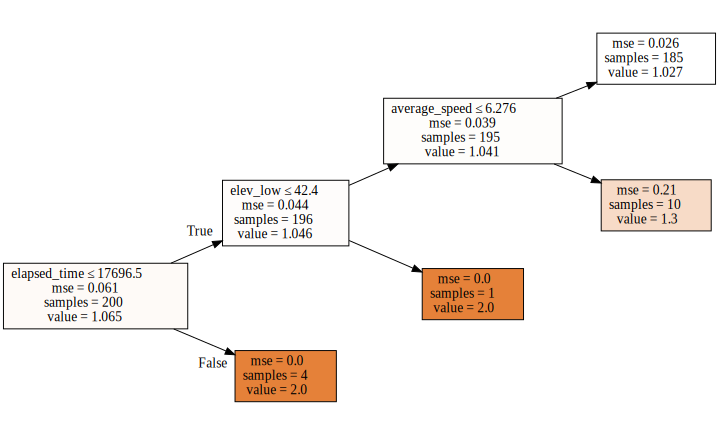


```python
fi = rf_feat_importance(m, df_trn); fi[:10]

```


<div>
<style scoped>
    .dataframe tbody tr th:only-of-type {
        vertical-align: middle;
    }

    .dataframe tbody tr th {
        vertical-align: top;
    }

    .dataframe thead th {
        text-align: right;
    }
</style>
<table border="1" class="dataframe">
  <thead>
    <tr style="text-align: right;">
      <th></th>
      <th>cols</th>
      <th>imp</th>
    </tr>
  </thead>
  <tbody>
    <tr>
      <th>11</th>
      <td>elapsed_time</td>
      <td>0.687509</td>
    </tr>
    <tr>
      <th>13</th>
      <td>elev_low</td>
      <td>0.176284</td>
    </tr>
    <tr>
      <th>3</th>
      <td>average_speed</td>
      <td>0.136206</td>
    </tr>
    <tr>
      <th>0</th>
      <td>achievement_count</td>
      <td>0.000000</td>
    </tr>
    <tr>
      <th>54</th>
      <td>start_date_localIs_month_end</td>
      <td>0.000000</td>
    </tr>
    <tr>
      <th>53</th>
      <td>start_date_localDayofyear</td>
      <td>0.000000</td>
    </tr>
    <tr>
      <th>52</th>
      <td>start_date_localDayofweek</td>
      <td>0.000000</td>
    </tr>
    <tr>
      <th>51</th>
      <td>start_date_localDay</td>
      <td>0.000000</td>
    </tr>
    <tr>
      <th>50</th>
      <td>start_date_localWeek</td>
      <td>0.000000</td>
    </tr>
    <tr>
      <th>49</th>
      <td>start_date_localMonth</td>
      <td>0.000000</td>
    </tr>
  </tbody>
</table>
</div>


```python
fi.plot('cols', 'imp', figsize=(10,6), legend=False);

```


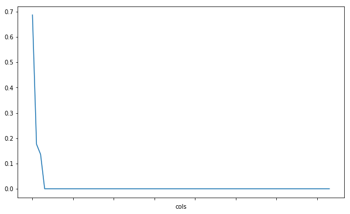


```python
def plot_fi(fi): return fi.plot('cols', 'imp', 'barh', figsize=(12,7), legend=False)
```


```python
plot_fi(fi[:30]);
```


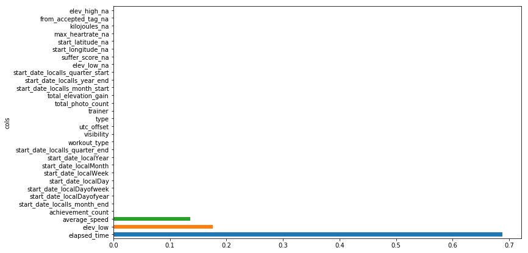


```python

```
